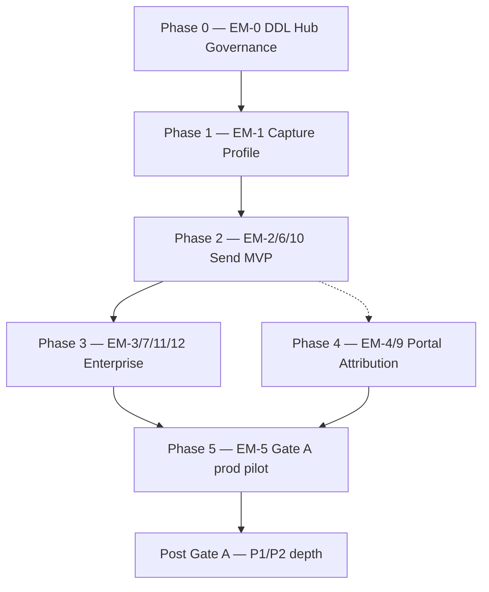

# Email Marketing — Roadmap hoàn thiện & đưa vào sử dụng

> **Phiên bản:** 1.0 · **Ngày:** 2026-07-25  
> **Canonical spec:** [`SPEC_EMAIL_MARKETING_OPERATING_SYSTEM.md`](SPEC_EMAIL_MARKETING_OPERATING_SYSTEM.md) v1.3 · [`SPEC_UI_UX_EMAIL_MARKETING.md`](SPEC_UI_UX_EMAIL_MARKETING.md) v1.3  
> **Kiến trúc:** [`specs/2026-07-19-email-marketing-architecture.md`](specs/2026-07-19-email-marketing-architecture.md)  
> **Migration:** [`SPEC_MIGRATION_FLASK_EXECUTION_PLAN.md`](SPEC_MIGRATION_FLASK_EXECUTION_PLAN.md) §7.3 (greenfield EM) · ADR-EM-10  
> **Ràng buộc:** **Không sử dụng Flask** cho staff Email — canonical UI = ops-web `/email/*`, API = Nest `email-marketing/`, workers = `ptt_email/`

---

## Mục lục

1. [Bối cảnh & trạng thái hiện tại](#1-bối-cảnh--trạng-thái-hiện-tại)
2. [Định nghĩa “hoàn thành”](#2-định-nghĩa-hoàn-thành)
3. [Sơ đồ phụ thuộc cascade](#3-sơ-đồ-phụ-thuộc-cascade)
4. [Phase 0 — Foundation (EM-0)](#phase-0--foundation-em-0)
5. [Phase 1 — Capture & Profile (EM-1)](#phase-1--capture--profile-em-1)
6. [Phase 2 — Send MVP (EM-2 + EM-6 + EM-10)](#phase-2--send-mvp-em-2--em-6--em-10)
7. [Phase 3 — Enterprise depth (EM-3 + EM-7 + EM-11/12)](#phase-3--enterprise-depth-em-3--em-7--em-1112)
8. [Phase 4 — Portal & Attribution (EM-4 + EM-9)](#phase-4--portal--attribution-em-4--em-9)
9. [Phase 5 — Prod pilot Gate A (EM-5)](#phase-5--prod-pilot-gate-a-em-5)
10. [Post Gate A — Backlog nâng cấp (P1/P2)](#post-gate-a--backlog-nâng-cấp-p1p2)
11. [Ma trận màn hình → Phase](#ma-trận-màn-hình--phase)
12. [Ma trận 12 lớp enterprise](#ma-trận-12-lớp-enterprise)
13. [MVP rút gọn go-live](#mvp-rút-gọn-go-live)
14. [Rủi ro & nguyên tắc vận hành](#rủi-ro--nguyên-tắc-vận-hành)
15. [Tài liệu & runbook liên quan](#tài-liệu--runbook-liên-quan)

---

## 1. Bối cảnh & trạng thái hiện tại

**Cập nhật 2026-07-25 (post EM-0 → EM-12 implementation track):**

| Lớp | Trạng thái |
|-----|------------|
| Staff UI ops-web `/email/*` | **21 routes** — E-01…E-13 + public pages |
| Nest `ptt-crm-api` `/api/v1/email/*` | Module `email-marketing/` ~50+ endpoints + `portal-email/` |
| Python `ptt_email/` | **18 modules** — send, journey, deliverability, BI, experiments |
| PostgreSQL `email_mkt.*` | DDL + migrations shipped |
| Portal client | P-EMAIL-01/02/03 — code ✅; flag prod off |
| Flask `/crm/email/*` | **Không từng tồn tại** admin trên PTTADS — nginx 302 → ops-web |
| **Feature code vs spec** | ~**85–90%** |
| **Prod-ready (Gate A)** | ~**35–45%** — soak, ESP thật, human sign-off chưa |

**Stack canonical:**

```
ops-web /email/*  →  Nest email-marketing  →  PG email_mkt.*
                         ↓                      ↑
                    ptt_worker + ptt_email  →  job_queue
                         ↓
                    ESP (SendGrid/Mailgun) + webhooks
```

**Khác SEO/Meta:** EM-OS là **greenfield** trên Next/Nest — **không có technical debt migrate Flask admin**. Gap chính là **prod ops** (pilot ESP, soak, docs) và **enterprise depth** (RFM, identity, governance write).

| Wave / track | Gate script | Trạng thái code |
|--------------|-------------|-----------------|
| EM-0 | `phase0_email_hub_kickoff_gate.sh` | ✅ |
| EM-1 | `phase1_email_ops_gate.sh` | ✅ ~85% |
| EM-2 | `phase2_email_send_mvp_gate.sh` | ✅ ~85% |
| EM-6 | `phase6_email_send_platform_gate.sh` | ✅ |
| EM-7 | `phase7_email_wave2_gate.sh` | ✅ |
| EM-8 / 8b | `phase8_email_wave3_gate.sh`, `phase8b_email_wave3b_gate.sh` | ✅ |
| EM-9 | `phase9_email_wave4_gate.sh` | ✅ |
| EM-10 | `tests/test_email_mkt_em10_send_hardening.py` | ✅ |
| EM-11 | `tests/test_email_mkt_em11_prod_ops.py` | ✅ |
| EM-12 | `phase12_email_automation_gate.sh` | ✅ |
| EM-5 Gate A | `phase5_email_prod_pilot_gate.sh` | 🟡 staging ready |

---

## 2. Định nghĩa “hoàn thành”

Hệ thống được coi là **hoàn thành và đưa vào sử dụng production** khi **đồng thời**:

1. Staff làm việc **100%** trên ops-web `/email/*` (E-01…E-13 theo [`SPEC_UI_UX_EMAIL_MARKETING.md`](SPEC_UI_UX_EMAIL_MARKETING.md) §5).
2. Nest expose **đủ API staff** — không proxy Flask; **không** tạo `/crm/email/*` admin.
3. **≥1 client pilot** gửi email **ESP thật** (SendGrid/Mailgun) qua send pipeline — không chỉ dry-run.
4. Portal pilot ≥1 client với `PTT_EMAIL_PORTAL_ENABLED=1` và approval E2E pass.
5. Workers/timers (send due, journey scan, CH export, deliverability) chạy ổn **≥7 ngày** soak.
6. **Gate A / EM-5** ký — [`runbooks/email-marketing-prod-pilot-checklist.md`](runbooks/email-marketing-prod-pilot-checklist.md).
7. Tài liệu vận hành (`huong-dan-email-marketing-ops.md`, training) cập nhật.
8. RBAC prod: 7 caps `crm_email_mkt_*` seeded trên PG.

---

## 3. Sơ đồ phụ thuộc cascade



**Quy tắc:**

- Code EM-0→EM-12 **đã merge** — phase 5 là **bật prod**, không rebuild platform.
- **Không** bật `PTT_EMAIL_SEND_ENABLED=1` trước khi consent/suppression + domain verify pilot OK.
- Portal + journeys: bật **sau** send MVP soak (staged cutover checklist §B).

---

## Phase 0 — Foundation (EM-0)

**Mục tiêu:** PostgreSQL schema, hub API, governance read-only, ops-web shell.

| # | Việc | Trạng thái | Done khi |
|---|------|------------|----------|
| 0.1 | Apply DDL `email_mkt.*` | ✅ | `deploy/sql/email_mkt_pg_schema.sql` applied |
| 0.2 | Nest `email-marketing/` hub + governance | ✅ | `GET /api/v1/email/hub`, `/governance` |
| 0.3 | ops-web E-01 hub, E-13 governance | ✅ | `/email/hub`, `/email/governance` |
| 0.4 | Gate EM-0 | ✅ | `./scripts/phase0_email_hub_kickoff_gate.sh` PASS |
| 0.5 | RBAC caps `crm_email_mkt_*` (7 actions) | 🟡 | Seed prod: `scripts/seed_staff_email_mkt_permissions.py` |
| 0.6 | Feature flags env templates | ✅ | `deploy/env.em5-prod.example`, `em9-wave4.example` |
| 0.7 | **`PTT_EMAIL_ENABLED=1` prod rollout** | ❌ | OpsNav hiện + hub load trên staging/prod |

**Gate:** `phase0_email_hub_kickoff_gate.sh` · pytest phase5 gates.

**Env:** `PTT_EMAIL_ENABLED`, `NEXT_PUBLIC_PTT_EMAIL_ENABLED`, `DATABASE_URL`, `PTT_EMAIL_DB=pg`.

---

## Phase 1 — Capture & Profile (EM-1)

**Mục tiêu:** Consent-first data foundation — contacts, capture, public preference pages.

| # | Việc | ops-web / API | Trạng thái |
|---|------|---------------|------------|
| 1.1 | Public preference center | `/email/public/preferences/:token` | ✅ |
| 1.2 | Unsubscribe + double opt-in confirm | PUB-02, PUB-03 | ✅ |
| 1.3 | Capture API | `POST /api/v1/email/capture` | ✅ |
| 1.4 | E-02 Clients list | `/email/clients` | ✅ |
| 1.5 | E-03 Client workspace + tabs | `/email/clients/:id` | ✅ |
| 1.6 | E-04 Contacts + import | `/email/contacts` | ✅ |
| 1.7 | E-05 Consent registry | `/email/consent` | ✅ |
| 1.8 | E-06 Suppression master | `/email/suppression` | ✅ |
| 1.9 | Workspaces CRUD | Nest `/workspaces` | ✅ |
| 1.10 | **Identity resolution v1** | CRM lead ↔ contact merge | ❌ |
| 1.11 | **Audit log UI tail** | E-13 mở rộng | 🟡 read-only rules only |

**Done criteria (prod):**

- 1 client workspace onboard: domain, ESP ref, from/reply, daily cap.
- Capture form → consent record → contact visible E-04.
- Public unsub SLA test < 24h.

**Gate:** `phase1_email_ops_gate.sh`.

---

## Phase 2 — Send MVP (EM-2 + EM-6 + EM-10)

**Mục tiêu:** Template → segment → campaign → preflight → approve → send (Flow F1).

| # | Việc | Trạng thái | Ghi chú |
|---|------|------------|---------|
| 2.1 | E-07 Segment builder (lifecycle + RFM + behavior) | ✅ | P1.2 tabs + compute |
| 2.2 | E-08/E-08b Template studio + blocks | 🟡 | Blocks/HTML; drag-drop defer |
| 2.3 | E-09 Campaign console | ✅ | |
| 2.4 | E-09b Campaign detail + schedule | ✅ | EM-10 schedule send |
| 2.5 | E-09c Preflight QA + staff approve | ✅ | EM-10 preflight v2 |
| 2.6 | Eligibility v1/v2 | ✅ | consent + suppression + cap + freq 7d + quiet hours |
| 2.7 | Send queue + `email_send_batch` job | ✅ | `ptt_email/sender.py` |
| 2.8 | ESP adapter SendGrid/Mailgun | ✅ | dry-run default dev |
| 2.9 | Webhook ingest engagement | ✅ | open/click/bounce/unsub |
| 2.10 | Temporal campaign approval | ✅ | staff + portal approve |
| 2.11 | **`PTT_EMAIL_SEND_ENABLED=1` prod** | ❌ | `deploy/env.em5-prod-send.example` |

**Done criteria (prod pilot):**

- 1 broadcast campaign: draft → preflight pass → approve → send → ESP delivery log.
- Bounce test → suppression auto.
- Complaint rate visible E-11 / hub.

**Gates:** `phase2_email_send_mvp_gate.sh`, `phase6_email_send_platform_gate.sh`, pytest `test_email_mkt_em10_*`.

---

## Phase 3 — Enterprise depth (EM-3 + EM-7 + EM-11/12)

**Mục tiêu:** Deliverability ops, BI, journeys, experiments.

| # | Việc | Trạng thái | Ghi chú |
|---|------|------------|---------|
| 3.1 | E-11 Deliverability console | ✅ | DNS verify, warm-up, pause domain |
| 3.2 | Bounce/complaint → suppression | ✅ | webhook + scan job |
| 3.3 | E-12 Reports + CH export | ✅ | `email_clickhouse_export` job |
| 3.4 | E-10 Journey CRUD + canvas | ✅ | `JourneyCanvasEditor` |
| 3.5 | Journey execution engine | ✅ | EM-11/12 `journey_engine.py` |
| 3.6 | A/B experiment (subject) | ✅ | EM-12 `CampaignExperimentPanel` |
| 3.7 | Grafana dashboard JSON | ✅ | `deploy/grafana/email-ops-dashboard.json` |
| 3.8 | **Grafana embed ops-web** | ❌ | JSON có; chưa iframe E-12 |
| 3.9 | **Slack/Teams deliverability alerts** | 🟡 | runbook có; chưa wire |
| 3.10 | **Send-time optimization v1** | ❌ | beyond quiet-hours defer |
| 3.11 | **Segment RFM / behavior** | ❌ | E-07 tab Phase 3 |
| 3.12 | **`PTT_EMAIL_JOURNEYS_ENABLED=1` prod** | ❌ | sau send MVP soak |

**Done criteria:**

- Journey pilot: enroll → wait → send → branch → exit (1 client).
- CH export 7d sample; reports match PG facts.
- Domain auth warn/block trên preflight prod.

**Gates:** `phase7_email_wave2_gate.sh`, `phase12_email_automation_gate.sh`, pytest EM-11/12.

---

## Phase 4 — Portal & Attribution (EM-4 + EM-9)

**Mục tiêu:** Client self-serve performance + approval inbox.

| # | Việc | Trạng thái | Ghi chú |
|---|------|------------|---------|
| 4.1 | Nest `portal-email` module | ✅ | |
| 4.2 | P-EMAIL-01 dashboard | ✅ | portal `/email` |
| 4.3 | P-EMAIL-02 approvals + preview iframe | ✅ | EM-9 |
| 4.4 | P-EMAIL-03 campaign performance | ✅ | |
| 4.5 | Revenue attribution KPI | ✅ | hub + reports proxy |
| 4.6 | Scheduled client reports | ✅ | pattern SEO EM-7 |
| 4.7 | **`PTT_EMAIL_PORTAL_ENABLED=1` prod** | ❌ | staged cutover |
| 4.8 | **Inbox placement monitoring** | ❌ | third-party seed test |

**Done criteria:**

- Client approver duyệt 1 campaign qua portal → Temporal execute.
- Client viewer xem KPI read-only; tenant isolation verified.

**Gate:** `phase4_email_portal_gate.sh`, `phase9_email_wave4_gate.sh`.

---

## Phase 5 — Prod pilot Gate A (EM-5)

**Mục tiêu:** Soak, ESP thật, human sign-off — **đưa vào vận hành chính thức**.

| # | Việc | Runbook / artifact | Trạng thái |
|---|------|-------------------|------------|
| 5.1 | Full regression gates EM-0→EM-12 | `email_mkt_full_regression_gate.sh` | 🟡 chạy trước cutover |
| 5.2 | Staged cutover flags | checklist §B1→B4 | ❌ |
| 5.3 | Pilot 1–2 client UUID + domain + ESP keys | checklist §A2 | ❌ |
| 5.4 | Soak ≥7 ngày | `phase5_email_soak_record.sh` daily | ❌ |
| 5.5 | Deliverability incident drill | [`email-deliverability-incident.md`](runbooks/email-deliverability-incident.md) | 🟡 |
| 5.6 | Human sign-off | `docs/evidence/em5-email-pilot-signoff.json` | ❌ |
| 5.7 | Horizon 0 pack (cross SEO+Email+Meta) | `horizon0_gate_a_pack.sh` | 🟡 |
| 5.8 | **Huong-dan vận hành VI** | `huong-dan-email-marketing-ops.md` | ✅ P1.6 |
| 5.9 | Playwright E2E ops-web email handoff | `email-handoff.spec.ts` + `email_handoff_gate.sh` | ✅ P0 |
| 5.10 | nginx `/crm/email` redirect verify | `nginx-rs-delivery-admin-retired.conf` | ✅ |

### Staged cutover thứ tự (prod)

```bash
# B1 — Ops admin only
PTT_EMAIL_ENABLED=1
PTT_EMAIL_SEND_ENABLED=0
PTT_EMAIL_JOURNEYS_ENABLED=0
PTT_EMAIL_PORTAL_ENABLED=0

# B2 — Send MVP (sau soak B1 ≥3d)
PTT_EMAIL_SEND_ENABLED=1
# + ESP keys per client_channel_accounts

# B3 — Portal (sau 1 campaign send OK)
PTT_EMAIL_PORTAL_ENABLED=1

# B4 — Journeys + experiments widen (sau portal E2E)
PTT_EMAIL_JOURNEYS_ENABLED=1
```

**Rollback:** `PTT_EMAIL_ENABLED=0` + rebuild ops-web (`NEXT_PUBLIC_PTT_EMAIL_ENABLED=0`).

---

## Post Gate A — Backlog nâng cấp (P1/P2)

Không chặn Gate A — lên kế hoạch sau prod pilot ổn định.

### P1 — UX parity & ops (4–6 tuần) ✅ 2026-07-25

| # | Hạng mục | Screen / module | Effort | Trạng thái |
|---|----------|-----------------|--------|------------|
| P1.1 | E-13 Governance **write** — CRUD policy, audit tail | E-13 + Nest API | M | ✅ |
| P1.2 | E-07 RFM + behavior segment tabs | SegmentBuilder | M | ✅ |
| P1.3 | Slack/Teams deliverability alerts | hub banner + job | S | ✅ |
| P1.4 | Grafana embed trên E-12 / hub | reports page | S | ✅ |
| P1.5 | Domain onboarding wizard (AM-friendly) | E-11 + workspace settings | M | ✅ |
| P1.6 | `huong-dan-email-marketing-ops.md` + checklist A4 + training PPT | docs | S | ✅ |
| P1.7 | Playwright E2E handoff gate | ops-web e2e + `email_p1_gate.sh` | M | ✅ |

**Gate:** `./scripts/email_p1_gate.sh` · pytest `tests/test_email_p1_qa.py`

### P2 — Enterprise depth (6–8 tuần)

| # | Hạng mục | Spec ref | Effort |
|---|----------|----------|--------|
| P2.1 | Identity resolution v1 — CRM lead merge | L3, Phase 1 | L |
| P2.2 | Send-time optimization v1 | L6, Phase 3 | M |
| P2.3 | Template drag-drop WYSIWYG | E-08, §12 #6 | L |
| P2.4 | Inbox placement monitoring integration | Phase 4 | M |
| P2.5 | AWS SES adapter | §8.1 ESP table | M |
| P2.6 | Quarterly audit workflow + CoE training | L12 operating model | S |
| P2.7 | Dedicated IP pool prod strategy | L8 | L |

---

## Ma trận màn hình → Phase

| ID | Màn | Route ops-web | Phase | Code | Prod |
|----|-----|---------------|-------|------|------|
| E-01 | Email Ops Hub | `/email/hub` | 0 | ✅ | 🟡 |
| E-02 | Client list | `/email/clients` | 1 | ✅ | 🟡 |
| E-03 | Client workspace | `/email/clients/:id` | 1 | ✅ | 🟡 |
| E-04 | Contacts | `/email/contacts` | 1 | ✅ | 🟡 |
| E-05 | Consent | `/email/consent` | 1 | ✅ | 🟡 |
| E-06 | Suppression | `/email/suppression` | 1 | ✅ | 🟡 |
| E-07 | Segments | `/email/segments` | 2 | ✅ | 🟡 |
| E-08 | Templates | `/email/templates` | 2 | 🟡 | 🟡 |
| E-08b | Template editor | `/email/templates/:id` | 2 | 🟡 | 🟡 |
| E-09 | Campaigns | `/email/campaigns` | 2 | ✅ | 🟡 |
| E-09b | Campaign detail | `/email/campaigns/:id` | 2 | ✅ | 🟡 |
| E-09c | Preflight review | `/email/campaigns/:id/review` | 2 | ✅ | 🟡 |
| E-10 | Journeys | `/email/journeys` | 3 | ✅ | ❌ |
| E-10b | Journey canvas | `/email/journeys/:id` | 3 | ✅ | ❌ |
| E-11 | Deliverability | `/email/deliverability` | 3 | ✅ | 🟡 |
| E-12 | Reports | `/email/reports` | 3 | ✅ | 🟡 |
| E-13 | Governance | `/email/governance` | 0→1 | 🟡 | 🟡 |
| P-EMAIL-01 | Portal dashboard | portal `/email` | 4 | ✅ | ❌ |
| P-EMAIL-02 | Portal approvals | portal `/email/approvals` | 4 | ✅ | ❌ |
| P-EMAIL-03 | Portal campaign | portal `/email/campaigns/:id` | 4 | ✅ | ❌ |
| PUB-01/02/03 | Public pages | `/email/public/*` | 1 | ✅ | 🟡 |

**Chú thích:** Code ✅ = shipped trên main; Prod 🟡 = cần flag + pilot; Prod ❌ = chưa bật prod.

---

## Ma trận 12 lớp enterprise

| Lớp | Spec §2 | Trạng thái | Backlog |
|-----|---------|------------|---------|
| L1 Acquisition | Paid/SEO → list | 🟡 Bridge CRM | Lookalike export |
| L2 Capture & Consent | Forms, preference | ✅ | Double opt-in prod verify all clients |
| L3 Data foundation | Profile, suppression | 🟡 | Identity resolution |
| L4 Governance | Rules, RBAC, audit | 🟡 | Write UI, audit tail |
| L5 Segmentation | Lifecycle, RFM | 🟡 | RFM, behavior, intent |
| L6 Orchestration | Broadcast, journey | ✅ | STO v1 |
| L7 Content | Templates, preflight | 🟡 | WYSIWYG drag-drop |
| L8 Sending | ESP, queue, warm-up | ✅ | SES, dedicated IP prod |
| L9 Deliverability | DNS, bounce | ✅ | Inbox placement |
| L10 Measurement | CH, attribution | ✅ | Grafana embed |
| L11 Client reporting | Portal | ✅ code | Prod pilot |
| L12 Operating model | CoE, incident | 🟡 | Alert automation, training |

---

## MVP rút gọn go-live

**Mục tiêu ~6–8 tuần prod pilot** — đủ agency gửi campaign có governance (bỏ journey/portal lần đầu nếu resource hạn chế):

| Thứ tự | Phase | Phạm vi |
|--------|-------|---------|
| 1 | P0 + P1 | RBAC prod + 1 workspace + capture/consent/contacts |
| 2 | P2 | 1 template + 1 segment + 1 campaign send ESP thật |
| 3 | P2 soak | 7 ngày send metrics + bounce handling |
| 4 | P5 | Gate A sign-off |
| 5 | P4 (optional) | Portal approve 1 client |
| 6 | P3 (defer) | Journeys, experiments, CH prod |

**Hoãn sau MVP:** RFM segments, drag-drop editor, inbox placement, AWS SES, identity resolution, journey prod.

---

## Rủi ro & nguyên tắc vận hành

| Rủi ro | Cách xử lý |
|--------|------------|
| Bật send prod trước domain verify | Preflight v2 + E-11 block; checklist §B2 |
| Bật portal + journeys cùng lúc | Staged cutover B1→B4 |
| Quay lại Flask cho email admin | **Cấm** — PTTADS không có blueprint; gate P5DA-G03 |
| ESP dry-run trên prod by mistake | `PTT_EMAIL_SEND_DRY_RUN=0` chỉ sau sign-off |
| Cap drift local dev vs prod PG | Seed `seed_staff_email_mkt_permissions.py` mỗi env |
| Complaint spike | Runbook incident + auto-pause domain E-11 |
| Marketing send qua SMTP Flask | Chỉ transactional legacy; bulk = ESP + worker |

**Pattern kỹ thuật (đã áp dụng):**

- Nest flat module `email-marketing/` + guards per cap (`staff-email-*.guard.ts`).
- Python `ptt_email/` — logic nặng send/journey/BI; Nest enqueue jobs.
- Feature flags + pilot client + wave gate scripts.
- ops-web `components/email/*` — design system PTT (`SPEC_UI_UX_PTT.md`).

**Không cần làm:**

- Migrate Flask email admin (không tồn tại).
- Port `PTT/tests/test_crm_email_*` — domain logic đã rewrite.

---

## Tài liệu & runbook liên quan

| Tài liệu | Nội dung |
|----------|----------|
| [`SPEC_EMAIL_MARKETING_OPERATING_SYSTEM.md`](SPEC_EMAIL_MARKETING_OPERATING_SYSTEM.md) | Master spec §1–§13 |
| [`SPEC_UI_UX_EMAIL_MARKETING.md`](SPEC_UI_UX_EMAIL_MARKETING.md) | E-01…E-13, wireframes, flows |
| [`specs/2026-07-19-email-marketing-architecture.md`](specs/2026-07-19-email-marketing-architecture.md) | C4, DDL, API, jobs |
| [`runbooks/email-marketing-prod-pilot-checklist.md`](runbooks/email-marketing-prod-pilot-checklist.md) | Gate A / EM-5 checklist |
| [`runbooks/email-deliverability-incident.md`](runbooks/email-deliverability-incident.md) | Incident response |
| [`runbooks/horizon0-gate-a-execution.md`](runbooks/horizon0-gate-a-execution.md) | Cross-module Gate A |
| [`deploy/env.em5-prod.example`](deploy/env.em5-prod.example) | Prod flags (send off) |
| [`deploy/env.em5-prod-send.example`](deploy/env.em5-prod-send.example) | Real ESP send |
| [`deploy/env.em9-wave4.example`](deploy/env.em9-wave4.example) | Portal + ops-web flags |
| [`docs/evidence/em5-email-pilot-signoff.template.json`](docs/evidence/em5-email-pilot-signoff.template.json) | Human sign-off template |
| [`SEO_AEO_COMPLETION_ROADMAP.md`](SEO_AEO_COMPLETION_ROADMAP.md) | Pattern roadmap tương tự |
| [`huong-dan-seo-aeo-ops.md`](huong-dan-seo-aeo-ops.md) | Mẫu hướng dẫn vận hành (EM chưa có) |

### Gate scripts (inventory)

| Script | Wave |
|--------|------|
| `phase0_email_hub_kickoff_gate.sh` | EM-0 |
| `phase1_email_ops_gate.sh` | EM-1 |
| `phase2_email_send_mvp_gate.sh` | EM-2 |
| `phase3_email_enterprise_gate.sh` | EM-3 |
| `phase4_email_portal_gate.sh` | EM-4 |
| `phase5_email_prod_pilot_gate.sh` | EM-5 |
| `email_handoff_gate.sh` | §13 handoff QA |
| `email_gate_a_cutover_gate.sh` | EM-5 Gate A full pack |
| `phase6_email_send_platform_gate.sh` | EM-6 |
| `phase7_email_wave2_gate.sh` | EM-7 |
| `phase8_email_wave3_gate.sh` | EM-8 |
| `phase8b_email_wave3b_gate.sh` | EM-8b |
| `phase9_email_wave4_gate.sh` | EM-9 |
| `phase12_email_automation_gate.sh` | EM-12 |
| `email_mkt_full_regression_gate.sh` | Full |

### Pytest (PTTADS)

`tests/test_email_mkt_em6.py`, `em7`, `em9`, `em10`, `em11`, `em12`, `phase5_gates.py`

---

*Roadmap này phản ánh codebase post EM-12 (2026-07-25). Cập nhật khi Gate A EM-5 được ký hoặc khi hoàn thành backlog P1/P2.*
