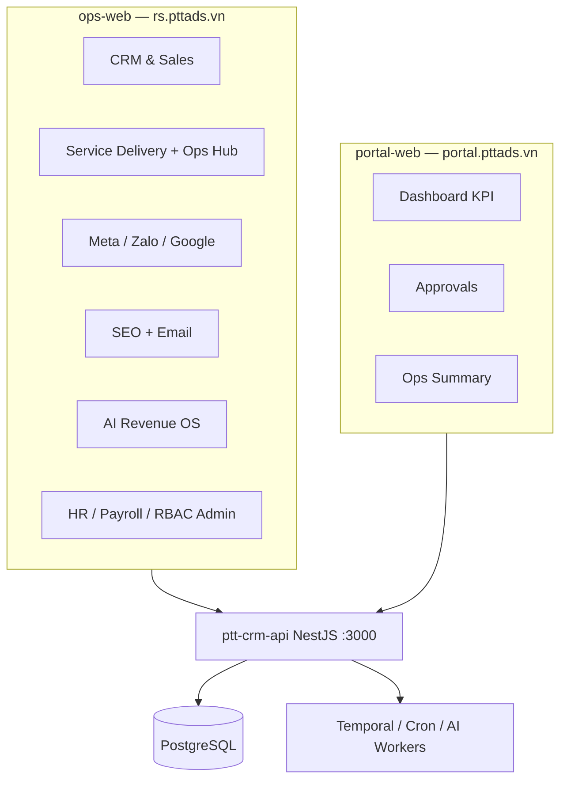

# RNOSAI — Tổng kết toàn bộ tính năng hệ thống

> **Cập nhật:** 2026-08-10  
> **Nguồn:** codebase `services/*`, `docs/specs/*`, BA Master Spec v2.3  
> **Mục đích:** Bản tra cứu nhanh mọi module, màn hình và API của Revenue Operating System + AI (PTT Agency)

> **Tách theo domain:** Xem thư mục [`docs/tong-ket-tinh-nang/`](./tong-ket-tinh-nang/README.md) — 15 file riêng (CRM, Ops DV, Meta, SEO, Email, …).

> **Hướng dẫn sử dụng:** [`docs/huong-dan-su-dung/`](./huong-dan-su-dung/README.md) — thao tác chi tiết từng domain.

---

## 1. Tổng quan

RNOSAI là nền tảng vận hành doanh thu và AI cho agency marketing PTT, gồm:

| Thành phần | URL / Port | Vai trò |
|------------|------------|---------|
| **ops-web** | `https://rs.pttads.vn` (:3200 dev) | Console nhân viên — CRM, Agency, Ads, SEO, Email, AI, HR |
| **portal-web** | `https://portal.pttads.vn` | Portal khách hàng — KPI, duyệt creative/content/email |
| **ptt-crm-api** | Port 3000 | NestJS monolith — toàn bộ API, auth, webhook, cron |
| **mobile-shell** | Capacitor | Wrapper native cho portal PWA (push, deep link) |
| **PostgreSQL** | `rnosaidb` | Dữ liệu chính (migration từ SQLite) |
| **Temporal / Jobs** | Worker | Campaign writes, agency jobs, SEO cron |

**Quy mô BA (Master Spec):** 129 màn hình (SCR), 157 use case (UC), 147 business rule (BR).

---

## 2. Kiến trúc module (MOD-*)

| Mã | Tên | Phạm vi chính |
|----|-----|----------------|
| **MOD-CRM** | CRM Core | Lead, khách hàng, sales, KPI, forecast, tài chính |
| **MOD-AGENCY** | Agency OS | Client onboard, ingest, jobs, lifecycle |
| **MOD-SVC** | Service Delivery | Triển khai DV, SOP, Launch QA, creative, campaign write |
| **MOD-META** | Meta Enterprise | Facebook/IG Ads, tracking, intelligence, ads-ops |
| **MOD-ZALO** | Zalo Ads OS | Zalo Ads hub, lead ingest, ads-ops |
| **MOD-SEO** | SEO/AEO Enterprise | Research, content, technical, governance, reports |
| **MOD-EM** | Email Marketing | Campaign, segment, journey, deliverability |
| **MOD-PORTAL** | Client Portal | Dashboard KPI, approvals, export |
| **MOD-AI** | AI Revenue OS | Copilot, score, forecast, automation, playbooks |
| **MOD-PLAT** | Platform | Auth, webhook, job queue, RBAC |
| **MOD-ADMIN** | Admin Console | AI runs/agents/tools, CRM config |
| **MOD-AUTH** | Authentication | Staff JWT / Keycloak SSO |
| **MOD-MOB** | Mobile | PWA + Capacitor + push |
| **MOD-CMKT** | Content Marketing OS | Content board, AI draft, repurpose (tab lifecycle) |
| **MOD-MKTP** | Marketing AI Planner | AI planner, multi-agent, KPI closed-loop |
| **MOD-OPS** | Ops DV OS | Catalog DV01–21, hub, spawn, KPI, agent, quote |

---

## 3. Ứng dụng & route tree

### 3.1 ops-web (~140 trang)

| Nhóm | Route mẫu | Tính năng |
|------|-----------|-----------|
| **Auth** | `/login`, `/login/mfa`, `/login/callback` | Đăng nhập staff, SSO, MFA |
| **Admin CRM** | `/admin/crm/org/*`, `/permissions/*`, `/pipeline`, `/custom-fields` | Org chart, RBAC, permission sets, simulator |
| **Admin AI** | `/admin/ai/agents`, `/runs`, `/tools` | Quản lý AI agents/tools |
| **Agency** | `/agency`, `/agency/clients/[id]`, `/ingest`, `/jobs` | Hub agency, client, ingest, job queue |
| **CRM Lead** | `/crm/leads`, `/crm/leads/[id]`, `/review-queue`, `/intake` | Lead B2B/SPA/operational, intake BANT |
| **CRM Sales** | `/crm/sales`, `/proposals`, `/orders`, `/customers` | Pipeline, báo giá, đơn hàng, KH |
| **CRM Finance** | `/crm/financials`, `/invoices`, `/forecast`, `/business-dashboard` | Công nợ, hóa đơn, forecast, GDKD |
| **CRM CSKH** | `/crm/tickets`, `/crm/cskh-board` | Ticket, board CSKH + SLA |
| **CRM KPI/HR** | `/crm/kpi`, `/staff-kpi`, `/hr`, `/payroll`, `/staff` | KPI NV, HR hub, payroll, roster |
| **Service Delivery** | `/crm/service-delivery`, `/[id]` | Kanban lifecycle 7 giai đoạn + tab nhúng |
| **Ops DV** | `/crm/ops/dashboard`, `/alerts`, `/my-tasks` | Dashboard AM/TL/SP/Exec, cảnh báo, task |
| **SOP & QA** | `/crm/sop`, `/launch-qa`, `/creatives`, `/campaign-writes` | SOP, Launch QA, Creative Hub, campaign write |
| **AI Staff** | `/crm/ai/insights`, `/query`, `/coach`, `/automation`, `/playbooks` | AI insights, NL query, coach, automation |
| **Meta** | `/meta/facebook-ads`, `/intelligence`, `/tracking`, `/ads-ops`, `/migration` | Meta hub, intelligence, pixel/CAPI, launch |
| **Zalo** | `/zalo/zalo-ads`, `/zalo/leads` | Zalo Ads + lead inbox |
| **Google** | `/google/google-ads` | Google Ads insights |
| **SEO** | `/seo/hub`, `/clients`, `/content`, `/technical`, `/reports`, `/aeo`, … | Full SEO/AEO stack (15+ sub-route) |
| **Email** | `/email/hub`, `/campaigns`, `/journeys`, `/gate-a`, `/deliverability`, … | Email marketing stack |
| **Khác** | `/crm/re-projects`, `/owner-weekly`, `/catalog`, `/health` | BĐS, owner weekly, catalog, health |

**Tab nhúng trong `/crm/service-delivery/[id]`** (không có route riêng):

- **Ops Hub** — catalog DV, checklist tuần, KPI, cảnh báo, engine links
- **Content OS** — ideas, kanban, calendar, AI draft, repurpose, media
- **AI Planner** — strategy, budget, KPI tree, apply TMMT, optimize
- **Launch QA**, **SOP**, **Finance**, **TMMT**, v.v.

### 3.2 portal-web (21 trang)

| Route | Tính năng |
|-------|-----------|
| `/dashboard` | Tổng quan KPI đa kênh + card MKT-AI, Content, Ops DV |
| `/creatives` | Duyệt creative (approve/reject) |
| `/notifications` | Thông báo in-app + push |
| `/service-delivery` | Tiến độ triển khai DV + KPI tháng (read-only) |
| `/meta`, `/google`, `/zalo` | KPI từng kênh quảng cáo |
| `/seo`, `/seo/content`, `/seo/reports` | SEO dashboard + duyệt content |
| `/email`, `/email/approvals`, `/email/campaigns/[id]` | Email dashboard + duyệt campaign |
| `/settings` | Tài khoản, branding, push |
| `/login`, `/forgot-password`, `/reset-password` | Auth portal JWT / Keycloak |

---

## 4. Chi tiết tính năng theo domain

> **File riêng:** Mỗi domain có file chi tiết trong [`docs/tong-ket-tinh-nang/`](./tong-ket-tinh-nang/README.md).

| Domain | File |
|--------|------|
| Nền tảng & RBAC | [01-nen-tang-platform.md](./tong-ket-tinh-nang/01-nen-tang-platform.md) |
| CRM Core | [02-crm-core.md](./tong-ket-tinh-nang/02-crm-core.md) |
| Agency & SVC | [03-agency-service-delivery.md](./tong-ket-tinh-nang/03-agency-service-delivery.md) |
| Ops DV | [04-ops-dv.md](./tong-ket-tinh-nang/04-ops-dv.md) |
| Meta Ads | [05-meta-ads.md](./tong-ket-tinh-nang/05-meta-ads.md) |
| Zalo Ads | [06-zalo-ads.md](./tong-ket-tinh-nang/06-zalo-ads.md) |
| Google Ads | [07-google-ads.md](./tong-ket-tinh-nang/07-google-ads.md) |
| SEO / AEO | [08-seo-aeo.md](./tong-ket-tinh-nang/08-seo-aeo.md) |
| Email Marketing | [09-email-marketing.md](./tong-ket-tinh-nang/09-email-marketing.md) |
| Content OS | [10-content-marketing.md](./tong-ket-tinh-nang/10-content-marketing.md) |
| MKT-AI Planner | [11-marketing-ai-planner.md](./tong-ket-tinh-nang/11-marketing-ai-planner.md) |
| AI Revenue OS | [12-ai-revenue-os.md](./tong-ket-tinh-nang/12-ai-revenue-os.md) |
| HR & Payroll | [13-hr-payroll.md](./tong-ket-tinh-nang/13-hr-payroll.md) |
| Client Portal | [14-client-portal.md](./tong-ket-tinh-nang/14-client-portal.md) |
| Mobile | [15-mobile.md](./tong-ket-tinh-nang/15-mobile.md) |

### 4.1 Nền tảng & bảo mật (MOD-PLAT, MOD-AUTH, MOD-ADMIN)

- Đăng nhập staff JWT + refresh; Keycloak SSO (WIN-4)
- RBAC ma trận section/action (`crm_board`, `crm_leads`, …)
- Permission Sets, Simulator, Break-glass access
- Org chart: phòng ban, team, chức vụ, user
- SSO group mapping → caps
- Client scope pilot (giới hạn client theo NV)
- Policy / OPA hook (enterprise)
- Global search cross-entity
- Webhook ingest Meta/Zalo/Google/Email
- Health, metrics, observability
- Admin AI: agents registry, run history, tools

**API:** `/api/v1/staff/*`, `/api/v1/policy`, `/api/v1/search`, `/api/v1/webhooks/*`

---

### 4.2 CRM Core (MOD-CRM)

| Tính năng | Mô tả |
|-----------|-------|
| Lead Management | CRUD lead, funnel B2B/SPA/operational, review queue |
| Pre-sales on Lead | Consult → contract trước lifecycle (`PTT_PRESALES_ON_LEAD`) |
| Intake / BANT | Form khám phá có cấu trúc |
| Customers 360 | Khách hàng sau convert + timeline |
| Sales Pipeline | Cơ hội, stage, forecast cơ bản |
| Proposals / Quote | Báo giá; Quote Builder Ops DV 3 gói (INT-P2) |
| Orders & Invoices | Đơn hàng, hóa đơn |
| Finance / AR Aging | Công nợ, aging theo AM |
| Forecast & Renewal | Revenue forecast, MAPE, renewal agent |
| GDKD / Business Dashboard | Dashboard điều hành |
| CSKH Board | Ticket board + SLA export Excel |
| Staff KPI | KPI cá nhân AM/SP |
| Solution KPI / Queue | KPI solution team + hàng chờ handoff |
| Catalog | Danh mục dịch vụ CRM |
| RE Projects | Dự án bất động sản |
| Owner Weekly | Báo cáo tuần chủ sở hữu |
| Marketing Plans | Kế hoạch marketing (legacy, khác MKT-AI) |

**API:** `/api/v1/leads`, `/api/crm/*`, `/api/crm/proposals`, `/api/crm/finance`, `/api/crm/kpi`

---

### 4.3 Agency & Triển khai dịch vụ (MOD-AGENCY, MOD-SVC)

| Tính năng | Mô tả |
|-----------|-------|
| Agency Hub | Quản lý đa client |
| Client Management | CRUD client, owner AM, industry |
| Ingest Monitor | Theo dõi ingest lead/data |
| Agency Jobs | Queue job Temporal |
| KPI Definitions | Định nghĩa KPI agency-level |
| **Service Lifecycle** | 7 giai đoạn: lead → onboard → deliver → handover → retain |
| Launch QA | Checklist pre-launch, bridge Meta/Zalo/creative |
| SOP Library | Template + run quy trình |
| Campaign Write Queue | Ghi campaign Meta/Zalo qua Temporal |
| Creative Hub | Registry creative + portal approval |
| Service Finance | Billing/margin theo lifecycle |
| Channel Report Schedules | Lịch báo cáo Meta/Zalo |
| Performance Metrics | CPL, spend, ROAS cross-channel |

**API:** `/api/v1/clients`, `/api/crm/service-lifecycle`, `/api/crm/launch-qa`, `/api/crm/sop`, `/api/v1/campaign-writes`, `/api/v1/performance`

---

### 4.4 Ops DV — Operations Delivery OS (MOD-OPS)

> Trạng thái: **~85%** — staging INT-P1→P4 @ commit `2f7ef76`

| Tính năng | Mô tả | API / Route |
|-----------|-------|-------------|
| Catalog DV01–21 | Profile 21 dịch vụ, readiness, route map | `GET /api/ops/catalog` |
| Ops Hub | Header, engine grid, weekly, KPI, alerts | Tab `ops-hub` · `GET /api/ops/lifecycle/:id/hub` |
| Spawn checklist tuần | Sinh task idempotent theo template | `POST /api/ops/lifecycle/:id/spawn-week` |
| KPI record + nhãn | Đạt / Cần chú ý / Không đạt (BR-OPS-KPI-01) | `GET/PUT /api/ops/lifecycle/:id/kpi` |
| Quote Builder | Báo giá 3 gói, export PDF/DOCX, accept → lifecycle | `/crm/proposals` wizard |
| Ops Agent (L2) | Scan task due/overdue + KPI → alert log | `POST /api/ops/agent/run` |
| Alert center | List/ack cảnh báo | `/crm/ops/alerts` |
| Dashboard vai trò | AM, Team Lead, Specialist, Executive | `/crm/ops/dashboard` |
| Portal Ops Summary | KPI lifecycle cho khách (read-only) | portal `/service-delivery` · `/api/v1/portal/ops/*` |

**Pilot DV:** DV02, DV05, DV04, DV20

**Flags:** `PTT_OPS_DV_ENABLED`, `PTT_OPS_WEEKLY_SPAWN`, `PTT_OPS_AGENT_ENABLED`, `PTT_OPS_PORTAL_SUMMARY`

---

### 4.5 Meta / Facebook Ads (MOD-META)

| Tính năng | Mô tả |
|-----------|-------|
| Facebook Ads Hub | Tổng quan campaign |
| Meta Intelligence | Anomaly, ROAS forecast, pixel health |
| Tracking / Pixel / CAPI | Conversion rules, pixel test |
| Ads Ops | Launch/edit campaign (write ops) |
| Ads Combined | View đa kênh |
| Meta Alerts | Inbox cảnh báo spend/CPL |
| Meta Compliance | Kiểm tra policy |
| Creative Registry | Link creative ↔ campaign |
| API Migration | Tool migrate Graph API version |

**API:** `/api/v1/meta/*` · **Portal:** `/meta`

---

### 4.6 Zalo Ads (MOD-ZALO)

| Tính năng | Mô tả |
|-----------|-------|
| Zalo Ads Hub | Campaign insights |
| Zalo Leads Inbox | Lead ingest từ Zalo |
| Zalo Ads Ops | Campaign write operations |
| Zalo Tracking | Tích hợp Launch QA |

**API:** `/api/v1/zalo/*` · **Portal:** `/zalo`

---

### 4.7 Google Ads

| Tính năng | Mô tả |
|-----------|-------|
| Google Ads Hub | Insights sync OAuth |
| Portal summary | KPI read-only cho client |

**Route:** `/google/google-ads` · **Portal:** `/google`

---

### 4.8 SEO / AEO Enterprise (MOD-SEO)

| Tính năng | Route ops-web |
|-----------|---------------|
| SEO Hub | `/seo/hub` |
| Client workspace | `/seo/clients/[id]` |
| Research | `/seo/research` |
| Content pipeline | `/seo/content`, `/seo/content/[id]` |
| Technical SEO | `/seo/technical` |
| Strategy | `/seo/strategy` |
| Governance | `/seo/governance` |
| Gate A | `/seo/gate-a` |
| Reports | `/seo/reports` |
| AEO | `/seo/aeo` |
| Authority / Ranks | `/seo/authority`, `/seo/ranks` |
| Automations / Freshness | `/seo/automations`, `/seo/freshness` |
| Experiments | `/seo/experiments` (flag off mặc định) |
| BI / CMS | `/seo/bi`, `/seo/cms` |
| Portal SEO | `/seo`, `/seo/content`, `/seo/reports` + duyệt content |

**API:** `/api/v1/seo/*`, `/api/v1/portal/seo/*`, `/api/v1/seo/cron`

---

### 4.9 Email Marketing (MOD-EM)

| Tính năng | Route |
|-----------|-------|
| Email Hub | `/email/hub`, `/email` |
| Campaigns | `/email/campaigns`, `/[id]`, `/[id]/review` |
| Contacts & Segments | `/email/contacts`, `/segments` |
| Templates | `/email/templates/[id]` |
| Journeys (drip) | `/email/journeys/[id]` |
| Governance & Gate A | `/email/governance`, `/gate-a` |
| Deliverability | `/email/deliverability` |
| Reports | `/email/reports` |
| Suppression & Consent | `/email/suppression`, `/consent` |
| Client workspace | `/email/clients/[id]` |
| Public pages | unsubscribe, preferences, confirm |
| Portal | `/email`, `/email/approvals`, campaign view |

**API:** `/api/v1/email/*`, `/api/v1/portal/email/*`

---

### 4.10 Content Marketing OS (MOD-CMKT)

| Tính năng | Mô tả |
|-----------|-------|
| Content Board | Ideas, kanban, calendar trong tab `content-os` |
| AI Draft | Sinh nội dung theo brief/DV |
| Dual approval | Text + visual QA gate |
| Repurpose Wizard | Đa kênh từ 1 nguồn |
| SEO / Email bridge | Đẩy content sang module SEO/EM |
| Media AI | Image/carousel (stub provider) |
| Portal summary | Tóm tắt + duyệt content client |

**API:** `/api/crm/service-lifecycle/:id/content-marketing/*`  
**Portal:** `/api/v1/portal/service-lifecycle/:id/content-summary`

**Trạng thái:** Backend ~90%, FE ~65%, UAT formal chưa PASS

---

### 4.11 Marketing AI Planner (MOD-MKTP)

| Tính năng | Mô tả |
|-----------|-------|
| AI Planner wizard | Strategy, budget sim, KPI tree, calendar |
| Multi-agent pipeline | Async orchestration |
| Plan approval + TMMT apply | Apply kế hoạch vào marketing plan |
| KPI closed-loop | CPL/ROAS drift alerts |
| Playbooks admin | Registry playbook MKT-AI |
| Portal plan summary | Tóm tắt kế hoạch cho khách |
| CPL Digest (staff) | Manager coach digest |

**API:** `/api/crm/service-lifecycle/:id/ai-planner/*`  
**Tab:** `ai-planner` trong service-delivery detail

---

### 4.12 AI Revenue OS (MOD-AI)

| Tính năng | Route / API |
|-----------|-------------|
| AI Insights / Lead scoring | `/crm/ai/insights` · `/api/v1/ai/*` |
| NL Analytics Query | `/crm/ai/query` |
| Manager Coach | `/crm/ai/coach` |
| Automation Workflows | `/crm/automation` |
| Playbook RAG | `/crm/playbooks` |
| Renewal / Churn / Upsell agents | Orchestrator backend |
| Portal AI Reports | `/api/v1/portal/ai` |

---

### 4.13 HR & Payroll (WIN Program)

| Tính năng | Route |
|-----------|-------|
| HR Hub | `/crm/hr` |
| Leave (lite) | `/crm/hr/leave` |
| Payroll admin | `/crm/payroll` |
| Payslip self-service | `/crm/payroll/me` |

**API:** `/api/v1/hr/leave`, `/api/crm/payroll`, `/api/v1/payroll/me`

---

### 4.14 Client Portal (MOD-PORTAL)

| Tính năng | Mô tả |
|-----------|-------|
| Dashboard KPI | Meta/Google/Zalo + module cards |
| Creative approval | Sync ops-web closed-loop |
| SEO content review | Duyệt bài SEO |
| Email approval | Duyệt campaign (role approver) |
| Notifications + Web Push | In-app + PWA push |
| Settings / Branding | Profile, logo, push prefs |
| Mobile Capacitor | Native shell + FCM/APNs |
| Privacy | Trang privacy/GDPR |

---

### 4.15 Mobile (MOD-MOB)

- Portal PWA installable (`NEXT_PUBLIC_PWA_ENABLED`)
- Capacitor iOS/Android wrapper
- Native push (`PTT_MOBILE_NATIVE_PUSH_ENABLED`)
- Deep links `pttads://approve/{id}`

---

## 5. Backend API — tổng hợp prefix

| Prefix | Domain |
|--------|--------|
| `/api/v1/leads`, `/api/v1/contracts` | Lead, contract, agency client |
| `/api/crm/*` | CRM legacy paths (customers, lifecycle, payroll, …) |
| `/api/v1/staff/*` | Auth, permissions, org, notifications |
| `/api/v1/portal/*` | Portal auth, SEO, email, AI, ops, push |
| `/api/v1/meta/*` | Meta tracking, intelligence, ads-ops |
| `/api/v1/zalo/*` | Zalo leads, ads-ops |
| `/api/v1/seo/*` | SEO/AEO full stack + cron |
| `/api/v1/email/*` | Email marketing + public pages |
| `/api/v1/ai/*` | AI intelligence, playbooks, orchestrator |
| `/api/v1/clients` | Agency client CRUD |
| `/api/v1/creatives`, `/api/v1/campaign-writes` | Creative & campaign writes |
| `/api/ops/*` | Ops DV catalog, hub, spawn, KPI, alerts, dashboard |
| `/api/crm/proposals/*` | Quote builder + line items |
| `/health` | Health check |

**Nest modules:** 90+ module trong `services/ptt-crm-api/src/` (crm, meta, seo, email, ops, portal-*, content-marketing, marketing-ai-planner, ai-intelligence, …)

---

## 6. Feature flags quan trọng

### Ops DV
```
PTT_OPS_DV_ENABLED=1
PTT_OPS_WEEKLY_SPAWN=1
PTT_OPS_AGENT_ENABLED=1
PTT_OPS_PORTAL_SUMMARY=1
PTT_OPS_HUB_PILOT_DV=DV02,DV05,DV04,DV20
NEXT_PUBLIC_OPS_DV=1
NEXT_PUBLIC_OPS_PORTAL_SUMMARY=1
```

### Content Marketing
```
PTT_CONTENT_MARKETING_ENABLED=1
NEXT_PUBLIC_CONTENT_MARKETING=1
PTT_CONTENT_MARKETING_AI_ENABLED=1
PTT_CMKT_PORTAL_SUMMARY=1
```

### Marketing AI Planner
```
PTT_MKT_AI_PLANNER_ENABLED=1
NEXT_PUBLIC_MKT_AI_PLANNER=1
PTT_MKT_AI_PORTAL_SUMMARY=1
PTT_MKT_AI_KPI_ALERT_ENABLED=1
```

### Meta / Zalo / Google
```
PTT_META_TRACKING_ENABLED=1
PTT_META_ADS_OPS_ENABLED=1
PTT_ZALO_ADS_OPS_ENABLED=1
PTT_GOOGLE_INSIGHTS_SYNC=1
```

### WIN Program (RBAC/HR)
```
NEXT_PUBLIC_WIN_ORG_UI=1
NEXT_PUBLIC_WIN_PERMISSION_SETS=1
NEXT_PUBLIC_WIN_SIMULATOR=1
NEXT_PUBLIC_WIN_SSO=1
NEXT_PUBLIC_WIN_LEAVE_LITE=1
```

**Tham khảo đầy đủ:** `deploy/env.*.example` (56 file), `deploy/runtime.env`

---

## 7. Trạng thái triển khai (milestone)

| Milestone | Nội dung | Trạng thái |
|-----------|----------|------------|
| **Ops-M0** | Catalog + Hub read-only | ✅ Staging |
| **INT-P1** | Spawn tuần + KPI + nhãn | ✅ Staging |
| **INT-P2** | Quote Builder 3 gói | ✅ Staging |
| **INT-P3** | Ops Agent + alerts + dashboards | ✅ Staging @ `0181782` |
| **INT-P4** | Portal lifecycle KPI | ✅ Staging @ `2f7ef76` |
| **CMKT M0–M6** | Content OS | ⚠️ ~65% FE, UAT pending |
| **MKT-AI** | AI Planner phased | ✅ Partial staging |
| **WIN-1** | PWA + Excel + RBAC UI | ✅ Pass (19/19) |
| **WIN-3** | Permission sets, forecast, break-glass | ✅ Automated PASS |
| **WIN-4** | SSO, OPA, field ABAC | ⬜ Draft |
| **Flask monolith** | Legacy Python CRM | 🔴 HTTP retired → Nest |

---

## 8. Chương trình WIN (Competitive)

| Wave | Focus |
|------|-------|
| WIN-0 | Foundation HR Hub + R1 RBAC |
| WIN-1 | Table stakes + PWA mobile + Excel export |
| WIN-2 | Moat + HR UI + org chart |
| WIN-3 | Enterprise RBAC, permission sets, forecast |
| WIN-4 | SSO Keycloak, OPA policy, field-level ABAC |

---

## 9. Tài liệu tham chiếu

| File | Nội dung |
|------|----------|
| `docs/specs/RNOSAI-BA-Master-Spec.md` | BA master — 129 SCR, 157 UC, 147 BR |
| `docs/SPEC_RNOSAI_MASTER.md` | System master spec |
| `docs/specs/modules/RNOSAI-BA-*-UseCases.md` | Annex UC từng module (11 file) |
| `docs/specs/2026-08-10-ptt-ops-rnosai-integration-spec.md` | Ops DV integration INT-P0→P4 |
| `docs/superpowers/specs/2026-08-10-ptt-ops-dv-implementation-status.md` | Trạng thái Ops DV |
| `docs/superpowers/specs/2026-08-09-content-marketing-implementation-status.md` | Trạng thái Content OS |
| `docs/specs/2026-08-07-rnosai-competitive-win-master-spec.md` | WIN program master |
| `docs/handover/README.md` | Bàn giao khách hàng |
| `docs/runbooks/rnosai-vps-operations-guide.md` | VPS operations |
| `docs/use-cases/README.md` | Index use case 01–11 |
| `REPO.md` | Quick links repo |

---

## 10. Sơ đồ luồng tổng quan



---

*Tài liệu này tổng hợp từ codebase và spec tính đến 2026-08-10. Chi tiết từng UC/BR xem BA Master Spec và module annexes.*
