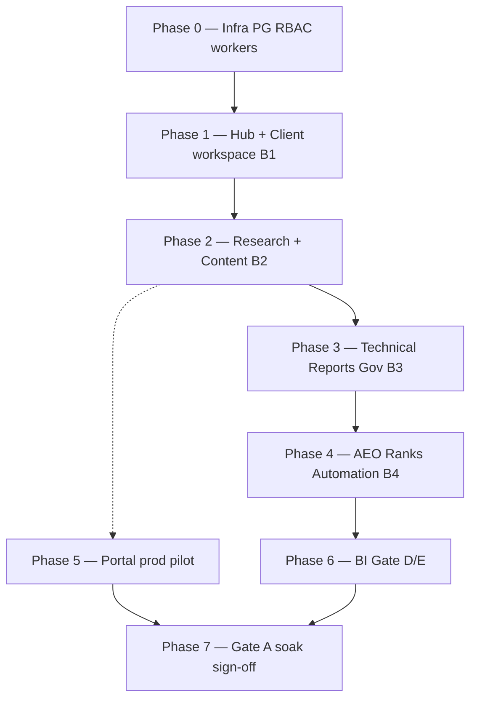

# SEO/AEO — Roadmap hoàn thiện & đưa vào sử dụng

> **Phiên bản:** 1.0 · **Ngày:** 2026-07-25  
> **Canonical spec:** [`SPEC_SEO_AEO_OPERATING_SYSTEM.md`](SPEC_SEO_AEO_OPERATING_SYSTEM.md) · [`SPEC_UI_UX_SEO_AEO.md`](SPEC_UI_UX_SEO_AEO.md)  
> **Migration:** [`SPEC_MIGRATION_FLASK_EXECUTION_PLAN.md`](SPEC_MIGRATION_FLASK_EXECUTION_PLAN.md) §9 (Phase 4 ops-web)  
> **Ràng buộc:** **Không sử dụng Flask** cho staff SEO/AEO — canonical UI = ops-web `/seo/*`, API = Nest `ptt-crm-api`

---

## Mục lục

1. [Bối cảnh & trạng thái hiện tại](#1-bối-cảnh--trạng-thái-hiện-tại)
2. [Định nghĩa “hoàn thành”](#2-định-nghĩa-hoàn-thành)
3. [Sơ đồ phụ thuộc cascade](#3-sơ-đồ-phụ-thuộc-cascade)
4. [Phase 0 — Nền tảng vận hành](#phase-0--nền-tảng-vận-hành-12-tuần)
5. [Phase 1 — Staff UI tối thiểu (B1)](#phase-1--staff-ui-tối-thiểu-usable-b1-34-tuần)
6. [Phase 2 — Vòng sản xuất nội dung (B2)](#phase-2--vòng-sản-xuất-nội-dung-b2-46-tuần)
7. [Phase 3 — Kỹ thuật + báo cáo + governance (B3)](#phase-3--kỹ-thuật--báo-cáo--governance-b3-34-tuần)
8. [Phase 4 — AEO + automation + rank (B4)](#phase-4--aeo--automation--rank-b4-34-tuần)
9. [Phase 5 — Client portal prod](#phase-5--client-portal-prod-23-tuần)
10. [Phase 6 — BI + infra enterprise (Gate D/E)](#phase-6--bi--infra-enterprise-gate-de-23-tuần)
11. [Phase 7 — Gate A go-live](#phase-7--gate-a-go-live--vận-hành-chính-thức-24-tuần-soak)
12. [MVP rút gọn (8–10 tuần)](#mvp-rút-gọn-nếu-resource-hạn-chế)
13. [Rủi ro & nguyên tắc vận hành](#rủi-ro--nguyên-tắc-vận-hành)
14. [Tài liệu & runbook liên quan](#tài-liệu--runbook-liên-quan)

---

## 1. Bối cảnh & trạng thái hiện tại

**Cập nhật 2026-07-25 (post B7 + P0/P1/P2 hardening):**

| Lớp | Trạng thái |
|-----|------------|
| Staff UI ops-web `/seo/*` | ~19 routes — S-01…S-17 + Gate A + BI/CMS |
| Nest `ptt-crm-api` `/api/v1/seo/*` | Modules đầy đủ; không proxy Flask |
| Python `ptt_seo/` | Domain/worker layer (64 modules) |
| Flask `/crm/seo/*` | Retired — nginx redirect only |
| **Feature code vs spec** | ~90–95% |
| **Prod-ready** | ~60–70% — soak, Gate A sign-off, VPS infra |

Canonical routes: `/seo/hub`, `/seo/clients/[id]`, … (không còn `/crm/seo/*` staff).

| Lớp | % vs spec | Ghi chú |
|-----|-----------|---------|
| Domain Python `ptt_seo/` + PG `seo_aeo.*` | ~85–90% | 64 module, workers, cron, tests |
| Portal client (`portal-web` + `portal-seo`) | ~80% | P-SEO-01/02; flag `PTT_PORTAL_SEO_ENABLED` |
| Nest staff API | ~5% | Chỉ `GET /api/v1/seo/hub`, `GET /api/v1/seo/clients` |
| ops-web staff UI | ~10–15% | `/seo/hub`, `/seo/clients` (partial S-01, S-02) |
| Flask HTTP `/crm/seo/*` | Retired | Blueprint/templates không còn trong repo |

**Gap chính khi bỏ Flask:** staff thiếu ~15 màn hình (S-03…S-17). Domain logic đã có; cần **port HTTP + UI** sang Nest + ops-web theo [`SPEC_MIGRATION_FLASK_EXECUTION_PLAN.md`](SPEC_MIGRATION_FLASK_EXECUTION_PLAN.md) §9.1 (batch B1–B4).

---

## 2. Định nghĩa “hoàn thành”

Hệ thống được coi là **hoàn thành và đưa vào sử dụng** khi **đồng thời**:

1. Staff làm việc **100%** trên ops-web `/seo/*` (≥15 màn theo [`SPEC_UI_UX_SEO_AEO.md`](SPEC_UI_UX_SEO_AEO.md) §5).
2. Nest expose **đủ API staff** — không proxy Flask.
3. Portal pilot ≥1 client với `PTT_PORTAL_SEO_ENABLED=1` và content review E2E pass.
4. Workers/timers (GSC, GA4, freshness, …) chạy ổn **≥7 ngày** soak.
5. **Gate A** ký — [`runbooks/phase5-prod-signoff-checklist.md`](runbooks/phase5-prod-signoff-checklist.md).
6. Tài liệu vận hành cập nhật (routes ops-web, flags, runbook).
7. **Không** traffic staff phụ thuộc Flask SEO.

---

## 3. Sơ đồ phụ thuộc cascade

**Quy tắc:** Mỗi phase có gate riêng; **không nhảy phase** khi gate trước chưa pass.

---

## Phase 0 — Nền tảng vận hành (1–2 tuần)

**Mục tiêu:** PostgreSQL, worker, RBAC, sync cơ bản — sẵn sàng trước khi build UI.

| # | Việc cần làm | Done khi |
|---|--------------|----------|
| 0.1 | Apply DDL PG `seo_aeo.*` (base → P2 → P3 → Gate D → Gate E) | `\dt seo_aeo.*` đủ bảng |
| 0.2 | Scripts: `apply_seo_gate_d_schema.sh`, `apply_seo_gate_e_schema.sh` (nếu chưa) | Gate schema pass |
| 0.3 | Env: `DATABASE_URL`, `SEO_AEO_DB=pg`, worker `ptt-worker` active | Job consume OK |
| 0.4 | Seed caps staff: 6 keys `crm_seo_aeo_*` — [`admin_page_permissions.py`](../admin_page_permissions.py), [`ptt_seo/rbac.py`](../ptt_seo/rbac.py) | MKT-01/02, KD-01 có quyền |
| 0.5 | **Thống nhất RBAC Nest ↔ spec:** guards `crm_seo_aeo_*` (không chỉ `crm_seo`) | 403 đúng role trên API |
| 0.6 | Bật timers: GSC sync, GA4 sync (`deploy/ptt-seo-gsc-sync.timer`, `ptt-seo-ga4-sync.timer`) | Sync log có row mới |
| 0.7 | Pilot 1–2 client: `seo_client_settings` + `seo_portal_client_map` | `GET /api/v1/seo/hub` ≠ empty |

**Gate gợi ý:** `./scripts/phase4_seo_hub_kickoff_gate.sh` · pytest `test_seo_aeo_pg_cutover*.py`.

**Env tham chiếu:** `deploy/env.meta-enterprise-b*.example` pattern → tạo `deploy/env.seo-aeo-pilot.example` nếu chưa có.

---

## Phase 1 — Staff UI tối thiểu usable (B1, 3–4 tuần)

**Mục tiêu:** AM / Head dùng ops-web **không Flask** — overview + client workspace.

Theo migration batch **B1:** Hub, clients, research (research có thể defer sang P2; ưu tiên workspace).

| # | Việc | ops-web route | Nest API (mới/mở rộng) |
|---|------|---------------|-------------------------|
| 1.1 | **S-01 Hub đầy đủ** — charts, critical issues, content delivery, sync banner | `/seo/hub` | `GET /seo/hub` (mở rộng executive block) |
| 1.2 | **S-02 Clients list** — filter, health, link workspace | `/seo/clients` | `GET /seo/clients` |
| 1.3 | **S-03 Client workspace** — tabs Tổng quan, Tasks | `/seo/clients/[id]` | `GET /seo/clients/:id`, `GET …/tasks` |
| 1.4 | **S-04 Client settings** — domain, market, OAuth, sync trigger | tab Settings | `PUT …/settings`, `POST …/sync/:source` |
| 1.5 | OpsNav: Hub, Clients (+ link SOP `/crm/sop`) | `OpsNav.tsx` | — |
| 1.6 | Sửa link nội bộ `ptt_seo/*`: `/crm/seo` → `/seo` | Python alerts/hub | — |
| 1.7 | Feature flags ops-web: `NEXT_PUBLIC_PTT_SEO_*` + rebuild | env deploy | — |

**Done criteria:**

- Onboard 1 client pilot trên ops-web end-to-end (settings → sync → hub hiển thị GSC).
- Soak nội bộ ≥3 ngày.
- Không link staff nào trỏ Flask.

**Screen spec:** S-01 wireframe §6 [`SPEC_UI_UX_SEO_AEO.md`](SPEC_UI_UX_SEO_AEO.md).

---

## Phase 2 — Vòng sản xuất nội dung (B2, 4–6 tuần)

**Mục tiêu:** Luồng **Research → Brief → Pipeline → Review**.

Migration batch **B2:** Content pipeline, detail, approval.

| # | Việc | ops-web | Nest API |
|---|------|---------|----------|
| 2.1 | **S-06 Research Console** — 7 tabs | `/seo/research` | Port [`ptt_seo/research.py`](../ptt_seo/research.py) |
| 2.2 | Flow F1 — brief modal (preview + to-content) | component | `POST …/brief-preview`, `POST …/to-content` |
| 2.3 | **S-07 Content pipeline** — kanban 10 cột | `/seo/content` | content CRUD, `PATCH …/status` |
| 2.4 | **S-08 Content detail** — versions, SEO/AEO review | `/seo/content/[id]` | versions, approve/reject |
| 2.5 | Approval stages — cap `crm_seo_aeo_approve` | UI approve buttons | workflow APIs |
| 2.6 | (Tuỳ chọn) Temporal content — `PTT_SEO_CONTENT_TEMPORAL=1` pilot | — | [`ptt_temporal/workflows/seo_content_approval.py`](../ptt_temporal/workflows/seo_content_approval.py) |

**Done criteria:**

- 1 content pilot: research → brief → in writing → SEO review → approved.
- Gate B regression: `test_seo_aeo_gate_b*.py` adapt (Nest/ops-web thay Flask HTTP).

**Workflow stages:** Idea → … → Published (spec §5.4).

---

## Phase 3 — Kỹ thuật + báo cáo + governance (B3, 3–4 tuần)

**Mục tiêu:** Tech SEO, báo cáo executive, chính sách publish.

Migration batch **B3:** Technical, reports, governance.

| # | Việc | ops-web | Nest API |
|---|------|---------|----------|
| 3.1 | **S-09 Technical Console** — issues, crawl CSV, CWV | `/seo/technical` | issues, `GET …/cwv` |
| 3.2 | **S-12 Reporting Center** — sparkline, bar charts, export | `/seo/reports` | dashboard types, PDF export |
| 3.3 | **S-14 Governance hub** | `/seo/governance` | `PTT_SEO_GOVERNANCE_ENABLED=1` |
| 3.4 | **S-05 Strategy OKR** — tree (editor KPI = backlog) | `/seo/strategy` | Gate E1 APIs |
| 3.5 | Verify Slack/Teams alerts | — | critical_issues, sync_failed, … |

**Done criteria:**

- Crawl import → issue → task → close.
- Executive report export PDF/CSV.
- Governance block publish thiếu metadata (spec §11.4).

---

## Phase 4 — AEO + automation + rank (B4, 3–4 tuần)

**Mục tiêu:** AEO console, rank/SOV, automations.

Migration batch **B4:** AEO, ranks, automations.

| # | Việc | ops-web | Nest API |
|---|------|---------|----------|
| 4.1 | **S-10 AEO Console** — coverage, scan, mentions | `/seo/aeo` | aeo scan enqueue |
| 4.2 | **S-11 Authority Console** | `/seo/authority` | mentions API |
| 4.3 | **S-17 Rank tracker + SOV** | `/seo/ranks` | rank live / CSV |
| 4.4 | **S-13 Automations & alerts** | `/seo/automations` | cron/sync status |
| 4.5 | **S-16 Experiments** (staging trước) | `/seo/experiments` | `PTT_SEO_EXPERIMENTS_ENABLED=1` |
| 4.6 | Freshness queue | `/seo/freshness` hoặc hub link | [`ptt_seo/freshness.py`](../ptt_seo/freshness.py) |

**Done criteria:**

- AEO batch scan → coverage % update trên hub.
- Rank capture 1 keyword pilot (stub hoặc live keys).

---

## Phase 5 — Client portal prod (2–3 tuần)

**Mục tiêu:** Khách xem KPI và duyệt content — code đã có, cần pilot prod.

| # | Việc | Ghi chú |
|---|------|---------|
| 5.1 | Staging: `PTT_PORTAL_SEO_ENABLED=1` + map client | `scripts/seed_portal_seo_pilot_map.py` |
| 5.2 | E2E gate | `./scripts/phase5_portal_seo_e2e_gate.sh` |
| 5.3 | Client reviewer duyệt 1 content thật | P-SEO-02 |
| 5.4 | Prod widen từng client sau soak 7 ngày | [`runbooks/seo-aeo-pg-oauth-uat-cutover.md`](runbooks/seo-aeo-pg-oauth-uat-cutover.md) §10 |

**Có thể song song** với cuối Phase 2 (sau content pipeline ổn).

**Portal routes:** `/seo`, `/seo/content`, `/seo/reports` — [`services/portal-web/src/app/seo/`](../services/portal-web/src/app/seo/).

---

## Phase 6 — BI + infra enterprise (Gate D/E, 2–3 tuần)

**Mục tiêu:** ClickHouse, Grafana, CWV prod, crawl webhook, CMS pilot.

| # | Việc | Runbook / path |
|---|------|----------------|
| 6.1 | ClickHouse DDL + export timer | [`deploy/clickhouse/init-seo-daily-facts.sql`](../deploy/clickhouse/init-seo-daily-facts.sql), `ptt-seo-clickhouse-export.timer` |
| 6.2 | Grafana dashboard + alerts | [`deploy/grafana/seo-ops-dashboard.json`](../deploy/grafana/seo-ops-dashboard.json) |
| 6.3 | Gate D cron trên VPS | [`runbooks/seo-aeo-gate-d.md`](runbooks/seo-aeo-gate-d.md), `staging_seo_gate_d_deploy.sh` |
| 6.4 | Gate E: crawl webhook, CMS auto-publish pilot | [`runbooks/seo-aeo-gate-e.md`](runbooks/seo-aeo-gate-e.md), [`runbooks/seo-cms-webhook-pilot.md`](runbooks/seo-cms-webhook-pilot.md) |
| 6.5 | SERP/CWV keys prod (tắt stub) | `PTT_SERP_PROVIDER`, `PTT_CWV_STUB=0` |

**Done criteria:** Grafana spend/clicks trend; CWV snapshots trong S-09; BI export parity sample 7d.

---

## Phase 7 — Gate A go-live & vận hành chính thức (2–4 tuần soak)

**Mục tiêu:** Ký prod sign-off; tắt phụ thuộc Flask hoàn toàn.

| # | Việc | Runbook |
|---|------|---------|
| 7.1 | Automated gates | `./scripts/phase5_prod_cutover_gate.sh` |
| 7.2 | Staged prod flags: **Governance ON → Portal ON → Experiments ON** (từng bước) | [`phase5-prod-signoff-checklist.md`](runbooks/phase5-prod-signoff-checklist.md) §B |
| 7.3 | Soak ≥7 ngày: sync, alerts, content cycle, portal review | §10 oauth uat |
| 7.4 | QA handoff — checklist §12 còn `[ ]` trong UI spec | [`SPEC_UI_UX_SEO_AEO.md`](SPEC_UI_UX_SEO_AEO.md) §12 |
| 7.5 | Ký Gate A — Head SEO, QA, AM, DevOps | Sign-off table runbook |
| 7.6 | Cập nhật [`huong-dan-seo-aeo-ops.md`](huong-dan-seo-aeo-ops.md) — bỏ Flask, routes ops-web | Training nội bộ |
| 7.7 | Nginx: redirect `/crm/seo` → `/seo` (nếu còn bookmark) | Giống Meta Horizon 1 |

---

## MVP rút gọn (nếu resource hạn chế)

**Mục tiêu go-live ~8–10 tuần** — đủ agency vận hành cốt lõi:

| Thứ tự | Phase | Phạm vi |
|--------|-------|---------|
| 1 | P0 | Infra + RBAC + 1 client pilot |
| 2 | P1 | Hub + client workspace + settings + GSC sync |
| 3 | P2 (rút) | Research keywords + content pipeline + approve |
| 4 | P3 (rút) | Technical issues + reports basic |
| 5 | P5 | Portal content review 1 client |
| 6 | P7 | Soak 7 ngày + Gate A partial |

**Hoãn sau MVP:** S-16 Experiments, P6 ClickHouse/Grafana, rank live SOV, OKR KPI editor, non-brand SOV.

---

## Rủi ro & nguyên tắc vận hành

| Rủi ro | Cách xử lý |
|--------|------------|
| Build UI trước Nest API | Mỗi batch: **API → UI → gate** |
| Bật hết flag prod cùng lúc | Staged cutover: governance → portal → experiments |
| Cap drift `crm_seo` vs `crm_seo_aeo_*` | Fix một lần ở Phase 0.5 |
| Quay lại Flask cho staff | **Cấm** — chỉ port ops-web |
| Portal prod trước content pipeline | Phase 5 sau Phase 2.3 |
| Link `/crm/seo` trong alerts | Rewrite `/seo` khi port từng module |

**Pattern kỹ thuật (khuyến nghị, giống Meta Enterprise):**

- Nest module flat folder (`seo-research`, `seo-content`, …) + staff guards per cap.
- Python `ptt_seo/` giữ logic nặng; Nest query PG trực tiếp hoặc enqueue worker.
- Feature flags + pilot client allowlist + wave gate scripts (`wave_seo_b*_gates.py`).
- ops-web components tái sử dụng design system PTT (`SPEC_UI_UX_PTT.md`).

---

## Ma trận màn hình → Phase

| ID | Màn | Route ops-web target | Phase |
|----|-----|----------------------|-------|
| S-01 | Executive Overview | `/seo/hub` | P1 |
| S-02 | Clients list | `/seo/clients` | P1 |
| S-03 | Client workspace | `/seo/clients/[id]` | P1 |
| S-04 | Client settings | `…/settings` tab | P1 |
| S-05 | Strategy OKR | `/seo/strategy` | P3 |
| S-06 | Research Console | `/seo/research` | P2 |
| S-07 | Content pipeline | `/seo/content` | P2 |
| S-08 | Content detail | `/seo/content/[id]` | P2 |
| S-09 | Technical | `/seo/technical` | P3 |
| S-10 | AEO Console | `/seo/aeo` | P4 |
| S-11 | Authority | `/seo/authority` | P4 |
| S-12 | Reports | `/seo/reports` | P3 |
| S-13 | Automations | `/seo/automations` | P4 |
| S-14 | Governance | `/seo/governance` | P3 |
| S-16 | Experiments | `/seo/experiments` | P4 |
| S-17 | Rank + SOV | `/seo/ranks` | P4 |
| P-SEO-01 | Portal dashboard | portal `/seo` | P5 |
| P-SEO-02 | Portal content review | portal `/seo/content` | P5 |

---

## Backlog sau Gate A (không chặn go-live)

Theo spec §9.2–§9.3 (P2 hardening đã ship một phần 2026-07-25):

- ~~S-12 attribution panel (E7)~~ ✅ P1
- ~~OKR KPI form editor (E1)~~ ✅ P1
- ~~SERP/Pages research tabs~~ ✅ P1 + P2 POST capture/sync/autolink
- Non-brand visibility KPI
- Native crawl API prod (thay CSV/webhook-only) — Nest endpoints wired; VPS keys
- a11y hoàn thiện §10.2 — score meters + chart fallback + aria-live (partial)
- Email SMTP scheduled reports prod verify
- Live keys prod: `PTT_CWV_STUB=0`, `PTT_SERP_PROVIDER=serpapi|dataforseo`

---

## Tài liệu & runbook liên quan

| Tài liệu | Nội dung |
|----------|----------|
| [`SPEC_SEO_AEO_OPERATING_SYSTEM.md`](SPEC_SEO_AEO_OPERATING_SYSTEM.md) | Master spec business + technical |
| [`SPEC_UI_UX_SEO_AEO.md`](SPEC_UI_UX_SEO_AEO.md) | Screen inventory S-01…S-17, wireframes |
| [`specs/2026-07-19-seo-aeo-architecture.md`](specs/2026-07-19-seo-aeo-architecture.md) | API catalog §7, C4 |
| [`specs/2026-07-19-seo-aeo-pg-cutover-policy.md`](specs/2026-07-19-seo-aeo-pg-cutover-policy.md) | PG-only policy |
| [`runbooks/phase5-prod-signoff-checklist.md`](runbooks/phase5-prod-signoff-checklist.md) | Gate A sign-off |
| [`runbooks/seo-aeo-pg-oauth-uat-cutover.md`](runbooks/seo-aeo-pg-oauth-uat-cutover.md) | OAuth + staged prod |
| [`runbooks/seo-aeo-gate-d.md`](runbooks/seo-aeo-gate-d.md) | ClickHouse BI |
| [`runbooks/seo-aeo-gate-e.md`](runbooks/seo-aeo-gate-e.md) | Enterprise depth |
| [`huong-dan-seo-aeo-ops.md`](huong-dan-seo-aeo-ops.md) | Hướng dẫn setup & sử dụng v2.0 (ops-web canonical) |
| [`SEO_AEO_Ops_Training.pptx`](SEO_AEO_Ops_Training.pptx) | Slide đào tạo team SEO (~45 phút) |
| [`forms/seo-aeo-ops-checklist-a4.html`](forms/seo-aeo-ops-checklist-a4.html) | Checklist in A4 vận hành |

---

*Roadmap này phản ánh trạng thái codebase 2026-07-25. Cập nhật khi hoàn thành từng phase hoặc khi Gate A được ký.*
