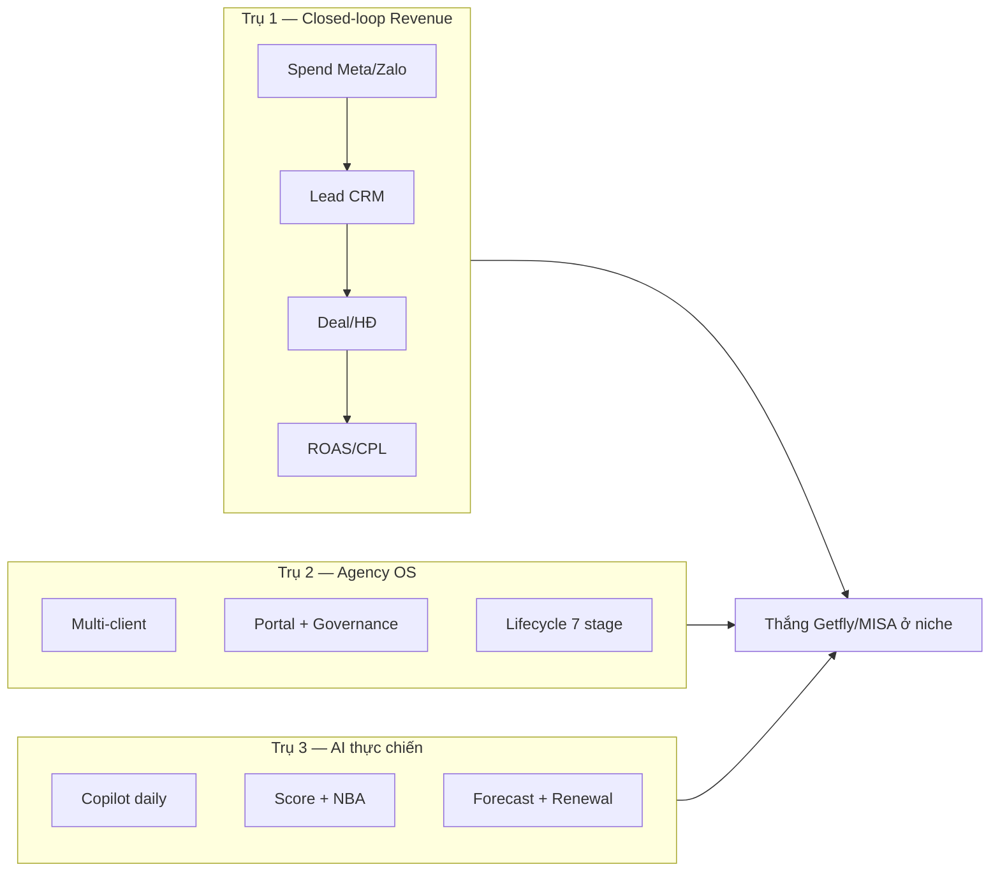
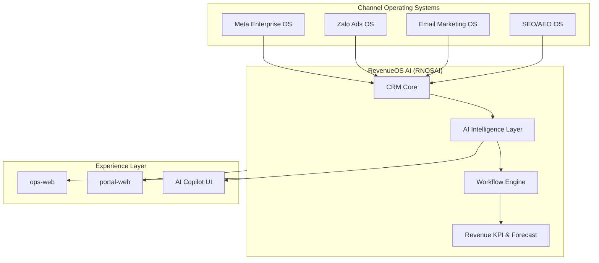
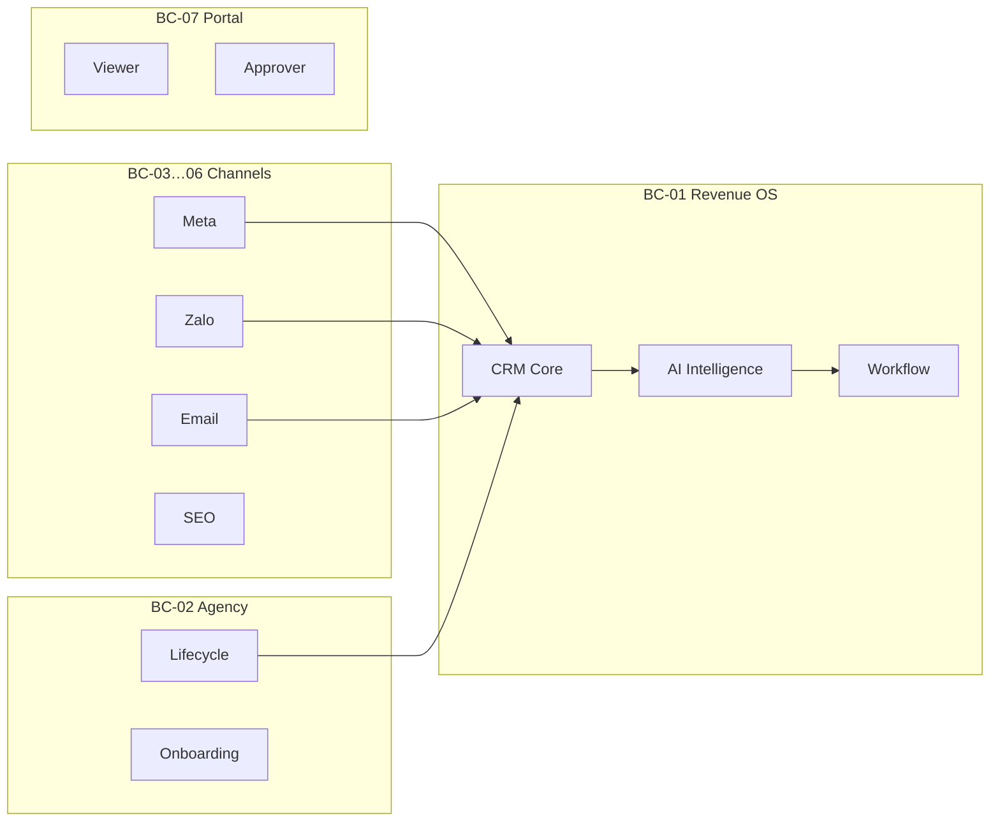
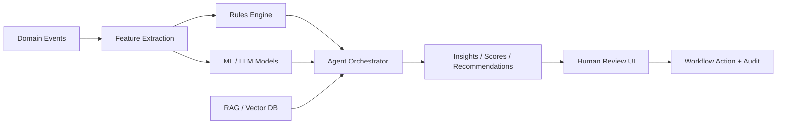
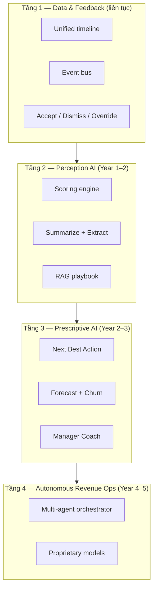
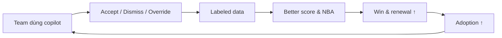

# RNOSAI — Master Specification (Revenue Operating System + AI)

> **Phiên bản:** 2.0 · **Ngày:** 2026-07-26  
> **Changelog:**  
> - **v2.0** — Tổng hợp master plan toàn diện; tích hợp Chiến lược AI 5 năm (trước `AI_LONG_TERM_STRATEGY.md`)  
> - v1.1 — §20 Competitive positioning vs Getfly/MISA  
> - v1.0 — Master spec Revenue OS từ PRD PTTCOM  
> **Trạng thái:** Target architecture — CRM foundation **shipped** · Channel OS **shipped** · AI layer **partial** · Revenue OS **in design**  
> **Codebase:** `RNOSAI/` (NestJS `ptt-crm-api` · Next.js `ops-web` / `portal-web` · Python `ptt_worker` / `ptt_jobs`)  
> **Production:** `https://ops.pttads.vn` · `https://portal.pttads.vn`  
> **Loại tài liệu:** **Master plan toàn diện** — Business + Technical + AI Strategy + Competitive + Roadmap  
> **Nguồn PRD:**  
> - `PTTCOM/AI/ PRD- AI Revenue Operating System.docx`  
> - `PTTCOM/AI/PRD kỹ thuật chi tiết cho CRM AI.docx`  
> **Tài liệu RNOSAI liên quan (bounded context):**  
> - [`SPEC_AGENCY_OPERATING_PLATFORM.md`](SPEC_AGENCY_OPERATING_PLATFORM.md) — Agency platform  
> - [`SPEC_META_ENTERPRISE_PTTADS.md`](SPEC_META_ENTERPRISE_PTTADS.md) · [`SPEC_EMAIL_MARKETING_OPERATING_SYSTEM.md`](SPEC_EMAIL_MARKETING_OPERATING_SYSTEM.md)  
> - [`SPEC_SEO_AEO_OPERATING_SYSTEM.md`](SPEC_SEO_AEO_OPERATING_SYSTEM.md) · [`SPEC_ZALO_ADS_OPERATING_SYSTEM.md`](SPEC_ZALO_ADS_OPERATING_SYSTEM.md)  
> - [`use-cases/`](use-cases/) · [`product-model-v1.md`](product-model-v1.md) · [`specs/events/catalog.yaml`](specs/events/catalog.yaml)  
> - [`SPEC_UI_UX_AI_REVENUE_OS.md`](SPEC_UI_UX_AI_REVENUE_OS.md) — UX/UI kiến trúc Revenue OS + AI  
> **Alias file:** [`AI_LONG_TERM_STRATEGY.md`](AI_LONG_TERM_STRATEGY.md) → redirect tới §22–§25 doc này  

---

## Mục lục

0. [Executive summary & kế hoạch master](#0-executive-summary--kế-hoạch-master)
1. [Tổng quan & phạm vi](#1-tổng-quan--phạm-vi)
2. [Định vị & mục tiêu kinh doanh](#2-định-vị--mục-tiêu-kinh-doanh)
3. [Personas & user journey](#3-personas--user-journey)
4. [Module sản phẩm (CRM + AI)](#4-module-sản-phẩm-crm--ai)
5. [AI Revenue Operating System layer](#5-ai-revenue-operating-system-layer)
6. [Kiến trúc hệ thống trên RNOSAI](#6-kiến-trúc-hệ-thống-trên-rnosai)
7. [Service architecture](#7-service-architecture)
8. [Bounded contexts & module map](#8-bounded-contexts--module-map)
9. [Mô hình dữ liệu PostgreSQL](#9-mô-hình-dữ-liệu-postgresql)
10. [Event architecture](#10-event-architecture)
11. [Workflow engine](#11-workflow-engine)
12. [AI Intelligence Service](#12-ai-intelligence-service)
13. [API catalog](#13-api-catalog)
14. [Tích hợp đa kênh & closed-loop revenue](#14-tích-hợp-đa-kênh--closed-loop-revenue)
15. [RBAC, governance & AI safety](#15-rbac-governance--ai-safety)
16. [KPI dictionary & success metrics](#16-kpi-dictionary--success-metrics)
17. [Yêu cầu phi chức năng](#17-yêu-cầu-phi-chức-năng)
18. [MVP, lộ trình & ma trận deliverables](#18-mvp-lộ-trình--ma-trận-deliverables)
19. [Tiêu chí nghiệm thu theo wave](#19-tiêu-chí-nghiệm-thu-theo-wave)
20. [Competitive positioning vs Getfly/MISA](#20-competitive-positioning-vs-getflymisa)
22. [Chiến lược AI thực chiến (5 năm)](#22-chiến-lược-ai-thực-chiến-5-năm)
23. [Lộ trình AI Phase 0–5](#23-lộ-trình-ai-phase-05)
24. [Flywheel dữ liệu, đội ngũ & anti-patterns](#24-flywheel-dữ-liệu-đội-ngũ--anti-patterns)
25. [North Star Metrics AI (Year 1–5)](#25-north-star-metrics-ai-year-15)
26. [Phụ lục](#26-phụ-lục)

---

## 0. Executive summary & kế hoạch master

### 0.1. RNOSAI là gì?

**RNOSAI (RevenueOS AI)** là nền tảng **vận hành doanh thu marketing** cho agency và doanh nghiệp performance-driven — gồm:

| Lớp | Thành phần | Trạng thái |
|-----|------------|------------|
| **CRM Core** | Lead, pipeline, CSKH SLA, lifecycle HĐ, hub | ✅ Shipped |
| **Channel OS** | Meta, Zalo, Email, SEO enterprise modules | ✅ Shipped |
| **Agency OS** | Multi-client, portal, Launch QA, governance | ✅ Shipped |
| **Revenue Loop** | Spend → Lead → Deal → ROAS/CPL | ✅ Partial |
| **AI Layer** | Copilot, score, NBA, forecast, agents | ○ R1–R4 |
| **Workflow OS** | Event-driven automation + AI nodes | ○ R2+ |

**North Star:** *Kiếm tiền từ marketing bằng dữ liệu + AI — không chỉ lưu CRM.*

### 0.2. Ba trụ chiến lược



### 0.3. Kế hoạch master — timeline 5 năm (gom sản phẩm + AI)

| Horizon | Thời gian | Product | AI | Competitive win |
|---------|-----------|---------|-----|-----------------|
| **R0** | ✅ Done | CRM + Channel OS + Agency | Meta intel, RE accounting AI | Nền closed-loop |
| **Phase 0** | Tháng 0–3 | Unified timeline, events | Data foundation, audit schema | Chuẩn bị vượt AVA |
| **R1 / Phase 1** | Tháng 3–9 | PWA lead care, import/export | Copilot, lead score v1, follow-up draft | AVA: attribution-aware assist |
| **R2 / Phase 2** | Tháng 9–18 | Workflow template, OpenSearch, ticket lite | ML score, NBA, RAG playbook | AVA: deal score + NBA |
| **R3 / Phase 3** | Tháng 18–30 | Forecast UI, order/invoice extend | Forecast MAPE, renewal/churn agent | AVA: agency renewal domain |
| **R4 / Phase 4** | Tháng 30–42 | Revenue dashboard, portal report | Channel AI, budget recommend | **Độc quyền** ROAS AI |
| **Phase 5** | Tháng 42–60 | Native mobile, MCP API | Multi-agent orchestrator | Platform AI agency |

### 0.4. Ưu tiên 90 ngày tới (Phase 0 + R1)

> **Kế hoạch triển khai hệ thống (workstreams, RACI, deploy, gate):** [`specs/2026-07-26-rnosai-system-implementation-plan.md`](specs/2026-07-26-rnosai-system-implementation-plan.md)  
> **Chi tiết tuần 1–12:** [`specs/2026-07-26-ai-phase1-90-day-plan.md`](specs/2026-07-26-ai-phase1-90-day-plan.md)

| # | Hạng mục | Owner | Deliverable |
|---|----------|-------|-------------|
| 1 | DDL AI + revenue behavior tables | Backend | RNOS-01 |
| 2 | `ai-intelligence` Nest module | Backend | RNOS-02 |
| 3 | Copilot trên `/crm/leads/[id]` | Full-stack | RNOS-03, 06 |
| 4 | Lead score v1 + event | Backend | RNOS-04, 08 |
| 5 | Follow-up draft + approve | Full-stack | RNOS-07 |
| 6 | AI audit + runbook | Platform | RNOS-05, 40 |
| 7 | Unified timeline v1 | Backend | RNOS-16 (partial) |
| 8 | E2E score → route → task | QA | RNOS-39 |

### 0.5. Cấu trúc tài liệu này

| Phần | Sections | Nội dung |
|------|----------|----------|
| **Product** | §1–§4, §14 | Vision, modules, closed-loop |
| **Technical** | §6–§13, §9–§11 | Architecture, data, API, events |
| **Governance** | §15–§17 | RBAC, NFR, KPI |
| **Execution** | §18–§19 | Roadmap waves, RNOS-01…40, UAT |
| **Market** | §20 | vs Getfly/MISA |
| **AI Strategy** | §22–§25 | 5-year AI thực chiến (tích hợp từ strategy doc) |
| **Reference** | §26 | Glossary, child docs |

### 0.6. Definition of Done — RNOSAI v1 (sản phẩm hoàn thiện)

- [ ] Unified timeline đủ Meta/Zalo/Email/CRM
- [ ] Copilot daily use ≥60% CSKH pilot
- [ ] AI acceptance ≥40%; 100% calls audited
- [ ] NBA trên deal stall; forecast MAPE ≤20%
- [ ] Renewal workflow T-90; portal ROAS report
- [ ] Parity CRM 80% (PWA, workflow template, custom field)
- [ ] Không workaround finance gate / email journeys (GAP-P1)

---

## 1. Tổng quan & phạm vi

### 1.1. Vision

**AI Revenue Operating System (RevenueOS AI / RNOSAI)** là lớp điều phối doanh thu trên nền CRM chuyên nghiệp và các Operating System chuyên sâu (Meta, SEO, Email, Zalo). Sản phẩm **không chỉ lưu hồ sơ khách hàng** mà **vận hành toàn bộ vòng đời doanh thu** từ lead đến renewal/upsell bằng AI, automation và dữ liệu thời gian thực.

```
Lead capture → Identity resolution → AI score & route → Sales execution
           → Pipeline & forecast → Quote/Order/Contract → Delivery (Agency OS)
           → CS health & renewal → Upsell/cross-sell → Revenue intelligence
```

**Closed-loop agency (đã có trên RNOSAI):**

`Spend (Meta/Zalo) → Lead (webhook/CRM) → Pipeline status → Conversion → Deal revenue → ROAS/CPL → AI insight → Next best action`

RevenueOS AI mở rộng vòng lặp thêm: **forecast, churn, coaching, agent orchestration**.

### 1.2. Vấn đề cần giải quyết

| Vấn đề | CRM truyền thống | RevenueOS AI |
|--------|------------------|--------------|
| Nhập liệu thủ công | Sales mất 30–40% thời gian log | AI auto-summary, auto-log communication |
| Chất lượng lead | Marketing đo MQL, không đo revenue | Lead score + attribution đến deal |
| Forecast | Subjective, spreadsheet | AI forecast + pipeline risk + explainability |
| Churn | Phát hiện muộn | Health score + renewal agent + early warning |
| Automation | Rule đơn giản | Event-driven workflow + AI decision step |
| Silo kênh | Ads/CRM/email tách rời | Unified timeline + cross-module KPI |

### 1.3. Phạm vi IN

| Lớp | Nội dung | Trạng thái RNOSAI |
|-----|----------|-------------------|
| **L0 CRM Core** | Lead, customer, pipeline, task, activity, quote/HĐ, KPI | ✅ Shipped (ops-web `/crm/*`) |
| **L1 Communication Hub** | Timeline, call/email log, Zalo/Meta message ingest | ✅ Partial |
| **L2 Marketing Automation** | Segments, journeys, nurture (Email OS primary) | ✅ Email OS · ○ CRM-native flows |
| **L3 Sales Enablement** | Playbook, proposal template, script library | ○ Partial |
| **L4 CS / Support** | Ticket, onboarding checklist, health score | ✅ CSKH board · ○ Health AI |
| **L5 Analytics** | Role dashboards, scheduled reports, NL query | ✅ KPI modules · ○ NL analytics |
| **L6 AI Assist** | Summary, scoring, follow-up draft, reminders | ○ Phase 2 |
| **L7 Revenue OS** | Forecast, churn, NBA, manager coach | ○ Phase 3 |
| **L8 Agentic** | Multi-agent orchestration, autonomous workflow | ○ Phase 4 |
| **L9 Channel OS integration** | Meta, Zalo, SEO, Email bounded contexts | ✅ Shipped per module |

### 1.4. Phạm vi OUT (giai đoạn v1)

| Hạng mục | Ghi chú |
|----------|---------|
| SaaS multi-agency trên cluster | RNOSAI = single agency PTT, multi-client |
| Mobile app native | Web responsive + API-first; mobile Phase 4+ |
| ERP/kế toán tổng hợp | Finance module ngoài scope Revenue OS v1 |
| Full agent autonomy (outbound không duyệt) | Luôn human-in-the-loop cho hành động nhạy cảm |
| Thay thế Ads Manager / ESP / GSC | Deep link + integration, không clone full UI |
| 14 microservices tách ngay | Modular monolith Nest + workers → tách dần AI service |

### 1.5. Vị trí trong Agency Operating Platform

RevenueOS AI là **BC-01 CRM Core + BC-Metrics + BC-AI Intelligence** trong [`SPEC_AGENCY_OPERATING_PLATFORM.md`](SPEC_AGENCY_OPERATING_PLATFORM.md), là **lớp ngang** kết nối Meta Enterprise, Email OS, SEO OS, Zalo OS.



---

## 2. Định vị & mục tiêu kinh doanh

### 2.1. Định vị sản phẩm

| Khía cạnh | Mô tả |
|-----------|-------|
| **Tên** | RevenueOS AI (RNOSAI) |
| **Loại** | CRM chuyên nghiệp + AI Revenue Operating System |
| **Đối tượng** | Marketing agency đa client (PTT model) · mở rộng SME/enterprise CRM |
| **Moat** | Dữ liệu hợp nhất + AI agent + closed-loop spend→revenue + workflow automation |

**Khác biệt so với CRM phổ biến (Getfly, HubSpot tier cơ bản):**

- CRM đầy đủ tính năng chuẩn **và** tự động hiểu dữ liệu
- Tự động đề xuất hành động (next best action), không chỉ dashboard
- Dự báo doanh thu, churn, renewal theo hành vi thực
- Tích hợp sẵn ads/email/SEO operating systems (agency-native)
- Agent orchestration với guardrails và audit

### 2.2. Mục tiêu kinh doanh

| # | Mục tiêu | Chỉ số thành công | Wave |
|---|----------|-------------------|------|
| B1 | Tăng lead → deal conversion | +15% vs baseline 90 ngày | R2 |
| B2 | Rút ngắn sales cycle | −10% median days-to-won | R2–R3 |
| B3 | Forecast chính xác | MAPE ≤ 20% (committed forecast) | R3 |
| B4 | Giảm nhập liệu thủ công | −30% activity log time (self-report + telemetry) | R2 |
| B5 | Productivity sales/manager | +20% tasks completed / rep / week | R2–R3 |
| B6 | Giảm churn client agency | Renewal rate +5pp | R3 |
| B7 | Upsell/cross-sell | Add-on revenue +10% | R3 |
| B8 | AI adoption | AI suggestion acceptance ≥ 40% | R2+ |

### 2.3. Nguyên tắc thiết kế

1. **Multi-tenant by design** — `tenant_id` / `client_id` trên mọi entity; RNOSAI dùng `client_id` làm đơn vị isolation agency.
2. **Event-driven** — mọi thay đổi nghiệp vụ quan trọng phát domain event.
3. **Append-only audit trail** — hành vi nhạy cảm và mọi AI action traceable.
4. **AI layer tách biệt** — transactional CRM core không phụ thuộc trực tiếp LLM runtime.
5. **Configurable CRM** — custom fields, pipelines, stages, workflows, permissions.
6. **API-first, webhook-first** — mọi chức năng UI có endpoint tương ứng.
7. **Human-in-the-loop** — AI suggest → human approve → system execute.
8. **Domain modularity** — bounded context rõ; strangler migration từ Flask (đã retired Wave 8).

---

## 3. Personas & user journey

### 3.1. Personas

| Persona | Vai trò RNOSAI | Mục tiêu chính | UI chính |
|---------|----------------|----------------|----------|
| **Sales Rep / CSKH** | Lead care, pipeline | Follow-up nhanh, ít nhập liệu | `/crm/leads`, copilot panel |
| **Sales Manager / GDKD** | Pipeline governance | Forecast, coach, phân bổ lead | `/crm/hub`, review queue, forecast |
| **Account Manager (AM)** | Client lifecycle | Renew, upsell, báo cáo client | `/crm/customers`, `/agency/clients/:id` |
| **Marketing** | Lead gen, nurture | Chất lượng lead, campaign→revenue | `/email/*`, `/meta/*`, segments |
| **Customer Success** | Onboarding, ticket | Health, SLA, renewal | `/crm/cskh-board`, tickets |
| **Media Buyer** | Ads execution | CPL/ROAS closed-loop | `/meta/*`, `/zalo/*` |
| **Admin / Ops** | Cấu hình hệ thống | RBAC, workflow, integration | `/agency`, settings |
| **CEO / Leadership** | Revenue oversight | KPI tổng, forecast, anomaly | Executive dashboard |
| **Client Viewer / Approver** | Portal | Báo cáo, duyệt | `portal.pttads.vn` |

### 3.2. User journey tổng quát (happy path)

| Bước | Hành vi | Hệ thống | AI |
|------|---------|----------|-----|
| 1 | Lead từ website, form, Meta, Zalo, import | Tạo lead, dedup, tag source | Lead Qualification Agent: score + classify |
| 2 | — | Route lead theo rule / territory | Lead Routing Agent: recommend rep |
| 3 | CSKH gọi/nhắn | Log activity, timeline | Auto-summary call; suggest next action |
| 4 | Qualify → pipeline | Stage change, SLA timer | Deal score; detect stall |
| 5 | Proposal/HĐ | Quote → order → contract | Predict close after quote |
| 6 | Onboard & deliver | Service lifecycle 7 stage | CS Health Agent |
| 7 | Renewal window | Renewal workflow | Renewal Agent; churn score |
| 8 | Manager review | Dashboard, forecast | Forecast Agent; coach insights |

**Traceability:** [`use-cases/00-SYSTEM-OVERVIEW.md`](use-cases/00-SYSTEM-OVERVIEW.md) SYS-UC-001…005

---

## 4. Module sản phẩm (CRM + AI)

Mỗi module có **tính năng CRM chuẩn** + **AI enhancement**. Functional requirements map: FR-xx (core), AI-xx (AI), AU-xx (automation).

### 4.1. Customer Management (FR-01, FR-02)

**Mục tiêu:** Hồ sơ khách hàng hợp nhất, realtime.

| Tính năng CRM | Mô tả | Route/API RNOSAI |
|---------------|-------|------------------|
| CRUD account/contact | Company + person master | `/crm/customers`, `GET/POST /accounts`, `/contacts` |
| Import Excel/CSV | Bulk ingest + validation | `POST /imports/customers` |
| Deduplication | Phone/email fingerprint merge | Assignment engine (shipped) |
| Tags & custom fields | Configurable schema | `custom_fields`, `entity_tags` |
| Timeline | Unified interaction history | `GET /timeline/{entityType}/{entityId}` |
| Attachments | File on profile | File service |
| Advanced search | Full-text + filters | OpenSearch index (target R2) |

| AI enhancement | Trigger | Output |
|----------------|---------|--------|
| Identity resolution | Duplicate candidates | Merge suggestion |
| Profile summary | On open profile | 3-bullet executive summary |
| Segment suggestion | Profile + behavior | Recommended segments |
| Buying signal detection | Timeline events | Alert + tag |

### 4.2. Lead & Opportunity Management (FR-03)

| Tính năng CRM | Mô tả | Trạng thái |
|---------------|-------|------------|
| Multi-source capture | Meta/Zalo/form/webhook/import | ✅ |
| Auto assignment | Round-robin, territory, product | ✅ |
| Lead scoring (rule) | Priority, hot/warm/cold | ✅ Partial |
| Pipeline / Kanban | Custom stages, SLA per stage | ✅ |
| Win/loss reason | Required on close | ✅ |
| Stage history | Audit trail | ✅ |

| AI enhancement | Model/Rule | Acceptance |
|----------------|------------|------------|
| Predict win probability | ML + stage prior | Confidence + explainability_json |
| Detect stalled deals | Aging + no activity | Pipeline Risk Agent alert |
| Next best action | Context RAG | `revenue_actions` row |
| Rep assignment recommend | Skill + load + territory | Suggestion only (R2) |

**Traceability:** [`use-cases/01-CRM-CORE.md`](use-cases/01-CRM-CORE.md) CRM-UC-001…009

### 4.3. Sales Pipeline & Forecast (FR-03, AI-05)

| Tính năng | Chi tiết |
|-----------|----------|
| Multi-pipeline | Per product/branch/team |
| Stage SLA | `sla_hours` on `pipeline_stages` |
| Aging deal report | Days in stage |
| Forecast by stage | Weighted pipeline |
| Quota / target | Per user/team |
| Forecast snapshots | Daily committed/best-case/pipeline |

| AI enhancement | Output |
|----------------|--------|
| Pipeline risk score | 0–100 + factors |
| Forecast adjustment | AI delta vs rep forecast |
| Rescue playbook | Suggested actions for at-risk deals |

### 4.4. Task, Calendar & Workflow (FR-05, FR-06, AU-01…07)

| Tính năng | Chi tiết |
|-----------|----------|
| Task CRUD | Priority, due, assign, complete |
| Recurring tasks | RRULE |
| Calendar events | Meeting scheduling |
| Project boards | Gantt/list (RE Projects shipped) |
| SLA tracking | CSKH board (shipped) |
| Workflow engine | Trigger → condition → action graph |

| AI enhancement | Trigger |
|----------------|---------|
| Auto-create task from call/email | `call.completed`, `email.received` |
| Smart scheduling | Calendar availability + impact score |
| Task prioritization | Revenue-weighted queue |
| Overdue risk detection | SLA breach prediction |

**Workflow types:** trigger-based · time-based · conditional · manual approval · **AI decision step** · human escalation

**Node types:** Trigger · Condition · Delay · Assign task · Send message · Update field · Create opportunity · Create ticket · **AI score** · **AI summarize** · Webhook · Approval

### 4.5. Communication Hub (FR-04)

| Kênh | Tính năng | Integration |
|------|-----------|-------------|
| Email | Log, template, sequence | Email OS + CRM timeline |
| Zalo | OA message, lead | Zalo webhook |
| Meta | Lead form, Messenger | Meta webhook |
| Call | Log, recording URL, transcript | Telephony integration (target) |
| Meeting | Notes, link | Calendar sync |
| Unified timeline | All channels one view | `customer_timeline_events` |

| AI enhancement | Output |
|----------------|--------|
| Conversation summary | `calls.summary`, `emails.summary` |
| Sentiment analysis | `sentiment_score` |
| Objection / intent detection | Tags on timeline |
| Auto-compose follow-up | Draft message (approve before send) |
| Suggested reply | Copilot inline |

### 4.6. Marketing Automation (AU-02, AU-07)

Primary execution: **Email Marketing OS**. CRM-native:

| Tính năng | Owner module |
|-----------|--------------|
| Segments | Email OS + CRM `segments` |
| Multi-step nurture | Email journeys |
| Trigger automation | Workflow engine |
| A/B test | Email OS |
| Campaign analytics | Closed-loop CPL/ROAS |

| AI enhancement | Description |
|----------------|-------------|
| Predictive segmentation | Propensity clusters |
| Content personalization | Dynamic blocks |
| Best send time | Per contact model |
| Campaign optimization | Read-only recommendations |

### 4.7. Sales Enablement

| Tính năng | Trạng thái |
|-----------|------------|
| Script library | ○ R2 |
| Playbook library | ○ R2 |
| Proposal/quote templates | ✅ Partial (proposal flow) |
| Case study / FAQ KB | ○ R2 |
| AI sales coach | ○ R3 |
| Call prep summary | ○ R2 |
| Win/loss pattern analysis | ○ R3 |

### 4.8. Quotation, Order, Contract, Billing (FR-07, FR-08)

| Entity | Trạng thái RNOSAI |
|--------|-------------------|
| Proposal / báo giá | ✅ CRM proposal flow |
| Hợp đồng (contract) | ✅ Hub HĐ |
| Order | ○ Extend schema R2 |
| Invoice / công nợ | ○ Finance module R2+ |
| Approval workflow | ✅ Temporal (campaign write pattern) |

| AI enhancement | Use case |
|----------------|----------|
| Late payment risk | Invoice aging + behavior |
| Pricing/discount recommend | Within policy bounds |
| Close likelihood after quote | Deal score refresh |
| Auto follow-up unpaid | Workflow + draft message |

### 4.9. Customer Success / Support (FR-04)

| Tính năng | Route / module |
|-----------|----------------|
| Ticket management | ○ R2 |
| Onboarding checklist | ✅ Service delivery |
| CS task automation | ✅ CSKH board |
| Health score | ○ R3 |
| Renewal tracking | ✅ Lifecycle Retain stage |
| NPS/CSAT | ○ R3 |

| AI enhancement | Agent |
|----------------|-------|
| Churn prediction | CS Health Agent |
| Renewal prediction | Renewal Agent |
| Upsell recommend | Upsell Agent |
| Account review summary | Auto-generate |
| Negative sentiment urgency | Real-time alert |

### 4.10. KPI & Analytics (FR-09)

| Dashboard | Audience | Metrics |
|-----------|----------|---------|
| Sales KPI | Rep, manager | Conversion, cycle, quota |
| Marketing KPI | MKT | CPL, MQL→SQL, channel mix |
| CS KPI | CSKH | SLA, response time, NPS |
| Revenue KPI | Leadership | ARR, pipeline, forecast vs actual |
| Team performance | Manager | Activity, win rate |

| AI enhancement | Capability |
|----------------|------------|
| Natural language analytics | `POST /ai/query` |
| Auto-insight generation | Daily digest |
| Anomaly detection | Spend, conversion, SLA |
| Bottleneck identification | Funnel analysis |
| What-to-do-next | Manager dashboard cards |

### 4.11. Admin, Security & Governance (FR-10)

| Tính năng | Implementation |
|-----------|----------------|
| User / role management | Nest auth + RBAC caps |
| Field-level permission | Target R2 |
| Team / branch hierarchy | `teams`, `branches` |
| Audit log | `audit_logs` append-only |
| API keys / webhooks | Integration gateway |
| Data retention / export | Tenant export API |
| AI action audit | `agent_runs`, `ai_insights` |
| Policy-based agent permissions | Human approval gates |

---

## 5. AI Revenue Operating System layer

### 5.1. Core idea

AI không chỉ "trả lời chat" mà **tham gia vận hành doanh thu**: observe event → score/predict → recommend action → (optional) execute workflow step sau approval.

### 5.2. AI Agents (target catalog)

| Agent | Trigger events | Actions | Approval |
|-------|----------------|---------|----------|
| **Lead Qualification Agent** | `lead.created` | Score, classify, enrich | Auto score · manual route override |
| **Lead Routing Agent** | `lead.scored` | Recommend rep | Auto if rule match · else queue |
| **Meeting Prep Agent** | `meeting.scheduled` | Brief from CRM + RAG | Read-only |
| **Follow-up Agent** | `call.completed` | Summary + task + draft message | Draft requires approve to send |
| **Pipeline Risk Agent** | `opportunity.stage_changed`, daily scan | Risk alert + playbook | Notify manager |
| **Forecast Agent** | Daily / on-demand | Forecast snapshot + delta | Manager commits |
| **Renewal Agent** | `contract.renewal_window` | Renewal workflow | AM approves outreach |
| **Upsell Agent** | Usage/health signal | Recommend add-on | AM approves |
| **CS Health Agent** | Ticket/sentiment events | Health score refresh | Auto score |
| **Manager Coach Agent** | Weekly digest | Coaching cards | Read-only |
| **Admin Automation Agent** | Config requests | Suggest workflow/field changes | Admin approves |

### 5.3. AI Copilot (Experience)

| Surface | Capabilities |
|---------|--------------|
| Global copilot panel (ops-web) | NL query, summarize record, draft message |
| Inline on lead/deal page | Next action, objection help, email draft |
| Manager dashboard | Forecast explain, team coaching |
| Portal (limited) | Report summary for client (no internal data) |

### 5.4. Functional requirements — AI (AI-01…AI-10)

| ID | Requirement | Priority | Wave |
|----|-------------|----------|------|
| AI-01 | Auto summarization (call, email, meeting) | P0 | R1 |
| AI-02 | Lead scoring | P0 | R1 |
| AI-03 | Deal scoring | P1 | R2 |
| AI-04 | Churn scoring | P1 | R3 |
| AI-05 | Revenue forecasting | P1 | R3 |
| AI-06 | Next best action | P0 | R2 |
| AI-07 | Smart reminders | P1 | R2 |
| AI-08 | Content drafting (follow-up, proposal) | P1 | R2 |
| AI-09 | Natural language query | P2 | R3 |
| AI-10 | Auto insights (digest, anomaly narrative) | P1 | R2 |

### 5.5. Automation requirements (AU-01…AU-07)

| ID | Requirement | Priority |
|----|-------------|----------|
| AU-01 | Trigger-action workflow | P0 ✅ partial |
| AU-02 | Email/SMS/Zalo sequence | P0 ✅ Email OS |
| AU-03 | Task automation | P0 |
| AU-04 | SLA escalation | P0 ✅ CSKH |
| AU-05 | Approval flows | P0 ✅ Temporal |
| AU-06 | Auto assignment | P0 ✅ |
| AU-07 | Event-based segmentation | P1 |

---

## 6. Kiến trúc hệ thống trên RNOSAI

### 6.1. Runtime stack (as-is)

```
Nginx (TLS)
  ├── ops-web :3200      (Next.js — staff)
  ├── portal-web :3100   (Next.js — client)
  └── ptt-crm-api :3000  (NestJS — REST + webhooks)
        ├── PostgreSQL     (source of truth — CRM, agency, channel)
        ├── Redis            (cache, rate limit, locks)
        ├── job_queue        (ptt_worker / ptt_jobs)
        ├── Temporal         (approval workflows — optional)
        └── SQLite legacy    (retiring — không entity mới)
```

**Target additions (Revenue OS):**

| Component | Purpose | Wave |
|-----------|---------|------|
| OpenSearch | Full-text CRM search | R2 |
| Vector DB (pgvector / Qdrant) | RAG, semantic retrieval | R2 |
| ClickHouse / warehouse tables | Analytics facts | R2–R3 |
| Dedicated `ai-intelligence` service | LLM orchestration, scoring | R2 (module) → R3 (service) |

### 6.2. Five architectural layers

| Layer | Components |
|-------|------------|
| **Experience** | ops-web, portal-web, public forms, AI copilot UI, integration portal |
| **API** | Nest gateway, auth middleware, rate limit, tenant routing, `/api/v1` versioning |
| **Domain services** | Identity, Customer, Sales, Activity, Workflow, Billing, Support, Analytics, **AI** |
| **Data** | PostgreSQL, Redis, OpenSearch, vector store, object storage, warehouse |
| **Async** | Event bus, job queue, workers, scheduler, DLQ, retry handler |

### 6.3. Command / Query split

| Pattern | Use |
|---------|-----|
| Command services | Write: create lead, move stage, approve quote |
| Query/read models | Dashboards, search, NL analytics |
| CQRS light | Materialized views for KPI; không full event sourcing Phase 1 |

---

## 7. Service architecture

### 7.1. Core services map

| # | Service | Trách nhiệm | RNOSAI module (Nest) |
|---|---------|-------------|----------------------|
| 1 | Identity & Access | Auth, RBAC, API keys, audit permission | `auth`, `portal` |
| 2 | Tenant / Organization | Client, branch, team, feature flags | `agency` |
| 3 | Customer | Lead, contact, account, dedup, timeline | `leads`, customers repos |
| 4 | Sales Pipeline | Pipeline, opportunity, forecast | `leads-funnel`, pipeline |
| 5 | Activity & Communication | Call, email, message, meeting, attachments | activity modules |
| 6 | Task & Calendar | Task, recurring, reminders, SLA | tasks, CSKH board |
| 7 | Marketing Automation | Segments, campaigns, workflows | `email-marketing` + workflow |
| 8 | Quote / Order / Contract / Billing | Quote, order, invoice, payment | hub HĐ, `svc-finance` |
| 9 | Customer Success / Support | Ticket, health, renewal | `cskh-board`, lifecycle |
| 10 | Analytics & Reporting | KPI, scheduled reports, funnel | `metrics`, `performance` |
| 11 | **AI Intelligence** | Score, summarize, forecast, agent | **New: `ai-intelligence`** |
| 12 | Notification | Email, SMS, Zalo, push, in-app | `portal-notification` |
| 13 | File & Document | Upload, scan, signed URL | file storage |
| 14 | Integration Gateway | Webhooks, third-party sync | webhooks, channel adapters |

### 7.2. AI Intelligence Service — submodules

| Submodule | Responsibility |
|-----------|----------------|
| Prompt orchestration | Template versioning (`ai_prompts`) |
| Feature extraction | Normalize inputs for models |
| Scoring service | Lead/deal/churn/renewal scores |
| RAG service | Playbook, transcript, KB retrieval |
| Agent orchestration | Multi-step agent runs (`agent_runs`) |
| Model registry | Model version, fallback |
| Evaluation & monitoring | Acceptance rate, drift, latency |

---

## 8. Bounded contexts & module map

### 8.1. BC diagram



### 8.2. ops-web route map (Revenue OS)

> **UX/UI chi tiết:** [`SPEC_UI_UX_AI_REVENUE_OS.md`](SPEC_UI_UX_AI_REVENUE_OS.md) §4–§7, §16 wireframes.

| Module | Route | Wave |
|--------|-------|------|
| CRM Hub | `/crm/hub` | ✅ |
| Leads | `/crm/leads` | ✅ |
| Customers | `/crm/customers` | ✅ |
| Pipeline / Sales | `/crm/sales`, `/crm/pipeline` | ✅ |
| CSKH Board | `/crm/cskh-board` | ✅ |
| Service Delivery | `/crm/service-delivery` | ✅ |
| KPI / Staff | `/crm/kpi`, `/crm/staff` | ✅ |
| **AI Copilot** | `/crm/copilot` or global panel | R2 |
| **Forecast** | `/crm/forecast` | R3 |
| **Workflow builder** | `/crm/automation` | R2 |
| **Health scores** | `/crm/health` | R3 |

---

## 9. Mô hình dữ liệu PostgreSQL

**Nguyên tắc:** PostgreSQL source of truth · common base fields trên hầu hết bảng.

### 9.1. Common base fields

```
id UUID PK
tenant_id UUID indexed          -- RNOSAI: client_id / agency scope
created_at, updated_at
created_by, updated_by
deleted_at nullable             -- soft delete
is_active
metadata JSONB
```

### 9.2. Schema domains (summary)

Chi tiết đầy đủ theo PRD kỹ thuật — các domain chính:

| Domain | Tables chính | Ghi chú RNOSAI |
|--------|--------------|----------------|
| Identity | `users`, `roles`, `permissions`, `api_keys`, `audit_logs` | Shipped |
| Tenant/Org | `tenants`, `branches`, `teams` | `agency_clients` |
| Customer | `accounts`, `contacts`, `leads`, `tags`, `custom_fields`, `customer_timeline_events` | `crm_leads` shipped |
| Pipeline | `pipelines`, `pipeline_stages`, `opportunities`, `forecast_snapshots` | Partial |
| Activity | `activities`, `calls`, `emails`, `messages`, `meetings`, `attachments` | Partial |
| Task | `tasks`, `task_comments`, `recurring_tasks` | Partial |
| Marketing | `campaigns`, `segments`, `automation_workflows`, `workflow_executions` | Email OS |
| Billing | `quotes`, `orders`, `contracts`, `invoices`, `payments` | Hub HĐ |
| Support | `tickets`, `customer_health_scores`, `renewal_opportunities` | Target R2–R3 |
| **AI** | `ai_insights`, `ai_scores`, `ai_recommendations`, `ai_prompts`, `agent_runs` | **New R1–R2** |
| **Revenue OS behavior** | `customer_events`, `behavior_signals`, `revenue_actions`, `model_predictions` | **New R2** |

### 9.3. AI schema (chi tiết)

**ai_insights**
```
id, tenant_id, entity_type, entity_id
insight_type, title, description
confidence, severity, status
created_by_model, created_at
```

**ai_scores**
```
id, tenant_id, entity_type, entity_id
score_type, score_value, features_json
model_version, calculated_at
```

**ai_recommendations**
```
id, tenant_id, entity_type, entity_id
recommendation_type, recommendation_text, action_json
confidence, status (pending|accepted|dismissed|executed)
```

**agent_runs**
```
id, tenant_id, agent_name
input_json, output_json, status
started_at, ended_at, error_message
```

**model_predictions**
```
id, tenant_id, model_name, entity_type, entity_id
prediction_type, prediction_value, confidence
explainability_json, model_version
```

### 9.4. Search, vector, analytics extensions

| Store | Indexed entities | Wave |
|-------|------------------|------|
| OpenSearch `search_entities` | account, contact, lead, deal, email subject, notes, ticket | R2 |
| Vector embeddings | call transcript, email thread, playbook, product docs | R2 |
| Warehouse facts | `fact_lead_events`, `fact_opportunity_events`, `fact_revenue`, dims | R2–R3 |

### 9.5. DDL deliverable

File: [`specs/2026-07-26-postgresql-ddl-revenue-os-ai.sql`](specs/2026-07-26-postgresql-ddl-revenue-os-ai.sql) · Apply: `./scripts/apply_pg_ddl_revenue_os_ai.sh`

---

## 10. Event architecture

### 10.1. Naming convention

```
tenant.{domain}.{action}
```

| Event | Producer | Consumers |
|-------|----------|-----------|
| `tenant.lead.created` | Customer service | AI scoring, assignment, search |
| `tenant.lead.scored` | AI service | Routing, workflow |
| `tenant.opportunity.stage_changed` | Sales pipeline | Risk agent, analytics, notification |
| `tenant.call.completed` | Activity service | Summary AI, follow-up agent |
| `tenant.email.opened` | Email OS | Segmentation, scoring |
| `tenant.task.overdue` | Task service | Escalation, notification |
| `tenant.quote.sent` | Billing | Deal score refresh |
| `tenant.invoice.overdue` | Billing | Collection workflow |
| `tenant.ai.insight.created` | AI service | Notification, dashboard |

### 10.2. Event payload standard

```json
{
  "event_id": "uuid",
  "event_type": "tenant.lead.created",
  "tenant_id": "uuid",
  "entity_type": "lead",
  "entity_id": "uuid",
  "occurred_at": "ISO8601",
  "actor_id": "uuid|null",
  "payload": {},
  "version": 1
}
```

### 10.3. Event consumers

| Consumer | Role |
|----------|------|
| AI scoring engine | Async score on ingest |
| Workflow engine | Trigger automation |
| Notification service | Alert users |
| Analytics pipeline | Fact tables |
| Search indexer | OpenSearch sync |
| Audit logger | Compliance |

**Catalog extension:** append to [`specs/events/catalog.yaml`](specs/events/catalog.yaml)

---

## 11. Workflow engine

### 11.1. Execution state machine

```
pending → running → waiting → succeeded
                  ↘ failed → (retry) → dead-letter
                  ↘ cancelled
```

### 11.2. Guardrails

| Guardrail | Rule |
|-----------|------|
| Max retry | 3 with exponential backoff |
| Timeout | Per node type configurable |
| Idempotency | `idempotency_key` on trigger |
| Sensitive changes | Approval node required |
| Tenant policy | Pre-check before AI execute node |
| AI outbound | Draft → human approve → send |

### 11.3. RNOSAI implementation path

| Phase | Implementation |
|-------|----------------|
| R1 | Extend existing automation (`crm_workflow_automation` patterns) + Temporal for approvals |
| R2 | Visual workflow builder + `automation_workflows` / `workflow_nodes` PG tables |
| R3 | AI decision node + simulation API `POST /automation-workflows/{id}/simulate` |

---

## 12. AI Intelligence Service

### 12.1. Architecture



### 12.2. Model strategy

| Use case | Approach | Sync/Async |
|----------|----------|------------|
| Summary (short) | LLM + schema validation | Sync < 5s |
| Lead score v1 | Rules + weighted features | Sync |
| Lead score v2 | XGBoost / logistic | Async |
| Deal/churn score | ML + explainability | Async |
| Forecast | Time series + pipeline weight | Async daily |
| NL query | LLM + SQL guard | Sync with timeout |
| Agent multi-step | Orchestrator + tool calls | Async job |

### 12.3. AI safety

| Control | Implementation |
|---------|----------------|
| Human approval for outbound | No auto-send email/Zalo without approve |
| PII redaction | Redact before external LLM when configured |
| Prompt injection defense | System prompt isolation, input sanitization |
| Output schema validation | JSON schema enforce on structured outputs |
| Hallucination guardrails | Confidence threshold; cite sources in RAG |
| Traceability | Every call → `agent_runs` + `prompt_hash` audit |

### 12.4. API — AI endpoints

| Method | Path | Description |
|--------|------|-------------|
| POST | `/ai/summarize` | Summarize text/transcript |
| POST | `/ai/score/lead` | Score lead |
| POST | `/ai/score/deal` | Score opportunity |
| POST | `/ai/score/churn` | Churn risk |
| POST | `/ai/forecast` | Generate forecast |
| POST | `/ai/recommendation` | Generic recommendation |
| POST | `/ai/next-best-action` | NBA for entity |
| POST | `/ai/query` | Natural language analytics |
| GET | `/ai/insights` | List insights |
| GET | `/ai/scores` | List scores |
| GET | `/ai/recommendations` | List recommendations |
| POST | `/ai/agent-runs` | Start agent |
| GET | `/ai/agent-runs/{id}` | Agent run status |
| POST | `/ai/prompts` | Manage prompt templates |
| GET | `/ai/prompts` | List prompts |

### 12.5. Response envelope (API convention)

```json
{
  "data": { "id": "...", "score": 85 },
  "meta": { "request_id": "req_456", "model_version": "lead-v1" },
  "errors": []
}
```

---

## 13. API catalog

REST `/api/v1` · nouns plural · GET read · POST create/action · PATCH partial update · soft delete.

### 13.1. Auth / Identity

`POST /auth/login` · `POST /auth/logout` · `POST /auth/refresh` · `GET /me` · `GET/POST/PATCH/DELETE /users` · `GET/POST/PATCH /roles` · `POST/GET/DELETE /api-keys`

### 13.2. Tenant / Org / Team

`GET/PATCH /tenants/me` · `GET/POST/PATCH /branches` · `GET/POST/PATCH /teams` · `POST/DELETE /teams/{id}/members/{userId}`

### 13.3. Customer / Lead / Account

`GET/POST/PATCH/DELETE /accounts` · `/contacts` · `/leads` · `POST /leads/{id}/convert` · `POST /duplicates/check` · `POST /merge-requests` · `GET /timeline/{entityType}/{entityId}` · custom fields & tags APIs

### 13.4. Pipeline / Forecast

`GET/POST/PATCH /pipelines` · `/opportunities` · `POST /opportunities/{id}/move-stage` · `POST /opportunities/{id}/win|lose` · `GET /forecast` · `GET /forecast/snapshots` · `POST /forecast/recalculate`

### 13.5. Activity / Communication

`GET/POST/PATCH /activities` · `/calls` · `POST /calls/{id}/transcript|summary` · `/emails` · `/messages` · `/meetings` · `/attachments`

### 13.6. Task / Calendar / Project

`GET/POST/PATCH/DELETE /tasks` · `POST /tasks/{id}/complete|reassign` · `/calendar/events` · `/projects` · `/project-boards`

### 13.7. Marketing automation

`GET/POST /segments` · `/campaigns` · `/automation-workflows` · `POST .../activate|deactivate|simulate` · `/workflow-executions`

### 13.8. Quote / Order / Contract / Invoice

`GET/POST /products` · `/quotes` · `POST /quotes/{id}/send|approve|reject` · `/orders` · `/contracts` · `/invoices` · `/payments`

### 13.9. Support / Customer Success

`GET/POST/PATCH /tickets` · `/ticket-messages` · `GET /health-scores` · `POST /health-scores/recalculate` · `/renewals` · `/surveys`

### 13.10. Notification / Webhook

`GET /notifications` · `POST /notifications/mark-read` · `GET/POST/DELETE /webhooks` · `POST /webhooks/test` · `GET /events` · `POST /events/publish`

**RNOSAI existing APIs:** Nest modules under `services/ptt-crm-api/src/` — extend, không duplicate Flask retired routes.

---

## 14. Tích hợp đa kênh & closed-loop revenue

### 14.1. Integration matrix

| Channel OS | Data vào CRM | Revenue metric | Spec |
|------------|--------------|----------------|------|
| Meta Enterprise | Lead webhook, spend, CAPI | CPL, ROAS | [`SPEC_META_ENTERPRISE_PTTADS.md`](SPEC_META_ENTERPRISE_PTTADS.md) |
| Zalo Ads | Lead webhook, spend | CPL | [`SPEC_ZALO_ADS_OPERATING_SYSTEM.md`](SPEC_ZALO_ADS_OPERATING_SYSTEM.md) |
| Email Marketing | Engagement, lead capture | Revenue attributed | [`SPEC_EMAIL_MARKETING_OPERATING_SYSTEM.md`](SPEC_EMAIL_MARKETING_OPERATING_SYSTEM.md) |
| SEO/AEO | Form leads, traffic | Organic CPL | [`SPEC_SEO_AEO_OPERATING_SYSTEM.md`](SPEC_SEO_AEO_OPERATING_SYSTEM.md) |

### 14.2. Closed-loop flow (SYS-UC-002)

1. Worker sync spend T-1 → hub
2. Webhook lead → CRM dedup + assign
3. Sales update pipeline → Won
4. CAPI / conversion sync
5. Hub compute CPL, ROAS (CRM revenue if available)
6. AI layer: anomaly + NBA on underperforming channel/campaign
7. AM report client (portal + PDF)

### 14.3. Unified customer timeline

Mọi interaction từ channel OS phải ghi `customer_timeline_events` với `event_source` = meta|zalo|email|seo|crm|call.

---

## 15. RBAC, governance & AI safety

### 15.1. RBAC matrix (Revenue OS extensions)

| Role | CRM write | AI accept action | Forecast commit | Workflow edit | AI prompt admin |
|------|:---------:|:----------------:|:---------------:|:-------------:|:---------------:|
| CSKH | Own leads | Own drafts | — | — | — |
| Sales | Own pipeline | Own drafts | — | — | — |
| GDKD / Manager | Team | Team | ✅ | View | — |
| AM | Client scope | Client scope | View | — | — |
| Admin | All | All | All | ✅ | ✅ |
| AI Agent (service) | System scoped | Pre-approved actions only | — | — | — |

### 15.2. AI governance rules

| Rule ID | Description |
|---------|-------------|
| BR-AI-01 | AI không gửi message outbound trực tiếp — luôn draft + approve |
| BR-AI-02 | Score thấp confidence (< 0.6) → hiển thị "low confidence", không auto-route |
| BR-AI-03 | Mọi agent run ghi audit; retention ≥ 12 tháng |
| BR-AI-04 | PII fields masked trong prompt log unless `AI_LOG_PII=true` (dev only) |
| BR-AI-05 | Manager override score/route → ghi `overridden_by` cho model feedback |

---

## 16. KPI dictionary & success metrics

### 16.1. Operational KPIs

| KPI | Formula | Source |
|-----|---------|--------|
| Lead response time | `first_contact_at - lead_created_at` | CRM |
| Lead → meeting rate | meetings / qualified leads | CRM |
| Meeting → opportunity rate | opps / meetings | CRM |
| Win rate | won / (won + lost) | Pipeline |
| Sales cycle length | `closed_at - created_at` median | Pipeline |
| Forecast accuracy (MAPE) | \|forecast - actual\| / actual | Forecast snapshots |
| Task completion rate | completed / due tasks | Tasks |
| SLA breach rate | breached / total SLA tasks | CSKH board |
| Churn rate | lost clients / active | Lifecycle |
| Renewal rate | renewed / due renewals | Contracts |
| AI acceptance rate | accepted recommendations / shown | `ai_recommendations` |

### 16.2. Channel-revenue KPIs (existing)

| KPI | Formula | Module |
|-----|---------|--------|
| CPL | spend / crm_leads | Meta/Zalo hub |
| ROAS | deal_revenue / spend | Meta hub + CRM |
| Email influenced pipeline | opps with email touch | Email OS |

### 16.3. Success metrics — product (PRD §12)

Lead response time ↓ · Conversion rates ↑ · Forecast accuracy ↑ · Manual entry time ↓ · Churn ↓ · Renewal/upsell ↑ · NPS ↑ · DAU/WAU ↑ · **AI suggestion acceptance rate ≥ 40%**

---

## 17. Yêu cầu phi chức năng

| Category | Target |
|----------|--------|
| Uptime | 99.9% |
| Page load (main CRM) | < 2s P95 (standard network) |
| API read P95 | < 300ms internal · < 800ms public |
| AI sync P95 | < 5s summary ngắn · async cho job dài |
| Scalability | Horizontal workers + API |
| Audit | Không tắt audit log |
| AI traceability | 100% agent runs logged |
| Backup | Daily + point-in-time recovery |
| Tenant export | On request within 72h |
| Rate limit | Per tenant + per API key |
| Security | Encrypt sensitive fields at rest; TLS in transit |
| Configurability | Low-code workflow, custom field, custom pipeline |

---

## 18. MVP, lộ trình & ma trận deliverables

### 18.1. MVP scope (Revenue OS Phase 1 = R1)

**Must ship:**

- Customer / lead / pipeline (✅ existing)
- Task / calendar basic
- Communication timeline
- Basic automation + SLA
- Report dashboard
- User/role management
- Import/export
- **AI summary** (call note, activity)
- **AI follow-up draft**
- **Lead scoring v1** (rules + simple model)

**Defer:**

- Full agent autonomy
- Advanced BI / warehouse
- Vertical-specific logic
- Full billing/invoice module
- NL analytics

### 18.2. Roadmap phases (product + AI gom)

| Phase | Tên | Product | AI (§23) | Timeline |
|-------|-----|---------|----------|----------|
| **R0** | CRM + Channel OS foundation | Leads, pipeline, CSKH, Meta/Zalo/Email/SEO OS | Meta intel, RE AI | ✅ Done |
| **Phase 0** | Data foundation | Timeline, events catalog | Audit schema, feedback tables | 0–3 tháng |
| **R1** | AI Assist | PWA, import/export | Copilot, score v1, draft | 3–9 tháng |
| **R2** | Workflow + Search | Builder, OpenSearch, ticket | ML score, NBA, RAG | 9–18 tháng |
| **R3** | Revenue OS | Forecast UI, billing extend | Forecast, renewal, churn | 18–30 tháng |
| **R4** | Channel AI + Agentic | Revenue dashboard, portal report | Budget rec, multi-agent | 30–60 tháng |

### 18.3. Ma trận deliverables RNOS-01…RNOS-40

| ID | Deliverable | Phase | Priority |
|----|-------------|-------|----------|
| RNOS-01 | PostgreSQL DDL — AI + revenue behavior tables | R1 | P0 |
| RNOS-02 | `ai-intelligence` Nest module skeleton | R1 | P0 |
| RNOS-03 | POST `/ai/summarize` — activity/call | R1 | P0 |
| RNOS-04 | POST `/ai/score/lead` — rules engine v1 | R1 | P0 |
| RNOS-05 | AI audit log (`agent_runs`, prompt hash) | R1 | P0 |
| RNOS-06 | Copilot panel UI — inline summary | R1 | P0 |
| RNOS-07 | Follow-up draft + approve-to-send | R1 | P0 |
| RNOS-08 | Event `tenant.lead.scored` + consumer | R1 | P0 |
| RNOS-09 | POST `/ai/score/deal` | R2 | P1 |
| RNOS-10 | Next best action API + UI card | R2 | P0 |
| RNOS-11 | OpenSearch CRM index | R2 | P1 |
| RNOS-12 | Vector store + RAG playbook | R2 | P1 |
| RNOS-13 | Workflow builder UI | R2 | P1 |
| RNOS-14 | AI workflow nodes (score, summarize) | R2 | P1 |
| RNOS-15 | POST `/automation-workflows/{id}/simulate` | R2 | P2 |
| RNOS-16 | Unified timeline enrichment (all channels) | R2 | P1 |
| RNOS-17 | POST `/ai/forecast` + snapshot job | R3 | P1 |
| RNOS-18 | Forecast dashboard `/crm/forecast` | R3 | P1 |
| RNOS-19 | POST `/ai/score/churn` + health score | R3 | P1 |
| RNOS-20 | Renewal Agent workflow | R3 | P1 |
| RNOS-21 | Manager Coach weekly digest | R3 | P2 |
| RNOS-22 | POST `/ai/query` NL analytics | R3 | P2 |
| RNOS-23 | Pipeline Risk Agent daily scan | R3 | P1 |
| RNOS-24 | Ticket module + AI sentiment | R2–R3 | P2 |
| RNOS-25 | Order/invoice schema extension | R2 | P2 |
| RNOS-26 | Lead Routing Agent (ML) | R3 | P2 |
| RNOS-27 | Upsell Agent | R3 | P2 |
| RNOS-28 | Anomaly narrative in digest | R3 | P2 |
| RNOS-29 | AI acceptance feedback loop | R2 | P1 |
| RNOS-30 | Portal AI report summary (client-safe) | R3 | P2 |
| RNOS-31 | Multi-agent orchestrator | R4 | P2 |
| RNOS-32 | Autonomous nurture optimization (read-only rec) | R4 | P3 |
| RNOS-33 | MCP-style tool exposure for external agents | R4 | P3 |
| RNOS-34 | Warehouse fact tables pipeline | R2–R3 | P2 |
| RNOS-35 | Field-level permission | R2 | P2 |
| RNOS-36 | Playbook library + RAG | R2 | P1 |
| RNOS-37 | Win/loss pattern analysis | R3 | P2 |
| RNOS-38 | Call transcript ingest + summary | R2 | P1 |
| RNOS-39 | E2E tests — AI score → route → task | R1 | P0 |
| RNOS-40 | Runbook — AI service ops + model rollback | R1 | P0 |

---

## 19. Tiêu chí nghiệm thu theo wave

### 19.1. Wave R1 — AI Assist

| # | Criteria | Method |
|---|----------|--------|
| 1 | Lead created → score visible ≤ 30s (async) | E2E test |
| 2 | Activity summary ≤ 5s P95 | Load test |
| 3 | Follow-up draft requires explicit approve before send | Manual + automated |
| 4 | 100% AI calls have `agent_runs` row | DB audit |
| 5 | No PII in prompt logs (prod config) | Config review |
| 6 | Copilot usable on `/crm/leads/[id]` | UAT checklist |

### 19.2. Wave R2 — Workflow + NBA

| # | Criteria |
|---|----------|
| 1 | Workflow simulate không mutate production |
| 2 | NBA card shows on stalled deal (>7d no activity) |
| 3 | Search returns lead by phone ≤ 500ms P95 |
| 4 | AI acceptance/dismiss tracked |

### 19.3. Wave R3 — Revenue OS

| # | Criteria |
|---|----------|
| 1 | Forecast snapshot daily by 07:00 ICT |
| 2 | MAPE report available for manager |
| 3 | Renewal workflow triggers 90d before `renewal_date` |
| 4 | Churn score on all active contracts |

---

## 20. Competitive positioning vs Getfly/MISA

> **Tham chiếu đối thủ (công khai, 2025–2026):**  
> - [Getfly CRM](https://getfly.vn) · [Helpdesk Marketing Automation](https://helpdesk.getfly.vn/web-version/markdown/marketing-tools/marketing-automation)  
> - [MISA AMIS CRM](https://amis.misa.vn/phan-mem-crm-amis/) · [Tính năng mới / AVA](https://amis.misa.vn/tinh-nang-moi-amis-crm/) · [Help R73](https://helpcrm.misa.vn/kb/what-s-new/)  
> **Chiến lược AI dài hạn:** [§22–§25](#22-chiến-lược-ai-thực-chiến-5-năm) (tích hợp trong doc này)

### 20.1. Nguyên tắc cạnh tranh

**Không cạnh “CRM all-in-one giá rẻ cho SME”.** Getfly và MISA thắng ở phân khúc đó. RevenueOS AI cạnh tranh ở category riêng:

```text
Revenue Operating System cho agency & doanh nghiệp performance marketing
```

**Ba trụ moat (không sao chép được nhanh):**

1. **Closed-loop** — Spend (Meta/Zalo) → Lead → Deal → Revenue → ROAS/CPL  
2. **Agency multi-client OS** — Portal, governance, lifecycle 7 stage, per-client channel workspace  
3. **AI gắn revenue marketing** — không chatbot generic; score/NBA/forecast trên data ads + HĐ dịch vụ  

### 20.2. Ma trận so sánh năng lực

| Hạng mục | Getfly | MISA AMIS CRM | RevenueOS AI (RNOSAI) |
|----------|--------|---------------|------------------------|
| **Đối tượng chính** | SME đa ngành | B2B, phân phối, B2C | Agency quảng cáo · brand chạy ads performance |
| **Giá tham chiếu** | ~31k/tháng (marketing message) | 80–120k/user/tháng | Premium B2B agency — không war giá SME |
| **Mobile** | ✅ App native full | ✅ Cloud + app | ○ PWA trước (R1) · native sau |
| **CRM core** | ✅ 100+ tính năng | ✅ 20+ nghiệp vụ bán hàng | ✅ Agency CRM · ○ ticket/calendar parity |
| **Marketing Automation** | ✅ Email/SMS/Zalo ZNS, workflow | ○ Cơ bản | ✅ Email OS enterprise · workflow template R2 |
| **Landing page** | ✅ 1000+ mẫu | ○ | **OUT** — form/website + UTM, không clone builder |
| **Social / Chatbot** | Social CRM | ✅ AVA chatbot Page → auto lead | Webhook Meta/Zalo + score + assign ngay |
| **AI** | ○ Hạn chế | ✅ AVA | ✅ Revenue AI — [§22–§25](#22-chiến-lược-ai-thực-chiến-5-năm) |
| **Kế toán / kho / đi tuyến** | ✅ Module tài chính | ✅ **Liên thông AMIS Kế toán** · đi tuyến | **OUT ERP** — export connector · không đi tuyến |
| **Ads closed-loop ROAS** | UTM, nguồn lead | FB/Zalo connect | ✅ **Meta + Zalo Enterprise OS** · CAPI · hub map |
| **Multi-client agency** | ❌ Single tenant | ❌ Single enterprise | ✅ **Core moat** |
| **Governance launch ads** | ○ | ○ | ✅ Launch QA · Temporal campaign write |
| **SEO / Email enterprise** | ○ | ○ | ✅ Bounded context OS riêng |

### 20.3. So sánh AI — RevenueOS vs MISA AVA

| Capability | MISA AVA (2025) | RevenueOS AI target | Wave | Moat |
|------------|-----------------|---------------------|------|------|
| Tóm tắt KH / deal | ✅ | ✅ + **source ads + SLA** | R1 | Cao |
| Tạo đơn / báo giá nhanh | ✅ | ✅ Proposal từ catalog dịch vụ agency | R2 | Trung bình |
| Báo cáo NL | ✅ | ✅ **curated** CPL, ROAS, pipeline | R3 | Cao |
| Chatbot Page → lead | ✅ | ○ Webhook + score (không clone chatbot generic) | — | Thấp |
| Phân tích cơ hội / dự đoán deal | ✅ R73 | ✅ + **ads touch + explainability** | R2–R3 | Cao |
| Churn / renewal | ✅ B2C/B2B | ✅ **renewal HĐ agency** T-90/T-60/T-30 | R3 | Rất cao |
| Forecast doanh thu | ○ Deal-level | ✅ **Pipeline MAPE + manager commit** | R3 | Cao |
| Next best action | ○ Gợi ý chốt deal | ✅ **NBA + playbook + task** | R2–R3 | Rất cao |
| CPL/ROAS anomaly | ❌ | ✅ Meta intel + narrative digest | R4 | **Độc quyền** |
| Budget recommend (ads) | ❌ | ✅ Read-only + governance write | R4 | **Độc quyền** |

**Positioning câu một dòng:**

> *AVA giúp bán hàng nhanh hơn. RevenueOS AI giúp **kiếm tiền từ marketing** — biết ads nào ra hợp đồng.*

Chi tiết lộ trình AI 5 năm: [§23](#23-lộ-trình-ai-phase-05).

### 20.4. Phân khúc & gói sản phẩm

> **Bảng giá draft (nội bộ):** [`specs/2026-07-26-rnosai-pricing-draft.md`](specs/2026-07-26-rnosai-pricing-draft.md) — Agency vs Brand · per-ACW vs per-SEAT · CRM / Channel OS / AI wave.  
> **Use case + UAT actions:** [`use-cases/09-AI-REVENUE-OS.md`](use-cases/09-AI-REVENUE-OS.md) · [`use-cases/actions/09-AI-ACTIONS.md`](use-cases/actions/09-AI-ACTIONS.md) — AI-UC-001…020 map §5.4 AI-01…10.

| Phân khúc | Đối thủ chính | Gói RNOSAI | Message |
|-----------|---------------|------------|---------|
| Agency 10–100 client | Excel + Ads Manager + CRM lẻ | **RevenueOS Agency** | Một OS thay 5 tool — CPL/ROAS theo client |
| Brand in-house MKT performance | Getfly + ads manager | **RevenueOS Brand** | Biết đồng ads nào ra đơn — không chỉ lead |
| SME đa ngành, ít ads | Getfly ~31k | **Không target** hoặc Lite tương lai | Thua giá + mobile + LP builder |
| Phân phối / NVBH đi tuyến | MISA AMIS | **Không target** | Thua kế toán + đi tuyến |
| BĐS / dự án | Getfly + Excel | **RNOS + RE module** | Lifecycle dự án + accounting AI (shipped) |

### 20.5. Table stakes — parity cần bù (không copy 12 module Getfly)

Đủ **~80% CRM chuyên nghiệp** để không bị loại vòng khi demo — chi tiết triển khai trong ma trận RNOS:

| # | Hạng mục | Getfly/MISA | RNOSAI | Ưu tiên |
|---|----------|-------------|--------|---------|
| P0-1 | Mobile / PWA lead care | ✅ App | ❌ | PWA R1 |
| P0-2 | Import/export Excel | ✅ | ○ Partial | R1 |
| P0-3 | Workflow template dễ dùng | ✅ (phức tạp) | ○ | R2 — 1-click SLA/nurture |
| P1-1 | Custom field + pipeline admin UI | ✅ | ○ | R2 (RNOS-35) |
| P1-2 | Calendar + reminder | ✅ | ○ | R2 |
| P1-3 | Ticket / CS lite | ✅ | ○ | R2 (RNOS-24) |
| P2-1 | Zalo ZNS / SMS broadcast | Getfly ✅ | Zalo OA lead | P2 — Email OS đủ nurture |
| **OUT** | Landing page builder 1000+ mẫu | Getfly ✅ | Form + UTM | Không build |
| **OUT** | ERP kế toán | MISA ✅ | Export connector | Không build |

### 20.6. FAQ bán hàng — trả lời positioning

| Câu hỏi khách | Trả lời |
|---------------|---------|
| “Getfly rẻ, đủ CRM?” | Getfly tốt cho SME lưu KH + automation email. RNOSAI cho **team nhiều client chạy ads**, cần **ROAS/CPL từ CRM**, duyệt launch, portal client. |
| “MISA có AI AVA rồi?” | AVA mạnh **bán hàng + kế toán**. RevenueOS AI gắn **chi phí Meta/Zalo, conversion, pipeline agency, renewal HĐ dịch vụ**. |
| “Thiếu app mobile?” | PWA R1; ưu tiên **copilot + SLA board** trước native app. |
| “Thiếu kế toán?” | Export **MISA Kế toán** — RNOS là revenue front-office, không thay ERP. |
| “Thiếu landing page?” | Website/form UTM → CRM; RNOS **đo conversion đến deal**, không cần 1000 template. |

### 20.7. Lộ trình vượt trội theo thời gian

| Horizon | Thắng Getfly ở | Thắng MISA AVA ở | Deliverable chính |
|---------|----------------|------------------|-------------------|
| **H1 (0–9 tháng)** | Attribution lead → campaign; SLA board | Lead brief + score gắn ads; copilot daily use | R1 AI Assist |
| **H2 (9–18 tháng)** | Workflow template đơn giản hơn Getfly automation | Deal score + NBA + RAG playbook | R2 |
| **H3 (18–30 tháng)** | — | Forecast MAPE + renewal agent (AVA chưa có domain agency) | R3 |
| **H4 (30+ tháng)** | — | CPL/ROAS AI + budget recommend — **không đối thủ VN tương đương** | R4 |

### 20.8. KPI chứng minh vượt trội (vs baseline nội bộ, không slogan)

| KPI | Getfly/MISA (ước lượng công khai) | RNOSAI target | Ghi chú |
|-----|-----------------------------------|---------------|---------|
| Lead response ≤15p | Không cam kết | ≥90% | CSKH board |
| Spend mapped → campaign | UTM (Getfly) | ≥80% hub map | Meta/Zalo OS |
| Forecast MAPE | AVA deal-level | ≤20% committed | R3 |
| AI acceptance | N/A | ≥40% | `ai_recommendations` |
| Client renewal (agency) | N/A | +5pp | Lifecycle Retain |
| ROAS visible on portal | ❌ | ✅ | Portal + CRM revenue |

---

## 22. Chiến lược AI thực chiến (5 năm)

AI trên RNOSAI phải **ra quyết định, tiết kiệm thời gian, tăng doanh thu đo được** — không phải chatbot cho đẹp.

### 22.1. Vòng lặp cốt lõi

```text
Dữ liệu hành vi thật → Feature có nhãn → AI gợi ý → Human duyệt → Execute → Đo kết quả → Học lại
```

### 22.2. Năm nguyên tắc AI

| # | Nguyên tắc | Ý nghĩa |
|---|------------|---------|
| 1 | **Outcome-first** | Mỗi tính năng AI gắn 1 KPI measurable |
| 2 | **Human-in-the-loop** | Không auto gửi Zalo/email — draft + approve |
| 3 | **Domain data moat** | Thắng AVA nhờ Spend → Lead → Deal → Revenue |
| 4 | **Rules trước, ML sau** | ML khi ≥10k labeled events |
| 5 | **Ship weekly, measure daily** | 1 copilot tốt > 11 agent trên slide |

### 22.3. Kiến trúc AI 4 tầng moat



Moat nằm ở **Tầng 1 + 2** — GPT ai cũng mua được; **data closed-loop agency** thì không.

### 22.4. Bản đồ cạnh tranh AI theo năm

| Giai đoạn | MISA AVA / Getfly | RNOSAI thắng bằng |
|-----------|-------------------|-------------------|
| **Năm 1** | Tóm tắt KH, chatbot Page, báo cáo NL | Attribution-aware copilot + score Meta/Zalo |
| **Năm 2** | Phân tích cơ hội, dự đoán deal | NBA + pipeline risk + SLA + ads cost |
| **Năm 3** | AI rải trên AMIS | Forecast MAPE + renewal agent HĐ agency |
| **Năm 4–5** | Platform AI chung | Multi-agent + proprietary models closed-loop |

**Không cạnh:** đi tuyến, ERP, chatbot FAQ, LP builder 1000 mẫu.  
**Cạnh trực tiếp:** attribution, scoring, forecast, renewal HĐ, ROAS/CPL intelligence.

### 22.5. Ma trận use case × moat

| Use case | Phase | Moat | MISA AVA | Getfly |
|----------|-------|------|----------|--------|
| Lead brief gắn campaign | 1 | Cao | ○ | ○ |
| Follow-up draft + approve | 1 | TB | ○ | ○ |
| Lead score + explain | 1–2 | Rất cao | ○ | ○ |
| Deal stall + NBA | 3 | Rất cao | ○ | ❌ |
| Forecast + MAPE | 3 | Cao | ○ | ❌ |
| Renewal HĐ agency | 3 | Rất cao | ❌ | ❌ |
| CPL/ROAS anomaly | 4 | Độc quyền | ❌ | ❌ |
| Budget recommend | 4 | Độc quyền | ❌ | ❌ |
| Multi-agent revenue | 5 | Độc quyền | ○ | ❌ |

---

## 23. Lộ trình AI Phase 0–5

### 23.1. Phase 0 — Data Foundation (Tháng 0–3)

| Deliverable | Mô tả | RNOS ID |
|-------------|-------|---------|
| Unified timeline | Meta/Zalo/Email/Call/Note một dòng | RNOS-16 |
| Event chuẩn | `lead.created`, `stage.changed`, `deal.won`… | RNOS-08 |
| Feedback schema | `ai_recommendations` accept/dismiss | RNOS-01 |
| Audit 100% | `agent_runs` + prompt_hash | RNOS-05 |

**KPI:** ≥80% lead có attribution · timeline completeness ≥70%

### 23.2. Phase 1 — Copilot thực dụng (Tháng 3–9) — Year 1

| # | Tính năng | Output | RNOS |
|---|-----------|--------|------|
| 1 | Lead Brief | 5 bullet + campaign context | RNOS-06 |
| 2 | Activity Summary | Summary + extract budget/objection | RNOS-03 |
| 3 | Follow-up Draft | Draft → approve → send | RNOS-07 |
| 4 | Lead Score v1 | Rules + explainability | RNOS-04 |

```text
score = f(source_quality, response_sla, estimated_value, duplicate_risk, campaign_cpl_tier)
```

**KPI:** Copilot DAU ≥60% · acceptance ≥35% · response ≤15p ≥90%

**Không làm:** chatbot Page, NL SQL tự do, 11 agent.

### 23.3. Phase 2 — Scoring & Routing (Tháng 9–18) — Year 1–2

| Capability | Cơ chế | RNOS |
|------------|--------|------|
| Lead Score v2 | XGBoost + won/lost label | RNOS-04 ext |
| Deal Score | Aging + activity + quote | RNOS-09 |
| Smart Routing | Rep recommend by source | RNOS-26 |
| Stall Detector | 7d no activity → alert | RNOS-23 |
| RAG Playbook | SOP/script vector | RNOS-12, 36 |
| Feedback loop | Override → retrain signal | RNOS-29 |

**KPI:** Lead→meeting +10% · AUC ≥0.72 · top quartile win ≥2× bottom

### 23.4. Phase 3 — Prescriptive Revenue AI (Tháng 18–30) — Year 2–3

| Agent / Feature | Trigger | Approval | RNOS |
|-----------------|---------|----------|------|
| Next Best Action | Deal stall | Accept → task | RNOS-10 |
| Pipeline Risk | Daily scan | Notify GDKD | RNOS-23 |
| Forecast Agent | Daily 07:00 ICT | Manager commit | RNOS-17, 18 |
| Renewal Agent | T-90/60/30 HĐ | AM approve | RNOS-20 |
| Churn Score | Health signals | Alert leadership | RNOS-19 |
| NL Analytics | Curated 50 questions | Read-only | RNOS-22 |

**KPI:** MAPE ≤20% · renewal +5pp · NBA acceptance ≥45%

### 23.5. Phase 4 — Channel-Aware Intelligence (Tháng 30–42) — Year 3–4

| Capability | Mô tả |
|------------|-------|
| Cross-channel anomaly | CPL spike Meta+Zalo narrative |
| Budget recommend | Read-only + governance write |
| Creative ↔ Deal | Won deal by creative, not just lead |
| Email ↔ Pipeline | Journey influence on proposal |
| SEO lead quality | Organic vs paid priority |

**KPI:** ROAS lift ≥10% · unmapped spend ≤15%

Federate `meta-intelligence` — không duplicate trong `/ai/forecast`.

### 23.6. Phase 5 — Autonomous Revenue Ops (Tháng 42–60) — Year 4–5

```text
Orchestrator → Lead / Follow-up / Pipeline / Renewal / Channel agents
```

| Capability | RNOS |
|------------|------|
| Proprietary models | Ensemble on agency data |
| Simulation sandbox | What-if forecast |
| MCP Tool API | External agent tools | RNOS-33 |
| Client-safe portal AI | Scoped report summary | RNOS-30 |
| Multi-agent | Governed orchestration | RNOS-31 |

**KPI:** ≥50% ops AI-assisted · proprietary AUC +15% vs generic

---

## 24. Flywheel dữ liệu, đội ngũ & anti-patterns

### 24.1. Flywheel



| Event | Ghi vào | Dùng cho |
|-------|---------|----------|
| `ai.recommendation.accepted` | `ai_recommendations.status` | Retrain, acceptance KPI |
| `ai.recommendation.dismissed` | + reason | Feature ablation |
| `ai.score.overridden` | `overridden_by` | Calibration |
| `ai.draft.sent` | Post-approve audit | Quality |

### 24.2. AI Platform nội bộ (build once)

```text
ai-intelligence/
├── orchestrator/    ├── scoring/       ├── summarization/
├── rag/             ├── nl-analytics/  ├── evaluation/
└── audit/
```

### 24.3. Model strategy

| Giai đoạn | Approach |
|-----------|----------|
| Phase 1–2 | Rules + GPT-class + JSON schema |
| Phase 2–3 | XGBoost/LightGBM monthly retrain |
| Phase 3+ | Optional small LLM fine-tune (VN call extract) |
| Phase 5 | Ensemble proprietary |

### 24.4. Evaluation gate (mỗi release)

Offline AUC +2pp · acceptance ≥35% · override ≤25% · P95 ≤5s · 100 golden cases VN.

### 24.5. Đội ngũ theo năm

| Year | Team | Focus |
|------|------|-------|
| 1 | 1 ML + 1 LLM/product + CRM dev | Copilot, score v1 |
| 2 | +1 data engineer | Feature store, retrain |
| 3 | +1 ML ops | Drift, A/B |
| 4–5 | +research optional | Multi-agent, proprietary |

### 24.6. Anti-patterns — không làm

| Tránh | Lý do |
|-------|-------|
| Chatbot Page generic | MISA có; không moat |
| NL SQL tự do | Hallucination, security |
| Auto-send outbound | Trust + legal |
| 11 agent cùng lúc | Không đo ROI |
| Fine-tune LLM lớn sớm | Chưa đủ data |
| Duplicate Meta forecast | Federation §12 + §22 |
| AI ads content hàng loạt | Meta compliance |

---

## 25. North Star Metrics AI (Year 1–5)

| Metric | Year 1 | Year 3 | Year 5 |
|--------|--------|--------|--------|
| AI DAU / sales team | 60% | 80% | 90% |
| AI suggestion acceptance | 35% | 45% | 55% |
| Lead response ≤15p | 90% | 95% | 98% |
| Win rate lift (top quartile) | 1.5× | 2× | 2.5× |
| Forecast MAPE | — | ≤20% | ≤15% |
| Renewal rate lift | — | +5pp | +10pp |
| ROAS lift (AI clients) | — | +10% | +15% |
| Proprietary vs generic AUC | — | +5% | +15% |

**Con đường thắng:**

```text
Year 1  → Copilot + Score + Timeline
Year 2  → ML Score + RAG + Smart Route
Year 3  → NBA + Forecast + Renewal
Year 4  → Channel AI + ROAS optimize
Year 5  → Multi-agent Revenue Ops
```

---

## 26. Phụ lục

### 26.1. Functional requirements index

**CRM Core:** FR-01…FR-10 (see §4, PRD §8.1)  
**AI:** AI-01…AI-10 (see §5.4)  
**Automation:** AU-01…AU-07 (see §5.5)

### 26.2. Key differentiation summary

| CRM thường | RevenueOS AI |
|------------|--------------|
| Lưu hồ sơ | Vận hành doanh thu |
| Báo cáo retrospective | Forecast + prescriptive |
| Rule automation | AI + workflow + agents |
| Silo modules | Closed-loop channel OS |
| Manual coaching | Data-driven coach |

### 26.3. Tài liệu triển khai con (child docs)

| Doc | Nội dung | Trạng thái |
|-----|----------|------------|
| **This spec (v2.0)** | Master plan toàn diện RNOSAI | ✅ |
| [`AI_LONG_TERM_STRATEGY.md`](AI_LONG_TERM_STRATEGY.md) | Redirect → §22–§25 | Alias |
| `specs/2026-07-26-postgresql-ddl-revenue-os-ai.sql` | DDL AI + Revenue OS | ✅ |
| `specs/2026-07-26-ai-intelligence-architecture.md` | C4 AI service | ○ TODO |
| `specs/2026-07-26-ai-phase1-90-day-plan.md` | Backlog 90 ngày Phase 0 + R1 | ✅ |
| `specs/2026-07-26-rnosai-system-implementation-plan.md` | **Kế hoạch triển khai hệ thống** (5 năm + 90 ngày) | ✅ v1.0 |
| [`SPEC_UI_UX_AI_REVENUE_OS.md`](SPEC_UI_UX_AI_REVENUE_OS.md) | UX/UI kiến trúc Revenue OS + AI (ops + portal) | ✅ v1.0 |
| `use-cases/09-AI-REVENUE-OS.md` | Use cases AI-UC-001…020 | ✅ v1.1 |
| `use-cases/actions/09-AI-ACTIONS.md` | Action UAT R1–R4 | ✅ v1.1 |
| `runbooks/ai-service-operations.md` | Ops runbook | ✅ |
| `specs/2026-07-26-rnosai-pricing-draft.md` | Bảng giá Agency/Brand draft | ✅ v0.1 DRAFT |

### 26.4. Glossary

| Term | Definition |
|------|------------|
| Revenue OS | Lớp điều phối doanh thu — forecast, NBA, agents |
| NBA | Next Best Action |
| HITL | Human-in-the-loop |
| MAPE | Mean Absolute Percentage Error (forecast) |
| RAG | Retrieval-Augmented Generation |
| RNOSAI | Project/codebase AI Revenue Operating System |

---

*End of RNOSAI Master Specification v2.0*
