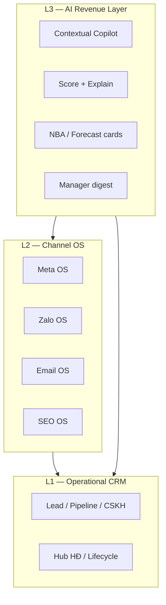
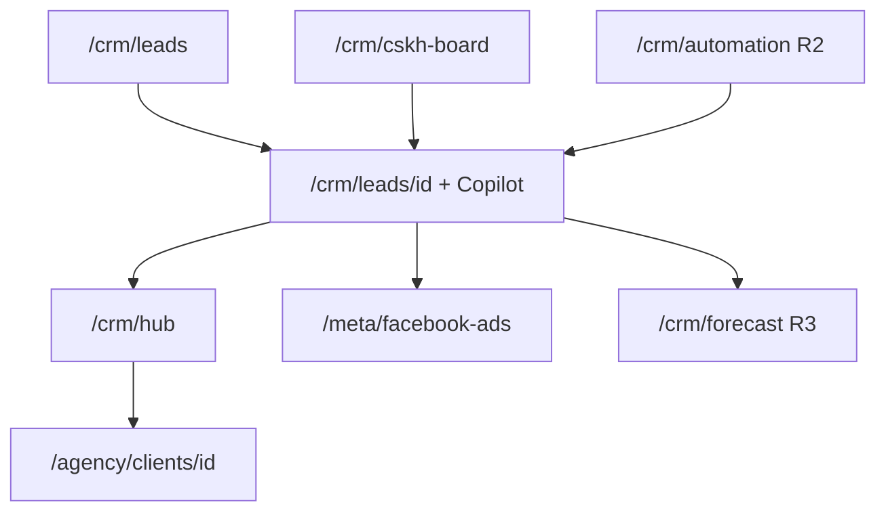
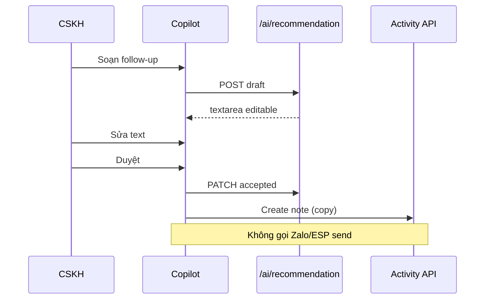

# AI Revenue Operating System — UI/UX Architecture Specification

> **Phiên bản:** 1.0 · **Ngày:** 2026-07-26  
> **Phạm vi:** Kiến trúc UX/UI toàn hệ thống Revenue OS + AI layer trên **ops-web** (staff) và **portal-web** (client)  
> **Master spec:** [`SPEC_AI_REVENUE_OPERATING_SYSTEM.md`](SPEC_AI_REVENUE_OPERATING_SYSTEM.md) §3, §5, §8.2, §15, §18–§23  
> **Design system gốc:** [`SPEC_UI_UX_PTT.md`](SPEC_UI_UX_PTT.md) · Agency: [`SPEC_UI_UX_AGENCY.md`](SPEC_UI_UX_AGENCY.md)  
> **Channel OS UI:** [`SPEC_UI_UX_EMAIL_MARKETING.md`](SPEC_UI_UX_EMAIL_MARKETING.md) · [`SPEC_UI_UX_SEO_AEO.md`](SPEC_UI_UX_SEO_AEO.md) · Meta/Zalo trong module specs  
> **Use cases / UAT:** [`use-cases/09-AI-REVENUE-OS.md`](use-cases/09-AI-REVENUE-OS.md) · [`use-cases/actions/09-AI-ACTIONS.md`](use-cases/actions/09-AI-ACTIONS.md)  
> **Codebase:** `services/ops-web` · `services/portal-web` · `LeadCopilotPanel` (target R1)

---

## Mục lục

1. [Tổng quan kiến trúc UX](#1-tổng-quan-kiến-trúc-ux)
2. [Nguyên tắc & design system](#2-nguyên-tắc--design-system)
3. [Personas & journey maps](#3-personas--journey-maps)
4. [Information Architecture](#4-information-architecture)
5. [Layout & navigation shell](#5-layout--navigation-shell)
6. [AI surfaces — kiến trúc Copilot](#6-ai-surfaces--kiến-trúc-copilot)
7. [Screen inventory theo wave](#7-screen-inventory-theo-wave)
8. [Component library (AI + Revenue)](#8-component-library-ai--revenue)
9. [Interaction patterns & HITL](#9-interaction-patterns--hitl)
10. [States, feedback & empty UX](#10-states-feedback--empty-ux)
11. [Permissions ↔ UI](#11-permissions--ui)
12. [Closed-loop & cross-module UI](#12-closed-loop--cross-module-ui)
13. [Portal (client-safe AI)](#13-portal-client-safe-ai)
14. [Responsive & PWA](#14-responsive--pwa)
15. [Accessibility & trust UX](#15-accessibility--trust-ux)
16. [Wireframes (ASCII)](#16-wireframes-ascii)
17. [Wave rollout UI map](#17-wave-rollout-ui-map)
18. [Traceability & handoff](#18-traceability--handoff)

---

## 1. Tổng quan kiến trúc UX

### 1.1. Vai trò lớp Experience (spec §6.2)

Revenue OS UI **không** là CRM form thêm tab AI. Kiến trúc 3 tầng hiển thị:



| Tầng | Người dùng thấy gì | Nguyên tắc |
|------|-------------------|------------|
| **L1 Operational** | Làm việc hàng ngày — lead, SLA, proposal | CRM core không bị AI chặn luồng |
| **L2 Channel** | CPL/ROAS, map campaign, launch QA | Deep link từ entity CRM → hub kênh |
| **L3 AI** | Gợi ý có explain + approve | **Sidebar / inline**, không modal full-screen |

### 1.2. Mục tiêu UX (đo được)

| Mục tiêu | Metric UX | Wave |
|----------|-----------|------|
| CSKH dùng copilot mỗi ngày | Copilot DAU ≥60% pilot | R1 |
| Giảm thao tác nhập liệu | Time-to-log ↓25% | R1 |
| Hiểu vì sao score cao/thấp | ≥3 explain chips khi đủ data | R1 |
| Manager drill revenue ≤3 click | Hub → client → campaign → lead | R0 ✅ |
| Trust AI | Acceptance ≥35%; dismiss có reason | R1–R2 |
| Forecast usable | Manager commit ≤5 phút/tuần | R3 |

### 1.3. Phạm vi ứng dụng

| App | URL prod | Vai trò Revenue OS UI |
|-----|----------|------------------------|
| **ops-web** | `https://ops.pttads.vn` | Staff — CRM, Channel OS, AI copilot, forecast |
| **portal-web** | `https://portal.pttads.vn` | Client — performance read-only, approval, AI summary an toàn |
| **Public forms** | Landing / webhook | Thu lead — không AI surface |

---

## 2. Nguyên tắc & design system

### 2.1. Nguyên tắc thiết kế (bắt buộc)

1. **Extend, don't replace** — giữ `OpsNav` shell, section CRM · Agency · Meta · Zalo · Email · SEO.
2. **Contextual AI** — Copilot bám entity (lead/deal/client), không chatbot trôi nổi generic.
3. **Human-in-the-loop visible** — Mọi draft có **Duyệt / Bỏ**; không nút “Gửi tự động”.
4. **Explain before trust** — Score + chips +/- trước khi user tin recommendation.
5. **Non-blocking** — AI load/error không khóa CRM core (status, activity log).
6. **Tiếng Việt first** — Label, error, empty state, explain factors.
7. **Desktop-first B2B** — Tablet minimum; PWA mobile R1 stretch.
8. **Data > decoration** — Ops density; executive cards riêng route.

### 2.2. Kế thừa design tokens

Từ [`SPEC_UI_UX_PTT.md`](SPEC_UI_UX_PTT.md) / ops-web hiện tại:

| Token | Usage Revenue OS |
|-------|------------------|
| `--primary` | CTA chính (Duyệt draft, Lưu) |
| `.btn`, `.btn-secondary` | Actions CRM + AI |
| `.card` | Score card, NBA card, forecast snapshot |
| `.muted` | Explain secondary, confidence |
| `.nav-link` | Breadcrumb lead → campaign hub |

### 2.3. Semantic màu AI (mở rộng)

| Semantic | CSS var đề xuất | Dùng cho |
|----------|-----------------|----------|
| **Score hot** | `--ai-score-hot` (#c62828 tint) | 70–100 |
| **Score warm** | `--ai-score-warm` (#ef6c00 tint) | 40–69 |
| **Score cold** | `--ai-score-cold` (#546e7a tint) | 0–39 |
| **Positive factor** | `--ai-factor-plus` | Chip + Meta mapped |
| **Negative factor** | `--ai-factor-minus` | Chip − Chưa gọi |
| **Low confidence** | `--ai-warning` | Banner BR-AI-02 |
| **AI processing** | `--ai-skeleton` | Loading copilot |
| **Override** | `--ai-override` | GDKD manual score |

### 2.4. Typography AI

| Element | Scale | Ví dụ |
|---------|-------|-------|
| Score value | `text-2xl font-semibold tabular-nums` | `78` |
| Brief bullets | `text-sm leading-relaxed` | 5 bullets VN |
| Explain chip | `text-xs pill` | `+ Meta campaign mapped` |
| Draft body | `textarea font-sans text-sm` | Editable follow-up |

---

## 3. Personas & journey maps

### 3.1. Persona × surface (spec §3.1)

| Persona | Primary routes | AI surfaces (wave) |
|---------|----------------|-------------------|
| **CSKH / Sales** | `/crm/leads`, `/crm/cskh-board` | Copilot panel R1 · NBA card R2 |
| **GDKD / Head Sales** | `/crm/hub`, review queue, `/crm/forecast` R3 | Override score R1 · Coach digest R3 |
| **AM** | `/agency/clients/[id]`, service-delivery | Renewal agent card R3 |
| **Media Buyer** | `/meta/*`, `/zalo/*` | Anomaly digest R4 · deep link score |
| **Marketing** | `/email/*`, segments | Campaign AI rec read-only R2+ |
| **Admin / Ops** | `/agency`, `/admin/ai/runs` R1 | Audit UI |
| **CEO** | `/crm/business-dashboard`, forecast | NL query curated R3 |
| **Client approver** | portal `/meta`, approvals | Report summary R3 |

### 3.2. Journey map — Lead → Revenue (UI touchpoints)

| Bước | Hành vi | Màn hình | AI UI |
|------|---------|----------|-------|
| 1 | Lead webhook | `/crm/leads` row + badge score | Async score chip |
| 2 | Mở lead | `/crm/leads/[id]` + **Copilot** | Brief, explain |
| 3 | Log call | Activity form + timeline | Summarize activity |
| 4 | Follow-up | Copilot draft | Approve → note |
| 5 | Pipeline | `/crm/pipeline` kanban | Deal score R2 |
| 6 | Won | Lead detail / hub | Hub CPA refresh link |
| 7 | Renew | Service delivery Retain | Renewal card R3 |

---

## 4. Information Architecture

### 4.1. ops-web — cấu trúc hiện tại + AI bổ sung

**Không thay sidebar root.** AI embed **contextual** + nhóm admin nhỏ.

```
ops-web
├── / (dashboard)
├── CRM · Chăm sóc KH
│   ├── /crm/leads                    ← Copilot R1 anchor
│   ├── /crm/leads/[id]               ← Copilot panel (primary)
│   ├── /crm/leads/review-queue
│   ├── /crm/cskh-board               ← SLA + score sort R1 stretch
│   └── /crm/customers
├── CRM · Marketing / Kinh doanh / Nhân sự / Quản trị   (existing)
├── Agency / Meta / Zalo / Email / SEO                 (Channel OS)
└── AI · Revenue  [NEW — cap ai_copilot / ai_admin]    (R1+)
    ├── /crm/ai/insights              ← Optional inbox R2
    ├── /crm/forecast                 ← R3
    ├── /crm/automation               ← Workflow builder R2
    ├── /crm/health                   ← CS health R3
    └── /admin/ai/runs                ← Audit R1 (admin)
```

**Global copilot (R2 optional):** `Cmd+K` palette → NL query curated — **không** thay panel trên lead.

### 4.2. Sitemap Revenue OS + AI



### 4.3. Navigation rules

| Rule | Behavior |
|------|----------|
| `PTT_AI_COPILOT_ENABLED=0` | Ẩn toàn bộ AI UI; routes `/crm/ai/*` 404 |
| Lead owner ≠ me | Copilot read-only hoặc ẩn (BR-AI-04) |
| GDKD cap | Xem copilot mọi lead team + override score |
| Score pending | Badge pulse trên lead list ≤30s |
| Low confidence | Banner vàng trên score card |
| Draft pending | Badge trên copilot tab “Nháp” |

### 4.4. Breadcrumb pattern (closed-loop)

```text
Agency › Client ABC › Lead #12345 › [Meta: Campaign X] › Copilot
         ↑ deep link          ↑ attribution chip click → /meta/...?campaign=
```

---

## 5. Layout & navigation shell

### 5.1. Shell chuẩn ops-web (giữ nguyên)

```text
┌──────────────────────────────────────────────────────────────┐
│ Topbar: client filter · notifications · user menu            │
├──────────┬───────────────────────────────────────────────────┤
│ OpsNav   │ Main content area                                 │
│ sidebar  │ (page header + filters + primary workspace)       │
│ 240px    │                                                   │
└──────────┴───────────────────────────────────────────────────┘
```

### 5.2. Lead detail — layout 3 cột (R1 target)

**Breakpoint ≥1280px:** CRM form | Timeline | Copilot  
**1024–1279px:** CRM + Timeline stack; Copilot **drawer** phải  
**<1024px:** Tabs: Chi tiết | Hoạt động | AI

```text
┌─────────────────────────────────────────────────────────────────────────┐
│ ← Leads   Lead #12345 · Nguyễn A · Meta · Owner: Lan                    │
├───────────────────────────────┬─────────────────────┬───────────────────┤
│ MAIN (flex 1)                 │ TIMELINE (360px)    │ COPILOT (380px)   │
│ Status · Assign · Funnel       │ Activity list       │ ScoreCard         │
│ Contract panel                 │ + select for        │ LeadBrief         │
│ Activity composer              │   summarize         │ Summarize         │
│                                │                     │ FollowUpDraft     │
└───────────────────────────────┴─────────────────────┴───────────────────┘
```

**Z-index:** Copilot drawer > modal activity > sidebar.

### 5.3. Pipeline / deal (R2)

Kanban card thêm **mini score bar** + **NBA icon**; click mở side panel (reuse Copilot shell với `entity_type=deal`).

### 5.4. Executive / forecast (R3)

Full-width 12-col grid: KPI cards row 1 · forecast chart row 2 · AI commit panel row 3.

---

## 6. AI surfaces — kiến trúc Copilot

### 6.1. Copilot panel — component tree

```text
LeadCopilotPanel
├── AiFeatureGate (flag + cap + owner check)
├── ScoreCard
│   ├── ScoreGauge (0–100)
│   ├── ScoreLabel (hot/warm/cold)
│   ├── ExplainabilityChips (+/−)
│   ├── ConfidenceBanner (if < 0.6)
│   └── ScoreHistoryDrawer (optional)
├── LeadBriefSection
│   ├── TriggerButton "Tóm tắt nhanh"
│   └── BriefBullets (max 5)
├── SummarizeSection
│   ├── ActivityPicker | Paste textarea
│   └── SummaryResult + ExtractedFields
├── FollowUpDraftSection
│   ├── ChannelSelect (Zalo | Email | Note)
│   ├── DraftTextarea (editable)
│   └── ApproveBar [Duyệt] [Bỏ]
└── AiErrorBoundary (retry, không crash page)
```

### 6.2. API binding (R1)

| UI action | API | Optimistic UI |
|-----------|-----|---------------|
| Load score | `GET /api/v1/ai/scores` | Skeleton → data |
| Tóm tắt nhanh | `POST /api/v1/ai/summarize` context=brief | Loading 5s max |
| Summarize activity | `POST /api/v1/ai/summarize` | Same |
| Soạn follow-up | `POST /api/v1/ai/recommendation` | Textarea fill |
| Duyệt | `PATCH .../recommendations/:id` | Toast + activity note |
| Override score | `POST` score manual GDKD | Badge override |

### 6.3. Copilot placement matrix

| Entity page | Wave | Placement |
|-------------|------|-----------|
| `/crm/leads/[id]` | R1 | Right column / drawer |
| `/crm/customers/[id]` | R2 | Tab AI |
| `/crm/pipeline` deal drawer | R2 | Side panel |
| `/agency/clients/[id]` | R3 | Renewal + health tab |
| `/crm/forecast` | R3 | Inline explain |
| Global | R3 | Cmd+K NL (curated) |

---

## 7. Screen inventory theo wave

### 7.1. R0 — Shipped (foundation UI)

| Screen | Route | AI |
|--------|-------|-----|
| Lead list/detail | `/crm/leads` | — |
| CSKH SLA board | `/crm/cskh-board` | — |
| Hub HĐ | `/crm/hub` | — |
| Meta/Zalo/Email/SEO hubs | module routes | Intel partial |
| Service delivery | `/crm/service-delivery` | — |
| Portal performance | portal | — |

### 7.2. R1 — AI Assist (P0)

| ID | Screen / component | Route | RNOS |
|----|-------------------|-------|------|
| UI-R1-01 | **LeadCopilotPanel** | `/crm/leads/[id]` | RNOS-06 |
| UI-R1-02 | ScoreCard + explain chips | copilot | RNOS-04, 06 |
| UI-R1-03 | LeadBrief block | copilot | RNOS-06 |
| UI-R1-04 | Summarize activity | copilot | RNOS-03 |
| UI-R1-05 | FollowUpDraft + ApproveBar | copilot | RNOS-07 |
| UI-R1-06 | Score pending skeleton | list + detail | RNOS-08 |
| UI-R1-07 | Low confidence banner | copilot | BR-AI-02 |
| UI-R1-08 | GDKD override score modal | copilot | stretch |
| UI-R1-09 | Admin AI runs table | `/admin/ai/runs` | RNOS-05 |
| UI-R1-10 | Lead list score column | `/crm/leads` | stretch |

### 7.3. R2 — Workflow + NBA

| ID | Screen | Route |
|----|--------|-------|
| UI-R2-01 | NBA card on deal/lead | copilot / pipeline drawer |
| UI-R2-02 | Deal score on kanban | `/crm/pipeline` |
| UI-R2-03 | AI insights inbox | `/crm/ai/insights` |
| UI-R2-04 | Workflow builder + AI nodes | `/crm/automation` |
| UI-R2-05 | Playbook library + RAG cite | `/crm/playbooks` |
| UI-R2-06 | Dismiss reason modal | copilot |
| UI-R2-07 | OpenSearch global search bar | topbar |

### 7.4. R3 — Revenue OS

| ID | Screen | Route |
|----|--------|-------|
| UI-R3-01 | Forecast dashboard | `/crm/forecast` |
| UI-R3-02 | Manager commit panel | forecast |
| UI-R3-03 | Renewal agent card | `/agency/clients/[id]` Retain |
| UI-R3-04 | CS health score | `/crm/health` |
| UI-R3-05 | Coach weekly digest | `/crm/ai/coach` |
| UI-R3-06 | NL analytics (curated) | modal / `/crm/ai/query` |
| UI-R3-07 | Portal AI report summary | portal dashboard |

### 7.5. R4 — Channel AI

| ID | Screen | Route |
|----|--------|-------|
| UI-R4-01 | CPL/ROAS anomaly digest | `/meta/facebook-ads` banner |
| UI-R4-02 | Budget recommend (read-only) | Meta hub |
| UI-R4-03 | Multi-agent trace viewer | `/admin/ai/agents` |

---

## 8. Component library (AI + Revenue)

### 8.1. Core components (implement once)

| Component | Props chính | Notes |
|-----------|-------------|-------|
| `ScoreCard` | `score`, `confidence`, `factors[]`, `pending` | Tabular nums |
| `ExplainabilityChip` | `type: plus\|minus`, `label` | Max 6 visible |
| `AiBriefList` | `bullets[]`, `loading`, `onCopy` | Max 5 items |
| `AiSummaryBlock` | `summary`, `extracted{}` | Collapsible |
| `FollowUpDraftEditor` | `text`, `channel`, `onApprove`, `onDismiss` | BR-AI-01 |
| `ApproveBar` | `primaryLabel="Duyệt"`, `destructive="Bỏ"` | No send button |
| `ConfidenceBanner` | `confidence`, `threshold=0.6` | BR-AI-02 |
| `AiLoadingSkeleton` | `variant: score\|brief\|draft` | P95 UX |
| `AiErrorState` | `onRetry`, `message` | Non-blocking |
| `NbaCard` | `action`, `reason`, `onAccept` | R2 |
| `ForecastCommitPanel` | `ai`, `committed`, `onSave` | R3 |

### 8.2. File layout (ops-web target)

```text
services/ops-web/src/
├── components/
│   ├── ai/
│   │   ├── LeadCopilotPanel.tsx
│   │   ├── ScoreCard.tsx
│   │   ├── ExplainabilityChips.tsx
│   │   ├── FollowUpDraftEditor.tsx
│   │   ├── AiFeatureGate.tsx
│   │   └── ...
│   └── OpsNav.tsx                    ← add AI section R2
├── app/crm/leads/[id]/page.tsx       ← compose Copilot
├── app/crm/forecast/                 ← R3
├── app/admin/ai/runs/                ← R1 admin
└── lib/ai-api.ts                     ← /api/v1/ai client
```

---

## 9. Interaction patterns & HITL

### 9.1. Draft → Approve (BR-AI-01)



**Cấm UI:** Nút “Gửi Zalo”, “Gửi email ngay” trên cùng panel draft.

### 9.2. Score async

1. Lead detail mount → poll `GET /ai/scores` 5s interval, max 6 lần.
2. List view: optional WebSocket/SSE R2 — R1 dùng refresh manual.
3. Override GDKD: modal lý do ≥10 ký tự → badge “Điều chỉnh bởi GDKD”.

### 9.3. Dismiss + feedback (R1 optional → R2 required)

| Action | UI | Data |
|--------|-----|------|
| Bỏ draft | Modal preset reasons | `dismiss_reason` |
| Bỏ brief | One-click | optional reason |

### 9.4. Keyboard shortcuts (R2)

| Key | Action |
|-----|--------|
| `Cmd+Shift+S` | Summarize selected activity |
| `Cmd+Shift+F` | Open follow-up draft |
| `Esc` | Close copilot drawer (mobile) |

---

## 10. States, feedback & empty UX

### 10.1. Loading

| State | Pattern |
|-------|---------|
| Score pending | Skeleton gauge + “Đang tính điểm…” |
| Brief loading | 5 bullet skeleton |
| Summarize | Inline spinner in button; disable double-submit |
| Approve PATCH | Button loading; disable textarea |

### 10.2. Error

| Code | User message | Action |
|------|--------------|--------|
| 429 rate limit | “Thử lại sau 1 phút” | Retry timer |
| 403 not owner | “Không có quyền copilot lead này” | Hide panel |
| 503 AI off | “AI tạm tắt — liên hệ admin” | Hide panel |
| 5xx | “Không tạo được gợi ý” | [Thử lại] |

### 10.3. Empty states

| Context | Copy |
|---------|------|
| No score yet | “Lead mới — điểm sẽ có trong 30 giây” |
| No activity to summarize | “Ghi activity hoặc dán nội dung (≥50 ký tự)” |
| No recommendations | “Chưa có nháp — bấm Soạn follow-up” |
| AI flag off | Panel hidden — no empty placeholder |

### 10.4. Toast / inline message

| Event | Feedback |
|-------|----------|
| Approve draft | “Đã copy vào ghi chú — bạn tự gửi cho khách” |
| Override score | “Điểm đã cập nhật — team thấy lý do” |
| Dismiss | “Đã bỏ gợi ý” |

---

## 11. Permissions ↔ UI

### 11.1. Capability matrix

| Cap / rule | UI enabled |
|------------|------------|
| `crm_leads.view` + owner=me | Full copilot R1 |
| `crm_leads.view` + GDKD cap | View all + override |
| `crm_leads.view` not owner | Hidden or read-only score |
| `ai_copilot.use` (new) | Summarize, draft, brief |
| `ai_copilot.override` | Override score modal |
| `ai_admin.view` | `/admin/ai/runs` |
| `ai_forecast.commit` | Forecast commit R3 |
| Portal viewer | No copilot |
| Portal approver | Approval only |

### 11.2. Feature flag layering

```text
PTT_AI_COPILOT_ENABLED=1
  AND user in pilot cohort (optional)
  AND cap ai_copilot.use
  AND entity owner check (CSKH)
  → render LeadCopilotPanel
```

---

## 12. Closed-loop & cross-module UI

### 12.1. Attribution chips trong Copilot

Copilot **must** show when data exists:

| Chip | Link |
|------|------|
| `Nguồn: Meta Lead Ads` | lead source tag |
| `Campaign: [Tên]` | `/meta/facebook-ads?campaign_id=` |
| `CPL 7d: 420k` | hub readonly |
| `Zalo form #123` | `/zalo/leads` |

### 12.2. Drill-down ≤3 clicks (spec SYS-UC-007)

```text
/crm/business-dashboard
  → /crm/hub?client=
    → /meta/facebook-ads?client=
      → /crm/leads?source=meta&campaign=
```

### 12.3. Channel OS — không duplicate AI

| Module | AI UI lives |
|--------|-------------|
| Meta anomaly | Narrative banner on Meta hub R4 — link to lead copilot |
| Email | Preflight AI — separate Email OS spec |
| SEO | Content brief — SEO spec |
| **Revenue copilot** | **Lead/deal only** — không clone AVA chatbot Page |

---

## 13. Portal (client-safe AI)

### 13.1. Nguyên tắc

- **Không** internal score, owner name, margin.
- **Có** summary báo cáo performance tuần (R3 RNOS-30).
- Tone: neutral, số liệu đã aggregate.

### 13.2. Portal screens

| Screen | Route | AI |
|--------|-------|-----|
| Dashboard KPI | `/dashboard` | “Tuần này” narrative 3 câu R3 |
| Meta performance | `/meta` | Không copilot |
| Approval inbox | `/approvals` | Không AI auto-approve |

---

## 14. Responsive & PWA

### 14.1. Breakpoints

| BP | Copilot behavior |
|----|------------------|
| ≥1280 | Fixed right column 380px |
| 1024–1279 | Collapsible drawer |
| 768–1023 | Tab “AI” full width |
| <768 PWA | Bottom sheet copilot; SLA board priority over AI |

### 14.2. PWA R1 stretch

- Install prompt ops-web pilot only.
- Offline: CRM read OK; copilot disabled with banner.

---

## 15. Accessibility & trust UX

| Requirement | Implementation |
|-------------|----------------|
| Score not color-only | Label hot/warm/cold text + number |
| Screen reader | `aria-live="polite"` on summary result |
| Focus trap | Approve modal only |
| Confidence | Spoken as “độ tin cậy 58 phần trăm” |
| Audit link | Admin only — dev staging debug `request_id` |

**Trust copy (footer copilot):**

> *Gợi ý AI — cần bạn duyệt trước khi gửi khách. Không thay thế quyết định con người.*

---

## 16. Wireframes (ASCII)

### 16.1. LeadCopilotPanel — default (R1)

```text
┌─ AI Copilot ─────────────────────────────┐
│ Điểm lead                          [↻]  │
│  78  HOT          Độ tin cậy: 82%       │
│  + Meta campaign mapped                 │
│  + Owner phản hồi SLA OK                │
│  − Chưa gọi (2h)                        │
├─────────────────────────────────────────┤
│ [ Tóm tắt nhanh ]                       │
│ • Khách BĐS Q7, budget ~3 tỷ            │
│ • Nguồn Meta form tháng 7               │
│ • Cần gọi xác nhận lịch xem nhà         │
├─────────────────────────────────────────┤
│ Hoạt động: [Chọn call 14:30 ▼]          │
│ [ Tóm tắt ]                             │
├─────────────────────────────────────────┤
│ Follow-up                               │
│ Kênh: (•) Zalo ( ) Email ( ) Note       │
│ [ Soạn follow-up ]                      │
│ ┌─────────────────────────────────────┐ │
│ │ Chào anh..., em gửi lịch hẹn...     │ │
│ └─────────────────────────────────────┘ │
│        [ Bỏ ]              [ Duyệt ]    │
├─────────────────────────────────────────┤
│ ⓘ Gợi ý AI — duyệt trước khi gửi KH    │
└─────────────────────────────────────────┘
```

### 16.2. Low confidence state

```text
┌─────────────────────────────────────────┐
│ ⚠ Độ tin cậy thấp (58%) — kiểm tra trước │
│   khi dùng bản nháp                       │
└─────────────────────────────────────────┘
```

### 16.3. CSKH board — score column (stretch)

```text
| Lead      | SLA    | Score | Owner |
|-----------|--------|-------|-------|
| Nguyễn A  | 12m ⚠  | 82 HOT| Lan   |
| Trần B    | OK     | 45    | Nam   |
```

### 16.4. Forecast dashboard (R3)

```text
┌─ Forecast tháng 8 ──────────────────────────────────────┐
│ Pipeline  │ AI gợi ý │ Cam kết GDKD │ Actual (T-1)      │
│ 2.4 tỷ    │ 2.1 tỷ   │ [ 2.0 tỷ ]   │ —                 │
├─────────────────────────────────────────────────────────┤
│ [Chart: stage weighted vs AI delta]                     │
│ AI: "3 deal >30d stalled — xem NBA →"                   │
└─────────────────────────────────────────────────────────┘
```

### 16.5. NBA card (R2)

```text
┌─ Việc nên làm tiếp ──────────────────────┐
│ Gọi lại — deal stall 5 ngày              │
│ Lý do: Không activity sau báo giá        │
│ [ Tạo task ]  [ Bỏ ]  [ Xem playbook ]   │
└──────────────────────────────────────────┘
```

---

## 17. Wave rollout UI map

| Wave | Ship UI | Hide when flag off |
|------|---------|-------------------|
| **R1** | LeadCopilotPanel, admin runs | Toàn bộ `/ai/*` |
| **R2** | NBA, automation builder, search | NBA, builder |
| **R3** | Forecast, health, portal summary | Forecast routes |
| **R4** | Meta digest, budget rec | Channel AI banners |

**Pilot R1:** Chỉ `/crm/leads/[id]` copilot — không bật global Cmd+K.

---

## 18. Traceability & handoff

### 18.1. Map spec master ↔ UI doc

| Master § | UI doc § |
|----------|----------|
| §3 Personas | §3 |
| §5.3 Copilot | §6 |
| §8.2 Routes | §4, §7 |
| §15 RBAC | §11 |
| §19 UAT gates | §6.2, §9 |
| §23 AI waves | §7, §17 |
| UC AI-001…010 | §6, §16 |

### 18.2. Handoff checklist (R1)

- [ ] `AiFeatureGate` + env flag wired
- [ ] `LeadCopilotPanel` on `/crm/leads/[id]` ≥1280 layout
- [ ] Mobile drawer <1280
- [ ] All strings Vietnamese
- [ ] BR-AI-01: no outbound send button
- [ ] BR-AI-02: confidence banner
- [ ] Error/empty states §10
- [ ] E2E `ai-copilot.spec.ts` covers approve flow
- [ ] UAT walkthrough [`09-AI-ACTIONS.md`](use-cases/actions/09-AI-ACTIONS.md) 8 bước
- [ ] PR checklist [`templates/pr-checklist-rnos-uc-ui-uat.md`](templates/pr-checklist-rnos-uc-ui-uat.md) ticked per RNOS

### 18.3. Tài liệu liên quan

| Doc | Nội dung |
|-----|----------|
| [`2026-07-26-ai-phase1-90-day-plan.md`](specs/2026-07-26-ai-phase1-90-day-plan.md) | Wireframe §7.2, tuần 7–8 |
| [`runbooks/ai-service-operations.md`](runbooks/ai-service-operations.md) | Flag rollback UX |
| [`2026-07-26-rnosai-pricing-draft.md`](specs/2026-07-26-rnosai-pricing-draft.md) | SKU AI-R1…R4 ↔ UI entitlement |
| [`templates/pr-checklist-rnos-uc-ui-uat.md`](templates/pr-checklist-rnos-uc-ui-uat.md) | PR checklist RNOS ↔ UC ↔ UI ↔ UAT |

---

*End of UI/UX Architecture — AI Revenue Operating System v1.0*
