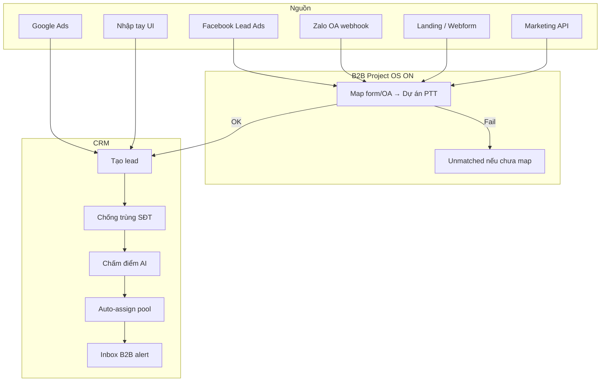

# Hướng dẫn sử dụng phân hệ Lead — đầy đủ

**Phiên bản:** 2.0 · 2026-08-19  
**Đối tượng:** AM/Sales, GDKD, Marketing, IT, Project Manager  
**Ứng dụng:** Staff console PTT CRM (ops-web) — đăng nhập tại `/login`  
**Liên quan:**

- [Nguồn lead & setup kỹ thuật](./huong-dan-nguon-lead-va-setup.md)
- [Lead → Retain (Pre-sales & Delivery)](./huong-dan-day-du-lead-den-cham-soc-khach-hang.md)
- [B2B onboard SOP](../runbooks/sales-b2b-lead-client-onboard-sop.md)
- [CSKH spa Meta 24h](../runbooks/cskh-spa-lead-meta-24h-sop.md)
- [Bật flag B2B Project OS](../runbooks/b2b-project-os-flag-on.md)

---

## Mục lục

1. [Hai luồng Lead — đừng nhầm](#1-hai-luồng-lead--đừng-nhầm)
2. [Đăng nhập & menu CRM Lead](#2-đăng-nhập--menu-crm-lead)
3. [Quyền xem & phạm vi dữ liệu](#3-quyền-xem--phạm-vi-dữ-liệu)
4. [Thiết lập môi trường (IT / GDKD)](#4-thiết-lập-môi-trường-it--gdkd)
5. [Dự án PTT & map kênh ingest](#5-dự-án-ptt--map-kênh-ingest)
6. [Nguồn Lead — tổng quan](#6-nguồn-lead--tổng-quan)
7. [Facebook / Meta Lead Ads](#7-facebook--meta-lead-ads)
8. [Zalo OA & Zalo Ads](#8-zalo-oa--zalo-ads)
9. [Google Ads](#9-google-ads)
10. [Webform / Landing](#10-webform--landing)
11. [API & nhập tay / Import](#11-api--nhập-tay--import)
12. [Xem & lọc danh sách Lead trên UI](#12-xem--lọc-danh-sách-lead-trên-ui)
13. [Tạo Lead thủ công trên UI](#13-tạo-lead-thủ-công-trên-ui)
14. [Chi tiết Lead — xử lý hàng ngày](#14-chi-tiết-lead--xử-lý-hàng-ngày)
15. [Gọi điện & Softphone](#15-gọi-điện--softphone)
16. [Inbox B2B & hội thoại Zalo](#16-inbox-b2b--hội-thoại-zalo)
17. [Intake BANT & Pre-sales](#17-intake-bant--pre-sales)
18. [GDKD: review queue, command center, KPI](#18-gdkd-review-queue-command-center-kpi)
19. [Speed-to-lead & ingress chưa map](#19-speed-to-lead--ingress-chưa-map)
20. [Sau khi Won — onboard khách hàng](#20-sau-khi-won--onboard-khách-hàng)
21. [Xử lý sự cố thường gặp](#21-xử-lý-sự-cố-thường-gặp)
22. [Phụ lục: URL, flag, script](#22-phụ-lục-url-flag-script)

---

## 1. Hai luồng Lead — đừng nhầm

Hệ thống quản lý **hai loại lead khác nhau**:

| | **B2B Sales** | **CSKH vận hành (spa)** |
|---|---------------|-------------------------|
| **Mục đích** | Bán HĐ agency **mới** cho doanh nghiệp prospect | Lead quảng cáo của **client đã ký HĐ** |
| **Menu danh sách** | CRM → **Lead B2B** | CRM → **Lead CSKH vận hành** |
| **Tạo lead** | CRM → **Tạo lead B2B** | CRM → **Tạo lead vận hành** |
| **Bắt buộc chọn** | **Dự án PTT** (khi B2B Project OS bật) | **Khách hàng agency** |
| **Không được** | Gắn `agency_client_id` | Để trống client |
| **Trạng thái thắng** | `won` | `chot` |

**Quy tắc vàng:** Prospect B2B ≠ lead spa của khách đang chạy ads.

---

## 2. Đăng nhập & menu CRM Lead

### 2.1 Đăng nhập

1. Mở trình duyệt → vào URL staff console (ví dụ `https://rs.pttads.vn/login`).
2. Nhập email/mật khẩu staff → **Đăng nhập**.
3. Nếu bật MFA: hoàn tất bước xác thực tại `/login/mfa`.
4. Sau đăng nhập, sidebar trái hiện các nhóm menu theo **quyền (cap)** của bạn.

### 2.2 Menu Lead — tra cứu nhanh

| Nhóm sidebar | Mục menu | URL | Ai dùng |
|--------------|----------|-----|---------|
| **CRM · B2B Sales** | Lead B2B | `/crm/b2b/leads` | AM B2B |
| | Inbox B2B | `/crm/b2b-inbox` | AM, GDKD |
| | Lead Intake | `/crm/intake` | AM Pre-sales |
| | Tạo lead B2B | `/crm/b2b/leads/new` | AM |
| | Kinh doanh / Đề xuất / Hub | `/crm/sales`, `/crm/proposals`, `/crm/hub` | Sales |
| **CRM · CSKH vận hành** | Lead CSKH vận hành | `/crm/operational/leads` | CSKH spa |
| | Phải tra soát (B2) | `/crm/leads/review-queue` | GDKD |
| | KPI GDKD Enterprise | `/crm/gdkd-enterprise` | GDKD |
| | Tạo lead vận hành | `/crm/operational/leads/new` | CSKH |
| **CRM · Lead chung** | Tất cả leads | `/crm/leads` | Marketing, quản lý |
| **CRM · Bán hàng & HĐ** | Dự án PTT | `/crm/b2b-projects` | IT, GDKD, PM |
| | Speed-to-lead | `/crm/b2b-speed` | GDKD |
| | GDKD command center | `/crm/b2b-gdkd` | GDKD |
| | Ingress chưa map | `/crm/b2b-unmatched` | GDKD / IT |
| **Kênh quảng cáo** | Meta / Zalo / Google Ads | `/meta/facebook-ads`, `/zalo/zalo-ads`, … | Marketing |

**Chi tiết lead:** click một dòng trong danh sách → `/crm/leads/{id}`.

---

## 3. Quyền xem & phạm vi dữ liệu

### 3.1 Capability tối thiểu

| Quyền (cap) | Cho phép trên UI |
|-------------|------------------|
| `crm_leads.view` | Xem danh sách & chi tiết (trong phạm vi) |
| `crm_leads.edit` | Tạo lead, đổi trạng thái, thêm hoạt động |
| `crm_leads.assign` | Phân lead, mở **Phải tra soát** |
| `crm_b2b_projects.view` | Dự án PTT, Speed, GDKD command center |
| `crm_b2b_projects.manage` | Tạo dự án, **Ingress chưa map** |
| `crm_gdkd.view_all_leads` | Xem mọi lead B2B mọi dự án |

### 3.2 Visibility B2B (khi `PTT_B2B_PROJECT_OS=1`)

Ngoài GDKD/Director, NV chỉ thấy lead khi **đủ cả ba**:

1. Tài khoản PTT **đang active** (`crm_staff.active = true`).
2. Có trong tab **Nhân viên** của dự án lead.
3. Bật **Nhận lead** (`assign_enabled = true`) — để thấy lead **chưa phân**.

**Ngoại lệ:**

- **Owner** (lead thuộc về bạn): luôn thấy dù đã rời pool.
- **Project Manager** (`role = project_manager`): thấy **mọi lead trong dự án** dù tắt Nhận lead.

Lead ngoài phạm vi → trang trả **404**, **không hiện** tên/SĐT.

---

## 4. Thiết lập môi trường (IT / GDKD)

> Phần này dành cho IT/DevOps trước khi NV sales dùng UI. Chi tiết kỹ thuật: [b2b-project-os-flag-on.md](../runbooks/b2b-project-os-flag-on.md).

### 4.1 Thứ tự go-live B2B Project OS

```
1. Apply DDL PostgreSQL
2. Backfill lead cũ → dự án PTT-LEGACY
3. Tạo dự án PTT + map kênh trên UI
4. Drain "Ingress chưa map"
5. Bật flag staging → UAT 48h
6. Bật flag production
```

### 4.2 DDL cần apply (PostgreSQL)

| Script | Nội dung |
|--------|----------|
| `scripts/apply_pg_ddl_b2b_lead_project_os.sh` | Core: dự án, kênh, staff |
| `scripts/apply_pg_ddl_b2b_commission_ledger.sh` | Sổ hoa hồng |
| `scripts/apply_pg_ddl_b2b_routing_ab.sh` | Routing A/B |
| `scripts/apply_pg_ddl_b2b_staff_push.sh` | Push token NV |
| `scripts/apply_pg_ddl_b2b_w5.sh` | DNC, Zalo thread, ads CAPI log |

Chạy trên VPS (có `DATABASE_URL`):

```bash
cd /var/www/rnosai
bash scripts/apply_pg_ddl_b2b_lead_project_os.sh
# … các script DDL khác theo wave đã deploy
```

### 4.3 Feature flags (`ptt-crm-api`)

| Biến môi trường | Mặc định | Ý nghĩa |
|-----------------|----------|---------|
| `PTT_B2B_PROJECT_OS` | `0` | Bật B2B Project OS: bắt buộc dự án, visibility C, ingest theo project |
| `PTT_B2B_SSE` | `1` | Alert Inbox realtime (SSE); tắt → poll 15 giây |
| `PTT_B2B_PUSH` | `0` | Web push cho NV khi có lead Hot |
| `PTT_B2B_CPAAS` | `mock` | `stringee` = gọi WebRTC thật qua softphone |
| `PTT_B2B_ADS_CAPI` | `0` | Gửi conversion Meta/Google khi lead won |
| `PTT_PRESALES_ON_LEAD` | `1` | Funnel Pre-sales trên chi tiết lead |
| `PTT_STRINGEE_*` | — | API key + số gọi ra (CPaaS) |

**Rollback nhanh:** đặt `PTT_B2B_PROJECT_OS=0` → restart `ptt-crm-api`.

### 4.4 Deploy VPS theo wave

```bash
# Ví dụ W5 (Zalo inbox, PM, DNC, ads CAPI)
APPLY=1 ./scripts/deploy_b2b_lead_project_os_w5_vps.sh
```

Script sẽ: apply DDL → build API → chạy test → build ops-web → restart service.

### 4.5 UAT trước bật prod

```bash
export API_URL=https://staging-host
export STAFF_TOKEN=…
export OUTSIDER_TOKEN=…
bash scripts/uat_b2b_project_os.sh
```

Gate tối thiểu W0: B2B-01 (POST thiếu dự án → 400), B2B-02 (outsider → 404 không lộ PII).

### 4.6 Catalog nguồn & kênh (Admin)

1. Sidebar → **Admin** → **Nguồn & Kênh** (`/admin/crm/lead-lookups`).
2. Quản lý danh mục **Nguồn** và **Kênh** hiển thị trên form tạo lead.
3. Lưu thay đổi trước khi NV tạo lead thủ công.

---

## 5. Dự án PTT & map kênh ingest

> Bắt buộc khi `PTT_B2B_PROJECT_OS=1`. Mỗi chiến dịch B2B = một **dự án PTT** (mã slug dùng trong URL webhook).

### 5.1 Tạo dự án PTT

1. Sidebar → **CRM · Bán hàng & HĐ** → **Dự án PTT**.
2. Trang **Danh sách** (`/crm/b2b-projects`).
3. Cuối trang (cần quyền `crm_b2b_projects.manage`):
   - Ô **Mã (slug webhook)**: ví dụ `seo-hcm` (chữ thường, không dấu).
   - Ô **Tên dự án mới**: ví dụ `SEO HCM Q3/2026`.
   - Bấm **+ Dự án**.
4. Click tên dự án vừa tạo → vào chi tiết.

### 5.2 Tab Tổng quan — lấy URL webhook

1. Trong chi tiết dự án → tab **Tổng quan**.
2. Ghi lại:
   - **Mã dự án** (`code`) — dùng trong URL webhook.
   - **URL webhook Meta**: `POST /api/v1/webhooks/meta/{code}`
   - **URL webhook Zalo**: `POST /api/v1/webhooks/zalo/{code}`
3. Chuyển trạng thái dự án sang **active** khi sẵn sàng nhận lead (qua API hoặc IT).

### 5.3 Tab Kênh — kiểm tra map

1. Tab **Kênh** — xem Facebook page/form, Zalo OA, webform, API key đã gắn.
2. **Lưu ý v1:** chỉnh sửa kênh trên UI chưa đầy đủ; IT có thể dùng API `PUT /api/v1/b2b-projects/{id}`.
3. Form/OA **chưa map** → lead **không tạo**, ghi vào **Ingress chưa map**.

### 5.4 Tab Nhân viên — pool phân lead

1. Tab **Nhân viên**.
2. Mỗi dòng: `staff_id`, **Nhận lead** (Có/Không), cấp **S/A/B/C**.
3. **Project Manager:** gán `role = project_manager` qua API (UI v1 chưa có dropdown riêng).
4. Chỉ NV **Nhận lead = Có** mới vào pool auto-assign và thấy lead chưa phân.

### 5.5 Tab SLA & gọi / Hoa hồng

- **SLA & gọi:** cấu hình mốc Hot/Warm/Cold (phút), giờ làm việc, bật AI gọi.
- **Hoa hồng:** First-touch % / Closer % (mặc định 30/70).

---

## 6. Nguồn Lead — tổng quan



| Nguồn (`source`) | Nhãn UI | Cách vào CRM |
|------------------|---------|--------------|
| `facebook` | Facebook | Webhook Meta |
| `zalo` | Zalo | Webhook Zalo OA |
| `google_ads` | Google Ads | Webhook / sync Google |
| `website` | Website / Form | Landing POST |
| `api` | API | Marketing ingest |
| `manual` | Nhập tay | Form UI |
| `import` | Import file | CSV (nếu bật) |
| `referral` | Giới thiệu | UI / API |

---

## 7. Facebook / Meta Lead Ads

### 7.1 IT — cấu hình webhook (B2B Project OS)

1. Meta Business Suite → Lead Ads → Webhooks.
2. URL: `https://{host}/api/v1/webhooks/meta/{project_code}`  
   Ví dụ: `https://rs.pttads.vn/api/v1/webhooks/meta/seo-hcm`
3. Map `page_id` + `form_id` vào dự án PTT (tab **Kênh** hoặc API).
4. Test gửi lead mẫu → kiểm tra **Lead B2B** hoặc **Ingress chưa map**.

### 7.2 Marketing — theo dõi trên UI

1. Sidebar → **Meta Ads** → `/meta/facebook-ads` — xem lead/campaign.
2. Sidebar → **Meta Tracking** — pixel/CAPI (liên quan conversion sau won).
3. Lead vào CRM → NV nhận alert **Inbox B2B**.

### 7.3 NV — xử lý lead Facebook

1. **Inbox B2B** → lead Hot → **Mở lead**.
2. Chi tiết lead → kiểm tra nguồn **Facebook**, campaign (nếu có).
3. Tiếp tục mục [14. Chi tiết Lead](#14-chi-tiết-lead--xử-lý-hàng-ngày).

---

## 8. Zalo OA & Zalo Ads

### 8.1 IT — webhook Zalo (B2B)

1. Zalo OA Admin → Webhook URL:  
   `https://{host}/api/v1/webhooks/zalo/{project_code}`
2. Map `oa_id` vào dự án PTT (tab **Kênh**).
3. Sự kiện hỗ trợ: `user_submit_info`, `user_send_text`, `oa_send_text`, `follow`.

### 8.2 Hội thoại hai chiều (W5)

Tin nhắn Zalo được lưu thread khi:

- Webhook có `user_send_text` / `oa_send_text`.
- Slug dự án khớp OA đã map.
- Đã có lead gắn `user_id` Zalo trong cùng dự án.

**Xem thread trên UI:** mục [16. Inbox B2B & hội thoại Zalo](#16-inbox-b2b--hội-thoại-zalo).

### 8.3 Marketing — Zalo Ads UI

1. Sidebar → **Zalo Ads** (`/zalo/zalo-ads`).
2. Sidebar → **Zalo Leads** (`/zalo/leads`).

---

## 9. Google Ads

1. IT cấu hình webhook Google theo runbook nội bộ (`PTT_WEBHOOKS_NEST_GOOGLE_ENABLED=1`).
2. Marketing theo dõi: Sidebar → **Google Ads** (`/google/google-ads`).
3. Lead vào danh sách **Lead B2B** hoặc **Tất cả leads** tùy luồng.

---

## 10. Webform / Landing

1. Form website POST tới endpoint landing (xem [huong-dan-nguon-lead-va-setup.md](./huong-dan-nguon-lead-va-setup.md)).
2. Khi B2B Project OS ON: map **webform slug** vào dự án PTT.
3. Test submit form → kiểm tra lead xuất hiện trong **Lead B2B**.

---

## 11. API & nhập tay / Import

### 11.1 API staff tạo lead

- `POST /api/v1/leads` — khi B2B ON bắt buộc `b2b_project_id`.
- Dùng cho tích hợp nội bộ; UI tương đương mục 13.

### 11.2 Marketing Ingest API (legacy multi-client)

- `POST /api/crm/integration/marketing/ingest` — Bearer token.
- Chi tiết: [huong-dan-nguon-lead-va-setup.md §7](./huong-dan-nguon-lead-va-setup.md).

---

## 12. Xem & lọc danh sách Lead trên UI

### 12.1 Lead B2B

1. Sidebar → **Lead B2B** (`/crm/b2b/leads`).
2. **Segmented control** (phía trên bảng):
   - **Tất cả** — lead trong phạm vi bạn được xem.
   - **Của tôi** — `owner_id` = bạn.
   - **Chưa phân** — chưa có owner.
3. **FilterBar:**
   - Ô tìm kiếm → gõ tên/SĐT.
   - Lọc **Trạng thái**, **Nguồn**, **Kênh**.
   - Bấm **Lọc** (hoặc Enter).
4. **Cột B2B** (có thể ẩn/hiện qua **LeadsColumnPicker**):
   - Dự án PTT, AI band (NÓNG/ẤM/LẠNH), SLA, Đang gọi.
5. Click một **hàng** → mở chi tiết `/crm/leads/{id}`.

### 12.2 Bulk assign (GDKD / cap assign)

1. Tick checkbox các lead cần phân.
2. Chọn **Owner** trong dropdown phía trên.
3. Bấm **Bulk assign**.
4. Hệ thống ghi audit và cập nhật owner.

### 12.3 Lead CSKH vận hành

1. Sidebar → **Lead CSKH vận hành** (`/crm/operational/leads`).
2. Lọc theo **client agency** (bắt buộc có client trên từng lead).
3. Thao tác tương tự B2B; luồng SLA 24h Meta: xem [cskh-spa-lead-meta-24h-sop.md](../runbooks/cskh-spa-lead-meta-24h-sop.md).

### 12.4 Tất cả leads

- Sidebar → **Tất cả leads** (`/crm/leads`) — gộp mọi luồng; dùng khi Marketing/ Director cần tra cứu toàn hệ.

---

## 13. Tạo Lead thủ công trên UI

### 13.1 Tạo lead B2B

1. Sidebar → **Tạo lead B2B** (`/crm/b2b/leads/new`).
2. Điền form:
   - **Họ tên** * (bắt buộc)
   - **SĐT**, **Email**
   - **Khách hàng agency** → để **— Không gắn client (B2B) —**
   - **Dự án PTT** * → chọn dự án (bắt buộc khi có dự án active)
   - **Nguồn**, **Kênh**, **Trạng thái** (mặc định **Mới**)
3. Bấm **Lưu** / **Tạo lead**.
4. Hệ thống chuyển tới **Chi tiết lead**.

### 13.2 Tạo lead CSKH vận hành

1. Sidebar → **Tạo lead vận hành** (`/crm/operational/leads/new`).
2. **Khách hàng agency** * — bắt buộc chọn client.
3. Không chọn dự án PTT.
4. **Lưu** → chi tiết lead.

---

## 14. Chi tiết Lead — xử lý hàng ngày

**URL:** `/crm/leads/{id}`

### 14.1 Đọc thông tin nhanh

Phần đầu trang (**Hero**):

- Họ tên, SĐT, email, trạng thái, owner, nguồn/kênh, dự án PTT (nếu B2B).

### 14.2 Panel Trí tuệ B2B (W4+)

Khối **Vì sao Hot** + **Hành động tiếp theo (NBA)**:

- Điểm AI, band NÓNG/ẤM/LẠNH, lý do giải thích.
- Gợi ý: gọi / ghi chú / hẹn gặp — bấm **Gọi ngay** nếu NBA khuyên gọi.

### 14.3 Đổi trạng thái

1. Panel **Trạng thái** (cột phải hoặc tab mobile).
2. Chọn trạng thái mới: **Mới → Đã liên hệ → Đang tư vấn → Báo giá → Won (HĐ ký)** hoặc **Lost**.
3. Với trạng thái kết thúc (`won`, `lost`, …): nhập **ghi chú audit** ≥ 3 ký tự.
4. Bấm **Lưu trạng thái**.
5. Khi **won/chot**: hệ thống có thể ghi routing A/B, ads CAPI (nếu flag bật).

### 14.4 Phân lead (assign)

1. Panel **Phân lead**.
2. Chọn **Nhân viên** nhận lead.
3. Nhập **Lý do** ≥ 3 ký tự.
4. Bấm **Phân lead**.

*(Cần cap `crm_leads.assign` hoặc quyền GDKD.)*

### 14.5 Thêm hoạt động (activity)

1. Panel **Thêm hoạt động**.
2. Chọn loại: **Gọi điện**, **Ghi chú**, **Email**, **Hẹn gặp**, …
3. Nhập nội dung → **Lưu**.
4. Timeline bên dưới hiển thị lịch sử.

### 14.6 Pre-sales funnel (khi `PTT_PRESALES_ON_LEAD=1`)

- Thanh **Lead → Tư vấn → Báo giá** trên trang.
- Bấm bước tiếp theo khi đủ điều kiện task.
- **Lead Intake:** link tới `/crm/intake?lead_id={id}`.

### 14.7 Hợp đồng trên lead

- Panel **Hợp đồng**: tạo draft → gửi GDKD duyệt → **Active** khi ký.

---

## 15. Gọi điện & Softphone

### 15.1 Trước khi gọi (PDPA / Luật VN)

1. Trên chi tiết lead, khối **Liên hệ** (`#lead-contact-actions`).
2. **Tick** ô **「KH đồng ý ghi âm」**.
3. Nút **Gọi ngay** chỉ active sau khi tick.

### 15.2 Thực hiện cuộc gọi

1. Bấm **Gọi ngay**.
2. Luồng ưu tiên:
   - **WebRTC Stringee** (khi `PTT_B2B_CPAAS=stringee`) — popup softphone trình duyệt.
   - **Server-initiated call** — nếu WebRTC lỗi.
   - **Fallback `tel:`** — mở ứng dụng gọi điện thoại nếu CPaaS down.
3. Sau cuộc gọi: thêm activity **Gọi điện** (khuyến nghị).

### 15.3 DNC (Do Not Call)

- SĐT trong bảng `crm_b2b_dnc` → API trả lỗi **`dnc_blocked`**, không cho gọi.
- AI call SLA cũng bỏ qua SĐT DNC.
- **Quản lý DNC:** hiện qua DB/API (chưa có màn admin riêng).

### 15.4 Mobile

- Thanh sticky dưới cùng (mobile): **Gọi ngay** — cùng quy tắc consent.

---

## 16. Inbox B2B & hội thoại Zalo

### 16.1 Inbox alert

1. Sidebar → **Inbox B2B** (`/crm/b2b-inbox`).
2. Tùy chọn:
   - ☑ **Chưa đọc** — chỉ alert chưa xử lý.
   - ☑ **Chuông Hot** — âm thanh khi lead NÓNG.
3. Danh sách tự **Làm mới** mỗi 15 giây (hoặc realtime SSE khi bật).
4. Mỗi dòng: chip **Hot / Inbox / Normal**, thời gian, **Lead #id**.
5. Bấm **Mở lead** hoặc **Zalo thread**.

*(GDKD có `view_all_leads` → thấy alert toàn hệ.)*

### 16.2 Zalo thread

1. Từ Inbox → **Zalo thread** hoặc URL `/crm/b2b-inbox/thread/{leadId}`.
2. Xem danh sách tin **KH** (inbound) / **OA/NV** (outbound).
3. Nhập tin trả lời → **Gửi** (lưu outbound; gửi OA thật cần token vault).
4. **Mở lead** — xử lý status song song.
5. Nếu chưa có thread: hiện *「Chưa có thread Zalo cho lead này」* — cần webhook tin nhắn + lead đã map Zalo user.

---

## 17. Intake BANT & Pre-sales

1. Từ chi tiết lead → link **Intake** hoặc Sidebar → **Lead Intake**.
2. URL: `/crm/intake?lead_id={id}`.
3. Tạo/chọn phiên Intake.
4. Lần lượt: **Discovery → BANT → Red flags → Hoàn thành**.
5. Kết quả Go/No-Go → cập nhật funnel Pre-sales trên lead.
6. Tiếp: **Đề xuất** (`/crm/proposals`), **Hub · Hợp đồng** (`/crm/hub`).

Chi tiết: [huong-dan-day-du-lead-den-cham-soc-khach-hang.md §4–8](./huong-dan-day-du-lead-den-cham-soc-khach-hang.md).

---

## 18. GDKD: review queue, command center, KPI

### 18.1 Phải tra soát (Review queue)

1. Sidebar → **Phải tra soát (B2)** (`/crm/leads/review-queue`).
2. Xem lead chờ GDKD (deal lớn, gate nội bộ).
3. **Release** — chọn auto-assign hoặc owner thủ công + ghi chú.
4. Lead quay pipeline AM.

### 18.2 GDKD command center

1. Sidebar → **GDKD command center** (`/crm/b2b-gdkd`).
2. Thẻ tóm tắt: Unmatched 24h, Hop≥2, SLA breach, CPaaS fail.
3. **AI win rate / Hybrid win rate** (30 ngày) — routing A/B.
4. Link nhanh tới Unmatched, Speed, Dự án.

### 18.3 KPI GDKD Enterprise (CSKH)

1. Sidebar → **KPI GDKD Enterprise** (`/crm/gdkd-enterprise`).
2. 8 chỉ số SLA B2 / Meta 24h.
3. Drill → **Phải tra soát** hoặc board CSKH.

---

## 19. Speed-to-lead & ingress chưa map

### 19.1 Speed-to-lead

1. Sidebar → **Speed-to-lead** (`/crm/b2b-speed`).
2. Chọn **Dự án PTT**.
3. Chọn cửa sổ **7 / 14 / 30 ngày**.
4. Xem **p50 / p95** thời gian phản hồi (trong giờ làm việc).

### 19.2 Ingress chưa map (Unmatched)

1. Sidebar → **Ingress chưa map** (`/crm/b2b-unmatched`) — cần `crm_b2b_projects.manage`.
2. Bảng liệt kê form/OA webhook nhận được nhưng **chưa gắn dự án** (không hiện PII).
3. Mỗi dòng:
   - Chọn **Dự án** trong dropdown.
   - (Facebook) nhập **Page ID** nếu được yêu cầu.
   - Bấm **Gắn dự án**.
4. **Drain hết unmatched** trước khi bật `PTT_B2B_PROJECT_OS=1` trên production.

---

## 20. Sau khi Won — onboard khách hàng

Luồng chuẩn B2B ([SOP onboard](../runbooks/sales-b2b-lead-client-onboard-sop.md)):

1. Chi tiết lead → trạng thái **Won (HĐ ký)**.
2. Hoàn tất **Hub · Hợp đồng** — HĐ **Active**.
3. Tạo **Khách hàng agency**: `/agency/clients/new`.
4. Lead chuyển sang **CSKH vận hành** — chạy SOP Meta 24h.
5. Không dùng lại lead B2B prospect cho client đã active.

---

## 21. Xử lý sự cố thường gặp

| Triệu chứng | Nguyên nhân thường gặp | Cách xử lý |
|-------------|------------------------|------------|
| Lead webhook không vào CRM | Form/OA chưa map dự án | Mở **Ingress chưa map** → gắn dự án |
| POST tạo lead B2B → 400 | Thiếu `b2b_project_id` khi flag ON | Chọn dự án trên form hoặc tắt flag (staging) |
| GET lead → 404 | Ngoài visibility C | Kiểm tra pool Nhân viên, Nhận lead, PM role |
| **Gọi ngay** không bấm được | Chưa tick consent ghi âm | Tick **KH đồng ý ghi âm** |
| Gọi báo lỗi / mở `tel:` | CPaaS down hoặc `mock` | IT kiểm tra `PTT_B2B_CPAAS`, Stringee keys |
| `dnc_blocked` | SĐT trong DNC | IT gỡ khỏi `crm_b2b_dnc` nếu hợp lệ |
| Inbox trống | Không có alert / SSE tắt | Bật `PTT_B2B_SSE`; đợi lead mới Hot |
| Zalo thread trống | Chưa có tin webhook hoặc slug lệch | Kiểm tra URL webhook `{code}` khớp dự án |
| Unmatched tăng đột biến | Campaign mới chưa map form | Marketing báo IT map form mới |

**Ingest sự cố chi tiết:** [huong-dan-nguon-lead-va-setup.md §10](./huong-dan-nguon-lead-va-setup.md).

---

## 22. Phụ lục: URL, flag, script

### 22.1 URL UI thường dùng

| Màn hình | URL |
|----------|-----|
| Lead B2B | `/crm/b2b/leads` |
| Tạo B2B | `/crm/b2b/leads/new` |
| CSKH spa | `/crm/operational/leads` |
| Chi tiết | `/crm/leads/{id}` |
| Inbox | `/crm/b2b-inbox` |
| Zalo thread | `/crm/b2b-inbox/thread/{leadId}` |
| Dự án PTT | `/crm/b2b-projects` |
| Unmatched | `/crm/b2b-unmatched` |
| Speed | `/crm/b2b-speed` |
| GDKD center | `/crm/b2b-gdkd` |
| Review queue | `/crm/leads/review-queue` |
| Intake | `/crm/intake?lead_id={id}` |
| Nguồn & Kênh admin | `/admin/crm/lead-lookups` |

### 22.2 Script vận hành

| Script | Mục đích |
|--------|----------|
| `scripts/uat_b2b_project_os.sh` | UAT B2B-01…18 |
| `scripts/smoke_b2b_project_os.sh` | Smoke sau deploy |
| `scripts/deploy_b2b_lead_project_os_w5_vps.sh` | Deploy wave W5 |
| `scripts/backfill_b2b_leads_ptt_legacy.sql` | Gán lead cũ → PTT-LEGACY |

### 22.3 Nhãn UI mixed EN/VN (tra cứu)

| Trên UI | Nghĩa |
|---------|-------|
| Speed-to-lead | Tốc độ phản hồi lead |
| GDKD command center | Trung tâm điều hành GDKD |
| Bulk assign | Phân hàng loạt |
| Solution queue | Hàng đợi solution presales |
| Lost | Thua / không chốt |
| Owner | NV phụ trách (hiển thị «Chưa phân» nếu trống) |

---

*Tài liệu này mô tả UI ops-web và hành vi backend tại commit W5 (2026-08-19). Khi flag hoặc màn hình thay đổi, cập nhật phiên bản tài liệu tương ứng.*
