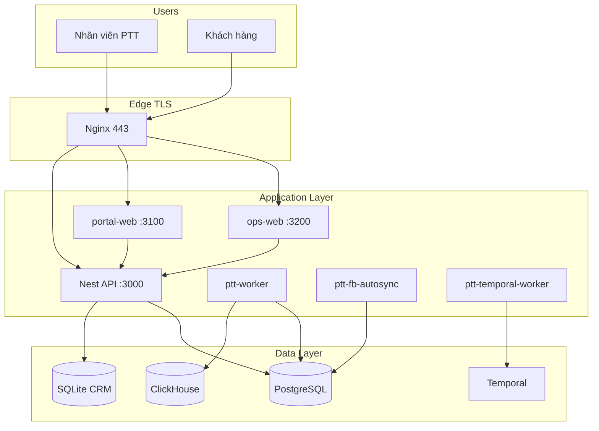

# 04 — Kiến trúc & triển khai bàn giao

> **Phiên bản:** 1.0 · **Ngày:** 2026-07-25  
> **Đối tượng:** PO khách hàng, IT liên quan, DevOps PTT  
> **Runbook chi tiết nội bộ:** [`vps-full-system-deploy.md`](../runbooks/vps-full-system-deploy.md)

---

## 1. Sơ đồ kiến trúc production



---

## 2. Domain & routing

| Domain | Vai trò | Backend |
|--------|---------|---------|
| **ops.pttads.vn** | Staff console | UI → `:3200` · API → `:3000` |
| **portal.pttads.vn** | Client portal | UI → `:3100` · API → `:3000` |
| **rs.pttads.vn** | Legacy bookmark | **302** → ops.pttads.vn |

### 2.1. Webhook công khai

```
POST https://ops.pttads.vn/api/v1/webhooks/meta
POST https://ops.pttads.vn/api/v1/webhooks/zalo
POST https://ops.pttads.vn/api/v1/webhooks/google
POST https://ops.pttads.vn/api/v1/webhooks/email
```

Webhook URL cấu hình trên Meta/Zalo/Google/ESP trỏ tới endpoint trên (HTTPS bắt buộc).

### 2.2. Health check nội bộ

```bash
curl -sf http://127.0.0.1:3000/health && echo OK
```

---

## 3. Dịch vụ systemd (VPS)

| Unit | Port / vai trò | Bắt buộc prod |
|------|----------------|---------------|
| `ptt-crm-api` | Nest `:3000` | ✅ |
| `ptt-ops-web` | Staff UI `:3200` | ✅ |
| `ptt-portal-web` | Portal `:3100` | ✅ |
| `ptt-worker` | Job queue consumer | ✅ |
| `ptt-fb-autosync` | Meta background sync | ✅ Meta |
| `ptt-temporal-worker` | Workflows | 🟡 Nếu bật Temporal |
| ~~`ptt.service`~~ | Flask Gunicorn | ❌ **Retired** |

**Timers tiêu biểu:** Meta insights sync, SEO GSC/GA4, Email send due, soak evidence Gate A.

---

## 4. Yêu cầu hạ tầng tối thiểu

| Mục | Khuyến nghị |
|-----|-------------|
| OS | Ubuntu 22.04 / 24.04 LTS |
| RAM | ≥ 8 GB |
| Disk | ≥ 80 GB SSD |
| Node.js | 22 LTS |
| Python | 3.11+ |
| PostgreSQL | 15+ |
| TLS | Let's Encrypt (certbot) |
| Firewall | Chỉ 80, 443 public |

**DNS A record:** `ops.pttads.vn`, `portal.pttads.vn`, `rs.pttads.vn` → IP VPS.

---

## 5. Schema dữ liệu (tóm tắt)

| Schema / DB | Nội dung |
|-------------|----------|
| PostgreSQL `public` + agency tables | Staff, portal users, Meta, jobs |
| PostgreSQL `seo_aeo.*` | SEO/AEO domain |
| PostgreSQL `email_mkt.*` | Email marketing |
| SQLite `ptt.db` | CRM master (customers, leads) — migration PG dần |
| ClickHouse | BI facts (SEO, Email engagement) |

Khách hàng **không** truy cập trực tiếp DB — mọi truy vấn qua API/UI.

---

## 6. Smoke test sau bàn giao (15 phút)

Thực hiện cùng PO / AM tại buổi nghiệm thu:

### 6.1. Automated (DevOps)

```bash
curl -sf http://127.0.0.1:3000/health && echo OK
systemctl is-active ptt-crm-api ptt-worker ptt-ops-web ptt-portal-web
systemctl is-active ptt.service                    # → inactive (retired)
curl -sfI https://ops.pttads.vn/crm/leads | head -1
curl -sfI https://portal.pttads.vn/login | head -1
curl -sfI https://rs.pttads.vn/crm/leads | head -1   # → 302
```

### 6.2. Manual UAT

| # | Kiểm tra | Người | OK |
|---|----------|-------|-----|
| 1 | Staff login ops → `/crm/leads` load | CSKH | [ ] |
| 2 | Portal login pilot → dashboard | Client | [ ] |
| 3 | Meta hub load + có data T-1 | AM | [ ] |
| 4 | SEO hub load | MKT | [ ] |
| 5 | Email hub load | MKT | [ ] |
| 6 | Webhook test lead → CRM | Tech | [ ] |
| 7 | Approver duyệt 1 item test | Client | [ ] |

---

## 7. Rollback khẩn cấp (tóm tắt)

> Repo hiện tại **đã xóa Flask HTTP** — rollback full cần redeploy bản pre-Wave-8 hoặc backup tarball.

### 7.1. Rollback nhanh nginx + env (≤15 phút)

- Khôi phục nginx config backup `.pre-phase5.bak`
- Tắt feature flag module lỗi (`PTT_EMAIL_ENABLED=0`, …)
- Restart Nest + ops-web + portal-web

### 7.2. Liên hệ khẩn

| Vai trò | Điền tại bàn giao |
|---------|-------------------|
| PTT DevOps | |
| PTT Tech Lead | |

Chi tiết: [`handover-production-flask-to-nest.md`](../runbooks/handover-production-flask-to-nest.md) mục 5.

---

## 8. Artifact nghiệm thu kỹ thuật (nội bộ PTT)

| Gate | File report |
|------|-------------|
| Flask retirement | `.local-dev/phase5-flask-retirement-gate-report.json` |
| Meta wave 4 | `.local-dev/phase9-email-wave4-report.json` |
| Email handoff | `.local-dev/wave-gates/email_handoff_gate_report.json` |
| SEO handoff | `.local-dev/wave-gates/seo_handoff_gate_report.json` |

PO khách **không bắt buộc** đọc JSON — dùng form A4 mục 06.

---

## 9. Bàn giao credential

Sử dụng form: [`ban-giao-tai-khoan-credentials-a4.html`](../forms/ban-giao-tai-khoan-credentials-a4.html)

**Không ghi** API key / mật khẩu vào email hoặc chat — chỉ vault/KV hoặc buổi bàn giao trực tiếp.

| Loại | Giao cho | Lưu trữ |
|------|----------|---------|
| Portal viewer/approver | Client PO | Client password manager |
| Staff accounts | PTT HR | PG `staff_users` |
| Webhook verify secrets | PTT DevOps | VPS `.env` |
| ESP / Meta tokens | PTT Tech | Encrypted vault |
