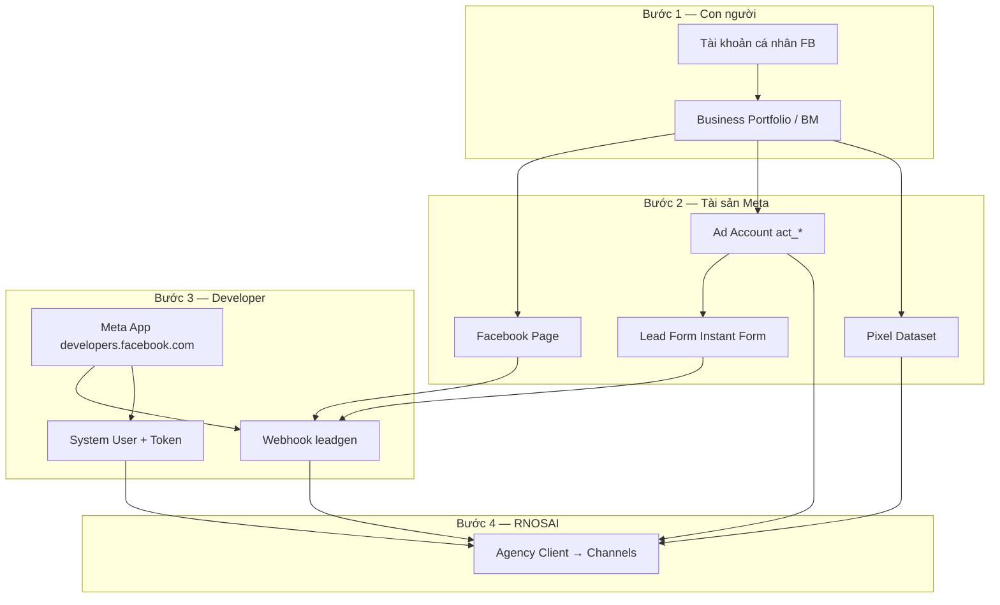

# Hướng dẫn quy trình — Meta: Tài khoản, App, Form, ID & Token

> **Phiên bản:** 1.0 · **Cập nhật:** 2026-08-10  
> **Đối tượng:** AM, Media Buyer, Tracking/Tech, IT — thiết lập Meta **trước** khi map vào RNOSAI/PTTADS  
> **Liên quan RNOSAI:** [`huong-dan-su-dung/05-meta-ads.md`](huong-dan-su-dung/05-meta-ads.md) · [`runbooks/wave-b3.1-meta-webhook-nest.md`](runbooks/wave-b3.1-meta-webhook-nest.md)

---

## Mục lục

1. [Tổng quan quy trình](#1-tổng-quan-quy-trình)
2. [Tài khoản cá nhân Facebook](#2-tài-khoản-cá-nhân-facebook)
3. [Tài khoản doanh nghiệp (Business Portfolio)](#3-tài-khoản-doanh-nghiệp-business-portfolio)
4. [Trang Facebook (Page)](#4-trang-facebook-page)
5. [Tài khoản quảng cáo (Ad Account)](#5-tài-khoản-quảng-cáo-ad-account)
6. [Pixel & Events Manager](#6-pixel--events-manager)
7. [Tạo Lead Form (Instant Form)](#7-tạo-lead-form-instant-form)
8. [Tạo Meta App (Developer)](#8-tạo-meta-app-developer)
9. [Lấy ID — bảng tra cứu](#9-lấy-id--bảng-tra-cứu)
10. [Lấy Token — bảng tra cứu](#10-lấy-token--bảng-tra-cứu)
11. [Webhook Lead Ads → RNOSAI](#11-webhook-lead-ads--rnosai)
12. [Nhập vào RNOSAI (Agency Client)](#12-nhập-vào-rnosai-agency-client)
13. [Checklist go-live](#13-checklist-go-live)
14. [Xử lý sự cố](#14-xử-lý-sự-cố)

---

## 1. Tổng quan quy trình



**Thứ tự khuyến nghị:**

| # | Việc | Ai làm |
|---|------|--------|
| 1 | Tài khoản cá nhân (admin) | Chủ DN / IT |
| 2 | Business Portfolio + xác minh DN | Chủ DN |
| 3 | Page + Ad Account + Pixel | AM + Buyer |
| 4 | Lead Form trên Ads Manager | Buyer |
| 5 | Meta App + quyền + System User | Tracking / IT |
| 6 | Webhook + copy ID/Token | Tracking / IT |
| 7 | Map vào RNOSAI | Tracking / AM |

---

## 2. Tài khoản cá nhân Facebook

### Mục đích

Mọi thao tác Business Manager, quảng cáo, Developer **gắn với một tài khoản cá nhân** làm admin. Không dùng tài khoản cá nhân để chạy ads trực tiếp khi đã có Business.

### Quy trình tạo mới

1. Mở https://www.facebook.com/reg/
2. Nhập **Họ tên**, **Email/SĐT**, **Mật khẩu**, **Ngày sinh**, **Giới tính**
3. Xác nhận email/SĐT qua mã OTP
4. Bật **xác thực 2 bước (2FA)** — **bắt buộc** cho admin Business:
   - Settings → Security → Two-factor authentication → Authenticator app

### Quy trình dùng tài khoản có sẵn

1. Đăng nhập https://www.facebook.com
2. Kiểm tra email/SĐT còn truy cập được (recovery)
3. Bật 2FA nếu chưa có
4. Tài khoản này sẽ là **Business Admin** — không chia sẻ mật khẩu; thêm người khác qua Business roles

### Lưu ý

- Dùng email công ty (`@congty.vn`) cho admin chính
- Tránh dùng profile bị checkpoint/khóa quảng cáo
- Một người có thể quản lý nhiều Business Portfolio

---

## 3. Tài khoản doanh nghiệp (Business Portfolio)

> Meta gọi **Business Portfolio** (trước đây **Business Manager** — BM). URL: https://business.facebook.com

### 3.1. Tạo Business Portfolio mới

1. Đăng nhập tài khoản cá nhân admin
2. Mở https://business.facebook.com/overview
3. **Create account** / **Tạo tài khoản**
4. Nhập:
   - **Tên doanh nghiệp** (tên agency hoặc tên khách hàng tùy mô hình)
   - **Tên của bạn**
   - **Email công ty**
5. **Submit** → Business Portfolio được tạo

### 3.2. Xác minh doanh nghiệp (Business Verification)

Cần cho: tăng hạn mức ads, một số quyền API, CAPI ổn định.

1. Business Settings → **Security Center** → **Business verification**
2. Nộp:
   - Giấy ĐKKD / GPĐKKD
   - Bill điện/nước hoặc giấy tờ pháp nhân
   - Domain email công ty
3. Chờ Meta duyệt (vài ngày đến vài tuần)

### 3.3. Thêm thành viên & phân quyền

**Business Settings → Users → People:**

| Vai trò Meta | RNOSAI tương đương | Quyền |
|--------------|-------------------|-------|
| Admin | Super Admin / IT | Toàn Business |
| Employee (Finance) | Finance | Xem billing |
| Employee (Ads) | Media Buyer | Ads Manager |
| Partner (Agency) | PTT agency | Quản lý ad account khách |

**Quy trình thêm Buyer/AM:**

1. **Add** → nhập email Facebook cá nhân của nhân viên
2. Gán quyền trên **Ad accounts**, **Pages**, **Pixels** tương ứng
3. Nhân viên **chấp nhận invite** qua email/notification

### 3.4. Business ID

**Lấy Business ID:**

1. Business Settings → **Business info**
2. Copy **Business ID** (số dài, VD: `123456789012345`)

Dùng khi: partner access, support Meta, một số API.

---

## 4. Trang Facebook (Page)

Lead Ads và webhook **bắt buộc gắn Page**.

### 4.1. Tạo Page mới

1. https://www.facebook.com/pages/creation/ hoặc Business Settings → **Accounts → Pages → Add**
2. Chọn loại: **Business or Brand**
3. Nhập **Tên Page**, **Category**, **Mô tả**
4. **Create Page**

### 4.2. Gán Page vào Business Portfolio

1. Business Settings → **Accounts → Pages**
2. **Add** → **Add a Page** (Page owned) hoặc **Request access** (Page khách)
3. Chọn quyền: **Manage Page**, **Advertise**, **Analyze**

### 4.3. Lấy Page ID

**Cách 1 — About:**

1. Mở Page → **About** → **Page transparency** → **Page ID**

**Cách 2 — Business Settings:**

1. Business Settings → Pages → chọn Page → copy ID cột bên phải

**Cách 3 — Graph API Explorer (xem §8.4):**

```
GET /me/accounts
→ field "id" của Page
```

**Format lưu RNOSAI:** `facebook_page_id` = số thuần (VD: `123456789012345`)

---

## 5. Tài khoản quảng cáo (Ad Account)

### 5.1. Tạo Ad Account

1. Business Settings → **Accounts → Ad accounts**
2. **Add → Create a new ad account**
3. Nhập:
   - **Ad account name** (VD: `CLIENT_ABC_VN_2026`)
   - **Time zone:** `(GMT+07:00) Bangkok, Hanoi, Jakarta`
   - **Currency:** `VND`
4. **Create**

### 5.2. Gán người vận hành

1. Ad account → **Add people**
2. Chọn Buyer/AM → quyền:
   - **Manage campaigns** (chạy ads)
   - **View performance** (chỉ xem)
3. **Save**

### 5.3. Thanh toán (Billing)

1. Ads Manager → **Billing & payments**
2. Thêm **Payment method** (thẻ / hợp đồng Meta invoice)
3. Gán **Business** làm trả tiền (agency trả hoặc khách trả — theo HĐ)

### 5.4. Lấy Ad Account ID

**Business Settings → Ad accounts → click account:**

- ID hiển thị dạng **`act_1234567890`**

**Lưu RNOSAI:**

| Field | Giá trị |
|-------|---------|
| `channel` | `meta` |
| `external_account_id` | `act_1234567890` |

> Luôn giữ prefix `act_` khi map API Graph.

---

## 6. Pixel & Events Manager

### 6.1. Tạo Dataset (Pixel)

1. Business Settings → **Data sources** → **Datasets** (hoặc Events Manager https://business.facebook.com/events_manager)
2. **Connect data sources → Web → Meta Pixel**
3. Đặt tên dataset (VD: `Pixel_CLIENT_ABC`)
4. **Create**

### 6.2. Gán Pixel cho Ad Account / Page

1. Events Manager → chọn Dataset
2. **Settings → Assign partners** hoặc link Ad account trong Business Settings → **Data sources**

### 6.3. Lấy Pixel ID

Events Manager → Dataset → **Settings**:

- **Dataset ID** / **Pixel ID** — số 15–16 chữ số (VD: `123456789012345`)

**Lưu RNOSAI** (`client_channel_accounts.meta` JSON):

```json
{
  "pixel_id": "123456789012345",
  "capi_enabled": 1
}
```

### 6.4. CAPI (Conversion API) — tóm tắt

1. Events Manager → Dataset → **Settings → Conversions API**
2. Generate **Access token** cho CAPI (hoặc dùng System User token)
3. RNOSAI gửi event server-side — cấu hình tại `/meta/tracking`

---

## 7. Tạo Lead Form (Instant Form)

### 7.1. Tạo form trong Ads Manager

1. Mở https://adsmanager.facebook.com
2. Chọn **Ad account** đúng
3. **All tools → Instant forms** (hoặc trong flow tạo campaign Lead)

**Hoặc trong campaign wizard:**

1. **+ Create** → Objective **Leads**
2. Ad set → **Instant form** → **Create form**

### 7.2. Cấu hình form

| Tab | Khuyến nghị |
|-----|-------------|
| **Form type** | More volume (nhiều lead) hoặc Higher intent (câu hỏi lọc) |
| **Intro** | Logo + mô tả ngắn |
| **Questions** | Họ tên, SĐT, Email — thêm câu custom nếu cần |
| **Privacy** | Link privacy policy công ty |
| **Thank you screen** | CTA + link website |

**Field mapping RNOSAI:** webhook parse `full_name`, `phone_number`, `email` — custom question → field name trong Graph.

### 7.3. Gắn form vào campaign

1. Ad level → **Instant form** → chọn form vừa tạo
2. Page phải là Page nhận lead
3. Publish campaign (sau Launch QA trên RNOSAI)

### 7.4. Lấy Form ID

**Cách 1 — Instant Forms library:**

1. Ads Manager → **All tools → Instant forms**
2. Click form → URL chứa ID hoặc **Form ID** trong detail

**Cách 2 — Graph API:**

```
GET /{page-id}/leadgen_forms
→ field "id"
```

**Lưu RNOSAI:**

```json
{
  "facebook_form_id": "2814926042203269"
}
```

Dùng để routing webhook multi-client (map form → client).

---

## 8. Tạo Meta App (Developer)

App dùng cho: **webhook leadgen**, **Graph API** (đọc lead, insights), **CAPI**.

### 8.1. Tạo App

1. https://developers.facebook.com/
2. **My Apps → Create App**
3. Use case: **Other** → **Business** (hoặc **Manage everything on your Page** tùy wizard hiện tại)
4. Nhập **App name** (VD: `PTTADS Production`), **App contact email**
5. Chọn **Business Portfolio** gắn app
6. **Create app**

### 8.2. Thêm sản phẩm (Products)

Trong App Dashboard → **Add product**:

| Product | Mục đích |
|---------|----------|
| **Webhooks** | Nhận leadgen realtime |
| **Marketing API** | Insights, ads read/write |
| **Facebook Login for Business** | OAuth (tuỳ chọn) |

### 8.3. App Review — quyền cần xin

**App Review → Permissions and Features:**

| Permission | Dùng cho |
|------------|----------|
| `ads_read` | Sync insights hub |
| `ads_management` | Campaign write (Ads Ops) |
| `leads_retrieval` | Lấy chi tiết lead từ leadgen_id |
| `pages_read_engagement` | Page webhook |
| `pages_manage_ads` | Lead ads |
| `pages_show_list` | List pages |
| `business_management` | Business assets |

> Development mode: chỉ admin/tester app test được. **Live mode** + App Review pass mới production.

### 8.4. Lấy App ID & App Secret

**App Dashboard → App settings → Basic:**

| Field | Ví dụ | Lưu ở đâu RNOSAI |
|-------|-------|------------------|
| **App ID** | `1234567890123456` | Meta Developer (reference) |
| **App Secret** | `abc123...` | `.env` → `CRM_FACEBOOK_APP_SECRET` |

⚠️ **App Secret không commit git** — chỉ server `.env`.

**Show** App Secret → copy một lần → lưu vault/password manager.

### 8.5. System User & token dài hạn (khuyến nghị production)

Thay vì Page token cá nhân hay hạn:

1. Business Settings → **Users → System users**
2. **Add** → tên `PTTADS-SYSTEM`, role **Admin**
3. **Generate new token** → chọn App vừa tạo
4. Tick permissions: `ads_read`, `ads_management`, `leads_retrieval`, …
5. **Generate token** → copy **System User access token**

**Lưu RNOSAI:**

- Agency Client → Channels → Meta → **Access token** (vault mã hóa `PTT_TOKEN_VAULT_KEY`)
- **Token expiry** — ghi ngày; job `ptt-meta-token-refresh` refresh tự động

### 8.6. Page Access Token (cách thay thế / bổ sung)

**Graph API Explorer:** https://developers.facebook.com/tools/explorer/

1. Chọn **App**
2. **User or Page** → chọn **Page**
3. **Generate Access Token**
4. Permissions: `pages_manage_ads`, `leads_retrieval`, …
5. **Generate**

Đổi sang **long-lived token:**

```http
GET https://graph.facebook.com/v21.0/oauth/access_token
  ?grant_type=fb_exchange_token
  &client_id={app-id}
  &client_secret={app-secret}
  &fb_exchange_token={short-lived-token}
```

Lưu `.env` fallback: `CRM_FACEBOOK_PAGE_ACCESS_TOKEN` (Nest ưu tiên vault per-client).

---

## 9. Lấy ID — bảng tra cứu

| ID | Ví dụ format | Lấy ở đâu | Lưu RNOSAI |
|----|--------------|-----------|------------|
| **Business ID** | `123456789012345` | Business Settings → Business info | Reference |
| **Page ID** | `123456789012345` | Page About / Business Settings | `meta.facebook_page_id` |
| **Ad Account ID** | `act_1234567890` | Business Settings → Ad accounts | `external_account_id` |
| **Pixel / Dataset ID** | `123456789012345` | Events Manager → Settings | `meta.pixel_id` |
| **Lead Form ID** | `2814926042203269` | Instant Forms / Graph API | `meta.facebook_form_id` |
| **App ID** | `1234567890123456` | developers.facebook.com → Basic | Reference / OAuth |
| **Campaign ID** | `120210123456789012` | Ads Manager URL / Insights API | Map hub campaign |
| **Ad ID** | `120210123456789013` | Ads Manager | Creative registry |

### Graph API — lệnh hay dùng

```bash
# Page ID + Page token test
curl "https://graph.facebook.com/v21.0/me/accounts?access_token=TOKEN"

# Lead forms trên Page
curl "https://graph.facebook.com/v21.0/{page-id}/leadgen_forms?access_token=TOKEN"

# Ad accounts của Business
curl "https://graph.facebook.com/v21.0/{business-id}/owned_ad_accounts?access_token=TOKEN"
```

---

## 10. Lấy Token — bảng tra cứu

| Token | TTL | Mục đích | Lưu RNOSAI |
|-------|-----|----------|------------|
| **App Secret** | Vĩnh viễn (rotate được) | Verify webhook HMAC | `CRM_FACEBOOK_APP_SECRET` |
| **Verify Token** | Tự đặt (string random) | Meta subscribe webhook | `CRM_FACEBOOK_VERIFY_TOKEN` |
| **User access token** | Ngắn / long-lived | Dev test Explorer | Không production |
| **Page access token** | Long-lived | Fetch leadgen detail | Vault hoặc `CRM_FACEBOOK_PAGE_ACCESS_TOKEN` |
| **System User token** | Không hết hạn* | Insights sync + write | Vault per client |
| **CAPI access token** | Theo dataset | Server events | `/meta/tracking` config |

\*System User token có thể bị revoke khi đổi quyền — theo dõi `token_status` trên Agency UI.

### Tạo Verify Token (tự đặt)

```bash
# Ví dụ generate random
openssl rand -hex 32
# → paste vào CRM_FACEBOOK_VERIFY_TOKEN VÀ Meta App Webhook verify field
```

**Phải khớp 100%** giữa Meta Developer Console và `.env` server.

---

## 11. Webhook Lead Ads → RNOSAI

### 11.1. Cấu hình Meta App Webhook

1. developers.facebook.com → **App → Webhooks**
2. **Subscribe to object:** `Page`
3. **Callback URL (production RNOSAI):**

   ```
   https://rs.pttads.vn/api/v1/webhooks/meta
   ```

   (Staging thay domain tương ứng)

4. **Verify token:** = `CRM_FACEBOOK_VERIFY_TOKEN`
5. **Subscription fields:** tick **`leadgen`**
6. **Verify and save**

### 11.2. Subscribe Page

1. Cùng màn Webhooks → **Page** → **Subscribe** Page ID cần nhận lead
2. Hoặc API:

```
POST /{page-id}/subscribed_apps
  ?subscribed_fields=leadgen
  &access_token={page-access-token}
```

### 11.3. Luồng xử lý RNOSAI

```
Meta POST leadgen
  → Nest /api/v1/webhooks/meta
  → Verify X-Hub-Signature-256 (App Secret)
  → Resolve client_id (Page ID / Form ID mapping)
  → Graph API fetch lead field_data
  → Queue ingest_lead → /crm/leads
```

Chi tiết: [`runbooks/wave-b3.1-meta-webhook-nest.md`](runbooks/wave-b3.1-meta-webhook-nest.md)

### 11.4. Biến môi trường server

```bash
PTT_WEBHOOKS_NEST_ENABLED=1
PTT_WEBHOOKS_NEST_META=1
PTT_JOBS_ENABLED=1
PTT_TOKEN_VAULT_KEY=<32-byte-secret>

CRM_FACEBOOK_VERIFY_TOKEN=<your-verify-token>
CRM_FACEBOOK_APP_SECRET=<app-secret>
CRM_FACEBOOK_PAGE_ACCESS_TOKEN=<fallback-page-token>
```

### 11.5. Test webhook

1. Meta App → Webhooks → **Test** subscription `leadgen`
2. Hoặc submit form test trên Instant Form
3. Kiểm tra:
   - Lead trên `/crm/leads` source=facebook
   - Job queue `ingest_lead`
   - Smoke: `./scripts/wave_b3_1_smoke.sh`

---

## 12. Nhập vào RNOSAI (Agency Client)

### 12.1. UI ops-web

1. `/agency/clients/[id]?tab=channels`
2. **+ Thêm kênh Meta**
3. Điền:

| Field UI | Giá trị |
|----------|---------|
| Ad Account ID | `act_1234567890` |
| Access Token | System User token hoặc Page token |
| Token expiry | Ngày hết hạn (nếu biết) |
| Pixel ID | `123456789012345` |
| Facebook Page ID | `123456789012345` |
| Form ID (optional) | `2814926042203269` |
| Target CPL (optional) | VND — ngưỡng alert |

4. **Save** — token mã hóa vault
5. **Sync insights** → verify hub T+1

### 12.2. CLI seed (staging)

```bash
export CLIENT_CODE=DEMO
export META_AD_ACCOUNT_ID=act_1234567890
export META_ACCESS_TOKEN=EAAx...
export META_PIXEL_ID=123456789012345
export TOKEN_EXPIRES=2026-12-31
./scripts/seed_meta_channel_account.py
```

### 12.3. Verify token còn sống

```bash
curl "https://graph.facebook.com/v21.0/act_1234567890?fields=name,account_status&access_token=TOKEN"
```

Kỳ vọng HTTP 200 + JSON `name`, `account_status: 1`.

---

## 13. Checklist go-live

### Meta phía khách / agency

- [ ] Business Portfolio tạo + (khuyến nghị) Business Verification
- [ ] Page tạo + gán Business
- [ ] Ad Account `act_*` + billing OK
- [ ] Pixel/Dataset tạo + gán ad account
- [ ] Lead Form tạo + gắn campaign test
- [ ] Meta App Live + App Review permissions pass
- [ ] System User token generate + lưu vault an toàn
- [ ] Webhook `leadgen` subscribe Page — verify OK
- [ ] Test submit form → lead vào CRM ≤ 1 phút

### RNOSAI phía PTT

- [ ] `PTT_TOKEN_VAULT_KEY` set trên VPS
- [ ] `CRM_FACEBOOK_*` env khớp App
- [ ] Agency client map: act_*, page_id, pixel_id, form_id
- [ ] Insights sync T+1 OK trên `/meta/facebook-ads`
- [ ] Launch QA pass trước campaign production
- [ ] Portal `/meta` hiển thị KPI client

---

## 14. Xử lý sự cố

| Triệu chứng | Nguyên nhân | Cách xử lý |
|-------------|-------------|------------|
| Webhook verify fail | Verify token không khớp | Meta App ↔ `.env` cùng một string |
| `Invalid OAuth access token` | Token hết hạn / revoke | Generate System User token mới |
| Lead webhook OK nhưng CRM trống | Thiếu `leads_retrieval` | App Review + Page token scope |
| `delivery.rejected` Meta | URL 404/500, trailing `/` | URL chính xác, không `/` cuối |
| Signature invalid | Sai App Secret | Copy lại App Secret Basic settings |
| Wrong client lead | Page ID chưa map | Sửa `facebook_page_id` trên channel account |
| Insights = 0 | Sai `act_*` hoặc token thiếu `ads_read` | Verify Graph + sync manual |
| App Development mode | Chưa Live | Switch Live + Review |

**Probe webhook local:**

```bash
python3 scripts/ptt_fb_webhook_probe.py
```

**Token refresh runbook:** [`runbooks/meta-token-refresh.md`](runbooks/meta-token-refresh.md)

---

## Tài liệu liên quan

| File | Nội dung |
|------|----------|
| [`huong-dan-su-dung/05-meta-ads.md`](huong-dan-su-dung/05-meta-ads.md) | Dùng Meta trên ops-web |
| [`huong-dan-meta-enterprise-ops.md`](huong-dan-meta-enterprise-ops.md) | Vận hành enterprise đầy đủ |
| [`crm/huong-dan-nguon-lead-va-setup.md`](crm/huong-dan-nguon-lead-va-setup.md) | Facebook Lead CRM (legacy path) |
| [`META_ENTERPRISE_GUIDE.md`](META_ENTERPRISE_GUIDE.md) | Setup RNOSAI Meta module |

---

*Meta thay đổi giao diện định kỳ — nếu menu lệch, tìm tương đương trong Business Settings, Events Manager, developers.facebook.com.*
