# Hướng dẫn đầy đủ — Phân hệ AI Video (Module 7 · Video SOP Studio)

> **Phiên bản:** S14 (L5 adapters) · **Cập nhật:** 2026-08-21  
> **Đối tượng:** AM, Copy, Art, Motion, Editor, IT/Ops  
> **URL staff:** https://rs.pttads.vn  
> **Spec thiết kế:** [`2026-08-20-video-sop-module-7-design.md`](../superpowers/specs/2026-08-20-video-sop-module-7-design.md)  
> **Runbook sự cố:** [19-video-sop-runbook.md](./19-video-sop-runbook.md)  
> **Tóm tắt S4 (brief → keyframe):** [19-video-sop.md](./19-video-sop.md)

Tài liệu này mô tả **toàn bộ vòng đời Video chiến dịch (cinematic SOP)** — từ bật module, cấu hình provider, đến thao tác **từng bước trên UI** (ops-web). Phân hệ xử lý **ảnh** (Leonardo / Flux fallback / Topaz enhance) và **video** (Runway draft · Kling final qua Leonardo · FFmpeg post · Topaz video saga).

---

## Mục lục

1. [Tổng quan & hai studio](#1-tổng-quan--hai-studio)
2. [Thiết lập môi trường](#2-thiết-lập-môi-trường)
3. [Provider, model & nguồn media](#3-provider-model--nguồn-media)
4. [Quyền RBAC (cap)](#4-quyền-rbac-cap)
5. [Luồng end-to-end trên UI](#5-luồng-end-to-end-trên-ui)
6. [Quản lý Image (chi tiết)](#6-quản-lý-image-chi-tiết)
7. [Video từ tất cả nguồn](#7-video-từ-tất-cả-nguồn)
8. [Post pipeline, Topaz & Delivery](#8-post-pipeline-topaz--delivery)
9. [Admin Providers & Production Dashboard](#9-admin-providers--production-dashboard)
10. [Kiểm tra & deploy VPS](#10-kiểm-tra--deploy-vps)
11. [Xử lý sự cố thường gặp](#11-xử-lý-sự-cố-thường-gặp)
12. [Wireframe / mockup từng màn hình](#12-wireframe--mockup-từng-màn-hình)

**Checklist onboarding theo role:** [21-video-sop-onboarding-checklist.md](./21-video-sop-onboarding-checklist.md) (AM · Motion · IT)

---

## 1. Tổng quan & hai studio

RNOSAI có **hai studio video** độc lập. Chọn sai studio → pipeline và output khác hẳn; **không đổi studio** sau khi đã có job.

| | Video tuần (Media AI · Social FFmpeg) | Video chiến dịch (SOP · tài liệu này) |
|--|--------------------------------------|----------------------------------------|
| **Vị trí UI** | Content Board → tab **Media AI** | `/crm/video` + `/crm/video/[id]` |
| **Đơn vị** | Content item, 4 beat FFmpeg | `vd_projects` + brief + script + shot |
| **Flag bật** | `PTT_CMKT_VIDEO_SOCIAL=1` | `PTT_CMKT_VIDEO_CINEMATIC=1` + `NEXT_PUBLIC_CMKT_VIDEO_CINEMATIC=1` |
| **Thời lượng** | 15–35s, vài phút | 15–60s, 9–18 giờ (4 cổng QC) |
| **Engine** | TTS + B-roll + caption FFmpeg | Keyframe → Runway draft → Kling final → post DAG |
| **Cap ngày** | job social/ngày | `PTT_CMKT_VIDEO_CINEMATIC_DAILY_CAP` (mặc định **1 project/ngày/lifecycle**) |

**Pipeline cinematic (tóm tắt):**

```
Content Board (lock studio)
  → Brief 8 nhóm → Script/Shotlist → Bible
  → Keyframes (Leonardo) → Gate 1 → Gate 2
  → Motion draft (Runway) → Takes → Gate 3
  → Motion final (Kling) → Cost → Post (FFmpeg/Topaz)
  → Gate 4 → Delivery + Portal review
```

---

## 2. Thiết lập môi trường

### 2.1. Biến môi trường bắt buộc

| Biến | Nơi đặt | Mục đích |
|------|---------|----------|
| `PTT_CMKT_VIDEO_CINEMATIC=1` | API (`.env` / systemd) | Bật module Video SOP trên Nest API |
| `NEXT_PUBLIC_CMKT_VIDEO_CINEMATIC=1` | Build ops-web | Hiện menu, hub, picker **Video chiến dịch (SOP)** |
| `DATABASE_URL` | API | PostgreSQL — bảng `vd_*`, registry model |

**Cap project (tùy chọn):**

| Biến | Mặc định | Ý nghĩa |
|------|----------|---------|
| `PTT_CMKT_VIDEO_CINEMATIC_DAILY_CAP` | `1` | Số project SOP tạo mới / lifecycle / ngày |

### 2.2. API key provider (chỉ env — không lưu DB)

| Biến | Provider | Dùng cho |
|------|----------|----------|
| `OPENAI_API_KEY` | OpenAI | Sinh ý tưởng / script (`text.openai.script`) |
| `PTT_VD_LEONARDO_API_KEY` | Leonardo | Keyframe image + Kling video qua Leonardo |
| `PTT_VD_RUNWAY_API_KEY` | Runway | Motion **draft** (`video.runway.gen4_turbo_draft`) |
| `PTT_VD_TOPAZ_API_KEY` | Topaz | Enhance image/video trong post DAG |
| `PTT_VD_LEONARDO_WEBHOOK_KEY` | Leonardo webhook | Xác thực `POST /api/v1/vd/webhooks/leonardo` |
| `REPLICATE_API_TOKEN` | Replicate/Flux | Fallback image khi không có Leonardo key |

**Biến vận hành / staging:**

| Biến | Ý nghĩa |
|------|---------|
| `PTT_VD_PROVIDER_STUB=1` | Bắt adapter trả stub — không gọi vendor thật |
| `VD_E2E_PROVIDERS=1` | Smoke/E2E gọi vendor live (chỉ staging) |
| `PTT_VD_TOPAZ_S3_DEST=1` | Topaz ghi ra S3 ngoài thay vì poll download URL |
| `PTT_VD_KLING_ACCESS_KEY` / `PTT_VD_KLING_SECRET_KEY` | Reserved — Kling **DIRECT** chưa bật (MVP: `VIA_LEONARDO`) |

### 2.3. Cấu hình local (dev)

1. Clone repo, cài dependency API và ops-web.
2. Thêm vào `.env` ở root (hoặc env API):

```bash
PTT_CMKT_VIDEO_CINEMATIC=1
NEXT_PUBLIC_CMKT_VIDEO_CINEMATIC=1
DATABASE_URL=postgresql://...
OPENAI_API_KEY=sk-...
PTT_VD_LEONARDO_API_KEY=...
PTT_VD_RUNWAY_API_KEY=...
# PTT_VD_TOPAZ_API_KEY=...   # tùy chọn — post DAG skip Topaz nếu thiếu
```

3. Apply DDL PostgreSQL (theo thứ tự sprint):

```bash
bash scripts/apply_pg_ddl_vd_sop_s2.sh
bash scripts/apply_pg_ddl_vd_sop_s11.sh
# S12–S14: no-op hoặc script tương ứng nếu có migration mới
```

4. Chạy API + ops-web:

```bash
# Terminal 1 — API
cd services/ptt-crm-api && npm run start:dev

# Terminal 2 — UI (flag cinematic bắt buộc lúc build/dev)
cd services/ops-web
NEXT_PUBLIC_CMKT_VIDEO_CINEMATIC=1 npm run dev
```

5. Smoke nhanh:

```bash
export PTT_CMKT_VIDEO_CINEMATIC=1
bash scripts/smoke_video_sop_s14.sh
```

### 2.4. Cấu hình VPS (production)

Host mặc định: `rs.pttads.vn` · user deploy · root `/var/www/rnosai`.

**Bước IT/Ops:**

1. SSH vào VPS, chỉnh `/var/www/rnosai/.env` — thêm đủ biến mục [2.1–2.2](#21-biến-môi-trường-bắt-buộc).
2. Deploy sprint mới nhất:

```bash
APPLY=1 bash scripts/deploy_video_sop_s14_vps.sh
```

3. Script tự: apply DDL → build Nest → build ops-web với `NEXT_PUBLIC_CMKT_VIDEO_CINEMATIC=1` → smoke S14 + S13.
4. **Restart ops-web thủ công** nếu script báo `WARN ops-web restart skipped`:

```bash
sudo /var/www/rnosai/scripts/deploy_ops_web.sh --restart
```

5. Cấu hình webhook Leonardo (dashboard Leonardo → callback URL):

```
POST https://rs.pttads.vn/api/v1/vd/webhooks/leonardo
Header: authorization: Bearer <PTT_VD_LEONARDO_WEBHOOK_KEY>
```

6. Kiểm tra health:

```bash
curl -sf https://rs.pttads.vn/api/health
bash scripts/smoke_video_sop_dual.sh
```

---

## 3. Provider, model & nguồn media

Registry nằm trong PostgreSQL (`vd_providers`, `vd_models`). UI admin: **`/admin/video/providers`**.

### 3.1. Bảng 8 model_key (seed S11)

| model_key | Capability | Route | Vendor thực tế | Job UI / queue |
|-----------|------------|-------|----------------|----------------|
| `text.openai.script` | TEXT_GEN | DIRECT | OpenAI Responses | Sinh ý tưởng / script |
| `image.leonardo.lucid_origin` | IMAGE_GEN | DIRECT | Leonardo v2 | Keyframe (`cine_keyframe`) |
| `enhance.leonardo.upscale_precise` | ENHANCE_IMAGE | DIRECT | Leonardo Aurora | Post DAG (nếu route) |
| `video.runway.gen4_turbo_draft` | VIDEO_GEN | DIRECT | Runway Gen-4 Turbo | Motion **draft** |
| `video.runway.gen45` | VIDEO_GEN | DIRECT | Runway Gen-4.5 | Dự phòng / final Runway |
| `video.kling.v3.pro` | VIDEO_GEN | VIA_LEONARDO | Kling 3.0 qua Leonardo | Motion **final** |
| `enhance.topaz.image_gigapixel` | ENHANCE_IMAGE | DIRECT | Topaz Gigapixel | Post DAG |
| `enhance.topaz.video_starlight_quality` | ENHANCE_VIDEO | DIRECT | Topaz Starlight (saga 5 bước) | Post DAG |

**Routing tự động (S13):**

- `cine_motion_draft` → `video.runway.gen4_turbo_draft`
- `cine_motion_final` → `video.kling.v3.pro` (Leonardo API)

**Fallback image (S2):** Nếu `PTT_VD_LEONARDO_API_KEY` trống nhưng có `REPLICATE_API_TOKEN` → Flux qua Replicate. Job failed `error_class=auth` trên overview = thiếu key — xem [§11](#11-xử-lý-sự-cố-thường-gặp).

### 3.2. Asset & delivery

Mọi output provider (ảnh, clip) được lưu `vd_assets` + CDN URL. Trên UI overview job hiển thị dòng `asset #… · provider · seed`. Poller + webhook Leonardo cập nhật trạng thái job (`queued` → `running` → `succeeded` / `failed`).

---

## 4. Quyền RBAC (cap)

Menu ẩn nếu thiếu cap — **không phải lỗi hệ thống**.

| Cap | Màn hình / thao tác |
|-----|---------------------|
| `crm_vd.project` view | Hub `/crm/video`, overview project |
| `crm_vd.project` create / `crm_content` write | Tạo project từ Content Board, enqueue job overview |
| `crm_vd.project` edit / `crm_content` write | Brief, nhiều màn hình fallback |
| `crm_vd.script` edit | Script, shotlist |
| `crm_vd.bible` edit | Style + Character bible |
| `crm_vd.keyframe` edit | Tạo keyframe theo shot |
| `crm_vd.gate1` … `gate3` approve | Duyệt Gate 1–3 |
| `crm_vd.motion` edit | Render motion, score take |
| `crm_vd.budget` edit | Sửa budget Cost SC-11 |
| `crm_vd.post` edit | Post pipeline, tạo editor package |
| `crm_vd.qc` edit | Gate 4, portal review link |
| `crm_vd.admin` view/create hoặc `ai_admin` view | `/admin/video/providers` |

Người chỉ có `crm_content.view` vẫn **xem** hub; cần `write` hoặc cap `crm_vd.*` để sửa.

---

## 5. Luồng end-to-end trên UI

> **Wireframe:** Mỗi bước có **mockup SVG** (layout ops-web thực tế). Nút/vùng **▶ đỏ** = thao tác chính. File nằm tại [`assets/video-sop/`](./assets/video-sop/) — tái tạo: `python3 assets/video-sop/generate-mockups.py`. Đây là wireframe hướng dẫn, **không phải screenshot production** (màu/spacing có thể lệch nhẹ).

### Bước 0 — Khởi tạo project từ Content Board

1. Đăng nhập ops-web → mở lifecycle: **`/crm/service-delivery/{lifecycle_id}?tab=content-os`**.
2. Chọn content item loại **Short video — Script** hoặc **YouTube — Script** (copy đã **approved_internal**).
3. Mở tab **Media AI**.
4. Phần **Chọn studio video** hiển thị hai thẻ:
   - **Video tuần (FFmpeg)** — social retainer.
   - **Video chiến dịch (SOP)** — bấm thẻ này (chỉ active khi flag cinematic = 1).
5. Hệ thống tạo `vd_project`, gắn `cmkt_item_id`, chuyển tới hub hoặc overview.
6. **Lưu ý:** Dòng chữ *Không đổi studio sau khi đã có job* — muốn đổi engine phải **clone item** mới.

Hub trống (`/crm/video?lifecycle_id=…` hiện *Chọn Video chiến dịch từ Content Board*) = chưa lock studio cinematic cho lifecycle đó.

**Mockup — Content Board · picker studio**

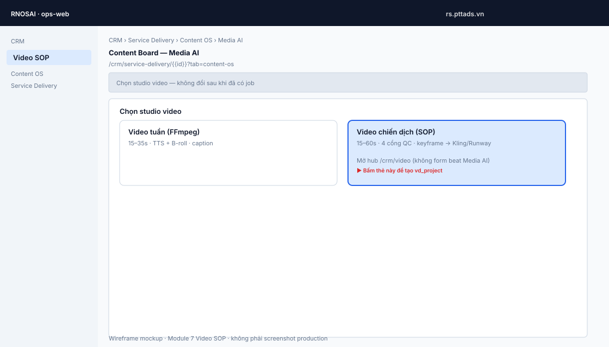

---

### Bước 1 — Hub danh sách project (SC-01)

**Route:** `/crm/video?lifecycle_id={id}`

1. Sidebar CRM → **Video SOP** (khi flag bật + có quyền view).
2. Bảng liệt kê project: id, title, stage, ngày tạo.
3. Click một dòng → **`/crm/video/{project_id}`** (overview SC-02).

**Mockup — Hub SC-01**

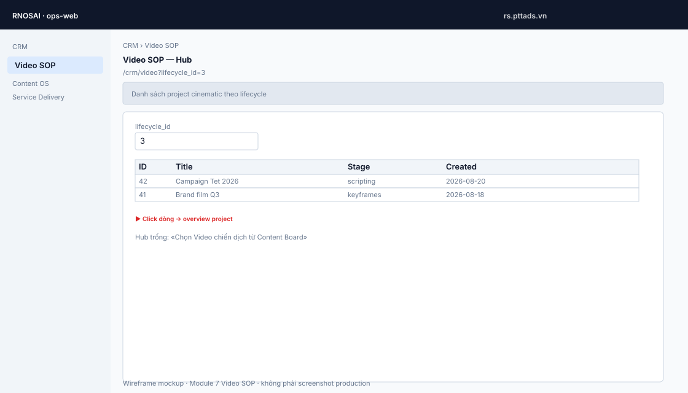

---

### Bước 2 — Overview project (SC-02)

**Route:** `/crm/video/{id}`

1. Banner sprint hiện tại (ví dụ: *S9 — Delivery SC-13 + Gate 4 live*).
2. Thanh link nhanh tới mọi màn hình con (Brief · Script · … · Delivery).
3. Khối metadata: **stage**, **cmkt_item_id**, link ngược lifecycle Content OS.
4. Bảng **Jobs** — theo dõi mọi job (`cine_keyframe`, motion, compose…).
5. (Tuỳ quyền) Nút **Tạo job keyframe thử** — smoke / debug nhanh không theo shot.
6. Nếu job failed `auth`: banner *Thiếu Leonardo/Flux key* — cấu hình env [§2.2](#22-api-key-provider-chỉ-env--không-lưu-db).

**Stage gợi ý theo tiến độ:** `draft` → `brief_ready` → `scripting` → … → `delivered` / `archived`.

**Mockup — Overview SC-02**

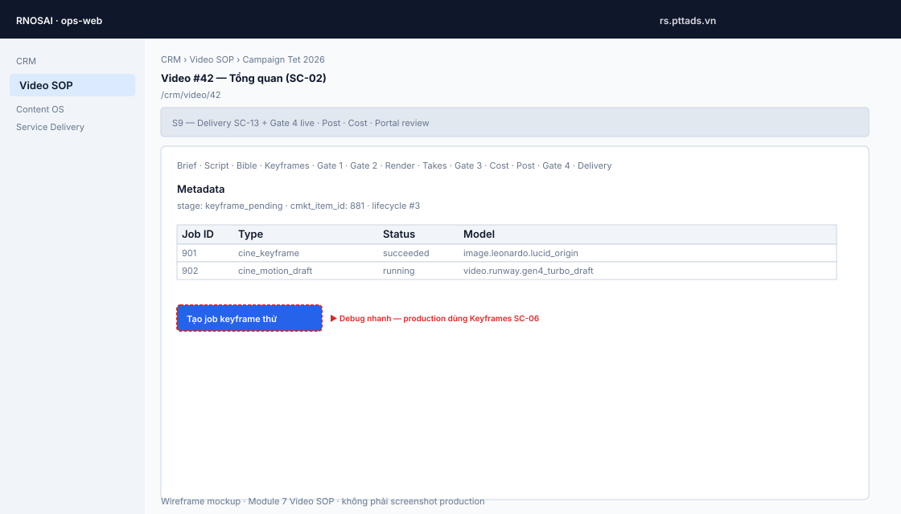

---

### Bước 3 — Brief 8 nhóm (SC-03)

**Route:** `/crm/video/{id}/brief`

| Nhóm | Field | Ràng buộc |
|------|-------|-----------|
| Mục tiêu | `objective` | ≥ 8 ký tự |
| Đối tượng | `audience` | ≥ 8 ký tự |
| Offer | `offer` | ≥ 8 ký tự |
| Thời lượng | `duration_sec` | 15–60 |
| Nền tảng | `platform` | `reels` · `shorts` · `feed_square` |
| Tone | `tone` | ≥ 4 ký tự |
| Ràng buộc | `constraints` | ≥ 8 ký tự |
| Insights M6 | `insight_ids` | **Được để trống** `[]` |

**Thao tác UI:**

1. Điền đủ 8 nhóm (insights có thể bỏ trống).
2. Bấm **Lưu brief** — lưu draft, chưa đổi stage.
3. Bấm **Đánh dấu brief sẵn sàng** — validate → `stage=brief_ready`. Thiếu field → lỗi `brief_incomplete`.

**Mockup — Brief SC-03**

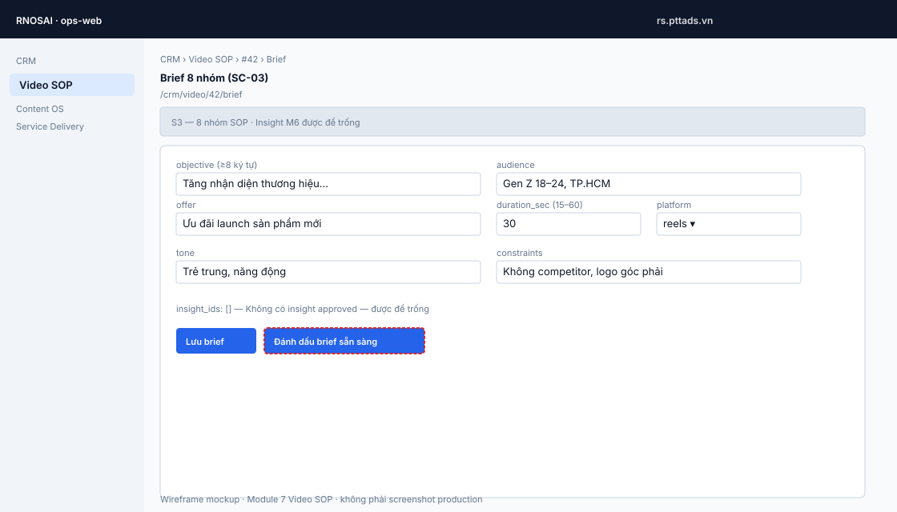

---

### Bước 4 — Script & Shotlist (SC-04)

**Route:** `/crm/video/{id}/script`

Layout **3 cột:**

| Cột | Thao tác |
|-----|----------|
| **Template** | Prompt seed (nếu trống: seed DDL chưa có) |
| **Ý tưởng / Script** | **Sinh 3 ý tưởng** → chọn một → **Chọn ý tưởng** → sửa markdown → **Lưu script** |
| **Shotlist** | Nhập `duration_ms`, `camera`, `action`, `aspect` (`9:16` / `1:1`) → **Thêm shot** |

**Lưu ý UI:**

- Badge feasibility **FR-R01…FR-R10** (hoặc `OK`) trên từng shot.
- `duration_ms` > 15000 → chặn (`feasibility_blocked`).
- **Lưu script** trước khi **Thêm shot** — nếu chưa lưu, UI báo *Lưu script trước khi thêm shot*.
- Có thể **Lưu script** trực tiếp từ `brief_ready` (stage → `scripting`) mà không cần sinh ý tưởng.

**Mockup — Script SC-04 (3 cột)**


---

### Bước 5 — Style + Character Bible (SC-05)

**Route:** `/crm/video/{id}/bible`

1. **Style:** `palette`, `lens`, `lighting`, `refs` (palette/refs: phân tách bằng dấu phẩy) → **Lưu style**.
2. **Character:** `name`, `lock_regions`, `notes` → **Thêm nhân vật** → **Lưu characters**.
3. Token `{{lock:face}}` trong shot `action` giữ nhất quán nhân vật (BR-03 lock region).

**Mockup — Bible SC-05**

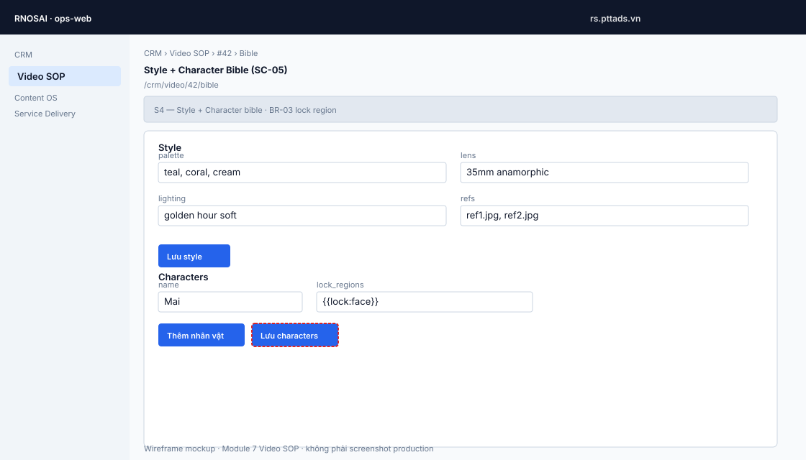

---

### Bước 6 — Keyframe Workbench (SC-06)

**Route:** `/crm/video/{id}/keyframes`

Layout 3 cột: **Shots** (trái) · **Keyframes** (giữa, tối đa 4 tile) · **Gate 2 — SC-10** (phải).

1. Chọn shot ở cột trái (nút highlight primary).
2. Bấm **Tạo keyframe cho shot** — enqueue job Leonardo (`image.leonardo.lucid_origin`).
3. Shot chuyển: `draft` → `prompts_ready` → `keyframe_pending` → (sau Gate 2) `keyframe_approved`.
4. Cột giữa hiện preview + `sha256` prefix; job list cập nhật seed.
5. Link **Gate 2** ở cột phải khi sẵn sàng duyệt.

**Mockup — Keyframes SC-06**

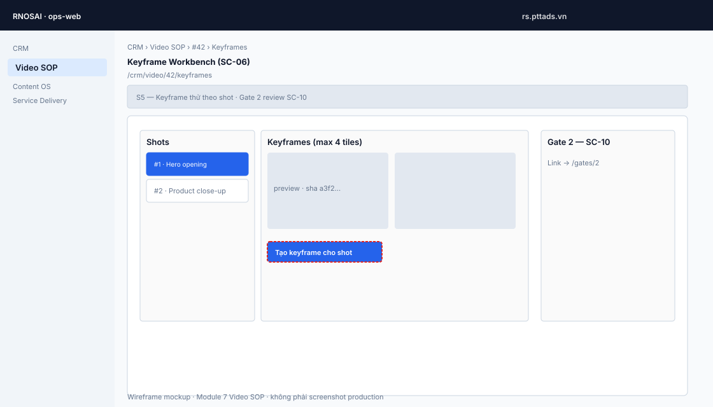

---

### Bước 7 — Gate 1 & Gate 2 (SC-10)

**Route:** `/crm/video/{id}/gates/1` và `/gates/2`

**Gate 1 — Shotlist**

1. Mở trang → banner *S5 — Gate 1 shotlist. BR-04 immutable sau approve.*
2. Bảng **Checklist** — mọi dòng phải ✓ trước khi Approve.
3. Nút **Approve** (primary) / **Reject** + textarea *Reject reason*.
4. Tuỳ chọn **Override** + lý do ≥ 10 ký tự → **Override**.
5. Approved → shotlist **immutable**; sửa script cần rework gate.

**Gate 2 — Keyframe**

1. Banner *S5 — Gate 2 keyframe. AC-R3 animating.*
2. Duyệt tương tự Gate 1.
3. Approved → stage cho phép motion render.

**Mockup — Gate SC-10 (ví dụ Gate 2; Gate 1/3/4 cùng layout)**

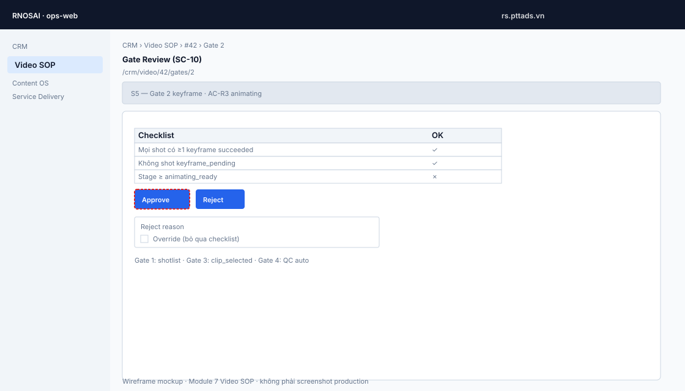

---

### Bước 8 — Motion Render (SC-07)

**Route:** `/crm/video/{id}/render`

1. Cột **Shots** — chọn shot cần render.
2. Dropdown **Job type:** `cine_motion_draft` hoặc `cine_motion_final`.
3. Khối **Credit estimate** — xem `credit_estimate`, `alert_threshold`.
4. Nếu `needs_confirm`: tick **Xác nhận vượt ngưỡng budget** trước submit.
5. Bấm **Enqueue draft motion** (Runway) hoặc **Enqueue final motion** (Kling qua Leonardo).
6. Thông báo *Job … queued — xem Takes (SC-08) sau vài giây.*
7. **BR-07:** Final motion yêu cầu ít nhất một take draft **passed** trên shot đó.

**Mockup — Render SC-07**

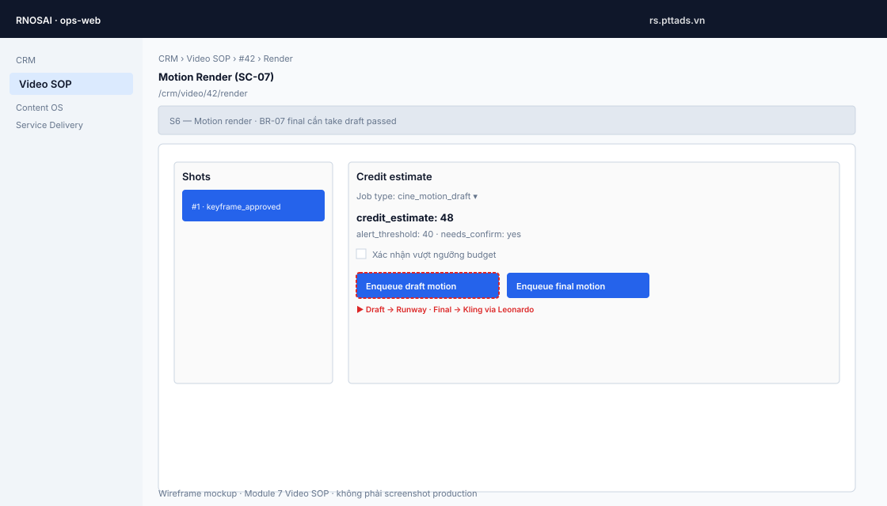

---

### Bước 9 — Takes Review (SC-08)

**Route:** `/crm/video/{id}/takes`

1. Lưới video take — playback **0.25x** để soi chi tiết.
2. Click một take → khối **Score take #…**
3. Chọn **Verdict:** `passed` / `failed`, ghi **artifact_json.notes**.
4. **Ghi score** — lưu đánh giá.
5. **Chọn take (clip_selected)** — gán take cho shot (`clip_selected`).
6. **BR-08:** Sau 5 lần fail liên tiếp trên shot → block enqueue thêm (xem runbook).

**Mockup — Takes SC-08**

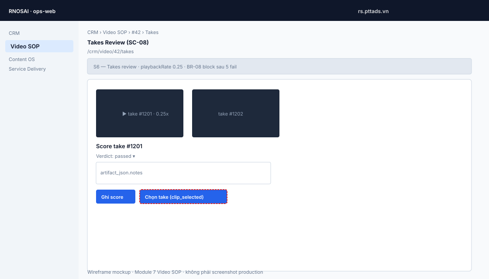

---

### Bước 10 — Gate 3 (SC-10)

**Route:** `/crm/video/{id}/gates/3`

- Checklist yêu cầu **≥ 1 shot** ở trạng thái `clip_selected`.
- Approve → cho phép post pipeline / final hàng loạt.

**Mockup — Gate 3** *(layout giống [Gate 2 mockup](#bước-7--gate-1--gate-2-sc-10); checklist khác: ≥1 shot `clip_selected`)*


---

### Bước 11 — Cost Ledger (SC-11)

**Route:** `/crm/video/{id}/cost`

1. Xem **Budget:** `estimated_total`, `actual_total`, cảnh báo `warn70` / `warn90` / `warn100`.
2. (PM) Sửa `limit_amount`, `buffer_factor`, `overshoot_factor` → **Lưu budget**.
3. Bảng **Ledger** — từng dòng reserve/charge theo vendor.
4. Khi project **cancelled** hoặc **archived** → **Tải export.xlsx** (kế toán).

**BR-06:** Enqueue bị chặn `budget_exceeded` khi vượt limit — tăng budget trước khi render tiếp.

**Mockup — Cost SC-11**

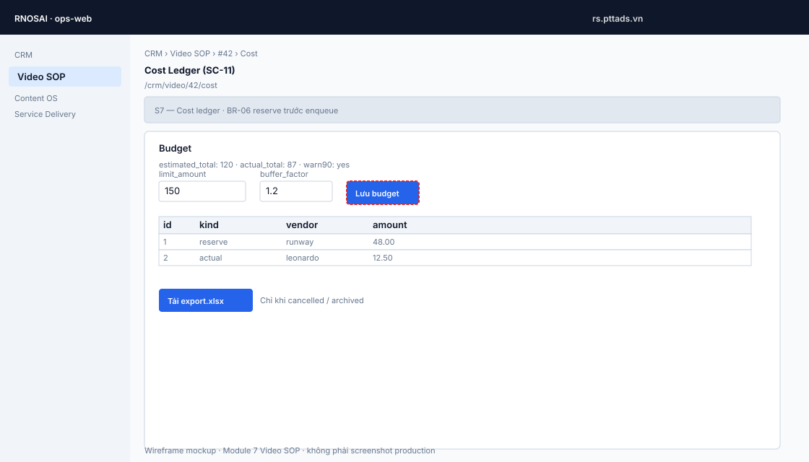

---

### Bước 12 — Post Pipeline (SC-09)

**Route:** `/crm/video/{id}/post`

DAG cố định (FFmpeg compose → Topaz enhance tùy key):

1. Xem **Next node** và bảng node (`status`: pending / running / succeeded / failed / skipped).
2. Dòng **Gate 4 auto** — blocked / ok + lý do.
3. Bấm **Enqueue cine_compose** — bắt đầu / tiếp tục DAG.
4. Node Topaz **skipped** nếu không có `PTT_VD_TOPAZ_API_KEY`.

**Mockup — Post SC-09**

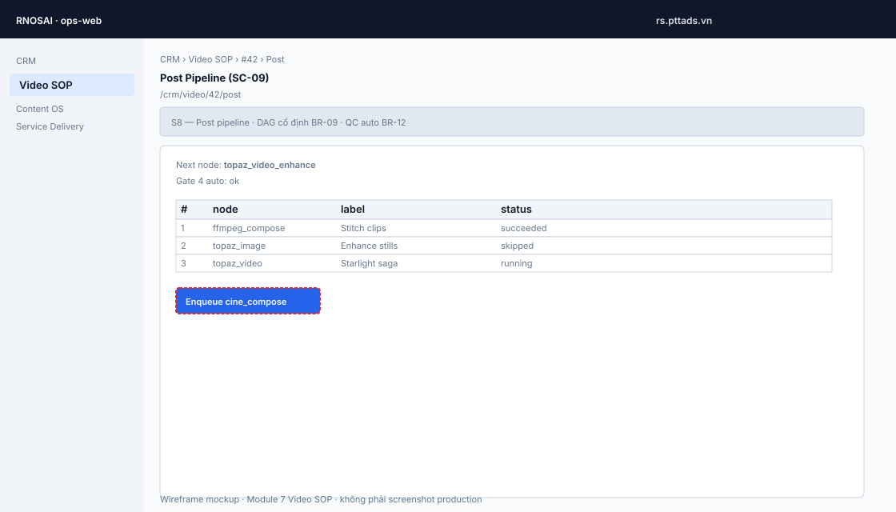

---

### Bước 13 — Gate 4 & Delivery (SC-10 / SC-13 / SC-14)

**Gate 4:** `/crm/video/{id}/gates/4`

- QC auto BR-12; Approve → `delivered`.

**Delivery:** `/crm/video/{id}/delivery`

1. Xem **Gate 4 status**, **QC auto pass**.
2. **Tạo editor package** — zip file naming SOP + metadata `contains_human`, `ai_disclosure`.
3. **Tạo portal review link (14 ngày)** — link portal SC-14 cho khách duyệt.

**Mockup — Gate 4** *(layout Gate review)*


**Mockup — Delivery SC-13**

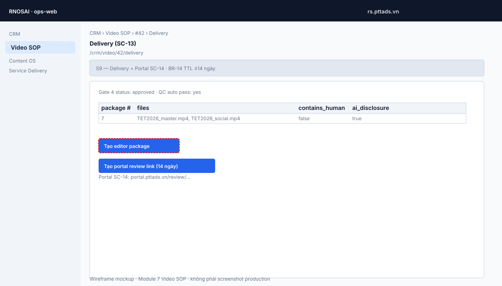

---

### Bước 14 — Production Dashboard (SC-16)

**Route:** `/crm/video/dashboard?lifecycle_id={id}`

1. Banner *S10 — Production dashboard SC-16*.
2. Bảng 7 KPI: keyframe pass rate, clip pass rate, takes/shot, credit ratio, client rounds, lead days, override rate.
3. Dùng cho PM/Lead theo dõi benchmark — API không fail khi lệch mục tiêu.

**Mockup — Dashboard SC-16**

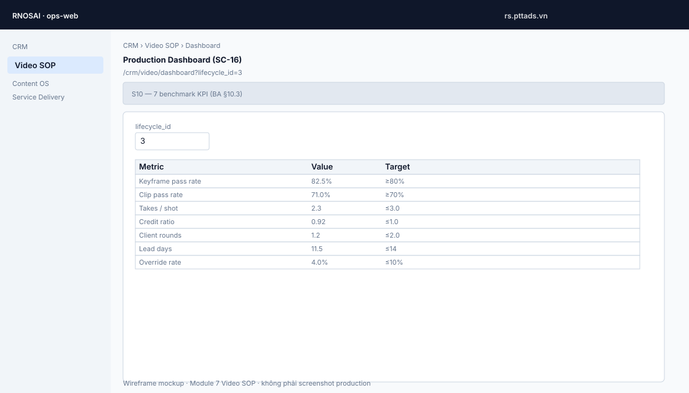

---

## 6. Quản lý Image (chi tiết)

### 6.1. Keyframe (Leonardo primary)

| Bước | UI | Backend |
|------|-----|---------|
| 1 | Keyframes → chọn shot | Load shot + bible prompt |
| 2 | **Tạo keyframe cho shot** | Job `cine_keyframe`, model `image.leonardo.lucid_origin` |
| 3 | Chờ job `succeeded` | Leonardo v2 async; webhook hoặc poller |
| 4 | Tile preview trong workbench | Asset CDN + seed lưu `output_json` |
| 5 | Gate 2 **Approve** | Shot → `keyframe_approved` |

**Webhook Leonardo:** Khi `PTT_VD_LEONARDO_WEBHOOK_KEY` set, callback đẩy nhanh trạng thái thay vì chỉ poll.

### 6.2. Flux fallback (Replicate)

- Kích hoạt khi thiếu Leonardo key nhưng có `REPLICATE_API_TOKEN`.
- UI giống hệt; job `output_json.provider` có thể khác.
- Khuyến nghị production: **luôn cấu hình Leonardo** cho consistency style bible.

### 6.3. Topaz enhance image (post DAG)

- Model `enhance.topaz.image_gigapixel` — async poll.
- Chạy trong node post, không có màn hình riêng; theo dõi qua **Post (SC-09)** bảng node.
- Cần `PTT_VD_TOPAZ_API_KEY`; tùy chọn `PTT_VD_TOPAZ_S3_DEST=1` cho destination S3.

### 6.4. Mẹo vận hành image

- Tối đa **4 keyframe tile** hiển thị workbench — job cũ vẫn trong ledger.
- Overview project liệt kê mọi job — dùng idempotency UI (`ui-s2-…`, `ui-kf-…`) tránh double-submit khi bấm nhanh.
- Job `not_ready` / `stale`: provider bận — đợi retry tự động hoặc enqueue lại (xem runbook).

---

## 7. Video từ tất cả nguồn

### 7.1. Runway — Motion draft

| UI | Provider | model_key |
|----|----------|-----------|
| Render → **Enqueue draft motion** | Runway API trực tiếp | `video.runway.gen4_turbo_draft` |

- Input: keyframe đã approve + shot metadata.
- Poll interval ~5s (`async.mode=POLL`).
- Output: take video trong **Takes (SC-08)**.

### 7.2. Kling — Motion final (via Leonardo)

| UI | Provider | model_key |
|----|----------|-----------|
| Render → **Enqueue final motion** | Leonardo proxy Kling 3.0 | `video.kling.v3.pro` |

- Route `VIA_LEONARDO` — **một** `PTT_VD_LEONARDO_API_KEY` cho cả image và Kling video.
- Webhook Leonardo áp dụng cho final render.
- **Kling DIRECT** (access/secret key riêng) chưa bật trong MVP.

### 7.3. FFmpeg — Social studio (tham chiếu chéo)

Video tuần **không** đi qua `/crm/video/{id}/render`. Luồng riêng trên Content Board → Media AI → storyboard FFmpeg. Xem [18-content-marketing-os.md §17](./18-content-marketing-os.md).

### 7.4. Topaz — Video enhance (saga)

- Model `enhance.topaz.video_starlight_quality` — saga 5 bước có **resume** (bỏ qua bước đã upload).
- Cancel giữ ~1.1× credit theo progress.
- Theo dõi trong Post pipeline; `output_json.saga` persist trên job.

### 7.5. Stub vs live

| Chế độ | Khi nào | UI |
|--------|---------|-----|
| Stub | `PTT_VD_PROVIDER_STUB=1` hoặc thiếu key | Job succeeded nhanh, URL giả — dev/smoke |
| Live | Key đủ, stub tắt | Poll/webhook thật, asset CDN thật |

Trên overview, so sánh `asset #` và provider trong bảng jobs để xác nhận live.

---

## 8. Post pipeline, Topaz & Delivery

**Thứ tự khuyến nghị trên UI:**

1. Hoàn tất Takes + Gate 3.
2. (Tuỳ chọn) Kiểm tra **Cost** — budget còn headroom.
3. **Post** → **Enqueue cine_compose** — theo dõi từng node đến `succeeded`.
4. **Gate 4** → Approve (hoặc Override nếu QC auto blocked có lý do chính đáng).
5. **Delivery** → package + portal link.

**Metadata bắt buộc delivery (BR-14, BR-15):**

- `contains_human` — có người thật trong frame không.
- `ai_disclosure` — đã gắn nhãn AI theo policy.

---

## 9. Admin Providers & Production Dashboard

### 9.1. Admin Providers (SC-15)

**Route:** `/admin/video/providers`  
**Menu:** Quản trị → AI & Automation → Video SOP — Providers  
**Cap:** `crm_vd.admin` hoặc `ai_admin`

1. Bảng **Providers** — `code`, `label` (seed: openai, leonardo, runway, kling, topaz, ffmpeg…).
2. Bảng **Models** — `model_key`, `verified_at`, `capability_json`.
3. (Admin) Form **Thêm provider** / **Thêm model** — JSON capability theo spec L5.
4. Cột **verified_at** — ngày xác nhận giá/constraints; cập nhật khi vendor đổi bảng giá.

**Không** nhập API key trên UI — chỉ env [§2.2](#22-api-key-provider-chỉ-env--không-lưu-db).

**Mockup — Admin Providers SC-15**


### 9.2. Production Dashboard

Xem [Bước 14 §5](#bước-14--production-dashboard-sc-16).

---

## 10. Kiểm tra & deploy VPS

### Smoke scripts (theo sprint)

```bash
bash scripts/smoke_video_sop_s14.sh   # Topaz + cost actuals
bash scripts/smoke_video_sop_s13.sh   # Runway + Kling routing
bash scripts/smoke_video_sop_s12.sh   # OpenAI script + Leonardo webhook
bash scripts/smoke_video_sop_s11.sh   # L5 registry
bash scripts/smoke_video_sop_dual.sh  # Social + cinematic cùng lifecycle
bash scripts/smoke_video_sop_s10.sh   # Production dashboard
```

### Deploy một lệnh (VPS)

```bash
APPLY=1 bash scripts/deploy_video_sop_s14_vps.sh
```

### Checklist sau deploy

- [ ] `curl -sf https://rs.pttads.vn/api/health`
- [ ] Hub `/crm/video` không hiện *Module tắt*
- [ ] Picker **Video chiến dịch (SOP)** clickable trên Media AI
- [ ] `/admin/video/providers` có 8 model_key
- [ ] Webhook Leonardo trỏ đúng URL + Bearer key
- [ ] ops-web đã restart (manual nếu cần)

---

## 11. Xử lý sự cố thường gặp

| Triệu chứng | Nguyên nhân thường gặp | Hành động trên UI / Ops |
|-------------|------------------------|-------------------------|
| *Module tắt* mọi trang video | Flag cinematic = 0 trên build UI hoặc API | Set env → rebuild ops-web + restart API |
| Picker SOP disabled | `NEXT_PUBLIC_CMKT_VIDEO_CINEMATIC` ≠ 1 lúc build | Rebuild ops-web với flag = 1 |
| Job failed `auth` | Thiếu API key provider | Thêm key env → restart API → enqueue lại |
| Job kẹt `queued`/`running` | Poller/webhook | Restart `ptt-crm-api`; kiểm tra webhook Leonardo |
| Enqueue 400 `budget_exceeded` | Vượt limit SC-11 | **Cost** → tăng `limit_amount` → **Lưu budget** |
| `feasibility_blocked` khi thêm shot | Shot > 15s | Giảm `duration_ms` trên Script |
| Gate Approve disabled | Checklist ✗ | Hoàn thiện shot/keyframe/take trước |
| Post node `running` mãi | Topaz/FFmpeg treo | Xem runbook §4; skip Topaz nếu không key |
| Model deprecated | `capability_json` lỗi thời | Admin providers → cập nhật model |

Chi tiết lệnh SSH, log, retry: **[19-video-sop-runbook.md](./19-video-sop-runbook.md)**.

---

## 12. Wireframe / mockup từng màn hình

Gallery đầy đủ — thứ tự theo pipeline sản xuất. Cập nhật wireframe: chạy `python3 docs/huong-dan-su-dung/assets/video-sop/generate-mockups.py`.

| # | Màn hình | Route | File |
|---|----------|-------|------|
| 0 | Content Board · picker studio | `…?tab=content-os` | [01-content-board-picker.svg](./assets/video-sop/01-content-board-picker.svg) |
| 1 | Hub danh sách | `/crm/video?lifecycle_id=` | [02-hub-list.svg](./assets/video-sop/02-hub-list.svg) |
| 2 | Overview SC-02 | `/crm/video/{id}` | [03-overview.svg](./assets/video-sop/03-overview.svg) |
| 3 | Brief SC-03 | `/crm/video/{id}/brief` | [04-brief.svg](./assets/video-sop/04-brief.svg) |
| 4 | Script SC-04 | `/crm/video/{id}/script` | [05-script.svg](./assets/video-sop/05-script.svg) |
| 5 | Bible SC-05 | `/crm/video/{id}/bible` | [06-bible.svg](./assets/video-sop/06-bible.svg) |
| 6 | Keyframes SC-06 | `/crm/video/{id}/keyframes` | [07-keyframes.svg](./assets/video-sop/07-keyframes.svg) |
| 7–10, 13 | Gate SC-10 (1–4) | `/crm/video/{id}/gates/{n}` | [08-gate.svg](./assets/video-sop/08-gate.svg) |
| 8 | Render SC-07 | `/crm/video/{id}/render` | [09-render.svg](./assets/video-sop/09-render.svg) |
| 9 | Takes SC-08 | `/crm/video/{id}/takes` | [10-takes.svg](./assets/video-sop/10-takes.svg) |
| 11 | Cost SC-11 | `/crm/video/{id}/cost` | [11-cost.svg](./assets/video-sop/11-cost.svg) |
| 12 | Post SC-09 | `/crm/video/{id}/post` | [12-post.svg](./assets/video-sop/12-post.svg) |
| 13 | Delivery SC-13 | `/crm/video/{id}/delivery` | [13-delivery.svg](./assets/video-sop/13-delivery.svg) |
| 14 | Dashboard SC-16 | `/crm/video/dashboard?lifecycle_id=` | [14-dashboard.svg](./assets/video-sop/14-dashboard.svg) |
| 15 | Admin SC-15 | `/admin/video/providers` | [15-admin-providers.svg](./assets/video-sop/15-admin-providers.svg) |

### Gallery trực quan (pipeline)


**Thay screenshot production:** Khi cần ảnh chụp thật từ `rs.pttads.vn`, đặt file PNG cùng tên (ví dụ `04-brief.png`) vào `assets/video-sop/` rồi đổi đuôi trong markdown — layout wireframe vẫn giữ làm fallback.

---

## Phụ lục — Map route UI

| Route | Màn hình |
|-------|----------|
| `/crm/video?lifecycle_id=` | Hub danh sách project |
| `/crm/video/dashboard?lifecycle_id=` | Production KPI |
| `/crm/video/{id}` | Overview SC-02 |
| `/crm/video/{id}/brief` | Brief SC-03 |
| `/crm/video/{id}/script` | Script SC-04 |
| `/crm/video/{id}/bible` | Bible SC-05 |
| `/crm/video/{id}/keyframes` | Keyframes SC-06 |
| `/crm/video/{id}/render` | Motion SC-07 |
| `/crm/video/{id}/takes` | Takes SC-08 |
| `/crm/video/{id}/post` | Post SC-09 |
| `/crm/video/{id}/gates/{1-4}` | Gate SC-10 |
| `/crm/video/{id}/cost` | Cost SC-11 |
| `/crm/video/{id}/delivery` | Delivery SC-13 |
| `/admin/video/providers` | Admin registry SC-15 |

---

*Tài liệu bổ sung cho [19-video-sop.md](./19-video-sop.md) (S4) và [19-video-sop-runbook.md](./19-video-sop-runbook.md) (ops). Khi spec Module 7 đổi sprint, cập nhật banner sprint và bảng model_key tương ứng.*
