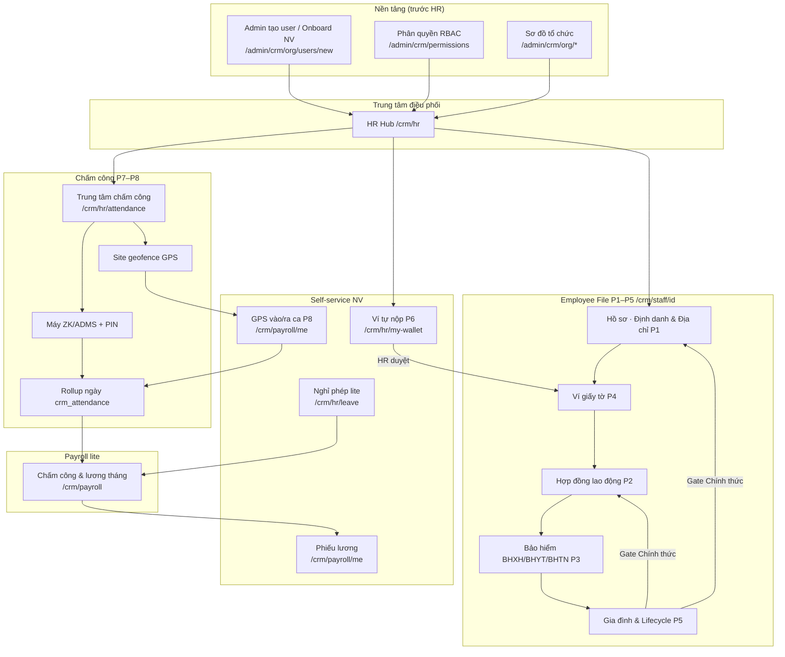
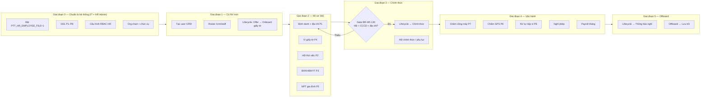
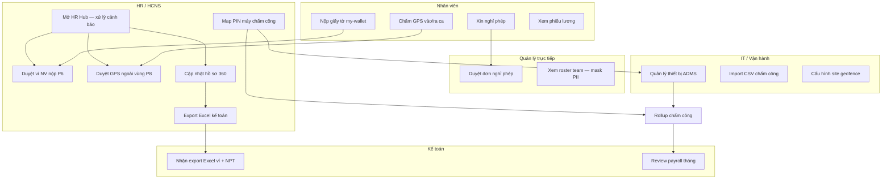
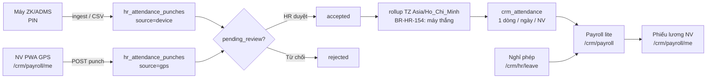

# HR — Sơ đồ luồng quản lý & khung bàn giao khách hàng

> **Phiên bản:** 1.0 · **Cập nhật:** 2026-08-25  
> **Đối tượng:** HR/HCNS, IT, Manager, Kế toán, Nhân viên (khách hàng vận hành)  
> **URL:** https://rs.pttads.vn  
> **Tài liệu kỹ thuật:** [17-hr-employee-file-os.md](./17-hr-employee-file-os.md) · [13-hr-payroll.md](./13-hr-payroll.md)  
> **Use case BA:** [`docs/specs/modules/RNOSAI-BA-HR-UseCases.md`](../specs/modules/RNOSAI-BA-HR-UseCases.md)

Tài liệu này gồm **sơ đồ luồng end-to-end** từ lúc có nhân viên mới đến offboard, và **danh mục hướng dẫn bàn giao** (mỗi tính năng một file) để triển khai cho khách hàng sử dụng thực tế.

---

## 1. Bản đồ module HR trên RNOSAI



---

## 2. Luồng chính: từ nhân viên mới → vận hành hàng ngày → nghỉ việc

Đây là **timeline bàn giao** khách hàng nên làm theo thứ tự.



### 2.1. Chi tiết từng giai đoạn (checklist bàn giao)

| Giai đoạn | Ai làm | Việc chính | Route / công cụ |
|-----------|--------|------------|-----------------|
| **0 — Hệ thống** | IT | Flag API, DDL, restart | `.env`, `scripts/apply_pg_ddl_hr_employee_file_p*.sh` |
| **0 — Hệ thống** | Admin | Gán cap HR cho HR/Lead/Manager | `/admin/crm/permissions` |
| **0 — Hệ thống** | HR Admin | Phòng ban, team, chức vụ | `/admin/crm/org/*` |
| **1 — NV mới** | HR | Tạo tài khoản + gán org | `/admin/crm/org/users/new` |
| **1 — NV mới** | HR | Xác nhận có trên roster | `/crm/staff` |
| **1 — NV mới** | HR | Stage lifecycle **Offer** → **Onboard giấy tờ** | `/crm/staff/[id]` tab Hồ sơ |
| **2 — Hồ sơ** | HR | Nhập CCCD, MST, ngân hàng, địa chỉ | Tab **Hồ sơ** (P1) |
| **2 — Hồ sơ** | HR | Tạo thẻ ví + upload scan | Tab **Ví giấy tờ** (P4) |
| **2 — Hồ sơ** | HR | Ký HĐ thử việc, link scan ví | Tab **Hợp đồng** (P2) |
| **2 — Hồ sơ** | HR | Mở sổ BHXH/BHYT | Tab **Bảo hiểm** (P3) |
| **2 — Hồ sơ** | HR | Khai người phụ thuộc (PT TNCN) | Tab **Gia đình** (P5) |
| **3 — Chính thức** | HR | Hệ thống kiểm gate → chuyển **Chính thức** | Tab Hồ sơ · lifecycle |
| **3 — Chính thức** | HR | HĐ chính thức / phụ lục lương | Tab **Hợp đồng** |
| **4 — Vận hành** | IT/HR | Tạo máy chấm công, gán PIN NV | `/crm/hr/attendance` |
| **4 — Vận hành** | HR | Tạo site GPS, gán NV | `/crm/hr/attendance` |
| **4 — Vận hành** | NV | Vào/ra ca GPS trên điện thoại | `/crm/payroll/me` |
| **4 — Vận hành** | NV | Nộp bằng/chứng chỉ chờ duyệt | `/crm/hr/my-wallet` |
| **4 — Vận hành** | HR | Duyệt GPS / duyệt ví trên Hub | `/crm/hr` |
| **4 — Vận hành** | NV/Manager | Xin nghỉ / duyệt nghỉ | `/crm/hr/leave` |
| **4 — Vận hành** | HR/Kế toán | Khóa kỳ lương, publish payslip | `/crm/payroll` |
| **5 — Offboard** | HR | Lifecycle **Thông báo nghỉ** → **Offboard** → **Lưu trữ** | Tab Hồ sơ |

---

## 3. Luồng theo vai trò (ai làm gì hàng ngày)



---

## 4. Luồng dữ liệu chấm công → lương



---

## 5. Lifecycle 8 stage (P5) — mốc bàn giao quan trọng

| Stage | Nhãn UI | Ý nghĩa bàn giao | Việc HR cần làm |
|-------|---------|------------------|-----------------|
| `offer` | Offer | Đã đồng ý tuyển, chưa vào làm | Tạo user, gán org |
| `onboard_docs` | Onboard giấy tờ | Thu hồ sơ, ví % | P1 + P4 bắt buộc onboard |
| `probation` | Thử việc | Đang thử việc | HĐ thử việc P2, chấm công |
| `official` | Chính thức | **Gate:** HĐ active + CCCD + địa chỉ thường trú | BHXH đầy đủ, HĐ chính thức |
| `transfer` | Chuyển bộ phận | Đổi phòng/team | Cập nhật org, phụ lục HĐ |
| `notice` | Thông báo nghỉ | Đã báo nghỉ | Thu hồ sơ, handover |
| `offboard_hold` | Offboard | Làm thủ tục nghỉ | Khóa chấm công, quyết toán |
| `archived` | Lưu trữ | NV không còn active | Chỉ xem, không sửa |

---

## 6. Ma trận tính năng → route → quyền → tài liệu bàn giao

| # | Tính năng | Phase | Route chính | Cap chính | Hướng dẫn hiện có | **File bàn giao KH (sẽ tạo)** |
|---|-----------|-------|-------------|-----------|-------------------|-------------------------------|
| 0 | Chuẩn bị hệ thống HR | — | Admin | `crm_data_config.*` | §2 [17-hr-employee-file-os.md](./17-hr-employee-file-os.md) | `22a-hr-handover-00-system-setup.md` |
| 1 | Tạo NV / Onboard user | Org | `/admin/crm/org/users/new` | `crm_staff_roster.*` | [01-nen-tang-platform.md](./01-nen-tang-platform.md) | `22b-hr-handover-01-new-employee.md` |
| 2 | HR Hub hàng ngày | P5–P8 | `/crm/hr` | roster / payroll / KPI | §4 [17](./17-hr-employee-file-os.md) | `22c-hr-handover-02-hr-hub-daily.md` |
| 3 | Roster nhân viên | P4 | `/crm/staff` | `crm_staff_roster.view` | §5 [17](./17-hr-employee-file-os.md) | `22d-hr-handover-03-roster.md` |
| 4 | Hồ sơ 360 — Định danh & địa chỉ | P1 | `/crm/staff/[id]` tab Hồ sơ | `crm_hr_pii.*` | §6+ [17](./17-hr-employee-file-os.md) | `22e-hr-handover-04-identity-address.md` |
| 5 | Ví giấy tờ (HR nhập) | P4 | tab **Ví giấy tờ** | `crm_hr_docs.*` | §6 [17](./17-hr-employee-file-os.md) | `22f-hr-handover-05-doc-wallet-hr.md` |
| 6 | Hợp đồng lao động | P2 | tab **Hợp đồng** | `crm_hr_contract.*` | §7 [17](./17-hr-employee-file-os.md) | `22g-hr-handover-06-contracts.md` |
| 7 | Bảo hiểm BHXH/BHYT/BHTN | P3 | tab **Bảo hiểm** | `crm_hr_insurance.*` | §8 [17](./17-hr-employee-file-os.md) | `22h-hr-handover-07-insurance.md` |
| 8 | Gia đình & lifecycle | P5 | tab **Gia đình** / **Hồ sơ** | `crm_hr_pii.*`, roster | §9+ [17](./17-hr-employee-file-os.md) | `22i-hr-handover-08-dependents-lifecycle.md` |
| 9 | NV tự nộp ví | P6 | `/crm/hr/my-wallet` | self + `crm_hr_docs.approve` | §10+ [17](./17-hr-employee-file-os.md) | `22j-hr-handover-09-self-wallet.md` |
| 10 | Export Excel kế toán | P6 | nút trên HR Hub | `crm_hr_docs.view` | §4.5 [17](./17-hr-employee-file-os.md) | `22k-hr-handover-10-accounting-export.md` |
| 11 | Chấm công máy | P7 | `/crm/hr/attendance` | `crm_hr_attendance.device` | §11+ [17](./17-hr-employee-file-os.md) | `22l-hr-handover-11-device-attendance.md` |
| 12 | Chấm công GPS | P8 | `/crm/payroll/me` + Hub | `crm_hr_attendance.gps/review` | §12+ [17](./17-hr-employee-file-os.md) | `22m-hr-handover-12-gps-attendance.md` |
| 13 | Tab chấm công trên hồ sơ | P7–P8 | tab **Chấm công** | `crm_payroll_attendance.view` | §13 [17](./17-hr-employee-file-os.md) | `22n-hr-handover-13-attendance-tab.md` |
| 14 | Nghỉ phép lite | WIN | `/crm/hr/leave` | `crm_hr_leave.*` | [13-hr-payroll.md](./13-hr-payroll.md) §3 | `22o-hr-handover-14-leave.md` |
| 15 | Payroll tháng | WIN | `/crm/payroll` | `crm_payroll_*` | [13-hr-payroll.md](./13-hr-payroll.md) §5 | `22p-hr-handover-15-payroll-admin.md` |
| 16 | Phiếu lương NV | WIN | `/crm/payroll/me` | self | [13-hr-payroll.md](./13-hr-payroll.md) §6 | `22q-hr-handover-16-payslip-self.md` |
| 17 | Phân quyền HR | Admin | `/admin/crm/permissions` | admin | [01-nen-tang-platform.md](./01-nen-tang-platform.md) | `22r-hr-handover-17-rbac-matrix.md` |

---

## 7. Kịch bản bàn giao mẫu: **Nhân viên mới — tuần đầu**

Dùng cho training khách hàng (HR + NV mới).

| Ngày | HR làm | NV mới làm | Kết quả mong đợi |
|------|--------|------------|------------------|
| **D0** | Tạo user, gán phòng ban/chức vụ | Nhận email, đăng nhập lần đầu | Vào được `/crm`, thấy menu HR |
| **D1** | Mở `/crm/staff/[id]`, nhập định danh + địa chỉ | — | Tab Hồ sơ đủ CCCD, địa chỉ |
| **D1** | Tạo thẻ CCCD + upload scan vào Ví | — | Ví % > 0, chip onboard |
| **D2** | Tạo HĐ thử việc, link thẻ ví scan | — | Timeline HĐ có bản active |
| **D2** | Gán `timeclock_pin` (nếu dùng máy) | Chấm thử trên máy / GPS | Punch `accepted` hoặc pending |
| **D3** | Tạo site GPS + gán NV (nếu dùng GPS) | Mở `/crm/payroll/me` → Vào ca | Punch GPS trong geofence |
| **D3–D5** | — | Nộp bằng/chứng chỉ tại `/crm/hr/my-wallet` | Thẻ `pending_review` |
| **D5** | HR Hub → duyệt ví + GPS pending | — | Ví % tăng, rollup ngày OK |
| **Cuối tháng** | HR/Kế toán review `/crm/payroll` | Xem payslip `/crm/payroll/me` | NV nhận phiếu lương |

---

## 8. Cấu trúc chuẩn mỗi file hướng dẫn bàn giao (template)

Mỗi file `22x-hr-handover-*.md` sau này nên theo mẫu:

```markdown
# [Tên tính năng] — Hướng dẫn bàn giao khách hàng

> Đối tượng: HR / NV / IT / Kế toán
> Thời điểm trong lifecycle: (Offer / Onboard / Chính thức / Vận hành / Offboard)
> Route: ...
> Cap tối thiểu: ...

## 1. Mục đích (1 đoạn)
## 2. Trước khi bắt đầu (preconditions)
## 3. Các bước (screenshot / số thứ tự)
## 4. Kiểm tra thành công (acceptance)
## 5. Lỗi thường gặp
## 6. Ai liên hệ khi cần hỗ trợ
```

---

## 9. Lộ trình soạn tài liệu bàn giao (đề xuất)

| Sprint | File | Ưu tiên | Ghi chú |
|--------|------|---------|---------|
| 1 | `22b` NV mới + `22e` Định danh + `22f` Ví HR | **P0** | Bắt buộc trước go-live |
| 1 | `22c` HR Hub + `22d` Roster | **P0** | HR dùng hàng ngày |
| 2 | `22g` HĐ + `22h` BH + `22i` Lifecycle | **P1** | Gate chính thức |
| 2 | `22j` Self-wallet + `22l` Máy chấm + `22m` GPS | **P1** | NV self-service |
| 3 | `22o` Leave + `22p` Payroll + `22q` Payslip | **P2** | Cuối tháng |
| 3 | `22k` Export KT + `22r` RBAC | **P2** | Kế toán + Admin |

---

## 10. Điều kiện vận hành (nhắc khi bàn giao)

| Hạng mục | Yêu cầu |
|----------|---------|
| API | `PTT_HR_EMPLOYEE_FILE=1` trong `/var/www/rnosai/.env` |
| Database | DDL P1–P8 đã apply |
| Ops-web | `NEXT_PUBLIC_WIN_ORG_UI=1`, `NEXT_PUBLIC_WIN_LEAVE_LITE=1`, `NEXT_PUBLIC_WIN_PAYSLIP_PORTAL=1` (build-time) |
| Smoke | `bash scripts/smoke_hr_employee_file_p8.sh` pass |

---

## 11. Tài liệu tham chiếu nội bộ

| Loại | Đường dẫn |
|------|-----------|
| Hướng dẫn chi tiết từng tab | [17-hr-employee-file-os.md](./17-hr-employee-file-os.md) |
| Payroll & Leave | [13-hr-payroll.md](./13-hr-payroll.md) |
| Use case BA | [`RNOSAI-BA-HR-UseCases.md`](../specs/modules/RNOSAI-BA-HR-UseCases.md) |
| Kế hoạch kỹ thuật | [`2026-08-18-hr-employee-file-os.md`](../superpowers/plans/2026-08-18-hr-employee-file-os.md) |
| Đào tạo 30 phút | [`hrm-win4d-hr-training-30min.md`](../runbooks/hrm-win4d-hr-training-30min.md) |

---

## Slide đào tạo (PowerPoint)

File **`HR_Ban_Giao_Luu_Do.pptx`** — 12 slide, **6 sơ đồ luồng dạng hình** (PNG nhúng):

| Slide | Sơ đồ |
|-------|-------|
| Bản đồ module HR | Platform → HR Hub → Employee File → Payroll |
| Luồng E2E | Giai đoạn 0–5 + Gate BR-HR-130 |
| Luồng vai trò | HR · Manager · NV · IT · Kế toán |
| Chấm công → lương | Máy/GPS → punch → rollup → payslip |
| Lifecycle 8 stage | Offer → … → Lưu trữ |
| Tổng hợp 1 trang | Poster training |

Tạo lại file:

```bash
python3 scripts/generate_hr_handover_pptx.py
# → docs/huong-dan-su-dung/HR_Ban_Giao_Luu_Do.pptx
# → docs/huong-dan-su-dung/assets/hr-handover-pptx/diagram_*.png
```

---

*Tài liệu này là **khung bàn giao** — các file `22a`–`22r` sẽ được soạn riêng theo template §8, bắt đầu từ kịch bản nhân viên mới (§7).*
