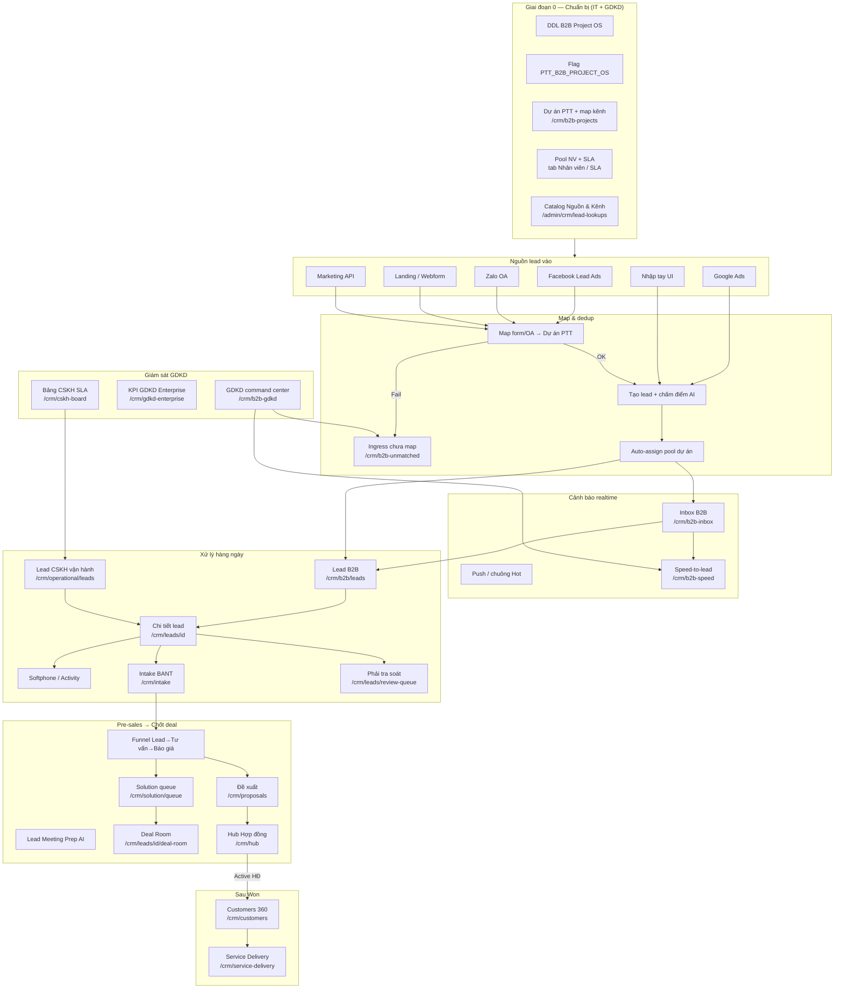
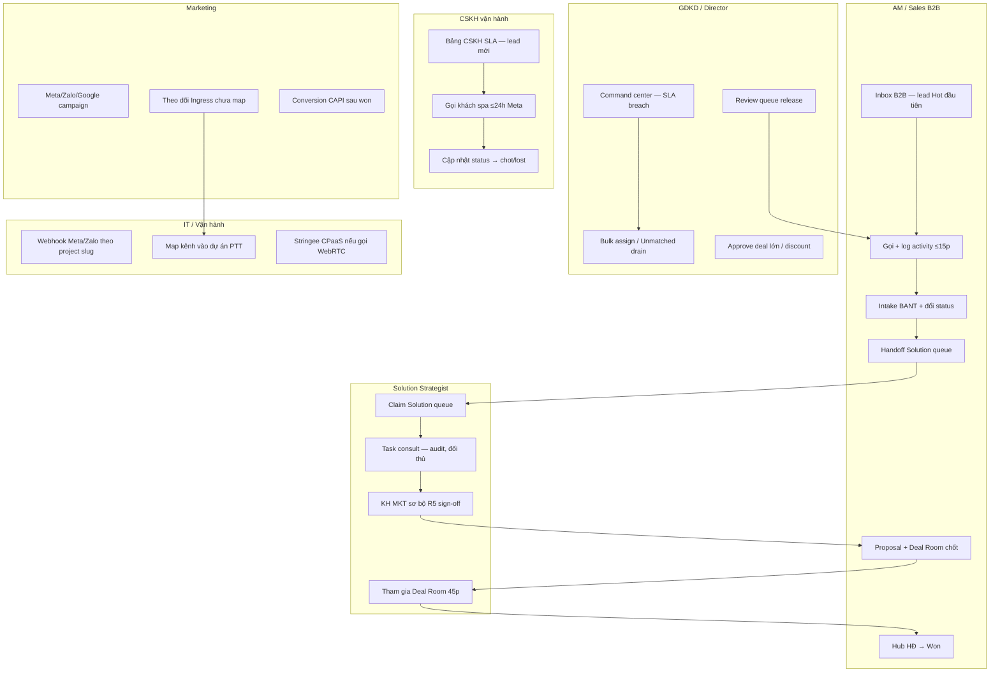
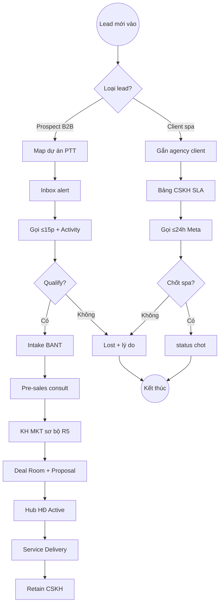

# Leads — Sơ đồ luồng quản lý & khung bàn giao khách hàng

> **Phiên bản:** 1.0 · **Cập nhật:** 2026-08-25  
> **Đối tượng:** AM/Sales, CSKH, GDKD, Marketing, Solution, IT, Khách hàng vận hành  
> **URL:** https://rs.pttads.vn  
> **Tài liệu kỹ thuật:** [02-crm-core.md](./02-crm-core.md) · [16-sales-solution-chot-deal-sop.md](./16-sales-solution-chot-deal-sop.md)  
> **Hướng dẫn đầy đủ phân hệ Lead:** [`docs/crm/huong-dan-phan-he-lead-day-du.md`](../crm/huong-dan-phan-he-lead-day-du.md) · [Lead → Retain](../crm/huong-dan-day-du-lead-den-cham-soc-khach-hang.md)

Tài liệu này gồm **sơ đồ luồng end-to-end** từ lúc **có lead mới** đến **Won/Lost** (và handoff sang Delivery), và **danh mục hướng dẫn bàn giao** (mỗi tính năng một file) để triển khai cho khách hàng sử dụng thực tế.

---

## 0. Hai luồng Lead — đừng nhầm khi bàn giao

| | **B2B Sales** | **CSKH vận hành (spa / client đã ký HĐ)** |
|---|---------------|-------------------------------------------|
| **Mục đích** | Bán HĐ agency **mới** cho prospect | Lead quảng cáo của **khách đã có HĐ** |
| **Danh sách** | `/crm/b2b/leads` | `/crm/operational/leads` |
| **Tạo lead** | `/crm/b2b/leads/new` | `/crm/operational/leads/new` |
| **Bắt buộc** | **Dự án PTT** (khi B2B Project OS bật) | **Khách hàng agency** |
| **Không được** | Gắn `agency_client_id` | Để trống client |
| **Thắng** | `won` | `chot` |
| **SLA mục tiêu** | First touch **5–15 phút** (Hot band) | Meta 24h — xem SOP spa |

**Quy tắc vàng bàn giao:** Prospect B2B ≠ lead spa của khách đang chạy ads.

---

## 1. Bản đồ module Leads trên RNOSAI



---

## 2. Luồng chính: từ lead mới → Won/Lost → Delivery

Timeline bàn giao khách hàng nên làm theo thứ tự — **bắt đầu từ lead mới inbound**.

```mermaid
flowchart LR
  subgraph Phase0["Giai đoạn 0 — Chuẩn bị (IT + GDKD)"]
    P0A[Apply DDL B2B]
    P0B[Tạo dự án PTT active]
    P0C[Map kênh FB/Zalo/Web]
    P0D[Pool NV Nhận lead = Có]
    P0E[RBAC crm_leads.*]
  end

  subgraph Phase1["Giai đoạn 1 — Lead mới vào"]
    P1A[Webhook / Form / API / Tay]
    P1B[Chấm điểm AI Hot/Warm/Cold]
    P1C[Auto-assign owner]
    P1D[Alert Inbox B2B]
  end

  subgraph Phase2["Giai đoạn 2 — First touch ≤15p"]
    P2A[NV mở Inbox hoặc Lead B2B]
    P2B[Tick consent ghi âm]
    P2C[Gọi ngay Softphone]
    P2D[Log Activity Call]
    P2E[Đổi status B2 / Đã liên hệ]
  end

  subgraph Phase3["Giai đoạn 3 — Qualify"]
    P3A{Deal B2B lớn?}
    P3B[Intake BANT Go/No-Go]
    P3C[Review queue GDKD]
    P3D[Gate B2 care complete]
  end

  subgraph Phase4["Giai đoạn 4 — Pre-sales"]
    P4A[Bắt đầu pre-sales consult]
    P4B[Solution claim queue]
    P4C[KH MKT sơ bộ R5]
    P4D[Proposal + Deal Room]
  end

  subgraph Phase5["Giai đoạn 5 — Chốt & Won"]
    P5A[Hub draft HĐ]
    P5B[GDKD approve nếu cần]
    P5C[HĐ Active → promote KH]
    P5D[Onboard / Service Delivery]
  end

  subgraph Alt["Nhánh CSKH vận hành"]
    OPS1[Lead spa Meta/Zalo]
    OPS2[SLA 24h board]
    OPS3[Chốt → chot]
  end

  Phase0 --> Phase1 --> Phase2 --> P3A
  P3A -->|Thường| P3B --> P3D
  P3A -->|High-value| P3C --> P3D
  P3D --> Phase4 --> Phase5
  Phase0 --> OPS1 --> OPS2 --> OPS3
```



### 2.1. Chi tiết từng giai đoạn (checklist bàn giao)

| Giai đoạn | Ai làm | Việc chính | Route / công cụ |
|-----------|--------|------------|-----------------|
| **0 — Hệ thống** | IT | Apply DDL B2B Project OS, restart API | `scripts/apply_pg_ddl_b2b_lead_project_os.sh` |
| **0 — Hệ thống** | IT | Bật `PTT_B2B_PROJECT_OS=1`, `PTT_PRESALES_ON_LEAD=1` | `.env` ptt-crm-api |
| **0 — Hệ thống** | GDKD/IT | Tạo dự án PTT, map Page/Form/OA | `/crm/b2b-projects` |
| **0 — Hệ thống** | GDKD | Gán NV pool, bật **Nhận lead**, cấp S/A/B/C | Tab **Nhân viên** dự án |
| **0 — Hệ thống** | Admin | Catalog Nguồn & Kênh | `/admin/crm/lead-lookups` |
| **0 — Hệ thống** | Admin | Gán cap `crm_leads.*`, `crm_b2b_projects.*` | `/admin/crm/permissions` |
| **1 — Lead mới** | Hệ thống | Ingest → dedup → score → assign | Webhook Meta/Zalo, API |
| **1 — Lead mới** | Marketing | Test lead mẫu, kiểm tra không rơi Unmatched | `/crm/b2b-unmatched` |
| **1 — Lead mới** | AM | Nhận alert Inbox / push Hot | `/crm/b2b-inbox` |
| **2 — First touch** | AM | Mở lead, đọc AI band + NBA | `/crm/leads/[id]` |
| **2 — First touch** | AM | Tick consent → **Gọi ngay** | Softphone / `tel:` fallback |
| **2 — First touch** | AM | Activity **Gọi điện** + đổi trạng thái | Panel Activity |
| **3 — Qualify** | AM | Hoàn thành Intake BANT (B2B) | `/crm/intake?lead_id=` |
| **3 — Qualify** | GDKD | Release lead **Phải tra soát** (nếu có) | `/crm/leads/review-queue` |
| **3 — Qualify** | AM | Hoàn thành gate **B2 care** trên lead | Banner B2 ✓ |
| **4 — Pre-sales** | AM | **Bắt đầu pre-sales** → stage consult | Funnel stepper lead |
| **4 — Pre-sales** | Solution | Claim case từ queue | `/crm/solution/queue` |
| **4 — Pre-sales** | Solution | Điền **KH MKT sơ bộ (R5)** | Tab Tư vấn lead |
| **4 — Pre-sales** | AM+Solution | Buổi chốt trên **Deal Room** | `/crm/leads/[id]/deal-room` |
| **5 — Won** | AM | Tạo proposal → draft HĐ trên Hub | `/crm/proposals`, `/crm/hub` |
| **5 — Won** | GDKD | Approve deal/discount lớn (nếu gate) | Review queue / Hub |
| **5 — Won** | AM | HĐ **Active** → KH + lifecycle | `/crm/customers`, `/crm/service-delivery` |
| **CSKH spa** | CSKH | Xử lý lead client trong 24h | `/crm/operational/leads`, `/crm/cskh-board` |
| **CSKH spa** | CSKH | Won spa = **chot** | Chi tiết lead |

---

## 3. Luồng theo vai trò (ai làm gì hàng ngày)



---

## 4. Luồng dữ liệu: ingest → assign → SLA → pre-sales

```mermaid
flowchart LR
  WH[Webhook Meta/Zalo<br/>/webhooks/meta/project_code] --> MAP{Form/OA<br/>đã map?}
  MAP -->|Không| UNM[crm_b2b_unmatched_ingress<br/>UI /crm/b2b-unmatched]
  MAP -->|Có| CREATE[create_lead<br/>owner_company_id + b2b_project_id]
  CREATE --> DEDUP[Dedup SĐT trong dự án]
  DEDUP --> SCORE[AI analytics<br/>Hot/Warm/Cold]
  SCORE --> ROUTE[Route pool NV<br/>assign_enabled]
  ROUTE --> ALERT[crm_b2b_lead_alerts<br/>Inbox SSE]
  ALERT --> SLA[SLA first-touch timer]
  SLA -->|Cảnh báo| REASSIGN[Tái phân max_hops]
  SLA -->|NV gọi| CALL_LOG[Activity + CPaaS]
  CALL_LOG --> B2[Gate B2 care]
  B2 --> INTAKE[Intake session BANT]
  INTAKE --> PRESALES[presales stage<br/>consult → proposal]
  PRESALES --> WON[status won + CAPI optional]
  WON --> LIFECYCLE[Promote customer<br/>service lifecycle]
```



---

## 5. Trạng thái lead & gate quan trọng (bàn giao)

### 5.1. Trạng thái CRM (UI)

| Trạng thái | Ý nghĩa bàn giao | Việc tiếp theo |
|------------|------------------|----------------|
| **Mới** | Vừa ingest, chưa first touch | Gọi ≤15p, đọc AI prep |
| **Đã liên hệ / B2** | Đã gọi lần đầu | Intake BANT (B2B), qualify |
| **Đang tư vấn** | Pre-sales consult | Solution R5, task consult |
| **Báo giá** | Proposal stage | Deal Room, Hub draft |
| **Won** (B2B) / **Chốt** (spa) | Chốt thành công | HĐ Active, onboard |
| **Lost** | Không convert | Bắt buộc ghi chú audit ≥3 ký tự |

### 5.2. Gate Pre-sales (khi `PTT_PRESALES_ON_LEAD=1`)

| Gate | Điều kiện | Ai kiểm |
|------|-----------|---------|
| **B2 care complete** | Banner B2 ✓ trên lead | AM |
| **Intake Go** | Session BANT hoàn thành | AM / Pre-sales |
| **R5 có trên lead** | KH MKT sơ bộ trước báo giá | Solution |
| **GDKD approve** | Deal vượt ngưỡng | GDKD — review queue |
| **HĐ Active** | Không promote KH trước gate | AM + Finance |

### 5.3. Funnel Service Delivery (sau Won)

| Stage | Tên UI | Giai đoạn |
|-------|--------|-----------|
| `onboard` | Onboarding | Sau ký HĐ |
| `deliver` | Triển khai | SP vận hành |
| `handover` | Nghiệm thu | AM + KH |
| `retain` | Chăm sóc | CSKH dài hạn |

Chi tiết: [huong-dan-day-du-lead-den-cham-soc-khach-hang.md](../crm/huong-dan-day-du-lead-den-cham-soc-khach-hang.md).

---

## 6. Ma trận tính năng → route → quyền → tài liệu bàn giao

| # | Tính năng | Phase | Route chính | Cap chính | Hướng dẫn hiện có | **File bàn giao KH (sẽ tạo)** |
|---|-----------|-------|-------------|-----------|-------------------|-------------------------------|
| 0 | Chuẩn bị hệ thống Lead / B2B OS | — | Admin + scripts | `crm_data_config.*`, IT | §4 [phan-he-lead](../crm/huong-dan-phan-he-lead-day-du.md) | `23a-leads-handover-00-system-setup.md` |
| 1 | Dự án PTT + map kênh | Setup | `/crm/b2b-projects` | `crm_b2b_projects.*` | §5 [phan-he-lead](../crm/huong-dan-phan-he-lead-day-du.md) | `23b-leads-handover-01-b2b-projects.md` |
| 2 | Ingress chưa map | Setup | `/crm/b2b-unmatched` | `crm_b2b_projects.manage` | §19 [phan-he-lead](../crm/huong-dan-phan-he-lead-day-du.md) | `23c-leads-handover-02-unmatched-ingress.md` |
| 3 | Nguồn Facebook / Meta | Ingest | webhook + `/meta/facebook-ads` | MKT caps | §7 + [meta setup](../huong-dan-meta-setup-tai-khoan-app-form-token.md) | `23d-leads-handover-03-source-meta.md` |
| 4 | Nguồn Zalo OA | Ingest | webhook + `/zalo/zalo-ads` | MKT caps | §8 [phan-he-lead](../crm/huong-dan-phan-he-lead-day-du.md) | `23e-leads-handover-04-source-zalo.md` |
| 5 | Nguồn Google / Webform / API | Ingest | landing + API | IT / MKT | §9–11 + [nguon-lead](../crm/huong-dan-nguon-lead-va-setup.md) | `23f-leads-handover-05-source-other.md` |
| 6 | Catalog Nguồn & Kênh | Setup | `/admin/crm/lead-lookups` | admin | §4.6 [phan-he-lead](../crm/huong-dan-phan-he-lead-day-du.md) | `23g-leads-handover-06-lead-lookups.md` |
| 7 | Danh sách Lead B2B | Daily | `/crm/b2b/leads` | `crm_leads.view` | §12.1 [phan-he-lead](../crm/huong-dan-phan-he-lead-day-du.md) | `23h-leads-handover-07-b2b-list.md` |
| 8 | Danh sách Lead CSKH vận hành | Daily | `/crm/operational/leads` | `crm_leads.view` | §12.3 + [spa SOP](../runbooks/cskh-spa-lead-meta-24h-sop.md) | `23i-leads-handover-08-operational-list.md` |
| 9 | Tạo lead thủ công B2B / CSKH | Daily | `/crm/b2b/leads/new`, `/crm/operational/leads/new` | `crm_leads.edit` | §13 [phan-he-lead](../crm/huong-dan-phan-he-lead-day-du.md) | `23j-leads-handover-09-create-lead.md` |
| 10 | Inbox B2B & alert Hot | Daily | `/crm/b2b-inbox` | `crm_leads.view` | §16.1 [phan-he-lead](../crm/huong-dan-phan-he-lead-day-du.md) | `23k-leads-handover-10-inbox-b2b.md` |
| 11 | Chi tiết lead — xử lý core | Daily | `/crm/leads/[id]` | `crm_leads.view/edit` | §14 [phan-he-lead](../crm/huong-dan-phan-he-lead-day-du.md) | `23l-leads-handover-11-lead-detail.md` |
| 12 | Gọi điện & Softphone | Daily | lead detail `#lead-contact-actions` | `crm_leads.edit` | §15 [phan-he-lead](../crm/huong-dan-phan-he-lead-day-du.md) | `23m-leads-handover-12-softphone.md` |
| 13 | Zalo thread trên Inbox | Daily | `/crm/b2b-inbox/thread/[id]` | `crm_leads.view` | §16.2 [phan-he-lead](../crm/huong-dan-phan-he-lead-day-du.md) | `23n-leads-handover-13-zalo-thread.md` |
| 14 | Phân lead / Bulk assign | GDKD | lead detail + list bulk | `crm_leads.assign` | §12.2, §14.4 | `23o-leads-handover-14-assign.md` |
| 15 | Phải tra soát (Review queue) | GDKD | `/crm/leads/review-queue` | `crm_leads.assign` | §18.1 + [02-crm-core](./02-crm-core.md) §2.3 | `23p-leads-handover-15-review-queue.md` |
| 16 | Lead Intake BANT | Qualify | `/crm/intake` | `crm_leads.view` | §17 + [02-crm-core](./02-crm-core.md) §2.4 | `23q-leads-handover-16-intake-bant.md` |
| 17 | Pre-sales funnel trên lead | Presales | `/crm/leads/[id]` stepper | `crm_leads.edit` | §14.6 + [lead→retain §5–8](../crm/huong-dan-day-du-lead-den-cham-soc-khach-hang.md) | `23r-leads-handover-17-presales-funnel.md` |
| 18 | Solution queue | Presales | `/crm/solution/queue` | `crm_presales_solution.view` | [16-sales-solution](./16-sales-solution-chot-deal-sop.md) | `23s-leads-handover-18-solution-queue.md` |
| 19 | Lead Meeting Prep (LMP) AI | Presales | tab trên lead detail | `crm_lmp.view` | [lead-meeting-prep.md](../specs/lead-meeting-prep.md) | `23t-leads-handover-19-lmp-ai.md` |
| 20 | Deal Room chốt deal | Presales | `/crm/leads/[id]/deal-room` | `crm_leads.view` | [16-sales-solution](./16-sales-solution-chot-deal-sop.md) §5 | `23u-leads-handover-20-deal-room.md` |
| 21 | Đề xuất / Proposal | Won path | `/crm/proposals` | sales caps | [02-crm-core](./02-crm-core.md) §3.2 | `23v-leads-handover-21-proposals.md` |
| 22 | Hub Hợp đồng → Active | Won path | `/crm/hub` | sales caps | [lead→retain §9](../crm/huong-dan-day-du-lead-den-cham-soc-khach-hang.md) | `23w-leads-handover-22-hub-contract.md` |
| 23 | GDKD command center | Gov | `/crm/b2b-gdkd` | `crm_b2b_projects.view` | §18.2 [phan-he-lead](../crm/huong-dan-phan-he-lead-day-du.md) | `23x-leads-handover-23-gdkd-command.md` |
| 24 | Speed-to-lead dashboard | Gov | `/crm/b2b-speed` | `crm_b2b_projects.view` | §19.1 [phan-he-lead](../crm/huong-dan-phan-he-lead-day-du.md) | `23y-leads-handover-24-speed-to-lead.md` |
| 25 | Bảng CSKH SLA + KPI GDKD | Gov | `/crm/cskh-board`, `/crm/gdkd-enterprise` | GDKD caps | §18.3 [phan-he-lead](../crm/huong-dan-phan-he-lead-day-du.md) | `23z-leads-handover-25-cskh-sla-kpi.md` |
| 26 | Sau Won — Onboard & Delivery | Post-won | `/crm/service-delivery` | agency caps | [lead→retain §10–13](../crm/huong-dan-day-du-lead-den-cham-soc-khach-hang.md) | `23aa-leads-handover-26-post-won-delivery.md` |
| 27 | Mobile PWA — lead list & gọi | Daily | PWA staff | mobile caps | [15-mobile](./15-mobile.md) | `23ab-leads-handover-27-mobile-pwa.md` |
| 28 | Phân quyền Lead RBAC | Admin | `/admin/crm/permissions` | admin | [01-nen-tang-platform](./01-nen-tang-platform.md) | `23ac-leads-handover-28-rbac-matrix.md` |

---

## 7. Kịch bản bàn giao mẫu: **Lead mới B2B — 48 giờ đầu**

Dùng cho training khách hàng (GDKD + AM + Marketing).

| Thời điểm | Marketing / IT | GDKD | AM | Kết quả mong đợi |
|-----------|----------------|------|-----|------------------|
| **T-7 ngày** | Map Page/Form Meta vào dự án PTT | Tạo dự án, gán pool NV | — | Test lead không rơi Unmatched |
| **T-1 ngày** | Gửi lead test staging | Review Speed dashboard | Đăng nhập, bật chuông Inbox | Inbox nhận alert Hot |
| **T+0 (lead thật)** | — | Theo dõi command center | Mở Inbox ≤2p → mở lead | Lead có owner |
| **T+0 ≤15p** | — | — | Tick consent → Gọi → log Call | Activity + SLA OK |
| **T+0 ≤2h** | — | — | Intake BANT bắt đầu | Session discovery |
| **T+1** | — | Release review queue (nếu có) | Hoàn thành B2 gate | Banner B2 ✓ |
| **T+1–2** | — | — | Handoff Solution queue | Case claimed |
| **T+3–5** | — | — | Solution hoàn R5 | Tab Tư vấn có R5 |
| **T+5–7** | — | Approve discount (nếu cần) | Deal Room + Proposal | Sẵn sàng chốt |
| **T+7–14** | CAPI conversion (nếu bật) | — | Hub HĐ Active | KH trên `/crm/customers` |

### 7.1. Kịch bản song song: **Lead spa CSKH (Meta 24h)**

| Thời điểm | CSKH | GDKD | Kết quả |
|-----------|------|------|---------|
| Lead vào | Thấy trên `/crm/operational/leads` | Theo dõi `/crm/cskh-board` | Lead gắn đúng client |
| ≤24h | Gọi + activity | Drill KPI nếu breach | Status cập nhật |
| Chốt | Đổi **chot** hoặc lost + lý do | — | Audit đủ |

---

## 8. Cấu trúc chuẩn mỗi file hướng dẫn bàn giao (template)

Mỗi file `23x-leads-handover-*.md` sau này nên theo mẫu:

```markdown
# [Tên tính năng] — Hướng dẫn bàn giao khách hàng

> Đối tượng: AM / CSKH / GDKD / Marketing / IT
> Luồng: B2B Sales | CSKH vận hành | Cả hai
> Thời điểm trong lifecycle: (Setup / Lead mới / First touch / Qualify / Pre-sales / Won / Gov)
> Route: ...
> Cap tối thiểu: ...

## 1. Mục đích (1 đoạn)
## 2. Trước khi bắt đầu (preconditions + flag)
## 3. Các bước (screenshot / số thứ tự)
## 4. Kiểm tra thành công (acceptance)
## 5. Lỗi thường gặp
## 6. Ai liên hệ khi cần hỗ trợ
```

---

## 9. Lộ trình soạn tài liệu bàn giao (đề xuất)

| Sprint | File | Ưu tiên | Ghi chú |
|--------|------|---------|---------|
| 1 | `23a` Setup + `23b` Dự án PTT + `23c` Unmatched | **P0** | Bắt buộc trước go-live ingest |
| 1 | `23k` Inbox + `23l` Chi tiết lead + `23m` Softphone | **P0** | AM dùng ngay khi có lead |
| 2 | `23d–23f` Nguồn Meta/Zalo/Khác + `23q` Intake | **P0** | Marketing + qualify |
| 2 | `23h` List B2B + `23i` List CSKH + `23j` Tạo lead | **P1** | Tra cứu hàng ngày |
| 3 | `23r–23u` Pre-sales → Deal Room | **P1** | Sales/Solution training |
| 3 | `23p` Review queue + `23x–23y` GDKD dashboards | **P1** | Giám sát SLA |
| 4 | `23v–23w` Proposal + Hub + `23aa` Post-won | **P2** | Sau pilot 2 deal |
| 4 | `23z` CSKH KPI + `23ab` Mobile + `23ac` RBAC | **P2** | Mở rộng toàn tổ chức |

---

## 10. Điều kiện vận hành (nhắc khi bàn giao)

| Hạng mục | Yêu cầu |
|----------|---------|
| API — B2B OS | `PTT_B2B_PROJECT_OS=1` trong `.env` ptt-crm-api |
| API — Pre-sales | `PTT_PRESALES_ON_LEAD=1` |
| API — Gọi WebRTC | `PTT_B2B_CPAAS=stringee` + `PTT_STRINGEE_*` |
| API — Realtime inbox | `PTT_B2B_SSE=1` (mặc định) |
| Database | DDL B2B Project OS (+ wave W5 nếu Zalo thread) |
| UAT | `bash scripts/uat_b2b_project_os.sh` — gate B2B-01, B2B-02 |
| RBAC | `crm_leads.view/edit/assign`, `crm_b2b_projects.view/manage`, `crm_gdkd.view_all_leads` (GDKD) |

**Rollback nhanh:** `PTT_B2B_PROJECT_OS=0` → restart API (lead cũ vẫn xem được trên `/crm/leads`).

---

## 11. Sơ đồ tổng hợp một trang (in cho phòng training)



---

## 12. Tài liệu tham chiếu nội bộ

| Loại | Đường dẫn |
|------|-----------|
| Hướng dẫn phân hệ Lead đầy đủ | [huong-dan-phan-he-lead-day-du.md](../crm/huong-dan-phan-he-lead-day-du.md) |
| Lead → Retain (Pre-sales + Delivery) | [huong-dan-day-du-lead-den-cham-soc-khach-hang.md](../crm/huong-dan-day-du-lead-den-cham-soc-khach-hang.md) |
| Nguồn lead & setup kỹ thuật | [huong-dan-nguon-lead-va-setup.md](../crm/huong-dan-nguon-lead-va-setup.md) |
| SOP chốt deal Sales/Solution | [16-sales-solution-chot-deal-sop.md](./16-sales-solution-chot-deal-sop.md) |
| SOP B2B onboard | [sales-b2b-lead-client-onboard-sop.md](../runbooks/sales-b2b-lead-client-onboard-sop.md) |
| SOP CSKH spa Meta 24h | [cskh-spa-lead-meta-24h-sop.md](../runbooks/cskh-spa-lead-meta-24h-sop.md) |
| B2B Project OS design | [2026-08-18-b2b-lead-project-os-design.md](../superpowers/specs/2026-08-18-b2b-lead-project-os-design.md) |
| Lead Meeting Prep spec | [lead-meeting-prep.md](../specs/lead-meeting-prep.md) |
| CRM Core (tóm tắt) | [02-crm-core.md](./02-crm-core.md) |
| Presales checklist KH | [checklist-presales-thu-thap-yeu-cau-khach-hang.md](../crm/checklist-presales-thu-thap-yeu-cau-khach-hang.md) |

---

## Slide đào tạo (PowerPoint)

File **`Leads_Ban_Giao_Luu_Do.pptx`** — 13 slide, **7 sơ đồ luồng dạng hình** (PNG nhúng):

| Slide | Sơ đồ |
|-------|-------|
| Hai luồng Lead | B2B Sales vs CSKH vận hành |
| Bản đồ module | Setup → Ingest → Pipeline → Pre-sales |
| Luồng E2E | Giai đoạn 0–5 + nhánh spa |
| Luồng vai trò | AM · CSKH · Solution · GDKD · MKT/IT |
| Luồng dữ liệu | Webhook → assign → SLA → Won |
| Trạng thái & Gate | Status + gate R5/GDKD |
| Tổng hợp 1 trang | Poster training |

Tạo lại file:

```bash
python3 scripts/generate_leads_handover_pptx.py
# → docs/huong-dan-su-dung/Leads_Ban_Giao_Luu_Do.pptx
# → docs/huong-dan-su-dung/assets/leads-handover-pptx/diagram_*.png
```

---

*Tài liệu này là **khung bàn giao** — các file `23a`–`23ac` sẽ được soạn riêng theo template §8, **bắt đầu từ kịch bản lead mới B2B (§7)** và thiết lập dự án PTT (§2 giai đoạn 0).*
