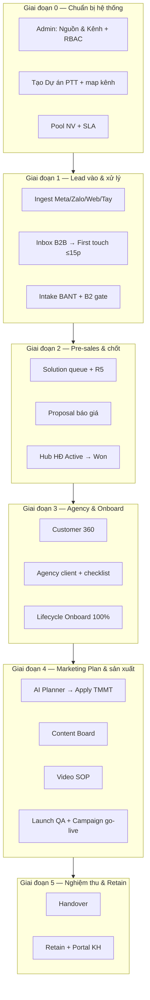

# B2B End-to-End — Hướng dẫn UI từng bước bàn giao khách hàng

> **Phiên bản:** 1.0 · **Cập nhật:** 2026-08-26  
> **Đối tượng:** GDKD, AM/Sales, Solution, Marketing, CSKH, IT, Khách hàng vận hành  
> **URL:** https://rs.pttads.vn  
> **Phạm vi:** Từ **Tạo Dự án PTT** → **Leads** → **Lifecycle Lead** → **Agency** → **Kế hoạch Marketing** (báo giá, HĐ, TMMT, chiến dịch, content, video) → **Nghiệm thu & Retain**

Tài liệu này là **playbook thao tác trên giao diện** để bàn giao cho khách hàng chạy thực tế. Mỗi bước ghi rõ **route**, **ai làm**, **bấm gì**, **done khi nào**.

**Tài liệu liên quan (chi tiết từng module):**

| Chủ đề | File |
|--------|------|
| Leads — sơ đồ & ma trận bàn giao | [23-leads-handover-flow-and-guides.md](./23-leads-handover-flow-and-guides.md) |
| CRM Core | [02-crm-core.md](./02-crm-core.md) |
| SOP chốt deal Sales/Solution | [16-sales-solution-chot-deal-sop.md](./16-sales-solution-chot-deal-sop.md) |
| Agency & Triển khai DV | [03-agency-service-delivery.md](./03-agency-service-delivery.md) |
| Marketing AI Planner (TMMT) | [11-marketing-ai-planner.md](./11-marketing-ai-planner.md) |
| Content Marketing OS | [18-content-marketing-os.md](./18-content-marketing-os.md) |
| Video SOP Studio | [20-video-sop-huong-dan-day-du.md](./20-video-sop-huong-dan-day-du.md) |

---

## 0. Tổng quan một trang — luồng bàn giao

**Quy tắc vàng — 3 lớp Marketing Plan (đừng nhầm khi training KH):**

| Lớp | Tên | Khi nào | Route |
|-----|-----|---------|-------|
| **L1** | KH MKT sơ bộ (R5) | **Trước ký HĐ** — vũ khí chốt deal | Lead detail → tab **Tư vấn** |
| **L2** | TMMT chính thức | **Sau ký HĐ**, trước go-live | `/crm/service-delivery/[id]?tab=ai-planner` |
| **L3** | Checklist + KPI DV | Đang triển khai | Tab **Ops Hub** trên lifecycle |

---

## 1. Điều kiện trước khi bàn giao

| Hạng mục | Yêu cầu | Ai kiểm |
|----------|---------|---------|
| Đăng nhập staff | Tài khoản CRM active | IT |
| Flag B2B Project OS | `PTT_B2B_PROJECT_OS=1` | IT |
| Flag Pre-sales | `PTT_PRESALES_ON_LEAD=1` | IT |
| Flag Marketing | `NEXT_PUBLIC_MKT_AI_PLANNER=1`, `NEXT_PUBLIC_CONTENT_MARKETING=1` | IT |
| RBAC | AM: `crm_leads.*`, `crm_b2b_projects.view`; Solution: `crm_presales_solution.*` | Admin |
| Catalog | Nguồn & Kênh lead đã seed | Admin |

**Menu ẩn = thiếu cap hoặc flag tắt — không phải lỗi hệ thống.**

---

## 2. Giai đoạn 0 — Chuẩn bị hệ thống (IT + GDKD)

### Bước 0.1 — Catalog Nguồn & Kênh lead

| | |
|---|---|
| **Ai** | Admin / GDKD |
| **Route** | `/admin/crm/lead-lookups` |
| **Cap** | `crm_data_config.view` |

**Thao tác UI:**

1. Đăng nhập https://rs.pttads.vn → menu **Quản trị hệ thống** → **Dữ liệu CRM** → **Nguồn & Kênh**.
2. Tab **Nguồn lead** — thêm các nguồn khách dùng (Facebook, Zalo, Website, Giới thiệu, …).
3. Tab **Kênh** — thêm kênh chi tiết (Lead Ads, Inbox, Landing page, …).
4. Bấm **Lưu** từng dòng.

**Done khi:** Form tạo lead hiển thị dropdown Nguồn/Kênh đầy đủ.

---

### Bước 0.2 — Phân quyền RBAC

| | |
|---|---|
| **Route** | `/admin/crm/permissions` |
| **Cap** | Admin |

**Thao tác UI:**

1. Chọn **Chức vụ** (AM, Solution, GDKD, Marketing, CSKH).
2. Tick các cap tối thiểu:

| Vai trò | Cap cần |
|---------|---------|
| AM/Sales | `crm_leads.view/edit/assign`, `crm_b2b_projects.view`, `crm_proposals.*`, `crm_agency.view` |
| Solution | `crm_presales_solution.view`, `crm_lmp.view`, `crm_mkt_ai.view/generate` |
| GDKD | `crm_leads.assign`, `crm_b2b_projects.manage`, review/approve caps |
| Marketing | Meta/Zalo caps, `crm_content.*` |
| CSKH | `crm_leads.view/edit` (luồng operational) |

3. Bấm **Lưu ma trận**.
4. Nhân viên **đăng xuất → đăng nhập lại** để JWT cập nhật cap.

---

### Bước 0.3 — Tạo Dự án PTT (DA PTT)

| | |
|---|---|
| **Ai** | GDKD |
| **Route** | `/crm/b2b-projects` |
| **Cap** | `crm_b2b_projects.view` (xem), `crm_b2b_projects.manage` (tạo/sửa) |

**Thao tác UI — Tạo dự án mới:**

1. Sidebar → **Chuẩn bị** → **Dự án PTT**.
2. Ở form trên cùng, điền:
   - **Mã (slug webhook)** * — ví dụ `ptt-hcm`, `du-an-spa-q7` (không dấu, không space).
   - **Tên dự án mới** * — ví dụ `PTT HCM — Lead B2B`.
3. Bấm **+ Dự án**.
4. Click vào dự vừa tạo → mở **Chi tiết dự án PTT** `/crm/b2b-projects/[id]`.

**Thao tác UI — Tab Tổng quan:**

1. Xác nhận **Trạng thái = Active**.
2. Ghi lại **Webhook URL** (Meta: `/api/v1/webhooks/meta/{code}`, Zalo: `/api/v1/webhooks/zalo/{code}`) — giao IT/Marketing cấu hình.

**Thao tác UI — Tab Kênh:**

1. Map **Facebook Page + Lead Form** hoặc **Zalo OA** vào dự án.
2. Mỗi form/OA phải map đúng — nếu không, lead rơi **Ingress chưa map**.

**Thao tác UI — Tab Nhân viên:**

1. Thêm Staff ID từng AM vào pool dự án.
2. Cột **Nhận lead** → chọn **Có** cho NV được auto-assign.
3. Cột **Cấp** → S / A / B / C (ưu tiên phân lead Hot).

**Thao tác UI — Tab SLA & gọi:**

1. Cấu hình SLA first-touch (mặc định 5–15 phút cho Hot band).
2. Giờ làm việc — lead ngoài giờ vẫn ingest nhưng alert có thể trì hoãn.

**Done khi:**

- Dự án **Active**
- ≥1 kênh map
- ≥1 NV **Nhận lead = Có**
- Test lead không rơi `/crm/b2b-unmatched`

---

### Bước 0.4 — Kiểm tra Ingress chưa map

| | |
|---|---|
| **Route** | `/crm/b2b-unmatched` |
| **Ai** | Marketing / IT / GDKD |

**Thao tác UI:**

1. Mở **CRM · Bán hàng & Hợp đồng** → **Ingress chưa map**.
2. Nếu có bản ghi → xem payload → map form/OA vào đúng dự án PTT (tab Kênh).
3. Retry hoặc chờ lead mới sau khi map.

**Done khi:** Danh sách trống sau test lead.

---

## 3. Giai đoạn 1 — Leads: từ ingest đến first touch

> **Lưu ý:** Luồng **B2B Sales** (prospect mới) ≠ **CSKH vận hành** (khách đã ký HĐ). Bàn giao phải tách rõ hai luồng — xem [23-leads-handover §0](./23-leads-handover-flow-and-guides.md).

### Bước 1.1 — Lead mới vào hệ thống

| Nguồn | Cách vào | Ai theo dõi |
|-------|----------|-------------|
| Meta Lead Ads | Webhook → map dự án PTT | Marketing test |
| Zalo OA | Webhook → map dự án PTT | Marketing test |
| Landing / Webform | API hoặc embed | IT |
| Nhập tay | UI tạo lead | AM |

**Route kiểm tra:** `/crm/b2b-unmatched` (fail map) · `/crm/b2b-inbox` (alert Hot)

---

### Bước 1.2 — Nhận alert & mở lead (AM)

| | |
|---|---|
| **Route** | `/crm/b2b-inbox` → `/crm/leads/[id]` |
| **SLA** | First touch **≤15 phút** (Hot band) |

**Thao tác UI:**

1. Sidebar → **Bán hàng** → **Inbox B2B**.
2. Lead **Hot** (đỏ/cảnh báo) — mở **đầu tiên**.
3. Click tên lead → vào **Chi tiết lead** `/crm/leads/[id]`.
4. Đọc panel **AI band** (Hot/Warm/Cold) và gợi ý **Next Best Action**.

**Done khi:** Lead có owner = AM hiện tại.

---

### Bước 1.3 — First touch: gọi & log activity

**Thao tác UI trên Chi tiết lead:**

1. Cuộn tới panel **Liên hệ** (`#lead-contact-actions`).
2. Tick **Consent ghi âm** (nếu có).
3. Bấm **Gọi ngay** (Softphone hoặc `tel:` fallback).
4. Sau cuộc gọi → panel **Activity** → **+ Thêm activity**:
   - Loại: **Gọi điện**
   - Ghi chú: kết quả cuộc gọi (≥ vài câu).
5. Đổi **Trạng thái** → **Đã liên hệ** hoặc **B2**.

**Done khi:** Có activity Call + trạng thái cập nhật + SLA timer xanh.

---

### Bước 1.4 — Tạo lead thủ công (khi cần)

| Luồng | Route |
|-------|-------|
| B2B Sales | `/crm/b2b/leads/new` |
| CSKH vận hành | `/crm/operational/leads/new` |

**Form tạo lead B2B — điền:**

| Field | Bắt buộc | Ghi chú |
|-------|----------|---------|
| Họ tên | ✓ | |
| SĐT / Email | ✓ ít nhất 1 | |
| **Dự án PTT** | ✓ | Chọn dự án đã setup |
| Nguồn / Kênh | Khuyến nghị | Từ catalog |
| Owner | Tự động hoặc chọn | AM |

**Done khi:** Lead xuất hiện trên `/crm/b2b/leads` với owner đúng.

---

## 4. Giai đoạn 2 — Lifecycle Lead: Qualify → Pre-sales → Won

### Bước 2.1 — Intake BANT (Qualify)

| | |
|---|---|
| **Route** | `/crm/intake?lead_id=[id]` |
| **Ai** | AM |

**Thao tác UI:**

1. Từ Chi tiết lead → bấm **Intake BANT** (hoặc mở route trực tiếp).
2. Điền session discovery:
   - **Budget** — ngân sách dự kiến
   - **Authority** — ai quyết định
   - **Need** — nhu cầu
   - **Timeline** — thời gian triển khai
   - **Fit** — có phù hợp dịch vụ PTT?
   - **History** — đã thử agency cũ chưa?
3. Chọn kết luận: **Go** / **Nurture** / **No-Go**.
4. Bấm **Hoàn thành session**.

**Done khi:** Intake session = completed.

---

### Bước 2.2 — Gate B2 care & Review queue

| Gate | Route | Ai |
|------|-------|-----|
| B2 care complete | Banner **B2 ✓** trên lead detail | AM |
| Phải tra soát | `/crm/leads/review-queue` | GDKD release |

**Thao tác UI — B2 gate:**

1. Trên Chi tiết lead → stepper **Lead Presales Funnel**.
2. Hoàn thành mục **B2 care** (care report).
3. Banner chuyển **B2 care complete ✓**.

**Thao tác UI — Review queue (deal lớn):**

1. GDKD mở `/crm/leads/review-queue`.
2. Chọn lead → **Release** hoặc **Assign** AM phù hợp.

**Done khi:** Banner B2 ✓ + (nếu có) lead đã release khỏi queue.

---

### Bước 2.3 — Bắt đầu Pre-sales

| | |
|---|---|
| **Route** | Chi tiết lead → **Bắt đầu pre-sales** |
| **Ai** | AM |

**Thao tác UI:**

1. Trên Chi tiết lead → stepper funnel → bấm **Bắt đầu pre-sales**.
2. Chọn **service_slug** (dịch vụ quan tâm).
3. Xác nhận — stage chuyển **consult** (Tư vấn).

**Done khi:** Funnel hiển thị giai đoạn Pre-sales / Tư vấn.

---

### Bước 2.4 — Solution claim & Consult tasks

| | |
|---|---|
| **Route Solution** | `/crm/solution/queue` |
| **Route Consult** | Chi tiết lead → tab **Tư vấn** |

**Thao tác UI — Solution:**

1. Solution mở `/crm/solution/queue`.
2. Bấm **Claim** trên case lead.
3. Tab **Tư vấn** trên lead → hoàn thành task consult (audit, đối thủ, …).
4. Dùng **Lead Meeting Prep AI** (LMP) nếu cần: Intel, Talk Track, Offer, Objections.

**Done khi:** Consult tasks 100%.

---

### Bước 2.5 — KH Marketing sơ bộ (R5) — Gate G4

| | |
|---|---|
| **Route** | Chi tiết lead → tab **Tư vấn** → form **KH Marketing sơ bộ (R5)** |
| **Ai** | Solution (R/A), AM review |

**Thao tác UI:**

1. Tab **Tư vấn** → mở form **KH Marketing sơ bộ (R5)**.
2. Điền: mục tiêu, ICP sơ bộ, kênh đề xuất, ngân sách ước tính, insight chính.
3. Solution bấm **Lưu / Sign-off R5**.
4. AM review trước buổi chốt.

**Gate:** **Không được báo giá** nếu R5 chưa có trên lead.

**Done khi:** R5 hiển thị ✓ trên lead — Proposal mở được.

---

### Bước 2.6 — Báo giá / Proposal

| | |
|---|---|
| **Route** | `/crm/proposals` |
| **Ai** | AM |

**Thao tác UI:**

1. Sidebar → **Bán hàng** → **Đề xuất dịch vụ** `/crm/proposals`.
2. Bấm **+ Tạo đề xuất** (hoặc từ lead detail → **Tạo proposal**).
3. Chọn **Lead / Khách hàng**, **Dịch vụ**, line items.
4. Nếu bật Ops DV: Quote Builder **3 gói** (Basic / Standard / Premium).
5. Điền ghi chú, chiết khấu (nếu có — có thể cần GDKD approve).
6. **Xuất PDF/DOCX** gửi khách.
7. Khi khách đồng ý → **Accept proposal**.

**Done khi:** Proposal status = Accepted; lifecycle được tạo/spawn.

---

### Bước 2.7 — Deal Room (buổi chốt 45 phút)

| | |
|---|---|
| **Route** | `/crm/leads/[id]/deal-room` |
| **Flag** | `NEXT_PUBLIC_DEAL_ROOM=1` |

**Thao tác UI:**

1. AM mở Deal Room từ Chi tiết lead.
2. Screen-share trên RNOSAI (không PowerPoint rời):
   - Tab lead + R5
   - Proposal 3 gói
   - Objection handling (LMP)
3. Ghi activity **Họp** sau buổi chốt.

**Done khi:** Khách verbal commit → chuyển sang HĐ.

---

### Bước 2.8 — Hợp đồng trên Hub → Won

| | |
|---|---|
| **Route Hub** | `/crm/hub?hub_tab=contracts` |
| **Route KH** | `/crm/customers` |

**Thao tác UI:**

1. Mở **Hub Hợp đồng** `/crm/hub` → tab **HĐ chờ duyệt**.
2. **+ Draft HĐ** — gắn proposal đã accept, điền điều khoản.
3. GDKD **Approve** (nếu deal lớn / discount vượt ngưỡng).
4. Chuyển HĐ → **Active**.
5. Hệ thống promote **Customer 360** `/crm/customers/[id]`.
6. Lead status → **Won**.

**Gate:** Không promote KH trước khi HĐ **Active**.

**Done khi:** Customer có trên `/crm/customers` + lifecycle trên `/crm/service-delivery`.

---

## 5. Giai đoạn 3 — Agency: onboard khách sau Won

### Bước 3.1 — Mở Agency client

| | |
|---|---|
| **Route hub** | `/agency` |
| **Route client** | `/agency/clients/[id]` |
| **Route tạo mới** | `/agency/clients/new` |

**Thao tác UI — Tạo client (nếu chưa auto từ Won):**

1. Sidebar → **Agency & Client** → **Agency hub**.
2. **+ Client mới** `/agency/clients/new`.
3. Điền: **Mã (CODE)***, **Tên***, **Ngành**, **Owner AM**.
4. Bấm **Tạo** → redirect Chi tiết client.

---

### Bước 3.2 — Onboard checklist

**Thao tác UI — Tab Onboard:**

1. `/agency/clients/[id]?tab=onboard`
2. Làm theo wizard onboard.
3. Panel **Auto-sync** → bấm **Auto-sync** — verify badge xanh từng bước.

**Thao tác UI — Tab Checklist:**

1. Tab **Checklist** — tick lần lượt:
   - Legal / pháp lý
   - Billing / thanh toán
   - Brief / brief khách
   - … (theo template dịch vụ)
2. Theo dõi progress **n/m**.

**Done khi:** Checklist **100%**.

---

### Bước 3.3 — Map kênh ads & Portal khách

**Tab Kênh ads** `/agency/clients/[id]?tab=channels`:

1. Map **Meta Ad Account** + Page (OAuth/token vault).
2. Map **Google Ads** / **Zalo** nếu có.
3. Verify tracking health.

**Tab Portal users** `/agency/clients/[id]?tab=portal`:

1. **+ Portal user** — email khách, role **viewer** hoặc **approver**.
2. Gửi link portal https://portal.pttads.vn cho khách.

**Done khi:** Kênh map xanh + ≥1 portal user active.

---

### Bước 3.4 — Service Delivery lifecycle

| | |
|---|---|
| **Route Kanban** | `/crm/service-delivery` |
| **Route Detail** | `/crm/service-delivery/[id]` |

**Thao tác UI:**

1. Mở Kanban **Triển khai dịch vụ**.
2. Tìm card client vừa Won → click vào detail.
3. Tab **Workflow** — xem stage hiện tại (**Onboard**).
4. Khi checklist Agency 100% → bấm **Chuyển giai đoạn** → xác nhận.

**Gate Deliver:** Onboard checklist chưa 100% → nút **Deliver** disabled.

---

## 6. Giai đoạn 4 — Kế hoạch Marketing & sản xuất

### Bước 4.1 — AI Planner → TMMT chính thức (L2)

| | |
|---|---|
| **Route** | `/crm/service-delivery/[id]?tab=ai-planner` |
| **Điều kiện** | Stage ≥ **Onboard**; cap `crm_mkt_ai.*` |

**Wizard 5 bước — thao tác UI:**

| Bước | Tên tab | Thao tác |
|------|---------|----------|
| 1 | **Brief** | Điền Ngân sách tháng, Mục tiêu, Thách thức, Đối thủ, Kênh ưu tiên → **Tiếp tục** |
| 2 | **Chiến lược AI** | Bấm **Sinh chiến lược AI** → chờ job (~30–60s) → sửa ICP/persona → **Tiếp tục** |
| 3 | **Chiến dịch AI** | **Sinh chiến dịch AI** → ≥2 campaign cards → sửa budget split/KPI → **Tiếp tục** |
| 4 | **Lịch nội dung** | Review calendar 30 ngày → sửa slot → **Tiếp tục** |
| 5 | **Apply TMMT** | Quality score ≥60 → tick **"Tôi đã review"** → **Apply vào TMMT** |

**Done khi:** Gate banner **xanh**; tab **TMMT** có dữ liệu đồng bộ.

Chi tiết: [11-marketing-ai-planner.md](./11-marketing-ai-planner.md)

---

### Bước 4.2 — Chuyển giai đoạn Deliver

**Thao tác UI — Tab Workflow:**

1. Kiểm tra gate: Onboard 100% + TMMT published.
2. Bấm **Chuyển giai đoạn** → **Deliver (Triển khai)**.
3. Ghi lý do + confirm.

**Done khi:** Stage = Deliver; tab Content Board mở được.

---

### Bước 4.3 — Content Board (sản xuất content)

| | |
|---|---|
| **Route** | `/crm/service-delivery/[id]?tab=content-os` |
| **Flag** | `NEXT_PUBLIC_CONTENT_MARKETING=1` |

**Luồng UI chính:**

| # | View | Route param | Thao tác |
|---|------|-------------|----------|
| 1 | Import TMMT | Banner trên Board | Bấm **Import từ AI Planner** |
| 2 | Ideas | `?view=ideas` | Chọn idea → **Convert to item** (chọn kênh + format) |
| 3 | Board | `?view=board` | Mở item → **Generate draft AI** |
| 4 | Review | `?view=review` | QA **Approve internal** (reject cần comment ≥10 ký tự) |
| 5 | Media AI | Tab Media trên item | Tạo ảnh / carousel / **Video tuần** (FFmpeg) |
| 6 | Calendar | `?view=calendar` | Schedule slot → **Mark published** (human publish) |
| 7 | Repurpose | `?view=repurpose` | Sinh biến thể đa kênh |
| 8 | Bridge | Nút trên item | **→ SEO** `/seo/content` · **→ Email** |

**Trạng thái item:** `draft` → `in_review` → `approved_internal` → `scheduled` → `published`

Chi tiết: [18-content-marketing-os.md](./18-content-marketing-os.md)

---

### Bước 4.4 — Video chiến dịch (Video SOP)

| | |
|---|---|
| **Route hub** | `/crm/video?lifecycle_id=[id]` |
| **Flag** | `NEXT_PUBLIC_CMKT_VIDEO_CINEMATIC=1` |
| **Entry** | Content Board → picker **Video chiến dịch (SOP)** |

**Luồng SOP — thao tác UI từng màn:**

| # | Màn hình | Route | Done khi |
|---|----------|-------|----------|
| 1 | Hub Video | `/crm/video` | Project được tạo từ Content Board |
| 2 | Overview | `/crm/video/[id]` | Brief assigned |
| 3 | Brief 8 nhóm | `/crm/video/[id]/brief` | `brief_ready` — objective, audience, offer, duration, platform |
| 4 | Script | `/crm/video/[id]/script` | `scripting` — script + shotlist |
| 5 | Bible | `/crm/video/[id]/bible` | Style + character locked |
| 6 | Keyframes | `/crm/video/[id]/keyframes` | Keyframe approved |
| 7 | Gates | `/crm/video/[id]/gates/[n]` | Gate pass từng checkpoint |
| 8 | Render | `/crm/video/[id]/render` | Render job queued/done |
| 9 | Takes | `/crm/video/[id]/takes` | Chọn take final |
| 10 | Post | `/crm/video/[id]/post` | Color/sub/title |
| 11 | Delivery | `/crm/video/[id]/delivery` | File bàn giao KH |

**Admin provider:** `/admin/video/providers`

Chi tiết: [20-video-sop-huong-dan-day-du.md](./20-video-sop-huong-dan-day-du.md)

---

### Bước 4.5 — Launch QA & Go-live chiến dịch

| | |
|---|---|
| **Route QA** | `/crm/launch-qa` hoặc lifecycle tab **Launch QA** |
| **Route Campaign** | `/crm/campaign-writes`, `/meta/facebook-ads`, `/zalo/zalo-ads` |

**Thao tác UI — Launch QA:**

1. **+ Tạo run** — chọn client, kênh (Meta/Zalo/Google).
2. Checklist: Pixel/CAPI, creative approved, budget, targeting.
3. Tick từng mục + upload evidence.
4. Bấm **Pass** → buyer được phép launch.

**Thao tác UI — Go-live:**

1. Buyer mở `/meta/facebook-ads` hoặc `/zalo/zalo-ads`.
2. Tạo/sync campaign theo TMMT.
3. **Campaign Write** `/crm/campaign-writes` — ghi nhận thay đổi campaign.
4. **Creative Hub** `/crm/creatives` — upload creative → duyệt nội bộ → duyệt KH trên portal.

**Gate:** Launch QA chưa Pass → không go-live campaign đầu tiên.

---

## 7. Giai đoạn 5 — Nghiệm thu & Retain

### Bước 5.1 — Handover

| | |
|---|---|
| **Route** | `/crm/service-delivery/[id]` tab **Workflow** |
| **Gate** | Finance — không còn công nợ AR |

**Thao tác UI:**

1. Hoàn thành deliverables trên Ops Hub.
2. Tab **Finance** — xác nhận billing milestone.
3. **Chuyển giai đoạn** → **Handover (Nghiệm thu)**.
4. Khách ký nghiệm thu trên portal (nếu bật).

---

### Bước 5.2 — Retain & chăm sóc dài hạn

| | |
|---|---|
| **Route Agency** | `/agency/clients/[id]?tab=retain` |
| **Route CSKH lead** | `/crm/operational/leads` (lead ads của KH đã ký) |

**Thao tác UI:**

1. Tab **Retain** — health score, renewal checklist.
2. CSKH xử lý lead spa trên `/crm/operational/leads` — SLA Meta 24h.
3. Theo dõi KPI trên `/crm/cskh-board`.

---

## 8. Checklist bàn giao theo vai trò (hàng ngày)

### AM / Sales B2B

| Thứ tự | Việc | Route |
|--------|------|-------|
| 1 | Mở Inbox — xử lý Hot trước | `/crm/b2b-inbox` |
| 2 | First touch ≤15p + log Call | `/crm/leads/[id]` |
| 3 | Intake BANT lead qualify | `/crm/intake` |
| 4 | Handoff Solution | `/crm/solution/queue` |
| 5 | Theo proposal / Deal Room | `/crm/proposals`, deal-room |
| 6 | Hub HĐ sau chốt | `/crm/hub` |
| 7 | Theo lifecycle onboard | `/crm/service-delivery` |

### Solution Strategist

| Thứ tự | Việc | Route |
|--------|------|-------|
| 1 | Claim queue | `/crm/solution/queue` |
| 2 | Consult tasks | Lead tab Tư vấn |
| 3 | R5 sign-off | Form KH MKT sơ bộ |
| 4 | Deal Room 45p | deal-room |
| 5 | TMMT sau ký HĐ | `?tab=ai-planner` |

### Marketing

| Thứ tự | Việc | Route |
|--------|------|-------|
| 1 | Test lead / Unmatched | `/crm/b2b-unmatched` |
| 2 | Map kênh Meta/Zalo | `/crm/b2b-projects/[id]` tab Kênh |
| 3 | Content sản xuất | `?tab=content-os` |
| 4 | Video SOP | `/crm/video` |
| 5 | Launch QA + ads | `/crm/launch-qa`, `/meta/*` |

### GDKD

| Thứ tự | Việc | Route |
|--------|------|-------|
| 1 | Command center SLA | `/crm/b2b-gdkd` |
| 2 | Speed-to-lead | `/crm/b2b-speed` |
| 3 | Review queue | `/crm/leads/review-queue` |
| 4 | Approve deal / HĐ | `/crm/hub` |

### CSKH vận hành

| Thứ tự | Việc | Route |
|--------|------|-------|
| 1 | Lead spa mới | `/crm/operational/leads` |
| 2 | SLA board 24h | `/crm/cskh-board` |
| 3 | Chốt / Lost + lý do | Chi tiết lead |

---

## 9. Kịch bản training khách hàng — 14 ngày pilot

Dùng cho buổi bàn giao thực tế (GDKD + AM + Solution + Marketing).

| Ngày | Giai đoạn | Thao tác chính | Route | Kết quả |
|------|-----------|----------------|-------|---------|
| **D-7** | Setup | Tạo dự án PTT + map kênh + pool NV | `/crm/b2b-projects` | Test lead OK |
| **D-3** | Setup | RBAC + catalog + test webhook | Admin | NV login đủ cap |
| **D+0** | Lead | Lead thật vào → Inbox Hot | `/crm/b2b-inbox` | Owner assigned |
| **D+0** | First touch | Gọi ≤15p + activity | `/crm/leads/[id]` | SLA pass |
| **D+1** | Qualify | Intake BANT + B2 gate | `/crm/intake` | Go |
| **D+2** | Pre-sales | Bắt đầu pre-sales + Solution claim | solution queue | Stage consult |
| **D+3–5** | R5 | Solution hoàn R5 | Tab Tư vấn | Gate G4 pass |
| **D+5–7** | Báo giá | Proposal 3 gói + Deal Room | `/crm/proposals` | Accepted |
| **D+7–10** | HĐ | Hub draft → Active | `/crm/hub` | Won + Customer |
| **D+10–12** | Agency | Onboard checklist 100% | `/agency/clients/[id]` | Channels + portal |
| **D+12–14** | TMMT | AI Planner Apply | `?tab=ai-planner` | TMMT xanh |
| **Tuần 3+** | Sản xuất | Content + Video + Launch QA | content-os, `/crm/video` | Go-live |

---

## 10. Bảng Gate tổng hợp (in cho training)

| Gate | Điều kiện | Chặn việc gì | Ai fix |
|------|-----------|--------------|--------|
| Map kênh | Form/OA map dự án PTT | Lead ingest | IT/MKT |
| First touch SLA | Activity Call ≤15p Hot | Cảnh báo GDKD | AM |
| B2 care | Banner B2 ✓ | Bắt đầu pre-sales | AM |
| Intake Go | BANT completed | Pre-sales sâu | AM |
| R5 | KH MKT sơ bộ trên lead | Báo giá / Proposal | Solution |
| GDKD approve | Deal/discount lớn | Accept proposal | GDKD |
| HĐ Active | Contract active | Promote customer | AM |
| Onboard 100% | Agency checklist | Advance Deliver | AM |
| TMMT pass | AI Planner Apply | Deliver stage | Solution |
| Launch QA pass | Checklist QA | Go-live ads | Buyer |
| Finance gate | Không nợ AR | Handover | Finance |

---

## 11. Lỗi thường gặp khi bàn giao

| Triệu chứng | Nguyên nhân | Cách xử lý |
|-------------|-------------|------------|
| Lead rơi Unmatched | Form Meta chưa map dự án | `/crm/b2b-unmatched` → map tab Kênh |
| Không thấy menu Dự án PTT | Flag tắt hoặc thiếu cap | IT bật flag + Admin gán cap |
| Nút báo giá disabled | Thiếu R5 | Solution hoàn R5 tab Tư vấn |
| Tab AI Planner ẩn | Stage < Onboard | Hoàn checklist Agency trước |
| Tab Content Board ẩn | Stage < Deliver hoặc flag tắc | Advance stage + IT bật flag |
| Không gọi được Softphone | Stringee chưa cấu hình | Dùng `tel:` fallback; IT setup CPaaS |
| Portal KH không login | Chưa tạo portal user | Tab Portal trên agency client |

---

## 12. Mục lục route nhanh (bookmark cho KH)

| Giai đoạn | Route |
|-----------|-------|
| Dự án PTT | `/crm/b2b-projects` |
| Inbox B2B | `/crm/b2b-inbox` |
| Lead B2B | `/crm/b2b/leads` |
| Chi tiết lead | `/crm/leads/[id]` |
| Intake BANT | `/crm/intake` |
| Solution queue | `/crm/solution/queue` |
| Proposal | `/crm/proposals` |
| Hub HĐ | `/crm/hub?hub_tab=contracts` |
| Customers | `/crm/customers` |
| Agency | `/agency` |
| Service Delivery | `/crm/service-delivery/[id]` |
| AI Planner | `?tab=ai-planner` |
| Content Board | `?tab=content-os` |
| Video SOP | `/crm/video` |
| Launch QA | `/crm/launch-qa` |
| Meta Ads | `/meta/facebook-ads` |
| Admin RBAC | `/admin/crm/permissions` |
| Admin Nguồn/Kênh | `/admin/crm/lead-lookups` |

---

*Tài liệu này bổ sung [23-leads-handover-flow-and-guides.md](./23-leads-handover-flow-and-guides.md) — tập trung **thao tác UI từng bước** cho toàn chuỗi B2B → Marketing → Delivery. Cập nhật khi thêm route hoặc gate mới.*
