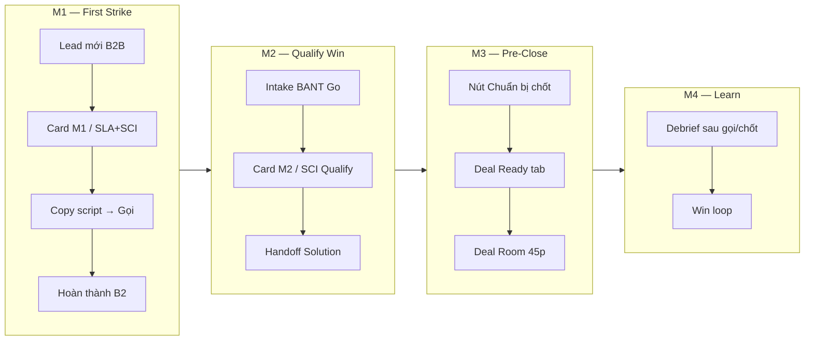

# Lead Meeting Prep (LMP) — Hướng dẫn UI từng bước

> **Phiên bản:** 1.1 · **Cập nhật:** 2026-08-29  
> **Đối tượng:** AM/Sales, Solution, GDKD, CSKH (luồng B2B)  
> **URL:** https://rs.pttads.vn  
> **Phạm vi:** Sales Close Intelligence (SCI) — từ cuộc gọi đầu (M1) → Qualify (M2) → Chuẩn bị chốt (M3) → Debrief (M4)

Tài liệu này mô tả **thao tác trên giao diện** — bấm gì, ở đâu, done khi nào. Không đi sâu kiến trúc backend.

**Tài liệu liên quan:**

| Chủ đề | File |
|--------|------|
| **Hướng dẫn đầy đủ (env, API key, UI, kết quả)** | [26-sales-cockpit-huong-dan-day-du.md](./26-sales-cockpit-huong-dan-day-du.md) |
| B2B E2E (Lead → chốt deal) | [24-b2b-e2e-handover-ui-guide.md](./24-b2b-e2e-handover-ui-guide.md) |
| SOP chốt deal Sales/Solution | [16-sales-solution-chot-deal-sop.md](./16-sales-solution-chot-deal-sop.md) |
| Leads — sơ đồ bàn giao | [23-leads-handover-flow-and-guides.md](./23-leads-handover-flow-and-guides.md) |
| Spec kỹ thuật LMP | [../specs/lead-meeting-prep.md](../specs/lead-meeting-prep.md) |

---

## 0. Tổng quan một trang

**Lead Meeting Prep (LMP)** trên UI gọi là **Sales Cockpit** — AI chuẩn bị vũ khí bán hàng theo 4 giai đoạn:

| Stage | Tên trên UI | Khi nào dùng |
|-------|-------------|--------------|
| **M1** | M1 · Vũ khí cuộc gọi đầu | Lead B2B mới, **chưa xong B2** (liên hệ đầu ≤15 phút) |
| **M2** | M2 · Brief sau BANT — đẩy handoff | **Sau B2**, đang Intake / Consult |
| **M3** | M3 · Sẵn sàng chốt — Deal Room | Trước buổi chốt 45 phút |
| **M4** | M4 · Win loop — học từ chốt/lost | Sau debrief khi lead **Chốt** hoặc **Lost** |

Pipeline AI (thanh tiến trình): **Thu thập → Xác minh → Chiến lược → Vũ trang** — thường **1,5–4 phút**.

---

## 1. Điều kiện để thấy LMP trên UI

| Hạng mục | Yêu cầu | Ai kiểm |
|----------|---------|---------|
| Flag frontend | `NEXT_PUBLIC_LEAD_MEETING_PREP=1` **lúc build** ops-web | IT |
| Flag backend | `PTT_LEAD_MEETING_PREP_ENABLED=1` trên VPS | IT |
| Loại lead | **B2B prospect** (`lead_flow_kind = b2b_prospect`) | — |
| Quyền xem | `crm_lmp.view` **hoặc** `crm_leads.view` | Admin |
| Quyền chạy prep | `crm_lmp.run` **hoặc** `crm_leads.edit` | Admin |

**Không thấy Sales Cockpit?**

- Lead **CSKH vận hành** (`spa_operational`) → LMP **không** hiện trên lead detail B2B.
- Menu/nút ẩn → thiếu flag build hoặc thiếu cap — **không phải lỗi nghiệp vụ**.
- Sau khi IT bật flag: **đăng xuất → đăng nhập lại** để JWT cập nhật cap.

---

## 2. Bản đồ vị trí UI

Trên trang lead detail, khối **Việc tiếp theo** (NBA) là block đầu của cột Việc. AM đọc việc cần làm ngay tại đó trước khi mở Funnel hay Sales Cockpit.

| # | Màn hình | Route | Thành phần LMP |
|---|----------|-------|----------------|
| 1 | **Lead detail** | `/crm/leads/{id}` | Nút **Sales Cockpit** mở drawer phải — hero + NBA vẫn thấy |
| 2 | Deep link | `/crm/leads/{id}?prep=1` | Mở thẳng drawer Sales Cockpit |
| 3 | **Intake BANT** | `/crm/intake?lead_id={id}` | Deal Bar chip SCI (1 dòng pain) + **Cockpit** — không còn card SCI · Qualify (M2) |
| 4 | **Deal Room** | `/crm/leads/{id}/deal-room` | Panel **SCI — Buổi chốt 45 phút** |
| 5 | **CSKH board** | `/crm/cskh-board` | Panel **SLA + SCI · Gọi đầu** (M1) |
| 6 | Debrief modal | (popup trên lead detail) | Sau log hoạt động **Gọi điện** |

---

## 3. Luồng M1 — Cuộc gọi đầu (15 phút)

**Ai:** AM/Sales · **Khi:** Lead B2B mới, B2 chưa hoàn thành · **SLA:** 15 phút first touch

### Bước 3.1 — Mở lead B2B

| | |
|---|---|
| **Route** | `/crm/b2b/leads` → chọn lead **hoặc** `/crm/leads/{id}` |
| **Cap** | `crm_leads.view` |

**Thao tác:**

1. Đăng nhập https://rs.pttads.vn.
2. Sidebar → **Leads B2B** (hoặc **Leads** → lọc B2B).
3. Mở lead có trạng thái mới / đang xử lý, **chưa** tick xong B2 trong funnel.

**Done khi:** Trang lead detail hiển thị panel **Funnel B2 → Pre-sales**.

---

### Bước 3.2 — Chờ prep M1 (tự động hoặc chạy tay)

Prep M1 thường **tự enqueue** khi lead B2B mới tạo. Trên UI có 3 trạng thái chính:

| Trạng thái UI | Ý nghĩa | Việc cần làm |
|---------------|---------|--------------|
| *Đang tải prep…* / *AI đang research* | Job đang chạy (1–4 phút) | Chờ — trang **tự refresh** |
| *Cần chọn doanh nghiệp* | Nhiều DN trùng tên | → Bước 3.3 |
| *Sẵn sàng* | Script M1 đã có | → Bước 3.4 |

**Nếu prep lỗi / bỏ qua:**

1. Cuộn tới card **M1 · Cuộc gọi đầu (15 phút)** trong funnel.
2. Bấm **Chạy prep M1** (cần quyền `crm_lmp.run`).
3. Bổ sung **tên công ty** trên lead nếu thiếu; tuỳ chọn nhập website trong Sales Cockpit rồi **Chạy prep**.

---

### Bước 3.3 — Chọn doanh nghiệp (entity picker)

**Khi nào:** Banner *"Cần chọn doanh nghiệp trước khi gọi"* hoặc trạng thái *awaiting entity choice*.

**Thao tác:**

1. Bấm **Mở Talk Track** hoặc **Sales Cockpit** (hoặc link **Chọn entity →**).
2. Trong panel, mục **Chọn doanh nghiệp đúng** — chọn radio khớp lead (tên, URL, SĐT trang).
3. Bấm **Xác nhận & tiếp tục prep**.
4. Chờ pipeline chạy tiếp → **Sẵn sàng**.

---

### Bước 3.4 — Đọc script & gọi khách

**Vị trí A — Card M1 trong funnel** (nhanh nhất):

1. Đọc đoạn **opening** và **Câu hỏi gợi ý**.
2. Bấm **Copy script gọi đầu** → paste vào ghi chú cuộc gọi / Zalo.
3. (Tuỳ chọn) **Mở Talk Track** → xem objection playbook đầy đủ.

**Vị trí B — Sales Cockpit full:**

1. Bấm **Sales Cockpit** trên hero (drawer phải; Esc hoặc **Đóng**).
2. Tab **Talk Track** — đọc các phase SPIN, dùng **Timer** 15:00.
3. Bấm **Copy toàn bộ talk track**.
4. Tab **Intel** — đọc chân dung DN, pain/ROI, urgency trước khi gọi.

**Checklist trên card M1:**

- [ ] Đọc chân dung DN (tab Intel)
- [ ] Copy script → gọi trong SLA 15p
- [ ] Sau liên hệ OK → hoàn thành B2

---

### Bước 3.5 — Hoàn thành B2

1. Trong funnel, mục **B2 · Liên hệ** — nhập ghi chú ≥ 3 ký tự.
2. Bấm hoàn thành B2 (liên hệ OK).
3. Card **M1** biến mất; funnel chuyển sang giai đoạn Pre-sales / Intake.

**Done M1 khi:** B2 marked done + (tuỳ chọn) đã log hoạt động **Gọi điện** trên timeline.

---

## 4. Luồng M2 — Qualify & handoff Solution

**Ai:** AM/Sales · **Khi:** B2 đã xong, presales stage **lead** hoặc **consult**

### Bước 4.1 — Làm Intake BANT

| | |
|---|---|
| **Route** | `/crm/intake?lead_id={id}` |
| **Cap** | `crm_leads.edit` |

**Thao tác:**

1. Từ lead detail → link Intake **hoặc** sidebar **Lead Intake**.
2. Điền BANT trên tab **Qualify** (Budget, Authority, Need, Timeline, Fit, History).
3. **Deal Bar** (dòng SCI) — không còn card **SCI · Qualify (M2)** bên phải:
   - 1 dòng pain (≤120 ký tự) hoặc **SCI chưa sẵn**.
   - Bấm **Cockpit** trên Deal Bar nếu cần panel SCI đầy đủ.
   - Sales Kit (nếu mở): khối **Góc từ cuộc gọi đầu** khi M1 ready — context qualify, không dump talk track M1.
4. Quyết định **Go** → prep M2 **tự refresh** (1–3 phút). SCI M2 vẫn **sau Go**, không enqueue trước.

---

### Bước 4.2 — Card M2 trên lead detail

Sau B2, trong funnel xuất hiện **M2 · Qualify & handoff Solution**:

| Nút / nội dung | Mục đích |
|----------------|----------|
| **Sales Cockpit** | Mở panel SCI đầy đủ |
| **Consult brief** | Chuyển tab **Tư vấn** (R5 / brief Solution) |
| **BANT qualify checklist** | Tự kiểm 6 tiêu chí trước Go |
| **Copy talk track M2** | Script cuộc gọi qualify |
| **Copy brief Solution call** | Gói handoff cho Solution (research + pain + BANT) |

**Thao tác chuẩn:**

1. Đọc **Close readiness** và **pain basis** trên card.
2. Mở **Sales Cockpit** → tab **Intel** + **Objections**.
3. Copy brief → book cuộc gọi Solution / Consult.
4. Khi gate consult OK → handoff Solution queue.

**Done M2 khi:** Intake Go + Solution đã nhận brief + presales stage tiến tới consult/proposal.

---

## 5. Sales Cockpit — Hướng dẫn từng tab

**Mở:** Lead detail → **Sales Cockpit** · hoặc `/crm/leads/{id}?prep=1`

### 5.1 — Header & tiến trình

| Thành phần | Ý nghĩa |
|------------|---------|
| Tiêu đề **Sales Cockpit** | Panel chính LMP |
| Dòng trạng thái | VD: *Sẵn sàng · M2 · Brief sau BANT* |
| **Close readiness gauge** | Điểm 0–100 + breakdown |
| Thanh 4 bước | Thu thập → Xác minh → Chiến lược → Vũ trang |

Chờ đến khi 4 bước xanh và trạng thái **Sẵn sàng** trước khi dùng talk track.

---

### 5.2 — Tab Intel

**Dùng khi:** Trước mọi cuộc gọi — hiểu khách là ai.

1. Badge nguồn intel (Tavily / Apify / …).
2. **Chân dung doanh nghiệp** — đọc summary.
3. **Pain / ROI** — cơ sở định vị giá trị.
4. **Tín hiệu urgency** — lý do mua *bây giờ*.
5. **Góc competitive** — so với status quo / agency generic.
6. **Red flags** — chú ý mức `block` (ảnh hưởng tạo báo giá).

---

### 5.3 — Tab Talk Track

**Dùng khi:** Đang gọi / meeting — script SPIN/Challenger.

1. (M2) Checklist **BANT qualify** compact phía trên.
2. Meta: framework · tổng phút · **Timer đếm ngược**.
3. Danh sách **phase** — đọc lần lượt từng đoạn script.
4. Bấm **Copy toàn bộ talk track** (hệ thống ghi audit copy).

---

### 5.4 — Tab Offer Ladder

**Dùng khi:** Trình bày 3 gói — định vị **TC (Tiêu chuẩn)** là gói recommended.

| Cột | Tier | Ghi chú |
|-----|------|---------|
| CB | Cơ bản | Entry |
| **TC** | Tiêu chuẩn | **Highlighted** — gói neo |
| CS | Cao cấp | Upsell |

Mỗi card: headline, lý do chọn, gợi ý giá VND (nếu có).

---

### 5.5 — Tab Objections

**Dùng khi:** Khách phản đối giữa call.

1. Mỗi objection là **flip card** (details/summary).
2. Bấm mở → đọc **rebuttal** gợi ý.
3. Ở M3: panel **Objections pin** hiện bên cạnh khi đang ở tab khác.

---

### 5.6 — Tab Deal Ready (chỉ M3)

**Khi hiện:** Sau bấm **Chuẩn bị chốt** hoặc prep stage M3.

| Nội dung | Thao tác |
|----------|----------|
| Opening narrative | **Copy** → dùng mở đầu buổi chốt |
| Slide bullets | Copy → paste slide / screen share |
| Close ask | Câu chốt gợi ý |
| Offer ladder summary | 3 gói tóm tắt |
| **Tạo báo giá 3 gói** | 1-click → mở proposal editor |

**Red flag block:** Nếu SCI có flag `block`, AM thường **không** tạo báo giá — GDKD có thể **override** (confirm dialog).

---

### 5.7 — Footer Cockpit

| Nút | Ai bấm | Tác dụng |
|-----|--------|----------|
| 👍 Hữu ích / 👎 Chưa ổn | AM | Feedback SCI |
| **Chuẩn bị chốt** | AM (`crm_lmp.run`) | Enqueue prep **M3** |
| **Chạy lại** | AM | Force refresh prep |

---

## 6. Luồng M3 — Deal Room & chốt 45 phút

**Ai:** AM + GDKD (tuỳ override) · **Khi:** Sắp buổi chốt, proposal gate gần pass

### Bước 6.1 — Kích hoạt M3

1. Mở **Sales Cockpit** trên lead detail.
2. Bấm **Chuẩn bị chốt** — chờ prep M3 (~30s–4 phút nếu re-strategize).
3. Tab **Deal Ready** xuất hiện → kiểm tra narrative + offer ladder.

---

### Bước 6.2 — Mở Deal Room

| | |
|---|---|
| **Route** | `/crm/leads/{id}/deal-room` |
| **Cách vào** | Banner **Deal Room** trên lead detail → **Mở Deal Room →** |

**Trong Deal Room — panel SCI:**

1. **Opening narrative** — Copy.
2. **Slide bullets** — Copy cho screen share.
3. **Close ask** — câu chốt.
4. **Offer ladder CB/TC/CS** — 3 cột.
5. **Red flags** — đọc trước khi quote.
6. Bấm **Tạo báo giá 3 gói từ SCI (1-click)** → proposal mới mở tab editor.

**Done M3 khi:** Báo giá 3 gói đã tạo + buổi chốt đã diễn ra (hoặc lead chuyển Chốt/Lost).

---

## 7. Debrief — Sau cuộc gọi & sau chốt/lost

### 7.1 — Debrief nhanh (sau mỗi cuộc gọi)

**Kích hoạt:** Lead detail → form **Thêm hoạt động** → Loại **Gọi điện** → Lưu.

**Modal Debrief nhanh:**

1. **Objection / phản hồi khách** — VD: *Đắt quá, cần hỏi sếp*.
2. **Ghi chú AM** (tuỳ chọn).
3. **SCI hữu ích?** 👍 / 👎.
4. **Gửi debrief** hoặc **Bỏ qua**.

→ Feed win loop M4 — cải thiện objection playbook.

---

### 7.2 — Debrief terminal (Chốt / Lost)

**Kích hoạt:** Log cuộc gọi khi lead đã **Chốt** hoặc **Lost** — hoặc modal tự mở khi có `debrief_pending`.

**Modal Debrief sau chốt/lost:**

1. (Nếu Chốt) Chọn gói đã chốt: **CB / TC / CS**.
2. Objection gặp phải.
3. Feedback AM.
4. SCI có hữu ích không.

---

## 8. CSKH Board — SLA + SCI gọi đầu

**Ai:** CSKH / AM trực inbox · **Route:** `/crm/cskh-board`

Khi chọn lead trên board:

1. Panel **SLA + SCI · Gọi đầu** hiện deadline SLA + script M1.
2. **Copy script gọi đầu** — gọi ngay trên board.
3. **Talk Track →** deep link `/crm/leads/{id}?prep=1`.

Dùng song song với card M1 trên lead detail — cùng nguồn prep.

---

## 9. Chip trạng thái trên Funnel

Góc panel **Funnel B2 → Pre-sales**, chip prep (VD: *Prep: Sẵn sàng*) — bấm vào → nhảy **Sales Cockpit**.

Chip lấy từ API meeting-prep — cập nhật khi prep đổi trạng thái.

---

## 10. Ma trận vai trò

| Vai trò | Xem SCI | Chạy prep | Chuẩn bị chốt | Override quote (red flag) | Debrief |
|---------|---------|-----------|---------------|---------------------------|---------|
| AM/Sales | ✓ | ✓ | ✓ | ✗ | ✓ |
| Solution | ✓ | ✗ | ✗ | ✗ | ✗ |
| GDKD | ✓ | ✓ | ✓ | ✓ | ✓ |
| CSKH (board) | ✓ (M1) | Tuỳ cap | ✗ | ✗ | ✓ |

Cap tối thiểu AM: `crm_leads.view` + `crm_leads.edit`. Solution nên có thêm `crm_lmp.view`.

---

## 11. Xử lý lỗi thường gặp

| Triệu chứng | Nguyên nhân | Cách xử lý |
|-------------|-------------|------------|
| Không thấy **Sales Cockpit** | Flag frontend tắt lúc build | IT set `NEXT_PUBLIC_LEAD_MEETING_PREP=1`, rebuild ops-web |
| Không thấy trên lead CSKH vận hành | Chỉ hỗ trợ B2B prospect | Mở lead từ `/crm/b2b/leads` |
| *Prep bỏ qua* | Thiếu tên công ty / input | Bổ sung lead → nhập website → **Chạy prep** |
| *Cần chọn doanh nghiệp* | Trùng pháp nhân | Entity picker → xác nhận đúng DN |
| Tab Deal Ready trống | Chưa M3 | Bấm **Chuẩn bị chốt**, chờ ready |
| Không tạo được báo giá | Red flag `block` | AM: xử lý flag; GDKD: override |
| API không gọi `/meeting-prep` | UI tắt (flag) | Kiểm tra build env — backend có thể vẫn chạy job |

---

## 12. Checklist training AM (1 lead thử)

- [ ] Mở lead B2B mới — thấy card **M1 · Cuộc gọi đầu**
- [ ] Chờ prep **Sẵn sàng** (4 bước xanh)
- [ ] **Intel** — đọc pain + urgency
- [ ] **Talk Track** — ≥3 phase, copy script, dùng timer
- [ ] **Offer Ladder** — 3 cột CB / **TC** / CS
- [ ] **Objections** — mở ≥1 rebuttal
- [ ] Hoàn thành B2 → thấy card **M2**
- [ ] Intake Go → Deal Bar chip SCI trên Intake (1 dòng; mở **Cockpit** nếu cần)
- [ ] **Chuẩn bị chốt** → tab **Deal Ready**
- [ ] Deal Room → **Tạo báo giá 3 gói**
- [ ] Log **Gọi điện** → debrief nhanh
- [ ] 👍/👎 feedback trên Cockpit

---

## Phụ lục — Trigger tự động (tham khảo)

Job prep được xếp hàng khi (backend):

- Lead B2B **mới tạo** → M1
- **Intake Go** hoàn thành → M2 refresh
- **Proposal gate pass** → refresh SCI
- Lead **Chốt/Lost** → M4 debrief prompt

AM vẫn có thể **Chạy lại** / **Chạy prep M1/M2** thủ công nếu job lỗi hoặc data đổi.
