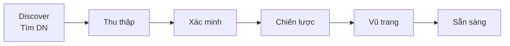

# Sales Cockpit (Lead Meeting Prep) — Hướng dẫn đầy đủ

> **Phiên bản:** 1.0 · **Cập nhật:** 2026-08-28  
> **Đối tượng:** IT/Ops (thiết lập môi trường), AM/Sales/GDKD (sử dụng UI)  
> **URL staff:** https://rs.pttads.vn  
> **Tên trên UI:** **Sales Cockpit** (backend: Lead Meeting Prep — LMP)

Tài liệu này gồm **4 phần**: (1) thiết lập môi trường & API key, (2) quyền người dùng, (3) thao tác UI từng bước, (4) màn hình kết quả khi prep **Sẵn sàng**.

**Tài liệu liên quan:**

| Chủ đề | File |
|--------|------|
| UI M1→M4 chi tiết (luồng nghiệp vụ) | [25-lead-meeting-prep-ui-guide.md](./25-lead-meeting-prep-ui-guide.md) |
| UAT pilot Discover (10 lead Meta) | [../runbooks/lmp-uat-discover-p3.md](../runbooks/lmp-uat-discover-p3.md) |
| Spec kỹ thuật | [../specs/lead-meeting-prep.md](../specs/lead-meeting-prep.md) |
| B2B E2E | [24-b2b-e2e-handover-ui-guide.md](./24-b2b-e2e-handover-ui-guide.md) |

---

## 1. Sales Cockpit là gì?

**Sales Cockpit** giúp AM B2B **chuẩn bị trước cuộc gọi / buổi chốt** bằng AI:

- Tự **tìm doanh nghiệp** từ SĐT/email (Discover) khi lead Meta chỉ có contact.
- **Research** website & nguồn công khai (Tavily).
- **Xác minh** SĐT/email khớp trang DN.
- **Sinh SCI** — chân dung DN, talk track SPIN/Challenger, offer ladder 3 gói CB/TC/CS, objection playbook.

Pipeline AI (thanh tiến trình trên UI):



| Giai đoạn nghiệp vụ | Tên UI | Khi dùng |
|---------------------|--------|----------|
| **M1** | Cuộc gọi đầu (15 phút) | Lead B2B mới, chưa xong B2 |
| **M2** | Brief sau BANT | Sau Intake Go |
| **M3** | Chuẩn bị chốt / Deal Room | Trước buổi chốt 45 phút |
| **M4** | Win loop | Debrief sau Chốt/Lost |

Thời gian prep điển hình: **1,5–5 phút** (Discover + research).

---

## 2. Thiết lập môi trường (IT / Ops)

### 2.1. Thành phần hệ thống

| Thành phần | Vai trò | Service |
|------------|---------|---------|
| **ops-web** | UI Sales Cockpit | `ptt-ops-web` |
| **ptt-crm-api** | API `/meeting-prep`, LLM parse Discover | `ptt-crm-api` |
| **ptt-worker** | Job queue: discover → collect → synthesize | `ptt-worker` |
| **PostgreSQL** | Bảng `crm_lead_meeting_prep`, cache domain/discover | `rnosai-postgres` |

### 2.2. Biến môi trường bắt buộc

Ghi vào `/var/www/rnosai/.env` và/hoặc `deploy/runtime.env` (worker đọc `runtime.env`).

#### Bật module

| Biến | Giá trị prod | Ghi chú |
|------|--------------|---------|
| `PTT_LEAD_MEETING_PREP_ENABLED` | `1` | Backend API + enqueue job |
| `PTT_JOBS_ENABLED` | `1` | Worker xử lý queue |
| `NEXT_PUBLIC_LEAD_MEETING_PREP` | `1` | **Bake lúc build ops-web** — không chỉ set runtime |

#### Discover Identity (Phase 1–3)

| Biến | Default | Ý nghĩa |
|------|---------|---------|
| `LMP_IDENTITY_DISCOVER_ENABLED` | `1` | Bật bước Discover khi thiếu tên công ty |
| `LMP_DISCOVER_CACHE_ENABLED` | `1` | Cache kết quả Discover theo SĐT/email |
| `LMP_DISCOVER_CACHE_TTL_DAYS` | `7` | TTL cache (ngày) |

#### Nội bộ worker ↔ API

| Biến | Bắt buộc | Ý nghĩa |
|------|----------|---------|
| `PTT_CRM_INTERNAL_KEY` | ✓ | Worker gọi Nest `POST /api/v1/internal/lmp/llm-*` |
| `PTT_CRM_API_URL` | ✓ (worker) | VD: `http://127.0.0.1:3000` |
| `DATABASE_URL` | ✓ | PostgreSQL |

#### Pilot (tuỳ chọn)

| Biến | Default | Ý nghĩa |
|------|---------|---------|
| `PTT_LMP_PILOT_ONLY` | `1` | Chỉ enqueue lead thuộc client pilot |
| `PTT_LMP_PILOT_CLIENT_IDS` | (danh sách UUID) | Client được chạy LMP |

### 2.3. Deploy chuẩn (VPS)

```bash
# Từ laptop — pull code + build + restart
cd /path/to/rnosai
APPLY=1 ./scripts/deploy_lmp_s2_vps.sh
```

Script trên tự:

1. Apply DDL `crm_lead_meeting_prep` (idempotent).
2. Patch flag LMP + Discover cache vào `.env`.
3. Build & restart `ptt-crm-api`, `ptt-ops-web`, `ptt-worker`.
4. Chạy gate: `lmp_discover_gate.sh` + `lead_meeting_prep_gate.sh`.

**Sau deploy:** hard-refresh trình duyệt (Ctrl+Shift+R).

### 2.4. Kiểm tra health

```bash
# Trên VPS
systemctl is-active ptt-crm-api ptt-ops-web ptt-worker

# Gate kỹ thuật (không cần Tavily live)
cd /var/www/rnosai && bash scripts/lmp_discover_gate.sh
cd /var/www/rnosai && bash scripts/lead_meeting_prep_gate.sh

# E2E đầy đủ (cần Tavily + staff token)
LMP_E2E=1 TAVILY_API_KEY=tvly-... bash scripts/lead_meeting_prep_gate.sh
```

### 2.5. DDL & quyền RBAC

```bash
# DDL (nếu chưa có bảng)
bash scripts/apply_pg_ddl_lead_meeting_prep.sh

# Cap crm_lmp.view / crm_lmp.run cho AM
python3 scripts/seed_staff_lmp_permissions.py --apply
```

AM cần **đăng xuất → đăng nhập lại** sau khi seed cap.

---

## 3. API key & dịch vụ AI

### 3.1. Bảng tổng hợp

| Dịch vụ | Biến env | Bắt buộc | Dùng cho | Không có key |
|---------|----------|----------|----------|--------------|
| **Tavily** | `TAVILY_API_KEY` | Khuyến nghị prod | Discover + Collect (search web) | Stub tier-1; Intel yếu |
| **OpenAI** | `OPENAI_API_KEY` | ✓ (Nest) | LLM synthesize, strategize, Discover parse | Prep failed / stub |
| **Apify** | `APIFY_API_TOKEN` | Tuỳ chọn | Fanpage Facebook công ty | Bỏ qua social scrape |
| **Internal** | `PTT_CRM_INTERNAL_KEY` | ✓ | Worker → Nest LLM endpoints | Worker dùng stub JSON |

### 3.2. Tavily — research web & Discover

**Lấy key:** https://tavily.com → API key dạng `tvly-...`

```bash
# Bật Tavily live trên VPS (không commit key vào git)
TAVILY_API_KEY=tvly-xxxxxxxx APPLY=1 ./scripts/deploy_lmp_tavily_live_vps.sh
```

| Biến bổ sung | Default | Ý nghĩa |
|--------------|---------|---------|
| `MAX_TAVILY_CREDITS_PER_LEAD` | `8` | Cap credit Collect mỗi lead |
| `MAX_TAVILY_DISCOVER_CREDITS` | `2` | Cap credit Discover (trong discover.py) |
| `LMP_REQUIRE_TAVILY` | `0` | `1` = fail hard nếu thiếu key |

**Chi phí ước lượng:** ~2 credits Discover + ≤8 credits Collect / lead mới (cache giảm lặp).

### 3.3. OpenAI — LLM SCI & Discover parse

Nest `ptt-crm-api` dùng `OPENAI_API_KEY` (hoặc `OPENAI_KEY`) qua module AI Intelligence.

| Biến | Default | Ý nghĩa |
|------|---------|---------|
| `PTT_AI_LLM_MODEL` | `gpt-4o-mini` | Model parse Discover + synthesize |

Worker **không** gọi OpenAI trực tiếp — gọi Nest:

- `POST /api/v1/internal/lmp/llm-complete` — synthesize SCI
- `POST /api/v1/internal/lmp/llm-discover` — parse kết quả Tavily Discover

Header: `x-ptt-internal-key: ${PTT_CRM_INTERNAL_KEY}`

### 3.4. Apify — Facebook fanpage (tuỳ chọn)

| Biến | Default | Ý nghĩa |
|------|---------|---------|
| `LMP_APIFY_ENABLED` | `0` | `1` = scrape fanpage khi có URL |
| `APIFY_API_TOKEN` | — | Token Apify |
| `LMP_APIFY_TIMEOUT_SEC` | `120` | Timeout run |

Chỉ bật khi AM thường xuyên cần signal từ fanpage DN — **không** tra profile cá nhân.

### 3.5. Checklist IT trước go-live

- [ ] `PTT_LEAD_MEETING_PREP_ENABLED=1`
- [ ] `NEXT_PUBLIC_LEAD_MEETING_PREP=1` **trong lúc build** ops-web
- [ ] `PTT_JOBS_ENABLED=1`, `ptt-worker` active
- [ ] `TAVILY_API_KEY` trên worker (`runtime.env`)
- [ ] `OPENAI_API_KEY` trên `ptt-crm-api`
- [ ] `PTT_CRM_INTERNAL_KEY` khớp giữa worker và API
- [ ] `LMP_IDENTITY_DISCOVER_ENABLED=1`
- [ ] Seed RBAC `crm_lmp.view` / `crm_lmp.run`
- [ ] Gate pass: `bash scripts/lmp_discover_gate.sh`

---

## 4. Quyền người dùng (RBAC)

| Cap | Ai cần | Cho phép |
|-----|--------|----------|
| `crm_lmp.view` | AM, Solution, GDKD | Xem Sales Cockpit |
| `crm_lmp.run` | AM, GDKD | Chạy prep, chọn DN, lưu lên lead |
| `crm_leads.view` | (fallback) | Xem nếu chưa có cap LMP riêng |
| `crm_leads.edit` | (fallback) | Chạy prep nếu chưa có `crm_lmp.run` |
| `crm_kpi_records.view` | GDKD | Xem KPI Discover tại `/crm/ai/insights?tab=sci` |

**Lead được hỗ trợ:** chỉ **B2B prospect** (`lead_flow_kind = b2b_prospect`). Lead CSKH vận hành (`spa_operational`) **không** hiện Sales Cockpit.

---

## 5. UI — Vị trí & cách mở

| # | Màn hình | Route | Ghi chú |
|---|----------|-------|---------|
| 1 | Lead detail | `/crm/leads/{id}` | Nút **Sales Cockpit**, tab **Chuẩn bị cuộc hẹn** |
| 2 | Deep link | `/crm/leads/{id}?prep=1` | Cuộn thẳng tới panel prep |
| 3 | B2B leads | `/crm/b2b/leads` | Danh sách lead B2B |
| 4 | Intake BANT | `/crm/intake?lead_id={id}` | Card **SCI · Qualify (M2)** |
| 5 | Deal Room | `/crm/leads/{id}/deal-room` | SCI buổi chốt 45p |
| 6 | CSKH board | `/crm/cskh-board` | Panel SLA + script M1 |
| 7 | KPI Discover | `/crm/ai/insights?tab=sci` | Hit rate, AM override (GDKD) |

---

## 6. UI từng bước — Luồng Discover → Prep

### 6.1. Lead mới chỉ có SĐT / email (Meta)

Đây là luồng phổ biến nhất sau triển khai Discover.

| Bước | Thao tác | Trạng thái UI | Việc AM làm |
|------|---------|---------------|-------------|
| 1 | Lead về CRM (Meta webhook / nhập tay) | — | Kiểm tra có SĐT hoặc email |
| 2 | Mở lead detail → **Chuẩn bị cuộc hẹn** | *Đang xếp hàng* / *Đang xử lý* | Chờ 30s–2 phút (Discover) |
| 3a | AI tìm thấy **1 DN** | Message: *Đã xác định doanh nghiệp…* | Chờ auto prep tiếp |
| 3b | AI tìm thấy **nhiều DN** | *Cần chọn doanh nghiệp* | Chọn radio → **Xác nhận & tiếp tục prep** |
| 3c | **Không tìm thấy** | *Chờ AM bổ sung* | Nhập **Tên công ty** → **Lưu lên lead & chạy prep** |
| 4 | Prep chạy Collect → Verify → … | Thanh 4 bước chạy dần | Chờ 1–4 phút |
| 5 | Hoàn tất | **Sẵn sàng** | Đọc SCI → gọi khách (M1) |

**Banner doanh nghiệp:** Khi đã ghi `meta_json`, panel hiện *Doanh nghiệp trên lead* + badge nguồn (*AI tự tìm* / *AM nhập tay* / *AM xác nhận*).

### 6.2. Lead đã có tên công ty

| Bước | Thao tác | Kết quả |
|------|---------|---------|
| 1 | Tạo/mở lead có **Tên công ty** ≥ 2 ký tự | Job M1 enqueue tự động |
| 2 | Mở **Chuẩn bị cuộc hẹn** | Bỏ qua Discover → vào Collect |
| 3 | Chờ **Sẵn sàng** | SCI đầy đủ |

### 6.3. Entity picker (nhiều pháp nhân)

**Khi nào:** Trạng thái *Cần chọn doanh nghiệp* hoặc Discover `found_multiple`.

1. Đọc danh sách — mỗi dòng: **Tên DN**, URL, SĐT trang, confidence.
2. Chọn radio đúng pháp nhân.
3. Bấm **Xác nhận & tiếp tục prep**.
4. Hệ thống ghi DN lên lead + chạy Collect.

### 6.4. AM nhập tay (form)

**Khi nào:** *Chờ AM bổ sung* — Discover không tìm được DN công khai.

1. Nhập **Tên công ty** (bắt buộc).
2. (Tuỳ chọn) **Website**.
3. Bấm **Lưu lên lead & chạy prep**.
4. DN được lưu vào lead (`meta_json.lmp_discover`, nguồn `am_manual`).

### 6.5. Chạy lại / sửa lỗi

| Nút | Vị trí | Khi dùng |
|-----|--------|----------|
| **Chạy lại** | Header panel prep | Prep lỗi / data lead đổi |
| **Chạy prep M1** | Card funnel M1 | Job chưa chạy |
| **Chuẩn bị chốt** | Footer Sales Cockpit | Kích hoạt prep M3 |

Cần quyền `crm_lmp.run`.

---

## 7. UI kết quả — Khi prep **Sẵn sàng**

Mở **Sales Cockpit** (`/crm/leads/{id}?prep=1`) khi trạng thái **Sẵn sàng**.

### 7.1. Header & tiến trình

| Thành phần | Ý nghĩa |
|------------|---------|
| *Sẵn sàng* | Prep hoàn tất, dùng được SCI |
| *M1 / M2 / M3* | Giai đoạn prep hiện tại |
| *Readiness XX/100* | Close readiness score (M2+) |
| Thanh **Thu thập → Xác minh → Chiến lược → Vũ trang** | 4 bước đều xanh |

### 7.2. Panel **Chuẩn bị cuộc hẹn** (compact)

Hiển thị trước khi mở full Cockpit:

| Khối | Nội dung |
|------|----------|
| **Chân dung doanh nghiệp** | Summary 2–4 câu + danh sách facts |
| Badge fact | *Đã xác minh* / *Có khả năng* / *AM cung cấp* / *Suy luận AI* |
| **Đề xuất dịch vụ** | 1–3 DV (mã DV, lý do ngắn) |
| **Kịch bản mở đầu** | Opening + câu hỏi gợi ý |
| Disclaimer | AM xác nhận trước khi trích dẫn khách |

### 7.3. Sales Cockpit full — 5 tab

#### Tab **Intel**

| Mục | Mô tả |
|-----|--------|
| Badge nguồn | Tavily live / partial / stub |
| Chân dung DN | Summary + facts có nguồn |
| Pain / ROI | Ước tính pain VND + basis |
| Urgency signals | Lý do mua bây giờ |
| Competitive angle | vs status quo, vs agency |
| Red flags | `warn` hoặc `block` — chú ý trước quote |

#### Tab **Talk Track**

| Mục | Mô tả |
|-----|--------|
| Framework | SPIN hoặc Challenger |
| Timer | Đếm ngược theo tổng phút |
| Phases | Từng đoạn script tiếng Việt |
| **Copy toàn bộ talk track** | Copy clipboard + audit log |

#### Tab **Offer Ladder**

| Cột | Tier | Vai trò |
|-----|------|---------|
| CB | Cơ bản | Entry |
| **TC** | Tiêu chuẩn | **Recommended** (highlight) |
| CS | Cao cấp | Upsell |

Mỗi card: headline, lý do, gợi ý giá VND.

#### Tab **Objections**

Flip card từng objection → **rebuttal** gợi ý + proof source.

#### Tab **Deal Ready** (chỉ M3)

| Mục | Thao tác |
|-----|----------|
| Opening narrative | Copy mở đầu buổi chốt |
| Slide bullets | Copy cho screen share |
| Close ask | Câu chốt gợi ý |
| **Tạo báo giá 3 gói** | 1-click → proposal editor |

Red flag `block` → AM thường không tạo quote; GDKD có thể override.

### 7.4. Footer Cockpit

| Nút | Tác dụng |
|-----|----------|
| 👍 / 👎 | Feedback SCI |
| **Chuẩn bị chốt** | Enqueue M3 |
| **Chạy lại** | Force refresh prep |

---

## 8. Bảng trạng thái UI

| Status API | Nhãn tiếng Việt | AM thấy gì | Hành động |
|------------|-----------------|------------|-----------|
| `pending` | Đang xếp hàng | Spinner | Chờ |
| `running` | Đang xử lý | Thanh tiến trình + message Discover | Chờ |
| `awaiting_entity_choice` | Cần chọn DN | Entity picker | Chọn & xác nhận |
| `awaiting_am_input` | Chờ AM bổ sung | Form tên công ty | Lưu & chạy prep |
| `ready` | Sẵn sàng | Full SCI | Gọi / meeting |
| `failed` | Lỗi | Banner lỗi + **Thử lại** | Báo IT nếu lặp |
| `skipped` | Bỏ qua | Chỉ khi **thiếu cả SĐT lẫn email** | Bổ sung contact |

---

## 9. KPI & giám sát (GDKD / IT)

**Route:** `/crm/ai/insights` → tab **SCI KPI** → section **Discover Identity · KPI**

| KPI | Target pilot | Ý nghĩa |
|-----|--------------|---------|
| Discover hit rate | ≥ 50% | % lead chỉ contact mà AI tìm được DN |
| AM override rate | ≤ 40% | % AM phải nhập/chọn tay |
| Time-to-ready p95 | ≤ 5 phút | Thời gian đến Sẵn sàng |
| Cache hit | — | SĐT/email lặp — tiết kiệm Tavily |

API: `GET /api/v1/ai/analytics/discover?days=30`

---

## 10. Xử lý lỗi thường gặp

| Triệu chứng | Nguyên nhân | Cách xử lý |
|-------------|-------------|------------|
| Không thấy Sales Cockpit | `NEXT_PUBLIC_LEAD_MEETING_PREP=0` lúc build | Rebuild ops-web với flag `=1` |
| API 404 meeting-prep | `PTT_LEAD_MEETING_PREP_ENABLED=0` | Bật backend flag + restart API |
| Prep mãi *pending* | Worker down | `systemctl restart ptt-worker` |
| Intel stub / partial | Thiếu `TAVILY_API_KEY` | Chạy `deploy_lmp_tavily_live_vps.sh` |
| Discover luôn *Chờ AM* | Discover tắt hoặc không có Tavily | `LMP_IDENTITY_DISCOVER_ENABLED=1` + key |
| LLM lỗi 500 | Thiếu `OPENAI_API_KEY` hoặc internal key | Kiểm tra `.env` API + worker |
| *Không có quyền* | Thiếu cap | `seed_staff_lmp_permissions.py` + login lại |
| Lead CSKH không có Cockpit | Chỉ B2B prospect | Mở từ `/crm/b2b/leads` |
| Cache cũ / DN sai | Cache SĐT 7 ngày | AM **Chạy lại** force hoặc IT xóa row cache |

---

## 11. Checklist AM — 1 lead thử (15 phút)

- [ ] Mở lead B2B **chỉ SĐT** → thấy Discover chạy
- [ ] (Nếu cần) Chọn DN hoặc nhập tên công ty
- [ ] Thấy banner *Doanh nghiệp trên lead* + nguồn
- [ ] Chờ **Sẵn sàng** — 4 bước xanh
- [ ] **Intel** — đọc pain + ít nhất 1 fact *Đã xác minh*
- [ ] **Talk Track** — copy script, thử timer
- [ ] **Offer Ladder** — 3 cột, TC highlighted
- [ ] **Objections** — mở ≥1 rebuttal
- [ ] Hoàn thành B2 → thấy card M2
- [ ] 👍 feedback trên Cockpit

---

## Phụ lục A — Biến môi trường đầy đủ (tham khảo)

```bash
# === Bật module ===
PTT_LEAD_MEETING_PREP_ENABLED=1
PTT_JOBS_ENABLED=1
NEXT_PUBLIC_LEAD_MEETING_PREP=1          # lúc build ops-web

# === Discover ===
LMP_IDENTITY_DISCOVER_ENABLED=1
LMP_DISCOVER_CACHE_ENABLED=1
LMP_DISCOVER_CACHE_TTL_DAYS=7

# === AI keys (KHÔNG commit git) ===
TAVILY_API_KEY=tvly-...
OPENAI_API_KEY=sk-...
PTT_CRM_INTERNAL_KEY=...
PTT_CRM_API_URL=http://127.0.0.1:3000

# === Tavily caps ===
MAX_TAVILY_CREDITS_PER_LEAD=8
LMP_REQUIRE_TAVILY=0                     # 1 = bắt buộc Tavily

# === LLM ===
PTT_AI_LLM_MODEL=gpt-4o-mini

# === Apify (tuỳ chọn) ===
LMP_APIFY_ENABLED=0
APIFY_API_TOKEN=

# === Collect reuse ===
LMP_M2_COLLECT_REUSE_HOURS=24

# === Pilot ===
PTT_LMP_PILOT_ONLY=1
PTT_LMP_PILOT_CLIENT_IDS=
```

---

## Phụ lục B — Lệnh deploy nhanh

| Mục đích | Lệnh |
|----------|------|
| Deploy LMP full | `APPLY=1 ./scripts/deploy_lmp_s2_vps.sh` |
| Bật Tavily live | `TAVILY_API_KEY=tvly-... APPLY=1 ./scripts/deploy_lmp_tavily_live_vps.sh` |
| Gate Discover | `bash scripts/lmp_discover_gate.sh` |
| Gate LMP full | `bash scripts/lead_meeting_prep_gate.sh` |
| Seed quyền AM | `python3 scripts/seed_staff_lmp_permissions.py --apply` |

---

*Tài liệu UI luồng M1→M4 chi tiết: [25-lead-meeting-prep-ui-guide.md](./25-lead-meeting-prep-ui-guide.md)*
