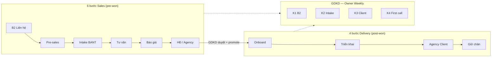

# Lifecycle B2B — Hướng dẫn sử dụng UI từng bước

> **Phiên bản:** 1.0 · **Cập nhật:** 2026-08-29  
> **Ship:** `b4f129ca` (WS4) · WS0–WS3: `cb7abdbb` → `2a06affa`  
> **Đối tượng:** AM/Sales, Solution, GDKD, Marketing, CSKH (Factory B)  
> **URL:** https://rs.pttads.vn  
> **Phạm vi:** Giao diện **Lifecycle Factory A** (bán agency) — từ lead B2B → HĐ → triển khai → Client active → đo K1–K4 trên Owner Weekly

Tài liệu mô tả **bấm gì trên màn hình**, **thấy gì**, **done khi nào**. Không thay SOP nghiệp vụ chi tiết — xem link cuối mục.

**Tài liệu liên quan:**

| Chủ đề | File |
|--------|------|
| B2B E2E bàn giao (DA → Agency → MKT Plan) | [24-b2b-e2e-handover-ui-guide.md](./24-b2b-e2e-handover-ui-guide.md) |
| Leads — sơ đồ bàn giao | [23-leads-handover-flow-and-guides.md](./23-leads-handover-flow-and-guides.md) |
| Sales Cockpit / LMP | [25-lead-meeting-prep-ui-guide.md](./25-lead-meeting-prep-ui-guide.md) |
| Agency & triển khai DV | [03-agency-service-delivery.md](./03-agency-service-delivery.md) |
| CRM Core | [02-crm-core.md](./02-crm-core.md) |
| Spec LIFE-WIN (thiết kế) | [../superpowers/specs/2026-08-28-lifecycle-absolute-win-design.md](../superpowers/specs/2026-08-28-lifecycle-absolute-win-design.md) |

---

## 0. Tổng quan một trang

Lifecycle CRM chia **hai nhà máy** — UI **không trộn** trên cùng lead:

| Nhà máy | Lead nào | UI chính |
|---------|----------|----------|
| **A — Bán agency** | `b2b_prospect` (lead B2B, không có `client_id` spa) | Lead detail: **NBA + Hành trình** → HĐ → Service delivery → Agency Client |
| **B — CSKH spa** | `spa_operational` (Meta/Zalo có `client_id`) | CSKH board SLA 15p/4h/24h — **không** journey 10 bước, **không** panel HĐ agency |

**Quy tắc vàng trên UI:**

1. **Một việc / một nút xanh** — thẻ **Việc kế tiếp (NBA)** trên lead detail (Factory A).
2. **Chỉ hiện form đúng giai đoạn** — Pre-sales sau B2; HĐ sau Báo giá / khi đã có draft.
3. **Sau thắng HĐ** — Hành trình mở rộng **10 bước**; việc delivery trên `/crm/service-delivery/{id}`.
4. **GDKD** — 4 số K1–K4 trên `/crm/owner-weekly` (không cần Excel).

---

## 1. Ai dùng màn nào

| Vai trò | Route chính | Việc trên Lifecycle UI |
|---------|-------------|-------------------------|
| **AM / Sales** | `/crm/leads/{id}` | NBA, Hành trình, B2, Intake, Deal Room, HĐ |
| **Solution** | `/crm/solution/queue`, tab Tư vấn lead | Handoff sau Intake Go |
| **GDKD** | `/crm/hub` (duyệt HĐ), `/crm/owner-weekly` | Approve promote, xem K1–K4 |
| **AM triển khai** | `/crm/service-delivery/{lifecycle_id}` | Hero CTA, Workflow, TMMT, Launch QA |
| **AM Agency** | `/agency/clients/{uuid}` | Checklist onboard → **Activate client** |
| **CSKH spa** | `/crm/cskh-board` | Factory B — ngoài phạm vi journey B2B |

**Cap tối thiểu (tham khảo):** `crm_leads.view`, `crm_leads.edit`; HĐ: caps contract; service-delivery: `crm_board.edit`; owner-weekly: GDKD/finance caps.

---

## 2. Màn Lead detail — khung chung Factory A

**Route:** `/crm/leads/{id}`

### 2.1. Thứ tự block trên màn (từ trên xuống)

| Thứ tự | Block | Khi nào hiện |
|--------|-------|--------------|
| 1 | Header + contact (gọi / copy SĐT) | Luôn |
| 2 | **NBA + Hành trình** (`lead-workspace-stage`) | Lead `b2b_prospect` |
| 3 | SLA / SCI (LMP) | Theo flag LMP |
| 4 | Funnel: **B2** (`#funnel-b2`) | B2 chưa xong |
| 5 | Funnel: **Pre-sales** (`#funnel-presales`) | Sau B2 complete |
| 6 | Banner **Deal Room** | B2 xong + Intake Go + flag Deal Room |
| 7 | Panel **Hợp đồng** (`#lead-contract`) | Giai đoạn Báo giá / đã có HĐ draft-active |
| 8 | Tab Tư vấn / Meeting Prep | Theo cap & giai đoạn |

Lead **spa** thấy banner *「Luồng CSKH vận hành 24h」* — không có NBA B2B, không Hành trình, không HĐ agency.

### 2.2. Thẻ Việc kế tiếp (NBA)

Một thẻ duy nhất — luôn chỉ **một hành động chính** (nút xanh).

| Rule | Tiêu đề (ví dụ) | Nút chính | Điều kiện |
|------|-----------------|-----------|-----------|
| 1 | Bổ sung SĐT/email | Bổ sung contact | Thiếu phone & email |
| 2–4 | LMP prep | Lưu công ty / chọn pháp nhân / chờ prep | Flag LMP bật |
| 5 | Gọi đầu 15 phút | Ghi activity / gọi | B2 chưa xong |
| 6 | Qualify BANT | **Mở Intake** | B2 xong, pre-sales stage `lead` |
| 7 | Giao Solution / Tư vấn | Giao Solution / Mở Tư vấn | Intake Go, stage `consult` |
| 8 | Deal Room / HĐ | Mở Deal Room / Gửi GDKD / Tạo HĐ | Stage `proposal` |
| **9** | Học từ cuộc chốt | **Gửi debrief** | Status `won` / `chot` / `lost` + debrief chưa gửi |
| 10 | Fallback | Ghi activity | Các case còn lại |

**WS4 — Debrief sau thắng HĐ:** Khi GDKD duyệt promote, lead chuyển **`won`**. Nếu chưa gửi debrief LMP, NBA hiện rule **9** — bấm **Gửi debrief** (tab Meeting Prep / form debrief chốt).

### 2.3. Thanh Hành trình (Journey stepper)

**Vị trí:** Ngay dưới NBA.

**Pre-won (6 bước)** — mô tả: *「B2 → Pre-sales → Intake → Tư vấn → Báo giá → HĐ」*

| Bước | Nhãn | Màu / trạng thái | Bấm vào → |
|------|------|-------------------|-----------|
| B2 Liên hệ | `done` ✓ / `current` / `pending` | Anchor `#funnel-b2` |
| Pre-sales | | Anchor `#funnel-presales` |
| Intake BANT | | `/crm/intake?lead_id={id}` |
| Tư vấn | | Mở tab Tư vấn (nút) |
| Báo giá | | `/crm/leads/{id}/deal-room` |
| HĐ / Agency | | `/crm/service-delivery/{lifecycle_id}` **khi HĐ active**; else `#lead-contract` |

**Post-won (10 bước)** — khi **HĐ `active` + có `lifecycle_id`**. Mô tả: *「B2 → … → HĐ → OB → Giao → CL → Ret」*

| Bước | Nhãn ngắn | Link |
|------|-----------|------|
| Onboard | OB | `/crm/service-delivery/{id}` |
| Triển khai | Giao | Cùng route |
| Agency Client | CL | `/agency/clients/{uuid}` (nếu đã promote WS2) |
| Giữ chân | Ret | `/crm/service-delivery/{id}` |

6 bước sales đều **done** (✓); bước delivery theo `lifecycle_stage` hiện tại (`onboard` → `deliver` → `handover` → `retain`).

**Lead đang review queue:** toàn bộ hành trình **blocked** — banner link `/crm/leads/review-queue`.

---

## 3. Từng bước Sales — thao tác UI

### Bước 1 — B2 Liên hệ (`#funnel-b2`)

| | |
|---|---|
| **Ai** | AM / CSKH B2B |
| **Done khi** | B2 complete (care pipeline all complete) |
| **Gate** | ≥ 1 báo cáo chăm sóc; có trạng thái **Liên hệ OK** (`da_lien_he_thanh_cong`); ghi chú hoàn thành ≥ 3 ký tự |

**Thao tác:**

1. Ghi activity / gọi (softphone hoặc log tay).
2. Trong block B2, bấm **Hoàn thành bước** → nhập ghi chú → xác nhận.
3. NBA chuyển sang **Mở Intake** (rule 6); Pre-sales block xuất hiện.

**Hệ thống ghi milestone `b2_done`** (WS4) — dùng cho K1 Owner Weekly.

---

### Bước 2 — Pre-sales (`#funnel-presales`)

| | |
|---|---|
| **Ai** | AM |
| **Done khi** | Ensure pre-sales + hoàn task theo stage |
| **Gate** | Chỉ hiện sau B2 complete |

**Thao tác:**

1. Bấm **Ensure pre-sales** (nếu chưa có).
2. Làm task từng giai đoạn `lead` → `consult` → `proposal`.
3. Hành trình cập nhật: bước đang làm = **current** (viền xanh).

---

### Bước 3 — Intake BANT (Deal Bar + workspace)

| | |
|---|---|
| **Route** | `/crm/intake?lead_id={id}` (hoặc bấm bước Intake trên hành trình) |
| **Ai** | AM |
| **Done khi** | Session completed + decision **`go`** |

Trang Intake là **workspace qualify** — không còn stack card ngữ cảnh / SCI / funnel trước form.

**Deal Bar** (sticky trên cùng):

| Ô | Thấy gì |
|---|---------|
| Liên hệ · công ty · ngành | Tên lead; chip ngành hoặc **Chưa có ngành** |
| Dịch vụ | Select: SEO tổng thể / Quảng cáo Google / Thiết kế website / Chưa chọn dịch vụ |
| BANT live | `BANT x/30 · Còn y để Go` (hoặc **Đủ Go** khi ≥24) |
| Stage | Pre-sales stage (`lead` / `consult` / …) |
| SCI | 1 dòng pain (≤120 ký tự) hoặc **SCI chưa sẵn** — không còn card SCI M2 |
| CTA | **← Lead** · **Cockpit** · **Funnel ▾** (stepper thu gọn mặc định) |

**4 tab** (cùng một phiên, không phải 4 form):

| Tab | Việc AM |
|-----|---------|
| **Qualify** | Chấm BANT 1–5, quyết định Go / Nurture / No-Go, red flags, checklist qualify theo dịch vụ |
| **Discovery** | Hỏi câu critical trên call (SEO: domain / `seo_domain`; Google Ads / Website: form pilot) |
| **Win intel** | Agency cũ, đối thủ, tiêu chí chọn |
| **Handoff** | Stakeholder, cam kết, tóm tắt, stepper nếu Funnel đang đóng |

**Sales Kit** (cột phải desktop ≥1280; nút **Sales Kit** trên mobile) — chip rules, **không cần LLM**:

| Chip | Dùng khi |
|------|----------|
| **Câu tiếp theo** | Câu critical còn trống |
| **Còn thiếu để Go** | Gap điểm tới 24 (BANT 0 → hiện **24**) |
| **Win intel** / **Deep-dive dịch vụ** | Gợi ý theo slug |
| **Tóm tắt 30s** / **Red flag** | Tóm tắt / cảnh báo |
| **Hỏi kho / Q&A** · **Bảng giá / band** | Cần file kho; chưa có → *Chưa có file trong thư mục kho.* Chip **không cần LLM**. Ô **KH vừa nói…** hiện khi chọn chip này — gõ *KH nói đắt* để lấy đáp + citation. |

**Kho Sales Kit** (GDKD / người có `playbooks.configure` hoặc `crm_leads.configure`):

| | |
|---|---|
| **Route** | `/crm/intake/sales-kit?folder=dich-vu-seo-tong-the/qa` — menu **Bán hàng → Kho Sales Kit** |
| **Folder** | 3 dịch vụ pilot + `_common` × `qa` / `battle-cards` / `cases` / `pricing` |
| **Upload** | xlsx / pdf / ảnh. Org file ở `pending` đến khi bấm **Duyệt** (`ready`) |
| **Tải mẫu** | Excel 5 hàng Q&A SEO — gồm *KH nói đắt* / *Neo gói TC 3 tháng, không giảm dưới band* |
| **Túi phiên** | Nút **Kho** trên Intake: AM kéo file vào phiên (chỉ lead đó). Kho org **chỉ xem**, không xóa |

S4: upload mẫu SEO → **Duyệt** → chip Hỏi kho *KH nói đắt* → citation. Folder pricing trống → empty-state, **không** bịa số.

Tick **Áp dụng vào form** rồi bấm **Áp dụng** (BANT hints mặc định **tắt**). Kit không Complete / Reopen / chuyển funnel.

**Thao tác:**

1. Tạo phiên **+ Gọi điện** / **+ Gặp trực tiếp** (cột trái).
2. Tab **Discovery**: hỏi critical (SEO: website/domain).
3. Tab **Qualify**: chấm BANT; chọn **Go** / Nurture / No-Go + lý do.
4. (Tuỳ chọn) chip **Còn thiếu để Go** / **Câu tiếp theo** — xác nhận Áp dụng nếu ghi form.
5. Bấm **Hoàn thành phiên**.
6. Mở **Funnel** trên Deal Bar; khi gate OK bấm **Chuyển → Tư vấn**.

Sau **Go:** banner Deal Room (nếu bật); NBA hướng **Giao Solution** hoặc **Mở Intake** tùy stage.

**Hệ thống ghi milestone `intake_go`** — dùng cho K2.

---

### Bước 4 — Tư vấn (Solution)

| | |
|---|---|
| **Route** | Tab **Tư vấn** trên lead detail |
| **Ai** | AM giao → Solution claim trên `/crm/solution/queue` |

**Thao tác:**

1. AM: NBA **Giao Solution/MKT** → case vào queue.
2. Solution: claim → làm việc tab Tư vấn (KH MKT sơ bộ L1).
3. Khi trả Sales: NBA **Chuyển → Báo giá** → pre-sales stage `proposal`.

---

### Bước 5 — Báo giá / Deal Room

| | |
|---|---|
| **Route** | `/crm/leads/{id}/deal-room` hoặc banner Deal Room |
| **Gate** | B2 + Intake Go + flag Deal Room |

**Thao tác:**

1. Mở Deal Room — narrative, 3 gói, close ask.
2. NBA rule 8: **Mở Deal Room** hoặc **Tạo HĐ draft** (nếu Deal Room tắt).

Panel **Hợp đồng** xuất hiện khi stage `proposal` hoặc đã có HĐ.

---

### Bước 6 — Hợp đồng & GDKD duyệt (`#lead-contract`)

| | |
|---|---|
| **Ai** | AM tạo/submit; **GDKD** duyệt trên Hub |
| **Done khi** | HĐ `active` + promote → lifecycle onboard + lead `won` |

**Thao tác AM:**

1. **Tạo HĐ draft** (NBA hoặc panel HĐ) khi gate readiness đủ.
2. **Gửi GDKD duyệt** — trạng thái pending; NBA: *Chờ GDKD duyệt*.
3. Sau duyệt: HĐ **active**; link **Mở lifecycle** / **Mở Agency Client** (WS2).

**Thao tác GDKD:**

1. `/crm/hub` → HĐ chờ duyệt → Approve.
2. Hệ thống promote: customer, case, lifecycle, Agency Client draft, lead **`won`**.

**Hệ thống ghi milestone `contract_active`** — dùng cho K3 (cặp với client active).

**Sau promote — trên lead detail:**

- Hành trình **10 bước**; bước **OB** = current.
- NBA có thể là **Gửi debrief** (rule 9) nếu LMP debrief pending.
- Panel HĐ: link **Agency Client** (không cần `/agency/clients/new` trên happy path).

---

## 4. Từng bước Delivery — sau thắng HĐ

### Bước 7–10 — Service delivery & Agency

**Route chính:** `/crm/service-delivery/{lifecycle_id}`

### 4.1. Hero card — Việc kế tiếp delivery

**Vị trí:** Trên dãy tab (Workflow / TMMT / …).

Một nút primary — logic tự chọn theo gate backend:

| Tình huống | Tiêu đề card | Nút |
|------------|--------------|-----|
| Còn task stage | Hoàn thành task giai đoạn | Làm tiếp (x/y) → tab **Workflow** |
| Gate onboard | Gate Onboard | Mở checklist Onboard |
| Thiếu TMMT | Gate TMMT | Mở TMMT chính thức |
| Launch QA | Launch QA chưa ready | Mở Launch QA |
| Công nợ | Công nợ HĐ | Mở Tài chính |
| Sẵn sàng | Sẵn sàng chuyển bước | **Chuyển → {stage}** |
| Cuối pipeline | Đã ở giai đoạn cuối | (không nút) |

**Thao tác AM hàng ngày:** Mở lifecycle → đọc hero card → bấm nút xanh → làm việc tab được mở → quay lại khi task/gate xong → bấm **Chuyển stage** khi card báo sẵn sàng.

### 4.2. Map bước hành trình ↔ stage lifecycle

| Journey | Stage DB | Việc chính trên UI |
|---------|----------|---------------------|
| OB (Onboard) | `onboard` | Workflow tasks + checklist Agency |
| Giao | `deliver` | TMMT, Content, Campaign, Launch QA |
| CL (Agency Client) | `handover` | `/agency/clients/{id}` — checklist → **Activate** |
| Ret | `retain` | Renewal, portal KH, giữ chân |

### 4.3. Agency Client — kích hoạt Client active

**Route:** `/agency/clients/{uuid}` (bấm bước **CL** trên hành trình hoặc link từ panel HĐ)

| | |
|---|---|
| **Ai** | AM |
| **Done khi** | Client status **`active`** (checklist onboard 100% nếu strict mode) |

**Thao tác:**

1. Làm checklist onboarding trên Agency Client.
2. Bấm **Activate client** (hoặc tương đương trên UI Agency).
3. Hành trình: CL → done; Ret có thể current.

**Hệ thống ghi milestone `client_active`** — K3 đo median ngày từ HĐ active → Client active (mục tiêu ≤ 14 ngày).

---

## 5. GDKD — Owner Weekly (K1–K4)

**Route:** `/crm/owner-weekly`

### 5.1. Vị trí block Lifecycle

| Thứ tự | Nội dung |
|--------|----------|
| 1 | Tiles tóm tắt tuần (xanh/vàng/đỏ) |
| 2 | **Lifecycle (Factory A/B)** — 4 metric ngang (`.owner-weekly-lifecycle`) |
| 3 | 4 khối cũ: Tiền / Kinh doanh / Hiệu quả / Rủi ro |
| 4 | Hành động ưu tiên |

### 5.2. Ý nghĩa 4 chỉ số

| Metric | Ý nghĩa | Target mặc định | Nguồn |
|--------|---------|-----------------|-------|
| **K1** B2 median (phút) | Lead tạo → B2 complete | ≤ 480 phút | Milestone `b2_done` |
| **K2** Intake median (ngày) | B2 → Intake Go | ≤ 5 ngày | `b2_done` + `intake_go` |
| **K3** Client active median (ngày) | HĐ active → Client active | ≤ 14 ngày | `contract_active` + `client_active` |
| **K4** First call 15p (%) | Factory B — SLA gọi đầu | ≥ 85% | CSKH board tier 15p |

**Cửa sổ đo:** 90 ngày lùi tính đến **cuối tuần** báo cáo.

**Chưa đủ mẫu (n < 3):** metric hiện *「Chưa đủ mẫu (n=…)」*, giá trị trống — bình thường khi mới pilot.

**Màu RAG:** xanh = đạt target; vàng/đỏ = lệch — xem **Hành động ưu tiên** phía dưới.

### 5.3. Cấu hình target

Trên cùng trang Owner Weekly → form target (hoặc env `PTT_OWNER_WEEKLY_*`) — nhóm **Lifecycle**: `k1_b2_median_max_minutes`, `k2_intake_median_max_days`, `k3_client_active_max_days`, `k4_first_call_min_pct`.

---

## 6. Factory B (CSKH spa) — không dùng journey B2B

Lead Meta/Zalo có **`client_id`** → luồng **spa_operational**:

| Có | Không có |
|----|----------|
| Banner CSKH 24h | NBA B2B, Hành trình 10 bước |
| B2 outcome card | Pre-sales, Intake BANT HĐ, Deal Room |
| CSKH board SLA | Panel Hợp đồng agency |
| Closed-loop khi `chot` | Debrief rule 9 cho `won` promote |

**K4** trên Owner Weekly vẫn đo Factory B (first call 15p) — AM B2B không thao tác trực tiếp metric này; CSKH xử lý trên `/crm/cskh-board`.

---

## 7. Checklist nhanh theo vai trò

### AM — lead mới B2B → thắng HĐ

- [ ] Mở `/crm/leads/{id}` — có NBA + Hành trình 6 bước
- [ ] Hoàn thành B2 → Intake Go → Giao Solution → Báo giá
- [ ] Deal Room / tạo HĐ draft → Gửi GDKD
- [ ] Sau duyệt: hành trình 10 bước; mở service-delivery; **Gửi debrief** nếu NBA báo
- [ ] Mở Agency Client từ HĐ hoặc bước CL — làm checklist → Activate

### AM — đang triển khai lifecycle

- [ ] Mỗi ngày: `/crm/service-delivery/{id}` → hero card → một việc
- [ ] Gate TMMT / Launch QA / Finance khi card yêu cầu
- [ ] Chuyển stage chỉ khi card **Sẵn sàng chuyển bước**

### GDKD — cuối tuần

- [ ] `/crm/owner-weekly` — đọc strip Lifecycle K1–K4
- [ ] Xử lý metric vàng/đỏ trong **Hành động ưu tiên**
- [ ] Duyệt HĐ pending trên Hub trước khi AM promote

---

## 8. Xử lý lỗi / FAQ UI

| Triệu chứng | Nguyên nhân thường gặp | Cách xử lý |
|-------------|------------------------|------------|
| Không thấy NBA / Hành trình | Lead là spa (`client_id`) | Đúng thiết kế — dùng CSKH board |
| Không thấy Pre-sales | B2 chưa complete | Hoàn thành B2 trước |
| Không thấy panel HĐ | Stage chưa `proposal` và chưa có HĐ | Lên Báo giá / tạo draft |
| Hành trình vẫn 6 bước sau duyệt | HĐ chưa `active` hoặc chưa có `lifecycle_id` | Refresh; kiểm tra Hub approve + promote |
| Bước CL không bấm được | Chưa có `agency_client_id` (promote cũ) | Panel HĐ fallback tạo client thủ công |
| K1–K3 trống trên Owner Weekly | n < 3 hoặc chưa backfill lịch sử | Pilot thêm lead; IT chạy backfill SQL |
| NBA debrief không hiện | Debrief đã gửi hoặc status không terminal | Kiểm tra tab Meeting Prep / win outcome |

---

## 9. Milestone hệ thống tự ghi (không cần bấm)

| Milestone | Khi nào ghi | Phục vụ |
|-----------|-------------|---------|
| `b2_done` | Hoàn thành B2 `first_contact` | K1 |
| `intake_go` | Complete intake decision Go | K2 |
| `contract_active` | GDKD approve / promote HĐ active | K3 (đầu) |
| `client_active` | Activate Agency Client | K3 (cuối) |

Ghi **một lần / lead / key** — timestamp đầu tiên thắng.

---

## 10. Liên kết SOP & runbook

| Tài liệu | Đường dẫn |
|----------|-----------|
| SOP B2B onboard | [../runbooks/sales-b2b-lead-client-onboard-sop.md](../runbooks/sales-b2b-lead-client-onboard-sop.md) |
| Lead → chăm sóc KH | [../crm/huong-dan-day-du-lead-den-cham-soc-khach-hang.md](../crm/huong-dan-day-du-lead-den-cham-soc-khach-hang.md) |
| Backfill milestone (IT) | [../../scripts/backfill_lifecycle_milestones.sql](../../scripts/backfill_lifecycle_milestones.sql) |

---

*Tài liệu bám UI ship `b4f129ca`. Khi spec LIFE-WIN cập nhật WS5+, bổ sung mục tương ứng tại đây.*
