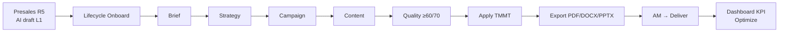
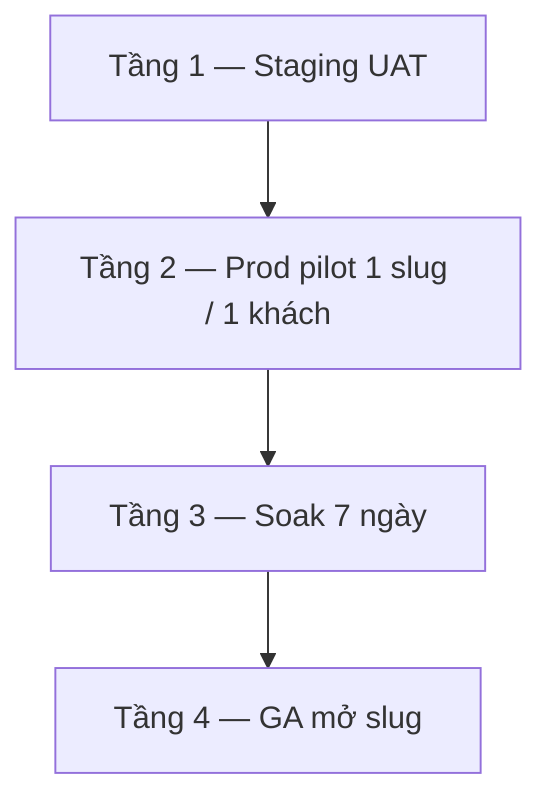

# Marketing AI Planner — Hướng dẫn chức năng, môi trường & vận hành thực chiến

> **Phiên bản:** 1.1 · **Cập nhật:** 2026-09-01  
> **Đối tượng:** IT/DevOps (thiết lập & triển khai) · Solution Strategist / MKT Lead (soạn TMMT) · AM / GDKD (duyệt, chuyển Deliver) · PO (sign-off GA)  
> **URL staff:** https://rs.pttads.vn  
> **Route chính:** `/crm/service-delivery/[id]?tab=ai-planner`  
> **Presales:** `/crm/leads/[id]` → Marketing plan → **AI draft KH MKT**  
> **Bản tóm tắt 5 bước:** [11-marketing-ai-planner.md](./11-marketing-ai-planner.md)

Tài liệu này là **sổ tay vận hành chính thức**: từng chức năng trên UI, biến môi trường, quyền, checklist triển khai staging → prod pilot → GA, và SOP soạn TMMT thực tế (≤30 phút).

---

## 0. AI Planner làm gì — và không làm gì

**AI Marketing Planner** giúp SP hoàn **TMMT (kế hoạch marketing chính thức)** trên lifecycle dịch vụ: Brief → Strategy → Campaign → Content → Quality → **Apply**. Sau Apply, AM mới được **Chuyển → Triển khai** trên tab Workflow nếu gate TMMT xanh.



### Nguyên tắc bắt buộc (không được bỏ)

| Mã | Quy tắc | Hệ quả nếu vi phạm |
|----|---------|-------------------|
| **BR-MKTP-01** | Human-in-the-loop: AI chỉ **nháp**. **Apply** mới ghi TMMT. Không silent merge. | TMMT lệch so với ý SP; khách nhận plan chưa duyệt |
| **BR-MKTP-02** | Không auto-advance stage. AM bấm **Chuyển → Triển khai** thủ công. | Lifecycle nhảy Deliver khi plan chưa pass |
| **BR-MKTP-03** | Mọi job AI ghi audit (`mkt_ai_jobs` + `ai_agent_runs`) | Không truy vết chi phí / lỗi |
| **BR-MKTP-05** | Apply blocked nếu quality **&lt; 60**. Export PDF đầy đủ khi **≥ 70** | Plan mỏng ra khách |
| **BR-AI-01** | **Không** auto-email khách từ AI (`PTT_MKT_AI_AUTO_CUSTOMER_EMAIL=0`) | Rủi ro compliance |
| **BR-MKTP-08** | Thiếu `OPENAI_API_KEY` → fallback rule-based + banner cảnh báo | Plan “stub” — không dùng chốt khách |

---

## 1. Vai trò & quyền

| Vai trò | Việc chính | Cap RBAC |
|---------|------------|----------|
| **SP / Marketing Leader** | Brief, sinh AI, sửa draft, Apply, export | `crm_mkt_ai.view` + `generate` (+ `export`) |
| **MKT Lead / GDKD** | Duyệt plan trước export (khi approval bật) | `crm_mkt_ai.approve` |
| **AM** | Mở lifecycle, xem plan, chuyển Deliver sau gate xanh | `crm_board.view` + quyền workflow |
| **Admin / IT** | Policy slug, playbook learn, flag, gán cap, restart service | Admin Playbooks + Permissions + SSH VPS |
| **Khách (portal)** | Xem tóm tắt plan (read-only) | Portal JWT — không cap staff |

Gán cap: **Admin → Permissions** (hoặc SQL preset). Nút disabled + tooltip = **thiếu cap**, không phải bug UI.

---

## 2. Thiết lập môi trường (IT / DevOps)

### 2.1. Thành phần

| Thành phần | Service | Vai trò |
|------------|---------|---------|
| **ops-web** | `ptt-ops-web` | Tab AI Planner + Presales AI draft |
| **ptt-crm-api** | `ptt-crm-api` | `/api/crm/service-lifecycle/:id/ai-planner/*` |
| **PostgreSQL** | `rnosai-postgres` | `mkt_ai_*` + `mkt_ai_service_policy` + `mkt_ai_playbook_versions` |
| **LLM** | OpenAI (hoặc stub) | Sinh strategy / campaign / content / quality |

File env trên VPS: `/var/www/rnosai/.env` và `deploy/runtime.env`.  
`NEXT_PUBLIC_*` **bake lúc build ops-web** — chỉ sửa `.env` rồi restart API **không** hiện tab.

### 2.2. Công tắc module (bắt buộc)

| Biến | Staging / thực chiến | Ý nghĩa |
|------|----------------------|---------|
| `PTT_MKT_AI_PLANNER_ENABLED` | `1` | Bật API. `0` → 404 `mkt_ai_planner_disabled` |
| `NEXT_PUBLIC_MKT_AI_PLANNER` | `1` | Hiện tab **AI Planner** trên ops-web |

Sau khi đổi `NEXT_PUBLIC_*`: rebuild + restart ops-web.

```bash
# VPS
cd /var/www/rnosai
# sửa .env / deploy/runtime.env
cd services/ptt-crm-api && npm run build
sudo systemctl restart ptt-crm-api
NEXT_PUBLIC_MKT_AI_PLANNER=1 ./scripts/deploy_ops_web.sh
sudo ./scripts/deploy_ops_web.sh --restart
```

### 2.3. Policy dịch vụ (Admin) — thay hai lớp env 403 cũ

Từ 2026-09-01, mỗi `service_slug` có **một policy** trong PostgreSQL (`mkt_ai_service_policy`): `off` | `pilot` | `ga`. MKT Lead bật pilot trên **Admin → AI Marketing → Playbook DV** (`/crm/admin/mkt-ai/playbooks`) — **không cần sửa `.env` / restart** để mở slug mới.

| Rollout | Planner / Presales AI | Ghi chú |
|---------|----------------------|---------|
| `off` | 403 `mkt_ai_service_not_enabled` | Mặc định slug mới |
| `pilot` | Sinh AI được | Soak từng DV |
| `ga` | Sinh AI được | Sau duyệt PO |

**Một mã lỗi tiếng Việt** (thay `mkt_ai_planner_slug_not_pilot` + `mkt_ai_pilot_slug_required`):

```json
{
  "error": "mkt_ai_service_not_enabled",
  "message": "Dịch vụ này chưa mở AI Planner. MKT Lead bật pilot tại Admin → AI Marketing → Playbooks.",
  "admin_path": "/crm/admin/mkt-ai/playbooks?slug=quang-cao-facebook",
  "service_slug": "quang-cao-facebook"
}
```

**Env legacy (AND khẩn nếu còn set):**

| Env | Hành vi |
|-----|---------|
| `PTT_MKT_AI_PLANNER_SLUGS` | **Deprecated.** Non-empty → slug phải nằm trong list **và** policy pilot/ga. Rỗng = chỉ policy. |
| `PTT_MKT_AI_PILOT_ONLY` + `PTT_MKT_AI_PILOT_SLUGS` | **Deprecated.** Cùng AND; khuyến nghị `PILOT_ONLY=0` sau khi seed policy. |

**VPS P0 (policy DB):**

```bash
psql "$DATABASE_URL" -f docs/specs/2026-09-01-postgresql-ddl-mkt-ai-playbook-policy.sql
psql "$DATABASE_URL" -f scripts/seed_mkt_ai_service_policy.sql
# Tuỳ chọn: UPDATE mkt_ai_service_policy SET rollout='pilot' WHERE service_slug='quang-cao-facebook';
# Tuỳ chọn: xóa hoặc để trống PTT_MKT_AI_PLANNER_SLUGS
sudo systemctl restart ptt-crm-api
```

Seed mặc định: `meta-lead-gen`, `bds-lead-gen`, `seo-retainer` = **pilot**; slug khác = **off** (gồm `quang-cao-facebook`).

| Mục tiêu vận hành | Cách set |
|-------------------|----------|
| Luyện 3 playbook shipped | Giữ 3 slug pilot trong DB |
| Thực chiến QC Facebook | Admin → Playbook DV → `quang-cao-facebook` → rollout **pilot** |
| GA từng DV | pilot → soak → chuyển **ga** trên Admin |
| GA toàn catalog | PO sign-off + policy `ga` từng slug (không nhảy rollout toàn VPS một lần) |

### 2.3.1. Playbook `_common` (fallback)

Slug `pilot`/`ga` **luôn** có playbook: khớp file industry → version **active** DB → **`_common`** (Playbook chung) → disk. Slug mới (vd. `quang-cao-facebook`) soạn TMMT ngay với `_common` — không chờ PR JSON riêng.

Dropdown AI Planner luôn có `_common` + playbook khớp slug + 3 shipped (Meta / BĐS / SEO).

### 2.3.2. Học playbook từ HĐ thắng (Admin)

**Route:** `/crm/admin/mkt-ai/playbooks` · Cap: `crm_mkt_ai.generate` (Sinh) · `crm_mkt_ai.approve` (Duyệt / Active)

Luồng:

1. SP Apply TMMT trên ≥5 HĐ thật (quality ≥70, đã sửa tay) → corpus ứng viên.
2. MKT Lead mở slug → **Sinh playbook từ HĐ thực chiến** (disabled `Còn N HĐ…` khi &lt;5).
3. AI ghi version **`draft`** — không auto-active.
4. **Gửi duyệt** → **Duyệt** / **Yêu cầu sửa**.
5. **Active** chỉ khi `approved` (không nút Active trên `draft`).

Ngưỡng: 5 ứng viên · 3 thắng closed-loop · cooldown 7 ngày · depth `deep` cần artifact Ops/QA/Content. Chi tiết: [`mkt-ai-playbook-ops.md`](../runbooks/mkt-ai-playbook-ops.md) · spec MKTP-PB-LEARN-20260901.

### 2.4. Feature flags theo pha

| Biến | Khuyến nghị thực chiến | Chức năng |
|------|------------------------|-----------|
| `PTT_MKT_AI_RAG_ENABLED` | `1` | Brand KB + cite nguồn khi sinh |
| `PTT_MKT_AI_BRIEF_UPLOAD_ENABLED` | `1` | Upload PDF/DOCX → điền brief |
| `PTT_MKT_AI_PLAYBOOKS_ENABLED` | `1` | Template Meta / BĐS / SEO + `_common` |
| `PTT_MKT_AI_PLAYBOOK_LEARN_ENABLED` | `1` staging | Job học playbook (Admin Sinh) |
| `PTT_MKT_AI_MULTI_AGENT_ENABLED` | `1` | Tab Pipeline AI (4 job tuần tự) |
| `PTT_MKT_AI_MULTI_AGENT_ASYNC` | `1` sau UAT | Pipeline không block request |
| `PTT_MKT_AI_GOVERNANCE_BANNER` | `1` | Banner human-in-the-loop |
| `PTT_MKT_AI_APPROVAL_REQUIRED` | `1` prod | Duyệt trước export |
| `PTT_MKT_AI_APPROVER_NOTIFY_USER_IDS` | id staff, cách `,` | Nhận thông báo duyệt |
| `PTT_MKT_AI_KPI_ALERT_ENABLED` | `1` | Alert CPL/ROAS lệch |
| `PTT_MKT_AI_KPI_ALERT_CPL_PCT` | `15` | Ngưỡng % CPL |
| `PTT_MKT_AI_KPI_ALERT_ROAS_PCT` | `20` | Ngưỡng % ROAS |
| `PTT_MKT_AI_KPI_ALERT_COOLDOWN_DAYS` | `7` | Không spam alert |
| `PTT_MKT_AI_KPI_CLOSED_LOOP` | `1` deliver | Dashboard plan vs thực tế |
| `PTT_MKT_AI_WEEKLY_MEMO_CRON` | `0 9 * * 1` | Memo thứ 2 09:00 |
| `PTT_MKT_AI_PLAN_DEPTH_ENABLED` | opt-in | Brief readiness + depth |
| `PTT_MKT_AI_SCENARIO_COMPARE` | opt-in | So sánh phương án chiến lược |
| `PTT_MKT_AI_SECTION_COMMENTS` | `1` collab | Comment theo section |
| `PTT_MKT_AI_EXPORT_PPTX` | `1` | Export PowerPoint |
| `PTT_MKT_AI_LAUNCH_QA_QUALITY_GATE` | `1` nếu dùng Launch QA | Block Launch QA nếu score &lt;70 |
| `PTT_MKT_AI_PORTAL_SUMMARY` | opt-in | API tóm tắt portal |
| `NEXT_PUBLIC_MKT_AI_PORTAL_SUMMARY` | cùng portal | Card trên portal |
| `PTT_MKT_AI_OPS_WEEKLY_REPORT` | `1` | Báo cáo SLO tuần |
| `PTT_MKT_AI_AUTO_CUSTOMER_EMAIL` | **`0` luôn** | Cấm auto-mail khách |
| `PTT_MKT_AI_MODEL` | *(trống = default)* | Override model LLM |
| `OPENAI_API_KEY` | **bắt buộc thực chiến** | Thiếu = stub/rule-based |

Template đầy đủ: [`deploy/env.mkt-ai-ga.example`](../../deploy/env.mkt-ai-ga.example) · prod 1 client: [`deploy/env.mkt-ai-prod-pilot.example`](../../deploy/env.mkt-ai-prod-pilot.example).

### 2.5. DDL lần đầu

```bash
cd /var/www/rnosai
source .env
bash scripts/apply_pg_ddl_mkt_ai_planner.sh
# Policy + versions (playbook learn):
psql "$DATABASE_URL" -f docs/specs/2026-09-01-postgresql-ddl-mkt-ai-playbook-policy.sql
psql "$DATABASE_URL" -f scripts/seed_mkt_ai_service_policy.sql
psql "$DATABASE_URL" -f docs/specs/2026-09-01-postgresql-ddl-mkt-ai-playbook-versions.sql
bash scripts/verify_mkt_ai_ddl.sh
```

Re-enable flag **không** xóa bảng. Rollback chỉ tắt flag.

### 2.6. Smoke sau deploy (bắt buộc)

```bash
source .env
export LIFECYCLE_ID=<id lifecycle whitelist>
export PTT_CRM_INTERNAL_KEY=...
bash scripts/smoke_mkt_ai_planner_context.sh
# 3 slug:
bash scripts/smoke_mkt_ai_multi_slug.sh
# Playbook:
bash scripts/verify_mkt_ai_playbooks.sh
```

Health API: `curl -sf http://127.0.0.1:3000/health` → `"ok":true`.

---

## 3. Điều kiện mở được tab (người dùng)

Trước khi SP bắt đầu soạn:

1. Login staff trên https://rs.pttads.vn
2. Lifecycle **stage ≥ Onboard** (lead/proposal = chỉ xem hoặc ẩn)
3. Đã có **TMMT official plan** (promote từ Presales R5 hoặc tạo official) — thiếu → Apply **409**
4. `service_slug` có policy **pilot** hoặc **ga** (§2.3) — và pass env legacy nếu còn set
5. Có cap `crm_mkt_ai.view` (xem) / `generate` (sinh)

URL: `/crm/service-delivery/{id}?tab=ai-planner`

---

## 4. Hướng dẫn từng chức năng (UI)

Stepper trên tab: **Brief → Strategy → Campaign → Content → Apply → Pipeline AI → Dashboard**.

### 4.1. Mở context & banner

**Làm gì:** Hệ thống load brief, draft, jobs, flag, validation TMMT.

**Thao tác:**

1. Mở lifecycle → tab **AI Planner**.
2. Đọc **Governance banner** (AI chỉ nháp, Apply mới ghi, quality gate).
3. Đọc **Gate TMMT**: đỏ = thiếu field official; xanh = pass (sau Apply đúng).
4. Job panel bên cạnh stepper — theo dõi job đang chạy / failed.

**Done khi:** Stepper hiện, không 403/404, banner không báo module tắt.

---

### 4.2. Brief intake (bước 1)

**Field bắt buộc:** tên thương hiệu, ngành, slug dịch vụ, mục tiêu, ngân sách tháng (VND), ≥1 thị trường, thách thức.

**Thao tác:**

1. Review prefill từ consult / onboarding (nếu có).
2. Hoặc **Prefill từ L1 + Consult** (nút trên form) — kéo marketing plan L1 + consult brief.
3. Hoặc **Upload brief** PDF/DOCX (≤10MB) nếu flag upload bật.
4. Hoặc **Áp dụng playbook** (Meta / BĐS / SEO / **Playbook chung `_common`**) rồi sửa cho đúng khách.
5. Điền USP, đối thủ, website, timeline (không bắt buộc nhưng **tăng quality**).
6. Autosave ~800ms — toast *Đã lưu brief*.
7. Xem **Brief readiness** (điểm đầy đủ). Score thấp → đừng sinh AI vội.
8. Bật **Dùng RAG khi sinh** nếu đã upload Brand KB.
9. **Tiếp tục → Strategy**.

**Done khi:** Validation VI không đỏ; nút Tiếp tục bật.

---

### 4.3. Brand KB + RAG

**Thao tác:**

1. Sub-tab **Brand KB** trong Brief.
2. Upload PDF/DOCX (profile, USP, case study).
3. Đợi status **indexed**.
4. Giữ toggle RAG khi chạy Strategy / Campaign / Content.
5. Kiểm tra cite `[📎 filename p.N]` trên output.

**Done khi:** ≥1 tài liệu indexed trước khi sinh plan khách thật.

---

### 4.4. Sinh chiến lược (bước 2)

**Thao tác:**

1. **Sinh chiến lược AI** — đợi 30–60s.
2. Đọc: thị trường, ICP, persona, pain, positioning, SWOT.
3. **Sửa tay** từng block (đặc biệt ICP ≥80 ký tự — ảnh hưởng quality).
4. (Tuỳ chọn) **Sinh competitor snapshot** — đối thủ + tóm tắt VI.
5. (Tuỳ chọn) Comment theo section nếu làm nhóm.
6. Job failed → **Thử lại**. Draft bước trước **không mất**.
7. **Tiếp tục → Campaign**.

**Done khi:** 4 block chính có chữ, không còn JSON thô.

---

### 4.5. So sánh phương án chiến lược

Khi `PTT_MKT_AI_SCENARIO_COMPARE=1`:

1. **Sinh scenarios** (thường 3 phương án).
2. Mở so sánh A vs B.
3. **Chọn** 1 scenario → ghi vào draft (chưa Apply TMMT).

Dùng khi khách có 2 hướng ngân sách / kênh khác nhau.

---

### 4.6. Sinh chiến dịch (bước 3)

**Thao tác:**

1. **Sinh chiến dịch AI**.
2. Cần **≥ 2 campaign cards** (kênh, % budget, KPI).
3. Xóa card không phù hợp; sửa KPI cho thực tế PTT.
4. **Tiếp tục → Content**.

---

### 4.7. Budget simulator

Sub-tab **Budget** trong Campaign:

1. **Sinh budget scenarios** → Conservative / Balanced / Aggressive.
2. Xem CPL / lead ước tính.
3. **Áp dụng scenario** → cập nhật % budget trên draft campaign.

Chưa ghi TMMT cho đến Apply.

---

### 4.8. Lịch nội dung 30 ngày (bước 4)

**Thao tác:**

1. **Sinh lịch nội dung**.
2. Skim tuần 1–2: topic / format / kênh.
3. Sửa tiêu đề slot không đúng brand.
4. **Tiếp tục → Apply**.

Calendar là **nháp kế hoạch**, không phải lịch Content OS đã duyệt xuất bản.

---

### 4.9. Quality score & Apply (bước 5)

| Score | Apply | Export |
|-------|-------|--------|
| &lt; 60 | Tắt | Tắt |
| 60–69 | Bật (xác nhận) | DOCX (hạn chế) |
| ≥ 70 | Bật | PDF + DOCX + XLSX (+ PPTX nếu flag) |

**Thao tác:**

1. Chạy **Quality** nếu score chưa có / thấp.
2. Score &lt;70: bổ sung ICP + brief + đủ 2 campaign → chạy lại Quality.
3. Tick **Tôi đã review nội dung**.
4. Đọc modal **diff TMMT trước/sau**.
5. **Xác nhận Apply**.
6. Gate banner → **xanh**. Mở tab **TMMT** đối chiếu field.
7. AM: tab **Workflow** → **Chuyển → Triển khai** (thủ công).

**Cấm:** Apply rồi không đọc TMMT. Đây là bước “đóng dấu” plan khách.

---

### 4.10. Export

| Định dạng | Khi dùng | Cap |
|-----------|----------|-----|
| **PDF** | Gửi khách / trình GDKD | `crm_mkt_ai.export` |
| **DOCX** | Khách muốn sửa Word | cùng |
| **XLSX** | Media buyer tách campaign | cùng |
| **PPTX** | Pitch nội bộ | cùng + flag PPTX |

Export **trước Apply** → watermark **DRAFT**.  
Khi `PTT_MKT_AI_APPROVAL_REQUIRED=1`: gửi duyệt → **Duyệt** mới export full.

---

### 4.11. Approval & version

**Gửi duyệt:** Step Apply → **Gửi duyệt** → version `pending_approval`.  
**Approver:** Duyệt / Yêu cầu sửa / Từ chối + ghi chú.  
**Version:** mở drawer so sánh vN; **Rollback** chỉ restore **draft**, không tự Apply lại TMMT.

---

### 4.12. Pipeline AI (fast path)

Khi brief + playbook đã ổn:

1. Tab **Pipeline AI**.
2. Chọn playbook.
3. **Chạy pipeline AI** (strategy → campaign → content → quality).
4. Đợi parent job **succeeded** (sync) hoặc poll status (async).
5. Skim draft 3–5 phút → Quality ≥70 → Apply.

Tiết kiệm ~8 phút so với bấm từng job. Vẫn **bắt buộc skim** trước Apply.

---

### 4.13. Playbook ngành & Admin Playbook DV

| Playbook | Slug | Khi dùng |
|----------|------|----------|
| Meta Lead Gen | `meta-lead-gen` | Form Meta, CPL, lead B2B/B2C ads |
| BĐS Lead Gen | `bds-lead-gen` | Lead bất động sản |
| SEO Retainer | `seo-retainer` | SEO tháng, AEO |
| **Playbook chung** | `_common` | Slug mới chưa có JSON riêng — fallback mặc định |

**Admin Playbook DV** (`/crm/admin/mkt-ai/playbooks`): MKT Lead bật rollout, xem corpus `n/5 · m/3`, **Sinh / Duyệt / Active** version học. Không fine-tune; AI không tự Active.

Thứ tự Planner resolve: brief `_playbook_slug` → version **active** DB → policy → `_common` → disk.

Runbook vận hành: [`mkt-ai-playbook-ops.md`](../runbooks/mkt-ai-playbook-ops.md).

---

### 4.14. Dashboard KPI & optimize (sau Deliver)

Tab **Dashboard** khi lifecycle đang triển khai:

| Chức năng | Việc làm |
|-----------|----------|
| KPI tiles | Spend MTD, CPL, ROAS, Leads — trend 6 tuần |
| Closed-loop | Plan vs thực tế (Ops / Meta) |
| Optimize copilot | Gợi ý chỉnh campaign — **SP quyết định**, không auto-đổi ads |
| Weekly memo | Tóm tắt tuần (job hoặc cron thứ 2) |
| KPI alert | Scan lệch CPL/ROAS; cooldown 7 ngày |

API ops (internal/staff):

- `GET/POST /api/crm/mkt-ai-planner/alerts/status|run`
- `GET/POST /api/crm/mkt-ai-planner/weekly-memo/status|run`
- `GET /api/crm/mkt-ai-planner/closed-loop/status`

---

### 4.15. Presales — AI draft KH MKT (trước HĐ)

**Route:** `/crm/leads/{id}` → tab Presales / Marketing plan → **AI draft**.

**API:** `POST /api/v1/leads/:id/presales/marketing-plan/ai-draft`

**Luồng thực chiến:**

1. Lead đã Consult + L1 đủ (BANT, dịch vụ).
2. SP bấm **AI draft** → preliminary plan trên lead.
3. Review / sửa L1.
4. Khi **promote HĐ** → clone sang lifecycle official TMMT.
5. Mở AI Planner trên lifecycle → prefill từ plan đã promote.

Cùng policy slug với Planner (§2.3). Lead `quang-cao-facebook` 403 cho đến khi MKT Lead bật **pilot** trên Admin Playbook DV.

---

### 4.16. Portal khách (read-only)

Khi `PTT_MKT_AI_PORTAL_SUMMARY=1`: khách thấy tóm tắt plan đã Apply — không sửa, không sinh AI.

---

## 5. SOP thực chiến — TMMT lần đầu ≤ 30 phút

Chuẩn bị (không tính giờ): cap generate, stage onboard, official plan, policy slug pilot, ghi Lifecycle # / client / slug.

| Phút | Bước | Pass khi |
|------|------|----------|
| 0–3 | Mở tab AI Planner | Không 403/404; stepper Brief |
| 3–8 | Playbook + sửa brand/budget/geo/pain | Toast lưu; Tiếp tục bật |
| 8–14 | Sinh strategy + sửa 1 chỗ sai ngành | ICP + persona có chữ |
| 14–18 | Sinh campaign ≥2 cards | Job succeeded |
| 18–22 | Sinh content 30 ngày | Có row tuần 1 |
| 22–26 | Quality ≥70 | Thanh điểm xanh/vàng |
| 26–30 | Apply + PDF | Gate xanh; file tải được |

**Fast path ~22 phút:** Brief + playbook → Pipeline AI → skim → Apply → PDF.

**Sau 30 phút (AM):** Workflow → Deliver. Không auto.

Checklist tick từng ô: [`mkt-ai-leader-30min-first-tmmt.md`](../runbooks/mkt-ai-leader-30min-first-tmmt.md).

### Checklist chất lượng trước khi gửi khách

- [ ] Tên brand / ngân sách / geo **đúng HĐ**
- [ ] ICP không generic (“doanh nghiệp SME muốn tăng lead”)
- [ ] ≥2 kênh campaign khớp dịch vụ bán
- [ ] Quality **≥70** (prod / pitch khách)
- [ ] Đã đọc diff Apply
- [ ] Tab TMMT khớp draft
- [ ] PDF không watermark DRAFT (đã Apply)
- [ ] Không dùng output stub (banner thiếu API key)

---

## 6. Vận hành triển khai chính thức (4 tầng)

Không nhảy tầng. Mỗi tầng có evidence + người ký.



### 6.1. Tầng 1 — Staging (`rs.pttads.vn`)

**Mục tiêu:** 21 bước P0 pass, không regression Workflow/TMMT.

```bash
APPLY=1 ./scripts/deploy_mkt_ai_planner_staging.sh
./scripts/seed_mkt_ai_uat_lifecycle.sh
bash scripts/smoke_mkt_ai_multi_slug.sh
export LIFECYCLE_ID=1
./scripts/run_mkt_ai_planner_uat.sh
./scripts/run_mkt_ai_planner_full_regression.sh
```

| Seed | Tag | Dùng để |
|------|-----|---------|
| meta | `mkt-ai-smoke-seed` | Walkthrough P0 |
| bds | `mkt-ai-seed-bds` | Playbook BĐS |
| seo | `mkt-ai-seed-seo` | Playbook SEO |

**Cấm** dùng seed này làm “khách thật” trên báo cáo PO.

Sign-off: [`mkt-ai-phase3-signoff.md`](../runbooks/mkt-ai-phase3-signoff.md) · `./scripts/close_mkt_ai_p3_signoff.sh`.

### 6.2. Tầng 2 — Prod pilot (1 khách, 1 slug)

**Điều kiện:** P3 staging PASS + backup PG + rollback đã diễn tập trên staging.

```bash
export MKT_AI_PILOT_LIFECYCLE_ID=<lifecycle khách thật>
export MKT_AI_PILOT_SERVICE_SLUG=meta-lead-gen
APPLY=1 ./scripts/deploy_mkt_ai_planner_prod_pilot.sh
bash scripts/mkt_ai_prod_pilot_gate.sh
```

Env: **chỉ 1 slug** policy **pilot** (hoặc env legacy tương đương).  
SP chạy **một** vòng Brief → Apply trên HĐ thật (không seed).

Checklist: [`mkt-ai-prod-pilot-checklist.md`](../runbooks/mkt-ai-prod-pilot-checklist.md).

### 6.3. Tầng 3 — Soak 7 ngày

```bash
# Cron 09:00
cd /var/www/rnosai && source .env && source deploy/runtime.env
bash scripts/mkt_ai_prod_pilot_monitor.sh
```

| SLO | Ngưỡng | Hành động |
|-----|--------|-----------|
| Job fail rate | ≤ 5% / 7 ngày | >5% → rollback |
| SEV-1 (API down, apply mất TMMT) | 0 | Rollback ngay |
| Multi-agent parent | ≤ 120s (staging baseline) | Điều tra LLM / timeout |
| Apply → gate TMMT pass | ≥ 70% | Coaching SP / brief mỏng |

### 6.4. Tầng 4 — GA

Thứ tự mở slug: **meta-lead-gen → bds-lead-gen → seo-retainer → thêm DV thực tế trên Admin** (pilot → ga).

```bash
# Merge deploy/env.mkt-ai-ga.example vào runtime.env
# Prod GA: PTT_MKT_AI_PLANNER_SLUGS= (trống) + policy rollout trên Admin
sudo systemctl restart ptt-crm-api
```

Cron báo cáo tuần:

```cron
0 8 * * 1 cd /var/www/rnosai && source .env && PTT_MKT_AI_OPS_WEEKLY_REPORT=1 ./scripts/report_mkt_ai_ops_weekly.sh >> /var/log/mkt-ai-ops-weekly.log 2>&1
```

PO ký: [`mkt-ai-planner-ga-rollout.md`](../runbooks/mkt-ai-planner-ga-rollout.md) §5.

### 6.5. Rollback ≤ 5 phút (mọi tầng)

```bash
# Tắt module — không xóa data
PTT_MKT_AI_PLANNER_ENABLED=0
NEXT_PUBLIC_MKT_AI_PLANNER=0
sudo systemctl restart ptt-crm-api
sudo ./scripts/deploy_ops_web.sh --restart
# Prod pilot: bash scripts/mkt_ai_prod_pilot_rollback.sh
```

Xác nhận: tab ẩn; `GET .../ai-planner/context` → 404 `mkt_ai_planner_disabled`.

---

## 7. Lịch vận hành hàng tuần (sau GA)

| Ngày | Việc | Owner |
|------|------|-------|
| Thứ 2 08:00 | Cron ops report + weekly memo | DevOps / hệ thống |
| Thứ 2 09:30 | Đọc `docs/exports/mkt-ai-ops-*.md` — fail rate, apply/gate | MKT Lead + DevOps |
| Trong tuần | SP soạn TMMT mọi HĐ onboard đủ điều kiện slug | SP |
| Deliver | AM theo Dashboard + Optimize; **không** auto-sửa ads | AM + Media Buyer |
| Khi thêm DV mới | Bật **pilot** trên Admin Playbook DV; học playbook khi đủ HĐ | MKT Lead + SP |

---

## 8. Troubleshooting thực chiến

| Triệu chứng | Nguyên nhân | Xử lý |
|-------------|-------------|--------|
| Tab ẩn | FE flag off / chưa rebuild | `NEXT_PUBLIC_MKT_AI_PLANNER=1` + deploy ops-web |
| 404 context | BE flag off | `PTT_MKT_AI_PLANNER_ENABLED=1` + restart API |
| **`mkt_ai_service_not_enabled`** | Policy `off` hoặc env legacy AND fail | Admin → Playbook DV → bật **pilot**; hoặc xóa/để trống `PTT_MKT_AI_PLANNER_SLUGS` |
| *(deprecated)* `mkt_ai_planner_slug_not_pilot` | Env cũ | Gộp vào mã trên — cập nhật client nếu còn parse |
| *(deprecated)* `mkt_ai_pilot_slug_required` | Env cũ | Gộp vào mã trên |
| Nút Sinh AI tắt | Thiếu `crm_mkt_ai.generate` | Admin gán cap |
| Apply 409 | Chưa có official TMMT | Promote Presales R5 / tạo official |
| Quality &lt;60 | Brief/ICP mỏng, &lt;2 campaign | Bổ sung rồi chạy lại Quality |
| Job failed | LLM / timeout / key | **Thử lại**; kiểm tra `OPENAI_API_KEY` |
| Banner fallback | Không có API key | Không dùng output này để chốt khách |
| Export lỗi / file hỏng | FE cũ | Redeploy ops-web (download base64) |
| Gate TMMT vẫn đỏ sau Apply | Field official còn thiếu ngoài AI | Sửa tab TMMT thủ công |
| `/crm/leads` trống | API crash (DI) | Health `ptt-crm-api`; xem journal |

---

## 9. Ma trận chức năng ↔ API (tham chiếu IT)

Base staff: `/api/crm/service-lifecycle/:lifecycleId/ai-planner`

| Chức năng | Method | Path |
|-----------|--------|------|
| Context | GET | `/context` |
| Prefill L1+Consult | POST | `/brief/prefill-l1-consult` |
| Lưu brief | PATCH | `/brief` |
| Upload brief | POST | `/brief/upload` |
| Sửa draft | PATCH | `/draft` |
| Jobs core | POST | `/jobs/strategy` · `/campaigns` · `/content` · `/quality` |
| Retry | POST | `/jobs/:type/retry` |
| Apply TMMT | POST | `/apply` |
| Export | POST | `/export` · `/export/pptx` |
| Brand KB | GET/POST | `/documents` |
| Budget | POST | `/jobs/budget-simulate` · `/budget-scenarios/:id/apply` |
| Approval | GET/POST | `/approvals` · `/approvals/:id/decide` |
| Version | GET/POST | `/versions` · `/versions/:id/restore` |
| Dashboard | GET | `/dashboard` · `/kpi-closed-loop` |
| Optimize / memo | POST | `/jobs/optimize` · `/jobs/optimize/weekly-memo` |
| Competitor | POST | `/jobs/strategy/competitor-snapshot` |
| Playbook | GET/POST | `/playbooks` · `/playbooks/:slug/apply` |
| Multi-agent | POST/GET | `/jobs/multi-agent` · `/multi-agent/status` |
| Scenarios | POST/GET | `/jobs/strategy/scenarios` · `/strategy/scenarios` · `/compare` · `/:id/select` |
| Comments | GET/POST | `/comments` · `/section-comments` |
| Presales AI | POST | `/api/v1/leads/:id/presales/marketing-plan/ai-draft` |
| Portal | GET | `/api/v1/portal/service-lifecycle/:id/ai-planner/summary` |

---

## 10. Tài liệu liên quan

| Loại | Path |
|------|------|
| Tóm tắt 5 bước cho SP mới | [11-marketing-ai-planner.md](./11-marketing-ai-planner.md) |
| Use case MKTP-UC-001…031 | [../use-cases/10-MKT-AI-PLANNER.md](../use-cases/10-MKT-AI-PLANNER.md) |
| UAT 21 bước | [../use-cases/actions/10-MKTP-ACTIONS.md](../use-cases/actions/10-MKTP-ACTIONS.md) |
| Delivery SOP | [../runbooks/mkt-ai-planner-delivery-sop.md](../runbooks/mkt-ai-planner-delivery-sop.md) |
| GA rollout | [../runbooks/mkt-ai-planner-ga-rollout.md](../runbooks/mkt-ai-planner-ga-rollout.md) |
| Prod pilot | [../runbooks/mkt-ai-prod-pilot-checklist.md](../runbooks/mkt-ai-prod-pilot-checklist.md) |
| 30 phút TMMT đầu | [../runbooks/mkt-ai-leader-30min-first-tmmt.md](../runbooks/mkt-ai-leader-30min-first-tmmt.md) |
| Playbook ops + Admin Sinh/Duyệt | [../runbooks/mkt-ai-playbook-ops.md](../runbooks/mkt-ai-playbook-ops.md) |
| Spec playbook learn | [../superpowers/specs/2026-09-01-mkt-ai-playbook-learn-catalog-design.md](../superpowers/specs/2026-09-01-mkt-ai-playbook-learn-catalog-design.md) |
| Lifecycle UI | [27-lifecycle-ui-huong-dan-day-du.md](./27-lifecycle-ui-huong-dan-day-du.md) |
| Content OS (sau TMMT) | [18-content-marketing-os.md](./18-content-marketing-os.md) |

---

*Sổ tay thực chiến v1.1 — policy Admin + `_common` + học playbook (MKTP-PB-LEARN-20260901). Cập nhật rollout trên Admin Playbook DV khi mở DV mới.*
