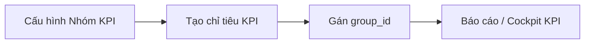

# Nhóm KPI — Hướng dẫn sử dụng

> **Phiên bản:** 1.0 · **Cập nhật:** 2026-09-03  
> **Đối tượng:** Tenant Admin, HR, Marketing Lead, GDKD (cấu hình KPI)  
> **URL:** https://rs.pttads.vn/crm/kpi/groups  
> **Menu:** KPI & Hiệu suất → Cấu hình → **Nhóm KPI**

Tài liệu mô tả cách **chuẩn hóa danh mục phân loại chỉ tiêu KPI** — tạo/sửa nhóm, phạm vi áp dụng, trạng thái, import CSV và sắp xế thứ tự hiển thị.

**Tài liệu liên quan:**

| Chủ đề | File |
|--------|------|
| SRS đặc tả | [../superpowers/specs/2026-09-03-kpi-group-setup-srs.md](../superpowers/specs/2026-09-03-kpi-group-setup-srs.md) |
| KPI cockpit (chỉ tiêu) | [02-crm-core.md](./02-crm-core.md) |
| RBAC nền tảng | [01-nen-tang-platform.md](./01-nen-tang-platform.md) |

---

## 1. Nhóm KPI là gì?

**Nhóm KPI** là lớp phân loại **trên** từng chỉ tiêu (`crm_kpi_metrics`). Mỗi nhóm mô tả:

- Mã và tên chuẩn hóa (ví dụ `GROWTH_CONVERSION`)
- **Phạm vi áp dụng:** toàn doanh nghiệp, theo phòng ban, theo chức danh
- **Hướng đo mặc định:** Tăng dần / Giảm dần / Duy trì ngưỡng
- Màu, icon, thứ tự hiển thị trên báo cáo



---

## 2. Quyền truy cập (RBAC)

| Cap | Hành vi |
|-----|---------|
| `crm_kpi_groups.view` | Xem danh sách, chi tiết, lịch sử audit |
| `crm_kpi_groups.manage` | Tạo, sửa, kích hoạt, ngừng dùng, nhân bản, xóa |
| `crm_kpi_groups.configure` | Import CSV, kéo-thả sắp thứ tự |
| `crm_kpi_groups.export` | (dự phòng xuất dữ liệu) |

Vai trò mặc định có đủ quyền sau khi chạy seed: **SUPER-ADMIN**, **CEO**, **GD**.

```bash
bash scripts/seed_kpi_groups_rbac.sh --apply
```

Sau khi cấp quyền mới: **đăng xuất và đăng nhập lại** để menu cập nhật.

---

## 3. Màn hình danh sách

**Route:** `/crm/kpi/groups`


| Thành phần | Mô tả |
|------------|--------|
| 4 thẻ thống kê | Tổng / Đang hoạt động / Bản nháp / Ngừng sử dụng |
| **Nhập dữ liệu** | Import CSV (cần cap `configure`) |
| **+ Thêm Nhóm KPI** | Mở form tạo mới |
| Bộ lọc | Tìm theo mã/tên, trạng thái, phòng ban, phạm vi |
| Bảng | Icon, mã, phạm vi, hướng đo, số chỉ tiêu đang dùng, trạng thái |
| Menu ⋮ | Xem, Sửa, Nhân bản, Ngừng sử dụng / Kích hoạt, Xóa |

### Sắp xếp thứ tự (kéo-thả)

- Chỉ bật khi **trang 1**, **không lọc**, có cap `configure` hoặc `manage`
- Kéo biểu tượng **⋮⋮** ở cột đầu để đổi thứ tự trên trang hiện tại
- Hệ thống ghi audit action `REORDER`

---

## 4. Tạo / sửa Nhóm KPI

**Tạo:** `/crm/kpi/groups/new`  
**Sửa:** `/crm/kpi/groups/{id}` hoặc menu ⋮ → Sửa


### 4.1. Thông tin cơ bản

| Trường | Bắt buộc | Ghi chú |
|--------|----------|---------|
| Mã | Có | `A-Z`, `0-9`, `_`, 3–50 ký tự, unique trong tenant |
| Tên | Có | 3–100 ký tự, unique (không phân biệt hoa thường) |
| Mô tả | Không | Tối đa 500 ký tự |

### 4.2. Phạm vi áp dụng

| Loại | Ý nghĩa |
|------|---------|
| Toàn doanh nghiệp | Mọi phòng ban |
| Theo phòng ban | Chọn một hoặc nhiều phòng ban |
| Theo chức danh | Chọn phòng ban + chức danh |

### 4.3. Thiết lập đo lường

- **Hướng đo mặc định:** INCREASE / DECREASE / RANGE
- **Đơn vị gợi ý:** COUNT, %, VNĐ, …
- **Nguồn dữ liệu:** CRM, Ads, Manual, …

### 4.4. Nhận diện & hiển thị

- Màu HEX (`#RRGGBB`), icon, **thứ tự hiển thị** (số nguyên dương)
- Xem trước thanh màu bên phải form

### Nút lưu

| Nút | Trạng thái lưu |
|-----|----------------|
| **Lưu nháp** | `DRAFT` |
| **Lưu & Kích hoạt** | `ACTIVE` — sẵn sàng gán chỉ tiêu |
| **Lưu thay đổi** | Giữ trạng thái hiện tại (màn sửa) |

Tab **Lịch sử** trên trang chi tiết: audit CREATE / UPDATE / ACTIVATE / REORDER / DELETE.

---

## 5. Import CSV

1. Bấm **Nhập dữ liệu** trên danh sách
2. **Tải file mẫu** hoặc dùng header chuẩn:

```text
code,name,description,scope_type,default_direction,color,icon,display_order,status,department_ids,position_ids,suggested_unit_types,data_domains
```

3. Chọn file → xem preview từng dòng (OK / lỗi)
4. **Import** — chỉ các dòng hợp lệ được tạo; lỗi trùng mã/tên báo theo dòng

**Quy ước cột list:**

- `department_ids`, `position_ids`: phân tách `;` (ví dụ `1;2`)
- `suggested_unit_types`, `data_domains`: phân tách `;` (ví dụ `COUNT;PERCENT`)
- `scope_type`: `ORGANIZATION` | `DEPARTMENT` | `POSITION` | `CUSTOM`
- `status` mặc định: `DRAFT`

---

## 6. Gắn Nhóm KPI khi tạo chỉ tiêu

Trên **KPI Cockpit** (`/crm/kpi`), drawer **Tạo chỉ tiêu KPI** có dropdown **Nhóm KPI** — chỉ liệt kê nhóm **Đang hoạt động**.

Chỉ tiêu lưu `group_id` → cột **Chỉ tiêu** trên danh sách nhóm đếm `usage_count`.

---

## 7. Xóa và ràng buộc

- **Không xóa** khi nhóm đang có chỉ tiêu tham chiếu (`usage_count > 0`)
- **Ngừng sử dụng** (`INACTIVE`) khi muốn ẩn khỏi dropdown mà giữ lịch sử
- Nhóm **system default** (seed): không đổi mã nếu không có cap đặc biệt

---

## 8. Triển khai (IT / Ops)

```bash
# Local / VPS — DDL + RBAC + build + test
bash scripts/apply_pg_ddl_kpi_groups.sh
bash scripts/seed_kpi_groups_rbac.sh --apply
APPLY=1 ./scripts/deploy_kpi_groups_vps.sh
```

**Kiểm thử tự động:**

```bash
# API
cd services/ptt-crm-api && npx jest --testPathPattern='src/kpi-groups' --no-coverage

# Web unit
cd services/ops-web && npm run test:unit -- src/lib/kpi-group-form.util.spec.ts src/lib/kpi-groups-api.spec.ts src/lib/kpi-group-import.util.spec.ts

# E2E (cần API + staff có crm_kpi_groups)
cd services/ops-web && npm run test:e2e:kpi-groups
```

---

## 9. Xử lý lỗi thường gặp

| Triệu chứng | Nguyên nhân | Cách xử lý |
|-------------|-------------|------------|
| Không thấy menu Nhóm KPI | Thiếu cap `view` | Cấp RBAC, đăng nhập lại |
| Nút Thêm / Import bị ẩn | Thiếu `manage` / `configure` | Liên hệ Admin |
| Mã trùng khi lưu | `code` đã tồn tại | Đổi mã hoặc nhân bản |
| Không kéo được thứ tự | Đang lọc hoặc không ở trang 1 | Xóa bộ lọc, về trang đầu |
| Import báo lỗi header | Sai cột CSV | Tải lại file mẫu |

---

## 10. Checklist UAT (tham chiếu SRS AC-01…AC-12)

- [ ] Danh sách load, 4 thẻ summary đúng số liệu
- [ ] Tạo bản nháp → kích hoạt → hiện trên dropdown tạo chỉ tiêu
- [ ] Tìm kiếm / lọc trạng thái hoạt động
- [ ] Kéo-thả thứ tự (trang 1, không lọc)
- [ ] Import CSV: 1 dòng OK + 1 dòng lỗi (trùng mã)
- [ ] Xóa bị chặn khi `usage_count > 0`
- [ ] Tab Lịch sử ghi nhận CREATE / ACTIVATE
