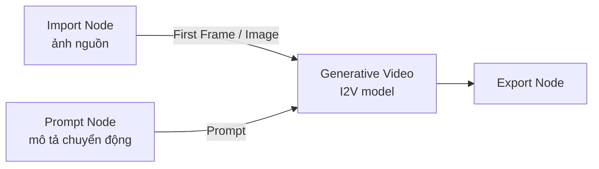
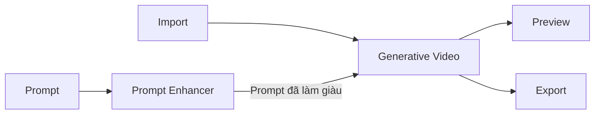

# SOP — Flow Image-to-Video trên Figma Weave

> **Phiên bản:** 1.0 · **Cập nhật:** 2026-09-13  
> **Đối tượng:** Designer / AI Operator, Creative Producer  
> **Canvas:** [app.weavy.ai](https://app.weavy.ai/) hoặc [weave.figma.com](https://weave.figma.com/) — **không** Weavy UIKit Chat, **không** CSD Chat  
> **CRM SoR:** Work Order trên Creative OS → tab **AI Ops** → pane **Weave**  
> **Workplace:** `https://rs.pttads.vn/crm/creative-os/projects/[id]?tab=ai-ops&pane=weave`  
> **SoT nghiệp vụ:** [SPEC-CP-WEAVE-WIN](../superpowers/specs/2026-09-13-figma-weave-cp-integration-srs.md)

PTT không điều khiển graph Weave. SOP này dạy **cách dựng flow I2V đúng node**, rồi **export đúng path** để Producer bấm **Sync output**. File lệch convention → CRM **không ingest**.

---

## 0. Phạm vi và không làm gì

| Làm | Không làm |
|---|---|
| Dựng graph I2V: Import → (Prompt / Prompt Enhancer) → mô hình Generative Video → Export | Embed canvas trong CRM, gọi API chạy graph, dùng `WEAVE_API_KEY` |
| Copy prompt từ brief Work Order | Tự approve Hub / tự ghi lane `approved/` |
| Export `review/` (gửi duyệt) hoặc `final/` (sau khi đã duyệt) | Drop thử nghiệm Fal/LoRA/CivitAI vào `review/` hoặc `final/` — những origin đó chỉ `source/` |
| Giữ tỷ lệ khớp template (`9x16` reel, `1x1` feed, `16x9` banner) | AUTO burn ads, bật Comfy, đổi flag GPU |

**Cổng người:** Designer export. Producer Sync + Gửi review. Brand/Legal/khách duyệt trên Hub / portal. Ads chỉ nhận bản `final`.

---

## 1. Điều kiện trước khi mở canvas (gate)

Làm tuần tự. Thiếu một bước → không mở Weave “mồ côi”.

| # | Kiểm tra | Đạt khi |
|---|---|---|
| G1 | Đã login Figma / Weave trên trình duyệt (session riêng, CRM không login hộ) | Mở được `app.weavy.ai` hoặc `weave.figma.com` |
| G2 | Gói Weave **có video model** + còn credit | Node Generative Video hiện **Run**, không báo plan/credit lock |
| G3 | Work Order đã tạo trên CRM (`template_key` ví dụ `reel-9x16`) | Có `task_id` dạng `CR-YYYY-MMDD-NNN` |
| G4 | Brief có `prompt` + `output_format` | Producer copy được prompt từ pane Weave |
| G5 | Path export đang hiện trên WO | `{client_code}/{campaign_code}/{task_id}/{lane}/` |
| G6 | Ảnh nguồn: JPEG / JPG / PNG / WEBP / HEIC; tỷ lệ khớp template | Không upload thẳng từ Google Drive / iCloud vào Import Node |

**Mở canvas đúng cách**

1. Ops → Creative OS → project → `?tab=ai-ops&pane=weave`
2. Chọn Work Order → **Open in Weave** (`window.open` URL đã seed — thường `https://app.weavy.ai/`)
3. CRM ghi `opened_at`. Đây **chưa** phải đã có asset.

Nếu plan Free khóa video: graph vẫn nối được nhưng **Run** fail. Đó là hạn mức vendor, không phải lỗi dây. Nâng plan / nạp credit rồi mới Run — không “fix” bằng đổi node.

---

## 2. Topology bắt buộc (4 node)

Flow I2V tối thiểu — **đúng thứ tự trái → phải**:



| Node | Vai trò | Bắt buộc | Credit |
|---|---|---|---|
| **Import** | Đưa ảnh tĩnh vào canvas | Có | Không |
| **Prompt** | Text mô tả motion / camera | Có — hầu hết model I2V | Không |
| **Generative Video** (Video Generation) | Sinh clip từ ảnh + prompt | Có | Có — nút **Run** |
| **Export** | Tải file ra máy / folder quy ước | Có | Không |

**Tùy chọn (khuyên dùng khi prompt brief còn ngắn):**



- **Prompt Enhancer** — nối **output Prompt → input Prompt Enhancer**, rồi output Enhancer → cổng **Prompt** của video model. Chọn LLM trên node; ô instruction bên dưới dropdown để khóa “giữ subject, chỉ thêm motion”.
- **Preview** — xem clip sạch trước khi Export (không thay Export).
- **Router** — một ảnh / một prompt đi nhiều model song song (A/B Kling vs Seedance). Không bắt buộc cho SOP v1.

**Sai topology thường gặp (đừng làm)**

- Nối Import thẳng vào Export → ra đúng file ảnh, **không** có video.
- Nối Prompt vào cổng Image/First Frame của video model → dây đỏ / không Run.
- Nối Prompt Enhancer **trước** Prompt (không có text nguồn) → Enhancer không có gì để làm giàu.
- Nối video model Text-to-Video (chỉ Prompt, không First Frame) rồi kỳ vọng giữ layout ảnh nguồn → đó là T2V, không phải I2V.

---

## 3. Dựng graph từng bước

Thêm node: menu trái **hoặc** nhấn `Tab` trên canvas rồi gõ tên node.

### Bước 1 — Import (ảnh nguồn)

1. `Tab` → gõ **Import** → thả node.
2. Đưa ảnh vào node theo **một** cách:
   - Click node → upload từ máy
   - Kéo-thả file vào node
   - Dán **URL file trực tiếp** (không phải link Google Drive / iCloud — Weave không import từ hai kho đó)
3. Xác nhận thumbnail hiện trên node.
4. Định dạng hỗ trợ: **JPEG, JPG, PNG, HEIC, WEBP**. Không dùng PSD / TIFF / PDF.
5. Khuyến nghị ảnh:
   - Reel 9:16: khung dọc, subject không sát mép (model hay crop khi motion)
   - Feed 1:1: subject giữa khung
   - Độ phân giải nguồn ≥ output (1080 cạnh ngắn trở lên)
   - Một subject rõ; nền rối → prompt phải nói “giữ nền, chỉ đẩy camera”

**Gate B1:** Import có ảnh. Chưa có ảnh → dừng.

### Bước 2 — Prompt (mô tả chuyển động)

1. `Tab` → **Prompt**.
2. Dán prompt từ brief Work Order (pane Weave / `brief_json.prompt`).
3. Viết **motion**, không viết lại toàn bộ poster:
   - Camera: `slow push-in`, `locked camera`, `gentle parallax`
   - Subject: `hair and fabric move in light breeze`, `eyes blink once`
   - Thời lượng ý định: `2 seconds`, `loopable`
   - Cấm: đổi outfit, thêm logo, đổi tỷ lệ khung
4. Negative (nếu model có cổng **Negative Prompt**): `morphing face, extra fingers, text overlay, watermark, jitter`.
5. Không nhét cả shot list 10 câu vào một Prompt — một clip = một hành động.

**Gate B2:** Prompt có text. Rỗng → video model không Run (thiếu input bắt buộc).

### Bước 3 — Prompt Enhancer (tùy chọn, xem §4)

Chỉ làm khi prompt brief < 2 câu hoặc model hay “bỏ qua” ảnh.

1. `Tab` → **Prompt Enhancer**.
2. Kéo **output (phải) của Prompt** vào **input (trái) của Prompt Enhancer**.
3. Chọn LLM trên dropdown của node.
4. Điền instruction (mẫu PTT ở §4).
5. Bấm **Run** trên Enhancer (tốn credit LLM, chưa phải credit video).
6. Đọc output: phải **còn nhận ra subject + tỷ lệ**. Nếu Enhancer bịa scene mới → sửa instruction, Run lại — **chưa** nối vào video.

**Gate B3:** Output Enhancer là text motion, không phải mô tả poster mới.

### Bước 4 — Mô hình Generative Video (I2V)

1. `Tab` → tìm model **Image to Video** (tên hay gặp: Kling Video / Kling 2.x, Runway Gen-4 / Gen-3, Luma Ray, Seedance, Veo Image to Video, Wan Video…).  
   Chọn đúng biến thể **Image / First Frame**, không chọn **Text to Video**.
2. Mở panel phải của node — đối chiếu **Input mandatory**:
   | Handle trên model | Nối từ |
   |---|---|
   | **First Frame** hoặc **Image** | Import (hoặc Preview ảnh đã crop) |
   | **Prompt** | Prompt **hoặc** output Prompt Enhancer |
   | **Last Frame** (nếu có, optional) | Import ảnh kết — chỉ khi brief yêu cầu đầu-cuối |
   | **Negative Prompt** (optional) | Prompt/Text thứ hai, không dùng chung dây Prompt chính |
3. Nối dây: kéo từ chấm output → chấm input **cùng loại** (ảnh→ảnh, text→text). Dây thành công = liền, không báo missing input.
4. Panel phải — chỉnh:
   - Duration khớp brief (UAT / reel ngắn thường 2–5s; đừng để mặc định dài nếu credit ít)
   - Aspect / size khớp template: reel → **9:16**
   - `Camera fixed` / `Generate Audio` chỉ bật khi brief yêu cầu
5. Bấm **Run** trên node video. Chờ xong — clip hiện trên node.
6. Xem: subject còn giống ảnh nguồn? Morph mặt / chữ bay / đổi layout → đổi prompt hoặc model, **không** Export bản đó vào `review/`.

**Gate B4:** Có ít nhất một clip xem được trên node video. CRM vẫn chưa biết file này.

### Bước 5 — Preview (khuyên) rồi Export

1. (Khuyên) `Tab` → **Preview** → nối output video vào Preview để xem full-frame.
2. `Tab` → **Export**.
3. Nối **output video** (node model hoặc Preview) vào Export.  
   Export giữ đúng loại nguồn: vào video → ra video (mp4). Nối nhầm ảnh → ra PNG/JPEG.
4. Chọn folder tải. **PTT bắt buộc** lưu đúng convention — xem §5. Không để file trên Desktop tên `video (3).mp4`.

**Gate B5:** Máy có file `{task_id}_v{nn}_{ratio}.mp4` trong đúng `{lane}/`.

### Bước 6 — Về CRM (Producer)

1. File đã nằm dưới `WEAVE_EXPORT_PREFIX` đúng path.
2. Pane Weave → **Sync output**.
3. WO lên `linked` khi có file `review/` hoặc `final/` parse được.
4. Gửi review → Hub / portal. Designer **không** bấm duyệt khách.

---

## 4. Mẹo Prompt Enhancer khi đầu vào là ảnh

Enhancer **không nhìn thấy pixel** trừ khi bạn mô tả ràng buộc trong instruction. Nó chỉ làm giàu text. Muốn I2V bám ảnh: instruction phải **cấm viết lại scene**.

### 4.1. Instruction mẫu (dán vào ô dưới dropdown LLM)

```
Bạn là prompt engineer cho Image-to-Video.
Giữ nguyên subject, outfit, background, lighting và composition của ảnh nguồn.
Chỉ thêm: chuyển động vật lý nhẹ, hướng camera, tốc độ, thời lượng.
Không thêm người, sản phẩm, chữ, logo, watermark.
Không đổi tỷ lệ khung (giữ 9:16 trừ khi prompt gốc nói khác).
Output: một đoạn tiếng Anh, tối đa 80 từ, không tiêu đề, không gạch đầu dòng.
```

### 4.2. Khi nào dùng / không dùng

| Dùng Enhancer | Không dùng |
|---|---|
| Brief chỉ có “làm reel Tết, ảnh này sống” | Prompt Producer đã đủ motion + negative |
| Model I2V ignore prompt ngắn | Cần so sánh A/B đúng **cùng** wording |
| Muốn chuẩn hóa ngôn ngữ camera (dolly, pan, hold) | Ảnh đã có chữ/logo — Enhancer hay “đọc” thành “add title” |

### 4.3. Checklist sau khi Run Enhancer

- [ ] Còn tên / mô tả đúng subject trong ảnh (không đổi người)
- [ ] Có **một** hướng camera, không “orbit + zoom + crane”
- [ ] Có giới hạn thời lượng
- [ ] Không có `cinematic masterpiece, 8k, trending` (rác, tốn token, ít ảnh hưởng I2V)
- [ ] Không biến I2V thành T2V (“a new scene of…”)

### 4.4. Prompt I2V tốt (ví dụ reel 9:16)

**Gốc (brief):** `Làm video từ poster Trung thu, nhẹ nhàng.`

**Sau Enhancer (đạt):**  
`Hold the Mid-Autumn poster layout. Slow 2s push-in, lanterns sway slightly, warm light flicker, locked framing 9:16, no new text, no logo change.`

**Sau Enhancer (trượt — vứt):**  
`Epic cinematic city at night, hero walking through market, camera orbit 360, add fireworks and slogan.`

### 4.5. Variables (nâng cao)

Trên Prompt Node: **Add Variables** → mỗi biến một handle, nối Text Node. Dùng khi một campaign nhiều SKU: `{product}` đổi, phần motion giữ. Enhancer nên đứng **sau** Prompt đã resolve biến, không đứng giữa biến chưa nối.

---

## 5. Export đúng luật PTT (GT-W05)

Prefix trên VPS (Producer/IT đã set):

`WEAVE_EXPORT_PREFIX` = `/var/www/rnosai/data/cp-weave-export`

```
{WEAVE_EXPORT_PREFIX}/
  {client_code}/{campaign_code}/{task_id}/
    source/     ← thử model / LoRA / import lạ — không lên Hub
    drafts/     ← bản nội bộ
    review/     ← bản gửi duyệt (Sync + Gửi review)
    approved/   ← chỉ CRM ghi sau duyệt — Designer không drop
    final/      ← bản bàn giao ads sau deliver
```

**Tên file**

`{task_id}_v{nn}_{ratio}.{ext}`

| Thành phần | Ví dụ | Luật |
|---|---|---|
| `task_id` | `CR-2026-0913-001` | `CR-` + năm + MMDD + 3 số |
| `v{nn}` | `v01` | 2 chữ số |
| `ratio` | `9x16` | Chỉ `1x1` \| `9x16` \| `16x9` \| `4x5` \| `og` |
| `ext` | `mp4` | Video I2V = `mp4` |

Ví dụ đúng:

`ptt-hcm/meta-lead-gen/CR-2026-0913-001/review/CR-2026-0913-001_v01_9x16.mp4`

Sidecar optional cùng stem: `CR-2026-0913-001_v01_9x16.json` với `{ prompt, negative_prompt, model, seed }`. Thiếu JSON **không** chặn ingest.

**Lane**

| Lane | Ai ghi | Sync đưa vào Hub? |
|---|---|---|
| `source/` | Designer (thử nghiệm) | Không |
| `drafts/` | Designer | Không |
| `review/` | Designer | Có |
| `approved/` | CRM | Designer không ghi |
| `final/` | Designer / deliver | Có |

---

## 6. Khắc phục lỗi nối node (phổ biến)

Làm theo thứ tự: **đọc handle trên node video** → **đúng loại dây** → **đủ input bắt buộc** → **Run Enhancer trước Run video** → **plan/credit**.

| Triệu chứng | Nguyên nhân | Cách xử | Không làm |
|---|---|---|---|
| Node video không hiện nút **Run** / Run xám | Thiếu input mandatory (thường **Prompt** hoặc **First Frame**) | Mở panel phải, xem “Input mandatory”. Nối đủ rồi mới Run | Đổi sang T2V cho “có Run” rồi export như I2V |
| Dây không dính / nhảy về | Kéo text vào cổng Image (hoặc ngược) | Ảnh chỉ vào First Frame/Image; text chỉ vào Prompt/Negative | Dùng Router để “ép” kiểu |
| Run báo missing image / first frame | Import chưa có file, hoặc nối Preview rỗng | Upload lại; xác nhận thumbnail Import | Dán link Drive |
| Run báo missing prompt | Prompt rỗng, hoặc Enhancer chưa Run nên cổng Prompt trống | Run Enhancer trước; hoặc nối thẳng Prompt (bỏ Enhancer) | Gõ prompt vào node video nếu model không có text box |
| Enhancer không chạy | Chưa nối Prompt nguồn; hoặc hết credit LLM | Nối Prompt → Enhancer; kiểm tra credit | Nối Import vào Enhancer |
| Clip ra không giống ảnh | Đang dùng model **Text to Video**; hoặc Enhancer viết scene mới | Đổi sang *Image to Video* / *First Frame*; sửa instruction §4.1 | Tăng steps / 8k |
| Clip có chữ / logo lạ | Prompt hoặc Enhancer thêm title | Negative: `text, subtitle, logo, watermark`. Ảnh nguồn đừng chứa chữ nếu không muốn animate chữ | Watermark bằng node khác rồi gửi `review/` |
| Mặt morph, tay dư | Motion quá mạnh / duration dài / model yếu I2V | `locked camera` hoặc `slow`; rút 2s; đổi Kling/Runway; Last Frame = cùng pose | Upscale trước khi I2V nếu ảnh < 512px |
| Export ra PNG | Export đang nối Import hoặc image model | Nối output **video** vào Export | Đổi đuôi file tay thành `.mp4` |
| Export xong CRM không thấy | Sai path / sai tên / lane `source` hoặc `drafts` | Đúng §5; Sync lại; lane `review` hoặc `final` | Đặt file ở Desktop rồi báo “mất ingest” |
| Sync không ingest, warning parse | `task_id` lệch, ratio lạ (`9:16`, `portrait`), thiếu `v01` | Đổi tên đúng regex; không dùng khoảng trắng | Sửa CRM cho “linh hoạt” |
| Video model báo plan / payment / not available | Gói Free hoặc hết credit video | IT/Producer nâng plan Weave; không phải lỗi dây | Bật Comfy / AUTO |
| Hai model song song cùng Prompt, một cái fail | Model B bắt buộc Last Frame / Reference | Đọc comparison từng model; Router tách dây | Xóa cả graph |
| `approved/` bị từ chối khi Designer copy vào | Lane do CRM ghi sau duyệt | Designer chỉ ghi `review/` rồi chờ deliver | Ghi đè `approved/` |

**Quy tắc đọc lỗi nhanh**

1. Click node video → panel phải: input nào **đỏ / missing**?
2. Click từng dây: nguồn có output cùng loại không?
3. Enhancer đã **Run** (có text output) chưa?
4. Credit / plan: message có chữ `plan`, `credit`, `quota`, `upgrade` không?
5. File trên disk: `ls` đúng `{task_id}/review/` và đúng tên — mới gọi Producer Sync.

---

## 7. Checklist một lần chạy (in ra bàn Designer)

- [ ] WO `CR-____-____-___` + path copy sẵn
- [ ] Import: 1 ảnh, đúng ratio
- [ ] Prompt: motion + thời lượng; negative nếu có cổng
- [ ] (Nếu dùng) Enhancer: instruction “giữ subject, chỉ thêm motion” → đã Run
- [ ] Video = biến thể **Image / First Frame**, không T2V
- [ ] First Frame ← Import; Prompt ← Prompt hoặc Enhancer
- [ ] Run video → xem Preview
- [ ] Export → `{task_id}_v01_{ratio}.mp4` vào `review/`
- [ ] Báo Producer Sync — không tự Hub, không tự Ads

---

## 8. RACI và tài liệu liên quan

| Việc | Designer | Producer | AM |
|---|---|---|---|
| Dựng graph + Run | R | C (brief) | I |
| Đặt file đúng path | R | A (kiểm tra Sync) | I |
| Sync + Gửi review | I | R | C |
| Duyệt Hub / portal | — | C | C / khách |

| Tài liệu | Dùng khi |
|---|---|
| [34-creative-production-os.md](./34-creative-production-os.md) | Mở CP OS, quyền, DAM |
| [39-magnific-i2v-sop.md](./39-magnific-i2v-sop.md) | Cùng brief I2V trên Magnific Spaces (tên node khác) |
| [SPEC-CP-WEAVE-WIN](../superpowers/specs/2026-09-13-figma-weave-cp-integration-srs.md) | Lane, cổng GT-W, path |
| [Helpers — Import / Export](https://help.weavy.ai/en/articles/12268300-helpers-overview) | Định dạng file Import/Export |
| [Understanding Nodes](https://help.weavy.ai/en/articles/12292386-understanding-nodes) | Run, credit, panel phải |
| [Text Tools — Prompt Enhancer](https://help.weavy.ai/en/articles/12268282-text-tools) | Nối Prompt → Enhancer |
| [Video Models Comparison](https://help.weavy.ai/en/articles/12344226-video-models-comparison) | Model nào bắt buộc First Frame / Prompt |

Vendor đổi tên model thường xuyên. **Luôn đọc “Input mandatory” trên node đang chọn** — đó là SoT dây, không phải bảng nhớ trong SOP này.
