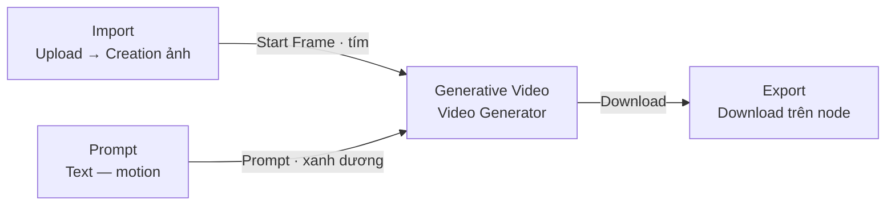
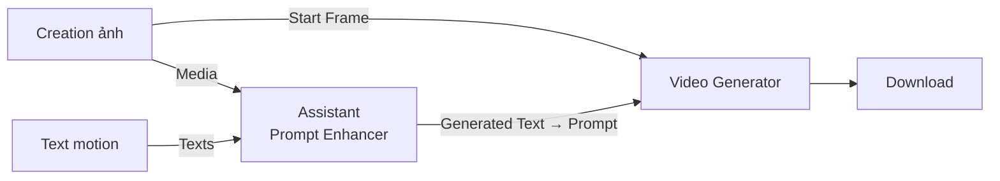
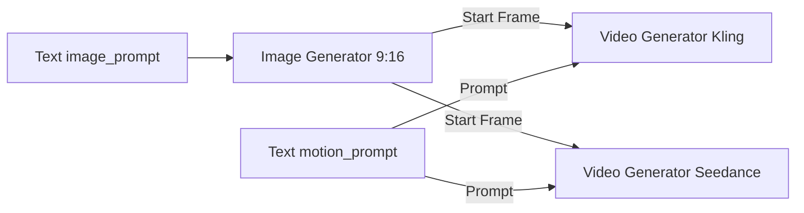

# SOP — Flow Image-to-Video trên Magnific Spaces

> **Phiên bản:** 1.0 · **Cập nhật:** 2026-09-13  
> **Đối tượng:** Designer / AI Operator, Creative Producer  
> **Canvas:** [Magnific Spaces](https://www.magnific.com/) — **không** Figma Weave, **không** Weavy UIKit, **không** CSD Chat  
> **CRM SoR:** Creative OS → tab **AI Ops** → pane **Magnific**  
> **Workplace:** `https://rs.pttads.vn/crm/creative-os/projects/[id]?tab=ai-ops&pane=magnific`  
> **SoT nghiệp vụ:** [SPEC-CP-MAGNIFIC-FLOWS](../superpowers/specs/2026-09-13-cp-magnific-flows-srs.md) · vendor [Nodes & connections](https://www.magnific.com/ai/docs/nodes-and-connections) · [Video nodes](https://www.magnific.com/ai/docs/video-nodes) · [Text / Assistant](https://www.magnific.com/ai/docs/text-nodes)

CRM **không** sửa graph Spaces. SOP này dạy **dựng flow I2V đúng node trên canvas**, **Download** file về PTT, rồi (tuỳ mode) **upload DAM** hoặc **Publish Flow** để Producer chạy từ pane Magnific. Không paste JSON blueprint lên Magnific — file [`social-916-flow-blueprint.json`](../magnific/social-916-flow-blueprint.json) chỉ là spec dựng tay.

---

## 0. Phạm vi và không làm gì

| Làm | Không làm |
|---|---|
| Dựng I2V trên Spaces: Upload/Creation → Text (Prompt) → Video Generator → Download | Embed Spaces trong CRM, dán JSON graph, sửa node từ Ops |
| Copy `motion_prompt` / `image_prompt` từ brief pane Magnific | Tự approve Hub / tự ghi lane `approved/` |
| Download mp4 rồi đưa vào DAM / Media project | Chỉ giữ URL Magnific (hết hạn ~12 giờ) |
| Giữ tỷ lệ khớp template (`9x16` reel, `1x1` feed, `16x9` banner) | AUTO confirm Flow, bật Comfy, đảo Wave A→B→C |

**Hai mode sau khi graph ổn**

| Mode | Ai chạy | Khi nào dùng |
|---|---|---|
| **Spaces tay (SOP này)** | Designer trên Magnific | Thử model, A/B Kling vs Seedance, brief mới |
| **Flow REST (B+1)** | Producer trên pane Magnific → **Flow (Spaces)** | Graph đã **Publish**, `MAGNIFIC_FLOWS_ENABLED=1`, template `social_916_i2v` |
| **Tool đơn (Wave B)** | Producer, capability `video_generate` | Một shot, không pipeline | 

Cổng người: Designer Download. Producer ingest / confirm credit / Gửi review. Brand/Legal/khách duyệt Hub. Ads chỉ nhận bản `final`.

---

## 1. Ánh xạ tên (PTT ↔ Magnific)

Magnific **không** đặt tên node giống Figma Weave. SOP dùng cả hai cột để khỏi lệch brief.

| Brief / SOP PTT | Tên trên Spaces | Ghi chú |
|---|---|---|
| **Import** | **Upload** / **Media** → node **Creation** (ảnh) | Upload là *hành động một lần*, không phải node nằm lại. File thành Creation có cổng Image (tím) |
| **Prompt** | **Text** (docs còn gọi Prompt Generator) | Source node, không có cổng vào. Output Text (xanh dương) |
| **Prompt Enhancer** | **Assistant** | LLM; có cổng **Media** (nhìn được ảnh — khác Weave Enhancer) |
| **Generative Video** | **Video Generator** | 40+ model (Kling, Seedance, Runway, Veo, Wan, Luma…). I2V = cổng **Start Frame** |
| **Export** | **Download** trên action bar của node video | Spaces **không** có node Export. Có thể thêm Video Editor / Video Upscaler trước khi tải |

**Màu dây (SoT nối)**

| Loại | Màu | Ví dụ |
|---|---|---|
| Image | Tím | Creation / Image Generator → Start Frame |
| Text | Xanh dương | Text / Assistant → Prompt |
| Video | Xanh lá | Video Generator → Download / Mix / Upscaler |
| Audio | Cam | Voiceover → Video Generator (lip-sync) hoặc Mix |

Dây chỉ dính **cùng loại**. Kéo lệch màu = không snap — đó là lỗi nối, không phải lỗi model.

---

## 2. Điều kiện trước khi mở Spaces (gate)

| # | Kiểm tra | Đạt khi |
|---|---|---|
| G1 | Login Magnific trên trình duyệt (session riêng; CRM không login hộ) | Mở được Spaces |
| G2 | Gói + credit video | Nút **Run** hiện **số credit** trước khi bấm |
| G3 | Project CP + pane Magnific | `?tab=ai-ops&pane=magnific` |
| G4 | Brief có prompt motion (và ảnh ref nếu I2V từ still) | Copy được `motion_prompt` / asset ref |
| G5 | Ảnh nguồn JPEG/PNG/WEBP, tỷ lệ khớp template | Không dùng PSD / TIFF / PDF làm Start Frame |
| G6 | Biết sẽ **Download** về máy / DAM | Không dựa URL gallery Magnific làm SoR |

**Mở đúng chỗ**

1. Ops → Creative OS → project → `?tab=ai-ops&pane=magnific`
2. Copy prompt / asset ref từ pane (Tool đơn hoặc Flow).
3. Mở Magnific Spaces trên tab mới. CRM **không** embed canvas.

Nếu credit / plan khóa model: graph vẫn nối được nhưng Run fail. Nâng plan — không “fix” bằng đổi sang Text-to-Video rồi gọi là I2V.

---

## 3. Topology bắt buộc (4 bước = 4 vai trò)

Flow I2V tối thiểu — **trái → phải**:



| Vai trò | Node Magnific | Bắt buộc | Credit |
|---|---|---|---|
| Import | Upload → Creation | Có (hoặc Image Generator nếu sinh still trong Space) | Không |
| Prompt | Text | Khuyên — hầu hết model I2V chạy tốt hơn khi có | Không |
| Generative Video | Video Generator, mode ảnh → video | Có | Có — xem số trên **Run** |
| Export | Download (action bar) | Có — file phải về PTT | Không |

**Tùy chọn — Prompt Enhancer (Assistant) + Assistant nhìn ảnh**



Đây là điểm **mạnh hơn Weave**: Assistant **thấy pixel** nếu nối Creation → cổng **Media**. Instruction vẫn phải cấm viết lại scene (xem §5).

**Biến thể PTT Social 9:16 (sinh still rồi I2V)** — spec nội bộ, dựng tay, không paste JSON:



Hai Text **tách** (`image_prompt` ≠ `motion_prompt`). Một Text dùng chung cho Image Generator **và** Video Generator thường làm clip “vẽ lại poster” thay vì animate still.

**Sai topology**

- Nối Creation thẳng Download → ra **ảnh**, không có video.
- Nối Text vào **Start Frame** (tím) → dây không dính.
- Nối Assistant **Generated Text** vào Start Frame.
- Nối ảnh vào cổng **References** rồi kỳ vọng giữ đúng frame — References chỉ *gợi* style; I2V bắt buộc **Start Frame**.
- Chọn Video Generator nhưng **không** nối Start Frame = Text-to-Video.

---

## 4. Dựng graph từng bước

Thêm node: **Spotlight** (kéo từ cổng ra chỗ trống — chỉ hiện node tương thích) hoặc search trên panel.

### Bước 1 — Import (Upload → Creation)

1. Spotlight / panel → **Upload**. Đây là *file picker*, không phải node nằm lại.
2. Chọn ảnh từ máy. Mỗi file thành một **Creation** trên canvas.
   - Hoặc **Media**: chọn từ history / stock / Community → cũng ra Creation.
3. Xác nhận Creation có cổng output **Image** (tím) bên phải. Hover thấy resolution.
4. Định dạng: JPEG / PNG / WEBP. Khuyến nghị cạnh ngắn ≥ 1080, tỷ lệ khớp template (reel = 9:16).
5. Subject không sát mép — model hay crop khi motion.

**Gate B1:** Creation có thumbnail. Chưa có → dừng.

**Không:** kéo folder Drive; không upload video rồi dùng làm Start Frame (trừ khi cố ý lấy frame từ clip — Creation video có cổng Start/End Frame riêng).

### Bước 2 — Prompt (Text)

1. Spotlight → **Text**. Đổi màu nền (khuyên xanh) để phân biệt với Text image-prompt nếu có.
2. Dán `motion_prompt` từ brief pane Magnific / Work Order.
3. Viết **motion**, không viết lại poster:
   - Camera: `very subtle slow push-in`, `locked camera`
   - Subject: `minimal movement, stable identity, no morphing`
   - Thời lượng: khớp setting Video Generator (pilot PTT thường **5 giây**)
   - Cấm: đổi outfit, thêm chữ/logo, đổi tỷ lệ
4. Một clip = một hành động. Không shot list 10 câu.

**Gate B2:** Text có nội dung. Có thể gõ prompt thẳng trên Video Generator, nhưng Text node dễ tái sử dụng / A/B hai model.

### Bước 3 — Prompt Enhancer (Assistant) — tùy chọn, xem §5

Chỉ khi brief < 2 câu, hoặc model hay bỏ qua ảnh.

1. Spotlight → **Assistant** (hoặc search `Claude` / `Gemini` để pre-config model).
2. Nối **Text** → cổng **Texts** của Assistant.
3. Nối **Creation ảnh** → cổng **Media** (để LLM nhìn still).
4. Tab **Prompt** / Instructions: dán mẫu §5.1. System prompt: khóa “prompt engineer I2V”.
5. Output mode: **Simple response** (một đoạn). **As list** chỉ khi batch List.
6. **Run Node** trên Assistant (tốn credit LLM, chưa phải credit video).
7. Tab **Result**: phải còn nhận ra subject + tỷ lệ. Scene mới → sửa instruction, Run lại — **chưa** nối vào Video Generator.

**Gate B3:** Result là text motion, không phải mô tả poster mới.

### Bước 4 — Generative Video (Video Generator)

1. Spotlight → **Video Generator**. Hoặc kéo từ cổng Image Creation ra chỗ trống → chọn Video Generator (Spaces lọc node nhận ảnh).
2. Nối Creation (hoặc Image Generator) → cổng **Start Frame** (tím).
3. Nối Text **hoặc** Assistant **Generated Text** → cổng **Prompt** (xanh dương).
4. Cổng khác — chỉ khi brief yêu cầu:
   | Cổng | Khi nào |
   |---|---|
   | **End Frame** | Đầu–cuối khóa (một số Kling / Wan / Seedance) |
   | **References** | Style/nhân vật *phụ* — không thay Start Frame |
   | **Video Reference** | Motion guide; không phải mọi model |
   | **Audio** | Lip-sync |
5. Panel node:
   - Model: Kling hoặc Seedance cho pilot 9:16 (xem blueprint nội bộ)
   - Duration: 5s trừ brief khác
   - Aspect: **9:16** (reel) — khớp ảnh nguồn
   - Resolution: 1080P khi gửi `review/`; thấp hơn khi thử
   - Number of generations: 1 khi gửi duyệt; 2–10 khi A/B
6. Xem **credit trên nút Run** trước khi bấm.
7. Chọn mode chạy:
   | Mode | Dùng khi |
   |---|---|
   | **Run Node** | Chỉ video; ảnh + prompt đã sẵn |
   | **Run Workflow** | Đổi prompt đầu chuỗi, chạy cả Assistant + video |
   | **Run Downstream** | Đã Run Assistant, chỉ chạy từ video trở đi |
8. Chờ state **Completed**. Duyệt history (mũi tên trên card) — lần Run sau **không** xóa lần trước.
9. Xem: subject còn giống still? Morph mặt / chữ bay / đổi layout → đổi prompt hoặc model, **không** Download bản đó vào `review/`.

**Gate B4:** Có clip trên node. CRM vẫn chưa biết file này.

### Bước 5 — Export (Download)

1. Click node Video Generator → action bar → **Download**. Video download **không** tính vào daily asset download limit Magnific (theo docs vendor).
2. (Khuyên) **Open preview** trước khi tải.
3. (Tuỳ) Video Upscaler / Video Audio Mix / Video Editor **trước** Download nếu brief yêu cầu 4K hoặc mix tiếng — tốn thêm credit.
4. Đổi tên file theo convention PTT **trước** khi đưa vào DAM — xem §6.

**Gate B5:** Máy có `{task_id}_v{nn}_{ratio}.mp4` (hoặc file đã upload Media project).

### Bước 6 — Về CRM

**Spaces tay**

1. Creative OS → project → Media / Deliverable → upload mp4 (MIME `video/mp4`).
2. Gắn version, QC, Gửi review. Designer không duyệt khách.

**Flow đã Publish (khi flag B+1 bật)**

1. Spaces → Publish pipeline; ghi **sqid** (vd. `uqzQLDr2Aw`) — không phải UUID node.
2. IT map template `social_916_i2v` (`external_ref` = sqid). Input `api_key`: `image_prompt`, `motion_prompt`, optional `start_image`.
3. Pane Magnific → **Flow (Spaces)** → chọn template → confirm credit (GT-M04) → Submit.
4. Poll → ingest DAM + provenance `flow:{sqid}`. URL Magnific chỉ tạm — RNOSAI **copy bytes**.

Không bật `MAGNIFIC_FLOWS_ENABLED` trên prod cho đến khi UAT runbook pass. SOP Spaces tay **không** phụ thuộc flag đó.

---

## 5. Mẹo Assistant (Prompt Enhancer) khi đầu vào là ảnh

Assistant **có thể** nhìn ảnh qua cổng Media. Vẫn phải khóa instruction: mặc định LLM hay viết *poster mới* thay vì *motion*.

### 5.1. System prompt + Instructions (dán)

**System prompt**

```
Bạn là prompt engineer cho Image-to-Video trên Magnific Video Generator.
Bạn nhìn ảnh nguồn. Giữ nguyên subject, outfit, background, lighting, composition.
Chỉ thêm chuyển động vật lý nhẹ, hướng camera, tốc độ, thời lượng.
Không thêm người, sản phẩm, chữ, logo, watermark.
Không đổi tỷ lệ khung.
Output: một đoạn tiếng Anh, tối đa 80 từ, không tiêu đề, không gạch đầu dòng.
```

**Instructions (tab Prompt)**

```
Phân tích ảnh ở cổng Media. Biến text ở cổng Texts thành motion prompt I2V.
Không mô tả lại scene như sinh ảnh mới.
Không dùng từ: masterpiece, 8k, trending, cinematic epic.
```

### 5.2. Model Assistant

| Việc | Model khuyên (docs Magnific) |
|---|---|
| Nhìn still + viết motion | Gemini (multimodal) |
| Câu chữ chặt, ít bịa | Claude Sonnet / Opus |
| Nhanh, brief đã rõ | GPT mini / Grok Fast |

### 5.3. Khi nào dùng / không dùng

| Dùng Assistant | Không dùng |
|---|---|
| Brief chỉ “làm reel, ảnh này sống” | `motion_prompt` Producer đã đủ |
| Cần mô tả đúng outfit/sản phẩm trên ảnh | A/B hai model **cùng** wording |
| Ảnh phức tạp (nhiều object) — Gemini đọc Media | Ảnh đã đầy chữ — Assistant hay “add title” |

### 5.4. Checklist sau Run Assistant

- [ ] Còn đúng subject trên Creation
- [ ] Một hướng camera, không orbit + zoom + crane
- [ ] Có thời lượng khớp setting video
- [ ] Không biến I2V thành T2V (“a new scene of…”)
- [ ] Result nối vào **Prompt**, không vào Start Frame

### 5.5. Ví dụ reel 9:16

**Gốc:** `Làm video từ poster Trung thu, nhẹ nhàng.`

**Đạt:**  
`Hold the Mid-Autumn poster layout. Slow 5s push-in, lanterns sway slightly, warm light flicker, locked framing 9:16, no new text, no logo change.`

**Trượt — vứt:**  
`Epic cinematic night market, hero walking, camera orbit 360, add fireworks and slogan.`

Pilot Beauty (từ artifact PTT): motion kiểu `Very subtle slow push-in toward face and product, minimal movement, stable identity, no morphing, cinematic smooth, 5 seconds` — Assistant không được đổi thành walk-through bathroom mới.

### 5.6. @mentions

Text / Assistant hỗ trợ `@tên-node`. Dùng khi Result Assistant phải nằm trong câu dài hơn. Source đổi → prompt cập nhật. Sau khi sửa Creation, **Run lại Assistant** rồi **Run Downstream** video.

---

## 6. File về PTT (DAM / convention)

URL gallery Magnific **hết hạn ~12 giờ**. SoR file = DAM `crm_cp_assets` (checksum / provenance).

Nếu Producer yêu cầu path giống Weave (cùng WO):

```
{client_code}/{campaign_code}/{task_id}/
  source/     ← thử model — không lên Hub
  drafts/     ← nội bộ
  review/     ← gửi duyệt
  approved/   ← chỉ CRM ghi
  final/      ← bàn giao ads
```

Tên: `{task_id}_v{nn}_{ratio}.mp4`  
`ratio` chỉ `1x1` \| `9x16` \| `16x9` \| `4x5` \| `og`.

Ví dụ: `CR-2026-0913-001_v01_9x16.mp4`

Sidecar optional: `{stem}.json` `{ prompt, negative_prompt, model, seed, magnific_run }`.

Lane `source/` / `drafts/` không lên Hub. Designer không drop `approved/`.

Job Flow REST: ingest tự vào Media project — không cần path Weave; provenance phải có `flow:{sqid}`.

---

## 7. Khắc phục lỗi nối node

Làm theo thứ tự: **màu dây** → **đúng cổng Start Frame vs Prompt** → **Creation đã có file** → **Run Assistant trước Run video** → **credit trên nút Run**.

| Triệu chứng | Nguyên nhân | Cách xử | Không làm |
|---|---|---|---|
| Dây không snap | Lệch loại (text→ảnh, video→prompt) | Tím→Start Frame; xanh dương→Prompt; xanh lá chỉ ra sau video | Ép dây bằng node trung gian lung tung |
| Không thấy node “Import” | Magnific dùng Upload / Creation | Search **Upload** hoặc **Media** | Tìm node tên Import như Weave |
| Upload xong không có node | Tưởng Upload là node nằm lại | Tìm **Creation** vừa tạo trên canvas | Upload lại 10 lần |
| Video Generator không chạy / Failed | Thiếu Start Frame (một số model) hoặc hết credit | Click node đọc error banner; nối Creation → Start Frame; xem credit trên Run | Đổi T2V rồi gọi I2V |
| Clip không giống ảnh | Ảnh vào **References** thay vì **Start Frame**; hoặc không nối ảnh | Gỡ References; nối Start Frame; Run Node lại | Tăng resolution cho “dính” hơn |
| Clip vẽ scene mới | Dùng chung Text image-prompt cho video; hoặc Assistant viết T2V | Tách `motion_prompt`; sửa §5.1; Run lại Assistant | Publish Flow với 1 input text |
| Assistant không “thấy” ảnh | Chỉ nối Texts, quên Media | Nối Creation → **Media**; chọn Gemini | Dán mô tả ảnh dài thay vì nối |
| Assistant ra list / nhiều câu | Output **As list** | Đổi **Simple response** | Nối list vào Prompt video |
| Run xám / Pending mãi | Upstream chưa xong hoặc circular | Đợi Creation/Assistant Completed; không nối vòng | Stop rồi Run Workflow song song 3 lần |
| Lần Run sau mất bản cũ | Nhầm UI | History trên card — mũi tên; không xóa Completed | Download ngay bản tốt |
| Download ra ảnh | Đang Download Creation, không phải video | Click đúng Video Generator → Download | Đổi đuôi `.png` → `.mp4` |
| Nối node thứ hai vào cùng cổng, dây cũ mất | Mỗi input **một** nguồn (trừ References nhiều ảnh) | Dùng hai Video Generator song song, hoặc List | Router kiểu Weave (Spaces không có Router Weavy) |
| CRM Flow `flow_input_missing` | Publish thiếu `api_key` `image_prompt` / `motion_prompt` | Mở input Flow trên Spaces; map lại seed | Gọi tool Wave B để “thay” |
| `magnific_flow_not_found` | Chưa Publish / sai sqid | Publish Space; copy sqid | Dùng UUID node |
| `human_confirm_required` | Đúng GT-M04 | Tick confirm credit rồi Submit | AUTO |
| URL Magnific chết trên Hub | Hết 12h, chưa ingest | Download / để job copy bytes vào DAM | Gửi link Spaces cho khách |
| Network tab thấy API key | Sai thiết kế | Key chỉ server (`Settings → Integrations`) | Dán key vào browser |
| Blueprint JSON không dính canvas | Magnific không import graph | Dựng tay theo SOP / blueprint | Đòi IT “import JSON” |

**Quy tắc đọc lỗi nhanh**

1. Màu dây đúng chưa?
2. Video Generator: Start Frame có Creation không? Prompt có Text/Assistant không?
3. Assistant đã **Completed** + Result ổn chưa?
4. Nút Run hiện bao nhiêu credit? Plan có khóa model không?
5. File đã Download (hoặc job đã ingest) — mới báo Producer review.

---

## 8. Checklist một lần chạy

- [ ] Pane Magnific mở, brief / ảnh ref đã copy
- [ ] Upload → Creation 1 ảnh, đúng ratio
- [ ] Text = **motion** (tách khỏi image-prompt nếu có Image Generator)
- [ ] (Nếu dùng) Assistant: Texts + Media → Simple response → đã Run
- [ ] Video Generator: **Start Frame** ← ảnh; **Prompt** ← Text hoặc Assistant
- [ ] Aspect 9:16 (reel), duration khớp brief, đọc credit
- [ ] Run Node / Downstream → xem Preview + history
- [ ] Download mp4 → đổi tên `{task_id}_v01_{ratio}.mp4` → DAM hoặc `review/`
- [ ] Không gửi URL Magnific cho khách; không tự Hub; không AUTO

---

## 9. RACI và tài liệu liên quan

| Việc | Designer | Producer | AM |
|---|---|---|---|
| Dựng Spaces + Run + Download | R | C (brief) | I |
| Publish Flow + ghi sqid | R / IT | A (catalog) | I |
| Confirm credit + job Flow / ingest | I | R | I |
| Gửi review Hub | I | R | C / khách |

| Tài liệu | Dùng khi |
|---|---|
| [34-creative-production-os.md](./34-creative-production-os.md) | CP OS, quyền, DAM |
| [38-figma-weave-i2v-sop.md](./38-figma-weave-i2v-sop.md) | Cùng brief I2V nhưng canvas Weave |
| [SPEC-CP-MAGNIFIC-FLOWS](../superpowers/specs/2026-09-13-cp-magnific-flows-srs.md) | Flow REST, sqid, GT-M |
| [cp-magnific-flows.md](../runbooks/cp-magnific-flows.md) | Flag, seed, rollback |
| [social-916-flow-blueprint.json](../magnific/social-916-flow-blueprint.json) | Spec dựng tay 9:16 (không paste) |
| [Nodes & connections](https://www.magnific.com/ai/docs/nodes-and-connections) | Cổng, màu, Run Node/Workflow/Downstream |
| [Video nodes](https://www.magnific.com/ai/docs/video-nodes) | Start Frame / End Frame / References |
| [Text nodes — Assistant](https://www.magnific.com/ai/docs/text-nodes) | Enhancer, Media port, model LLM |
| [Media nodes](https://www.magnific.com/ai/docs/media-nodes) | Upload → Creation |

Vendor đổi tên model thường xuyên. **Cổng trên node đang chọn** (Start Frame, Prompt) là SoT dây — không phải bảng nhớ trong SOP này.
