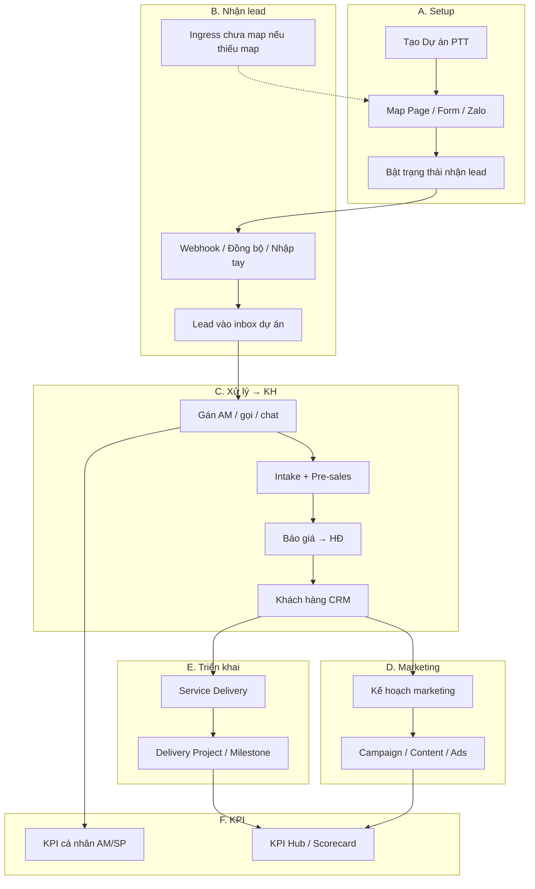
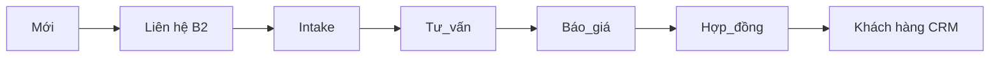

# Quy trình Lead → Khách hàng → Marketing → Triển khai → KPI

**Phiên bản:** 1.0 · **Ngày:** 2026-09-29  
**Ứng dụng:** Staff console PTT CRM — https://rs.pttads.vn  
**Đối tượng:** Admin/IT, Marketing, AM/AE, Solution, SP Delivery, GDKD, HR  
**Phạm vi:** Setup nhận lead, xử lý lead đến khách hàng, kế hoạch marketing, kế hoạch triển khai, KPI nhân viên

**Tài liệu liên quan (chi tiết sâu hơn):**

| Chủ đề | File |
|--------|------|
| Nguồn lead & setup kỹ thuật | [../crm/huong-dan-nguon-lead-va-setup.md](../crm/huong-dan-nguon-lead-va-setup.md) |
| Phân hệ Lead đầy đủ | [../crm/huong-dan-phan-he-lead-day-du.md](../crm/huong-dan-phan-he-lead-day-du.md) |
| Lead → Retain | [../crm/huong-dan-day-du-lead-den-cham-soc-khach-hang.md](../crm/huong-dan-day-du-lead-den-cham-soc-khach-hang.md) |
| B2B E2E UI | [24-b2b-e2e-handover-ui-guide.md](./24-b2b-e2e-handover-ui-guide.md) |
| KPI Hub | [33-kpi-hub.md](./33-kpi-hub.md) |
| Meta Form / Token | [../huong-dan-meta-setup-tai-khoan-app-form-token.md](../huong-dan-meta-setup-tai-khoan-app-form-token.md) |

---

## Mục lục

1. [Luồng tổng quan](#1-luồng-tổng-quan)
2. [Danh mục màn hình (catalog)](#2-danh-mục-màn-hình-catalog)
3. [Giai đoạn A — Setup nhận Lead](#3-giai-đoạn-a--setup-nhận-lead)
4. [Giai đoạn B — Nhận Lead vào CRM](#4-giai-đoạn-b--nhận-lead-vào-crm)
5. [Giai đoạn C — Xử lý Lead đến Khách hàng](#5-giai-đoạn-c--xử-lý-lead-đến-khách-hàng)
6. [Giai đoạn D — Kế hoạch Marketing](#6-giai-đoạn-d--kế-hoạch-marketing)
7. [Giai đoạn E — Kế hoạch triển khai](#7-giai-đoạn-e--kế-hoạch-triển-khai)
8. [Giai đoạn F — KPI nhân viên](#8-giai-đoạn-f--kpi-nhân-viên)
9. [Checklist bàn giao vận hành](#9-checklist-bàn-giao-vận-hành)
10. [Sự cố thường gặp](#10-sự-cố-thường-gặp)

---

## 1. Luồng tổng quan

### Hai loại lead — không trộn

| | **Lead B2B (bán mới)** | **Lead vận hành CSKH** |
|--|------------------------|-------------------------|
| Mục đích | Prospect → HĐ agency mới | Lead ads của **khách đã ký** |
| Menu | **Bán hàng → Lead B2B** | **CRM → Lead vận hành** |
| Bắt buộc | **Dự án PTT** | **Khách hàng agency** |
| Thắng | `won` | `chot` |

Tài liệu này tập trung **luồng B2B**: setup dự án → nhận lead → chốt → KH → marketing / triển khai → KPI.

---

## 2. Danh mục màn hình (catalog)

Base URL: `https://rs.pttads.vn`

### 2.1 Setup & nhận lead

| # | Màn hình | Menu sidebar | Route | Vai trò | Cap tối thiểu |
|---|----------|--------------|-------|---------|---------------|
| S1 | Danh sách Dự án PTT | Bán hàng → Dự án PTT | `/crm/b2b-projects` | AM, GDKD, AE (xem) | `crm_b2b_projects.view` |
| S2 | Lead ingest DV (danh sách dự án nhận lead) | Bán hàng → Lead ingest DV | `/crm/delivery-projects?capability=lead_ingest` | GDKD / quản trị dự án | `crm_b2b_projects.manage` |
| S3 | Chi tiết dự án — tab **Nhận lead** | vào từ S2 | `/crm/delivery-projects/{id}` | GDKD / quản trị | `crm_b2b_projects.manage` (sửa) |
| S4 | Ingress chưa map | Bán hàng → Ingress chưa map | `/crm/b2b-unmatched` | GDKD | `crm_b2b_projects.manage` |
| S5 | Speed-to-lead | Bán hàng → Speed-to-lead | `/crm/b2b-speed` | GDKD | `crm_b2b_projects.manage` |
| S6 | GDKD command | Bán hàng → GDKD command | `/crm/b2b-gdkd` | GDKD | `crm_b2b_projects.manage` |
| S7 | Meta Ads / Tracking | Quảng cáo → Meta… | `/meta/facebook-ads`, `/meta/tracking` | Buyer, Tracking | caps Meta |
| S8 | Zalo Ads / Zalo Leads | Quảng cáo → Zalo… | `/zalo/zalo-ads`, `/zalo/leads` | Buyer | `crm_zalo_ads.view` |

### 2.2 Xử lý lead & khách hàng

| # | Màn hình | Menu | Route | Vai trò |
|---|----------|------|-------|---------|
| L1 | Lead B2B | Bán hàng → Lead B2B | `/crm/b2b/leads` | AM, AE |
| L2 | Tạo lead B2B | Bán hàng → Tạo lead B2B | `/crm/b2b/leads/new` | AM (`crm_leads.edit`) |
| L3 | Chi tiết lead | từ L1 | `/crm/leads/{id}` hoặc `/crm/b2b/leads/{id}` | AM |
| L4 | Inbox B2B | Bán hàng → Inbox B2B | `/crm/b2b-inbox` | AM |
| L5 | Lead Intake | Bán hàng → Lead Intake | `/crm/intake` | AM Pre-sales |
| L6 | Hàng đợi / Theo dõi Solution | Bán hàng → … Solution | `/crm/solution/queue` | Solution, AE |
| L7 | Báo giá | Bán hàng → Báo giá | `/crm/proposals` | AM, Sales |
| L8 | Hub hợp đồng | Bán hàng → Hub hợp đồng | `/crm/hub` | AM, GDKD |
| L9 | Khách hàng | CRM → Khách hàng | `/crm/customers` | AM, CS |
| L10 | Phải tra soát (B2) | CRM → Phải tra soát | `/crm/leads/review-queue` | GDKD |
| L11 | Tất cả leads | CRM → Tất cả leads | `/crm/leads` | GDKD, AM |
| L12 | Account Management | Account Management | `/crm/account-management` | AM |

### 2.3 Marketing & kế hoạch

| # | Màn hình | Menu | Route | Vai trò |
|---|----------|------|-------|---------|
| M1 | Kế hoạch marketing | Kế hoạch → Kế hoạch marketing | `/crm/marketing-plan` | MKT Lead, AM |
| M2 | Nghiên cứu thị trường | Kế hoạch → Nghiên cứu… | `/crm/research` | Research |
| M3 | Content OS | Sản xuất → Content OS | `/crm/content-os` | Content |
| M4 | Creative OS / Video / Image | Sản xuất → … | `/crm/creative-os`, `/crm/video` | Creative |
| M5 | Media OS | Sản xuất → Media OS | `/crm/media-os` | Media buyer |
| M6 | Email Marketing Hub | Email Marketing | `/email/hub` | Email |
| M7 | CMS / Demo GTM | Kế hoạch → CMS / Demo | `/crm/gtm/cms`, `/crm/gtm/demos` | MKT |

### 2.4 Triển khai dịch vụ

| # | Màn hình | Menu | Route | Vai trò |
|---|----------|------|-------|---------|
| D1 | Triển khai dịch vụ (lifecycle) | Sản xuất → Triển khai dịch vụ | `/crm/service-delivery` | AM, SP |
| D2 | Workflow lifecycle chi tiết | từ D1 | `/crm/service-delivery/{lifecycle_id}` | AM, SP |
| D3 | Project Delivery (danh sách) | (KPI Hub / Delivery) | `/crm/delivery-projects` | PM, SP |
| D4 | Chi tiết delivery (Tổng quan, Ngân sách, KPI, Rủi ro…) | từ D3 | `/crm/delivery-projects/{id}` | PM |
| D5 | Sổ rủi ro | Delivery | `/crm/delivery-projects/risks` | PM |
| D6 | Ops tasks / alerts | Sản xuất → Ops… | `/crm/ops/my-tasks`, `/crm/ops/alerts` | SP |

### 2.5 KPI nhân viên

| # | Màn hình | Menu | Route | Vai trò |
|---|----------|------|-------|---------|
| K1 | KPI cá nhân AM/SP | Nhân sự / CRM | `/crm/staff-kpi` | AM, SP, QL |
| K2 | Sổ KPI / Hub KPI | Nhân sự | `/crm/kpi` | QL |
| K3 | Nhóm KPI | | `/crm/kpi/groups` | Admin, HR |
| K4 | KPI Hub Executive | KPI Hub → Executive | `/crm/kpi-hub/executive` | GDKD |
| K5 | KPI Hub Sales / Marketing | KPI Hub | `/crm/kpi-hub/sales`, `/crm/kpi-hub/marketing` | QL |
| K6 | Scorecard / Assignment / Check-in | KPI Hub → Performance… | `/crm/kpi-hub/performance/...` | QL |
| K7 | Dictionary / Target | KPI Hub | `/crm/kpi-hub/dictionary`, `/crm/kpi-hub/targets` | Admin KPI |
| K8 | KPI GDKD Enterprise | CRM → KPI GDKD Enterprise | `/crm/gdkd-enterprise` | GDKD |

---

## 3. Giai đoạn A — Setup nhận Lead

**Mục tiêu:** Lead từ Facebook Instant Form / Zalo / Webform / API **tự gắn đúng dự án PTT**, không rơi Ingress chưa map.

### A1. Tạo hoặc chọn Dự án PTT

1. Đăng nhập https://rs.pttads.vn/login  
2. Mở **Bán hàng → Dự án PTT** (`/crm/b2b-projects`) — **S1**  
3. Tạo dự án mới (nếu chưa có) hoặc ghi nhớ **mã dự án** (ví dụ `ptt-hcm`)  
4. Hoặc mở **Lead ingest DV** (`/crm/delivery-projects?capability=lead_ingest`) — **S2** → chọn dự án có capability **Nhận lead**

### A2. Cấu hình tab Nhận lead (màn hình chính)

1. Vào **Chi tiết dự án** — **S3** → tab **Nhận lead**  
2. Thẻ **Cài đặt nhận lead**:
   - **Mã webhook:** dùng làm key ingest (vd `ptt-hcm`) — chỉ đọc  
   - **Trạng thái dự án:** chọn **Đang chạy** khi sẵn sàng nhận  
   - Bật **AI call** / **Nhập lead thủ công** nếu cần  
3. Thẻ **Facebook Page và Lead form**:
   - Điền **Page ID**, **Tên page**, **Page Access Token** (quyền `leads_retrieval`)  
   - **Trạng thái page:** Đang nhận  
   - Bấm **Lấy tất cả form** → hệ thống gọi Graph, đổ Form ID / tên vào bảng  
   - Rà Active từng form → bấm **Lưu Page và form** (bắt buộc — chưa lưu thì lead chưa gắn dự án)  
   - Tuỳ chọn: **Đồng bộ lead** để kéo tối đa 50 lead Instant Form đã có  
4. Thẻ **Zalo, Webform và API** (nếu dùng):
   - Thêm kênh → điền OA ID / slug / API key → **Lưu kênh**  
   - Webhook Zalo tham chiếu: `/api/v1/webhooks/zalo/{mã-dự-án}`

### A3. Kiểm tra map & quyền

| Kiểm tra | Cách làm |
|----------|----------|
| Form đã lưu | Mở lại S3 — bảng Lead form còn Form ID |
| Token hợp lệ | Bấm **Lấy tất cả form** không báo lỗi Graph |
| Lead thử | Submit Instant Form test → xuất hiện ở Lead B2B thuộc đúng dự án |
| Chưa map | Form mới chưa lưu → bản ghi ở **Ingress chưa map** (S4) → map lại ở S3 |

**Gate sang giai đoạn B:** Dự án **Đang chạy** + ít nhất 1 Page Active + ≥1 Form Active đã **Lưu**.

---

## 4. Giai đoạn B — Nhận Lead vào CRM

### B1. Các đường lead vào

| Nguồn | Cơ chế | Màn theo dõi |
|-------|--------|--------------|
| Facebook Instant Form | Webhook Meta + (tuỳ chọn) Đồng bộ lead | L1, S4, S5 |
| Zalo | Webhook theo mã dự án | L1, L4 |
| Webform / Landing | Map slug kênh | L1 |
| API | Key kênh API | L1 |
| Nhập tay | **Tạo lead B2B** (L2) | L1 |

### B2. Việc AM làm ngay khi lead mới

1. Mở **Lead B2B** (L1) — lọc theo dự án / trạng thái `mới`  
2. Mở chi tiết lead (L3)  
3. Xác nhận: SĐT/email, nguồn, dự án PTT đúng  
4. Nếu thiếu map → báo GDKD xem **Ingress chưa map** (S4)  
5. Theo dõi tốc độ phản hồi tại **Speed-to-lead** (S5) nếu bạn là GDKD

### B3. Lead trùng / rác

- Hệ thống chống trùng theo `leadgen_id` (Facebook) khi đồng bộ  
- Lead thiếu SĐT/email có thể bị bỏ qua khi kéo Graph — kiểm tra thông báo sau **Đồng bộ lead**

**Gate sang giai đoạn C:** Lead có chủ sở hữu (AM) và đủ liên hệ để gọi/chat.

---

## 5. Giai đoạn C — Xử lý Lead đến Khách hàng

Thứ tự chuẩn (Pre-sales trên Lead → HĐ → KH thật):

### C1. Liên hệ lần đầu (B2)

1. L3 — ghi activity / gọi (softphone nếu có) / Inbox B2B (L4)  
2. GDKD theo dõi hàng **Phải tra soát** (L10) nếu SLA B2 trễ  
3. Cập nhật trạng thái lead theo quy ước team (không nhảy cóc sang `won`)

### C2. Intake & Pre-sales

1. **Lead Intake** (L5) — điền BANT / Go–No-Go theo lead  
2. Trên chi tiết lead: hoàn thành task giai đoạn **Lead → Tư vấn → Báo giá** (chỉ chuyển **1 bước**, task 100%)  
3. Solution theo dõi hàng đợi (L6) khi cần demo / giải pháp

### C3. Báo giá & hợp đồng

1. Tạo / gửi báo giá tại **Báo giá** (L7)  
2. Khi chốt: tạo / kích hoạt HĐ tại **Hub hợp đồng** (L8) — trạng thái **Active**  
3. **Không** tạo khách hàng “thật” trước khi HĐ Active (trừ placeholder nội bộ)

### C4. Khách hàng CRM

1. Sau HĐ Active → bản ghi **Khách hàng** (L9) / Account Management (L12)  
2. Gắn dịch vụ, onboarding, owner AM  
3. Lead B2B đánh dấu thắng (`won`); không dùng luồng Lead vận hành cho prospect này

**Gate sang D/E:** Có **Khách hàng** + HĐ Active (hoặc ít nhất lifecycle Onboard đã mở).

---

## 6. Giai đoạn D — Kế hoạch Marketing

Áp dụng sau khi đã có KH / scope dịch vụ marketing (ads, content, SEO…).

### D1. Lập kế hoạch

1. Mở **Kế hoạch marketing** (M1) — `/crm/marketing-plan`  
2. Tạo / chọn plan gắn khách hàng hoặc chiến dịch  
3. Điền mục tiêu, kênh, ngân sách, kỳ  

### D2. Nghiên cứu & nội dung (nếu cần)

1. **Nghiên cứu thị trường** (M2) — insight trước khi launch  
2. **Content OS** (M3) — lịch nội dung, item  
3. **Creative / Video / Image** (M4) — sản xuất creative theo brief  
4. **Media OS** (M5) — vận hành campaign  
5. **Email** (M6) — nurture / CRM mail nếu trong scope  

### D3. Liên kết ads với lead

- Meta / Zalo / Google (S7–S8): campaign trỏ đúng Page/Form đã map ở **A2**  
- Sau launch: đối chiếu lead mới ở L1 với Form ID đã lưu  

**Gate:** Plan approved + kênh ads/content sẵn sàng chạy.

---

## 7. Giai đoạn E — Kế hoạch triển khai

### E1. Lifecycle dịch vụ (chuẩn AM/SP)

1. Mở **Triển khai dịch vụ** (D1)  
2. Vào workflow (D2) — các stage sau HĐ:

| Stage | Tên UI | Việc chính |
|-------|--------|------------|
| `onboard` | Onboarding | Kickoff, tài khoản, brief |
| `deliver` | Triển khai | Thực thi DV, chi phí delivery |
| `handover` | Nghiệm thu | Bàn giao, xác nhận KH |
| `retain` | Chăm sóc | Duy trì, renewal |

3. Chỉ chuyển stage khi **task giai đoạn hiện tại = 100%**  
4. Gate Onboard → Deliver thường cần TMMT / KH MKT chính thức (xem tài liệu Retain)

### E2. Project Delivery (ngân sách, KPI dự án, rủi ro)

1. **Project Delivery** (D3) — dự án giao hàng  
2. Chi tiết (D4) các tab:
   - **Tổng quan** — PM, AM, thời gian, mô tả  
   - **Nhận lead** — nếu dự án còn capability ingest (xem giai đoạn A)  
   - **Ngân sách / KPI / Rủi ro / Phạm vi / Milestone** — theo capability  
3. Ghi rủi ro tại tab Rủi ro hoặc **Sổ rủi ro** (D5)

### E3. Ops hàng ngày

- **Ops tasks / alerts** (D6) — việc cá nhân SP  
- Cập nhật progress trên lifecycle để KPI đọc được dữ liệu thật  

**Gate Retain:** Handover xong, stage `retain` hoặc HĐ gia hạn.

---

## 8. Giai đoạn F — KPI nhân viên

### F1. Nguyên tắc

- KPI AM/SP **đọc từ dữ liệu thật** (lead, cuộc gọi, HĐ, task delivery…)  
- Quản lý chỉ nhập **Target** / cấu hình scorecard — không “tự chấm” thay dữ liệu vận hành  
- Phân tách: **KPI cá nhân** (K1) vs **KPI Hub** governance (K4–K7)

### F2. KPI cá nhân AM / SP

1. Mở `/crm/staff-kpi` (K1)  
2. Chọn kỳ (tuần / tháng)  
3. Đối chiếu chỉ tiêu: tốc độ phản hồi lead, tỷ lệ B2, won, task on-time, rủi ro xử lý…  
4. Nếu số liệu lệch: kiểm tra đã ghi activity / đóng task / HĐ Active chưa  

### F3. Nhóm KPI & sổ KPI

1. Cấu hình nhóm: `/crm/kpi/groups` (K3) — xem [31-kpi-nhom-kpi.md](./31-kpi-nhom-kpi.md)  
2. Hub sổ điểm: `/crm/kpi` (K2)  

### F4. KPI Hub (điều hành)

1. **Executive / Sales / Marketing** (K4–K5) — nhìn tổng hợp  
2. **Assignment Registry / Scorecard / Check-in** (K6) — giao chỉ tiêu & nghi thức check-in  
3. **Dictionary / Target** (K7) — định nghĩa metric & ngưỡng cảnh báo  
4. **KPI GDKD Enterprise** (K8) — bàn điều khiển GDKD  

Chi tiết Hub: [33-kpi-hub.md](./33-kpi-hub.md).

---

## 9. Checklist bàn giao vận hành

In / tick khi onboard team mới:

### Setup (IT + GDKD)

- [ ] Dự án PTT tạo, mã webhook thống nhất  
- [ ] Page ID + Token + Form đã **Lưu** trên tab Nhận lead  
- [ ] Trạng thái dự án **Đang chạy**  
- [ ] Form test → lead vào đúng dự án (không vào Ingress)  
- [ ] AE/AM có đúng quyền menu (không thừa desk GDKD nếu không cần)

### Vận hành Sales

- [ ] AM biết L1 / L3 / L4 / L5  
- [ ] Quy ước SLA B2 & hàng tra soát L10  
- [ ] Solution / Báo giá / Hub HĐ rõ owner  

### Sau bán

- [ ] Lifecycle D1–D2 gắn HĐ  
- [ ] Marketing plan M1 (nếu DV MKT)  
- [ ] Target KPI kỳ hiện tại trên K1 hoặc Hub  

---

## 10. Sự cố thường gặp

| Hiện tượng | Nguyên nhân thường gặp | Cách xử lý |
|------------|------------------------|------------|
| Lead không vào CRM | Form chưa **Lưu**; dự án không Đang chạy; token hết hạn | S3 → Lấy form → Lưu; kiểm tra Token; S4 |
| Lead vào Ingress chưa map | Form ID chưa gắn dự án | S4 xem form → S3 map & Lưu |
| «Lấy tất cả form» lỗi | Thiếu Page ID/Token hoặc thiếu quyền Graph | Bổ sung token Page `leads_retrieval` |
| AE thấy menu GDKD | Cap `manage` / seed thừa | Thu hẹp RBAC (chỉ `view` dự án) |
| Không thấy tab Nhận lead | Dự án thiếu capability `lead_ingest` | Mở từ S2 hoặc bổ sung capability |
| KPI = 0 dù đã làm việc | Chưa ghi activity / chưa đóng task / HĐ chưa Active | Bổ sung dữ liệu nguồn, không sửa tay KPI |
| Menu thiếu | Thiếu cap | Admin cấp quyền; đăng xuất/đăng nhập lại |

---

## Phụ lục — Thứ tự làm việc 1 trang

| Ngày | Ai | Việc | Màn |
|------|----|------|-----|
| 0 | IT/GDKD | Setup dự án + map Form | S2 → S3 |
| 0 | Marketing | Bật Instant Form / Ads trỏ Page đúng | S7 |
| 1… | AM | Nhận & chăm lead | L1 → L3 → L4 |
| n | AM + Solution | Intake, tư vấn, báo giá | L5 → L6 → L7 |
| n | AM | HĐ Active → KH | L8 → L9 |
| n+ | MKT/SP | Plan MKT + triển khai | M1 → D1/D4 |
| Hàng tuần | QL | Check KPI & scorecard | K1 → K6 |

---

*Hết tài liệu 41 — cập nhật khi đổi route/menu trên ops-web.*
