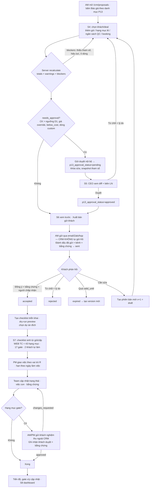
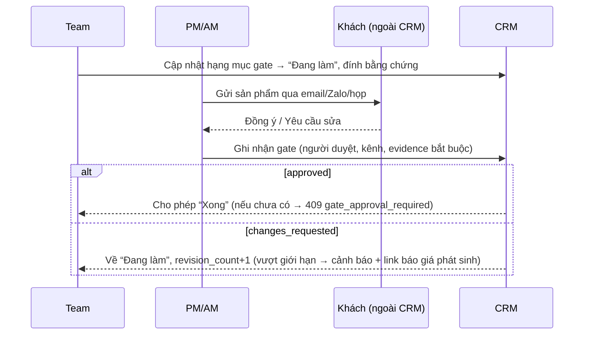

# UIUX-P13 — Danh mục dịch vụ · Tham số giá · Báo giá · Checklist triển khai

**Version 1.1 (02/10/2026): chỉnh theo kết quả P13.0** — app dùng **CSS custom** (không Tailwind/shadcn/AntD), brand **#17692f**, font **system-ui**; báo giá = **mở rộng `/crm/proposals`** (Quote OS, số `QT-PTT-{YYYY}-{SEQ:6}`); PDF bằng **pdfkit + font TTF nhúng**; không có module HĐ P12. **Mockup là tham chiếu bố cục**: màu/font trong mockup đã chuyển sang #17692f + system-ui, nhưng code thật luôn theo CSS của app.

> Tài liệu UI/UX cho Cursor khi dựng giao diện P13 (đi kèm `docs/SPEC-P13-dich-vu-bao-gia-checklist.md`).
> Mockup tĩnh: `docs/p13/uiux/index.html` (S1–S8) · ảnh 1440px: `docs/p13/uiux/screens/`.
> **Nguyên tắc:** mockup chỉ định hướng bố cục, nội dung và hành vi. Khi code thì **dùng class CSS custom sẵn có của app** (§8), không copy CSS mockup.
> Mọi số tiền trong mockup đều là **tham số TEST** (spec §7.2) hoặc “—”, gắn nhãn **Dữ liệu mẫu**, không phải giá thật của PTT.

---

## 1. Kiến trúc thông tin (IA) & vị trí menu

### 1.1 Sidebar (v1.1, theo P13.0)

```
Chung
  └ Tổng quan                         ← thêm widget P13 (S8)
Bán hàng & CRM (đã có)
  ├ Lead · Sales funnel · Khách hàng
  ├ Báo giá  (/crm/proposals — Quote OS ĐÃ CÓ, mở rộng)   S3 → S4/S6
  │     + nút “Báo giá theo danh mục P13”, cột/lọc “Nguồn giá: P13 | Legacy”
  └ Duyệt báo giá [badge]  (tab/bộ lọc trong /crm/proposals hoặc trang con)   S5   CEO (+ GĐKD nếu D8)
Dịch vụ & Báo giá  (NHÓM MỚI, ẩn khi P13_ENABLED=false)
  ├ Danh mục dịch vụ        S1   route mới (không đè /admin/services/process)
  └ Tham số giá             S2   CEO, Tài chính, SUPER-ADMIN
Triển khai (đã có)
  ├ Service Delivery / Delivery Projects
  │   └ tab “Checklist” trong chi tiết dự án   S7
  └ Checklist dự án (danh sách tổng hợp)    S7
Admin
  └ P13: Import catalog · Ngày lễ (crm_holidays) · Map vai trò RACI · Settings P13
```

- Không có menu “Hợp đồng (P12)” mới: module HĐ chưa có; nút “Tạo HĐ nháp” trên báo giá accepted hiển thị **disabled** + tooltip “Cần module Hợp đồng (P12), chưa có” (API 409 `P12_MODULE_MISSING`).
- `/admin/services/process` (service_family/SKU) giữ nguyên, không liên kết menu với danh mục P13.
- Ẩn hẳn mục menu khi user không có quyền. Nếu user truy cập route trực tiếp thì hiện trạng thái **Không có quyền** (§3.0).
- Route: `/crm/proposals` (list, dùng lại), `/crm/proposals/new?source=p13`, `/crm/proposals/[id]` (sửa, chế độ P13 khi `pricing_source='p13'`), `/crm/proposals/[id]/preview`, `/crm/proposals?approval=pending` (S5); mới: `/crm/service-catalog`, `/crm/service-catalog/[code]`, `/crm/pricing`, `/crm/pricing/[versionId]`, `/crm/checklists`, tab checklist trong dự án. Tên route cuối cùng theo convention app.

### 1.2 Breadcrumb & tiêu đề
`Bán hàng & CRM / Báo giá / QT-PTT-2026-000006`. Tiêu đề trang gồm số QT-PTT, version (v1, v2…), chip trạng thái và chip `TEST` nếu `is_test`.

---

## 2. Luồng người dùng

### 2.1 Luồng tổng (AM → duyệt → gửi → chấp nhận → checklist → thực hiện → gate)



### 2.2 Trạng thái báo giá (map vào state machine proposal hiện có — spec §8.1)

```mermaid
stateDiagram-v2
  state "Nháp (proposal draft)" as Draft {
    [*] --> none
    none --> pending: Gửi duyệt (needs_approval)
    pending --> returned: CEO trả về (lý do)
    returned --> pending: Gửi duyệt lại
    pending --> approved: CEO duyệt
    approved --> none: Sửa dòng/tiền
  }
  [*] --> Draft
  Draft --> Sent: Đánh dấu đã gửi (+bằng chứng; cần approved nếu needs_approval)
  Sent --> Accepted: Khách chấp nhận (+bằng chứng)
  Sent --> Rejected: Từ chối (+lý do)
  Sent --> Draft: Tạo phiên bản mới (cơ chế version Quote OS)
```



- Trục trong khung “Nháp” là cột mới tối thiểu `p13_approval_status` (none/pending/approved/returned); trạng thái ngoài khung là **trạng thái proposal sẵn có** (key thật theo survey). “Hết hạn” = trạng thái có sẵn nếu Quote OS có, không thì badge tính từ `valid_until`.
- UI hiển thị nhãn gộp: Nháp · Chờ duyệt nội bộ · Đã duyệt · Đã gửi · Khách chấp nhận · Từ chối · Hết hạn. Proposal **legacy** hiển thị đúng nhãn trạng thái cũ, không có trục duyệt P13.

### 2.3 Gate trên checklist



---

## 3. Danh sách màn hình

| # | Màn | File mockup | Phase | Quyền (permission spec §3.2) |
|---|---|---|---|---|
| S1 | Danh mục dịch vụ | `S1-danh-muc-dich-vu.html` | P13.a (UI có thể ở c) | xem: `p13.catalog.view` (mọi role) · sửa: `p13.catalog.manage` (CEO, SUPER-ADMIN) |
| S2 | Tham số giá | `S2-tham-so-gia.html` | P13.b | `p13.pricing.view` + `p13.pricing.cost.view` (CEO, Tài chính) · soạn: `edit_draft` · kích hoạt: `activate` (CEO) |
| S3 | Danh sách báo giá = **mở rộng `/crm/proposals`** | `S3-danh-sach-bao-gia.html` | P13.c | `p13.quote.view_own` (AM) / `view_all` (GĐKD, CEO, Tài chính) |
| S4 | Tạo/sửa báo giá = **mở rộng màn sửa proposal** | `S4-tao-sua-bao-gia.html` | P13.c | `p13.quote.edit`; biên LN cần `p13.quote.margin.view` |
| S5 | Duyệt báo giá = **tab/trang con của `/crm/proposals`** | `S5-duyet-bao-gia.html` | P13.c | `p13.quote.approve_discount` (CEO; GĐKD nếu D8) |
| S6 | Xem trước báo giá PDF | `S6-xem-truoc-bao-gia.html` | P13.d | như S3/S4 |
| S7 | Checklist dự án | `S7-checklist-du-an.html` (`#drawer`, `#kanban`) | P13.e | `p13.checklist.view` · `manage` (PM, AM, GĐKD) · `update_assigned` (Team) · `gate_signoff` |
| S8 | Dashboard | `S8-dashboard.html` | P13.g | `p13.dashboard.view` (AM: của mình, PM: dự án mình) |

### 3.0 Trạng thái chung (áp dụng cho mọi màn)

| Trạng thái | Hiển thị |
|---|---|
| **Loading** | Skeleton đúng khung bảng/card (không spinner toàn trang). Tổng tiền ở S4 giữ số cũ, làm mờ + spinner nhỏ “Đang tính…” khi debounce recalculate (300–500 ms). |
| **Empty** | Minh họa nhỏ + 1 câu + CTA chính. VD S3: “Chưa có báo giá nào” + [Tạo báo giá]. S1 khi chưa import: “Chưa có danh mục — Admin import `p13-seed-v2.json`” + [Import] (chỉ admin). S7: “Dự án chưa có checklist” + [Tạo từ báo giá đã chấp nhận]. |
| **Error** | Alert đỏ trong vùng lỗi: thông điệp tiếng Việt + mã (`quote_locked`…) + [Thử lại]. Lỗi validate 422 gắn vào đúng field. Không mất dữ liệu đang nhập. |
| **Không có quyền** | Trang 403 trong layout: “Bạn không có quyền xem mục này” + tên quyền cần có + [Về Tổng quan]. Field nhạy cảm **không render** (API bỏ key), không hiện “••••” cho người không có quyền. |
| **Tham số giá trống** | Banner vàng ở S1/S3/S4: “Chưa có version tham số giá active / còn thiếu N tham số — giá hiển thị ‘—’; lưu nháp được, không gửi duyệt/gửi khách được (`pricing_params_incomplete`)”. CEO/Tài chính thấy link [Mở Tham số giá]. Mọi ô giá hiện “—”, không hiện 0. |
| **Bản test** | Chip `TEST`, tiêu đề bắt đầu `[TEST P13]`, ẩn mặc định khỏi danh sách/dashboard (checkbox “Hiện báo giá test”). |

### S1 · Danh mục dịch vụ
- **Mục đích:** tra cứu 16 dịch vụ / 675 hạng mục, phạm vi theo cấp, giá gói (giá bán); nguồn cho picker S4 và checklist S7.
- **Bố cục:** page-head (tiêu đề, meta catalog version, [Xuất Excel] [Lịch sử import] [Import seed JSON]*) · cột trái 300px: ô tìm + danh sách theo **nhóm** (mã, tên, số hạng mục) · cột phải: header dịch vụ (nhóm · mô hình tính phí, tên, mục tiêu) + 3 card giá gói Cơ bản/Tiêu chuẩn/Nâng cao (giờ + giá bán; thẻ đảo giá viền vàng) + alert đảo giá + **Tabs**.
- **Tabs:** Hạng mục (đếm) · Đầu vào · Bàn giao · KPI · Rủi ro · Phạm vi theo cấp.
  - Hạng mục: chip cấp độ (Cơ bản 38 / Tiêu chuẩn 43 / Nâng cao 44 với WEB) lọc theo `min_level ≤ cấp`; select giai đoạn K…V; checkbox “Chỉ gate”; bảng **nhóm theo giai đoạn** (row nhóm có tên giai đoạn); cột: ID, Hạng mục (+ chi tiết), R, A, Đầu ra, Gate, Cấp tối thiểu, Giờ (+ badge **Giả định**), Đơn vị, Tính phí. Cột “Tiêu chuẩn đạt”, “C/I”, công cụ hiện trong **drawer chi tiết hạng mục** (bấm dòng).
  - Admin (`catalog.manage`): sửa inline giờ / cấp / tính phí → audit; nút “Xác nhận giờ” (bỏ badge Giả định).
- **Validation (admin):** giờ ≥ 0, bước 0,5; `min_level` ∈ 3 cấp; không sửa `code`.
- **Hành động & xác nhận:** Import seed → modal 3 bước *Upload → Dry-run (bảng thêm/sửa/ngưng) → Áp dụng* (“Áp dụng thay đổi cho 675 hạng mục? Checklist đang chạy không bị ảnh hưởng.”). Sửa giờ → toast “Đã lưu · giá gói tính lại ở version nháp”.
- **Đặc thù:** user không có `cost.view` chỉ thấy giá bán; không bao giờ thấy rate.

### S2 · Tham số giá (CEO/Tài chính)
- **Mục đích:** soạn/kích hoạt version tham số cost-plus; xem ma trận giá 16×3 trước khi active.
- **Bố cục:** page-head (code version + chip trạng thái, [Clone thành nháp] [Lưu nháp] [Kích hoạt version…]) · alert thiếu tham số (liệt kê đường dẫn field + [Đi tới ô thiếu]) · lưới 2 cột: **(1) Chi phí nhân sự theo vai trò** (9 vai trò: Lương/tháng, BH %, Phúc lợi, Giờ hiệu dụng, **Đơn giá/giờ tự tính** chỉ đọc) · **(2) Thông số chung** (overhead, margin, VAT, làm tròn, CK gói TC/NC, phí QC % + tối thiểu, booking %, ngưỡng CK cần duyệt D1, sàn biên LN; dòng “Kiểm tra margin”: hệ số = (1+OH)/(1−M)) · **Ma trận giá gói** (đỏ: Nâng cao < Tiêu chuẩn; vàng: phạm vi TC = NC) · **Lịch sử version** (code, trạng thái, hiệu lực, người duyệt).
- **Field nhạy cảm:** lương/phúc lợi hiển thị `••••••` + nút “Hiện” (log audit lượt xem). Role khác: API bỏ key, màn S2 không truy cập được.
- **Validation:** lương, phúc lợi ≥ 0; % ∈ [0,100); margin < 100% (`margin_out_of_range`); giờ hiệu dụng > 0; làm tròn ∈ {0, 1, 1000, 10000…}. Version active/retired **chỉ đọc** (`pricing_version_immutable`) → nút “Clone thành nháp”.
- **Trạng thái trống:** ô thiếu viền đỏ + placeholder “Chưa nhập”; Đơn giá/giờ = “—” + chip “Thiếu”; ma trận ô liên quan “—”.
- **Kích hoạt (CEO):** modal: danh sách blocker (thiếu tham số → nút Kích hoạt disabled), cảnh báo đảo giá 15/16 + checkbox “Tôi đã xem cảnh báo đảo giá” + **ghi chú xác nhận bắt buộc** (lưu `inversion_ack_note`), ngày hiệu lực; dòng “Version cũ sẽ retired từ …”.

### S3 · Danh sách báo giá (mở rộng `/crm/proposals`)
- **v1.1:** **không làm màn mới.** Thêm vào list hiện có: cột **Nguồn giá** (chip P13 / Legacy), lọc nguồn giá, nút **[+ Báo giá theo danh mục P13]** cạnh nút tạo cũ, KPI P13 (tùy chọn), chip trạng thái theo map §2.2. Số hiển thị `QT-PTT-YYYY-NNNNNN`. Dòng legacy giữ nguyên cột/hành vi cũ (không có CK thực/cảnh báo P13).
- **Mục đích:** theo dõi pipeline báo giá; điểm vào S4/S5/S6.
- **Bố cục:** page-head ([Xuất CSV] [+ Tạo báo giá]) · 4 KPI card (Đang mở, Chờ CEO duyệt, Sắp hết hạn 7 ngày, Tỷ lệ chấp nhận) · card bảng: toolbar (tìm số BG/khách/dịch vụ, select AM*, select dịch vụ, checkbox “Hiện báo giá test”) + hàng **chip trạng thái** (single-select: Tất cả, Nháp, Chờ duyệt nội bộ, Đã duyệt, Đã gửi, Khách chấp nhận, Từ chối, Hết hạn; + Đã thay thế, Hủy trong “Thêm”) · bảng · phân trang.
- **Cột:** Số BG + version · Khách hàng / Deal · Nội dung (dịch vụ + cấp) · AM · Trạng thái (chip) · Phí dịch vụ gồm VAT · CK thực · Hiệu lực đến (+ chip “còn N ngày” ≤ 3 ngày, đỏ khi quá hạn) · Cập nhật · menu ⋯ (Mở, Xem PDF, Nhân bản, Tạo phiên bản mới, Hủy).
- **Quyền:** AM chỉ thấy của mình (ẩn select AM); GĐKD/CEO/Tài chính thấy tất cả. Không có cột biên LN ở danh sách.
- **Hành động:** Hủy → confirm “Hủy báo giá QT-PTT-…? Không thể hoàn tác; báo giá chuyển ‘Hủy’.” (xóa cứng chỉ với draft chưa từng rời nháp: “Xóa vĩnh viễn?”).

### S4 · Tạo/sửa báo giá (mở rộng màn sửa proposal)
- **v1.1:** khi `pricing_source='p13'` màn sửa proposal hiện khối P13 (dịch vụ/gói/hạng mục, pass-through, tổng từ PricingEngine, cảnh báo, duyệt nội bộ); khi `legacy` hiện **form cũ không đổi**. Số báo giá do bộ đếm QT-PTT cấp khi tạo (theo hành vi hiện có). Chuyển proposal legacy sang P13: **không hỗ trợ** v1.
- **Mục đích:** AM dựng báo giá từ danh mục, thấy tổng live, biết khi nào cần duyệt.
- **Bố cục:** page-head (số BG, v, chip trạng thái, chip TEST; meta “Tham số giá PV-… · Tự lưu hh:mm”; [Xem trước PDF] [Lưu nháp] [Gửi duyệt nội bộ] — nút chính đổi theo trạng thái) · **2 cột**: trái (các card đánh số) + phải 340px **sticky** (Tổng + alert).
  1. **Khách hàng & deal:** Khách hàng* (combobox tìm tên/MST từ CRM), Deal (combobox, lọc theo khách), Người liên hệ, Hiệu lực (ngày)* (D4), Kiểu hiển thị cho khách (D2: Gói + phạm vi / Chỉ gói / Chi tiết hạng mục), Ngày dự kiến bắt đầu (dd/mm/yyyy).
  2. **Dịch vụ:** [+ Thêm gói] mở modal *dịch vụ → 3 card cấp* (giờ + giá; chip NC<TC ở cấp đảo giá; khác biệt phạm vi) · [+ Hạng mục lẻ] mở modal tìm ID/tên (hiện “Đã trong gói” nhưng vẫn cho thêm kèm cảnh báo) · [+ Dòng tùy chỉnh] (giá tay → cần duyệt). Bảng dòng: Dòng (tên + mô tả phụ: số hạng mục, khách tự làm, “xem phạm vi”), Loại (Gói/Lẻ/Tùy chỉnh), Giờ (ẩn với user không có cost.view nếu P13.0 quyết định), SL (input số), Đơn giá, Thành tiền, [✕]. Alert vàng **đảo giá gói** trên card khi dùng gói có `package_price_inversion`; cảnh báo `item_already_in_package` dưới dòng (không chặn).
  3. **Chi phí chuyển tiếp (pass-through):** Ngân sách QC/tháng × số tháng → phí quản lý = MAX(ngân sách × %, tối thiểu); Booking bên thứ ba → phí booking %. Ghi rõ “Không tính VAT dịch vụ · không tính vào giá trị HĐ (D5)”.
  4. **Ghi chú & điều khoản** (textarea, mẫu từ sheet Excel).
  - **Panel Tổng (phải):** Tạm tính dịch vụ · Chiết khấu (% hoặc số tiền) · Sau chiết khấu · VAT % · **Tổng phí dịch vụ** · (gạch) Ngân sách QC · Phí quản lý QC · (chỉ `margin.view`) Biên LN %. Dưới panel: alert info **“Chiết khấu cần CEO duyệt”** khi `needs_approval` + textarea **Lý do chiết khấu*** ; alert đỏ blockers (`quote_validity_missing`, `quote_empty`, `pricing_params_incomplete`); alert xanh khi sẵn sàng.
- **Số mẫu (tham số TEST):** WEB Tiêu chuẩn 121.629.000 + WEB-04-08 × 2 (5.253.000) → tạm tính **132.135.000**, VAT 8% **10.570.800**, tổng **142.705.800** (khớp spec §8.3).
- **Validation:** khách bắt buộc; ≥ 1 dòng phí; SL ≥ 1 (số nguyên với đơn vị lần/tích hợp; bước 0,5 với tháng/ngày quay); CK 0–100% và ≤ tạm tính; mỗi dịch vụ tối đa 1 dòng gói; tổng tính **ở server** (UI không tự làm tròn tiền).
- **Khóa:** trạng thái ≠ draft → toàn form chỉ đọc + banner “Đã khóa (Chờ duyệt/Đã gửi) — [Tạo phiên bản mới]”.
- **Hành động & xác nhận:**
  - *Gửi duyệt nội bộ* → modal tóm tắt (tổng, CK, lý do) “Báo giá sẽ khóa sửa tới khi CEO duyệt/trả về; tham số PV-… được snapshot.”
  - *Đánh dấu đã gửi* → modal: kênh* (email/Zalo/họp/khác), bằng chứng* (link/file), ngày gửi; nếu cần duyệt mà chưa duyệt → disabled + tooltip `quote_approval_required`.
  - *Khách chấp nhận* → modal: người chấp nhận*, bằng chứng*, ngày; sau khi lưu hiện CTA **[Tạo checklist triển khai]** và **[Tạo HĐ nháp]** (P13.f, nếu flag).
  - *Từ chối* → lý do* · *Tạo phiên bản mới* → “Tạo v{n+1} ở trạng thái Nháp; v{n} giữ nguyên tới khi v{n+1} được gửi.”
  - *Tính lại theo tham số mới* (banner khi version giá đổi, chỉ draft) → confirm hiển thị chênh lệch tổng.
  - Rời trang có thay đổi chưa lưu → “Bỏ thay đổi chưa lưu?”.

### S5 · Duyệt báo giá (CEO) — tab/bộ lọc trong `/crm/proposals`
- **v1.1:** hàng chờ = proposal P13 trạng thái nháp có `p13_approval_status=pending`. Duyệt → `approved`; Từ chối/yêu cầu sửa → `returned` (lý do bắt buộc). Không đổi trạng thái proposal chính.
- **Bố cục:** cột trái 300px = hàng chờ (số BG, v, khách, nội dung, AM, thời gian chờ, chip “quá SLA” > 24h làm việc) · phải: header [Xem PDF] + 4 KPI (Tổng gồm VAT + so v trước, Chiết khấu + lý do vượt ngưỡng, **Biên LN dự kiến** vs mục tiêu, Version tham số + thời điểm snapshot) · alert biên thấp + **lý do của AM** · lưới 2 cột: **Thay đổi so với v trước** (bảng diff: dòng thêm nền xanh, dòng bỏ nền đỏ gạch ngang, cột v cũ / v mới) và **Phân tích biên** (giờ tính phí, chi phí trực tiếp, + overhead, doanh thu sau CK, lợi nhuận gộp & %, thanh tiến độ biên vs mục tiêu) · Lịch sử (gửi/trả về/duyệt + bình luận) · thanh hành động [Từ chối / Yêu cầu sửa…] [Duyệt…].
- **Mẫu số:** v2 = 128.435.220 (CK 10% trên 132.135.000), chi phí 422h × rate TEST × 1,3 = 103.901.515 → biên 12,6% (trước CK 21,4%).
- **Hành động:** Duyệt → modal (checkbox xác nhận nếu biên < sàn; nhận xét tùy chọn) · Từ chối → modal **lý do bắt buộc ≥ 10 ký tự**, báo giá về Nháp, AM nhận thông báo.
- **Trống:** “Không có báo giá chờ duyệt 🎉”. **Không quyền:** 403.

### S6 · Xem trước báo giá (A4)
- **v1.1:** file thật là **PDF pdfkit** vẽ bằng code với **font TTF nhúng** (Be Vietnam Pro OFL commit trong repo, hoặc font tiếng Việt khác — D10); preview trong app có thể là ảnh trang 1 của PDF hoặc HTML gần đúng. DOCX chỉ khi D9 (P13.d2). Không LibreOffice/template token.
- **Bố cục:** page-head (select kiểu hiển thị, [← Quay lại sửa] [Xuất nháp DOCX/PDF] [Xuất bản gửi khách]) · nền xám + trang **A4 794×1123px**: header PTT (logo/tên, pháp nhân, MST — lấy cấu hình, TBD hiện “—”) + khối “BÁO GIÁ DỊCH VỤ / Số / Ngày / Hiệu lực” · tiêu đề · khối khách & AM · bảng dòng (#, Hạng mục + phạm vi, ĐVT, SL, Đơn giá, Thành tiền) · cộng phí, chiết khấu, VAT, **TỔNG** · **bằng chữ** · bảng chi phí chuyển tiếp · điều khoản · chữ ký 2 bên · footer (số BG, trang x/y).
- **Quy tắc (spec §9):** watermark “BẢN NHÁP — CHƯA DUYỆT” khi draft/pending; **không bao giờ** in lương, rate, giờ, chi phí, biên LN; tiền dạng `1.234.567`, ngày `dd/mm/yyyy`; còn TBD/blocker → nút Xuất bản gửi khách disabled + tooltip mã `quote_export_blocked`.
- Preview là HTML gần giống DOCX template `quote_ptt_v1`; file thật do engine DOCX/LibreOffice của CRM sinh (P13.d).

### S7 · Checklist dự án
- **Vị trí:** tab “Checklist” trong chi tiết Service Delivery / Delivery Project (S5 survey chốt) + trang tổng hợp “Checklist dự án”.
- **Bố cục:** page-head (tên dự án — dịch vụ; meta: sinh từ BG nào, mã dự án, PM, ngày bắt đầu, capacity 6h/ngày D6; toggle **[Bảng theo giai đoạn | Kanban]**, [+ Hạng mục phát sinh], [Tính lại hạn]) · **thanh tiến độ** (theo giờ, bỏ N/A) + chip đếm *Hạng mục x/y · Gate x/y · Chưa làm · Đang làm · Xong · Không áp dụng* + chip quá hạn + chip gate chờ khách · (nếu nhiều checklist) select checklist dịch vụ/cấp · card: toolbar lọc (tìm, người thực hiện, giai đoạn, chip trạng thái, “Chỉ gate”, “Quá hạn”, “Khách tự làm”) + nội dung view.
  - **Bảng:** nhóm theo giai đoạn K→V; row nhóm có “x/y xong” + mini progress; cột Mã, Hạng mục (+ chip “Khách tự làm”), Người làm, Giờ, Hạn (đỏ + ⏰ khi quá hạn), Trạng thái (chip), Gate (chip: Chưa tới / Chờ khách duyệt / Khách đã duyệt). Giai đoạn V hiển thị “định kỳ hằng tháng” thay hạn.
  - **Kanban:** cột = trạng thái (mặc định) hoặc = giai đoạn (tùy chọn); thẻ: mã · giai đoạn, tên, người, hạn, giờ, ⛳ nếu gate; kéo-thả đổi trạng thái (gate chưa duyệt kéo sang Xong → bật lại + toast `gate_approval_required`).
  - **Drawer hạng mục (520px, phải):** mã · giai đoạn, tên, hạn · giờ · vai trò, chip gate · Trạng thái (select) · Người thực hiện (combobox thành viên dự án, gợi ý theo vai trò R) · Hạn (khóa 🔒 khi sửa tay) · **Việc con** (checkbox, thêm) · Tiêu chuẩn đạt · **Sản phẩm bàn giao / bằng chứng** (dropzone file + dán link Drive/Figma; danh sách file kèm người/ngày) · **khối Gate** (người duyệt, trạng thái, ngày gửi, [Nhắc khách] [Ghi nhận khách đã duyệt…]) · Bình luận (@mention) · Lịch sử.
- **Validation:** chuyển “Không áp dụng” cần lý do* (`na_reason_required`); hạng mục gate chuyển “Xong” cần gate approved (`gate_approval_required`); ghi gate cần người duyệt* + kết quả* + bằng chứng* (`gate_evidence_required`); file ≤ giới hạn upload hiện có của CRM.
- **Quyền:** Team chỉ sửa hạng mục được giao (trạng thái, việc con, bằng chứng, bình luận); PM/AM/GĐKD sửa người/hạn, ghi gate, N/A, thêm hạng mục; người không có quyền thấy chỉ đọc.
- **Hành động & xác nhận:** *Ghi nhận khách duyệt* → modal (CRM không tự gửi khách, K6) · *Tính lại hạn* → “Tính lại hạn cho N hạng mục (bỏ qua hạng mục đã khóa)?” · *Không áp dụng* → modal lý do · *Tạo checklist* (từ S4 accepted) → modal dry-run: số checklist, hạng mục, gate, hạn dự kiến, dự án đích → [Tạo].
- **Trống/không khớp lọc:** “Không có hạng mục khớp bộ lọc · [Xóa lọc]”.

### S8 · Dashboard (widget trên Tổng quan)
- **Widget:** 4 KPI (Pipeline báo giá mở + giá trị gồm VAT · Tỷ lệ thắng = chấp nhận / (chấp nhận + từ chối + hết hạn) · Hạng mục quá hạn · Gate chờ khách duyệt) · **Phễu báo giá** (Nháp → Chờ duyệt → Đã duyệt → Đã gửi → Chấp nhận; dòng phụ từ chối/hết hạn/thời gian duyệt TB) · Giá trị chấp nhận theo dịch vụ (bar) · **Tiến độ checklist theo dự án** (giai đoạn hiện tại, progress, quá hạn, gate chờ) · **Gate chờ khách** (số ngày chờ, [Nhắc]) · **Hạng mục quá hạn top**.
- **Bộ lọc:** kỳ (Quý/Tháng/30 ngày), AM (ẩn với AM). Loại `is_test`. AM thấy của mình; PM thấy dự án mình.
- Mỗi widget có skeleton, empty (“Chưa có dữ liệu trong kỳ”), error riêng — một widget lỗi không làm hỏng cả trang.

---

## 4. Thông điệp lỗi/cảnh báo (mã spec §16 → câu hiển thị)

| Mã | Câu hiển thị (VI) | Kiểu |
|---|---|---|
| `pricing_params_incomplete` | Thiếu tham số giá: {danh sách}. Lưu nháp được, chưa gửi được. | banner đỏ (gửi) / vàng (nháp) |
| `quote_validity_missing` | Chưa nhập hiệu lực báo giá. | blocker |
| `quote_empty` | Báo giá chưa có dòng phí nào. | blocker |
| `quote_approval_required` | Báo giá có chiết khấu/giá tay cần CEO duyệt trước khi gửi. | tooltip nút + toast |
| `quote_locked` | Báo giá đã khóa. Tạo phiên bản mới để sửa. | banner |
| `quote_evidence_required` | Cần bằng chứng (link hoặc file). | lỗi field |
| `quote_expired` | Báo giá đã quá hạn hiệu lực — tạo phiên bản mới. | banner |
| `package_price_inversion` | Giá Nâng cao đang thấp hơn Tiêu chuẩn với tham số hiện hành. | alert vàng |
| `package_scope_identical` | Phạm vi Tiêu chuẩn và Nâng cao giống nhau. | chip vàng |
| `item_already_in_package` | Hạng mục đã nằm trong gói — kiểm tra có cố ý bán thêm không. | cảnh báo dòng |
| `hours_assumption` | Giờ ước tính là giả định, chưa xác nhận. | badge “Giả định” |
| `gate_approval_required` | Hạng mục gate cần khách duyệt trước khi “Xong”. | toast |
| `gate_evidence_required` | Ghi gate cần bằng chứng. | lỗi field |
| `na_reason_required` | Nhập lý do “Không áp dụng”. | lỗi field |
| `assignee_missing` | Chưa có người phụ trách cho vai trò {R}. | chip vàng |

Toast thành công 4s, góc dưới phải; lỗi giữ tới khi đóng. Mọi thông điệp kèm mã nhỏ màu xám để hỗ trợ debug.

---

## 5. Design tokens

| Nhóm | Token | Giá trị | Dùng cho |
|---|---|---|---|
| Xanh PTT (dẫn xuất từ brand app **#17692f**) | `green-900` (dark) | `#0F4A21` | tiêu đề nhấn, hover nút chính, chữ trên nền xanh nhạt |
| | `green-700` (**primary = brand app**) | `#17692f` | nút chính, link, tab active, progress |
| | `green-600` | `#1E7A39` | hover/biểu đồ |
| | `green-500` | `#2A8C46` | biểu đồ |
| | `green-300` (light) | `#7DBF8F` | biểu đồ, viền focus nhạt |
| | `green-100` | `#CDE6D4` | nền chip “Khách chấp nhận”, nền tổng A4 |
| | `green-50` (lightest) | `#EAF4ED` | nền dòng chọn, row nhóm giai đoạn, diff thêm |
| | Sidebar | `#0C2A16` | chỉ mockup — app thật giữ màu sidebar hiện có |
| Trung tính | `n-900 / 700 / 600 / 500 / 400 / 300 / 200 / 100 / 0` | `#1F2933 / #3E4C59 / #52606D / #7B8794 / #9AA5B1 / #CBD2D9 / #E4E7EB / #F2F4F6 / #FFFFFF` | chữ chính / phụ / muted (≥ 4.5:1 dùng 600) / viền / nền trang |
| Trạng thái hạng mục | **Chưa làm** `todo` | chữ `#52606D` · nền `#F2F4F6` · viền `#CBD2D9` | chip, cột Kanban |
| | **Đang làm** `in_progress` | chữ `#1565C0` · nền `#E3F2FD` | |
| | **Xong** `done` | chữ `#17692f` · nền `#EAF4ED` | |
| | **Không áp dụng** `na` | chữ `#616E7C` · nền `#FAFAFA` · viền **dashed** + gạch ngang | |
| Trạng thái báo giá | Nháp / Chờ duyệt / Đã duyệt / Đã gửi / Chấp nhận / Từ chối / Hết hạn | `#3E4C59/#F2F4F6` · `#9A5B00/#FFF4E5` · `#6A1B9A/#F3E5F5` · `#1565C0/#E3F2FD` · `#0F4A21/#CDE6D4` · `#C62828/#FDECEA` · `#52606D/#EDE7E3` | chip (có chấm màu + chữ, không chỉ dựa màu) |
| Ngữ nghĩa | warn / danger / info / gate | `#9A5B00 on #FFF4E5` · `#C62828 on #FDECEA` · `#1565C0 on #E3F2FD` · `#8E24AA on #F3E5F5` | alert, chip gate ⛳ |
| Chữ | font UI | **system-ui** như app (`system-ui, -apple-system, Segoe UI, Roboto, Helvetica Neue, Arial, sans-serif`) — **không** Google Fonts (VPS có thể chặn) | toàn bộ UI |
| | font PDF | TTF **nhúng trong repo** cho pdfkit: Be Vietnam Pro Regular/SemiBold/Bold (SIL OFL, commit kèm `OFL.txt`) hoặc font tiếng Việt khác (D10) | PDF báo giá |
| | cỡ | 12 (xs/caption) · 13 (sm/bảng) · 14 (md/body) · 16 (lg/tiêu đề card) · 20 (xl) · 24 (2xl/tiêu đề trang) | weight 400/500/600/700; số tiền `font-variant-numeric: tabular-nums` |
| Khoảng cách | spacing | 4 · 8 · 12 · 16 · 20 · 24 · 32 px | padding card 16, gap lưới 16, hàng bảng 9–10px dọc |
| Bo góc | radius | 4 (input nhỏ) · 8 (input, nút, thẻ Kanban) · 12 (card, modal) · 999 (chip) | |
| Đổ bóng | shadow | `0 1px 3px rgba(16,24,40,.08)` card · `0 8px 24px rgba(16,24,40,.14)` modal/drawer | |

Định dạng: tiền `1.234.567` (vi-VN, không ký hiệu ₫ trong bảng, “VND” ở header cột); % `12,6%`; ngày `dd/mm/yyyy`; giờ `hh:mm` (giờ VN). Số âm (chiết khấu) `−13.213.500`.

Đối chiếu tương phản (WCAG AA, chữ thường ≥ 4.5:1): trắng/#17692f = 6.8 · #17692f/#EAF4ED = 6.0 · todo 5.9 · doing 5.0 · done 4.6 · na 5.0 · warn 5.0 · danger 4.9.

---

## 6. Responsive

| Breakpoint | Quy tắc |
|---|---|
| ≥ 1440 | Thiết kế chuẩn (ảnh chụp). Sidebar 240px, content padding 24. |
| 1200–1439 | Lưới KPI 4 → 2 cột; cột danh sách S1/S5 thu còn 240px; panel tổng S4 giữ 320–340px. |
| 900–1199 | S4: panel Tổng chuyển xuống dưới form, thành **thanh tổng dính đáy** (Tổng phí + nút chính). Bảng rộng cuộn ngang trong card (không cuộn trang). |
| < 900 (tablet/mobile) | Sidebar → drawer qua nút ☰; mọi lưới 1 cột; drawer S7 full-width; Kanban cuộn ngang theo cột (snap); bảng S3/S7 chuyển sang **danh sách thẻ** (mã, tên, chip trạng thái, hạn); S2 chỉ xem (khuyến nghị sửa tham số trên desktop); S6 preview thu nhỏ theo chiều rộng (scale) + nút tải PDF. |

Không có cuộn ngang ở cấp trang ở mọi breakpoint (mockup đã kiểm tra 1440px: `scrollWidth = 1440` cho cả 8 màn).

---

## 7. Accessibility
- Điều hướng bàn phím đầy đủ: Tab theo thứ tự trực quan; **Esc** đóng modal/drawer; focus trả về nút đã mở; focus trap trong modal/drawer (Radix/Dialog làm sẵn).
- Focus ring rõ: `outline 2px #17692f, offset 2px` (không xóa outline).
- Modal `role="dialog" aria-modal="true" aria-labelledby`; tabs dùng `role="tablist/tab/tabpanel"`; toggle Bảng/Kanban là `role="group"` + `aria-pressed`.
- Trạng thái **không chỉ dựa vào màu**: chip luôn có chữ; N/A có gạch ngang + viền đứt; quá hạn có icon ⏰ + chữ đỏ; gate có ⛳ + nhãn.
- Input có `<label>` thật, dấu * kèm `aria-required`; lỗi gắn `aria-describedby` + `aria-invalid`; alert dùng `role="alert"` (lỗi) / `role="status"` (tổng tiền cập nhật — `aria-live="polite"`).
- Bảng dùng `<th scope>`; row nhóm giai đoạn là `<th colspan>`; số căn phải, tabular-nums.
- Vùng chạm ≥ 32px desktop, ≥ 44px mobile. Hỗ trợ zoom 200% không vỡ layout.
- Tiếng Việt: `lang="vi"`, font system-ui (trên máy người dùng) và font PDF nhúng phải có đủ dấu; không viết hoa toàn bộ câu dài (khó đọc dấu); kiểm tra chữ có dấu không bị cắt chiều cao dòng (`line-height ≥ 1.4`).

---

## 8. Mapping component → **class CSS custom có sẵn của app** (v1.1, theo P13.0)

P13.0 xác nhận: CRM dùng **CSS custom của riêng app** (không Tailwind, shadcn/Radix, AntD hay MUI). Quy tắc:
1. **Dùng lại class/component sẵn có** trong app (layout, sidebar, page header, card, button, badge/status, table, form input/select, modal, drawer nếu có, toast, upload). Cursor liệt kê tên class thật ở báo cáo phase đầu tiên có UI (P13.a, màn S1) và điền cột cuối bảng dưới.
2. Thiếu component nào thì **thêm class mới vào file CSS chung của app**, đặt tên theo convention hiện có, tiền tố `p13-` chỉ khi là thành phần riêng P13 (vd `p13-phase-row`, `p13-kanban`). Không thêm framework CSS, không inline style hàng loạt.
3. Màu/khoảng cách lấy từ biến CSS của app; thiếu thì thêm biến theo §5 (dẫn xuất từ #17692f).
4. Không thêm thư viện UI mới. Kéo-thả Kanban: chỉ khi app đã có thư viện kéo-thả; không có thì v1 dùng menu “Chuyển trạng thái”.

| Mockup (class trong `assets/app.css`) | Vai trò | Class/component thật của app (Cursor điền) |
|---|---|---|
| `.app`, `.sidebar`, `.topbar`, `.content` | khung trang + menu | layout hiện có |
| `.page-head` (+ `.sub`, `.actions`) | tiêu đề trang + nút | |
| `.card`, `.card-h`, `.card-b`, `.kpi` | thẻ, KPI | |
| `.btn`, `.btn.primary`, `.btn.ghost`, `.btn.danger`, `.btn.sm` | nút | |
| `.chip` + `.q-*` (trạng thái báo giá), `.todo/.doing/.done/.na`, `.gate`, `.lvl`, `.test` | badge trạng thái | badge/status hiện có của Quote OS (dùng lại màu trạng thái proposal sẵn có cho S3) |
| `.chip.filter` | lọc nhanh dạng chip | |
| `.tabs` / `.tab` / `.panel` | tab | |
| `table.t`, `.phase-row` | bảng + dòng nhóm giai đoạn | bảng list của `/crm/proposals` |
| `.toolbar`, `.input`, `.search`, `select.input` | thanh lọc, input | |
| `.field`, `label`, `.req`, `.help`, `.err` | form + lỗi field | |
| `.modal-bg` / `.modal` (`.mh/.mb/.mf`) | hộp xác nhận | modal hiện có |
| `.drawer` (`.dh/.db/.df`) | panel phải (hạng mục checklist) | drawer nếu có; không có thì thêm `p13-drawer` |
| `.alert.warn/.danger/.info/.ok` | banner cảnh báo/chặn | |
| `.progress`, `.bar-row`, `.funnel` | tiến độ, biểu đồ đơn giản | CSS thuần (không thêm thư viện chart nếu app chưa có) |
| `.kanban`, `.kcol`, `.kcard` | Kanban checklist | thêm `p13-kanban` |
| `.dropzone`, `.list-item` | upload bằng chứng, danh sách | upload/attachment hiện có |
| `.totals`, `div.kv`, `.sticky` | panel tổng tiền S4 | |
| `.a4wrap`, `.a4` | preview A4 (HTML) | chỉ minh họa; **PDF thật vẽ bằng pdfkit** (spec §9) |
| toast | thông báo | toast hiện có |
| date input | ngày `dd/mm/yyyy` | date input hiện có của app |

---

## 9. Ghi chú triển khai cho Cursor
1. Bám **bố cục, thứ tự thông tin, nhãn tiếng Việt, trạng thái, xác nhận** trong tài liệu này + mockup; giao diện thật theo **CSS custom của app** (brand #17692f, system-ui).
2. Không render field chi phí/lương/rate/biên LN khi API không trả (field-level K8) — không dùng `••••` cho người không có quyền.
3. Tổng tiền luôn lấy từ server (`recalculate`/`preview`), UI chỉ hiển thị; debounce khi gõ.
4. Mọi chuỗi UI tiếng Việt có dấu; số/ngày theo §5.
5. Tên file/route/permission theo spec; khác biệt so với code thật → ghi vào `docs/P13.0-survey.md`.
6. Kiểm tra bằng ảnh chụp 1440px + 390px (mobile) sau mỗi phase, so với `docs/p13/uiux/screens/`.

Quyết định CEO còn mở ảnh hưởng UI: **D1** ngưỡng CK (mặc định mọi CK > 0 cần duyệt) · **D2** kiểu hiển thị mặc định (package_with_scope) · **D3** ✅ đã chốt `QT-PTT-{YYYY}-{SEQ:6}` · **D4** số ngày hiệu lực (TBD → hiện “—” và chặn gửi) · **D5** hoãn (chưa có P12) · **D6** capacity 6h/ngày · **D7** xử lý đảo giá gói · **D8** GĐKD duyệt CK (mặc định không). · **D9** DOCX (mặc định: chỉ PDF) · **D10** font PDF (Be Vietnam Pro OFL) · **D11** ngày lễ (CEO nhập).
