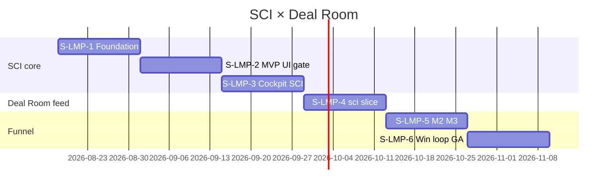

# Kickoff — Lead Meeting Prep / Sales Close Intelligence (SCI)

> **Meeting type:** Program kickoff · **Thời lượng:** 60–90 phút  
> **Document ID:** LMP-KICKOFF-20260813  
> **Parent plan:** [`2026-08-13-lead-meeting-prep-implementation-plan.md`](../specs/2026-08-13-lead-meeting-prep-implementation-plan.md)  
> **Spec:** [`lead-meeting-prep.md`](../specs/lead-meeting-prep.md) v2.0  
> **Acceptance:** [`lead-meeting-prep-acceptance-checklist.md`](../specs/lead-meeting-prep-acceptance-checklist.md)

---

## 1. Mục tiêu buổi kickoff

Cuối buổi họp phải **chốt được 5 quyết định** — không mở S-LMP-1 nếu thiếu mục **Go/No-Go** §8:

| # | Quyết định | Owner quyết |
|---|---|---|
| D1 | **Pilot client** — `client_id`(s) + lý do | PO + Trưởng Sales |
| D2 | **Squad** — tên + FTE + sprint ownership | Eng Lead |
| D3 | **Deal Room × SCI timeline** — xác nhận F1 sẵn, SCI slice tuần 7–8 | Eng Lead + PO |
| D4 | **Tavily budget** — cap/tháng + ai trả invoice | Ops + PO |
| D5 | **UAT calendar** — 3 AM + 1 GDKD + ngày tuần 4/6/8/12 | Trưởng Sales |

---

## 2. Thành phần tham dự

| Vai trò | Bắt buộc | Trách nhiệm kickoff |
|---|---|---|
| **PO / Ban** | ✅ | Duyệt scope, pilot, GA criteria |
| **Trưởng Sales** | ✅ | Chọn pilot agency, chỉ định 3 AM UAT |
| **GDKD** | ✅ | Prompt review gate, Deal Room buổi chốt |
| **Eng Lead** | ✅ | Squad, timeline, dependency Deal Room |
| **BE Nest** | ✅ | S-LMP-1 estimate commit |
| **Worker/Python** | ✅ | Tavily/verify brain |
| **FE** | ○ (optional tuần 1) | Cockpit timeline confirm |
| **Ops / DevOps** | ✅ | VPS `.env`, secrets, deploy slot |
| **QA** | ○ | Gate script owner |

---

## 3. Pre-read (gửi trước 24h)

- [ ] [`lead-meeting-prep.md`](../specs/lead-meeting-prep.md) — §1 pitch + §22 Moments + §26 Cockpit *(15 phút)*
- [ ] [`2026-08-13-lead-meeting-prep-implementation-plan.md`](../specs/2026-08-13-lead-meeting-prep-implementation-plan.md) — §4 timeline + §5 S-LMP-1 tasks *(10 phút)*
- [ ] [`16-sales-solution-chot-deal-sop.md`](../huong-dan-su-dung/16-sales-solution-chot-deal-sop.md) — §Pha 0 *(5 phút)*
- [ ] Demo nhanh Deal Room hiện có: `/crm/leads/[id]/deal-room` trên staging *(5 phút)*

---

## 4. Agenda (60–90 phút)

| Phút | Nội dung | Output |
|---|---|---|
| 0–10 | Pitch SCI v2 + 4 Moments | Alignment “không chỉ research” |
| 10–25 | **§A Pilot client** | D1 filled |
| 25–35 | **§B Squad** | D2 filled |
| 35–45 | **§C Deal Room timeline** | D3 filled |
| 45–55 | **§D Infra** Tavily/VPS/RBAC | Ops tasks assigned |
| 55–65 | **§E UAT calendar** | D5 filled |
| 65–75 | S-LMP-1 task walkthrough (LMP-01…19) | BE/Worker commit tuần 1–2 |
| 75–85 | Rủi ro + buffer Deal Room | Mitigation agreed |
| 85–90 | **§8 Go/No-Go** + sign §G | Kickoff PASS/FAIL |

---

## A. Pilot client — checklist quyết định

### A.1. Tiêu chí chọn pilot (cần ≥4/6)

| # | Tiêu chí | Pilot A | Pilot B |
|---|---|:---:|:---:|
| C1 | B2B prospect (`lead_flow_kind ≠ spa_operational`) | ☐ | ☐ |
| C2 | ≥3 lead mới/tuần có `company_name` | ☐ | ☐ |
| C3 | AM cam kết UAT tuần 4 + 6 | ☐ | ☐ |
| C4 | Có lead thật “trùng tên DN” để test entity choice | ☐ | ☐ |
| C5 | Presales + Deal Room đang dùng (hoặc sắp chốt deal) | ☐ | ☐ |
| C6 | GDKD đồng ý cho AM dùng talk track AI (human review) | ☐ | ☐ |

### A.2. Quyết định D1 — điền tại kickoff

| Field | Giá trị |
|---|---|
| **Pilot agency tên** | _________________________________ |
| **`client_id` (UUID)** | __________________________________ |
| **Pilot phụ (optional)** | _________________________________ |
| **`PTT_LMP_PILOT_CLIENT_IDS`** | `(copy CSV vào .env)` |
| **Loại trừ** | `spa_operational` ☐ · industry khác: _________ |
| **Thời gian pilot** | Từ ________ đến ________ (target 4 tuần) |
| **Tiêu chí thoát pilot → GA** | EC-LMP-01…12 PASS + 3 AM UAT sign |

### A.3. Lead fixture UAT (chuẩn bị trước tuần 4)

| Fixture | Mục đích | Owner | Done |
|---|---|---|---|
| Lead staging generic | Gate script | QA | ☐ |
| Khang Thịnh Land (trùng tên) | Entity choice EC-LMP-03 | QA + Sales | ☐ |
| 1 lead Meta webhook thật | End-to-end ingest | AM pilot | ☐ |
| 1 lead manual thiếu company | Skip + CTA EC-LMP-02 | QA | ☐ |

### A.4. Checklist kỹ thuật pilot

- [ ] `client_id` tồn tại trong `agency_clients` / lead ingest path
- [ ] AM pilot có cap `crm_leads.view` + sẽ được seed `crm_lmp.view` / `crm_lmp.run`
- [ ] Lead pilot không dùng production KH nhạy cảm cho Tavily test đầu *(staging preferred)*

---

## B. Squad — checklist phân công

### B.1. Roster (D2)

| Stream | Owner | Backup | FTE | Sprint focus |
|---|---|---|---|---|
| **Nest BE** | ______________ | __________ | ___ | S-LMP-1,2,4,5 |
| **Worker/Python** | ______________ | __________ | ___ | S-LMP-1,3 |
| **Frontend** | ______________ | __________ | ___ | S-LMP-2,3,4 |
| **QA / Gate** | ______________ | __________ | 0.5 | Gate scripts |
| **PO** | ______________ | — | 0.25 | Pilot + sign-off |
| **Sales champion** | ______________ (AM) | — | 0.1 | UAT + feedback |

### B.2. Sprint ownership

| Sprint | Tuần | DRI (Directly Responsible) | Demo audience |
|---|---|---|---|
| S-LMP-1 | 1–2 | __________ | Eng Lead |
| S-LMP-2 | 3–4 | __________ | PO + 3 AM |
| S-LMP-3 | 5–6 | __________ | Trưởng Sales |
| S-LMP-4 | 7–8 | __________ | GDKD (Deal Room) |
| S-LMP-5 | 9–10 | __________ | PO |
| S-LMP-6 | 11–12 | __________ | Ban sign-off |

### B.3. Communication

| Kênh | Tần suất | Nội dung |
|---|---|---|
| Standup squad | Daily 15p | Blockers Tavily/worker |
| Demo sprint | Cuối mỗi sprint | Gate PASS + UAT slice |
| Sales sync | Tuần 4, 6, 8 | AM feedback talk track |
| PO review | Tuần 2, 4, 8, 12 | EC checklist |

### B.4. Tracking board

- [ ] Board tạo: columns **Backlog → S-LMP-1 … S-LMP-6 → Done**
- [ ] Epic link: `LMP-SCI-202608`
- [ ] Tasks import từ plan §5–10 (LMP-01…72)

---

## C. Deal Room × SCI — timeline (D3)

### C.1. Trạng thái hiện tại (as-is) — xác nhận tại kickoff

Deal Room **F1 S-Close đã có trong repo** — SCI **không** build lại Deal Room, chỉ **feed slice `sci`**.

| Thành phần | Route / file | Trạng thái |
|---|---|---|
| Deal Room page | `/crm/leads/[id]/deal-room` | ✅ Built |
| API snapshot | `GET /api/v1/leads/:id/deal-room` | ✅ Built |
| Gates G0–G6 | `deal-room-gates.util.ts` | ✅ Built |
| Quote 3 tier | `createDealRoomQuote` | ✅ Built |
| PDF pack export | `export-pack` | ✅ Built |
| Flag client | `NEXT_PUBLIC_DEAL_ROOM` | ☐ Confirm ON staging/VPS |
| **SCI slice `sci`** | `DealRoomSnapshot.sci` | ❌ S-LMP-4 (tuần 7–8) |

### C.2. Timeline tích hợp — cam kết

| Milestone | Tuần program | Dependency | Rủi ro nếu trễ |
|---|---|---|---|
| SCI M1 ready (P0) | **4** | Không cần Deal Room | AM vẫn dùng Cockpit tab |
| SCI Close Intelligence (P1) | **6** | Không cần Deal Room | Talk track + offer ladder |
| **SCI → Deal Room `sci` slice** | **7–8** | Deal Room flag ON | Defer tab Deal Ready; core Cockpit OK |
| M3 `deal_room_payload` | **7–8** | Presales G4 sample lead | Manual narrative tạm |
| apply-offer-ladder | **8** | SPC S6e + proposals | Manual quote vẫn được |

### C.3. Quyết định D3 — điền tại kickoff

| Câu hỏi | Trả lời |
|---|---|
| Deal Room **đã bật** trên VPS pilot? | ☐ Có (`NEXT_PUBLIC_DEAL_ROOM=1`) ☐ Chưa → Ops bật tuần ___ |
| Ai own Deal Room khi SCI integrate? | Nest: __________ · FE: __________ |
| Có deal thật để UAT buổi chốt tuần 8? | ☐ Có lead #_____ ☐ Chờ deal → buffer +1 tuần |
| Chấp nhận S-LMP-4 **không block** S-LMP-1–3? | ☐ Đồng ý ☐ Không — ghi lý do: _________ |

### C.4. Fallback nếu thiếu deal chốt tuần 8

- [ ] UAT Deal Room dùng **lead staging** có G4 pass giả lập
- [ ] Tab **Deal Ready** ship với mock `deal_room_payload`
- [ ] KPI EC-LMP-17 đo trên staging trước, pilot production sau tuần 10

---

## D. Hạ tầng & secrets — checklist Ops

### D.1. Trước S-LMP-1 (tuần 1)

| # | Việc | Owner | Done | Due |
|---|---|:---:|:---:|---|
| I1 | Tavily account + API key | Ops | ☐ | ___ |
| I2 | Budget cap: `$____/tháng` · `MAX_TAVILY_CREDITS_PER_LEAD=8` | PO | ☐ | ___ |
| I3 | Staging `.env`: `TAVILY_API_KEY` | Ops | ☐ | ___ |
| I4 | VPS `.env` draft (chưa bật prod) | Ops | ☐ | ___ |
| I5 | `PTT_LEAD_MEETING_PREP_ENABLED=0` default | Ops | ☐ | ___ |
| I6 | Apply DDL staging | BE | ☐ | Tuần 1 |
| I7 | `ptt_worker` restart policy OK | Ops | ☐ | ___ |

### D.2. Trước S-LMP-2 pilot VPS (tuần 4)

| # | Việc | Done |
|---|---|:---:|
| I8 | `PTT_LEAD_MEETING_PREP_ENABLED=1` VPS pilot | ☐ |
| I9 | `PTT_LMP_PILOT_CLIENT_IDS=<D1 UUID>` | ☐ |
| I10 | `scripts/seed_staff_lmp_permissions.py` | ☐ |
| I11 | `scripts/lead_meeting_prep_gate.sh` PASS VPS | ☐ |
| I12 | ops-web + api build deploy | ☐ |

### D.3. Trước S-LMP-3 (tuần 5)

| # | Việc | Done |
|---|---|:---:|
| I13 | `APIFY_API_TOKEN` (optional FB) | ☐ |
| I14 | Prompt pack repo `docs/prompts/lmp/` reviewed GDKD | ☐ |

---

## E. UAT calendar — checklist (D5)

### E.1. Lịch cố định (điền ngày)

| Tuần | Sprint | UAT focus | Ngày đề xuất | AM tham gia | GDKD |
|---|---|---|---|---|---|
| **4** | S-LMP-2 | P0 panel + first call script | __/__/__ | AM1 ___ AM2 ___ AM3 ___ | ☐ |
| **6** | S-LMP-3 | Cockpit 5 tab + offer ladder | __/__/__ | AM1 ___ AM2 ___ | ☐ |
| **8** | S-LMP-4 | Deal Room + quote 3 gói | __/__/__ | AM + Solution ___ | ✅ |
| **12** | S-LMP-6 | End program sign-off | __/__/__ | All + PO | ✅ |

### E.2. AM UAT commit (3 người — tên tại kickoff)

| AM | Email | Pilot client | Cam kết tuần 4 | tuần 6 |
|---|---|---|:---:|:---:|
| 1 | _____________ | ☐ A ☐ B | ☐ | ☐ |
| 2 | _____________ | ☐ A ☐ B | ☐ | ☐ |
| 3 | _____________ | ☐ A ☐ B | ☐ | ☐ |

### E.3. Deliverables mỗi UAT

- [ ] Checklist [`lead-meeting-prep-acceptance-checklist.md`](../specs/lead-meeting-prep-acceptance-checklist.md) section tương ứng
- [ ] Recording screen-share 15p (optional)
- [ ] Feedback 👍/👎 vào SCI (tuần 6+)

---

## F. Phạm vi & guardrail — xác nhận nhanh

Đọc cho cả phòng — tick đồng thuận:

- [ ] **Không** research profile cá nhân liên hệ — mọi `contact_profile.found=false`
- [ ] **Không** auto-gửi script cho khách — AM copy thủ công (BR-AI-01)
- [ ] **Không** thay Solution Consult / R5 — SCI bổ sung, không thay L1
- [ ] **Không** block lead create — job async only
- [ ] Entity trùng tên → **bắt buộc** AM chọn pháp nhân
- [ ] Rollback = `PTT_LEAD_MEETING_PREP_ENABLED=0` (1 env var)

---

## G. Sign-off kickoff

| Quyết định | Kết quả |
|---|---|
| **D1 Pilot client** | UUID: ________________________________ |
| **D2 Squad DRI S-LMP-1** | Nest: _________ Worker: _________ |
| **D3 Deal Room** | SCI slice tuần 7–8 ☐ OK · Buffer ☐ +1 tuần |
| **D4 Tavily budget** | $________/tháng |
| **D5 UAT tuần 4** | Ngày __/__/__ |

### Go / No-Go mở S-LMP-1 (cần ALL ✅)

| # | Gate | ✓ |
|---|---|:---:|
| G1 | Spec v2 + plan approved by PO | ☐ |
| G2 | Pilot `client_id` chốt (D1) | ☐ |
| G3 | Squad assigned (D2) | ☐ |
| G4 | Tavily key staging (I3) | ☐ |
| G5 | Deal Room timeline agreed (D3) | ☐ |
| G6 | UAT dates booked (D5) | ☐ |
| G7 | SPC S6e PASS on staging/VPS | ☐ |

**Kết quả kickoff:** ☐ **GO** — start S-LMP-1 tuần ___ · ☐ **NO-GO** — blocker: _______________

| Role | Họ tên | Chữ ký | Ngày |
|---|---|---|---|
| PO / Ban | | | |
| Trưởng Sales | | | |
| GDKD | | | |
| Eng Lead | | | |
| Ops | | | |

---

## H. Action items sau kickoff (24h)

| # | Action | Owner | Due |
|---|---|---|---|
| 1 | Gửi recap email + filled D1–D5 | PO | +1d |
| 2 | Tạo board S-LMP-1…6 | Eng Lead | +1d |
| 3 | Apply DDL staging + branch `feat/lmp-s1` | BE | +2d |
| 4 | Tavily key → staging `.env` | Ops | +1d |
| 5 | Book UAT calendar invites | Sales | +2d |
| 6 | Seed fixture leads QA | QA | trước tuần 4 |
| 7 | Confirm `NEXT_PUBLIC_DEAL_ROOM` VPS | Ops | trước tuần 7 |

---

*Kickoff checklist — cập nhật sau meeting: điền §A.2, §B.1, §C.3, §E.1, §G và lưu PDF kèm [`lead-meeting-prep-acceptance-checklist.md`](../specs/lead-meeting-prep-acceptance-checklist.md).*
