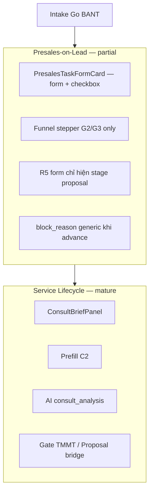
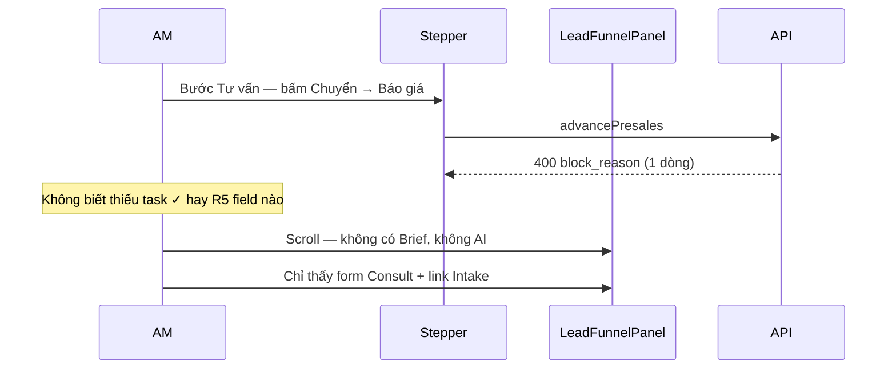
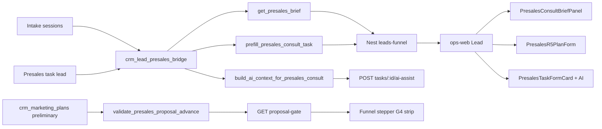

# Spec Phase 3 — Consult trên Lead (Brief + G4 strip + AI)

> **Document ID:** CON-P3-20260726  
> **Phiên bản:** 1.0 · **Ngày:** 2026-07-26  
> **Trạng thái:** Draft — chờ PO sign-off  
> **Parent:** [`2026-06-30-consult-stage-system-design.md`](./2026-06-30-consult-stage-system-design.md) · [`2026-08-05-intake-bant-phase25-funnel-stepper-design.md`](./2026-08-05-intake-bant-phase25-funnel-stepper-design.md) · [`2026-08-05-lead-gen-presales-workflow-design.md`](./2026-08-05-lead-gen-presales-workflow-design.md)

---

## 1. Tóm tắt

Phase 2.5 đã ship **Funnel Stepper** với gate G2/G3 trên bước `intake_bant` (Intake → Consult). Phase 2 (lead-gen) đã thêm **template Consult 4 field** + prefill khi advance.

**Phase 3** đóng khoảng trống **Consult chuyên nghiệp trên luồng presales-on-lead** (`/crm/leads/[id]#funnel-presales`) — parity với Service Lifecycle (C1–C4 đã ship trên `/crm/service-delivery`):

| Hạng mục | Lifecycle (done) | Lead presales (gap) |
|----------|------------------|---------------------|
| Consult Brief panel | `ConsultBriefPanel` + API | Python `get_presales_brief` có; **Nest + ops-web thiếu** |
| Gate strip trên stepper | N/A (tab workflow) | G2/G3 có; **G4 thiếu strip** trên step `consult` |
| AI `consult_analysis` | Flask `run_ai_assist` + bridge context | **Không có** endpoint/UI trên presales task |

**Deliverable:** AM làm Consult trên Lead với brief tổng hợp, gate G4 hiển thị rõ trên stepper, và nút **AI Hỗ trợ** trên task Consult — không cần chuyển sang Service Delivery.

**Không mở:** thay đổi ngưỡng BANT; form 12 dịch vụ mới; auto-advance; lifecycle-only features (TMMT, payment gate).

---

## 2. Vấn đề hiện tại

### 2.1 Hai luồng Consult không đồng đều



AM pilot (#900000002, `lead-gen`, BANT 30/30 Go) đang ở stage `consult` nhưng:

1. Không thấy **Brief** (pain, niche, intake summary, red flags, recommended actions).
2. Stepper bước **Tư vấn** không có **gate strip G4** — chỉ thấy `block_reason` khi bấm CTA.
3. Form R5 **KH Marketing sơ bộ** chỉ render khi `stage === 'proposal'`, trong khi gate server yêu cầu R5 **trước** `consult → proposal`.
4. Task Consult không có **AI Hỗ trợ** dù `ai_prompt_key: consult_analysis` đã seed trong workflow JSON.

### 2.2 Backend đã có — UI/API chưa nối

| Thành phần | Python (Flask payload) | Nest `ptt-crm-api` | ops-web |
|------------|------------------------|-------------------|---------|
| `get_presales_brief` | ✅ trong `presales_public_payload` | ❌ | ❌ |
| `prefill_presales_consult_task` | ✅ | ✅ (advance hook) · ❌ manual POST | ❌ |
| `validate_presales_proposal_advance` (G4) | ✅ trong `get_presales_advance_info` | ✅ trong `buildPresalesSnapshot` | ⚠️ chỉ `advance.block_reason` |
| `run_ai_assist` + brief context | ✅ lifecycle tasks | ❌ presales tasks | ❌ |
| `ai_prompt_key` / `ai_output` trên task | ✅ schema `crm_lead_presales_tasks` | ⚠️ không expose trong funnel type | ❌ |

### 2.3 Pain AM (Consult stage)



---

## 3. Mục tiêu & phạm vi

### 3.1 Mục tiêu (SMART)

| ID | Mục tiêu | Chỉ số |
|----|----------|--------|
| G1 | Brief hiển thị khi `presales.stage === 'consult'` | 100% lead có presales active |
| G2 | G4 gate strip trên step `consult` | ≥3 message chi tiết khi block (task + R5) |
| G3 | R5 có thể điền **trong** stage Consult | 0 advance pass mà chưa thấy form R5 |
| G4 | AI Hỗ trợ trên task Consult presales | Output lưu `ai_output`; prompt có BANT + intake |
| G5 | Parity Nest ↔ Python | Contract test snapshot fields |

### 3.2 In scope

| Epic | Nội dung |
|------|----------|
| **E1** | Nest API: `GET consult-brief`, `POST consult-prefill`, `GET proposal-gate` |
| **E2** | `PresalesConsultBriefPanel` trên Lead (reuse/adapt lifecycle panel) |
| **E3** | G4 gate strip + CTA **Chuyển → Báo giá** (extend `resolveGateStrip`) |
| **E4** | R5 mini-form trong stage `consult` (tách component, bỏ proposal-only) |
| **E5** | AI assist API + UI trên `PresalesTaskFormCard` (stage `consult` only v1) |
| **E6** | Tests, training matrix cập nhật, migration pilot lead |

### 3.3 Out of scope (defer)

| Hạng mục | Lý do |
|----------|-------|
| AI trên task `lead` / `proposal` presales | v1 tập trung Consult; mở rộng sau |
| Auto-advance sau Complete Intake | PO Phase 2.5 D2 |
| Consult Brief khi `stage === 'lead'` | Brief chỉ meaningful sau handoff Consult |
| E5/E6 Phase 2.5 (full B2B bar, API embed stepper) | Backlog INT-P25.2 |
| Re-seed toàn bộ presales cũ sang template mới | Script riêng; pilot manual |

---

## 4. Kiến trúc

### 4.1 Luồng dữ liệu (target)



### 4.2 File map (dự kiến)

| Layer | File mới / sửa |
|-------|----------------|
| Python | `crm_lead_presales_bridge.py` — `build_ai_context_for_presales_consult` |
| Python | `crm_lead_presales.py` — `run_presales_ai_assist` (thin wrapper) |
| Nest | `presales-consult-brief.util.ts` (port từ `lifecycle-consult.util`) |
| Nest | `presales-proposal-gate.util.ts` (wrap `validatePreliminaryPlan` + task progress) |
| Nest | `leads-funnel.controller.ts` — 3 route mới |
| Nest | `leads-funnel-{pg,sqlite}.repository.ts` — wire + expose `ai_prompt_key`, `ai_output` |
| ops-web | `PresalesConsultBriefPanel.tsx` |
| ops-web | `PresalesR5PlanForm.tsx` (extract từ `LeadFunnelPanel`) |
| ops-web | `PresalesTaskFormCard.tsx` — AI button + output |
| ops-web | `funnel-stepper.util.ts` — G4 strip + types |
| ops-web | `LeadPresalesFunnelStepper.tsx` — fetch proposal gate |
| ops-web | `lib/api.ts` — types + fetch helpers |

---

## 5. Epic chi tiết

### E1 — Nest API Consult Brief / Prefill / Proposal gate

#### E1.1 `GET /api/v1/leads/:id/presales/consult-brief`

**Auth:** `StaffLeadsViewGuard` + `PresalesOnLeadGuard`

**Response:** mirror Flask `get_presales_brief` (subset typed):

```typescript
interface PresalesConsultBrief {
  presales_id: number;
  lead_id: number;
  service_slug: string;
  service_label: string;
  presales_stage: string;
  readiness: {
    lead_task_done: boolean;
    has_any_intake: boolean;
    decision: string;
    decision_label: string;
    bant_total: number;
    temperature_label: string;
    consult_gate_level: 'ok' | 'warn' | 'block';
  };
  highlights: { pain?: string; niche?: string; domain?: string; goal?: string; budget_vnd?: number | null };
  latest_intake_summary?: string;
  recommended_actions: string[];
  red_flags: string[];
}
```

**Implementation:** Port logic từ `crm_lead_presales_bridge.get_presales_brief` sang `presales-consult-brief.util.ts`, dùng chung intake list + presales tasks (pattern `LifecycleConsultService`).

#### E1.2 `POST /api/v1/leads/:id/presales/consult-prefill`

**Body:** `{ overwrite?: boolean }`

**Response:** `{ task_id, filled, fields, skipped_existing }`

**Reuse:** Nest `prefillConsultTaskForm` / `presales-consult-prefill.util.ts` (đã có cho advance hook).

#### E1.3 `GET /api/v1/leads/:id/presales/proposal-gate`

Gate G4 cho stepper — **không** thay thế server check trong `advancePresales`.

```typescript
interface ProposalAdvanceGate {
  ok: boolean;
  level: 'ok' | 'block';
  messages: string[];
  consult_task_done: boolean;
  consult_task_total: number;
  consult_task_done_count: number;
  marketing_plan: { ok: boolean; messages: string[] };
}
```

**Rules (existing, document only):**

1. `consult` stage tasks all `is_done` — else block: *"Hoàn thành task Consult trước khi chuyển Báo giá"*
2. `validatePreliminaryPlan` pass — else append R5 messages (market_message, media_reach, conversion_strategy, north_star/objectives)
3. `ok === true` → CTA **Chuyển → Báo giá** enabled on stepper

**Optional embed:** thêm `presales.proposal_gate` vào `GET /funnel` snapshot để giảm round-trip (follow-up E6 INT-P25.2).

#### E1.4 Funnel snapshot enrichment

Mở rộng `LeadFunnelSnapshot.presales.tasks[]`:

```typescript
{
  id: number;
  title: string;
  ai_prompt_key?: string;
  ai_output?: string;
  // ...existing
}
```

---

### E2 — Consult Brief panel trên Lead

#### E2.1 Layout

Khi `funnel.presales.presales.stage === 'consult'`:

```
┌─────────────────────────────────────────────────────────────┐
│ Funnel Stepper (G4 strip khi activeStep = consult)          │
├──────────────────────────────┬──────────────────────────────┤
│ Pre-sales tasks (main)       │ PresalesConsultBriefPanel    │
│ · PresalesTaskFormCard       │ · readiness / BANT / decision│
│ · PresalesR5PlanForm (E4)    │ · highlights + intake summary│
│ · Link Intake                │ · red flags + gợi ý          │
│                              │ · Prefill button             │
└──────────────────────────────┴──────────────────────────────┘
```

**CSS:** `display: grid; grid-template-columns: 1fr min(22rem, 36%); gap: 1rem` — collapse 1 col mobile `<768px`.

#### E2.2 Component

- **`PresalesConsultBriefPanel`**: fork `ConsultBriefPanel.tsx` — props `{ token, user, leadId }`, gọi `fetchLeadPresalesConsultBrief` / `postLeadPresalesConsultPrefill`.
- **`onPrefilled`**: reload funnel + refresh proposal gate + clear task drafts liên quan.

#### E2.3 Acceptance

- [ ] Brief load <2s (prod VPS)
- [ ] Prefill không ghi đè field đã có (default `overwrite: false`)
- [ ] `consult_gate_level` badge màu ok/warn/block giống lifecycle

---

### E3 — G4 gate strip trên Funnel Stepper

#### E3.1 Extend `resolveGateStrip`

Hiện tại chỉ `activeStep === 'intake_bant'`. Thêm nhánh:

```typescript
if (activeStep === 'consult' && proposalGate) {
  // tone: ok | block
  // title: 'Sẵn sàng chuyển Báo giá' | 'Chưa đủ điều kiện Báo giá'
  // messages: proposalGate.messages (task + R5)
}
```

#### E3.2 Extend `CrmFunnelStepGateStrip`

- Prop `gateKind: 'consult' | 'proposal'` — đổi `aria-label` và badge phụ (Consult task ✓, R5 ✓).
- Link **Điền KH MKT sơ bộ ↓** scroll `#funnel-presales-r5` khi R5 chưa pass.

#### E3.3 `LeadPresalesFunnelStepper`

- Fetch `proposalGate` khi `presales.stage === 'consult'` (parallel với consult gate / intake summary).
- Refresh sau: patch task, patch marketing plan, advance, prefill brief.

#### E3.4 Primary action (existing logic + UX)

`resolvePrimaryAction` step `consult` đã đọc `funnel.presales.advance` — giữ nguyên; strip **bổ sung** visibility trước khi bấm CTA (parity G2 pattern).

#### E3.5 Acceptance

- [ ] Block hiển thị ≥2 dòng khi thiếu task + thiếu R5
- [ ] Strip ẩn khi `stage !== 'consult'`
- [ ] CTA disabled + `blockReason` khớp strip message đầu tiên

---

### E4 — R5 form trong stage Consult

#### E4.1 Vấn đề

`LeadFunnelPanel` render R5 chỉ khi `stage === 'proposal'` — **sai thứ tự nghiệp vụ** (G4 yêu cầu R5 trước advance).

#### E4.2 Thay đổi

| Trước | Sau |
|-------|-----|
| R5 form `proposal` only | R5 form `consult` **và** read-only summary `proposal` |
| Validation chỉ sau save | Live validation gọi `validatePreliminaryPlan` client-side mirror |

**Component:** `PresalesR5PlanForm` — extract block lines 572–656 `LeadFunnelPanel.tsx`, anchor `id="funnel-presales-r5"`.

**Proposal stage:** hiển thị compact summary + link chỉnh sửa (nếu chưa ký HĐ) hoặc ẩn nếu đã promote lifecycle.

#### E4.3 Acceptance

- [ ] AM điền R5 trong Consult, strip G4 chuyển ok, advance pass
- [ ] Pilot #900000002: UAT end-to-end Consult → Proposal

---

### E5 — AI Hỗ trợ trên presales task Consult

#### E5.1 API

`POST /api/v1/leads/:id/presales/tasks/:taskId/ai-assist`

**Body:** `{ form_context?: Record<string, unknown> }` — draft form từ UI (optional).

**Response:** `{ ai_output: string; task_id: number }`

**Server flow:**

1. Verify task thuộc presales của lead, `stage === 'consult'`
2. Load `ai_prompt_key` từ task row
3. Build context: `build_ai_context_for_presales_consult(lead_id, form_context)` — port Python `build_ai_context_for_consult` dùng `get_presales_brief`
4. Run Anthropic Haiku (`ANTHROPIC_API_KEY`) — template từ shared export hoặc port `AI_PROMPT_TEMPLATES['consult_analysis']`
5. Persist `ai_output` + `updated_at`

**Fallback:** nếu không có API key → 503 với message rõ (không silent fail).

#### E5.2 UI — `PresalesTaskFormCard`

Chỉ khi `task.ai_prompt_key === 'consult_analysis'` (prop hoặc từ funnel):

```
[✓] Task title
    ...form fields...
    [AI Hỗ trợ]  (disabled khi task.is_done hoặc !canEdit)
    ┌─ ai_output (pre-wrap, collapsible) ─┐
    └─────────────────────────────────────┘
```

- Gửi `form_context` = merged draft + saved form_data
- Sau success: update local funnel task `ai_output`
- Loading state trên button

#### E5.3 Acceptance

- [ ] Prompt chứa `bant_total`, `decision`, `intake_summary` (test snapshot prompt hoặc mock)
- [ ] `ai_output` persist — reload trang vẫn thấy
- [ ] Không hiện nút AI trên task `lead` / `proposal` (v1)

---

### E6 — Tests, training, migration

#### E6.1 Tests

| Suite | Case |
|-------|------|
| Python | `test_build_ai_context_presales_consult`, `test_presales_ai_assist` |
| Nest | `presales-consult-brief.util.spec.ts`, `presales-proposal-gate.util.spec.ts`, controller e2e |
| ops-web | `funnel-stepper.util.spec.ts` — G4 strip; optional RTL brief panel |

#### E6.2 Training

Cập nhật:

- `docs/runbooks/consult-stage-am-sop.md` — bước Brief + G4 strip + AI
- `Consult_Form_Matrix_AM_Training.xlsx` sheet Consult flow — thêm cột Lead presales UI

#### E6.3 Migration pilot

Lead **#900000002** (`lead-gen`):

1. Deploy lead-gen template (Phase 2 commit)
2. Re-seed consult task hoặc `ensure_presales` migration script
3. UAT: Brief → prefill → AI → R5 → G4 strip → advance Proposal

---

## 6. Contract API (tóm tắt)

| Method | Path | Mục đích |
|--------|------|----------|
| GET | `/api/v1/leads/:id/presales/consult-brief` | Brief panel E2 |
| POST | `/api/v1/leads/:id/presales/consult-prefill` | Nút prefill brief |
| GET | `/api/v1/leads/:id/presales/proposal-gate` | G4 strip E3 |
| POST | `/api/v1/leads/:id/presales/tasks/:taskId/ai-assist` | AI E5 |
| GET | `/api/v1/leads/:id/presales/consult-gate` | *(existing G2)* |
| POST | `/api/v1/leads/:id/presales/advance` | *(existing — server G4)* |
| PATCH | `/api/v1/leads/:id/presales/marketing-plan` | *(existing R5)* |

---

## 7. UI copy (VN)

| Key | Text |
|-----|------|
| G4 strip ok | Sẵn sàng chuyển **Báo giá** |
| G4 strip block | Chưa đủ điều kiện **Báo giá** |
| R5 section title | KH Marketing sơ bộ (R5) — bắt buộc trước Báo giá |
| AI button | AI Hỗ trợ |
| AI loading | Đang phân tích… |
| Brief prefill | Prefill từ Lead / Intake |

---

## 8. Definition of Done

| # | Tiêu chí |
|---|----------|
| D1 | Nest 3 endpoint mới + AI assist; Python parity cho AI context |
| D2 | Brief panel visible stage `consult` on Lead detail |
| D3 | G4 gate strip on stepper step `consult` with task + R5 messages |
| D4 | R5 form usable in Consult stage |
| D5 | AI button on Consult presales task; output persisted |
| D6 | Unit tests pass; pilot UAT #900000002 documented |
| D7 | No regression Phase 2.5 G2/G3 stepper |

---

## 9. UAT script (pilot)

**Precondition:** Lead #900000002, presales `consult`, Intake Go 30/30, template `lead-gen`.

| Step | Hành động | Expected |
|------|-----------|----------|
| U1 | Mở `/crm/leads/900000002#funnel-presales` | Stepper active = Tư vấn |
| U2 | Xem Brief panel | BANT 30, decision Go, intake summary |
| U3 | Prefill | ≥1 consult field filled |
| U4 | AI Hỗ trợ | `ai_output` non-empty |
| U5 | ✓ task Consult (4 field đủ) | Progress 1/1 |
| U6 | Điền R5 (3 strategy + north star) | Strip G4 ok |
| U7 | CTA **Chuyển → Báo giá** | stage = proposal |
| U8 | Strip G4 ẩn; proposal tasks hiện | — |

---

## 10. Rủi ro & giảm thiểu

| Rủi ro | Giảm thiểu |
|--------|------------|
| Duplicate logic Nest/Python | Shared JSON field maps; contract tests; ưu tiên port từ `lifecycle-consult.util` |
| AI cost / latency | Chỉ Consult stage; disable khi không API key |
| R5 form dài trên mobile | Collapse sections; strip link scroll |
| Presales cũ generic template | Pilot script; không block Phase 3 ship |

---

## 11. Quyết định PO (chờ)

| # | Câu hỏi | Đề xuất |
|---|---------|---------|
| D1 | Embed `proposal_gate` vào GET `/funnel`? | **Có** nếu ≤1 sprint; else fetch riêng v1 |
| D2 | AI trên task `proposal` presales? | **Defer** v1 |
| D3 | Brief khi stage `lead` (preview)? | **Không** v1 |
| D4 | Ship cùng release lead-gen? | **Khuyến nghị** — một deploy Consult trọn gói |

---

## Phụ lục A — Mapping gate doc §16

| Gate | Stepper step | UI Phase 3 |
|------|--------------|------------|
| G1 B2 | `b2` | *(Phase 2.5 — unchanged)* |
| G2 Task Lead + Intake Go | `intake_bant` | Gate strip + CTA Consult *(Phase 2.5)* |
| G3 No-Go / BANT warn | `intake_bant` | Warn strip *(Phase 2.5)* |
| **G4 KH MKT sơ bộ + Consult ✓** | **`consult`** | **Gate strip + R5 form + CTA Báo giá** |

## Phụ lục B — Tham chiếu code hiện có

| Mục | File |
|-----|------|
| Brief (Python) | `crm_lead_presales_bridge.py` → `get_presales_brief` |
| Brief (lifecycle UI) | `ConsultBriefPanel.tsx` |
| G4 server | `crm_lead_presales.py` → `get_presales_advance_info`; `presales-marketing-plan.util.ts` |
| Stepper G2 | `funnel-stepper.util.ts` → `resolveGateStrip` (intake_bant only) |
| R5 form | `LeadFunnelPanel.tsx` L572–656 |
| AI (lifecycle) | `crm_svc_consult_bridge.py` → `build_ai_context_for_consult`; Flask `api_svc_task_ai_assist` |
| Prefill | `presales-consult-prefill.util.ts` |

## Phụ lục C — Epic estimate

| Epic | Effort |
|------|--------|
| E1 API | 1–1.5 d |
| E2 Brief panel | 0.5–1 d |
| E3 G4 strip | 1 d |
| E4 R5 relocate | 0.5 d |
| E5 AI | 1–1.5 d |
| E6 Tests + UAT | 1 d |
| **Total** | **~5–6 dev-days** |

---

*Changelog:*  
*v1.0 — Initial Consult Phase 3 spec: Brief + G4 strip + AI on Lead presales (2026-07-26).*
