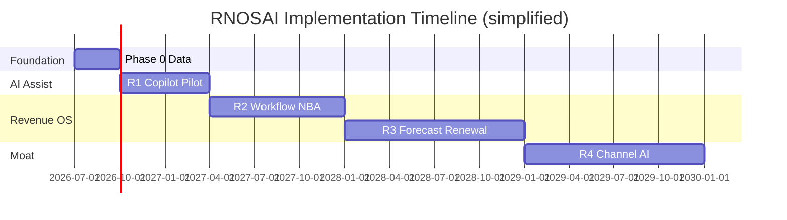
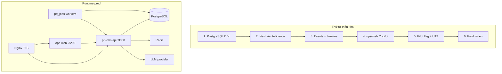

# Kế hoạch triển khai hệ thống — RNOSAI (Revenue OS + AI)

> **Phiên bản:** 1.0 · **Ngày:** 2026-07-26  
> **Owner:** Product + Tech lead · **Horizon:** 5 năm (R0 ✅ → Phase 5) · **Focus thực thi:** 90 ngày Phase 0 + R1  
> **Repository:** https://github.com/sdadtuan/RNOSAI  
> **Master spec:** [`SPEC_AI_REVENUE_OPERATING_SYSTEM.md`](../SPEC_AI_REVENUE_OPERATING_SYSTEM.md) §0, §18–§19, §23  
> **Entry point:** [`SPEC_RNOSAI_MASTER.md`](../SPEC_RNOSAI_MASTER.md) · **GitHub:** https://github.com/sdadtuan/RNOSAI

---

## Mục lục

1. [Tóm tắt điều hành](#1-tóm-tắt-điều-hành)
2. [Trạng thái hiện tại (as-is)](#2-trạng-thái-hiện-tại-as-is)
3. [Mục tiêu & phạm vi triển khai](#3-mục-tiêu--phạm-vi-triển-khai)
4. [Kiến trúc triển khai theo lớp](#4-kiến-trúc-triển-khai-theo-lớp)
5. [Lộ trình theo wave](#5-lộ-trình-theo-wave)
6. [Kế hoạch 90 ngày (Phase 0 + R1)](#6-kế-hoạch-90-ngày-phase-0--r1)
7. [Luồng công việc (workstreams)](#7-luồng-công-việc-workstreams)
8. [Môi trường & trình tự deploy](#8-môi-trường--trình-tự-deploy)
9. [Nhân sự & RACI](#9-nhân-sự--raci)
10. [Ma trận deliverable RNOS](#10-ma-trận-deliverable-rnos)
11. [Gate nghiệm thu](#11-gate-nghiệm-thu)
12. [Rủi ro & phụ thuộc](#12-rủi-ro--phụ-thuộc)
13. [Song song: Production hardening](#13-song-song-production-hardening)
14. [Tài liệu & traceability](#14-tài-liệu--traceability)
15. [Bước tiếp theo (tuần 1)](#15-bước-tiếp-theo-tuần-1)

---

## 1. Tóm tắt điều hành

**RNOSAI** triển khai theo mô hình **wave có gate** — không big-bang. Nền CRM + Channel OS **đã production**; giai đoạn tới tập trung **AI Assist (R1)** trong 90 ngày, sau đó mở rộng Workflow/NBA (R2) → Revenue OS (R3) → Channel AI (R4).

| Giai đoạn | Thời gian | Outcome chính |
|-----------|-----------|---------------|
| **R0** | ✅ Hoàn thành | CRM, Meta/Zalo/Email/SEO OS, Agency, Portal |
| **Phase 0 + R1** | **0–9 tháng** (90 ngày đầu critical) | Copilot + lead score + audit + timeline |
| **R2** | 9–18 tháng | NBA, deal score, workflow AI, OpenSearch |
| **R3** | 18–30 tháng | Forecast, renewal, churn, NL curated |
| **R4–5** | 30–60 tháng | Channel AI, multi-agent |

**North Star triển khai:** CSKH pilot **dùng copilot hàng ngày** với closed-loop attribution — không ship chatbot generic.



---

## 2. Trạng thái hiện tại (as-is)

### 2.1. Đã shipped production

| Lớp | Thành phần | Production URL / module |
|-----|------------|------------------------|
| CRM Core | Lead, pipeline, CSKH SLA, hub HĐ | `ops.pttads.vn/crm/*` |
| Agency OS | Multi-client, lifecycle, onboard | `/agency/*` |
| Meta Enterprise | Hub, CAPI, launch QA | `/meta/*` |
| Zalo Ads OS | Lead webhook, CPL hub | `/zalo/*` |
| Email Marketing OS | Workspace, campaigns | `/email/*` |
| SEO/AEO OS | Pipeline, GSC/GA4 | `/seo/*` |
| Portal | Viewer, approvals, performance | `portal.pttads.vn` |
| Platform | Nest API, webhooks, RBAC | `/api/v1/*` |

### 2.2. Partial / chưa ship

| Hạng mục | Trạng thái | Blocker |
|----------|------------|---------|
| **AI Layer** (`ai-intelligence`) | ○ Design + DDL | Module Nest chưa có |
| **Revenue OS behavior tables** | DDL file ✅ | Chưa apply prod |
| **Copilot UI** | Wireframe spec ✅ | `LeadCopilotPanel` chưa code |
| **Closed-loop ROAS** | Partial | Map campaign ~80% target |
| **Workflow builder UI** | ○ R2 | — |
| **Forecast / renewal agents** | ○ R3 | — |

### 2.3. Maturity ước lượng

| Dimension | % ready | Ghi chú |
|-----------|---------|---------|
| Doc (UC + actions + spec) | ~88% | AI UC 20/20 actions v1.1 |
| Code platform core | ~80% | [`production-coding-backlog`](2026-07-26-production-coding-backlog.md) |
| AI R1 code | ~85% | GAP-AI-01…05 shipped @ `d2f07b8`; polish GAP-AI-R1-01…03 |
| UAT readiness R1 | ~85% | E2E RNOS-39 green · chờ Gate R1 prod sign-off RNOS-40 |

---

## 3. Mục tiêu & phạm vi triển khai

### 3.1. Mục tiêu 90 ngày (bắt buộc)

| ID | Mục tiêu | Chỉ số |
|----|----------|--------|
| G1 | Data sẵn sàng AI | ≥80% lead pilot có source + attribution |
| G2 | Copilot adoption | DAU copilot ≥60% team pilot |
| G3 | Lead score | Visible ≤30s sau lead created |
| G4 | Giảm nhập liệu | Time-to-log ↓25% |
| G5 | Trust | 100% LLM → `ai_agent_runs`; no PII prompt prod |
| G6 | Acceptance | Draft/summary acceptance ≥35% |

Chi tiết tuần: [`2026-07-26-ai-phase1-90-day-plan.md`](2026-07-26-ai-phase1-90-day-plan.md)

### 3.2. IN / OUT scope 90 ngày

**IN:** DDL AI · Nest `ai-intelligence` · Copilot panel · score v1 · summarize · draft+approve · timeline v1 · E2E · runbook

**OUT (defer):** NBA deal · OpenSearch · workflow UI · forecast · chatbot Page · ML XGBoost · multi-agent

### 3.3. Nguyên tắc triển khai

1. **CRM core không regression** — AI flag off = ops bình thường.
2. **Human-in-the-loop** — BR-AI-01 trước mọi outbound.
3. **Pilot cohort trước full** — 5–8 CSKH → mở rộng.
4. **Gate before next wave** — §19 master spec.
5. **Doc + code đồng bộ** — UC/actions cập nhật khi ship; PR tick [checklist](https://github.com/sdadtuan/RNOSAI/blob/main/docs/templates/pr-checklist-rnos-uc-ui-uat.md).

---

## 4. Kiến trúc triển khai theo lớp



| Lớp | Triển khai R1 | Owner workstream |
|-----|---------------|------------------|
| **Data** | DDL + timeline + events | WS-DATA |
| **Backend** | `ai-intelligence` module, score, summarize, recommendations | WS-BE |
| **Frontend** | `LeadCopilotPanel`, feature flag | WS-FE |
| **Async** | `tenant.lead.scored` consumer | WS-BE |
| **Platform** | Env, DDL prod, runbook, rollback | WS-PLATFORM |
| **QA** | E2E, UAT 8 bước, load P95 | WS-QA |
| **Product** | Pilot, training, metrics G2–G6 | WS-PRODUCT |

---

## 5. Lộ trình theo wave

| Wave | Tháng | Product deliverables | AI deliverables | Gate doc |
|------|-------|---------------------|-----------------|----------|
| **R0** | ✅ | CRM + Channel OS | Meta intel | Prod live |
| **Phase 0** | 0–3 | Timeline, events catalog | Audit schema, DDL | §19 Phase 0 |
| **R1** | 3–9 | PWA stretch, import/export | Copilot, score v1, draft | §19.1 + [90-day §8](2026-07-26-ai-phase1-90-day-plan.md) |
| **R2** | 9–18 | Workflow UI, ticket lite | NBA, deal score, RAG | §19.2 |
| **R3** | 18–30 | Forecast UI, billing extend | Forecast, renewal, churn | §19.3 |
| **R4** | 30–42 | Revenue dashboard | CPL AI, budget rec | §23.5 |
| **Phase 5** | 42–60 | Native mobile | Multi-agent | §23.6 |

**Use cases theo wave:** [`use-cases/09-AI-REVENUE-OS.md`](../use-cases/09-AI-REVENUE-OS.md) AI-UC-001…020  
**UI theo wave:** [`SPEC_UI_UX_AI_REVENUE_OS.md`](../SPEC_UI_UX_AI_REVENUE_OS.md) §17

---

## 6. Kế hoạch 90 ngày (Phase 0 + R1)

> Chi tiết từng tuần: [`2026-07-26-ai-phase1-90-day-plan.md`](2026-07-26-ai-phase1-90-day-plan.md)

### 6.1. Phase 0 — Tuần 1–4 (Data foundation)

| Tuần | Milestone | RNOS | Exit criteria |
|------|-----------|------|---------------|
| 1 | DDL staging + module skeleton | 01, 02, 05 | `GET /ai/health` 200 |
| 2 | Audit + timeline hooks | 05, 16 | Activity → timeline row |
| 3 | Events + score stub | 08 | Outbox smoke |
| 4 | **Gate Phase 0** | — | Timeline ≥70%, attribution ≥80% |

**Commands:**

```bash
export DATABASE_URL='postgresql://...'
./scripts/apply_pg_ddl_revenue_os_ai.sh
```

### 6.2. R1 — Tuần 5–12 (AI Assist)

| Tuần | Milestone | RNOS | Exit criteria |
|------|-----------|------|---------------|
| 5 | Summarize API | 03 | Golden cases pass |
| 6 | Lead score v1 + async | 04, 08 | Score ≤30s E2E |
| 7 | Copilot UI shell | 06 | Panel on lead detail |
| 8 | Follow-up draft + approve | 07 | BR-AI-01 E2E |
| 9 | Lead brief + hardening | 06 | Rate limit, idempotency |
| 10 | E2E CI + runbook | 39, 40 | CI green |
| 11 | UAT + training | — | 8 bước signed |
| 12 | **Pilot go-live + Gate R1** | — | G2–G6 report |

### 6.3. Critical path 90 ngày

```text
DDL → ai-intelligence module → timeline ≥70%
  → summarize API → score async → Copilot UI
  → draft approve → E2E → pilot flag → UAT → Gate R1
```

**Không parallel hóa trước tuần 6** nếu timeline completeness <70%.

---

## 7. Luồng công việc (workstreams)

### WS-DATA — Data & events

| Task | Tuần | Output |
|------|------|--------|
| Apply DDL staging/prod | 1 | RNOS-01 |
| Timeline mirror activity + webhook | 2–3 | RNOS-16 |
| Event catalog `tenant.lead.*` | 3 | RNOS-08 |
| Completeness dashboard SQL | 4 | Gate Phase 0 |

### WS-BE — Backend / AI service

| Task | Tuần | Output |
|------|------|--------|
| `AiIntelligenceModule` register | 1 | RNOS-02 |
| `AiAuditService` wrap all calls | 2 | RNOS-05 |
| `POST /ai/summarize` | 5 | RNOS-03 |
| Rules score + `POST /ai/score/lead` | 6 | RNOS-04 |
| Recommendations PATCH | 8 | RNOS-07 |
| RBAC owner check | 10 | BR-AI-04 |

**Target path:** `services/ptt-crm-api/src/ai-intelligence/`

### WS-FE — ops-web

| Task | Tuần | Output |
|------|------|--------|
| `lib/ai-api.ts` client | 5 | API client |
| `LeadCopilotPanel` + subcomponents | 7–8 | RNOS-06, 07 |
| Wire `/crm/leads/[id]/page.tsx` | 7 | 3-col layout |
| `AiFeatureGate` + flag | 7 | Pilot hide |
| Score column list (stretch) | 9 | Optional |

**UI spec:** [`SPEC_UI_UX_AI_REVENUE_OS.md`](../SPEC_UI_UX_AI_REVENUE_OS.md)

### WS-PLATFORM — DevOps

| Task | Tuần | Output |
|------|------|--------|
| `deploy/env.ai.example` | 1 | RNOS-40 |
| Staging/prod DDL + backup | 1, 12 | Runbook |
| LLM key vault | 5 | No commit secrets |
| Pilot cohort flag | 11 | 5–8 users |
| Rollback drill | 10 | [`runbooks/ai-service-operations.md`](../runbooks/ai-service-operations.md) |

### WS-QA — Quality

| Task | Tuần | Output |
|------|------|--------|
| Golden prompt fixtures (10 VN) | 2 | Eval gate |
| Playwright `ai-copilot.spec.ts` | 10 | RNOS-39 |
| UAT walkthrough | 11 | [`09-AI-ACTIONS.md`](../use-cases/actions/09-AI-ACTIONS.md) |
| Load P95 summarize | 11 | ≤5s staging |

### WS-PRODUCT — Pilot & adoption

| Task | Tuần | Output |
|------|------|--------|
| Baseline time-to-log survey | 3 | Pre-pilot metric |
| Training 30 phút CSKH | 11 | Attendance |
| Daily standup pilot 15m | 12 | DAU monitor |
| Post-pilot report G2–G6 | 12 | R2 backlog prio |

---

## 8. Môi trường & trình tự deploy

### 8.1. Môi trường

| Env | Mục đích | AI flag default |
|-----|----------|-----------------|
| **Local** | Dev module + UI | `PTT_AI_COPILOT_ENABLED=1` |
| **Staging** | E2E, UAT, load | `1` full team |
| **Production pilot** | 5–8 CSKH | `1` + cohort |
| **Production all** | Sau Gate R1 | Staged widen |

### 8.2. Deploy sequence (tuần 12 pilot)

| Bước | Hành động | Rollback |
|------|-----------|----------|
| 1 | `pg_dump` backup | Restore |
| 2 | Apply DDL prod | N/A (forward only) |
| 3 | Deploy API flag **OFF** | Redeploy prev |
| 4 | Deploy ops-web | Redeploy prev |
| 5 | Smoke health + CRM ingest | — |
| 6 | Enable pilot cohort | Flag OFF |
| 7 | Monitor 48h | [`ai-service-operations.md`](../runbooks/ai-service-operations.md) §8 |

### 8.3. Env vars bắt buộc (R1)

```bash
PTT_AI_COPILOT_ENABLED=0|1
PTT_AI_PILOT_USER_IDS=uuid1,uuid2
AI_LLM_API_KEY=...
PTT_AI_LLM_MODEL=gpt-4o-mini
PTT_AI_LOG_PII=0
PTT_AI_SCORE_ASYNC=1
```

---

## 9. Nhân sự & RACI

| Vai trò | FTE 90 ngày | R | A | C | I |
|---------|-------------|---|---|---|---|
| **Tech lead / Backend** | 0.5–1 | Module, score, events | Architecture | FE, QA | PO |
| **Full-stack** | 0.5–1 | Copilot UI, approve flow | UI delivery | BE | CSKH |
| **LLM / AI product** | 0.25–0.5 | Prompts, eval, G2–G6 | AI quality | BE | PO |
| **QA** | 0.25 | E2E, UAT | Test sign-off | All | PO |
| **Platform / DevOps** | 0.1 | DDL, env, runbook | Prod deploy | BE | Tech lead |
| **CSKH pilot lead** | 0.1 | UAT, training | User acceptance | Product | AM |
| **PO / Product** | 0.1 | Priorities, Gate sign | Scope | All | Leadership |

**Minimum viable team 90 ngày:** 2 dev (BE+FS) + 0.25 QA + 0.25 AI product + Platform on-call.

---

## 10. Ma trận deliverable RNOS

| RNOS | Wave | Workstream | Tuần target | UC / UAT |
|------|------|------------|-------------|----------|
| RNOS-01 | P0 | DATA | 1 | AI-UC-008 |
| RNOS-02 | R1 | BE | 1 | AI-UC-009 |
| RNOS-03 | R1 | BE | 5 | AI-UC-003 |
| RNOS-04 | R1 | BE | 6 | AI-UC-001, 005 |
| RNOS-05 | R1 | BE | 2 | AI-UC-009 |
| RNOS-06 | R1 | FE | 7 | AI-UC-002, 005 |
| RNOS-07 | R1 | FE+BE | 8 | AI-UC-004 |
| RNOS-08 | R1 | BE | 6 | AI-UC-001 |
| RNOS-16 | P0 | BE | 2–3 | AI-UC-008 |
| RNOS-39 | R1 | QA | 10 | All P0 R1 |
| RNOS-40 | R1 | PLATFORM | 10 | AI-UC-010 |

**R2+ backlog (sau Gate R1):** RNOS-09…35 — xem master spec §18.3

---

## 11. Gate nghiệm thu

### 11.1. Gate Phase 0 (tuần 4)

- [ ] DDL staging applied
- [ ] Timeline completeness ≥70% (n≥50 leads)
- [ ] ≥80% leads có source + channel
- [ ] `ai_agent_runs` insert OK
- [ ] No CRM ingest regression

### 11.2. Gate UAT (tuần 11)

- [ ] [`09-AI-ACTIONS.md`](../use-cases/actions/09-AI-ACTIONS.md) pilot 8 bước PASS
- [ ] Summarize P95 ≤5s staging
- [ ] Approve draft không auto-send
- [ ] CSKH lead ký biên bản

### 11.3. Gate R1 (tuần 12) — spec §19.1

| # | Criteria | Method |
|---|----------|--------|
| 1 | Lead → score ≤30s | E2E + metrics |
| 2 | Summary P95 ≤5s | Load test |
| 3 | Draft requires approve | E2E |
| 4 | 100% AI audited | SQL |
| 5 | No PII prompt logs | Config review |
| 6 | Copilot on lead detail | UAT |

**Sign-off:** Tech lead · Platform · CSKH pilot lead · QA · PO

### 11.4. Gate mở R2 (sau tuần 12)

Chỉ bắt đầu R2 khi:

- Gate R1 pass
- Acceptance ≥35% hoặc có plan cải thiện prompt
- Backlog R2 prioritized: **NBA + OpenSearch** (90-day plan §11.3)

---

## 12. Rủi ro & phụ thuộc

| Rủi ro | Mức | Mitigation |
|--------|-----|------------|
| Timeline data <70% | Cao | Phase 0 gate; backfill job |
| LLM latency >5s P95 | Trung | Model nhẹ; truncate input |
| CSKH không adoption | Cao | Training; pilot lead champion |
| LLM cost overrun | Trung | Rate limit; fair-use cap |
| CRM regression | Cao | Flag off rollback ≤5 phút |
| Meta/Zalo webhook unstable | Trung | Monitor ingest SLA trước score |
| Scope creep (chatbot, NL SQL) | Trung | OUT list 90-day §2.2 |
| Thiếu dev capacity | Cao | Defer PWA, score column stretch |

**Phụ thuộc ngoài:** LLM billing approved · Pilot CSKH manager time tuần 11 · DDL prod window.

---

## 13. Song song: Production hardening

Triển khai AI **không thay thế** backlog production còn lại. Chạy song song khi có capacity:

| Track | Doc | Priority |
|-------|-----|----------|
| AI R1 | This plan + 90-day | **P0 now** |
| Prod notify/schedule/CSKH | [`2026-07-26-production-coding-backlog.md`](2026-07-26-production-coding-backlog.md) | P0 mostly ✅ |
| Email journeys prod | PROD-P1-JRN | P1 |
| Portal BI embed | GAP-P1-03 | P2 |

**Quy tắc:** CRM ingest + SLA board phải green trước khi bật AI pilot prod.

---

## 14. Tài liệu & traceability

| Loại | Tài liệu |
|------|----------|
| **Spec master** | [`SPEC_AI_REVENUE_OPERATING_SYSTEM.md`](../SPEC_AI_REVENUE_OPERATING_SYSTEM.md) |
| **90 ngày chi tiết** | [`2026-07-26-ai-phase1-90-day-plan.md`](2026-07-26-ai-phase1-90-day-plan.md) |
| **Use case** | [`use-cases/09-AI-REVENUE-OS.md`](../use-cases/09-AI-REVENUE-OS.md) |
| **UAT actions** | [`use-cases/actions/09-AI-ACTIONS.md`](../use-cases/actions/09-AI-ACTIONS.md) |
| **UI architecture** | [`SPEC_UI_UX_AI_REVENUE_OS.md`](../SPEC_UI_UX_AI_REVENUE_OS.md) |
| **DDL** | [`2026-07-26-postgresql-ddl-revenue-os-ai.sql`](2026-07-26-postgresql-ddl-revenue-os-ai.sql) · [`runbooks/rnos01-ddl-apply.md`](../runbooks/rnos01-ddl-apply.md) |
| **Runbook** | [`runbooks/ai-service-operations.md`](../runbooks/ai-service-operations.md) · [`runbooks/rnos01-ddl-apply.md`](../runbooks/rnos01-ddl-apply.md) (RNOS-01) |
| **Pricing (sales)** | [`2026-07-26-rnosai-pricing-draft.md`](2026-07-26-rnosai-pricing-draft.md) |
| **PR checklist (dev)** | [PR checklist](https://github.com/sdadtuan/RNOSAI/blob/main/docs/templates/pr-checklist-rnos-uc-ui-uat.md) · [PR template](https://github.com/sdadtuan/RNOSAI/blob/main/.github/pull_request_template.md) |
| **GitHub** | https://github.com/sdadtuan/RNOSAI · [Issues](https://github.com/sdadtuan/RNOSAI/issues) · [Contributing](https://github.com/sdadtuan/RNOSAI/blob/main/.github/CONTRIBUTING.md) · [github-setup.md](https://github.com/sdadtuan/RNOSAI/blob/main/docs/templates/github-setup.md) |
| **Deploy VPS** | [`runbooks/vps-full-system-deploy.md`](../runbooks/vps-full-system-deploy.md) |

---

## 15. Bước tiếp theo (tuần 1)

| # | Action | Owner | Due |
|---|--------|-------|-----|
| 1 | Kickoff workstreams — assign WS leads | PO + Tech lead | D+1 |
| 2 | Apply DDL **staging** + verify tables | Platform | D+2 |
| 3 | Scaffold `AiIntelligenceModule` + `/ai/health` | Backend | D+5 |
| 4 | `AiAuditService` + unit test insert | Backend | D+7 |
| 5 | Timeline hook activity → PG | Backend | D+10 |
| 6 | Copy `deploy/env.ai.example` → staging vault | Platform | D+3 |
| 7 | Chốt pilot CSKH list (5–8 UUID) | Product | D+7 |
| 8 | Baseline lead attribution audit SQL | DATA | D+14 |

**Sau tuần 4:** Review Gate Phase 0 — go/no-go tuần 5 (summarize API).

---

*Kế hoạch triển khai v1.0 — đồng bộ RNOSAI Master Spec v2.0 · Cập nhật khi Gate R1 pass hoặc scope thay đổi.*
