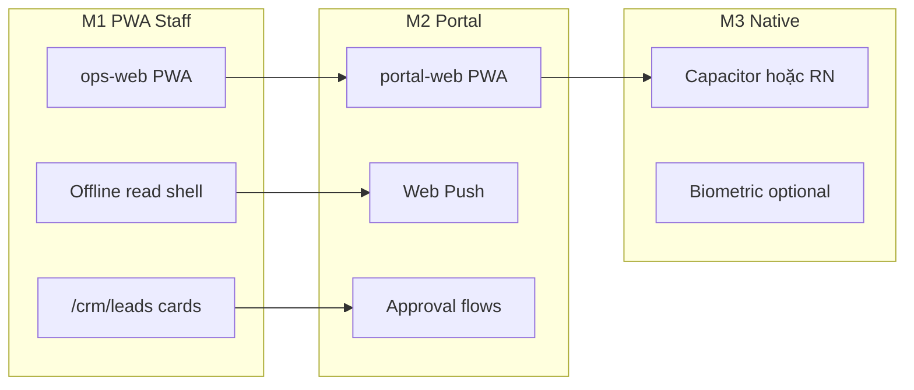
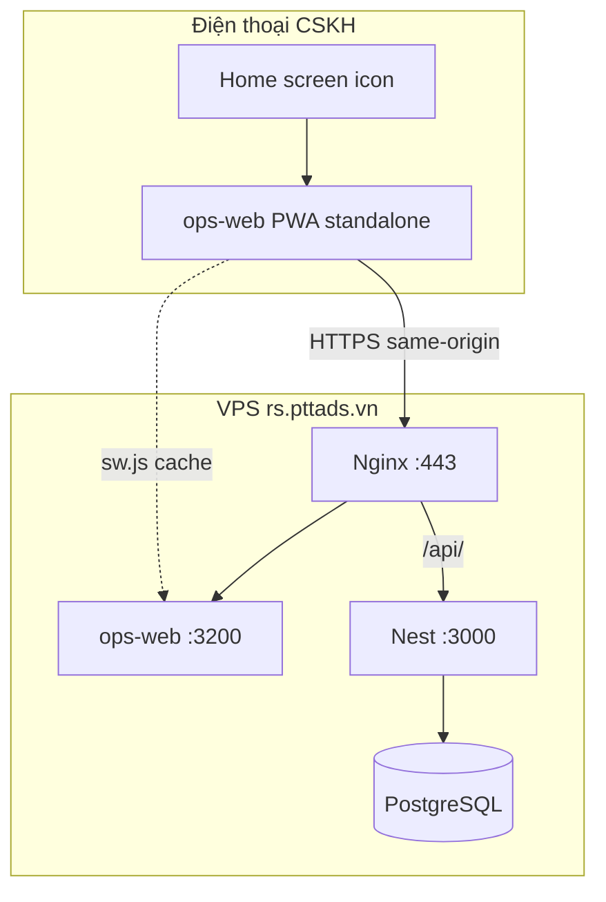
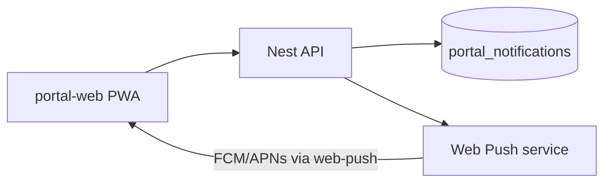

# Phương án & Spec Mobile — RNOSAI

> **Phiên bản:** 1.1 · **Ngày:** 2026-08-01  
> **Owner:** Product + Frontend lead · **Horizon:** R1 (PWA) → R2 (Portal mobile) → Phase 5 (Native)  
> **RNOS liên quan:** RNOS-41 (PWA staff) · RNOS-M1…M3 (wave mobile)  
> **Traceability:** [`crm-getfly-gap-matrix.md`](./crm-getfly-gap-matrix.md) §22 P0-1 · [`2026-07-26-rnosai-system-implementation-plan.md`](./2026-07-26-rnosai-system-implementation-plan.md) §5 · [`SPEC_UI_UX_AI_REVENUE_OS.md`](../SPEC_UI_UX_AI_REVENUE_OS.md) §14 · [`SPEC_AI_REVENUE_OPERATING_SYSTEM.md`](../SPEC_AI_REVENUE_OPERATING_SYSTEM.md) §20.5

---

## Mục lục

1. [Tóm tắt điều hành](#1-tóm-tắt-điều-hành)
2. [Trạng thái hiện tại (as-is)](#2-trạng-thái-hiện-tại-as-is)
3. [Mục tiêu & phạm vi](#3-mục-tiêu--phạm-vi)
4. [Chiến lược & nguyên tắc](#4-chiến-lược--nguyên-tắc)
5. [Kiến trúc mobile](#5-kiến-trúc-mobile)
6. [Lộ trình 3 giai đoạn](#6-lộ-trình-3-giai-đoạn)
7. [MOD-MOBILE — Use case & màn hình](#7-mod-mobile--use-case--màn-hình)
8. [Spec kỹ thuật theo giai đoạn](#8-spec-kỹ-thuật-theo-giai-đoạn)
9. [API & backend](#9-api--backend)
10. [UX/UI & breakpoints](#10-uxui--breakpoints)
11. [Bảo mật & RBAC](#11-bảo-mật--rbac)
12. [Triển khai VPS & vận hành](#12-triển-khai-vps--vận-hành)
13. [Gate & nghiệm thu](#13-gate--nghiệm-thu)
14. [Rủi ro & quyết định kiến trúc](#14-rủi-ro--quyết-định-kiến-trúc)
15. [Tài liệu liên quan](#15-tài-liệu-liên-quan)

---

## 1. Tóm tắt điều hành

RNOSAI **chưa có phân hệ mobile độc lập** (không app native, không repo `services/mobile-*`). Mobile được triển khai theo mô hình **progressive enhancement** trên stack web hiện có:

| Giai đoạn | Tên | Thời gian | Deliverable |
|-----------|-----|-----------|-------------|
| **M1** | PWA Staff Lead Care | R1 (0–3 tháng) | Cài PTT CRM lên màn hình chính — CSKH xem/xử lý lead |
| **M2** | Portal Mobile + Push | R2 (3–9 tháng) | Client approver duyệt creative/email trên điện thoại |
| **M3** | Native / Capacitor | Phase 5 (42+ tháng) | App Store / Play Store khi PWA không đủ |

**North Star mobile:** Giảm **lead response time ≤15 phút** cho CSKH ngoài văn phòng; client approver **duyệt trong 4h** mà không cần laptop.

**Không làm:** Clone Getfly app 12 module; Meta/SEO hub phức tạp trên mobile; ERP trên mobile.



---

## 2. Trạng thái hiện tại (as-is)

### 2.1. Đã có trong code (RNOS-41)

| Thành phần | Path | Gate |
|------------|------|------|
| PWA manifest | `services/ops-web/src/app/manifest.ts` | ✅ |
| Service worker | `services/ops-web/public/sw.js` | ✅ `ptt-ops-pwa-v1` |
| Install banner | `services/ops-web/src/components/pwa/PwaShell.tsx` | ✅ |
| Mobile lead cards | `services/ops-web/src/components/crm/CrmLeadsList.tsx` | ✅ `<768px` |
| CSS responsive | `services/ops-web/src/app/globals.css` § RNOS-41 | ✅ |
| E2E + gate | `e2e/pwa-rnos41.spec.ts`, `scripts/rnos41_pwa_gate.sh` | ✅ 14/14 PASS |

**Production:** PWA **chưa bật mặc định** — build ops-web không set `NEXT_PUBLIC_PWA_ENABLED=1` (xem runbook VPS).

### 2.2. Responsive web (không PWA)

| App | Breakpoint | Phạm vi |
|-----|------------|---------|
| **ops-web** | 768px, 1024px, 1280px | Lead list cards; Copilot drawer/tab; SLA board |
| **portal-web** | 520px | Layout cơ bản; chưa installable |
| **Email module** | 768px | `MobileCampaignCards` — duplicate table |

### 2.3. Chưa có / đang triển khai

| Hạng mục | Trạng thái |
|----------|------------|
| App native iOS/Android store release | ❌ M3 scaffold only |
| `services/mobile-shell` (Capacitor) | ✅ scaffold RNOS-M3 |
| MOD-MOBILE trong BA catalog | ✅ v2.3 — 10 UC + 10 SCR + annex |
| Portal PWA / manifest | ✅ RNOS-M2 (`manifest.ts`, `sw.js`, icons) |
| Web Push subscribe API | ✅ RNOS-M2 (`portal_push_subscriptions` + Nest endpoints) |
| Web Push live send (web-push npm) | ✅ `PortalPushSenderService` wired vào `PortalNotificationService.emit` |
| Offline sync write | ❌ |
| BA SCR deep-spec mobile | ❌ |

### 2.4. RNOS-M2 implementation (2026-08-01)

| Thành phần | Path | Gate |
|------------|------|------|
| Portal manifest | `services/portal-web/src/app/manifest.ts` | ✅ |
| Service worker | `services/portal-web/public/sw.js` | ✅ `ptt-portal-pwa-v1` |
| Install banner | `services/portal-web/src/components/pwa/PortalPwaShell.tsx` | ✅ |
| Mobile bottom nav | `services/portal-web/src/components/PortalMobileBottomNav.tsx` | ✅ `≤768px` |
| Push hook + settings | `hooks/usePortalPush.ts`, `/settings` | ✅ |
| Push API + DDL | `portal-push.*`, `ddl-portal-push-subscriptions.sql` | ✅ |
| E2E + gate | `e2e/pwa-rnos-m2.spec.ts`, `scripts/rnos_m2_portal_pwa_gate.sh` | ✅ |
| M3 Capacitor shell | `services/mobile-shell/` | ✅ scaffold |

**Production:** Portal PWA **chưa bật mặc định** — set `NEXT_PUBLIC_PWA_ENABLED=1` at portal-web build (xem [`m2-portal-pwa-cutover-checklist.md`](../runbooks/m2-portal-pwa-cutover-checklist.md)).

### 2.5. Positioning đã thống nhất

Từ [`docs/handover/01-TONG-QUAN-HE-THONG.md`](../handover/01-TONG-QUAN-HE-THONG.md):

> **Mobile app native:** ❌ Out of scope · **Thay thế:** Responsive web

Từ [`SPEC_AI_REVENUE_OPERATING_SYSTEM.md`](../SPEC_AI_REVENUE_OPERATING_SYSTEM.md) §20.6 FAQ:

> *"Thiếu app mobile?"* → PWA R1; ưu tiên **copilot + SLA board** trước native app.

---

## 3. Mục tiêu & phạm vi

### 3.1. Mục tiêu theo persona

| Persona | Pain point mobile | Mục tiêu đo được |
|---------|-------------------|------------------|
| **CSKH / Sales** | Lead mới lúc đi tuyến, không mở laptop | Response ≤15p; mở lead từ home screen |
| **AM** | Client hỏi KPI — cần xem nhanh portal | Portal dashboard load <3s 4G |
| **Client Approver** | Creative chờ duyệt cuối ngày | Approve/reject trong app ≤4h |
| **Media Buyer / SEO** | Hub phức tạp | **Defer** — tablet/desktop |
| **Admin** | Cấu hình hệ thống | **Out** — desktop only |

### 3.2. In scope (theo giai đoạn)

| Giai đoạn | In scope |
|-----------|----------|
| **M1** | PWA ops-web; `/login`, `/crm/leads`, `/crm/leads/[id]` mobile UX; offline read shell; AI copilot tab mobile |
| **M2** | Portal PWA; `/dashboard`, `/creatives`, `/email/approvals`, `/notifications`; Web Push |
| **M3** | Store listing; push native; biometric login (optional); deep link |

### 3.3. Out of scope (mọi giai đoạn)

| Hạng mục | Lý do |
|----------|-------|
| Meta Ads hub full trên mobile | Desktop-first; quá nhiều cột/filter |
| SEO content editor mobile | Writer dùng desktop |
| Email template studio mobile | Preview only trên portal |
| ERP / payroll / RE project 11 tabs | Enterprise desktop |
| Offline write (tạo lead, gửi email) | Conflict resolution phức tạp — defer M3+ |
| SaaS multi-agency mobile | Out of scope platform |

---

## 4. Chiến lược & nguyên tắc

### 4.1. Chiến lược: PWA-first, API-first, Native-last

1. **Reuse** ops-web / portal-web Next.js — không fork codebase sớm.
2. **Nest API** là single backend — mobile không có BFF riêng giai đoạn M1–M2.
3. **PWA** đủ cho CSKH lead care (parity Getfly P0-1).
4. **Native** chỉ khi: (a) iOS Web Push hạn chế, (b) biometric bắt buộc compliance, (c) store presence yêu cầu sales.

### 4.2. Nguyên tắc UX

| # | Nguyên tắc |
|---|------------|
| M-UX-01 | **Desktop-first B2B** — mobile = subset có chủ đích, không thu nhỏ toàn bộ ops-web |
| M-UX-02 | **Touch target ≥44px** — button, checkbox lead card |
| M-UX-03 | **One primary action per screen** — mobile lead detail: Gọi / Ghi chú / AI brief |
| M-UX-04 | **Offline honest** — banner rõ khi mất mạng; không fake data |
| M-UX-05 | **AI không auto-send** — giữ BR-AI-01 trên mobile (copy draft, không gửi Zalo/email) |
| M-UX-06 | **Same JWT, same RBAC** — không bypass cap trên mobile |

### 4.3. Parity Getfly (P0-1)

Map tới [`crm-getfly-gap-matrix.md`](./crm-getfly-gap-matrix.md) §22:

| Checklist | M1 target | Done when |
|-----------|-----------|-----------|
| 22.1 manifest + icons + install | ✅ RNOS-41 | Lighthouse installable |
| 22.2 Service worker shell + lead read | ✅ RNOS-41 | Offline smoke `/crm/leads` |
| 22.3 `/crm/leads` card list mobile | ✅ RNOS-41 | Screenshot 390px |
| 22.4 RNOS-39 E2E mobile tab AI | ✅ | CI green |

---

## 5. Kiến trúc mobile

### 5.1. M1 — PWA trên ops-web (không service mới)



### 5.2. M2 — Portal PWA + Push



### 5.3. M3 — Native wrapper (tùy chọn)

| Option | Stack | Khi chọn |
|--------|-------|----------|
| **A — Capacitor** | Wrap PWA URL hoặc bundled static | Ship nhanh 6–8 tuần |
| **B — Expo / RN** | `@rnosai/mobile` monorepo | UX native, offline phức tạp |

**Khuyến nghị M3:** Capacitor trước; RN nếu Capacitor không đạt KPI store review.

### 5.4. Không tách phân hệ backend

| Câu hỏi | Quyết định |
|---------|------------|
| `services/mobile-api`? | **Không** M1–M2 |
| GraphQL mobile-only? | **Không** — REST JWT hiện có |
| SQLite on device? | **Không** M1 — cache HTTP only |
| MOD-MOBILE microservice? | **Không** — module logic trong ops-web/portal-web + Nest |

---

## 6. Lộ trình 3 giai đoạn

### 6.1. Tổng quan timeline

| Giai đoạn | RNOS | Tháng | Effort | Phụ thuộc |
|-----------|------|-------|--------|-----------|
| **M1** PWA Staff | RNOS-41 prod cutover | 0–3 | 1–2 sprint | R1 copilot stable |
| **M2** Portal Mobile | RNOS-M2 | 3–9 | 2–3 sprint | Portal approvals prod |
| **M3** Native | RNOS-M3 | 42–60 | 3–6 tháng | M2 KPI, store policy |

### 6.2. M1 — PWA Staff Lead Care (chi tiết)

**Mục tiêu:** CSKH cài PTT CRM từ `rs.pttads.vn`, mở lead trong ≤2 tap.

| Tuần | Milestone | Exit criteria |
|------|-----------|---------------|
| W1 | Prod cutover PWA flag | `NEXT_PUBLIC_PWA_ENABLED=1` staging PASS — `bash scripts/staging_m1_pwa_kickoff.sh` |
| W2 | Pilot 5–8 CSKH | ≥3 user cài home screen |
| W3 | Metrics + fix | Lead open rate mobile ≥20% pilot cohort |
| W4 | Gate sign-off | `rnos41_pwa_gate.sh` + prod smoke |

**Màn hình M1:**

| Route | Mobile UX | Offline |
|-------|-----------|---------|
| `/login` | Form full-width | Cached shell |
| `/crm/leads` | Card list, filter chips scroll | Cached last list (read) |
| `/crm/leads/[id]` | Tab: Chi tiết · AI · Hoạt động | Read cached if visited |
| `/crm/cskh-board` | Read-only SLA tiles | Optional cache |

**Không M1:** Meta hub, SEO, Email studio, bulk import Excel.

### 6.3. M2 — Portal Mobile + Push

**Mục tiêu:** Client approver nhận push “Cần duyệt creative” → approve trong app.

| Deliverable | Mô tả |
|-------------|-------|
| Portal manifest + SW | `portal-web` PWA riêng, `start_url: /dashboard` |
| Bottom nav | Dashboard · Creatives · Approvals · Notifications |
| Web Push | VAPID keys; subscribe on login |
| Notification inbox | `GET /api/v1/portal/notifications` (đã có) |

**UC map:**

| UC hiện có | Mobile priority |
|------------|-----------------|
| PORTAL-UC-003 Dashboard KPI | P0 |
| PORTAL-UC-006 Creative approval | P0 |
| PORTAL-UC-008 Email approval | P0 |
| PORTAL-UC-004 Notifications | P0 |
| PORTAL-UC-010 Export PDF | P1 (share sheet) |
| PORTAL-UC-013 Zalo performance | P2 |

### 6.4. M3 — Native / Store (draft)

**Trigger bắt đầu M3** (cần ≥2 điều kiện):

- PWA portal conversion approve <60% trên iOS Safari
- Khách enterprise yêu cầu App Store presence hợp đồng
- Web Push iOS không đủ reliability

**Scope M3 v1:** Login · Notifications · Creative approve · Email approve · Deep link `pttads://approve/{id}`

---

## 7. MOD-MOBILE — Use case & màn hình

> **Draft BA catalog** — đã promote vào `rnosai_ba_catalog_data.py` v2.3 + [`RNOSAI-BA-MOB-UseCases.md`](modules/RNOSAI-BA-MOB-UseCases.md).

### 7.1. Module definition

| Thuộc tính | Giá trị |
|------------|---------|
| **MOD key** | `MOB` |
| **Tên** | Mobile Experience (cross-cutting) |
| **App** | ops-web PWA (M1) · portal-web PWA (M2) |
| **Actor** | Staff CSKH · Client Approver · Client Viewer |

### 7.2. Use cases (draft)

| UC ID | Tên | Actor | Priority | Giai đoạn | Map route |
|-------|-----|-------|----------|-----------|-----------|
| MOB-UC-001 | Cài PWA staff | CSKH | P0 | M1 | ops-web install |
| MOB-UC-002 | Xem danh sách lead mobile | CSKH | P0 | M1 | `/crm/leads` |
| MOB-UC-003 | Xem chi tiết + AI brief lead | CSKH | P0 | M1 | `/crm/leads/[id]` |
| MOB-UC-004 | Offline đọc lead đã cache | CSKH | P1 | M1 | SW fallback |
| MOB-UC-005 | Cài PWA portal | Approver | P0 | M2 | portal install |
| MOB-UC-006 | Nhận push duyệt creative | Approver | P0 | M2 | Push + `/creatives` |
| MOB-UC-007 | Duyệt email campaign mobile | Approver | P0 | M2 | `/email/approvals` |
| MOB-UC-008 | Xem KPI dashboard mobile | Viewer | P1 | M2 | `/dashboard` |
| MOB-UC-009 | Quản lý subscription push | Approver | P1 | M2 | Settings |
| MOB-UC-010 | Deep link từ email/SMS | Approver | P2 | M3 | Universal link |

### 7.3. Screen catalog (draft SCR)

| SCR ID | Tên | Route / Surface | Giai đoạn | Deep spec |
|--------|-----|-----------------|-----------|-----------|
| SCR-MOB-001 | PWA Install Shell | ops-web global | M1 | RNOS-41 ✅ |
| SCR-MOB-002 | Lead List Mobile | `/crm/leads` @ `<768px` | M1 | RNOS-41 ✅ |
| SCR-MOB-003 | Lead Detail Mobile | `/crm/leads/[id]` @ mobile | M1 | Partial |
| SCR-MOB-004 | CSKH Board Mobile | `/crm/cskh-board` @ mobile | M1 | Backlog |
| SCR-MOB-005 | Portal Install Shell | portal-web global | M2 | RNOS-M2 ✅ |
| SCR-MOB-006 | Portal Dashboard Mobile | `/dashboard` @ mobile | M2 | RNOS-M2 ✅ |
| SCR-MOB-007 | Creative Inbox Mobile | `/creatives` @ mobile | M2 | RNOS-M2 ✅ |
| SCR-MOB-008 | Email Approvals Mobile | `/email/approvals` @ mobile | M2 | RNOS-M2 ✅ |
| SCR-MOB-009 | Notification Center Mobile | `/notifications` @ mobile | M2 | RNOS-M2 ✅ |
| SCR-MOB-010 | Push Settings | `/settings` (push section) | M2 | RNOS-M2 ✅ |

### 7.4. Business rules mobile

| ID | Rule |
|----|------|
| BR-MOB-01 | PWA staff chỉ staff JWT — không dùng portal JWT trên ops-web |
| BR-MOB-02 | Offline: chỉ GET; POST/PATCH hiện banner “Cần mạng” |
| BR-MOB-03 | Push portal scoped tenant — payload không chứa PII subscriber |
| BR-MOB-04 | AI copilot mobile: draft only — BR-AI-01 không đổi |
| BR-MOB-05 | Admin caps (`admin_page_permissions`) áp dụng identical trên mobile viewport |
| BR-MOB-06 | Session timeout mobile = desktop (staff 8h / portal theo policy) |

---

## 8. Spec kỹ thuật theo giai đoạn

### 8.1. M1 — PWA Staff (RNOS-41 prod cutover)

#### 8.1.1. Build & env

```bash
cd /var/www/ptt/services/ops-web
export NEXT_PUBLIC_PTT_API_URL=https://rs.pttads.vn
export NEXT_PUBLIC_PWA_ENABLED=1
npm ci && npm run build
cp -r .next/static .next/standalone/.next/static
sudo systemctl restart ptt-ops-web
```

| Biến | Giá trị prod | Ghi chú |
|------|--------------|---------|
| `NEXT_PUBLIC_PWA_ENABLED` | `1` | `0` tắt install banner + SW register |
| `NEXT_PUBLIC_PTT_API_URL` | `https://rs.pttads.vn` | Same-origin bắt buộc |

#### 8.1.2. Manifest (`manifest.ts`)

| Field | Giá trị | Ghi chú |
|-------|---------|---------|
| `name` | PTT CRM Ops | |
| `short_name` | PTT CRM | |
| `start_url` | `/crm/leads` | Mở thẳng lead list |
| `display` | `standalone` | Ẩn browser chrome |
| `orientation` | `portrait-primary` | |
| `theme_color` | `#398b43` | Khớp `--theme-color` |
| `icons` | `/icons/icon.svg` | Cần thêm PNG 192/512 cho iOS (backlog M1.1) |

#### 8.1.3. Service worker (`sw.js`)

| Behavior | Spec |
|----------|------|
| Cache name | `ptt-ops-pwa-v1` — bump khi breaking |
| Precache | `/crm/leads`, `/login` |
| Static | `/_next/static/*` cache-first |
| Navigate | Network-first; fallback cached `/crm/leads` |
| Offline body | `503` text/plain VN |
| **Không cache** | `/api/*` — luôn network |

#### 8.1.4. Lead list mobile (`CrmLeadsList`)

| Viewport | Component |
|----------|-----------|
| `≥769px` | `.crm-leads-table-wrap` table |
| `≤768px` | `.crm-leads-cards` card list |

Card fields: tên, ID, SĐT, status badge, AI score (nếu bật), ngày, link detail.

#### 8.1.5. Lead detail mobile (SCR-MOB-003)

**Deep spec:** [`modules/RNOSAI-BA-MOB-SCR-003-004-deep-spec.md`](modules/RNOSAI-BA-MOB-SCR-003-004-deep-spec.md) §1.

Breakpoints (`useLeadDetailLayout`): desktop `≥1280`, tablet `1024–1279`, mobile `<1024` (khác lead list `768px`).

| Viewport | Copilot UX |
|----------|------------|
| `≥1280px` | Inline column 380px |
| `1024–1279px` | FAB → right drawer |
| `<1024px` | Tab bar **Chi tiết · Hoạt động · AI** (full-width tab, không bottom sheet) |

| Tab | Content | API |
|-----|---------|-----|
| Chi tiết | DL fields + status/assign/activity forms + Copy SĐT/Zalo | `GET /api/crm/leads/:id` + patch/assign |
| Hoạt động | Activity list + entity timeline + audit | activities/audit endpoints |
| AI | `LeadCopilotPanel` (Score, Brief, Summarize, Follow-up draft) | `/api/v1/ai/*` — network required |

**As-is ✅:** tabs + drawer + copilot + `tel:` Gọi + offline copilot banner. **P2 optional:** bottom-sheet overlay tab AI.

#### 8.1.7. CSKH board mobile (SCR-MOB-004) — backlog M1.2

**Deep spec:** [`modules/RNOSAI-BA-MOB-SCR-003-004-deep-spec.md`](modules/RNOSAI-BA-MOB-SCR-003-004-deep-spec.md) §2.

| Viewport | Layout |
|----------|--------|
| `≥769px` | Table `.data-table` (as-is) |
| `≤768px` | **Target:** `.cskh-board-cards` + sticky SLA chips + filter accordion |

API reuse: `GET /api/crm/cskh-board`, bulk assign/reschedule, export CSV. Tap card → `/crm/leads/[id]`. Không Kanban — list/card theo `sla_state`.

#### 8.1.6. Nginx requirements

```nginx
# sw.js — không cache aggressive từ CDN
location = /sw.js {
    add_header Cache-Control "no-cache";
    proxy_pass http://127.0.0.1:3200;
}

location = /manifest.webmanifest {
    proxy_pass http://127.0.0.1:3200;
}
```

Verify: `curl -sf https://rs.pttads.vn/sw.js | head -1`

### 8.2. M2 — Portal PWA + Push (RNOS-M2)

#### 8.2.1. Portal manifest (new)

```typescript
// services/portal-web/src/app/manifest.ts (draft)
{
  name: 'PTT Client Portal',
  short_name: 'PTT Portal',
  start_url: '/dashboard',
  display: 'standalone',
  theme_color: '#1a3a5c',
}
```

#### 8.2.2. Portal service worker (new)

| Behavior | Khác ops-web |
|----------|--------------|
| Precache | `/dashboard`, `/login`, `/notifications` |
| API | Không offline write |
| Push | `push` event → `showNotification` + click → route |

#### 8.2.3. Web Push backend (new Nest endpoints)

| Method | Path | Mô tả |
|--------|------|-------|
| `GET` | `/api/v1/portal/push/vapid-public-key` | Client subscribe |
| `POST` | `/api/v1/portal/push/subscribe` | Lưu subscription JSON |
| `DELETE` | `/api/v1/portal/push/subscribe` | Unsubscribe |
| `POST` | `/api/v1/portal/push/test` | Admin test (non-prod) |

**DB table (draft):** `portal_push_subscriptions (user_id, endpoint, p256dh, auth, created_at)`

**Trigger push:** extend `PortalCreativeNotifyService`, `portal-notification.service` — gọi web-push sau khi insert notification.

#### 8.2.4. Portal mobile layout

| Breakpoint | Nav |
|------------|-----|
| `≥769px` | Sidebar hiện tại |
| `≤768px` | Bottom bar: Home · Creatives · Approvals · Alerts |

### 8.3. M3 — Native (RNOS-M3 draft)

| Component | Capacitor | React Native |
|-----------|-----------|--------------|
| Auth | WebView JWT cookie | Secure storage |
| Push | FCM via Capacitor Push | expo-notifications |
| Deep link | `@capacitor/app` | React Navigation linking |
| Biometric | `@capacitor-community/biometric` | expo-local-authentication |
| Release | 2–3 tuần wrap | 3–6 tháng greenfield |

---

## 9. API & backend

### 9.1. API tái sử dụng (M1 — không endpoint mới)

| Nhóm | Endpoints | Auth |
|------|-----------|------|
| Staff auth | `POST /api/v1/staff/auth/login` | JWT staff |
| Leads | `GET /api/v1/leads`, `GET /api/v1/leads/:id` | Staff cap `crm_leads` |
| AI | `GET/POST /api/v1/ai/*` | Pilot cohort flag |
| Timeline | `GET /api/v1/customer-timeline/*` | Staff |

### 9.2. API mới (M2)

| Endpoint | Module | Priority |
|----------|--------|----------|
| Push subscribe/unsubscribe | `portal/push` | P0 |
| `PATCH /api/v1/portal/notifications/:id/read` | existing | P0 mobile UX |
| Device metadata header | `X-PTT-Client: pwa-portal/1.0` | P1 analytics |

### 9.3. API mới (M3 — optional)

| Endpoint | Mô tả |
|----------|-------|
| `POST /api/v1/mobile/device-token` | FCM/APNs native token |
| `POST /api/v1/staff/auth/refresh` | Refresh token rotation |
| `GET /api/v1/mobile/config` | Feature flags, min version |

### 9.4. Headers client (analytics)

```http
X-PTT-Client: pwa-ops/1.0
X-PTT-Viewport: 390x844
```

---

## 10. UX/UI & breakpoints

### 10.1. Breakpoints chuẩn RNOSAI mobile

| Token | Width | App |
|-------|-------|-----|
| `mobile-sm` | ≤390px | iPhone SE — test E2E |
| `mobile` | ≤768px | Phone — card views |
| `tablet` | 769–1023px | iPad portrait — tabs |
| `desktop` | ≥1024px | Full layout |

### 10.2. Copilot trên mobile (AI Revenue OS)

Theo [`SPEC_UI_UX_AI_REVENUE_OS.md`](../SPEC_UI_UX_AI_REVENUE_OS.md) §14:

| BP | Copilot |
|----|---------|
| ≥1280 | Fixed column 380px |
| 1024–1279 | Collapsible drawer |
| 768–1023 | Tab “AI” full width |
| **<768 PWA** | **Bottom sheet**; SLA board ưu tiên hơn AI |

Offline: banner *“Copilot cần kết nối mạng”* — không cache LLM responses.

### 10.3. Portal mobile patterns (M2)

| Pattern | Component |
|---------|-----------|
| KPI tiles | 2-col grid, scroll vertical |
| Approval card | Swipe optional (P2); primary Approve/Reject buttons |
| PDF export | Web Share API `navigator.share` |
| Preview email | Tab Desktop / Mobile 320px (reuse ops-web pattern) |

### 10.4. Accessibility mobile

| Requirement | Implementation |
|-------------|----------------|
| Touch target | min 44×44px |
| Focus visible | outline on card links |
| Screen reader | `aria-label` on lead cards |
| Color | Score hot/warm/cold + text label (BR-AI-02) |

---

## 11. Bảo mật & RBAC

### 11.1. Authentication

| App | Mechanism | Storage |
|-----|-----------|---------|
| ops-web PWA | Staff JWT (httpOnly cookie hoặc memory + refresh) | Không localStorage JWT nếu avoid XSS |
| portal PWA | Portal JWT | Same as desktop |
| Native M3 | Secure storage / Keychain | Capacitor Preferences encrypted |

### 11.2. PWA security

| Risk | Mitigation |
|------|------------|
| XSS steal token | CSP headers; sanitize; httpOnly cookie preferred |
| SW cache sensitive API | **Never** cache `/api/*` |
| Install prompt phishing | Chỉ `rs.pttads.vn` / `portal.pttads.vn` official |
| Lost device | Session timeout; remote logout (M2 backlog) |

### 11.3. Push payload

| Field | Allowed | Forbidden |
|-------|---------|-----------|
| title | "Creative cần duyệt" | Tên khách hàng đầy đủ |
| body | "Campaign #123" | Email subscriber list |
| data | `{ type, entity_id, tenant_id }` | PII, tokens |

---

## 12. Triển khai VPS & vận hành

### 12.1. M1 prod cutover checklist

| # | Bước | OK |
|---|------|-----|
| 1 | Staging build `NEXT_PUBLIC_PWA_ENABLED=1` | ✅ `deploy/env.staging-m1-pwa.example` |
| 2 | `bash scripts/staging_m1_pwa_kickoff.sh` PASS | ✅ **16/16** (2026-08-01, + PNG icons) |
| 2b | RNOS-41.1 PNG icons 192/512 | ✅ `scripts/generate_ops_pwa_icons.py` |
| 3 | Lighthouse PWA ≥ installable (rs staging) | ☐ — checklist §5.3 |
| 4 | Nginx serve `/sw.js`, `/manifest.webmanifest` | ☐ — proxy ops-web OK mặc định |
| 5 | Prod build + restart `ptt-ops-web` | ☐ — [`m1-pwa-prod-cutover-checklist.md`](../runbooks/m1-pwa-prod-cutover-checklist.md) |
| 6 | Smoke: Android Chrome “Add to Home screen” | ☐ |
| 7 | Smoke: iOS Safari “Add to Home Screen” | ☐ |
| 8 | Pilot 5 CSKH 2 tuần | ☐ |

### 12.2. Monitoring mobile

| Metric | Nguồn | Target M1 |
|--------|-------|-----------|
| PWA install rate | Analytics event `pwa_install_accepted` | ≥30% pilot |
| Mobile lead opens | `X-PTT-Client: pwa-ops` | ≥20% lead views |
| Offline fallback hits | SW log / Sentry breadcrumb | <5% sessions |
| API error rate mobile | Sentry tag `client:pwa-ops` | ≤ desktop +2% |

### 12.3. Rollback M1

```bash
# Tắt PWA — không cần revert code
export NEXT_PUBLIC_PWA_ENABLED=0
# rebuild ops-web + restart
sudo systemctl restart ptt-ops-web
```

SLA rollback: **≤5 phút** (rebuild + restart).

---

## 13. Gate & nghiệm thu

### 13.1. Gate M1 (RNOS-41 prod)

```bash
cd /var/www/ptt
bash scripts/rnos41_pwa_gate.sh
# Artifact: .local-dev/rnos41-pwa-gate-report.json
```

| Check | Pass |
|-------|------|
| manifest HTTP 200 | ✅ |
| sw.js contains `ptt-ops-pwa-v1` | ✅ |
| Playwright 390px cards visible | ✅ |
| ops-web typecheck | ✅ |

### 13.2. Gate M2 (RNOS-M2 — draft)

| Check | Command / criteria |
|-------|-------------------|
| Portal manifest | HTTP 200 `/manifest.webmanifest` |
| Push subscribe E2E | Playwright approve flow + mock push |
| Cross-tenant 403 | Existing portal security tests |
| Lighthouse portal mobile | Performance ≥70 mobile |

Script đề xuất: `scripts/rnos_m2_portal_mobile_gate.sh` (tạo khi kickoff M2).

### 13.3. UAT manual M1

| # | Scenario | Pass |
|---|----------|------|
| 1 | CSKH cài PWA Android | ☐ |
| 2 | Mở lead từ home screen → detail | ☐ |
| 3 | Airplane mode → lead list cached | ☐ |
| 4 | Airplane mode → AI shows offline banner | ☐ |
| 5 | Lead mới webhook → refresh list online | ☐ |

---

## 14. Rủi ro & quyết định kiến trúc

### 14.1. Rủi ro

| Rủi ro | Mức | Mitigation |
|--------|-----|------------|
| iOS PWA hạn chế push | Cao | M2 web-push Android first; iOS in-app notifications; M3 native |
| CSKH dùng mobile cho task phức tạp | Trung bình | UX guard: hide Meta/SEO nav `<768px` |
| SW cache stale data | Trung bình | Network-first navigate; short TTL banner “Dữ liệu có thể cũ” |
| Split codebase native sớm | Cao | Capacitor before RN; API-first |
| Pilot PWA không adopt | Trung bình | Training 30p; KPI response time |

### 14.2. ADR tóm tắt

| ADR | Quyết định | Status |
|-----|------------|--------|
| ADR-MOB-01 | PWA-first, không native M1–M2 | **Accepted** |
| ADR-MOB-02 | Không `mobile-api` service | **Accepted** |
| ADR-MOB-03 | Offline read-only M1 | **Accepted** |
| ADR-MOB-04 | Capacitor trước RN cho M3 | **Proposed** — [`adr-mob-04-capacitor-before-rn.md`](./adr-mob-04-capacitor-before-rn.md) · accept Phase 0 |

### 14.3. Backlog RNOS IDs

| RNOS | Mô tả | Wave |
|------|-------|------|
| RNOS-41 | PWA staff lead care | M1 ✅ code |
| RNOS-41.1 | PNG icons 192/512 + iOS meta | M1 |
| RNOS-41.2 | Lead detail mobile bottom sheet | M1 |
| RNOS-M2 | Portal PWA + push | M2 |
| RNOS-M2.1 | Bottom nav portal | M2 |
| RNOS-M3 | Capacitor store pilot | M3 |

---

## 15. Tài liệu liên quan

| Tài liệu | Nội dung |
|----------|----------|
| [`crm-getfly-gap-matrix.md`](./crm-getfly-gap-matrix.md) §22 | Parity P0-1 PWA checklist |
| [`2026-07-26-ai-phase1-90-day-plan.md`](./2026-07-26-ai-phase1-90-day-plan.md) | PWA stretch R1 |
| [`2026-07-26-rnosai-system-implementation-plan.md`](./2026-07-26-rnosai-system-implementation-plan.md) §5 | Phase 5 native |
| [`SPEC_UI_UX_AI_REVENUE_OS.md`](../SPEC_UI_UX_AI_REVENUE_OS.md) §14 | Responsive copilot |
| [`SPEC_AI_REVENUE_OPERATING_SYSTEM.md`](../SPEC_AI_REVENUE_OPERATING_SYSTEM.md) §20.5–20.6 | Parity & FAQ mobile |
| [`../runbooks/rnosai-vps-operations-guide.md`](../runbooks/rnosai-vps-operations-guide.md) | Deploy ops-web prod |
| [`../handover/03-HUONG-DAN-PORTAL-KHACH-HANG.md`](../handover/03-HUONG-DAN-PORTAL-KHACH-HANG.md) | Portal user flows |
| `services/ops-web/e2e/pwa-rnos41.spec.ts` | E2E reference |
| `scripts/rnos41_pwa_gate.sh` | Gate M1 |

---

## Phụ lục A — So sánh phương án mobile

| Tiêu chí | Responsive only | PWA (M1–M2) | Native (M3) |
|----------|-----------------|-------------|-------------|
| Time to market | ✅ Done | 1–2 sprint | 3–6 tháng |
| Home screen | ❌ | ✅ | ✅ |
| Offline read | ❌ | ✅ limited | ✅ extensible |
| Push iOS | ❌ | ○ limited | ✅ |
| Store presence | ❌ | ❌ | ✅ |
| Maintenance | Low | Low | High |
| **RNOSAI chọn** | Baseline | **M1–M2 primary** | M3 optional |

## Phụ lục B — Wireframe Lead List Mobile (390px)

```text
┌─────────────────────────────┐
│ ☰  Leads · trang 1      🔍  │
├─────────────────────────────┤
│ ┌─ Cài PTT CRM ───────────┐ │
│ │ Thêm vào màn hình chính │ │
│ └─────────────────────────┘ │
├─────────────────────────────┤
│ ┌─────────────────────────┐ │
│ │ Nguyễn Văn A      HOT 78│ │
│ │ #1042 · 090xxx · Meta   │ │
│ │ new · 2026-08-01        │ │
│ └─────────────────────────┘ │
│ ┌─────────────────────────┐ │
│ │ Trần Thị B       WARM 52│ │
│ │ #1041 · 091xxx · Zalo   │ │
│ └─────────────────────────┘ │
├─────────────────────────────┤
│        ‹ 1 / 5 ›            │
└─────────────────────────────┘
```

---

*RNOSAI Mobile Strategy Spec v1.0 — cập nhật khi kickoff M2 hoặc thay đổi ADR native.*
