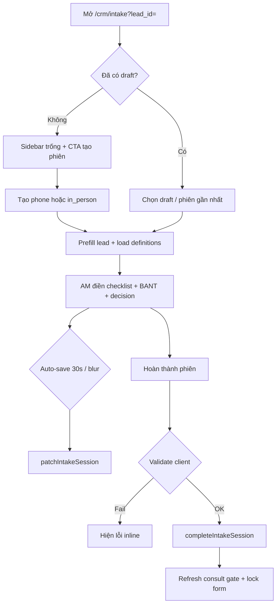

# Spec Phase 1 — Khảo sát BANT Intake UI chuyên nghiệp

> **Document ID:** INT-P1-20260804  
> **Phiên bản:** 1.0 · **Ngày:** 2026-08-04  
> **Trạng thái:** **Approved** — PO sign-off 2026-08-04 · sẵn sàng dev Epic E1  
> **Parent:** [`2026-06-30-lead-intake-system-design.md`](2026-06-30-lead-intake-system-design.md) · [`sales-b2b-lead-client-onboard-sop.md`](../runbooks/sales-b2b-lead-client-onboard-sop.md)  
> **Surface:** ops-web `/crm/intake?lead_id=` · `/crm/intake?lifecycle_id=`  
> **Horizon:** 1–2 sprint (~10–12 dev days)

---

## Mục lục

1. [Tóm tắt](#1-tóm-tắt)
2. [Mục tiêu & phạm vi](#2-mục-tiêu--phạm-vi)
3. [Hiện trạng vs mục tiêu](#3-hiện-trạng-vs-mục-tiêu)
4. [Wireframe](#4-wireframe)
5. [Kiến trúc UI & component](#5-kiến-trúc-ui--component)
6. [Dữ liệu & API](#6-dữ-liệu--api)
7. [Quy tắc nghiệp vụ](#7-quy-tắc-nghiệp-vụ)
8. [Backlog task](#8-backlog-task)
9. [UAT & Definition of Done](#9-uat--definition-of-done)
10. [Rollout & đo lường](#10-rollout--đo-lường)

---

## 1. Tóm tắt

Trang **Khảo sát BANT "BANT Intake"** hiện là MVP: ghi liên hệ, nhu cầu, 6 ô số BANT, quyết định. **Phase 1** nâng lên mức **đủ dùng hàng ngày cho AM/Sales B2B** mà **không mở scope Phase 2** (stakeholder matrix, cam kết KH, form 12 dịch vụ, red flags checklist đầy đủ).

**Deliverable Phase 1:**

- Layout 3 khối + sidebar lịch sử phiên
- Script khảo sát theo mode Gọi / Gặp (checklist câu hỏi từ definitions API)
- BANT radio 1–5 + tổng /30 + badge gợi ý Go/Nurture/No-Go
- Auto-save + validate trước Hoàn thành
- Prefill context từ lead
- Hiển thị AI summary + Consult gate banner
- Mobile usable (1 cột, sidebar → drawer)

**Nguyên tắc:** tái sử dụng API Nest hiện có; chỉ thêm API nếu bắt buộc (dự kiến **0 endpoint mới**).

---

## 2. Mục tiêu & phạm vi

### 2.1 Mục tiêu (IN)

| # | Mục tiêu | KPI thành công |
|---|----------|-----------------|
| G1 | AM hoàn thành phiên không cần tra SOP giấy | ≥80% phiên có ≥8/12 câu checklist tick (mode phone) |
| G2 | BANT có chất lượng audit | ≥90% phiên completed có đủ 6 tiêu chí >0 |
| G3 | Giảm mất dữ liệu | 0 báo cáo “quên Lưu nháp” sau auto-save |
| G4 | Rõ bước tiếp theo | 100% phiên completed hiển thị consult gate level |

### 2.2 Out of scope Phase 1

- Stakeholder matrix, 3 cam kết KH, red flags checklist riêng (→ Phase 2)
- Chọn form theo 12 `service_slug` (giữ `_common` mặc định)
- Ghi âm / transcription
- Export PDF phiên
- TipTap / upload ảnh (giữ `RichTextField` hiện tại)
- Block lifecycle PATCH Consult từ intake page
- Thay đổi ngưỡng BANT code (giữ 24/18 trong `GO_THRESHOLDS`)

---

## 3. Hiện trạng vs mục tiêu

| Khả năng | Hiện tại | Phase 1 |
|----------|----------|---------|
| Tạo phiên Gọi / Gặp | ✅ | ✅ + confirm nếu đang có draft |
| Rich text nhu cầu | ✅ | ✅ giữ nguyên |
| BANT scoring | Ô number 0–5 | Radio 1–5 + hint + live total |
| Câu hỏi qualify | ❌ | Checklist từ `GET /definitions/:slug` |
| Lịch sử phiên | Auto chọn draft | Sidebar chọn phiên |
| Auto-save | ❌ | Debounce 30s + on blur |
| Prefill lead | ❌ | Banner context lead |
| AI summary | Nút tạo, không hiển thị | Panel đọc `ai_summary` |
| Consult gate | Chỉ trên lead funnel | Banner trên intake (lead_id) |
| Validate complete | ❌ | Client + reuse server rules |
| Mobile | Form dài 1 cột | Sidebar drawer + sticky actions |

**Files hiện tại (baseline):**

- UI: `services/ops-web/src/app/crm/intake/IntakeContent.tsx`
- Labels: `services/ops-web/src/lib/crm/intake-labels.ts`
- Rich text: `services/ops-web/src/components/crm/RichTextField.tsx`
- API client: `services/ops-web/src/lib/api.ts` (intake + lead fetch)
- Definitions: `services/ptt-crm-api/src/intake/intake-definitions.util.ts`
- Gate: `presales-consult-gate.util.ts` · `GET /api/v1/leads/:id/presales/consult-gate`

---

## 4. Wireframe

### 4.1 Desktop (≥1024px) — layout 2 cột

```text
┌─────────────────────────────────────────────────────────────────────────────┐
│ CRM › Khảo sát BANT "BANT Intake"                    [← Lead #12345]        │
│ Phiên qualify lead B2B — Ngân sách, Thẩm quyền, Nhu cầu, Thời hạn           │
├──────────────────────┬──────────────────────────────────────────────────────┤
│ PHIÊN (sidebar)      │  [Consult gate banner — nếu lead_id]                 │
│                      │  ✓ OK chuyển Tư vấn · BANT 26/30 · Go                  │
│ [+ Gọi điện]         │  ─ hoặc ─                                            │
│ [+ Gặp trực tiếp]    │  ⚠ Nurture — cần xác nhận trước Consult              │
│                      │                                                      │
│ ● #3 Gặp · Nháp      │  ┌─ A. Ngữ cảnh lead ─────────────────────────────┐   │
│   BANT 0/30          │  │ Trần Hùng Anh · 090… · nguồn: referral        │   │
│ ○ #2 Gọi · HT        │  │ Công ty: (prefill nếu có) · Owner AM: …       │   │
│ ○ #1 Gọi · HT        │  └───────────────────────────────────────────────┘   │
│                      │                                                      │
│ 2 phiên · BANT 0/30  │  ┌─ B. Khảo sát (theo mode) ─────────────────────┐   │
│                      │  │ ▼ Hướng dẫn sử dụng (details)                  │   │
│                      │  │ Liên hệ "Contact" [________________]           │   │
│                      │  │ Nhu cầu / điểm đau "Need/Pain" [RichText────]  │   │
│                      │  │                                                │   │
│                      │  │ Câu hỏi gợi ý — Gặp trực tiếp "In person"      │   │
│                      │  │ ☐ Mục tiêu KD 6–12 tháng?                      │   │
│                      │  │ ☐ ICP khách hàng lý tưởng?                       │   │
│                      │  │ ☐ … (10 câu từ definitions)                     │   │
│                      │  │ Ghi chú discovery [________________________]   │   │
│                      │  └───────────────────────────────────────────────┘   │
│                      │                                                      │
│                      │  ┌─ C. BANT + Quyết định ─────────────────────────┐   │
│                      │  │  Tổng: 22/30  [Nuôi dưỡng "Nurture" badge]     │   │
│                      │  │  Ngân sách "Budget"     (1)(2)(3)(4)(5) hint   │   │
│                      │  │  Thẩm quyền "Authority" …                      │   │
│                      │  │  … 6 hàng                                      │   │
│                      │  │  Quyết định "Decision" [▼ Tiếp tục "Go"]       │   │
│                      │  │  Lý do "Reason"     [________________]         │   │
│                      │  └───────────────────────────────────────────────┘   │
│                      │                                                      │
│                      │  ┌─ D. AI tóm tắt ────────────────────────────────┐   │
│                      │  │ (trống) · [Tóm tắt AI "AI Summary"]            │   │
│                      │  └───────────────────────────────────────────────┘   │
│                      │                                                      │
│                      │  [Lưu nháp] [Hoàn thành phiên]     Đã lưu 15:04 ✓   │
└──────────────────────┴──────────────────────────────────────────────────────┘
```

### 4.2 Mobile (<768px)

```text
┌─────────────────────────────┐
│ Khảo sát BANT               │
│ [← Lead]  [≡ Phiên #3 ▼]    │  ← drawer chọn phiên
├─────────────────────────────┤
│ Consult gate banner         │
│ A. Ngữ cảnh (collapsed)     │
│ B. Khảo sát                 │
│ C. BANT (sticky total bar)  │
│ D. AI summary               │
├─────────────────────────────┤
│ [Lưu] [Hoàn thành]  sticky  │
└─────────────────────────────┘
```

### 4.3 Luồng tương tác (mermaid)



### 4.4 Modal validate trước Hoàn thành

```text
┌──────────────────────────────────────┐
│ Hoàn thành phiên #3?                 │
│                                      │
│ BANT: 22/30 · Gợi ý: Nurture         │
│ Quyết định: Nuôi dưỡng "Nurture"     │
│ Checklist: 7/10 câu đã tick          │
│                                      │
│ ⚠ Chưa tick ≥8 câu khảo sát          │
│ ⚠ Lý do quyết định trống               │
│                                      │
│        [Quay lại]  [Vẫn hoàn thành]  │
└──────────────────────────────────────┘
```

---

## 5. Kiến trúc UI & component

### 5.1 Component tree (ops-web)

```text
IntakeContent (page shell — refactor)
├── IntakeSessionSidebar
│   ├── IntakeCreateSessionButtons
│   └── IntakeSessionListItem × N
├── IntakeLeadContextCard          (lead_id only)
├── IntakeConsultGateBanner        (lead_id only, reuse gate API)
├── IntakeDiscoverySection
│   ├── IntakeHelpDetails          (existing)
│   ├── IntakeContactFields
│   ├── RichTextField              (need/pain)
│   └── IntakeDiscoveryChecklist   (phone | in_person questions)
├── IntakeBantSection
│   ├── IntakeBantTotalBar
│   └── IntakeBantScoreRow × 6     (radio 1–5)
├── IntakeDecisionFields
├── IntakeAiSummaryPanel
└── IntakeFormActions              (save / complete / sticky footer)
```

### 5.2 File plan

| File | Hành động |
|------|-----------|
| `app/crm/intake/IntakeContent.tsx` | Refactor orchestration |
| `components/crm/intake/IntakeSessionSidebar.tsx` | **Mới** |
| `components/crm/intake/IntakeBantSection.tsx` | **Mới** |
| `components/crm/intake/IntakeDiscoveryChecklist.tsx` | **Mới** |
| `components/crm/intake/IntakeConsultGateBanner.tsx` | **Mới** |
| `components/crm/intake/IntakeLeadContextCard.tsx` | **Mới** |
| `components/crm/intake/IntakeAiSummaryPanel.tsx` | **Mới** |
| `lib/crm/intake-labels.ts` | Mở rộng BANT level labels |
| `lib/crm/intake-validation.ts` | **Mới** — rules client |
| `lib/crm/intake-autosave.ts` | **Mới** — debounce hook |
| `app/globals.css` | Styles sidebar, BANT radio, sticky bar |

### 5.3 Copy & i18n

Giữ convention: **Tiếng Việt + "English" trong dấu ngoặc kép** (đã có trong `intake-labels.ts`).

Bổ sung:

| Key | Label UI |
|-----|----------|
| `bant_total` | Tổng BANT {n}/30 |
| `suggest_go` | Gợi ý: Tiếp tục "Go" |
| `suggest_nurture` | Gợi ý: Nuôi dưỡng "Nurture" |
| `suggest_no_go` | Gợi ý: Từ chối "No-Go" |
| `autosaved` | Đã lưu tự động {time} |
| `checklist_progress` | Đã hỏi {n}/{total} câu |

---

## 6. Dữ liệu & API

### 6.1 API tái sử dụng (không đổi contract)

| Method | Path | Dùng cho |
|--------|------|----------|
| GET | `/api/crm/intake/definitions` | Stats header |
| GET | `/api/crm/intake/definitions/_common` | `phone_questions`, `inperson_questions`, `bant_rows` |
| GET | `/api/crm/intake/sessions?lead_id=` | Sidebar list |
| POST | `/api/crm/intake/sessions` | Tạo phiên |
| PATCH | `/api/crm/intake/sessions/:id` | Auto-save + manual save |
| POST | `/api/crm/intake/sessions/:id/complete` | Hoàn thành |
| POST | `/api/crm/intake/sessions/:id/reopen` | Mở lại |
| POST | `/api/crm/intake/sessions/:id/ai-summary` | Tóm tắt AI |
| GET | `/api/v1/leads/:id` | Prefill context |
| GET | `/api/v1/leads/:id/presales/consult-gate` | Gate banner |

### 6.2 `answers_json` schema mở rộng (backward compatible)

Lưu qua `PATCH` field `answers_json` — **không cần migration DDL**.

```json
{
  "crm_fields": {
    "need": "<p>HTML rich text</p>"
  },
  "discovery_checklist": {
    "mode": "in_person",
    "checked": {
      "0": true,
      "3": true,
      "7": true
    },
    "notes": "Khách nhấn mạnh deadline Tết campaign"
  }
}
```

- Key `checked` map index → boolean (index theo thứ tự `inperson_questions` hoặc `phone_questions`).
- Phiên cũ không có `discovery_checklist` → UI coi là 0/total, không lỗi.

### 6.3 Prefill lead → session fields

Khi tạo phiên mới với `lead_id`:

| Lead field | Session field |
|------------|---------------|
| `full_name` | `contact_name` (nếu trống) |
| `source` | `source` |
| meta company | `company_name` (nếu có trong meta) |

Không ghi đè khi AM đã nhập.

### 6.4 Optional API tweak (chỉ nếu cần — P2 trong backlog)

| Thay đổi | Lý do | Ưu tiên |
|----------|-------|---------|
| `GET /sessions/:id` | Tránh reload full list khi chọn phiên | Nice-to-have |
| Server validate checklist trước complete | Parity client/server | Phase 1.1 |

---

## 7. Quy tắc nghiệp vụ

### 7.1 BANT scoring

- Mỗi tiêu chí: **1–5** (radio); 0 = chưa chấm (cảnh báo vàng).
- `bant_total` = sum(values) — **server tính lại** on PATCH (đã có).
- Badge gợi ý (client, không ép):

| Tổng | Badge |
|------|-------|
| ≥ 24 | Tiếp tục "Go" (xanh) |
| 18–23 | Nuôi dưỡng "Nurture" (vàng) |
| < 18 | Từ chối "No-Go" (đỏ) |

- Nếu **Quyết định** lệch badge (vd. chọn Go nhưng BANT 16) → warn inline, không block.

### 7.2 Validate trước Hoàn thành

| Rule | Mức | Hành vi |
|------|-----|---------|
| `contact_name` trống | Error | Block complete |
| BANT có tiêu chí = 0 | Warn | Confirm dialog |
| `decision` trống | Error | Block complete |
| `decision` = no_go hoặc nurture & `decision_reason` trống | Error | Block complete |
| Checklist < 8/{total} (phone) hoặc < 6/{total} (in_person) | Warn | Confirm dialog |
| `need` rich text trống | Warn | Confirm dialog |

### 7.3 Auto-save

- Debounce **30s** sau thay đổi cuối.
- Save on **blur** của section BANT / decision.
- Chỉ khi `status === 'draft'` và user có cap `crm_leads.edit`.
- Hiển thị: `Đã lưu tự động HH:mm` / `Đang lưu…` / `Lỗi lưu — thử lại`.
- Không auto-save khi đang mở confirm complete.

### 7.4 Tạo phiên mới

- Nếu đã có phiên `draft` → confirm: *“Đang có phiên nháp #N. Tạo phiên mới?”* (giữ draft cũ).

### 7.5 Consult gate banner (lead_id)

Reuse response `GET presales/consult-gate`:

| `level` | UI |
|---------|-----|
| `ok` | Banner xanh + link “Quay lead → chuyển Tư vấn” |
| `warn` | Banner vàng + messages |
| `block` | Banner đỏ + messages |

Không thực hiện advance stage từ intake page (chỉ deep link về `/crm/leads/:id`).

---

## 8. Backlog task

Ước lượng: **1 dev full-time ≈ 10–12 ngày** (+ 2 ngày QA/UAT).

### Epic E1 — Layout & navigation (2.5d)

| ID | Task | AC | Est |
|----|------|----|-----|
| INT-P1-01 | Refactor `IntakeContent` → layout 2 cột desktop | Sidebar + main; mobile 1 cột | 1d |
| INT-P1-02 | `IntakeSessionSidebar` — list phiên, highlight active | Click đổi phiên; hiển thị mode/status/BANT | 1d |
| INT-P1-03 | Confirm khi tạo phiên mới while draft exists | Dialog; draft cũ vẫn trong list | 0.5d |

### Epic E2 — Lead context & gate (1.5d)

| ID | Task | AC | Est |
|----|------|----|-----|
| INT-P1-04 | `IntakeLeadContextCard` — fetch lead prefill | Tên, SĐT, email, source, owner, link detail | 0.5d |
| INT-P1-05 | Prefill `contact_name`/`source` on create session | Không overwrite nếu AM đã gõ | 0.5d |
| INT-P1-06 | `IntakeConsultGateBanner` — gate API | 3 levels màu; refresh sau complete | 0.5d |

### Epic E3 — Discovery checklist (2.5d)

| ID | Task | AC | Est |
|----|------|----|-----|
| INT-P1-07 | Load `GET definitions/_common` theo `active.mode` | phone → `phone_questions`; in_person → `inperson_questions` | 0.5d |
| INT-P1-08 | `IntakeDiscoveryChecklist` — tick + progress | Lưu `answers_json.discovery_checklist` | 1d |
| INT-P1-09 | Ghi chú discovery (textarea ngắn) | Optional field trong checklist block | 0.5d |
| INT-P1-10 | Collapse/expand section B theo mode | Đổi mode (nếu cho phép patch) reload câu hỏi | 0.5d |

### Epic E4 — BANT chuyên nghiệp (2d)

| ID | Task | AC | Est |
|----|------|----|-----|
| INT-P1-11 | `IntakeBantScoreRow` — radio 1–5 + hint từ `bant_rows` | Thay input number | 1d |
| INT-P1-12 | `IntakeBantTotalBar` — live total + badge Go/Nurture/No-Go | Cập nhật realtime; sync `bant_json` PATCH | 0.5d |
| INT-P1-13 | Warn khi decision lệch badge | Inline message, không block save | 0.5d |

### Epic E5 — Auto-save & validation (2d)

| ID | Task | AC | Est |
|----|------|----|-----|
| INT-P1-14 | Hook `useIntakeAutosave` debounce 30s | Indicator trạng thái; skip khi completed | 1d |
| INT-P1-15 | `intake-validation.ts` + confirm modal complete | Rules §7.2; dialog warn/error | 1d |

### Epic E6 — AI summary & polish (1.5d)

| ID | Task | AC | Est |
|----|------|----|-----|
| INT-P1-16 | `IntakeAiSummaryPanel` — render `ai_summary` | Empty state + nút tạo/regenerate | 0.5d |
| INT-P1-17 | Sticky action bar mobile + keyboard safe area | Lưu/Hoàn thành luôn visible | 0.5d |
| INT-P1-18 | CSS polish: sidebar, BANT grid, banners | Match `page-card` / brand tokens | 0.5d |

### Epic E7 — QA & docs (1.5d)

| ID | Task | AC | Est |
|----|------|----|-----|
| INT-P1-19 | Playwright smoke `e2e/intake-bant-phase1.spec.ts` | Tạo phiên → chấm BANT → complete | 1d |
| INT-P1-20 | Cập nhật `docs/crm/huong-dan-day-du-lead-den-cham-soc-khach-hang.md` § Intake | Screenshot wireframe + checklist AM | 0.5d |

### Dependency graph

```text
INT-P1-01 → INT-P1-02 → INT-P1-03
INT-P1-04 → INT-P1-05 → INT-P1-06
INT-P1-07 → INT-P1-08 → INT-P1-10
INT-P1-11 → INT-P1-12 → INT-P1-13
INT-P1-14, INT-P1-15 (song song sau E3/E4)
INT-P1-16 → INT-P1-17 → INT-P1-18 → INT-P1-19
```

### RNOS / UC trace

| Backlog | RNOS / UC |
|---------|-----------|
| E1–E5 | CRM-UC-005 · Pre-sales intake |
| INT-P1-06 | Consult gate · `presales-consult-gate.util` |
| INT-P1-19 | MOB-UC-003 partial (mobile layout) |

---

## 9. UAT & Definition of Done

### 9.1 UAT scenarios

| # | Scenario | Steps | Expected |
|---|----------|-------|----------|
| U1 | Tạo phiên gọi điện | Lead #X → intake → + Gọi | Sidebar #N draft; 12 câu phone |
| U2 | Auto-save | Sửa BANT, chờ 30s | “Đã lưu tự động”; F5 giữ data |
| U3 | Chọn phiên cũ | Click phiên completed | Form read-only; summary hiện |
| U4 | Complete thiếu decision | Bấm Hoàn thành | Block + message |
| U5 | Complete Nurture thiếu lý do | decision=nurture, reason trống | Block |
| U6 | Complete warn checklist | Tick 3/12, confirm | Completed; gate refresh |
| U7 | Consult gate | Complete Go BANT≥24 | Banner xanh trên intake + lead |
| U8 | Mobile | iPhone width 390px | Drawer phiên; sticky actions |

### 9.2 Definition of Done (release)

- [ ] 20 backlog INT-P1-* done hoặc deferred có lý do PO
- [ ] `npm run build` ops-web pass
- [ ] Playwright INT-P1-19 pass trên staging
- [ ] Không regression: complete intake → consult gate trên lead funnel
- [ ] PO walkthrough 30 phút với 1 AM pilot
- [ ] Deploy ops-web VPS + hard refresh verified

---

## 10. Rollout & đo lường

### 10.1 Rollout

1. **Dev** — feature flag `NEXT_PUBLIC_INTAKE_P1_UI=1` (optional, default on after QA)
2. **Pilot** — 2 AM B2B, 1 tuần
3. **GA** — bật prod; giữ help details 2 tuần

### 10.2 Metrics (30 ngày post-GA)

| Metric | Nguồn | Target |
|--------|-------|--------|
| `intake_coverage_pct` | `GET /intake/stats` | +15% vs baseline |
| Avg `bant_total` completed | PG `crm_lead_intake_sessions` | ≥ 20 |
| % phiên có checklist ≥8 | `answers_json.discovery_checklist` | ≥ 70% |
| Time draft → completed (median) | `completed_at - created_at` | ≤ 48h |
| Auto-save error rate | client log / Sentry | < 1% |

### 10.3 Rủi ro

| Rủi ro | Giảm thiểu |
|--------|------------|
| Auto-save conflict 2 tab | Last-write-wins + toast “Phiên đã cập nhật nơi khác” |
| Checklist quá dài — AM bỏ qua | Warn không block; Phase 2 rút gọn theo dịch vụ |
| Rich text paste Word xấu | Phase 1 chấp nhận; Phase 3 TipTap sanitize |

---

## Phụ lục A — Tham chiếu câu hỏi (form chung)

Nguồn: `intake-definitions.util.ts` → `COMMON_FORM.phone_qs` (12 câu), `inperson_qs` (10 câu). UI hiển thị **nguyên văn tiếng Việt** từ API; không hardcode duplicate trong ops-web.

## Phụ lục B — PO sign-off

| Vai trò | Tên | Ngày | OK |
|---------|-----|------|-----|
| Product (PO) | Quoc Tuan | 2026-08-04 | ☑ |
| Sales lead | — | — | ☐ (không chặn dev Phase 1) |
| Dev lead | — | — | ☐ (kickoff E1) |

**Quyết định PO (2026-08-04):**

- Phê duyệt **Phase 1** đúng phạm vi spec — không mở stakeholder / cam kết KH / 12 form dịch vụ.
- Giữ ngưỡng BANT gợi ý **24 / 18** (Go / Nurture); không đổi gate server trong Phase 1.
- Checklist khảo sát: **warn** nếu &lt;8 câu (phone) hoặc &lt;6 câu (in_person) — AM vẫn có thể Hoàn thành sau confirm.
- Auto-save **30s** + indicator trạng thái — bắt buộc trước GA.
- **Bắt đầu dev:** Epic **E1** (INT-P1-01 → 03), sau đó E2–E7 theo dependency graph §8.

---

*Changelog:*  
*v1.0 — Initial Phase 1 spec (2026-08-04).*  
*v1.0 approved — PO sign-off Quoc Tuan (2026-08-04).*
