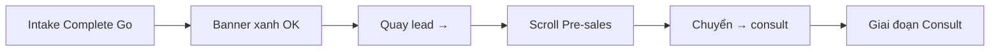
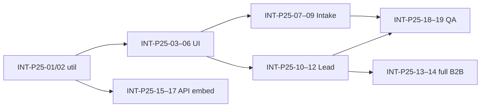

# Spec Phase 2.5 — Funnel Stepper đầy đủ (Intake → Consult handoff)

> **Document ID:** INT-P25-20260805  
> **Phiên bản:** 1.2 · **Ngày:** 2026-08-05  
> **Trạng thái:** **Signed-off** — scope E1–E4 + E7 (PO §16, 2026-08-05); E5/E6 deferred  
> **Parent:** [`2026-08-04-intake-bant-phase1-professional-ui-design.md`](2026-08-04-intake-bant-phase1-professional-ui-design.md) · [`2026-08-04-intake-bant-phase2-structured-discovery-design.md`](2026-08-04-intake-bant-phase2-structured-discovery-design.md)

---

## 1. Tóm tắt

Phase 2.5 giải quyết **ma sát handoff Intake → Consult**: AM thấy banner xanh trên Intake nhưng không biết bước tiếp theo, phải quay Lead → Pre-sales → bấm **Chuyển → consult**.

**Deliverable:** một **Funnel Stepper thống nhất** — hiển thị trên cả **Lead detail** và **trang Intake**, gom gate + hành động chuyển bước vào một thanh tiến trình, thay thế 3 UI rời rạc hiện tại.

**Không mở:** auto-advance Consult sau Complete (Phase 3); form 12 dịch vụ; thay đổi ngưỡng BANT gate server.

---

## 2. Vấn đề hiện tại

### 2.1 Ba stepper/banner không đồng bộ

| UI hiện tại | File | Phạm vi | Hạn chế |
|-------------|------|---------|---------|
| Badge stepper inline | `LeadFunnelPanel.tsx` | B2 → Lead → Consult → Proposal | Không có bước **Intake**; styling inline |
| Luồng B2B bar | `LeadB2bSalesFlowBar.tsx` | B2 → Pre-sales → Intake → HĐ → TK → Agency | Logic `intake` vs `presales` chồng chéo; không có gate/advance |
| Consult gate banner | `IntakeConsultGateBanner.tsx` | Chỉ Intake | Chỉ link **Quay lead →**; trùng gate trên Lead panel |

### 2.2 Hành trình AM thực tế (pain)



**4 màn hình / 4 thao tác** cho một chuyển bước đã được gate xác nhận.

### 2.3 Gate đã ổn — UX chưa

Server gate (`presales-consult-gate.util.ts`, sync task Lead khi Intake Go) **đúng**. Phase 2.5 chỉ **trình bày và điều hướng** gate, không đổi rule G2/G3.

---

## 3. Mục tiêu & phạm vi

### 3.1 Mục tiêu (G1–G5)

| ID | Mục tiêu | Đo lường |
|----|----------|----------|
| G1 | Một mental model funnel trên Lead + Intake | 100% màn có `lead_id` dùng cùng component |
| G2 | Bước **Intake BANT** hiển thị rõ trên stepper | Step riêng giữa Pre-sales Lead và Consult |
| G3 | Hành động **Chuyển → Consult** tại stepper khi gate OK | ≤2 click từ Intake complete → Consult stage |
| G4 | Gộp gate banner trùng lặp | Xóa `IntakeConsultGateBanner` + gate box trong `LeadFunnelPanel` |
| G5 | Mobile usable | Stepper cuộn ngang; CTA sticky khi gate OK |

### 3.2 Out of scope Phase 2.5

- Auto-advance Consult sau Hoàn thành phiên (Phase 3, feature flag)
- Lifecycle stepper Onboard → Deliver → Retain (giữ link từ `LeadB2bSalesFlowBar` hoặc phase sau)
- Thay đổi ngưỡng BANT 24/18 hoặc rule No-Go override
- Refactor toàn bộ `LeadFunnelPanel` task forms (chỉ thay stepper + gate strip)

---

## 4. Mô hình bước (canonical steps)

### 4.1 Presales scope (Phase 2.5 core)

Dùng cho **Intake page** và **panel Pre-sales** trên Lead:

| `step_key` | Label UI | Map backend | Ghi chú |
|------------|----------|-------------|---------|
| `b2` | B2 Liên hệ | `care_pipeline.all_complete` | Gate G1 |
| `presales_lead` | Pre-sales Lead | `presales.stage === 'lead'` | Task Lead stage |
| `intake_bant` | Khảo sát BANT | Intake session + consult gate | Sub-step khi stage=lead |
| `consult` | Tư vấn | `presales.stage === 'consult'` | Gate G4 downstream |
| `proposal` | Báo giá | `presales.stage === 'proposal'` | KH MKT sơ bộ |

### 4.2 Full B2B scope (Phase 2.5.1 — optional cùng release nếu ≤2d thêm)

Mở rộng từ presales scope (thay thế `LeadB2bSalesFlowBar`):

| `step_key` | Label | Nguồn state |
|------------|-------|-------------|
| `contract` | HĐ dịch vụ | `LeadContractPanel` summary |
| `delivery` | Triển khai | `lifecycle_id` + delivery URL |
| `agency` | Agency Client | post-onboard |

**Quyết định PO đề xuất:** ship **presales scope** trước (INT-P25 E1–E4); full B2B scope refactor `LeadB2bSalesFlowBar` → wrapper gọi cùng primitive (E5, có thể defer 3–5 ngày).

### 4.3 Trạng thái bước

```typescript
type FunnelStepState = 'done' | 'current' | 'pending' | 'blocked' | 'warn';
```

| State | Visual | Ý nghĩa |
|-------|--------|---------|
| `done` | ✓ xanh | Bước hoàn thành |
| `current` | ● xanh đậm | AM đang làm ở đây |
| `pending` | ○ xám | Chưa tới |
| `blocked` | ! đỏ | Review queue / gate hard block |
| `warn` | △ vàng | Gate warn (Nurture, BANT 18–23) — vẫn có thể advance với confirm |

---

## 5. Logic resolve state (single source)

### 5.1 File util mới

`services/ops-web/src/lib/crm/funnel-stepper.util.ts`

**Input:**

```typescript
interface FunnelStepperInput {
  funnel: LeadFunnelSnapshot | null;
  consultGate: ConsultGateState | null;      // GET consult-gate
  intakeSummary?: IntakeStepSummary | null;  // optional, from intake page
  contract?: LeadContractFlowSummary | null; // full scope only
  context: 'lead_detail' | 'intake' | 'compact';
}
```

**IntakeStepSummary** (client, từ phiên active / list sessions):

```typescript
interface IntakeStepSummary {
  has_draft: boolean;
  latest_completed?: {
    id: number;
    decision: string;
    bant_total: number;
    completed_at: string;
  };
}
```

### 5.2 Quy tắc `intake_bant` step

| Điều kiện | State |
|-----------|-------|
| `presales` chưa tạo hoặc B2 chưa xong | `pending` |
| `presales.stage >= consult` | `done` |
| `presales.stage === 'lead'` + có phiên `completed` Go/Nurture/No-Go | `warn` hoặc `done`* |
| `presales.stage === 'lead'` + phiên `draft` | `current` |
| `presales.stage === 'lead'` + chưa có phiên | `current` (CTA: tạo phiên) |
| `review_queue.active` | `blocked` |

\* `done` khi `consultGate.ok && level === 'ok'`; `warn` khi gate warn; `current` khi completed nhưng gate block (thiếu task Lead).

### 5.3 Active step (highlight)

Priority:

1. Nếu `context === 'intake'` → `intake_bant` (trừ khi `blocked`)
2. Else map `presales.stage`: `lead` → `presales_lead` hoặc `intake_bant` (ưu tiên `intake_bant` nếu chưa có completed session)
3. B2 chưa xong → `b2`

### 5.4 Primary action (CTA trên stepper)

| Active step | Gate | CTA primary | Hành vi |
|-------------|------|-------------|---------|
| `b2` | B2 incomplete | **Hoàn thành B2 →** | Anchor `#funnel-b2` |
| `presales_lead` | no presales | **Bắt đầu pre-sales** | Trigger ensure (Lead panel only) |
| `intake_bant` | no session | **+ Tạo phiên Intake** | Sidebar create (Intake) / link Intake (Lead) |
| `intake_bant` | draft | **Tiếp tục khảo sát** | Focus form |
| `intake_bant` | completed + gate OK | **Chuyển → Tư vấn** | `POST presales/advance` |
| `intake_bant` | completed + gate warn | **Chuyển → Tư vấn (xác nhận)** | confirm modal + advance |
| `intake_bant` | completed + gate block | Disabled + tooltip | Hiện `gate.messages[0]` |
| `consult` | tasks incomplete | **Mở task Consult** | Anchor tasks |
| `consult` | stage complete | **Chuyển → Báo giá** | advance (existing) |

**Quan trọng:** CTA **Chuyển → Tư vấn** gọi cùng API và confirm logic như `LeadFunnelPanel` (Nurture, BANT thấp, Director override).

---

## 6. Kiến trúc UI

### 6.1 Component tree

```text
CrmFunnelStepper/                    (new)
├── CrmFunnelStepper.tsx             — orchestrator
├── CrmFunnelStepTrack.tsx           — horizontal step list
├── CrmFunnelStepItem.tsx            — single step (link / button / static)
├── CrmFunnelStepGateStrip.tsx       — messages + meta BANT under active step
├── CrmFunnelStepPrimaryAction.tsx   — sticky CTA bar
└── funnel-stepper.css               — tokens (reuse .lead-b2b-step where possible)

lib/crm/funnel-stepper.util.ts       — resolveStepStates, resolvePrimaryAction
lib/crm/funnel-stepper.types.ts      — shared types
```

### 6.2 Layout — Lead detail

```text
┌─ Lead header ─────────────────────────────────────────────────────────────┐
│ CrmFunnelStepper scope=presales (hoặc full_b2b)                          │
│  [✓ B2] — [● Pre-sales Lead] — [○ Intake] — [○ Tư vấn] — [○ Báo giá]     │
│  Gate strip: (chỉ khi active step có gate)                               │
│  [ Chuyển → Tư vấn ]  (primary action)                                   │
├─ LeadFunnelPanel (stepper badge CŨ removed) ──────────────────────────────┤
│  B2 card …                                                                │
│  Pre-sales card … tasks … advance button CŨ removed (dùng stepper CTA)   │
└───────────────────────────────────────────────────────────────────────────┘
```

**Deprecate:** badge `funnel-stepper` inline trong `LeadFunnelPanel` (lines ~281–307); gate box consult (~642–663); nút **Chuyển →** riêng (~664–698) → chuyển lên `CrmFunnelStepper`.

### 6.3 Layout — Intake page

```text
┌─ Sidebar phiên ──┬─ Main ────────────────────────────────────────────────┐
│                  │ A. Ngữ cảnh lead                                     │
│                  │ CrmFunnelStepper scope=presales context=intake         │
│                  │  (fetch funnel + consult gate; intakeSummary local)    │
│                  │  Gate strip + [ Chuyển → Tư vấn ] khi OK             │
│                  │  (THAY IntakeConsultGateBanner)                        │
│                  │ B–G. Form Intake …                                     │
└──────────────────┴───────────────────────────────────────────────────────┘
```

**Sticky mobile:** `CrmFunnelStepPrimaryAction` fixed bottom khi `gate.ok && context=intake`.

### 6.4 Wireframe ASCII (desktop)

```text
  ✓ B2 Liên hệ ──── ● Khảo sát BANT ──── ○ Tư vấn ──── ○ Báo giá
                           │
                    BANT 30/30 · Go
                    Sẵn sàng chuyển Tư vấn
                    [ Làm mới ]  [ Chuyển → Tư vấn ]
```

---

## 7. API & data

### 7.1 Phase 2.5 — client compose (MVP)

Không bắt buộc đổi API Nest:

| Nguồn | Endpoint | Dùng cho |
|-------|----------|----------|
| Funnel | `GET /api/v1/leads/:id/funnel` | B2, presales stage, advance metadata |
| Consult gate | `GET /api/v1/leads/:id/presales/consult-gate` | Gate strip + enable CTA |
| Advance | `POST /api/v1/leads/:id/presales/advance` | Chuyển Consult |
| Intake | state local `IntakeContent` | draft/completed sessions |

**Intake page load:** parallel `fetchLeadFunnel` + `fetchLeadPresalesConsultGate` (đã có `loadConsultGate`).

### 7.2 Phase 2.5.1 — server embed (khuyến nghị)

Mở rộng `LeadFunnelSnapshot` (Nest + ops-web types):

```typescript
funnel_stepper?: {
  schema_version: 1;
  presales_steps: Array<{
    key: string;
    label: string;
    state: FunnelStepState;
    href?: string;
  }>;
  active_step: string;
  consult_gate: ConsultAdvanceGateResult; // reuse util output
  intake_hint?: {
    latest_completed_session_id?: number;
    decision?: string;
    bant_total?: number;
  };
  primary_action?: {
    kind: 'link' | 'advance_presales' | 'none';
    label: string;
    disabled: boolean;
    block_reason?: string;
    requires_confirm?: boolean;
  };
};
```

**Lợi ích:** Intake mobile app / SDK sau này; một request thay vì 2; QA so sánh server vs client.

**Implementation:** `buildSnapshot()` gọi `buildConsultAdvanceGate` + query latest intake session.

---

## 8. Hành vi gate & advance (parity)

Giữ nguyên `validatePresalesConsultAdvance`:

| Decision | BANT | Stepper gate level | CTA |
|----------|------|-------------------|-----|
| Go | ≥24 | `ok` | Enable **Chuyển → Tư vấn** |
| Go | 18–23 | `warn` | Enable + confirm |
| Go | <18 | `warn` | Enable + confirm |
| Nurture | any | `warn` | Enable + confirm |
| No-Go | any | `block` | Disable; link Director override flow (Lead) |
| — | — | block | Thiếu task Lead / chưa Intake completed |

**Sau advance thành công:**

- Toast: *Đã chuyển giai đoạn Tư vấn*
- Stepper refresh; active step → `consult`
- Intake page: link **Mở task Consult trên Lead →** (`/crm/leads/{id}#funnel-presales`)

**Director override:** modal nhập `override_reason` (chỉ khi `requires_override`) — reuse pattern từ Lead panel nếu có, hoặc thêm modal mới INT-P25-08.

---

## 9. Accessibility & responsive

| Yêu cầu | AC |
|---------|-----|
| `nav` + `aria-label="Tiến trình pre-sales lead"` | Stepper là landmark |
| Active step | `aria-current="step"` |
| Gate messages | `aria-live="polite"` trên gate strip |
| Keyboard | Tab qua từng step link; Enter activate CTA |
| Mobile `<768px` | Track `overflow-x: auto`; label rút gọn (B2 / Intake / TV / BG) |
| Sticky CTA | `padding-bottom` on main để không che form |

Reuse CSS tokens từ `.lead-b2b-flow__*` trong `globals.css` — tránh duplicate palette.

---

## 10. Migration & cleanup

| Cũ | Mới | Ghi chú |
|----|-----|---------|
| `IntakeConsultGateBanner.tsx` | `CrmFunnelStepGateStrip` | Xóa file sau migrate |
| Badge stepper `LeadFunnelPanel` | `CrmFunnelStepper` on Lead page | Lead page mount stepper **trên** panel |
| Gate box Pre-sales trong panel | Gate strip on stepper | Xóa duplicate |
| Nút **Chuyển →** trong panel | Primary action stepper | Giữ block_reason tooltip |
| `LeadB2bSalesFlowBar` | `CrmFunnelStepper scope=full_b2b` | E5 — có thể giữ wrapper 1 release |

**Feature flag (optional):** `NEXT_PUBLIC_FUNNEL_STEPPER_P25=1` — default on sau UAT.

---

## 11. Backlog task

Ước lượng: **1 dev ≈ 8–10 ngày** (+ 2 ngày QA/UAT).

### Epic E1 — Util & types (1.5d)

| ID | Task | AC | Est |
|----|------|----|-----|
| INT-P25-01 | `funnel-stepper.types.ts` + `funnel-stepper.util.ts` | Unit tests 15+ cases: B2 block, intake current, gate ok/warn/block | 1d |
| INT-P25-02 | Jest parity với `presales-consult-gate.util.spec` scenarios | CTA enable/disable khớp server | 0.5d |

### Epic E2 — Component stepper (2.5d)

| ID | Task | AC | Est |
|----|------|----|-----|
| INT-P25-03 | `CrmFunnelStepTrack` + `CrmFunnelStepItem` | 5 states màu; link Intake/B2 anchor | 1d |
| INT-P25-04 | `CrmFunnelStepGateStrip` | 3 tone ok/warn/block; BANT meta | 0.5d |
| INT-P25-05 | `CrmFunnelStepPrimaryAction` | advance + confirm + disabled tooltip | 0.5d |
| INT-P25-06 | `CrmFunnelStepper` orchestrator + CSS | props: token, leadId, funnel, gate, context | 0.5d |

### Epic E3 — Tích hợp Intake (2d)

| ID | Task | AC | Est |
|----|------|----|-----|
| INT-P25-07 | `IntakeContent`: fetch funnel + mount stepper | Thay `IntakeConsultGateBanner` | 1d |
| INT-P25-08 | Advance Consult từ Intake + override modal | POST advance; refresh funnel+gate | 0.5d |
| INT-P25-09 | Refresh stepper sau Complete session | Gate + step state cập nhật ≤2s | 0.5d |

### Epic E4 — Tích hợp Lead detail (2d)

| ID | Task | AC | Est |
|----|------|----|-----|
| INT-P25-10 | Lead `[id]/page.tsx`: mount `CrmFunnelStepper` | Trên `LeadFunnelPanel`; pass funnelSnap | 0.5d |
| INT-P25-11 | `LeadFunnelPanel`: remove old stepper/gate/advance btn | Panel gọn; CTA chỉ trên stepper | 1d |
| INT-P25-12 | Deep link `#funnel-presales` + scroll after advance | Từ Intake → Lead tasks | 0.5d |

### Epic E5 — Full B2B scope (**deferred**, optional, 2d)

> **PO §16 (2026-08-05):** **Defer** — giữ `LeadB2bSalesFlowBar` song song với presales stepper; refactor `scope=full_b2b` khi có nhu cầu lifecycle bar thống nhất (backlog **INT-P25.2-E5**).

| ID | Task | AC | Est | Trạng thái |
|----|------|----|-----|------------|
| INT-P25-13 | `scope=full_b2b`: contract/delivery/agency steps | Thay `LeadB2bSalesFlowBar` internals | 1.5d | Deferred |
| INT-P25-14 | Deprecate duplicate bar hoặc thin wrapper | 1 component tree | 0.5d | Deferred |

### Epic E6 — API embed (**deferred**, optional, 2d)

> **PO §16 (2026-08-05):** **Defer** — client `funnel-stepper.util` + 27 unit tests đủ cho release; embed Nest snapshot khi phát sinh lệch client/server hoặc mobile shell (backlog **INT-P25.2-E6**).

| ID | Task | AC | Est | Trạng thái |
|----|------|----|-----|------------|
| INT-P25-15 | Nest `funnel_stepper` in `buildSnapshot` | schema_version 1 | 1d | Deferred |
| INT-P25-16 | ops-web consume embedded stepper when present | Fallback client util | 0.5d | Deferred |
| INT-P25-17 | pytest snapshot stepper fields | TC-B03 extended | 0.5d | Deferred |

### Epic E7 — QA & docs (1.5d)

| ID | Task | AC | Est |
|----|------|----|-----|
| INT-P25-18 | Playwright `e2e/intake-bant-phase25-stepper.spec.ts` | INT-P25 U1–U6 | 1d |
| INT-P25-19 | Update runbook §6 + huong-dan §16 ma trận màn hình | Stepper thay banner | 0.5d |

### Dependency graph



---

## 12. UAT scenarios

| # | Scenario | Steps | Expected |
|---|----------|-------|----------|
| U1 | Intake Go BANT≥24 | Complete phiên | Step `intake_bant` warn→ok; CTA **Chuyển → Tư vấn** enable |
| U2 | One-click Consult | Bấm CTA trên Intake | `presales.stage=consult`; toast success |
| U3 | Nurture confirm | decision=nurture, advance | Confirm modal; vẫn chuyển được |
| U4 | Block thiếu Intake | Presales lead, chưa complete | CTA disabled; message rõ |
| U5 | Lead page parity | Cùng lead, mở Lead | Stepper state giống Intake |
| U6 | Review queue | Lead in review | Stepper `blocked`; CTA hidden |
| U7 | Mobile Intake | 390px width | Sticky CTA; horizontal scroll steps |
| U8 | After Consult | Advance xong từ Intake | Link mở task Consult trên Lead |

---

## 13. Definition of Done

- [x] INT-P25-01 → INT-P25-12 done (E5/E6 deferred — PO §16.1)
- [x] `npm run build` ops-web pass (2026-08-05)
- [x] `funnel-stepper.util.spec.ts` (27 tests) + Playwright INT-P25-18 pass (6/7; U6 skip review queue)
- [x] Runbook §6 + ma trận §16 cập nhật (INT-P25-19)
- [ ] Không regression: `intake-bant-phase1/phase2` e2e pass
- [x] `IntakeConsultGateBanner` removed; không còn duplicate gate box trên panel
- [ ] PO walkthrough 20 phút với AM pilot (lead #900000002 hoặc tương đương)
- [ ] Deploy ops-web VPS + hard refresh verified

---

## 14. Rollout & metrics

### 14.1 Rollout

1. **Dev/staging** — flag `NEXT_PUBLIC_FUNNEL_STEPPER_P25=1`
2. **Pilot** — 2 AM B2B, 1 tuần; thu feedback CTA wording
3. **GA** — default on; giữ help details Intake 2 tuần

### 14.2 Metrics (30 ngày post-GA)

| Metric | Nguồn | Target |
|--------|-------|--------|
| Median time Intake completed → Consult stage | PG `stage_entered_at` consult − intake `completed_at` | **−50%** vs baseline |
| % Go sessions stuck >24h chưa Consult | KPI query | **<10%** |
| CTA **Chuyển → Tư vấn** clicks from Intake vs Lead | client event (optional) | ≥60% from Intake |
| Support tickets “không biết chuyển Tư vấn” | manual tag | **0** pilot week |

---

## 15. Rủi ro

| Rủi ro | Giảm thiểu |
|--------|------------|
| Client/server state lệch | E6 embed snapshot; test parity INT-P25-02 |
| AM advance nhầm từ Intake | Giữ confirm cho warn; không auto-advance |
| Lead page quá dài | Stepper sticky top optional (phase 2.5.2) |
| SPA không có funnel khi lifecycle-only | Stepper ẩn khi `!presales_on_lead_enabled` |

---

## 16. Quyết định PO

| # | Quyết định | Đề xuất | **PO (2026-08-05)** |
|---|------------|---------|---------------------|
| D1 | Scope release | E1–E4 + E7 bắt buộc; E5/E6 optional | **Approved** — ship presales stepper; defer E5/E6 |
| D2 | Auto-advance | **Không** — AM bấm CTA (giữ kiểm soát) | **Approved** |
| D3 | Wording CTA | **Chuyển → Tư vấn** (thống nhất Lead + Intake) | **Approved** |
| D4 | Xóa banner cũ | Có — sau U1 pass | **Approved** — đã xóa banner + gate panel |
| D5 | B2B full bar | Defer E5 nếu cần ship ≤1 tuần | **Approved defer** — giữ `LeadB2bSalesFlowBar` |

### 16.1 Defer E5 / E6 (backlog Phase 2.5.2)

| Epic | Lý do defer | Trigger bật lại | Backlog |
|------|-------------|-----------------|---------|
| **E5** Full B2B bar | Presales handoff (Intake→Consult) đã đủ giá trị; bar lifecycle HĐ→TK→Agency vẫn hoạt động | AM phản hồi 2 bar gây rối; hoặc refactor lifecycle UX | INT-P25.2-E5 (P25-13/14) |
| **E6** API embed | Không có bug parity client/server trong UAT | Lệch state stepper giữa Intake/Lead/mobile; hoặc bỏ fetch funnel riêng | INT-P25.2-E6 (P25-15/16/17) |

**Acceptance defer:** E5/E6 không chặn GA Phase 2.5; ghi rõ trong release note và training AM (chỉ dùng stepper pre-sales, bar B2B phía trên vẫn hiện).

---

## Phụ lục A — Mapping gate doc §16

| Gate | Stepper step | UI |
|------|--------------|-----|
| G1 B2 | `b2` | pending/block đến khi care complete |
| G2 Task Lead + Intake Go | `intake_bant` → CTA Consult | gate strip |
| G3 No-Go / BANT | `intake_bant` | warn/block trên strip |
| G4 KH MKT sơ bộ | `consult` → `proposal` | CTA Chuyển → Báo giá (existing) |

## Phụ lục B — PO sign-off

| Vai trò | Tên | Ngày | OK |
|---------|-----|------|-----|
| Product (PO) | Quoc Tuan | 2026-08-05 | ☑ Scope E1–E4 + E7; defer E5/E6 (§16.1) |
| Sales lead | — | — | ☐ (optional trước GA) |
| Dev lead | — | — | ☐ (optional — code review done in-session) |

**Phạm vi ký:** Funnel Stepper presales (Intake + Lead handoff Consult). **Không** gồm E5 full B2B bar, E6 API embed.

---

*Changelog:*  
*v1.0 — Initial Phase 2.5 Funnel Stepper spec (2026-08-05).*  
*v1.1 — INT-P25-19: runbook §6 + huong-dan §16 ma trận stepper (2026-08-05).*  
*v1.2 — PO sign-off §16 + defer E5/E6 backlog INT-P25.2 (2026-08-05).*
