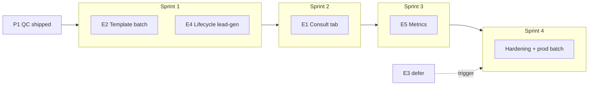

# Spec P2 — Pre-sales Ecosystem (Consult workspace · Template · Lifecycle · Metrics)

> **Document ID:** PS-P2-20260805  
> **Phiên bản:** 1.1 · **Ngày:** 2026-08-05  
> **Trạng thái:** **Signed-off** — PO Q1–Q5 (2026-08-05); **S1 unblocked**  
> **Parent:** [`2026-07-26-consult-phase3-presales-lead-design.md`](./2026-07-26-consult-phase3-presales-lead-design.md) · [`2026-08-05-intake-bant-phase25-funnel-stepper-design.md`](./2026-08-05-intake-bant-phase25-funnel-stepper-design.md) · [`2026-08-05-lead-gen-presales-workflow-design.md`](./2026-08-05-lead-gen-presales-workflow-design.md)  
> **Prerequisite:** P1 agency QC (L2 checklist, SLA 48h, validation ✓ Consult, discovery prefill, proposal handoff) — shipped local

---

## Mục lục

1. [Tóm tắt](#1-tóm-tắt)
2. [Hiện trạng vs mục tiêu P2](#2-hiện-trạng-vs-mục-tiêu-p2)
3. [Phạm vi & defer](#3-phạm-vi--defer)
4. [Epic E1 — Consult Phase 3 UI (Tab workspace)](#4-epic-e1--consult-phase-3-ui-tab-workspace)
5. [Epic E2 — Template upgrade script](#5-epic-e2--template-upgrade-script)
6. [Epic E3 — INT-P25.2-E5/E6 (deferred)](#6-epic-e3--int-p252-e5e6-deferred)
7. [Epic E4 — Lifecycle JSON `lead-gen`](#7-epic-e4--lifecycle-json-lead-gen)
8. [Epic E5 — Đo lường](#8-epic-e5--đo-lường)
9. [Lịch triển khai & dependency](#9-lịch-triển-khai--dependency)
10. [Deploy & rollout](#10-deploy--rollout)
11. [UAT & Definition of Done](#11-uat--definition-of-done)
12. [Rủi ro & giảm thiểu](#12-rủi-ro--giảm-thiểu)
13. [Quyết định PO (chờ)](#13-quyết-định-po-chờ)

---

## 1. Tóm tắt

**P2** hoàn thiện **hệ sinh thái pre-sales-on-lead** sau P1 (QC agency) và Phase 2.5 (funnel stepper):

| Epic | Deliverable |
|------|-------------|
| **E1** | Tab **Tư vấn** / workspace: Brief + form + L2 + AI + R5 preview trên Lead B2B |
| **E2** | Batch migrate template Consult generic → 4 field (lead đã presales) |
| **E3** | *(Defer)* Full B2B bar + API embed stepper (INT-P25.2-E5/E6) |
| **E4** | Export lifecycle JSON **`lead-gen`** (onboard→deliver) cho promote lên delivery |
| **E5** | KPI: Go→Consult time, Consult→Proposal ≤7d, form completion rate |

**Horizon:** ~4–5 sprint (16–22 dev-days).

**Pilot:** Lead `#900000002` (slug `lead-gen`, Meta inbound).

---

## 2. Hiện trạng vs mục tiêu P2

### 2.1 Consult UI

| Đã có (local / partial ship) | Gap P2 |
|------------------------------|--------|
| `PresalesConsultBriefPanel`, task form, L2, AI, R5 form, SLA banner, proposal handoff trong `LeadFunnelPanel` | **Tab Consult riêng** — AM vẫn scroll panel B2/HĐ |
| Grid 2 cột khi `presales.stage === 'consult'` | **R5 preview** read-only tách khỏi form edit |
| Stepper G2/G4 (`LeadPresalesFunnelStepper`) | Mobile workspace + sticky CTA chưa tối ưu |

### 2.2 Template

| Đã có | Gap P2 |
|-------|--------|
| `POST /api/v1/leads/:id/presales/upgrade-workflow-template` | Chỉ **1 lead**/lần |
| `scripts/migrate_presales_workflow_template.sh` | Chưa **batch cohort** + gate prod |
| Template `lead-gen` 4 field (JSON + Python) | Lead cũ còn `consult_notes` 1 field |

### 2.3 Lifecycle promote

| Layer | `lead-gen` onboard→deliver |
|-------|----------------------------|
| Python `crm_svc_workflow_steps.py` | ✅ |
| Nest `lifecycle-workflow-steps.data.json` | ❌ thiếu slug |
| Promote presales → lifecycle @ onboard | Python OK; Nest PG path có thể seed thiếu deliver tasks |

### 2.4 Metrics

| Metric | Trạng thái |
|--------|------------|
| Consult→Proposal **≤48h** (SLA ops) | ✅ P1 (`consult_entered_at` / `proposal_entered_at`) |
| Consult→Proposal **≤7d** (KPI agency doc) | ⚠️ lifecycle funnel only; presales path chưa aggregate đầy đủ UI |
| **Go→Consult time** (median hours) | ❌ |
| **Form completion rate** | ❌ |

---

## 3. Phạm vi & defer

### 3.1 In scope P2

- E1 Consult workspace tab
- E2 Batch template upgrade
- E4 Lifecycle JSON `lead-gen`
- E5 Metrics API + dashboard B2B + staff-kpi extension

### 3.2 Out of scope / defer

| ID | Nội dung | Lý do defer | Backlog ref |
|----|----------|-------------|-------------|
| **E3a** | Full B2B bar trong stepper (`scope=full_b2b`) | PO §16 — 2 bar vẫn chấp nhận được | INT-P25.2-E5 (P25-13/14) |
| **E3b** | Embed `funnel_stepper` trong GET `/funnel` | Client util + 27 tests đủ v1 | INT-P25.2-E6 (P25-15/16/17) |
| Auto-advance Consult sau Intake Complete | Phase 3+ feature flag | Spec Phase 2.5 |
| AI trên task proposal presales | Defer Phase 3 PO D2 | Consult Phase 3 spec |

**Trigger bật lại E3:** ≥3 ticket AM “2 bar gây rối” **hoặc** lệch stepper client/server trên mobile shell.

---

## 4. Epic E1 — Consult Phase 3 UI (Tab workspace)

### 4.1 Mục tiêu

AM mở Lead B2B → tab **「Tư vấn」** = một workspace duy nhất, không phải scroll `#funnel-presales` trong panel lớn.

### 4.2 Wireframe (desktop)

```text
┌─ LeadPresalesFunnelStepper (G4 strip khi consult) ─────────────┐
│ PresalesConsultSlaBanner (warning/breach)                       │
├─ Main (minmax 0, 1fr) ─────────────┬─ Sidebar (min 22rem) ────┤
│ PresalesL2DocsChecklist            │ PresalesConsultBriefPanel │
│ PresalesTaskFormCard (+ AI)        │ Prefill · Intake link     │
│ PresalesR5PreviewPanel (read-only) │ Proposal handoff btn      │
├─ Sticky footer ────────────────────┴───────────────────────────┤
│ Prefill · AI Hỗ trợ · Tạo Proposal từ Consult · (CTA stepper)  │
└─────────────────────────────────────────────────────────────────┘
```

**Mobile:** 1 cột; Brief collapsible; sticky footer CTA.

### 4.3 Backlog

| ID | Task | File / module | Est | Acceptance |
|----|------|---------------|-----|------------|
| P2-C3-01 | Tab `consult` trên lead detail | `ops-web/.../leads/[id]/page.tsx`, CSS | 1d | Tab khi B2B && `presales` exists && `stage ∈ {consult, proposal}` **(PO Q1)** |
| P2-C3-02 | `LeadConsultWorkspace.tsx` | Tách logic từ `LeadFunnelPanel.tsx` | 1.5d | Single funnel fetch; props `funnelSnap`, `onFunnelChange` |
| P2-C3-03 | `PresalesR5PreviewPanel` | Component mới | 0.5d | Read-only plan; link “Sửa R5” khi stage proposal |
| P2-C3-04 | Sticky action bar | Workspace footer | 0.5d | Disabled states = server gate (G4, AI, L2) |
| P2-C3-05 | Hash `#funnel-presales` → tab consult | Routing | 0.25d | SOP links vẫn hoạt động |
| P2-C3-06 | Playwright e2e | `e2e/consult-workspace.spec.ts` | 1d | UAT U1–U8 (Phase 3 script) |
| P2-C3-07 | SOP + training update | `consult-stage-am-sop.md` | 0.25d | Screenshot tab mới |

**Epic estimate:** ~5 dev-days.

### 4.4 Definition of Done (E1)

- [ ] Tab Consult trên desktop + mobile (390px)
- [ ] Không duplicate fetch funnel (page-level state)
- [ ] R5 preview không thay thế form edit ở proposal stage
- [ ] Regression: stepper Intake/Lead parity unchanged
- [ ] UAT pilot `#900000002` documented

---

## 5. Epic E2 — Template upgrade script

### 5.1 Mục tiêu

Nâng task Consult **generic** (`consult_notes`, 1 field) → template theo **service_slug** (vd. `lead-gen` 4 field) cho cohort lead presales đang active.

### 5.2 API hiện có

```http
POST /api/v1/leads/:id/presales/upgrade-workflow-template
Body: { "dry_run": true|false, "prefill_consult": true, "stages": ["lead","consult","proposal"] }
Auth: Staff write hoặc x-ptt-internal-key
```

Implementation: `buildPresalesWorkflowUpgradePlan` — preserve `is_done`, map `form_data` where keys overlap.

### 5.3 Backlog

| ID | Task | Est | AC |
|----|------|-----|-----|
| P2-TPL-01 | `scripts/migrate_presales_workflow_batch.sh` | 0.5d | `--dry-run` → CSV `lead_id, slug, old_field_keys` |
| P2-TPL-02 | `POST /api/v1/leads/presales/batch-upgrade-workflow` | 1d | Internal key; max 50/run; idempotent |
| P2-TPL-03 | Python parity `upgrade_presales_workflow_template()` | 1d | Test generic → lead-gen |
| P2-TPL-04 | Gate `scripts/presales_template_upgrade_gate.sh` | 0.25d | dry-run pilot + assert field keys |
| P2-TPL-05 | Runbook migrate prod | 0.25d | pilot → batch 10 → full |

**Epic estimate:** ~3 dev-days.

### 5.4 Cohort query (PG)

```sql
SELECT ps.lead_id, ps.service_slug, ps.stage
FROM crm_lead_presales ps
WHERE ps.status = 'active'
  AND ps.stage IN ('lead', 'consult', 'proposal')
  AND EXISTS (
    SELECT 1 FROM crm_lead_presales_tasks t
    WHERE t.presales_id = ps.id
      AND t.stage = 'consult'
      AND jsonb_array_length(COALESCE(t.form_fields, '[]'::jsonb)) < 4
  )
ORDER BY ps.updated_at DESC;
```

### 5.5 Rollout **(PO Q2: Ops batch off-hours)**

1. Staging `--dry-run` full cohort  
2. Apply pilot `#900000002`  
3. **Ops batch** ≤20 lead AM active (**off-hours**; không auto per-lead)  
4. Monitor `consult_form_completion_pct` 1 tuần  
5. Full cohort  

**Rủi ro:** Task Consult đã ✓ nhưng thiếu field mới → AM bổ sung field (runbook note).

---

## 6. Epic E3 — INT-P25.2-E5/E6 (deferred)

> **PO §16 (2026-08-05):** Không allocate sprint P2. Giữ nguyên [`LeadB2bSalesFlowBar`](../../services/ops-web/src/components/LeadB2bSalesFlowBar.tsx) song song presales stepper.

| ID | Task | Est | Trigger |
|----|------|-----|---------|
| INT-P25-13 | `scope=full_b2b`: contract/delivery/agency steps trong stepper | 1.5d | E5 trigger |
| INT-P25-14 | Deprecate duplicate bar hoặc thin wrapper | 0.5d | E5 trigger |
| INT-P25-15 | Nest `funnel_stepper` in `buildSnapshot` | 1d | E6 trigger |
| INT-P25-16 | ops-web consume embedded stepper | 0.5d | E6 trigger |
| INT-P25-17 | pytest snapshot stepper fields | 0.5d | E6 trigger |

**Reference:** [`2026-08-05-intake-bant-phase25-funnel-stepper-design.md`](./2026-08-05-intake-bant-phase25-funnel-stepper-design.md) §11 Epic E5/E6.

---

## 7. Epic E4 — Lifecycle JSON `lead-gen`

### 7.1 Vấn đề

[`2026-08-05-lead-gen-presales-workflow-design.md`](./2026-08-05-lead-gen-presales-workflow-design.md) v1 **out of scope:** lifecycle export. Python đã có full `onboard→retain` trong `crm_svc_workflow_steps.py`; Nest `lifecycle-workflow-steps.data.json` **chưa có** `lead-gen` → promote qua Nest PG có thể thiếu task deliver.

### 7.2 Target stages (parity Python)

| Stage | Task title (lead-gen) |
|-------|------------------------|
| onboard | Kickoff funnel & access |
| deliver | Vận hành lead gen tháng |
| handover | Báo cáo nghiệm thu lead gen |
| retain | Gia hạn & upsell lead gen |

### 7.3 Backlog

| ID | Task | Est | AC |
|----|------|-----|-----|
| P2-LG-01 | Add `lead-gen` to `lifecycle-workflow-steps.data.json` | 0.5d | 1:1 field keys với Python |
| P2-LG-02 | `SERVICE_LABELS['lead-gen']` + billing inference | 0.25d | Contract promote UI |
| P2-LG-03 | Integration test promote presales lead-gen | 1d | lifecycle @ onboard; tasks seeded |
| P2-LG-04 | UAT service-delivery page | 0.5d | Kickoff + deliver tasks visible |
| P2-LG-05 | `scripts/sync_lifecycle_workflow_from_python.py` + CI diff | 0.5d | Fail CI nếu Python ≠ Nest JSON |

**Epic estimate:** ~2.75 dev-days.

### 7.4 Promote flow (reference)

```text
crm_lead_presales (proposal complete)
        │ ký HĐ
        ▼
promote_presales_to_lifecycle → stage onboard
        │ copy presales tasks (lead/consult/proposal)
        │ seed_tasks(lifecycle_id, 'lead-gen')  ← onboard/deliver/handover/retain
        ▼
/crm/service-delivery/:id
```

---

## 8. Epic E5 — Đo lường

### 8.1 Metric definitions (presales-on-lead cohort)

| Key | Công thức | Nguồn |
|-----|-----------|-------|
| `go_to_consult_median_hours` | `median(consult_entered_at − intake_go.completed_at)` | `crm_lead_intake_sessions`, `crm_lead_presales.consult_entered_at` |
| `go_to_consult_p90_hours` | P90 cùng delta | idem |
| `consult_to_proposal_7d_pct` | `# (proposal_entered − consult_entered) ≤ 168h / # có cả 2 timestamp` | P1 columns |
| `consult_to_proposal_48h_pct` | ✅ P1 SLA | dashboard B2B |
| `consult_form_completion_pct` | `avg(filled_required / total_required)` trên task consult (stage=consult) | `form_fields`, `form_data` |
| `consult_task_done_rate` | `count(is_done=1 consult tasks) / count(consult tasks)` | presales tasks |

**UI label (PO Q3):** Hiển thị **cả 7d và 48h** trên dashboard — **48h = SLA vận hành**; **7d = KPI agency** (spec Consult §9).

### 8.2 Targets (pilot → 90 ngày)

| KPI | Pilot | 90 ngày |
|-----|-------|---------|
| Go → Consult median | ≤72h | ≤48h |
| Consult → Proposal ≤7d | ≥50% | ≥60% |
| Consult form completion | ≥80% | ≥95% |
| Consult task ✓ rate | ≥70% | ≥85% |

### 8.3 Backlog

| ID | Task | Est | AC |
|----|------|-----|-----|
| P2-MET-01 | `presales-funnel-metrics.util.ts` + `crm_presales_funnel_metrics.py` | 1.5d | Same formulas; unit tests |
| P2-MET-02 | `GET /api/v1/leads/presales/funnel-metrics` | 0.5d | Query: `period_start`, `period_end`, `am_id` |
| P2-MET-03 | Extend `get_am_lead_metrics` + staff-kpi | 1d | 3+ KPI rows on `/crm/staff-kpi` |
| P2-MET-04 | `PresalesFunnelMetricsCard` on `/crm/leads/b2b` | 0.5d | Below SLA summary card |
| P2-MET-05 | PG view `v_presales_consult_metrics` (optional) | 0.5d | GDKD weekly SQL |
| P2-MET-06 | Copy/labels 7d vs 48h | 0.25d | No AM confusion |

**Epic estimate:** ~4.25 dev-days.

---

## 9. Lịch triển khai & dependency



| Sprint | Focus | Gate |
|--------|-------|------|
| S1 | E2 dry-run + E4 JSON + promote test | `presales_template_upgrade_gate.sh` |
| S2 | E1 workspace + e2e | UAT #900000002 |
| S3 | E5 API + UI | Manual reconcile 10 leads |
| S4 | Prod batch migrate; docs; training | AM sign-off 2 tuần |

**Total in-scope:** ~16–22 dev-days (E3 excluded).

---

## 10. Deploy & rollout

### 10.1 Artifacts

| Service | Changes |
|---------|---------|
| `ptt-crm-api` | batch upgrade endpoint, funnel-metrics, lifecycle JSON |
| `ops-web` | Consult tab, metrics card |
| Python | metrics parity, upgrade parity, lifecycle sync script |
| PG DDL | optional view metrics (no breaking schema) |

### 10.2 VPS checklist

1. Pull + build `ptt-crm-api`, `ops-web`  
2. Apply PG DDL block (if `v_presales_consult_metrics` added)  
3. `./scripts/migrate_presales_workflow_batch.sh --dry-run`  
4. Review CSV → apply pilot → batch (off-hours)  
5. Deploy lifecycle JSON → restart Nest  
6. Smoke: Intake → Consult tab → ✓ + AI → Proposal → (staging) promote lead-gen  
7. Enable metrics dashboard; GDKD week-1 review  

### 10.3 Feature flags (optional)

| Flag | Default | Purpose |
|------|---------|---------|
| `PTT_CONSULT_WORKSPACE_TAB` | `1` after UAT | Rollback to inline panel |
| `PTT_PRESALES_BATCH_UPGRADE` | `0` until gate pass | Kill switch batch API |

---

## 11. UAT & Definition of Done

### 11.1 UAT script (pilot `#900000002`)

| Step | Hành động | Expected |
|------|-----------|----------|
| U1 | Mở tab **Tư vấn** | Workspace full; stepper active = Consult |
| U2 | Brief + L2 + task 4 field | Gate strip G4 messages khi thiếu |
| U3 | AI Hỗ trợ → ✓ task | Server accepts; form 100% |
| U4 | R5 preview | Read-only; edit link ở proposal |
| U5 | Tạo Proposal từ Consult | `/crm/proposals` prefill slug + notes |
| U6 | Template upgrade (nếu generic) | 4 field consult; prefill OK |
| U7 | Metrics card (post S3) | 7d/48h/median hiển thị |
| U8 | Promote lead-gen (staging) | onboard + deliver tasks on service-delivery |

### 11.2 Definition of Done (program P2)

| # | Tiêu chí |
|---|----------|
| D1 | E1 Consult tab shipped; e2e green |
| D2 | Batch upgrade runbook executed on prod cohort |
| D3 | `lead-gen` lifecycle JSON; promote UAT pass |
| D4 | Metrics API + B2B dashboard + staff-kpi extension |
| D5 | SOP/training updated |
| D6 | E3 explicitly deferred with trigger documented |
| D7 | No regression Phase 2.5 stepper + P1 gates |

---

## 12. Rủi ro & giảm thiểu

| Rủi ro | Mitigation |
|--------|------------|
| Python vs Nest workflow JSON drift | P2-LG-05 sync script + CI |
| Batch upgrade data loss | Mandatory dry-run; task snapshot backup |
| 7d vs 48h KPI confusion | P2-MET-06 labels; training |
| Consult tab duplicates `LeadFunnelPanel` | Extract shared hooks; single funnel state on page |
| AM overload sau migrate (new fields) | Comms + 1 tuần support; completion metric track |

---

## 13. Quyết định PO — **Signed-off 2026-08-05**

| # | Câu hỏi | Quyết định | Ghi chú dev |
|---|---------|------------|-------------|
| **Q1** | Tab Consult hiện khi nào? | ✅ **`presales` exists && stage ∈ `{consult, proposal}`** | B2B flow only; ẩn tab nếu chưa có presales |
| **Q2** | Batch upgrade tự động hay AM-trigger? | ✅ **Ops batch off-hours** | Không auto per-lead; AM không tự chạy migrate |
| **Q3** | KPI dashboard: 7d hay 48h? | ✅ **Cả hai** | Label rõ: 48h SLA ops · 7d agency target |
| **Q4** | E3 (INT-P25.2-E5/E6) vào P2? | ✅ **Defer** | Trigger §3.2; không allocate S1–S4 |
| **Q5** | Sign-off spec trước S1? | ✅ **Đã sign-off** | Batch API + lifecycle JSON **được phép** bắt đầu S1 |

**Sprint tiếp theo (S1):** P2-TPL-* + P2-LG-* theo §9.

---

## Phụ lục A — Mapping epic → file tham chiếu

| Epic | Code / docs |
|------|-------------|
| E1 | `LeadFunnelPanel.tsx`, `PresalesConsultBriefPanel.tsx`, `LeadPresalesFunnelStepper.tsx` |
| E2 | `leads-funnel-*repository.ts`, `migrate_presales_workflow_template.sh` |
| E4 | `crm_svc_workflow_steps.py`, `lifecycle-workflow-steps.data.json` |
| E5 | `crm_svc_presales.py`, `presales-consult-sla.util.ts`, `PresalesConsultSlaSummaryCard.tsx` |
| P1 (done) | `presales-l2-docs.util.ts`, `presales-consult-task-gate.util.ts`, `presales-proposal-handoff.util.ts` |

## Phụ lục B — Estimate summary

| Epic | Dev-days |
|------|----------|
| E1 Consult workspace | ~5 |
| E2 Template batch | ~3 |
| E3 defer | — |
| E4 Lifecycle lead-gen | ~2.75 |
| E5 Metrics | ~4.25 |
| **Total in-scope** | **~15–16** (+ buffer hardening S4) |

---

*Changelog:*  
*v1.2 — S4 hardening: prod batch runbook, `presales_p2_prod_gate.sh`, `PTT_PRESALES_BATCH_UPGRADE`, AM sign-off (2026-08-05).*  
*v1.1 — PO sign-off Q1–Q5; S1 unblocked (2026-08-05).*  
*v1.0 — Initial P2 ecosystem spec: Consult tab, template batch, lifecycle lead-gen, metrics; E5/E6 defer (2026-08-05).*
