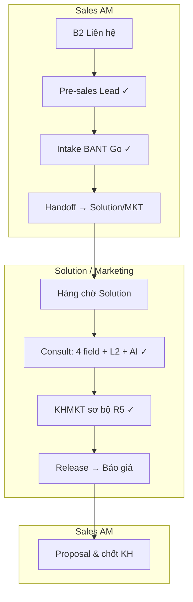

# Spec P3 — Pre-sales handoff Sales → Solution/Marketing

> **Document ID:** PS-P3-20260806  
> **Phiên bản:** 1.0 · **Ngày:** 2026-08-06  
> **Trạng thái:** Draft — chờ PO / GDKD sign-off  
> **Parent:** [`2026-08-05-presales-p2-ecosystem-design.md`](./2026-08-05-presales-p2-ecosystem-design.md) · [`2026-07-26-consult-phase3-presales-lead-design.md`](./2026-07-26-consult-phase3-presales-lead-design.md) · [`consult-stage-am-sop.md`](../runbooks/consult-stage-am-sop.md)

---

## 1. Bối cảnh & quyết định org

**Vấn đề:** Chu trình hiện tại giao **Consult (4 field + AI + L2)** và **KHMKT sơ bộ (R5)** cho **AM/Sales**. Thực tế đây là công việc **Solution / Marketing** (phòng khác Sales) — AM không có năng lực/thời gian → lead kẹt ở stage `consult`, SLA trượt, UX CRM gây hiểu nhầm.

**Quyết định org (PO 2026-08-06):**

| Vai trò | Phòng | Trách nhiệm pre-sales |
|---------|-------|------------------------|
| **AM (Sales)** | Sales | B2 → Lead task → Intake BANT → **Handoff Solution** → Proposal thương mại → chốt KH |
| **Solution Specialist** | Solution / Marketing | Nhận handoff → Consult workspace → R5 → **Release Báo giá** cho Sales |
| **GDKD / Director** | — | Override No-Go, deal lớn, SLA breach |

**Nguyên tắc:** AM **giữ** `owner_id` lead (quan hệ KH). Solution **không** “chiếm” lead — chỉ **accountable** giai đoạn Consult + R5 qua `solution_owner_id` trên presales.

---

## 2. Chu trình mục tiêu (6 bước)



### 2.1 Sales (AM) — kết thúc tại Handoff

| Bước | Gate | CTA stepper |
|------|------|-------------|
| B2 | Care pipeline complete | Hoàn thành B2 |
| Pre-sales Lead | Presales started | Bắt đầu pre-sales |
| Khảo sát BANT | Intake completed + Go (gate G2) | Chuyển → *(đổi label)* **Giao Solution/MKT** |
| — | Không điền Consult / R5 | — |

**AM không được:** sửa Consult 4 field, chạy AI consult_analysis bắt buộc, sửa R5, tick ✓ Consult, **Chuyển → Báo giá**.

**AM được:** xem Brief read-only, trạng thái handoff, nhận thông báo khi Solution release.

### 2.2 Solution / Marketing — Consult → R5 → Release

| Bước | Gate | CTA |
|------|------|-----|
| Nhận queue | `handoff_status = pending` | **Nhận case** |
| Consult | 4 field + L2 + AI + task ✓ | Tick ✓ Consult |
| R5 | validatePreliminaryPlan OK | Điền `#funnel-presales-r5` |
| Release | Consult ✓ + R5 OK | **Trả Sales — sẵn sàng Báo giá** (= advance `consult → proposal`) |

### 2.3 Sales (AM) — Proposal trở lại

AM tiếp tục: draft proposal, gửi KH, negotiate, onboard (giữ luồng hiện tại).

---

## 3. RACI

| Hoạt động | AM Sales | Solution/MKT | GDKD |
|-----------|:--------:|:------------:|:----:|
| B2, Lead task, Intake | **R/A** | I | I |
| Handoff Solution | **R/A** | **A** (nhận) | I |
| Consult form + AI + L2 | I | **R/A** | C |
| KHMKT sơ bộ R5 | I | **R/A** | C |
| Advance → Proposal | I | **R/A** | I |
| Proposal gửi KH | **R/A** | C | I |
| No-Go → Consult | I | C | **A** |

---

## 4. SLA & KPI (tách team)

| Metric | Owner | Mục tiêu | Nguồn dữ liệu |
|--------|-------|----------|----------------|
| Lead → Intake Go | AM | ≤ 48h | intake `completed_at` |
| Go → Handoff Solution | AM | ≤ 24h | `handed_off_at` |
| Handoff → Consult ✓ | Solution | ≤ 72h | task `is_done` |
| Consult ✓ → R5 complete | Solution | ≤ 48h | marketing plan validation |
| Release → Proposal sent KH | AM | ≤ 48h | proposal activity *(ngoài scope P3)* |
| Consult → Proposal (ops SLA 48h) | Solution | ≤ 48h sau meeting | `consult_entered_at` → `proposal_entered_at` |

Dashboard B2B / staff-kpi: thêm dimension **team=sales | solution**.

---

## 5. Thay đổi sản phẩm (phased)

### Phase P3-S0 — SOP ngay (0 dev, tuần 1)

- Cập nhật [`consult-stage-am-sop.md`](../runbooks/consult-stage-am-sop.md) §10: AM dừng tại Handoff.
- Runbook Solution: inbox Zalo/email + link lead; Leader nhận case thủ công.
- Lead đang kẹt (vd. #900000005): Solution hoàn tất Consult + R5 + advance.

### Phase P3-S1 — Data model + queue (≈3–5 dev-days)

**DDL `crm_lead_presales`:**

| Cột | Kiểu | Mô tả |
|-----|------|--------|
| `handoff_status` | `pending \| with_solution \| released` | Trạng thái handoff |
| `handed_off_at` | timestamptz | AM giao Solution |
| `handed_off_by_staff_id` | bigint | AM |
| `solution_owner_staff_id` | bigint | Solution assignee |
| `solution_claimed_at` | timestamptz | Solution nhận case |
| `solution_released_at` | timestamptz | Release → Sales |

**API:**

- `POST /api/v1/leads/:id/presales/handoff-solution` — AM (gate G2 OK)
- `POST /api/v1/leads/:id/presales/claim-solution` — Solution
- `POST /api/v1/leads/:id/presales/release-to-sales` — Solution (wrap advance → proposal)

**UI:**

- `/crm/solution/queue` — filter `handoff_status=pending|with_solution`
- Badge trên lead detail AM: *「Đang Solution/MKT — {owner}」*

### Phase P3-S2 — RBAC + stepper theo role (≈5–8 dev-days)

**Staff section mới** (`admin_page_permissions.py`):

```text
crm_presales_solution — view | edit | claim | release
```

| Cap | AM Sales | Solution | GDKD |
|-----|:--------:|:--------:|:----:|
| `crm_leads` view/edit | ✓ | ✓ (queue) | ✓ |
| `crm_presales_solution` view | ✓ (read-only Consult tab) | ✓ | ✓ |
| `crm_presales_solution` edit | ✗ | ✓ | ✓ |
| `crm_presales_solution` claim / release | ✗ | ✓ | ✓ |

**Stepper CTA theo role:**

| Stage | AM Sales | Solution |
|-------|----------|----------|
| intake_bant (Go) | **Giao Solution/MKT** | — |
| consult | Read-only + link queue | **Hoàn tất Consult** / **Release Báo giá** |
| proposal | **Chuyển → Báo giá** *(chỉ sau release)* | — |

**Gate server:**

- `patchLeadPresalesTask` consult stage: reject nếu không có `crm_presales_solution.edit`
- `advancePresales` consult→proposal: require `release` cap hoặc `solution_released_at`
- AM gọi advance consult→proposal → **403** + message hướng dẫn

### Phase P3-S3 — Thông báo + metrics (≈3 dev-days)

- Activity log: `solution_handoff`, `solution_claimed`, `solution_released`
- Optional: notify AM khi `released`
- Metrics API: `go_to_handoff_hours`, `handoff_to_release_hours` by team

---

## 6. UX copy (tiếng Việt)

| Vị trí | AM Sales | Solution |
|--------|----------|----------|
| Stepper gate OK sau Intake | *「Sẵn sàng giao Solution/MKT」* | — |
| CTA primary | *「Giao Solution/MKT →」* | *「Nhận case」* / *「Trả Sales — Báo giá →」* |
| Tab Tư vấn (AM) | Banner: *「Giai đoạn Solution — bạn theo dõi, không chỉnh sửa」* | Full workspace |
| Queue empty | — | *「Không có lead chờ tư vấn」* |

---

## 7. Ngoài phạm vi P3

- Auto-assign round-robin Solution (manual claim v1)
- AI trên Proposal task
- Thay đổi ngưỡng BANT
- Gộp Service Lifecycle và presales-on-lead
- Portal KH thấy stage Solution

---

## 8. Rủi ro & giảm thiểu

| Rủi ro | Giảm thiểu |
|--------|------------|
| Solution quá tải queue | Claim cap / GDKD rebalance; metric queue depth |
| AM handoff sớm (Nurture) | Giữ gate G2; Nurture cần confirm Director |
| Lead “mồ côi” không ai claim | SLA 24h → GDKD alert; escalation activity |
| Lead đang consult do AM (legacy) | Migration: `handoff_status=with_solution`, assign Solution retroactive |

---

## 9. Migration lead hiện có

1. Cohort `presales.stage=consult` + task chưa ✓ → set `handoff_status=with_solution`, notify Solution queue.
2. Cohort AM đã ✓ Consult nhưng chưa proposal → Solution chỉ R5 + release.
3. Không rollback stage; AM owner giữ nguyên.

---

## 10. Definition of Done P3

- [ ] PO + GDKD Sales + Head Solution ký §1–§3
- [ ] P3-S0 SOP published; AM + Solution training 30 phút
- [ ] P3-S1 queue + handoff API staging UAT
- [ ] P3-S2 RBAC: AM **403** khi sửa Consult; Solution **200**
- [ ] Pilot 2 tuần: ≥5 lead handoff → release without AM editing Consult
- [ ] Metrics card tách `handoff_to_release_hours`

---

## 11. Quyết định PO (chờ)

| # | Câu hỏi | Đề xuất |
|---|---------|---------|
| Q1 | Solution claim 1-người/case hay nhiều người cùng sửa? | **1 owner** (`solution_owner_staff_id`) |
| Q2 | AM có được reopen handoff nếu Solution reject? | **Có** — `POST .../handoff-recall` + lý do (P3-S2) |
| Q3 | R5 edit trên tab Tổng quan hay chỉ tab Tư vấn? | **Solution: tab Tư vấn + anchor R5** (một workspace) |

---

*Changelog: v1.0 — Initial Sales → Solution/MKT handoff spec (2026-08-06).*
