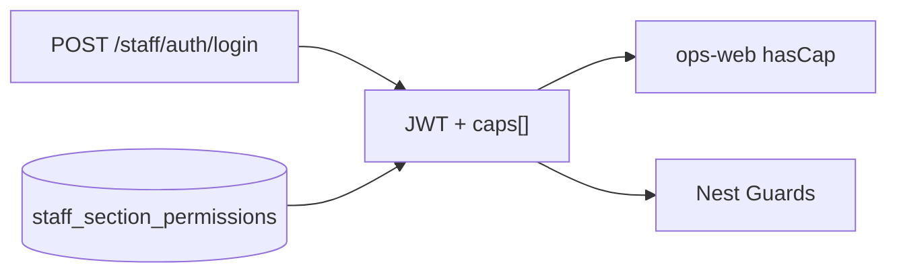
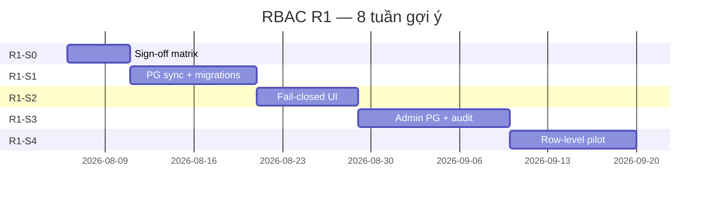
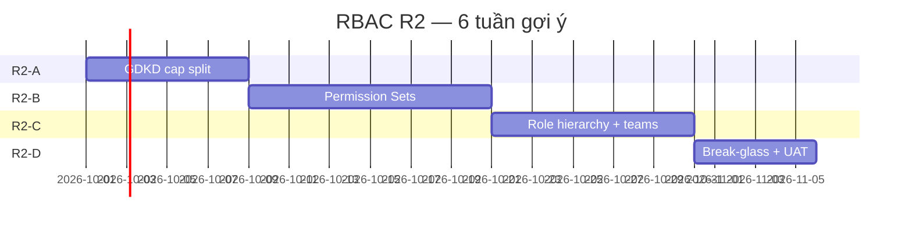
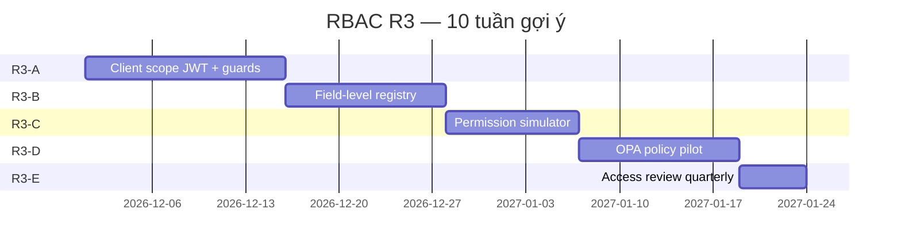

# Spec R1 — RBAC Enterprise (Phân quyền ops-web + Nest)

> **Document ID:** RBAC-R1-20260806  
> **Phiên bản:** 1.2 · **Ngày:** 2026-08-06 (cập nhật: **cấm SQLite** phân quyền)  
> **Trạng thái:** Draft — chờ PO / IT / GDKD sign-off  
> **Parent:** [`PHAN_QUYEN_HUONG_DAN.md`](../PHAN_QUYEN_HUONG_DAN.md) · [`05-PHAN-QUYEN-BAO-MAT-SLA.md`](../handover/05-PHAN-QUYEN-BAO-MAT-SLA.md) · [`2026-08-06-presales-solution-handoff-design.md`](./2026-08-06-presales-solution-handoff-design.md)  
> **Master win spec:** [`2026-08-07-rnosai-competitive-win-master-spec.md`](./2026-08-07-rnosai-competitive-win-master-spec.md)  
> **Ma trận ký duyệt:** [`docs/exports/ma-tran-phan-quyen-CSKH-KD-MKT-2026-08-06.xlsx`](../exports/ma-tran-phan-quyen-CSKH-KD-MKT-2026-08-06.xlsx)

---

## 1. Bối cảnh & vấn đề

### 1.1 Hiện trạng (as-is)

Hệ thống PTT dùng **RBAC section × action**. **Chính sách bắt buộc (R1):** phân quyền **chỉ PostgreSQL** — **cấm SQLite** trên mọi môi trường (dev, staging, prod).

| Thành phần | Vai trò |
|------------|---------|
| `cms_permissions.py` | Catalog module CMS + actions chuẩn |
| `admin_page_permissions.py` | ~59 section CRM + ~20 UI button + default theo **mã chức vụ** (`CSKH-01`, `KD-01`, `MKT-01`, …) |
| PostgreSQL `staff_section_permissions` | **Nguồn duy nhất** grants — Nest JWT caps, Admin UI |
| `StaffAuthService` + ~65 Nest guards | Thực thi API |
| `ops-web` `hasCap()` + `OpsNav` + `*/caps.ts` | Ẩn menu / nút |
| ~~SQLite `crm_position_section_permissions`~~ | **Cấm** — legacy; gỡ trong R1-S1 |

**Luồng chuẩn (mọi môi trường):**



### 1.2 Rủi ro đã xác minh (2026-08-06)

| # | Rủi ro | Tác động |
|---|--------|----------|
| R0 | **SQLite vẫn tồn tại trong script/Admin legacy** | Lệch PG, vi phạm chính sách; prod thiếu cap |
| R1 | Script migrate quyền cũ ghi SQLite (`migrate_*_permissions.py`) | VPS PG thiếu cap (vd. `crm_presales_solution`) |
| R2 | `seed_super_admin_full_access.py` one-shot | Section mới không tự sync sau release |
| R3 | UI `hasCap`: caps rỗng → **allow** (fail-open) | Client hiện menu sai trước khi API 403 |
| R4 | `crm_leads.assign` = GDKD override + gán lead gộp một cap | Khó audit SoD |
| R5 | Không ABAC/row-level thống nhất | AM có thể query lead người khác nếu biết ID |
| R6 | Internal key / auth disabled bypass toàn guard | Rủi ro prod nếu cấu hình sai |
| R7 | Không audit log thay đổi ma trận | Không truy vết ai cấp quyền |
| R8 | Catalog section lệch (vd. `crm_email_mkt` chỉ trong default, chưa trong `ADMIN_CRM_SECTIONS`) | Ma trận / Admin UI thiếu |

### 1.3 Mục tiêu (to-be)

| Mục tiêu | KPI |
|----------|-----|
| **PostgreSQL-only phân quyền** | 0 read/write RBAC qua SQLite; CI fail nếu script mở `*.db` |
| **Single source of truth PG** | 100% cap đọc/ghi từ `staff_section_permissions` |
| **Catalog đồng bộ code ↔ DB** | CI fail nếu thêm section/guard không có migration |
| **Fail-closed UI + API** | Thiếu cap → ẩn UI **và** 403 API |
| **Chức vụ chuẩn prod** | CSKH-01, KD-01, MKT-01, VH-01 có user + matrix đã ký |
| **P3 Solution handoff** | Matrix ký duyệt + seed PG |
| **Vận hành** | Admin sửa quyền trên ops-web; audit log |

**Ngoài phạm vi R1:** Keycloak staff SSO (R4), ABAC đa tenant phức tạp (R3), portal client RBAC refactor.

### 1.4 Competitive positioning

#### 1.4.1 Maturity snapshot (2026-08-06)

| Trục | PTT as-is | PTT sau R1 | HubSpot / SF mid-market | CRM VN phổ thông |
|------|:---------:|:----------:|:-----------------------:|:----------------:|
| **Catalog & taxonomy** | ✅ Section × action | ✅ + CI gate | ✅ Profiles + Permission Sets | ⚠️ Role cứng |
| **API enforcement** | ✅ ~80% guards | ✅ Parity + fail-closed | ✅ | ⚠️ UI-only |
| **UI enforcement** | ⚠️ Fail-open | ✅ Route guard | ✅ | ❌ |
| **Prod sync** | ❌ Dual-store legacy | ✅ PG-only mọi env | ✅ | ❌ |
| **Row-level scope** | ❌ | ✅ Lead AM pilot | ✅ Sharing rules | ❌ |
| **Permission Sets / override** | ❌ | ❌ → **R2** | ✅ | ❌ |
| **Field-level** | ❌ | ❌ → **R3** | ✅ | ❌ |
| **Audit permission changes** | ❌ | ✅ R1-S3 | ✅ | ❌ |
| **Staff SSO / MFA** | ❌ | ❌ → **R4** | ✅ | ❌ |
| **Business workflow caps** | ✅ P3 claim/release | ✅ + matrix ký | ⚠️ Generic | ❌ |

**Định vị một câu:** PTT **đã có RBAC có cấu trúc (≈ RBAC1)** gắn luồng **Sales ↔ Solution ↔ CSKH Việt Nam** — điểm khác biệt mà CRM generic ít có. **R1** đưa hệ thống lên mức **professional / audit-ready**; **R2–R3** mới cạnh tranh trực tiếp HubSpot mid-market trên **flexibility + data scope**.

#### 1.4.2 So sánh đối thủ (sales & technical)

| Đối thủ / chuẩn | Điểm mạnh họ | PTT đã có | PTT thiếu (roadmap) |
|-----------------|--------------|-----------|---------------------|
| **Salesforce** | Profiles, Permission Sets, field-level, sharing rules, role hierarchy | Section + button caps, P3 workflow | R2 Sets + hierarchy; R3 field-level + client scope |
| **HubSpot** | Teams, ownership, permission bundles | Position code (CSKH/KD/MKT), owner trên lead | R2 team dimension; R4 SSO |
| **Monday / agency SaaS** | Workspace / client isolation | Agency module, JWT `client_id` (yếu) | R3 client binding + audit |
| **CRM nội địa SMB** | Giá rẻ, triển khai nhanh | Luồng presales + KPI AM/SP | R1 credibility (PG, audit, fail-closed) |
| **SOC2 / ISO mindset** | Access review, break-glass, retention | Activity lead; matrix export | R2 break-glass; R3 access review; R1 audit |

#### 1.4.3 Moat PTT (khó copy nhanh)

| Moat | Mô tả | Phase kích hoạt |
|------|-------|-----------------|
| **Presales handoff RBAC** | Cap `claim` / `release` / handoff tách AM vs Solution — gắn funnel metrics | ✅ P3 · matrix R1-S0 |
| **GDKD override có kiểm soát** | Tách override vs assign (SoD) | R2 |
| **Cap-aware ops** | Queue Solution, KPI funnel filter theo team/cap | R2 team · R3 scope |
| **Signed matrix in-product** | Ma trận ký PDF gắn version deploy | R1-S3 export · R3 simulator |
| **Policy-as-code (VN rules)** | Rule declarative: “AM không release nếu chưa handoff” | R3 (OPA pilot) |

#### 1.4.4 Thông điệp go-to-market theo phase

| Phase | Pitch cho khách B2B / agency | Proof point |
|-------|------------------------------|-------------|
| **As-is + P3** | “CRM có phân quyền Sales–Solution, không phải Excel” | Demo handoff + 403 claim |
| **R1 complete** | “Enterprise-ready: ma trận ký, audit, PG đồng bộ prod” | Signed PDF + audit log + CI gate |
| **R2 complete** | “Linh hoạt như HubSpot: Permission Sets + team, không sửa cả chức vụ” | Admin gắn cap lẻ + role hierarchy |
| **R3 complete** | “Agency-safe: client scope + field-level + permission simulator” | Demo AM không thấy margin client khác |
| **R4 complete** | “SSO + MFA — checklist IT doanh nghiệp 100+ NV” | Keycloak login staff |

#### 1.4.5 KPI cạnh tranh (đo sau mỗi phase)

| KPI | Baseline | Target R1 | Target R2 | Target R3 |
|-----|----------|-----------|-----------|-----------|
| Thời gian cấp quyền user mới | ~2h (IT thủ công PG) | ≤ 15 ph (Admin UI) | ≤ 5 ph (+ Set) | ≤ 5 ph |
| Incident 403 do cap lệch prod | Không đo | 0 sau release | 0 | 0 |
| % route write có guard | ~80% | 100% | 100% | 100% |
| UAT “AM đọc lead người khác” | Fail | Pass (S4) | Pass + client | Pass + field |
| Deal blocker enterprise (SSO) | Block | Partial | Partial | Unblock w/ R4 |

---

## 2. Mô hình mục tiêu

### 2.1 Khái niệm

| Khái niệm | Định nghĩa |
|-----------|------------|
| **Section** | Khóa quyền theo module/trang (`crm_leads`, `crm_presales_solution`, …) |
| **Action** | Hành vi trên section (`view`, `edit`, `claim`, `release`, `assign`, …) |
| **Cap** | Cặp `(section_id, action)` — đơn vị kiểm tra |
| **Position** | Chức vụ nhân viên (`position_id` → `staff_users`) |
| **Grant** | Bản ghi `(position_id, section_id, action)` |
| **UI button grant** | Section con `crm_leads__btn_*` — map 1 nút cụ thể |

### 2.2 Actions chuẩn

**Core** (`CMS_ACTIONS`): `view`, `edit`, `create`, `delete`, `export`, `configure`, `approve`, `claim`, `release`

**Extended** (module-specific, registry riêng):

| Action | Module |
|--------|--------|
| `assign` | `crm_leads` — GDKD / re-assign *(R2 tách `crm_gdkd.override`)* |
| `write`, `settings`, `compliance`, `deliverability`, `reports` | `crm_email_mkt` |
| `query` | `ai_analytics` |
| `commit` | `ai_forecast` |
| `run` | `ai_orchestrator` |
| `simulate` | `automation_workflows` |

### 2.3 Chức vụ pilot (đã có ma trận ký)

| Mã | Tên | File tham chiếu |
|----|-----|-----------------|
| `CSKH-01` | Nhân viên CSKH vận hành | Sheet CSKH-01 |
| `KD-01` | AM B2B Sales | Sheet KD-01 |
| `MKT-01` | Trưởng phòng Marketing / Solution | Sheet MKT-01 |
| `VH-01` | Vận hành / HR | *(phase sau)* |
| `SUPER-ADMIN` | Quản trị hệ thống | `seed_super_admin_full_access.py` |

Ma trận chi tiết: [`ma-tran-phan-quyen-CSKH-KD-MKT-2026-08-06.xlsx`](../exports/ma-tran-phan-quyen-CSKH-KD-MKT-2026-08-06.xlsx)

### 2.4 P3 Solution — caps bắt buộc

| Cap | KD-01 | MKT-01 | Nest guard |
|-----|:-----:|:------:|------------|
| `crm_presales_solution.view` | ✓ | ✓ | `StaffPresalesSolutionViewGuard` |
| `crm_presales_solution.edit` | — | ✓ | consult mutation |
| `crm_presales_solution.claim` | — | ✓ | `StaffPresalesSolutionClaimGuard` |
| `crm_presales_solution.release` | — | ✓ | `StaffPresalesSolutionReleaseGuard` |
| `crm_leads.edit` (handoff) | ✓ | — | `handoff-solution` |

---

## 3. Kiến trúc dữ liệu

### 3.1 PostgreSQL — nguồn duy nhất (dev · staging · prod)

```sql
-- Đã có (2026-07-20-staff-auth)
staff_users (id UUID, email, position_id, …)
staff_section_permissions (position_id, section_id, action) UNIQUE

-- R1 bổ sung
staff_positions (id, code, name, active, grants_customized, …)
staff_permission_audit (id, actor, position_id, diff_json, created_at)
staff_permission_catalog_version (version, applied_at)  -- optional gate
```

**Yêu cầu môi trường:** mọi dev/staging **bắt buộc** `DATABASE_URL` PostgreSQL trước khi chạy migrate RBAC hoặc login staff. Không fallback file DB.

### 3.2 Chính sách cấm SQLite (phân quyền)

| Quy tắc | Chi tiết |
|---------|----------|
| **Cấm** | Bảng `crm_position_section_permissions`, file `data/crm.db` / `ptt.db` cho RBAC |
| **Cấm** | Script `migrate_*_permissions.py` ghi SQLite — refactor hoặc xóa trong R1-S1 |
| **Cấm** | Admin legacy đọc/ghi ma trận qua SQLite |
| **Cho phép** | Catalog Python (`admin_page_permissions._POSITION_DEFAULT`) — **chỉ** default seed, không runtime store |
| **Dev local** | Docker Compose PG hoặc `DATABASE_URL` staging read-only — **không** SQLite |

**R1-S1 deliverable:** `scripts/rbac_no_sqlite_gate.sh` — grep repo fail nếu RBAC path import `sqlite3` hoặc mở `*.db` (whitelist: unit test `:memory:` ngoài phạm vi RBAC migration).

### 3.3 Registry code (single catalog)

```
cms_permissions.py          → CMS_ACTIONS, labels
admin_page_permissions.py   → ADMIN_CRM_SECTIONS, _POSITION_DEFAULT
ptt_ui_button_permissions.py → CRM_UI_BUTTONS
services/ptt-crm-api/...    → guards map section.action
services/ops-web/...        → caps.ts per domain
```

**R1-S1:** file `rbac_catalog.json` generate từ Python (hoặc TS) — CI so sánh guard ↔ catalog.

---

## 4. Thực thi (enforcement)

### 4.1 API (Nest)

| Pattern | Quy tắc |
|---------|---------|
| Mọi route staff | `StaffOrInternalKeyGuard` + guard module |
| Internal key | Chỉ worker/cron; **không** route browser |
| Override GDKD | `crm_leads.assign` hoặc cap riêng R2 |
| 403 payload | `{ error, section, action }` — thống nhất |

### 4.2 UI (ops-web)

| Pattern | Quy tắc R1 |
|---------|------------|
| `hasCap(user, section, action)` | **Fail-closed:** caps rỗng → `false` |
| `OpsNav` | Ẩn link nếu thiếu `view` |
| Nút destructive | Check cap button id hoặc parent action |
| Route middleware | `/crm/*`, `/seo/*`, `/email/*` redirect 403 page |

### 4.3 Row-level (R1-S4 — phạm vi tối thiểu)

| Entity | Rule |
|--------|------|
| Lead B2B AM | Default list filter `owner_id = me` trừ GDKD |
| Solution queue | Team-wide read; mutate chỉ owner hoặc GDKD |
| Agency client | Scope `client_id` trên Meta/SEO/Email |

---

## 5. Kế hoạch triển khai (phased)

### Tổng quan timeline



---

### Phase R1-S0 — Sign-off & baseline (≈3 dev-days, tuần 1)

**Mục tiêu:** PO/GDKD/Head MKT ký ma trận; freeze default pilot.

| # | Deliverable | Owner |
|---|-------------|-------|
| S0-1 | Ký [`ma-tran-phan-quyen-CSKH-KD-MKT-*.xlsx`](../exports/ma-tran-phan-quyen-CSKH-KD-MKT-2026-08-06.xlsx) | PO, GDKD, MKT |
| S0-2 | Chốt danh sách user pilot (email → position) | HR + IT |
| S0-3 | Snapshot PG prod `staff_section_permissions` backup | IT |
| S0-4 | Runbook vận hành cập nhật quyền (draft) | IT |

**Exit criteria:** Ma trận signed PDF lưu `docs/exports/`; checklist user pilot ≥ 3 AM + 2 MKT + 2 CSKH.

---

### Phase R1-S1 — PG sync & migration pipeline (≈5–8 dev-days, tuần 2–3)

**Mục tiêu:** Mọi thay đổi quyền trong code → script PG idempotent; **zero SQLite**.

| # | Task | Chi tiết |
|---|------|----------|
| S1-1 | `scripts/migrate_staff_permissions_pg.py` | `--position CODE` hoặc `--all-defaults`; `INSERT … ON CONFLICT DO NOTHING`; **require** `DATABASE_URL` |
| S1-2 | Refactor / retire SQLite migrators | `migrate_presales_solution_permissions.py` và mọi `migrate_*_permissions.py` → PG-only hoặc xóa; exit 1 nếu thiếu `DATABASE_URL` |
| S1-3 | `scripts/sync_super_admin_caps_pg.py` | Diff catalog vs PG position_id=1; apply thiếu |
| S1-4 | Bổ sung `crm_email_mkt` vào `ADMIN_CRM_SECTIONS` | Catalog đầy đủ |
| S1-5 | CI job `rbac_catalog_gate.sh` | Fail nếu guard reference section không trong catalog |
| S1-6 | CI job `rbac_no_sqlite_gate.sh` | Fail nếu RBAC script/admin path dùng SQLite |
| S1-7 | **Deploy VPS:** seed CSKH/KD/MKT positions + caps | SQL hoặc script PG |
| S1-8 | Gỡ Admin legacy SQLite permissions | Redirect sang PG API (stub OK đến S3) |

**SQL migration DDL (nếu cần):**

```sql
-- docs/specs/2026-08-06-postgresql-ddl-staff-positions.sql
CREATE TABLE IF NOT EXISTS staff_positions (…);
CREATE TABLE IF NOT EXISTS staff_permission_audit (…);
```

**Exit criteria:**

- [ ] `python3 scripts/migrate_staff_permissions_pg.py --position MKT-01 --apply` trên staging (**PG bắt buộc**)
- [ ] `./scripts/rbac_no_sqlite_gate.sh` pass
- [ ] Login MKT thấy Solution queue + claim; KD chỉ view
- [ ] CI gate pass trên PR

---

### Phase R1-S2 — Fail-closed UI + guard parity (≈5 dev-days, tuần 3–4)

| # | Task | Chi tiết |
|---|------|----------|
| S2-1 | Sửa `ops-web/src/lib/auth.ts` `hasCap` | caps rỗng → false |
| S2-2 | Middleware Next.js | Protect route groups |
| S2-3 | Audit guards thiếu | Mọi `POST/PATCH/DELETE` CRM có guard |
| S2-4 | Trang `/403` tiếng Việt | Hướng dẫn liên hệ admin |
| S2-5 | Test matrix pytest + jest | `test_rbac_kd01.py`, `presales-solution-rbac` mở rộng |

**Exit criteria:**

- [ ] User JWT không caps → không thấy menu CRM
- [ ] KD-01 gọi `claim-solution` → 403 + message tiếng Việt
- [ ] Vitest + jest RBAC green

---

### Phase R1-S3 — Admin ma trận trên PG + audit (≈8–12 dev-days, tuần 5–7)

**Mục tiêu:** Admin sửa quyền **100% PG**; có lịch sử; không path SQLite.

| # | Task | Chi tiết |
|---|------|----------|
| S3-1 | Nest API `GET/PATCH /api/v1/staff/permissions/positions/:id` | CRUD grants PG |
| S3-2 | ops-web trang `/admin/crm/permissions` | Ma trận checkbox; đọc/ghi PG |
| S3-3 | `staff_permission_audit` | Log mọi PATCH |
| S3-4 | Export Excel/PDF từ Admin | Reuse `export_position_permission_matrix_*.py` (đọc PG) |
| S3-5 | **Xóa** Admin SQLite permissions | Gỡ route/code legacy; doc cập nhật § PG-only |

**Exit criteria:**

- [ ] Admin đổi cap MKT-02 trên staging → login thấy ngay (refresh token)
- [ ] Audit log có actor + timestamp
- [ ] Không còn file `crm.db` / `ptt.db` trong workflow phân quyền
- [ ] Không còn workflow export PG thủ công từ SQLite

---

### Phase R1-S4 — Row-level scope pilot (≈5–8 dev-days, tuần 7–8)

| # | Task | Chi tiết |
|---|------|----------|
| S4-1 | `LeadScopeGuard` / service filter | List leads: AM → owner_id |
| S4-2 | GDKD bypass explicit | Log khi dùng assign cap xem all |
| S4-3 | Solution queue | Không filter owner (team) |
| S4-4 | Metrics funnel | Filter AM optional giữ nguyên |
| S4-5 | UAT script | AM A không GET lead của AM B |

**Exit criteria:**

- [ ] AM KD-01 list `/crm/b2b/leads` chỉ lead mình (staging data)
- [ ] GDKD thấy all
- [ ] Không regression Solution queue

---

### Phase R1.5 — HR · Org · Job Function (≈12–15 dev-days, tuần 7–9)

**Mục tiêu:** Tách **chức vụ** (position base caps) khỏi **vai trò nghiệp vụ** (leader, design, content, sales…); HR onboard không cần SQL.

> **Spec chi tiết:** [`2026-08-07-rbac-hr-org-job-function-design.md`](./2026-08-07-rbac-hr-org-job-function-design.md)  
> **Kế hoạch:** [`2026-08-07-rbac-hr-org-job-function-implementation-plan.md`](./2026-08-07-rbac-hr-org-job-function-implementation-plan.md)  
> **Runbook HR:** [`../runbooks/rbac-hr-org-workflow.md`](../runbooks/rbac-hr-org-workflow.md)

| # | Task | Chi tiết |
|---|------|----------|
| R1.5-S0 | PO sign-off Position × Function matrix | Supplement Excel/PDF |
| R1.5-S1 | DDL `staff_job_functions` + seed catalog | 8 functions |
| R1.5-S2 | Nest `loadEffectiveCaps()` | union position + functions |
| R1.5-S3 | Admin UI assign functions per user | `/admin/crm/org/users` |
| R1.5-S4 | Deploy + UAT persona | content ≠ design caps |

**Exit criteria:**

- [ ] NV cùng `MKT-02` khác function → menu khác nhau sau re-login
- [ ] Effective caps = union(position, functions) — automated test pass
- [ ] SoD-01..04 block ở Admin UI
- [ ] Onboard NV ≤ 15 ph (Admin UI, không SQL)

---

### Phase R2 — Flexibility & SoD (backlog, ≈4–6 tuần · ~18–22 dev-days)

**Mục tiêu:** HubSpot-parity trên **Permission Sets + role hierarchy + team**; tách GDKD để audit SoD; không block vận hành P3.

**Phụ thuộc:** R1-S1 (PG SSoT), R1-S3 (Admin + audit).



#### R2-A — Tách cap GDKD (≈5 dev-days)

| # | Task | Chi tiết | Files / artifact |
|---|------|----------|------------------|
| R2-A1 | Section `crm_gdkd` | Actions: `override`, `assign`, `review_queue`, `view_all_leads` | `admin_page_permissions.py`, catalog |
| R2-A2 | Migrate grants | `crm_leads.assign` → map: assign→`crm_gdkd.assign`; override funnel→`crm_gdkd.override` | `migrate_staff_permissions_pg.py --r2-gdkd` |
| R2-A3 | Guards | `StaffGdkdOverrideGuard`, list bypass dùng `view_all_leads` | Nest guards, `leads.controller` |
| R2-A4 | Ma trận | Chỉ GDKD + SUPER-ADMIN có `crm_gdkd.*`; KD-01/MKT-01 không | Regenerate matrix Excel |
| R2-A5 | Audit | Log mỗi lần dùng `override` / `view_all_leads` | `staff_permission_audit` hoặc `activity_log` |

**Exit criteria R2-A:**

- [ ] GDKD có thể assign lead **không** có cap override funnel
- [ ] MKT-01 không có `crm_gdkd.view_all_leads` → list leads vẫn team-scoped (R1-S4)
- [ ] Ma trận ký supplement PDF

#### R2-B — Permission Sets (≈8 dev-days)

| # | Task | Chi tiết |
|---|------|----------|
| R2-B1 | DDL | `staff_permission_sets (id, code, name)`, `staff_user_permission_sets (user_id, set_id)`, `staff_permission_set_grants (set_id, section_id, action)` |
| R2-B2 | Effective caps | JWT `caps[]` = union(position grants, set grants); cache invalidation on PATCH |
| R2-B3 | Admin UI | Tab “Bộ quyền bổ sung”: tạo set, gắn user, không sửa default chức vụ |
| R2-B4 | Use cases | Ví dụ: `SET-SOLUTION-BACKUP` (claim/release tạm), `SET-EXPORT-ONLY` |
| R2-B5 | CI | Set không được grant section ngoài catalog |

**Exit criteria R2-B:**

- [ ] User KD-01 + set backup → claim được 24h (nếu gắn set có claim)
- [ ] Revoke set → claim 403 ngay sau refresh token
- [ ] Audit: ai gắn set cho ai

#### R2-C — Role hierarchy & team dimension (≈8 dev-days)

| # | Task | Chi tiết |
|---|------|----------|
| R2-C1 | DDL | `staff_positions.parent_id`, `staff_teams (id, code, name)`, `staff_user_teams (user_id, team_id, role)` |
| R2-C2 | Inheritance | Position con inherit grants cha (trừ deny explicit — optional R2-C2b) |
| R2-C3 | Teams | `TEAM-SALES`, `TEAM-SOLUTION`, `TEAM-CSKH` — filter queue/metrics optional |
| R2-C4 | JWT claims | `team_ids[]`, `position_code` — UI badge + filter |
| R2-C5 | Presales metrics | Funnel card filter theo team (giữ cap `view`) |

**Exit criteria R2-C:**

- [ ] MKT-02 inherit MKT-01 minus custom deny (nếu có)
- [ ] Solution queue filter “team của tôi” (toggle)
- [ ] Không regression P3 handoff

#### R2-D — Break-glass 24h (≈4 dev-days)

| # | Task | Chi tiết |
|---|------|----------|
| R2-D1 | DDL | `staff_break_glass_grants (user_id, caps_json, expires_at, approved_by, reason)` |
| R2-D2 | Flow | GDKD approve qua Admin; auto-revoke cron |
| R2-D3 | Alert | Slack/email khi break-glass active |
| R2-D4 | Runbook | `docs/runbooks/rbac-break-glass.md` |

**Exit criteria R2-D:**

- [ ] Break-glass hết hạn → caps về baseline position
- [ ] Audit trail đủ cho review nội bộ

#### Definition of Done — R2

- [ ] GDKD caps tách khỏi `crm_leads.assign`
- [ ] ≥ 2 Permission Sets pilot trên staging
- [ ] Role hierarchy cho ≥ 2 cặp position (vd. MKT-01 → MKT-02)
- [ ] Team dimension trên Solution queue / metrics (toggle)
- [ ] Break-glass pilot + runbook
- [ ] Ma trận supplement ký; training 20 ph Admin

**Effort R2:** ~18–22 dev-days · **Calendar:** 4–6 tuần (1 dev + PO UAT)

---

### Phase R3 — Data scope & agency trust (backlog, ≈8–10 tuần · ~28–35 dev-days)

**Mục tiêu:** Agency-safe **client/workspace scope**, **field-level** sensitive, **permission simulator** — pitch “AM không đọc được margin client khác”.

**Phụ thuộc:** R1-S4 (row-level lead), R2-B (Sets), R2-C (teams).



#### R3-A — Client / workspace scope (≈10 dev-days)

| # | Task | Chi tiết |
|---|------|----------|
| R3-A1 | JWT | Claim `allowed_client_ids[]` từ `staff_user_clients` |
| R3-A2 | Guards | Meta ads, SEO, Email MKT: filter mọi query `client_id IN (...)` |
| R3-A3 | Admin | Gán client cho user / team; bulk import CSV |
| R3-A4 | SUPER-ADMIN | Bypass explicit + audit |
| R3-A5 | Tests | User A client X → 403 data client Y |

**Modules in-scope R3-A:** `crm_agency`, `crm_meta_ads`, `crm_seo`, `crm_email_mkt` (view path trước, mutate sau).

**Exit criteria R3-A:**

- [ ] Agency user chỉ list client được gán
- [ ] Internal key vẫn worker-only; không widen browser scope

#### R3-B — Field-level sensitive (≈10 dev-days)

| # | Task | Chi tiết |
|---|------|----------|
| R3-B1 | Registry | `rbac_field_registry.json`: entity, field, sensitivity, required cap |
| R3-B2 | API | Serializer strip / 403 on PATCH field thiếu cap |
| R3-B3 | UI | Ẩn hoặc mask field (expected_value, margin, PII phone raw) |
| R3-B4 | Caps | Ví dụ: `crm_leads.view_financial`, `crm_leads.view_pii` |
| R3-B5 | Matrix | Bổ sung cột field-level sheet supplement (không phải 59×20 full grid) |

**Pilot fields:**

| Entity | Field | Cap |
|--------|-------|-----|
| Lead | `expected_value`, `margin_pct` | `crm_leads.view_financial` |
| Lead | `phone`, `email` (export) | `crm_leads.view_pii` |
| Client | `billing_contact` | `crm_agency.view_pii` |

**Exit criteria R3-B:**

- [ ] KD-01 xem lead nhưng không PATCH `expected_value` nếu thiếu cap
- [ ] Export CSV strip PII nếu thiếu cap

#### R3-C — Permission simulator (≈8 dev-days)

| # | Task | Chi tiết |
|---|------|----------|
| R3-C1 | API | `POST /staff/permissions/simulate { user_id, route, entity_id? }` → `{ allowed, caps_used, denied_reason }` |
| R3-C2 | Admin UI | “Xem với tư cách user X” — read-only preview nav + sample lead |
| R3-C3 | Export | Snapshot simulate → PDF attach ma trận version |
| R3-C4 | Sales demo | Script demo 5 phút cho prospect |

**Exit criteria R3-C:**

- [ ] Admin preview KD-01: không thấy nút claim (match prod)
- [ ] Simulate handoff trên lead cụ thể → allowed/denied đúng guard

#### R3-D — Policy engine pilot (OPA / Cedar) (≈10 dev-days)

| # | Task | Chi tiết |
|---|------|----------|
| R3-D1 | Policies | 3 rule VN: (1) no release without handoff, (2) no claim if not MKT+set, (3) break-glass expiry |
| R3-D2 | Integration | Nest `PolicyService` evaluate before mutate (Solution + GDKD) |
| R3-D3 | CI | Policy unit tests + rego/cedar in repo |
| R3-D4 | Fallback | Guard cũ vẫn chạy nếu policy service down (fail-closed mutate) |

**Exit criteria R3-D:**

- [ ] Release Solution khi chưa handoff → 403 policy id `presales.no_release_without_handoff`
- [ ] Policy version trong deploy tag

#### R3-E — Continuous access review (≈4 dev-days)

| # | Task | Chi tiết |
|---|------|----------|
| R3-E1 | Report | Quarterly: users with Sets, break-glass, SUPER-ADMIN |
| R3-E2 | Workflow | PO tick “still needed” → auto-revoke nếu quá hạn phản hồi |
| R3-E3 | Export | CSV cho compliance folder |

**Exit criteria R3-E:**

- [ ] Q1 report chạy manual; ≥ 1 revoke pilot

#### Definition of Done — R3

- [ ] Client scope enforced trên ≥ 2 agency modules
- [ ] Field-level pilot ≥ 5 fields
- [ ] Permission simulator trong Admin
- [ ] ≥ 3 OPA policies production mutate path
- [ ] Access review runbook + 1 cycle pilot
- [ ] Competitive demo script cập nhật §1.4.4

**Effort R3:** ~28–35 dev-days · **Calendar:** 8–10 tuần

**Ngoài phạm vi R3 (defer R4):** Staff SSO Keycloak, SCIM, MFA bắt buộc toàn công ty.

---

### Phase R4 — Staff SSO Keycloak (backlog, ≈6–8 tuần)

| # | Task | Mô tả |
|---|------|--------|
| R4-1 | IdP integration | Staff login Keycloak; Nest validate OIDC |
| R4-2 | Group → position | Map `kc_group` → `position_id` + optional Sets |
| R4-3 | MFA | Bắt buộc role GDKD + SUPER-ADMIN |
| R4-4 | SCIM / sync | HR offboard → revoke JWT refresh |
| R4-5 | Deprecate | Nest password store read-only → remove |

**Pitch R4:** Unblock deal enterprise 100+ NV · checklist IT security.

---

## 6. Deploy & vận hành

### 6.1 Checklist deploy prod (mỗi release có section mới)

```bash
cd /var/www/rnosai
git pull origin main

# 1. DDL (nếu có)
# psql $DATABASE_URL -f docs/specs/2026-08-06-postgresql-ddl-staff-positions.sql

# 2. Sync caps
python3 scripts/sync_super_admin_caps_pg.py --apply
python3 scripts/migrate_staff_permissions_pg.py --position KD-01 --apply
python3 scripts/migrate_staff_permissions_pg.py --position MKT-01 --apply
python3 scripts/migrate_staff_permissions_pg.py --position CSKH-01 --apply

# 3. Restart API (caps cache nếu có)
sudo systemctl restart ptt-crm-api

# 4. Verify
curl -sf http://127.0.0.1:3000/health
# Login pilot users — smoke RBAC
```

### 6.2 Rollback

- Restore snapshot `staff_section_permissions` từ backup S0-3
- Revert code guards nếu false positive 403

### 6.3 Monitoring

| Signal | Ngưỡng |
|--------|--------|
| `403 missing_cap` spike | > 50/h → alert IT |
| Internal key trên browser UA | Block + alert |
| Permission audit gap | PATCH không log → CI fail |

---

## 7. Test plan

| ID | Case | Expected |
|----|------|----------|
| T1 | KD-01 login | Menu: Lead B2B, Intake; **không** Solution claim |
| T2 | MKT-01 login | Solution queue + claim + release |
| T3 | CSKH-01 login | Kanban, leads; **không** Solution |
| T4 | KD handoff | 200; activity `solution_handoff` |
| T5 | KD claim | **403** |
| T6 | MKT release | 200; stage proposal |
| T7 | Admin revoke `claim` | MKT claim → 403 sau refresh |
| T8 | caps=[] JWT | UI no CRM menu |
| T9 | AM list scope | Chỉ own leads (S4) |

Automated: `pytest tests/test_rbac_*` + `jest presales-solution-rbac` + gate script.

---

## 8. Definition of Done — RBAC R1

- [ ] Ma trận CSKH/KD/MKT **ký** (PDF trong `docs/exports/`)
- [ ] **PostgreSQL-only:** không SQLite cho phân quyền; `rbac_no_sqlite_gate.sh` pass
- [ ] PG là **single source of truth**; script migration idempotent; `DATABASE_URL` bắt buộc
- [ ] P3 caps seeded prod cho MKT + KD + admin
- [ ] UI **fail-closed**; API guards parity
- [ ] Admin sửa quyền PG + audit log (S3)
- [ ] Row-level lead list AM (S4)
- [ ] CI catalog gate pass
- [ ] Runbook cập nhật [`PHAN_QUYEN_HUONG_DAN.md`](../PHAN_QUYEN_HUONG_DAN.md) § prod PG
- [ ] Training 30 phút AM + MKT + Admin (reuse P3 handoff doc)

---

## 9. Rủi ro & giảm thiểu

| Rủi ro | Giảm thiểu |
|--------|------------|
| Dev thiếu PG local | Docker Compose `postgres` trong README; từ chối chạy migrate nếu không có `DATABASE_URL` |
| Lock-out admin | Giữ break-glass SUPER-ADMIN + backup matrix |
| Migration ghi đè custom grants | `ON CONFLICT DO NOTHING`; flag `grants_customized` |
| UI fail-closed gây blank screen | Trang 403 + support link |
| Row-level quá chặt GDKD | Explicit bypass + audit |
| Keycloak trùng R1 scope | Defer R4; R1 giữ Nest JWT |

---

## 10. Phụ lục

| Tài liệu | Mô tả |
|----------|--------|
| [`ma-tran-phan-quyen-CSKH-KD-MKT-2026-08-06.xlsx`](../exports/ma-tran-phan-quyen-CSKH-KD-MKT-2026-08-06.xlsx) | Ma trận Excel |
| [`ma-tran-phan-quyen-CSKH-KD-MKT-2026-08-06.pdf`](../exports/ma-tran-phan-quyen-CSKH-KD-MKT-2026-08-06.pdf) | Ma trận in ký |
| `scripts/export_position_permission_matrix_kd_mkt_cskh.py` | Regenerate matrix |
| `scripts/seed_super_admin_full_access.py` | Full caps position 1 |
| `admin_page_permissions._POSITION_DEFAULT` | Source code defaults |
| Spec §1.4 | Competitive positioning & GTM pitch theo phase |
| Spec §3.2 | Chính sách cấm SQLite (phân quyền) |
| Spec § Phase R2–R3 | Roadmap chi tiết Sets, scope, simulator, OPA |

---

*TBD sau sign-off PO:* ngày go-live R1-S1 prod, owner IT on-call, danh sách email user pilot.
