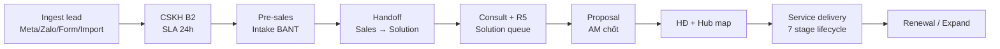
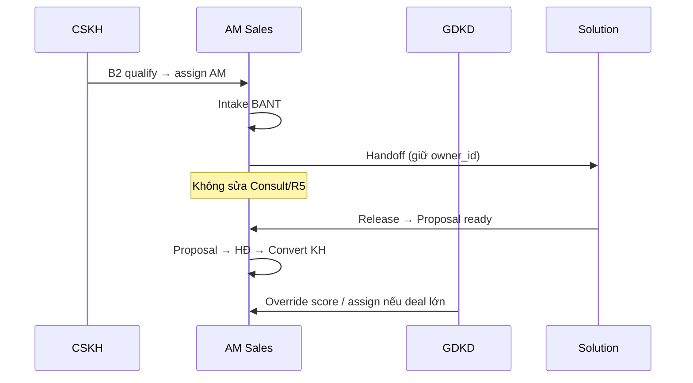
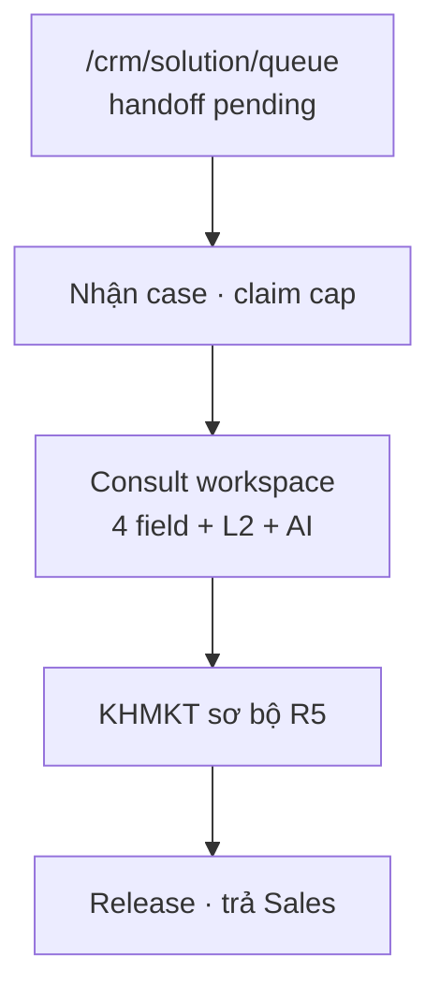
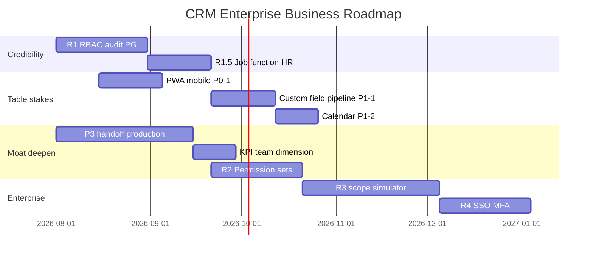

# Phân tích nghiệp vụ CRM — Hướng tới ứng dụng chuyên nghiệp vượt đối thủ

> **Document ID:** CRM-BA-ENTERPRISE-20260807  
> **Phiên bản:** 1.0 · **Ngày:** 2026-08-07  
> **Audience:** PO, GDKD, HR, IT, Sales/MKT leadership  
> **Nguồn:** [`SPEC_AI_REVENUE_OPERATING_SYSTEM.md`](../SPEC_AI_REVENUE_OPERATING_SYSTEM.md) · [`crm-getfly-gap-matrix.md`](./crm-getfly-gap-matrix.md) · [`2026-08-06-rbac-enterprise-design.md`](./2026-08-06-rbac-enterprise-design.md) · [`2026-08-07-rbac-hr-org-job-function-design.md`](./2026-08-07-rbac-hr-org-job-function-design.md) · [`2026-08-06-presales-solution-handoff-design.md`](./2026-08-06-presales-solution-handoff-design.md)  
> **Master win spec:** [`2026-08-07-rnosai-competitive-win-master-spec.md`](./2026-08-07-rnosai-competitive-win-master-spec.md)

---

## Mục lục

1. [Tóm tắt điều hành](#1-tóm-tắt-điều-hành)
2. [Định vị cạnh tranh — chơi game khác, không war giá](#2-định-vị-cạnh-tranh--chơi-game-khác-không-war-giá)
3. [Mô hình nghiệp vụ cốt lõi (Revenue OS)](#3-mô-hình-nghiệp-vụ-cốt-lõi-revenue-os)
4. [Phân tích theo 7 trụ chuyên nghiệp](#4-phân-tích-theo-7-trụ-chuyên-nghiệp)
5. [Luồng nghiệp vụ chi tiết theo phòng ban](#5-luồng-nghiệp-vụ-chi-tiết-theo-phòng-ban)
6. [Ma trận gap nghiệp vụ vs đối thủ](#6-ma-trận-gap-nghiệp-vụ-vs-đối-thủ)
7. [Quy tắc nghiệp vụ bắt buộc (Business Rules Registry)](#7-quy-tắc-nghiệp-vụ-bắt-buộc-business-rules-registry)
8. [Chỉ số nghiệp vụ & SLA vận hành](#8-chỉ-số-nghiệp-vụ--sla-vận-hành)
9. [Lộ trình nâng cấp nghiệp vụ theo phase](#9-lộ-trình-nâng-cấp-nghiệp-vụ-theo-phase)
10. [Khuyến nghị tổ chức & quy trình](#10-khuyến-nghị-tổ-chức--quy-trình)
11. [Checklist “CRM chuyên nghiệp” trước demo enterprise](#11-checklist-crm-chuyên-nghiệp-trước-demo-enterprise)

---

## 1. Tóm tắt điều hành

### 1.1. CRM PTT hiện là gì?

RNOSAI **không phải CRM SME generic** — đây là **Revenue Operating System** cho agency quảng cáo và doanh nghiệp performance marketing, với CRM Core đã ship ~53 route ops-web, closed-loop Meta/Zalo, AI copilot, và luồng **Sales ↔ Solution ↔ CSKH** đặc thù Việt Nam.

### 1.2. “Chuyên nghiệp hơn đối thủ” nghĩa là gì?

| Đối thủ | Họ thắng ở | PTT **không** cạnh |
|---------|------------|-------------------|
| **Getfly** (~31k/tháng) | CRM rộng, mobile app, LP builder, automation email/SMS | SME đa ngành, giá rẻ |
| **MISA AMIS CRM** | ERP liên thông, AVA AI bán hàng, đi tuyến NVBH | Phân phối, kế toán tích hợp |
| **HubSpot / Salesforce** | Permission sets, SSO, field-level, sharing rules | Generic mid-market (chưa đủ R2–R4) |

PTT thắng khi khách hàng mục tiêu hỏi:

> *“Đồng quảng cáo nào ra hợp đồng? Ai chịu SLA handoff Solution? Ai được duyệt launch ads? ROAS trên portal client thế nào?”*

— những câu **Getfly/MISA không trả lời được** ở mức agency.

### 1.3. Ba moat nghiệp vụ (khó copy trong 12 tháng)

```mermaid
flowchart TB
  subgraph M1["Moat 1 — Closed-loop Revenue"]
    ADS[Chi phí Meta/Zalo] --> LEAD[Lead CRM]
    LEAD --> DEAL[HĐ / Lifecycle]
    DEAL --> ROAS[ROAS / CPL / Margin]
  end
  subgraph M2["Moat 2 — Agency OS"]
    MC[Multi-client workspace]
    PORTAL[Portal client read-only]
    GOV[Governance Launch QA + campaign write]
  end
  subgraph M3["Moat 3 — Luồng org VN"]
    HAND[Sales → Solution handoff RBAC]
    RBAC[Position + Job function + SoD]
    KPI[KPI tách team Sales | Solution]
  end
  M1 --> WIN[Vượt CRM generic]
  M2 --> WIN
  M3 --> WIN
```

### 1.4. Kết luận chiến lược một câu

**Table stakes (~80% Getfly)** để không bị loại vòng demo + **moat Revenue OS** để thắng deal agency/brand — không build ERP/LP builder.

---

## 2. Định vị cạnh tranh — chơi game khác, không war giá

### 2.1. Category riêng

```text
Revenue Operating System cho agency & brand performance marketing
(có CRM Core enterprise-grade bên trong)
```

### 2.2. Phân khúc khách & đối thủ thực sự

| Phân khúc | Pain point | Đối thủ thực tế hôm nay | RNOSAI pitch |
|-----------|------------|-------------------------|--------------|
| Agency 10–100 client | Excel + Ads Manager + CRM lẻ | Getfly + tool rời | Một OS — CPL/ROAS theo client |
| Brand in-house MKT | Không biết ads → deal | Getfly + GA | Attribution đến HĐ dịch vụ |
| B2B agency PTT-like | Handoff Sales–Solution kẹt | Email/Zalo thủ công | Queue + RBAC claim/release |
| SME đa ngành | Giá rẻ, mobile | **Getfly thắng** | **Không target** |
| Phân phối / NVBH | Kế toán + tuyến | **MISA thắng** | **Không target** |

### 2.3. Ma trận “professional maturity”

| Trục | Getfly | MISA+AVA | HubSpot mid | PTT as-is | PTT target 12 tháng |
|------|:------:|:--------:|:-----------:|:---------:|:-------------------:|
| CRM core (lead, KH, pipeline) | ✅ | ✅ | ✅ | ✅ | ✅ + polish |
| Mobile lead care | ✅ App | ✅ | ✅ | ○ PWA | ✅ PWA R1 |
| Import/export Excel | ✅ | ✅ | ✅ | ○ | ✅ |
| Custom field / pipeline admin | ✅ | ○ | ✅ | ○ | ✅ R2 |
| RBAC có cấu + audit | ○ | ○ | ✅ | ○→✅ R1 | ✅ R1.5 HR |
| Multi-client agency | ❌ | ❌ | ○ | ✅ | ✅ |
| Ads closed-loop ROAS | UTM | Connect FB | ○ | ✅ | ✅ |
| Sales↔Solution handoff | ❌ | ❌ | ❌ | ✅ P3 | ✅ |
| AI gắn revenue (NBA, forecast) | ○ | ✅ AVA generic | ✅ | ○ R1–R3 | ✅ R2–R3 |
| SSO / MFA enterprise | ○ | ✅ | ✅ | ❌ | R4 |
| ERP kế toán | ✅ | ✅ | ○ | 🚫 Export | 🚫 |

---

## 3. Mô hình nghiệp vụ cốt lõi (Revenue OS)

### 3.1. Vòng đời giá trị (Value Chain)



Mỗi bước có: **owner nghiệp vụ**, **gate server-side**, **cap RBAC**, **KPI đo**, **audit event**.

### 3.2. Thự thể nghiệp vụ chính

| Entity | Vai trò nghiệp vụ | Module |
|--------|-------------------|--------|
| **Lead** | Đơn vị săn deal — funnel B2→Proposal | CRM Core |
| **Customer** | Master sau convert — retention | CRM Core |
| **Presales** | Handoff, consult, R5 — tách Sales/Solution | P3 |
| **Proposal / HĐ** | Cam kết thương mại | Hub |
| **Campaign map** | Spend ↔ lead attribution | Meta/Zalo OS |
| **Service lifecycle** | Triển khai 7 stage, margin, AR | Agency OS |
| **Ticket** | CS post-sale lite | CRM R2 |
| **Staff / Org** | Identity 4 lớp — HR self-service | R1.5/R2-HR |

### 3.3. State machine lead (business truth)

Theo [`product-model-v1.md`](../product-model-v1.md):

| Stage | Gate mở bước tiếp | Actor chính |
|-------|-------------------|-------------|
| Assigned | `owner_id` set | System / GDKD |
| B2 | Liên hệ OK + care pipeline | CSKH |
| Review queue | Quá 24h chưa B2 | GDKD |
| Add-on ngành | Pack catalog ≥1 field | CSKH / AM |
| Pre-sales | B2 complete | AM |
| Handoff Solution | Intake Go | AM |
| Consult + R5 | Solution claim | Solution/MKT |
| Proposal | Release từ Solution | AM |
| Contract / Lifecycle | HĐ active | AM / Finance |

**Chuyên nghiệp = gate không bypass được bằng UI hack** — mọi advance có validation server + audit.

---

## 4. Phân tích theo 7 trụ chuyên nghiệp

CRM enterprise không chỉ là “nhiều màn hình” — cần 7 trụ nghiệp vụ đồng bộ.

### 4.1. Trụ 1 — Thu lead & phân công (Lead Operations)

**Nghiệp vụ:** Lead vào từ đa kênh → dedup → assign → SLA contact.

| Capability | Trạng thái | Gap vs Getfly | Hành động |
|------------|------------|---------------|-----------|
| Webhook Meta/Zalo | ✅ | ➕ vượt | Giữ |
| Dedup phone/email | ✅ | Parity | Giữ |
| Round-robin / territory | ✅ | Parity | Document rules |
| ML routing (RNOS-26) | ○ | ➕ | Pilot |
| Import/export Excel | ✅ | Parity P0-2 | Polish template |
| Filter chips + bulk assign | ✅ | Parity | Cột tùy chọn ○ |
| AI Score column | ✅ | ➕ | Scale cohort |
| PWA mobile lead care | ○ | ❌ vs Getfly app | RNOS-41 P0-1 |

**BR bắt buộc:** BR-CRM-001 — một lead active một owner primary.

**KPI:** Lead response ≤15 phút ≥90%; duplicate rate <2%.

---

### 4.2. Trụ 2 — CSKH & SLA (Customer Success Front-line)

**Nghiệp vụ:** B2 care, board SLA, review queue, ticket lite.

| Capability | Trạng thái | Gap | Hành động |
|------------|------------|-----|-----------|
| CSKH board bulk ops | ✅ | ➕ vượt Getfly “Đừng quên” | Mobile card view ○ |
| B2 deadline 24h → review | ✅ | ➕ agency | E2E regression |
| Activity timeline | ✅ | Parity | File upload ○ |
| Ticket lite | ✅ RNOS-24 | P1-3 parity | Sentiment polish |
| Calendar + reminder | ○ | ❌ Getfly có | R2 P1-2 |

**BR:** BR-CRM-002 — deal > threshold cần GDKD trước proposal.

**KPI:** B2 trong 24h ≥85%; SLA breach visible real-time trên board.

---

### 4.3. Trụ 3 — Pre-sales & Handoff Sales ↔ Solution (Moat #1)

**Nghiệp vụ:** AM dừng tại Handoff; Solution làm Consult + R5; Release về AM.

Đây là **điểm khác biệt lớn nhất** so với mọi CRM VN — Getfly/MISA coi pre-sales là “ghi chú trên deal”.

| Bước | Actor | Cap RBAC | SLA mục tiêu |
|------|-------|----------|--------------|
| Intake BANT Go | AM | presales edit | ≤48h từ B2 |
| Handoff Solution | AM | handoff action | ≤24h sau Go |
| Claim queue | Solution | `claim` | ≤4h trong giờ làm |
| Consult 4 field + AI | Solution | consult workspace | ≤72h |
| R5 KHMKT sơ bộ | Solution | marketing plan | ≤48h |
| Release → Proposal | Solution | `release` | ≤48h |
| Proposal gửi KH | AM | proposal | ≤48h sau release |

**Rủi ro nghiệp vụ hiện tại:**

- AM vẫn thấy form Consult nếu cap chưa tách → UX gây hiểu nhầm
- KPI chưa tách dimension **team=sales | solution** trên dashboard
- Leader Solution cần `leader` function + team scope (R1.5)

**KPI handoff:** Go → Handoff ≤24h; Handoff → Consult ✓ ≤72h; end-to-end Consult → Proposal ≤5 ngày làm việc.

---

### 4.4. Trụ 4 — Pipeline thương mại & Hub hợp đồng

**Nghiệp vụ:** Proposal → HĐ → campaign map spend → lifecycle.

| Capability | Trạng thái | Gap | Hành động |
|------------|------------|-----|-----------|
| Proposal CRUD | ✅ | Parity | Export PDF ○ |
| Hub contract approval | ✅ | ➕ | Map spend ≥80% label |
| Orders / Invoices | ✅ RNOS-25 | Parity front-office | Link ERP export |
| Sales pipeline Kanban | ○ | Getfly F4 | Drag stage optional |
| Convert → Customer | ✅ | Parity | Timeline unify ○ |

**BR:** BR-CRM-003 — customer code unique; một legal entity một master.

**KPI:** Contract approval → lifecycle auto-start visible 100%; hub mapped spend ≥80%.

---

### 4.5. Trụ 5 — Agency delivery & Governance

**Nghiệp vụ:** Triển khai dịch vụ, Launch QA, campaign write approve, portal client.

| Capability | Trạng thái | vs đối thủ |
|------------|------------|------------|
| Service delivery 7 stage | ✅ | ➕ Getfly không có |
| Creative Hub + Launch QA | ✅ | ➕ |
| Campaign write Temporal | ✅ | ➕ HubSpot generic không có |
| Portal client Meta ROAS | ✅ | ➕ |
| Marketing plan / SOP | ○ | ➕ cần polish form |
| Automation workflow + AI nodes | ✅ | Parity P0-3 Getfly phức tạp hơn |

**Nghiệp vụ governance:** Mọi mutate ads qua submit → approve — phản ánh trạng thái trên UI (cap-first).

---

### 4.6. Trụ 6 — KPI, tài chính front-office & báo cáo

**Nghiệp vụ:** Đo hiệu quả NV, phòng, funnel — **không thay ERP**.

| Capability | Trạng thái | Gap |
|------------|------------|-----|
| Business dashboard v2 | ✅ RNOS-42/46 | ➕ vượt Getfly executive |
| KPI tiles + chart | ✅ | Parity F7 |
| Staff KPI AM/SP | ○ | Bar chart compare ○ |
| Financials AR aging | ✅ RNOS-45 | Parity visual; 🚫 sổ cái |
| Owner weekly report | ○ | In-ready PDF ○ |
| Forecast AI | ○ R3 | ➕ vượt AVA agency domain |

**Nguyên tắc:** Footer “Không thay ERP MISA” — export connector thay vì module kế toán.

---

### 4.7. Trụ 7 — Identity, RBAC & compliance (Enterprise credibility)

**Nghiệp vụ:** Ai được làm gì, audit, SoD, onboard ≤15 phút.

| Capability | As-is | Target |
|------------|-------|--------|
| Ma trận chức vụ + audit | ✅ R1-S3 | Giữ |
| PostgreSQL-only caps | ✅ R1 | CI gate |
| Fail-closed UI | ✅ R1-S2 | Giữ |
| Job function add-on | ❌ | R1.5 |
| HR org self-service | ❌ | R2-HR |
| Row-level lead scope | ❌ | R1-S4 / R3 |
| Permission Sets | ❌ | R2-B |
| SSO + MFA | ❌ | R4 |
| Access review export | ○ MD export | Quarterly R3 |

**SoD nghiệp vụ:**

| Rule | Ý nghĩa kinh doanh |
|------|-------------------|
| SoD-01 | Content không tự duyệt SEO |
| SoD-02 | Design không sửa compliance email |
| SoD-03 | Chỉ GDKD xem lead toàn công ty |
| SoD-04 | Leader phải gắn team |

Deal enterprise 100+ NV **block** nếu thiếu audit + SSO — R1 mở partial, R4 unblock.

---

## 5. Luồng nghiệp vụ chi tiết theo phòng ban

### 5.1. Phòng Sales (KD)



**Menu CRM kỳ vọng (KD-01 + sales function):** Leads, Intake, Presales view, Proposals, Hub, Agency client view, KPI AM.

**Pain cần giải:** Lead review queue chặn AM; handoff status read-only trên lead detail; notification khi Solution release.

---

### 5.2. Phòng Solution / Marketing



**Phân quyền chuyên môn (R1.5 job function):**

| Function | Nghiệp vụ | Khác biệt cùng MKT-02 |
|----------|-----------|------------------------|
| `leader` | Queue assign, release, KPI team | + configure team views |
| `content` | SEO write, email write | Không FB creative |
| `design` | Meta creative, campaign write view | Không approve publish |
| `analyst` | Export dashboard | Read-only sâu |

**Pain cần giải:** Không clone chức vụ MKT-02-content vs MKT-02-design — dùng function add-on.

---

### 5.3. Phòng CSKH

**Nghiệp vụ hàng ngày:** Board SLA → contact → B2 → escalate review.

| Màn hình | Nghiệp vụ |
|----------|-----------|
| `/crm/cskh-board` | Standup, bulk assign, export |
| `/crm/leads` | Tab “Của tôi”, filter owner |
| `/crm/leads/[id]` | Activity, copilot draft (không auto-send) |
| `/crm/tickets` | Case post-sale lite |

**Cap:** CSKH-01 + `ops` function; leader thêm export + configure board.

---

### 5.4. Phòng Agency (SEO / Email / Meta)

**Nghiệp vụ:** Delivery theo client workspace — technical SEO, content, compliance email, Meta ops.

Cross-link CRM ↔ Channel OS:

| CRM touchpoint | Channel OS |
|----------------|------------|
| Lead campaign_id chip | Meta hub CPL |
| Service lifecycle | Launch QA, creatives |
| Email compliance cap | Email OS deliverability |
| SEO write cap | SEO/AEO OS |

**Moat:** Governance launch + Temporal write — CRM generic không có.

---

### 5.5. GDKD / Chủ DN / VH

| Persona | Nghiệp vụ | Màn hình |
|---------|-----------|----------|
| GDKD | Override assign, review queue, xem lead toàn công ty | Hub, review-queue, copilot override |
| Chủ DN | BC tuần, dashboard KD, forecast | owner-weekly, business-dashboard |
| HR / VH | Roster, onboard, payroll lite | staff, org/users (R2) |
| IT Admin | Ma trận, audit, AI runs | admin/crm/permissions* |

---

## 6. Ma trận gap nghiệp vụ vs đối thủ

### 6.1. Scorecard tổng hợp (1–5)

*5 = best-in-class cho phân khúc agency; 1 = thiếu table stakes*

| Hạng mục nghiệp vụ | Getfly | MISA | HubSpot | PTT now | PTT +12m |
|-------------------|:------:|:----:|:-------:|:-------:|:--------:|
| Lead ingest đa kênh | 4 | 3 | 4 | **5** | 5 |
| CSKH SLA board | 4 | 3 | 4 | **5** | 5 |
| Pre-sales handoff org | 1 | 1 | 2 | **5** | 5 |
| Pipeline / proposal | 4 | 4 | 5 | 4 | 4 |
| Multi-client agency | 1 | 1 | 3 | **5** | 5 |
| Ads ROAS closed-loop | 2 | 2 | 2 | **5** | 5 |
| AI revenue (NBA/forecast) | 2 | 4 | 4 | 3 | **5** |
| Mobile field sales | **5** | 4 | 4 | 2 | 4 |
| RBAC enterprise | 2 | 2 | 5 | 3 | 4 |
| ERP / kế toán | 4 | **5** | 2 | 1* | 1* |
| HR org onboard | 3 | 3 | 4 | 2 | 4 |
| Automation workflow | 4 | 2 | 5 | 4 | 4 |

*PTT cố ý 1 — export connector, không module ERP*

### 6.2. “Thắng” và “Bù” rõ ràng

**Thắng ngay (demo được hôm nay):**

- Handoff Sales → Solution + queue + RBAC claim/release
- Hub map spend → lead
- CSKH board + review queue B2
- Copilot + AI score gắn campaign
- Portal client + Launch QA governance

**Bù table stakes (6 tháng):**

- PWA mobile lead care (P0-1)
- Custom fields + pipeline admin (P1-1)
- Calendar reminder (P1-2)
- Cột tùy chọn, polish lead list
- HR org UI onboard (R2-HR)

**Không build (tránh dilute):**

- Landing page builder 1000 mẫu
- Sổ cái / tồn kho / đi tuyến
- Chatbot Fanpage generic clone AVA

---

## 7. Quy tắc nghiệp vụ bắt buộc (Business Rules Registry)

Tập trung hóa — mọi BR phải có: **ID**, **enforcement layer** (UI/API/both), **owner PO**.

| ID | Quy tắc | Layer | Module |
|----|---------|-------|--------|
| BR-CRM-001 | Một lead active một owner primary | API | leads |
| BR-CRM-002 | Deal > threshold → GDKD trước proposal | API + UI | review-queue |
| BR-CRM-003 | Customer code unique | API | customers |
| BR-CRM-004 | AM không advance Consult/R5/Release | API + cap | presales P3 |
| BR-CRM-005 | Solution không đổi owner_id lead | API | presales |
| BR-CRM-006 | B2 quá 24h → review queue | Job + UI | review-queue |
| BR-CRM-007 | Handoff chỉ khi Intake Go | API gate | intake |
| BR-CRM-008 | Release chỉ khi Consult ✓ + R5 OK | API gate | presales |
| BR-AI-01 | Không auto gửi Zalo/email — draft only | UI + API | copilot |
| BR-RBAC-01 | Effective caps = union(position, functions, sets) | API | staff-auth |
| BR-SOD-01..04 | Separation of duties | UI + API 409 | permissions |

**Chuyên nghiệp = BR ở server**, không chỉ training NV.

---

## 8. Chỉ số nghiệp vụ & SLA vận hành

### 8.1. North Star (doanh nghiệp)

| Metric | Định nghĩa | Target |
|--------|------------|--------|
| **Revenue attributed** | % doanh thu HĐ có campaign map | ≥80% |
| **Lead velocity** | Median B2 → Proposal days | ≤14 ngày |
| **Handoff SLA** | Go → Consult ✓ | ≤5 ngày làm việc |
| **CSKH response** | Lead mới → first contact | ≤15 ph (90%) |
| **Client renewal** | Agency client gia hạn | +5pp vs baseline |
| **AI acceptance** | Copilot draft được dùng | ≥40% |

### 8.2. KPI theo phòng (dashboard bắt buộc)

| Phòng | KPI chính | Nguồn màn hình |
|-------|-----------|----------------|
| CSKH | B2 rate, SLA breach, contact time | cskh-board, kpi |
| Sales AM | Pipeline value, handoff time, win rate | sales, staff-kpi |
| Solution | Queue age, consult cycle, release time | solution/queue, kpi |
| Agency | CPL, ROAS map, launch QA pass | Meta hub, hub |
| GDKD | Review queue, override count, forecast | hub, forecast |
| Chủ DN | Cash, margin at risk, AR aging | owner-weekly, financials |

### 8.3. SLA nghiệp vụ (đã ký nội bộ P3)

| Chuyển tiếp | SLA | Owner metric |
|------------|-----|--------------|
| Lead → Intake Go | ≤48h | AM |
| Go → Handoff | ≤24h | AM |
| Handoff → Consult ✓ | ≤72h | Solution |
| Consult ✓ → R5 | ≤48h | Solution |
| Release → Proposal sent | ≤48h | AM |

**Dashboard phải tách team** — không gộp Sales và Solution vào một số “pre-sales”.

---

## 9. Lộ trình nâng cấp nghiệp vụ theo phase

### 9.1. Phase map



### 9.2. Deliverable nghiệp vụ theo phase

| Phase | Nghiệp vụ unlock | Message bán hàng |
|-------|------------------|------------------|
| **R1** | Ma trận ký, audit, fail-closed | “CRM enterprise-ready — không Excel phân quyền” |
| **R1.5** | Content vs design cùng chức vụ | “Phân quyền linh hoạt như HubSpot — cho agency VN” |
| **R2-HR** | HR onboard 15 phút | “IT không SQL — HR tự vận hành” |
| **P3 prod** | Handoff queue end-to-end | “Luồng Sales–Solution có SLA đo được” |
| **PWA** | CSKH mobile | “Chăm lead ngoài văn phòng — không thua Getfly app” |
| **R2-B** | Permission set backup | “Claim tạm quyền — có audit” |
| **R3** | Client scope + simulator | “Agency-safe — AM không thấy client khác” |
| **R4** | SSO | “Checklist IT 100+ NV — unblock deal” |

---

## 10. Khuyến nghị tổ chức & quy trình

### 10.1. RACI vận hành CRM (không chỉ IT)

| Hoạt động | PO | GDKD | HR | Admin IT | Solution Lead |
|-----------|:--:|:----:|:--:|:--------:|:-------------:|
| Ma trận chức vụ ký | A | C | I | R | C |
| Gán job function | A | C | I | R | C |
| Sửa handoff SOP | A | R | I | C | R |
| UAT persona hàng tháng | R | C | I | C | C |
| Access review quý | A | C | R | R | I |

### 10.2. Change management quyền

1. PO/MGR ticket (Jira) — **không** sửa matrix trực tiếp khi không có ticket
2. Admin sửa position **hoặc** function — **không** dùng position clone cho chuyên môn
3. Export MD snapshot trước/sau
4. Thông báo re-login
5. PO spot-check 24h

### 10.3. Training 30 phút (HR runbook)

| Module | Audience | Nội dung |
|--------|----------|----------|
| Onboard NV | HR | staff → org/users → functions |
| Handoff | AM + Solution | P3 SOP + queue |
| CSKH SLA | CSKH | board + B2 24h |
| RBAC admin | IT | permissions + SoD |

---

## 11. Checklist “CRM chuyên nghiệp” trước demo enterprise

### 11.1. Demo script 45 phút (agency prospect)

| # | Scene | Proof |
|---|-------|-------|
| 1 | Lead Meta webhook → assign → AI score | Live prod |
| 2 | CSKH board SLA + B2 | Bulk ops |
| 3 | AM handoff → Solution queue claim | RBAC 403 nếu AM claim |
| 4 | Solution consult → release → AM proposal | Gate không bypass |
| 5 | Hub map spend → lead | ≥80% label |
| 6 | Portal client ROAS | portal-web |
| 7 | Admin ma trận + audit export | R1-S3 |
| 8 | Copilot draft — không auto send | BR-AI-01 |

### 11.2. Gate nội bộ trước pitch “vượt Getfly”

- [ ] PWA lead list mobile (P0-1)
- [ ] Import/export Excel đủ template (P0-2)
- [ ] Handoff P3 prod + KPI team dimension
- [ ] R1 RBAC audit + fail-closed 100% route write
- [ ] R1.5 job function live (content/design)
- [ ] Custom field admin (P1-1) — ít nhất 5 field demo
- [ ] Zero incident cap lệch prod 30 ngày

### 11.3. Gate trước pitch “vượt HubSpot mid-market” (dài hạn)

- [ ] R2 Permission Sets + team scope
- [ ] R3 row-level client + field-level pilot
- [ ] R3 permission simulator
- [ ] R4 SSO Keycloak
- [ ] Forecast MAPE ≤20% committed
- [ ] Quarterly access review export

---

## Phụ lục A — Tài liệu liên quan

| Doc | Vai trò |
|-----|---------|
| [`crm-getfly-gap-matrix.md`](./crm-getfly-gap-matrix.md) | Checklist PR theo màn hình |
| [`RNOSAI-BA-CRM-UseCases.md`](./modules/RNOSAI-BA-CRM-UseCases.md) | 15 UC CRM |
| [`2026-08-07-rbac-hr-org-job-function-ui-ux-design.md`](./2026-08-07-rbac-hr-org-job-function-ui-ux-design.md) | UI HR/RBAC |
| [`../runbooks/rbac-hr-org-workflow.md`](../runbooks/rbac-hr-org-workflow.md) | HR vận hành |

---

## Phụ lục — HR module

Phân tích nghiệp vụ HR chi tiết: [`2026-08-07-hr-enterprise-business-analysis.md`](./2026-08-07-hr-enterprise-business-analysis.md)

---

*Changelog v1.0 — 2026-08-07: Phân tích nghiệp vụ CRM enterprise vs Getfly/MISA/HubSpot.*
