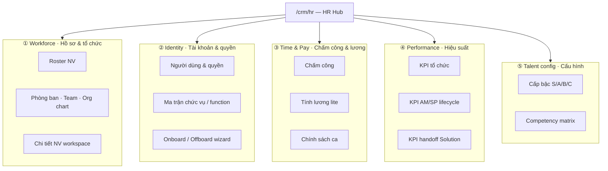
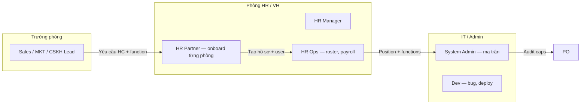
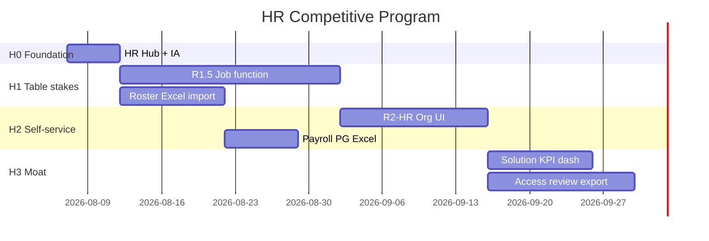

# Chương trình tổ chức HR — Cạnh tranh HRM chuyên nghiệp

> **Document ID:** HR-ORG-PROGRAM-20260807  
> **Phiên bản:** 1.0 · **Ngày:** 2026-08-07  
> **Audience:** PO, HR Director, CFO, IT, trưởng phòng  
> **Parent:** [`2026-08-07-hr-enterprise-business-analysis.md`](./2026-08-07-hr-enterprise-business-analysis.md) · [`2026-08-07-rbac-hr-org-job-function-design.md`](./2026-08-07-rbac-hr-org-job-function-design.md)  
> **Master win spec:** [`2026-08-07-rnosai-competitive-win-master-spec.md`](./2026-08-07-rnosai-competitive-win-master-spec.md)  
> **Runbook vận hành:** [`../runbooks/rbac-hr-org-workflow.md`](../runbooks/rbac-hr-org-workflow.md)

---

## Mục lục

1. [Mục tiêu chương trình](#1-mục-tiêu-chương-trình)
2. [Tổ chức sản phẩm — 5 workspace HR](#2-tổ-chức-sản-phẩm--5-workspace-hr)
3. [Information Architecture & route map](#3-information-architecture--route-map)
4. [Tổ chức vận hành HR nội bộ PTT](#4-tổ-chức-vận-hành-hr-nội-bộ-ptt)
5. [Tổ chức triển khai (Program Office)](#5-tổ-chức-triển-khai-program-office)
6. [Lộ trình cạnh tranh H0 → H3](#6-lộ-trình-cạnh-tranh-h0--h3)
7. [Ma trận cap & persona](#7-ma-trận-cap--persona)
8. [Governance & council](#8-governance--council)
9. [KPI chương trình](#9-kpi-chương-trình)
10. [Checklist go-live từng wave](#10-checklist-go-live-từng-wave)

---

## 1. Mục tiêu chương trình

### 1.1. Một câu

Biến HR từ **module rời trong CRM** thành **Workforce & Performance Hub** chuyên nghiệp — đủ table stakes HRM (~60%) + moat Revenue-linked HR (100%).

### 1.2. Ba kết quả bắt buộc

| # | Kết quả | Đo bằng |
|---|---------|---------|
| K1 | HR self-service — không SQL/IT ticket | Onboard ≤15 ph |
| K2 | Identity × CRM — đúng quyền từng phòng | UAT persona 100% pass |
| K3 | Performance = doanh thu — KPI gắn funnel | KPI Solution team live |

### 1.3. Không mục tiêu

- Thay Getfly/MISA HRM full (BHXH, GPS, phép năm enterprise)
- Bán HR như sản phẩm SaaS độc lập

---

## 2. Tổ chức sản phẩm — 5 workspace HR

Chuẩn HRM chuyên nghiệp (BambooHR, Base, Getfly) chia module theo **workspace**. PTT áp dụng 5 workspace gắn Revenue OS:



| Workspace | Pitch vs Getfly | Moat PTT |
|-----------|-----------------|----------|
| **Workforce** | Parity roster + org tree | Link CRM owner_id |
| **Identity** | Parity user + role | Job function + SoD + audit |
| **Time & Pay** | Lite — không GPS | Export → MISA |
| **Performance** | **Vượt** — KPI generic | Lead + handoff + ROAS |
| **Talent config** | Parity levels | Gắn auto-assign pool |

---

## 3. Information Architecture & route map

### 3.1. Hub canonical

**Entry point:** `/crm/hr` — HR Hub (launcher theo cap, nhóm 5 workspace).

Sidebar OpsNav: **Nhân sự & Hiệu suất** → link đầu tiên **HR Hub** → các module con.

### 3.2. Route map (as-is → target)

| Workspace | Route | Phase | Cap |
|-----------|-------|-------|-----|
| Hub | `/crm/hr` | **H0 ✅** | roster \|\| payroll \|\| kpi |
| Roster | `/crm/staff` | ✅ | `crm_staff_roster.view` |
| Chi tiết NV | `/crm/staff/[id]` | ✅ | `crm_staff_roster.view` |
| Phòng ban | `/admin/crm/org/departments` | R2-HR | `crm_staff_departments.view` |
| Team | `/admin/crm/org/teams` | R2-HR | `crm_staff_departments.view` |
| Chức vụ metadata | `/admin/crm/org/positions` | R2-HR | `crm_data_config.view` |
| Người dùng & quyền | `/admin/crm/org/users` | R2-HR | `crm_staff_roster.edit` + configure |
| Ma trận chức vụ | `/admin/crm/permissions` | ✅ | `crm_data_config.view` |
| Ma trận function | `/admin/crm/permissions/functions` | R1.5 | `crm_data_config.view` |
| Chấm công & lương | `/crm/payroll` | ✅ | `crm_payroll_*` |
| KPI tổ chức | `/crm/kpi` | ✅ | `crm_kpi_records.view` |
| KPI AM/SP | `/crm/staff-kpi` | ✅ | `crm_staff_kpi_am_sp.view` |
| Levels | `/crm/staff?tab=levels` | H1 | `crm_staff_roster.edit` |
| Competency | `/crm/staff?tab=competency` | H1 | `crm_staff_roster.edit` |

### 3.3. Tách Admin vs HR operational

| Shell | Route prefix | Persona |
|-------|--------------|---------|
| **CrmHrPageShell** | `/crm/hr`, `/crm/staff*`, `/crm/payroll`, `/crm/staff-kpi` | HR, VH, CFO |
| **AdminPageShell** | `/admin/crm/org/*`, `/admin/crm/permissions*` | HR + Admin + PO |

HR thường **không** sửa ma trận caps — chỉ gán user/position/function trên org/users.

---

## 4. Tổ chức vận hành HR nội bộ PTT

### 4.1. Cơ cấu phòng HR × IT (RACI)



### 4.2. Quy trình chuẩn (SOP) — 4 luồng

#### Luồng A — Onboard (≤15 ph sau R2-HR)

| Bước | Owner | Hệ thống | SLA |
|------|-------|----------|-----|
| A1 | Trưởng phòng | Email yêu cầu + position + functions đề xuất | D0 |
| A2 | HR Partner | `/crm/staff` — tạo hồ sơ | ≤5 ph |
| A3 | HR Ops | `/admin/crm/org/users` — login + caps | ≤10 ph |
| A4 | NV | Login + checklist UAT | D0 |
| A5 | HR | Đóng ticket | D0 |

#### Luồng B — Chuyển phòng / đổi chức vụ

| Bước | Owner | Gate |
|------|-------|------|
| B1 | Trưởng phòng + PO | Approve đổi position |
| B2 | HR | PATCH org/users |
| B3 | System | Toast re-login + audit |

#### Luồng C — Chốt KPI tháng

| Ngày | Việc | Owner |
|------|------|-------|
| T+0 | Auto metrics CRM | System |
| T+1 | Review `/crm/staff-kpi` | Trưởng phòng |
| T+2 | GDKD duyệt export `/crm/kpi` | GDKD |
| T+3 | HR + CFO thưởng | HR/CFO |
| T+5 | Optional payroll bonus line | HR |

#### Luồng D — Offboard (same day)

| Bước | Owner |
|------|-------|
| D1 | HR nhận notice |
| D2 | AM Lead reassign lead |
| D3 | HR deactivate user + audit |
| D4 | IT spot-check 403 |

### 4.3. Lịch vận hành HR

| Tần suất | Hoạt động | Tham dự |
|----------|-----------|---------|
| **Hàng ngày** | Onboard/offboard ticket | HR Ops |
| **Hàng tuần** | Roster completeness check | HR Manager |
| **Hàng tháng** | KPI close + payroll | HR + CFO + GDKD |
| **Hàng quý** | Access review export | HR + PO + IT |
| **Hàng năm** | Ma trận position review | PO + trưởng phòng |

---

## 5. Tổ chức triển khai (Program Office)

### 5.1. Squad map

| Squad | Scope | Deliverable |
|-------|-------|-------------|
| **S-HR-1 Identity** | R1.5 job function, effective caps | Function matrix UI |
| **S-HR-2 Org** | R2-HR dept/team/user | Onboard wizard |
| **S-HR-3 Workforce UX** | Hub, roster form, Excel import | `/crm/hr`, staff edit |
| **S-HR-4 Pay** | Payroll PG migration, Excel export | HR-PAY-1 |
| **S-HR-5 Performance** | Solution KPI dimension, handoff SLA dashboard | HR-KPI-1 |
| **S-HR-6 Governance** | SoD, org audit, access review | R2-HR-S3, R3 |

### 5.2. Timeline gộp (12 tuần)



### 5.3. Dependency

```
R1-S3 ✅ → R1.5 function → R2-HR org/users → HR-KPI-1
         ↘ HR Hub H0 (song song)
Roster Excel → Payroll export
P3 handoff prod → Solution KPI metrics
```

---

## 6. Lộ trình cạnh tranh H0 → H3

### H0 — Foundation (tuần 1) ✅ hub

| Deliverable | Cạnh tranh |
|-------------|------------|
| `/crm/hr` hub 5 workspace | Getfly có menu HRM tập trung |
| OpsNav section đổi tên | UX chuyên nghiệp |
| Runbook + training slide | HR biết luồng |

**Pitch:** *“HR có hub riêng — không lẫn trong CRM lead.”*

### H1 — Table stakes (tuần 2–5)

| Deliverable | vs Getfly |
|-------------|-----------|
| R1.5 job function | Linh hoạt hơn role cứng |
| Excel import roster | Parity |
| Levels/competency form | Parity config |
| `?tab=` deep link staff | UX nhỏ |

**Pitch:** *“Phân quyền content/design không clone chức vụ.”*

### H2 — Self-service (tuần 6–9)

| Deliverable | vs Base/HappyTime |
|-------------|-------------------|
| Org CRUD UI | Parity org |
| Onboard wizard ≤15 ph | Parity onboarding |
| Payroll PG + Excel | Credibility CFO |
| Offboard wizard | Security parity |

**Pitch:** *“HR không cần IT SQL — onboard 15 phút.”*

### H3 — Moat (tuần 10–12)

| Deliverable | vs mọi HRM VN |
|-------------|---------------|
| KPI Solution handoff SLA | **Độc quyền** |
| Effective caps export quý | Enterprise audit |
| Org chart visual | Getfly parity |
| SSO R4 prep doc | Deal 100+ NV |

**Pitch:** *“KPI NV = doanh thu CRM — không phải số KH trên Excel.”*

---

## 7. Ma trận cap & persona

### 7.1. Persona × workspace

| Persona | W1 Workforce | W2 Identity | W3 Pay | W4 Perf | W5 Config |
|---------|:------------:|:-----------:|:------:|:-------:|:---------:|
| **HR Manager (VH-01)** | ✅ edit | ✅ users | ✅ view | ✅ view | ✅ edit |
| **HR Ops** | ✅ edit | ○ users | ✅ edit | ○ | ○ |
| **CFO** | ○ view | ○ | ✅ export | ✅ export | ○ |
| **GDKD** | ○ | ○ | ○ | ✅ all | ○ |
| **Trưởng phòng** | ○ view team | ○ | ○ | ✅ team | ○ |
| **System Admin** | ○ | ✅ matrix | ○ | ○ | ○ |
| **NV thường** | ○ self | ○ | ○ self payslip* | ○ self* | ○ |

*P3 payslip self-service defer

### 7.2. Cap registry HR (mở rộng R2-HR)

| Section | Actions | Workspace |
|---------|---------|-----------|
| `crm_staff_roster` | view, edit | W1 |
| `crm_staff_departments` | view, configure | W1 |
| `crm_data_config` | view, configure | W2 |
| `crm_payroll_attendance` | view, edit | W3 |
| `crm_payroll_salary` | view, edit, export | W3 |
| `crm_kpi_records` | view, edit, export | W4 |
| `crm_staff_kpi_am_sp` | view | W4 |

---

## 8. Governance & council

### 8.1. HR Steering Council (họp 2 tuần/lần)

| Thành viên | Vai trò |
|------------|---------|
| PO | Chủ trì — scope, ma trận |
| HR Manager | Roster, payroll, SOP |
| IT Admin | Caps, deploy, incident |
| GDKD | KPI policy |
| Head MKT + Head CSKH | Function catalog UAT |

**Agenda cố định:**

1. Onboard/offboard tuần qua  
2. Incident 403 / cap  
3. KPI close status  
4. Blocker program H0–H3  

### 8.2. Change control ma trận

| Thay đổi | Approver | Tool |
|----------|----------|------|
| Position matrix | PO + PDF ký | `/admin/crm/permissions` |
| Function add-on matrix | PO + Head dept | `/admin/crm/permissions/functions` |
| Gán function 1 NV | HR + Admin | `/admin/crm/org/users` |
| Permission set tạm | PO + GDKD | R2-B |

---

## 9. KPI chương trình

| KPI | Baseline | H1 | H2 | H3 |
|-----|----------|----|----|-----|
| Onboard time | ~2h | 45 ph | **≤15 ph** | ≤15 ph |
| HR tickets IT/login | ~8/tuần | 4 | **≤1** | 0 |
| Roster completeness (dept+position) | ~70% | 85% | **95%** | 98% |
| Ghost account post-offboard | ? | 0 | **0** | 0 |
| KPI Solution on dashboard | 0% | 0% | 50% | **100%** |
| Access review quý | Ad-hoc | ○ | ○ | **✅ export** |

---

## 10. Checklist go-live từng wave

### H0 — HR Hub (tuần 1)

- [ ] `/crm/hr` live prod
- [ ] OpsNav → HR Hub đầu section
- [ ] Runbook cập nhật luồng A–D
- [ ] Training HR 30 phút

### H1 — Table stakes

- [ ] R1.5 function deploy
- [ ] Excel import roster
- [ ] Persona content ≠ design UAT pass

### H2 — Self-service

- [ ] org/users wizard
- [ ] EC-01 onboard ≤15 ph (3 NV thật)
- [ ] Payroll Excel CFO sign-off

### H3 — Moat

- [ ] Solution KPI dashboard
- [ ] Quarterly access review export
- [ ] Demo 30 ph script HR enterprise pass

---

## Phụ lục — Tài liệu liên quan

| Doc | Vai trò |
|-----|---------|
| [`2026-08-07-hr-enterprise-business-analysis.md`](./2026-08-07-hr-enterprise-business-analysis.md) | Phân tích nghiệp vụ |
| [`2026-08-07-rbac-hr-org-job-function-ui-ux-design.md`](./2026-08-07-rbac-hr-org-job-function-ui-ux-design.md) | UI org/users |
| [`2026-08-07-rbac-hr-org-job-function-implementation-plan.md`](./2026-08-07-rbac-hr-org-job-function-implementation-plan.md) | Dev backlog |

---

*Changelog v1.0 — 2026-08-07: Chương trình tổ chức HR cạnh tranh HRM chuyên nghiệp.*
