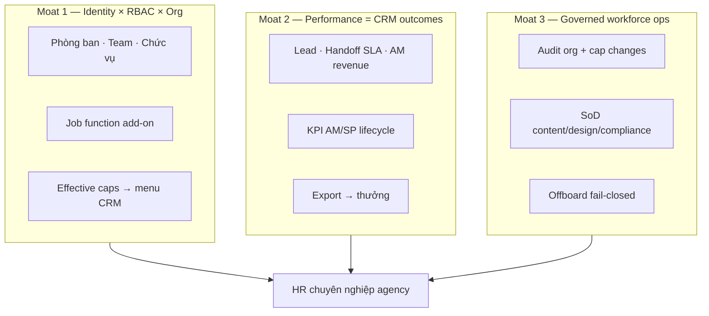
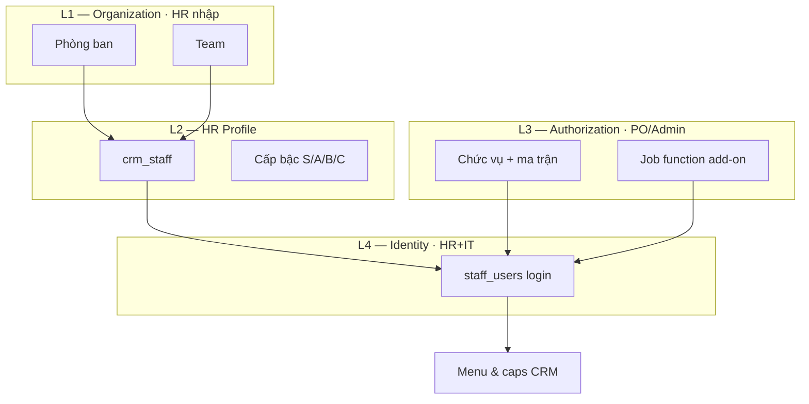
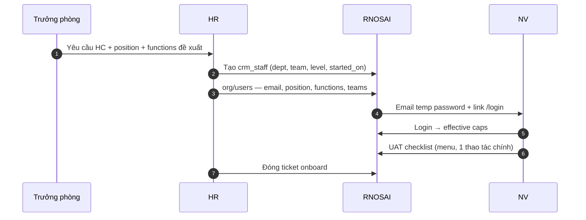

# Phân tích nghiệp vụ HR — Hướng tới ứng dụng chuyên nghiệp vượt đối thủ

> **Document ID:** HR-BA-ENTERPRISE-20260807  
> **Phiên bản:** 1.0 · **Ngày:** 2026-08-07  
> **Audience:** PO, HR, CFO, IT, trưởng phòng  
> **Phạm vi:** Module Nhân sự trong RNOSAI (`/crm/staff`, `/crm/payroll`, `/crm/staff-kpi`, Identity/RBAC HR-ORG)  
> **Nguồn:** [`2026-08-07-rbac-hr-org-job-function-design.md`](./2026-08-07-rbac-hr-org-job-function-design.md) · [`2026-08-07-crm-enterprise-business-analysis.md`](./2026-08-07-crm-enterprise-business-analysis.md) · [`crm-getfly-gap-matrix.md`](./crm-getfly-gap-matrix.md) §17–18 · [`../runbooks/rbac-hr-org-workflow.md`](../runbooks/rbac-hr-org-workflow.md)

---

## Mục lục

1. [Tóm tắt điều hành](#1-tóm-tắt-điều-hành)
2. [Định vị HR trong Revenue OS — không phải HRM generic](#2-định-vị-hr-trong-revenue-os--không-phải-hrm-generic)
3. [As-is: module HR hiện có](#3-as-is-module-hr-hiện-có)
4. [Phân tích theo 7 trụ nghiệp vụ HR](#4-phân-tích-theo-7-trụ-nghiệp-vụ-hr)
5. [Mô hình Identity 4 lớp (HR × IT × RBAC)](#5-mô-hình-identity-4-lớp-hr--it--rbac)
6. [Luồng nghiệp vụ HR chi tiết](#6-luồng-nghiệp-vụ-hr-chi-tiết)
7. [Performance HR gắn CRM (moat)](#7-performance-hr-gắn-crm-moat)
8. [Ma trận gap vs đối thủ HRM VN](#8-ma-trận-gap-vs-đối-thủ-hrm-vn)
9. [Quy tắc nghiệp vụ (Business Rules Registry)](#9-quy-tắc-nghiệp-vụ-business-rules-registry)
10. [Chỉ số & SLA vận hành HR](#10-chỉ-số--sla-vận-hành-hr)
11. [Lộ trình nâng cấp nghiệp vụ](#11-lộ-trình-nâng-cấp-nghiệp-vụ)
12. [Khuyến nghị tổ chức & compliance](#12-khuyến-nghị-tổ-chức--compliance)
13. [Checklist demo HR enterprise](#13-checklist-demo-hr-enterprise)

---

## 1. Tóm tắt điều hành

### 1.1. HR PTT hiện là gì?

Module HR trong RNOSAI **không độc lập** — nằm trong **Revenue Operating System**, phục vụ agency/marketing performance:

| Thành phần | Route | Vai trò nghiệp vụ |
|------------|-------|-------------------|
| **Roster nhân viên** | `/crm/staff` | Master data NV (hồ sơ, import, levels, competency) |
| **Chi tiết NV** | `/crm/staff/[id]` | Workspace read-only (KPI mini, lead liên quan) |
| **Chấm công & lương lite** | `/crm/payroll` | Policy, attendance, tính lương theo giờ |
| **KPI AM/SP** | `/crm/staff-kpi` | Hiệu suất gắn lifecycle dịch vụ |
| **KPI tổ chức** | `/crm/kpi` | Export Excel phục vụ thưởng |
| **Identity/RBAC** | `/admin/crm/org/*`, permissions | Onboard, org, job function (R1.5/R2-HR) |

### 1.2. “Chuyên nghiệp hơn đối thủ” nghĩa là gì?

| Đối thủ HRM VN | Họ mạnh | PTT **không** cạnh |
|----------------|---------|-------------------|
| **Getfly HRM** | Chấm công app, lương, phép, org tree | SME all-in-one giá rẻ |
| **MISA AMIS / FAST HRM** | BHXH, thuế TNCN, liên thông kế toán | Full payroll compliance |
| **Base / HappyTime / 1Office** | GPS chấm công, phép, hợp đồng LD | HR SaaS standalone |
| **BambooHR** | Onboarding checklist, PTO, eNPS | Global SMB HRIS |

PTT thắng khi HR leader hỏi:

> *“Onboard NV Sales + Solution trong 15 phút có đúng quyền CRM? KPI NV có gắn lead/handoff/ROAS không? Ai được claim case Solution — audit được không?”*

— câu **HRM generic không trả lời** vì không gắn Revenue OS.

### 1.3. Ba moat HR (khó copy)



### 1.4. Kết luận chiến lược

**Table stakes HRM (~60%)** — roster Excel, chấm công cơ bản, org chart đơn giản — **+ moat Revenue-linked HR (100%)** — không build BHXH/thuế full thay MISA.

---

## 2. Định vị HR trong Revenue OS — không phải HRM generic

### 2.1. Category

```text
Workforce & Performance OS — HR gắn vận hành doanh thu marketing
(hoạt động bên trong CRM/Revenue OS, không bán như phần mềm HRM riêng)
```

### 2.2. Phân khúc & đối thủ thực tế

| Khách PTT | Nhu cầu HR | Tool họ dùng hôm nay | RNOSAI thay thế |
|-----------|------------|----------------------|-----------------|
| Agency 30–200 NV | Onboard nhanh, phân quyền theo phòng | Excel + IT SQL + Getfly lẻ | Org UI + RBAC + roster |
| Brand in-house | KPI MKT gắn campaign | Excel KPI + HRM chấm công | staff-kpi + CRM KPI |
| PTT nội bộ | Sales/Solution/CSKH khác quyền | Ma trận giấy + SQL | Job function + audit |

### 2.3. IN scope vs OUT scope

| IN scope | OUT scope (🚫) |
|----------|----------------|
| Hồ sơ NV, phòng ban, team, chức vụ metadata | Sổ BHXH, quyết toán thuế TNCN |
| Onboard/offboard + login + caps | Tuyển dụng ATS (job board, CV pipeline) |
| Chấm công + tính lương **lite** nội bộ | Liên thông lương MISA/FAST |
| KPI gắn CRM (lead, handoff, lifecycle) | eLearning / LMS đầy đủ |
| Levels S/A/B/C, competency config | Đánh giá 360° enterprise |
| Audit org + permission | Payroll outsourcing compliance |

---

## 3. As-is: module HR hiện có

### 3.1. Màn hình & maturity

| Route | Shipped | UX maturity | Gap chính |
|-------|:-------:|:-------------:|-----------|
| `/crm/staff` roster | ✅ | ○ | JSON import; levels/competency editor thô |
| `/crm/staff` import | ✅ | ○ | Không Excel template |
| `/crm/staff/[id]` | ✅ | ○ | Read-only; thiếu edit hồ sơ form |
| `/crm/payroll` | ✅ | ○ | JSON export; engine SQLite legacy |
| `/crm/staff-kpi` | ✅ | ○ | Chart compare ○ |
| `/crm/kpi` staff export | ✅ | ✅ | Gắn thưởng OK |
| `/admin/crm/org/*` | ❌ | — | R2-HR |
| Job function assign | ❌ | — | R1.5 |
| Org tree UI | ❌ | — | R2-HR |

### 3.2. Data model (PostgreSQL)

| Bảng | Nội dung | Ghi chú |
|------|----------|---------|
| `crm_staff` | Hồ sơ NV: name, email, dept, position, reports_to | `job_title` free-text — gap RBAC |
| `crm_departments` | Phòng ban | Có DDL; chưa UI CRUD |
| `crm_positions` | Chức vụ metadata | Tách `staff_section_permissions` |
| `crm_staff_settings` | `staff_levels`, `competency` JSON | Admin JSON — cần form UI |
| `crm_staff_kpi` | KPI period per staff | Gắn CRM metrics |
| `staff_users` | Login UUID + `position_id` | Tạo SQL thủ công |
| `staff_job_functions` | R1.5 | Chưa deploy |
| `staff_org_audit` | R2-HR | Chưa deploy |

### 3.3. Pain as-is (đã xác minh)

| # | Pain | Tác động nghiệp vụ | KPI |
|---|------|---------------------|-----|
| P1 | Onboard ~2h (SQL `staff_users`) | NV không làm việc ngày 1 | Time-to-productivity |
| P2 | `job_title` ≠ RBAC | HR nhập sai → 403 hoặc thừa quyền | Security incident |
| P3 | Không org tree UI | HR gọi IT mọi thay đổi phòng | IT ticket volume |
| P4 | Levels/competency = JSON | Chỉ dev sửa được | HR self-service 0% |
| P5 | Payroll SQLite engine | Lệch PG prod policy | Payroll dispute |
| P6 | KPI tách rời handoff SLA | Không đo Solution team | Blind spot MKT |
| P7 | Offboard thủ công | Quên revoke → ghost access | SoD risk |

---

## 4. Phân tích theo 7 trụ nghiệp vụ HR

CRM enterprise có 7 trụ revenue; **HR enterprise** có 7 trụ workforce:

### 4.1. Trụ 1 — Workforce Master Data (Hồ sơ & cơ cấu)

**Nghiệp vụ:** Single source of truth nhân viên — liên kết CRM owner, lifecycle AM/SP.

| Capability | As-is | Target | vs Getfly HRM |
|------------|-------|--------|---------------|
| Roster list + search | ✅ | ✅ | Parity |
| Import JSON batch | ✅ | Excel template P0-2 | Getfly ✅ Excel |
| Form edit hồ sơ | ❌ | R2-HR form | Getfly ✅ |
| Phòng ban CRUD | ❌ DDL only | R2-HR UI | Getfly ✅ |
| Org chart / reports_to | ○ field | Tree view R2-HR | Getfly ✅ |
| employment_type, started_on | ✅ PG | Form + validation | Parity |
| internal_code unique | ✅ | Hiển thị badge | Parity |

**BR:** BR-HR-001 — `internal_code` unique khi khác rỗng.

**Professional =** hồ sơ NV liên kết `department_id`, `position_id`, `reports_to_id` — không chỉ text `department`.

---

### 4.2. Trụ 2 — Identity & Access (IAM workforce)

**Nghiệp vụ:** NV có tài khoản → đúng caps → đúng menu CRM — onboard ≤15 ph, offboard same-day.

| Capability | As-is | Target |
|------------|-------|--------|
| `staff_users` login | ✅ SQL/manual | R2-HR UI wizard |
| Position → base caps | ✅ ma trận | Giữ |
| Job function add-on | ❌ | R1.5 |
| Effective caps preview | ❌ | R2-HR user drawer |
| Offboard deactivate | ○ SQL | R2-HR 1-click + checklist |
| Re-login after cap change | ○ manual | Toast + runbook |
| SSO Keycloak | ❌ | R4 |

**Luồng target (R2-HR):**

```
HR tạo crm_staff → org/users: email + position + functions → temp password → NV login → UAT checklist
```

**vs HubSpot:** Permission bundles + teams — PTT đạt tương đương qua **position + job function + permission set (R2-B)**.

**KPI:** Onboard time ≤15 ph; offboard revoke ≤1h; 0 ghost account 30 ngày sau offboard.

---

### 4.3. Trụ 3 — Time & Attendance (Chấm công)

**Nghiệp vụ:** Ghi nhận giờ làm, muộn, OT — input cho payroll lite.

| Capability | As-is | Gap vs HappyTime/Base |
|------------|-------|-------------------------|
| Policy shift (T2–T6 8:30–17:30) | ✅ | GPS/mobile check-in ❌ |
| Attendance log list | ✅ | Excel import ○ |
| Late penalty rules | ✅ engine | — |
| OT multiplier | ✅ | — |
| Leave / phép năm | ❌ | Getfly/Base ✅ |
| Integration máy chấm công | ❌ | Optional P3 |

**Định vị:** Chấm công **lite** cho văn phòng agency — manual + policy engine; **không** cạnh GPS HRM field force.

**BR:** BR-HR-010 — Thiếu attendance tháng → payroll compute cảnh báo partial (CRM-UC-013 E1).

---

### 4.4. Trụ 4 — Compensation & Payroll lite

**Nghiệp vụ:** Tính lương theo giờ + thưởng chuyên cần — **export JSON/Excel cho kế toán**, không thay MISA.

| Capability | As-is | vs MISA/FAST payroll |
|------------|-------|----------------------|
| Compute payroll period | ✅ | Full BHXH/thuế ❌ MISA |
| Position hourly rate | ✅ | — |
| Bonus attendance % | ✅ | — |
| Export JSON | ✅ | Excel payslip ○ |
| Payslip PDF NV self-service | ❌ | Getfly ○ |
| Liên thông kế toán | ❌ | 🚫 OUT — export |

**Copy footer bắt buộc:** *“Module tính lương nội bộ — không thay phần mềm lương MISA/FAST. Kế toán nhập số liệu đã duyệt.”*

**Tech debt:** `payroll-sqlite.repository.ts` — migrate PG SSoT (HR-PAY-1).

---

### 4.5. Trụ 5 — Performance Management (gắn CRM — moat #2)

**Nghiệp vụ:** Đo hiệu suất theo **kết quả kinh doanh**, không chỉ chấm công.

| Nguồn KPI | Metric | Màn hình |
|-----------|--------|----------|
| Lead funnel | B2 rate, leads handled | `/crm/kpi`, staff export |
| Handoff P3 | Go→Handoff, Consult cycle | **Thiếu** — cần dimension team |
| Lifecycle AM | received_revenue, margin | `/crm/staff-kpi` role=am |
| Lifecycle SP | tasks_completed, risks | `/crm/staff-kpi` role=sp |
| CSKH | SLA breach count | cskh-board → staff KPI |
| AI | Copilot acceptance by staff | `/crm/ai/insights` G6 |

**vs Getfly KPI NV:** Getfly gắn “KH/NV”; PTT gắn **lead → HĐ → ROAS** — sâu hơn cho agency.

**Gap:**

- `/crm/staff-kpi`: bar chart compare NV cùng role ○
- KPI Solution team chưa tách khỏi Sales trên `/crm/kpi`
- Drill `/crm/staff/[id]` → pagination lead list ○

**BR:** BR-HR-020 — KPI export chỉ tenant hiện tại; cap `crm_staff_roster` hoặc `crm_staff_kpi_am_sp`.

---

### 4.6. Trụ 6 — Talent Framework (Levels & Competency)

**Nghiệp vụ:** Cấp bậc S/A/B/C cho routing lead; competency map cho assignment pool.

| Capability | As-is | Target |
|------------|-------|--------|
| `staff_levels` config | ✅ JSON editor | Form UI R2-HR |
| `competency` matrix | ✅ JSON editor | Grid UI R2-HR |
| Link level → auto-assign pool | ○ | `crm_lead_auto_assign` |
| Job function vs level | R1.5 | Function = chuyên môn; Level = seniority |

**Phân biệt khái niệm (HR training):**

| Khái niệm | Ví dụ | Ai quản lý |
|-----------|-------|------------|
| **Cấp bậc (level)** | S, A, B, C | HR |
| **Chức vụ (position)** | KD-01, MKT-02 | PO/Admin |
| **Job function** | content, leader | Admin per user |
| **Job title** | “Senior Copywriter” | HR — display only |

**Professional:** `job_title` **không** quyết định quyền — chỉ `position` + `functions`.

---

### 4.7. Trụ 7 — Compliance, Audit & Offboard

**Nghiệp vụ:** Truy vết thay đổi org/quyền; offboard an toàn; access review.

| Capability | As-is | Target |
|------------|-------|--------|
| `staff_permission_audit` | ✅ R1-S3 | Giữ |
| `staff_org_audit` | ❌ | R2-HR |
| SoD validator | ❌ | R1.5 UI + R2 API 409 |
| Offboard checklist | ○ runbook | R2-HR wizard |
| Retention `crm_staff` | ✅ policy | Không xóa — chỉ deactivate |
| Quarterly access review export | ○ MD | R3 JSON effective caps |
| Labor contract storage | ❌ | 🚫 defer — DMS ngoài |

**Offboard nghiệp vụ (bắt buộc):**

1. `staff_users.active = false`
2. Gỡ job_functions, teams, permission_sets
3. Audit `offboard`
4. Giữ `crm_staff` (HR retention)
5. Reassign lead owner nếu AM offboard

---

## 5. Mô hình Identity 4 lớp (HR × IT × RBAC)



**HR chịu trách nhiệm:** L1, L2, tạo L4 (với IT).  
**PO/Admin chịu trách nhiệm:** L3 ma trận.  
**IT chịu trách nhiệm:** SSO R4, VPS, backup.

---

## 6. Luồng nghiệp vụ HR chi tiết

### 6.1. Onboard nhân viên mới



| Bước | As-is R1 | Target R2-HR | SLA |
|------|----------|--------------|-----|
| Tạo hồ sơ | Import JSON | Form + Excel | ≤5 ph |
| Tạo login + quyền | SQL IT | org/users wizard | ≤10 ph |
| UAT NV | Manual | Checklist in-app | ≤1 ngày |
| **Tổng** | ~2h | **≤15 ph** | EC-01 |

---

### 6.2. Thay đổi phòng ban / báo cáo

| Trigger | HR action | Hệ thống |
|---------|-----------|----------|
| Chuyển phòng | PATCH staff dept + team | Audit org |
| Đổi quản lý trực tiếp | PATCH reports_to_id | Org chart update |
| Đổi chức vụ | PO approve → org/users position | Re-login + audit |
| Thêm function chuyên môn | Admin tick function | SoD check |

**Không làm:** Sửa ma trận chức vụ để phân biệt content/design — dùng **job function**.

---

### 6.3. Chốt KPI tháng → thưởng

```mermaid
flowchart LR
  A[CRM auto metrics] --> B[/crm/staff-kpi]
  B --> C[GDKD review]
  C --> D[Export Excel /crm/kpi]
  D --> E[HR + CFO thưởng]
  E --> F[Payroll bonus line optional]
```

| Bước | Actor | Output |
|------|-------|--------|
| 1 | System | Metrics live từ lead/lifecycle |
| 2 | Team lead | Review `/crm/staff-kpi` |
| 3 | GDKD | Approve export |
| 4 | HR | Map bonus policy |
| 5 | Payroll | Optional `bonus` line in compute |

---

### 6.4. Offboard

| Bước | Nghiệp vụ | System |
|------|-----------|--------|
| 1 | HR nhận notice | Ticket |
| 2 | Reassign lead/case | CRM assign API |
| 3 | Deactivate login | `staff_users.active=false` |
| 4 | Revoke functions/teams | PUT empty arrays |
| 5 | Audit | `staff_org_audit` offboard |
| 6 | Giữ hồ sơ | `crm_staff.active=false`, `ended_on` |

**BR-HR-030:** Không xóa `crm_staff` — retention 5 năm (config PO).

---

### 6.5. Chấm công & chốt lương tháng

| Ngày | Việc | Actor |
|------|------|-------|
| Daily | NV/HR log attendance | HR |
| T+0 cuối tháng | HR review attendance | HR |
| T+1 | Compute payroll | HR + cap edit |
| T+2 | GDKD/CFO approve | Export JSON |
| T+3 | Kế toán MISA nhập | External |

---

## 7. Performance HR gắn CRM (moat)

### 7.1. KPI dictionary theo role

| Role | KPI nghiệp vụ | Nguồn | Màn hình |
|------|---------------|-------|----------|
| CSKH | B2 rate, contact time, SLA breach | lead funnel | kpi, cskh-board |
| AM Sales | Pipeline, handoff time, win rate | presales, proposals | staff-kpi, sales |
| Solution | Queue age, consult cycle, release | solution/queue | **cần dashboard** |
| Content | SEO/email output | SEO/Email OS | Channel modules |
| Design | Creative approved, launch QA pass | creatives | Launch QA |
| GDKD | Review queue, team aggregate | hub | business-dashboard |

### 7.2. Thang điểm “HR chuyên nghiệp agency”

Getfly trả lời: *“NV X chăm bao nhiêu KH?”*  
PTT trả lời: *“NV X tạo bao nhiêu doanh thu attributed, handoff có đúng SLA, caps có audit?”*

Đó là **performance HR gắn revenue** — moat không copy nhanh.

---

## 8. Ma trận gap vs đối thủ HRM VN

### 8.1. Scorecard (1–5)

| Hạng mục | Getfly HRM | MISA HRM | Base/HappyTime | PTT now | PTT +12m |
|----------|:----------:|:--------:|:--------------:|:-------:|:--------:|
| Roster + org chart | 4 | 4 | 4 | 2 | 4 |
| Onboard self-service | 3 | 3 | 4 | 1 | 4 |
| Chấm công mobile/GPS | **5** | 4 | **5** | 2 | 3 |
| Phép năm / leave | 4 | 4 | **5** | 1 | 2* |
| Payroll compliance VN | 3 | **5** | 4 | 2 | 2* |
| KPI gắn CRM/revenue | 2 | 2 | 1 | **4** | **5** |
| RBAC × org × audit | 2 | 2 | 2 | 3 | **5** |
| IAM job function | 1 | 1 | 1 | 1 | **5** |
| Offboard security | 2 | 3 | 3 | 2 | 4 |
| Multi-module agency | 1 | 1 | 1 | **5** | 5 |

*Payroll/leave lite cố ý — export ra MISA thay vì full compliance.*

### 8.2. Thắng / Bù / Không build

**Thắng ngay:**

- KPI AM/SP gắn lifecycle + lead
- RBAC position + audit (R1-S3)
- Identity gắn CRM menu (không HRM tách rời)
- Performance = handoff + revenue (khi P3 KPI live)

**Bù 6–12 tháng:**

- Org UI CRUD (R2-HR)
- Onboard wizard ≤15 ph
- Excel import roster
- Levels/competency form UI
- Payroll PG migration + Excel export

**Không build:**

- BHXH, thuế TNCN, sổ lao động điện tử full
- GPS chấm công công trường
- ATS tuyển dụng
- LMS đào tạo

---

## 9. Quy tắc nghiệp vụ (Business Rules Registry)

| ID | Quy tắc | Enforcement |
|----|---------|-------------|
| BR-HR-001 | `internal_code` unique | API |
| BR-HR-002 | `job_title` không quyết định caps | Policy + training |
| BR-HR-003 | Một user một `position_id` active | API |
| BR-HR-004 | Max 3 job_functions per user | UI + API |
| BR-HR-005 | SoD-01..04 block save | UI + 409 |
| BR-HR-010 | Missing attendance → payroll warning | Compute engine |
| BR-HR-020 | KPI export tenant-scoped | API guard |
| BR-HR-030 | Offboard không xóa crm_staff | API |
| BR-HR-031 | Offboard → deactivate user same day | Workflow |
| BR-HR-040 | Cap change → require re-login | UX toast |
| BR-HR-041 | Position matrix change → PO ticket | Process |

---

## 10. Chỉ số & SLA vận hành HR

### 10.1. North Star HR

| Metric | Baseline | Target |
|--------|----------|--------|
| Onboard time (hồ sơ + login + caps) | ~2h | ≤15 ph |
| Offboard revoke access | ~24h ad-hoc | ≤1h |
| Ghost accounts post-offboard | Unknown | 0 |
| HR tickets “IT tạo login” | High | −80% |
| KPI export → bonus cycle | Ad-hoc | Monthly D+3 |
| Roster data completeness | ~70% | ≥95% dept+position filled |

### 10.2. SLA nội bộ HR

| Việc | SLA | Owner |
|------|-----|-------|
| Onboard sau signed offer | ≤1 ngày làm việc | HR |
| Sửa phòng ban trên hệ thống | ≤4h | HR |
| Offboard same day last working | ≤2h | HR + IT |
| Payroll compute + export | T+2 tháng | HR |
| Access review quý | 1 lần/quý | HR + PO |

---

## 11. Lộ trình nâng cấp nghiệp vụ

### 11.1. Phase map

| Phase | Calendar | Nghiệp vụ unlock | Dev ref |
|-------|----------|------------------|---------|
| **R1** | ✅ | Ma trận + audit caps | R1-S3 |
| **R1.5** | 2–3 tuần | Job function; content≠design | HR-ORG spec |
| **R2-HR** | 2 tuần | Org UI, user wizard, onboard ≤15 ph | Implementation plan |
| **HR-PAY-1** | 1 tuần | Payroll PG SSoT + Excel export | Tech |
| **HR-UX-1** | 1 tuần | Levels/competency form; staff edit | FE |
| **HR-KPI-1** | 1 tuần | Solution team KPI dimension | BE+FE |
| **R2-B** | 2 tuần | Permission set tạm quyền | RBAC R2 |
| **R3-HR** | 2 tuần | Access review export; row scope | RBAC R3 |
| **R4** | 2 tuần | SSO — unblock enterprise HR+IT | Keycloak |

### 11.2. Ưu tiên backlog nghiệp vụ

| Ưu tiên | Bundle | Impact |
|---------|--------|--------|
| **P0** | R2-HR org/users onboard | Giảm 2h → 15 ph |
| **P0** | R1.5 job function | HR policy content/design |
| **P1** | Excel import roster | Getfly parity |
| **P1** | HR-PAY-1 PG + Excel | Credibility payroll |
| **P1** | HR-KPI-1 Solution SLA | Close blind spot |
| **P2** | Leave request lite | Optional — form đơn giản |
| **P3** | Payslip self-service portal | NV xem lương |

---

## 12. Khuyến nghị tổ chức & compliance

### 12.1. RACI HR module

| Hoạt động | HR | PO | IT Admin | CFO | Trưởng phòng |
|-----------|:--:|:--:|:--------:|:---:|:------------:|
| Roster master data | R | I | C | I | C |
| Org dept/team | R | A | C | I | C |
| Position matrix | C | A | R | I | C |
| Job function gán | C | A | R | I | R |
| Payroll compute | R | I | C | A | I |
| KPI export thưởng | C | R | I | A | R |
| Offboard | R | I | R | I | C |
| Access review quý | R | A | R | I | I |

### 12.2. Tách vai HR vs IT (training nội bộ)

| HR làm | IT/Admin làm |
|--------|--------------|
| Tạo/sửa hồ sơ NV | Sửa ma trận chức vụ (PO duyệt) |
| Tạo user + chọn position | Seed catalog caps |
| Gán team, dept | VPS, backup, SSO |
| Chấm công, chốt lương | Debug 403 (audit log) |
| Offboard checklist | Break-glass emergency |

### 12.3. Compliance VN (realistic)

| Yêu cầu | RNOSAI | Khuyến nghị |
|---------|--------|-------------|
| Lưu hồ sơ NV 5 năm | ✅ crm_staff retention | Policy PO |
| BHXH báo cáo | 🚫 | MISA/FAST |
| Hợp đồng LD scan | 🚫 | Google Drive / DMS |
| PDPA nội bộ consent | ○ | Field `consent_at` R3 |
| Audit truy cập | ✅ R1 audit | Quarterly export R3 |

---

## 13. Checklist demo HR enterprise

### 13.1. Demo 30 phút (prospect agency 50–150 NV)

| # | Scene | Proof |
|---|-------|-------|
| 1 | HR tạo NV mới + dept + position | org/users wizard |
| 2 | Gán function content vs design — menu khác | 2 browser |
| 3 | SoD block content+approve | Red banner |
| 4 | `/crm/staff-kpi` AM revenue vs target | Chart |
| 5 | `/crm/kpi` export Excel thưởng | Download |
| 6 | Offboard — menu biến mất | Same day |
| 7 | Audit ai đổi quyền lúc nào | permissions audit |
| 8 | Payroll compute + export | JSON/Excel |

### 13.2. Gate nội bộ “HR chuyên nghiệp hơn Getfly (niche)”

- [ ] Onboard ≤15 ph không SQL
- [ ] 100% NV có department_id + position_id
- [ ] Job function live cho MKT/Agency
- [ ] KPI Solution team trên dashboard
- [ ] Offboard 0 ghost account
- [ ] Payroll export Excel accepted by CFO

### 13.3. Gate “HR + IT enterprise 100+ NV”

- [ ] R4 SSO
- [ ] Quarterly access review export
- [ ] `staff_org_audit` complete
- [ ] Permission simulator (R3)
- [ ] PDPA consent field on staff

---

## Phụ lục A — Route map HR module

| Route | Persona | Cap chính |
|-------|---------|-------------|
| `/crm/staff` | HR, VH | `crm_staff_roster.view` |
| `/crm/staff/[id]` | HR, Lead | `crm_staff_roster.view` |
| `/crm/payroll` | HR, CFO | `crm_payroll_*` |
| `/crm/staff-kpi` | GDKD, Lead | `crm_staff_kpi_am_sp.view` |
| `/crm/kpi` | GDKD, HR | `crm_kpi_records.view` |
| `/admin/crm/org/*` | HR, Admin | `crm_staff_departments.*`, roster |
| `/admin/crm/permissions*` | Admin, PO | `crm_data_config.*` |

---

## Phụ lục B — Liên kết tài liệu

| Doc | Vai trò |
|-----|---------|
| [`2026-08-07-rbac-hr-org-job-function-design.md`](./2026-08-07-rbac-hr-org-job-function-design.md) | Data model Identity |
| [`2026-08-07-rbac-hr-org-job-function-ui-ux-design.md`](./2026-08-07-rbac-hr-org-job-function-ui-ux-design.md) | UI org/users |
| [`2026-08-07-crm-enterprise-business-analysis.md`](./2026-08-07-crm-enterprise-business-analysis.md) | CRM × HR intersection |
| [`../runbooks/rbac-hr-org-workflow.md`](../runbooks/rbac-hr-org-workflow.md) | Vận hành HR |
| [`2026-08-07-hr-competitive-organization-program.md`](./2026-08-07-hr-competitive-organization-program.md) | Chương trình tổ chức H0–H3 |

---

*Changelog v1.0 — 2026-08-07: Phân tích nghiệp vụ HR enterprise vs Getfly/MISA/Base.*
