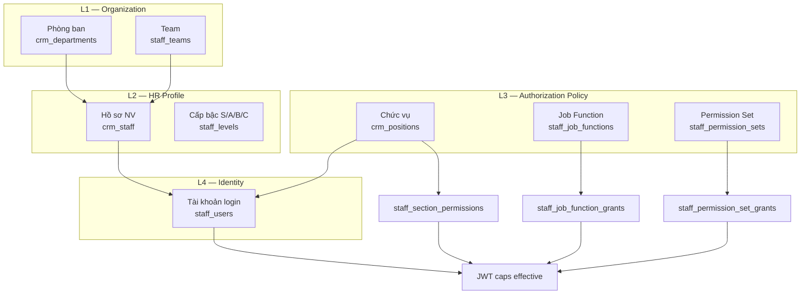
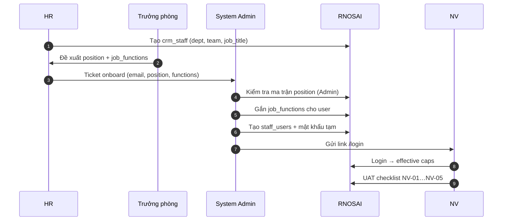
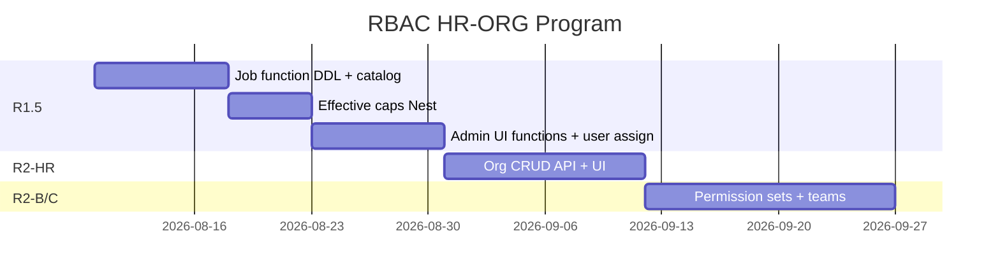

# Spec — HR · Org · Job Function · RBAC (Identity & Authorization)

> **Document ID:** RBAC-HR-ORG-20260807  
> **Phiên bản:** 1.0 · **Ngày:** 2026-08-07  
> **Trạng thái:** Draft — chờ PO / HR / IT sign-off  
> **Parent:** [`2026-08-06-rbac-enterprise-design.md`](./2026-08-06-rbac-enterprise-design.md) · [`PHAN_QUYEN_HUONG_DAN.md`](../PHAN_QUYEN_HUONG_DAN.md)  
> **Implementation plan:** [`2026-08-07-rbac-hr-org-job-function-implementation-plan.md`](./2026-08-07-rbac-hr-org-job-function-implementation-plan.md)  
> **Runbook (deliverable):** [`../runbooks/rbac-hr-org-workflow.md`](../runbooks/rbac-hr-org-workflow.md)  
> **Phân tích nghiệp vụ HR:** [`2026-08-07-hr-enterprise-business-analysis.md`](./2026-08-07-hr-enterprise-business-analysis.md)

---

## 1. Bối cảnh

### 1.1 Đã có (R1 — prod 2026-08-06)

| Thành phần | Trạng thái |
|------------|------------|
| PostgreSQL `staff_section_permissions` | ✅ SSoT caps |
| Nest `StaffAuthService.loadCaps(position_id)` | ✅ |
| Admin ma trận `/admin/crm/permissions` | ✅ R1-S3 |
| Audit `staff_permission_audit` | ✅ |
| Pilot positions `SUPER-ADMIN`, `KD-01`, `MKT-01`, `CSKH-01` | ✅ prod |
| Fail-closed UI + route guards | ✅ R1-S2 |

### 1.2 Gap (as-is)

| Gap | Tác động |
|-----|----------|
| Không UI tạo **phòng ban / chức vụ** | IT phải SQL |
| Không khái niệm **job function** (leader, design, content, sales…) | Phải clone cả chức vụ cho từng vai trò chuyên môn |
| `crm_staff.job_title` free-text | Không map RBAC |
| Gán user → position qua SQL `staff_users` | Onboard chậm (~2h/NG) |
| Không team dimension | Leader không scope team |
| Doc `PHAN_QUYEN` tham chiếu CMS legacy | HR nhầm đường dẫn |

### 1.3 Mục tiêu (to-be)

| Mục tiêu | KPI |
|----------|-----|
| **Identity model 4 lớp** | Org → Position → Job Function → Login |
| **Effective caps** | `union(position, job_functions[], permission_sets[])` |
| **HR self-service** | Tạo phòng ban, chức vụ, NV, gán function ≤ 15 ph (Admin) |
| **Không sửa cả ma trận** khi 1 NV khác chuyên môn | Permission Set / Function add-on |
| **Audit đầy đủ** | Org change + cap change + user assignment |
| **PostgreSQL-only** | Cấm SQLite (kế thừa R1 §3.2) |

**Ngoài phạm vi:** Keycloak SSO (R4), field-level ABAC (R3), payroll logic.

---

## 2. Mô hình khái niệm

### 2.1 Bốn lớp danh tính



### 2.2 Định nghĩa thuật ngữ

| Thuật ngữ | Code / bảng | Mô tả | Ai quản lý |
|-----------|-------------|-------|------------|
| **Phòng ban** | `crm_departments` | Sales, Solution, CSKH, Agency… | HR |
| **Team** | `staff_teams` | Nhóm con trong phòng (TEAM-SOLUTION…) | HR + trưởng phòng |
| **Chức vụ (Position)** | `crm_positions.code` | Hộ chiếu RBAC gốc: `KD-01`, `MKT-01`… | PO + Admin |
| **Job function** | `staff_job_functions.code` | Vai trò chuyên môn: `leader`, `content`, `design`, `sales`… | PO + Admin |
| **Permission set** | `staff_permission_sets.code` | Gói cap tùy biến / tạm thời | Admin |
| **Cấp bậc** | `staff_levels` | S/A/B/C — routing lead, KPI | HR (config) |
| **Tài khoản** | `staff_users` | Email login + `position_id` | HR + IT |

### 2.3 Công thức Effective Caps

```
effective_caps(user) =
    caps(position_id = user.position_id)                    -- base
  ∪ caps(job_function ∈ user.job_functions)                 -- add-on
  ∪ caps(permission_set ∈ user.permission_sets)           -- override / tạm
  ∪ break_glass_caps(user) if not expired                   -- R2-D
```

**Thứ tự ưu tiên deny (R2-C2b, optional):** explicit deny trên user > set > function > position.

**JWT payload mở rộng (R2):**

```json
{
  "sub": "uuid",
  "email": "user@pttads.vn",
  "position_id": 3,
  "position_code": "MKT-01",
  "job_functions": ["leader", "content"],
  "team_ids": [2, 5],
  "caps": [{"section": "crm_presales_solution", "action": "claim"}, "..."]
}
```

---

## 3. Catalog tổ chức PTT (baseline)

### 3.1 Phòng ban (`crm_departments`)

| code | name | Ghi chú |
|------|------|---------|
| `DEPT-SALES` | Phòng Kinh doanh B2B | AM, GDKD |
| `DEPT-SOLUTION` | Phòng Solution / Marketing | MKT, Solution queue |
| `DEPT-CSKH` | Phòng CSKH | Board, leads vận hành |
| `DEPT-AGENCY` | Agency Ops | Meta, SEO, Email hub |
| `DEPT-HR` | Nhân sự / Vận hành | VH-01, payroll |
| `DEPT-IT` | IT / Quản trị hệ thống | SUPER-ADMIN |

### 3.2 Team (`staff_teams`) — R2-C

| code | department | Mô tả |
|------|------------|-------|
| `TEAM-SALES-AM` | DEPT-SALES | Account Manager |
| `TEAM-SALES-GDKD` | DEPT-SALES | Giám đốc kinh doanh |
| `TEAM-SOLUTION` | DEPT-SOLUTION | Presales / consult |
| `TEAM-MKT-CONTENT` | DEPT-SOLUTION | Content / copy |
| `TEAM-MKT-DESIGN` | DEPT-SOLUTION | Creative / design |
| `TEAM-CSKH-OPS` | DEPT-CSKH | Vận hành CSKH |
| `TEAM-SEO` | DEPT-AGENCY | SEO/AEO |
| `TEAM-EMAIL` | DEPT-AGENCY | Email marketing |

### 3.3 Chức vụ (`crm_positions`) — pilot + mở rộng

| code | name | department | Base policy |
|------|------|------------|-------------|
| `SUPER-ADMIN` | Quản trị hệ thống | DEPT-IT | Full catalog |
| `GDKD-01` | Giám đốc kinh doanh | DEPT-SALES | R2-A `crm_gdkd.*` |
| `KD-01` | Account Manager B2B | DEPT-SALES | Ma trận ký KD |
| `MKT-01` | Trưởng phòng MKT / Solution | DEPT-SOLUTION | Ma trận ký MKT head |
| `MKT-02` | Nhân viên Marketing | DEPT-SOLUTION | Subset MKT-01 |
| `CSKH-01` | Nhân viên CSKH | DEPT-CSKH | Ma trận ký CSKH |
| `VH-01` | Vận hành / HR | DEPT-HR | SOP, roster view |

### 3.4 Job function catalog (`staff_job_functions`)

| code | label VI | Mô tả | Department scope |
|------|----------|-------|------------------|
| `leader` | Trưởng nhóm | Assign trong team, export KPI, configure team views | All |
| `sales` | Kinh doanh | Lead B2B, agency client, presales view | DEPT-SALES |
| `content` | Content / Copy | SEO write, email write | DEPT-SOLUTION, DEPT-AGENCY |
| `design` | Design / Creative | Meta/FB creative, không approve publish | DEPT-SOLUTION, DEPT-AGENCY |
| `analyst` | Phân tích / BI | Dashboard export, read-only sâu | All |
| `ops` | Vận hành | CSKH board, SOP runs | DEPT-CSKH, DEPT-HR |
| `technical` | Kỹ thuật SEO | Technical SEO, GSC settings | DEPT-AGENCY |
| `compliance` | Tuân thủ | Email compliance, suppression | DEPT-AGENCY |

**Cardinality:** 1 user có **1 position** + **0–3 job_functions** (PO policy max 3).

---

## 4. Ma trận Position × Job Function (add-on caps)

Base caps lấy từ `_POSITION_DEFAULT` / ma trận ký. Bảng dưới là **add-on** (union), không thay base.

### 4.1 Sales

| Function | Caps add-on (section.action) |
|----------|------------------------------|
| `leader` | `crm_leads.assign`, `crm_kpi_records.export`, `crm_staff_kpi_am_sp.view` |
| `sales` | *(base KD-01 đã cover)* |
| `analyst` | `crm_business_dashboard.export`, `crm_sales_funnel.export` |

### 4.2 Solution / MKT

| Function | Caps add-on |
|----------|-------------|
| `leader` | `crm_presales_solution.release`, `crm_kpi_records.configure`, team metrics |
| `content` | `crm_seo_aeo_write.create`, `crm_email_mkt.write`, `crm_email_mkt.reports` |
| `design` | `crm_facebook_ads.edit`, `meta_campaign_write.view` |
| `analyst` | `crm_business_dashboard.export`, `crm_kpi_chart.export` |

### 4.3 CSKH

| Function | Caps add-on |
|----------|-------------|
| `leader` | `crm_board_kanban.configure`, `crm_leads.export` |
| `ops` | *(base CSKH-01)* |

### 4.4 Agency (SEO / Email)

| Function | Caps add-on |
|----------|-------------|
| `technical` | `crm_seo_aeo_technical.*`, `crm_seo_aeo_settings.configure` |
| `compliance` | `crm_email_mkt.compliance`, `crm_email_mkt.deliverability` |
| `content` | `crm_seo_aeo_write.*`, `crm_seo_aeo_approve` *(SoD review §7)* |

---

## 5. Persona ví dụ (UAT)

| NV | Dept | Team | Position | Functions | Menu kỳ vọng |
|----|------|------|----------|-----------|--------------|
| An — AM | Sales | TEAM-SALES-AM | KD-01 | sales | Leads, presales view, agency |
| Bình — Lead Sales | Sales | TEAM-SALES-AM | KD-01 | sales, leader | + assign team |
| Chi — Head Solution | Solution | TEAM-SOLUTION | MKT-01 | leader | Queue claim/release, KPI |
| Dung — Copy | Solution | TEAM-MKT-CONTENT | MKT-02 | content | SEO content, email write |
| Em — Designer | Solution | TEAM-MKT-DESIGN | MKT-02 | design | FB ads, creative |
| Phúc — CSKH | CSKH | TEAM-CSKH-OPS | CSKH-01 | ops | Board, leads |
| Admin | IT | — | SUPER-ADMIN | — | Full + Admin matrix |

---

## 6. Luồng nghiệp vụ

### 6.1 Onboard nhân viên mới



### 6.2 Thay đổi quyền (change management)

| Bước | Actor | Hành động | Audit |
|------|-------|-----------|-------|
| 1 | PO/MGR | Change request (Jira/sheet) | Ticket ID |
| 2 | Admin | Sửa position matrix HOẶC gắn/bỏ function | `staff_permission_audit` |
| 3 | Admin | Thông báo NV re-login | — |
| 4 | PO | Spot-check 24h | UAT log |

### 6.3 Offboard

| Bước | Hành động |
|------|-----------|
| 1 | `staff_users.active = false` |
| 2 | Gỡ `staff_user_job_functions`, `staff_user_teams` |
| 3 | Audit entry `offboard` |
| 4 | Không xóa `crm_staff` (retention HR) |

---

## 7. Separation of Duties (SoD)

| Rule ID | Cấm cùng user | Lý do |
|---------|---------------|-------|
| SoD-01 | `content.write` + `crm_seo_aeo_approve.approve` | Tự duyệt nội dung |
| SoD-02 | `design` + `compliance` | Creative sửa compliance email |
| SoD-03 | `KD-01` + `crm_gdkd.view_all_leads` | Chỉ GDKD-01 |
| SoD-04 | `leader.assign` (all) + `sales` without team scope | R2 team filter bắt buộc |

**Enforcement:** Admin UI cảnh báo khi tick conflict; API PATCH trả `409 sod_violation` (R2-HR-S4).

---

## 8. Data model (DDL)

### 8.1 R1.5 — Job function (minimal)

```sql
-- docs/specs/2026-08-07-postgresql-ddl-staff-job-functions.sql

CREATE TABLE IF NOT EXISTS staff_job_functions (
    code            VARCHAR(32) PRIMARY KEY,
    label           VARCHAR(128) NOT NULL DEFAULT '',
    description     TEXT NOT NULL DEFAULT '',
    department_scope VARCHAR(64) NOT NULL DEFAULT '',
    active          BOOLEAN NOT NULL DEFAULT TRUE,
    sort_order      INTEGER NOT NULL DEFAULT 0,
    created_at      TIMESTAMPTZ NOT NULL DEFAULT NOW()
);

CREATE TABLE IF NOT EXISTS staff_job_function_grants (
    function_code   VARCHAR(32) NOT NULL REFERENCES staff_job_functions(code),
    section_id      VARCHAR(64) NOT NULL,
    action          VARCHAR(32) NOT NULL,
    PRIMARY KEY (function_code, section_id, action)
);

CREATE TABLE IF NOT EXISTS staff_user_job_functions (
    user_id         UUID NOT NULL REFERENCES staff_users(id) ON DELETE CASCADE,
    function_code   VARCHAR(32) NOT NULL REFERENCES staff_job_functions(code),
    assigned_by     VARCHAR(255) NOT NULL DEFAULT '',
    assigned_at     TIMESTAMPTZ NOT NULL DEFAULT NOW(),
    PRIMARY KEY (user_id, function_code)
);

ALTER TABLE crm_staff
    ADD COLUMN IF NOT EXISTS job_function_primary VARCHAR(32) NOT NULL DEFAULT '';
```

### 8.2 R2-HR — Org CRUD

```sql
-- Mở rộng crm_departments (đã có wave B6)
ALTER TABLE crm_departments ADD COLUMN IF NOT EXISTS parent_id BIGINT REFERENCES crm_departments(id);

CREATE TABLE IF NOT EXISTS staff_teams (
    id              BIGSERIAL PRIMARY KEY,
    code            TEXT NOT NULL UNIQUE,
    name            TEXT NOT NULL DEFAULT '',
    department_id   BIGINT REFERENCES crm_departments(id),
    active          BOOLEAN NOT NULL DEFAULT TRUE,
    created_at      TIMESTAMPTZ NOT NULL DEFAULT NOW()
);

CREATE TABLE IF NOT EXISTS staff_user_teams (
    user_id         UUID NOT NULL REFERENCES staff_users(id) ON DELETE CASCADE,
    team_id         BIGINT NOT NULL REFERENCES staff_teams(id),
    team_role       VARCHAR(32) NOT NULL DEFAULT 'member',
    PRIMARY KEY (user_id, team_id)
);

ALTER TABLE crm_positions
    ADD COLUMN IF NOT EXISTS parent_id BIGINT REFERENCES crm_positions(id),
    ADD COLUMN IF NOT EXISTS department_id BIGINT REFERENCES crm_departments(id);
```

### 8.3 R2-B — Permission sets (kế thừa spec R2)

Giữ nguyên [`2026-08-06-rbac-enterprise-design.md`](./2026-08-06-rbac-enterprise-design.md) § R2-B.

### 8.4 Audit mở rộng

```sql
CREATE TABLE IF NOT EXISTS staff_org_audit (
    id              BIGSERIAL PRIMARY KEY,
    actor_email     VARCHAR(255) NOT NULL DEFAULT '',
    entity_type     VARCHAR(32) NOT NULL,
    entity_id       VARCHAR(64) NOT NULL,
    action          VARCHAR(32) NOT NULL,
    diff_json       JSONB NOT NULL DEFAULT '{}'::jsonb,
    created_at      TIMESTAMPTZ NOT NULL DEFAULT NOW()
);
```

`entity_type`: `department`, `team`, `position`, `job_function`, `staff_user`, `user_function`.

---

## 9. API (Nest)

Prefix: `/api/v1/staff/org` và mở rộng `/api/v1/staff/permissions`.

### 9.1 R1.5 — Job functions

| Method | Path | Cap | Mô tả |
|--------|------|-----|-------|
| GET | `/job-functions/catalog` | `crm_data_config.view` | List functions + grants |
| GET | `/users/:id/job-functions` | `crm_staff_roster.view` | Functions của user |
| PUT | `/users/:id/job-functions` | `crm_data_config.configure` | Replace functions + audit |
| GET | `/users/:id/effective-caps` | self or admin | Preview caps (simulator prep R3) |

### 9.2 R2-HR — Org

| Method | Path | Cap |
|--------|------|-----|
| GET/POST/PATCH | `/departments` | `crm_staff_departments.*` |
| GET/POST/PATCH | `/teams` | `crm_staff_departments.configure` |
| GET/POST/PATCH | `/positions` | `crm_data_config.configure` |
| POST | `/users` | `crm_staff_roster.edit` + configure |
| PATCH | `/users/:id` | position_id, active, teams |

### 9.3 Effective caps (Nest change)

**File:** `services/ptt-crm-api/src/staff-auth/staff-auth.service.ts`

```typescript
async loadEffectiveCaps(userId: string, positionId: number): Promise<StaffSectionCap[]> {
  const base = await this.loadCaps(positionId);
  const fnCaps = await this.permissionsRepo.loadJobFunctionCapsForUser(userId);
  return unionCaps(base, fnCaps);
}
```

---

## 10. UI (ops-web)

> **UI/UX chi tiết:** [`2026-08-07-rbac-hr-org-job-function-ui-ux-design.md`](./2026-08-07-rbac-hr-org-job-function-ui-ux-design.md) — wireframes, components, IA, QA map.

### 10.1 Trang mới / mở rộng

| Route | Mô tả | Phase |
|-------|-------|-------|
| `/admin/crm/permissions` | Ma trận theo **chức vụ** | ✅ R1-S3 |
| `/admin/crm/permissions/functions` | Ma trận **job function** add-on | R1.5 |
| `/admin/crm/org/departments` | CRUD phòng ban | R2-HR |
| `/admin/crm/org/teams` | CRUD team | R2-HR |
| `/admin/crm/org/positions` | CRUD chức vụ (code, dept) | R2-HR |
| `/admin/crm/org/users` | User + position + functions + teams | R2-HR |
| `/crm/staff` | Roster + link sang org user | R1.5 badge |

### 10.2 UX rules

- Badge header: `{position_code} · {function1, function2}`
- SoD conflict → banner đỏ trước Lưu
- Mọi PATCH → toast “Yêu cầu NV đăng nhập lại”
- Export effective caps MD/JSON cho access review

---

## 11. Phased delivery



| Phase | Calendar | Dev-days | Exit |
|-------|----------|----------|------|
| **R1.5** | 2–3 tuần | 12–15 | NV MKT-02 content vs design khác caps |
| **R2-HR** | 2 tuần | 10–12 | HR tạo dept/team/user trên UI |
| **R2-B** | 2 tuần | 8 | Permission set backup claim |
| **R2-C** | 2 tuần | 8 | Team filter queue |
| **R2-D** | 1 tuần | 4 | Break-glass |

**Tổng:** ~42–47 dev-days · ~10 tuần calendar (1 BE + 1 FE + HR UAT).

---

## 12. Exit criteria & KPI

| ID | Criteria |
|----|----------|
| EC-01 | HR tạo NV + gán position + 2 functions ≤ 15 ph (không SQL) |
| EC-02 | Effective caps = union đúng (automated test) |
| EC-03 | SoD-01..04 block ở Admin UI |
| EC-04 | Mọi thay đổi org/cap có audit actor + timestamp |
| EC-05 | 0 regression P3 handoff (KD view, MKT claim) |
| EC-06 | Runbook HR published + training 30' |

| KPI | Baseline | Target |
|-----|----------|--------|
| Onboard time | ~2h | ≤ 15 ph |
| Position clones for specialization | N positions | 1 position + N functions |
| Access review cycle | Ad-hoc | Quarterly export |

---

## 13. Phụ thuộc & rủi ro

| Rủi ro | Mitigation |
|--------|------------|
| VPS thiếu `python3-psycopg2` | IT cài; migrators psql fallback |
| Ma trận ký chưa có function column | PO supplement PDF R1.5 |
| Performance union caps | Cache caps 5 ph + invalidate on PATCH |
| HR nhập sai position | Simulator R3; staging UAT |

---

## 14. Tài liệu liên quan

| Doc | Vai trò |
|-----|---------|
| [`2026-08-06-rbac-enterprise-design.md`](./2026-08-06-rbac-enterprise-design.md) | R1–R4 master |
| [`2026-08-07-rbac-hr-org-job-function-implementation-plan.md`](./2026-08-07-rbac-hr-org-job-function-implementation-plan.md) | Kế hoạch thực thi |
| [`../runbooks/rbac-hr-org-workflow.md`](../runbooks/rbac-hr-org-workflow.md) | Hướng dẫn HR vận hành |
| [`2026-08-07-rbac-hr-org-job-function-ui-ux-design.md`](./2026-08-07-rbac-hr-org-job-function-ui-ux-design.md) | Wireframes, components, QA |
| [`../exports/ma-tran-phan-quyen-CSKH-KD-MKT-2026-08-06.xlsx`](../exports/ma-tran-phan-quyen-CSKH-KD-MKT-2026-08-06.xlsx) | Ma trận ký position base |

---

*Changelog v1.0 — 2026-08-07: Initial HR · Org · Job Function spec.*
