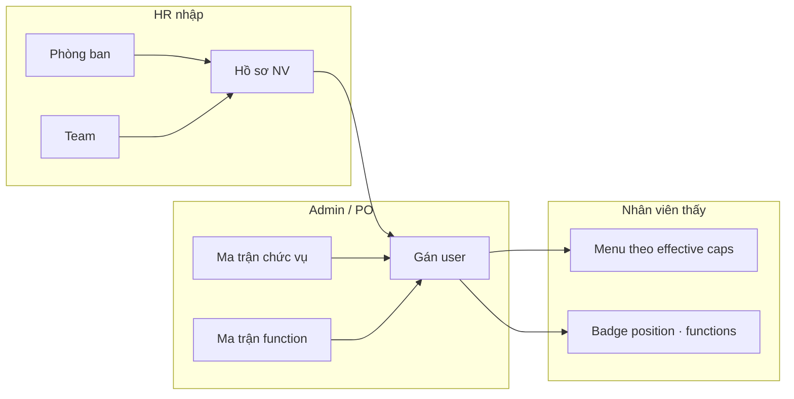

# HR · Org · Job Function · RBAC — UI/UX Design

> **Document ID:** RBAC-HR-ORG-UIUX-20260807  
> **Phiên bản:** 1.0 · **Ngày:** 2026-08-07  
> **Trạng thái:** Design for implementation — R1.5 + R2-HR  
> **Parent spec:** [`2026-08-07-rbac-hr-org-job-function-design.md`](./2026-08-07-rbac-hr-org-job-function-design.md)  
> **Implementation plan:** [`2026-08-07-rbac-hr-org-job-function-implementation-plan.md`](./2026-08-07-rbac-hr-org-job-function-implementation-plan.md)  
> **Runbook:** [`../runbooks/rbac-hr-org-workflow.md`](../runbooks/rbac-hr-org-workflow.md)  
> **Design system baseline:** [`../SPEC_UI_UX_PTT.md`](../SPEC_UI_UX_PTT.md) §6–7  
> **App:** `ops-web` · **Shell:** `AdminPageShell` / `CrmHrPageShell`

---

## Mục lục

1. [Mục tiêu & nguyên tắc UX](#1-mục-tiêu--nguyên-tắc-ux)
2. [As-is vs target](#2-as-is-vs-target)
3. [Information Architecture (IA)](#3-information-architecture-ia)
4. [Design system & tokens](#4-design-system--tokens)
5. [Kiến trúc component](#5-kiến-trúc-component)
6. [Cross-cutting UX patterns](#6-cross-cutting-ux-patterns)
7. [Route specs — Admin RBAC](#7-route-specs--admin-rbac)
8. [Route specs — Org HR](#8-route-specs--org-hr)
9. [Route specs — Staff roster (mở rộng)](#9-route-specs--staff-roster-mở-rộng)
10. [Effective caps simulator (R3 prep)](#10-effective-caps-simulator-r3-prep)
11. [API → UI mapping](#11-api--ui-mapping)
12. [State & data fetching](#12-state--data-fetching)
13. [Responsive & accessibility](#13-responsive--accessibility)
14. [Lộ trình coding theo phase](#14-lộ-trình-coding-theo-phase)
15. [File checklist](#15-file-checklist)
16. [QA & UAT map](#16-qa--uat-map)

---

## 1. Mục tiêu & nguyên tắc UX

### 1.1. Mục tiêu

| Mục tiêu | Mô tả UX |
|----------|----------|
| **HR self-service** | HR tạo phòng ban, team, user, gán chức vụ + function trong ≤ 15 ph — không SQL |
| **Phân tách policy layers** | UI tách rõ **chức vụ (position base)** vs **job function (add-on per user)** vs **permission set (R2-B)** |
| **Fail-closed & cap-first** | Ẩn nav/link theo cap; trang admin read-only khi thiếu `.configure` |
| **SoD visible** | Conflict hiện banner đỏ **trước** Lưu; nút Lưu disabled + giải thích rule ID |
| **Audit transparency** | Mọi thay đổi matrix/org/user có panel audit + export snapshot |
| **Re-login awareness** | Sau PATCH caps/org → toast cố định “Yêu cầu NV đăng xuất / đăng nhập lại” |

### 1.2. Nguyên tắc thiết kế

1. **Reuse R1-S3 matrix** — Job function matrix copy layout `/admin/crm/permissions` (grouped table, compact checkboxes).
2. **Vietnamese-first** — Label VI; code (`MKT-02`, `content`) secondary monospace muted.
3. **Progressive disclosure** — List → detail drawer/modal; matrix full-width chỉ khi cần.
4. **One identity card per user** — Position + functions + teams + effective preview trên cùng màn hình user.
5. **No silent privilege escalation** — Diff preview trước Lưu (added/removed caps count).
6. **Breadcrumb context** — `Cấu hình CRM → …` hoặc `Nhân sự → …` theo shell hiện có.
7. **PostgreSQL SSoT copy** — Subtitle nhắc “mọi thay đổi ghi audit trên PostgreSQL”.

### 1.3. Personas → surfaces

| Persona | Primary routes | Không thấy |
|---------|----------------|------------|
| **System Admin** | permissions, permissions/functions, org/users | — |
| **PO / Security** | permissions (export MD), audit panels | org CRUD nếu thiếu cap |
| **HR** | org/departments, org/teams, org/users, `/crm/staff` roster | position matrix configure |
| **Trưởng phòng** | org/users (view team), `/crm/staff` | job function matrix edit |
| **NV thường** | Staff portal only | mọi `/admin/crm/*` |

---

## 2. As-is vs target

### 2.1. Trang Admin RBAC / Org

| Route | Shipped | Phase | Gap chính |
|-------|:-------:|:-----:|-----------|
| `/admin/crm/permissions` | ✅ R1-S3 | — | Thiếu tab link sang functions; thiếu sub-nav “Org” |
| `/admin/crm/permissions/functions` | ❌ | R1.5 | Toàn bộ |
| `/admin/crm/org/departments` | ❌ | R2-HR | Toàn bộ |
| `/admin/crm/org/teams` | ❌ | R2-HR | Toàn bộ |
| `/admin/crm/org/positions` | ❌ | R2-HR | Toàn bộ |
| `/admin/crm/org/users` | ❌ | R2-HR | Toàn bộ |
| `/crm/staff` | ✅ partial | R1.5 badge | Thiếu badge position·functions; link org user |

### 2.2. Nav & gating

| Vị trí | As-is | Target |
|--------|-------|--------|
| `admin/crm/layout.tsx` LINKS | 4 mục (custom-fields…permissions) | + Functions, nhóm Org (dept/team/pos/users) |
| `module-nav.ts` `buildCrmConfigModuleLinks` | 4 link | + Functions + Org hub |
| `OpsNav` config section | Có thể thiếu permissions | Đồng bộ với module-nav |

### 2.3. JWT / header badge (staff portal)

| As-is | Target R1.5 |
|-------|-------------|
| Chỉ position trong session | Header badge: `{position_code} · {fn1, fn2}` |
| Caps từ position only | Effective caps sau re-login |

---

## 3. Information Architecture (IA)

### 3.1. Admin — Cấu hình CRM (target)

```
Cấu hình CRM (/admin/crm/*)
├── Dữ liệu
│   ├── Custom fields          /admin/crm/custom-fields
│   ├── Pipeline sales         /admin/crm/pipeline
│   └── Nguồn & Kênh           /admin/crm/lead-lookups
├── Phân quyền (RBAC)
│   ├── Ma trận chức vụ        /admin/crm/permissions          [cap: crm_data_config.view]
│   └── Ma trận job function   /admin/crm/permissions/functions [cap: crm_data_config.view]
└── Tổ chức (HR)               [cap: crm_staff_departments.view | crm_staff_roster.view]
    ├── Phòng ban              /admin/crm/org/departments
    ├── Team                   /admin/crm/org/teams
    ├── Chức vụ (HR metadata)  /admin/crm/org/positions
    └── Người dùng & quyền     /admin/crm/org/users
```

**Sub-nav pattern:** hai nhóm visual — `Dữ liệu` | `Phân quyền` | `Tổ chức` (divider hoặc label uppercase 0.68rem).

### 3.2. CRM HR — Roster (existing + bridge)

```
Nhân sự (/crm/staff)
├── Roster (tab)               — danh sách crm_staff
├── Import (tab)
├── Levels (tab)
└── Competency (tab)

Bridge R1.5: cột "Login / RBAC" → link `/admin/crm/org/users?email=…` (admin only)
```

### 3.3. User mental model (diagram)



---

## 4. Design system & tokens

Kế thừa [`SPEC_UI_UX_PTT.md`](../SPEC_UI_UX_PTT.md) §6 — không tạo palette mới.

### 4.1. Tokens bổ sung (semantic)

| Token / class | Dùng cho RBAC UI |
|---------------|------------------|
| `.page-card` | Wrapper nội dung chính (đã có) |
| `.data-table--compact` | Matrix checkboxes |
| `.section-title` | Nhóm catalog (CRM, Agency, Admin…) |
| `.error` | Banner SoD, API lỗi |
| `.muted` | Helper, position_id, code secondary |
| **Mới:** `.rbac-sod-banner` | Nền `#fef2f2`, viền `#dc2626`, icon ⚠ |
| **Mới:** `.rbac-badge` | Pill monospace: `MKT-02 · content, design` |
| **Mới:** `.rbac-diff-chip` | `+3 / -1` caps trước save |
| **Mới:** `.rbac-layer-tag` | Tag nhỏ: `Base` / `Add-on` / `Set` |

### 4.2. Typography & density

- Matrix: font 0.875rem; `section_id` 0.85em muted dưới label (giữ R1-S3).
- Org tables: body 1rem; code column `font-family: ui-monospace`.
- Drawer user detail: max-width 480px mobile full-screen.

### 4.3. Buttons (toolbar)

| Action | Variant | Vị trí |
|--------|---------|--------|
| Lưu ma trận / Lưu user | `btn--primary` | PageToolbar actions |
| Xuất MD / JSON | `btn--secondary` | Toolbar |
| Tạo mới (dept/team/user) | `btn--primary` compact | Table header right |
| Hủy / Đóng drawer | `btn--secondary` | Drawer footer |

---

## 5. Kiến trúc component

### 5.1. Component tree (ops-web)

```
components/rbac/
├── PermissionMatrixTable.tsx      # Shared: position + function matrices
├── PermissionAuditPanel.tsx       # 20 rows + expand diff
├── JobFunctionPicker.tsx          # Checkbox group max 3 + SoD live validate
├── EffectiveCapsPreview.tsx       # Read-only list / grouped by section
├── SodConflictBanner.tsx          # rule_id + human message
├── OrgEntityForm.tsx              # dept / team / position modal fields
├── UserIdentityCard.tsx             # position select + functions + teams
└── RbacExportButton.tsx           # MD / JSON download

app/admin/crm/
├── permissions/page.tsx           # ✅ existing — refactor extract matrix
├── permissions/functions/page.tsx # R1.5
└── org/
    ├── layout.tsx                 # Org sub-nav tabs
    ├── departments/page.tsx
    ├── teams/page.tsx
    ├── positions/page.tsx
    └── users/page.tsx
```

### 5.2. Shell mapping

| Route group | Shell | `section` prop |
|-------------|-------|----------------|
| `/admin/crm/permissions*` | `AdminPageShell` | `crm-config` |
| `/admin/crm/org/*` | `AdminPageShell` | `crm-config` |
| `/crm/staff` | `CrmHrPageShell` | — |

### 5.3. Shared matrix props

```typescript
type PermissionMatrixTableProps = {
  matrix: StaffPermissionMatrixRow[];
  grants: Record<string, string[]>;
  readOnly: boolean;
  busy: boolean;
  layerLabel?: 'Base chức vụ' | 'Add-on function';
  onToggle: (sectionId: string, action: string, checked: boolean) => void;
};
```

---

## 6. Cross-cutting UX patterns

### 6.1. Cap gating (fail-closed)

| Cap | UI behavior |
|-----|-------------|
| `crm_data_config.view` | Vào trang permissions* |
| `crm_data_config.configure` | Enable checkboxes + Lưu matrix |
| `crm_staff_departments.view` | Xem dept/team |
| `crm_staff_departments.configure` | Tạo/sửa dept/team |
| `crm_staff_roster.view` | Xem org/users list |
| `crm_staff_roster.edit` | Tạo user, đổi position (kèm configure) |

Thiếu cap → redirect `/403` hoặc inline error (pattern R1-S2).

### 6.2. SoD conflict (SoD-01 … SoD-04)

**Trigger:** thay đổi job functions trên user HOẶC tick matrix function gây conflict với position base.

**UI:**

```
┌─────────────────────────────────────────────────────────────┐
│ ⚠ SoD-01: Không gộp content (write) và duyệt SEO (approve) │
│    Bỏ tick một trong hai job function / cap trước khi lưu.   │
└─────────────────────────────────────────────────────────────┘
[Lưu] disabled
```

| Rule | Message VI (draft) |
|------|-------------------|
| SoD-01 | Không cho cùng user vừa viết nội dung vừa duyệt SEO |
| SoD-02 | Design và Compliance không được gán cùng user |
| SoD-03 | Quyền xem lead toàn công ty chỉ dành cho chức vụ GDKD |
| SoD-04 | Leader cần gán team — không assign toàn công ty |

Validate **client-side** (instant) + **server 409** (authoritative).

### 6.3. Re-login toast

Sau mọi PATCH thành công ảnh hưởng caps:

> **Đã lưu.** Yêu cầu nhân viên **đăng xuất và đăng nhập lại** để áp dụng quyền mới.

- Matrix position: áp dụng cho **tất cả** user cùng chức vụ.
- User functions: chỉ user đó.
- Duration: sticky 8s hoặc dismissible; class `.muted` + icon 🔄.

### 6.4. Diff preview trước Lưu

Toolbar hiển thị chip khi `grants` dirty:

`Thay đổi: +4 / -2 caps` — click mở collapsible JSON hoặc modal diff (added/removed arrays).

### 6.5. Export access review

| Format | Nút | Filename |
|--------|-----|----------|
| Markdown | Xuất MD | `rbac-{entity}-{code}-{date}.md` |
| JSON | Xuất JSON | `rbac-effective-{userId}-{date}.json` |

Effective export trên trang user (R2-HR) gồm: position base + function add-ons + union result.

### 6.6. Empty & loading states

| State | Copy |
|-------|------|
| Loading shell | `AdminPageShell loading` skeleton |
| No positions | “Chưa có chức vụ — tạo tại Tổ chức → Chức vụ” |
| No users | “Chưa có tài khoản login — Tạo user” CTA |
| Audit empty | “Chưa có bản ghi audit” (muted) |

### 6.7. Header badge (staff portal)

Vị trí: `StaffPageShell` topbar, bên phải tên user.

```
┌──────────────────────────────────────┐
│  …  │  dung@pttads.vn  │ MKT-02 · content │
└──────────────────────────────────────┘
```

- Max 3 functions; overflow `+1` tooltip.
- Ẩn nếu chưa có `job_functions` trong JWT (R1 legacy).

---

## 7. Route specs — Admin RBAC

### 7.1. `/admin/crm/permissions` (existing — enhancements)

**Mục đích:** Sửa **base caps theo chức vụ** — ảnh hưởng mọi user cùng `position_id`.

**Layout (as-is + delta):**

```
PageToolbar: Ma trận phân quyền · subtitle audit PostgreSQL
Actions: [Xuất MD] [Lưu ma trận]

Sub-nav tabs: [Chức vụ ●] [Job function →]

Filters: Select chức vụ (code — name · customized?)

Warning callout (mới):
  "Thay đổi ở đây áp dụng cho MỌI nhân viên cùng chức vụ.
   Phân biệt content/design → dùng Job function."

Grouped matrix tables (per catalog group)
Audit panel (20 gần nhất)
```

**Enhancement backlog:**

- Tab switch sang `/admin/crm/permissions/functions`
- Callout info box (`.page-card` nested, border primary light)
- Link “Xem NV thuộc chức vụ này” → org/users?position_id=

### 7.2. `/admin/crm/permissions/functions` (R1.5 — new)

**Mục đích:** Sửa **add-on caps theo job function** — union vào mọi user gắn function đó.

**Wireframe:**

```
┌─────────────────────────────────────────────────────────────────┐
│ Ma trận job function · Add-on caps (union vào chức vụ gốc)      │
│ [Xuất MD] [Lưu ma trận function]                                 │
├─────────────────────────────────────────────────────────────────┤
│ Function: [ content ▼ ]   scope: DEPT-SOLUTION, DEPT-AGENCY     │
│           label: Content / Copy · 12 caps add-on                │
├─────────────────────────────────────────────────────────────────┤
│ ℹ Caps ở đây CỘNG với ma trận chức vụ. Không bỏ cap base.      │
├─────────────────────────────────────────────────────────────────┤
│ [Grouped matrix — same columns as position matrix]              │
│   Tag cột đầu: section_label + (Add-on)                         │
├─────────────────────────────────────────────────────────────────┤
│ Audit log (function_code filter)                                │
└─────────────────────────────────────────────────────────────────┘
```

**Function selector:** dropdown 8 functions (`leader`, `sales`, …) sorted `sort_order`.

**Read-only mode:** thiếu `configure` — same as position page.

**Catalog sidebar (optional P2):** list functions với cap count badge.

---

## 8. Route specs — Org HR

**Shared layout:** `app/admin/crm/org/layout.tsx`

```
Sub-nav: [Phòng ban] [Team] [Chức vụ] [Người dùng & quyền]
```

Cap: hide tab nếu thiếu view cap tương ứng.

### 8.1. `/admin/crm/org/departments`

**Primary user:** HR

| Column | Mô tả |
|--------|--------|
| Code | `DEPT-SALES` monospace |
| Tên | Tên VI |
| Teams | Count badge → link teams filtered |
| NV | Staff count |
| Trạng thái | Active / Archived |
| Actions | Sửa |

**Actions:** `+ Tạo phòng ban` → modal `OrgEntityForm`

Fields: `code` (readonly sau create), `name`, `description`, `active`.

**Validation:** code uppercase slug; unique → inline error.

### 8.2. `/admin/crm/org/teams`

**Filters:** Select phòng ban (required context)

| Column | Mô tả |
|--------|--------|
| Code | `TEAM-MKT-CONTENT` |
| Tên | |
| Phòng ban | link dept |
| Thành viên | count |
| Actions | Sửa |

Modal fields: `code`, `name`, `department_id`, `description`, `active`.

### 8.3. `/admin/crm/org/positions`

**Mục đích:** HR metadata — **không** thay thế ma trận caps (vẫn ở permissions).

| Column | Mô tả |
|--------|--------|
| Code | `MKT-02` |
| Tên | |
| Phòng ban | |
| Parent | Cấp trên (optional) |
| RBAC | Link “Ma trận →” `/admin/crm/permissions?position_id=` |
| Actions | Sửa |

**Policy:** Tạo position mới → clone grants từ template (select position) — confirm modal.

### 8.4. `/admin/crm/org/users` (hub quan trọng nhất)

**Mục đích:** Gán **login + position + job functions + teams** — EC-01 target.

**Wireframe — list + drawer:**

```
┌─────────────────────────────────────────────────────────────────┐
│ Người dùng & quyền                              [+ Tạo user]    │
│ Search: [ email / tên________________ ]  Dept [All ▼]  Active  │
├─────────────────────────────────────────────────────────────────┤
│ Email          │ Tên    │ Chức vụ │ Functions      │ Trạng thái│
│ dung@…         │ Dung   │ MKT-02  │ content        │ Active    │
│ em@…           │ Em     │ MKT-02  │ design         │ Active    │
│ …              │        │         │                │           │
└─────────────────────────────────────────────────────────────────┘

Click row → Drawer / full page detail:

┌─ UserIdentityCard ─────────────────────────────────────────────┐
│ Email: em@pttads.vn (readonly)    [Đặt lại MK] (R2)            │
│ Hồ sơ HR: link → /crm/staff?id=                                 │
│                                                                 │
│ Chức vụ *        [ MKT-02 — Nhân viên Marketing ▼ ]            │
│                                                                 │
│ Job functions    (tối đa 3)                                     │
│   ☑ design    ☐ content   ☐ leader   ☐ analyst …               │
│                                                                 │
│ Teams            [ TEAM-MKT-DESIGN ▼ ] [+ thêm]                 │
│                                                                 │
│ [SoD banner nếu conflict]                                       │
│                                                                 │
│ Effective caps preview  [Mở rộng ▼]                             │
│   crm_facebook_ads.edit (design add-on)                         │
│   crm_presales_solution.view (base MKT-02)                      │
│   …                                                             │
│                                                                 │
│ [Xuất JSON effective]  [Hủy]  [Lưu]                             │
└─────────────────────────────────────────────────────────────────┘
```

**Create user flow:**

1. Modal step 1: email, full_name, link `crm_staff_id` (search roster)
2. Step 2: position + functions + temp password generate
3. Success: copy credentials + re-login note

**Query deep link:** `?email=` từ roster bridge.

---

## 9. Route specs — Staff roster (mở rộng)

**File:** `services/ops-web/src/app/crm/staff/page.tsx`

### 9.1. Roster tab delta (R1.5)

| Column mới | Nội dung |
|------------|----------|
| Chức vụ | `position_code` badge hoặc “—” |
| RBAC | `content, design` chips hoặc “Chưa gán login” |
| Actions | Link “Cấu hình quyền →” (if admin cap) |

### 9.2. Không duplicate CRUD

HR tạo hồ sơ tại `/crm/staff`; gán login/RBAC tại `/admin/crm/org/users` — callout ở đầu roster tab giải thích luồng 2 bước.

---

## 10. Effective caps simulator (R3 prep)

**Vị trí:** panel collapsible trong user drawer (R2-HR); full page R3.

**UI:**

- Input: position + functions (+ sets R2-B)
- Output: grouped list section × actions với tag nguồn (`Base` / `content` / `set:backup-claim`)
- Nút “So sánh với session hiện tại” (admin impersonation prep — out of scope R2)

API: `GET /users/:id/effective-caps`

---

## 11. API → UI mapping

### 11.1. Permissions (existing + R1.5)

| UI action | API |
|-----------|-----|
| Load position matrix | `GET /staff/permissions/positions/:id` |
| Save position | `PATCH /staff/permissions/positions/:id` |
| Load function matrix | `GET /staff/permissions/job-functions/:code` |
| Save function | `PATCH /staff/permissions/job-functions/:code` |
| Audit | `GET /staff/permissions/audit?position_id=` or `function_code=` |
| Export MD | `GET /staff/permissions/positions/:id/export` |

### 11.2. Org (R2-HR)

| UI action | API |
|-----------|-----|
| List/create dept | `GET/POST /staff/org/departments` |
| List/create team | `GET/POST /staff/org/teams` |
| List/create position | `GET/POST /staff/org/positions` |
| List/create user | `GET/POST /staff/org/users` |
| Patch user RBAC | `PATCH /staff/org/users/:id` + `PUT /users/:id/job-functions` |
| Effective caps | `GET /users/:id/effective-caps` |
| Org audit | `GET /staff/org/audit?entity_type=` |

### 11.3. Error mapping

| HTTP | UI |
|------|-----|
| 401 | redirect `/login` |
| 403 | inline “Không có quyền …” |
| 409 `sod_violation` | `SodConflictBanner` + rule_id từ body |
| 422 validation | field inline errors in modal |

---

## 12. State & data fetching

### 12.1. Pattern (match R1-S3)

- Client components + `useCallback` auth bootstrap (`staffMe` / refresh)
- Local state `grants` dirty tracking vs server snapshot
- `busy` flag disables inputs globally
- No global store — page-local state OK for admin infrequent edits

### 12.2. Cache invalidation

Sau PATCH user/functions:

- Refetch user detail + effective caps preview
- Optional: `staffRefresh` for **current admin** only (not impersonated user)

### 12.3. URL state

| Param | Page |
|-------|------|
| `position_id` | permissions pre-select |
| `function_code` | functions pre-select |
| `department_id` | teams filter |
| `email` | users search + open drawer |

---

## 13. Responsive & accessibility

| Breakpoint | Behavior |
|------------|----------|
| `>1024px` | Matrix full table horizontal scroll in `.table-scroll` |
| `768–1024px` | Org list cards stack; drawer 50% width |
| `<768px` | User detail full-screen sheet; matrix sticky first column (section label) |

**A11y:**

- Checkbox `aria-label="{section_id}.{action}"` (existing)
- SoD banner `role="alert"`
- Sub-nav `aria-label="CRM admin"` / `"Org HR"`
- Focus ring `--focus-ring` on all interactive controls

---

## 14. Lộ trình coding theo phase

### 14.1. R1.5 (FE ~8 dev-days)

| Sprint item | Deliverable |
|-------------|-------------|
| R1.5-FE-1 | Extract `PermissionMatrixTable`, `PermissionAuditPanel` |
| R1.5-FE-2 | `/permissions/functions` page + API client |
| R1.5-FE-3 | Sub-nav tabs Chức vụ / Function |
| R1.5-FE-4 | `JobFunctionPicker` + `SodConflictBanner` (client validate) |
| R1.5-FE-5 | Staff roster badge column + bridge link |
| R1.5-FE-6 | Header `rbac-badge` in `StaffPageShell` |

### 14.2. R2-HR (FE ~10 dev-days)

| Sprint item | Deliverable |
|-------------|-------------|
| R2-FE-1 | `org/layout.tsx` + departments CRUD |
| R2-FE-2 | teams CRUD + dept filter |
| R2-FE-3 | positions metadata + link matrix |
| R2-FE-4 | users list + `UserIdentityCard` drawer |
| R2-FE-5 | `EffectiveCapsPreview` + export JSON |
| R2-FE-6 | `module-nav` + `admin/crm/layout` org links |

### 14.3. R2-B/C (follow-on)

- Permission sets UI tab under user drawer
- Team scope indicator on leader function picker

---

## 15. File checklist

### New files

```
services/ops-web/src/components/rbac/PermissionMatrixTable.tsx
services/ops-web/src/components/rbac/PermissionAuditPanel.tsx
services/ops-web/src/components/rbac/JobFunctionPicker.tsx
services/ops-web/src/components/rbac/SodConflictBanner.tsx
services/ops-web/src/components/rbac/EffectiveCapsPreview.tsx
services/ops-web/src/components/rbac/UserIdentityCard.tsx
services/ops-web/src/components/rbac/OrgEntityForm.tsx
services/ops-web/src/app/admin/crm/permissions/functions/page.tsx
services/ops-web/src/app/admin/crm/org/layout.tsx
services/ops-web/src/app/admin/crm/org/departments/page.tsx
services/ops-web/src/app/admin/crm/org/teams/page.tsx
services/ops-web/src/app/admin/crm/org/positions/page.tsx
services/ops-web/src/app/admin/crm/org/users/page.tsx
services/ops-web/src/lib/rbac/sod-rules.ts          # client SoD-01..04
services/ops-web/src/lib/rbac/effective-caps.ts     # union display helper
```

### Modified files

```
services/ops-web/src/app/admin/crm/permissions/page.tsx   # extract + tabs
services/ops-web/src/app/admin/crm/layout.tsx               # sub-nav groups
services/ops-web/src/lib/admin/module-nav.ts                # org + functions links
services/ops-web/src/lib/api.ts                             # org + function endpoints
services/ops-web/src/app/crm/staff/page.tsx                 # RBAC columns
services/ops-web/src/components/layout/StaffPageShell.tsx   # header badge
services/ops-web/src/app/globals.css (or module)            # rbac-* classes
```

---

## 16. QA & UAT map

| ID | Scenario | Expected UI |
|----|----------|-------------|
| UX-01 | Admin mở functions, tick cap, Lưu | Toast re-login; audit +1 |
| UX-02 | Gán user `content` + approve cap via position | SoD-01 banner; Lưu disabled |
| UX-03 | HR tạo DEPT + TEAM + user MKT-02 + design | ≤ 15 ph; effective preview đúng |
| UX-04 | View-only admin | Matrix checkboxes disabled |
| UX-05 | Export MD position + JSON user | File download OK |
| UX-06 | Mobile user drawer | Full-screen; Lưu reachable |
| UX-07 | Roster bridge link | Opens users?email= |
| UX-08 | Regression P3 | KD view-only không thấy configure buttons |

**Persona UAT:** reuse §5 parent spec (An, Bình, Chi, Dung, Em, Phúc) — checklist menu visibility sau re-login.

---

## Phụ lục A — Copy deck (VI)

| Key | Text |
|-----|------|
| `permissions.position.warning` | Thay đổi ma trận chức vụ áp dụng cho mọi nhân viên cùng chức vụ. |
| `permissions.function.hint` | Caps add-on cộng với chức vụ gốc — dùng để phân biệt content / design / leader. |
| `save.success.relogin` | Đã lưu. Yêu cầu nhân viên đăng xuất và đăng nhập lại để áp dụng quyền mới. |
| `users.functions.max` | Chọn tối đa 3 job function. |
| `org.roster.bridge` | Tạo hồ sơ tại Nhân sự → gán login và quyền tại Người dùng & quyền. |

---

## Phụ lục B — Liên kết tài liệu

| Doc | Vai trò |
|-----|---------|
| [`2026-08-07-rbac-hr-org-job-function-design.md`](./2026-08-07-rbac-hr-org-job-function-design.md) | Data model, API, SoD |
| [`2026-08-06-rbac-enterprise-design.md`](./2026-08-06-rbac-enterprise-design.md) | R1 master, permission sets R2-B |
| [`../SPEC_UI_UX_PTT.md`](../SPEC_UI_UX_PTT.md) | Tokens, shells |
| [`../runbooks/rbac-hr-org-workflow.md`](../runbooks/rbac-hr-org-workflow.md) | HR vận hành |

---

*Changelog v1.0 — 2026-08-07: Initial UI/UX design for HR · Org · Job Function program.*
