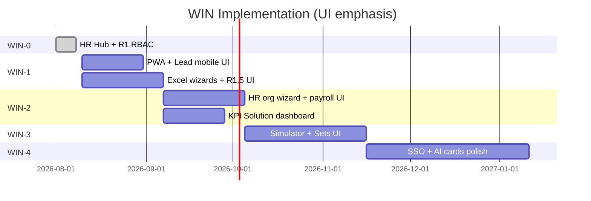

# RNOSAI Competitive Win — Kế hoạch thực thi đầy đủ (Implementation Plan)

> **Document ID:** RNOSAI-WIN-PLAN-20260807  
> **Phiên bản:** 1.0 · **Ngày:** 2026-08-07  
> **Trạng thái:** Execution plan — chờ Eng Lead + PO sign-off  
> **Parent:** [`2026-08-07-rnosai-competitive-win-master-spec.md`](./2026-08-07-rnosai-competitive-win-master-spec.md)  
> **UI/UX:** [`2026-08-07-rnosai-competitive-win-ui-ux-design.md`](./2026-08-07-rnosai-competitive-win-ui-ux-design.md)  
> **HR/RBAC plan:** [`2026-08-07-rbac-hr-org-job-function-implementation-plan.md`](./2026-08-07-rbac-hr-org-job-function-implementation-plan.md)

---

## Mục lục

1. [Tổng quan chương trình](#1-tổng-quan-chương-trình)
2. [Team & RACI](#2-team--raci)
3. [Timeline & capacity](#3-timeline--capacity)
4. [WIN-0 — Foundation (done)](#4-win-0--foundation-done)
5. [WIN-1 — Table stakes + UI mobile (6–8 tuần)](#5-win-1--table-stakes--ui-mobile-68-tuần)
6. [WIN-2 — Moat + HR UI (8–10 tuần)](#6-win-2--moat--hr-ui-810-tuần)
7. [WIN-3 — Enterprise UI (10–12 tuần)](#7-win-3--enterprise-ui-1012-tuần)
8. [WIN-4 — Best-in-class UI (12+ tuần)](#8-win-4--best-in-class-ui-12-tuần)
9. [Ma trận phụ thuộc BE ↔ FE](#9-ma-trận-phụ-thuộc-be--fe)
10. [Design deliverables & review gates](#10-design-deliverables--review-gates)
11. [Testing & UAT](#11-testing--uat)
12. [Deploy & rollout](#12-deploy--rollout)
13. [Rủi ro & mitigation](#13-rủi-ro--mitigation)
14. [Exit checklist tổng WIN-4](#14-exit-checklist-tổng-win-4)

---

## 1. Tổng quan chương trình

### 1.1. Mục tiêu thực thi

Triển khai **WIN-0 → WIN-4** trong ~18 tháng với **ưu tiên giao diện** — mọi wave có deliverable UI staging demo được trước khi sign-off wave.

### 1.2. Effort tổng (ước lượng)

| Role | Dev-days | Ghi chú |
|------|----------|---------|
| **Frontend (ops-web)** | ~95 | UI/UX doc §17 |
| **Backend (Nest + API)** | ~70 | RBAC, org, payroll PG, KPI APIs |
| **Design/PO review** | ~15 | Wireframe sign-off mỗi wave |
| **QA/UAT visual** | ~20 | VUX-01…10 mỗi wave |
| **Tổng** | **~200** | 1 FE + 1 BE + part-time PO/HR |

### 1.3. Nguyên tắc thực thi UI

1. **UI-first demo** — FE stub + mock API OK cho PO review; wire BE sau.
2. **Component before page** — `components/win/*` trước route pages.
3. **No JSON primary UI** — refactor payroll/staff tabs trong WIN-2.
4. **Screenshot gate** — mỗi PR UI attach staging screenshot mobile + desktop.
5. **Cap gating in PR** — test 2 persona: Admin + restricted NV.

---

## 2. Team & RACI

| Hoạt động | PO | FE | BE | HR | IT | QA |
|-----------|:--:|:--:|:--:|:--:|:--:|:--:|
| Wireframe sign-off | A | R | C | C | I | I |
| Component library | C | R | I | I | I | C |
| API contract | C | C | R | I | I | I |
| Staging UI demo | A | R | C | C | C | R |
| UAT persona | A | C | C | R | C | R |
| Prod deploy | A | R | R | I | R | R |
| Access review | A | C | R | R | R | C |

**Cadence:** Sprint 2 tuần · Demo thứ Sáu · WIN council bi-weekly.

---

## 3. Timeline & capacity



| Wave | Calendar | FE-days | BE-days |
|------|----------|---------|---------|
| WIN-0 | ✅ Aug W1 | 3 | — |
| WIN-1 | Aug–Sep | 28 | 22 |
| WIN-2 | Oct–Nov | 35 | 28 |
| WIN-3 | Dec–Feb | 22 | 35 |
| WIN-4 | Mar–Jun | 12 | 20 |

---

## 4. WIN-0 — Foundation (done)

| ID | Deliverable | Owner | Status |
|----|-------------|-------|--------|
| W0-UI-01 | HR Hub `/crm/hr` | FE | ✅ |
| W0-UI-02 | OpsNav "Nhân sự & Hiệu suất" | FE | ✅ |
| W0-UI-03 | CrmHr breadcrumb → /crm/hr | FE | ✅ |
| W0-UI-04 | Permissions page R1-S3 | FE | ✅ prod |
| W0-UI-05 | Master spec + HR docs | PO | ✅ |

**Không deploy thêm** trước WIN-1 kickoff.

---

## 5. WIN-1 — Table stakes + UI mobile (6–8 tuần)

**Mục tiêu UI:** Không thua Getfly demo mobile + Excel + job function menu khác nhau.

### 5.1. Sprint WIN-1-A (tuần 1–2) — Design system + PWA shell

| ID | Task | FE | BE | DoD UI |
|----|------|:--:|:--:|--------|
| W1-DS-01 | Add `--win-*` tokens + classes `globals.css` | 1d | — | Storybook or staging page |
| W1-DS-02 | `WinEmptyState`, `WinRbacBadge`, `WinSodBanner` | 2d | — | 3 components |
| W1-PWA-01 | `manifest.json` + icons 192/512 | 1d | — | Lighthouse installable |
| W1-PWA-02 | Service worker shell cache | 2d | — | Offline banner |
| W1-PWA-03 | `LeadsMobileCardList` `<768px` | 3d | — | Screenshot 390px |

**Gate WIN-1-A:** VUX-02 pass · Lighthouse PWA installable.

### 5.2. Sprint WIN-1-B (tuần 3–4) — Lead list polish

| ID | Task | FE | BE | DoD UI |
|----|------|:--:|:--:|--------|
| W1-CRM-01 | Filter chips + URL persist | 2d | 1d | Query sync |
| W1-CRM-02 | Column picker LocalStorage | 1d | — | ⚙ popover |
| W1-CRM-03 | Tabs Tất cả/Của tôi/Chưa phân | 1d | 1d | API filter |
| W1-CRM-04 | WinEmptyState on leads | 0.5d | — | CTA import |
| W1-CRM-05 | CSKH board mobile cards | 2d | — | VUX mobile |
| W1-CRM-06 | CSKH export Excel button | 1d | 1d | Download |

### 5.3. Sprint WIN-1-C (tuần 5–6) — Excel + R1.5 RBAC UI

| ID | Task | FE | BE | DoD UI |
|----|------|:--:|:--:|--------|
| W1-XLS-01 | `WinExcelImportWizard` leads | 3d | 2d | Template VN |
| W1-XLS-02 | Lead export Excel filtered | 1d | 1d | P0-2 |
| W1-XLS-03 | Roster import Excel | 2d | 2d | HR template |
| W1-R15-01 | Extract `PermissionMatrixTable` | 2d | — | Refactor permissions |
| W1-R15-02 | `/permissions/functions` page | 2d | 3d | Matrix UI |
| W1-R15-03 | Admin sub-nav tabs Chức vụ/Function | 1d | — | layout.tsx |
| W1-R15-04 | `JobFunctionPicker` + SoD client | 2d | 2d | VUX-05 |
| W1-R15-05 | Header `WinRbacBadge` StaffPageShell | 1d | 1d | JWT functions |
| W1-R15-06 | `WinReloginToast` + `WinDiffChip` | 1d | — | PATCH flows |

**BE parallel R1.5:** DDL job functions · effective caps · API PATCH function matrix (see HR org plan §4–5).

### 5.4. WIN-1 exit checklist

- [ ] VUX-01, 02, 04, 05, 08 pass
- [ ] Excel lead round-trip staging
- [ ] Functions page live staging
- [ ] content vs design UAT 2 NV
- [ ] 0 `<pre>` JSON on touched pages
- [ ] PO sign `WIN-1-acceptance.pdf`

**FE subtotal WIN-1:** ~28 dev-days · **BE:** ~22 dev-days

---

## 6. WIN-2 — Moat + HR UI (8–10 tuần)

> **Kế hoạch chi tiết:** [`2026-08-07-win-2-implementation-plan.md`](./2026-08-07-win-2-implementation-plan.md) (sprint A–D, API, UAT, deploy)

**Mục tiêu UI:** Onboard wizard 15 ph · Solution KPI dashboard · no JSON payroll · org CRUD.

### 6.1. Sprint WIN-2-A (tuần 1–3) — R2-HR Org UI

| ID | Task | FE | BE | DoD UI |
|----|------|:--:|:--:|--------|
| W2-ORG-01 | `app/admin/crm/org/layout.tsx` sub-nav | 1d | — | 4 tabs |
| W2-ORG-02 | departments CRUD page + modal | 2d | 2d | Table+form |
| W2-ORG-03 | teams CRUD + dept filter | 2d | 2d | Filter chip |
| W2-ORG-04 | positions metadata page | 2d | 2d | Link matrix |
| W2-ORG-05 | users list + search | 2d | 2d | Pagination |
| W2-ORG-06 | `UserIdentityCard` drawer | 4d | 3d | Full wireframe §11.4 |
| W2-ORG-07 | Onboard wizard 4 steps | 4d | 3d | VUX-03 ≤15 ph |
| W2-ORG-08 | `EffectiveCapsPreview` | 2d | 2d | Grouped list |
| W2-ORG-09 | Offboard wizard | 2d | 2d | Reassign+deactivate |
| W2-ORG-10 | `WinOrgChart` page or tab | 3d | 2d | Tree visual |

**BE:** R2-HR-S1/S2/S3 from [`2026-08-07-rbac-hr-org-job-function-implementation-plan.md`](./2026-08-07-rbac-hr-org-job-function-implementation-plan.md)

### 6.2. Sprint WIN-2-B (tuần 4–5) — Workforce & Payroll UI

| ID | Task | FE | BE | DoD UI |
|----|------|:--:|:--:|--------|
| W2-STF-01 | `StaffEditDrawer` form fields | 3d | 2d | No JSON edit |
| W2-STF-02 | Roster columns RBAC badge + link | 1d | 1d | Bridge org |
| W2-STF-03 | Levels form grid (replace JSON) | 2d | 1d | Tab levels |
| W2-STF-04 | Competency matrix grid | 2d | 1d | Tab competency |
| W2-STF-05 | staff/[id] KPI sparkline + lead paginate | 3d | 2d | Workspace |
| W2-PAY-01 | Payroll tab layout refactor | 3d | — | No JSON scroll |
| W2-PAY-02 | Policy form UI | 2d | 1d | Fields not JSON |
| W2-PAY-03 | Excel export payslip | 1d | 2d | CFO download |
| W2-PAY-04 | Payroll migrate PG | — | 5d | API on PG |

### 6.3. Sprint WIN-2-C (tuần 6–7) — KPI & CRM moat UI

| ID | Task | FE | BE | DoD UI |
|----|------|:--:|:--:|--------|
| W2-KPI-01 | `KpiTeamToggle` on `/crm/kpi` | 1d | 2d | Sales/Solution/CSKH |
| W2-KPI-02 | `/crm/kpi/solution` page + tiles | 4d | 4d | VUX-07 |
| W2-KPI-03 | `KpiSlaTileGrid` on solution/queue | 2d | 2d | SLA strip |
| W2-KPI-04 | staff-kpi bar compare chart | 2d | 1d | Period filter |
| W2-CRM-01 | `/` dashboard widgets 2×2 | 3d | 2d | WIN-C dashboard |
| W2-CRM-02 | Hub map ≥80% label UI | 1d | 1d | G1 badge |
| W2-CRM-03 | custom-fields + pipeline admin | 5d | 5d | RNOS-35 |
| W2-CRM-04 | Calendar on lead (P1-2) | 3d | 3d | Month view |
| W2-CRM-05 | Proposal PDF export button | 1d | 2d | Download |
| W2-R04 | Row-level scope UI empty states | 1d | 3d | AM isolation |

### 6.4. Sprint WIN-2-D (tuần 8) — Polish & UAT

| ID | Task | Owner | DoD |
|----|------|-------|-----|
| W2-UAT-01 | HR onboard 3 real NV timed | HR | ≤15 ph |
| W2-UAT-02 | Persona screenshot pack | QA | docs/exports/win-ux-screenshots/WIN-2/ |
| W2-UAT-03 | Mobile regression RNOS-39 | QA | CI green |
| W2-UAT-04 | Fix visual bugs P0 | FE | 0 blockers |

### 6.5. WIN-2 exit checklist

- [ ] EC-01 onboard ≤15 ph
- [ ] Solution KPI dashboard live
- [ ] Payroll Excel CFO sign
- [ ] 0 JSON primary UI on staff/payroll
- [ ] VUX-03, 06, 07 pass
- [ ] PO sign WIN-2-acceptance

**FE subtotal WIN-2:** ~35 dev-days · **BE:** ~28 dev-days

---

## 7. WIN-3 — Enterprise UI (10–12 tuần)

> **Kế hoạch chi tiết:** [`2026-08-07-win-3-implementation-plan.md`](./2026-08-07-win-3-implementation-plan.md) (sprint A–C, R2 backend, UAT, deploy)

**Mục tiêu UI:** HubSpot-class admin · simulator · forecast cards.

### 7.1. Sprint WIN-3-A — RBAC enterprise UI

| ID | Task | FE | BE | DoD |
|----|------|:--:|:--:|-----|
| W3-RBAC-01 | Permission Sets list + editor | 4d | 5d | R2-B |
| W3-RBAC-02 | User drawer Permission Sets tab | 2d | 2d | Assign set |
| W3-RBAC-03 | Break-glass request modal | 2d | 3d | R2-D |
| W3-RBAC-04 | `/permissions/simulator` | 5d | 4d | Menu preview |
| W3-RBAC-05 | Access review export button | 1d | 2d | ZIP download |
| W3-RBAC-06 | GDKD cap split UI labels | 1d | 3d | R2-A |

### 7.2. Sprint WIN-3-B — AI & forecast UI

| ID | Task | FE | BE | DoD |
|----|------|:--:|:--:|-----|
| W3-AI-01 | Forecast chart MAPE badge | 2d | 4d | /crm/forecast |
| W3-AI-02 | Renewal T-90 alert cards lifecycle | 3d | 5d | Amber cards |
| W3-AI-03 | Bonus rule UI → payroll | 3d | 4d | HR config |
| W3-AI-04 | Client scope indicator badges | 2d | 5d | R3 pilot |

### 7.3. Sprint WIN-3-C — UAT enterprise

| ID | Task | DoD |
|----|------|-----|
| W3-UAT-01 | Simulator match prod menu 5 personas | 100% |
| W3-UAT-02 | Permission Set demo script | Recorded |
| W3-UAT-03 | Access review export archived | Quarterly mock |

### 7.4. WIN-3 exit

- [ ] VUX-04 simulator pass
- [ ] Forecast MAPE visible
- [ ] PO sign WIN-3-acceptance

**FE subtotal WIN-3:** ~22 dev-days · **BE:** ~35 dev-days

---

## 8. WIN-4 — Best-in-class UI (12+ tuần)

| ID | Task | FE | BE | DoD |
|----|------|:--:|:--:|-----|
| W4-SSO-01 | Keycloak login UI flow | 3d | 8d | SSO UAT |
| W4-SSO-02 | MFA OTP screen | 2d | 3d | 2FA |
| W4-HR-01 | `/crm/payroll/me` payslip | 2d | 2d | NV self |
| W4-HR-02 | Leave request lite form | 3d | 3d | Optional |
| W4-AI-01 | CPL anomaly digest page | 4d | 6d | Narrative UI |
| W4-AI-02 | Budget recommend read-only cards | 2d | 4d | Meta hub |
| W4-CRM-01 | Activity @mention + notify | 3d | 3d | Collab |
| W4-POL-01 | Handoff policy banner (OPA) | 1d | 4d | Rule display |
| W4-UAT-01 | Demo 60 ph recording | QA | — | VUX-10 |
| W4-UAT-02 | Scorecard §4 all bold | PO | — | WIN-4 sign |

**FE subtotal WIN-4:** ~12 dev-days · **BE:** ~20 dev-days

---

## 9. Ma trận phụ thuộc BE ↔ FE

| FE screen | Blocking API | Workaround stub |
|-----------|--------------|-----------------|
| permissions/functions | PATCH job-function matrix | Mock JSON local |
| org/users wizard | POST staff/org/users | MSW / fixture |
| EffectiveCapsPreview | GET effective-caps | Static fixture |
| kpi/solution | GET kpi/solution metrics | Hardcode tiles |
| Excel import | POST import multipart | Delay until BE ready |
| simulator | POST simulate caps | Client-side union |

**Rule:** FE may ship behind feature flag `NEXT_PUBLIC_WIN_*` until API ready.

---

## 10. Design deliverables & review gates

### 10.1. Per wave deliverables

| Wave | Design artifact | Reviewer |
|------|-----------------|----------|
| WIN-1 | Figma-lite ASCII sign-off §9 UI doc | PO |
| WIN-2 | Onboard wizard flow PDF | HR + PO |
| WIN-2 | Solution KPI wireframe | GDKD |
| WIN-3 | Simulator + Sets wireframe | IT + PO |
| WIN-4 | SSO login screens | IT |

### 10.2. PR UI requirements

Every FE PR touching UI must include:

1. Staging URL
2. Screenshot desktop 1280px
3. Screenshot mobile 390px (if responsive page)
4. Cap persona tested (which user)
5. Checklist item IDs (W*-*, VUX-*)

Template: [`docs/templates/pr-checklist-rnos-uc-ui-uat.md`](../templates/pr-checklist-rnos-uc-ui-uat.md)

---

## 11. Testing & UAT

### 11.1. Automated

| Layer | Tool | Scope |
|-------|------|-------|
| E2E | Playwright | leads mobile, permissions save, onboard wizard |
| Visual | Optional Percy/chromatic | hub, kpi/solution |
| A11y | axe in CI | /crm/leads, /crm/hr |
| Lighthouse | CI | PWA, a11y ≥90 |

### 11.2. Manual UAT scripts

| Script | Persona | Duration |
|--------|---------|----------|
| UAT-WIN-1-mobile | CSKH | 20 ph |
| UAT-WIN-1-rbac | Admin + content NV + design NV | 30 ph |
| UAT-WIN-2-onboard | HR Ops | 15 ph timed |
| UAT-WIN-2-kpi | GDKD | 20 ph |
| UAT-WIN-3-simulator | IT Admin | 25 ph |
| UAT-WIN-4-demo | PO full 60 ph | Master §16 |

### 11.3. Visual regression list

Pages must not break layout:

- `/crm/hr`, `/crm/leads`, `/crm/leads/[id]`
- `/crm/cskh-board`, `/crm/solution/queue`
- `/crm/staff`, `/crm/payroll`, `/crm/kpi`, `/crm/kpi/solution`
- `/admin/crm/permissions*`, `/admin/crm/org/users`

---

## 12. Deploy & rollout

### 12.1. Environment promotion

```
feature branch → staging (auto) → PO UAT → prod rs.pttads.vn
```

### 12.2. Feature flags

| Flag | Wave | Default prod |
|------|------|--------------|
| `NEXT_PUBLIC_WIN_PWA` | WIN-1 | off → on |
| `NEXT_PUBLIC_WIN_R15_FUNCTIONS` | WIN-1 | off → on |
| `NEXT_PUBLIC_WIN_ORG_UI` | WIN-2 | off → on |
| `NEXT_PUBLIC_WIN_KPI_SOLUTION` | WIN-2 | off → on |
| `NEXT_PUBLIC_WIN_SIMULATOR` | WIN-3 | off → on |

### 12.3. Rollout comms

| Wave | Audience | Message |
|------|----------|---------|
| WIN-1 | All staff | PWA install guide + job function badge |
| WIN-2 | HR | Onboard wizard training 30 ph |
| WIN-3 | IT/Admin | Simulator + access review |
| WIN-4 | All | SSO migration notice |

---

## 13. Rủi ro & mitigation

| Rủi ro | Impact UI | Mitigation |
|--------|-----------|------------|
| BE API trễ | Wizard blocked | FE fixtures + feature flag |
| Payroll PG migrate | Payroll UI empty | Keep SQLite read-only until cutover |
| Mobile E2E flake | WIN-1 gate fail | Dedicated RNOS-39 stabilization sprint |
| HR không UAT | WIN-2 false pass | Mandatory 3 NV timed HR Ops |
| Scope creep ERP UI | Dilute WIN | OUT scope gate in PR template |
| Design debt globals.css | Inconsistent | WIN-1-A tokens first — no ad-hoc colors |

---

## 14. Exit checklist tổng WIN-4

### 14.1. Product

- [ ] Master spec §4 scorecard all **bold** ≥ target
- [ ] Demo 60 ph script pass blind
- [ ] 0 OUT scope features shipped
- [ ] FAQ sales validated on 3 prospects

### 14.2. UI/UX

- [ ] VUX-01 … VUX-10 all pass
- [ ] Screenshot archive WIN-1…WIN-4 complete
- [ ] Lighthouse PWA + a11y ≥90 core routes
- [ ] 0 prod pages JSON-as-primary UI
- [ ] Mobile lead care ≤3 tap task success

### 14.3. HR/RBAC

- [ ] Onboard ≤15 ph · offboard ≤1h
- [ ] SoD 100% block demo
- [ ] Quarterly access review export
- [ ] SSO + MFA UAT 100+ NV pilot

### 14.4. Sign-off

- [ ] `WIN-4-acceptance.pdf` PO + GDKD + HR + IT + Eng Lead

---

## Phụ lục A — Traceability map

| Master ID | UI doc section | Plan sprint |
|-----------|----------------|-------------|
| WIN-C-01 PWA | §8 | WIN-1-A |
| WIN-H-02 org wizard | §10.5 | WIN-2-A |
| WIN-C-10 KPI solution | §12.2 | WIN-2-C |
| WIN-H-04 payroll Excel | §10.4 | WIN-2-B |
| R-08 simulator | §13.1 | WIN-3-A |
| WIN-AI-04 forecast | §13.5 | WIN-3-B |

---

## Phụ lục B — Tài liệu liên quan

| Doc | Vai trò |
|-----|---------|
| [`2026-08-07-rnosai-competitive-win-master-spec.md`](./2026-08-07-rnosai-competitive-win-master-spec.md) | Business master |
| [`2026-08-07-rnosai-competitive-win-ui-ux-design.md`](./2026-08-07-rnosai-competitive-win-ui-ux-design.md) | UI wireframes + components |
| [`2026-08-07-rbac-hr-org-job-function-ui-ux-design.md`](./2026-08-07-rbac-hr-org-job-function-ui-ux-design.md) | RBAC/org detail |
| [`crm-getfly-gap-matrix.md`](./crm-getfly-gap-matrix.md) | PR per-screen checklist |

---

*Changelog v1.0 — 2026-08-07: Full WIN implementation plan with UI emphasis.*
