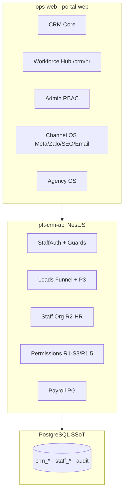
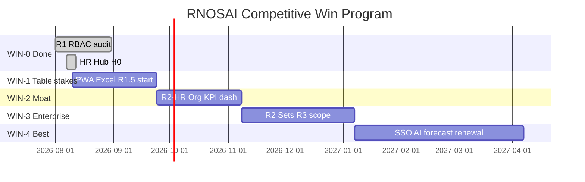

# Spec Master — RNOSAI Competitive Win (CRM · HR · RBAC · Revenue OS)

> **Document ID:** RNOSAI-WIN-MASTER-20260807  
> **Phiên bản:** 1.0 · **Ngày:** 2026-08-07  
> **Trạng thái:** Draft — chờ PO / GDKD / HR / IT sign-off  
> **Audience:** PO, GDKD, HR, CFO, IT, Engineering, Sales/MKT leadership  
> **Loại:** Master spec — **single source of truth** cho chiến lược thắng đối thủ  
> **Parent:** [`SPEC_AI_REVENUE_OPERATING_SYSTEM.md`](../SPEC_AI_REVENUE_OPERATING_SYSTEM.md) · [`SPEC_RNOSAI_MASTER.md`](../SPEC_RNOSAI_MASTER.md)

---

## Mục lục

1. [Định nghĩa “thắng hoàn toàn”](#1-định-nghĩa-thắng-hoàn-toàn)
2. [Đối thủ & điều kiện thắng](#2-đối-thủ--điều-kiện-thắng)
3. [Kiến trúc sản phẩm](#3-kiến-trúc-sản-phẩm)
4. [Ma trận năng lực mục tiêu (scorecard)](#4-ma-trận-năng-lực-mục-tiêu-scorecard)
5. [CRM — Catalog tính năng & gap closure](#5-crm--catalog-tính-năng--gap-closure)
6. [HR — Workforce & Performance OS](#6-hr--workforce--performance-os)
7. [RBAC & Identity — Enterprise grade](#7-rbac--identity--enterprise-grade)
8. [Agency OS & Closed-loop Revenue](#8-agency-os--closed-loop-revenue)
9. [AI Revenue Layer](#9-ai-revenue-layer)
10. [Quy tắc nghiệp vụ (Business Rules Registry)](#10-quy-tắc-nghiệp-vụ-business-rules-registry)
11. [Data model tổng hợp](#11-data-model-tổng-hợp)
12. [API & UI route map](#12-api--ui-route-map)
13. [Chương trình triển khai WIN-0 → WIN-4](#13-chương-trình-triển-khai-win-0--win-4)
14. [Backlog có ID (engineering)](#14-backlog-có-id-engineering)
15. [KPI & exit criteria](#15-kpi--exit-criteria)
16. [Go-to-market & demo scripts](#16-go-to-market--demo-scripts)
17. [OUT of scope (cấm build)](#17-out-of-scope-cấm-build)
18. [Governance & sign-off](#18-governance--sign-off)
19. [Tài liệu con (traceability)](#19-tài-liệu-con-traceability)

---

## 1. Định nghĩa “thắng hoàn toàn”

### 1.1. Category sản phẩm

```text
Revenue Operating System (RevenueOS AI)
= CRM enterprise + Agency OS + Channel OS + Workforce OS + AI revenue layer
```

**Không** định vị: CRM SME giá rẻ · HRM full · ERP kế toán · LP builder.

### 1.2. Ba tầng thắng

| Tầng | Mô tả | Đối thủ bị vượt |
|------|--------|-----------------|
| **T1 — Table stakes** | ~85% CRM/HRM demo không bị loại vòng | Getfly, Base, HappyTime |
| **T2 — Moat niche** | Agency + performance marketing — metric họ không có | MISA AVA generic, CRM VN |
| **T3 — Enterprise** | SSO, scope, audit, simulator — checklist IT 100+ NV | HubSpot mid, Salesforce SMB |

**Thắng hoàn toàn** = T1 ✅ + T2 **score ≥4.5/5** + T3 **unblock 100% deal target**.

### 1.3. Câu pitch khi thắng

> *AVA giúp bán nhanh. Getfly giúp lưu KH. RevenueOS AI giúp **kiếm tiền từ marketing** — biết ads nào ra HĐ, ai chịu SLA handoff, ROAS trên portal client, quyền audit được.*

### 1.4. Ba moat không copy nhanh (<12 tháng)

```mermaid
flowchart TB
  subgraph M1["Moat 1 — Closed-loop"]
    S[Spend Meta/Zalo] --> L[Lead]
    L --> D[Deal/HĐ]
    D --> R[ROAS/CPL/Margin]
  end
  subgraph M2["Moat 2 — Agency OS"]
    MC[Multi-client]
    P[Portal governance]
    Q[Launch QA + Temporal write]
  end
  subgraph M3["Moat 3 — Org VN × RBAC"]
    H[Sales→Solution handoff]
    JF[Job function add-on]
    KPI[KPI team Sales|Solution]
  end
  M1 --> WIN[Competitive win]
  M2 --> WIN
  M3 --> WIN
```

---

## 2. Đối thủ & điều kiện thắng

### 2.1. Ma trận đối thủ

| Đối thủ | Phân khúc | Thắng khi | Không cạnh |
|---------|-----------|-----------|------------|
| **Getfly CRM/HRM** | SME VN | T1 parity + T2 moat demo | Giá ~31k/tháng |
| **MISA AMIS + AVA** | B2B + kế toán | T2 AI revenue + export ERP | Đi tuyến, sổ cái |
| **Base / HappyTime / 1Office** | HRM SaaS VN | T1 HR hub + T2 KPI CRM | GPS field force |
| **HubSpot mid-market** | Global SMB | T3 RBAC sets + team + SSO | Generic automation |
| **Salesforce Essentials** | Enterprise SMB | T3 scope + audit + simulator | Custom objects depth |
| **Monday / agency tools** | Workspace | T2 multi-client + closed-loop | Generic PM |

### 2.2. Win conditions theo persona khách

| Persona mua | Câu hỏi quyết định | Proof bắt buộc |
|-------------|-------------------|----------------|
| **Agency owner 30–100 client** | CPL/ROAS theo client? Portal? | Hub map ≥80% + portal |
| **Brand in-house MKT** | Ads nào ra deal? | Attribution lead→HĐ |
| **GDKD agency** | Sales–Solution ai chịu SLA? | Queue + KPI dashboard |
| **HR 50–200 NV** | Onboard bao lâu? | ≤15 ph wizard |
| **IT enterprise** | SSO? Audit? Scope? | Keycloak + access review |
| **CFO** | Lương/thưởng gắn KPI? | Export Excel + bonus line |

### 2.3. Scorecard mục tiêu cuối WIN-4 (18 tháng)

| Hạng mục | Getfly | MISA | HubSpot | **PTT target** |
|----------|:------:|:----:|:-------:|:--------------:|
| CRM core | 5 | 4 | 5 | **5** |
| Mobile/PWA | 5 | 4 | 5 | **4** |
| HRM table stakes | 5 | 5 | 4 | **4** |
| Payroll compliance VN | 3 | **5** | 2 | **2*** |
| Ads closed-loop | 2 | 2 | 2 | **5** |
| Multi-client agency | 1 | 1 | 3 | **5** |
| Handoff Sales–Solution | 1 | 1 | 1 | **5** |
| RBAC enterprise | 2 | 2 | 5 | **5** |
| AI revenue (NBA/forecast) | 2 | 4 | 4 | **5** |
| SSO/MFA | 2 | 4 | 5 | **5** |

*Payroll: export front-office — **không** thay MISA (OUT scope).

---

## 3. Kiến trúc sản phẩm

### 3.1. Lớp hệ thống



### 3.2. Bounded contexts

| Context | Module | Win contribution |
|---------|--------|------------------|
| **CRM Core** | Lead, CSKH, pipeline, customer | T1 |
| **Presales P3** | Handoff, queue, consult, R5 | T2 moat |
| **Workforce** | HR hub, roster, payroll lite | T1 + T2 KPI |
| **Identity** | RBAC, org, job function | T2 + T3 |
| **Agency** | Hub, lifecycle, portal | T2 |
| **Channel** | Meta, Zalo, SEO, Email OS | T2 closed-loop |
| **AI** | Copilot, score, NBA, forecast | T2 vs AVA |

---

## 4. Ma trận năng lực mục tiêu (scorecard)

Scale 1–5. **Target WIN-4** in bold.

### 4.1. CRM

| ID | Năng lực | As-is | WIN-2 | **WIN-4** |
|----|----------|:-----:|:-----:|:---------:|
| C-01 | Lead ingest đa kênh | 5 | 5 | **5** |
| C-02 | Lead list UX (filter, bulk, columns) | 3 | 5 | **5** |
| C-03 | Mobile/PWA lead care | 2 | 4 | **4** |
| C-04 | CSKH SLA board | 5 | 5 | **5** |
| C-05 | Pre-sales handoff P3 | 4 | 5 | **5** |
| C-06 | Pipeline Kanban | 3 | 4 | **4** |
| C-07 | Proposal PDF | 3 | 4 | **5** |
| C-08 | Custom field admin | 2 | 5 | **5** |
| C-09 | Calendar/reminder | 2 | 4 | **5** |
| C-10 | Global search | 4 | 5 | **5** |

### 4.2. HR

| ID | Năng lực | As-is | WIN-2 | **WIN-4** |
|----|----------|:-----:|:-----:|:---------:|
| H-01 | HR Hub `/crm/hr` | 3 | 5 | **5** |
| H-02 | Onboard ≤15 ph | 1 | 5 | **5** |
| H-03 | Org chart | 1 | 4 | **5** |
| H-04 | Roster form + Excel | 2 | 5 | **5** |
| H-05 | Payroll PG + Excel export | 2 | 4 | **4** |
| H-06 | KPI gắn CRM per role | 3 | 5 | **5** |
| H-07 | Offboard wizard | 1 | 5 | **5** |
| H-08 | Leave lite | 0 | 2 | **3** |

### 4.3. RBAC

| ID | Năng lực | As-is | WIN-2 | **WIN-4** |
|----|----------|:-----:|:-----:|:---------:|
| R-01 | PG-only caps + CI | 4 | 5 | **5** |
| R-02 | Admin matrix + audit | 4 | 5 | **5** |
| R-03 | Job function add-on | 0 | 5 | **5** |
| R-04 | Row-level lead scope | 0 | 5 | **5** |
| R-05 | Permission Sets | 0 | 4 | **5** |
| R-06 | Team JWT scope | 0 | 4 | **5** |
| R-07 | SoD validator | 0 | 5 | **5** |
| R-08 | Permission simulator | 0 | 3 | **5** |
| R-09 | SSO + MFA | 0 | 0 | **5** |
| R-10 | Quarterly access review | 1 | 4 | **5** |

### 4.4. Agency & AI

| ID | Năng lực | As-is | WIN-2 | **WIN-4** |
|----|----------|:-----:|:-----:|:---------:|
| A-01 | Hub spend map ≥80% UI | 3 | 5 | **5** |
| A-02 | Portal ROAS | 4 | 5 | **5** |
| A-03 | Launch QA governance | 4 | 5 | **5** |
| AI-01 | Copilot + score | 4 | 5 | **5** |
| AI-02 | NBA + playbook | 2 | 4 | **5** |
| AI-03 | Forecast MAPE ≤20% | 1 | 3 | **5** |
| AI-04 | Renewal agent T-90 | 0 | 3 | **5** |
| AI-05 | CPL anomaly digest | 1 | 4 | **5** |

---

## 5. CRM — Catalog tính năng & gap closure

> Chi tiết PR: [`crm-getfly-gap-matrix.md`](./crm-getfly-gap-matrix.md)

### 5.1. Bảy trụ CRM (nghiệp vụ)

| Trụ | Routes chính | WIN deliverables |
|-----|--------------|------------------|
| **Lead Ops** | `/crm/leads*` | PWA, Excel, columns, AI score |
| **CSKH SLA** | `/crm/cskh-board` | Mobile card, export Excel |
| **Handoff P3** | `/crm/solution/queue`, presales | KPI team dimension |
| **Pipeline** | `/crm/sales`, `/crm/proposals` | Kanban, PDF proposal |
| **Agency delivery** | `/crm/hub`, `/crm/service-delivery` | Spend label ≥80% |
| **KPI/Finance** | `/crm/kpi`, `/crm/business-dashboard` | Charts, owner weekly PDF |
| **Admin data** | `/admin/crm/custom-fields`, pipeline | RNOS-35 |

### 5.2. Lead funnel state machine

Theo [`product-model-v1.md`](../product-model-v1.md):

```
Assigned → B2 → [ReviewQueue] → Presales → Handoff → Consult → Proposal → Contract → Lifecycle
```

**Gate server-side bắt buộc** — không bypass UI (WIN-1).

### 5.3. P3 Handoff — caps & SLA

| Metric | SLA | Owner | Dashboard |
|--------|-----|-------|-----------|
| B2 → Intake Go | ≤48h | AM | `/crm/kpi` dim=sales |
| Go → Handoff | ≤24h | AM | same |
| Handoff → Consult ✓ | ≤72h | Solution | `/crm/hr` perf + new `/crm/kpi/solution` |
| Consult → Release | ≤48h | Solution | same |
| Release → Proposal sent | ≤48h | AM | sales funnel |

Spec: [`2026-08-06-presales-solution-handoff-design.md`](./2026-08-06-presales-solution-handoff-design.md)

### 5.4. CRM backlog ưu tiên (T1)

| ID | Feature | Parity | Wave |
|----|---------|--------|------|
| WIN-C-01 | PWA manifest + lead list mobile | P0-1 | WIN-1 |
| WIN-C-02 | Lead export/import Excel template VN | P0-2 | WIN-1 |
| WIN-C-03 | Lead column picker LocalStorage | Getfly F2 | WIN-1 |
| WIN-C-04 | CSKH board mobile + CSV export | P0-2 | WIN-1 |
| WIN-C-05 | Activity file upload | Getfly detail | WIN-2 |
| WIN-C-06 | Custom field + pipeline admin | P1-1 RNOS-35 | WIN-2 |
| WIN-C-07 | Calendar + reminder on lead | P1-2 | WIN-2 |
| WIN-C-08 | Proposal export PDF | B2B | WIN-2 |
| WIN-C-09 | Dashboard `/` widgets | Getfly home | WIN-2 |
| WIN-C-10 | Solution KPI dashboard `/crm/kpi/solution` | **Moat** | WIN-2 |

---

## 6. HR — Workforce & Performance OS

> Chi tiết: [`2026-08-07-hr-enterprise-business-analysis.md`](./2026-08-07-hr-enterprise-business-analysis.md) · [`2026-08-07-hr-competitive-organization-program.md`](./2026-08-07-hr-competitive-organization-program.md)

### 6.1. Năm workspace

| # | Workspace | Entry | WIN-4 state |
|---|-----------|-------|-------------|
| ① | Hồ sơ & tổ chức | `/crm/staff`, org CRUD | Form + org chart + Excel |
| ② | Tài khoản & quyền | `/admin/crm/org/users`, permissions | Wizard + effective preview |
| ③ | Chấm công & lương | `/crm/payroll` | PG + Excel payslip |
| ④ | Hiệu suất | `/crm/staff-kpi`, `/crm/kpi` | Role dashboards + bonus |
| ⑤ | Talent config | `/crm/staff?tab=levels` | Form UI (not JSON) |

**Hub:** `/crm/hr` ✅ H0

### 6.2. Identity 4 lớp

```
L1 Org (dept, team) → L2 crm_staff → L3 position + job_function → L4 staff_users → JWT caps
```

Spec: [`2026-08-07-rbac-hr-org-job-function-design.md`](./2026-08-07-rbac-hr-org-job-function-design.md)

### 6.3. Job function catalog (8)

| code | Label | Department scope |
|------|-------|------------------|
| `leader` | Trưởng nhóm | All |
| `sales` | Kinh doanh | DEPT-SALES |
| `content` | Content/Copy | DEPT-SOLUTION, DEPT-AGENCY |
| `design` | Design/Creative | DEPT-SOLUTION, DEPT-AGENCY |
| `analyst` | Phân tích/BI | All |
| `ops` | Vận hành | DEPT-CSKH, DEPT-HR |
| `technical` | Kỹ thuật SEO | DEPT-AGENCY |
| `compliance` | Tuân thủ email | DEPT-AGENCY |

**Cardinality:** 1 position + 0–3 functions per user.

### 6.4. HR backlog ưu tiên

| ID | Feature | Wave |
|----|---------|------|
| WIN-H-01 | R1.5 job function DDL + UI | WIN-1 |
| WIN-H-02 | R2-HR org/users onboard wizard | WIN-2 |
| WIN-H-03 | Roster form edit + Excel import | WIN-1 |
| WIN-H-04 | Payroll migrate PG + Excel export | WIN-2 |
| WIN-H-05 | Org chart visual | WIN-2 |
| WIN-H-06 | Offboard wizard + reassign lead | WIN-2 |
| WIN-H-07 | KPI Solution/Sales/CSKH dashboards | WIN-2 |
| WIN-H-08 | Bonus rule → payroll line | WIN-3 |
| WIN-H-09 | Payslip self-service read-only | WIN-4 |
| WIN-H-10 | Leave request lite form | WIN-4 |

### 6.5. HR operating model

| Luồng | SLA | Tool |
|-------|-----|------|
| Onboard | ≤15 ph | org/users wizard |
| Offboard | ≤1h revoke | offboard wizard |
| KPI close | T+3 tháng | `/crm/kpi` export |
| Access review | Quarterly | effective caps export |

Runbook: [`../runbooks/rbac-hr-org-workflow.md`](../runbooks/rbac-hr-org-workflow.md)

---

## 7. RBAC & Identity — Enterprise grade

> Chi tiết: [`2026-08-06-rbac-enterprise-design.md`](./2026-08-06-rbac-enterprise-design.md)

### 7.1. Effective caps formula

```
effective_caps(user) =
    caps(position_id)
  ∪ caps(job_function ∈ user.job_functions)
  ∪ caps(permission_set ∈ user.permission_sets)
  ∪ break_glass_caps(user) if not expired
```

### 7.2. Phase RBAC

| Phase | Deliverable | vs HubSpot |
|-------|-------------|------------|
| **R1** ✅ | PG SSoT, matrix, audit, fail-closed | Profiles |
| **R1.5** | Job function add-on | Permission bundles lite |
| **R1-S4** | Row-level lead AM scope | Sharing rules lite |
| **R2-A** | Tách `crm_gdkd.*` caps | SoD |
| **R2-B** | Permission Sets | Permission Sets |
| **R2-C** | Team JWT + queue filter | Teams |
| **R2-D** | Break-glass | Emergency access |
| **R3** | Client scope + field-level + simulator | Enterprise |
| **R4** | Keycloak SSO + MFA | SSO |

### 7.3. SoD rules (bắt buộc UI + API 409)

| Rule | Cấm |
|------|-----|
| SoD-01 | `content.write` + `crm_seo_aeo_approve.approve` |
| SoD-02 | `design` + `compliance` cùng user |
| SoD-03 | `KD-01` + `view_all_leads` (chỉ GDKD) |
| SoD-04 | `leader.assign` without team scope |

### 7.4. Admin routes

| Route | Cap |
|-------|-----|
| `/admin/crm/permissions` | `crm_data_config.*` |
| `/admin/crm/permissions/functions` | `crm_data_config.*` |
| `/admin/crm/org/departments` | `crm_staff_departments.*` |
| `/admin/crm/org/users` | `crm_staff_roster.edit` + configure |

UI: [`2026-08-07-rbac-hr-org-job-function-ui-ux-design.md`](./2026-08-07-rbac-hr-org-job-function-ui-ux-design.md)

---

## 8. Agency OS & Closed-loop Revenue

> [`SPEC_AGENCY_OPERATING_PLATFORM.md`](../SPEC_AGENCY_OPERATING_PLATFORM.md) · [`SPEC_META_ENTERPRISE_PTTADS.md`](../SPEC_META_ENTERPRISE_PTTADS.md)

### 8.1. Closed-loop chain

```
Meta/Zalo Spend → Lead (UTM/CAPI) → Deal/HĐ → Lifecycle margin → Portal ROAS/CPL
```

### 8.2. WIN deliverables

| ID | Feature | KPI |
|----|---------|-----|
| WIN-A-01 | Hub map spend label ≥80% on UI | G1 attribution |
| WIN-A-02 | Lead campaign_id chip → Meta hub | Drill ≤3 click |
| WIN-A-03 | Portal attribution footer | Client trust |
| WIN-A-04 | Launch QA + campaign write status | Governance |
| WIN-A-05 | Service lifecycle 7 stage + margin | Agency delivery |
| WIN-A-06 | Multi-client workspace isolation R3 | Client scope |

### 8.3. Channel OS (giữ parity shipped)

Meta · Zalo · SEO/AEO · Email — không duplicate spec tại đây; WIN yêu cầu **cross-link CRM** trên mọi lead/deal.

---

## 9. AI Revenue Layer

> [`SPEC_AI_REVENUE_OPERATING_SYSTEM.md`](../SPEC_AI_REVENUE_OPERATING_SYSTEM.md) §22–25

### 9.1. vs MISA AVA

| Capability | AVA | PTT WIN-4 |
|------------|-----|-----------|
| Tóm tắt KH | ✅ | ✅ + ads source |
| Deal predict | ✅ | ✅ + ads touch |
| Forecast | ○ | ✅ MAPE ≤20% |
| Renewal HĐ agency | ❌ | ✅ T-90 agent |
| NBA | ○ | ✅ + playbook |
| CPL/ROAS anomaly | ❌ | ✅ **độc quyền** |

### 9.2. AI backlog

| ID | Feature | Wave |
|----|---------|------|
| WIN-AI-01 | Copilot production all lead cohorts | WIN-1 |
| WIN-AI-02 | Deal score + NBA card | WIN-2 |
| WIN-AI-03 | RAG playbook `/crm/playbooks` polish | WIN-2 |
| WIN-AI-04 | Forecast snapshot + MAPE report | WIN-3 |
| WIN-AI-05 | Renewal workflow T-90/T-60/T-30 | WIN-3 |
| WIN-AI-06 | CPL anomaly narrative digest | WIN-4 |
| WIN-AI-07 | Budget recommend read-only | WIN-4 |

**BR-AI-01:** Không auto gửi Zalo/email — draft + human approve.

---

## 10. Quy tắc nghiệp vụ (Business Rules Registry)

### 10.1. CRM

| ID | Rule | Layer |
|----|------|-------|
| BR-CRM-001 | Một lead active một owner primary | API |
| BR-CRM-002 | Deal > threshold → GDKD trước proposal | API+UI |
| BR-CRM-003 | Customer code unique | API |
| BR-CRM-004 | AM không mutate Consult/R5/Release | API+cap |
| BR-CRM-005 | Solution không đổi owner_id | API |
| BR-CRM-006 | B2 >24h → review queue | Job+UI |
| BR-CRM-007 | Handoff chỉ khi Intake Go | API gate |
| BR-CRM-008 | Release chỉ khi Consult✓ + R5 OK | API gate |

### 10.2. HR

| ID | Rule | Layer |
|----|------|-------|
| BR-HR-001 | internal_code unique | API |
| BR-HR-002 | job_title không quyết định caps | Policy |
| BR-HR-003 | Max 3 job_functions | UI+API |
| BR-HR-030 | Offboard không xóa crm_staff | API |
| BR-HR-031 | Offboard revoke same day | Workflow |

### 10.3. RBAC

| ID | Rule | Layer |
|----|------|-------|
| BR-RBAC-01 | Effective caps = union formula | API |
| BR-RBAC-02 | Cap change → re-login | UX |
| BR-SOD-01..04 | SoD block save | UI+409 |

### 10.4. AI

| ID | Rule | Layer |
|----|------|-------|
| BR-AI-01 | No auto outbound message | UI+API |

---

## 11. Data model tổng hợp

### 11.1. PostgreSQL SSoT (cấm SQLite RBAC)

| Domain | Tables chính | Phase |
|--------|--------------|-------|
| Staff auth | `staff_users`, `staff_section_permissions` | R1 ✅ |
| Positions | `staff_positions`, `staff_permission_audit` | R1 ✅ |
| Job function | `staff_job_functions`, `staff_job_function_grants`, `staff_user_job_functions` | R1.5 |
| Org | `crm_departments`, `staff_teams`, `staff_org_audit` | R2-HR |
| HR profile | `crm_staff`, `crm_staff_settings`, `crm_staff_kpi` | ✅ |
| Payroll | `crm_payroll_*` (migrate PG) | WIN-H-04 |
| Permission sets | `staff_permission_sets`, `staff_user_permission_sets` | R2-B |
| Leads P3 | `crm_lead_presales` handoff columns | P3 |

DDL refs: [`2026-08-06-postgresql-ddl-staff-positions.sql`](./2026-08-06-postgresql-ddl-staff-positions.sql) · [`2026-08-07-postgresql-ddl-staff-job-functions.sql`](./2026-08-07-postgresql-ddl-staff-job-functions.sql) *(R1.5)*

### 11.2. CI gates

| Gate | Script |
|------|--------|
| RBAC catalog | `scripts/rbac_catalog_gate.sh` |
| No SQLite RBAC write | CI workflow `rbac-r1-gate.yml` |
| PG migration idempotent | `scripts/apply_pg_ddl_*.sh` |

---

## 12. API & UI route map

### 12.1. ops-web — CRM + HR

| Route | Module | WIN |
|-------|--------|-----|
| `/crm/hr` | HR Hub | H0 ✅ |
| `/crm/leads*` | CRM | WIN-1 polish |
| `/crm/solution/queue` | P3 | WIN-2 KPI |
| `/crm/cskh-board` | CSKH | WIN-1 mobile |
| `/crm/staff*` | Workforce | WIN-1/2 |
| `/crm/payroll` | Time&Pay | WIN-2 PG |
| `/crm/staff-kpi` | Performance | WIN-2 charts |
| `/crm/kpi` | Performance | WIN-2 solution tab |
| `/admin/crm/org/*` | Identity | WIN-2 |
| `/admin/crm/permissions*` | RBAC | R1.5 |

### 12.2. Nest API prefix

| Prefix | Module |
|--------|--------|
| `/api/v1/staff/auth` | Login, me, refresh |
| `/api/v1/staff/permissions` | Matrix, audit, export |
| `/api/v1/staff/org` | R2-HR CRUD |
| `/api/v1/leads` | Funnel + P3 |
| `/api/crm/staff` | Roster, levels, KPI |
| `/api/crm/payroll` | Attendance, compute |

---

## 13. Chương trình triển khai WIN-0 → WIN-4

### 13.1. Timeline (18 tháng)



### 13.2. WIN-0 — Foundation (✅ đang có)

| Deliverable | Status |
|-------------|--------|
| R1-S1 PG + CI catalog | ✅ |
| R1-S2 fail-closed UI | ✅ |
| R1-S3 permissions + audit | ✅ prod |
| P3 handoff design + queue | ✅ partial |
| HR Hub `/crm/hr` | ✅ |
| CRM core ~53 routes | ✅ |
| Channel OS Meta/Email/SEO | ✅ |

**Exit WIN-0:** Demo handoff + ma trận audit + hub map partial.

### 13.3. WIN-1 — Table stakes (6–8 tuần · ~35 dev-days)

**Mục tiêu:** Không thua Getfly/Base trên demo CRM+HR cơ bản.

| Stream | Deliverables |
|--------|--------------|
| Mobile | PWA manifest, lead list card, CSKH mobile |
| Data | Excel import/export lead + roster |
| RBAC | R1.5 job function full stack |
| UX | Lead columns, empty states, staff `?tab=` |
| CRM | Activity file upload (optional stretch) |

**Exit WIN-1:**

- [ ] PWA installable Lighthouse
- [ ] Excel lead round-trip
- [ ] content ≠ design UAT pass
- [ ] 0 fail-open route write

### 13.4. WIN-2 — Moat niche (8–10 tuần · ~45 dev-days)

**Mục tiêu:** Thắng rõ agency VN — metric đối thủ không có.

| Stream | Deliverables |
|--------|--------------|
| HR | R2-HR org/users wizard, org chart, offboard |
| HR | Payroll PG + Excel, roster form |
| CRM | Solution KPI dashboard, handoff SLA tiles |
| CRM | Custom field + pipeline admin, calendar |
| CRM | Proposal PDF, hub spend ≥80% label |
| RBAC | R1-S4 row-level lead scope |

**Exit WIN-2:**

- [ ] Onboard ≤15 ph (3 NV UAT)
- [ ] Solution KPI dashboard live
- [ ] AM không GET lead người khác
- [ ] Hub map ≥80% labeled

### 13.5. WIN-3 — Enterprise credibility (10–12 tuần · ~50 dev-days)

**Mục tiêu:** Unblock deal 100+ NV; HubSpot-parity RBAC.

| Stream | Deliverables |
|--------|--------------|
| RBAC | R2-A GDKD cap split |
| RBAC | R2-B Permission Sets |
| RBAC | R2-C Team JWT scope |
| RBAC | R2-D Break-glass |
| RBAC | R3 client scope pilot |
| RBAC | Permission simulator |
| AI | Forecast MAPE + renewal T-90 |
| HR | Bonus rule engine, access review export |

**Exit WIN-3:**

- [ ] Permission Set backup claim demo
- [ ] Simulator preview = prod menu
- [ ] Quarterly access review export
- [ ] Forecast MAPE report

### 13.6. WIN-4 — Best-in-class (12+ tuần · ~55 dev-days)

**Mục tiêu:** Scorecard §4 đạt **bold targets**; không đối thủ VN tương đương AI revenue.

| Stream | Deliverables |
|--------|--------------|
| Identity | R4 Keycloak SSO + MFA |
| RBAC | R3 field-level ABAC pilot |
| AI | CPL anomaly digest, budget recommend |
| AI | Multi-agent orchestrator prep |
| HR | Payslip portal, leave lite |
| CRM | Policy-as-code OPA pilot (handoff rules) |

**Exit WIN-4 (thắng hoàn toàn):**

- [ ] Scorecard §4 all **bold** ≥ target
- [ ] SSO UAT 100+ NV
- [ ] Renewal agent live on lifecycle
- [ ] 0 ghost accounts · 0 cap drift 90 days
- [ ] PO signed WIN-4 acceptance

---

## 14. Backlog có ID (engineering)

### 14.1. Epic map

| Epic | IDs | Dev-days | Wave |
|------|-----|----------|------|
| **E-WIN-MOBILE** | WIN-C-01, WIN-C-04 | 12 | WIN-1 |
| **E-WIN-EXCEL** | WIN-C-02, WIN-H-03 | 8 | WIN-1 |
| **E-WIN-R15** | WIN-H-01, R-03 | 15 | WIN-1 |
| **E-WIN-R2HR** | WIN-H-02,05,06, H-07 | 22 | WIN-2 |
| **E-WIN-PAY** | WIN-H-04 | 8 | WIN-2 |
| **E-WIN-KPI** | WIN-C-10, WIN-H-07 | 10 | WIN-2 |
| **E-WIN-ADMIN** | WIN-C-06,07 | 15 | WIN-2 |
| **E-WIN-SCOPE** | R-04, R-05,06,07 | 35 | WIN-3 |
| **E-WIN-AI** | WIN-AI-04,05,06 | 25 | WIN-3/4 |
| **E-WIN-SSO** | R-09 | 15 | WIN-4 |

**Tổng ước lượng:** ~165 dev-days · ~18 tháng calendar (1 BE + 1 FE + PO/HR part-time).

### 14.2. Dependency graph

```
R1 ✅ → R1.5 → R2-HR → R2-B/C → R3 → R4
WIN-1 mobile/excel ∥ R1.5
P3 prod → WIN-C-10 KPI solution
Hub G1 → WIN-A-01
```

---

## 15. KPI & exit criteria

### 15.1. North Star (business)

| KPI | Baseline | WIN-2 | WIN-4 |
|-----|----------|-------|-------|
| Revenue attributed ≥80% | ~60% | 75% | **80%** |
| Lead response ≤15p (90%) | ~70% | 85% | **90%** |
| Onboard time | ~2h | 15 ph | **10 ph** |
| Handoff Go→Consult ≤5d | không đo | 70% | **85%** |
| Client renewal +5pp | 0 | +2pp | **+5pp** |
| AI acceptance rate | ~30% | 35% | **40%** |
| Forecast MAPE | N/A | 25% | **≤20%** |

### 15.2. Engineering KPI

| KPI | WIN-4 target |
|-----|--------------|
| Route write guard coverage | 100% |
| RBAC PG-only CI | 0 SQLite violation |
| Prod cap drift incidents | 0 / 90 days |
| E2E critical paths green | 100% CI |
| PWA Lighthouse installable | Pass |

### 15.3. WIN-4 sign-off checklist

- [ ] Scorecard §4 — all categories ≥ bold column
- [ ] Demo script §16 — 60 ph pass blind UAT
- [ ] HR Steering Council quarterly minutes
- [ ] Access review export archived
- [ ] No OUT scope features shipped (§17 audit)
- [ ] PO + GDKD + HR + IT signed PDF

---

## 16. Go-to-market & demo scripts

### 16.1. Pitch theo wave

| Wave | One-liner |
|------|-----------|
| WIN-0 | CRM có handoff Sales–Solution + audit RBAC |
| WIN-1 | Mobile + Excel + phân quyền content/design |
| WIN-2 | HR onboard 15 ph + KPI Solution SLA |
| WIN-3 | HubSpot-class RBAC + forecast renewal |
| WIN-4 | SSO enterprise + AI ROAS intelligence |

### 16.2. Demo 60 phút (WIN-4 target)

| # | Scene | Proof |
|---|-------|-------|
| 1 | Meta lead → assign → AI score | Closed-loop start |
| 2 | CSKH board SLA mobile | T1 |
| 3 | AM handoff → Solution claim (AM 403) | Moat |
| 4 | Consult → Release → Proposal PDF | P3 |
| 5 | Hub map ≥80% → portal ROAS | Agency |
| 6 | HR onboard wizard 15 ph | HRM |
| 7 | content vs design menu khác | R1.5 |
| 8 | SoD block demo | Enterprise |
| 9 | AM scope — no other lead | R1-S4 |
| 10 | Permission simulator | R3 |
| 11 | Forecast + renewal alert | AI vs AVA |
| 12 | Audit export + SSO login | IT checklist |

### 16.3. FAQ bán hàng

| Câu hỏi | Trả lời |
|---------|---------|
| Getfly rẻ hơn? | Getfly lưu KH. Chúng tôi đo ads→HĐ→ROAS + handoff Solution. |
| MISA có AVA? | AVA bán hàng chung. Chúng tôi gắn chi phí Meta/Zalo + renewal HĐ agency. |
| Thiếu app native? | PWA lead care; native defer — ưu tiên copilot + SLA. |
| Thiếu kế toán? | Export MISA — front-office revenue, không thay ERP. |
| Thiếu BHXH? | OUT scope — dùng MISA/FAST HRM payroll compliance. |

---

## 17. OUT of scope (cấm build)

| Module | Lý do | Thay thế |
|--------|-------|----------|
| Landing page builder 1000+ mẫu | Không moat | Form UTM + SEO |
| ERP sổ cái / GTGT / tồn kho | Thua MISA giá | Export connector |
| NVBH đi tuyến | Thua MISA | — |
| BHXH / quyết toán TNCN full | Compliance outsource | MISA/FAST |
| GPS chấm công công trường | Base/HappyTime moat | Manual attendance lite |
| ATS tuyển dụng / LMS | Dilute | — |
| Chatbot Fanpage clone AVA | Không moat | Webhook + score |
| Native iOS/Android app | Cost | PWA WIN-1 |

**CI/product review:** PR touch OUT scope → reject unless PO exception ticket.

---

## 18. Governance & sign-off

### 18.1. Steering council

| Role | Responsibility |
|------|----------------|
| **PO** | Scope, ma trận ký, WIN phase gate |
| **GDKD** | KPI policy, GDKD caps |
| **HR Manager** | HR SOP, roster quality |
| **IT Admin** | Deploy, SSO, incident |
| **Eng Lead** | Backlog, CI, architecture |
| **CFO** | Payroll export, bonus |

**Cadence:** Bi-weekly · minutes → `docs/exports/win-council/`

### 18.2. Phase gate process

1. Eng demo staging vs exit checklist §13  
2. UAT persona script §16 subset  
3. PO sign PDF `docs/exports/signed/WIN-{n}-acceptance.pdf`  
4. Prod deploy + 48h smoke  
5. KPI baseline snapshot  

### 18.3. Sign-off (this spec)

| Role | Name | Date | Signature |
|------|------|------|-----------|
| PO | | | |
| GDKD | | | |
| HR | | | |
| IT | | | |
| Eng | | | |

---

## 19. Tài liệu con (traceability)

| Doc | Vai trò |
|-----|---------|
| [`2026-08-07-crm-enterprise-business-analysis.md`](./2026-08-07-crm-enterprise-business-analysis.md) | CRM nghiệp vụ |
| [`2026-08-07-hr-enterprise-business-analysis.md`](./2026-08-07-hr-enterprise-business-analysis.md) | HR nghiệp vụ |
| [`2026-08-07-hr-competitive-organization-program.md`](./2026-08-07-hr-competitive-organization-program.md) | HR program H0–H3 |
| [`2026-08-06-rbac-enterprise-design.md`](./2026-08-06-rbac-enterprise-design.md) | RBAC R1–R4 |
| [`2026-08-07-rbac-hr-org-job-function-design.md`](./2026-08-07-rbac-hr-org-job-function-design.md) | Identity model |
| [`2026-08-07-rnosai-competitive-win-ui-ux-design.md`](./2026-08-07-rnosai-competitive-win-ui-ux-design.md) | **UI/UX master WIN-0→4** |
| [`2026-08-07-rnosai-competitive-win-implementation-plan.md`](./2026-08-07-rnosai-competitive-win-implementation-plan.md) | **Execution plan WIN-0→4** |
| [`2026-08-07-rbac-hr-org-job-function-ui-ux-design.md`](./2026-08-07-rbac-hr-org-job-function-ui-ux-design.md) | UI RBAC/HR |
| [`2026-08-07-rbac-hr-org-job-function-implementation-plan.md`](./2026-08-07-rbac-hr-org-job-function-implementation-plan.md) | Dev plan R1.5/R2 |
| [`2026-08-06-presales-solution-handoff-design.md`](./2026-08-06-presales-solution-handoff-design.md) | P3 handoff |
| [`crm-getfly-gap-matrix.md`](./crm-getfly-gap-matrix.md) | PR checklist Getfly |
| [`../runbooks/rbac-hr-org-workflow.md`](../runbooks/rbac-hr-org-workflow.md) | HR runbook |
| [`../SPEC_AI_REVENUE_OPERATING_SYSTEM.md`](../SPEC_AI_REVENUE_OPERATING_SYSTEM.md) | AI strategy |

---

*Changelog v1.0 — 2026-08-07: Master spec Competitive Win — CRM · HR · RBAC · Agency · AI.*
