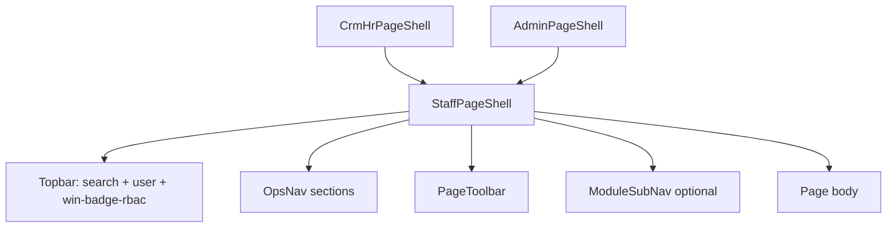

# RNOSAI Competitive Win — UI/UX Design (Giao diện)

> **Document ID:** RNOSAI-WIN-UIUX-20260807  
> **Phiên bản:** 1.0 · **Ngày:** 2026-08-07  
> **Trạng thái:** Design for implementation — WIN-0 → WIN-4  
> **Parent:** [`2026-08-07-rnosai-competitive-win-master-spec.md`](./2026-08-07-rnosai-competitive-win-master-spec.md)  
> **Design system:** [`../SPEC_UI_UX_PTT.md`](../SPEC_UI_UX_PTT.md) · [`../SPEC_UI_UX_AI_REVENUE_OS.md`](../SPEC_UI_UX_AI_REVENUE_OS.md)  
> **HR/RBAC UI:** [`2026-08-07-rbac-hr-org-job-function-ui-ux-design.md`](./2026-08-07-rbac-hr-org-job-function-ui-ux-design.md)  
> **Execution plan:** [`2026-08-07-rnosai-competitive-win-implementation-plan.md`](./2026-08-07-rnosai-competitive-win-implementation-plan.md)  
> **App:** `services/ops-web` · **CSS:** `app/globals.css`

---

## Mục lục

1. [Mục tiêu UX & tiêu chí thắng giao diện](#1-mục-tiêu-ux--tiêu-chí-thắng-giao-diện)
2. [Benchmark UI đối thủ](#2-benchmark-ui-đối-thủ)
3. [Information Architecture — toàn hệ thống](#3-information-architecture--toàn-hệ-thống)
4. [Design system WIN (mở rộng PTT)](#4-design-system-win-mở-rộng-ptt)
5. [Shell & navigation](#5-shell--navigation)
6. [Component library WIN](#6-component-library-win)
7. [Cross-cutting UX patterns](#7-cross-cutting-ux-patterns)
8. [Mobile & PWA](#8-mobile--pwa)
9. [Route specs — CRM (WIN)](#9-route-specs--crm-win)
10. [Route specs — HR Hub & Workforce](#10-route-specs--hr-hub--workforce)
11. [Route specs — Admin RBAC & Org](#11-route-specs--admin-rbac--org)
12. [Route specs — KPI & Performance dashboards](#12-route-specs--kpi--performance-dashboards)
13. [Route specs — Enterprise WIN-3/4](#13-route-specs--enterprise-win-34)
14. [Cap-first UI & fail-closed](#14-cap-first-ui--fail-closed)
15. [Responsive & accessibility](#15-responsive--accessibility)
16. [Visual QA & UAT map](#16-visual-qa--uat-map)
17. [File checklist (coding)](#17-file-checklist-coding)

---

## 1. Mục tiêu UX & tiêu chí thắng giao diện

### 1.1. UX goals (đo được)

| ID | Mục tiêu | Metric | Wave |
|----|----------|--------|------|
| UX-G1 | First impression “enterprise” | SUS ≥72 trên 5 màn core | WIN-2 |
| UX-G2 | HR onboard không cần training | Task success wizard ≥95% | WIN-2 |
| UX-G3 | Mobile lead care usable | Task complete `<768px` ≤3 tap | WIN-1 |
| UX-G4 | Cap/menu khớp 100% | UAT persona 0 menu thừa | WIN-1 |
| UX-G5 | Dashboard drill ≤3 click | Hub→lead path timed ≤15s | WIN-2 |
| UX-G6 | Không JSON làm UI chính | 0 trang prod dùng `<pre>` primary | WIN-2 |
| UX-G7 | Demo 60 ph không lỗi visual | 0 layout break staging | WIN-4 |

### 1.2. Nguyên tắc thiết kế (WIN)

1. **Vietnamese-first** — label VI; code/ID monospace muted secondary.
2. **Cap-first** — ẩn nút/route trước API 403; disabled + tooltip giải thích cap.
3. **Hub-before-deep** — `/crm`, `/crm/hr` launcher; tránh sidebar 40 link phẳng.
4. **Data density có kiểm soát** — bảng compact admin; card mobile field.
5. **Progressive disclosure** — list → drawer → full page; matrix full-width riêng.
6. **Trust & audit visible** — subtitle PostgreSQL audit; SoD banner; re-login toast.
7. **Closed-loop chips** — campaign/CPL/ROAS chip trên lead; hub map badge ≥80%.
8. **Reuse PTT tokens** — không palette mới; mở rộng semantic classes only.
9. **No silent privilege** — diff preview trước Lưu matrix/org.
10. **PWA ≠ desktop thu nhỏ** — layout riêng `<768px`, không chỉ scale.

### 1.3. Personas → primary surfaces

| Persona | Shell | Màn hình chính |
|---------|-------|----------------|
| CSKH | StaffPageShell | leads, cskh-board, lead detail+copilot |
| AM Sales | StaffPageShell | leads, intake, proposals |
| Solution | StaffPageShell | solution/queue, lead consult read-only |
| HR Ops | CrmHrPageShell | `/crm/hr`, staff, payroll |
| Admin/IT | AdminPageShell | permissions*, org/* |
| GDKD | StaffPageShell | kpi, business-dashboard, review-queue |
| CFO | CrmHrPageShell | payroll export, kpi export |

---

## 2. Benchmark UI đối thủ

### 2.1. Getfly — họ mạnh UI ở đâu

| Pattern Getfly | PTT target | WIN |
|----------------|------------|-----|
| App native lead list | PWA card list | WIN-1 |
| Org tree sidebar | Org chart page | WIN-2 |
| Excel import wizard | 3-step upload + preview | WIN-1 |
| HRM menu tập trung | `/crm/hr` 5 workspace | WIN-0 ✅ |
| Phép năm form | Leave lite (defer WIN-4) | OUT partial |

### 2.2. HubSpot — họ mạnh UI ở đâu

| Pattern HubSpot | PTT target | WIN |
|-----------------|------------|-----|
| Settings left nav grouped | Admin sub-nav 3 nhóm | WIN-2 |
| Permission bundle UI | Job function + Permission Set | WIN-1/3 |
| Kanban pipeline | `/crm/sales` drag | WIN-2 |
| Record timeline unified | Customer/lead timeline | WIN-2 |

### 2.3. PTT phải **vượt** trên UI (moat visual)

| Surface | Visual proof |
|---------|--------------|
| Handoff queue | Status pipeline + SLA countdown |
| Hub map | Spend % badge green/amber/red |
| KPI Solution | Team toggle Sales \| Solution |
| Identity card | Effective caps grouped by source tag |
| Copilot | Trust footer + campaign attribution chip |

---

## 3. Information Architecture — toàn hệ thống

### 3.1. ops-web top level

```
ops-web
├── / (dashboard widgets)                    WIN-2
├── /crm                                     Board launcher
│   ├── /crm/hr                              HR Hub ✅
│   ├── /crm/leads*                          Lead ops
│   ├── /crm/solution/queue                  P3 handoff
│   ├── /crm/cskh-board                      SLA
│   ├── /crm/kpi                             Org KPI
│   ├── /crm/kpi/solution                    WIN-2 NEW
│   ├── /crm/staff*                          Workforce
│   ├── /crm/payroll                         Time&Pay
│   ├── /crm/staff-kpi                       AM/SP
│   └── … (hub, sales, proposals, …)
├── /admin/crm                               Config + RBAC
│   ├── custom-fields, pipeline               WIN-2
│   ├── permissions, permissions/functions     WIN-1
│   └── org/*                                WIN-2
├── /meta, /email, /seo, /agency             Channel OS (existing)
└── /login, /403                             Auth
```

### 3.2. OpsNav sections (target)

| Section label | Links (cap-gated) |
|---------------|-------------------|
| CRM · Lead chung | leads, review-queue, cskh-board |
| CRM · Pre-sales | intake, solution/queue, proposals |
| **Nhân sự & Hiệu suất** | **hr hub**, staff, payroll, kpi, staff-kpi |
| Quản trị & Tài chính | business-dashboard, financials, … |
| Cấu hình CRM (admin) | custom-fields, permissions, org |
| Kênh quảng cáo | meta, zalo, … |

---

## 4. Design system WIN (mở rộng PTT)

Kế thừa [`SPEC_UI_UX_PTT.md`](../SPEC_UI_UX_PTT.md) §6 — **không đổi** `--primary`, font Inter/Manrope.

### 4.1. Semantic tokens mới (globals.css)

```css
/* WIN semantic — thêm vào globals.css */
:root {
  --win-sod-bg: #fef2f2;
  --win-sod-border: #dc2626;
  --win-success-bg: #ecfdf5;
  --win-warning-bg: #fffbeb;
  --win-info-bg: #eff6ff;
  --win-badge-planned: #6b7280;
  --win-layer-base: #17692f;
  --win-layer-addon: #2563eb;
  --win-layer-set: #7c3aed;
  --win-sla-ok: #16a34a;
  --win-sla-warn: #d97706;
  --win-sla-breach: #dc2626;
}
```

### 4.2. Class catalog

| Class | Dùng cho |
|-------|----------|
| `.win-sod-banner` | SoD alert `role="alert"` |
| `.win-relogin-toast` | Sticky toast sau PATCH caps |
| `.win-badge-rbac` | Pill `MKT-02 · content, design` |
| `.win-layer-tag--base` | Tag nguồn cap Base |
| `.win-layer-tag--addon` | Tag Add-on function |
| `.win-layer-tag--set` | Tag Permission set |
| `.win-diff-chip` | `+4 / -2 caps` |
| `.win-sla-chip--ok/warn/breach` | SLA countdown |
| `.win-attribution-chip` | Campaign/CPL link |
| `.win-hub-map-pct` | Spend mapped % |
| `.win-wizard-steps` | Stepper onboard |
| `.win-drawer` | Side panel 480px / full mobile |
| `.win-empty-state` | Illustration + CTA |
| `.win-planned-card` | Hub card R1.5/R2 muted |

### 4.3. Typography scale (admin dense)

| Element | Size | Weight |
|---------|------|--------|
| Page title | 1.35–1.5rem | 700 Manrope |
| Section title | 1.1rem | 700 |
| Table body | 0.875rem | 400 |
| Code secondary | 0.85em mono | 400 muted |
| Wizard step label | 0.68rem uppercase | 700 spacing 0.06em |

### 4.4. Spacing & layout width

| Token | Value |
|-------|-------|
| Sidebar OpsNav | 240px desktop |
| Content max | `StaffPageShell` width: default/wide/narrow |
| Drawer | 480px desktop; 100vw mobile |
| Hub grid | `hub-module-grid` minmax(220px, 1fr) |
| Matrix table | `.table-scroll` horizontal always |

---

## 5. Shell & navigation

### 5.1. Ba shell + mobile overlay



| Shell | Breadcrumb root | ModuleSubNav |
|-------|-----------------|--------------|
| StaffPageShell | CRM → … | Per module |
| CrmHrPageShell | CRM → Nhân sự (/crm/hr) | `buildCrmHrModuleLinks` |
| AdminPageShell | Cấu hình CRM → … | `buildCrmConfigModuleLinks` |

### 5.2. Header badge (WIN-1)

```
[Avatar] dung@pttads.vn  │  MKT-02 · content, design
```

- Max 3 functions; tooltip overflow.
- Ẩn nếu legacy JWT không có `job_functions`.

### 5.3. Admin CRM sub-nav (target WIN-2)

```
[Dữ liệu] custom-fields | pipeline | lead-lookups
[Phân quyền] permissions | functions
[Tổ chức] departments | teams | positions | users
```

Implement: `app/admin/crm/layout.tsx` — 3 nhóm + divider.

---

## 6. Component library WIN

### 6.1. Directory structure

```
services/ops-web/src/components/
├── win/
│   ├── WinSodBanner.tsx
│   ├── WinReloginToast.tsx
│   ├── WinRbacBadge.tsx
│   ├── WinLayerTag.tsx
│   ├── WinDiffChip.tsx
│   ├── WinSlaChip.tsx
│   ├── WinAttributionChip.tsx
│   ├── WinEmptyState.tsx
│   ├── WinWizardSteps.tsx
│   ├── WinDrawer.tsx
│   ├── WinFileUpload.tsx
│   ├── WinExcelImportWizard.tsx
│   └── WinOrgChart.tsx
├── rbac/                          (from HR UI spec)
│   ├── PermissionMatrixTable.tsx
│   ├── UserIdentityCard.tsx
│   └── …
└── kpi/
    ├── KpiTeamToggle.tsx          NEW WIN-2
    └── KpiSlaTileGrid.tsx         NEW WIN-2
```

### 6.2. Component specs (key)

#### WinWizardSteps

```typescript
type WinWizardStepsProps = {
  steps: { id: string; label: string; status: 'done' | 'current' | 'pending' }[];
  onStepClick?: (id: string) => void; // only done steps
};
```

#### WinDrawer

- Desktop: fixed right 480px, backdrop click close.
- Mobile: `100vh` sheet, swipe-down close optional.
- Footer: secondary Hủy + primary Lưu.

#### WinExcelImportWizard

Steps: **Tải template** → **Upload** → **Preview lỗi** → **Import** → **Kết quả**.

#### WinOrgChart

- Input: `reports_to_id` tree from API.
- Node: name + position_code badge; click → `/crm/staff/[id]`.

---

## 7. Cross-cutting UX patterns

### 7.1. Empty states

| Context | Illustration | CTA |
|---------|--------------|-----|
| No leads | 📋 | Import Excel / Ingest doc |
| No staff | 👥 | Tạo NV / Import |
| No audit | — | muted text |
| No KPI data | 📊 | Chọn kỳ khác |

Component: `WinEmptyState` — icon emoji + title + subtitle + primary button.

### 7.2. Toast & banners

| Event | Pattern | Duration |
|-------|---------|----------|
| Save caps/org | `.win-relogin-toast` sticky | 8s dismiss |
| SoD conflict | `.win-sod-banner` | until fixed |
| Success save | `.muted` inline | 5s |
| API error | `.error` top card | persist |

Copy deck:

- `save.success.relogin`: *Đã lưu. Yêu cầu NV đăng xuất và đăng nhập lại.*
- `sod.block`: *SoD-{id}: {message VI}*

### 7.3. List table vs mobile card

| Breakpoint | Lead list | CSKH board |
|------------|-----------|------------|
| ≥768px | `.data-table` | table |
| <768px | `.lead-card-list` | `.cskh-card-list` |

Toggle: CSS only + same data; URL state preserved.

### 7.4. Filter chips + URL sync

Pattern existing Meta hub — lead list:

```
/crm/leads?owner=me&status=B2&source=meta
```

Chips above table; clear all link.

### 7.5. Column picker

Gear icon → popover checklist → `localStorage` key `crm.leads.columns.v1`.

---

## 8. Mobile & PWA

### 8.1. PWA manifest (WIN-1)

| Field | Value |
|-------|-------|
| `name` | PTT Revenue OS |
| `short_name` | PTT CRM |
| `start_url` | `/crm/leads` |
| `display` | `standalone` |
| `theme_color` | `#17692f` |
| Icons | 192, 512 PNG |

### 8.2. Service worker scope

- Shell cache: `/`, `/crm/leads`, CSS/JS static.
- **Không** cache API responses mutate.
- Offline: lead list last fetch read-only banner.

### 8.3. Mobile lead card wireframe

```
┌─────────────────────────────┐
│ Nguyễn Văn A    🔥 Score 82 │
│ 090xxx · Meta · B2          │
│ Owner: Lan · SLA 2h left    │
│ [Gọi] [Chi tiết →]          │
└─────────────────────────────┘
```

### 8.4. Touch targets

- Min 44×44px buttons mobile.
- Bottom sticky bar lead detail: Log call | Copilot | Status.

---

## 9. Route specs — CRM (WIN)

### 9.1. `/` Dashboard (WIN-2)

**Wireframe:**

```
PageToolbar: Bảng điều khiển
Grid 2×2:
  [Lead mới hôm nay →] [SLA breach →]
  [Review queue →]     [Copilot DAU pilot]
Quick links row: Leads | CSKH | Hub
```

Caps: aggregate from existing APIs; hide tile if no cap.

### 9.2. `/crm/leads` (WIN-1 polish)

**Enhancements:**

| Element | Spec |
|---------|------|
| Tabs | Tất cả \| Của tôi \| Chưa phân |
| Filter chips | owner, status, source, channel |
| Column picker | ⚙ LocalStorage |
| Bulk | checkbox + assign + export |
| AI Score column | badge hot/warm/cold |
| Mobile | card list `<768px` |
| Empty | WinEmptyState + import CTA |

### 9.3. `/crm/leads/[id]` (WIN-1/2)

| Zone | Layout |
|------|--------|
| Header | Name + status + win-attribution-chip |
| Main | Form fields + funnel stepper |
| Right / tab mobile | LeadCopilotPanel |
| Activity | timeline + WinFileUpload (WIN-1) |
| Handoff strip | read-only AM; Solution actions gated |

**Mobile:** tabs `Chi tiết | Activity | AI` — RNOS-39 E2E.

### 9.4. `/crm/solution/queue` (WIN-2 KPI strip)

```
[KPI strip: Pending 12 | Avg age 18h | SLA breach 2]
[Filter: team | owner | handoff_status]
[Table: lead | AM | age | Claim | Open]
```

SLA chip colors per §4.2.

### 9.5. `/crm/cskh-board` (WIN-1)

- Mobile card view.
- Export CSV/Excel toolbar button.
- Bulk actions bottom bar mobile.

### 9.6. `/crm/sales` (WIN-2 optional Kanban)

- Tab Funnel: Kanban columns by stage; drag → PATCH.
- Tab Reports: chart library (reuse KpiBarChart).

### 9.7. `/admin/crm/custom-fields` & `/pipeline` (WIN-2)

HubSpot-style:

- Left: entity list (Lead, Customer, Deal).
- Right: field table CRUD / stage editor drag order.

---

## 10. Route specs — HR Hub & Workforce

### 10.1. `/crm/hr` ✅ (WIN-0)

5 workspace sections; planned cards `.win-planned-card` opacity 0.72.

Footer compliance copy MISA.

### 10.2. `/crm/staff` (WIN-1/2)

**Replace JSON tabs with forms (WIN-2):**

| Tab | UI target |
|-----|-----------|
| Roster | table + search + columns: dept, position, RBAC badge |
| Import | WinExcelImportWizard |
| Levels | form grid S/A/B/C (not JSON textarea) |
| Competency | matrix grid checkbox |

**Row actions:** Sửa (drawer) | Workspace | Cấu hình quyền → org/users?email=

**Staff edit drawer:**

```
Fields: name, email, phone, internal_code, department, position,
        reports_to, employment_type, started_on, notes
[Lưu] [Hủy]
```

### 10.3. `/crm/staff/[id]` workspace (WIN-2)

```
Header: name + badges
Tabs: Tổng quan | KPI 6 tháng | Lead (paginated) | Lifecycle
KPI sparkline mini chart
```

### 10.4. `/crm/payroll` (WIN-2)

**Replace JSON scroll with tab layout:**

| Tab | Content |
|-----|---------|
| Dashboard | tiles: headcount, attendance rate, payroll total |
| Chấm công | editable table month |
| Lương | lines table + compute button |
| Chính sách | form fields (not JSON) |

Toolbar: `[Tháng ▼] [Năm] [Tính lương] [Xuất Excel]`

Footer: *Không thay MISA/FAST — export kế toán.*

### 10.5. Onboard wizard (WIN-2) — `/admin/crm/org/users/new`

```
Step 1: Hồ sơ — link crm_staff search or create inline
Step 2: Quyền — position select + JobFunctionPicker + teams
Step 3: Tài khoản — email + temp password generate + copy
Step 4: UAT checklist — 5 checkbox NV must complete
[Hoàn tất] → redirect user detail
```

Timer UX goal: ≤15 ph displayed in dev/staging banner for UAT.

### 10.6. Offboard wizard (WIN-2)

Modal flow: Reassign leads → Deactivate → Confirm audit preview.

---

## 11. Route specs — Admin RBAC & Org

> Chi tiết matrix: [`2026-08-07-rbac-hr-org-job-function-ui-ux-design.md`](./2026-08-07-rbac-hr-org-job-function-ui-ux-design.md)

### 11.1. `/admin/crm/permissions` (enhance WIN-1)

- Tab bar: **Chức vụ** | **Job function** (link).
- Callout warning: *Thay đổi ảnh hưởng mọi NV cùng chức vụ.*
- WinDiffChip before save.

### 11.2. `/admin/crm/permissions/functions` (WIN-1)

Clone matrix layout; function dropdown; tag `(Add-on)`.

### 11.3. `/admin/crm/org/*` (WIN-2)

| Page | Pattern |
|------|---------|
| departments | table + modal create |
| teams | table + dept filter |
| positions | table + link matrix |
| users | table + WinDrawer UserIdentityCard |

### 11.4. UserIdentityCard (drawer)

Sections stacked:

1. Profile link
2. Position select
3. JobFunctionPicker (max 3)
4. Teams multi-select
5. WinSodBanner if conflict
6. EffectiveCapsPreview collapsible
7. Footer export JSON + Lưu

---

## 12. Route specs — KPI & Performance dashboards

### 12.1. `/crm/kpi` (WIN-2 enhance)

**Add team toggle:**

```
[KPI tổ chức]  Team: ( All | Sales | Solution | CSKH )
[Tiles row: 4-6 metrics]
[Chart section]
[Editable grid RNOS-44 — keep]
[Export Excel]
```

### 12.2. `/crm/kpi/solution` (WIN-2 NEW)

Dedicated Solution SLA dashboard:

| Tile | Metric |
|------|--------|
| Queue pending | count |
| Avg handoff age | hours |
| Go→Handoff ≤24h | % |
| Consult→Release | median days |
| Breach count | red tile |

Chart: funnel handoff stages over time.

### 12.3. `/crm/staff-kpi` (WIN-2)

- Bar chart compare NV same role (period filter).
- Progress bars vs target.
- Drill link → staff/[id].

### 12.4. `/crm/business-dashboard` (polish)

- Ensure no `<pre>` JSON.
- Attribution drill links styled consistently.

---

## 13. Route specs — Enterprise WIN-3/4

### 13.1. Permission simulator (WIN-3)

Route: `/admin/crm/permissions/simulator`

```
Inputs: position + functions[] + sets[]
Output: menu preview mock (read-only OpsNav render)
Compare with user id optional
[Export MD]
```

### 13.2. Permission Sets UI (WIN-3)

Tab under user drawer + admin list `/admin/crm/permission-sets`.

### 13.3. Access review export (WIN-3)

Button on permissions page: **Xuất access review quý** → ZIP MD+JSON.

### 13.4. SSO login (WIN-4)

Replace `/login` form with Keycloak redirect + fallback local dev.

MFA: OTP screen second step.

### 13.5. Forecast & renewal cards (WIN-3/4)

On `/crm/forecast` and lifecycle detail:

- MAPE badge on chart.
- Renewal T-90 alert card amber.

### 13.6. Payslip portal (WIN-4)

Route: `/crm/payroll/me` — read-only NV view cap self.

---

## 14. Cap-first UI & fail-closed

### 14.1. Rules

| Case | UI |
|------|-----|
| Missing view cap | Route `/403` or OpsNav hidden |
| Missing configure | Controls disabled + tooltip cap id |
| Missing action on button | Button not rendered (not disabled ghost) |
| Internal admin full access | Skip gating dev only |

### 14.2. Tooltip copy

`Cần quyền {section}.{action} — liên hệ Admin`

### 14.3. Route guard

Mirror server: middleware or client redirect on layout mount.

---

## 15. Responsive & accessibility

### 15.1. Breakpoints

| BP | Layout |
|----|--------|
| ≥1280px | Full sidebar + wide matrix |
| 1024–1279px | Sidebar + table scroll |
| 768–1023px | Drawer 50% |
| <768px | Full sheet; card lists; sticky actions |

### 15.2. A11y checklist

- [ ] SoD banner `role="alert"`
- [ ] Matrix checkbox `aria-label`
- [ ] Wizard steps `aria-current="step"`
- [ ] Focus ring `--focus-ring` all controls
- [ ] Color SLA not sole indicator (icon + text)
- [ ] Lighthouse a11y ≥90 on `/crm/leads`, `/crm/hr`

---

## 16. Visual QA & UAT map

| ID | Scenario | Pass |
|----|----------|------|
| VUX-01 | HR hub 5 workspace render | cap filter OK |
| VUX-02 | Mobile lead list 390px | no horizontal scroll body |
| VUX-03 | Onboard wizard 15 ph | task success |
| VUX-04 | content vs design menu | 2 browsers differ |
| VUX-05 | SoD banner blocks save | button disabled |
| VUX-06 | Payroll Excel download | opens in Excel |
| VUX-07 | Solution KPI toggle | numbers match API |
| VUX-08 | PWA install prompt | Lighthouse |
| VUX-09 | Dark-on-light contrast | WCAG AA text |
| VUX-10 | Demo 60 ph no layout break | staging recording |

Screenshot folder: `docs/exports/win-ux-screenshots/WIN-{n}/`

---

## 17. File checklist (coding)

### WIN-1 FE

```
app/manifest.ts (or public/manifest.json)
public/sw.js (or next-pwa config)
app/crm/leads/LeadsMobileCardList.tsx
components/win/WinExcelImportWizard.tsx
components/win/WinEmptyState.tsx
components/win/WinRbacBadge.tsx
components/rbac/* (matrix extract)
app/admin/crm/permissions/functions/page.tsx
app/globals.css (+ win-* classes)
```

### WIN-2 FE

```
app/crm/kpi/solution/page.tsx
components/kpi/KpiTeamToggle.tsx
components/kpi/KpiSlaTileGrid.tsx
components/win/WinWizardSteps.tsx
components/win/WinDrawer.tsx
components/win/WinOrgChart.tsx
components/rbac/UserIdentityCard.tsx
app/admin/crm/org/**/page.tsx
app/admin/crm/layout.tsx (3-group sub-nav)
app/crm/staff/StaffEditDrawer.tsx
app/crm/payroll/* refactor tabs
```

### WIN-3/4 FE

```
app/admin/crm/permissions/simulator/page.tsx
app/admin/crm/permission-sets/**
components/win/WinAccessReviewExport.tsx
app/login/KeycloakRedirect.tsx
app/crm/payroll/me/page.tsx
```

---

*Changelog v1.0 — 2026-08-07: WIN UI/UX master design.*
