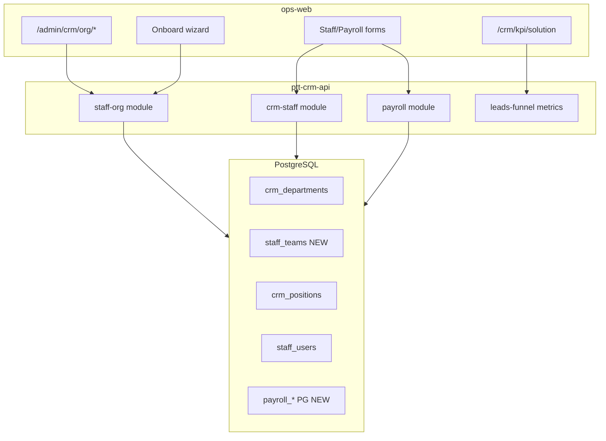

# WIN-2 — Kế hoạch triển khai chi tiết (Moat + HR UI)

> **Document ID:** WIN-2-PLAN-20260807  
> **Phiên bản:** 1.0 · **Ngày:** 2026-08-07  
> **Trạng thái:** Draft — chờ PO sign WIN-1 + Eng Lead kickoff  
> **Prerequisite:** WIN-1 accepted (`docs/exports/signed/WIN-1-acceptance-2026-08-07.pdf`)  
> **Parent:** [`2026-08-07-rnosai-competitive-win-implementation-plan.md`](./2026-08-07-rnosai-competitive-win-implementation-plan.md) §6  
> **UI/UX:** [`2026-08-07-rnosai-competitive-win-ui-ux-design.md`](./2026-08-07-rnosai-competitive-win-ui-ux-design.md) §10–12  
> **HR/RBAC:** [`2026-08-07-rbac-hr-org-job-function-implementation-plan.md`](./2026-08-07-rbac-hr-org-job-function-implementation-plan.md) §6–7

---

## Mục lục

1. [Mục tiêu & exit criteria](#1-mục-tiêu--exit-criteria)
2. [Baseline hiện tại (as-is)](#2-baseline-hiện-tại-as-is)
3. [Kiến trúc & phụ thuộc](#3-kiến-trúc--phụ-thuộc)
4. [Timeline 8 tuần](#4-timeline-8-tuần)
5. [Sprint WIN-2-A — Org foundation](#5-sprint-win-2-a--org-foundation-tuần-12)
6. [Sprint WIN-2-B — Workforce & Payroll](#6-sprint-win-2-b--workforce--payroll-tuần-34)
7. [Sprint WIN-2-C — KPI moat & CRM admin](#7-sprint-win-2-c--kpi-moat--crm-admin-tuần-56)
8. [Sprint WIN-2-D — Polish & UAT](#8-sprint-win-2-d--polish--uat-tuần-78)
9. [Backend — DDL & API contracts](#9-backend--ddl--api-contracts)
10. [Frontend — routes & components](#10-frontend--routes--components)
11. [Feature flags & rollout](#11-feature-flags--rollout)
12. [Testing & UAT](#12-testing--uat)
13. [Deploy runbook](#13-deploy-runbook)
14. [Rủi ro & mitigation](#14-rủi-ro--mitigation)
15. [Effort & RACI](#15-effort--raci)
16. [Traceability](#16-traceability)
17. [Checklist tracking](#17-checklist-tracking)

---

## 1. Mục tiêu & exit criteria

### 1.1. Mục tiêu sản phẩm

| # | Mục tiêu | Metric | VUX |
|---|----------|--------|-----|
| G1 | HR onboard NV không cần training doc | Wizard ≤15 ph, success ≥95% | VUX-03 |
| G2 | Không JSON làm UI chính | 0 trang `<pre>` primary trên staff/payroll | UX-G6 |
| G3 | Solution KPI moat | Dashboard SLA + toggle team | VUX-07 |
| G4 | Payroll export kế toán | Excel mở được, không thay MISA | VUX-06 |
| G5 | Org CRUD enterprise | Dept/team/position/user + audit | T-HR-01…07 |

### 1.2. WIN-2 exit checklist (PO sign-off)

- [ ] **EC-W2-01** Onboard wizard timed ≤15 ph (3 NV HR Ops)
- [ ] **EC-W2-02** `/crm/kpi/solution` live, số khớp API
- [ ] **EC-W2-03** Payroll Excel CFO/HR mở được
- [ ] **EC-W2-04** 0 JSON-primary UI trên `/crm/staff`, `/crm/payroll`
- [ ] **EC-W2-05** VUX-03, VUX-06, VUX-07 pass
- [ ] **EC-W2-06** PO sign `WIN-2-acceptance-YYYY-MM-DD.pdf`

### 1.3. Out of scope WIN-2

- Permission Sets / Simulator (WIN-3)
- Keycloak SSO (WIN-4)
- Kanban `/crm/sales` (optional — defer nếu trễ sprint C)
- Thay thế MISA/FAST payroll engine

---

## 2. Baseline hiện tại (as-is)

### 2.1. Đã có (WIN-0 / WIN-1)

| Layer | Có sẵn |
|-------|---------|
| **RBAC R1.5** | Job functions seed PG, effective caps union, `/admin/crm/permissions/*`, SoD UI+API |
| **staff-org (partial)** | `GET/PUT job-functions`, `GET effective-caps`, `GET users` — **không** dept/team CRUD |
| **Staff pages** | `/crm/staff`, `/crm/staff/[id]`, `/crm/payroll` — **JSON `<pre>` primary** |
| **KPI** | `/crm/kpi` full dashboard — **không** team toggle, **không** `/crm/kpi/solution` |
| **Win kit** | 9 components (`WinWizardSteps`, `WinRbacBadge`, `WinSodBanner`, …) |
| **Payroll BE** | SQLite-only (`payroll-sqlite.repository.ts`) |

### 2.2. Chưa có (WIN-2 gap)

| Gap | Spec ref |
|-----|----------|
| `/admin/crm/org/*` toàn bộ | W2-ORG-01…10 |
| DDL `staff_teams`, org audit | HR-1 |
| Nest org CRUD APIs | HR-2, HR-3 |
| Onboard/offboard wizard | W2-ORG-07, W2-ORG-09 |
| Payroll PG migration | W2-PAY-04 |
| Solution KPI API + page | W2-KPI-02, W2-KPI-03 |
| Feature flags `WIN_ORG_UI`, `WIN_KPI_SOLUTION` | §11 |

---

## 3. Kiến trúc & phụ thuộc



### 3.1. Nguyên tắc thực thi

1. **BE trước stub, FE song song** — FE dùng MSW/fixture cho wizard tuần 1–2; API block tuần 3.
2. **Feature flag** — mọi route WIN-2 behind `NEXT_PUBLIC_WIN_ORG_UI` / `NEXT_PUBLIC_WIN_KPI_SOLUTION`.
3. **PG-only** — payroll migrate không giữ SQLite write path prod.
4. **Reuse WIN-1** — `JobFunctionPicker`, `EffectiveCapsPreview`, `WinWizardSteps`, `WinSodBanner`.
5. **PR gate** — screenshot 1280 + 390px, cap persona ghi trong PR.

### 3.2. Phụ thuộc ngoài team

| Prereq | Owner | Gate |
|--------|-------|------|
| WIN-1 PO signed | PO | Bắt đầu sprint A |
| `python3.11` + psycopg2 trên VPS | IT | Trước DDL apply |
| 3 NV pilot HR onboard UAT | HR | Sprint D |
| Supplement Position×Function signed | PO | Khuyến nghị trước onboard step 2 |

---

## 4. Timeline 8 tuần

| Tuần | Sprint | Focus | Demo thứ Sáu |
|------|--------|-------|--------------|
| 1–2 | **WIN-2-A** | DDL org + API skeleton + org layout FE | Dept/team table staging |
| 3–4 | **WIN-2-B** | User drawer + onboard wizard + staff forms | Onboard 1 NV end-to-end |
| 5–6 | **WIN-2-C** | Payroll PG + Excel + KPI solution | KPI dashboard + payroll export |
| 7–8 | **WIN-2-D** | Offboard, org chart, UAT, bugfix | HR timed UAT + PO preview |

**Capacity:** 1 FE (~35 dev-days) + 1 BE (~28 dev-days) · Sprint 2 tuần.

---

## 5. Sprint WIN-2-A — Org foundation (tuần 1–2)

**Goal:** PG org schema + Nest CRUD dept/team/position + admin org shell.

### 5.1. Backend tasks

| ID | Task | Files | DoD | Est |
|----|------|-------|-----|-----|
| W2-BE-01 | DDL staff org | Create `docs/specs/2026-08-07-postgresql-ddl-staff-org.sql` | `staff_teams`, `staff_org_audit`, FK crm_staff→team | 1d |
| W2-BE-02 | Apply script | Create `scripts/apply_pg_ddl_staff_org_r2_hr.sh` | Idempotent, CI doc | 0.5d |
| W2-BE-03 | Org repository | Create `staff-org/staff-org.repository.ts` | CRUD dept/team/position | 2d |
| W2-BE-04 | Org controller routes | Modify `staff-org.controller.ts` | REST below §9.1 | 2d |
| W2-BE-05 | Cap guards | Modify `staff-org.guard.ts` | `crm_staff_departments.*`, `crm_data_config.configure` | 1d |
| W2-BE-06 | Audit writes | Extend repository | INSERT `staff_org_audit` mọi mutation | 1d |
| W2-BE-07 | Unit tests | `staff-org.crud.spec.ts` | dept/team/position happy path | 1d |

**Verify staging:**

```bash
export DATABASE_URL=postgresql://…
./scripts/apply_pg_ddl_staff_org_r2_hr.sh
cd services/ptt-crm-api && npm test -- --testPathPattern=staff-org
```

### 5.2. Frontend tasks

| ID | Task | Files | DoD | Est |
|----|------|-------|-----|-----|
| W2-FE-01 | Feature flag helpers | Modify `src/lib/win/flags.ts`, `.env.example` | `winOrgUiEnabled()`, `winKpiSolutionEnabled()` | 0.5d |
| W2-FE-02 | Admin 3-group sub-nav | Modify `admin/crm/layout.tsx` | Nhóm: Dữ liệu · Phân quyền · **Tổ chức** | 1d |
| W2-FE-03 | Org layout + tabs | Create `admin/crm/org/layout.tsx` | 4 tabs: dept, teams, positions, users | 1d |
| W2-FE-04 | Departments page | Create `org/departments/page.tsx` | Table + modal CRUD, cap gate | 2d |
| W2-FE-05 | Teams page | Create `org/teams/page.tsx` | Dept filter chip + table | 2d |
| W2-FE-06 | Positions page | Create `org/positions/page.tsx` | Link → permissions matrix | 2d |
| W2-FE-07 | API client | Modify `src/lib/api.ts` | org CRUD fetchers | 1d |

**Gate WIN-2-A:** Staging demo dept+team CRUD · API 200 · flag off = routes 404/redirect.

---

## 6. Sprint WIN-2-B — Workforce & Payroll (tuần 3–4)

**Goal:** User admin + onboard wizard + staff/payroll form refactor (phase 1).

### 6.1. Backend tasks

| ID | Task | Files | DoD | Est |
|----|------|-------|-----|-----|
| W2-BE-08 | Create staff user | Extend `staff-org.service.ts` | `POST /staff/org/users` hash password scrypt | 2d |
| W2-BE-09 | Patch staff user | Same | `PATCH` position, team, active | 1d |
| W2-BE-10 | Offboard service | Same | reassign owner_id + deactivate | 2d |
| W2-BE-11 | Staff levels/competency PG | Extend `crm-staff-pg.repository.ts` | PATCH structured JSON → columns hoặc JSONB typed | 2d |
| W2-BE-12 | Payroll PG repo | Create `payroll-pg.repository.ts` | Mirror sqlite methods | 3d |
| W2-BE-13 | Payroll cutover flag | Modify `payroll.service.ts` | `DATABASE_URL` → PG, sqlite dev-only | 1d |

### 6.2. Frontend tasks

| ID | Task | Files | DoD | Est |
|----|------|-------|-----|-----|
| W2-FE-08 | `WinDrawer` | Create `components/win/WinDrawer.tsx` | Slide-over, focus trap, a11y | 1d |
| W2-FE-09 | `UserIdentityCard` | Create `components/rbac/UserIdentityCard.tsx` | Wireframe §11.4 | 3d |
| W2-FE-10 | Org users list | Create `org/users/page.tsx` | Search, pagination, open drawer | 2d |
| W2-FE-11 | Onboard wizard | Create `org/users/new/page.tsx` | 4 steps §10.5, `WinWizardSteps` | 4d |
| W2-FE-12 | Offboard modal | Create `org/users/offboard/` or modal in drawer | Reassign + deactivate | 2d |
| W2-FE-13 | `StaffEditDrawer` | Create `crm/staff/StaffEditDrawer.tsx` | Form fields thay JSON edit | 3d |
| W2-FE-14 | Roster RBAC column | Modify `crm/staff/page.tsx` | `WinRbacBadge` + link org user | 1d |
| W2-FE-15 | Levels form grid | Modify staff tab levels | Replace `<textarea JSON>` | 2d |
| W2-FE-16 | Competency grid | Modify staff tab competency | Same | 2d |

**Gate WIN-2-B:** VUX-03 dry-run ≤15 ph 1 NV · staff levels save without raw JSON UI.

---

## 7. Sprint WIN-2-C — KPI moat & CRM admin (tuần 5–6)

**Goal:** Solution KPI dashboard, team toggle, payroll Excel, custom-fields/pipeline polish.

### 7.1. Backend tasks

| ID | Task | Files | DoD | Est |
|----|------|-------|-----|-----|
| W2-BE-14 | Solution KPI metrics | Create `kpi-solution/` module or extend `leads-funnel` | `GET /api/crm/kpi/solution?team=&period=` | 3d |
| W2-BE-15 | KPI team filter | Extend org KPI endpoint | filter by dept/team code | 2d |
| W2-BE-16 | Payroll Excel export | Extend `payroll.controller.ts` | `GET …/export.xlsx` Content-Disposition | 2d |
| W2-BE-17 | Custom fields admin | Existing or extend admin CRM | RNOS-35 API parity | 3d |
| W2-BE-18 | Pipeline admin API | Same | stages CRUD | 2d |

### 7.2. Frontend tasks

| ID | Task | Files | DoD | Est |
|----|------|-------|-----|-----|
| W2-FE-17 | `KpiTeamToggle` | Create `components/kpi/KpiTeamToggle.tsx` | All/Sales/Solution/CSKH | 1d |
| W2-FE-18 | Enhance `/crm/kpi` | Modify `crm/kpi/page.tsx` | Toggle + filtered tiles | 1d |
| W2-FE-19 | `/crm/kpi/solution` | Create page + tiles | §12.2 wireframe | 4d |
| W2-FE-20 | `KpiSlaTileGrid` | Create component | Strip on `/crm/solution/queue` | 2d |
| W2-FE-21 | staff-kpi compare | Modify `crm/staff-kpi/page.tsx` | Period filter + drill link | 2d |
| W2-FE-22 | Dashboard widgets | Modify `app/page.tsx` | 2×2 widgets §9.1 | 3d |
| W2-FE-23 | Payroll tab refactor | Modify `crm/payroll/page.tsx` | Remove `<pre>` primary | 3d |
| W2-FE-24 | Policy form UI | Payroll policy tab | Form fields | 2d |
| W2-FE-25 | Payslip Excel button | Payroll toolbar | VUX-06 | 1d |
| W2-FE-26 | staff/[id] workspace | Modify `[id]/page.tsx` | Sparkline + paginated leads | 3d |
| W2-FE-27 | custom-fields + pipeline | Enhance admin pages | Form UI §9.7 | 5d |

**Gate WIN-2-C:** VUX-06 + VUX-07 automated smoke · `/crm/kpi/solution` numbers = API.

---

## 8. Sprint WIN-2-D — Polish & UAT (tuần 7–8)

| ID | Task | Owner | DoD |
|----|------|-------|-----|
| W2-FE-28 | `WinOrgChart` | FE | Tree visual tab or `/org/chart` | 3d |
| W2-FE-29 | Mobile regression | QA+FE | RNOS-39 pages list §11.3 parent plan | 2d |
| W2-UAT-01 | HR onboard 3 NV timed | HR | ≤15 ph each, log timestamps | — |
| W2-UAT-02 | Screenshot pack | QA | `docs/exports/win-ux-screenshots/WIN-2/` | — |
| W2-UAT-03 | Playwright VUX-03/06/07 | QA | New specs in `e2e/win-2-*.spec.ts` | 2d |
| W2-DOC-01 | Acceptance PDF export | PO+Dev | `scripts/export_win2_acceptance_pdf.py` | 1d |
| W2-BUG | P0 visual fixes | FE | 0 blockers for sign-off | buffer |

---

## 9. Backend — DDL & API contracts

### 9.1. REST API (new / extend)

Base: `/api/v1/staff/org`

| Method | Path | Cap | Body / Response |
|--------|------|-----|-----------------|
| GET | `/departments` | `crm_staff_departments.view` | `{ departments: [{ id, code, name, active }] }` |
| POST | `/departments` | `configure` | `{ code, name }` |
| PATCH | `/departments/:id` | `configure` | partial |
| GET | `/teams?department_id=` | `view` | teams list |
| POST/PATCH | `/teams`, `/teams/:id` | `configure` | `{ code, name, department_id }` |
| GET | `/positions` | `crm_data_config.configure` | join crm_positions metadata |
| PATCH | `/positions/:id` | `configure` | name, department_id, parent_id |
| GET | `/users` | `crm_staff_roster.view` | existing + team column |
| POST | `/users` | `crm_staff_roster.edit` | `{ email, display_name, position_id, team_ids[], functions[], password? }` |
| PATCH | `/users/:id` | `edit` | partial + offboard flag |
| POST | `/users/:id/offboard` | `edit` | `{ reassign_to, deactivate: true }` |

KPI:

| Method | Path | Cap |
|--------|------|-----|
| GET | `/api/crm/kpi/solution` | `crm_kpi_records.view` or solution cap |
| GET | `/api/crm/kpi/org?team=` | existing + team param |

Payroll:

| Method | Path | Notes |
|--------|------|-------|
| GET | `/api/crm/payroll/export.xlsx` | month, year query |

### 9.2. DDL sketch (`staff-org`)

Tables mới (draft — implement in SQL file):

- `staff_teams` (id, department_id, code, name, active, …)
- `staff_user_teams` (user_id, team_id) — nếu multi-team
- `staff_org_audit` (id, actor, action, entity, payload jsonb, created_at)

Reuse: `crm_departments`, `crm_positions`, `staff_users` (existing).

---

## 10. Frontend — routes & components

### 10.1. Route map (new)

```
admin/crm/org/
├── layout.tsx          # sub-nav 4 tabs
├── departments/page.tsx
├── teams/page.tsx
├── positions/page.tsx
├── users/
│   ├── page.tsx
│   └── new/page.tsx    # onboard wizard
crm/kpi/solution/page.tsx
```

### 10.2. Component map

| Component | Path | Reuse |
|-----------|------|-------|
| `WinDrawer` | `components/win/WinDrawer.tsx` | NEW |
| `UserIdentityCard` | `components/rbac/UserIdentityCard.tsx` | JobFunctionPicker, EffectiveCapsPreview, WinSodBanner |
| `WinOrgChart` | `components/win/WinOrgChart.tsx` | NEW |
| `KpiTeamToggle` | `components/kpi/KpiTeamToggle.tsx` | NEW |
| `KpiSlaTileGrid` | `components/kpi/KpiSlaTileGrid.tsx` | NEW |
| `StaffEditDrawer` | `app/crm/staff/StaffEditDrawer.tsx` | NEW |

### 10.3. Cap gating matrix (FE)

| Route | Min cap |
|-------|---------|
| `/admin/crm/org/departments` | `crm_staff_departments.view` |
| `/admin/crm/org/users` | `crm_staff_roster.view` |
| `/admin/crm/org/users/new` | `crm_staff_roster.edit` |
| `/crm/kpi/solution` | `crm_kpi_records.view` + flag |
| `/crm/payroll` export | `crm_payroll.export` or equivalent |

---

## 11. Feature flags & rollout

| Flag | Default prod | Bật khi |
|------|--------------|---------|
| `NEXT_PUBLIC_WIN_ORG_UI` | `0` | Sprint B staging UAT pass |
| `NEXT_PUBLIC_WIN_KPI_SOLUTION` | `0` | Sprint C KPI API ready |

**Helpers** (`src/lib/win/flags.ts`):

```typescript
export function winOrgUiEnabled(): boolean {
  return process.env.NEXT_PUBLIC_WIN_ORG_UI === '1';
}
export function winKpiSolutionEnabled(): boolean {
  return process.env.NEXT_PUBLIC_WIN_KPI_SOLUTION === '1';
}
```

**Rollout comms:** HR training 30 ph onboard wizard (master plan §12.3).

---

## 12. Testing & UAT

### 12.1. Automated

| Suite | File | Gates |
|-------|------|-------|
| Nest unit | `staff-org.crud.spec.ts`, `payroll-pg.spec.ts` | CRUD + export |
| Playwright | `e2e/win-2-onboard-vux-03.spec.ts` | Wizard ≤15 ph timeout budget |
| Playwright | `e2e/win-2-payroll-vux-06.spec.ts` | Download xlsx magic bytes |
| Playwright | `e2e/win-2-kpi-vux-07.spec.ts` | Toggle + tile counts |
| axe | CI on `/crm/payroll`, `/admin/crm/org/users` | a11y ≥90 |

### 12.2. Manual UAT scripts

| Script | Persona | Thời lượng |
|--------|---------|------------|
| UAT-WIN-2-onboard | HR Ops | 15 ph timed × 3 NV |
| UAT-WIN-2-kpi | GDKD | 20 ph |
| UAT-WIN-2-payroll | HR/CFO | 10 ph Excel open |

### 12.3. HR onboard script (VUX-03)

1. Login admin → `/admin/crm/org/users/new`
2. Step 1: tạo/link hồ sơ NV test
3. Step 2: MKT-02 + function `content` hoặc `design`
4. Step 3: email + copy temp password
5. Step 4: tick checklist → Hoàn tất
6. NV login → badge + menu đúng
7. **Pass:** tổng thời gian ≤15 ph

---

## 13. Deploy runbook

### 13.1. Per-sprint deploy (VPS)

```bash
ssh deploy@rs.pttads.vn
cd /var/www/rnosai && git pull --ff-only origin main

# DDL (sprint A/B)
export DATABASE_URL=…  # from .env
./scripts/apply_pg_ddl_staff_org_r2_hr.sh

# API
cd services/ptt-crm-api && npm ci && npm run build
sudo systemctl restart ptt-crm-api

# ops-web (set flags in .env or build-time)
export NEXT_PUBLIC_WIN_ORG_UI=1
export NEXT_PUBLIC_WIN_KPI_SOLUTION=1
./scripts/deploy_ops_web.sh build
sudo systemctl restart ptt-ops-web
```

### 13.2. Payroll PG cutover (sprint B/C)

1. Backup: `scripts/backup_ptt_data.sh`
2. Migrate sqlite → PG one-time script (create `scripts/migrate_payroll_sqlite_to_pg.py`)
3. Smoke: `GET payroll/dashboard`, export xlsx
4. Rollback plan: restore backup + flag off

---

## 14. Rủi ro & mitigation

| Rủi ro | Xác suất | Mitigation |
|--------|----------|------------|
| BE org API trễ | Cao | FE fixtures tuần 1–2; flag off prod |
| Payroll PG migrate lỗi | Trung bình | Backup + parallel read sqlite 1 sprint |
| HR không UAT | Trung bình | Mandatory 3 NV calendar block sprint D |
| Org chart scope creep | Trung bình | W2-ORG-10 defer tuần 7 hoặc tab optional |
| psycopg2 VPS | Đã gặp | `python3.11 -m pip install --user psycopg2-binary` |
| Duplicate permissions/users vs org/users | Trung bình | org/users = CRUD identity; permissions/users = cap assign only — doc rõ trong UI |

---

## 15. Effort & RACI

| Sprint | FE days | BE days |
|--------|---------|---------|
| WIN-2-A | 9 | 8 |
| WIN-2-B | 12 | 9 |
| WIN-2-C | 14 | 11 |
| WIN-2-D | 5 | 2 |
| **Tổng** | **~40** | **~30** |

| Hoạt động | PO | FE | BE | HR | IT | QA |
|-----------|:--:|:--:|:--:|:--:|:--:|:--:|
| Wireframe onboard | A | R | C | R | I | I |
| DDL prod apply | A | I | C | I | R | I |
| Timed HR UAT | A | C | C | R | I | R |
| WIN-2 acceptance PDF | A | C | C | C | I | R |

---

## 16. Traceability

| Master / UI ID | Sprint | Task IDs |
|----------------|--------|----------|
| WIN-H-02 org wizard | B | W2-FE-11, W2-BE-08 |
| WIN-H-04 payroll Excel | C | W2-FE-25, W2-BE-16 |
| WIN-C-10 KPI solution | C | W2-FE-19, W2-BE-14 |
| UX-G6 no JSON UI | B–C | W2-FE-13…16, W2-FE-23 |
| R2-HR-S1/S2 | A–B | W2-BE-01…10, W2-FE-03…12 |
| VUX-03/06/07 | B–D | §12 |

---

## 17. Checklist tracking

Copy vào sprint board / Linear:

```
WIN-2-A
[ ] W2-BE-01 DDL staff-org SQL
[ ] W2-BE-03…07 Org CRUD API + tests
[ ] W2-FE-01…07 Org admin shell + 3 CRUD pages
[ ] Gate: dept/team demo staging

WIN-2-B
[ ] W2-BE-08…13 User create + payroll PG start
[ ] W2-FE-08…16 UserIdentityCard + onboard wizard + staff forms
[ ] Gate: VUX-03 dry-run 1 NV

WIN-2-C
[ ] W2-BE-14…18 KPI solution + payroll xlsx
[ ] W2-FE-17…27 KPI pages + payroll refactor
[ ] Gate: VUX-06 + VUX-07

WIN-2-D
[ ] W2-FE-28 WinOrgChart
[ ] W2-UAT-01…03 HR timed + Playwright
[ ] EC-W2-01…06 + PO sign PDF
```

---

## Phụ lục — Kickoff meeting agenda (90 ph)

| Phút | Nội dung | Output |
|------|----------|--------|
| 0–15 | PO confirm WIN-1 signed + WIN-2 scope | Go/no-go |
| 15–30 | Review sprint A backlog (DDL + org UI) | Owners assigned |
| 30–45 | HR: 3 pilot users + UAT calendar sprint D | Names + dates |
| 45–60 | IT: DDL window + psycopg2 + backup | Maintenance slot |
| 60–75 | FE/BE: API contract §9 sign-off | No open questions |
| 75–90 | Risk review §14 + flag rollout | Action items |

---

*Changelog v1.0 — 2026-08-07: WIN-2 detailed implementation plan (post WIN-1 hướng B).*
