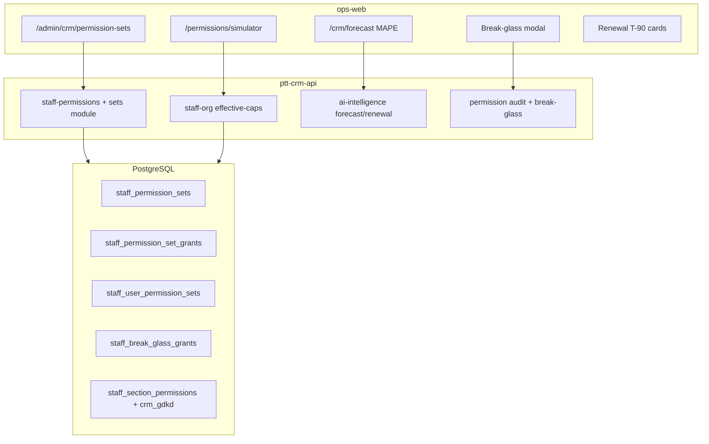

# WIN-3 — Kế hoạch triển khai chi tiết (Enterprise RBAC + AI credibility)

> **Document ID:** WIN-3-PLAN-20260807  
> **Phiên bản:** 1.0 · **Ngày:** 2026-08-07  
> **Trạng thái:** Draft — chờ PO sign WIN-2 + Eng Lead kickoff  
> **Prerequisite:** WIN-2 accepted ([`win-2-acceptance-checklist.md`](./win-2-acceptance-checklist.md)) · R1/R1.5 live  
> **Parent:** [`2026-08-07-rnosai-competitive-win-implementation-plan.md`](./2026-08-07-rnosai-competitive-win-implementation-plan.md) §7  
> **RBAC:** [`2026-08-06-rbac-enterprise-design.md`](./2026-08-06-rbac-enterprise-design.md) § R2-A…R2-D, R3 pilot  
> **UI/UX:** [`2026-08-07-rnosai-competitive-win-ui-ux-design.md`](./2026-08-07-rnosai-competitive-win-ui-ux-design.md) §13

---

## Mục lục

1. [Mục tiêu & exit criteria](#1-mục-tiêu--exit-criteria)
2. [Baseline hiện tại (as-is)](#2-baseline-hiện-tại-as-is)
3. [Kiến trúc & phụ thuộc](#3-kiến-trúc--phụ-thuộc)
4. [Timeline 10–12 tuần](#4-timeline-1012-tuần)
5. [Sprint WIN-3-A — R2 backend + GDKD + Permission Sets](#5-sprint-win-3-a--r2-backend--gdkd--permission-sets-tuần-14)
6. [Sprint WIN-3-B — Simulator, access review, AI surfaces](#6-sprint-win-3-b--simulator-access-review-ai-surfaces-tuần-58)
7. [Sprint WIN-3-C — Scope pilot + UAT enterprise](#7-sprint-win-3-c--scope-pilot--uat-enterprise-tuần-910)
8. [Backend — DDL & API contracts](#8-backend--ddl--api-contracts)
9. [Frontend — routes & components](#9-frontend--routes--components)
10. [Feature flags & rollout](#10-feature-flags--rollout)
11. [Testing & UAT](#11-testing--uat)
12. [Deploy runbook](#12-deploy-runbook)
13. [Rủi ro & mitigation](#13-rủi-ro--mitigation)
14. [Effort & RACI](#14-effort--raci)
15. [Traceability](#15-traceability)
16. [Checklist tracking](#16-checklist-tracking)

---

## 1. Mục tiêu & exit criteria

### 1.1. Mục tiêu sản phẩm

| # | Mục tiêu | Metric | VUX / Ref |
|---|----------|--------|-----------|
| G1 | HubSpot-parity Permission Sets | Gắn set → effective caps đúng sau re-login | R2-B |
| G2 | GDKD SoD tách biệt | Override ≠ assign trên ma trận | R2-A |
| G3 | IT checklist 100+ NV | Simulator preview = menu prod | VUX-04 |
| G4 | Break-glass có kiểm soát | Auto-revoke 24h + audit | R2-D |
| G5 | Forecast credibility | MAPE badge trên `/crm/forecast` | WIN-AI-04 |
| G6 | Renewal ops visibility | T-90 amber cards trên dashboard/lifecycle | WIN-AI-05 |
| G7 | Quarterly compliance | Access review ZIP archived | R-10 |

### 1.2. WIN-3 exit checklist (PO sign-off)

- [ ] **EC-W3-01** Permission Set demo: user KD-01 + `SET-SOLUTION-BACKUP` → claim OK; revoke → 403
- [ ] **EC-W3-02** Simulator 5 personas: menu preview khớp prod sau login (100%)
- [ ] **EC-W3-03** Access review quý: ZIP MD+JSON mở được, lưu archive
- [ ] **EC-W3-04** GDKD cap split: ma trận supplement ký; override có audit log
- [ ] **EC-W3-05** Break-glass: request → approve → auto-revoke ≤24h
- [ ] **EC-W3-06** Forecast MAPE badge + renewal T-90 cards live staging
- [ ] **EC-W3-07** VUX-04 pass (content vs design menu diff)
- [ ] **EC-W3-08** PO sign `WIN-3-acceptance-YYYY-MM-DD.pdf`

### 1.3. Out of scope WIN-3

- Keycloak SSO + MFA → **WIN-4**
- Field-level ABAC đầy đủ → **WIN-4** (WIN-3 chỉ **R3 client scope pilot**)
- Role hierarchy inherit phức tạp (deny explicit) → defer nếu trễ sprint A
- Payroll PG full cutover → carry từ WIN-2 (không block WIN-3)
- Multi-agent orchestrator → WIN-4

---

## 2. Baseline hiện tại (as-is)

### 2.1. Đã có (WIN-1 / WIN-2 / R1.5)

| Layer | Có sẵn |
|-------|---------|
| **R1.5 RBAC** | Job functions, effective caps union (position + functions), `/admin/crm/permissions/*`, SoD UI |
| **WIN-2 Org** | Dept/team/position/users, onboard wizard, org chart, `UserIdentityCard` |
| **Permissions export** | Per-position / per-function export API (chưa quarterly ZIP) |
| **Effective caps preview** | `EffectiveCapsPreview.tsx`, `GET .../effective-caps` |
| **Forecast AI API** | `GET forecast/current`, `GET forecast/mape-report`, commit gate (RNOS-17/18) |
| **Renewal AI API** | `POST renewal/scan`, agency `RenewalAgentPanel` (RNOS-20) |
| **Payroll bonus engine** | `bonus_mode`, `bonus_pct` trong policy — chưa HR rule UI riêng |
| **Win kit** | `WinDrawer`, `WinRbacBadge`, `WinSodBanner`, cap-route map `rbac-routes.ts` |

### 2.2. Chưa có (WIN-3 gap)

| Gap | Spec ref |
|-----|----------|
| Section `crm_gdkd.*` + migration | R2-A |
| Tables `staff_permission_sets*` | R2-B |
| JWT caps ∪ set grants | R2-B |
| `/admin/crm/permission-sets` | W3-RBAC-01 |
| User drawer Sets tab | W3-RBAC-02 |
| Break-glass DDL + flow | R2-D |
| `/admin/crm/permissions/simulator` | W3-RBAC-04 |
| Quarterly access review ZIP | W3-RBAC-05 |
| MAPE badge on forecast chart | W3-AI-01 |
| T-90 dashboard/lifecycle cards | W3-AI-02 |
| Client scope JWT + badges | R3-A / W3-AI-04 |
| `NEXT_PUBLIC_WIN_SIMULATOR` | §10 |

---

## 3. Kiến trúc & phụ thuộc



### 3.1. Nguyên tắc thực thi

1. **R2 backend trước UI enterprise** — Sets/simulator không ship cho tới khi effective caps union có set grants.
2. **Feature flag** — `NEXT_PUBLIC_WIN_SIMULATOR`, `NEXT_PUBLIC_WIN_PERMISSION_SETS` (mới).
3. **PG-only RBAC** — mọi grant Sets/break-glass trên PG; CI `rbac_no_sqlite_gate.sh`.
4. **Reuse WIN-2** — `UserIdentityCard`, `WinDrawer`, permissions matrix patterns.
5. **Simulator stub OK tuần 1–2** — client-side union từ catalog + fixtures; API block tuần 3.

### 3.2. Phụ thuộc ngoài team

| Prereq | Owner | Gate |
|--------|-------|------|
| WIN-2 PO signed | PO | Kickoff WIN-3 |
| Ma trận supplement GDKD ký | PO + GDKD | Trước R2-A prod |
| IT Admin pilot simulator UAT | IT | Sprint C |
| Slack/webhook break-glass alert | IT | Sprint B |

---

## 4. Timeline 10–12 tuần

| Tuần | Sprint | Focus | Demo thứ Sáu |
|------|--------|-------|--------------|
| 1–4 | **WIN-3-A** | R2-A GDKD + R2-B Sets DDL/API + admin list | Set gắn user → caps đổi |
| 5–8 | **WIN-3-B** | R2-D break-glass, simulator, access review, forecast/renewal UI | Simulator 2 personas + MAPE badge |
| 9–10 | **WIN-3-C** | R3 scope pilot, bonus UI polish, UAT enterprise | IT sign simulator + ZIP export |
| 11–12 | **Buffer** | Bugfix, PO preview, prod rollout | WIN-3 acceptance dry-run |

**Capacity:** 1 FE (~22 dev-days) + 1 BE (~35 dev-days) · R2 backend ~18d overlap trong BE estimate.

---

## 5. Sprint WIN-3-A — R2 backend + GDKD + Permission Sets (tuần 1–4)

**Goal:** R2-A catalog + migration; R2-B DDL/API; admin Permission Sets shell.

### 5.1. Backend tasks

| ID | Task | Files | DoD | Est |
|----|------|-------|-----|-----|
| W3-BE-01 | DDL R2-B sets | `docs/specs/2026-08-07-postgresql-ddl-permission-sets.sql` | 3 tables + indexes | 1d |
| W3-BE-02 | Apply script | `scripts/apply_pg_ddl_permission_sets_r2_b.sh` | Idempotent | 0.5d |
| W3-BE-03 | Sets repository | `staff-permission-sets.repository.ts` | CRUD set + grants | 2d |
| W3-BE-04 | Sets controller | `staff-permission-sets.controller.ts` | REST §8.1 | 2d |
| W3-BE-05 | Effective caps ∪ sets | Extend `staff-org.service` / auth login | JWT caps include sets | 2d |
| W3-BE-06 | R2-A catalog `crm_gdkd` | `rbac-admin-catalog.json` + seed | 4 actions | 1d |
| W3-BE-07 | R2-A migration | `migrate_staff_permissions_pg.py --r2-gdkd` | Map assign/override | 1.5d |
| W3-BE-08 | R2-A guards | `StaffGdkdOverrideGuard`, leads list scope | Audit log hook | 2d |
| W3-BE-09 | Sets unit tests | `staff-permission-sets.spec.ts` | CRUD + union | 1d |
| W3-BE-10 | Catalog CI gate | Extend `rbac_catalog_gate.sh` | Sets grants ⊆ catalog | 0.5d |

**Verify staging:**

```bash
export DATABASE_URL=postgresql://…
bash scripts/apply_pg_ddl_permission_sets_r2_b.sh
python3 scripts/migrate_staff_permissions_pg.py --r2-gdkd --dry-run
cd services/ptt-crm-api && npm test -- --testPathPattern=permission-sets
```

### 5.2. Frontend tasks

| ID | Task | Files | DoD | Est |
|----|------|-------|-----|-----|
| W3-FE-01 | Flag helpers | `src/lib/win/flags.ts` | `winSimulatorEnabled()`, `winPermissionSetsEnabled()` | 0.5d |
| W3-FE-02 | Permission Sets list | `admin/crm/permission-sets/page.tsx` | Table + link editor | 2d |
| W3-FE-03 | Set editor | `permission-sets/[code]/page.tsx` | Matrix checkbox grid | 3d |
| W3-FE-04 | User drawer Sets tab | `UserIdentityCard.tsx` | Multi-select sets | 2d |
| W3-FE-05 | GDKD matrix labels | `permissions/functions` + catalog i18n | `crm_gdkd.*` hiển thị | 1d |
| W3-FE-06 | API client | `src/lib/api.ts` | sets CRUD fetchers | 1d |

**Gate WIN-3-A:** Staging — gắn set cho user test → effective caps preview + login menu thay đổi.

---

## 6. Sprint WIN-3-B — Simulator, access review, AI surfaces (tuần 5–8)

**Goal:** IT-facing tools + AI credibility UI trên forecast/renewal.

### 6.1. Backend tasks

| ID | Task | Files | DoD | Est |
|----|------|-------|-----|-----|
| W3-BE-11 | Break-glass DDL | `postgresql-ddl-break-glass.sql` | `staff_break_glass_grants` | 0.5d |
| W3-BE-12 | Break-glass API | `staff-break-glass.controller.ts` | request/approve/list/revoke | 2d |
| W3-BE-13 | Auto-revoke job | `scripts/revoke_expired_break_glass.sh` + cron doc | TTL 24h | 1d |
| W3-BE-14 | Simulator API | `POST /staff/permissions/simulate` | caps[] + menu keys | 3d |
| W3-BE-15 | Access review export | `GET /staff/permissions/access-review.zip` | MD+JSON per user | 2d |
| W3-BE-16 | GDKD audit stream | Extend permission audit | override/view_all logged | 1d |

### 6.2. Frontend tasks

| ID | Task | Files | DoD | Est |
|----|------|-------|-----|-----|
| W3-FE-07 | Break-glass modal | `components/rbac/BreakGlassRequestModal.tsx` | reason + approve flow | 2d |
| W3-FE-08 | Simulator page | `admin/crm/permissions/simulator/page.tsx` | Inputs + OpsNav preview | 5d |
| W3-FE-09 | `WinAccessReviewExport` | Button on permissions hub | Download ZIP | 1d |
| W3-FE-10 | Forecast MAPE badge | `forecast/page.tsx` + chart component | Badge on chart §13.5 | 2d |
| W3-FE-11 | Renewal T-90 strip | `WinHomeDashboard` or `/crm/forecast` | Amber cards count | 3d |
| W3-FE-12 | Bonus rule UI | Extend `crm/payroll` policy tab | Dedicated bonus section WIN-H-08 | 3d |

**Gate WIN-3-B:** VUX-04 dry-run 2 personas · MAPE badge visible · break-glass staging E2E.

---

## 7. Sprint WIN-3-C — Scope pilot + UAT enterprise (tuần 9–10)

| ID | Task | Owner | DoD | Est |
|----|------|-------|-----|-----|
| W3-BE-17 | R3 scope JWT pilot | BE | `client_ids[]` claim AM pilot | 3d |
| W3-BE-18 | Lead list scope filter | BE | AM không GET lead client khác | 2d |
| W3-FE-13 | Client scope badges | FE | `WinScopeBadge` on lead/staff rows | 2d |
| W3-FE-14 | Simulator compare mode | FE | Optional user id diff | 1d |
| W3-UAT-01 | Simulator 5 personas | IT + QA | 100% menu match | — |
| W3-UAT-02 | Permission Set demo | PO | Recorded script | — |
| W3-UAT-03 | Access review archive | IT | Quarterly mock ZIP stored | — |
| W3-DOC-01 | Acceptance checklist | PO | `win-3-acceptance-checklist.md` | 0.5d |
| W3-BUG | P0 RBAC/visual | FE+BE | 0 blockers sign-off | buffer |

**Gate WIN-3-C:** EC-W3-01…08 checklist complete.

---

## 8. Backend — DDL & API contracts

### 8.1. Permission Sets (new)

Base: `/api/v1/staff/permission-sets`

| Method | Path | Cap | Body / Response |
|--------|------|-----|-----------------|
| GET | `/` | `crm_data_config.configure` | `{ sets: [{ code, name, grant_count }] }` |
| POST | `/` | `configure` | `{ code, name }` |
| GET | `/:code` | `configure` | set + grants[] |
| PATCH | `/:code` | `configure` | partial name |
| PUT | `/:code/grants` | `configure` | `{ grants: [{ section_id, action }] }` |
| GET | `/users/:userId` | `crm_staff_roster.view` | sets assigned |
| PUT | `/users/:userId` | `crm_staff_roster.edit` | `{ set_codes: [] }` |

### 8.2. Simulator

| Method | Path | Cap |
|--------|------|-----|
| POST | `/api/v1/staff/permissions/simulate` | `crm_data_config.configure` |

Body:

```json
{
  "position_id": 2,
  "job_functions": ["content"],
  "set_codes": ["SET-SOLUTION-BACKUP"],
  "compare_user_id": "optional-uuid"
}
```

Response:

```json
{
  "caps": ["crm_leads.view", "..."],
  "menu": [{ "href": "/crm/leads", "label": "Leads", "visible": true }],
  "diff": { "added": [], "removed": [] }
}
```

### 8.3. Break-glass

| Method | Path | Notes |
|--------|------|-------|
| POST | `/api/v1/staff/break-glass/request` | `{ reason, caps_requested[] }` |
| POST | `/api/v1/staff/break-glass/:id/approve` | GDKD only |
| GET | `/api/v1/staff/break-glass/active` | Admin list |
| POST | `/api/v1/staff/break-glass/revoke-expired` | Cron/internal |

### 8.4. Access review

| Method | Path | Query |
|--------|------|-------|
| GET | `/api/v1/staff/permissions/access-review.zip` | `quarter=2026-Q3` |

### 8.5. DDL sketch

```sql
-- staff_permission_sets (id, code UNIQUE, name, active, created_at)
-- staff_permission_set_grants (set_id, section_id, action, PRIMARY KEY triple)
-- staff_user_permission_sets (user_id UUID, set_id, granted_at, granted_by)
-- staff_break_glass_grants (id, user_id, caps_json, reason, approved_by, expires_at, revoked_at)
```

Catalog addition R2-A:

```text
crm_gdkd: override | assign | review_queue | view_all_leads
```

---

## 9. Frontend — routes & components

### 9.1. Route map (new)

```
admin/crm/permission-sets/
├── page.tsx                 # list
└── [code]/page.tsx          # editor matrix

admin/crm/permissions/simulator/page.tsx

components/rbac/
├── BreakGlassRequestModal.tsx
├── WinAccessReviewExport.tsx
└── WinScopeBadge.tsx        # R3 pilot

components/ai/
└── ForecastMapeChartBadge.tsx
```

### 9.2. Component map

| Component | Reuse |
|-----------|-------|
| Permission set matrix | Clone pattern from `permissions/functions/page.tsx` |
| Simulator OpsNav preview | Read-only render from `OpsNav.tsx` props |
| Effective caps | Extend `EffectiveCapsPreview` with set layer tag |
| Break-glass | `WinSodBanner` styling for active grant banner |

### 9.3. Cap gating

| Route | Min cap |
|-------|---------|
| `/admin/crm/permission-sets` | `crm_data_config.configure` |
| `/admin/crm/permissions/simulator` | `crm_data_config.configure` + flag |
| Break-glass approve | `crm_gdkd.override` or super-admin |
| Access review export | `crm_data_config.configure` |

---

## 10. Feature flags & rollout

| Flag | Default prod | Bật khi |
|------|--------------|---------|
| `NEXT_PUBLIC_WIN_PERMISSION_SETS` | `0` | Sprint A staging UAT |
| `NEXT_PUBLIC_WIN_SIMULATOR` | `0` | Sprint B API ready |
| `NEXT_PUBLIC_WIN_BREAK_GLASS` | `0` | R2-D staging |
| `NEXT_PUBLIC_WIN_SCOPE_PILOT` | `0` | Sprint C AM pilot only |

```typescript
export function winPermissionSetsEnabled(): boolean {
  return process.env.NEXT_PUBLIC_WIN_PERMISSION_SETS === '1';
}
export function winSimulatorEnabled(): boolean {
  return process.env.NEXT_PUBLIC_WIN_SIMULATOR === '1';
}
```

**Rollout:** IT training 45 ph (simulator + access review) trước prod flag on.

---

## 11. Testing & UAT

### 11.1. Automated

| Suite | File | Gates |
|-------|------|-------|
| Nest unit | `staff-permission-sets.spec.ts`, `break-glass.spec.ts` | CRUD + TTL |
| Nest integration | `effective-caps-sets.spec.ts` | Union caps |
| Playwright | `e2e/win-3-simulator-vux-04.spec.ts` | 2 personas menu |
| Playwright | `e2e/win-3-permission-sets.spec.ts` | Assign set → menu |
| Playwright | `e2e/win-3-access-review.spec.ts` | ZIP magic bytes |
| Playwright | `e2e/win-3-forecast-mape.spec.ts` | MAPE badge on chart |
| CI | `rbac_catalog_gate.sh`, `rbac_no_sqlite_gate.sh` | No drift |

### 11.2. Manual UAT

| Script | Persona | Thời lượng |
|--------|---------|------------|
| UAT-WIN-3-simulator | IT Admin | 25 ph |
| UAT-WIN-3-sets | PO + GDKD | 20 ph |
| UAT-WIN-3-break-glass | IT + GDKD | 15 ph |
| UAT-WIN-3-forecast | GDKD | 10 ph |

### 11.3. VUX-04 script (simulator)

1. Login IT admin → `/admin/crm/permissions/simulator`
2. Chọn position **MKT-01** + function **content** → preview menu
3. Login browser profile 2 as content NV → so sánh sidebar
4. Repeat **design** function → menus differ only expected items
5. **Pass:** 100% visible/hidden routes match

---

## 12. Deploy runbook

### 12.1. Per-sprint VPS

```bash
ssh deploy@rs.pttads.vn
cd /var/www/rnosai && git pull --ff-only origin main

# DDL (sprint A/B)
export DATABASE_URL=…  # from .env
bash scripts/apply_pg_ddl_permission_sets_r2_b.sh
python3 scripts/migrate_staff_permissions_pg.py --r2-gdkd --apply

# API
cd services/ptt-crm-api && npm ci && npm run build
sudo systemctl restart ptt-crm-api

# ops-web
export NEXT_PUBLIC_PTT_API_URL=https://rs.pttads.vn
export NEXT_PUBLIC_WIN_ORG_UI=1
export NEXT_PUBLIC_WIN_KPI_SOLUTION=1
export NEXT_PUBLIC_WIN_PERMISSION_SETS=1
export NEXT_PUBLIC_WIN_SIMULATOR=1
./scripts/deploy_ops_web.sh build
sudo systemctl restart ptt-ops-web
```

### 12.2. Break-glass cron (sprint B)

```bash
# /etc/cron.d/rnosai-break-glass — chạy mỗi giờ
0 * * * * deploy /var/www/rnosai/scripts/revoke_expired_break_glass.sh
```

---

## 13. Rủi ro & mitigation

| Rủi ro | Xác suất | Mitigation |
|--------|----------|------------|
| R2 backend trễ block simulator | Cao | FE simulator stub tuần 5; flag off prod |
| Effective caps union bug | Trung bình | Integration tests + shadow compare login |
| GDKD migration sai prod | Trung bình | `--dry-run` + pilot positions first |
| IT không UAT simulator | Trung bình | Calendar block sprint C |
| R3 scope creep | Trung bình | Pilot 3 AM only; defer field-level |
| Break-glass abuse | Thấp | 24h TTL + Slack alert + audit |

---

## 14. Effort & RACI

| Sprint | FE days | BE days |
|--------|---------|---------|
| WIN-3-A | 9 | 14 |
| WIN-3-B | 13 | 14 |
| WIN-3-C | 5 | 7 |
| **Tổng** | **~27** | **~35** |

| Hoạt động | PO | FE | BE | IT | QA |
|-----------|:--:|:--:|:--:|:--:|:--:|
| GDKD matrix supplement | A | I | C | I | I |
| Permission Sets catalog | A | R | R | C | C |
| Simulator UAT | A | C | C | R | R |
| Access review archive | A | C | R | R | R |
| WIN-3 acceptance PDF | A | C | C | C | R |

---

## 15. Traceability

| Master / RBAC ID | Sprint | Task IDs |
|------------------|--------|----------|
| R-05 Permission Sets | A | W3-BE-01…05, W3-FE-02…04 |
| R-08 Simulator | B | W3-BE-14, W3-FE-08 |
| R-10 Access review | B | W3-BE-15, W3-FE-09 |
| R2-A GDKD split | A | W3-BE-06…08, W3-FE-05 |
| R2-D Break-glass | B | W3-BE-11…13, W3-FE-07 |
| WIN-AI-04 Forecast MAPE | B | W3-FE-10 |
| WIN-AI-05 Renewal T-90 | B | W3-FE-11 |
| WIN-H-08 Bonus rule | B | W3-FE-12 |
| R3 client scope | C | W3-BE-17…18, W3-FE-13 |

---

## 16. Checklist tracking

```
WIN-3-A
[ ] W3-BE-01…10 GDKD + Permission Sets backend
[ ] W3-FE-01…06 Sets admin + drawer tab
[ ] Gate: set assign → caps change

WIN-3-B
[ ] W3-BE-11…16 Break-glass + simulator + access review API
[ ] W3-FE-07…12 Simulator UI + MAPE + renewal + bonus
[ ] Gate: VUX-04 dry-run

WIN-3-C
[ ] W3-BE-17…18 R3 scope pilot
[ ] W3-FE-13…14 Scope badges + simulator compare
[ ] W3-UAT-01…03 + EC-W3-01…08 + PO sign
```

---

## Phụ lục — Kickoff agenda (90 ph)

| Phút | Nội dung | Output |
|------|----------|--------|
| 0–15 | PO confirm WIN-2 signed + WIN-3 scope | Go/no-go |
| 15–30 | Review R2-A GDKD supplement matrix | PO + GDKD sign date |
| 30–45 | Permission Sets use cases (backup claim, export-only) | Seed set codes |
| 45–60 | IT: simulator UAT calendar + break-glass alert | Owners |
| 60–75 | API contract §8 sign-off | No open questions |
| 75–90 | Risk §13 + flag rollout plan | Action items |

---

*Changelog v1.0 — 2026-08-07: WIN-3 detailed implementation plan (enterprise RBAC + AI surfaces).*
