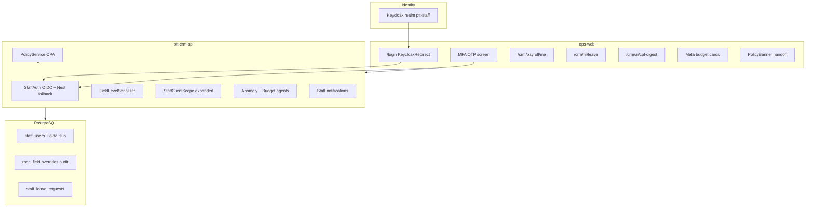
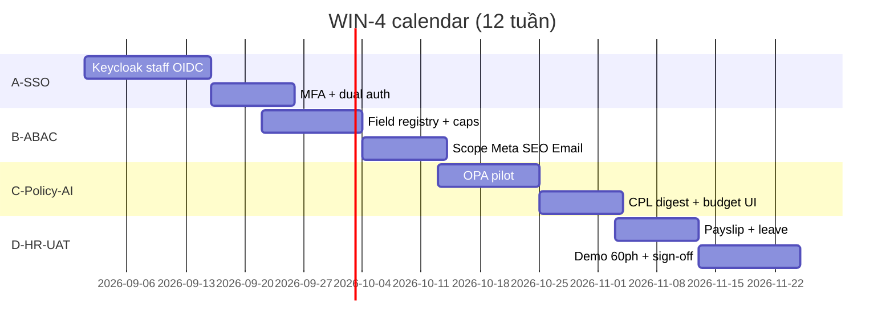

# WIN-4 — Kế hoạch triển khai chi tiết (Enterprise SSO + ABAC + AI ROAS)

> **Document ID:** WIN-4-PLAN-20260807  
> **Phiên bản:** 1.0 · **Ngày:** 2026-08-07  
> **Trạng thái:** Approved for kickoff — pending PO signature on acceptance PDF (see [`win-4-acceptance-checklist.md`](./win-4-acceptance-checklist.md))  
> **Prerequisite:** WIN-3 accepted ([`win-3-acceptance-checklist.md`](./win-3-acceptance-checklist.md)) · IT Keycloak `ptt-staff` ([`keycloak-staff-auth.md`](../runbooks/keycloak-staff-auth.md))  
> **Parent:** [`2026-08-07-rnosai-competitive-win-implementation-plan.md`](./2026-08-07-rnosai-competitive-win-implementation-plan.md) §8  
> **RBAC:** [`2026-08-06-rbac-enterprise-design.md`](./2026-08-06-rbac-enterprise-design.md) § R3-B…R4  
> **UI/UX:** [`2026-08-07-rnosai-competitive-win-ui-ux-design.md`](./2026-08-07-rnosai-competitive-win-ui-ux-design.md) §13.4, §13.6  
> **Master:** [`2026-08-07-rnosai-competitive-win-master-spec.md`](./2026-08-07-rnosai-competitive-win-master-spec.md) §13.6, §16

---

## Mục lục

1. [Mục tiêu & exit criteria](#1-mục-tiêu--exit-criteria)
2. [Baseline hiện tại (as-is)](#2-baseline-hiện-tại-as-is)
3. [Kiến trúc & phụ thuộc](#3-kiến-trúc--phụ-thuộc)
4. [Timeline 12 tuần](#4-timeline-12-tuần)
5. [Sprint WIN-4-A — Keycloak SSO + MFA staff](#5-sprint-win-4-a--keycloak-sso--mfa-staff-tuần-13)
6. [Sprint WIN-4-B — Field ABAC + scope mở rộng](#6-sprint-win-4-b--field-abac--scope-mở-rộng-tuần-46)
7. [Sprint WIN-4-C — OPA policy + AI CPL/budget](#7-sprint-win-4-c--opa-policy--ai-cplbudget-tuần-79)
8. [Sprint WIN-4-D — HR portal + collab + demo 60 ph](#8-sprint-win-4-d--hr-portal--collab--demo-60-ph-tuần-1012)
9. [Backend — DDL & API contracts](#9-backend--ddl--api-contracts)
10. [Frontend — routes & components](#10-frontend--routes--components)
11. [Feature flags & rollout](#11-feature-flags--rollout)
12. [Testing & UAT](#12-testing--uat)
13. [Deploy runbook](#13-deploy-runbook)
14. [Rủi ro & mitigation](#14-rủi-ro--mitigation)
15. [Effort & RACI](#15-effort--raci)
16. [Traceability](#16-traceability)
17. [Checklist tracking](#17-checklist-tracking)

---

## 1. Mục tiêu & exit criteria

### 1.1. Mục tiêu sản phẩm (thắng hoàn toàn)

| # | Mục tiêu | Metric | Scorecard / Ref |
|---|----------|--------|-----------------|
| G1 | **SSO enterprise** | Staff login Keycloak; pilot ≥100 NV | R-09 · §2.3 SSO/MFA **5** |
| G2 | **MFA bắt buộc** | GDKD + SUPER-ADMIN OTP | R4-3 |
| G3 | **Field-level ABAC** | ≥5 field pilot; export strip PII | R3-B |
| G4 | **Client scope full** | Meta/SEO/Email filter `client_id IN (...)` | R3-A mở rộng |
| G5 | **Policy-as-code** | ≥3 OPA rule trên mutate path | R3-D · BR-CRM-007/008 |
| G6 | **CPL anomaly digest** | Narrative UI + weekly job | WIN-AI-06 · AI-05 **5** |
| G7 | **Budget recommend** | Read-only cards Meta hub | WIN-AI-07 |
| G8 | **HR self-service** | Payslip read-only + leave lite | WIN-H-09/10 |
| G9 | **Demo 60 ph blind pass** | Master §16.2 12 scenes | VUX-10 |
| G10 | **Scorecard §4 bold** | Tất cả hạng mục ≥ cột **bold** | Master §4 |

### 1.2. WIN-4 exit checklist (PO sign-off)

- [ ] **EC-W4-01** SSO: 100+ NV pilot login Keycloak; Nest password deprecated read-only
- [ ] **EC-W4-02** MFA: GDKD + super-admin bắt buộc OTP; bypass → 403
- [ ] **EC-W4-03** Field ABAC: KD-01 không PATCH `expected_value`; export CSV strip phone nếu thiếu cap
- [ ] **EC-W4-04** Scope: AM scoped không list client/lead/campaign ngoài binding (≥2 modules)
- [ ] **EC-W4-05** OPA: Release Solution khi chưa handoff → 403 `presales.no_release_without_handoff`
- [ ] **EC-W4-06** CPL digest: trang narrative + ít nhất 1 anomaly tuần staging
- [ ] **EC-W4-07** Budget recommend: card read-only trên Meta hub / agency client
- [ ] **EC-W4-08** Payslip `/crm/payroll/me` — NV chỉ xem bản thân
- [ ] **EC-W4-09** Leave lite: submit → manager approve stub → audit
- [ ] **EC-W4-10** @mention activity → in-app notify
- [ ] **EC-W4-11** Demo 60 ph recording pass (VUX-10)
- [ ] **EC-W4-12** Scorecard §4 snapshot — all **bold** ≥ target
- [ ] **EC-W4-13** PO + GDKD + HR + IT + Eng Lead sign `WIN-4-acceptance-YYYY-MM-DD.pdf`

### 1.3. Out of scope WIN-4 (cấm build — Master §17)

| Module | Lý do | Thay thế |
|--------|-------|----------|
| ERP sổ cái / GTGT / tồn kho | OUT | Export MISA |
| BHXH / quyết toán TNCN full | OUT | MISA/FAST |
| Native iOS/Android app | Cost | PWA WIN-1 |
| SCIM full HRIS bidirectional | Trễ R4+ | Offboard wizard + refresh revoke |
| Field ABAC toàn bộ 59×20 matrix | Quá lớn | Pilot ≥5 field + registry |
| Multi-agent autonomous outbound | BR-AI-01 | Orchestrator **prep** + human approve |
| Payroll compliance thay MISA | Không moat | Export Excel payslip |

---

## 2. Baseline hiện tại (as-is)

### 2.1. Đã có (WIN-0 → WIN-3 · deploy `a3d4de8`)

| Layer | Có sẵn |
|-------|--------|
| **Staff auth** | Nest JWT email/password; caps union (position + functions + sets + break-glass) |
| **Portal auth** | Keycloak OIDC cho portal (`portal-keycloak.util.ts`); mode `nest-jwt` \| `keycloak` \| `dual` |
| **RBAC enterprise** | Permission Sets, GDKD caps, break-glass, simulator, access review ZIP |
| **R3 pilot** | `staff_user_clients` + JWT `client_ids[]`; lead list/detail filter; `WinScopeBadge` |
| **AI credibility** | Forecast MAPE badge, renewal T-90 strip, orchestrator API skeleton |
| **HR** | Onboard/offboard wizard, payroll PG + bonus UI, KPI solution |
| **Agency** | Hub map, portal ROAS, onboarding orchestrator hook |

### 2.2. Chưa có (WIN-4 gap)

| Gap | Spec ref |
|-----|----------|
| Staff Keycloak login (ops-web `/login`) | R4-1 · W4-SSO-01 |
| Staff MFA OTP step | R4-3 · W4-SSO-02 |
| `kc_group` → `position_id` mapping | R4-2 |
| `rbac_field_registry.json` + serializer strip | R3-B |
| Caps `crm_leads.view_financial`, `view_pii` | R3-B4 |
| Scope guards Meta/SEO/Email modules | R3-A2 |
| OPA `PolicyService` + 3 policies | R3-D |
| CPL anomaly digest page | WIN-AI-06 |
| Budget recommend cards | WIN-AI-07 |
| `/crm/payroll/me` payslip portal | WIN-H-09 |
| Leave request lite | WIN-H-10 |
| Activity @mention + notify | W4-CRM-01 |
| Access review workflow (PO tick → auto-revoke) | R3-E |
| Demo 60 ph script + screenshot archive | VUX-10 |

---

## 3. Kiến trúc & phụ thuộc



### 3.1. Nguyên tắc thực thi

1. **SSO trước ABAC** — không migrate field caps trước khi IdP mapping ổn định.
2. **Dual auth window 4 tuần** — `STAFF_AUTH_MODE=dual` (Keycloak + Nest password); sau pilot cutover `keycloak-only`.
3. **Fail-closed mutate** — OPA down → deny PATCH/POST trên presales handoff path (read OK).
4. **Reuse portal Keycloak** — clone `portal-keycloak.util.ts` pattern cho staff issuer/audience riêng.
5. **Feature flag mọi surface mới** — không bật prod SSO hàng loạt trước EC-W4-01.
6. **PG-only** — CI `rbac_no_sqlite_gate.sh` + field registry gate.

### 3.2. Phụ thuộc ngoài team

| Prereq | Owner | Gate |
|--------|-------|------|
| WIN-3 PO signed | PO | Kickoff WIN-4 |
| Keycloak realm `ptt-staff` + client ops-web | IT | Trước sprint A tuần 1 |
| MFA policy realm (OTP app) | IT | Trước sprint A tuần 2 |
| Group → position mapping sheet | HR + PO | Trước pilot 100 NV |
| OPA sidecar hoặc WASM embed decision | Eng Lead | Sprint C tuần 1 |
| Comms SSO migration email template | PO + HR | 2 tuần trước cutover |

---

## 4. Timeline 12 tuần

| Tuần | Sprint | Focus | Demo thứ Sáu |
|------|--------|-------|--------------|
| 1–3 | **WIN-4-A** | Keycloak staff login + MFA + group mapping | IT login SSO staging |
| 4–6 | **WIN-4-B** | Field ABAC registry + scope Meta/SEO/Email | KD không thấy expected_value |
| 7–9 | **WIN-4-C** | OPA handoff rules + CPL digest + budget cards | Release blocked banner |
| 10–12 | **WIN-4-D** | Payslip/leave + @mention + demo 60 ph UAT | PO dry-run acceptance |

**Buffer:** Tuần 12 dự phòng P0 RBAC/SSO + screenshot archive VUX-10.

**Capacity:** 1 FE (~22 dev-days) + 1 BE (~33 dev-days) + IT part-time · **Tổng ~55 dev-days** (Master §13.6).



---

## 5. Sprint WIN-4-A — Keycloak SSO + MFA staff (tuần 1–3)

**Goal:** Staff login enterprise; dual-auth pilot; MFA GDKD/super-admin.

### 5.1. Backend tasks

| ID | Task | Files | DoD | Est |
|----|------|-------|-----|-----|
| W4-BE-01 | Staff auth mode config | `app-config.service.ts` | `STAFF_AUTH_MODE=nest\|keycloak\|dual` | 0.5d |
| W4-BE-02 | OIDC token verify | `staff-keycloak.util.ts` (new) | JWKS validate access token | 2d |
| W4-BE-03 | Login exchange | `staff-auth.controller.ts` | `POST /auth/oidc/exchange` code→JWT nội bộ | 2d |
| W4-BE-04 | Link `oidc_sub` | DDL `staff_users.oidc_sub`, migration | Idempotent upsert on first login | 1d |
| W4-BE-05 | Group → position map | `staff-keycloak-groups.repository.ts` | Table `staff_keycloak_group_map` | 2d |
| W4-BE-06 | MFA claim gate | `staff-auth.service.ts` | Require `acr=mfa` for GDKD/super-admin | 1.5d |
| W4-BE-07 | Refresh revoke on offboard | Extend offboard flow | Invalidate refresh tokens | 1d |
| W4-BE-08 | Audit SSO events | `staff-auth-audit` | login/sso_link/fallback_password | 1d |
| W4-BE-09 | Unit tests | `staff-keycloak.util.spec.ts` | Token parse + map groups | 1d |

**DDL sketch:**

```sql
ALTER TABLE staff_users ADD COLUMN IF NOT EXISTS oidc_sub TEXT UNIQUE;
CREATE TABLE IF NOT EXISTS staff_keycloak_group_map (
  kc_group TEXT PRIMARY KEY,
  position_id INT NOT NULL REFERENCES crm_positions(id),
  default_set_codes TEXT[] DEFAULT '{}',
  active BOOLEAN DEFAULT TRUE
);
```

**Verify staging:**

```bash
export STAFF_AUTH_MODE=dual
export PTT_STAFF_KEYCLOAK_ISSUER=https://auth.example/realms/ptt-staff
cd services/ptt-crm-api && npm test -- --testPathPattern=staff-keycloak
curl -sf http://127.0.0.1:3000/health
```

### 5.2. Frontend tasks

| ID | Task | Files | DoD | Est |
|----|------|-------|-----|-----|
| W4-FE-01 | Keycloak redirect login | `app/login/KeycloakRedirect.tsx`, `page.tsx` | Redirect + callback | 2d |
| W4-FE-02 | MFA OTP screen | `app/login/mfa/page.tsx` | Second step when acr missing | 1.5d |
| W4-FE-03 | Dev fallback banner | `/login` | Local `nest-jwt` when flag off | 0.5d |
| W4-FE-04 | SSO migration notice | `WinSsoMigrationBanner.tsx` | Countdown dual-auth | 0.5d |
| W4-FE-05 | Admin group map UI | `admin/crm/sso/groups/page.tsx` | CRUD kc_group → position | 2d |
| W4-FE-06 | API client | `src/lib/api.ts` | oidc exchange, group map | 1d |

**Gate WIN-4-A:** IT admin login Keycloak staging → `/auth/me` caps đúng; GDKD without MFA → blocked.

---

## 6. Sprint WIN-4-B — Field ABAC + scope mở rộng (tuần 4–6)

**Goal:** R3-B field pilot live; mở rộng R3-A sang agency modules (WIN-3 chỉ lead pilot).

### 6.1. Backend tasks

| ID | Task | Files | DoD | Est |
|----|------|-------|-----|-----|
| W4-BE-10 | Field registry | `config/rbac_field_registry.json` | entity, field, cap, mask mode | 1d |
| W4-BE-11 | Catalog caps | `rbac-admin-catalog.json` | `crm_leads.view_financial`, `view_pii`, `crm_agency.view_pii` | 1d |
| W4-BE-12 | Serializer middleware | `field-level.serializer.ts` | Strip/mask on GET; 403 on PATCH | 3d |
| W4-BE-13 | Lead export strip | `leads-export.service.ts` | CSV phone/email per cap | 1d |
| W4-BE-14 | CI field gate | `scripts/rbac_field_registry_gate.sh` | Registry ⊆ catalog | 0.5d |
| W4-BE-15 | Scope Meta ads | `meta-ads*.controller.ts` | `client_id IN (...)` when scoped | 2d |
| W4-BE-16 | Scope SEO workspace | `seo-*.guard.ts` | Filter client routes | 2d |
| W4-BE-17 | Scope Email MKT | `portal-email` client filter | List campaigns scoped | 2d |
| W4-BE-18 | Bulk client assign CSV | `staff-org.controller.ts` | `POST .../client-scope/import` | 1.5d |
| W4-BE-19 | Tests | `field-level.spec.ts`, `client-scope-modules.spec.ts` | 403 cross-client | 2d |

**Pilot fields (R3-B):**

| Entity | Field | Cap | UI |
|--------|-------|-----|-----|
| Lead | `expected_value`, `margin_pct` | `crm_leads.view_financial` | Mask `••••` |
| Lead | `phone`, `email` (export) | `crm_leads.view_pii` | Partial mask list |
| Client | `billing_contact` | `crm_agency.view_pii` | Hidden in portal |

### 6.2. Frontend tasks

| ID | Task | Files | DoD | Est |
|----|------|-------|-----|-----|
| W4-FE-07 | Field mask components | `WinFieldMask.tsx` | financial / pii variants | 1d |
| W4-FE-08 | Lead detail financial | `LeadConsultWorkspace.tsx` | Hide expected_value | 1d |
| W4-FE-09 | Export UX tooltip | Leads export button | Explain PII strip | 0.5d |
| W4-FE-10 | Client scope CSV import | `ClientScopeImport.tsx` on org users | Upload + preview | 1.5d |
| W4-FE-11 | Scope badges extended | `WinScopeBadge` on agency rows | Meta/SEO client list | 1d |
| W4-FE-12 | Admin field registry view | `admin/crm/permissions/fields/page.tsx` | Read-only registry | 1d |

**Gate WIN-4-B:** EC-W4-03 + EC-W4-04 pass on staging với 2 AM personas.

---

## 7. Sprint WIN-4-C — OPA policy + AI CPL/budget (tuần 7–9)

**Goal:** Policy-as-code trên handoff path; AI ROAS intelligence surfaces.

### 7.1. Backend tasks

| ID | Task | Files | DoD | Est |
|----|------|-------|-----|-----|
| W4-BE-20 | OPA bundle | `policies/presales/*.rego` (or Cedar) | 3 rules versioned | 2d |
| W4-BE-21 | PolicyService | `policy/policy.service.ts` | evaluate before mutate | 2d |
| W4-BE-22 | Integrate Solution release | `presales-solution.service.ts` | `no_release_without_handoff` | 1.5d |
| W4-BE-23 | Integrate claim + break-glass | Extend guards | Rules (2)(3) from R3-D | 1.5d |
| W4-BE-24 | Policy CI | `policy/policy.spec.ts` | Unit + version tag in `/health` | 1d |
| W4-BE-25 | CPL anomaly agent | `ai-intelligence/cpl-anomaly.service.ts` | Weekly narrative JSON | 3d |
| W4-BE-26 | CPL digest API | `GET /api/v1/ai/cpl-digest` | period, clients[], narrative | 1d |
| W4-BE-27 | Budget recommend agent | `budget-recommend.service.ts` | Read-only suggestions | 2d |
| W4-BE-28 | Budget API | `GET /api/v1/ai/budget-recommendations` | client_id, channel | 1d |
| W4-BE-29 | Orchestrator prep | Extend `orchestrator.service.ts` | Register CPL + budget steps | 2d |

**OPA policies (R3-D):**

| ID | Rule | Mutate path |
|----|------|-------------|
| `presales.no_release_without_handoff` | Consult✓ + handoff activity | Solution release |
| `presales.no_claim_without_mkt_set` | MKT function or set | Solution claim |
| `rbac.break_glass_not_expired` | TTL ≤24h | Break-glass cap union |

### 7.2. Frontend tasks

| ID | Task | Files | DoD | Est |
|----|------|-------|-----|-----|
| W4-FE-13 | Policy banner | `PresalesPolicyBanner.tsx` | Show denied reason pre-submit | 1d |
| W4-FE-14 | CPL digest page | `app/crm/ai/cpl-digest/page.tsx` | Narrative + anomaly list | 3d |
| W4-FE-15 | Budget cards | `MetaBudgetRecommendCards.tsx` | Agency client + Meta hub | 2d |
| W4-FE-16 | AI hub link | `/crm/hub` tile | Cap `crm_ai_insights.view` | 0.5d |
| W4-FE-17 | Orchestrator admin polish | `/admin/ai/agents` | Show CPL/budget job types | 1d |

**Gate WIN-4-C:** EC-W4-05 + EC-W4-06 + EC-W4-07 on staging.

---

## 8. Sprint WIN-4-D — HR portal + collab + demo 60 ph (tuần 10–12)

**Goal:** HR self-service; collab notify; UAT enterprise + PO sign.

### 8.1. Backend tasks

| ID | Task | Files | DoD | Est |
|----|------|-------|-----|-----|
| W4-BE-30 | Payslip self API | `GET /api/v1/payroll/me/payslips` | Filter by staff user email/id | 2d |
| W4-BE-31 | Payslip PDF/stream | Optional signed URL | Read-only cap self | 1d |
| W4-BE-32 | Leave DDL | `staff_leave_requests` | type, dates, status, approver | 1d |
| W4-BE-33 | Leave API | CRUD + approve stub | `crm_hr_leave.*` caps | 2d |
| W4-BE-34 | @mention parse | `lead-activities.service.ts` | `@email` → notify targets | 1.5d |
| W4-BE-35 | Notifications | `staff-notifications.repository.ts` | In-app unread count | 2d |
| W4-BE-36 | Access review workflow | Extend access-review | PO tick CSV → revoke job | 2d |
| W4-BE-37 | SSO cutover script | `scripts/staff_auth_cutover_keycloak.sh` | Disable nest password prod | 0.5d |

### 8.2. Frontend tasks

| ID | Task | Files | DoD | Est |
|----|------|-------|-----|-----|
| W4-FE-18 | Payslip portal | `app/crm/payroll/me/page.tsx` | List + download Excel/PDF | 2d |
| W4-FE-19 | Leave form | `app/crm/hr/leave/page.tsx` | Submit + status list | 2.5d |
| W4-FE-20 | HR hub tile | `buildHrHubGroups` | Links payslip + leave | 0.5d |
| W4-FE-21 | Mention autocomplete | Activity composer on lead detail | `@` dropdown roster | 2d |
| W4-FE-22 | Notification bell | `OpsNav` extension | Unread badge + drawer | 1.5d |
| W4-FE-23 | Screenshot archive | `docs/exports/win-ux-screenshots/WIN-4/` | VUX-01…10 captures | 1d |
| W4-FE-24 | Acceptance checklist doc | `win-4-acceptance-checklist.md` | EC-W4-01…13 | 0.5d |

### 8.3. UAT & sign-off (tuần 12)

| ID | Script | Owner | Duration |
|----|--------|-------|----------|
| W4-UAT-01 | Demo 60 ph Master §16.2 (12 scenes) | PO + QA | 60 ph |
| W4-UAT-02 | SSO pilot 100 NV smoke | IT | 2 ngày |
| W4-UAT-03 | Scorecard §4 audit spreadsheet | PO | 4h |
| W4-UAT-04 | FAQ sales 3 prospects | PO + Sales | async |

**Gate WIN-4-D:** EC-W4-01…13 + `WIN-4-acceptance.pdf` signed.

---

## 9. Backend — DDL & API contracts

### 9.1. Staff SSO

| Method | Path | Notes |
|--------|------|-------|
| POST | `/api/v1/staff/auth/oidc/exchange` | `{ code, redirect_uri }` → tokens + user |
| GET | `/api/v1/staff/auth/sso/config` | `{ issuer, client_id, mode }` for FE |
| GET | `/api/v1/staff/admin/sso/groups` | List group map (configure cap) |
| PUT | `/api/v1/staff/admin/sso/groups/:group` | Map to position_id |

### 9.2. Field ABAC

| Method | Path | Cap |
|--------|------|-----|
| GET | `/api/v1/admin/rbac/field-registry` | `crm_data_config.view` |
| GET | `/api/v1/leads/:id` | Response masked per caps |
| PATCH | `/api/v1/leads/:id` | 403 on protected fields |

### 9.3. Policy evaluate (internal/debug)

| Method | Path | Body |
|--------|------|------|
| POST | `/api/v1/policy/evaluate` | `{ policy_id, context }` → `{ allow, reason }` |

### 9.4. AI surfaces

| Method | Path | Cap |
|--------|------|-----|
| GET | `/api/v1/ai/cpl-digest` | `crm_ai_insights.view` |
| GET | `/api/v1/ai/budget-recommendations` | `crm_meta_ads.view` + client scope |

### 9.5. HR self-service

| Method | Path | Cap |
|--------|------|-----|
| GET | `/api/v1/payroll/me/payslips` | Self only |
| POST | `/api/v1/hr/leave/requests` | `crm_hr_leave.request` |
| PATCH | `/api/v1/hr/leave/requests/:id/approve` | `crm_hr_leave.approve` |

### 9.6. Notifications

| Method | Path | Notes |
|--------|------|-------|
| GET | `/api/v1/staff/notifications` | Paginated unread |
| POST | `/api/v1/staff/notifications/:id/read` | Mark read |

---

## 10. Frontend — routes & components

### 10.1. Route map (new)

```
app/login/
├── page.tsx                    # redirect or legacy form
├── KeycloakRedirect.tsx
└── mfa/page.tsx

admin/crm/sso/groups/page.tsx

admin/crm/permissions/fields/page.tsx

app/crm/payroll/me/page.tsx
app/crm/hr/leave/page.tsx
app/crm/ai/cpl-digest/page.tsx

components/rbac/WinFieldMask.tsx
components/rbac/ClientScopeImport.tsx
components/presales/PresalesPolicyBanner.tsx
components/ai/MetaBudgetRecommendCards.tsx
components/crm/MentionComposer.tsx
components/layout/StaffNotificationBell.tsx
components/win/WinSsoMigrationBanner.tsx
```

### 10.2. Cap gating

| Route | Min cap |
|-------|---------|
| `/admin/crm/sso/groups` | `crm_data_config.configure` |
| `/crm/payroll/me` | Self + `crm_payroll.view` (own row) |
| `/crm/hr/leave` | `crm_hr_leave.request` |
| `/crm/ai/cpl-digest` | `crm_ai_insights.view` |
| Meta budget cards | `crm_meta_ads.view` |

---

## 11. Feature flags & rollout

| Flag | Default prod | Bật khi |
|------|--------------|---------|
| `STAFF_AUTH_MODE` | `nest` | Sprint A staging → `dual` → `keycloak` |
| `STAFF_MFA_REQUIRED` | `0` | EC-W4-02 pass |
| `STAFF_FIELD_ABAC` | `0` | Sprint B staging |
| `STAFF_SCOPE_FULL` | `0` | Sau WIN-3 pilot OK |
| `STAFF_POLICY_OPA` | `0` | Sprint C |
| `NEXT_PUBLIC_WIN_SSO` | `0` | Sprint A |
| `NEXT_PUBLIC_WIN_FIELD_ABAC` | `0` | Sprint B |
| `NEXT_PUBLIC_WIN_CPL_DIGEST` | `0` | Sprint C |
| `NEXT_PUBLIC_WIN_PAYSLIP_PORTAL` | `0` | Sprint D |
| `NEXT_PUBLIC_WIN_LEAVE_LITE` | `0` | Sprint D |

```typescript
// services/ops-web/src/lib/win/flags.ts (planned)
export function winSsoEnabled(): boolean {
  return process.env.NEXT_PUBLIC_WIN_SSO === '1';
}
export function winFieldAbacEnabled(): boolean {
  return process.env.NEXT_PUBLIC_WIN_FIELD_ABAC === '1';
}
```

**Rollout comms (Master §12.3):** Email all staff 2 tuần trước SSO cutover · HR training payslip/leave 30 ph.

---

## 12. Testing & UAT

### 12.1. Automated

| Suite | File | Gates |
|-------|------|-------|
| Nest unit | `staff-keycloak.util.spec.ts` | JWKS mock |
| Nest unit | `field-level.spec.ts` | Strip/mask |
| Nest unit | `policy/policy.spec.ts` | 3 rego rules |
| Nest integration | `staff-oidc-exchange.spec.ts` | dual mode |
| Playwright | `e2e/win-4-sso-login.spec.ts` | Keycloak mock / stub |
| Playwright | `e2e/win-4-field-abac.spec.ts` | financial hidden |
| Playwright | `e2e/win-4-policy-release.spec.ts` | banner + 403 |
| Playwright | `e2e/win-4-demo-60min.spec.ts` | VUX-10 smoke subset |
| CI | `rbac_field_registry_gate.sh` | Registry valid |
| Lighthouse | CI | a11y ≥90 `/login`, `/crm/payroll/me` |

### 12.2. Manual UAT

| Script | Persona | Thời lượng |
|--------|---------|------------|
| UAT-WIN-4-sso | IT Admin | 30 ph |
| UAT-WIN-4-mfa | GDKD | 15 ph |
| UAT-WIN-4-abac | KD-01 + Admin | 20 ph |
| UAT-WIN-4-demo | PO full | **60 ph** |
| UAT-WIN-4-hr | HR + 3 NV | 20 ph |

### 12.3. Demo 60 phút script (Master §16.2)

| # | Scene | WIN-4 proof |
|---|-------|-------------|
| 1–9 | CRM/P3/RBAC từ WIN-1…3 | Regression |
| 10 | Permission simulator | WIN-3 |
| 11 | Forecast + renewal + **CPL digest** | WIN-4-C |
| 12 | **SSO login** + audit export | WIN-4-A |

Record → `docs/exports/win-ux-recordings/WIN-4-demo-YYYY-MM-DD.mp4`

---

## 13. Deploy runbook

### 13.1. Per-sprint VPS scripts (planned)

```bash
# Sprint A
bash scripts/deploy_win4a_vps.sh   # SSO DDL + STAFF_AUTH_MODE=dual

# Sprint B
bash scripts/apply_pg_ddl_field_abac_r3_b.sh
bash scripts/deploy_win4b_vps.sh

# Sprint C
bash scripts/deploy_opa_bundle.sh
bash scripts/deploy_win4c_vps.sh

# Sprint D + cutover
bash scripts/deploy_win4d_vps.sh
bash scripts/staff_auth_cutover_keycloak.sh --apply
```

### 13.2. Sprint A deploy skeleton

```bash
ssh deploy@rs.pttads.vn
cd /var/www/rnosai && git pull --ff-only origin main

export DATABASE_URL=…  # from .env
bash scripts/apply_pg_ddl_staff_sso_r4.sh

cd services/ptt-crm-api && npm ci && npm run build
# .env: STAFF_AUTH_MODE=dual, PTT_STAFF_KEYCLOAK_ISSUER=…
sudo systemctl restart ptt-crm-api

export NEXT_PUBLIC_WIN_SSO=1
./scripts/deploy_ops_web.sh build
sudo systemctl restart ptt-ops-web
curl -sf https://rs.pttads.vn/health
```

### 13.3. Keycloak realm checklist (IT)

- [ ] Client `ptt-ops-web` redirect URIs staging + prod
- [ ] Groups: `GDKD`, `AM`, `MKT`, `CSKH`, `IT-ADMIN`, …
- [ ] MFA required flow for `GDKD`, `SUPER-ADMIN` groups
- [ ] SMTP / OTP app configured
- [ ] Session idle timeout ≤8h

---

## 14. Rủi ro & mitigation

| Rủi ro | Xác suất | Mitigation |
|--------|----------|------------|
| Keycloak delay block sprint A | Cao | Dual auth + local dev fallback 4 tuần |
| Group mapping sai → caps drift | Cao | Shadow login compare; rollback `STAFF_AUTH_MODE=nest` |
| OPA latency on mutate | Trung bình | Cache allow 60s; fail-closed only mutate |
| Field ABAC break integrations | Trung bình | Internal key bypass; pilot 5 fields only |
| SSO cutover lock-out | Trung bình | Break-glass super-admin nest password 72h |
| CPL agent false positive | Trung bình | Human approve; no auto budget change |
| Demo 60 ph flake | Trung bình | Pre-record backup; staging data seed script |
| Scope creep ERP/payroll compliance | Trung bình | Master §17 gate in PR template |

---

## 15. Effort & RACI

| Sprint | FE days | BE days | IT days |
|--------|---------|---------|---------|
| WIN-4-A | 8 | 12 | 5 |
| WIN-4-B | 6 | 14 | 1 |
| WIN-4-C | 8 | 12 | 2 |
| WIN-4-D | 10 | 8 | 4 |
| **Tổng** | **~32** | **~46** | **~12** |

*Note: Master §13.6 ước lượng ~55 dev-days eng; IT SSO không tính trong dev-days.*

| Hoạt động | PO | FE | BE | IT | QA | HR |
|-----------|:--:|:--:|:--:|:--:|:--:|:--:|
| Keycloak realm | C | I | C | **R** | I | I |
| Group → position map | **A** | C | R | C | I | **R** |
| SSO cutover comms | **A** | C | C | R | I | R |
| Field ABAC pilot fields | **A** | R | R | I | R | I |
| OPA policies sign | **A** | C | R | I | R | I |
| Demo 60 ph | **A** | C | C | C | **R** | C |
| WIN-4 acceptance PDF | **A** | C | C | C | R | C |

---

## 16. Traceability

| Master / RBAC ID | Sprint | Task IDs |
|------------------|--------|----------|
| R-09 SSO + MFA | A | W4-BE-01…09, W4-FE-01…06 |
| R3-B Field ABAC | B | W4-BE-10…14, W4-FE-07…09 |
| R3-A scope expand | B | W4-BE-15…18, W4-FE-10…11 |
| R3-D OPA pilot | C | W4-BE-20…24, W4-FE-13 |
| WIN-AI-06 CPL digest | C | W4-BE-25…26, W4-FE-14 |
| WIN-AI-07 Budget recommend | C | W4-BE-27…28, W4-FE-15 |
| WIN-H-09 Payslip portal | D | W4-BE-30…31, W4-FE-18 |
| WIN-H-10 Leave lite | D | W4-BE-32…33, W4-FE-19 |
| W4-CRM-01 @mention | D | W4-BE-34…35, W4-FE-21…22 |
| R3-E Access review workflow | D | W4-BE-36 |
| E-WIN-SSO epic | A | W4-* SSO tasks |
| VUX-10 Demo 60 ph | D | W4-UAT-01, W4-FE-23 |

---

## 17. Checklist tracking

```
WIN-4-A (SSO)
[ ] W4-BE-01…09 Keycloak staff backend
[ ] W4-FE-01…06 Login redirect + MFA + group admin
[ ] Gate: IT SSO staging + dual auth

WIN-4-B (ABAC + scope)
[ ] W4-BE-10…19 Field registry + module scope
[ ] W4-FE-07…12 Masks + CSV import + badges
[ ] Gate: EC-W4-03 + EC-W4-04

WIN-4-C (Policy + AI)
[ ] W4-BE-20…29 OPA + CPL + budget + orchestrator prep
[ ] W4-FE-13…17 Policy banner + digest + budget cards
[ ] Gate: EC-W4-05…07

WIN-4-D (HR + UAT)
[ ] W4-BE-30…37 Payslip + leave + notify + cutover
[ ] W4-FE-18…24 Portal UI + demo archive
[ ] W4-UAT-01…04 + EC-W4-01…13 + PO sign
```

---

## Phụ lục — Kickoff agenda (120 ph)

| Phút | Nội dung | Owner |
|------|----------|-------|
| 0–15 | WIN-3 recap + WIN-4 goals §1 | PO |
| 15–35 | Keycloak architecture + dual auth timeline | IT + BE |
| 35–55 | Field ABAC + scope modules walkthrough | BE |
| 55–75 | OPA policies + demo scenes §12.3 | BE + PO |
| 75–90 | HR payslip/leave scope boundary | HR + PO |
| 90–110 | Sprint A backlog assign + flags | Eng Lead |
| 110–120 | Risks + calendar blocks UAT tuần 12 | All |

---

*Sau khi PO sign WIN-3:* cập nhật trạng thái doc → **Approved** · tạo `win-4-acceptance-checklist.md` mirror EC-W4-01…13 · mở epic Jira/Linear `E-WIN-SSO`, `E-WIN-ABAC`, `E-WIN-AI-ROAS`.*
