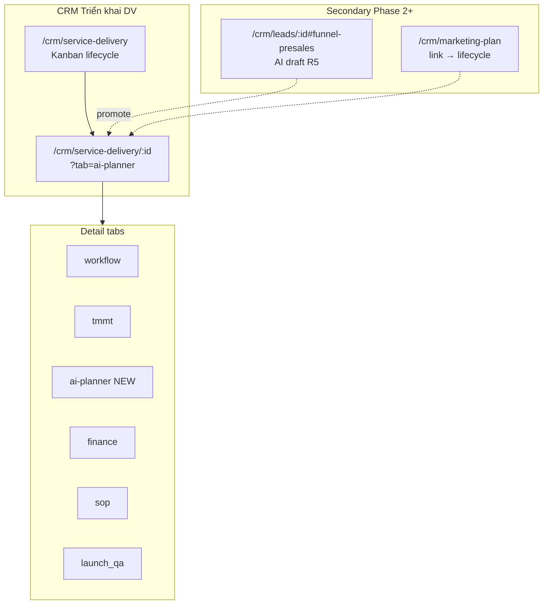

# AI Marketing Planner — Integration & UX/UI Specification (Triển khai DV)

> **Document ID:** MKT-AI-PLANNER-SPEC-20260808  
> **Phiên bản:** 1.0 · **Ngày:** 2026-08-08  
> **Trạng thái:** Approved for UX/UI design & Phase 1 kickoff  
> **Nguồn PRD:** `PTTCOM/AI/ứng dụng lên kế hoạch marketing AI.docx` — *AI Marketing Planner Pro*  
> **Kế hoạch triển khai:** [`.cursor/plans/ai_marketing_planner_rnosai_1e3d14bd.plan.md`](../../../.cursor/plans/ai_marketing_planner_rnosai_1e3d14bd.plan.md)  
> **Parent BA:** [`modules/RNOSAI-BA-SVC-UseCases.md`](./modules/RNOSAI-BA-SVC-UseCases.md) · [`modules/RNOSAI-BA-MKTP-UseCases.md`](./modules/RNOSAI-BA-MKTP-UseCases.md) · SVC-UC-003, SVC-UC-011  
> **Use cases:** [`use-cases/10-MKT-AI-PLANNER.md`](../use-cases/10-MKT-AI-PLANNER.md) · **Actions:** [`use-cases/actions/10-MKTP-ACTIONS.md`](../use-cases/actions/10-MKTP-ACTIONS.md)  
> **Design system:** [`../SPEC_UI_UX_PTT.md`](../SPEC_UI_UX_PTT.md) · [`2026-08-07-rnosai-competitive-win-ui-ux-design.md`](./2026-08-07-rnosai-competitive-win-ui-ux-design.md) · [`../SPEC_UI_UX_AI_REVENUE_OS.md`](../SPEC_UI_UX_AI_REVENUE_OS.md)  
> **Backend anchor:** [`lifecycle-marketing-plan.util.ts`](../../services/ptt-crm-api/src/service-lifecycle/lifecycle-marketing-plan.util.ts) · TMMT gate  
> **App:** `services/ops-web` · Tab trên `/crm/service-delivery/[id]`

---

## Mục lục

1. [Tóm tắt & phạm vi](#1-tóm-tắt--phạm-vi)
2. [Personas & mục tiêu UX](#2-personas--mục-tiêu-ux)
3. [Information Architecture & routes](#3-information-architecture--routes)
4. [Screen inventory (SCR-MKT-AI)](#4-screen-inventory-scr-mkt-ai)
5. [Luồng người dùng end-to-end](#5-luồng-người-dùng-end-to-end)
6. [Wireframes & screen specs — Phase 1 (P0)](#6-wireframes--screen-specs--phase-1-p0)
7. [Wireframes — Phase 2–4](#7-wireframes--phase-24)
8. [Component map & file checklist](#8-component-map--file-checklist)
9. [Field mapping PRD Brief → TMMT](#9-field-mapping-prd-brief--tmmt)
10. [AI job UX — states, progress, retry](#10-ai-job-ux--states-progress-retry)
11. [Quality score & export gates](#11-quality-score--export-gates)
12. [Tích hợp TMMT & lifecycle gates](#12-tích-hợp-tmmt--lifecycle-gates)
13. [RBAC, caps & feature flags](#13-rbac-caps--feature-flags)
14. [Responsive & progressive disclosure](#14-responsive--progressive-disclosure)
15. [Backend contracts (tóm tắt cho FE)](#15-backend-contracts-tóm-tắt-cho-fe)
16. [DDL & entities (tóm tắt)](#16-ddl--entities-tóm-tắt)
17. [Acceptance criteria UX (EC-MKT-AI)](#17-acceptance-criteria-ux-ec-mkt-ai)
18. [Traceability & roadmap 4 phase](#18-traceability--roadmap-4-phase)
19. [Visual QA checklist](#19-visual-qa-checklist)

---

## 1. Tóm tắt & phạm vi

### 1.1. Mục tiêu sản phẩm

Nhúng **AI Marketing Planner Pro** vào RNOSAI tại **Triển khai dịch vụ marketing** — không xây SaaS workspace độc lập. Solution/AM hoàn thiện **TMMT chính thức (R5)** trên lifecycle trong vài giờ thay vì vài ngày, với **human-in-the-loop**: AI draft → chỉnh sửa → Apply vào TMMT → gate pass → chuyển stage Deliver.

### 1.2. Quyết định kiến trúc UX

| Quyết định | Lý do |
|------------|-------|
| **Primary surface:** tab `ai-planner` trên `/crm/service-delivery/[id]` | Neo theo lifecycle + TMMT gate hiện có |
| **Không route `/crm/marketing-plan` mới làm hub chính** | Tránh trùng PRD workspace; lifecycle là source of truth |
| **Wizard 5 bước trong 1 tab** | Brief → Strategy → Campaign → Content → Apply/Export |
| **Tab TMMT giữ nguyên** | Manual edit + validation badge; AI Planner là accelerator |
| **Không auto-advance stage** | Giữ `ServiceDeliveryWorkflowPanel` logic |

### 1.3. Phạm vi theo phase

| Phase | Tuần | UX deliverable |
|-------|------|----------------|
| **P0 — Phase 1** | 1–6 | Tab `ai-planner` đủ 5 bước + job progress + apply TMMT + export |
| **P1 — Phase 2** | 7–10 | Brand KB upload, budget sim, approval bar, version compare |
| **P2 — Phase 3** | 11–14 | KPI dashboard panel, optimization copilot, alerts |
| **P3 — Phase 4** | 15–20 | Multi-agent picker, industry playbooks, governance banner |

### 1.4. Out of scope (UI)

- Standalone multi-tenant brand workspace (PRD §workspace)
- Auto-publish Meta/Google campaigns without Campaign Write approval
- Client portal view of full AI planner (Phase 4+ có thể summary read-only)
- Thay thế hoàn toàn tab TMMT thủ công

---

## 2. Personas & mục tiêu UX

### 2.1. Personas

| Persona | Vai trò | Màn hình chính | Cap tối thiểu |
|---------|---------|----------------|---------------|
| **Solution Strategist (SP)** | Soạn TMMT, chiến lược, campaign | Tab `ai-planner`, `tmmt` | `crm_board.view`, `crm_mkt_ai.generate` |
| **Account Manager (AM)** | Theo dõi tiến độ, approve export | Tab `ai-planner` (read), `workflow` | `crm_board.view`, `crm_mkt_ai.view` |
| **MKT Lead / GDKD** | Review chất lượng, approve Phase 2+ | Approval bar, version compare | `crm_mkt_ai.approve` |
| **Admin IT** | Bật flag, RBAC | `/admin/crm/permissions` | `admin.*` |

### 2.2. UX goals (đo được)

| ID | Mục tiêu | Metric | Phase |
|----|----------|--------|-------|
| UX-MKT-01 | Hoàn brief + strategy ≤30 ph | Task time UAT staging | P0 |
| UX-MKT-02 | Apply → TMMT gate pass lần 1 ≥70% | UAT lifecycle sample n≥10 | P0 |
| UX-MKT-03 | Không mất draft khi job fail | Retry success EC-MKT-AI-05 | P0 |
| UX-MKT-04 | Mobile đọc được brief (edit desktop) | Read-only `<768px` usable | P0 |
| UX-MKT-05 | RAG brand cited trong output | ≥1 citation chip Phase 2 | P1 |
| UX-MKT-06 | Budget sim ≤3 click từ strategy | Click path timed UAT | P1 |

### 2.3. Nguyên tắc UX (kế thừa WIN + AI Revenue OS)

1. **Cap-first** — ẩn nút Generate/Apply/Export trước API; tooltip cap khi disabled.
2. **Progressive disclosure** — stepper 5 bước; chi tiết campaign/content collapse mặc định.
3. **Human-in-the-loop** — mọi AI output có `[Chỉnh sửa]` + `[Apply vào TMMT]` riêng; không silent merge.
4. **Gate visible** — banner TMMT status luôn hiển thị trên panel (pass/fail + link tab TMMT).
5. **Job transparency** — step status, model, thời gian, retry; không spinner vô hạn.
6. **Vietnamese-first** — label VI; JSON keys monospace muted trong dev mode only.
7. **Reuse PTT tokens** — `.card`, `.btn`, `.muted`, `.error`, `var(--accent)`; không palette mới.

---

## 3. Information Architecture & routes

### 3.1. Entry points



### 3.2. Route table

| SCR | Route | Query | Mô tả |
|-----|-------|-------|-------|
| SCR-MKT-AI-000 | `/crm/service-delivery` | — | Kanban — badge "AI draft" nếu có job completed chưa apply |
| SCR-MKT-AI-001 | `/crm/service-delivery/[id]` | `tab=ai-planner` | **Primary** — Marketing AI Planner wizard |
| SCR-MKT-AI-001 | same | `tab=tmmt` | TMMT manual (existing) — cross-link |
| SCR-MKT-AI-002 | same | `step=brief\|strategy\|campaign\|content\|apply` | Deep link bước wizard (URL sync) |
| SCR-MKT-AI-010 | `/crm/leads/[id]` | `#presales-r5-ai` | Phase 2 — AI draft presales R5 |
| SCR-MKT-AI-020 | Tab panel | `sub=budget` | Phase 2 — Budget simulator |
| SCR-MKT-AI-021 | Tab panel | `sub=kb` | Phase 2 — Brand KB documents |
| SCR-MKT-AI-030 | Tab panel | `sub=dashboard` | Phase 3 — KPI dashboard |
| SCR-MKT-AI-040 | Tab panel | `sub=agents` | Phase 4 — Multi-agent config |

### 3.3. Breadcrumb & shell

```
CRM › Triển khai DV › #123 · meta-lead-gen
DetailPageLayout (existing)
  └─ Tab bar: Workflow | TMMT chính thức | AI Planner ★ | Tài chính | SOP Launch | Launch QA
```

- Shell: `CrmDeliveryPageShell` (hideToolbar=true, breadcrumb như hiện tại).
- Tab label VI: **「AI Planner」** hoặc **「Kế hoạch AI」** — PO chốt 1 label trước dev; spec dùng **AI Planner**.
- Tab badge: dot vàng nếu brief chưa đủ; dot xanh nếu có draft chưa apply.

### 3.4. Module sub-nav

Không thêm link top-level mới trong `OpsNav` — planner **chỉ** trong lifecycle detail. Optional Phase 3: tile nhỏ trên delivery hub nếu `NEXT_PUBLIC_MKT_AI_PLANNER=1`.

---

## 4. Screen inventory (SCR-MKT-AI)

| SCR | Tên | Component root | Phase | UC |
|-----|-----|----------------|-------|-----|
| SCR-MKT-AI-001 | AI Planner Wizard | `MarketingAiPlannerPanel` | P0 | SVC-UC-003, SVC-UC-011 |
| SCR-MKT-AI-001a | Step Brief | `BriefIntakeForm` | P0 | — |
| SCR-MKT-AI-001b | Step Strategy | `AiStrategySections` | P0 | — |
| SCR-MKT-AI-001c | Step Campaign | `AiCampaignBuilder` | P0 | — |
| SCR-MKT-AI-001d | Step Content | `AiContentCalendar` | P0 | — |
| SCR-MKT-AI-001e | Step Apply & Export | `ExportPlanActions` + apply bar | P0 | — |
| SCR-MKT-AI-003 | Job progress overlay | `AiJobProgressPanel` | P0 | — |
| SCR-MKT-AI-004 | TMMT gate banner | `AiTmmtGateBanner` | P0 | SVC-UC-003 |
| SCR-MKT-AI-010 | Presales R5 AI bridge | extend `PresalesR5PlanForm` | P1 | — |
| SCR-MKT-AI-020 | Brand KB manager | `AiBrandKbPanel` | P1 | — |
| SCR-MKT-AI-021 | Budget simulator | `AiBudgetSimulator` | P1 | — |
| SCR-MKT-AI-022 | Approval & version | `AiPlanApprovalBar`, `AiVersionCompare` | P1 | — |
| SCR-MKT-AI-030 | KPI dashboard | `AiPlannerKpiDashboard` | P2 | SVC-UC-010 |
| SCR-MKT-AI-031 | Optimization copilot | `AiOptimizationCopilot` | P2 | — |
| SCR-MKT-AI-040 | Multi-agent & playbooks | `AiAgentPipelinePicker` | P3 | — |

---

## 5. Luồng người dùng end-to-end

### 5.1. Happy path — onboard → deliver (P0)

| # | Actor | Hành động UI | System |
|---|-------|--------------|--------|
| 1 | AM | Mở `/crm/service-delivery/:id` stage **onboard** | Load context + onboarding-brief prefill |
| 2 | SP | Tab **AI Planner** → Step Brief | PATCH `/ai-planner/brief`; validation inline |
| 3 | SP | **Tiếp tục** → Step Strategy → `[Sinh chiến lược AI]` | POST `/jobs/strategy`; job panel |
| 4 | SP | Review/edit sections → **Tiếp tục** | Draft lưu local + server |
| 5 | SP | Step Campaign → `[Sinh chiến dịch]` | POST `/jobs/campaigns` |
| 6 | SP | Step Content → `[Sinh lịch 30 ngày]` | POST `/jobs/content` |
| 7 | SP | Step Apply → Quality score ≥ threshold → `[Apply vào TMMT]` | POST `/apply`; refresh validation |
| 8 | SP | Tab **TMMT** xác nhận gate ✓ | `validateOfficialTmmt` ok |
| 9 | AM | Tab **Workflow** → **Chuyển → Triển khai** | Existing gate — không đổi |

### 5.2. Alternate — chỉ dùng TMMT thủ công

Tab TMMT vẫn hoạt động độc lập. Tab AI Planner hiển thị banner: *「Bạn có thể điền TMMT thủ công tại tab TMMT chính thức」* + link.

### 5.3. Error — job failed

Job panel hiển thị lỗi + `[Thử lại]` — draft sections giữ nguyên (EC-MKT-AI-05).

### 5.4. Phase 2 — approval before export

Export PDF/DOCX disabled until `crm_mkt_ai.approve` hoặc self-approve nếu không bật workflow.

---

## 6. Wireframes & screen specs — Phase 1 (P0)

### 6.1. SCR-MKT-AI-001 — Panel layout (desktop ≥1024px)

```
┌─────────────────────────────────────────────────────────────────────────────┐
│ AiTmmtGateBanner: Gate TMMT ● chưa pass · 4/12 mục · [Mở tab TMMT →]       │
├─────────────────────────────────────────────────────────────────────────────┤
│ Stepper: ① Brief ─ ② Strategy ─ ③ Campaign ─ ④ Content ─ ⑤ Apply        │
│            ●           ○            ○            ○           ○               │
├─────────────────────────────────────────────────────────────────────────────┤
│ [Step content area — scroll]                    │ AiJobProgressPanel (sticky)│
│                                                 │ ┌──────────────────────┐ │
│                                                 │ │ Strategy job ✓ 42s   │ │
│                                                 │ │ Campaign  … running  │ │
│                                                 │ └──────────────────────┘ │
├─────────────────────────────────────────────────────────────────────────────┤
│ Footer: [← Quay lại]              [Lưu nháp]  [Tiếp tục →]                  │
└─────────────────────────────────────────────────────────────────────────────┘
```

**Layout rules:**

| Zone | Width | Behavior |
|------|-------|----------|
| Main step | flex 1 | min-height 480px; scroll independent |
| Job panel | 280px fixed | sticky top; collapse on `<1024px` → drawer |
| Footer | full | primary CTA right-aligned |

### 6.2. Step 1 — Brief (`BriefIntakeForm`)

**Wireframe:**

```
┌─ Thông tin dự án ─────────────────────────────────────────────┐
│ Tên thương hiệu / KH *     [prefill client_name        ]      │
│ Ngành *                    [dropdown + Other         ]      │
│ Dịch vụ RNOSAI *           [service_slug readonly    ]      │
│ Mục tiêu chiến dịch *      ○ Lead  ○ Awareness  ○ Sales     │
│ Ngân sách tháng (VND) *    [___________]  gợi ý từ consult  │
│ Thị trường / Geo *         [HCM, HN, Online...       ]      │
│ Đối thủ chính              [tag input               ]      │
│ Thách thức / pain *        [textarea 3 rows          ]      │
│ USP / offer                [textarea                ]      │
│ Website / landing            [url                     ]      │
│ Thời gian triển khai       [date range picker       ]      │
├─ Prefill nguồn ───────────────────────────────────────────────┤
│ ℹ Đã nhập từ: Consult brief · Onboarding · Presales R5       │
│   [Xem consult-brief ↗]                                      │
├─ Validation ──────────────────────────────────────────────────┤
│ ⚠ Thiếu 2 trường bắt buộc trước khi sinh AI (highlight *)    │
└───────────────────────────────────────────────────────────────┘
[Lưu brief]  disabled nếu thiếu cap edit
```

**Field spec:**

| Field ID | Label VI | Type | Required | Prefill source |
|----------|----------|------|----------|----------------|
| `brand_name` | Tên thương hiệu | text | ✓ | `client.name` |
| `industry` | Ngành | select | ✓ | consult `niche` |
| `service_slug` | Dịch vụ | readonly | ✓ | lifecycle |
| `objective` | Mục tiêu | radio | ✓ | consult `goal` |
| `budget_monthly_vnd` | Ngân sách/tháng | number | ✓ | consult `budget_vnd` |
| `geo_markets` | Thị trường | tags | ✓ | onboarding |
| `competitors` | Đối thủ | tags | | brief |
| `challenges` | Thách thức | textarea | ✓ | consult `pain` |
| `usp` | USP / offer | textarea | | — |
| `website_url` | Website | url | | lead form |
| `timeline_start` / `timeline_end` | Thời gian | date | | contract |

**Interactions:**

- Autosave debounce 800ms on blur (PATCH brief).
- `[Tiếp tục]` blocked if required empty — scroll to first error.
- Missing fields list matches EC-MKT-AI-01 (actionable messages VI).

### 6.3. Step 2 — Strategy (`AiStrategySections`)

**Wireframe:**

```
Toolbar: [Sinh chiến lược AI]  [Sinh lại ↻]     Chất lượng: 72/100 ●●●○○

┌─ Khung chiến lược (maps strategy_framework) ──────────────────┐
│ ▼ Thị trường mục tiêu (target_market)        [AI chip] [Edit]│
│ ▼ Thông điệu (market_message)                                 │
│ ▼ Kênh tiếp cận (media_reach)                                 │
│ ▼ Chuyển đổi (conversion_strategy)                            │
│   ... (collapse các key còn lại)                              │
├─ Thuyết minh TMMT (maps target_market_prof) ──────────────────┤
│ ▼ Bối cảnh thị trường * (market_context)                       │
│ ▼ Phân khúc & ICP * (segmentation_icp)                        │
│ ▼ Persona * (personas_roles)                                    │
│ ▼ Pain & outcomes * (pains_desired_outcomes)                    │
│ ▼ TAM/SAM/SOM (tam_sam_som)  ... accordion 12 keys            │
├─ SWOT summary (AI-only view, apply merges to prof keys) ──────┤
│ Strengths | Weaknesses | Opportunities | Threats (read cards)  │
└───────────────────────────────────────────────────────────────┘
```

**Interactions:**

| Action | Cap | Behavior |
|--------|-----|----------|
| Sinh chiến lược AI | `crm_mkt_ai.generate` | POST strategy job; disable form during run |
| Edit inline | `crm_board.edit` | textarea expand per section |
| Sinh lại | generate | confirm modal if user edits exist |
| Tiếp tục | view | allow with partial — warn if core TMMT keys empty |

**Empty state:** illustration muted + *「Hoàn thiện Brief rồi bấm Sinh chiến lược AI」*.

### 6.4. Step 3 — Campaign (`AiCampaignBuilder`)

**Wireframe:**

```
[Sinh chiến dịch AI]   + Thêm campaign thủ công

┌ Campaign 1 ─────────────────────────────────────── [▼] [⋮] ┐
│ Tên: Meta Lead Gen Q3    Mục tiêu: Lead    Budget: 35%       │
│ Kênh: Meta, Google, Landing                                   │
│ Timeline: W1–W4  │ Milestones: Brief → Launch → Optimize     │
│ [Chỉnh sửa] [Xóa]                                             │
└───────────────────────────────────────────────────────────────┘
┌ Campaign 2 — Awareness TikTok ────────────────────────────────┐
│ ...                                                           │
└───────────────────────────────────────────────────────────────┘
```

**Card fields:** `name`, `objective`, `channel_mix[]`, `budget_pct`, `timeline_weeks`, `milestones[]`, `kpis[]`.

**Channel presets:** reuse `OBJECTIVE_CHANNELS` logic from `marketing_campaign_kit.py` (lead / awareness / sales).

### 6.5. Step 4 — Content (`AiContentCalendar`)

**Wireframe:**

```
View: [Lịch 30 ngày ●] [Ad copy] [Email sequence]

Tháng 8 2026
┌─────┬─────┬─────┬─────┬─────┬─────┬─────┐
│ T2  │ T3  │ T4  │ ...                               │
│ FB  │ —   │ Blog│     ← chip loại content           │
└─────┴─────┴─────┴─────┴─────┴─────┴─────┘

Selected day drawer:
  Loại: Social post
  Kênh: Meta
  Copy: [editable textarea]
  CTA: [editable]
  [Copy clipboard] [Gửi Creative Hub →] (Phase 3)
```

**Tabs:**

| Tab | Content |
|-----|---------|
| Lịch 30 ngày | Calendar grid + day drawer |
| Ad copy | Table: variant × headline × body × CTA |
| Email sequence | D0, D3, D7… cards editable |

### 6.6. Step 5 — Apply & Export (`ExportPlanActions`)

**Wireframe:**

```
┌─ Quality Score ───────────────────────────────────────────────┐
│ 78/100  ✓ Đủ điều kiện apply                                  │
│ ☑ Brief đầy đủ  ☑ ICP rõ  ☑ Budget  ☑ KPI  ☐ Risk note       │
│ ☐ Competitor mention  (2 tiêu chí tùy chọn Phase 1)           │
└───────────────────────────────────────────────────────────────┘

Preview TMMT merge:
  + target_market (240 chars)
  + segmentation_icp (180 chars)
  ... [Xem diff đầy đủ ▼]

[Apply vào TMMT chính thức]  ← primary, confirm modal
[Mở tab TMMT để chỉnh tay →]

Export (sau apply hoặc nếu score ≥ threshold):
  [PDF Kế hoạch] [DOCX] [Excel KPI tree]
  disabled nếu score < 60 hoặc thiếu cap export
```

**Apply modal:**

```
Bạn sắp ghi đè các trường TMMT sau:
  • target_market
  • market_context, segmentation_icp, ...
☐ Tôi đã review và chỉnh sửa nội dung AI

[Hủy]  [Xác nhận Apply]
```

Post-apply toast: *「Đã apply — Gate TMMT: ✓ pass」* + auto refresh `AiTmmtGateBanner`.

### 6.7. SCR-MKT-AI-003 — Job progress panel

```
┌─ Tiến trình AI ─────────────┐
│ ● Brief summary      ✓     │
│ ● Strategy           ✓ 42s │
│ ◐ Campaign           …     │
│ ○ Content                  │
│ ○ Quality score            │
│                            │
│ Model: gpt-4o-mini         │
│ [Hủy job] [Thử lại]        │
└────────────────────────────┘
```

**States per job row:**

| State | Icon | Color | Actions |
|-------|------|-------|---------|
| `pending` | ○ | muted | — |
| `running` | ◐ | accent pulse | Hủy |
| `completed` | ● | accent | Xem output |
| `failed` | ✕ | error | Thử lại |
| `cancelled` | — | muted | Thử lại |

Poll interval: 2s while running; exponential backoff max 10s.

### 6.8. SCR-MKT-AI-004 — TMMT gate banner

Always visible top of `MarketingAiPlannerPanel`:

| validation.ok | Banner |
|---------------|--------|
| true | Green: *「Gate TMMT ✓ — có thể chuyển Deliver」* |
| false | Red: *「Gate chưa pass — còn N mục」* + bullet first 3 messages + link `?tab=tmmt` |

Sync với `LifecycleTmmtPanel` validation payload (`filled_count`, `tmmt_min_filled`).

---

## 7. Wireframes — Phase 2–4

### 7.1. Phase 2 — Brand KB (`AiBrandKbPanel`)

Sub-tab trong AI Planner: **Brief | KB | …**

```
┌─ Thư viện thương hiệu ────────────────────────────────────────┐
│ [Upload PDF/DOCX]  Drag & drop zone                            │
│ ┌────────────────────────────────────────────────────────────┐ │
│ │ 📄 Brand-Guidelines-2026.pdf   12 chunks   ✓ indexed      │ │
│ │ 📄 Product-Catalog.docx         8 chunks   ◐ indexing     │ │
│ └────────────────────────────────────────────────────────────┘ │
│ Toggle: ☑ Dùng RAG khi sinh chiến lược / content              │
└────────────────────────────────────────────────────────────────┘
```

Citation chip on strategy sections: `[📎 Brand-Guidelines p.4]`.

### 7.2. Phase 2 — Budget simulator (`AiBudgetSimulator`)

```
Ngân sách gốc: 100.000.000 ₫/tháng

Scenario     │ Meta │ Google │ Content │ Dự phòng │ CPL est.
─────────────┼──────┼────────┼─────────┼──────────┼──────────
Conservative │ 30%  │ 25%    │ 15%     │ 30%      │ 220k
Balanced ★   │ 35%  │ 25%    │ 10%     │ 30%      │ 195k
Aggressive   │ 45%  │ 30%    │ 5%      │ 20%      │ 240k

[Áp dụng scenario vào campaigns]
Link: [Xem gợi ý Meta WIN-4-C →] (read-only card embed)
```

### 7.3. Phase 2 — Approval (`AiPlanApprovalBar`)

Sticky bar when workflow enabled:

```
Trạng thái: Chờ duyệt MKT Lead    Version: v3 (so với v2)
[💬 Comment] [Yêu cầu sửa] [Duyệt ✓]     cap: crm_mkt_ai.approve
```

Version compare drawer: side-by-side diff TMMT keys changed (WinDiffChip pattern).

### 7.4. Phase 3 — KPI dashboard (`AiPlannerKpiDashboard`)

Sub-tab **Dashboard** (lifecycle stage `deliver|retain`):

```
Tiles: Spend MTD | CPL | ROAS | Leads
Chart: 6-week trend (agency ingest)
Copilot card: 「CPL Meta +18% vs target → đề xuất 3 việc」
  [Tạo task lifecycle] [Dismiss]
Alert bell tie-in: StaffNotificationBell pattern
```

### 7.5. Phase 4 — Multi-agent (`AiAgentPipelinePicker`)

```
Pipeline: [Strategist] → [Planner] → [Copywriter] → [Analyst]
Playbook: [Meta Lead-gen ▼] [BĐS ▼] [SEO ▼]  (per service_slug)
☑ Campaign Quality Score gate trước Launch QA
```

---

## 8. Component map & file checklist

### 8.1. New components (ops-web)

| Component | Path | Reuse from |
|-----------|------|------------|
| `MarketingAiPlannerPanel` | `components/mkt-ai/MarketingAiPlannerPanel.tsx` | `DetailPageLayout`, stepper pattern WIN |
| `BriefIntakeForm` | `components/mkt-ai/BriefIntakeForm.tsx` | form tokens `LifecycleTmmtPanel` |
| `AiStrategySections` | `components/mkt-ai/AiStrategySections.tsx` | accordion + `STRATEGY_LABELS` |
| `AiCampaignBuilder` | `components/mkt-ai/AiCampaignBuilder.tsx` | card list |
| `AiContentCalendar` | `components/mkt-ai/AiContentCalendar.tsx` | calendar grid |
| `AiJobProgressPanel` | `components/mkt-ai/AiJobProgressPanel.tsx` | job states |
| `AiTmmtGateBanner` | `components/mkt-ai/AiTmmtGateBanner.tsx` | `LifecycleTmmtPanel` validation |
| `ExportPlanActions` | `components/mkt-ai/ExportPlanActions.tsx` | export buttons |
| `AiQualityScoreCard` | `components/mkt-ai/AiQualityScoreCard.tsx` | checklist |
| Phase 2+ | `AiBrandKbPanel`, `AiBudgetSimulator`, … | Meta budget cards |

### 8.2. Extend existing

| File | Change |
|------|--------|
| `app/crm/service-delivery/[id]/page.tsx` | Add tab `ai-planner`; URL `?tab=ai-planner&step=` |
| `LifecycleTmmtPanel.tsx` | Link *「Mở AI Planner →」* when flag on |
| `ServiceDeliveryWorkflowPanel.tsx` | Gate hint: *「Dùng AI Planner hoặc tab TMMT」* |
| `PresalesR5PlanForm.tsx` | Phase 2: `[AI draft]` button |
| `lib/mkt-ai-planner-api.ts` | **New** API client |
| `lib/auth.ts` / caps | `crm_mkt_ai.*` helpers |

### 8.3. Shared labels (single source)

Extract `STRATEGY_LABELS` + `TMMT_PROF_LABELS` to `lib/tmmt-labels.ts` — import from `LifecycleTmmtPanel` và `AiStrategySections` (tránh drift).

---

## 9. Field mapping PRD Brief → TMMT

### 9.1. Brief JSON schema (`mkt_ai_briefs.brief_json`)

```typescript
interface MktAiBrief {
  brand_name: string;
  industry: string;
  service_slug: string;
  objective: 'lead' | 'awareness' | 'sales' | 'retention';
  budget_monthly_vnd: number;
  geo_markets: string[];
  competitors: string[];
  challenges: string;
  usp?: string;
  website_url?: string;
  timeline_start?: string; // ISO date
  timeline_end?: string;
  notes?: string;
}
```

### 9.2. AI Strategy output → `strategy_framework`

| AI section | TMMT key | Ghi chú |
|------------|----------|---------|
| Executive summary | `target_market` | Tóm tắt 2–3 câu |
| Key message | `market_message` | |
| Channel mix | `media_reach` | |
| Conversion plan | `conversion_strategy` | |
| Retention | `retention_system` | optional fill |
| Nurture | `nurture_system` | |
| CX | `world_class_experience` | |
| Lifecycle | `lifecycle_extension` | |
| Referral | `referral_engine` | |

### 9.3. AI Strategy output → `target_market_prof`

| AI section | TMMT key | Core? |
|------------|----------|-------|
| Market context | `market_context` | ✓ |
| TAM/SAM/SOM | `tam_sam_som` | |
| Geo & behavior | `geo_behavior` | |
| ICP | `segmentation_icp` | ✓ |
| Personas | `personas_roles` | ✓ |
| JTBD | `jobs_to_be_done` | |
| Pains/outcomes | `pains_desired_outcomes` | ✓ |
| Buy triggers | `buy_triggers_obstacles` | |
| vs Alternatives | `criteria_vs_alternatives` | |
| Insights | `insights_evidence` | |
| Priorities | `segment_priorities` | |
| Hypotheses | `success_hypotheses_next` | |

### 9.4. SWOT → prof mapping (orchestrator)

| SWOT | Primary target key |
|------|-------------------|
| Strengths + Opportunities | `insights_evidence` |
| Weaknesses + Threats | `buy_triggers_obstacles` |
| Segments | `segment_priorities` |

### 9.5. Campaign → không ghi trực tiếp TMMT Phase 1

Lưu `mkt_ai_campaigns`; Phase 1 export only. Phase 3 link Launch QA / Creative Hub.

### 9.6. Validation alignment

Sau `POST /apply`, FE gọi `GET .../marketing-plan` và hiển thị cùng messages như `validateOfficialTmmt`:

- `target_market` non-empty
- 4 core prof keys non-empty
- ≥6/12 prof keys filled

---

## 10. AI job UX — states, progress, retry

### 10.1. Job types (Phase 1)

| Job type | Trigger UI | Output |
|----------|------------|--------|
| `brief_summarize` | Auto after brief save (optional) | structured summary chip |
| `strategy_generate` | Step 2 button | strategy JSON |
| `campaign_generate` | Step 3 button | campaigns array |
| `content_generate` | Step 4 button | calendar + copies |
| `quality_score` | Enter step 5 | score 0–100 + checklist |
| `apply_to_tmmt` | Apply button | PATCH marketing-plan |

### 10.2. Loading UX

- Disable step form during `running`; show skeleton on sections being generated.
- Timeout UI: after 90s show *「Job đang xử lý lâu — bạn có thể rời tab, quay lại sau」*.
- Background refresh: on panel mount, `GET /context` restores jobs + drafts.

### 10.3. Retry rules

- Retry creates new job row; previous output preserved in version history (Phase 2).
- Max 3 auto-retries network errors; then manual only.

### 10.4. Fallback (no OPENAI_API_KEY)

Banner warning amber: *「Chế độ rule-based — nội dung template, không LLM」*; buttons vẫn enabled với label *「Sinh (rule)」*.

---

## 11. Quality score & export gates

### 11.1. Six criteria (PRD §10.3 — Phase 1 stub)

| # | Criterion | Weight | Auto-check |
|---|-----------|--------|------------|
| 1 | Brief completeness | 20 | required fields |
| 2 | ICP clarity | 20 | `segmentation_icp` length ≥80 |
| 3 | Budget realism | 15 | budget > 0, ≤ cap warning |
| 4 | KPI defined | 15 | ≥1 campaign with KPI |
| 5 | Channel mix | 15 | ≥2 channels |
| 6 | Risk/competitor | 15 | competitors or risk note |

**Thresholds:**

| Score | Apply | Export |
|-------|-------|--------|
| ≥70 | ✓ | ✓ |
| 60–69 | ✓ with confirm | ✓ DOCX only |
| <60 | blocked | blocked |

### 11.2. Export formats

| Format | Content | Phase |
|--------|---------|-------|
| PDF | Strategy + campaigns summary + calendar | P0 |
| DOCX | Full plan editable | P0 |
| XLSX KPI tree | Port `build_kpi_strategy_xlsx` | P0 |
| PPTX | Executive deck | P2 |

---

## 12. Tích hợp TMMT & lifecycle gates

### 12.1. Stage behavior

| Stage | AI Planner UI |
|-------|---------------|
| `lead`…`proposal` | Tab hidden hoặc read-only banner *「Chưa onboard」* |
| `onboard` | Full wizard — primary use case |
| `deliver` | Edit allowed; banner *「Đã deliver — cập nhật TMMT nếu scope đổi」* |
| `handover` / `retain` | Phase 3 dashboard emphasis; apply requires confirm |

### 12.2. Workflow cross-links

From `ServiceDeliveryWorkflowPanel` onboard gate block:

```
TMMT chưa pass
  [Mở AI Planner →]  [Mở TMMT →]
```

From `LifecycleTmmtPanel`:

```
Muốn sinh nhanh từ brief?
  [Mở AI Planner →]
```

### 12.3. Không thay đổi

- `validateOfficialTmmt` rules unchanged.
- Stage advance buttons unchanged on Workflow tab.

---

## 13. RBAC, caps & feature flags

### 13.1. Capability matrix

| Cap | View tab | Edit brief | Generate AI | Apply TMMT | Export | Approve |
|-----|----------|------------|-------------|------------|--------|---------|
| `crm_board.view` | ✓ | | | | | |
| `crm_board.edit` | ✓ | ✓ | | ✓ | | |
| `crm_mkt_ai.view` | ✓ | | | | | |
| `crm_mkt_ai.generate` | ✓ | ✓ | ✓ | | | |
| `crm_mkt_ai.export` | ✓ | | | | ✓ | |
| `crm_mkt_ai.approve` | ✓ | | | | ✓ | ✓ |

**Default gán:** Solution, MKT Lead → generate; AM → view; GDKD → approve (Phase 2).

### 13.2. Feature flags

| Flag | Layer | Effect |
|------|-------|--------|
| `PTT_MKT_AI_PLANNER_ENABLED=1` | API | Routes active |
| `NEXT_PUBLIC_MKT_AI_PLANNER=1` | FE | Tab visible |

Pilot: 1 `service_slug` whitelist via env `PTT_MKT_AI_PLANNER_SLUGS=meta-lead-gen,seo`.

### 13.3. Fail-closed UI

- Flag off → tab không render (không disabled ghost).
- Cap missing → tab visible read-only OR hidden per PO decision: **visible read-only with upsell banner** for AM transparency.

---

## 14. Responsive & progressive disclosure

### 14.1. Breakpoints

| Breakpoint | Layout |
|------------|--------|
| ≥1280px | Main + sticky job panel 280px |
| 1024–1279px | Job panel collapsible accordion below stepper |
| 768–1023px | Stepper horizontal scroll; sections full width |
| <768px | Stepper → dropdown *「Bước 2/5: Strategy」*; **read-first**; edit brief discouraged banner |

### 14.2. Mobile scope P0

- View brief, strategy, job status, gate banner: **supported**.
- Generate / Apply: show *「Mở trên desktop để sinh kế hoạch AI」* — optional enable later.

### 14.3. Progressive disclosure defaults

| Section | Default |
|---------|---------|
| Strategy framework | first 4 expanded |
| TMMT prof 12 keys | core 4 expanded, rest collapsed |
| Campaign cards | collapsed except first |
| Content calendar | week view mobile, month desktop |

---

## 15. Backend contracts (tóm tắt cho FE)

Base: `/api/v1/service-lifecycle/:lifecycleId/ai-planner`

### 15.1. GET `/context`

```typescript
interface AiPlannerContext {
  lifecycle_id: number;
  stage: string;
  brief: MktAiBrief | null;
  brief_validation: { ok: boolean; missing: string[] };
  jobs: AiJob[];
  draft: {
    strategy_framework?: Record<string, string>;
    target_market_prof?: Record<string, string>;
    campaigns?: Campaign[];
    content?: ContentPack;
  };
  tmmt_validation: { ok: boolean; messages: string[]; filled_count: number };
  quality_score?: { score: number; criteria: Record<string, boolean> };
  flags: { rag_enabled: boolean; approval_required: boolean };
}
```

### 15.2. PATCH `/brief`

Body: partial `MktAiBrief` → `{ brief, brief_validation }`.

### 15.3. POST `/jobs/:type`

`:type` = `strategy` | `campaigns` | `content` | `quality` → `{ job_id }`; poll `GET /context` or `GET /jobs/:jobId`.

### 15.4. POST `/apply`

Body: `{ strategy_framework, target_market_prof, confirm_overwrite: true }` → `{ tmmt_validation, plan }`.

### 15.5. POST `/export`

Body: `{ format: 'pdf' | 'docx' | 'xlsx' }` → `{ download_url }` or blob stream.

---

## 16. DDL & entities (tóm tắt)

File DDL: `docs/specs/2026-08-08-postgresql-ddl-mkt-ai-planner.sql`  
Apply: `scripts/apply_pg_ddl_mkt_ai_planner.sh`

| Table | UX relevance |
|-------|--------------|
| `mkt_ai_briefs` | Step 1 persist |
| `mkt_ai_drafts` | Working draft strategy/campaign/content before apply |
| `mkt_ai_jobs` | Job panel |
| `mkt_ai_campaigns` | Step 3 cards |
| `mkt_ai_content_assets` | Step 4 calendar/copy |
| `mkt_ai_plan_versions` | Phase 2 compare |
| `mkt_ai_documents` / `mkt_ai_document_chunks` | Phase 2 KB |
| `mkt_ai_budget_scenarios` | Phase 2 sim |
| `mkt_ai_approvals` / `mkt_ai_comments` | Phase 2 bar |
| `mkt_ai_exports` | Export audit PDF/DOCX/XLSX |

---

## 17. Acceptance criteria UX (EC-MKT-AI)

| EC | Tiêu chí UX/UI | Verify |
|----|----------------|--------|
| EC-MKT-AI-01 | Brief thiếu field → inline error VI + scroll to field | UAT brief partial |
| EC-MKT-AI-02 | Strategy generate → UI hiển thị 4 core prof sections filled | Visual + API |
| EC-MKT-AI-03 | Apply → banner gate chuyển xanh; TMMT tab đồng bộ | Cross-tab |
| EC-MKT-AI-04 | Export PDF/DOCX → download + filename `{client}-{date}.pdf` | Click export |
| EC-MKT-AI-05 | Job failed → draft preserved; retry succeeds | Kill network mid-job |
| EC-MKT-AI-06 | Phase 2: upload PDF → citation chip on strategy | RAG UAT |
| EC-MKT-AI-07 | Phase 3: dashboard tiles load agency KPI <3s | Staging data |

**Sign-off:** Solution lead + PO; trace SVC-UC-011.

---

## 18. Traceability & roadmap 4 phase

| Deliverable | Spec section | Phase |
|-------------|--------------|-------|
| MKT-AI-04 UI tab | §6, §8 | P0 |
| MKT-AI-05 Quality score | §11 | P0 |
| MKT-AI-06 Export | §6.6, §11.2 | P0 |
| MKT-AI-07 Gate integration | §12 | P0 |
| MKT-AI-10 RAG KB | §7.1 | P1 |
| MKT-AI-11 Budget sim | §7.2 | P1 |
| MKT-AI-12 Approval | §7.3 | P1 |
| MKT-AI-20 Dashboard | §7.4 | P2 |
| MKT-AI-30 Multi-agent | §7.5 | P3 |

**Related docs to create:**

- Runbook: `docs/runbooks/mkt-ai-planner-delivery-sop.md`
- DDL: `docs/specs/2026-08-08-postgresql-ddl-mkt-ai-planner.sql`
- UAT: `scripts/run_mkt_ai_planner_uat.sh`

---

## 19. Visual QA checklist

| # | Check | Pass |
|---|-------|------|
| VQ-01 | Tab `ai-planner` align với 5 tabs hiện tại (spacing, active state) | |
| VQ-02 | Gate banner màu đúng semantic (accent/error) | |
| VQ-03 | Không JSON raw làm UI chính (WIN UX-G6) | |
| VQ-04 | Cap-disabled buttons có tooltip | |
| VQ-05 | Job panel không overlap footer CTA | |
| VQ-06 | Apply modal diff readable ≥1024px | |
| VQ-07 | `<768px` không layout break | |
| VQ-08 | Dark tokens (`var(--bg)`, `--border`) consistent với TMMT panel | |
| VQ-09 | Loading skeleton không flash empty error | |
| VQ-10 | Vietnamese labels match TMMT tab exactly for shared keys | |

---

## Phụ lục A — Copy deck (VI)

| Key | Copy |
|-----|------|
| Tab label | AI Planner |
| CTA generate | Sinh chiến lược AI |
| CTA apply | Apply vào TMMT chính thức |
| Gate pass | Gate TMMT ✓ — có thể chuyển Deliver |
| Gate fail | Gate chưa pass — hoàn thiện thêm TMMT |
| Flag off | Module AI Planner chưa bật cho môi trường này |
| Mobile block | Vui lòng dùng desktop để sinh và apply kế hoạch AI |

---

## Phụ lục B — Figma / design handoff notes

**Prototype & handoff (v1.0):**

- Clickable HTML: [`../design/figma-prototypes/mkt-ai-planner-scr-001-prototype.html`](../design/figma-prototypes/mkt-ai-planner-scr-001-prototype.html)
- Figma frame map + connections: [`../design/figma-prototypes/mkt-ai-planner-figma-handoff.md`](../design/figma-prototypes/mkt-ai-planner-figma-handoff.md)

1. **Không tạo design system mới** — import tokens từ `globals.css`.
2. **Stepper:** reuse WIN wizard pattern (`/admin/crm/org/users/new` step indicator).
3. **Diff view:** reuse `WinDiffChip` from RBAC matrix (Phase 2 version compare).
4. **Icons:** emoji/text only in spec wireframes; design dùng Lucide consistent ops-web.
5. **Prototype priority:** SCR-MKT-AI-001 steps 1→5 happy path + job failed state (7 frames).

---

*Tài liệu này là nguồn chính cho design UX/UI và implementation Phase 1. Mọi thay đổi scope cần PO sign-off và bump version.*
