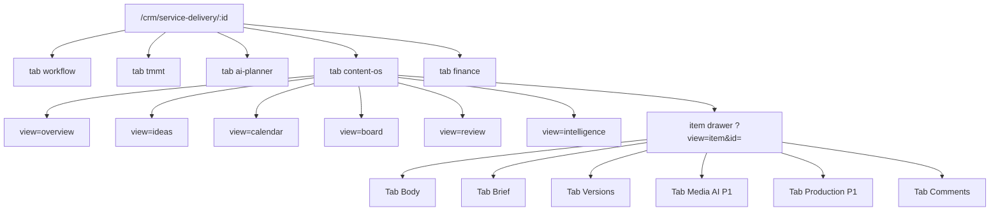

# Content Marketing OS — Integration & UX/UI Specification (Triển khai DV)

> **Document ID:** CMKT-INTEGRATION-SPEC-20260809  
> **Phiên bản:** 1.0 · **Ngày:** 2026-08-09  
> **Trạng thái:** Draft for UX kickoff & P0 implement  
> **Design spec:** [`superpowers/specs/2026-08-09-content-marketing-os-design.md`](../superpowers/specs/2026-08-09-content-marketing-os-design.md) (v1.4)  
> **Implementation plan:** [`superpowers/plans/2026-08-09-content-marketing-os-phase0-3.md`](../superpowers/plans/2026-08-09-content-marketing-os-phase0-3.md)  
> **Use cases:** [`use-cases/11-CONTENT-MARKETING.md`](../use-cases/11-CONTENT-MARKETING.md) · **Actions:** [`use-cases/actions/11-CMKT-ACTIONS.md`](../use-cases/actions/11-CMKT-ACTIONS.md)  
> **BA module:** [`modules/RNOSAI-BA-CMKT-UseCases.md`](./modules/RNOSAI-BA-CMKT-UseCases.md)  
> **Design system:** [`SPEC_UI_UX_PTT.md`](../SPEC_UI_UX_PTT.md) · [`2026-08-07-rnosai-competitive-win-ui-ux-design.md`](./2026-08-07-rnosai-competitive-win-ui-ux-design.md)  
> **Parent:** Planner tab `ai-planner` · SVC-UC-003 · service `tiep-thi-noi-dung`  
> **App:** `services/ops-web` · Tab `/crm/service-delivery/[id]?tab=content-os`

---

## Mục lục

1. [Tóm tắt & phạm vi UX](#1-tóm-tắt--phạm-vi-ux)
2. [Personas & UX goals](#2-personas--ux-goals)
3. [Information Architecture](#3-information-architecture)
4. [Screen inventory (SCR-CMKT)](#4-screen-inventory-scr-cmkt)
5. [Luồng end-to-end](#5-luồng-end-to-end)
6. [Wireframes P0](#6-wireframes-p0)
7. [Wireframes P1 — Media & bridges](#7-wireframes-p1--media--bridges)
8. [Wireframes P2 — Intelligence & video](#8-wireframes-p2--intelligence--video)
9. [Component map & states](#9-component-map--states)
10. [AI job UX](#10-ai-job-ux)
11. [Workflow & dual approval UX](#11-workflow--dual-approval-ux)
12. [Channel picker & badges](#12-channel-picker--badges)
13. [RBAC visibility matrix](#13-rbac-visibility-matrix)
14. [Responsive & a11y](#14-responsive--a11y)
15. [Backend contracts (FE)](#15-backend-contracts-fe)
16. [Acceptance criteria UX (EC-CMKT-UX)](#16-acceptance-criteria-ux-ec-cmkt-ux)
17. [Visual QA checklist](#17-visual-qa-checklist)

---

## 1. Tóm tắt & phạm vi UX

### 1.1. Mục tiêu

**Content Board** là tab EXECUTE trên lifecycle — biến TMMT/Planner snapshot thành **bài viết, caption, ảnh, video ngắn, lịch đăng** với workflow duyệt 2 lớp (text + visual). Không workspace SaaS riêng.

### 1.2. Quyết định UX (từ design spec)

| Quyết định | Lý do |
|------------|-------|
| Tab `content-os` trên service-delivery | Neo lifecycle + RACI retainer |
| Sub-nav 6 view: Overview, Ideas, Calendar, Board, Review, Intel | Một tab — không route CRM mới |
| Item **drawer** (không full page) | Giữ context board/calendar |
| Planner → **Import snapshot** banner | PLAN/EXECUTE tách biệt |
| Dual approval UI | Text approve (§22) → Media AI (§24) |
| Không auto-publish | Nút Publish = mark + URL manual |

### 1.3. Phạm vi UX theo phase

| Phase | Deliverable UI |
|-------|----------------|
| **P0** | Tab + 5 view (trừ Intel) + drawer + generate + review queue text |
| **P1** | Repurpose wizard, Production panel, Media Studio image, SEO/EM bridge chips |
| **P2** | Intelligence, video gen progress, client gate banner |
| **P3** | Portal summary read-only |

### 1.4. Out of scope UI

- Video editor timeline in-browser
- Auto-post OAuth Facebook/Zalo
- Standalone `/crm/content-hub` multi-lifecycle

---

## 2. Personas & UX goals

### 2.1. Personas

| Persona | Màn hình chính | Cap |
|---------|----------------|-----|
| **SP Writer** | Ideas, Board, Item drawer, Generate | `crm_content.write`, `generate` |
| **Lead SP** | Review, Calendar, Overview | `approve_internal`, `assign` |
| **QA** | Review queue | `qa`, `approve_internal` |
| **Designer / Video** | Production, Media (read) | `production` |
| **AM** | Overview (read), client gate | `crm_board.view` |

### 2.2. UX goals

| ID | Mục tiêu | Metric | Phase |
|----|----------|--------|-------|
| UX-CMKT-01 | Idea → draft AI ≤5 phút | Task time UAT | P0 |
| UX-CMKT-02 | Leader review queue ≤3 click approve | Click path | P0 |
| UX-CMKT-03 | Channel picker zero invalid pair | 0 API 400 from UI | P0 |
| UX-CMKT-04 | Job fail → retry giữ body | EC-CMKT-06 | P0 |
| UX-CMKT-05 | Visual approve trước publish (needs_visual) | Block toast rõ | P1 |
| UX-CMKT-06 | Media gen progress ≤90s perceived | Progress bar P2 video | P2 |

### 2.3. Nguyên tắc UX

1. **Cap-first** — ẩn Generate/Approve/Publish khi thiếu cap; tooltip tiếng Việt.
2. **Status visible** — badge màu trên card: draft, in_review, approved, scheduled, published.
3. **Channel legible** — icon + label `Facebook · social_post` (§12).
4. **Two gates obvious** — chip **Text ✓** / **Visual ○** trên card P1+.
5. **Job transparency** — giống MKT-AI job panel pattern.
6. **Vietnamese-first** — label VI; error `CMKT_*` map sang câu người dùng.
7. **PTT tokens** — `.card`, `.btn`, `var(--accent)` — không palette mới.

---

## 3. Information Architecture



**Query params:**

| Param | Values | Ghi chú |
|-------|--------|---------|
| `tab` | `content-os` | Bắt buộc |
| `view` | overview, ideas, calendar, board, review, intelligence, item, repurpose | |
| `id` | item id | Khi view=item |
| `import` | planner | Deep link ingest |
| `sla_breach` | 1 | Review queue filter |

---

## 4. Screen inventory (SCR-CMKT)

| SCR | Tên | Route | Phase | UC |
|-----|-----|-------|-------|-----|
| SCR-CMKT-001 | Content Board shell | `?tab=content-os` | P0 | 001 |
| SCR-CMKT-001a | Overview | `&view=overview` | P0 | 001 |
| SCR-CMKT-001b | Idea bank | `&view=ideas` | P0 | 004, 005 |
| SCR-CMKT-001c | Calendar | `&view=calendar` | P0 | 011 |
| SCR-CMKT-001d | Kanban Board | `&view=board` | P0 | 012 |
| SCR-CMKT-002 | Item drawer | `&view=item&id=` | P0 | 006…010 |
| SCR-CMKT-003 | Generate panel | drawer tab Body | P0 | 007, 008 |
| SCR-CMKT-004 | Repurpose wizard | `&view=repurpose` | P1 | 018 |
| SCR-CMKT-005 | Intelligence | `&view=intelligence` | P1 | 023 |
| SCR-CMKT-006 | Comments sidebar | drawer | P0 | 016 |
| SCR-CMKT-007 | Review queue | `&view=review` | P0 | 014, §22 |
| SCR-CMKT-008 | Media AI Studio | drawer tab Media | P1 | 035, 037 |
| SCR-CMKT-009 | Production handoff | drawer tab Production | P1 | 031…034 |
| SCR-CMKT-010 | Snapshot banner | top all views | P0 | 002 |
| SCR-CMKT-011 | Channel picker modal | create item | P0 | §12 |
| SCR-CMKT-012 | Bridge status chips | item drawer footer | P1 | 019, 020 |

---

## 5. Luồng end-to-end

### 5.1. Happy path retainer tháng (UAT)

```
Planner Apply TMMT
  → Content OS: Import snapshot (banner)
  → Lead: Ideas → assign tuần
  → SP: Create item → AI draft → Submit review
  → QA/Leader: Review queue → Approve text
  → SP: Media AI generate (P1) → Submit visual review
  → Leader: Approve visual
  → Calendar schedule → Publish + URL
```

### 5.2. Entry từ Planner

Toast sau Apply TMMT: **「Mở Content Board →」** link `?tab=content-os&view=ideas&import=planner`.

---

## 6. Wireframes P0

### 6.1. SCR-CMKT-010 — Snapshot banner (sticky)

```
┌──────────────────────────────────────────────────────────────┐
│ ⚡ Kế hoạch Planner · TMMT v2 · sealed · 4 pillars · 18 ideas │
│ [Import từ Planner]  [Xem diff]     Drift: — hoặc ⚠ đổi    │
└──────────────────────────────────────────────────────────────┘
```

| Element | Behavior |
|---------|----------|
| Import | POST ingest → toast ideas created |
| Drift | Hash mismatch → modal diff pillars/calendar |
| sealed | Leader admin only: Re-seal |

### 6.2. SCR-CMKT-001 — Shell + sub-nav

```
┌ Lifecycle #3 · tiep-thi-noi-dung ────────────────────────────┐
│ [Snapshot banner SCR-CMKT-010]                                │
├──────────────────────────────────────────────────────────────┤
│ [Overview][Ideas][Calendar][Board][Review·3][Intelligence]    │
├──────────────────────────────────────────────────────────────┤
│ {main view}                                                   │
└──────────────────────────────────────────────────────────────┘
```

**Review tab badge:** count `in_review` + red dot if SLA breach.

**Tab hidden when:** `NEXT_PUBLIC_CONTENT_MARKETING=0` OR slug not allowed OR no `crm_content.view`.

### 6.3. SCR-CMKT-001a — Overview

```
┌ KPI strip ───────────────────────────────────────────────────┐
│ Due tuần này: 5 │ In review: 3 │ Published MTD: 12 │ SLA: 1⚠ │
└──────────────────────────────────────────────────────────────┘
┌ Quick actions ───────────────────────────────────────────────┐
│ [+ Idea]  [Import Planner]  [Mở Review queue]                 │
└──────────────────────────────────────────────────────────────┘
┌ Pillars (mirror) ────────────────────────────────────────────┐
│ • Thought leadership (awareness) — 4 items                    │
│ • Product education (lead) — 6 items                          │
└──────────────────────────────────────────────────────────────┘
┌ Activity feed (optional P1) ─────────────────────────────────┐
│ SP Ng.A submitted "Checklist..." for review · 2h ago           │
└──────────────────────────────────────────────────────────────┘
```

### 6.4. SCR-CMKT-001b — Idea bank

| Column | Mô tả |
|--------|-------|
| Title | Click → convert to item |
| Pillar | Tag color by goal |
| Channels | Icons FB/LI/blog |
| Status | backlog / shortlisted / converted |
| Source | planner / manual / ai_batch |

**Toolbar:** Filter pillar, status · **[+ Idea]** · **[AI 30 ideas]** (P1, cap generate)

**Row actions:** Shortlist · Convert to item · Archive

### 6.5. SCR-CMKT-001d — Kanban Board

Columns (horizontal scroll mobile):

`Draft | In review | Changes | Approved | Scheduled | Published`

**Card (SCR card spec):**

```
┌─────────────────────────────┐
│ [FB] Checklist triển khai... │  ← channel icon + title truncate
│ social_post · lead            │
│ 👤 Ng.A  📅 12/08  [AI⟳]     │  ← assignee, due, job spinner
│ Text ✓ Visual ○               │  ← P1 dual gate chips
└─────────────────────────────┘
```

Click → open drawer. Drag between columns **disabled** P0 (status via workflow buttons only); P1 optional drag to schedule.

### 6.6. SCR-CMKT-001c — Calendar

- Week / Month toggle
- Items as chips on `scheduled_at`
- Color: pillar goal (awareness=#blue, lead=#green)
- Drag chip → PUT calendar slot
- Overdue: red border if `scheduled_at` < now && status=scheduled

### 6.7. SCR-CMKT-002 — Item drawer

**Width:** 720px desktop; full screen `<768px`

```
┌ [×]  Item #42 · In review ───────────────────────────────────┐
│ Facebook · social_post · Engagement · Pillar: Product ed.     │
│ Assign: SP [▼] QA [▼]     Due: [date]                          │
├ [Body][Brief][Variants][Versions][Comments] [Media][Prod] ────┤
│                                                                 │
│  (tab content)                                                  │
│                                                                 │
├ Workflow ──────────────────────────────────────────────────────┤
│ [Submit review] [Save draft]                                    │
│ Leader only: [Approve] [Request changes]                        │
│ After approve: [Schedule…] [Publish…] [→ SEO] [Copy caption]   │
└─────────────────────────────────────────────────────────────────┘
```

### 6.8. SCR-CMKT-003 — Generate panel (tab Body)

```
┌ AI Generate ─────────────────────────────────────────────────┐
│ Tone: [Professional friendly ▼]  Length: [Short ▼]            │
│ Goal: [Engagement ▼]   Variants: [3 ▼]                        │
│ [Generate draft]  [Regenerate]  [Rewrite with reason…]          │
├ Job status ────────────────────────────────────────────────────┤
│ ● Running draft_generate… 12s    [Cancel]                       │
│ ✓ Succeeded · v2 saved · [View diff]                            │
└────────────────────────────────────────────────────────────────┘
┌ Editor ──────────────────────────────────────────────────────┐
│ [markdown textarea / rich editor P1]                            │
└────────────────────────────────────────────────────────────────┘
```

### 6.9. SCR-CMKT-011 — Channel picker (create item)

```
┌ Tạo content item ──────────────────────────────────────────────┐
│ Kênh:     [Facebook ▼]                                          │
│ Format:   [Social post ▼]     ← options filtered §12 matrix     │
│ Pillar:   [Product education ▼]                                 │
│ Title:    [________________]                                    │
│ [Tạo & mở drawer]  [Hủy]                                        │
└─────────────────────────────────────────────────────────────────┘
```

Invalid pairs **disabled** in dropdown — never send to API.

### 6.10. SCR-CMKT-007 — Review queue

See design spec §22.4 wireframe.

**Approve modal:**

```
┌ Duyệt nội dung nội bộ ────────────────────────────────────────┐
│ Bạn xác nhận copy đã đạt brand voice và format kênh?            │
│ ☐ Đã kiểm tra CTA và hook                                       │
│ [Hủy]  [Xác nhận duyệt]                                         │
└─────────────────────────────────────────────────────────────────┘
```

**Reject modal:** Comment required min 10 chars + reason chips.

---

## 7. Wireframes P1 — Media & bridges

### 7.1. SCR-CMKT-008 — Media AI Studio

```
┌ Media AI ──────────────────────────────────────────────────────┐
│ Text: approved_internal ✓   Visual: ai_ready                   │
│ Preset [Corporate ▼]  Size [1080×1920 ▼]                      │
│ [Generate 3 images] [Generate carousel slides]                  │
├ Preview ───────────────────────────────────────────────────────┤
│ ┌──────┐ ┌──────┐ ┌──────┐                                    │
│ │DRAFT │ │DRAFT │ │DRAFT │  ← watermark until approved        │
│ └──────┘ └──────┘ └──────┘                                    │
│ Visual QA: 84/100 · Brand ✓ · Readable ✓                      │
├ Actions ───────────────────────────────────────────────────────┤
│ [Submit visual review] [Escalate to Design ▼] [Regenerate…]     │
└─────────────────────────────────────────────────────────────────┘
```

Disabled until text `approved_internal` (BR-CMKT-06) — tooltip giải thích.

### 7.2. SCR-CMKT-009 — Production panel

```
┌ Production ────────────────────────────────────────────────────┐
│ Phase: [awaiting_design ▼]                                      │
│ Designer [▼]  Video editor [▼]                                  │
│ [Export brief PDF] [Export script DOCX]                         │
│ Assets: [URL input +]  [Upload P1]                              │
│ Paid: [Link creative → /crm/creatives]                          │
│ [Mark production done]                                          │
└─────────────────────────────────────────────────────────────────┘
```

### 7.3. SCR-CMKT-004 — Repurpose wizard

Step 1: Chọn master item (blog approved)  
Step 2: Chọn targets (FB x3, LI x1, email x1)  
Step 3: Progress jobs → list derived items  
Step 4: **「Mở từng item để duyệt」** — không bulk approve

### 7.4. Bridge chips (footer drawer)

| Chip | States |
|------|--------|
| SEO | Not linked · Outlining · Drafting · Published |
| Email | Not linked · Draft campaign · Sent |
| Creative | Linked #id · Pending client · Approved |

Click → open `/seo/content/[id]` or `/email/campaigns/[id]` new tab.

---

## 8. Wireframes P2 — Intelligence & video

### 8.1. SCR-CMKT-005 — Intelligence

```
┌ Performance by channel ────────────────────────────────────────┐
│ Channel    │ Published │ Engagements │ Leads │ Trend          │
│ Facebook   │ 8         │ 1.2k        │ 12    │ ↑              │
│ Website    │ 4         │ GSC 890     │ 8     │ →              │
└──────────────────────────────────────────────────────────────┘
┌ AI suggestions ────────────────────────────────────────────────┐
│ • Viết thêm case study — cluster engagement cao                  │
│ • Giảm awareness post — lệch pillar lead target               │
└──────────────────────────────────────────────────────────────┘
```

### 8.2. Video generation progress

```
┌ Generating short video ────────────────────────────────────────┐
│ ████████░░░░░░░░ 45% · ~40s remaining                          │
│ Steps: Script ✓ · TTS ✓ · Clips ⟳ · Stitch ○                   │
│ [Cancel]                                                        │
└─────────────────────────────────────────────────────────────────┘
```

---

## 9. Component map & states

| Component | File | Responsibility |
|-----------|------|----------------|
| ContentOsPanel | `ContentOsPanel.tsx` | Tab entry, fetch context |
| ContentOsNav | `ContentOsNav.tsx` | Sub-nav + badges |
| ContentOsSnapshotBanner | `ContentOsSnapshotBanner.tsx` | Import/drift |
| ContentOsOverview | `ContentOsOverview.tsx` | KPI strip |
| ContentOsIdeaBank | `ContentOsIdeaBank.tsx` | Ideas table |
| ContentOsCalendar | `ContentOsCalendar.tsx` | DnD schedule |
| ContentOsKanban | `ContentOsKanban.tsx` | Board columns |
| ContentOsReviewQueue | `ContentOsReviewQueue.tsx` | §22 |
| ContentOsItemDrawer | `ContentOsItemDrawer.tsx` | Shell + tabs |
| ContentOsGeneratePanel | `ContentOsGeneratePanel.tsx` | AI draft |
| ContentOsVariantsPicker | `ContentOsVariantsPicker.tsx` | ≥3 variants |
| ContentOsChannelPicker | `ContentOsChannelPicker.tsx` | §12 matrix |
| ContentOsMediaStudio | `ContentOsMediaStudio.tsx` | §24 |
| ContentOsProductionPanel | `ContentOsProductionPanel.tsx` | §23 |
| ContentOsRepurposeWizard | `ContentOsRepurposeWizard.tsx` | §18 |
| ContentOsIntelligence | `ContentOsIntelligence.tsx` | §23 |
| content-os-api.ts | `lib/content-os-api.ts` | API client |
| content-marketing-flags.ts | `lib/content-marketing-flags.ts` | FE gates |

### 9.1. Item status colors

| status | CSS token | Label VI |
|--------|-----------|----------|
| draft | `--muted` | Nháp |
| in_review | `--warning` | Chờ duyệt |
| changes_requested | `--error` | Cần sửa |
| approved_internal | `--accent` | Đã duyệt nội bộ |
| pending_client | `--warning` | Chờ KH |
| scheduled | `--info` | Đã lên lịch |
| published | `--success` | Đã đăng |

---

## 10. AI job UX

| State | UI |
|-------|-----|
| queued | Gray chip "Xếp hàng…" |
| running | Spinner + elapsed + Cancel |
| succeeded | Green ✓ + link version diff |
| failed | Red + **Thử lại** + fallback template notice |
| cancelled | Muted |

Poll `GET /jobs/:id` every 2s; timeout 120s → offer retry.

**Empty OPENAI_KEY:** banner + rule-based template (BR-CMKT fallback).

---

## 11. Workflow & dual approval UX

| Gate | UI indicator | Block message |
|------|--------------|---------------|
| Text | Status ≥ approved_internal | "Gửi duyệt trước khi publish" |
| Visual P1 | visual_status=approved | "Duyệt visual trên tab Media AI" |
| Production P1 | production.phase=done | "Hoàn tất production handoff" |
| Client P1 | client_approved | "Chờ KH duyệt" |

---

## 12. Channel picker & badges

Icon map:

| channel | Icon key |
|---------|----------|
| website | `globe` |
| facebook | `facebook` |
| linkedin | `linkedin` |
| short_video | `video` |
| newsletter | `mail` |
| meta_ads | `megaphone` |

Tooltip hiển thị full matrix row từ §12.1 spec.

---

## 13. RBAC visibility matrix

| Element | view | write | generate | approve | production |
|---------|------|-------|----------|---------|------------|
| Tab Content OS | ✓ | — | — | — | — |
| Create item | — | ✓ | — | — | — |
| Generate AI | — | — | ✓ | — | — |
| Submit review | — | ✓ | — | — | — |
| Review tab | — | — | — | ✓/qa | — |
| Approve/Reject | — | — | — | ✓ | — |
| Media generate | — | — | ✓* | — | — |
| Production panel | — | — | — | — | ✓ |
| Publish | — | ✓** | — | — | — |

\* After text approved  
\*\* Cap `publish` or write + approved state

---

## 14. Responsive & a11y

| Breakpoint | Behavior |
|------------|----------|
| ≥1024px | Drawer 720px side panel |
| 768–1023px | Drawer 90% width |
| <768px | Drawer full screen; Kanban horizontal scroll |
| a11y | Focus trap drawer; aria labels on status badges |

---

## 15. Backend contracts (FE)

Base: `/api/crm/service-lifecycle/:lifecycleId/content-marketing`

See design spec §9 + integration types in `content-os-api.ts` (to implement).

Key types:

```typescript
type ContentOsContext = {
  ok: boolean;
  lifecycle_id: number;
  service_slug: string;
  snapshot?: { id: number; sealed: boolean; pillars_count: number };
  counts: { draft: number; in_review: number; published_mtd: number };
  flags: { media_enabled: boolean; client_gate: boolean };
  channel_defaults: string[];
};
```

---

## 16. Acceptance criteria UX (EC-CMKT-UX)

| ID | Criteria |
|----|----------|
| EC-CMKT-UX-01 | Tab hidden when flag off |
| EC-CMKT-UX-02 | Invalid channel/format not selectable |
| EC-CMKT-UX-03 | Approve disabled for SP role |
| EC-CMKT-UX-04 | Job failure shows retry without clearing editor |
| EC-CMKT-UX-05 | Review queue sorts SLA breach first |
| EC-CMKT-UX-06 | DRAFT watermark on AI images pre visual approve |
| EC-CMKT-UX-07 | Publish toast lists missing gate (text/visual/production) |
| EC-CMKT-UX-08 | Import planner deep link opens ideas + ingest modal |
| EC-CMKT-UX-09 | Mobile drawer usable read-only for AM |
| EC-CMKT-UX-10 | All labels Vietnamese on P0 screens |

---

## 17. Visual QA checklist

- [ ] Snapshot banner không che sub-nav
- [ ] Kanban card truncate title ≤2 lines
- [ ] Review badge count khớp API
- [ ] Generate spinner không block Save draft
- [ ] Error messages không hiện raw `CMKT_INVALID_CHANNEL_FORMAT`
- [ ] Dual gate chips ẩn khi P0 flags (text-only items)
- [ ] Media tab ẩn khi `PTT_CMKT_MEDIA_ENABLED=0`
- [ ] Dark mode tokens PTT consistent with service-delivery tabs

---

**End of UX/UI Integration Spec**
