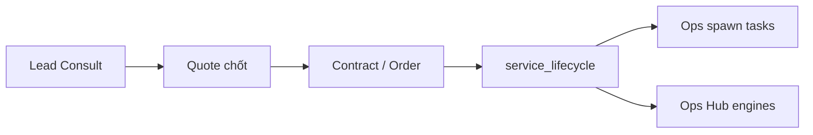

# PTT Ops System → RNOSAI — Đặc tả tích hợp chi tiết

**Date:** 2026-08-10  
**Version:** 1.0.0  
**Status:** Draft — baseline cho triển khai  
**Nguồn nghiệp vụ (đã đọc & trích xuất):**

| # | Tài liệu | Vai trò |
|---|----------|---------|
| 1 | `Thiet_ke_He_thong_Quan_ly_Van_hanh_PTT.docx` | Kiến trúc 5 module, luồng vận hành, 3 lớp AI, lộ trình 4 giai đoạn |
| 2 | `Dac_ta_Ky_thuat_SRS_PTT.docx` | User stories, FR, DDL 11 entity, REST API, wireframe, MVP acceptance |
| 3 | `Chuan_hoa_Du_lieu_Van_hanh_PTT.docx` | Single source of truth: 21 DV, quy trình tuần, KPI, bảng giá 3 gói, phụ thuộc |

**Tài liệu kỹ thuật RNOSAI liên quan:**

- `docs/specs/ops-dv01-dv21-route-map.json`
- `docs/superpowers/specs/2026-08-10-ptt-ops-dv-os-design.md`
- `docs/specs/2026-08-10-ptt-ops-dv-integration-spec.md`
- `docs/superpowers/plans/2026-08-10-ptt-ops-dv-ops-m0-milestone.md`

**Nguyên tắc kiến trúc:** Mở rộng RNOSAI (Nest `ptt-crm-api` + `ops-web`) — **không** greenfield app PTT Ops riêng. SRS entity map sang artifact hiện có; phần thiếu bổ sung qua **Ops Layer** + mở rộng module CRM.

---

## 1. Tóm tắt điều hành

### 1.1 Mục tiêu tích hợp

Biến RNOSAI thành **nền tảng vận hành PTT** đúng SRS: 21 dịch vụ chuẩn hóa, Service Instance tự sinh task/KPI, báo giá 3 gói, dashboard theo vai trò, AI 3 lớp — trong khi **giữ** pipeline B2B hiện có (Lead → Consult → Proposal → Lifecycle → Execution engines).

### 1.2 Ma trận phủ sóng hiện tại (ước lượng)

| Module SRS | RNOSAI hiện có | Mức phủ | Ghi chú |
|------------|----------------|---------|---------|
| **M1** Khách hàng & Dịch vụ | `crm_clients`, `service_lifecycle`, `crm_catalog_*`, presales funnel | **~75%** | Thiếu catalog DV đầy đủ, `package_tier`, auto-spawn task |
| **M2** Công việc & KPI | SOP, lifecycle tasks, `kpi`, staff-kpi, launch-qa | **~55%** | KPI staff ≠ KPI dịch vụ/lifecycle; chưa nhãn Đạt/Cần chú ý/Không đạt theo DV |
| **M3** Tài chính & Báo giá | `proposals`, `orders`, `invoices`, `svc-finance` | **~35%** | Proposal thủ công slug; **không** giá 3 gói từ catalog; AI generate stub |
| **M4** AI vận hành | Content OS, MKT-AI Planner, AI intelligence, churn | **~60%** | Thiếu Ops Agent (Lớp 2), RAG 21 DV, draft báo cáo KPI khách hàng |
| **M5** Dashboard | business-dashboard, owner-weekly, financials, kpi board | **~50%** | Chưa dashboard AM theo Service Instance + nhãn KPI DV |

### 1.3 Quyết định map entity SRS → RNOSAI

| Entity SRS | RNOSAI mapping | Hành động |
|------------|----------------|-----------|
| `Role` / `app_user` | `staff_auth`, RBAC caps, job functions | Giữ — bổ sung cap Ops/DV |
| `Client` | `crm_clients` / customers | Giữ |
| `Contract` | Lead contract + lifecycle metadata | Mở rộng — link quote chốt |
| `Service` (catalog DV01–21) | `crm_catalog_services` + **`ops_service_profile`** | **Mới** — seed từ Chuẩn hoá |
| `ServiceInstance` | **`service_lifecycle`** | Mở rộng `package_tier`, `dv_code` |
| `Task` | SOP tasks + lifecycle checklist + **`ops_weekly_checklist_item`** | Hợp nhất spawn từ template |
| `KPIRecord` | **`ops_kpi_record`** + bridge KPI module | **Mới** — per lifecycle/DV |
| `Quote` / `QuoteLineItem` | `crm_proposals` → mở rộng | **Refactor** — line items + tier |
| `Invoice` | `invoices` | Giữ — link contract/lifecycle |
| `AlertLog` | **`ops_alert_log`** (mới) | Phase 3 |
| `AILog` | `ai_agent_runs`, content audit | Mở rộng scope Ops |

---

## 2. Chuẩn dữ liệu cần nạp (từ Chuẩn hoá)

### 2.1 Cấu trúc mỗi DV (21 bản ghi)

Theo Phần 2.2 tài liệu Chuẩn hoá — map vào `ops_service_profile`:

| Field Chuẩn hoá | Cột / JSONB | Ghi chú |
|-----------------|-------------|---------|
| Mã DV01–DV21 | `dv_code` | UNIQUE |
| Tên dịch vụ | `name` | |
| Bộ phận phụ trách | `department` | 11 bộ phận SRS |
| Vai trò trong hệ thống | `role_in_system` TEXT | Phụ lục B |
| Phụ thuộc đầu vào | `depends_on_dv` JSONB | Phụ lục B — dùng gợi ý combo quote |
| Mô tả & giá trị | `description` | |
| Quy trình tuần | `weekly_process_template` JSONB | Sinh task — cấu trúc bảng tuần trong doc |
| KPI cam kết | `kpi_definitions` JSONB | `{ key, label, unit, target_by_tier? }` |
| Ngưỡng KPI | `kpi_thresholds` JSONB | Default: Đạt ≥100%, Cần chú ý 70–99%, Không đạt <70% |
| Bảng giá 3 gói | `tier_pricing` JSONB | CoBan / TieuChuan / ChuyenSau — min/max VND, scope, duration |
| Rủi ro | `risk_notes` TEXT | Input AI Lớp 1 KPI analysis |
| Slug lifecycle | `service_slug` + `service_slugs_json` | Route map |

### 2.2 Quy ước mã gói

| SRS | RNOSAI internal | UI label |
|-----|-----------------|----------|
| Cơ bản | `CoBan` / `basic` | Cơ bản |
| Tiêu chuẩn | `TieuChuan` / `standard` | Tiêu chuẩn |
| Chuyên sâu | `ChuyenSau` / `premium` | Chuyên sâu |

Alias trong API public: `basic` | `standard` | `premium` — map 1:1 khi đọc/ghi.

### 2.3 Ngưỡng KPI (BR-OPS-KPI-01)

```typescript
function kpiStatusLabel(actual: number, target: number): 'Dat' | 'CanChuY' | 'KhongDat' {
  if (target <= 0) return 'Dat';
  const pct = (actual / target) * 100;
  if (pct >= 100) return 'Dat';
  if (pct >= 70) return 'CanChuY';
  return 'KhongDat';
}
```

Team Lead có thể override ngưỡng per lifecycle (metadata) — không đổi catalog global (US-A02).

### 2.4 Seed pipeline

```
Chuan_hoa DOCX (structured extract)
    → scripts/extract_dv_catalog_from_docx.ts (one-time)
    → docs/specs/ops-dv-catalog-seed.json (canonical prices + templates)
    → scripts/seed_ops_dv_catalog.ts
    → ops_service_profile (21 rows)
    → crm_catalog_services.dv_code + slug
```

**Deliverable:** `ops-dv-catalog-seed.json` chứa đủ `tier_pricing` số tiền (hiện route map chỉ có tên tier, thiếu giá).

---

## 3. Module 1 — Khách hàng & Dịch vụ

### 3.1 Yêu cầu SRS & trạng thái RNOSAI

| FR | Mô tả | RNOSAI | Gap |
|----|-------|--------|-----|
| FR-1.1 | CRUD Client | ✅ customers, CRM leads | — |
| FR-1.2 | CRUD Contract | ⚠️ partial — lifecycle/lead contract | File HĐ đính kèm, link quote |
| FR-1.3 | Catalog 21 DV | ❌ | Seed + admin UI |
| FR-1.4 | Service Instance + auto task | ⚠️ lifecycle tạo tay | Auto spawn khi onboard |
| FR-1.5 | Lịch sử Instance/Client | ⚠️ service-delivery list | Filter theo dv_code, tier |

### 3.2 Luồng tích hợp đề xuất



**Khác SRS thuần:** RNOSAI đã có presales funnel — **không thay** bằng wizard Client mới; **mở rộng** handoff Proposal → Lifecycle.

### 3.2.1 INT-M1-01 — Catalog DV admin

**BE:** `GET/PUT /api/ops/catalog/:dvCode` (admin configure cap)  
**FE:** `/crm/catalog` tab **Dịch vụ DV** — list 21 DV, edit template/KPI/pricing (read-only cho non-admin)  
**Acceptance:** US-A02 — sửa catalog không ảnh hưởng lifecycle đã tạo

### 3.2.2 INT-M1-02 — Service Instance fields

**Extend `service_lifecycle`:**

```sql
ALTER TABLE service_lifecycle
  ADD COLUMN IF NOT EXISTS package_tier VARCHAR(20),
  ADD COLUMN IF NOT EXISTS dv_code VARCHAR(8),
  ADD COLUMN IF NOT EXISTS team_lead_staff_id INT;
```

**PATCH API:** `package_tier`, `dv_code` (auto từ slug resolver nếu null)  
**FE:** Lifecycle detail — badge gói + DV name

### 3.2.3 INT-M1-03 — Onboard → spawn tasks

Khi `stage` chuyển `onboard` hoặc `deliver` (configurable):

1. Resolve DV profile từ slug
2. `POST /api/ops/lifecycle/:id/spawn-week` (tuần 1) + spawn full template phases (M1 batch)
3. Gán Team Lead theo `department` → staff job function map

**BR-OPS-02:** Không spawn nếu status ∉ active/in_progress  
**Acceptance:** US-AM01 — tạo lifecycle + tasks trong 1 luồng

### 3.2.4 INT-M1-04 — Combo / phụ thuộc DV

**BE:** `GET /api/ops/catalog/:dvCode/dependencies`  
**FE:** Quote builder + Ops Hub — banner "Nên triển khai DV12, DV01 trước" (Phụ lục B)

---

## 4. Module 2 — Công việc & KPI

### 4.1 Yêu cầu SRS & trạng thái

| FR | Mô tả | RNOSAI | Gap |
|----|-------|--------|-----|
| FR-2.1 | Task theo Instance | ⚠️ SOP, lifecycle tasks | Template tuần chuẩn DV |
| FR-2.2 | Kanban task board | ⚠️ SOP page partial | Board filter lifecycle/DV |
| FR-2.3 | KPI Record theo kỳ | ❌ ops_kpi_record | Nhập actual vs target |
| FR-2.4 | Nhãn Đạt/Cần chú ý/Không đạt | ❌ | Tính tự động BR-OPS-KPI-01 |
| FR-2.5 | Alert KPI/deadline | ❌ | Phase 3 Ops Agent |

### 4.2 Cấu trúc `weekly_process_template`

Chuẩn hoá từ bảng "Quy trình triển khai theo tuần" mỗi DV:

```json
{
  "phases": [
    {
      "week_label": "Tuần 1-2",
      "tasks": [
        {
          "id": "DV02-T1-01",
          "title": "Xây content pillar, lập kế hoạch nội dung",
          "deliverable": "Kế hoạch content + lịch đăng",
          "owner_role": "TeamLead",
          "client_action": "Phê duyệt content pillar"
        }
      ]
    }
  ]
}
```

### 4.3 INT-M2-01 — Task spawn & lifecycle checklist

**Tables:** `ops_weekly_checklist_item` (M0 DDL), optional link `sop_task_id`  
**States:** `pending` | `in_progress` | `review` | `done` | `overdue`  
**FE:** Tab **Ops Hub → Tuần này** (`OpsWeeklyPanel`) — Ops-M1 plan  
**Acceptance:** US-TL01, US-SP01, US-SP02

### 4.4 INT-M2-02 — KPI Record per lifecycle

**API:**

| Method | Path | Mô tả |
|--------|------|-------|
| GET | `/api/ops/lifecycle/:id/kpi?period_type=&period_key=` | Lịch sử + nhãn |
| PUT | `/api/ops/lifecycle/:id/kpi` | Upsert metrics |
| POST | `/api/ops/lifecycle/:id/kpi/compute-labels` | Recompute status |

**Schema `ops_kpi_record`:** mỗi metric → row hoặc JSONB với computed `status_label`  
**FE:** Tab lifecycle **KPI DV** — chart actual vs target (FR-5.3 wireframe)  
**Bridge:** Engine metrics (Content OS posts, Meta insights) → import optional Phase 2

### 4.5 INT-M2-03 — Task board (Kanban)

**Route:** `/crm/ops/tasks` hoặc tab trong `/crm/sop`  
**Columns:** Chưa bắt đầu | Đang làm | Chờ duyệt | Hoàn thành  
**Filters:** assignee, dv_code, lifecycle_id, department  
**Acceptance:** SRS wireframe 6.3

### 4.6 INT-M2-04 — Deliverable upload

Reuse file storage pattern Content OS / creatives — `deliverable_url` on checklist item  
Max 25MB/file (US-SP02)

---

## 5. Module 3 — Tài chính & Báo giá

### 5.1 Yêu cầu SRS & trạng thái

| FR | Mô tả | RNOSAI | Gap |
|----|-------|--------|-----|
| FR-3.1 | Quote từ catalog + giá gói | ❌ | **Ưu tiên cao** |
| FR-3.2 | Export Quote PDF/docx | ❌ | Template brand PTT |
| FR-3.3 | Invoice từ Contract | ⚠️ invoices + orders | Link proposal tier |
| FR-3.4 | Báo cáo công nợ | ⚠️ financials partial | By client/DV |

### 5.2 Hiện trạng `proposals` module

- SQLite `crm_proposals`: `service_slugs[]`, `total_vnd` nhập tay
- Handoff presales: prefill slug + notes
- `generate()`: **stub AI**
- **Không có:** `quote_line_item`, `package_tier`, giá catalog, export

### 5.3 INT-M3-01 — Quote Builder (QuoteLineItem)

**DDL mới:**

```sql
CREATE TABLE IF NOT EXISTS crm_quote_line_item (
  id SERIAL PRIMARY KEY,
  proposal_id INT NOT NULL REFERENCES crm_proposals(id) ON DELETE CASCADE,
  dv_code VARCHAR(8) NOT NULL,
  package_tier VARCHAR(20) NOT NULL,
  reference_price_min NUMERIC,
  reference_price_max NUMERIC,
  final_price_vnd NUMERIC NOT NULL,
  scope_notes TEXT DEFAULT '',
  sort_order INT DEFAULT 0
);
ALTER TABLE crm_proposals
  ADD COLUMN IF NOT EXISTS status VARCHAR(30) DEFAULT 'draft',
  ADD COLUMN IF NOT EXISTS valid_until DATE,
  ADD COLUMN IF NOT EXISTS price_adjustment_reason TEXT;
```

**API:**

| Method | Path | Mô tả |
|--------|------|-------|
| POST | `/api/crm/proposals` | Body: `{ customer_id, lines: [{ dv_code, package_tier, final_price_vnd? }] }` — auto-fill reference từ catalog |
| GET | `/api/crm/proposals/:id/lines` | Line items |
| POST | `/api/crm/proposals/:id/export` | PDF/docx (FR-3.2) |
| PATCH | `/api/crm/proposals/:id/status` | draft → sent → accepted → rejected |

**FE:** Refactor `ProposalsContent.tsx` → wizard 4 bước (SRS wireframe 6.4):

1. Chọn khách hàng  
2. Chọn DV + gói (multi) — hiển thị giá tham khảo từ `tier_pricing`  
3. Chỉnh giá + lý do (audit log)  
4. Export / gửi  

**Acceptance:** US-AM02

### 5.4 INT-M3-02 — Quote chốt → Lifecycle

Khi `proposal.status = accepted`:

1. Tạo/update `service_lifecycle` per line item (slug từ dv_code)
2. Set `package_tier`, `dv_code`, `contract_amount` từ `final_price_vnd`
3. Trigger INT-M1-03 spawn tasks
4. Link `proposal.lifecycle_id` / order

**Acceptance:** US-AM01 end-to-end

### 5.5 INT-M3-03 — AI gợi ý combo báo giá (Lớp 1)

**API:** `POST /api/ops/ai/suggest-quote`  
**Input:** industry, budget_range, goals[]  
**Output:** suggested DV codes + tiers từ `depends_on_dv` + catalog  
**Acceptance:** FR-4.1 quote module (Thiết kế 7.1)

### 5.6 INT-M3-04 — Invoice & công nợ

Giữ `invoices` module — extend:

- `invoice.dv_code` optional tag for reporting
- Dashboard công nợ filter by AM (Row-level — INT-X-01)
- **Acceptance:** US-KT01

---

## 6. Module 4 — AI tham gia vận hành

### 6.1 Ba lớp AI (Thiết kế Phần 7)

| Lớp | SRS FR | RNOSAI | Tích hợp |
|-----|--------|--------|----------|
| **L1 Copilot** | FR-4.1, 4.2, 4.5 | Content OS generate, MKT-AI, summarize | Mở rộng scope |
| **L2 Ops Agent** | FR-4.3 | ❌ | Cron scan task/KPI → alert |
| **L3 Chatbot RAG** | FR-4.4 | ⚠️ ai-intelligence partial | RAG 21 DV docs |

### 6.2 INT-M4-01 — L1 Draft nội dung trong Task

Gắn nút "AI draft" trên `ops_weekly_checklist_item` / SOP task  
Reuse `content-generate` hoặc `ai-llm` với prompt profile theo `dv_code`  
**Acceptance:** FR-4.1

### 6.3 INT-M4-02 — L1 Draft báo cáo khách hàng

**API:** `POST /api/ops/lifecycle/:id/ai/draft-report?period_key=`  
**Input:** `ops_kpi_record` + task completion %  
**Output:** Markdown draft — AM review trước gửi (human gate)  
**Acceptance:** FR-4.2, Thiết kế 8 (AM review)

### 6.4 INT-M4-03 — L2 Ops Agent (Giai đoạn 3)

**Worker:** `@Cron('0 8 * * *')` Asia/Ho_Chi_Minh  
**Scan:**

- Task deadline < 2 ngày, status ∉ done
- KPI label `CanChuY` | `KhongDat`

**Output:** `ops_alert_log` + notify email/Zalo (config)  
**Acceptance:** US-AM04, FR-4.3

### 6.5 INT-M4-04 — L3 Chatbot nội bộ RAG 21 DV

**Corpus:** Chuẩn hoá extract + route map + SOP playbooks  
**API:** `POST /api/ops/ai/chat` — scope staff JWT  
**Acceptance:** FR-4.4

### 6.6 Content OS / MKT-AI alignment

| DV | Engine RNOSAI | Flag |
|----|---------------|------|
| DV02 | Content OS + MKT-AI | `PTT_CONTENT_MARKETING_*` |
| DV05 | SEO content | seo modules |
| DV04 | Meta/Google ads | meta/google modules |
| DV20 | Email marketing | email-os |

Ops Hub chỉ **deep-link** — không duplicate (design spec BR).

---

## 7. Module 5 — Báo cáo & Dashboard

### 7.1 Yêu cầu SRS

| FR | Dashboard | RNOSAI | Gap |
|----|-----------|--------|-----|
| FR-5.1 | Theo vai trò + RLS | ⚠️ business-dashboard | AM Instance view |
| FR-5.2 | Tiến độ task % | ❌ | Per lifecycle |
| FR-5.3 | KPI chart | ⚠️ kpi staff | KPI DV |
| FR-5.4 | Export PDF khách hàng | ❌ | + AI draft |

### 7.2 INT-M5-01 — Dashboard AM (Service Instance)

**API:** `GET /api/ops/dashboard/am`  
**Payload:** instances[] với `{ client, dv, tier, kpi_label, next_deadline, alerts_open }`  
**FE:** Extend `/crm/business-dashboard` hoặc tab mới **Vận hành DV**  
**Acceptance:** US-AM03 — RLS chỉ client AM phụ trách

### 7.3 INT-M5-02 — Dashboard Team Lead

Filter `department` + assignee group  
**Acceptance:** US-TL02

### 7.4 INT-M5-03 — Dashboard Specialist

**Route:** `/crm/my-tasks` — merge SOP + ops checklist  
**Acceptance:** US-SP01

### 7.5 INT-M5-04 — Executive dashboard

Aggregate: active instances, % Dat KPI, revenue from svc-finance  
**Acceptance:** US-A03 — < 3s với 200 instances (index + materialized view optional)

---

## 8. Ops Service Hub (lớp orchestration)

Hub là **điểm vào** Service Instance trên RNOSAI — tích hợp cross-module:

| Section Hub | Module | Milestone |
|-------------|--------|-----------|
| Header (client, DV, tier) | M1 | Ops-M0 |
| Engine grid (Content OS, SEO…) | M4 engines | Ops-M0 |
| Tuần này (checklist) | M2 | Ops-M1 |
| KPI tháng | M2 | Ops-M2 |
| Báo giá / HĐ | M3 | Ops-M3 |
| Cảnh báo | M4 L2 | Ops-M4 |
| Playbook / phụ thuộc DV | M1 | Ops-M1 |

**Route:** `/crm/service-delivery/:id?tab=ops-hub`  
**API:** `GET /api/ops/lifecycle/:id/hub`

---

## 9. Phân quyền & bảo mật (cross-cutting)

### 9.1 Map vai trò SRS → RNOSAI caps

| SRS Role | RNOSAI |
|----------|--------|
| Admin | `crm_board.configure`, catalog configure |
| AM | `crm_leads.*`, proposals, lifecycle view |
| Team Lead | `crm_sop.*`, ops spawn, kpi write |
| Specialist | task update own, no finance |
| Kế toán | invoices, proposals view, no KPI edit |

**INT-X-01:** Staff scope `crm_staff_assign_scope` filter ops catalog/hub theo `service_slug` (BR-OPS-07)

### 9.2 Audit log (Thiết kế Phần 12)

Ghi audit cho: quote price override, proposal accept, KPI label override, report send client

**Table:** `ops_audit_log (actor, action, entity, diff_json, at)`

---

## 10. Lộ trình tích hợp RNOSAI

Map SRS 4 giai đoạn → package RNOSAI:

| Giai đoạn SRS | Package RNOSAI | Nội dung | Thời gian ước lượng |
|---------------|----------------|----------|---------------------|
| **G1 MVP nội bộ** | **INT-P0** Ops-M0 + M1 catalog | Hub read-only, seed 21 DV, slug map | 2–3 tuần |
| **G1 (tiếp)** | **INT-P1** Ops-M1 + M2 | Spawn task, KPI record, labels | 2–3 tuần |
| **G2 Tài chính & AI L1** | **INT-P2** Ops-M3 Quote | Quote builder, export, lifecycle link | 3–4 tuần |
| **G2 (tiếp)** | **INT-P2b** AI L1 | Draft report, suggest quote combo | 2 tuần |
| **G3 AI L2 + Dashboard** | **INT-P3** | Ops Agent, alert center, dashboards đủ vai trò | 4–6 tuần |
| **G4 Portal KH** | **INT-P4** (optional) | Portal lifecycle KPI — reuse portal modules | 4 tuần |

### 10.1 Pilot DV (P0)

| DV | Lý do |
|----|-------|
| DV02 | Content OS + MKT-AI ready |
| DV05 | SEO retainer staging |
| DV04 | Ads partial |
| DV20 | Email partial |

### 10.2 Definition of Done — Giai đoạn 1 (MVP nội bộ SRS)

Theo SRS Phần 8 + mở rộng RNOSAI:

- [ ] 21 DV trong `ops_service_profile` với template + KPI + pricing
- [ ] Tạo lifecycle → spawn checklist tuần 1
- [ ] Nhập KPI → nhãn Đạt/Cần chú ý/Không đạt
- [ ] Ops Hub pilot 4 DV
- [ ] Dashboard AM cơ bản (instance list + KPI label)
- [ ] Không regression CRM funnel + Content OS M16

### 10.3 Definition of Done — Giai đoạn 2 (Tài chính)

- [ ] Quote wizard chọn DV + gói → giá catalog
- [ ] Export PDF/docx
- [ ] Proposal accepted → lifecycle + tier
- [ ] Invoice link contract

---

## 11. API namespace tổng hợp

| Prefix | Module | Ghi chú |
|--------|--------|---------|
| `api/crm/*` | CRM hiện có | Giữ backward compatible |
| `api/ops/*` | Ops Layer mới | Catalog, hub, kpi, spawn, dashboard |
| `api/crm/proposals/*` | Mở rộng quote | Line items, export |
| `api/ops/ai/*` | AI Ops | suggest-quote, draft-report, chat |

Không dùng `/api/v1` thuần SRS — RNOSAI convention `api/crm` + `api/ops`.

---

## 12. Artifact cần tạo (implementation backlog)

| # | Artifact | Owner |
|---|----------|-------|
| 1 | `docs/specs/ops-dv-catalog-seed.json` | Data — extract từ Chuẩn hoá |
| 2 | `docs/specs/2026-08-10-postgresql-ddl-ptt-ops-quote.sql` | BE |
| 3 | `scripts/extract_dv_catalog_from_docx.ts` | Data |
| 4 | `docs/specs/2026-08-10-ptt-ops-quote-integration-spec.md` | Spec M3 detail |
| 5 | `docs/specs/2026-08-10-ptt-ops-kpi-integration-spec.md` | Spec M2 detail |
| 6 | Ops module (M0 plan) | BE |
| 7 | Quote wizard FE | FE |
| 8 | `scripts/smoke_ops_dv_full.sh` | QA |

---

## 13. Rủi ro & giảm thiểu

| Rủi ro | Giảm thiểu |
|--------|------------|
| Trùng entity Proposal vs Quote SRS | Mở rộng `crm_proposals` + line items — không bảng quote song song |
| KPI staff vs KPI DV | Tách `ops_kpi_record`; dashboard rõ label |
| Giá catalog lệch thực tế | `reference_*` vs `final_price` + audit reason |
| 21 DV quá lớn | Pilot P0 + readiness gate trong route map |
| AI gửi nhầm ra client | Human approve gate trước export/send (BR-AI-01) |

---

## 14. Tham chiếu chéo

| Tài liệu | Mục đích |
|----------|----------|
| `ops-dv01-dv21-route-map.json` | Slug, routes, readiness |
| `2026-08-10-ptt-ops-dv-os-design.md` | Ops Layer architecture |
| `2026-08-10-ptt-ops-dv-ops-m0-milestone.md` | Coding plan M0 |
| Extracts: `docs/specs/_source-extracts/*.txt` | Raw text từ 3 DOCX |

---

**Next steps đề xuất:**

1. Chạy extract giá + template đầy đủ → `ops-dv-catalog-seed.json`  
2. Implement **Ops-M0** (catalog + hub)  
3. Song song spec chi tiết **INT-M3 Quote** nếu ưu tiên Báo giá trước KPI  
