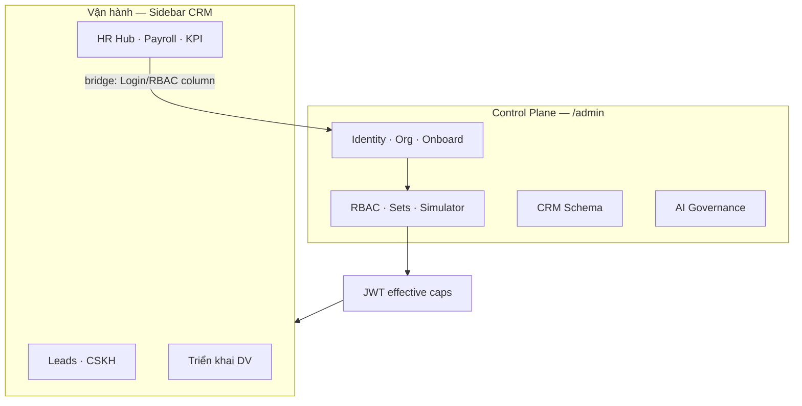
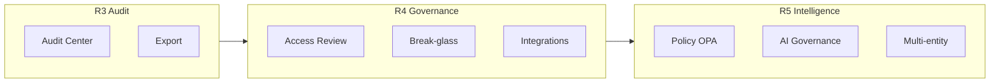

# Admin Control Plane — Information Architecture & Competitive Roadmap

> **Document ID:** ADMIN-CP-IA-20260811  
> **Phiên bản:** 1.0 · **Ngày:** 2026-08-11  
> **Trạng thái:** Design for implementation — chờ PO / IT / HR sign-off  
> **Audience:** PO, IT Admin, HR Ops, Security, Engineering  
> **App:** `ops-web` · **API:** `ptt-crm-api`  
> **Parent:** [`2026-08-07-rnosai-competitive-win-master-spec.md`](./2026-08-07-rnosai-competitive-win-master-spec.md) §6–7  
> **Related:** [`2026-08-07-rbac-hr-org-job-function-ui-ux-design.md`](./2026-08-07-rbac-hr-org-job-function-ui-ux-design.md) · [`2026-08-07-rnosai-competitive-win-ui-ux-design.md`](./2026-08-07-rnosai-competitive-win-ui-ux-design.md) §5.3 · [`../runbooks/rbac-hr-org-workflow.md`](../runbooks/rbac-hr-org-workflow.md)

---

## Mục lục

1. [Executive summary](#1-executive-summary)
2. [Vấn đề as-is](#2-vấn-đề-as-is)
3. [Định vị cạnh tranh](#3-định-vị-cạnh-tranh)
4. [Nguyên tắc thiết kế Control Plane](#4-nguyên-tắc-thiết-kế-control-plane)
5. [Target Information Architecture](#5-target-information-architecture)
6. [Admin Shell & navigation SSoT](#6-admin-shell--navigation-ssot)
7. [Personas & entry points](#7-personas--entry-points)
8. [Route map đầy đủ](#8-route-map-đầy-đủ)
9. [Cross-cutting UX patterns](#9-cross-cutting-ux-patterns)
10. [Bridge HR roster ↔ Identity admin](#10-bridge-hr-roster--identity-admin)
11. [Cap gating & fail-closed](#11-cap-gating--fail-closed)
12. [Lộ trình triển khai P0 → P3](#12-lộ-trình-triển-khai-p0--p3)
13. [Roadmap nâng cao R3 → R5 (thắng cao đối thủ)](#13-roadmap-nâng-cao-r3--r5-thắng-cao-đối-thủ)
14. [Scorecard vs đối thủ](#14-scorecard-vs-đối-thủ)
15. [KPI & exit criteria](#15-kpi--exit-criteria)
16. [File checklist & refactor map](#16-file-checklist--refactor-map)
17. [QA & UAT map](#17-qa--uat-map)
18. [Governance & sign-off](#18-governance--sign-off)

---

## 1. Executive summary

RNOSAI đã ship đủ backend và trang admin (`/admin/crm/*`, `/admin/ai/*`) nhưng **Information Architecture (IA) chưa có Control Plane thống nhất**. Admin bị rải trong sidebar vận hành → IT/HR mất thời gian tìm trang, demo kém chuyên nghiệp so HubSpot Settings / Salesforce Setup.

**Đề xuất:** Tạo zone **Quản trị hệ thống** (`/admin`) — launcher + left rail persistent — tách hẳn khỏi CRM vận hành, đồng bộ một nguồn nav SSoT.

**Mục tiêu đo lường:**

| Metric | As-is | Target P1 | Target R5 |
|--------|-------|-----------|-----------|
| Time-to-find “tạo user” | 5–10 ph | ≤30 giây | ≤10 giây (search) |
| Onboard NV end-to-end | Không rõ luồng | ≤15 ph (wizard) | ≤10 ph + auto-UAT |
| IT checklist deal 100+ NV | Partial | Pass RBAC demo | Pass audit + access review |
| User confusion roster vs login | Cao | Callout + bridge column | Single identity graph |

**Pitch sau khi ship P1:**

> *Getfly trộn HRM và quyền. HubSpot tách Settings nhưng generic. RNOSAI có **Control Plane agency-grade**: onboard 15 phút, effective caps preview, offboard an toàn, audit-ready.*

---

## 2. Vấn đề as-is

### 2.1. Sidebar (`OpsNav.tsx`) — phân mảnh

| Nhóm sidebar hiện tại | Link admin | Thiếu |
|------------------------|------------|-------|
| **Cấu hình CRM** | custom-fields, pipeline, lead-lookups | permissions, org/*, permission-sets |
| **AI & Automation** | `/admin/ai/*` | Không thuộc “setup” mental model |
| **Nhân sự & Hiệu suất** | `/crm/hr`, `/crm/staff` | org/users chỉ qua URL / link nhỏ |

**Không có** section tên Admin / Quản trị / Settings.

### 2.2. Ba lớp navigation không đồng bộ

```
OpsNav sidebar          → thiếu nhiều route admin
AdminPageShell ModuleSubNav → buildCrmConfigModuleLinks (4 link)
admin/crm/layout.tsx    → 3 nhóm Dữ liệu | Phân quyền | Tổ chức (đúng spec WIN-2)
hr-hub.ts               → org-users badge "R2-HR planned" dù đã ship
```

User vào admin qua 4 con đường khác nhau → **không professional**.

### 2.3. Feature flag vs UX

`NEXT_PUBLIC_WIN_ORG_UI=1` bật route `/admin/crm/org/*` nhưng **sidebar không reflect** → redirect / URL trực tiếp là cách duy nhất.

### 2.4. Hai workspace HR bị trộn

| Workspace | Mục đích | Route đúng |
|-----------|----------|------------|
| **HR vận hành** | Roster, import, payroll | `/crm/staff`, `/crm/payroll` |
| **Identity admin** | Login, RBAC, onboard, offboard | `/admin/crm/org/users` |

As-is: user nghĩ `/crm/staff` = quản lý user đầy đủ → **gap kỳ vọng**.

---

## 3. Định vị cạnh tranh

### 3.1. Ba tầng thắng (từ WIN Master §1.2)

| Tầng | Admin Control Plane đóng góp |
|------|------------------------------|
| **T1 Table stakes** | Sidebar Settings rõ; onboard/offboard; org CRUD |
| **T2 Moat agency** | Client scope pilot, job function add-on, effective caps |
| **T3 Enterprise** | SSO, simulator, audit, access review, break-glass |

### 3.2. So sánh pattern đối thủ

| Capability | Getfly / Base VN | HubSpot | Salesforce | **RNOSAI target** |
|------------|------------------|---------|------------|-------------------|
| Settings zone tách biệt | ⚠️ Trộn menu | ✅ Settings app | ✅ Setup | ✅ `/admin` Control Plane |
| User + permission cùng flow | ⚠️ Basic | ✅ Users & Teams | ✅ Users + Profiles | ✅ UserIdentityCard |
| Effective permission preview | ❌ | ⚠️ Limited | ✅ Permission sets | ✅ EffectiveCapsPreview |
| SoD trước save | ❌ | ❌ | ✅ (enterprise) | ✅ WinSodBanner |
| Offboard + reassign | ⚠️ Khóa user | ⚠️ | ✅ | ✅ Offboard wizard |
| Org chart | ❌ | ❌ | ✅ | ✅ WIN-H-05 |
| AI agent governance | ❌ | ⚠️ | ⚠️ | ✅ Admin AI Platform workspace |
| Quarterly access review | ❌ | ✅ (enterprise) | ✅ | 🔜 R4 |
| Policy simulator | ❌ | ❌ | ✅ | ✅ `/permissions/simulator` |
| Audit export | ⚠️ Log cơ bản | ✅ | ✅ | 🔜 R3 Audit Center |

### 3.3. Differentiator narrative (sales)

1. **Agency context** — client scope, caps theo retainer, không chỉ “role CRM”.
2. **4-layer identity** — Org → crm_staff → position+function → staff_users → JWT.
3. **Fail-closed UX** — ẩn nav theo cap; không silent escalation.
4. **Re-login contract** — mọi PATCH quyền → toast bắt buộc re-login.

---

## 4. Nguyên tắc thiết kế Control Plane

1. **Setup ≠ Operate** — Admin không nằm cạnh Lead/KPI/Email trên sidebar vận hành.
2. **One front door** — `/admin` hub; deep link vẫn hoạt động.
3. **One nav SSoT** — `buildAdminNav(user)` feed OpsNav, AdminShell, breadcrumbs.
4. **Hub-before-deep** — Launcher cards trước matrix/table (reuse WIN pattern `/crm/hr`).
5. **Progressive disclosure** — List → drawer → wizard; matrix full-width khi cần.
6. **Vietnamese-first** — Label VI; code (`MKT-02`, `content`) monospace muted.
7. **No half-shipped UI** — Bỏ badge “planned” khi route đã live + flag on.
8. **Cap-first** — Ẩn card/link; trang read-only khi thiếu `.configure`.
9. **Audit by default** — Subtitle + panel nhắc PostgreSQL audit trail (R3 full).
10. **Mobile admin** — Drawer nav; matrix horizontal scroll (≥960px breakpoint).

---

## 5. Target Information Architecture

### 5.1. Site-level sidebar (OpsNav)

**Thay** section `Cấu hình CRM` + gỡ `/admin/ai/*` khỏi `AI & Automation`.

**Thêm** (cap-gated):

```
⚙ Quản trị hệ thống
   └── Trung tâm quản trị    → /admin
```

Hiển thị khi user có **≥1** cap trong:

- `crm_data_config.view`
- `crm_staff_departments.view`
- `crm_staff_roster.view` + route org (WIN_ORG_UI)
- `ai_admin.view`

**Giữ nguyên** `Nhân sự & Hiệu suất` cho vận hành: HR Hub, staff roster, payroll, KPI — **không** duplicate org/users.

### 5.2. Admin Hub `/admin`

Launcher 2×3 grid (responsive), pattern `hub-module-grid`:

| Card | Mô tả | Entry chính | Cap |
|------|-------|-------------|-----|
| **Nhân sự & Tổ chức** | Roster, org, onboard | `/admin/crm/org/users` | org caps |
| **Phân quyền & Bảo mật** | Matrix, functions, sets | `/admin/crm/permissions` | `crm_data_config.view` |
| **Dữ liệu CRM** | Fields, pipeline, lookups | `/admin/crm/custom-fields` | `crm_data_config.view` |
| **AI Platform** | Agents, tools, runs | `/admin/ai/agents` | `ai_admin.view` |
| **Tích hợp & SSO** | Keycloak groups, webhooks | `/admin/crm/sso/groups` | flag + cap |
| **Audit & Tuân thủ** | Activity, export (R3) | `/admin/audit` | R3 |

Cards thiếu cap → **ẩn hoàn toàn** (không disabled grey — tránh leak surface).

**Header hub:** Global search admin routes (P3) · link “Tài liệu IT” → runbook.

### 5.3. Admin workspace left rail

Persistent khi pathname match `/admin/*` hoặc bridge mode `/crm/staff?admin=1` (optional P2).

```
Quản trị hệ thống
├── Nhân sự & Tổ chức
│   ├── Hồ sơ roster          /crm/staff
│   ├── Người dùng            /admin/crm/org/users
│   ├── + Onboard NV          /admin/crm/org/users/new
│   ├── Phòng ban             /admin/crm/org/departments
│   ├── Team                  /admin/crm/org/teams
│   ├── Chức vụ (HR)          /admin/crm/org/positions
│   └── Sơ đồ tổ chức           /admin/crm/org/chart
├── Phân quyền
│   ├── Ma trận chức vụ       /admin/crm/permissions
│   ├── Job function          /admin/crm/permissions/functions
│   ├── Gán user              /admin/crm/permissions/users
│   ├── Permission Sets       /admin/crm/permission-sets
│   ├── SSO groups            /admin/crm/sso/groups
│   ├── Simulator             /admin/crm/permissions/simulator
│   └── Field ABAC            /admin/crm/permissions/fields
├── Dữ liệu CRM
│   ├── Custom fields         /admin/crm/custom-fields
│   ├── Pipeline sales        /admin/crm/pipeline
│   └── Nguồn & Kênh          /admin/crm/lead-lookups
└── AI Platform
    ├── Agents                /admin/ai/agents
    ├── Tools                 /admin/ai/tools
    └── Runs                  /admin/ai/runs
```

Group labels: uppercase 0.68rem, divider giữa group (reuse `admin-crm-subnav--grouped`).

### 5.4. Mental model diagram



---

## 6. Admin Shell & navigation SSoT

### 6.1. Component mới

| Component | Path | Vai trò |
|-----------|------|---------|
| `AdminHubPage` | `app/admin/page.tsx` | Launcher cards |
| `AdminShell` | `components/admin/AdminShell.tsx` | Layout: left rail + breadcrumb |
| `AdminLeftRail` | `components/admin/AdminLeftRail.tsx` | Grouped links từ SSoT |
| `buildAdminNav` | `lib/admin/admin-nav.ts` | **Single source of truth** |

### 6.2. Deprecate / merge

| As-is | Target |
|-------|--------|
| `AdminPageShell` ModuleSubNav | `AdminShell` left rail (giữ PageToolbar) |
| `admin/crm/layout.tsx` subnav | Merge vào `AdminLeftRail` — **một** subnav |
| `buildCrmConfigModuleLinks` | Subset of `buildAdminNav` |
| `OpsNav` config section | Replace bằng link `/admin` |
| `hr-hub` org-users planned card | Link live `/admin/crm/org/users` |

### 6.3. Breadcrumb convention

```
Quản trị hệ thống → {Workspace} → {Page title}
```

Ví dụ: `Quản trị → Nhân sự & Tổ chức → Người dùng`

Bridge roster: `Quản trị → Nhân sự & Tổ chức → Hồ sơ roster`

### 6.4. Feature flags

| Flag | Ảnh hưởng nav |
|------|----------------|
| `NEXT_PUBLIC_WIN_ORG_UI=1` | Hiện group Tổ chức |
| `NEXT_PUBLIC_WIN_PERMISSION_SETS=1` | Permission Sets link |
| `NEXT_PUBLIC_WIN_SIMULATOR=1` | Simulator link |
| `NEXT_PUBLIC_WIN_SSO=1` | SSO groups link |
| `NEXT_PUBLIC_WIN_FIELD_ABAC=1` | Field ABAC link |

Nav builder đọc flags — **không** redirect mù (fix org layout redirect pattern).

---

## 7. Personas & entry points

| Persona | Primary entry | Top tasks | Không thấy |
|---------|---------------|-----------|------------|
| **System Admin / IT** | `/admin` → Phân quyền | Matrix, sets, SSO | payroll |
| **HR Ops** | `/admin` → Người dùng | Onboard, offboard, org | matrix configure |
| **PO / Security** | `/admin` → Simulator, Audit | Export, SoD review | org CRUD |
| **Trưởng phòng** | `/crm/staff` (view) | Team roster | admin configure |
| **NV thường** | — | Self payslip, leave | mọi `/admin/*` |

**Shortcut (không thay front door):**

- HR Hub card → deep link workspace tương ứng
- Global search → admin routes (P3)
- `/crm/staff` → Cấu hình quyền per row

---

## 8. Route map đầy đủ

### 8.1. Shipped routes (baseline)

| Route | Workspace | Shell |
|-------|-----------|-------|
| `/admin` | Hub | **NEW** AdminShell |
| `/admin/crm/custom-fields` | Dữ liệu | AdminShell |
| `/admin/crm/pipeline` | Dữ liệu | AdminShell |
| `/admin/crm/lead-lookups` | Dữ liệu | AdminShell |
| `/admin/crm/permissions` | Phân quyền | AdminShell |
| `/admin/crm/permissions/functions` | Phân quyền | AdminShell |
| `/admin/crm/permissions/users` | Phân quyền | AdminShell |
| `/admin/crm/permissions/simulator` | Phân quyền | AdminShell |
| `/admin/crm/permissions/fields` | Phân quyền | AdminShell |
| `/admin/crm/permission-sets` | Phân quyền | AdminShell |
| `/admin/crm/sso/groups` | Tích hợp | AdminShell |
| `/admin/crm/org/*` | Tổ chức | AdminShell |
| `/admin/ai/agents` | AI Platform | AdminShell |
| `/admin/ai/tools` | AI Platform | AdminShell |
| `/admin/ai/runs` | AI Platform | AdminShell |
| `/crm/staff` | Bridge roster | AdminShell (optional chrome) |

### 8.2. Future routes (R3+)

| Route | Phase | Mô tả |
|-------|-------|-------|
| `/admin/audit` | R3 | Audit center |
| `/admin/audit/access-reviews` | R4 | Campaign duyệt quyền |
| `/admin/integrations` | R4 | Webhook, API keys, Meta/Zalo connectors |
| `/admin/policies` | R5 | OPA / business rules UI |
| `/admin/environments` | R5 | Staging vs prod config diff |
| `/admin/ai/policies` | R5 | Agent tool allowlist, budget caps |

---

## 9. Cross-cutting UX patterns

| Pattern | Component | Rule |
|---------|-----------|------|
| SoD before save | `WinSodBanner` | Disable Lưu + rule ID |
| Re-login after PATCH | `WinReloginToast` | Mọi caps/org change |
| Diff preview | `WinDiffChip` | +N / -M caps trước save |
| Identity card | `UserIdentityCard` | 1 card / user drawer |
| Onboard wizard | `WinWizardSteps` | 4 bước ≤15 ph |
| Offboard wizard | Modal flow | Reassign → deactivate |
| Empty state | `WinEmptyState` | CTA “+ Onboard NV” |
| Planned feature | `win-planned-card` | **Chỉ** khi route chưa ship |

---

## 10. Bridge HR roster ↔ Identity admin

### 10.1. Callout đầu tab Roster

> *Hồ sơ nhân viên (crm_staff) khác tài khoản đăng nhập. Tạo login và phân quyền tại **Quản trị → Người dùng**.*

Link: `/admin/crm/org/users`

### 10.2. Cột mới: Login / RBAC

| Giá trị | Badge | Action |
|---------|-------|--------|
| Có login active | `Hoạt động` | Cấu hình quyền |
| Chưa có staff_users | `Chưa có TK` | Onboard |
| Offboarded | `Ngưng` | — |

Deep link: `/admin/crm/org/users?email={email}`

### 10.3. StaffEditDrawer

Giữ link **Quản trị → Người dùng**; đổi copy từ “Admin org users” → **Cấu hình tài khoản & quyền**.

---

## 11. Cap gating & fail-closed

### 11.1. Workspace visibility

```typescript
// lib/admin/admin-nav.ts — pseudocode
function canViewAdminHub(user): boolean {
  return (
    hasCap(user, 'crm_data_config', 'view') ||
    hasCap(user, 'crm_staff_departments', 'view') ||
    hasCap(user, 'crm_staff_roster', 'view') ||
    hasCap(user, 'ai_admin', 'view')
  );
}
```

### 11.2. Configure vs view

| Action | Cap pattern |
|--------|-------------|
| Xem matrix | `crm_data_config.view` |
| Sửa matrix | `crm_data_config.configure` |
| Onboard user | `crm_staff_roster.edit` + org |
| Offboard | `crm_data_config.configure` or dedicated |

### 11.3. 403 page

Copy: `Cần quyền {section}.{action} — liên hệ Quản trị hệ thống`

---

## 12. Lộ trình triển khai P0 → P3

### P0 — Quick win (1–2 ngày)

**Goal:** Sidebar phản ánh admin thực tế; không cần `/admin` hub.

| ID | Task | Files |
|----|------|-------|
| P0-1 | Thêm section `Quản trị hệ thống` với links đầy đủ | `OpsNav.tsx` |
| P0-2 | Gỡ `/admin/ai/*` khỏi AI & Automation | `OpsNav.tsx` |
| P0-3 | Sync `buildCrmConfigModuleLinks` + permissions + org links | `module-nav.ts` |
| P0-4 | HR Hub: bỏ planned badge org-users; link live | `hr-hub.ts` |
| P0-5 | Docs huong-dan §01 cập nhật entry | `docs/huong-dan-su-dung/` |

**Exit:** IT tìm `/admin/crm/org/users` từ sidebar ≤30 giây.

### P1 — Admin Hub + Shell (3–5 ngày) ✅ Shipped `49e5ed8`

| ID | Task | Files |
|----|------|-------|
| P1-1 | `app/admin/page.tsx` hub launcher | new |
| P1-2 | `AdminShell` + `AdminLeftRail` | new components |
| P1-3 | `buildAdminNav` SSoT | `lib/admin/admin-nav.ts` |
| P1-4 | Wrap admin routes với AdminShell | `AdminPageShell` (no separate layout) |
| P1-5 | Deprecate duplicate subnav trong `admin/crm/layout.tsx` | merge |
| P1-6 | Redirect `/admin/crm/org` → users | `org/page.tsx` |

**Plan chi tiết:** [`docs/superpowers/plans/2026-08-11-admin-control-plane-p1.md`](../superpowers/plans/2026-08-11-admin-control-plane-p1.md)

**Exit:** Demo script “Settings tour” 5 phút không lộ URL.

### P2 — HR bridge (2–3 ngày) ✅ Shipped `2ce8544`

| ID | Task |
|----|------|
| P2-1 | Roster callout + Login/RBAC column |
| P2-2 | StaffEditDrawer copy + deep link |
| P2-3 | Optional: `/crm/staff` admin chrome khi from `/admin` |

**Plan chi tiết:** [`docs/superpowers/plans/2026-08-11-admin-control-plane-p2.md`](../superpowers/plans/2026-08-11-admin-control-plane-p2.md)

**Exit:** HR UAT onboard 2-step flow pass.

---

## Bước tiếp P3

| Wave | Nội dung | Plan |
|------|----------|------|
| **P3** | Admin search, mobile drawer, a11y, E2E onboard | [`2026-08-11-admin-control-plane-p3.md`](2026-08-11-admin-control-plane-p3.md) |

**Spec đầy đủ:** [`2026-08-11-admin-control-plane-ia.md`](../specs/2026-08-11-admin-control-plane-ia.md) §12–13.

### P3 — Polish (3–5 ngày)

| ID | Task |
|----|------|
| P3-1 | Admin route search in GlobalSearchBar |
| P3-2 | Mobile drawer for AdminLeftRail |
| P3-3 | axe a11y `/admin` ≥90 |
| P3-4 | E2E: sidebar → onboard wizard smoke |

**Plan chi tiết:** [`docs/superpowers/plans/2026-08-11-admin-control-plane-p3.md`](../superpowers/plans/2026-08-11-admin-control-plane-p3.md)

---

## Bước tiếp R5

| Wave | Nội dung | Plan |
|------|----------|------|
| **R3** | Audit Center, export, drift, PII log | [`2026-08-11-admin-control-plane-r3.md`](2026-08-11-admin-control-plane-r3.md) ✅ |
| **R4** | Access review, stale, guest TTL, integrations | [`2026-08-11-admin-control-plane-r4.md`](2026-08-11-admin-control-plane-r4.md) ✅ |
| **R5** | Policy simulator v2, OPA UI, env diff, AI governance, 2-person approval | [`2026-08-11-admin-control-plane-r5.md`](2026-08-11-admin-control-plane-r5.md) |

**Spec đầy đủ:** [`2026-08-11-admin-control-plane-ia.md`](../specs/2026-08-11-admin-control-plane-ia.md) §13–15.

---

## 13. Roadmap nâng cao R3 → R5 (thắng cao đối thủ)

Phần này mở rộng **vượt T1/T2** — nhắm **T3 Enterprise** và moat dài hạn. Không ship trong P0–P3.

### R3 — Audit & Compliance Center (Q4)

**Mục tiêu:** Thắng HubSpot enterprise checklist; unblock deal IT 100+ NV.

| Feature | Mô tả | Đối thủ |
|---------|-------|---------|
| **Audit Center** `/admin/audit` | Timeline mọi thay đổi RBAC/org/user | Getfly ❌ · HubSpot ✅ |
| **Filter & export** | CSV/JSON snapshot theo user, actor, date | Salesforce ✅ |
| **Config drift alert** | Email khi matrix prod ≠ last signed snapshot | Unique moat |
| **Immutable log** | Append-only `admin_audit_log` PG | Enterprise req |
| **Who viewed PII** | Field-level access log (prep ABAC) | GDPR-ready |

**Plan chi tiết:** [`docs/superpowers/plans/2026-08-11-admin-control-plane-r3.md`](../superpowers/plans/2026-08-11-admin-control-plane-r3.md)

**UI:** Table + detail drawer; badge “critical change” cho matrix PATCH.

**API:** `GET /api/v1/admin/audit` · `POST /api/v1/admin/audit/export`

### R4 — Identity Governance (Q1+1)

**Mục tiêu:** Quarterly access review — capability HubSpot/Salesforce có, CRM VN không.

| Feature | Mô tả |
|---------|-------|
| **Access review campaigns** | Tạo campaign → manager approve/revoke → deadline |
| **Certification inbox** | Trưởng phòng duyệt quyền team trong 1 màn |
| **Stale account report** | Users không login >90 ngày |
| **Guest / contractor TTL** | Tài khoản tự expire |
| **Break-glass** | Emergency admin 4h + auto-revoke + audit (WIN break-glass flag) |
| **Integration registry** `/admin/integrations` | Meta token, Zalo OA, webhooks — health + rotate |

**Plan chi tiết:** [`docs/superpowers/plans/2026-08-11-admin-control-plane-r4.md`](../superpowers/plans/2026-08-11-admin-control-plane-r4.md)

**KPI:** Access review cycle ≤5 ngày · 0 orphaned admin accounts.

### R5 — Policy Intelligence & Multi-entity (Q2+1)

**Mục tiêu:** Moat không copy được trong 12 tháng — **policy + AI governance + holding cấu trúc**.

| Feature | Mô tả | Competitive edge |
|---------|-------|------------------|
| **Policy simulator v2** | What-if: “Nếu đổi MKT-02 cap X thì ai bị ảnh hưởng?” | Salesforce-level |
| **OPA policy UI** `/admin/policies` | Visual editor → Rego export (WIN_POLICY_OPA) | Rare in VN CRM |
| **Environment diff** | Staging vs prod caps/schema compare | DevOps-grade |
| **AI governance** `/admin/ai/policies` | Tool allowlist, spend cap, PII block per agent | Jasper/Copy.ai ❌ |
| **Org hierarchy v2** | Legal entity → branch → dept (multi-company holding) | Getfly ❌ |
| **Delegated admin** | HR admin chỉ org; PO chỉ matrix — scope boundary | Enterprise |
| **Client data residency** | Tag client scope → caps auto-filter | Agency moat |
| **Change approval workflow** | Matrix change cần 2-person rule (SoD) | Banking-grade |
| **Admin API keys** | Service accounts với scoped caps | Integration partners |
| **Compliance packs** | Template RBAC theo ngành (agency, BĐS, spa) | Time-to-value sales |

**Plan chi tiết:** [`docs/superpowers/plans/2026-08-11-admin-control-plane-r5.md`](../superpowers/plans/2026-08-11-admin-control-plane-r5.md)

### R5 diagram — Control Plane maturity



### Long-term positioning statement

> **2026:** RNOSAI = CRM agency có RBAC minh bạch.  
> **2027:** RNOSAI = RevenueOS với **Control Plane** audit-ready + AI governance.  
> **2028:** RNOSAI = Platform policy intelligence — đối thủ VN chưa có OPA + access review + client scope trong một stack.

---

## 14. Scorecard vs đối thủ

Thang 1–5 (5 = best-in-class cho agency 100–300 NV).

| Dimension | Getfly | HubSpot Pro | RNOSAI as-is | RNOSAI P1 | RNOSAI R5 |
|-----------|--------|-------------|--------------|-----------|-----------|
| Settings IA clarity | 2 | 4 | 2 | 4 | 5 |
| Onboard/offboard UX | 3 | 4 | 3 | 4 | 5 |
| Permission transparency | 2 | 3 | 4 | 4 | 5 |
| Agency client scope | 1 | 2 | 4 | 4 | 5 |
| Audit & compliance | 1 | 4 | 2 | 3 | 5 |
| AI admin governance | 1 | 2 | 3 | 4 | 5 |
| Mobile admin | 2 | 3 | 2 | 3 | 4 |
| **Weighted total** | **1.7** | **3.1** | **2.9** | **3.8** | **4.9** |

**Win condition R5:** Weighted ≥4.5 **và** pass 10/10 IT security questionnaire mẫu (appendix future).

---

## 15. KPI & exit criteria

### P1 exit

- [ ] 100% admin routes reachable từ `/admin` trong ≤3 click
- [ ] 0 link “planned” cho shipped features
- [ ] Sidebar có đúng 1 entry Quản trị
- [ ] UAT IT-KC: onboard demo ≤15 ph

### R3 exit

- [ ] Audit export 12 tháng ≤30 giây
- [ ] 100% matrix PATCH có audit row

### R4 exit

- [ ] Access review campaign pilot 1 phòng ban hoàn tất ≤5 ngày
- [ ] Stale account report + 0 orphaned admin không được flag
- [ ] Guest TTL auto-deactivate verified
- [ ] Integration registry health visible trên `/admin/integrations`

### R5 exit
- [ ] Policy simulator what-if <2s p95
- [ ] 2 enterprise deals cite Control Plane trong win report

---

## 16. File checklist & refactor map

### New files

```
services/ops-web/src/app/admin/page.tsx
services/ops-web/src/app/admin/layout.tsx
services/ops-web/src/components/admin/AdminShell.tsx
services/ops-web/src/components/admin/AdminLeftRail.tsx
services/ops-web/src/components/admin/AdminHubCards.tsx
services/ops-web/src/lib/admin/admin-nav.ts
```

### Modify

```
services/ops-web/src/components/OpsNav.tsx
services/ops-web/src/lib/admin/module-nav.ts
services/ops-web/src/lib/crm/hr-hub.ts
services/ops-web/src/app/admin/crm/layout.tsx
services/ops-web/src/components/admin/AdminPageShell.tsx
services/ops-web/src/app/crm/staff/StaffContent.tsx
docs/huong-dan-su-dung/01-nen-tang-platform.md
docs/huong-dan-su-dung/13-hr-payroll.md
docs/handover/README.md
```

### Tests

```
services/ops-web/e2e/admin-control-plane-nav.spec.ts
```

---

## 17. QA & UAT map

| Scenario | Persona | Pass criteria |
|----------|---------|---------------|
| Sidebar → org users | IT | ≤30s, no URL typing |
| Onboard wizard E2E | HR | User active + caps preview match |
| Offboard + reassign | HR | Leads moved; active=false |
| Matrix PATCH + re-login | Admin | Toast shown; menu updates post re-login |
| SoD violation | Admin | Save disabled |
| Mobile admin nav | IT | All workspaces reachable |
| Flag off org UI | — | Nav hidden; no redirect loop |

Runbook: [`../runbooks/rbac-hr-org-workflow.md`](../runbooks/rbac-hr-org-workflow.md)

---

## 18. Governance & sign-off

| Role | Decision | Sign-off |
|------|----------|----------|
| PO | Approve IA & phasing | ☐ |
| IT Admin | P1 sufficient for prod | ☐ |
| HR Ops | Bridge roster acceptable | ☐ |
| Security | R3/R5 scope | ☐ |
| Engineering | Effort P0–P3 | ☐ |

**Next step sau sign-off:** Invoke implementation plan → **P0 sprint:** [`docs/superpowers/plans/2026-08-11-admin-control-plane-p0.md`](../superpowers/plans/2026-08-11-admin-control-plane-p0.md)

---

## Phụ lục A — Traceability

| WIN ID | Liên quan |
|--------|-----------|
| WIN-H-02 | org/users onboard wizard |
| WIN-H-06 | offboard wizard |
| WIN-H-05 | org chart |
| WIN-2 | Org UI flag |
| WIN-3 | Permission sets, simulator |
| WIN-4-A | SSO groups |
| WIN-4 | Break-glass, MFA |

## Phụ lục B — Tài liệu cập nhật sau ship

- [`../huong-dan-su-dung/01-nen-tang-platform.md`](../huong-dan-su-dung/01-nen-tang-platform.md)
- [`../huong-dan-su-dung/13-hr-payroll.md`](../huong-dan-su-dung/13-hr-payroll.md)
- [`../RNOSAI-TONG-KET-TINH-NANG.md`](../RNOSAI-TONG-KET-TINH-NANG.md) § Platform

---

*End of spec ADMIN-CP-IA-20260811 v1.0*
