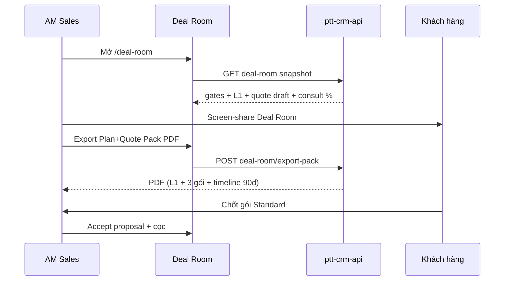

# Spec — Sprint 0: Bán hàng (chốt HĐ ngay)

> **Document ID:** RNOSAI-SCLOSE-S0-20260811  
> **Phiên bản:** 1.0 · **Ngày:** 2026-08-11  
> **Trạng thái:** Draft — chờ PO / Trưởng Sales / Trưởng Solution sign-off  
> **Timeline:** **2–4 tuần** (1 squad: 1 BE + 1 FE + 0.5 Design/QA)  
> **App:** `services/ops-web` + `services/ptt-crm-api` (+ `services/portal-web` cho F5 optional)  
> **Domain:** https://rs.pttads.vn  
> **Parent:** [`2026-08-07-rnosai-competitive-win-master-spec.md`](./2026-08-07-rnosai-competitive-win-master-spec.md) · [`16-sales-solution-chot-deal-sop.md`](../huong-dan-su-dung/16-sales-solution-chot-deal-sop.md)

---

## Mục lục

1. [Tóm tắt & mục tiêu](#1-tóm-tắt--mục-tiêu)
2. [Bối cảnh & gap hiện tại](#2-bối-cảnh--gap-hiện-tại)
3. [Phạm vi 5 feature](#3-phạm-vi-5-feature)
4. [Kiến trúc & luồng Deal Close](#4-kiến-trúc--luồng-deal-close)
5. [F1 — Deal Room](#5-f1--deal-room)
6. [F2 — Plan+Quote Pack PDF](#6-f2--planquote-pack-pdf)
7. [F3 — Enforce gate L1 trên UI](#7-f3--enforce-gate-l1-trên-ui)
8. [F4 — Quote ↔ DV catalog](#8-f4--quote--dv-catalog)
9. [F5 — Portal teaser (optional)](#9-f5--portal-teaser-optional)
10. [Data model & API](#10-data-model--api)
11. [Business rules & gates](#11-business-rules--gates)
12. [Kế hoạch triển khai 2–4 tuần](#12-kế-hoạch-triển-khai-24-tuần)
13. [Acceptance & KPI](#13-acceptance--kpi)
14. [Out of scope](#14-out-of-scope)
15. [Traceability](#15-traceability)

---

## 1. Tóm tắt & mục tiêu

### 1.1. Pitch

> **PTT không bán file PowerPoint** — PTT bán **1 Deal Room + 1 PDF Pack** trên RNOSAI: chiến lược L1 đã Solution sign-off, báo giá 3 gói gắn catalog DV01–21, gate minh bạch trước khi ký.

### 1.2. Mục tiêu sprint (2–4 tuần)

| # | Feature | Impact mong đợi |
|---|---------|-----------------|
| **F1** | Deal Room `/crm/leads/[id]/deal-room` | Giảm **~30 phút/deal**; demo enterprise 1 màn |
| **F2** | Plan+Quote Pack PDF | Khách **chốt trong buổi** (1 file duy nhất) |
| **F3** | Enforce gate L1 UI | **Không còn bypass văn hóa** (PPT/Excel ngoài CRM) |
| **F4** | Quote ↔ DV catalog | Credibility vs agency nhỏ; line items chuẩn |
| **F5** | Portal teaser *(optional)* | KH share nội bộ → chốt nhanh |

### 1.3. KPI exit sprint

| KPI | Baseline | Target |
|-----|----------|--------|
| Thời gian chuẩn bị buổi chốt (AM+Solution) | ~75 phút | **≤ 45 phút** |
| Proposal tạo ngoài CRM khi G4 đỏ | ~40% pilot | **0%** (block UI) |
| Buổi chốt dùng 1 PDF Pack | 0% | **≥ 80%** deal B2B |
| Quote có ≥1 dòng DV catalog | Thủ công | **100%** từ Deal Room |

---

## 2. Bối cảnh & gap hiện tại

### 2.1. Đã có (không build lại)

| Thành phần | Vị trí | Ghi chú |
|------------|--------|---------|
| Pre-sales on Lead | `/crm/leads/[id]` · `PTT_PRESALES_ON_LEAD=1` | Tab Lead / Tư vấn / Báo giá |
| **L1 R5** form | `#funnel-presales-r5` · `PresalesR5PlanForm` | Gate G4 backend |
| `GET .../presales/proposal-gate` | `presales-proposal-gate.util.ts` | Consult done + R5 valid |
| `GET .../presales/proposal-handoff` | Redirect `/crm/proposals?lead_id=…` | **Chưa check G4** trên handoff |
| Quote catalog API | `GET /api/crm/proposals/quote-catalog` | DV01–21 từ `ops_service_profile` |
| Quote builder UI | `QuoteBuilderWizard` | Tách khỏi lead context |
| Quote PDF export | `POST .../proposals/:id/export?format=pdf` | Chỉ báo giá, **không có L1** |
| Ops DV catalog | `ops-dv01-dv21-route-map.json` | Tier pricing trong PG |
| SOP training | `16-sales-solution-chot-deal-sop.md` | Gates G0–G8 |

### 2.2. Gap (sprint này đóng)

```mermaid
flowchart LR
  subgraph today["Hôm nay — rời rạc"]
    L[Lead detail]
    R5[R5 form tab Tư vấn]
    Q[/crm/proposals wizard]
    PDF[Quote PDF only]
  end
  subgraph target["Sprint 0 — 1 luồng"]
    DR[Deal Room]
    PACK[Plan+Quote Pack PDF]
    GATE[Gate L1 enforced]
    DV[DV auto lines]
    PT[Portal teaser opt]
  end
  L --> DR
  R5 --> DR
  Q --> DR
  DR --> PACK
  DR --> GATE
  DR --> DV
  DR -.-> PT
```

| Gap | Hậu quả kinh doanh |
|-----|-------------------|
| Không có Deal Room | AM phải mở 4 tab; demo enterprise yếu |
| PDF tách L1 / Quote | Khách nhận 2 file → chậm quyết định |
| Gate G4 chỉ trên stepper | AM vẫn vào `/crm/proposals` trực tiếp |
| Quote wizard không gắn lead | Không prefill DV theo `service_slug` |
| Không share plan sơ bộ | KH không forward nội bộ trước ký |

---

## 3. Phạm vi 5 feature

| ID | Feature | Must / Optional | Tuần ưu tiên |
|----|---------|-----------------|--------------|
| **F1** | Deal Room | **Must** | W1–W2 |
| **F3** | Enforce gate L1 UI | **Must** | W1 (song song F1) |
| **F4** | Quote ↔ DV catalog | **Must** | W2 |
| **F2** | Plan+Quote Pack PDF | **Must** | W3 |
| **F5** | Portal teaser | **Optional** | W4 (nếu còn buffer) |

**Definition of Done chung:** staging `rs.pttads.vn` · smoke script · cập nhật SOP §4 Pha 2–3 · 1 buổi demo GDKD pass.

---

## 4. Kiến trúc & luồng Deal Close

### 4.1. Route map (mới + hiện có)

| Route | Mô tả | Trạng thái |
|-------|--------|------------|
| `/crm/leads/[id]` | Lead detail + funnel stepper | ✅ |
| **`/crm/leads/[id]/deal-room`** | **Deal Room (F1)** | 🆕 |
| `/crm/leads/[id]#funnel-presales-r5` | Edit L1 inline / drawer | ✅ (embed trong Deal Room) |
| `/crm/proposals?lead_id=` | Legacy quote list | ✅ (deep link từ Deal Room) |
| **`/p/deal/[token]`** | Portal teaser read-only (F5) | 🆕 optional |

### 4.2. Luồng buổi chốt 45 phút (target)



### 4.3. Feature flags

```bash
# ops-web + api
PTT_DEAL_ROOM_ENABLED=1
PTT_DEAL_ROOM_PACK_PDF=1          # F2
PTT_DEAL_ROOM_GATE_STRICT=1       # F3 — block quote create khi G4 đỏ
PTT_DEAL_ROOM_PORTAL_TEASER=0     # F5 optional pilot
NEXT_PUBLIC_DEAL_ROOM=1
```

---

## 5. F1 — Deal Room

### 5.1. Mô tả

**1 màn hình** gom toàn bộ thông tin chốt deal trên lead B2B (pre-sales stage `consult` hoặc `proposal`):

| Zone | Nội dung | Nguồn dữ liệu |
|------|----------|---------------|
| **Header** | Lead name, service_slug, AM, Solution owner, SLA consult | `GET /api/v1/leads/:id/funnel` |
| **Gate strip** | G0 B2 · G1 Consult · **G4 R5** · G5 Proposal · trạng thái đỏ/xanh | `proposal-gate` + care gate + handoff |
| **Consult progress** | % task Consult done, link workspace | `funnel.presales.tasks.consult` |
| **L1 plan panel** | R5 read/edit (Solution cap) + badge AI reviewed | `GET/PATCH .../presales/marketing-plan` |
| **Quote panel** | Draft proposal gắn `lead_id`, 3 tier summary, nút mở builder | `GET /api/crm/proposals?lead_id=` *(mới)* |
| **Actions** | Export Pack PDF · Copy portal link · Mở buổi chốt checklist | F2, F5 |

### 5.2. UI layout (desktop-first)

```text
┌─────────────────────────────────────────────────────────────┐
│ [WORKSHOP] ABC Logistics · meta-lead-gen · AM: … · SP: …     │
├─────────────────────────────────────────────────────────────┤
│ G0 ✓  G1 ✓  G4 ⚠ R5 thiếu market_message  G5 ○ Proposal   │
├──────────────────────┬──────────────────────────────────────┤
│ Consult 3/4 ✓        │ KH MKT sơbộ (L1) — edit / preview      │
│ [Mở task Consult]    │ North Star · 3 khối bắt buộc …         │
├──────────────────────┴──────────────────────────────────────┤
│ Báo giá — 3 gói (Basic / Standard / Premium)                │
│ [Tạo báo giá] disabled nếu G4 đỏ · [Export Pack PDF]         │
└─────────────────────────────────────────────────────────────┘
```

### 5.3. Navigation

- Entry: Lead detail → nút **「Deal Room →」** (cap `crm_leads.view`) khi `presales != null`.
- Ops nav: optional shortcut khi `NEXT_PUBLIC_DEAL_ROOM=1`.
- Mobile: stack vertical; gate strip sticky top.

### 5.4. API mới

#### `GET /api/v1/leads/:id/deal-room`

Aggregate JSON (1 round-trip cho page):

```typescript
interface DealRoomSnapshot {
  lead_id: number;
  lead_flow_kind: 'b2b_prospect';
  presales: PresalesSnapshot;
  gates: {
    g0_b2: GateChip;
    g1_consult: GateChip;
    g4_r5: GateChip;          // từ buildProposalAdvanceGate
    g5_proposal: GateChip;
    g6_accept: GateChip;
  };
  marketing_plan: PreliminaryPlanView;
  consult_progress: { done: number; total: number };
  quote: {
    proposal_id: number | null;
    status: string | null;
    total_vnd: number | null;
    tiers: Array<{ tier: string; total_vnd: number }>;
    can_create: boolean;
    block_reason: string;
  };
  actions: {
    can_export_pack: boolean;
    can_share_teaser: boolean;
    proposals_href: string;
  };
}
```

**Performance:** p95 ≤ 400ms trên staging (1 lead điển hình).

### 5.5. Acceptance F1

- [ ] Route render với lead #900000910 sau workshop seed `--consult`
- [ ] Gate strip phản ánh đúng `proposal-gate` khi R5 thiếu field
- [ ] Consult progress khớp funnel snapshot
- [ ] Không regression tab Tư vấn cũ trên `/crm/leads/[id]`

---

## 6. F2 — Plan+Quote Pack PDF

### 6.1. Mô tả

**1 file PDF** merge:

1. **Trang bìa** — logo PTT, tên KH, ngày, AM/ Solution contact  
2. **L1 KH MKT sơ bộ** — North Star, objectives, 9 khối strategy (rút gọn 2 trang)  
3. **Báo giá 3 gói** — Basic / Standard / Premium (bảng line DV + tổng)  
4. **Timeline 90 ngày (high-level)** — không phải TMMT đầy đủ; milestone Onboard → Deliver → KPI  
5. **Footer pháp lý** — “Bản nháp hỗ trợ AI — đã hiệu chỉnh bởi chuyên gia PTT” nếu có AI draft

**Không** embed TMMT L2 (sau ký) — tuân SOP §2.

### 6.2. API

#### `POST /api/v1/leads/:id/deal-room/export-pack`

| Param | Mô tả |
|-------|--------|
| `proposal_id` | optional — default proposal draft mới nhất gắn lead |
| `format` | `pdf` (v1); `docx` phase 2 |
| `include_timeline` | default `true` |

**Response:** `application/pdf` stream · filename `PTT-DealPack-{leadId}-{date}.pdf`

**Implementation:** mở rộng `proposals.service.exportQuote` hoặc module `deal-room-pack.util.ts` (HTML template → puppeteer/pdfkit — reuse quote PDF pipeline).

### 6.3. Template sections

| Section | Data source |
|---------|-------------|
| L1 | `crm_marketing_plans` plan_kind=`preliminary` |
| Quote lines | `crm_proposal_lines` + `ops_service_profile.tier_pricing` |
| Timeline 90d | Static template theo `service_slug` + 3 milestone (config JSON) |

### 6.4. Acceptance F2

- [ ] PDF ≤ 8 trang với deal mẫu meta-lead-gen  
- [ ] L1 + quote cùng file; mở được trên mobile PDF viewer  
- [ ] Block export nếu G4 đỏ (message rõ)  
- [ ] Activity log: `deal_room.pack_exported`

---

## 7. F3 — Enforce gate L1 trên UI

### 7.1. Mô tả

**Gate G4 (L1 valid)** bắt buộc trước mọi thao tác tạo/chỉnh báo giá trên lead:

| Surface | Hành vi khi G4 đỏ |
|---------|-------------------|
| Deal Room — **「Tạo báo giá」** | `disabled` + tooltip checklist đỏ |
| Deal Room — gate strip | Liệt kê `proposal-gate.messages` |
| Funnel stepper — **Chuyển → Báo giá** | Giữ block hiện tại (đã có) |
| `/crm/proposals` create (query `lead_id`) | **Redirect** Deal Room + toast block |
| `POST /api/crm/proposals` body `lead_id` | **400** `{ error: 'g4_blocked', messages: [...] }` |
| `GET .../proposal-handoff` | `can_open: false` khi `!proposal-gate.ok` |

### 7.2. Checklist UI (component tái sử dụng)

Component `L1GateChecklist.tsx`:

```text
☐ Task Consult hoàn tất (3/3)
☐ Tên kế hoạch MKT sơbộ
☐ North Star hoặc Mục tiêu chiến lược
☐ Thông điệp thị trường (market_message)
☐ Kênh tiếp cận / Media (media_reach)
☐ Chiến lược chuyển đổi (conversion_strategy)
```

Map 1:1 từ `validatePreliminaryPlan` + consult progress.

### 7.3. Bypass policy

| Role | Bypass |
|------|--------|
| AM / Solution | **Không** |
| GDKD | **Không** trên UI (audit ticket nếu emergency) |
| Admin break-glass | Chỉ `PTT_DEAL_ROOM_GATE_STRICT=0` env (staging debug) |

**Business rule ID:** `BR-SCLOSE-001` — No proposal without G4.

### 7.4. Acceptance F3

- [ ] Không tạo proposal qua API khi R5 thiếu `market_message`  
- [ ] Deal Room nút xám + checklist đỏ  
- [ ] SOP KPI “100% proposal có G4 xanh” đo được qua audit query

---

## 8. F4 — Quote ↔ DV catalog

### 8.1. Mô tả

Khi tạo báo giá **từ Deal Room / lead context**:

1. **Prefill DV** từ `presales.service_slug` → map sang `dv_code` (bảng mapping config).  
2. User chọn **tier** (basic / standard / premium) → **auto line items** từ `ops_service_profile.tier_pricing`.  
3. Cho phép **thêm DV phụ** (DV01–21 picker) với dependency warning (`depends_on_dv`).  
4. Lưu `lead_id`, `presales_id` trên `crm_proposals` (DDL migration).

### 8.2. Mapping service_slug → DV (v1)

| service_slug (presales) | DV primary | DV gợi ý bundle |
|-------------------------|------------|-----------------|
| `meta-lead-gen` | DV04 | DV02, DV20 |
| `quang-cao-facebook` | DV04 | DV05 |
| `dich-vu-seo-tong-the` | DV05 | DV02 |
| `tiep-thi-noi-dung` | DV02 | DV20 |
| *default* | DV từ catalog match slug | — |

File config: `docs/specs/deal-room-service-dv-map.json` (seed script).

### 8.3. API changes

| Method | Path | Change |
|--------|------|--------|
| `POST` | `/api/crm/proposals` | Accept `lead_id`, `presales_id`, `package_tier`, `auto_lines: true` |
| `GET` | `/api/crm/proposals/quote-catalog` | Query `?service_slug=` filter + suggested bundle |
| `GET` | `/api/crm/proposals` | Filter `?lead_id=` |

**Auto lines logic:**

```typescript
// pseudo
const profile = await opsCatalog.getByDvCode(primaryDv);
const tier = body.package_tier ?? 'standard';
const lines = buildLinesFromTierPricing(profile.tier_pricing[tier]);
```

### 8.4. UI (Deal Room quote panel)

- Step 1: Chọn tier (3 card — giá reference từ catalog)  
- Step 2: Review lines (editable scope_notes, final_price_vnd)  
- Step 3: Lưu draft → hiện trong Deal Room  

Reuse `QuoteBuilderWizard` logic; embed as `DealRoomQuotePanel` (không force navigate `/crm/proposals`).

### 8.5. Acceptance F4

- [ ] Tạo quote từ Deal Room với 1 click tier Standard → ≥1 line DV  
- [ ] Giá reference min/max hiển thị từ catalog  
- [ ] `smoke_ops_quote.sh` pass với `lead_id` query  
- [ ] Proposal list lọc theo lead

---

## 9. F5 — Portal teaser (optional)

### 9.1. Mô tả

Link **read-only** cho khách xem **L1 rút gọn** (không giá, không internal notes) trước ký HĐ:

- URL: `https://portal.pttads.vn/p/deal/{token}`  
- TTL: 14 ngày (config)  
- Revoke: AM bấm “Thu hồi link” trên Deal Room  

### 9.2. Nội dung teaser

| Hiển thị | Ẩn |
|----------|-----|
| North Star, 3 khối strategy chính | Giá, margin, internal BANT |
| Logo KH + tên dự án | Task Consult notes |
| CTA “Liên hệ AM” (mailto / Zalo deep link) | Full 9 khối R5 |

### 9.3. API

| Method | Path | Mô tả |
|--------|------|--------|
| `POST` | `/api/v1/leads/:id/deal-room/teaser` | Tạo token, trả URL |
| `DELETE` | `/api/v1/leads/:id/deal-room/teaser` | Revoke |
| `GET` | `/api/portal/deal-teaser/:token` | Public read (portal-web BFF) |

**Bảng mới:** `crm_deal_teaser_tokens` (lead_id, token_hash, expires_at, revoked_at, created_by).

### 9.4. Acceptance F5 (optional)

- [ ] Token hết hạn → 410 Gone  
- [ ] Không lộ PII staff ngoài tên AM  
- [ ] Cap `crm_leads.edit` để tạo link  

**Ship criterion:** có thể defer W4 nếu F1–F4 chưa stable.

---

## 10. Data model & API

### 10.1. DDL (PostgreSQL)

```sql
-- crm_proposals — gắn lead presales
ALTER TABLE crm_proposals
  ADD COLUMN IF NOT EXISTS lead_id BIGINT REFERENCES crm_leads(sqlite_lead_id),
  ADD COLUMN IF NOT EXISTS presales_id BIGINT REFERENCES crm_lead_presales(id);

CREATE INDEX IF NOT EXISTS idx_crm_proposals_lead ON crm_proposals (lead_id);

-- F5 optional
CREATE TABLE IF NOT EXISTS crm_deal_teaser_tokens (
  id BIGSERIAL PRIMARY KEY,
  lead_id BIGINT NOT NULL REFERENCES crm_leads(sqlite_lead_id) ON DELETE CASCADE,
  token_hash TEXT NOT NULL UNIQUE,
  expires_at TIMESTAMPTZ NOT NULL,
  revoked_at TIMESTAMPTZ,
  created_by BIGINT,
  created_at TIMESTAMPTZ NOT NULL DEFAULT NOW()
);
```

Script: `scripts/apply_pg_ddl_deal_room_s0.sh`

### 10.2. Activity types (audit)

| Type | Khi |
|------|-----|
| `deal_room.viewed` | Mở Deal Room |
| `deal_room.pack_exported` | Export PDF pack |
| `deal_room.teaser_created` | F5 |
| `deal_room.quote_created` | Proposal từ Deal Room |

### 10.3. Module structure (Nest)

```text
services/ptt-crm-api/src/deal-room/
  deal-room.module.ts
  deal-room.controller.ts
  deal-room.service.ts
  deal-room-pack.util.ts
  deal-room-gates.util.ts
  deal-room.types.ts
```

### 10.4. Module structure (ops-web)

```text
services/ops-web/src/app/crm/leads/[id]/deal-room/page.tsx
services/ops-web/src/components/deal-room/
  DealRoomPage.tsx
  DealRoomGateStrip.tsx
  DealRoomL1Panel.tsx
  DealRoomQuotePanel.tsx
  L1GateChecklist.tsx
```

---

## 11. Business rules & gates

| Gate | ID | Điều kiện | Enforced sprint |
|------|----|-----------|-----------------|
| G0 B2 | existing | `presales_care_gate.complete` | Deal Room strip |
| G1 Consult | existing | 100% task Consult | F1 + F3 checklist |
| **G4 R5** | **BR-SCLOSE-001** | `proposal-gate.ok` | **F3 block quote** |
| G5 Proposal | existing | GDKD approve deal lớn | Future — hiển thị chip |
| G6 Accept | existing | Khách ký + cọc | Deal Room CTA link hub |

**Policy OPA (phase 2):** extend `policies/presales/no_release_without_handoff.rego` với `deal_room_export_requires_g4`.

---

## 12. Kế hoạch triển khai 2–4 tuần

### Tuần 1 — F1 skeleton + F3 backend

| Ngày | Deliverable |
|------|-------------|
| D1–D2 | DDL + `GET deal-room` aggregate API |
| D3–D4 | Deal Room page + Gate strip + L1 embed |
| D5 | F3: block `POST proposals` + handoff fix + smoke |

### Tuần 2 — F4 Quote linkage

| Ngày | Deliverable |
|------|-------------|
| D1–D2 | `lead_id` on proposals + catalog prefill |
| D3–D4 | DealRoomQuotePanel + tier cards |
| D5 | Integration test + workshop lead #900000910 UAT |

### Tuần 3 — F2 PDF Pack

| Ngày | Deliverable |
|------|-------------|
| D1–D3 | HTML template + PDF pipeline |
| D4 | Export button + activity log |
| D5 | GDKD demo rehearsal |

### Tuần 4 — Buffer / F5 optional

| Ngày | Deliverable |
|------|-------------|
| D1–D3 | F5 portal teaser *(nếu scope)* |
| D4 | Docs SOP + runbook update |
| D5 | Sign-off + enable flags prod pilot |

---

## 13. Acceptance & KPI

### 13.1. Smoke scripts (mới)

```bash
LEAD_ID=900000910 ./scripts/smoke_deal_room.sh
LEAD_ID=900000910 ./scripts/smoke_deal_room_pack_pdf.sh
```

### 13.2. UAT script (Sales)

1. Mở Deal Room lead workshop — gate strip đúng.  
2. Điền R5 → G4 xanh → tạo quote Standard 1-click.  
3. Export Pack PDF → gửi mock KH.  
4. Thử tạo quote khi G4 đỏ → bị block.  

### 13.3. Sign-off

| Vai trò | Tiêu chí |
|---------|----------|
| Trưởng Sales | Giảm prep time; không bypass |
| Trưởng Solution | L1 hiển thị đúng; không lẫn TMMT |
| GDKD | Demo 15p trên Deal Room convincing |
| IT | Smoke pass staging |

---

## 14. Out of scope

- TMMT L2 / AI Planner trong Pack PDF  
- Content OS / Ops Hub trong Deal Room  
- Ký HĐ điện tử (e-sign) — vẫn qua `/crm/hub`  
- Thay thế toàn bộ `/crm/proposals` standalone  
- Pricing AI / discount optimizer  
- Full DV21 browser admin UI  

---

## 15. Traceability

| Artifact | Link |
|----------|------|
| SOP chốt deal | [`16-sales-solution-chot-deal-sop.md`](../huong-dan-su-dung/16-sales-solution-chot-deal-sop.md) |
| Workshop sandbox | [`workshop-buoi1-presales-r5-runbook.md`](../runbooks/workshop-buoi1-presales-r5-runbook.md) |
| Proposal gate BE | `presales-proposal-gate.util.ts` |
| Quote catalog | `GET /api/crm/proposals/quote-catalog` |
| Ops DV map | `ops-dv01-dv21-route-map.json` |
| Competitive WIN | `2026-08-07-rnosai-competitive-win-master-spec.md` §5 CRM gap |

### Backlog IDs (engineering)

| ID | Feature |
|----|---------|
| SCLOSE-F1 | Deal Room page + snapshot API |
| SCLOSE-F2 | Plan+Quote Pack PDF export |
| SCLOSE-F3 | G4 enforce UI + API |
| SCLOSE-F4 | Quote lead context + DV auto lines |
| SCLOSE-F5 | Portal teaser tokens |

---

*Spec này có hiệu lực sau khi PO + Trưởng Sales + Trưởng Solution ký duyệt.*
