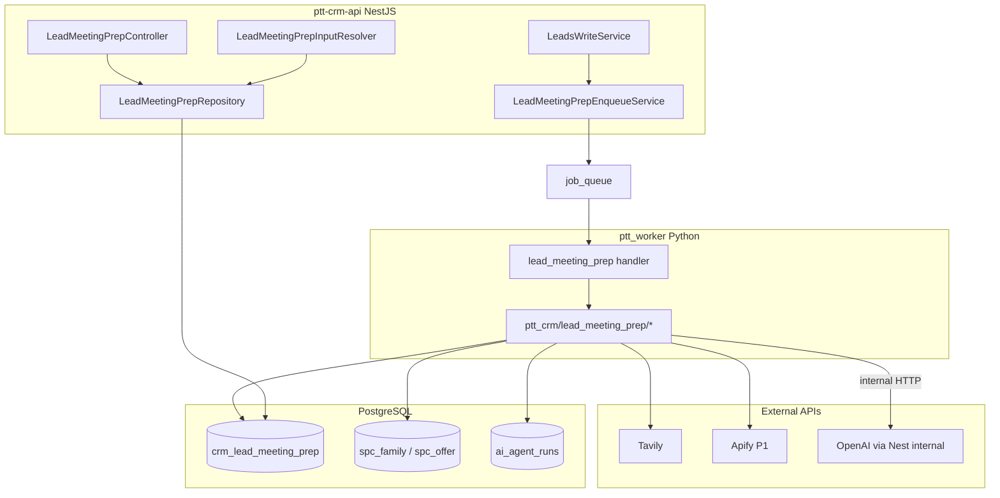

# Lead Meeting Prep (SCI) — Kế hoạch triển khai chi tiết

> **Document ID:** LMP-PLAN-20260813  
> **Phiên bản:** 1.0 · **Ngày:** 2026-08-13  
> **Trạng thái:** Draft — chờ Ban + Trưởng Sales kickoff  
> **Parent spec:** [`lead-meeting-prep.md`](./lead-meeting-prep.md) v2.0  
> **DDL:** [`2026-08-13-postgresql-ddl-lead-meeting-prep.sql`](./2026-08-13-postgresql-ddl-lead-meeting-prep.sql)  
> **Acceptance:** [`lead-meeting-prep-acceptance-checklist.md`](./lead-meeting-prep-acceptance-checklist.md)  
> **Related:** [`2026-08-11-sales-close-sprint-s0-spec.md`](./2026-08-11-sales-close-sprint-s0-spec.md) · [`16-sales-solution-chot-deal-sop.md`](../huong-dan-su-dung/16-sales-solution-chot-deal-sop.md)  
> **Squad:** 1 BE Nest · 1 BE Worker/Python · 1 FE · 0.5 QA/Design · PO Sales 0.25  
> **Timeline:** **10–12 tuần** (6 sprint S-LMP-1 → S-LMP-6)

---

## Mục lục

1. [Mục tiêu & exit criteria](#1-mục-tiêu--exit-criteria)
2. [Baseline hiện tại (as-is)](#2-baseline-hiện-tại-as-is)
3. [Kiến trúc & phụ thuộc](#3-kiến-trúc--phụ-thuộc)
4. [Timeline tổng thể](#4-timeline-tổng-thể)
5. [S-LMP-1 — Foundation (tuần 1–2)](#5-s-lmp-1--foundation-tuần-12)
6. [S-LMP-2 — MVP UI + gate (tuần 3–4)](#6-s-lmp-2--mvp-ui--gate-tuần-34)
7. [S-LMP-3 — Sales Cockpit + Close Intelligence (tuần 5–6)](#7-s-lmp-3--sales-cockpit--close-intelligence-tuần-56)
8. [S-LMP-4 — Deal Close bridge (tuần 7–8)](#8-s-lmp-4--deal-close-bridge-tuần-78)
9. [S-LMP-5 — Multi-moment + funnel merge (tuần 9–10)](#9-s-lmp-5--multi-moment--funnel-merge-tuần-910)
10. [S-LMP-6 — Win loop + GA (tuần 11–12)](#10-s-lmp-6--win-loop--ga-tuần-1112)
11. [Backend — file map & API](#11-backend--file-map--api)
12. [Worker — Python brain](#12-worker--python-brain)
13. [Frontend — Sales Cockpit](#13-frontend--sales-cockpit)
14. [Prompt pack & validation](#14-prompt-pack--validation)
15. [Feature flags & rollout](#15-feature-flags--rollout)
16. [Testing, gate scripts & UAT](#16-testing-gate-scripts--uat)
17. [Deploy runbook VPS](#17-deploy-runbook-vps)
18. [Rủi ro & mitigation](#18-rủi-ro--mitigation)
19. [Effort & RACI](#19-effort--raci)
20. [Traceability](#20-traceability)

---

## 1. Mục tiêu & exit criteria

### 1.1. Mục tiêu theo phase

| Phase | Mục tiêu kinh doanh | Metric (spec) | Gate |
|---|---|---|---|
| **P0** | AM có intel trước cuộc gọi đầu | EC-LMP-01…12 | `lead_meeting_prep_gate.sh` |
| **P1** | Sales Tiger — talk track + offer ladder | EC-LMP-13…14 | `lmp_p1_gate.sh` + 2 lead thật |
| **P2** | Buổi chốt trên Deal Room có SCI | EC-LMP-16…18 | `lmp_p2_gate.sh` + S-Close F1 |
| **P3** | SCI refresh M2/M3 tự động | EC-LMP-15 | Intake→Deal Room prep ≤45 ph |
| **P4** | Học từ chot, GA all B2B | LMP-G06…G09 | 90 ngày cohort |

### 1.2. Exit checklist PO (toàn program)

- [ ] **EC-LMP-01…12** — P0 gate PASS staging + VPS pilot
- [ ] **EC-LMP-13…14** — Cockpit 5 tab + offer ladder 3 tier
- [ ] **EC-LMP-15…18** — Deal Room + quote 3 gói
- [ ] UAT 3 AM + 1 GDKD sign [`lead-meeting-prep-acceptance-checklist.md`](./lead-meeting-prep-acceptance-checklist.md)
- [ ] SOP cập nhật §Pha 0 [`16-sales-solution-chot-deal-sop.md`](../huong-dan-su-dung/16-sales-solution-chot-deal-sop.md)
- [ ] PO sign-off PDF

### 1.3. Out of scope program

- Real-time in-call AI (whisper/co-pilot live)
- Research profile cá nhân liên hệ
- Thay thế Solution Consult / R5
- Mobile app native — chỉ responsive read-only
- Batch Excel prep hàng loạt

---

## 2. Baseline hiện tại (as-is)

### 2.1. Đã có — tái sử dụng

| Layer | Thành phần | Anchor file |
|---|---|---|
| Lead create | `LeadsWriteService.createLead` + `LeadCreated` | `leads-write.service.ts` |
| Job queue | `job_queue`, `enqueueScoreLeadJob` | `job-queue.repository.ts` |
| Worker | `ptt_worker`, `score_lead`, `ingest_lead` | `ptt_jobs/handlers/` |
| AI audit | `ai_agent_runs`, `AI_USE_CASE` | `ai-audit.constants.ts` |
| LLM | `AiLlmClient.completeText` / JSON | `ai-llm.client.ts` |
| SPC catalog | 21 DV published, quote pricing | `spc/` module, S6e |
| Intake BANT | sessions, Go decision | `intake/` |
| Presales | consult-brief, proposal-gate | `leads-funnel/` |
| Deal Room | S-Close S0 spec (có thể đang/planned) | `sales-close-s0-spec` |
| Playbooks | RAG pattern từ MKT AI | `marketing-ai-playbook.service.ts` |
| Closed loop | `ChotClosedLoopService` | `chot-closed-loop.service.ts` |
| Timeline | `customer_timeline_events` | `customer-timeline.service.ts` |

### 2.2. Chưa có — cần build

| Gap | Sprint |
|---|---|
| Bảng `crm_lead_meeting_prep` | S-LMP-1 |
| Job `lead_meeting_prep` | S-LMP-1 |
| Tavily/verify collect brain | S-LMP-1 |
| Nest GET/run/select API | S-LMP-1 |
| ops-web panel cơ bản | S-LMP-2 |
| Close Intelligence (strategize+arm) | S-LMP-3 |
| Sales Cockpit 5 tab | S-LMP-3 |
| Apify Facebook | S-LMP-3 |
| Deal Room `sci` slice | S-LMP-4 |
| apply-offer-ladder → quote | S-LMP-4 |
| M2/M3 re-trigger | S-LMP-5 |
| Win loop M4 | S-LMP-6 |

### 2.3. Prerequisite trước kickoff

| # | Việc | Owner | Done? |
|---|---|---|---|
| P0 | Ban duyệt spec v2 | PO | ☐ |
| P1 | `TAVILY_API_KEY` staging + VPS `.env` | Ops | ☐ |
| P2 | SPC S6e PASS (21 DV seed) | Eng | ✅ (deployed) |
| P3 | Pilot `client_id` list (1–2 agency) | Sales | ☐ |
| P4 | UAT lead fixtures (Khang Thịnh Land case) | QA | ☐ |
| P5 | Deal Room F1 route tồn tại hoặc stub (S-LMP-4) | FE | ☐ |

---

## 3. Kiến trúc & phụ thuộc



### 3.1. Quyết định triển khai

| Quyết định | Lý do |
|---|---|
| Worker Python xử lý Tavily (không Nest) | Job dài 2–4 ph; pattern `ingest_lead` |
| LLM gọi qua Nest internal API | Tái dùng audit + `AiLlmClient` + stub mode |
| Một row / lead, overwrite theo `prep_stage` | UX đơn giản; history qua `prep_version` |
| P0 gộp synthesize 1 call | Ship nhanh; tách strategize+arm S-LMP-3 |

### 3.2. Dependency graph sprint

```
S-LMP-1 (DDL+worker+API)
    └── S-LMP-2 (UI basic + gate P0)
            └── S-LMP-3 (SCI + Cockpit)
                    └── S-LMP-4 (Deal Room + quote) ← cần Deal Room F1
                            └── S-LMP-5 (M2/M3 triggers)
                                    └── S-LMP-6 (win loop)
```

**Song song được:** RBAC seed (S-LMP-1) · prompt pack (S-LMP-2) · Apify (S-LMP-3 parallel FE)

---

## 4. Timeline tổng thể

| Tuần | Sprint | Milestone | Demo |
|---|---|---|---|
| 1 | S-LMP-1a | DDL + repository + enqueue | Job queued trong DB |
| 2 | S-LMP-1b | Worker collect/verify/synth MVP | curl GET prep ready |
| 3 | S-LMP-2a | Panel + entity picker | AM xem trên staging |
| 4 | S-LMP-2b | Gate P0 + VPS pilot | `lead_meeting_prep_gate.sh` PASS |
| 5 | S-LMP-3a | Strategize+Arm + offer ladder | Close Intelligence JSON |
| 6 | S-LMP-3b | Sales Cockpit 5 tab + Apify | 2 lead thật UAT |
| 7 | S-LMP-4a | Deal Room sci slice | Narrative trên Deal Room |
| 8 | S-LMP-4b | apply-offer-ladder + playbook RAG | Quote 3 gói 1-click |
| 9 | S-LMP-5 | M2/M3 triggers + consult merge | Intake Go → refresh prep |
| 10 | S-LMP-5 | Copilot slice + intake sidebar | End-to-end funnel |
| 11 | S-LMP-6 | Win loop + feedback analytics | chot → win_outcome |
| 12 | S-LMP-6 | GA flag + coach digest hook | PO sign-off |

**Buffer:** +1 tuần nếu Deal Room F1 chưa sẵn (S-LMP-4 trượt).

---

## 5. S-LMP-1 — Foundation (tuần 1–2)

**Goal:** Job chạy end-to-end headless — chưa cần UI đẹp.

### 5.1. Task list

| ID | Task | Files | Effort | Deps |
|---|---|---|---|---|
| LMP-01 | Apply DDL + migration script | `docs/specs/2026-08-13-postgresql-ddl-lead-meeting-prep.sql`, `scripts/apply_pg_ddl_lead_meeting_prep.sh` | 0.5d | — |
| LMP-02 | Nest module scaffold | `src/lead-meeting-prep/*.ts`, `app.module.ts` | 1d | LMP-01 |
| LMP-03 | Repository CRUD + status machine | `lead-meeting-prep.repository.ts` | 1.5d | LMP-02 |
| LMP-04 | Input resolver | `lead-meeting-prep-input.resolver.ts` | 1d | LMP-03 |
| LMP-05 | Enqueue service + hook createLead | `lead-meeting-prep-enqueue.service.ts`, `leads-write.service.ts` | 1d | LMP-03 |
| LMP-06 | Hook ingest_lead worker | `ptt_jobs/handlers/ingest_lead.py` | 0.5d | LMP-05 |
| LMP-07 | `enqueueLeadMeetingPrepJob` | `job-queue.repository.ts` | 0.5d | LMP-05 |
| LMP-08 | App config flags | `app-config.service.ts` | 0.5d | — |
| LMP-09 | Worker handler skeleton | `ptt_jobs/handlers/lead_meeting_prep.py`, `ptt_worker/__main__.py` | 0.5d | LMP-07 |
| LMP-10 | `collect.py` Tavily search+extract | `ptt_crm/lead_meeting_prep/collect.py` | 2d | LMP-09 |
| LMP-11 | `verify.py` fetch HTML + entity detect | `ptt_crm/lead_meeting_prep/verify.py` | 2d | LMP-10 |
| LMP-12 | `synthesize.py` P0 single LLM call | `ptt_crm/lead_meeting_prep/synthesize.py` | 1.5d | LMP-11 |
| LMP-13 | `spc_catalog.py` load published DV | `ptt_crm/lead_meeting_prep/spc_catalog.py` | 0.5d | — |
| LMP-14 | `schema.py` validate PrepResult | `ptt_crm/lead_meeting_prep/schema.py` | 1d | LMP-12 |
| LMP-15 | Internal LLM client (Python→Nest) | `ptt_crm/lmp_llm_client.py` | 1d | LMP-12 |
| LMP-16 | GET API | `lead-meeting-prep.controller.ts` | 0.5d | LMP-03 |
| LMP-17 | POST run / select-entity | controller + service | 1d | LMP-16 |
| LMP-18 | AI audit use_case | `ai-audit.constants.ts`, worker persist run id | 0.5d | LMP-15 |
| LMP-19 | Unit tests verify + schema | `*.spec.ts`, `tests/test_lmp_*.py` | 1.5d | LMP-14 |

**Sprint effort:** ~17 dev-days (BE Nest 6d · Worker 8d · shared 3d)

### 5.2. Definition of Done S-LMP-1

- [ ] DDL applied staging PG
- [ ] `POST /api/v1/leads` → row `crm_lead_meeting_prep` status `pending`
- [ ] Worker → `ready` within 5 min (fixture lead)
- [ ] `GET /api/v1/leads/:id/meeting-prep` returns valid `PrepResult`
- [ ] `contact_profile.found === false` always
- [ ] Entity choice case manually testable via POST select-entity
- [ ] `ai_agent_runs` row `use_case=lead_meeting_prep`

### 5.3. Config staging

```bash
PTT_LEAD_MEETING_PREP_ENABLED=1
PTT_LMP_PILOT_ONLY=1
PTT_LMP_PILOT_CLIENT_IDS=<pilot-uuid>
TAVILY_API_KEY=tvly-...
MAX_TAVILY_CREDITS_PER_LEAD=8
PTT_JOBS_ENABLED=1
```

---

## 6. S-LMP-2 — MVP UI + gate (tuần 3–4)

**Goal:** AM dùng được trên staging; gate P0 PASS.

### 6.1. Task list

| ID | Task | Files | Effort |
|---|---|---|---|
| LMP-20 | API client ops-web | `services/ops-web/src/lib/lead-meeting-prep-api.ts` | 0.5d |
| LMP-21 | `LeadMeetingPrepProgress` stepper | `LeadMeetingPrepProgress.tsx` | 1d |
| LMP-22 | `LeadMeetingPrepEntityPicker` | `LeadMeetingPrepEntityPicker.tsx` | 1d |
| LMP-23 | `LeadMeetingPrepPanel` P0 layout | `LeadMeetingPrepPanel.tsx` | 2d |
| LMP-24 | Wire tab lead detail | `CrmLeadDetailPage` / tabs | 0.5d |
| LMP-25 | Funnel chip badge | `LeadFunnelPanel` | 0.5d |
| LMP-26 | Timeline event ready | `customer-timeline.service.ts` | 0.5d |
| LMP-27 | RBAC caps seed | `scripts/seed_staff_lmp_permissions.py` | 0.5d |
| LMP-28 | Guards controller | `staff-lmp.guard.ts` | 0.5d |
| LMP-29 | `lead_meeting_prep_gate.sh` | `scripts/lead_meeting_prep_gate.sh` | 1d |
| LMP-30 | VPS deploy pilot | runbook §17 | 0.5d |
| LMP-31 | UAT script 3 AM | `docs/runbooks/lmp-uat-p0.md` | 0.5d |

### 6.2. Gate script P0 (`lead_meeting_prep_gate.sh`)

```bash
# Outline — implement in LMP-29
1. source .env — require DATABASE_URL, PTT_CRM_INTERNAL_KEY, TAVILY_API_KEY
2. apply DDL if missing
3. POST /api/v1/leads (fixture company+phone, pilot client_id)
4. poll GET meeting-prep 360s — assert status=ready
5. assert recommended_services 1..3, dv_code in spc_family
6. assert contact_profile.found=false
7. assert ai_agent_runs count >= 1
8. POST select-entity test (optional second fixture)
```

### 6.3. Definition of Done S-LMP-2

- [ ] EC-LMP-01…12 PASS
- [ ] 3 AM UAT: đọc script trước gọi — sign checklist
- [ ] VPS pilot 1 client, flag on
- [ ] Zero block on lead create latency (p95 < 500ms)

---

## 7. S-LMP-3 — Sales Cockpit + Close Intelligence (tuần 5–6)

**Goal:** Sales Tiger tier — talk track, offer ladder, readiness score.

### 7.1. Task list

| ID | Task | Files | Effort |
|---|---|---|---|
| LMP-32 | Tách `strategize.py` | `ptt_crm/lead_meeting_prep/strategize.py` | 1.5d |
| LMP-33 | Tách `arm.py` | `ptt_crm/lead_meeting_prep/arm.py` | 1.5d |
| LMP-34 | `close_readiness_score` util | `close-readiness.util.ts` + Python mirror | 1d |
| LMP-35 | Offer ladder builder từ SPC | `offer_ladder.py` | 1.5d |
| LMP-36 | Talk track SPIN/Challenger prompts | `prompts/lmp-arm-v2/` | 1d |
| LMP-37 | Apify integration | `apify_facebook.py` | 2d |
| LMP-38 | Feedback table + POST API | DDL already; controller | 0.5d |
| LMP-39 | Sales Cockpit shell 5 tab | `SalesCockpitPanel.tsx` | 2d |
| LMP-40 | Tab Intel / Talk / Offer / Objections | sub-components | 3d |
| LMP-41 | Copy-to-clipboard + timer mode | UX utilities | 1d |
| LMP-42 | Close readiness gauge | `CloseReadinessGauge.tsx` | 0.5d |
| LMP-43 | `lmp_p1_gate.sh` | scripts | 1d |
| LMP-44 | 2 lead thật UAT (Sales) | runbook | 1d |

### 7.2. Prompt pack deliverables (§14)

- `lmp-strategize-v2.system.md` — pain ROI, urgency, competitive, red flags
- `lmp-arm-v2.system.md` — talk track + objection + offer ladder JSON schema
- Fixture JSON: Khang Thịnh Land, Hana Spa, 1 BĐS, 1 Spa

### 7.3. Definition of Done S-LMP-3

- [ ] EC-LMP-13…14 PASS
- [ ] `close_intelligence.offer_ladder.length === 3` (CB+TC+CS)
- [ ] `close_readiness_score` hiển thị breakdown
- [ ] Apify fail graceful — prep vẫn ready
- [ ] 👍/👎 feedback lưu DB

---

## 8. S-LMP-4 — Deal Close bridge (tuần 7–8)

**Goal:** SCI feed Deal Room + quote 3 gói — liên kết S-Close S0.

**Prerequisite:** Deal Room route `GET deal-room snapshot` tồn tại (F1 S-Close).

### 8.1. Task list

| ID | Task | Files | Effort |
|---|---|---|---|
| LMP-45 | `deal_room_payload` in arm.py M3 mode | worker | 1d |
| LMP-46 | GET deal-room-slice API | controller | 0.5d |
| LMP-47 | Extend Deal Room snapshot `sci` | deal-room service (S-Close) | 1.5d |
| LMP-48 | Deal Room UI sci section | deal-room page | 2d |
| LMP-49 | POST apply-offer-ladder | service + SPC pricing map | 2d |
| LMP-50 | Quote 3 tier prefill | proposals module integration | 2d |
| LMP-51 | Playbook RAG inject strategize | reuse `MarketingAiPlaybookService` pattern | 1.5d |
| LMP-52 | Tab Deal Ready (M3) Cockpit | `SalesCockpitDealReadyTab.tsx` | 1d |
| LMP-53 | `lmp_p2_gate.sh` | scripts | 1d |

### 8.2. Definition of Done S-LMP-4

- [ ] EC-LMP-16…18 PASS
- [ ] Deal Room mở → opening narrative từ SCI
- [ ] Nút "Tạo báo giá 3 gói" → proposal draft 3 tier
- [ ] Playbook slug visible on Cockpit when matched

---

## 9. S-LMP-5 — Multi-moment + funnel merge (tuần 9–10)

**Goal:** M2 sau Intake Go; M3 trước Deal Room; consult merge.

### 9.1. Task list

| ID | Task | Files | Effort |
|---|---|---|---|
| LMP-54 | Subscribe IntakeCompleted → enqueue M2 | intake service / domain events | 1d |
| LMP-55 | Hook proposal gate pass → enqueue M3 | `leads-funnel.service.ts` | 1d |
| LMP-56 | Job mode `strategize_arm` skip collect | worker | 1d |
| LMP-57 | Manual "Chuẩn bị chốt" button | Cockpit + API | 0.5d |
| LMP-58 | consult-brief merge fields | `presales-consult-brief.util.ts` | 1d |
| LMP-59 | consult-prefill map DV codes | `presales-consult-prefill.util.ts` | 1d |
| LMP-60 | Copilot context slice | `copilot-context.service.ts` | 0.5d |
| LMP-61 | Intake sidebar prep card read-only | `IntakeContent.tsx` | 1d |
| LMP-62 | `prep_stage` UI labels M1/M2/M3 | Cockpit | 0.5d |
| LMP-63 | Integration test M1→M2→M3 | tests | 1.5d |

### 9.2. Definition of Done S-LMP-5

- [ ] EC-LMP-15 PASS
- [ ] Intake Go → prep refresh ≤2 min
- [ ] G4 pass → M3 deal_room_payload populated
- [ ] consult-brief có `external_research_summary`

---

## 10. S-LMP-6 — Win loop + GA (tuần 11–12)

**Goal:** Học từ chot; mở GA; coach digest.

### 10.1. Task list

| ID | Task | Files | Effort |
|---|---|---|---|
| LMP-64 | Hook status chot/lost → M4 learn job | `lead-status-gate` / chot closed loop | 1d |
| LMP-65 | `win_outcome_json` capture | repository + POST debrief API | 1d |
| LMP-66 | Post-call debrief modal | Cockpit UI | 1d |
| LMP-67 | Win pattern aggregation (batch) | `scripts/lmp_win_patterns_report.py` | 1.5d |
| LMP-68 | Coach digest SCI section | coach digest handler | 1d |
| LMP-69 | `/crm/ai/insights?tab=sci` widget | ops-web | 1.5d |
| LMP-70 | Domain cache table usage | worker collect | 1d |
| LMP-71 | GA: `PTT_LMP_PILOT_ONLY=0` rollout plan | ops | 0.5d |
| LMP-72 | Final acceptance + PO sign | checklist | 1d |

### 10.2. Definition of Done S-LMP-6

- [ ] EC-LMP-19 PASS
- [ ] chot → `win_outcome_json` non-empty when debrief submitted
- [ ] KPI dashboard SCI live
- [ ] GA all B2B clients (flag off pilot)

---

## 11. Backend — file map & API

### 11.1. Nest module tree

```
services/ptt-crm-api/src/lead-meeting-prep/
  lead-meeting-prep.module.ts
  lead-meeting-prep.controller.ts
  lead-meeting-prep.service.ts
  lead-meeting-prep-enqueue.service.ts
  lead-meeting-prep.repository.ts
  lead-meeting-prep-input.resolver.ts
  lead-meeting-prep.types.ts
  close-readiness.util.ts
  close-readiness.util.spec.ts
  guards/staff-lmp.guard.ts
  dto/
    run-meeting-prep.dto.ts
    select-entity.dto.ts
    prep-feedback.dto.ts
```

### 11.2. API implementation order

| Priority | Method | Path | Sprint |
|---|---|---|---|
| P0 | GET | `/api/v1/leads/:id/meeting-prep` | S-LMP-1 |
| P0 | POST | `/api/v1/leads/:id/meeting-prep/run` | S-LMP-1 |
| P0 | POST | `/api/v1/leads/:id/meeting-prep/select-entity` | S-LMP-1 |
| P0 | POST | `/api/v1/leads/:id/meeting-prep/rerun-synthesize` | S-LMP-2 |
| P1 | POST | `/api/v1/leads/:id/meeting-prep/feedback` | S-LMP-3 |
| P2 | POST | `/api/v1/leads/:id/meeting-prep/apply-offer-ladder` | S-LMP-4 |
| P2 | GET | `/api/v1/leads/:id/meeting-prep/deal-room-slice` | S-LMP-4 |
| P3 | POST | `/api/v1/leads/:id/meeting-prep/debrief` | S-LMP-6 |
| P0 | POST | `/api/v1/internal/lmp/llm-complete` | S-LMP-1 |

---

## 12. Worker — Python brain

### 12.1. Package layout

```
ptt_crm/lead_meeting_prep/
  __init__.py
  collect.py          # Tavily search + extract, credit cap
  verify.py           # fetch HTML, entity candidates, confidence
  strategize.py       # S-LMP-3 — pain ROI, urgency, competitive
  arm.py              # S-LMP-3 — talk track, objection, offer ladder
  synthesize.py       # P0 wrapper — calls strategize+arm or single shot
  apify_facebook.py   # S-LMP-3 — optional
  offer_ladder.py     # map SPC SKUs CB/TC/CS
  spc_catalog.py      # PG read published DV
  schema.py           # JSON validate PrepResult + CloseIntelligence
  readiness.py        # close_readiness_score rules
  prompts.py          # load prompt templates
ptt_jobs/handlers/lead_meeting_prep.py
ptt_crm/lmp_llm_client.py   # HTTP to Nest internal LLM
tests/test_lmp_verify.py
tests/test_lmp_schema.py
tests/test_lmp_offer_ladder.py
```

### 12.2. Job processing pseudocode

```python
def process(payload):
    stage = payload.get("prep_stage", "m1_first_strike")
    mode = payload.get("mode", "full")

    upsert_row(lead_id, status="running")
    inp = resolve_input(lead_id)

    if should_skip(inp):
        return finish(status="skipped", reason=...)

    if mode in ("full", "refresh") or stage == "m1_first_strike":
        collect = collect_company(inp)
        verify = verify_entities(collect, inp)
        if verify.needs_entity_choice and not payload.get("selected_entity_id"):
            return finish(status="awaiting_entity_choice", candidates=...)
        collect = filter_sources(verify, payload.get("selected_entity_id"))
    else:
        collect = load_collect_json(lead_id)

    catalog = load_spc_catalog()
    if stage == "m3_pre_close":
        ctx = load_presales_context(lead_id)
    else:
        ctx = {}

    intel = strategize(collect, inp, catalog, ctx, stage=stage)
    armed = arm(intel, collect, inp, catalog, stage=stage)
    result = merge_prep_result(collect, intel, armed)

    audit = llm_client.persist_audit(...)
    finish(status="ready", result=result, ai_run_id=audit.id)
    emit_timeline(lead_id, result)
```

---

## 13. Frontend — Sales Cockpit

### 13.1. Component tree

```
services/ops-web/src/app/crm/leads/meeting-prep/
  SalesCockpitPanel.tsx           # shell — replaces LeadMeetingPrepPanel
  SalesCockpitIntelTab.tsx
  SalesCockpitTalkTrackTab.tsx
  SalesCockpitOfferTab.tsx
  SalesCockpitObjectionsTab.tsx
  SalesCockpitDealReadyTab.tsx    # M3 only
  LeadMeetingPrepEntityPicker.tsx
  LeadMeetingPrepProgress.tsx
  CloseReadinessGauge.tsx
  CopyScriptButton.tsx
  TalkTrackTimer.tsx
  PostCallDebriefModal.tsx        # S-LMP-6
  lead-meeting-prep.types.ts
services/ops-web/src/lib/lead-meeting-prep-api.ts
```

### 13.2. UX rollout

| Sprint | UI state |
|---|---|
| S-LMP-2 | Single panel §13 spec v1 |
| S-LMP-3 | Rebrand Sales Cockpit + 5 tab |
| S-LMP-4 | Deal Ready tab + Deal Room link |
| S-LMP-5 | Intake sidebar card |
| S-LMP-6 | Debrief modal |

---

## 14. Prompt pack & validation

### 14.1. Files (repo)

```
docs/prompts/lmp/
  lmp-strategize-v2.system.md
  lmp-strategize-v2.user.template.md
  lmp-arm-v2.system.md
  lmp-arm-v2.user.template.md
  fixtures/
    khang-thinh-land.json
    hana-spa.json
```

### 14.2. Validation rules (automated in schema.py)

- `recommended_services`: max 3, valid dv_code
- `offer_ladder`: exactly 3 tiers CB/TC/CS, one `recommended`
- `contact_profile.found`: must be false
- `sourced` facts: source URL in allowlist
- `pain_vnd_*`: null OK, negative forbidden
- `deal_room_payload`: required non-empty for m3

### 14.3. Prompt review gate

Mọi thay đổi prompt → PR tag `lmp-prompt` → GDKD + 1 AM review 2 fixture outputs trước merge.

---

## 15. Feature flags & rollout

| Stage | Env | Audience |
|---|---|---|
| Dev | `PTT_LEAD_MEETING_PREP_ENABLED=1` | Dev only |
| Staging | pilot 1 client | QA + 3 AM |
| VPS pilot | `PTT_LMP_PILOT_CLIENT_IDS` | 1 agency |
| GA B2B | `PTT_LMP_PILOT_ONLY=0` | all except spa_operational |
| GA full | + spa flag `PTT_LMP_SPA_ENABLED=1` | optional later |

**Rollback:** set `PTT_LEAD_MEETING_PREP_ENABLED=0` — không ảnh hưởng lead create.

---

## 16. Testing, gate scripts & UAT

### 16.1. Gate scripts

| Script | Sprint | Chains |
|---|---|---|
| `scripts/lead_meeting_prep_gate.sh` | S-LMP-2 | standalone P0 |
| `scripts/lmp_p1_gate.sh` | S-LMP-3 | P0 gate + close_intelligence asserts |
| `scripts/lmp_p2_gate.sh` | S-LMP-4 | P1 gate + apply-offer-ladder |
| `scripts/lmp_full_gate.sh` | S-LMP-6 | P0→P2 chain |

### 16.2. Unit / integration tests

| Area | Tests |
|---|---|
| verify.py | phone/email match, entity split Khang Thịnh |
| schema.py | invalid offer ladder rejected |
| input resolver | meta_json priority order |
| close-readiness.util | score breakdown |
| controller | RBAC 403 without cap |
| E2E | create lead → poll ready (staging smoke) |

### 16.3. UAT scenarios (Sales)

| # | Scenario | Actor | Pass |
|---|---|---|---|
| U1 | Lead Meta webhook → prep ready → gọi 15 phút SPIN | AM | ☐ |
| U2 | Trùng tên DN → chọn entity → facts đúng 1 DN | AM | ☐ |
| U3 | Intake Go → M2 refresh pain ROI | AM | ☐ |
| U4 | Deal Room screen-share narrative | AM+Solution | ☐ |
| U5 | Quote 3 gói từ offer ladder | AM | ☐ |
| U6 | chot → debrief → GDKD xem insight | AM | ☐ |

---

## 17. Deploy runbook VPS

Target: `deploy@rs.pttads.vn` · `/var/www/rnosai`

### 17.1. S-LMP-2 pilot deploy

```bash
# Local
git push origin <branch>

# VPS
ssh deploy@rs.pttads.vn
cd /var/www/rnosai
git pull
psql "$DATABASE_URL" -f docs/specs/2026-08-13-postgresql-ddl-lead-meeting-prep.sql
python scripts/seed_staff_lmp_permissions.py   # when ready

# .env additions
PTT_LEAD_MEETING_PREP_ENABLED=1
PTT_LMP_PILOT_ONLY=1
PTT_LMP_PILOT_CLIENT_IDS=<uuid>
TAVILY_API_KEY=tvly-...

# Build & reload (pattern existing deploy)
cd services/ptt-crm-api && npm run build
cd services/ops-web && npm run build
kill -TERM $(pgrep -f 'ptt-crm-api')   # systemd Restart=always
kill -TERM $(pgrep -f 'ptt_worker')

# Smoke
bash scripts/lead_meeting_prep_gate.sh
```

### 17.2. Secrets checklist

- [ ] `TAVILY_API_KEY` on VPS only — không commit
- [ ] `APIFY_API_TOKEN` before S-LMP-3
- [ ] Internal key for gate: `PTT_CRM_INTERNAL_KEY`

---

## 18. Rủi ro & mitigation

| Rủi ro | Impact | Mitigation |
|---|---|---|
| Tavily cost vượt budget | OPEX | `MAX_TAVILY_CREDITS_PER_LEAD`, pilot flag |
| Trộn pháp nhân trùng tên | Fact sai, mất deal | Entity choice bắt buộc §verify |
| Deal Room F1 chưa xong | S-LMP-4 block | Stub sci slice; defer M3 UI tab |
| LLM bịa pain ROI số | AM mất credibility | Allow null; badge suy luận; AM confirm |
| Job 4 phút timeout worker | prep failed | max_attempts=3; collect cache reuse |
| AM không dùng Cockpit | ROI thấp | UAT bắt buộc; SLA first call ≤15p + prep |
| SPC catalog thay đổi | SKU invalid | validate at arm time; gate spc_s6e |

---

## 19. Effort & RACI

### 19.1. Effort summary

| Sprint | Nest BE | Worker | FE | QA | Total |
|---|---|---|---|---|---|
| S-LMP-1 | 6d | 8d | — | 1d | **15d** |
| S-LMP-2 | 2d | 1d | 5d | 2d | **10d** |
| S-LMP-3 | 2d | 6d | 7d | 2d | **17d** |
| S-LMP-4 | 5d | 2d | 5d | 2d | **14d** |
| S-LMP-5 | 4d | 2d | 3d | 2d | **11d** |
| S-LMP-6 | 3d | 2d | 3d | 2d | **10d** |
| **Total** | **22d** | **21d** | **23d** | **11d** | **~77 dev-days** |

Calendar ~10–12 tuần với 2.5 FTE dev + overlap.

### 19.2. RACI

| Hoạt động | Eng | Sales AM | GDKD | PO | Ops |
|---|---|---|---|---|---|
| Spec/plan approve | C | C | **A** | **R** | I |
| P0 build | **R** | I | I | C | C |
| UAT P0 | C | **R** | **A** | C | I |
| Prompt review | C | C | **A** | I | — |
| VPS pilot | C | I | I | **A** | **R** |
| GA rollout | **R** | C | **A** | **R** | **R** |
| SOP update | C | **R** | **A** | C | — |

---

## 20. Traceability

| Spec § | Plan sprint | EC IDs |
|---|---|---|
| §5 Pipeline | S-LMP-1, S-LMP-3 | EC-LMP-01…07 |
| §8 Output | S-LMP-1, S-LMP-3 | EC-LMP-05…14 |
| §10 Job queue | S-LMP-1 | EC-LMP-01, 09 |
| §11 API | S-LMP-1…6 | all EC |
| §13 UI | S-LMP-2, S-LMP-3 | EC-LMP-05…06, 13 |
| §22 Moments | S-LMP-5 | EC-LMP-15 |
| §25 Deal Room | S-LMP-4 | EC-LMP-16…18 |
| §27 KPI | S-LMP-6 | EC-LMP-19, LMP-G06…09 |

---

## Checklist kickoff meeting

**Runbook đầy đủ:** [`docs/runbooks/lmp-kickoff-meeting.md`](../runbooks/lmp-kickoff-meeting.md)

Tóm tắt quyết định cần chốt trong 60–90 phút:

- [ ] **D1** Pilot `client_id` + fixture leads (§A)
- [ ] **D2** Squad roster + DRI từng sprint (§B)
- [ ] **D3** Deal Room F1 ✅ sẵn · SCI slice tuần 7–8 (§C)
- [ ] **D4** Tavily account + budget cap (§D)
- [ ] **D5** UAT tuần 4 / 6 / 8 / 12 — 3 AM + GDKD (§E)
- [ ] **Go/No-Go** §G — 7 gate trước S-LMP-1
- [ ] Action items §H trong 24h

---

*End of implementation plan — sync với spec v2.0 [`lead-meeting-prep.md`](./lead-meeting-prep.md).*
