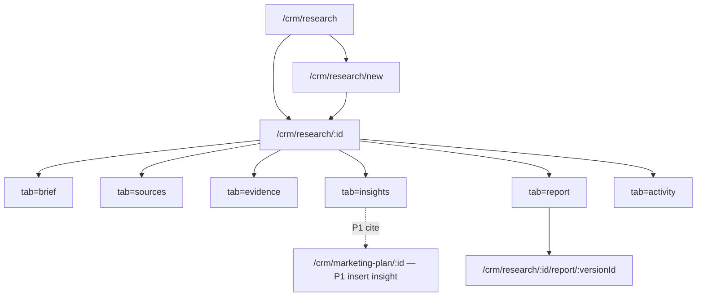
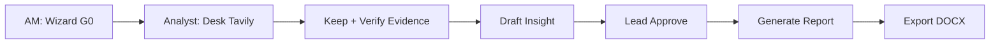
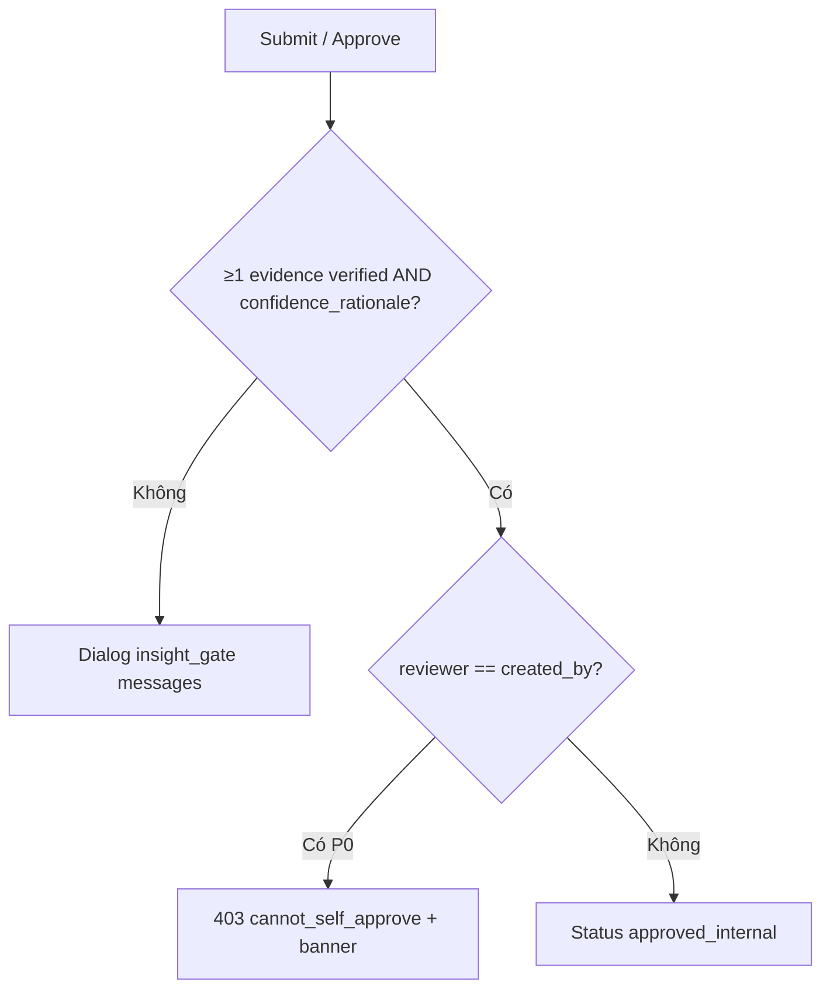
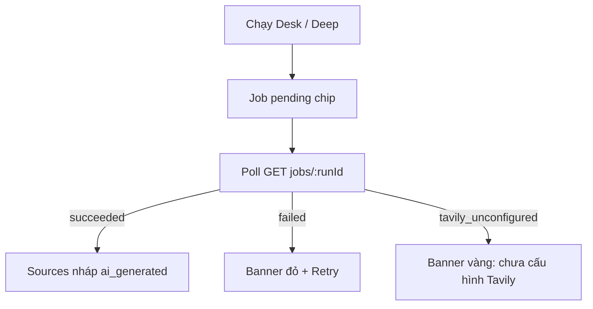

# Market Research OS — UI/UX Specification (DV12)

> **Document ID:** MKT-RES-OS-UIUX-20260814  
> **Phiên bản:** 1.0 · **Ngày:** 2026-08-14  
> **Trạng thái:** Design for implementation — P0 desktop-first; P1–P3 preview  
> **Parent design:** [`../superpowers/specs/2026-08-14-market-research-os-design.md`](../superpowers/specs/2026-08-14-market-research-os-design.md)  
> **SRS:** [`2026-08-14-market-research-os-srs.md`](./2026-08-14-market-research-os-srs.md)  
> **Use cases:** [`modules/RNOSAI-BA-RES-UseCases.md`](./modules/RNOSAI-BA-RES-UseCases.md) · [`../use-cases/12-MARKET-RESEARCH-OS.md`](../use-cases/12-MARKET-RESEARCH-OS.md)  
> **Design system:** [`../SPEC_UI_UX_PTT.md`](../SPEC_UI_UX_PTT.md) · [`2026-08-07-rnosai-competitive-win-ui-ux-design.md`](./2026-08-07-rnosai-competitive-win-ui-ux-design.md)  
> **App:** `services/ops-web` · **Shell:** `StaffPageShell` + `OpsNav` · **CSS:** `app/globals.css`

Không palette mới. Kế thừa token PTT (`--primary` `#17692f`, Inter/Manrope, pill button, card). Analog UX: Sales Cockpit 6 tab + LMP desk job.

---

## Mục lục

1. [Mục tiêu UX](#1-mục-tiêu-ux)
2. [Personas & jobs](#2-personas--jobs)
3. [Information Architecture](#3-information-architecture)
4. [Design tokens & visual language](#4-design-tokens--visual-language)
5. [User flows](#5-user-flows)
6. [Screen inventory](#6-screen-inventory)
7. [Wireframe chi tiết](#7-wireframe-chi-tiết)
8. [Component library](#8-component-library)
9. [States, empty, error, job](#9-states-empty-error-job)
10. [Microcopy tiếng Việt](#10-microcopy-tiếng-việt)
11. [Cap-first UI](#11-cap-first-ui)
12. [Responsive & a11y](#12-responsive--a11y)
13. [P1–P3 UI preview](#13-p1p3-ui-preview)
14. [Handoff checklist](#14-handoff-checklist)

---

## 1. Mục tiêu UX

| ID | Mục tiêu | Metric P0 |
|----|----------|-----------|
| UX-RES-01 | AM tạo brief G0 không cần BA | Wizard ≤5 bước; <3 phút; 0 field ẩn |
| UX-RES-02 | Analyst thấy chain Decision → RQ → Source → Evidence → Insight | Workspace 6 tab; breadcrumb luôn hiện |
| UX-RES-03 | Không duyệt insight thiếu evidence | Nút Approve disabled + dialog `insight_gate` (không silent) |
| UX-RES-04 | AI là copilot, không phải tác giả | Badge `AI` trên source/insight; banner Deep Research |
| UX-RES-05 | Close readiness nhìn thấy ngay | Chip % evidence trên list + header workspace |
| UX-RES-06 | Nav PLAN tách EXECUTE | Nhóm **Lên kế hoạch** = Research + Marketing plan |
| UX-RES-07 | Không nhầm NCTT BĐS | Không deep-link `/crm/sales?tab=market` từ Research |

**Nguyên tắc**

1. **Evidence-first** — mọi claim trên UI có Evidence ID chip; hover locator.  
2. **Cap-first** — ẩn nav/nút trước API 403.  
3. **Gate có lời** — disabled luôn `title` + dialog liệt kê `messages[]`.  
4. **Vietnamese-first** — label VI; enum code monospace phụ.  
5. **Job async** — Desk/Deep Research không block workspace; poll chip.  
6. **SoD visible** — banner nếu user là `created_by` của insight đang duyệt.  
7. **Reuse PTT** — `StaffPageShell`, table compact, toast, modal, stepper.

---

## 2. Personas & jobs

| Persona | Việc trên UI | Entry | Cap |
|---------|--------------|-------|-----|
| **AM** | Wizard G0, wording khách, export DOCX, phân phối | `/crm/research/new` | view/create/edit/export |
| **Research Analyst** | Desk, Deep Research, verify, insight draft, report draft | `/crm/research/[id]?tab=sources` | + `run` |
| **Research Lead** | Method, approve insight/report | tab Insights / Report | + `approve` |
| **GDKD** | Xem project, **không** nút duyệt method | List read-only + override thương mại (P1) | `view` |
| **ResearchOps** | Flag, taxonomy (P1) | Admin | `configure` |
| **Client sponsor** | Đọc report (P3) | Portal | — |

**Không** dùng GDKD `crm_leads.assign` để hiện nút Approve insight.

---

## 3. Information Architecture

### 3.1. Sidebar — nhóm mới «Lên kế hoạch»

Vị trí: **sau** `CRM · Bán hàng & Hợp đồng`, **trước** `CRM · Triển khai dịch vụ`.

```
CRM · Lên kế hoạch                         [data-admin-nav="crm_plan"]
  ├─ Nghiên cứu thị trường                 → /crm/research
  └─ Kế hoạch marketing                    → /crm/marketing-plan   (di chuyển khỏi Triển khai)

CRM · Triển khai dịch vụ                   (không còn marketing-plan)
  ├─ Triển khai DV
  ├─ Quy trình SOP
  ├─ Launch QA
  ├─ Creative Hub
  ├─ Campaign Write
  └─ Ops …
```

**Quy tắc hiện nhóm**

| Điều kiện | Hành vi |
|-----------|---------|
| `NEXT_PUBLIC_MARKET_RESEARCH=1` **và** (`crm_research.view` **hoặc** `crm_board.view`) | Hiện nhóm; Research hiện nếu `crm_research.view` |
| Flag off | Ẩn Research; Marketing plan vẫn theo `crm_board.view` — nếu chỉ còn plan thì nhóm vẫn hiện với 1 link **hoặc** plan đứng một mình trong nhóm (P0: nhóm hiện nếu ≥1 link) |
| Không cap research | Ẩn Research; không 403 trên nav |

Icon: `search` / `chart` (nav-icons `/crm/research`). Active: pathname starts with `/crm/research`.

### 3.2. Sitemap



Query: `?tab=` + `?insight=` drawer + `?run=` highlight job.

### 3.3. Không đụng

- `/crm/sales?tab=market` — NCTT BĐS.  
- `/seo/research` — keyword.  
- LMP Deal Room — research lead, không DV12.

---

## 4. Design tokens & visual language

Reuse PTT. Semantic **bổ sung class**, không đổi `:root` màu.

| Token / class | Dùng cho |
|---------------|----------|
| `--primary` `#17692f` | CTA Tạo project, Chạy desk, Xuất DOCX |
| `--primary-50` | Row hover, selected source |
| `--surface-soft` | Workspace header, filter bar |
| Chip `status-intake` | xám |
| `status-collecting` | xanh dương muted |
| `status-in_review` | vàng |
| `status-approved` | xanh primary |
| `status-cancelled` | đỏ muted |
| Badge `ai` | viền dashed + icon spark — **không** solid primary (tránh nhầm “đã duyệt”) |
| Badge `verified` | check + primary |
| Chip `reliability-high` | primary | `medium` amber | `low`/`unknown` xám |
| Close-readiness bar | 0–100% evidence verified / sources kept |

**Typography:** tiêu đề màn `h1` 20–22px; table 13–14px; Evidence ID `font-mono` `EV-12`.

**Density:** list = table compact (WIN). Workspace = header sticky + tab + pane scroll.

---

## 5. User flows

### 5.1. Happy path P0 (AM + Analyst + Lead)



### 5.2. Gate insight



### 5.3. AI job



---

## 6. Screen inventory

| SCR | Tên | Route | Phase | UC |
|-----|-----|-------|-------|-----|
| SCR-RES-001 | Project list | `/crm/research` | P0 | 001, 010, 013 |
| SCR-RES-002 | Wizard G0 | `/crm/research/new` | P0 | 002 |
| SCR-RES-003 | Workspace shell | `/crm/research/[id]` | P0 | 015 |
| SCR-RES-003a | Tab Brief | `?tab=brief` | P0 | 002, 003 |
| SCR-RES-003b | Tab Sources | `?tab=sources` | P0 | 004, 005, 014, 019 |
| SCR-RES-003c | Tab Evidence | `?tab=evidence` | P0 | 006, 017 |
| SCR-RES-003d | Tab Insights | `?tab=insights` | P0 | 007, 008, 011, 018 |
| SCR-RES-003e | Tab Report | `?tab=report` | P0 | 009, 012 |
| SCR-RES-003f | Tab Activity | `?tab=activity` | P0 | 016, 020 |
| SCR-RES-004 | Insight drawer | `?insight=:id` | P0 | 007, 008 |
| SCR-RES-005 | Report version preview | `/crm/research/[id]/report/[versionId]` | P0 | 009 |
| SCR-RES-006 | Gate dialog | modal | P0 | 008 |
| SCR-RES-007 | Job progress | panel Sources/Activity | P0 | 004, 005, 020 |
| SCR-RES-008 | Deep Research confirm | modal | P0 | 005 |
| SCR-RES-009 | Evidence create/verify | drawer | P0 | 006 |
| SCR-RES-010 | Flag-off / empty | — | P0 | 013 |
| SCR-RES-020 | Competitor pane | `?tab=competitors` | P1 | 022 |
| SCR-RES-021 | Insert insight → plan | marketing-plan | P1 | 023 |
| SCR-RES-022 | Confidence rubric | insight drawer | P1 | 021 |
| SCR-RES-030 | Studies | `?tab=studies` | P2 | 030 |
| SCR-RES-031 | Ops KPI | `/crm/research/analytics` | P2 | 033 |
| SCR-RES-040 | Portal report | portal | P3 | 040 |

Breadcrumb workspace: `Lên kế hoạch / Nghiên cứu thị trường / {title}`.

---

## 7. Wireframe chi tiết

### 7.1. SCR-RES-001 — List

```
┌ StaffPageShell ─────────────────────────────────────────────────┐
│ ← Lên kế hoạch / Nghiên cứu thị trường          [+ Tạo project] │
│                                                                  │
│ [Client ▼] [Status ▼] [Loại ▼] [Owner ▼]  [Tìm tiêu đề…]        │
│                                                                  │
│ Client │ Tiêu đề              │ Loại        │ Trạng thái │ Sẵn sàng │ Owner │ Cập nhật │
│ Acme   │ Sữa uống 2026        │ CAT_REVIEW  │ Thu thập   │ ████░ 33%│ Lan   │ 14/08    │
│ Beta   │ Pulse đối thủ Q3     │ COMP_LAND   │ Intake     │ —        │ Minh  │ 13/08    │
│                                                                  │
│ Pagination 20 / trang                                            │
└──────────────────────────────────────────────────────────────────┘
```

**Cột Sẵn sàng (close readiness):** `verified_evidence / (kept_sources * expected)` P0 đơn giản = `verified_evidence_count` + tooltip “X evidence đã verify / Y nguồn keep”.

**Empty:** illustration search + «Chưa có dự án nghiên cứu» + CTA Tạo project + link SOP DV12 (nếu `isOpsDvFeEnabled`).

**Row click** → workspace `tab=brief`. Không row action menu P0 (tránh xoá nhầm).

**Filter persist:** query string `client_id`, `status`, `product_type`, `q`.

### 7.2. SCR-RES-002 — Wizard G0 (5 bước)

Stepper ngang (pattern marketing-plan / AI Planner):

```
(1) Khách hàng  →  (2) Loại nghiên cứu  →  (3) Quyết định  →  (4) Phạm vi  →  (5) Câu hỏi
```

**Bước 1 — Khách hàng**

- Combobox Client (staff scope). Required.  
- Title text. Required min 8.  
- DV12 tier radio: **CB** / **TC** / **CS** — helper: CB = desk 1 shot; TC = + consumer; CS = STP + sizing.  
- Optional lifecycle DV12 (P0 combobox disabled + “P1”); field hidden nếu không cap board.

**Bước 2 — Loại** — 10 cards 2 cột:

| Card | Subcopy |
|------|---------|
| Category review | TAM/SAM/SOM, cấu trúc ngành |
| Competitive landscape | Đối thủ, positioning, SOV proxy |
| Consumer / shopper | JTBD, pain, ngôn ngữ thật |
| Segmentation / STP | Priority segment |
| Brand health | Funnel, equity |
| Pricing / offer | Giá, gói |
| Campaign / concept | Đánh giá ads |
| Trend scan | Tín hiệu 6–18 tháng |
| Go-to-market | Kênh + message |
| Tracker | Pulse lặp |

Selected: border `--primary`, check góc. Một `product_type` P0.

**Bước 3 — Quyết định**

- Textarea `decision_statement` min 20 ký tự; counter `n/20`.  
- Placeholder: *«Quyết định có mở SKU premium Q4 tại MT HCM hay không.»*  
- Helper: không viết “làm báo cáo ngành”; viết quyết định kinh doanh.

**Bước 4 — Phạm vi**

- Geo: chips `VN` default; thêm `HCM`, `HN`, `SEA`, `Global`.  
- Language: `vi` required; `en` optional checkbox (exec P2).  
- Risk: Low / Medium / High.

**Bước 5 — Research questions**

- 1 dòng mặc định. Nút **+ Thêm câu hỏi**. Min 1 trước Submit (có thể tạo project `intake` rồi bổ sung — Submit P0 **cho phép 0 RQ** nhưng banner “cần ≥1 RQ để chuyển Designed”). **Khuyến nghị UX:** require 1 RQ trên wizard để khớp US-AM-02. **Chốt P0:** wizard **bắt buộc ≥1 RQ**.  
- Mỗi dòng: `question_vi` + sort handle. `question_en` collapsible.

Footer: **Hủy** (list) · **Quay lại** · **Tạo dự án** (primary). Submit `POST /projects` → redirect workspace.

Validation inline tiếng Việt, không toast-only.

### 7.3. SCR-RES-003 — Workspace header (mọi tab)

```
┌ Acme · Sữa uống 2026                          [Đổi trạng thái ▼] ┐
│ CAT_REVIEW  ·  DV12 CB  ·  VN  ·  Rủi ro: medium                 │
│ Trạng thái: Thu thập          Sẵn sàng evidence  ███░░  4/12     │
│ Owner: Lan · AM: Tuan                                            │
│ [Brief] [Nguồn] [Evidence] [Insight] [Báo cáo] [Nhật ký]         │
└──────────────────────────────────────────────────────────────────┘
```

Status dropdown chỉ hiện transition hợp lệ (SRS 4.3). Hover disabled item: lý do (*Cần ≥1 RQ*).

Header sticky dưới topbar. Tabs underline primary.

### 7.4. SCR-RES-003a — Brief

Hai cột: trái form (decision, geo, RQ list CRUD), phải **SOP G0–G10** checklist read-only (gate hiện tại highlight). Nút **Gợi ý RQ (Claude)** P0 optional — output = suggestions, user tick thêm (US G0).

RQ table: # · Câu hỏi · Số nguồn · Số evidence · [Sửa] [Xóa]. Xóa disabled nếu có evidence (tooltip).

### 7.5. SCR-RES-003b — Sources

```
┌ Toolbar ─────────────────────────────────────────────────────────┐
│ RQ filter [Tất cả ▼]   [+ Nguồn thủ công]                        │
│ [Chạy Desk Tavily]  [Chạy Deep Research]                         │
│ Job: Desk Q1 ● đang chạy 42s     [Xem nhật ký]                   │
├──────────────────────────────────────────────────────────────────┤
│ Keep │ AI │ Độ tin │ Tiêu đề              │ Publisher │ RQ │ …   │
│  ☑   │ —  │ high   │ Euromonitor dairy    │ Euro      │ Q1 │ ↗  │
│  ☐   │ AI │ unknown│ (nháp) blog xyz      │ —         │ Q1 │ …  │
└──────────────────────────────────────────────────────────────────┘
```

- Cột Keep = checkbox; PATCH `keep`.  
- Badge AI dashed.  
- URL icon mở tab mới `rel=noopener`.  
- Row action: **Tạo evidence** (mở SCR-RES-009) · **Bỏ** (`keep=false`).  
- Deep Research: mở SCR-RES-008.

Credit: text phụ `Tavily 4/12 credit dự án`.

### 7.6. SCR-RES-008 — Modal Deep Research

```
┌ Chạy Deep Research ─────────────────────────────────────────────┐
│ Provider: OpenAI Deep Research (env)                             │
│ Câu hỏi: [Q1 ▼]                                                  │
│                                                                  │
│ ⚠ Kết quả chỉ là nguồn nháp + dàn ý. Không phải số liệu đã audit.│
│    Insight sẽ không được tạo tự động.                            │
│                                                                  │
│ Timeout tối đa 15 phút.  [Hủy]  [Chạy]                           │
└──────────────────────────────────────────────────────────────────┘
```

Nếu `RESEARCH_DEEP_PROVIDER=off`: nút ẩn.

### 7.7. SCR-RES-003c — Evidence ledger

Table: ID · RQ · Locator · Excerpt/Value · Unit · Period · Geo · QC · Source.

Filter RQ + qc_status. **Không** nút Xóa khi `verified`. Verified row: lock icon; **Thay thế (supersede)** mở form mới.

Nút **+ Evidence**.

### 7.8. SCR-RES-009 — Drawer Evidence

Fields: Source* · RQ · Locator* (URL#paragraph / page / timestamp) · Excerpt **hoặc** Value+Unit+Base · Period · Geography · PII class.

Helper BR-RES-02: claim số phải có value+unit+base+period+geo.

Primary: **Lưu nháp** / **Verify** (Analyst). Verify tính checksum; khóa field.

### 7.9. SCR-RES-003d + SCR-RES-004 — Insights

Grid cards 2 cột desktop:

```
┌ Insight #18 · draft · AI ─────────────────────────┐
│ Premium SKU tăng share ở MT HCM                    │
│ EV-12  EV-19                         Confidence: — │
│ [Mở]  [Gửi duyệt]                                  │
└────────────────────────────────────────────────────┘
```

Drawer 480–560px:

- Statement (required)  
- Tabs: Quan sát | Diễn giải | Hệ quả | Khuyến nghị  
- Evidence attach multi-select (chỉ `verified`)  
- Confidence rationale textarea P0  
- Audience, valid_from/to  
- Footer: Lưu · Gửi Lead duyệt · (Lead) Duyệt nội bộ · (AM) Duyệt bản khách

**Gửi duyệt** disabled nếu 0 verified evidence — `title="Cần ≥1 evidence đã verify"`. Click vẫn mở SCR-RES-006 nếu API 400.

SoD: nếu `user == created_by`, ẩn/disable Duyệt; banner *«Người tạo không tự duyệt — nhờ Research Lead.»*

### 7.10. SCR-RES-006 — Gate dialog

```
┌ Không duyệt được ──────────────────────────────────┐
│ Hệ thống chặn vì:                                  │
│  • Thiếu evidence đã verify                        │
│  • Thiếu giải thích độ tin cậy                     │
│                                      [Đóng]        │
└────────────────────────────────────────────────────┘
```

Map `messages[]`: `missing_verified_evidence` → câu trên; `missing_confidence_rationale` → câu dưới; `cannot_self_approve` → SoD.

### 7.11. SCR-RES-003e + SCR-RES-005 — Report

Tab Report P0:

- Checklist insight `approved_internal+` (checkbox include).  
- Nút **Tạo bản báo cáo** → `POST /reports`.  
- List versions: v1 hash… [Xem] [Xuất DOCX].

Preview page: cover + exec + findings theo RQ + recs + methodology stub + evidence index. Banner nếu version `approved`: *«Sửa nội dung = tạo version mới (BR-RES-05).»*

Export: download; không preview Word in-browser.

### 7.12. SCR-RES-003f — Activity

Timeline: reviews, status transitions, AI runs (provider, model, credits, status). Filter job_type. Failed row: **Thử lại** (RES-UC-020).

### 7.13. SCR-RES-010 — Flag off

Nav ẩn. Deep link `/crm/research` → empty state ops-web *«Module nghiên cứu thị trường chưa bật.»* (không stack trace). API 404 `market_research_disabled`.

---

## 8. Component library

| Component | File gợi ý | Props chính |
|-----------|------------|-------------|
| `ResearchNavGroup` | OpsNav section | flag + caps |
| `ResearchStatusChip` | status enum VI | |
| `ProductTypeCard` | wizard | code, selected |
| `CloseReadinessBar` | list + header | verified, kept |
| `AiDraftBadge` | source/insight | |
| `ReliabilityTierChip` | source | |
| `EvidenceIdChip` | hover locator | evidence_id |
| `InsightCard` | grid | insight |
| `InsightDrawer` | right drawer | |
| `InsightGateDialog` | messages[] | |
| `ResearchJobChip` | poll | run_id, status |
| `DeepResearchModal` | question_id | |
| `EvidenceFormDrawer` | | |
| `SourceKeepTable` | | |
| `RqListEditor` | brief + wizard | |
| `ReportVersionList` | | |
| `ResearchActivityTimeline` | | |

Reuse: `StaffPageShell`, existing Modal, Toast, Combobox client, Table.

**Không** JSON `<pre>` làm UI chính (WIN UX-G6).

---

## 9. States, empty, error, job

| State | UI |
|-------|-----|
| Loading list | Skeleton 8 rows |
| Loading workspace | Header skeleton + pane pulse |
| Empty list | CTA tạo |
| Empty sources | «Chạy Desk Tavily hoặc thêm nguồn thủ công» |
| Empty insights | «Gắn evidence rồi soạn insight — không viết từ AI suông» |
| Job pending | Chip spinner + elapsed |
| Job running > 60s desk | «Đang lấy nguồn…» |
| Job running Deep | «Deep Research có thể tới 15 phút — có thể rời trang» |
| Job failed | Banner + error_message VI map |
| `tavily_unconfigured` | Banner vàng, không toast đỏ |
| `job_in_flight` | Nút Chạy disabled «Job đang chạy cho câu hỏi này» |
| `evidence_immutable` | Toast 409 + hướng dẫn supersede |
| `invalid_transition` | Dropdown đóng, toast lý do |
| 403 tenancy | «Không có quyền xem dự án này» — **không** hiện title project |
| 404 flag | SCR-RES-010 |

Toast success: ngắn (*«Đã tạo evidence EV-19»*). Lỗi gate: **dialog**, không chỉ toast.

---

## 10. Microcopy tiếng Việt

| Key | Copy |
|-----|------|
| nav.group | Lên kế hoạch |
| nav.research | Nghiên cứu thị trường |
| cta.create | Tạo project |
| cta.desk | Chạy Desk Tavily |
| cta.deep | Chạy Deep Research |
| cta.verify | Verify |
| cta.submit_review | Gửi Lead duyệt |
| cta.approve_internal | Duyệt nội bộ |
| cta.approve_client | Duyệt bản khách |
| cta.export | Xuất DOCX |
| warn.deep | Kết quả chỉ là nguồn nháp + dàn ý. Không phải số liệu đã audit. |
| warn.sod | Người tạo không tự duyệt. |
| warn.version | Sửa sau duyệt = version mới. |
| empty.list | Chưa có dự án nghiên cứu |
| gate.no_evidence | Cần ≥1 evidence đã verify |
| status.intake | Tiếp nhận |
| status.designed | Thiết kế |
| status.collecting | Thu thập |
| status.synthesizing | Tổng hợp |
| status.drafting | Soạn báo cáo |
| status.in_review | Đang duyệt |
| status.approved | Đã duyệt |
| status.distributed | Đã giao |
| status.cancelled | Huỷ |

Product type label: Category review, Competitive landscape, … (bảng §7.2).

---

## 11. Cap-first UI

| Cap | Hiện |
|-----|------|
| `view` | List, workspace read, Activity |
| `create` | Tạo project |
| `edit` | Brief, RQ, source, evidence, insight draft, generate report |
| `run` | Desk, Deep, copilot insight/report |
| `approve` | Duyệt nội bộ / Lead |
| `export` | Xuất DOCX |
| `configure` | P1 admin |

AM `approve_client_facing`: P0 dùng `approve` **hoặc** `edit`+role AM — **chốt UI:** nút «Duyệt bản khách» hiện nếu cap `approve` **hoặc** (`edit` và user là AM owner). Lead luôn thấy «Duyệt nội bộ». SoD vẫn chặn self-approve method.

GDKD chỉ `view`: không Desk, không Approve.

Nút thiếu cap: **ẩn** (không disabled 403). Gate nghiệp vụ: **disabled + title**.

---

## 12. Responsive & a11y

| Breakpoint | P0 |
|------------|-----|
| ≥1200px | List table + workspace 6 tab + drawer |
| 768–1199 | List table scroll-x; workspace tabs scroll-x; drawer full width |
| <768 | List cards; insight read; **không** wizard report; wizard G0 stacked; Desk/Deep vẫn chạy (job) |

A11y:

- Tabs `role=tablist`; focus ring `--primary`.  
- Dialog focus trap.  
- Contrast chip không chỉ màu (icon + text).  
- `aria-busy` trên JobChip.  
- Evidence ID đọc được screen reader «Evidence 12».

---

## 13. P1–P3 UI preview

**P1**

- Tab **Đối thủ**: cards + snapshot JSON whitelist + source_id.  
- Rubric 5 chiều slider trên insight drawer.  
- Marketing-plan: panel «Chèn insight đã duyệt» — list insight cùng `client_id`, insert ID không copy text.  
- Methodology appendix bắt buộc banner trước export TC/CS.  
- Service-delivery DV12: CTA «Mở Research Project».

**P2**

- Tab Studies (n, mode, field dates).  
- `/crm/research/analytics` cycle time.  
- EN exec block trên report.  
- Pulse alert chip (Ops alerts pattern).

**P3**

- Portal: report read-only, watermark, expiry.  
- Waves timeline.  
- Decision log.

---

## 14. Handoff checklist

- [ ] OpsNav nhóm Lên kế hoạch; gỡ marketing-plan khỏi Triển khai  
- [ ] Flag ẩn nav + empty deep link  
- [ ] Wizard 5 bước + 10 product cards  
- [ ] Workspace 6 tab + sticky header + readiness bar  
- [ ] Job chip poll + Deep modal warning  
- [ ] Insight drawer + gate dialog + SoD banner  
- [ ] Evidence lock + supersede  
- [ ] Report versions + DOCX  
- [ ] Cap-first ẩn nút  
- [ ] Microcopy VI  
- [ ] Không link Sales Market BĐS  
- [ ] UAT walkthrough Actions 12-RES-ACTIONS.md  

**File FE gợi ý (khi implement — chưa code):**

```
app/crm/research/page.tsx
app/crm/research/new/page.tsx
app/crm/research/[id]/page.tsx
app/crm/research/[id]/report/[versionId]/page.tsx
src/components/research/*
src/components/OpsNav.tsx          (group)
src/components/layout/nav-icons.tsx
```
