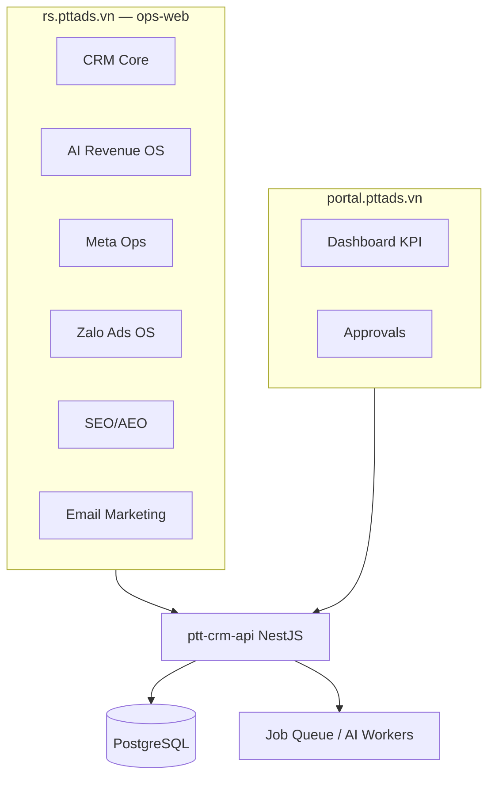

# RNOSAI — Business Analysis Master Specification

> **Document class:** Internal BA / QA / Engineering
> **Version:** 2.3 · **Generated:** 2026-08-01

## Document control

| Field | Value |
| --- | --- |
| Document ID | RNOSAI-BA-MASTER |
| Title | RNOSAI BA Master Spec — Screens & Use Cases |
| Version | 2.3 |
| Status | Approved for engineering reference |
| Author | BA / Revenue OS Team |
| Source of truth | `scripts/rnosai_ba_catalog_data.py` |
| Excel mirror | [`RNOSAI_BA_Spec.xlsx`](../samples/RNOSAI_BA_Spec.xlsx) |
| Staff app | https://rs.pttads.vn (ops-web :3200 + API :3000) |
| Client portal | https://portal.pttads.vn |

### Mục lục

- [Document control](#document-control)
- [1. Executive summary](#1-executive-summary)
- [2. Kiến trúc & phạm vi](#2-kiến-trúc--phạm-vi)
- [3. Quy ước mã](#3-quy-ước-mã)
- [4. Module catalog](#4-module-catalog)
- [5. Screen inventory](#5-screen-inventory)
- [6. Use case inventory](#6-use-case-inventory)
- [7. Module annexes (spec thủ công)](#7-module-annexes-spec-thủ-công)
- [8. Business rules](#8-business-rules)
- [9. Traceability matrix](#9-traceability-matrix)
- [10. Test cases](#10-test-cases)
- [11. Screen details (P0)](#11-screen-details-p0)
- [12. Change log](#12-change-log)

---

## 1. Executive summary

Bộ tài liệu mô tả **toàn bộ màn hình (SCR)** và **use case (UC)** của RNOSAI — Revenue Operating System + AI cho agency PTT. Cấu trúc bám template PTTCOM «Cấu trúc file Excel đề xuất.docx» với 3 lớp:

1. **Master Spec** (file này) — inventory, traceability, governance
2. **Module Annexes** — spec thủ công chi tiết 11 module (CRM, Meta, SVC, SEO, Portal, SYS, EM, PLAT, AI, Zalo, Mobile)
3. **Excel Workbook** — quản lý sprint, filter, validation trạng thái; **click mã SCR/UC hoặc cột «→ Sheet spec»** để mở sheet chi tiết

| Metric | Count | Manual spec |
| --- | --- | --- |
| Màn hình (SCR) | 129 | 129 spec (15 P0 + 114 deep/enriched) |
| Use case (UC) | 157 | 157 thủ công — 100% catalog (15 CRM + 14 Meta + 12 SVC + 14 SEO + 15 Portal + 12 SYS + 14 EM + 10 PLAT + 20 AI + 21 Zalo + 10 MOB) |
| Business rules (BR) | 147 | — |
| Test cases (TC) | 25 | — |
| Traceability links | 25 | — |

---

## 2. Kiến trúc & phạm vi

---

## 3. Quy ước mã

| Loại | Tiền tố | Ví dụ | Mô tả |
| --- | --- | --- | --- |
| Màn hình | SCR | SCR-CRM-001 | Route ops-web / portal-web — sidebar menu |
| Use case | UC | CRM-UC-001 | Luồng nghiệp vụ end-to-end theo module prefix |
| Test case | TC | TC-CRM-001 | UAT / E2E / regression gate script |
| Yêu cầu nghiệp vụ | BR | BR-CRM-001 | Business rule bắt buộc — traceability |
| API endpoint | API | GET /api/v1/leads | REST contract ptt-crm-api |
| Deliverable RNOS | RNOS | RNOS-29 | Backlog spec §18 production coding |
| Parity Getfly | P0 | P0-2 | Import/export Excel CRM parity |
| Lỗi / defect | BUG | BUG-001 | Tracker QA / incident |

**Priority UC:** P0 = go-live critical · P1 = enterprise depth · P2 = pilot optional

---

## 4. Module catalog

| Mã | Tên | Phạm vi |
| --- | --- | --- |
| MOD-CRM | CRM Core | Lead, Customer, CSKH, Sales, KPI, Forecast |
| MOD-AGENCY | Agency Service Delivery | Client onboard, workflow, ingest, jobs |
| MOD-META | Meta Enterprise Ops | Facebook Ads, tracking, intelligence, ads-ops |
| MOD-ZALO | Zalo Ads OS | Zalo Ads hub, lead ingest, CPL |
| MOD-SEO | SEO/AEO Enterprise | Research, content, technical, governance |
| MOD-EM | Email Marketing | Campaigns, contacts, journeys, deliverability |
| MOD-PORTAL | Client Portal | Dashboard, approvals, exports cho khách hàng |
| MOD-PLAT | Platform | Auth, webhook, job queue, RBAC |
| MOD-AI | AI Revenue OS | Copilot, score, forecast, automation, playbooks |
| MOD-ADMIN | Admin Console | AI runs/agents/tools, CRM config |
| MOD-AUTH | Authentication | Staff login JWT refresh |
| MOD-MOB | Mobile Experience | PWA staff + portal mobile + push + native shell cross-cutting |

---

## 5. Screen inventory

_Cột **Sheet Excel** = tên tab trong [`RNOSAI_BA_Spec.xlsx`](../samples/RNOSAI_BA_Spec.xlsx) (click mã SCR hoặc «→ Sheet spec» ở sheet `01_DanhSach_ManHinh`)._

| SCR | Tên | Module | Route | Roles | Status | UC | Priority | Sheet Excel |
| --- | --- | --- | --- | --- | --- | --- | --- | --- |
| SCR-AUTH-001 | Đăng nhập Staff (ops-web) | Auth | /login | All staff | Done | PLAT-UC-001 | High | SCR-AUTH-001 |
| SCR-CRM-001 | Quản lý Lead (danh sách) | CRM | /crm/leads | Sales, AM, Admin | Done | CRM-UC-001, CRM-UC-002, CRM-UC-015 | High | SCR-CRM-001 |
| SCR-CRM-002 | Chi tiết Lead | CRM | /crm/leads/[id] | Sales, AM, Admin | Done | CRM-UC-002, AI-UC-001, AI-UC-002, AI-UC-003, AI-UC-004 | High | SCR-CRM-002 |
| SCR-CRM-003 | Phải tra soát (Review Queue) | CRM | /crm/leads/review-queue | GDKD, Admin | Done | CRM-UC-003 | High | SCR-CRM-003 |
| SCR-CRM-004 | Bảng CSKH SLA | CRM | /crm/cskh-board | CSKH, Admin | Done | CRM-UC-008 | High | SCR-CRM-004 |
| SCR-CRM-005 | Dashboard kinh doanh chủ DN | CRM | /crm/business-dashboard | GDKD, Admin | Done | CRM-UC-014 | High | SCR-CRM-005 |
| SCR-CRM-006 | Dự báo doanh thu (Forecast) | CRM | /crm/forecast | GDKD, Finance | Done | AI-UC-013 | High | SCR-CRM-006 |
| SCR-CRM-007 | Sức khỏe khách hàng (Health) | CRM | /crm/health | AM, CSKH, GDKD | Done | AI-UC-017 | Medium | SCR-CRM-007 |
| SCR-CRM-008 | Khách hàng (post-convert) | CRM | /crm/customers | Sales, AM | Done | CRM-UC-007 | High | SCR-CRM-008 |
| SCR-CRM-009 | Chi tiết Khách hàng | CRM | /crm/customers/[id] | Sales, AM | Done | CRM-UC-007, AI-UC-008 | High | SCR-CRM-009 |
| SCR-CRM-010 | Hub CRM / Review | CRM | /crm/hub | GDKD, AM | Done | CRM-UC-003, CRM-UC-011 | High | SCR-CRM-010 |
| SCR-CRM-011 | KPI Dashboard nhân sự | CRM | /crm/kpi | GDKD, Admin | Done | CRM-UC-013 | High | SCR-CRM-011 |
| SCR-CRM-012 | Intake / Onboarding lead | CRM | /crm/intake | AM, Sales | Done | CRM-UC-005, SYS-UC-001 | Medium | SCR-CRM-012 |
| SCR-CRM-013 | Pipeline Sales | CRM | /crm/sales | Sales, GDKD | In progress | CRM-UC-009 | Medium | SCR-CRM-013 |
| SCR-CRM-014 | Đề xuất / Proposal | CRM | /crm/proposals | Sales, AM | Done | CRM-UC-006 | High | SCR-CRM-014 |
| SCR-CRM-015 | Dự án BĐS (RE Projects) | CRM | /crm/re-projects | RE PM, Admin | Done | CRM-UC-010, META-UC-004 | High | SCR-CRM-015 |
| SCR-CRM-016 | Quản lý nhân sự CRM | CRM | /crm/staff | Admin, HR | Done | CRM-UC-013 | Medium | SCR-CRM-016 |
| SCR-CRM-017 | Tickets / Case CSKH | CRM | /crm/tickets | CSKH, Admin | Done | CRM-UC-008 | High | SCR-CRM-017 |
| SCR-CRM-018 | Đơn hàng | CRM | /crm/orders | Finance, AM | Done | SVC-UC-004 | High | SCR-CRM-018 |
| SCR-CRM-019 | Hóa đơn | CRM | /crm/invoices | Finance, Admin | Done | SVC-UC-004 | High | SCR-CRM-019 |
| SCR-CRM-020 | Tài chính / AR aging | CRM | /crm/financials | Finance, AM | Done | SVC-UC-004, CRM-UC-011 | High | SCR-CRM-020 |
| SCR-CRM-021 | Marketing Plan | CRM | /crm/marketing-plan | AM, Strategist | In progress | SVC-UC-011 | Medium | SCR-CRM-021 |
| SCR-CRM-022 | SOP Library | CRM | /crm/sop | AM, PM | In progress | SVC-UC-011 | Medium | SCR-CRM-022 |
| SCR-CRM-023 | Catalog dịch vụ / ngành | CRM | /crm/catalog | Admin, Sales | Done | CRM-UC-012 | Medium | SCR-CRM-023 |
| SCR-CRM-024 | Staff KPI Dashboard | CRM | /crm/staff-kpi | GDKD, Admin | Done | CRM-UC-013 | Medium | SCR-CRM-024 |
| SCR-CRM-025 | Owner Weekly Report | CRM | /crm/owner-weekly | GDKD, AM | Done | CRM-UC-014 | Medium | SCR-CRM-025 |
| SCR-CRM-026 | Payroll / chấm công | CRM | /crm/payroll | HR, Finance | Done | CRM-UC-013 | Medium | SCR-CRM-026 |
| SCR-CRM-027 | Chi tiết nhân sự | CRM | /crm/staff/[id] | Admin, HR | Done | CRM-UC-013 | Medium | SCR-CRM-027 |
| SCR-CRM-030 | Chi tiết Marketing Plan | CRM | /crm/marketing-plan/[id] | AM, Strategist | In progress | SVC-UC-011 | Medium | SCR-CRM-030 |
| SCR-CRM-028 | Chi tiết dự án BĐS | CRM | /crm/re-projects/[id] | RE PM | Done | CRM-UC-010 | High | SCR-CRM-028 |
| SCR-CRM-029 | Chi tiết Service Delivery | CRM | /crm/service-delivery/[id] | AM, PM | Done | SVC-UC-001, SVC-UC-003 | High | SCR-CRM-029 |
| SCR-AI-001 | AI Insights / Copilot analytics | AI | /crm/ai/insights | GDKD, Admin | Done | AI-UC-005, AI-UC-009 | High | SCR-AI-001 |
| SCR-AI-002 | NL Analytics Query | AI | /crm/ai/query | GDKD, Admin | Done | AI-UC-016 | Medium | SCR-AI-002 |
| SCR-AI-003 | Manager Coach Digest | AI | /crm/ai/coach | GDKD | Done | AI-UC-018 | Medium | SCR-AI-003 |
| SCR-AI-004 | Automation Workflows | AI | /crm/automation | Admin, AM | Done | AI-UC-020 | High | SCR-AI-004 |
| SCR-AI-005 | Playbook RAG | AI | /crm/playbooks | Sales, AM | Done | AI-UC-020 | Medium | SCR-AI-005 |
| SCR-SVC-001 | Launch QA Checklist | Agency | /crm/launch-qa | AM, Media Buyer | Done | SVC-UC-005 | High | SCR-SVC-001 |
| SCR-SVC-002 | Campaign Write Queue | Agency | /crm/campaign-writes | Creative Lead, AM | Done | SVC-UC-007 | High | SCR-SVC-002 |
| SCR-SVC-003 | Creative Hub | Agency | /crm/creatives | Creative Lead | Done | SVC-UC-006 | High | SCR-SVC-003 |
| SCR-SVC-004 | Service Delivery Workflow | Agency | /crm/service-delivery | AM, PM | Done | SVC-UC-001, SVC-UC-003 | High | SCR-SVC-004 |
| SCR-AGENCY-001 | Chi tiết Client Agency | Agency | /agency/clients/[id] | AM, Admin | Done | SVC-UC-002, SYS-UC-001 | High | SCR-AGENCY-001 |
| SCR-AGENCY-002 | Tạo Client mới | Agency | /agency/clients/new | AM, Admin | Done | SYS-UC-001, SVC-UC-002 | High | SCR-AGENCY-002 |
| SCR-AGENCY-003 | Agency Hub | Agency | /agency | AM, Admin | Done | SVC-UC-010 | Medium | SCR-AGENCY-003 |
| SCR-AGENCY-004 | Ingest Monitor | Agency | /agency/ingest | Admin, Tracking | Done | SVC-UC-009 | Medium | SCR-AGENCY-004 |
| SCR-AGENCY-005 | Agency Jobs Queue | Agency | /agency/jobs | Admin, DevOps | Done | PLAT-UC-007 | Medium | SCR-AGENCY-005 |
| SCR-AGENCY-006 | KPI Definitions | Agency | /agency/kpi-definitions | Admin, AM | Done | SVC-UC-010 | Medium | SCR-AGENCY-006 |
| SCR-AGENCY-007 | Agency Notifications | Agency | /agency/notifications | AM, Admin | Done | ZALO-UC-020 | Medium | SCR-AGENCY-007 |
| SCR-META-001 | Facebook Ads Hub | Meta | /meta/facebook-ads | Media Buyer, AM | Done | META-UC-001, META-UC-002, META-UC-003 | High | SCR-META-001 |
| SCR-META-002 | Meta Intelligence | Meta | /meta/intelligence | Media Buyer, GDKD | Done | META-UC-010, META-UC-011 | Medium | SCR-META-002 |
| SCR-META-003 | Tracking Health & Pixel | Meta | /meta/tracking | Tracking/Tech | Done | META-UC-006, META-UC-005 | High | SCR-META-003 |
| SCR-META-004 | Ads Ops (Launch/Edit) | Meta | /meta/ads-ops | Media Buyer | Done | META-UC-007, META-UC-008 | High | SCR-META-004 |
| SCR-META-005 | Ads Combined (cross-channel) | Meta | /meta/ads-combined | Media Buyer, GDKD | Done | SYS-UC-002, ZALO-UC-018 | High | SCR-META-005 |
| SCR-META-006 | Meta API Migration | Meta | /meta/migration | DevOps, Media Buyer | Draft | META-UC-014 | Medium | SCR-META-006 |
| SCR-ZALO-001 | Zalo Ads Hub | Zalo | /zalo/zalo-ads | Media Buyer, AM | Done | ZALO-UC-001, ZALO-UC-002, ZALO-UC-004 | High | SCR-ZALO-001 |
| SCR-ZALO-002 | Zalo Leads Inbox | Zalo | /zalo/leads | CSKH, Media Buyer | Done | ZALO-UC-011, ZALO-UC-012, ZALO-UC-013 | High | SCR-ZALO-002 |
| SCR-EM-001 | Email Hub | EM | /email/hub | Email Strategist, AM | Done | EM-UC-001, EM-UC-013 | High | SCR-EM-001 |
| SCR-EM-002 | Email Campaigns | EM | /email/campaigns | Email Strategist | Done | EM-UC-006, EM-UC-007 | High | SCR-EM-002 |
| SCR-EM-003 | Email Contacts | EM | /email/contacts | Email Strategist | Done | EM-UC-002, EM-UC-003, EM-UC-004 | High | SCR-EM-003 |
| SCR-EM-004 | Email Templates | EM | /email/templates | Email Strategist | Done | EM-UC-005 | High | SCR-EM-004 |
| SCR-EM-005 | Email Journeys | EM | /email/journeys | Email Strategist | Done | EM-UC-011 | Medium | SCR-EM-005 |
| SCR-EM-006 | Email Governance | EM | /email/governance | Compliance, Admin | Done | EM-UC-012 | Medium | SCR-EM-006 |
| SCR-EM-007 | Email Deliverability | EM | /email/deliverability | Email Strategist, Compliance | Done | EM-UC-010 | High | SCR-EM-007 |
| SCR-EM-008 | Email Reports | EM | /email/reports | Email Strategist, AM | Done | EM-UC-013 | Medium | SCR-EM-008 |
| SCR-EM-009 | Email Segments | EM | /email/segments | Email Strategist | Done | EM-UC-004 | High | SCR-EM-009 |
| SCR-EM-010 | Suppression List | EM | /email/suppression | Email Strategist, Compliance | Done | EM-UC-009 | High | SCR-EM-010 |
| SCR-EM-011 | Consent Log | EM | /email/consent | Compliance | Done | EM-UC-002 | High | SCR-EM-011 |
| SCR-EM-012 | Email Client Workspace | EM | /email/clients | Email Strategist, AM | Done | EM-UC-001 | High | SCR-EM-012 |
| SCR-EM-021 | Chi tiết Email Client Workspace | EM | /email/clients/[id] | Email Strategist, AM | Done | EM-UC-001 | High | SCR-EM-021 |
| SCR-EM-013 | Email Gate A (prod cutover) | EM | /email/gate-a | DevOps, Admin | Done | SYS-UC-009 | High | SCR-EM-013 |
| SCR-EM-014 | Public Confirm (double opt-in) | EM | /email/public/confirm/[token] | End Subscriber | Done | EM-UC-002 | High | SCR-EM-014 |
| SCR-EM-015 | Public Preference Center | EM | /email/public/preferences/[token] | End Subscriber | Done | EM-UC-014 | High | SCR-EM-015 |
| SCR-EM-016 | Public Unsubscribe | EM | /email/public/unsubscribe/[token] | End Subscriber | Done | EM-UC-009 | High | SCR-EM-016 |
| SCR-EM-017 | Chi tiết Campaign | EM | /email/campaigns/[id] | Email Strategist | Done | EM-UC-006, EM-UC-007 | High | SCR-EM-017 |
| SCR-EM-018 | Campaign Review | EM | /email/campaigns/[id]/review | Compliance, Client Approver | Done | EM-UC-007 | High | SCR-EM-018 |
| SCR-EM-019 | Chi tiết Journey | EM | /email/journeys/[id] | Email Strategist | Done | EM-UC-011 | Medium | SCR-EM-019 |
| SCR-EM-020 | Chi tiết Template | EM | /email/templates/[id] | Email Strategist | Done | EM-UC-005 | High | SCR-EM-020 |
| SCR-SEO-001 | SEO Hub | SEO | /seo/hub | SEO Strategist, AM | Done | SEO-UC-001, SEO-UC-012 | High | SCR-SEO-001 |
| SCR-SEO-002 | SEO Content Pipeline | SEO | /seo/content | SEO Strategist | Done | SEO-UC-005, SEO-UC-006 | High | SCR-SEO-002 |
| SCR-SEO-016 | Chi tiết SEO Content (staff) | SEO | /seo/content/[id] | SEO Strategist, Writer | Done | SEO-UC-005, SEO-UC-006, PORTAL-UC-007 | High | SCR-SEO-016 |
| SCR-SEO-003 | SEO Research | SEO | /seo/research | SEO Strategist | Done | SEO-UC-004 | High | SCR-SEO-003 |
| SCR-SEO-004 | SEO Technical Audit | SEO | /seo/technical | Tracking/Tech | Done | SEO-UC-007 | High | SCR-SEO-004 |
| SCR-SEO-005 | SEO Reports | SEO | /seo/reports | SEO Strategist, AM | Done | SEO-UC-013 | High | SCR-SEO-005 |
| SCR-SEO-006 | SEO Governance | SEO | /seo/governance | Compliance, Admin | Done | SEO-UC-006 | Medium | SCR-SEO-006 |
| SCR-SEO-007 | SEO AEO Scan | SEO | /seo/aeo | SEO Strategist | Done | SEO-UC-008 | Medium | SCR-SEO-007 |
| SCR-SEO-008 | Rank Tracker | SEO | /seo/ranks | SEO Strategist | Done | SEO-UC-011 | Medium | SCR-SEO-008 |
| SCR-SEO-009 | Freshness Queue | SEO | /seo/freshness | SEO Strategist | Done | SEO-UC-010 | Medium | SCR-SEO-009 |
| SCR-SEO-010 | SEO BI / ClickHouse | SEO | /seo/bi | Admin, BI | In progress | SEO-UC-014 | Medium | SCR-SEO-010 |
| SCR-SEO-011 | CMS Publish Webhook | SEO | /seo/cms | SEO Strategist, System | Done | SEO-UC-009 | Medium | SCR-SEO-011 |
| SCR-SEO-012 | SEO Client Workspaces | SEO | /seo/clients | SEO Strategist, AM | Done | SEO-UC-001 | High | SCR-SEO-012 |
| SCR-SEO-017 | Chi tiết SEO Client Workspace | SEO | /seo/clients/[id] | SEO Strategist, AM | Done | SEO-UC-001, SEO-UC-002, SEO-UC-003 | High | SCR-SEO-017 |
| SCR-SEO-013 | SEO Strategy | SEO | /seo/strategy | SEO Strategist | Done | SEO-UC-004 | Medium | SCR-SEO-013 |
| SCR-SEO-014 | SEO Gate A (prod cutover) | SEO | /seo/gate-a | DevOps, Admin | Done | SYS-UC-009 | High | SCR-SEO-014 |
| SCR-SEO-015 | SEO Authority / E-E-A-T | SEO | /seo/authority | SEO Strategist | Done | SEO-UC-007 | Medium | SCR-SEO-015 |
| SCR-SEO-018 | SEO Automations & Alerts | SEO | /seo/automations | SEO Strategist, Admin | Done | SEO-UC-011, PLAT-UC-007 | Medium | SCR-SEO-018 |
| SCR-SEO-019 | SEO Experiments | SEO | /seo/experiments | SEO Strategist | Done | SEO-UC-004 | Medium | SCR-SEO-019 |
| SCR-ADMIN-001 | Admin AI Runs | Admin | /admin/ai/runs | Super Admin | Done | AI-UC-009 | High | SCR-ADMIN-001 |
| SCR-ADMIN-002 | Admin AI Agents | Admin | /admin/ai/agents | Super Admin | Done | AI-UC-010 | Medium | SCR-ADMIN-002 |
| SCR-ADMIN-003 | Admin AI Tools | Admin | /admin/ai/tools | Super Admin | Done | AI-UC-020 | Medium | SCR-ADMIN-003 |
| SCR-ADMIN-004 | CRM Pipeline Config | Admin | /admin/crm/pipeline | Super Admin | Done | CRM-UC-009 | Medium | SCR-ADMIN-004 |
| SCR-ADMIN-005 | CRM Custom Fields | Admin | /admin/crm/custom-fields | Super Admin | Done | CRM-UC-012 | Medium | SCR-ADMIN-005 |
| SCR-GOOGLE-001 | Google Ads Hub | Meta | /google/google-ads | Media Buyer, AM | Done | SVC-UC-008, PLAT-UC-005 | Medium | SCR-GOOGLE-001 |
| SCR-PORTAL-001 | Portal Dashboard KPI | Portal | /dashboard | Client Viewer | Done | PORTAL-UC-001, PORTAL-UC-002 | High | SCR-PORTAL-001 |
| SCR-PORTAL-002 | Portal Login | Portal | /login | Client Viewer | Done | PORTAL-UC-001, PORTAL-UC-011, PLAT-UC-003 | High | SCR-PORTAL-002 |
| SCR-PORTAL-003 | Portal Meta Performance | Portal | /meta | Client Viewer | Done | PORTAL-UC-003 | High | SCR-PORTAL-003 |
| SCR-PORTAL-004 | Portal Creatives Approval | Portal | /creatives | Client Approver | Done | PORTAL-UC-006, PORTAL-UC-009, PORTAL-UC-014 | High | SCR-PORTAL-004 |
| SCR-PORTAL-005 | Portal Email Stats | Portal | /email | Client Viewer | Done | PORTAL-UC-005, PORTAL-UC-008 | Medium | SCR-PORTAL-005 |
| SCR-PORTAL-006 | Portal SEO Summary | Portal | /seo | Client Viewer | Done | PORTAL-UC-004, PORTAL-UC-007 | Medium | SCR-PORTAL-006 |
| SCR-PORTAL-007 | Portal Zalo Performance | Portal | /zalo | Client Viewer | Done | PORTAL-UC-013, ZALO-UC-005 | Medium | SCR-PORTAL-007 |
| SCR-PORTAL-008 | Portal Google Performance | Portal | /google | Client Viewer | In progress | PORTAL-UC-015 | Medium | SCR-PORTAL-008 |
| SCR-PORTAL-009 | Portal Notifications | Portal | /notifications | Client Viewer | Done | PORTAL-UC-010, ZALO-UC-020 | Medium | SCR-PORTAL-009 |
| SCR-PORTAL-010 | Portal Settings | Portal | /settings | Client Approver | Done | PORTAL-UC-010, PORTAL-UC-012 | Low | SCR-PORTAL-010 |
| SCR-PORTAL-011 | Portal Forgot Password | Portal | /forgot-password | Client Viewer | Done | PORTAL-UC-011 | High | SCR-PORTAL-011 |
| SCR-PORTAL-012 | Portal Reset Password | Portal | /reset-password | Client Viewer | Done | PORTAL-UC-011 | High | SCR-PORTAL-012 |
| SCR-PORTAL-013 | Portal Archived Client | Portal | /archived | Client Viewer | Done | PORTAL-UC-001 | Medium | SCR-PORTAL-013 |
| SCR-PORTAL-014 | Portal Email Approvals | Portal | /email/approvals | Client Approver | Done | PORTAL-UC-008 | High | SCR-PORTAL-014 |
| SCR-PORTAL-015 | Portal Email Campaign Detail | Portal | /email/campaigns/[id] | Client Viewer | Done | PORTAL-UC-005 | Medium | SCR-PORTAL-015 |
| SCR-PORTAL-016 | Portal SEO Reports | Portal | /seo/reports | Client Viewer | Done | PORTAL-UC-004, PORTAL-UC-010 | Medium | SCR-PORTAL-016 |
| SCR-PORTAL-017 | Portal SEO Content List | Portal | /seo/content | Client Approver | Done | PORTAL-UC-007 | Medium | SCR-PORTAL-017 |
| SCR-PORTAL-018 | Portal SEO Content Detail | Portal | /seo/content/[id] | Client Approver | Done | PORTAL-UC-007 | Medium | SCR-PORTAL-018 |
| SCR-MOB-001 | PWA Install Shell (Staff) | Mobile | ops-web global | CSKH, Sales | Done | MOB-UC-001 | High | SCR-MOB-001 |
| SCR-MOB-002 | Lead List Mobile | Mobile | /crm/leads @ ≤768px | CSKH, Sales | Done | MOB-UC-002, MOB-UC-004 | High | SCR-MOB-002 |
| SCR-MOB-003 | Lead Detail Mobile | Mobile | /crm/leads/[id] @ mobile | CSKH | Done | MOB-UC-003, MOB-UC-004 | High | SCR-MOB-003 |
| SCR-MOB-004 | CSKH Board Mobile | Mobile | /crm/cskh-board @ mobile | CSKH | Done | CRM-UC-008 | Medium | SCR-MOB-004 |
| SCR-MOB-005 | Portal Install Shell | Mobile | portal-web global | Client Approver | Done | MOB-UC-005 | High | SCR-MOB-005 |
| SCR-MOB-006 | Portal Dashboard Mobile | Mobile | /dashboard @ ≤768px | Client Viewer | Done | MOB-UC-008 | Medium | SCR-MOB-006 |
| SCR-MOB-007 | Creative Inbox Mobile | Mobile | /creatives @ mobile | Client Approver | Done | MOB-UC-006, MOB-UC-007 | High | SCR-MOB-007 |
| SCR-MOB-008 | Email Approvals Mobile | Mobile | /email/approvals @ mobile | Client Approver | Done | MOB-UC-007 | High | SCR-MOB-008 |
| SCR-MOB-009 | Notification Center Mobile | Mobile | /notifications @ mobile | Client Viewer | Done | MOB-UC-006 | Medium | SCR-MOB-009 |
| SCR-MOB-010 | Push Settings | Mobile | /settings (push section) | Client Approver | Done | MOB-UC-009 | Medium | SCR-MOB-010 |

---

## 6. Use case inventory

_Cột **Sheet Excel** = tên tab UC (click mã UC hoặc «→ Sheet spec» ở sheet `03_DanhSach_UseCase`)._

| UC | Tên | Screens | Actor | Pri | Status | Spec | Sheet Excel |
| --- | --- | --- | --- | --- | --- | --- | --- |
| SYS-UC-001 | Onboard client mới end-to-end | SCR-AGENCY-002, SCR-AGENCY-001 | AM / Admin | High | Done | 🟢 | SYS-UC-001 |
| SYS-UC-002 | Closed-loop Spend → Lead → Revenue | SCR-META-001, SCR-META-005, SCR-CRM-001, SCR-CRM-005 | GDKD / System | High | Done | 🟢 | SYS-UC-002 |
| SYS-UC-003 | Launch campaign đa kênh có governance | SCR-SVC-001, SCR-META-004, SCR-SVC-002 | AM / Media Buyer | High | Done | 🟢 | SYS-UC-003 |
| SYS-UC-004 | Client approval cross-module | SCR-PORTAL-004, SCR-PORTAL-006, SCR-PORTAL-005 | Client Approver | High | Done | 🟢 | SYS-UC-004 |
| SYS-UC-005 | Báo cáo định kỳ cho khách hàng | SCR-PORTAL-001, SCR-PORTAL-003 | AM / System | High | Done | 🟢 | SYS-UC-005 |
| SYS-UC-006 | Offboard client & thu hồi quyền | SCR-AGENCY-001 | Admin | Medium | In progress | 🟢 | SYS-UC-006 |
| SYS-UC-007 | Drill-down executive ≤3 clicks | SCR-CRM-005, SCR-META-001 | GDKD | Medium | Done | 🟢 | SYS-UC-007 |
| SYS-UC-008 | Incident P1 — webhook down | SCR-AGENCY-004 | DevOps / Admin | High | Done | 🟢 | SYS-UC-008 |
| SYS-UC-009 | Staged prod cutover module flag | SCR-ADMIN-002, SCR-EM-013, SCR-SEO-014 | Super Admin | Medium | Done | 🟢 | SYS-UC-009 |
| SYS-UC-010 | Audit trail tra cứu cross-module | SCR-ADMIN-001 | Compliance / Admin | Medium | Done | 🟢 | SYS-UC-010 |
| SYS-UC-011 | Multi-client isolation verify | SCR-AGENCY-001 | Admin / QA | High | Done | 🟢 | SYS-UC-011 |
| SYS-UC-012 | Hypercare post go-live | SCR-CRM-004, SCR-AGENCY-001 | AM / CSKH | Medium | In progress | 🟢 | SYS-UC-012 |
| CRM-UC-001 | Đăng nhập & phân công lead tự động | SCR-CRM-001, SCR-AUTH-001 | CSKH / System | High | Done | 🟢 | CRM-UC-001 |
| CRM-UC-002 | Chăm sóc lead B2 (Liên hệ OK) | SCR-CRM-002 | CSKH | High | Done | 🟢 | CRM-UC-002 |
| CRM-UC-003 | Review queue GDKD | SCR-CRM-003, SCR-CRM-010 | GDKD | High | Done | 🟢 | CRM-UC-003 |
| CRM-UC-004 | Add-on ngành trên lead | SCR-CRM-002 | CSKH / AM | Medium | In progress | 🟢 | CRM-UC-004 |
| CRM-UC-005 | Pre-sales & KH MKT sơ bộ | SCR-CRM-012, SCR-CRM-002 | Pre-sales / AM | High | Done | 🟢 | CRM-UC-005 |
| CRM-UC-006 | Chuyển lead → Proposal/HĐ | SCR-CRM-014, SCR-CRM-002 | Sales / AM | High | Done | 🟢 | CRM-UC-006 |
| CRM-UC-007 | Convert → Customer + Case | SCR-CRM-008, SCR-CRM-009 | Sales / AM | High | Done | 🟢 | CRM-UC-007 |
| CRM-UC-008 | Quản lý bảng CSKH | SCR-CRM-004, SCR-CRM-017 | CSKH | High | Done | 🟢 | CRM-UC-008 |
| CRM-UC-009 | Pipeline sales & đề xuất | SCR-CRM-013, SCR-ADMIN-004 | Sales / GDKD | Medium | In progress | 🟢 | CRM-UC-009 |
| CRM-UC-010 | Dự án BĐS (RE Projects) | SCR-CRM-015, SCR-CRM-028 | RE PM | Medium | Done | 🟢 | CRM-UC-010 |
| CRM-UC-011 | Hub hợp đồng & lifecycle | SCR-CRM-010, SCR-CRM-020 | AM / GDKD | High | Done | 🟢 | CRM-UC-011 |
| CRM-UC-012 | Catalog dịch vụ/ngành | SCR-CRM-023, SCR-ADMIN-005 | Admin / AM | Medium | Done | 🟢 | CRM-UC-012 |
| CRM-UC-013 | KPI nhân sự & chấm công | SCR-CRM-011, SCR-CRM-016, SCR-CRM-024, SCR-CRM-026, SCR-CRM-027 | GDKD / HR | Medium | Done | 🟢 | CRM-UC-013 |
| CRM-UC-014 | Dashboard kinh doanh chủ DN | SCR-CRM-005, SCR-CRM-025 | GDKD | Medium | Done | 🟢 | CRM-UC-014 |
| CRM-UC-015 | Import/export lead | SCR-CRM-001 | Sales / AM | Medium | Done | 🟢 | CRM-UC-015 |
| SVC-UC-001 | Workflow lifecycle 7 stage | SCR-SVC-004, SCR-CRM-029 | AM / PM | High | Done | 🟢 | SVC-UC-001 |
| SVC-UC-002 | Onboard checklist client | SCR-AGENCY-001, SCR-AGENCY-002 | AM | High | Done | 🟢 | SVC-UC-002 |
| SVC-UC-003 | Deliver stage — TMMT chính thức | SCR-SVC-004 | AM / PM | High | Done | 🟢 | SVC-UC-003 |
| SVC-UC-004 | Handover → Retain + finance gate | SCR-CRM-018, SCR-CRM-019, SCR-CRM-020 | AM / Finance | High | Done | 🟢 | SVC-UC-004 |
| SVC-UC-005 | Launch QA checklist | SCR-SVC-001 | AM / Media Buyer | High | Done | 🟢 | SVC-UC-005 |
| SVC-UC-006 | Creative Hub upload & review | SCR-SVC-003 | Creative Lead | High | Done | 🟢 | SVC-UC-006 |
| SVC-UC-007 | Campaign Write queue approval | SCR-SVC-002 | Creative Lead / AM | High | Done | 🟢 | SVC-UC-007 |
| SVC-UC-008 | Map channel account (Meta/Google) | SCR-META-001, SCR-GOOGLE-001 | Tracking/Tech | High | Done | 🟢 | SVC-UC-008 |
| SVC-UC-009 | Agency ingest monitor | SCR-AGENCY-004 | Admin | Medium | Done | 🟢 | SVC-UC-009 |
| SVC-UC-010 | KPI definitions agency-wide | SCR-AGENCY-003, SCR-AGENCY-006 | Admin / GDKD | Medium | Done | 🟢 | SVC-UC-010 |
| SVC-UC-011 | SOP & marketing plan | SCR-SVC-004, SCR-CRM-021, SCR-CRM-022, SCR-CRM-030 | AM | Medium | In progress | 🟢 | SVC-UC-011 |
| SVC-UC-012 | Offboarding SOP | SCR-AGENCY-001 | AM / Admin | Medium | Draft | 🟢 | SVC-UC-012 |
| META-UC-001 | Kết nối ad account & sync insights | SCR-META-001 | Media Buyer / System | High | Done | 🟢 | META-UC-001 |
| META-UC-002 | Hub map campaign ↔ CRM | SCR-META-001 | Media Buyer | High | Done | 🟢 | META-UC-002 |
| META-UC-003 | Xem CPL/ROAS trên hub | SCR-META-001 | Media Buyer / AM | High | Done | 🟢 | META-UC-003 |
| META-UC-004 | Webhook lead Meta → CRM | SCR-CRM-001, SCR-CRM-015 | System | High | Done | 🟢 | META-UC-004 |
| META-UC-005 | CAPI event gửi & dedup | SCR-META-003 | Tracking/Tech | High | Done | 🟢 | META-UC-005 |
| META-UC-006 | Tracking health & pixel test | SCR-META-003 | Tracking/Tech | High | Done | 🟢 | META-UC-006 |
| META-UC-007 | Launch Ads wizard | SCR-META-004 | Media Buyer | High | Done | 🟢 | META-UC-007 |
| META-UC-008 | Edit campaign có governance | SCR-META-004 | Media Buyer | High | Done | 🟢 | META-UC-008 |
| META-UC-009 | Anomaly detection & alert | SCR-META-002 | Media Buyer / System | Medium | Done | 🟢 | META-UC-009 |
| META-UC-010 | Intelligence forecast | SCR-META-002 | Media Buyer / GDKD | Medium | Done | 🟢 | META-UC-010 |
| META-UC-011 | Breakdown insights (platform/placement) | SCR-META-002 | Media Buyer | Medium | Done | 🟢 | META-UC-011 |
| META-UC-012 | Pause domain/client spend emergency | SCR-META-004 | Admin / GDKD | High | Done | 🟢 | META-UC-012 |
| META-UC-013 | Weekly client PDF report | SCR-PORTAL-003 | AM / System | Medium | Done | 🟢 | META-UC-013 |
| META-UC-014 | Horizon migration signoff | SCR-META-006 | Admin | Medium | Draft | 🟢 | META-UC-014 |
| SEO-UC-001 | Onboard client SEO workspace | SCR-SEO-001, SCR-SEO-012, SCR-SEO-017 | SEO Strategist / AM | High | Done | 🟢 | SEO-UC-001 |
| SEO-UC-002 | OAuth GSC & sync | SCR-SEO-001, SCR-SEO-017 | SEO Strategist | High | Done | 🟢 | SEO-UC-002 |
| SEO-UC-003 | OAuth GA4 & sync | SCR-SEO-001, SCR-SEO-017 | SEO Strategist | High | Done | 🟢 | SEO-UC-003 |
| SEO-UC-004 | Research → import keywords | SCR-SEO-003, SCR-SEO-013, SCR-SEO-019 | SEO Strategist | High | Done | 🟢 | SEO-UC-004 |
| SEO-UC-005 | Content pipeline stage advance | SCR-SEO-002, SCR-SEO-016 | SEO Strategist | High | Done | 🟢 | SEO-UC-005 |
| SEO-UC-006 | Governance block publish | SCR-SEO-006, SCR-SEO-002, SCR-SEO-016 | Compliance | High | Done | 🟢 | SEO-UC-006 |
| SEO-UC-007 | Technical audit & issue fix | SCR-SEO-004, SCR-SEO-015 | Tracking/Tech | High | Done | 🟢 | SEO-UC-007 |
| SEO-UC-008 | AEO scan & coverage | SCR-SEO-007 | SEO Strategist | Medium | Done | 🟢 | SEO-UC-008 |
| SEO-UC-009 | CMS publish webhook | SCR-SEO-002, SCR-SEO-011 | System | Medium | Done | 🟢 | SEO-UC-009 |
| SEO-UC-010 | Freshness queue refresh | SCR-SEO-002, SCR-SEO-009 | SEO Strategist | Medium | Done | 🟢 | SEO-UC-010 |
| SEO-UC-011 | Rank tracker capture | SCR-SEO-001, SCR-SEO-008, SCR-SEO-018 | SEO Strategist / System | Medium | Done | 🟢 | SEO-UC-011 |
| SEO-UC-012 | Executive hub drill-down | SCR-SEO-001 | GDKD / AM | High | Done | 🟢 | SEO-UC-012 |
| SEO-UC-013 | Client PDF report export | SCR-SEO-005, SCR-PORTAL-006, SCR-PORTAL-016 | AM / SEO Strategist | High | Done | 🟢 | SEO-UC-013 |
| SEO-UC-014 | ClickHouse BI export | SCR-SEO-005, SCR-SEO-010 | Admin / BI | Medium | In progress | 🟢 | SEO-UC-014 |
| EM-UC-001 | Onboard email workspace & domain | SCR-EM-001, SCR-EM-012, SCR-EM-021 | Email Strategist / AM | High | Done | 🟢 | EM-UC-001 |
| EM-UC-002 | Capture form → consent | SCR-EM-003, SCR-EM-011, SCR-EM-014 | System / End Subscriber | High | Done | 🟢 | EM-UC-002 |
| EM-UC-003 | Import contacts CSV | SCR-EM-003 | Email Strategist | High | Done | 🟢 | EM-UC-003 |
| EM-UC-004 | Segment compute (RFM/behavior) | SCR-EM-003, SCR-EM-009 | Email Strategist / System | High | Done | 🟢 | EM-UC-004 |
| EM-UC-005 | Template studio + preflight | SCR-EM-004, SCR-EM-020 | Email Strategist | High | Done | 🟢 | EM-UC-005 |
| EM-UC-006 | Campaign broadcast F1 | SCR-EM-002, SCR-EM-017 | Email Strategist | High | Done | 🟢 | EM-UC-006 |
| EM-UC-007 | Staff + client approval | SCR-EM-002, SCR-EM-017, SCR-EM-018, SCR-PORTAL-014, SCR-PORTAL-015 | Email Strategist / Client Approver | High | Done | 🟢 | EM-UC-007 |
| EM-UC-008 | ESP send & webhook engagement | SCR-EM-002 | System | High | Done | 🟢 | EM-UC-008 |
| EM-UC-009 | Suppression & one-click unsub | SCR-EM-003, SCR-EM-010, SCR-EM-016 | System / End Subscriber | High | Done | 🟢 | EM-UC-009 |
| EM-UC-010 | Deliverability incident F3 | SCR-EM-007 | Email Strategist / Compliance | High | Done | 🟢 | EM-UC-010 |
| EM-UC-011 | Journey automation activate | SCR-EM-005, SCR-EM-019 | Email Strategist | Medium | Done | 🟢 | EM-UC-011 |
| EM-UC-012 | Governance rule CRUD | SCR-EM-006 | Compliance / Admin | Medium | Done | 🟢 | EM-UC-012 |
| EM-UC-013 | Reports & Grafana BI | SCR-EM-008 | Email Strategist / AM | Medium | Done | 🟢 | EM-UC-013 |
| EM-UC-014 | Public preference center | SCR-EM-003, SCR-EM-015 | End Subscriber | High | Done | 🟢 | EM-UC-014 |
| PORTAL-UC-001 | Login portal scoped client | SCR-PORTAL-002, SCR-PORTAL-013 | Client Viewer | High | Done | 🟢 | PORTAL-UC-001 |
| PORTAL-UC-002 | Dashboard KPI multi-module | SCR-PORTAL-001 | Client Viewer | High | Done | 🟢 | PORTAL-UC-002 |
| PORTAL-UC-003 | Meta performance view + CSV | SCR-PORTAL-003 | Client Viewer | High | Done | 🟢 | PORTAL-UC-003 |
| PORTAL-UC-004 | SEO summary view | SCR-PORTAL-006, SCR-PORTAL-016 | Client Viewer | Medium | Done | 🟢 | PORTAL-UC-004 |
| PORTAL-UC-005 | Email campaign stats | SCR-PORTAL-005, SCR-PORTAL-015 | Client Viewer | Medium | Done | 🟢 | PORTAL-UC-005 |
| PORTAL-UC-006 | Approval inbox Meta creative | SCR-PORTAL-004 | Client Approver | High | Done | 🟢 | PORTAL-UC-006 |
| PORTAL-UC-007 | Approval SEO content | SCR-PORTAL-017, SCR-PORTAL-018 | Client Approver | Medium | Done | 🟢 | PORTAL-UC-007 |
| PORTAL-UC-008 | Approval email campaign | SCR-PORTAL-014 | Client Approver | Medium | Done | 🟢 | PORTAL-UC-008 |
| PORTAL-UC-009 | Reject with comment | SCR-PORTAL-004 | Client Approver | High | Done | 🟢 | PORTAL-UC-009 |
| PORTAL-UC-010 | Export & download artifact | SCR-PORTAL-010, SCR-PORTAL-016 | Client Viewer | High | Done | 🟢 | PORTAL-UC-010 |
| PORTAL-UC-011 | Quên mật khẩu / reset | SCR-PORTAL-002, SCR-PORTAL-011, SCR-PORTAL-012 | Client Viewer | High | Done | 🟢 | PORTAL-UC-011 |
| PORTAL-UC-012 | Đổi mật khẩu khi đã login | SCR-PORTAL-010 | Client Viewer | Medium | Done | 🟢 | PORTAL-UC-012 |
| PORTAL-UC-013 | Zalo performance view + export | SCR-PORTAL-007 | Client Viewer | High | Done | 🟢 | PORTAL-UC-013 |
| PORTAL-UC-014 | Zalo creative approval | SCR-PORTAL-004 | Client Approver | Medium | Done | 🟢 | PORTAL-UC-014 |
| PORTAL-UC-015 | Google performance view | SCR-PORTAL-008 | Client Viewer | Medium | In progress | 🟢 | PORTAL-UC-015 |
| PLAT-UC-001 | Staff JWT login & refresh | SCR-AUTH-001 | Staff | High | Done | 🟢 | PLAT-UC-001 |
| PLAT-UC-002 | RBAC cap enforcement | SCR-AUTH-001 | All staff | High | Done | 🟢 | PLAT-UC-002 |
| PLAT-UC-003 | Portal JWT login | SCR-PORTAL-002 | Client Viewer | High | Done | 🟢 | PLAT-UC-003 |
| PLAT-UC-004 | Webhook Meta ingest | SCR-AGENCY-004 | System | High | Done | 🟢 | PLAT-UC-004 |
| PLAT-UC-005 | Webhook Zalo/Google ingest | SCR-AGENCY-004 | System | High | Done | 🟢 | PLAT-UC-005 |
| PLAT-UC-006 | Webhook Email ESP ingest | SCR-AGENCY-004 | System | High | Done | 🟢 | PLAT-UC-006 |
| PLAT-UC-007 | Job queue worker process | SCR-AGENCY-005 | System | High | Done | 🟢 | PLAT-UC-007 |
| PLAT-UC-008 | Temporal approval workflow | SCR-SVC-002 | System | Medium | In progress | 🟢 | PLAT-UC-008 |
| PLAT-UC-009 | Seed staff permissions | SCR-AUTH-001 | Super Admin | High | Done | 🟢 | PLAT-UC-009 |
| PLAT-UC-010 | Health check & soak evidence | SCR-AGENCY-004 | DevOps | Medium | Done | 🟢 | PLAT-UC-010 |
| ZALO-UC-001 | Kết nối Zalo Ads / OA | SCR-ZALO-001 | Media Buyer | High | Done | 🟢 | ZALO-UC-001 |
| ZALO-UC-002 | Hub map campaign | SCR-ZALO-001 | Media Buyer | High | Done | 🟢 | ZALO-UC-002 |
| ZALO-UC-003 | Sync insights → daily_performance | SCR-ZALO-001 | System | High | Done | 🟢 | ZALO-UC-003 |
| ZALO-UC-004 | Hub CPL staff | SCR-ZALO-001 | Media Buyer / AM | High | Done | 🟢 | ZALO-UC-004 |
| ZALO-UC-005 | Portal performance | SCR-PORTAL-007 | Client Viewer | High | Done | 🟢 | ZALO-UC-005 |
| ZALO-UC-006 | Brief chiến dịch | SCR-ZALO-001 | AM / Media Buyer | Medium | Done | 🟢 | ZALO-UC-006 |
| ZALO-UC-007 | Tạo campaign draft | SCR-ZALO-001 | Media Buyer | Medium | In progress | 🟢 | ZALO-UC-007 |
| ZALO-UC-008 | Duyệt nội dung | SCR-ZALO-001 | Creative Lead | Medium | Done | 🟢 | ZALO-UC-008 |
| ZALO-UC-009 | Triển khai lên Zalo (API) | SCR-ZALO-001 | Media Buyer | Low | Draft | 🟢 | ZALO-UC-009 |
| ZALO-UC-010 | Pause/update/stop campaign | SCR-ZALO-001 | Media Buyer | Low | Draft | 🟢 | ZALO-UC-010 |
| ZALO-UC-011 | Webhook lead → CRM | SCR-ZALO-002, SCR-CRM-001 | System | High | Done | 🟢 | ZALO-UC-011 |
| ZALO-UC-012 | Poll form lead API | SCR-ZALO-002 | System | High | Done | 🟢 | ZALO-UC-012 |
| ZALO-UC-013 | Dedup & chuẩn hóa lead | SCR-ZALO-002 | System | High | Done | 🟢 | ZALO-UC-013 |
| ZALO-UC-014 | CRM pipeline | SCR-CRM-001, SCR-ZALO-002 | CSKH | High | Done | 🟢 | ZALO-UC-014 |
| ZALO-UC-015 | CRM status sync hub | SCR-ZALO-001 | System | Medium | Done | 🟢 | ZALO-UC-015 |
| ZALO-UC-016 | Xuất báo cáo KH | SCR-PORTAL-007 | AM | Medium | Done | 🟢 | ZALO-UC-016 |
| ZALO-UC-017 | Cảnh báo bất thường | SCR-ZALO-001 | Media Buyer / System | Medium | Done | 🟢 | ZALO-UC-017 |
| ZALO-UC-018 | Phân tích đa chiều | SCR-ZALO-001 | Media Buyer | Low | Draft | 🟢 | ZALO-UC-018 |
| ZALO-UC-019 | Client duyệt budget | SCR-PORTAL-004, SCR-PORTAL-007 | Client Approver | Medium | In progress | 🟢 | ZALO-UC-019 |
| ZALO-UC-020 | Thông báo tiến độ | SCR-PORTAL-009, SCR-AGENCY-007 | Client Viewer | Medium | Done | 🟢 | ZALO-UC-020 |
| ZALO-UC-021 | Onboard orchestrator Zalo | SCR-AGENCY-001, SCR-ZALO-001 | AM | Medium | Done | 🟢 | ZALO-UC-021 |
| AI-UC-001 | Lead score async sau ingest | SCR-CRM-001, SCR-CRM-002 | System | High | Done | 🟢 | AI-UC-001 |
| AI-UC-002 | Copilot — Lead brief | SCR-CRM-002 | CSKH / Sales | High | Done | 🟢 | AI-UC-002 |
| AI-UC-003 | Copilot — Summarize activity | SCR-CRM-002 | CSKH | High | Done | 🟢 | AI-UC-003 |
| AI-UC-004 | Follow-up draft + approve | SCR-CRM-002 | CSKH | High | Done | 🟢 | AI-UC-004 |
| AI-UC-005 | Xem score + explainability | SCR-CRM-002, SCR-AI-001 | CSKH / GDKD | High | Done | 🟢 | AI-UC-005 |
| AI-UC-006 | Manager override score | SCR-CRM-002 | GDKD | Medium | Done | 🟢 | AI-UC-006 |
| AI-UC-007 | Dismiss recommendation + reason | SCR-CRM-002, SCR-AI-001 | CSKH | Medium | Done | 🟢 | AI-UC-007 |
| AI-UC-008 | Timeline enrich cho AI context | SCR-CRM-009 | System | High | Done | 🟢 | AI-UC-008 |
| AI-UC-009 | AI audit / agent run trace | SCR-ADMIN-001 | Admin / Compliance | High | Done | 🟢 | AI-UC-009 |
| AI-UC-010 | Pilot gate / feature flag | SCR-ADMIN-002 | Super Admin | High | Done | 🟢 | AI-UC-010 |
| AI-UC-011 | NBA trên deal stalled | SCR-CRM-013 | CSKH / System | High | Done | 🟢 | AI-UC-011 |
| AI-UC-012 | Deal score | SCR-CRM-013 | Sales / GDKD | Medium | Done | 🟢 | AI-UC-012 |
| AI-UC-013 | Forecast commit | SCR-CRM-006 | GDKD / Finance | Medium | Done | 🟢 | AI-UC-013 |
| AI-UC-014 | Renewal agent workflow | SCR-CRM-009 | AM / System | Medium | Done | 🟢 | AI-UC-014 |
| AI-UC-015 | Pipeline risk & smart reminder | SCR-CRM-013 | Sales / System | Medium | Done | 🟢 | AI-UC-015 |
| AI-UC-016 | NL analytics curated | SCR-AI-002 | GDKD | Low | Done | 🟢 | AI-UC-016 |
| AI-UC-017 | Churn & CS health score | SCR-CRM-007 | AM / CSKH | Medium | Done | 🟢 | AI-UC-017 |
| AI-UC-018 | Manager coach weekly digest | SCR-AI-003 | GDKD | Low | Done | 🟢 | AI-UC-018 |
| AI-UC-019 | Channel CPL/ROAS anomaly digest | SCR-AI-001, SCR-META-001 | GDKD / System | Low | Done | 🟢 | AI-UC-019 |
| AI-UC-020 | Workflow AI node simulate + publish | SCR-AI-004, SCR-AI-005 | Admin / AM | Medium | Done | 🟢 | AI-UC-020 |
| MOB-UC-001 | Cài PWA staff | SCR-MOB-001 | CSKH / Sales | High | Done | 🟢 | MOB-UC-001 |
| MOB-UC-002 | Xem danh sách lead mobile | SCR-MOB-002 | CSKH | High | Done | 🟢 | MOB-UC-002 |
| MOB-UC-003 | Xem chi tiết + AI brief lead | SCR-MOB-003 | CSKH | High | Done | 🟢 | MOB-UC-003 |
| MOB-UC-004 | Offline đọc lead đã cache | SCR-MOB-002, SCR-MOB-003 | CSKH | Medium | Done | 🟢 | MOB-UC-004 |
| MOB-UC-005 | Cài PWA portal | SCR-MOB-005 | Client Approver | High | Done | 🟢 | MOB-UC-005 |
| MOB-UC-006 | Nhận push duyệt creative | SCR-MOB-007, SCR-MOB-009 | Client Approver | High | Done | 🟢 | MOB-UC-006 |
| MOB-UC-007 | Duyệt email campaign mobile | SCR-MOB-008 | Client Approver | High | Done | 🟢 | MOB-UC-007 |
| MOB-UC-008 | Xem KPI dashboard mobile | SCR-MOB-006 | Client Viewer | Medium | Done | 🟢 | MOB-UC-008 |
| MOB-UC-009 | Quản lý subscription push | SCR-MOB-010 | Client Approver | Medium | Done | 🟢 | MOB-UC-009 |
| MOB-UC-010 | Deep link từ email/SMS | SCR-MOB-007, SCR-MOB-008 | Client Approver | Low | Backlog | 🟢 | MOB-UC-010 |

---

## 7. Module annexes (spec thủ công)

| Module | File | UC | Mô tả |
| --- | --- | --- | --- |
| **CRM Core** | [`modules/RNOSAI-BA-CRM-UseCases.md`](modules/RNOSAI-BA-CRM-UseCases.md) | 15 | Lead lifecycle, CSKH, pipeline, import/export |
| **Meta Enterprise** | [`modules/RNOSAI-BA-META-UseCases.md`](modules/RNOSAI-BA-META-UseCases.md) | 14 | Hub CPL, webhook, CAPI, ads-ops |
| **Service Delivery** | [`modules/RNOSAI-BA-SVC-UseCases.md`](modules/RNOSAI-BA-SVC-UseCases.md) | 12 | Lifecycle 7-stage, Launch QA, campaign writes |
| **SEO/AEO** | [`modules/RNOSAI-BA-SEO-UseCases.md`](modules/RNOSAI-BA-SEO-UseCases.md) | 14 | GSC/GA4, content pipeline, governance, AEO |
| **Client Portal** | [`modules/RNOSAI-BA-PORTAL-UseCases.md`](modules/RNOSAI-BA-PORTAL-UseCases.md) | 15 | Login scoped, KPI, approvals, exports |
| **System Overview** | [`modules/RNOSAI-BA-SYS-UseCases.md`](modules/RNOSAI-BA-SYS-UseCases.md) | 12 | Onboard E2E, closed-loop, hypercare, isolation |
| **Email Marketing** | [`modules/RNOSAI-BA-EM-UseCases.md`](modules/RNOSAI-BA-EM-UseCases.md) | 14 | Workspace, campaigns, journeys, deliverability |
| **Platform** | [`modules/RNOSAI-BA-PLAT-UseCases.md`](modules/RNOSAI-BA-PLAT-UseCases.md) | 10 | Auth JWT, RBAC, webhooks, job queue, Temporal |
| **AI Revenue OS** | [`modules/RNOSAI-BA-AI-UseCases.md`](modules/RNOSAI-BA-AI-UseCases.md) | 20 | Copilot, score, forecast, automation |
| **Zalo Ads OS** | [`modules/RNOSAI-BA-ZALO-UseCases.md`](modules/RNOSAI-BA-ZALO-UseCases.md) | 21 | Hub, ingest, portal, onboard |
| **Mobile Experience** | [`modules/RNOSAI-BA-MOB-UseCases.md`](modules/RNOSAI-BA-MOB-UseCases.md) | 10 | PWA staff/portal, push, mobile SCR |
| **Market Research OS** | [`modules/RNOSAI-BA-RES-UseCases.md`](modules/RNOSAI-BA-RES-UseCases.md) | 34 | DV12 evidence-first; `/crm/research`; P0–P3 |

---

## 8. Business rules

| BR | Mô tả | Module | Priority | Status |
| --- | --- | --- | --- | --- |
| BR-CRM-001 | Một lead active chỉ một owner primary; dedup phone/email | CRM | High | Done |
| BR-CRM-002 | Chuyển status B2 bắt buộc ghi activity timeline | CRM | High | Done |
| BR-CRM-003 | Review queue: deal > threshold bắt buộc GDKD approve | CRM | High | Done |
| BR-CRM-004 | Add-on ngành: routing specialist theo catalog line | CRM | Medium | In progress |
| BR-CRM-005 | Pre-sales record bắt buộc trước proposal stage | CRM | High | Done |
| BR-CRM-006 | Proposal version history immutable; client accept audit | CRM | High | Done |
| BR-CRM-007 | Customer code unique; một legal entity một master | CRM | High | Done |
| BR-CRM-008 | SLA breach highlight trên CSKH board theo config | CRM | High | Done |
| BR-CRM-009 | Pipeline lost reason taxonomy bắt buộc khi stage Lost | CRM | Medium | In progress |
| BR-CRM-010 | RE project lead gắn project_id; pool assign theo phân khu | CRM | High | Done |
| BR-CRM-011 | Hub contract renewal alert 30/60/90 ngày | CRM | High | Done |
| BR-CRM-012 | Catalog SKU disabled không xóa proposal in-use | CRM | Medium | Done |
| BR-CRM-013 | Staff KPI export chỉ tenant hiện tại; HR cap required | CRM | Medium | Done |
| BR-CRM-014 | Dashboard kinh doanh chỉ aggregate tenant hiện tại | CRM | High | Done |
| BR-CRM-015 | Import Excel phải dùng template chuẩn + validate cột bắt buộc | CRM | High | Done |
| BR-AI-001 | Copilot KHÔNG auto-send Zalo/Email — chỉ draft + copy | AI | High | Done |
| BR-AI-002 | Lead brief tối đa 5 bullet tiếng Việt; không ghi đè CRM fields | AI | High | Done |
| BR-AI-003 | confidence < 0.6 → banner cảnh báo; không ẩn score | AI | High | Done |
| BR-AI-004 | CSKH chỉ copilot lead owner=me; GDKD/Admin xem team | AI | High | Done |
| BR-AI-005 | Explainability hiển thị ≥3 factors khi đủ data attribution | AI | Medium | Done |
| BR-AI-006 | Override score: 0–100 + reason ≥10 ký tự + audit trail | AI | High | Done |
| BR-AI-007 | Dismiss draft bắt buộc chọn preset reason | AI | Medium | Done |
| BR-AI-008 | Timeline event bắt buộc cho activity/webhook/status change | AI | High | Done |
| BR-AI-009 | 100% LLM/score calls ghi ai_agent_runs + request_id | AI | High | Done |
| BR-AI-010 | Pilot flag off → copilot hidden; CRM core unaffected | AI | High | Done |
| BR-AI-011 | NBA không emit trên deal Won hoặc vừa close | AI | Medium | Done |
| BR-AI-012 | Deal score recompute on stage advance hoặc quote attach | AI | Medium | Done |
| BR-AI-013 | Forecast commit immutable snapshot per period | AI | Medium | Done |
| BR-AI-014 | Renewal draft AM review — không auto-send outbound | AI | Medium | Done |
| BR-AI-015 | Pipeline risk alert → user confirm trước khi tạo task | AI | Medium | Done |
| BR-AI-016 | NL query curated whitelist — không free SQL mutate | AI | High | Done |
| BR-AI-017 | Health score chỉ tính customer đã convert | AI | Medium | Done |
| BR-AI-018 | Manager coach digest — insights only, no auto HR action | AI | Medium | Done |
| BR-AI-019 | Anomaly digest threshold configurable per channel | AI | Medium | Done |
| BR-AI-020 | Workflow AI node simulate trước publish — no prod mutate | AI | High | Done |
| BR-META-001 | Ad account OAuth refresh trước khi hết hạn token | Meta | High | Done |
| BR-META-002 | Hub campaign map bắt buộc trước CPL client rollup | Meta | High | Done |
| BR-META-003 | CPL/ROAS tính theo last-click attribution default | Meta | High | Done |
| BR-META-004 | Webhook leadgen verify signature + map field VN | Meta | High | Done |
| BR-META-005 | CAPI event_id dedup hash(lead_id+event_name+date) | Meta | High | Done |
| BR-META-006 | Tracking health green required trước launch gate | Meta | High | Done |
| BR-META-007 | Launch wizard bắt buộc Launch QA + Campaign Write approval | Meta | High | Done |
| BR-META-008 | Campaign edit qua write queue — no direct API bypass prod | Meta | High | Done |
| BR-META-009 | Anomaly alert khi CPL vượt baseline >2σ | Meta | Medium | Done |
| BR-META-010 | Forecast requires ≥30d historical data or warning | Meta | Medium | Done |
| BR-META-011 | Breakdown insights cache TTL + rate limit fallback | Meta | Medium | Done |
| BR-META-012 | Emergency pause audit who/when/reason bắt buộc | Meta | High | Done |
| BR-META-013 | Weekly PDF client-safe — no internal margin/owner fields | Meta | Medium | Done |
| BR-META-014 | API version migration signoff trước deprecation deadline | Meta | Medium | Draft |
| BR-PLAT-001 | Session refresh trước khi hết hạn access token | Platform | High | Done |
| BR-PLAT-002 | RBAC cap enforcement 403 trên route/API unauthorized | Platform | High | Done |
| BR-PLAT-003 | Portal JWT scoped single client_id | Platform | High | Done |
| BR-PLAT-004 | Webhook Meta verify X-Hub-Signature-256 | Platform | High | Done |
| BR-PLAT-005 | Zalo/Google webhook signature verify trước normalize lead | Platform | High | Done |
| BR-PLAT-006 | ESP webhook idempotent — bounce triggers global suppression | Platform | High | Done |
| BR-PLAT-007 | Job queue retry + dead letter — poison message alert DevOps | Platform | High | Done |
| BR-PLAT-008 | Temporal approval timeout escalate AM notification | Platform | Medium | In progress |
| BR-PLAT-009 | Staff seed role template caps — deny by default | Platform | High | Done |
| BR-PLAT-010 | Health + soak gate PASS required trước prod cutover | Platform | High | Done |
| BR-SYS-002 | Closed-loop attribution requires campaign ↔ CRM map | System | High | Done |
| BR-SYS-003 | Không launch campaign nếu Launch QA critical fail | System | High | Done |
| BR-SYS-004 | Client approver JWT scoped một client_id cross-module | System | High | Done |
| BR-SYS-005 | Client-facing report bắt buộc attribution disclaimer | System | High | Done |
| BR-SYS-006 | Offboard revoke all OAuth portal webhook tokens | System | High | In progress |
| BR-SYS-007 | Executive drill-down ≤3 clicks từ dashboard tile | System | Medium | Done |
| BR-SYS-008 | Webhook down P1 incident alert within 5 minutes | System | High | Done |
| BR-SYS-009 | Staged prod cutover module flag soak ≥3 ngày gate PASS | System | High | Done |
| BR-SYS-010 | Cross-module audit query immutable export compliance role | System | Medium | Done |
| BR-SYS-011 | Multi-tenant isolation — no cross-client data leak | System | High | Done |
| BR-SYS-012 | Hypercare 30-day P1 ack SLA post go-live | System | Medium | In progress |
| BR-PORTAL-001 | Portal login scoped client — không thấy data client khác | Portal | High | Done |
| BR-PORTAL-002 | Dashboard KPI chỉ module enabled cho client | Portal | Medium | Done |
| BR-PORTAL-003 | Meta portal CSV client-safe — no internal attribution fields | Portal | High | Done |
| BR-PORTAL-004 | SEO summary read-only subset; sync stale timestamp shown | Portal | Medium | Done |
| BR-PORTAL-005 | Email stats aggregate only — no subscriber PII | Portal | High | Done |
| BR-PORTAL-006 | Creative approval synced ops-web SYS-UC-004 | Portal | High | Done |
| BR-PORTAL-007 | SEO content approval advances pipeline stage | Portal | Medium | Done |
| BR-PORTAL-008 | Email campaign dual approval staff + client EM-UC-007 | Portal | Medium | Done |
| BR-PORTAL-009 | Reject without comment blocked min length | Portal | High | Done |
| BR-PORTAL-010 | Download signed URL expiry + audit log compliance | Portal | High | Done |
| BR-PORTAL-011 | Forgot password generic response — no email enumeration | Portal | High | Done |
| BR-PORTAL-012 | Change password requires current password when logged in | Portal | High | Done |
| BR-PORTAL-013 | Portal Zalo export scoped JWT — no cross-tenant KPI leak | Portal | High | Done |
| BR-PORTAL-014 | Zalo creative reject requires comment min length | Portal | High | Done |
| BR-PORTAL-015 | Google portal view read-only — no internal margin fields | Portal | Medium | In progress |
| BR-MOB-01 | PWA staff chỉ staff JWT — không dùng portal JWT trên ops-web | Mobile | High | Done |
| BR-MOB-02 | Offline: chỉ GET; POST/PATCH hiện banner «Cần mạng» | Mobile | High | Done |
| BR-MOB-03 | Push portal scoped tenant — payload không chứa PII subscriber | Mobile | High | Done |
| BR-MOB-04 | AI copilot mobile: draft only — BR-AI-01 không đổi | Mobile | High | Done |
| BR-MOB-05 | Admin caps (admin_page_permissions) áp dụng identical trên mobile viewport | Mobile | High | Done |
| BR-MOB-06 | Session timeout mobile = desktop (staff 8h / portal theo policy) | Mobile | Medium | Done |
| BR-ZALO-001 | Zalo OAuth token refresh SLA <24h before expiry | Zalo | High | Done |
| BR-ZALO-002 | Hub campaign map bắt buộc trước tính CPL client-facing | Zalo | High | Done |
| BR-ZALO-003 | Insights sync T+1; manual sync audit job_run_id | Zalo | High | Done |
| BR-ZALO-004 | Hub CPL staff exclude unmapped spend khỏi client KPI | Zalo | High | Done |
| BR-ZALO-005 | Portal Zalo KPI scoped JWT client_id only | Zalo | High | Done |
| BR-ZALO-006 | Brief Zalo phải có budget + form type trước draft | Zalo | Medium | Done |
| BR-ZALO-007 | Campaign draft không publish khi thiếu creative approved | Zalo | Medium | In progress |
| BR-ZALO-008 | Creative Zalo dual approval client + internal QA | Zalo | High | Done |
| BR-ZALO-011 | Zalo webhook lead dedup same as CRM BR-CRM-001 | Zalo | High | Done |
| BR-ZALO-012 | Form poll SLA ≤15 phút từ submit form | Zalo | High | Done |
| BR-ZALO-013 | Dedup phone+client trong 24h → duplicate flag | Zalo | High | Done |
| BR-ZALO-014 | Lead Zalo pipeline theo CRM status chuẩn B1/B2 | Zalo | High | Done |
| BR-ZALO-015 | CRM Won/Lost sync conversion metrics hub Zalo | Zalo | Medium | Done |
| BR-ZALO-017 | Alert CPL > target hoặc zero leads 24h | Zalo | Medium | Done |
| BR-ZALO-021 | Onboard orchestrator Zalo 5 steps trước enable module | Zalo | Medium | Done |
| BR-EM-001 | Email domain phải verified trước khi send campaign | EM | High | Done |
| BR-EM-002 | No marketing send without documented consent | EM | High | Done |
| BR-EM-003 | CSV import validate format + dedup before batch | EM | High | Done |
| BR-EM-004 | Segment compute versioned; recompute on schedule | EM | Medium | Done |
| BR-EM-005 | Template preflight pass required before attach campaign | EM | High | Done |
| BR-EM-006 | Campaign F1 test send staff list trước submit approval | EM | High | Done |
| BR-EM-007 | Dual approval staff + client trước ESP send | EM | High | Done |
| BR-EM-008 | ESP send batch scoped suppression list applied | EM | High | Done |
| BR-EM-009 | Suppression global per client workspace — unsub honored | EM | High | Done |
| BR-EM-010 | Deliverability F3 pause sends on bounce/blocklist spike | EM | High | Done |
| BR-EM-011 | Journey enroll cap respected — pause on threshold | EM | Medium | Done |
| BR-EM-012 | Governance rule changes audit immutable | EM | Medium | Done |
| BR-EM-013 | Email reports client-safe — no subscriber PII export | EM | High | Done |
| BR-EM-014 | Preference center token expiry + unsub sync suppression | EM | High | Done |
| BR-SEO-001 | SEO workspace isolated per client tenant | SEO | High | Done |
| BR-SEO-002 | GSC property must match workspace domain before sync | SEO | High | Done |
| BR-SEO-003 | GA4 property linked for combined attribution reports | SEO | High | Done |
| BR-SEO-004 | Keyword import CSV template validate required columns | SEO | High | Done |
| BR-SEO-005 | Content pipeline stage advance requires checklist per step | SEO | High | Done |
| BR-SEO-006 | Governance block publish — no bypass without admin override | SEO | High | Done |
| BR-SEO-007 | Technical audit issues prioritized P0/P1/P2 backlog | SEO | High | Done |
| BR-SEO-008 | AEO coverage scan configurable per client vertical | SEO | Medium | Done |
| BR-SEO-009 | CMS publish webhook retry 3x on 5xx | SEO | Medium | Done |
| BR-SEO-010 | Freshness queue stale threshold default 90 days | SEO | Medium | Done |
| BR-SEO-011 | Rank tracker daily job alert on drop >N positions | SEO | Medium | Done |
| BR-SEO-012 | SEO hub drill-down ≤3 clicks | SEO | Medium | Done |
| BR-SEO-013 | Client PDF report client-safe metrics only | SEO | High | Done |
| BR-SEO-014 | ClickHouse export incremental watermark required | SEO | Medium | In progress |
| BR-SVC-001 | Không Deliver nếu onboard checklist incomplete | Agency | High | Done |
| BR-SVC-002 | Onboard checklist bắt buộc trước go-live module | Agency | High | Done |
| BR-SVC-003 | TMMT versioned trước lifecycle Deliver milestone | Agency | High | Done |
| BR-SVC-004 | Handover blocked nếu invoice overdue RNOS-25 | Agency | High | Done |
| BR-SVC-005 | Launch QA critical fail blocks campaign write submit | Agency | High | Done |
| BR-SVC-006 | Creative client approval required before ads wizard | Agency | High | Done |
| BR-SVC-007 | Campaign write budget threshold → GDKD approve | Agency | High | Done |
| BR-SVC-008 | Channel account mapping unique per client | Agency | High | Done |
| BR-SVC-009 | Ingest monitor replay idempotent webhook payloads | Agency | Medium | Done |
| BR-SVC-010 | KPI formula changes versioned with audit | Agency | Medium | Done |
| BR-SVC-011 | SOP/marketing plan linked lifecycle Optimize stage | Agency | Medium | In progress |
| BR-SVC-012 | Offboard revoke all OAuth portal webhook tokens | Agency | High | Draft |
| BR-SYS-001 | Onboard client phải map ít nhất 1 channel account | System | High | Done |

---

## 9. Traceability matrix

| BR | SCR | UC | TC | Coverage |
| --- | --- | --- | --- | --- |
| BR-CRM-001 | SCR-CRM-001, SCR-CRM-002 | CRM-UC-001, CRM-UC-015 | TC-CRM-001, TC-CRM-003 | Done |
| BR-CRM-002 | SCR-CRM-002 | CRM-UC-002 | TC-CRM-005 | Done |
| BR-CRM-008 | SCR-CRM-004 | CRM-UC-008 | TC-CSKH-01 | Done |
| BR-CRM-014 | SCR-CRM-005 | CRM-UC-014, SYS-UC-007 | TC-BIZ-01 | Done |
| BR-CRM-015 | SCR-CRM-001 | CRM-UC-015 | TC-CRM-001, TC-CRM-002 | Done |
| BR-AI-001 | SCR-CRM-002 | AI-UC-002, AI-UC-004 | TC-AI-001 | Done |
| BR-AI-006 | SCR-CRM-002 | AI-UC-006 | TC-AI-002 | Done |
| BR-AI-007 | SCR-CRM-002, SCR-AI-001 | AI-UC-007 | TC-AI-003 | Done |
| BR-AI-009 | SCR-ADMIN-001 | AI-UC-009 | TC-AI-009 | Done |
| BR-AI-013 | SCR-CRM-006 | AI-UC-013 | TC-FORECAST-01 | Done |
| BR-AI-017 | SCR-CRM-007 | AI-UC-017 | TC-HEALTH-01 | Done |
| BR-AI-019 | SCR-AI-001, SCR-META-001 | AI-UC-019 | TC-ANOMALY-01 | Done |
| BR-META-004 | SCR-CRM-015 | META-UC-004, PLAT-UC-004 | TC-PROJ-08 | Done |
| BR-PLAT-001 | SCR-AUTH-001 | PLAT-UC-001 | TC-AUTH-01 | Done |
| BR-PLAT-004 | SCR-AGENCY-004 | PLAT-UC-004 | TC-WH-META-01 | Done |
| BR-PORTAL-001 | SCR-PORTAL-002 | PORTAL-UC-001, PLAT-UC-003 | TC-PORTAL-01 | Done |
| BR-SYS-002 | SCR-META-001, SCR-CRM-005 | SYS-UC-002 | TC-LOOP-01 | Done |
| BR-SYS-011 | SCR-AGENCY-001 | SYS-UC-011 | TC-ISO-01 | Done |
| BR-ZALO-011 | SCR-ZALO-002 | ZALO-UC-011, ZALO-UC-013 | TC-ZALO-01 | Done |
| BR-EM-001 | SCR-EM-001 | EM-UC-001 | TC-EM-01 | Done |
| BR-SEO-012 | SCR-SEO-001 | SEO-UC-012 | TC-SEO-01 | Done |
| BR-SVC-002 | SCR-AGENCY-001 | SVC-UC-002, SYS-UC-001 | TC-ONBOARD-01 | Done |
| BR-MOB-01 | SCR-MOB-001, SCR-MOB-005 | MOB-UC-001, MOB-UC-005 | TC-MOB-01, TC-MOB-02 | Done |
| BR-MOB-02 | SCR-MOB-002 | MOB-UC-004 | TC-MOB-01 | Done |
| BR-MOB-03 | SCR-MOB-010 | MOB-UC-009, MOB-UC-006 | TC-MOB-02 | Done |

---

## 10. Test cases

| TC | UC | Tên | Expected | Status | Priority | Evidence |
| --- | --- | --- | --- | --- | --- | --- |
| TC-CRM-001 | CRM-UC-015 | Import 4 dòng CSV hợp lệ | 3 lead mới + 1 skip trùng SĐT | Pass | P0 | tests/fixtures/test_data/leads_import_sample.csv |
| TC-CRM-002 | CRM-UC-015 | Import file thiếu cột bắt buộc | HTTP 400 + message validate | Pass | P0 |  |
| TC-CRM-003 | CRM-UC-001 | Search lead theo SĐT | Chỉ lead khớp partial phone | Pass | P1 |  |
| TC-CRM-005 | CRM-UC-002 | Cập nhật status B2 + activity | Timeline + status updated | Pass | P0 |  |
| TC-CSKH-01 | CRM-UC-008 | SLA breach hiển thị board | Card highlight đỏ/vàng | Pass | P1 | cskh_board_gate.sh |
| TC-BIZ-01 | CRM-UC-014 | Business dashboard tiles load | Revenue tiles render ≤3s | Pass | P0 | RNOS-46 gate |
| TC-AI-001 | AI-UC-004 | Copilot draft không auto-send | Draft hiện; không gửi outbound | Pass | P0 | playwright_ops_ai_copilot_e2e.sh |
| TC-AI-002 | AI-UC-006 | GDKD override score hợp lệ | Badge GDKD điều chỉnh hiện | Pass | P0 | UI-R1-08 |
| TC-AI-003 | AI-UC-007 | Dismiss draft với reason | PATCH dismissed_reason OK | Pass | P1 | RNOS-29 gate |
| TC-AI-009 | AI-UC-009 | Admin AI runs trace | Run list searchable by request_id | Pass | P0 | RNOS-09 gate |
| TC-FORECAST-01 | AI-UC-013 | Commit forecast snapshot | Snapshot saved immutable | Pass | P1 | RNOS-17 gate |
| TC-HEALTH-01 | AI-UC-017 | Customer health score visible | Score table populated | Pass | P1 | RNOS-19 gate |
| TC-ANOMALY-01 | AI-UC-019 | Anomaly digest on insights | Digest entry on SCR-AI-001 | Pass | P2 | RNOS-28 gate |
| TC-PROJ-08 | META-UC-004 | Webhook Facebook tạo lead | Lead trong /crm/leads + owner | Pass | P0 | facebook_webhook_payloads.json |
| TC-WH-META-01 | PLAT-UC-004 | Webhook signature verify | 401 rejected | Pass | P0 |  |
| TC-AUTH-01 | PLAT-UC-001 | Login admin staging | Redirect dashboard + caps | Pass | P0 | accounts.json → admin |
| TC-PORTAL-01 | PORTAL-UC-001 | Portal login scoped client | JWT scoped; /dashboard OK | Pass | P0 | playwright_portal_ai_summary_e2e.sh |
| TC-LOOP-01 | SYS-UC-002 | Closed-loop attribution visible | CPL/ROAS on business dashboard | Pass | P0 |  |
| TC-ISO-01 | SYS-UC-011 | Cross-tenant isolation | 403 / empty result | Pass | P0 |  |
| TC-ZALO-01 | ZALO-UC-011 | Zalo webhook lead ingest | Lead in CRM deduped | Pass | P0 | zalo_prod_cutover_gate.sh |
| TC-EM-01 | EM-UC-001 | Email domain verify gate | Blocked with error | Pass | P0 | email_p1_gate.sh |
| TC-SEO-01 | SEO-UC-012 | SEO hub drill-down | Reached in ≤3 clicks | Pass | P1 | seo_handoff_gate.sh |
| TC-ONBOARD-01 | SYS-UC-001 | Client onboard checklist | Modules enabled | Pass | P0 |  |
| TC-MOB-01 | MOB-UC-001 | PWA staff gate manifest + mobile cards | 16/16 PASS manifest sw cards | Pass | P0 | scripts/rnos41_pwa_gate.sh |
| TC-MOB-02 | MOB-UC-009 | Portal PWA + push gate | 21/21 PASS portal PWA push | Pass | P0 | scripts/rnos_m2_portal_pwa_gate.sh |

---

## 11. Screen details (P0)

_Chỉ liệt kê màn hình có spec thủ công trong catalog. Xem đầy đủ 129 SCR — mỗi SCR một sheet trong Excel (cột «→ Sheet spec» hoặc click mã ở `01_DanhSach_ManHinh`)._

### SCR-AUTH-001 — Đăng nhập Staff (ops-web)

> 🟢 Spec thủ công

- **Mã màn hình:** SCR-AUTH-001
- **Tên màn hình:** Đăng nhập Staff (ops-web)
- **Route:** /login
- **Module:** MOD-AUTH
- **Mục đích:** Xác thực staff JWT + redirect theo cap
- **Vai trò:** All staff
- **Use case liên quan:** PLAT-UC-001, PLAT-UC-002
- **Trạng thái triển khai:** Done

#### Thành phần UI

| STT | Thành phần | Loại | Bắt buộc | Mô tả |
| --- | --- | --- | --- | --- |
| 1 | Email input | Input | Có | Staff email |
| 2 | Password input | Input | Có | Masked password |
| 3 | Login button | Button | Có | Submit credentials |
| 4 | Error toast | Alert | Không | Invalid credentials message |

#### Quy tắc nghiệp vụ

| Mã rule | Mô tả |
| --- | --- |
| BR-PLAT-001 | Session refresh trước khi hết hạn access token |
| BR-PLAT-002 | RBAC cap enforcement 403 trên route/API unauthorized |

### SCR-CRM-001 — Quản lý Lead (danh sách)

> 🟢 Spec thủ công

- **Mã màn hình:** SCR-CRM-001
- **Tên màn hình:** Quản lý Lead (danh sách)
- **Route:** /crm/leads
- **Module:** MOD-CRM — CRM Core
- **Mục đích:** Xem, tìm kiếm, import/export và chọn lead để xử lý tiếp
- **Vai trò:** Sales, AM, Admin (cap crm_leads.view/edit/assign)
- **Điều kiện trước:** Đã đăng nhập ops-web + quyền crm_leads.view
- **Điều kiện sau:** Danh sách lead phản ánh đúng filter/search/pagination
- **Use case liên quan:** CRM-UC-001, CRM-UC-002, CRM-UC-015
- **API liên quan:** GET /api/v1/leads · POST import · GET export · GET /api/v1/ai/scores/batch
- **Parity ID:** P0-2 (Import/export Excel)
- **Trạng thái triển khai:** Done — filter chips ○ · bulk assign ○
- **Ghi chú:** Page size 50 · cột AI Score pilot cohort ✅

#### Thành phần UI

| STT | Thành phần | Loại | Bắt buộc | Mô tả |
| --- | --- | --- | --- | --- |
| 1 | OpsNav sidebar | Navigation | Có | Menu CRM + badge review queue |
| 2 | Ô search | Input | Không | Tìm theo tên, SĐT, email |
| 3 | CrmLeadsImportExport | Toolbar | Không | Import/Export Excel — P0-2 ✅ |
| 4 | CrmLeadsList table | Table | Có | Checkbox select · pagination · score badge |
| 5 | Cột AI Score | Badge | Không | hot/warm/cold — RNOS-04 ✅ |
| 6 | Link chi tiết lead | Link | Có | Navigate /crm/leads/[id] |

#### Quy tắc nghiệp vụ

| Mã rule | Mô tả |
| --- | --- |
| BR-CRM-001 | Một lead active chỉ một owner primary; dedup phone/email |
| BR-CRM-002 | Chuyển status B2 bắt buộc ghi activity timeline |
| BR-CRM-015 | Import Excel phải dùng template chuẩn + validate cột bắt buộc |

### SCR-CRM-002 — Chi tiết Lead

> 🟢 Spec thủ công

- **Mã màn hình:** SCR-CRM-002
- **Tên màn hình:** Chi tiết Lead
- **Route:** /crm/leads/[id]
- **Module:** MOD-CRM + MOD-AI
- **Mục đích:** Quản lý vòng đời lead: activity, funnel, contract, AI copilot
- **Vai trò:** Sales, AM, GDKD (override score)
- **Điều kiện trước:** Lead ID hợp lệ + quyền view
- **Điều kiện sau:** Thay đổi được lưu · copilot phản hồi đúng guard
- **Use case liên quan:** CRM-UC-002, AI-UC-001, AI-UC-002, AI-UC-003, AI-UC-004
- **API liên quan:** GET/PATCH /api/v1/leads/:id · POST /api/v1/ai/score/lead/override · PATCH /api/v1/ai/recommendations/:id
- **Parity ID:** UI-R1-08 · RNOS-06
- **Trạng thái triển khai:** Done — upload file ○
- **Ghi chú:** LeadAttributionChips → Meta hub deep link ✅

#### Thành phần UI

| STT | Thành phần | Loại | Bắt buộc | Mô tả |
| --- | --- | --- | --- | --- |
| 1 | LeadAttributionChips | Chips | Không | Campaign / CPL attribution |
| 2 | LeadFunnelPanel | Panel | Có | Presales workflow steps |
| 3 | LeadContractPanel | Panel | Không | Hợp đồng / proposal link |
| 4 | LeadCopilotPanel | AI Panel | Không | Score · brief · follow-up draft |
| 5 | ScoreOverrideModal | Modal | Không | GDKD 0–100 + reason ≥10 |
| 6 | DismissReasonModal | Modal | Không | Preset dismiss reason RNOS-29 |
| 7 | Activity timeline | Timeline | Có | Ghi chú · status change |

#### Quy tắc nghiệp vụ

| Mã rule | Mô tả |
| --- | --- |
| BR-CRM-001 | Một lead active chỉ một owner primary; dedup phone/email |
| BR-CRM-002 | Chuyển status B2 bắt buộc ghi activity timeline |
| BR-AI-001 | Copilot KHÔNG auto-send Zalo/Email — chỉ draft + copy |
| BR-AI-004 | CSKH chỉ copilot lead owner=me; GDKD/Admin xem team |
| BR-AI-006 | Override score: 0–100 + reason ≥10 ký tự + audit trail |

### SCR-CRM-003 — Phải tra soát (Review Queue)

> 🟢 Spec thủ công

- **Mã màn hình:** SCR-CRM-003
- **Tên màn hình:** Phải tra soát (Review Queue)
- **Route:** /crm/leads/review-queue
- **Module:** MOD-CRM
- **Mục đích:** GDKD duyệt/reassign lead high-value hoặc không match rule
- **Vai trò:** GDKD, Head Sales, Admin
- **Use case liên quan:** CRM-UC-003
- **Trạng thái triển khai:** Done — agency tenant only

#### Thành phần UI

| STT | Thành phần | Loại | Bắt buộc | Mô tả |
| --- | --- | --- | --- | --- |
| 1 | Review queue table | Table | Có | Lead summary · source · value |
| 2 | Approve assign | Button | Có | Chọn owner + priority |
| 3 | Reject modal | Modal | Không | Comment bắt buộc khi reject |
| 4 | Filter reason | Select | Không | High value / no owner / policy |

#### Quy tắc nghiệp vụ

| Mã rule | Mô tả |
| --- | --- |
| BR-CRM-003 | Review queue: deal > threshold bắt buộc GDKD approve |

### SCR-CRM-004 — Bảng CSKH SLA

> 🟢 Spec thủ công

- **Mã màn hình:** SCR-CRM-004
- **Tên màn hình:** Bảng CSKH SLA
- **Route:** /crm/cskh-board
- **Module:** MOD-CRM
- **Mục đích:** Theo dõi case CSKH theo Kanban SLA breach
- **Vai trò:** CSKH, Admin
- **Điều kiện trước:** Case CSKH tồn tại · quyền cskh.view
- **Điều kiện sau:** Cột Kanban phản ánh SLA realtime
- **Use case liên quan:** CRM-UC-008
- **API liên quan:** GET /api/v1/cskh/board · PATCH /api/v1/cskh/cases/:id
- **Trạng thái triển khai:** Done
- **Ghi chú:** SLA breach highlight đỏ/vàng ✅

#### Thành phần UI

| STT | Thành phần | Loại | Bắt buộc | Mô tả |
| --- | --- | --- | --- | --- |
| 1 | KanbanBoard | Board | Có | Cột theo trạng thái SLA |
| 2 | CaseCard | Card | Có | Lead ref · owner · due time |
| 3 | SLA badge | Badge | Có | Xanh/vàng/đỏ theo breach |
| 4 | Filter owner | Select | Không | Lọc theo CSKH assigned |
| 5 | Quick assign | Action | Không | Reassign case |

#### Quy tắc nghiệp vụ

| Mã rule | Mô tả |
| --- | --- |
| BR-CRM-008 | SLA breach highlight trên CSKH board theo config |

### SCR-CRM-005 — Dashboard kinh doanh chủ DN

> 🟢 Spec thủ công

- **Mã màn hình:** SCR-CRM-005
- **Tên màn hình:** Dashboard kinh doanh chủ DN
- **Route:** /crm/business-dashboard
- **Module:** MOD-CRM
- **Mục đích:** Tổng quan doanh thu, pipeline, KPI executive
- **Vai trò:** GDKD, Admin
- **Use case liên quan:** CRM-UC-014, SYS-UC-007
- **API liên quan:** GET /api/v1/crm/business-dashboard
- **Trạng thái triển khai:** Done — RNOS-46 gate ✅
- **Ghi chú:** Drill-down ≤3 clicks

#### Thành phần UI

| STT | Thành phần | Loại | Bắt buộc | Mô tả |
| --- | --- | --- | --- | --- |
| 1 | Revenue tiles | KPI Tile | Có | Doanh thu · margin · forecast |
| 2 | Pipeline funnel | Chart | Có | Stage conversion |
| 3 | Channel mix | Chart | Không | Meta/Zalo/Google split |
| 4 | Drill-down link | Link | Có | → chi tiết module |

#### Quy tắc nghiệp vụ

| Mã rule | Mô tả |
| --- | --- |
| BR-CRM-014 | Dashboard kinh doanh chỉ aggregate tenant hiện tại |
| BR-SYS-007 | Executive drill-down ≤3 clicks từ dashboard tile |

### SCR-CRM-006 — Dự báo doanh thu (Forecast)

> 🟢 Spec thủ công

- **Mã màn hình:** SCR-CRM-006
- **Tên màn hình:** Dự báo doanh thu (Forecast)
- **Route:** /crm/forecast
- **Module:** MOD-AI
- **Mục đích:** Commit forecast snapshot theo pipeline
- **Vai trò:** GDKD, Finance
- **Use case liên quan:** AI-UC-013
- **API liên quan:** GET/POST /api/v1/ai/forecast
- **Trạng thái triển khai:** Done — RNOS-17 ✅

#### Thành phần UI

| STT | Thành phần | Loại | Bắt buộc | Mô tả |
| --- | --- | --- | --- | --- |
| 1 | Forecast chart | Chart | Có | Commit vs target |
| 2 | Commit button | Button | Có | Snapshot forecast period |
| 3 | Scenario selector | Select | Không | Best/base/worst |
| 4 | Deal list | Table | Có | Deals trong forecast |

#### Quy tắc nghiệp vụ

| Mã rule | Mô tả |
| --- | --- |
| BR-AI-013 | Forecast commit immutable snapshot per period |

### SCR-CRM-007 — Sức khỏe khách hàng (Health)

> 🟢 Spec thủ công

- **Mã màn hình:** SCR-CRM-007
- **Tên màn hình:** Sức khỏe khách hàng (Health)
- **Route:** /crm/health
- **Module:** MOD-AI
- **Mục đích:** Churn risk và CS health score
- **Vai trò:** AM, CSKH, GDKD
- **Use case liên quan:** AI-UC-017
- **API liên quan:** GET /api/v1/ai/customer-health
- **Trạng thái triển khai:** Done — RNOS-19 ✅

#### Thành phần UI

| STT | Thành phần | Loại | Bắt buộc | Mô tả |
| --- | --- | --- | --- | --- |
| 1 | Health score table | Table | Có | Customer · score · trend |
| 2 | Risk badge | Badge | Có | High/medium/low churn |
| 3 | Filter segment | Select | Không | Lọc theo AM/account |
| 4 | Detail link | Link | Có | → /crm/customers/[id] |

#### Quy tắc nghiệp vụ

| Mã rule | Mô tả |
| --- | --- |
| BR-AI-017 | Health score chỉ tính customer đã convert |

### SCR-CRM-008 — Khách hàng (post-convert)

> 🟢 Spec thủ công

- **Mã màn hình:** SCR-CRM-008
- **Tên màn hình:** Khách hàng (post-convert)
- **Route:** /crm/customers
- **Module:** MOD-CRM — CRM Core
- **Ứng dụng:** ops-web (rs.pttads.vn)
- **Mục đích:** Danh sách khách hàng post-convert — search, lọc, drill-down chi tiết
- **Vai trò:** Sales, AM
- **Điều kiện trước:** cap crm_board_customers.view
- **Điều kiện sau:** Danh sách khách hàng theo filter (limit 200)
- **Use case liên quan:** CRM-UC-007
- **API liên quan:** GET /api/v1/crm/customers
- **Parity / RNOS:** —
- **Trạng thái triển khai:** Done (deep spec v2.0)
- **Ghi chú:** Customer list post-convert

#### Thành phần UI

| STT | Thành phần | Loại | Bắt buộc | Mô tả |
| --- | --- | --- | --- | --- |
| 1 | OpsNav | Navigation | Có | Sidebar CRM |
| 2 | SearchForm | Form | Không | Ô q + nút Lọc (submit) |
| 3 | CustomerCount | Badge | Có | Tổng số bản ghi trả về |
| 4 | CustomersTable | Table | Có | ID/Tên/SĐT/Email/Công ty/Nguồn |
| 5 | RowDetailLink | Link | Có | Click row → /crm/customers/[id] |
| 6 | EmptyState | Alert | Không | Không có khách hàng |

#### Quy tắc nghiệp vụ

| Mã rule | Mô tả |
| --- | --- |
| BR-CRM-007 | Customer code unique; một legal entity một master |

### SCR-CRM-009 — Chi tiết Khách hàng

> 🟢 Spec thủ công

- **Mã màn hình:** SCR-CRM-009
- **Tên màn hình:** Chi tiết Khách hàng
- **Route:** /crm/customers/[id]
- **Module:** MOD-CRM — CRM Core
- **Ứng dụng:** ops-web (rs.pttads.vn)
- **Mục đích:** Hồ sơ khách hàng: chỉnh sửa profile, quan hệ, issue, timeline RNOS-16
- **Vai trò:** Sales, AM
- **Điều kiện trước:** cap crm_board_customers.view; edit cần edit cap
- **Điều kiện sau:** Profile/relations/issues/timeline cập nhật
- **Use case liên quan:** CRM-UC-007, AI-UC-008
- **API liên quan:** GET/PATCH /api/v1/crm/customers/:id · POST relations · POST issues
- **Parity / RNOS:** RNOS-16
- **Trạng thái triển khai:** Done (deep spec v2.0)
- **Ghi chú:** Timeline enrich ✅

#### Thành phần UI

| STT | Thành phần | Loại | Bắt buộc | Mô tả |
| --- | --- | --- | --- | --- |
| 1 | OpsNav | Navigation | Có | Staff shell |
| 2 | BackLink | Link | Có | ← Danh sách customers |
| 3 | ProfileHeader | Header | Có | Tên + stats tóm tắt |
| 4 | EditProfileForm | Form | Có | name/phone/email/company/notes — Save |
| 5 | RelationsPanel | Panel | Không | List + add relation form |
| 6 | IssuesPanel | Panel | Không | List + add issue form |
| 7 | CustomerTimelinePanel | Timeline | Có | RNOS-16 enrich — cần crm_leads.assign |

#### Quy tắc nghiệp vụ

| Mã rule | Mô tả |
| --- | --- |
| BR-CRM-007 | Customer code unique; một legal entity một master |
| BR-AI-008 | Timeline event bắt buộc cho activity/webhook/status change |

### SCR-CRM-010 — Hub CRM / Review

> 🟢 Spec thủ công

- **Mã màn hình:** SCR-CRM-010
- **Tên màn hình:** Hub CRM / Review
- **Route:** /crm/hub
- **Module:** MOD-CRM — CRM Core
- **Ứng dụng:** ops-web (rs.pttads.vn)
- **Mục đích:** Hub agency: campaign map Meta + hợp đồng chờ duyệt
- **Vai trò:** GDKD, AM
- **Điều kiện trước:** crm_agency.view OR crm_leads.assign
- **Điều kiện sau:** Filter client/campaign áp dụng cho panels
- **Use case liên quan:** CRM-UC-003, CRM-UC-011
- **API liên quan:** Hub panels: campaign maps · contract approvals
- **Parity / RNOS:** —
- **Trạng thái triển khai:** Done (deep spec v2.0)
- **Ghi chú:** Contract lifecycle hub

#### Thành phần UI

| STT | Thành phần | Loại | Bắt buộc | Mô tả |
| --- | --- | --- | --- | --- |
| 1 | OpsNav | Navigation | Có | Sidebar |
| 2 | AgencyReadOnlyBadge | Badge | Không | Hiện khi không có agency write |
| 3 | HubTabBar | Tabs | Có | Campaign map · HĐ chờ duyệt |
| 4 | ClientCampaignFilters | Filter | Không | ?client_id= · ?campaign_id= |
| 5 | HubCampaignMapsPanel | Panel | Có | Map campaign ↔ CRM client |
| 6 | ContractApprovalsPanel | Panel | Có | Pending contract approvals |

#### Quy tắc nghiệp vụ

| Mã rule | Mô tả |
| --- | --- |
| BR-CRM-003 | Review queue: deal > threshold bắt buộc GDKD approve |
| BR-CRM-011 | Hub contract renewal alert 30/60/90 ngày |

### SCR-CRM-011 — KPI Dashboard nhân sự

> 🟢 Spec thủ công

- **Mã màn hình:** SCR-CRM-011
- **Tên màn hình:** KPI Dashboard nhân sự
- **Route:** /crm/kpi
- **Module:** MOD-CRM — CRM Core
- **Ứng dụng:** ops-web (rs.pttads.vn)
- **Mục đích:** KPI dashboard nhân sự — tiles, chart, trend, editable grid, AI acceptance
- **Vai trò:** GDKD, Admin
- **Điều kiện trước:** cap crm_kpi_records.view; grid edit cần edit
- **Điều kiện sau:** Tiles/chart/trend theo year/month; export Excel OK
- **Use case liên quan:** CRM-UC-013
- **API liên quan:** GET kpi board/chart/trend · PATCH staff KPI · GET ai acceptance · downloadStaffKpiXlsx
- **Parity / RNOS:** RNOS-42
- **Trạng thái triển khai:** Done (deep spec v2.0)
- **Ghi chú:** Export staff KPI Excel ✅

#### Thành phần UI

| STT | Thành phần | Loại | Bắt buộc | Mô tả |
| --- | --- | --- | --- | --- |
| 1 | DashboardShell | Layout | Có | KPI layout wrapper |
| 2 | PeriodFilters | Filter | Có | Year/month + Export Excel |
| 3 | KpiTileGrid | KPI | Có | 5 tiles executive |
| 4 | KpiBarChart | Chart | Có | Metric selector — bar link → staff/[id] |
| 5 | KpiTrendPanel | Chart | Có | 6-month trend |
| 6 | KpiAlertList | List | Không | Alerts vượt ngưỡng |
| 7 | KpiEditableGrid | Grid | Không | Patch progress — edit cap |
| 8 | AiAcceptanceTile | Link | Không | → /crm/ai/insights |

#### Quy tắc nghiệp vụ

| Mã rule | Mô tả |
| --- | --- |
| BR-CRM-013 | Staff KPI export chỉ tenant hiện tại; HR cap required |
| BR-CRM-014 | Dashboard kinh doanh chỉ aggregate tenant hiện tại |

### SCR-CRM-012 — Intake / Onboarding lead

> 🟢 Spec thủ công

- **Mã màn hình:** SCR-CRM-012
- **Tên màn hình:** Intake / Onboarding lead
- **Route:** /crm/intake
- **Module:** MOD-CRM — CRM Core
- **Ứng dụng:** ops-web (rs.pttads.vn)
- **Mục đích:** Intake pre-sales BANT — session lifecycle + AI summary stub
- **Vai trò:** AM, Sales
- **Điều kiện trước:** Requires ?lead_id= or ?lifecycle_id=; crm_leads.view
- **Điều kiện sau:** Session saved/completed; BANT scored
- **Use case liên quan:** CRM-UC-005, SYS-UC-001
- **API liên quan:** GET/PATCH intake sessions · POST complete/reopen · POST AI summary
- **Parity / RNOS:** —
- **Trạng thái triển khai:** Done (deep spec v2.0)
- **Ghi chú:** Pre-sales intake form

#### Thành phần UI

| STT | Thành phần | Loại | Bắt buộc | Mô tả |
| --- | --- | --- | --- | --- |
| 1 | OpsNav | Navigation | Có | Sidebar |
| 2 | BackLink | Link | Có | ← lead hoặc lifecycle parent |
| 3 | SessionStats | KPI | Có | Sessions count/status |
| 4 | CreateSessionButtons | Button | Không | phone / in_person — edit cap |
| 5 | BantScoreGrid | Form | Có | 6 keys 0–5 · total /30 |
| 6 | DecisionSelect | Select | Có | Go / Nurture / No-Go |
| 7 | SessionActions | Toolbar | Có | Save · Complete · AI summary · Reopen |

#### Quy tắc nghiệp vụ

| Mã rule | Mô tả |
| --- | --- |
| BR-CRM-005 | Pre-sales record bắt buộc trước proposal stage |

### SCR-CRM-013 — Pipeline Sales

> 🟢 Spec thủ công

- **Mã màn hình:** SCR-CRM-013
- **Tên màn hình:** Pipeline Sales
- **Route:** /crm/sales
- **Module:** MOD-CRM — CRM Core
- **Ứng dụng:** ops-web (rs.pttads.vn)
- **Mục đích:** Sales ops 6-tab: plans, funnel, partners, training, market, reports
- **Vai trò:** Sales, GDKD
- **Điều kiện trước:** crm_sales_overview OR crm_sales_plans view; funnel tab cần crm_sales_funnel
- **Điều kiện sau:** Tab data reload; pipeline excludes chot/mat
- **Use case liên quan:** CRM-UC-009
- **API liên quan:** GET sales summary/plans/pipeline/partners/trainings/market/reports · POST create*
- **Parity / RNOS:** RNOS-23
- **Trạng thái triển khai:** In progress (deep spec v2.0)
- **Ghi chú:** Pipeline risk + deal score R2

#### Thành phần UI

| STT | Thành phần | Loại | Bắt buộc | Mô tả |
| --- | --- | --- | --- | --- |
| 1 | OpsNav | Navigation | Có | Sidebar |
| 2 | SalesTabSwitcher | Tabs | Có | 6 tabs Plans/Funnel/Partners/Training/Market/Reports |
| 3 | SummaryCounts | KPI | Có | Header counts per tab |
| 4 | SalesPipelineFunnelPanel | Panel | Có | ?deal_id= opens funnel; sort-by-score |
| 5 | PlanListCreate | List+Form | Không | Plans list + create form |
| 6 | PartnerTrainingMarket | List+Form | Không | CRUD lists per tab |
| 7 | ReportsJsonPanel | Panel | Không | Reports JSON + transactions |

#### Quy tắc nghiệp vụ

| Mã rule | Mô tả |
| --- | --- |
| BR-CRM-009 | Pipeline lost reason taxonomy bắt buộc khi stage Lost |

### SCR-CRM-014 — Đề xuất / Proposal

> 🟢 Spec thủ công

- **Mã màn hình:** SCR-CRM-014
- **Tên màn hình:** Đề xuất / Proposal
- **Route:** /crm/proposals
- **Module:** MOD-CRM — CRM Core
- **Ứng dụng:** ops-web (rs.pttads.vn)
- **Mục đích:** Proposal list + create + AI generate per customer
- **Vai trò:** Sales, AM
- **Điều kiện trước:** crm_board.view; create/generate/delete cần edit
- **Điều kiện sau:** Proposal created or AI-generated for customer
- **Use case liên quan:** CRM-UC-006
- **API liên quan:** GET/POST proposals · POST generateProposal · DELETE proposal
- **Parity / RNOS:** —
- **Trạng thái triển khai:** Done (deep spec v2.0)
- **Ghi chú:** Lead → Proposal workflow

#### Thành phần UI

| STT | Thành phần | Loại | Bắt buộc | Mô tả |
| --- | --- | --- | --- | --- |
| 1 | OpsNav | Navigation | Có | Sidebar |
| 2 | CustomerSelect | Select | Có | ?customer_id= prefill |
| 3 | ProposalList | Table | Có | id/slugs/amount per row |
| 4 | CreateProposalForm | Form | Không | service slugs comma-separated + notes |
| 5 | AiGenerateButton | Button | Không | generateProposal per row |
| 6 | DeleteProposalButton | Button | Không | delete — edit cap |

#### Quy tắc nghiệp vụ

| Mã rule | Mô tả |
| --- | --- |
| BR-CRM-006 | Proposal version history immutable; client accept audit |

### SCR-CRM-015 — Dự án BĐS (RE Projects)

> 🟢 Spec thủ công

- **Mã màn hình:** SCR-CRM-015
- **Tên màn hình:** Dự án BĐS (RE Projects)
- **Route:** /crm/re-projects
- **Module:** MOD-CRM — CRM Core
- **Ứng dụng:** ops-web (rs.pttads.vn)
- **Mục đích:** Danh sách dự án BĐS — search, create, link detail
- **Vai trò:** RE PM, Admin
- **Điều kiện trước:** crm_re_projects.view OR crm_re_projects_products.view; create cần create cap
- **Điều kiện sau:** Project list filtered; new project type can_ho
- **Use case liên quan:** CRM-UC-010, META-UC-004
- **API liên quan:** GET /api/v1/crm/re-projects · POST create
- **Parity / RNOS:** —
- **Trạng thái triển khai:** Done (deep spec v2.0)
- **Ghi chú:** Webhook Facebook leadgen ✅

#### Thành phần UI

| STT | Thành phần | Loại | Bắt buộc | Mô tả |
| --- | --- | --- | --- | --- |
| 1 | OpsNav | Navigation | Có | Sidebar |
| 2 | SearchForm | Form | Không | Search submit |
| 3 | ReProjectsList | Table | Có | code/type/status/city + link detail |
| 4 | CreateProjectForm | Form | Không | name only — type defaults can_ho |
| 5 | EmptyState | Alert | Không | No projects |

#### Quy tắc nghiệp vụ

| Mã rule | Mô tả |
| --- | --- |
| BR-CRM-010 | RE project lead gắn project_id; pool assign theo phân khu |

### SCR-CRM-016 — Quản lý nhân sự CRM

> 🟢 Spec thủ công

- **Mã màn hình:** SCR-CRM-016
- **Tên màn hình:** Quản lý nhân sự CRM
- **Route:** /crm/staff
- **Module:** MOD-CRM — CRM Core
- **Ứng dụng:** ops-web (rs.pttads.vn)
- **Mục đích:** Staff roster 4-tab: roster, import JSON, levels, competency
- **Vai trò:** Admin, HR
- **Điều kiện trước:** crm_staff_roster.view; import/save cần edit
- **Điều kiện sau:** Roster/levels/competency persisted
- **Use case liên quan:** CRM-UC-013
- **API liên quan:** GET staff list/levels/competency · POST import · PATCH save levels/competency
- **Parity / RNOS:** —
- **Trạng thái triển khai:** Done (deep spec v2.0)
- **Ghi chú:** Staff roster + caps

#### Thành phần UI

| STT | Thành phần | Loại | Bắt buộc | Mô tả |
| --- | --- | --- | --- | --- |
| 1 | OpsNav | Navigation | Có | Sidebar |
| 2 | StaffTabSwitcher | Tabs | Có | Roster · Import · Levels · Competency |
| 3 | RosterSearchTable | Table | Có | Search + summary + staff links |
| 4 | JsonImportTextarea | Form | Không | JSON array import — edit only |
| 5 | LevelsEditor | JSON Editor | Không | Save levels |
| 6 | CompetencyEditor | JSON Editor | Không | Save competency matrix |

#### Quy tắc nghiệp vụ

| Mã rule | Mô tả |
| --- | --- |
| BR-CRM-013 | Staff KPI export chỉ tenant hiện tại; HR cap required |

### SCR-CRM-017 — Tickets / Case CSKH

> 🟢 Spec thủ công

- **Mã màn hình:** SCR-CRM-017
- **Tên màn hình:** Tickets / Case CSKH
- **Route:** /crm/tickets
- **Module:** MOD-CRM — CRM Core
- **Ứng dụng:** ops-web (rs.pttads.vn)
- **Mục đích:** Ticket queue CSKH — filter, drawer detail, sentiment AI
- **Vai trò:** CSKH, Admin
- **Điều kiện trước:** crm_board.view; create/edit/status/messages cần edit
- **Điều kiện sau:** Ticket updated; sentiment scored on create/reply
- **Use case liên quan:** CRM-UC-008
- **API liên quan:** GET/POST/PATCH tickets · POST messages · POST sentiment (ai-api)
- **Parity / RNOS:** RNOS-24
- **Trạng thái triển khai:** Done (deep spec v2.0)
- **Ghi chú:** Ticket queue ✅

#### Thành phần UI

| STT | Thành phần | Loại | Bắt buộc | Mô tả |
| --- | --- | --- | --- | --- |
| 1 | OpsNav | Navigation | Có | Sidebar |
| 2 | TicketFilterBar | Filter | Có | q/status/sentiment |
| 3 | CreateTicketForm | Form | Không | 6 types · 5 statuses · 4 priorities |
| 4 | TicketsTable | Table | Có | SentimentChip per row |
| 5 | TicketDetailDrawer | Drawer | Có | Messages thread + reply + status select |
| 6 | HealthDeepLinks | Link | Không | → customer/agency health |

#### Quy tắc nghiệp vụ

| Mã rule | Mô tả |
| --- | --- |
| BR-CRM-008 | SLA breach highlight trên CSKH board theo config |

### SCR-CRM-018 — Đơn hàng

> 🟢 Spec thủ công

- **Mã màn hình:** SCR-CRM-018
- **Tên màn hình:** Đơn hàng
- **Route:** /crm/orders
- **Module:** MOD-CRM — CRM Core
- **Ứng dụng:** ops-web (rs.pttads.vn)
- **Mục đích:** Danh sách đơn hàng SO — RNOS-25 / SVC handover step 9
- **Vai trò:** Finance, AM
- **Điều kiện trước:** cap crm_board.view
- **Điều kiện sau:** Read-only order list displayed
- **Use case liên quan:** SVC-UC-004
- **API liên quan:** GET /api/v1/crm/orders
- **Parity / RNOS:** RNOS-25
- **Trạng thái triển khai:** Done (deep spec v2.0)
- **Ghi chú:** Order lifecycle ✅

#### Thành phần UI

| STT | Thành phần | Loại | Bắt buộc | Mô tả |
| --- | --- | --- | --- | --- |
| 1 | OpsNav | Navigation | Có | Sidebar |
| 2 | OrdersTable | Table | Có | Mã SO/KH/Ngày/Trạng thái/Giá trị VND |
| 3 | LoadingErrorStates | Alert | Có | Loading + error banner |
| 4 | EmptyState | Alert | Không | Không có đơn |

#### Quy tắc nghiệp vụ

| Mã rule | Mô tả |
| --- | --- |
| BR-SVC-004 | Handover blocked nếu invoice overdue RNOS-25 |

### SCR-CRM-019 — Hóa đơn

> 🟢 Spec thủ công

- **Mã màn hình:** SCR-CRM-019
- **Tên màn hình:** Hóa đơn
- **Route:** /crm/invoices
- **Module:** MOD-CRM — CRM Core
- **Ứng dụng:** ops-web (rs.pttads.vn)
- **Mục đích:** Danh sách hóa đơn — overdue filter · AR aging link
- **Vai trò:** Finance, Admin
- **Điều kiện trước:** cap crm_business_dashboard.view
- **Điều kiện sau:** Invoice list with optional overdue filter
- **Use case liên quan:** SVC-UC-004
- **API liên quan:** GET /api/v1/crm/invoices
- **Parity / RNOS:** RNOS-25
- **Trạng thái triển khai:** Done (deep spec v2.0)
- **Ghi chú:** Invoice + finance gate ✅

#### Thành phần UI

| STT | Thành phần | Loại | Bắt buộc | Mô tả |
| --- | --- | --- | --- | --- |
| 1 | OpsNav | Navigation | Có | Sidebar |
| 2 | OverdueCheckbox | Filter | Không | ?overdue=true reload |
| 3 | InvoicesTable | Table | Có | Số HĐ/KH/Due/Status/Amount/Paid |
| 4 | ReadOnlyBanner | Alert | Có | Read-only — ties SVC-UC-004 |

#### Quy tắc nghiệp vụ

| Mã rule | Mô tả |
| --- | --- |
| BR-SVC-004 | Handover blocked nếu invoice overdue RNOS-25 |

### SCR-CRM-020 — Tài chính / AR aging

> 🟢 Spec thủ công

- **Mã màn hình:** SCR-CRM-020
- **Tên màn hình:** Tài chính / AR aging
- **Route:** /crm/financials
- **Module:** MOD-CRM — CRM Core
- **Ứng dụng:** ops-web (rs.pttads.vn)
- **Mục đích:** Tài chính front-office — KPI tiles, intelligence, lifecycle, AR aging
- **Vai trò:** Finance, AM
- **Điều kiện trước:** cap crm_business_dashboard.view
- **Điều kiện sau:** Tiles + lifecycle + AR theo year/month
- **Use case liên quan:** SVC-UC-004, CRM-UC-011
- **API liên quan:** GET finance summary · GET AR aging · GET finance intelligence
- **Parity / RNOS:** Prod-S5
- **Trạng thái triển khai:** Done (deep spec v2.0)
- **Ghi chú:** Finance gate handover SVC-UC-004 ✅

#### Thành phần UI

| STT | Thành phần | Loại | Bắt buộc | Mô tả |
| --- | --- | --- | --- | --- |
| 1 | DashboardShell | Layout | Có | Finance dashboard wrapper |
| 2 | PeriodFilters | Filter | Có | Year/month selectors |
| 3 | KpiTileGrid | KPI | Có | Summary finance tiles |
| 4 | FinancialIntelligencePanel | Panel | Có | AI/rule insights |
| 5 | FinancialLifecycleTable | Table | Có | Lifecycle by stage |
| 6 | ArAgingPanel | Panel | Có | AR aging buckets |
| 7 | DisclaimerFooter | Alert | Có | Not ERP/MISA — front-office only |

#### Quy tắc nghiệp vụ

| Mã rule | Mô tả |
| --- | --- |
| BR-CRM-014 | Dashboard kinh doanh chỉ aggregate tenant hiện tại |
| BR-CRM-011 | Hub contract renewal alert 30/60/90 ngày |

### SCR-CRM-021 — Marketing Plan

> 🟢 Spec thủ công

- **Mã màn hình:** SCR-CRM-021
- **Tên màn hình:** Marketing Plan
- **Route:** /crm/marketing-plan
- **Module:** MOD-CRM — CRM Core
- **Ứng dụng:** ops-web (rs.pttads.vn)
- **Mục đích:** Danh sách marketing plan TMMT — search, create
- **Vai trò:** AM, Strategist
- **Điều kiện trước:** crm_board.view; create cần edit
- **Điều kiện sau:** Plan list filtered; create navigates to detail
- **Use case liên quan:** SVC-UC-011
- **API liên quan:** GET/POST /api/v1/crm/marketing-plans
- **Parity / RNOS:** —
- **Trạng thái triển khai:** In progress (deep spec v2.0)
- **Ghi chú:** SOP marketing plan lifecycle Optimize

#### Thành phần UI

| STT | Thành phần | Loại | Bắt buộc | Mô tả |
| --- | --- | --- | --- | --- |
| 1 | OpsNav | Navigation | Có | Sidebar |
| 2 | SearchForm | Form | Không | Search plans submit |
| 3 | PlansList | Table | Có | id/name/status/FY/milestones count |
| 4 | CreatePlanForm | Form | Không | Create — edit cap |
| 5 | DetailLink | Link | Có | → SCR-CRM-030 |

#### Quy tắc nghiệp vụ

| Mã rule | Mô tả |
| --- | --- |
| BR-SVC-011 | SOP/marketing plan linked lifecycle Optimize stage |

### SCR-CRM-022 — SOP Library

> 🟢 Spec thủ công

- **Mã màn hình:** SCR-CRM-022
- **Tên màn hình:** SOP Library
- **Route:** /crm/sop
- **Module:** MOD-CRM — CRM Core
- **Ứng dụng:** ops-web (rs.pttads.vn)
- **Mục đích:** SOP library — templates, runs, overdue escalate FR-SD-03
- **Vai trò:** AM, PM
- **Điều kiện trước:** crm_board.view; create run cần edit
- **Điều kiện sau:** Run created; overdue tasks visible with lifecycle links
- **Use case liên quan:** SVC-UC-011
- **API liên quan:** GET sop templates/runs/overdue · POST createSopRun
- **Parity / RNOS:** —
- **Trạng thái triển khai:** In progress (deep spec v2.0)
- **Ghi chú:** Standard operating procedures per client

#### Thành phần UI

| STT | Thành phần | Loại | Bắt buộc | Mô tả |
| --- | --- | --- | --- | --- |
| 1 | OpsNav | Navigation | Có | Sidebar |
| 2 | OverdueAlertCard | Alert | Có | Overdue tasks table + lifecycle links |
| 3 | TemplatesList | List | Có | SOP templates incl MKT-LAUNCH-14D |
| 4 | RunsList | List | Có | Runs with overdue badge |
| 5 | CreateRunForm | Form | Không | name + template select |

#### Quy tắc nghiệp vụ

| Mã rule | Mô tả |
| --- | --- |
| BR-SVC-011 | SOP/marketing plan linked lifecycle Optimize stage |
| BR-SVC-012 | Offboard revoke all OAuth portal webhook tokens |

### SCR-CRM-023 — Catalog dịch vụ / ngành

> 🟢 Spec thủ công

- **Mã màn hình:** SCR-CRM-023
- **Tên màn hình:** Catalog dịch vụ / ngành
- **Route:** /crm/catalog
- **Module:** MOD-CRM — CRM Core
- **Ứng dụng:** ops-web (rs.pttads.vn)
- **Mục đích:** Catalog dịch vụ/ngành + AM assign scope wildcard
- **Vai trò:** Admin, Sales
- **Điều kiện trước:** crm_leads.view; configure cần crm_leads.configure
- **Điều kiện sau:** Catalog slug active/inactive; AM scope saved
- **Use case liên quan:** CRM-UC-012
- **API liên quan:** GET catalog bundle · POST/PATCH services/industries · POST assign scope
- **Parity / RNOS:** —
- **Trạng thái triển khai:** Done (deep spec v2.0)
- **Ghi chú:** Service line + industry catalog

#### Thành phần UI

| STT | Thành phần | Loại | Bắt buộc | Mô tả |
| --- | --- | --- | --- | --- |
| 1 | OpsNav | Navigation | Có | Sidebar |
| 2 | ServicesTable | Table | Có | slug/name/order/active toggle |
| 3 | IndustriesTable | Table | Có | Industry catalog CRUD |
| 4 | AssignScopeTable | Table | Có | AM routing industry/service * wildcard |
| 5 | LeadsCatalogLink | Link | Không | → /crm/leads |

#### Quy tắc nghiệp vụ

| Mã rule | Mô tả |
| --- | --- |
| BR-CRM-004 | Add-on ngành: routing specialist theo catalog line |
| BR-CRM-012 | Catalog SKU disabled không xóa proposal in-use |

### SCR-CRM-024 — Staff KPI Dashboard

> 🟢 Spec thủ công

- **Mã màn hình:** SCR-CRM-024
- **Tên màn hình:** Staff KPI Dashboard
- **Route:** /crm/staff-kpi
- **Module:** MOD-CRM — CRM Core
- **Ứng dụng:** ops-web (rs.pttads.vn)
- **Mục đích:** Staff KPI AM/SP — progress list + peer bar chart
- **Vai trò:** GDKD, Admin
- **Điều kiện trước:** cap crm_staff_kpi_am_sp.view
- **Điều kiện sau:** Progress list + peer compare chart for period
- **Use case liên quan:** CRM-UC-013
- **API liên quan:** GET staff list · GET staff KPI auto · GET kpi chart
- **Parity / RNOS:** RNOS-42
- **Trạng thái triển khai:** Done (deep spec v2.0)
- **Ghi chú:** Per-staff KPI tiles

#### Thành phần UI

| STT | Thành phần | Loại | Bắt buộc | Mô tả |
| --- | --- | --- | --- | --- |
| 1 | OpsNav | Navigation | Có | Sidebar |
| 2 | StaffRoleFilters | Filter | Có | staff/role AM\|SP/year/month |
| 3 | KpiProgressList | List | Có | Auto-metrics per staff |
| 4 | KpiBarChart | Chart | Có | Peer compare — link staff/[id] |

#### Quy tắc nghiệp vụ

| Mã rule | Mô tả |
| --- | --- |
| BR-CRM-013 | Staff KPI export chỉ tenant hiện tại; HR cap required |

### SCR-CRM-025 — Owner Weekly Report

> 🟢 Spec thủ công

- **Mã màn hình:** SCR-CRM-025
- **Tên màn hình:** Owner Weekly Report
- **Route:** /crm/owner-weekly
- **Module:** MOD-CRM — CRM Core
- **Ứng dụng:** ops-web (rs.pttads.vn)
- **Mục đích:** Owner weekly executive — 4 blocks, actions, configurable targets
- **Vai trò:** GDKD, AM
- **Điều kiện trước:** crm_owner_weekly_dashboard.view; configure/export caps
- **Điều kiện sau:** Dashboard + config saved; JSON export downloaded
- **Use case liên quan:** CRM-UC-014
- **API liên quan:** GET/PATCH owner weekly · GET export JSON
- **Parity / RNOS:** —
- **Trạng thái triển khai:** Done (deep spec v2.0)
- **Ghi chú:** Executive weekly snapshot

#### Thành phần UI

| STT | Thành phần | Loại | Bắt buộc | Mô tả |
| --- | --- | --- | --- | --- |
| 1 | OpsNav | Navigation | Có | Sidebar |
| 2 | WeekFilters | Filter | Có | Year/week ISO 1–53 + Export JSON |
| 3 | KpiTileGrid | KPI | Có | Weekly executive tiles |
| 4 | OwnerWeeklyBlockGrid | Grid | Có | 4 narrative blocks |
| 5 | OwnerWeeklyActionList | List | Có | Recommended actions |
| 6 | OwnerWeeklyConfigForm | Form | Không | Targets — configure cap only |

#### Quy tắc nghiệp vụ

| Mã rule | Mô tả |
| --- | --- |
| BR-CRM-014 | Dashboard kinh doanh chỉ aggregate tenant hiện tại |

### SCR-CRM-026 — Payroll / chấm công

> 🟢 Spec thủ công

- **Mã màn hình:** SCR-CRM-026
- **Tên màn hình:** Payroll / chấm công
- **Route:** /crm/payroll
- **Module:** MOD-CRM — CRM Core
- **Ứng dụng:** ops-web (rs.pttads.vn)
- **Mục đích:** Payroll 4-tab — dashboard, lines, attendance, policy JSON
- **Vai trò:** HR, Finance
- **Điều kiện trước:** salary OR attendance OR roster view; compute needs salary edit
- **Điều kiện sau:** Payroll computed; attendance max 50 rows
- **Use case liên quan:** CRM-UC-013
- **API liên quan:** GET payroll dashboard/period/attendance/policy · POST compute · export JSON
- **Parity / RNOS:** —
- **Trạng thái triển khai:** Done (deep spec v2.0)
- **Ghi chú:** Payroll integration view

#### Thành phần UI

| STT | Thành phần | Loại | Bắt buộc | Mô tả |
| --- | --- | --- | --- | --- |
| 1 | OpsNav | Navigation | Có | Sidebar |
| 2 | PeriodToolbar | Toolbar | Có | Year/month + Tính lương + Export JSON |
| 3 | PayrollTabSwitcher | Tabs | Có | Dashboard/Payroll/Attendance/Policy |
| 4 | PayrollLinesList | List | Có | Gross VND formatting |
| 5 | AttendanceList | List | Không | Max 50 rows |
| 6 | PolicyJsonPre | Panel | Không | Policy JSON readout |

#### Quy tắc nghiệp vụ

| Mã rule | Mô tả |
| --- | --- |
| BR-CRM-013 | Staff KPI export chỉ tenant hiện tại; HR cap required |

### SCR-CRM-027 — Chi tiết nhân sự

> 🟢 Spec thủ công

- **Mã màn hình:** SCR-CRM-027
- **Tên màn hình:** Chi tiết nhân sự
- **Route:** /crm/staff/[id]
- **Module:** MOD-CRM — CRM Core
- **Ứng dụng:** ops-web (rs.pttads.vn)
- **Mục đích:** Staff workspace read-only — open cases + SLA stats
- **Vai trò:** Admin, HR
- **Điều kiện trước:** cap crm_staff_roster.view
- **Điều kiện sau:** Read-only workspace: cases max 15
- **Use case liên quan:** CRM-UC-013
- **API liên quan:** GET /api/v1/crm/staff/:id/workspace
- **Parity / RNOS:** —
- **Trạng thái triển khai:** Done (deep spec v2.0)
- **Ghi chú:** Staff profile + caps detail

#### Thành phần UI

| STT | Thành phần | Loại | Bắt buộc | Mô tả |
| --- | --- | --- | --- | --- |
| 1 | OpsNav | Navigation | Có | Sidebar |
| 2 | BackLink | Link | Có | ← roster |
| 3 | StaffHeader | Header | Có | Name + job title |
| 4 | StatsLine | KPI | Có | open cases/high priority/SLA overdue |
| 5 | AssignedCasesList | List | Có | Max 15 cases |

#### Quy tắc nghiệp vụ

| Mã rule | Mô tả |
| --- | --- |
| BR-CRM-013 | Staff KPI export chỉ tenant hiện tại; HR cap required |

### SCR-CRM-030 — Chi tiết Marketing Plan

> 🟢 Spec thủ công

- **Mã màn hình:** SCR-CRM-030
- **Tên màn hình:** Chi tiết Marketing Plan
- **Route:** /crm/marketing-plan/[id]
- **Module:** MOD-CRM — CRM Core
- **Ứng dụng:** ops-web (rs.pttads.vn)
- **Mục đích:** Chi tiết marketing plan — name/status/notes + milestone list
- **Vai trò:** AM, Strategist
- **Điều kiện trước:** crm_board.view; save cần edit
- **Điều kiện sau:** Plan patched; milestones read-only
- **Use case liên quan:** SVC-UC-011
- **API liên quan:** GET/PATCH /api/v1/crm/marketing-plans/:id
- **Parity / RNOS:** —
- **Trạng thái triển khai:** In progress (deep spec v2.0)
- **Ghi chú:** Plan fields + milestones — Publish TMMT

#### Thành phần UI

| STT | Thành phần | Loại | Bắt buộc | Mô tả |
| --- | --- | --- | --- | --- |
| 1 | OpsNav | Navigation | Có | Sidebar |
| 2 | BackLink | Link | Có | ← /crm/marketing-plan |
| 3 | PlanNameInput | Input | Có | Editable with edit cap |
| 4 | StatusSelect | Select | Có | draft/review/active/paused/completed/archived/cancelled |
| 5 | NotesTextarea | Textarea | Không | Internal AM notes |
| 6 | SaveButton | Button | Có | PATCH plan |
| 7 | MilestoneList | Read-only | Có | Title + status per milestone |

#### Quy tắc nghiệp vụ

| Mã rule | Mô tả |
| --- | --- |
| BR-SVC-011 | SOP/marketing plan linked lifecycle Optimize stage |

### SCR-CRM-028 — Chi tiết dự án BĐS

> 🟢 Spec thủ công

- **Mã màn hình:** SCR-CRM-028
- **Tên màn hình:** Chi tiết dự án BĐS
- **Route:** /crm/re-projects/[id]
- **Module:** MOD-CRM — CRM Core
- **Ứng dụng:** ops-web (rs.pttads.vn)
- **Mục đích:** RE project detail 11 tabs — summary→export, accounting, lead config
- **Vai trò:** RE PM
- **Điều kiện trước:** Per-tab caps: crm_re_projects.* (kpi/budget/risks/export/edit)
- **Điều kiện sau:** Tab data synced; export report types available
- **Use case liên quan:** CRM-UC-010
- **API liên quan:** GET re-project * endpoints · POST create* · sync/pull/export
- **Parity / RNOS:** —
- **Trạng thái triển khai:** Done (deep spec v2.0)
- **Ghi chú:** RE project detail + leadgen map

#### Thành phần UI

| STT | Thành phần | Loại | Bắt buộc | Mô tả |
| --- | --- | --- | --- | --- |
| 1 | OpsNav | Navigation | Có | Sidebar |
| 2 | CapGatedTabBar | Tabs | Có | 11 tabs visibility from caps |
| 3 | SummaryProductsInventory | Panel | Có | Summary/products/inventory tabs |
| 4 | KpiBudgetRisksPanels | Panel | Không | Financial + risk JSON panels |
| 5 | AccountingSubViews | Panel | Không | Accounting if budget view |
| 6 | LeadConfigWorkflow | Form | Không | FB page ID + webhook flags save |
| 7 | SyncExportActions | Toolbar | Không | Sync/pull/export report types |

#### Quy tắc nghiệp vụ

| Mã rule | Mô tả |
| --- | --- |
| BR-CRM-010 | RE project lead gắn project_id; pool assign theo phân khu |

### SCR-CRM-029 — Chi tiết Service Delivery

> 🟢 Spec thủ công

- **Mã màn hình:** SCR-CRM-029
- **Tên màn hình:** Chi tiết Service Delivery
- **Route:** /crm/service-delivery/[id]
- **Module:** MOD-CRM — CRM Core
- **Ứng dụng:** ops-web (rs.pttads.vn)
- **Mục đích:** Service delivery lifecycle 7-stage detail — workflow/TMMT/finance/SOP/QA
- **Vai trò:** AM, PM
- **Điều kiện trước:** crm_board.view; notes/stage backward cần edit
- **Điều kiện sau:** Stage updated backward-only with confirm; tab deep-link
- **Use case liên quan:** SVC-UC-001, SVC-UC-003
- **API liên quan:** GET/PATCH service lifecycle · GET context
- **Parity / RNOS:** —
- **Trạng thái triển khai:** Done (deep spec v2.0)
- **Ghi chú:** Lifecycle detail per client

#### Thành phần UI

| STT | Thành phần | Loại | Bắt buộc | Mô tả |
| --- | --- | --- | --- | --- |
| 1 | OpsNav | Navigation | Có | Sidebar |
| 2 | LifecycleHeader | Header | Có | Stage/status display |
| 3 | NotesForm | Form | Không | Patch notes — edit cap |
| 4 | BackwardStageSelector | Select | Không | Backward-only + confirm |
| 5 | LifecycleHubLinksPanel | Nav | Có | Cross-module links |
| 6 | DetailTabs | Tabs | Có | workflow/tmmt/finance/sop/launch_qa ?tab= |
| 7 | EventsLog | Timeline | Có | Lifecycle audit events |

#### Quy tắc nghiệp vụ

| Mã rule | Mô tả |
| --- | --- |
| BR-SVC-001 | Không Deliver nếu onboard checklist incomplete |
| BR-SVC-003 | TMMT versioned trước lifecycle Deliver milestone |
| BR-SVC-004 | Handover blocked nếu invoice overdue RNOS-25 |

### SCR-AI-001 — AI Insights / Copilot analytics

> 🟢 Spec thủ công

- **Mã màn hình:** SCR-AI-001
- **Tên màn hình:** AI Insights / Copilot analytics
- **Route:** /crm/ai/insights
- **Module:** MOD-AI
- **Mục đích:** Analytics adoption copilot + dismiss reasons + anomaly digest
- **Vai trò:** GDKD, Admin
- **Use case liên quan:** AI-UC-005, AI-UC-007, AI-UC-019
- **Trạng thái triển khai:** Done — RNOS-29 ✅

#### Thành phần UI

| STT | Thành phần | Loại | Bắt buộc | Mô tả |
| --- | --- | --- | --- | --- |
| 1 | DAU tile | KPI | Có | Copilot daily active users |
| 2 | Acceptance rate | Chart | Có | Draft accepted vs dismissed |
| 3 | Top dismiss reasons | Table | Có | Preset reason breakdown |
| 4 | Anomaly digest | Panel | Không | Channel CPL/ROAS alerts |

#### Quy tắc nghiệp vụ

| Mã rule | Mô tả |
| --- | --- |
| BR-AI-007 | Dismiss draft bắt buộc chọn preset reason |
| BR-AI-009 | 100% LLM/score calls ghi ai_agent_runs + request_id |
| BR-AI-019 | Anomaly digest threshold configurable per channel |

### SCR-AI-002 — NL Analytics Query

> 🟢 Spec thủ công

- **Mã màn hình:** SCR-AI-002
- **Tên màn hình:** NL Analytics Query
- **Route:** /crm/ai/query
- **Module:** MOD-AI — AI Revenue OS
- **Ứng dụng:** ops-web (rs.pttads.vn)
- **Loại màn hình:** list
- **Mục đích:** Curated NL query ✅
- **Vai trò:** GDKD, Admin
- **Điều kiện trước:** Đăng nhập ops-web (rs.pttads.vn) + RBAC cap module
- **Điều kiện sau:** API persist + audit event
- **Use case liên quan:** AI-UC-016
- **API liên quan:** GET/POST /api/v1/ai/*
- **Parity / RNOS:** RNOS-22
- **Trạng thái triển khai:** Done (v1.0)
- **Owner:** AI
- **Ghi chú:** Curated NL query ✅

#### Thành phần UI

| STT | Thành phần | Loại | Bắt buộc | Mô tả |
| --- | --- | --- | --- | --- |
| 1 | OpsNav | Layout | Có | Module sidebar |
| 2 | PageHeader | Header | Có | NL Analytics Query |
| 3 | FilterBar | Toolbar | Không | Search · filter · client scope |
| 4 | DataTable | Table | Có | Danh sách /crm/ai/query |
| 5 | Pagination | Control | Không | Page size + next/prev |
| 6 | PrimaryAction | Button | Không | Create · Import · Export |

#### Quy tắc nghiệp vụ

| Mã rule | Mô tả |
| --- | --- |
| BR-AI-016 | NL query curated whitelist — không free SQL mutate |

### SCR-AI-003 — Manager Coach Digest

> 🟢 Spec thủ công

- **Mã màn hình:** SCR-AI-003
- **Tên màn hình:** Manager Coach Digest
- **Route:** /crm/ai/coach
- **Module:** MOD-AI — AI Revenue OS
- **Ứng dụng:** ops-web (rs.pttads.vn)
- **Loại màn hình:** list
- **Mục đích:** Weekly coach digest ✅
- **Vai trò:** GDKD
- **Điều kiện trước:** Đăng nhập ops-web (rs.pttads.vn) + RBAC cap module
- **Điều kiện sau:** API persist + audit event
- **Use case liên quan:** AI-UC-018
- **API liên quan:** GET/POST /api/v1/ai/*
- **Parity / RNOS:** RNOS-21
- **Trạng thái triển khai:** Done (v1.0)
- **Owner:** AI
- **Ghi chú:** Weekly coach digest ✅

#### Thành phần UI

| STT | Thành phần | Loại | Bắt buộc | Mô tả |
| --- | --- | --- | --- | --- |
| 1 | OpsNav | Layout | Có | Module sidebar |
| 2 | PageHeader | Header | Có | Manager Coach Digest |
| 3 | FilterBar | Toolbar | Không | Search · filter · client scope |
| 4 | DataTable | Table | Có | Danh sách /crm/ai/coach |
| 5 | Pagination | Control | Không | Page size + next/prev |
| 6 | PrimaryAction | Button | Không | Create · Import · Export |

#### Quy tắc nghiệp vụ

| Mã rule | Mô tả |
| --- | --- |
| BR-AI-018 | Manager coach digest — insights only, no auto HR action |

### SCR-AI-004 — Automation Workflows

> 🟢 Spec thủ công

- **Mã màn hình:** SCR-AI-004
- **Tên màn hình:** Automation Workflows
- **Route:** /crm/automation
- **Module:** MOD-AI — AI Revenue OS
- **Ứng dụng:** ops-web (rs.pttads.vn)
- **Loại màn hình:** list
- **Mục đích:** Workflow AI node ✅
- **Vai trò:** Admin, AM
- **Điều kiện trước:** Đăng nhập ops-web (rs.pttads.vn) + RBAC cap module
- **Điều kiện sau:** API persist + audit event
- **Use case liên quan:** AI-UC-020
- **API liên quan:** GET/POST /api/v1/ai/*
- **Parity / RNOS:** RNOS-13
- **Trạng thái triển khai:** Done (v1.0)
- **Owner:** AI
- **Ghi chú:** Workflow AI node ✅

#### Thành phần UI

| STT | Thành phần | Loại | Bắt buộc | Mô tả |
| --- | --- | --- | --- | --- |
| 1 | OpsNav | Layout | Có | Module sidebar |
| 2 | PageHeader | Header | Có | Automation Workflows |
| 3 | FilterBar | Toolbar | Không | Search · filter · client scope |
| 4 | DataTable | Table | Có | Danh sách /crm/automation |
| 5 | Pagination | Control | Không | Page size + next/prev |
| 6 | PrimaryAction | Button | Không | Create · Import · Export |

#### Quy tắc nghiệp vụ

| Mã rule | Mô tả |
| --- | --- |
| BR-AI-020 | Workflow AI node simulate trước publish — no prod mutate |

### SCR-AI-005 — Playbook RAG

> 🟢 Spec thủ công

- **Mã màn hình:** SCR-AI-005
- **Tên màn hình:** Playbook RAG
- **Route:** /crm/playbooks
- **Module:** MOD-AI — AI Revenue OS
- **Ứng dụng:** ops-web (rs.pttads.vn)
- **Loại màn hình:** list
- **Mục đích:** PG vector chunks ✅
- **Vai trò:** Sales, AM
- **Điều kiện trước:** Đăng nhập ops-web (rs.pttads.vn) + RBAC cap module
- **Điều kiện sau:** API persist + audit event
- **Use case liên quan:** AI-UC-020
- **API liên quan:** GET/POST /api/v1/ai/*
- **Parity / RNOS:** RNOS-12
- **Trạng thái triển khai:** Done (v1.0)
- **Owner:** AI
- **Ghi chú:** PG vector chunks ✅

#### Thành phần UI

| STT | Thành phần | Loại | Bắt buộc | Mô tả |
| --- | --- | --- | --- | --- |
| 1 | OpsNav | Layout | Có | Module sidebar |
| 2 | PageHeader | Header | Có | Playbook RAG |
| 3 | FilterBar | Toolbar | Không | Search · filter · client scope |
| 4 | DataTable | Table | Có | Danh sách /crm/playbooks |
| 5 | Pagination | Control | Không | Page size + next/prev |
| 6 | PrimaryAction | Button | Không | Create · Import · Export |

#### Quy tắc nghiệp vụ

| Mã rule | Mô tả |
| --- | --- |
| BR-AI-020 | Workflow AI node simulate trước publish — no prod mutate |

### SCR-SVC-001 — Launch QA Checklist

> 🟢 Spec thủ công

- **Mã màn hình:** SCR-SVC-001
- **Tên màn hình:** Launch QA Checklist
- **Route:** /crm/launch-qa
- **Module:** MOD-AGENCY — Agency Service Delivery
- **Ứng dụng:** ops-web (rs.pttads.vn)
- **Loại màn hình:** list
- **Mục đích:** Pre-launch QA gate
- **Vai trò:** AM, Media Buyer
- **Điều kiện trước:** Đăng nhập ops-web (rs.pttads.vn) + RBAC cap module
- **Điều kiện sau:** API persist + audit event
- **Use case liên quan:** SVC-UC-005
- **API liên quan:** GET/POST /api/v1/* — module Agency
- **Parity / RNOS:** —
- **Trạng thái triển khai:** Done (v1.0)
- **Owner:** Agency
- **Ghi chú:** Pre-launch QA gate

#### Thành phần UI

| STT | Thành phần | Loại | Bắt buộc | Mô tả |
| --- | --- | --- | --- | --- |
| 1 | OpsNav | Layout | Có | Module sidebar |
| 2 | PageHeader | Header | Có | Launch QA Checklist |
| 3 | FilterBar | Toolbar | Không | Search · filter · client scope |
| 4 | DataTable | Table | Có | Danh sách /crm/launch-qa |
| 5 | Pagination | Control | Không | Page size + next/prev |
| 6 | PrimaryAction | Button | Không | Create · Import · Export |

#### Quy tắc nghiệp vụ

| Mã rule | Mô tả |
| --- | --- |
| BR-SVC-005 | Launch QA critical fail blocks campaign write submit |
| BR-SYS-003 | Không launch campaign nếu Launch QA critical fail |

### SCR-SVC-002 — Campaign Write Queue

> 🟢 Spec thủ công

- **Mã màn hình:** SCR-SVC-002
- **Tên màn hình:** Campaign Write Queue
- **Route:** /crm/campaign-writes
- **Module:** MOD-AGENCY — Agency Service Delivery
- **Ứng dụng:** ops-web (rs.pttads.vn)
- **Loại màn hình:** list
- **Mục đích:** Approval queue ✅
- **Vai trò:** Creative Lead, AM
- **Điều kiện trước:** Đăng nhập ops-web (rs.pttads.vn) + RBAC cap module
- **Điều kiện sau:** API persist + audit event
- **Use case liên quan:** SVC-UC-007
- **API liên quan:** GET/POST /api/v1/* — module Agency
- **Parity / RNOS:** —
- **Trạng thái triển khai:** Done (v1.0)
- **Owner:** Agency
- **Ghi chú:** Approval queue ✅

#### Thành phần UI

| STT | Thành phần | Loại | Bắt buộc | Mô tả |
| --- | --- | --- | --- | --- |
| 1 | OpsNav | Layout | Có | Module sidebar |
| 2 | PageHeader | Header | Có | Campaign Write Queue |
| 3 | FilterBar | Toolbar | Không | Search · filter · client scope |
| 4 | DataTable | Table | Có | Danh sách /crm/campaign-writes |
| 5 | Pagination | Control | Không | Page size + next/prev |
| 6 | PrimaryAction | Button | Không | Create · Import · Export |

#### Quy tắc nghiệp vụ

| Mã rule | Mô tả |
| --- | --- |
| BR-PLAT-008 | Temporal approval timeout escalate AM notification |
| BR-SVC-007 | Campaign write budget threshold → GDKD approve |
| BR-SYS-003 | Không launch campaign nếu Launch QA critical fail |

### SCR-SVC-003 — Creative Hub

> 🟢 Spec thủ công

- **Mã màn hình:** SCR-SVC-003
- **Tên màn hình:** Creative Hub
- **Route:** /crm/creatives
- **Module:** MOD-AGENCY — Agency Service Delivery
- **Ứng dụng:** ops-web (rs.pttads.vn)
- **Loại màn hình:** list
- **Mục đích:** Upload & review creative
- **Vai trò:** Creative Lead
- **Điều kiện trước:** Đăng nhập ops-web (rs.pttads.vn) + RBAC cap module
- **Điều kiện sau:** API persist + audit event
- **Use case liên quan:** SVC-UC-006
- **API liên quan:** GET/POST /api/v1/* — module Agency
- **Parity / RNOS:** —
- **Trạng thái triển khai:** Done (v1.0)
- **Owner:** Agency
- **Ghi chú:** Upload & review creative

#### Thành phần UI

| STT | Thành phần | Loại | Bắt buộc | Mô tả |
| --- | --- | --- | --- | --- |
| 1 | OpsNav | Layout | Có | Module sidebar |
| 2 | PageHeader | Header | Có | Creative Hub |
| 3 | FilterBar | Toolbar | Không | Search · filter · client scope |
| 4 | DataTable | Table | Có | Danh sách /crm/creatives |
| 5 | Pagination | Control | Không | Page size + next/prev |
| 6 | PrimaryAction | Button | Không | Create · Import · Export |

#### Quy tắc nghiệp vụ

| Mã rule | Mô tả |
| --- | --- |
| BR-SVC-006 | Creative client approval required before ads wizard |

### SCR-SVC-004 — Service Delivery Workflow

> 🟢 Spec thủ công

- **Mã màn hình:** SCR-SVC-004
- **Tên màn hình:** Service Delivery Workflow
- **Route:** /crm/service-delivery
- **Module:** MOD-AGENCY — Agency Service Delivery
- **Ứng dụng:** ops-web (rs.pttads.vn)
- **Loại màn hình:** list
- **Mục đích:** 7-stage lifecycle
- **Vai trò:** AM, PM
- **Điều kiện trước:** Đăng nhập ops-web (rs.pttads.vn) + RBAC cap module
- **Điều kiện sau:** API persist + audit event
- **Use case liên quan:** SVC-UC-001, SVC-UC-003
- **API liên quan:** GET/POST /api/v1/* — module Agency
- **Parity / RNOS:** —
- **Trạng thái triển khai:** Done (v1.0)
- **Owner:** Agency
- **Ghi chú:** 7-stage lifecycle

#### Thành phần UI

| STT | Thành phần | Loại | Bắt buộc | Mô tả |
| --- | --- | --- | --- | --- |
| 1 | OpsNav | Layout | Có | Module sidebar |
| 2 | PageHeader | Header | Có | Service Delivery Workflow |
| 3 | FilterBar | Toolbar | Không | Search · filter · client scope |
| 4 | DataTable | Table | Có | Danh sách /crm/service-delivery |
| 5 | Pagination | Control | Không | Page size + next/prev |
| 6 | PrimaryAction | Button | Không | Create · Import · Export |

#### Quy tắc nghiệp vụ

| Mã rule | Mô tả |
| --- | --- |
| BR-SVC-001 | Không Deliver nếu onboard checklist incomplete |
| BR-SVC-003 | TMMT versioned trước lifecycle Deliver milestone |
| BR-SVC-011 | SOP/marketing plan linked lifecycle Optimize stage |

### SCR-AGENCY-001 — Chi tiết Client Agency

> 🟢 Spec thủ công

- **Mã màn hình:** SCR-AGENCY-001
- **Tên màn hình:** Chi tiết Client Agency
- **Route:** /agency/clients/[id]
- **Module:** MOD-AGENCY
- **Mục đích:** Onboard checklist, settings, module flags per client
- **Vai trò:** AM, Admin
- **Use case liên quan:** SVC-UC-002, SYS-UC-001
- **Trạng thái triển khai:** Done

#### Thành phần UI

| STT | Thành phần | Loại | Bắt buộc | Mô tả |
| --- | --- | --- | --- | --- |
| 1 | Client header | Header | Có | Tên · industry · AM owner |
| 2 | Onboard checklist | Checklist | Có | 7-stage progress |
| 3 | Module toggles | Switch | Có | Meta/SEO/EM/Zalo enable |
| 4 | Channel accounts | Table | Không | Mapped ad accounts |
| 5 | Audit log | Timeline | Không | Recent changes |

#### Quy tắc nghiệp vụ

| Mã rule | Mô tả |
| --- | --- |
| BR-SVC-002 | Onboard checklist bắt buộc trước go-live module |
| BR-SYS-001 | Onboard client phải map ít nhất 1 channel account |
| BR-SYS-011 | Multi-tenant isolation — no cross-client data leak |

### SCR-AGENCY-002 — Tạo Client mới

> 🟢 Spec thủ công

- **Mã màn hình:** SCR-AGENCY-002
- **Tên màn hình:** Tạo Client mới
- **Route:** /agency/clients/new
- **Module:** MOD-AGENCY — Agency Service Delivery
- **Ứng dụng:** ops-web (rs.pttads.vn)
- **Loại màn hình:** list
- **Mục đích:** Client creation wizard
- **Vai trò:** AM, Admin
- **Điều kiện trước:** Đăng nhập ops-web (rs.pttads.vn) + RBAC cap module
- **Điều kiện sau:** API persist + audit event
- **Use case liên quan:** SYS-UC-001, SVC-UC-002
- **API liên quan:** GET/POST /api/v1/* — module Agency
- **Parity / RNOS:** —
- **Trạng thái triển khai:** Done (v1.0)
- **Owner:** Agency
- **Ghi chú:** Client creation wizard

#### Thành phần UI

| STT | Thành phần | Loại | Bắt buộc | Mô tả |
| --- | --- | --- | --- | --- |
| 1 | OpsNav | Layout | Có | Module sidebar |
| 2 | PageHeader | Header | Có | Tạo Client mới |
| 3 | FilterBar | Toolbar | Không | Search · filter · client scope |
| 4 | DataTable | Table | Có | Danh sách /agency/clients/new |
| 5 | Pagination | Control | Không | Page size + next/prev |
| 6 | PrimaryAction | Button | Không | Create · Import · Export |

#### Quy tắc nghiệp vụ

| Mã rule | Mô tả |
| --- | --- |
| BR-SVC-002 | Onboard checklist bắt buộc trước go-live module |
| BR-SYS-001 | Onboard client phải map ít nhất 1 channel account |

### SCR-AGENCY-003 — Agency Hub

> 🟢 Spec thủ công

- **Mã màn hình:** SCR-AGENCY-003
- **Tên màn hình:** Agency Hub
- **Route:** /agency
- **Module:** MOD-AGENCY — Agency Service Delivery
- **Ứng dụng:** ops-web (rs.pttads.vn)
- **Loại màn hình:** list
- **Mục đích:** Client list overview
- **Vai trò:** AM, Admin
- **Điều kiện trước:** Đăng nhập ops-web (rs.pttads.vn) + RBAC cap module
- **Điều kiện sau:** API persist + audit event
- **Use case liên quan:** SVC-UC-010
- **API liên quan:** GET/POST /api/v1/* — module Agency
- **Parity / RNOS:** —
- **Trạng thái triển khai:** Done (v1.0)
- **Owner:** Agency
- **Ghi chú:** Client list overview

#### Thành phần UI

| STT | Thành phần | Loại | Bắt buộc | Mô tả |
| --- | --- | --- | --- | --- |
| 1 | OpsNav | Layout | Có | Module sidebar |
| 2 | PageHeader | Header | Có | Agency Hub |
| 3 | FilterBar | Toolbar | Không | Search · filter · client scope |
| 4 | DataTable | Table | Có | Danh sách /agency |
| 5 | Pagination | Control | Không | Page size + next/prev |
| 6 | PrimaryAction | Button | Không | Create · Import · Export |

#### Quy tắc nghiệp vụ

| Mã rule | Mô tả |
| --- | --- |
| BR-SVC-010 | KPI formula changes versioned with audit |

### SCR-AGENCY-004 — Ingest Monitor

> 🟢 Spec thủ công

- **Mã màn hình:** SCR-AGENCY-004
- **Tên màn hình:** Ingest Monitor
- **Route:** /agency/ingest
- **Module:** MOD-AGENCY — Agency Service Delivery
- **Ứng dụng:** ops-web (rs.pttads.vn)
- **Loại màn hình:** list
- **Mục đích:** Webhook/job ingest health
- **Vai trò:** Admin, Tracking
- **Điều kiện trước:** Đăng nhập ops-web (rs.pttads.vn) + RBAC cap module
- **Điều kiện sau:** API persist + audit event
- **Use case liên quan:** SVC-UC-009
- **API liên quan:** GET/POST /api/v1/* — module Agency
- **Parity / RNOS:** —
- **Trạng thái triển khai:** Done (v1.0)
- **Owner:** Agency
- **Ghi chú:** Webhook/job ingest health

#### Thành phần UI

| STT | Thành phần | Loại | Bắt buộc | Mô tả |
| --- | --- | --- | --- | --- |
| 1 | OpsNav | Layout | Có | Module sidebar |
| 2 | PageHeader | Header | Có | Ingest Monitor |
| 3 | FilterBar | Toolbar | Không | Search · filter · client scope |
| 4 | DataTable | Table | Có | Danh sách /agency/ingest |
| 5 | Pagination | Control | Không | Page size + next/prev |
| 6 | PrimaryAction | Button | Không | Create · Import · Export |

#### Quy tắc nghiệp vụ

| Mã rule | Mô tả |
| --- | --- |
| BR-PLAT-004 | Webhook Meta verify X-Hub-Signature-256 |
| BR-PLAT-005 | Zalo/Google webhook signature verify trước normalize lead |
| BR-PLAT-006 | ESP webhook idempotent — bounce triggers global suppression |
| BR-PLAT-010 | Health + soak gate PASS required trước prod cutover |
| BR-SVC-009 | Ingest monitor replay idempotent webhook payloads |
| BR-SYS-008 | Webhook down P1 incident alert within 5 minutes |

### SCR-AGENCY-005 — Agency Jobs Queue

> 🟢 Spec thủ công

- **Mã màn hình:** SCR-AGENCY-005
- **Tên màn hình:** Agency Jobs Queue
- **Route:** /agency/jobs
- **Module:** MOD-AGENCY — Agency Service Delivery
- **Ứng dụng:** ops-web (rs.pttads.vn)
- **Loại màn hình:** list
- **Mục đích:** Background job monitor
- **Vai trò:** Admin, DevOps
- **Điều kiện trước:** Đăng nhập ops-web (rs.pttads.vn) + RBAC cap module
- **Điều kiện sau:** API persist + audit event
- **Use case liên quan:** PLAT-UC-007
- **API liên quan:** GET/POST /api/v1/* — module Agency
- **Parity / RNOS:** —
- **Trạng thái triển khai:** Done (v1.0)
- **Owner:** Platform
- **Ghi chú:** Background job monitor

#### Thành phần UI

| STT | Thành phần | Loại | Bắt buộc | Mô tả |
| --- | --- | --- | --- | --- |
| 1 | OpsNav | Layout | Có | Module sidebar |
| 2 | PageHeader | Header | Có | Agency Jobs Queue |
| 3 | FilterBar | Toolbar | Không | Search · filter · client scope |
| 4 | DataTable | Table | Có | Danh sách /agency/jobs |
| 5 | Pagination | Control | Không | Page size + next/prev |
| 6 | PrimaryAction | Button | Không | Create · Import · Export |

#### Quy tắc nghiệp vụ

| Mã rule | Mô tả |
| --- | --- |
| BR-PLAT-007 | Job queue retry + dead letter — poison message alert DevOps |

### SCR-AGENCY-006 — KPI Definitions

> 🟢 Spec thủ công

- **Mã màn hình:** SCR-AGENCY-006
- **Tên màn hình:** KPI Definitions
- **Route:** /agency/kpi-definitions
- **Module:** MOD-AGENCY — Agency Service Delivery
- **Ứng dụng:** ops-web (rs.pttads.vn)
- **Loại màn hình:** dashboard
- **Mục đích:** Agency-wide KPI formula config
- **Vai trò:** Admin, AM
- **Điều kiện trước:** Đăng nhập ops-web (rs.pttads.vn) + RBAC cap module
- **Điều kiện sau:** API persist + audit event
- **Use case liên quan:** SVC-UC-010
- **API liên quan:** GET/POST /api/v1/* — module Agency
- **Parity / RNOS:** —
- **Trạng thái triển khai:** Done (v1.0)
- **Owner:** Agency
- **Ghi chú:** Agency-wide KPI formula config

#### Thành phần UI

| STT | Thành phần | Loại | Bắt buộc | Mô tả |
| --- | --- | --- | --- | --- |
| 1 | OpsNav | Layout | Có | Authenticated shell |
| 2 | KpiTiles | KPI | Có | Metrics row |
| 3 | Charts | Chart | Có | Trend / funnel / breakdown |
| 4 | DrillDownLinks | Link | Có | ≤3 clicks to detail |

#### Quy tắc nghiệp vụ

| Mã rule | Mô tả |
| --- | --- |
| BR-SVC-010 | KPI formula changes versioned with audit |

### SCR-AGENCY-007 — Agency Notifications

> 🟢 Spec thủ công

- **Mã màn hình:** SCR-AGENCY-007
- **Tên màn hình:** Agency Notifications
- **Route:** /agency/notifications
- **Module:** MOD-AGENCY — Agency Service Delivery
- **Ứng dụng:** ops-web (rs.pttads.vn)
- **Loại màn hình:** list
- **Mục đích:** Staff notification inbox
- **Vai trò:** AM, Admin
- **Điều kiện trước:** Đăng nhập ops-web (rs.pttads.vn) + RBAC cap module
- **Điều kiện sau:** API persist + audit event
- **Use case liên quan:** ZALO-UC-020
- **API liên quan:** GET/POST /api/v1/* — module Agency
- **Parity / RNOS:** Prod-S1
- **Trạng thái triển khai:** Done (v1.0)
- **Owner:** Agency
- **Ghi chú:** Staff notification inbox

#### Thành phần UI

| STT | Thành phần | Loại | Bắt buộc | Mô tả |
| --- | --- | --- | --- | --- |
| 1 | OpsNav | Layout | Có | Module sidebar |
| 2 | PageHeader | Header | Có | Agency Notifications |
| 3 | FilterBar | Toolbar | Không | Search · filter · client scope |
| 4 | DataTable | Table | Có | Danh sách /agency/notifications |
| 5 | Pagination | Control | Không | Page size + next/prev |
| 6 | PrimaryAction | Button | Không | Create · Import · Export |

#### Quy tắc nghiệp vụ

| Mã rule | Mô tả |
| --- | --- |
| BR-ZALO-020 | — |

### SCR-META-001 — Facebook Ads Hub

> 🟢 Spec thủ công

- **Mã màn hình:** SCR-META-001
- **Tên màn hình:** Facebook Ads Hub
- **Route:** /meta/facebook-ads
- **Module:** MOD-META
- **Mục đích:** Hub CPL/ROAS, map campaign ↔ CRM
- **Vai trò:** Media Buyer, AM
- **Use case liên quan:** META-UC-001, META-UC-002, META-UC-003
- **Trạng thái triển khai:** Done

#### Thành phần UI

| STT | Thành phần | Loại | Bắt buộc | Mô tả |
| --- | --- | --- | --- | --- |
| 1 | Account selector | Select | Có | Chọn ad account |
| 2 | CPL/ROAS tiles | KPI | Có | Spend · leads · CPL · ROAS |
| 3 | Campaign table | Table | Có | Map CRM attribution |
| 4 | Sync status | Badge | Có | Last sync timestamp |
| 5 | Deep link CRM | Link | Không | → lead list filtered |

#### Quy tắc nghiệp vụ

| Mã rule | Mô tả |
| --- | --- |
| BR-META-001 | Ad account OAuth refresh trước khi hết hạn token |
| BR-META-002 | Hub campaign map bắt buộc trước CPL client rollup |
| BR-META-003 | CPL/ROAS tính theo last-click attribution default |

### SCR-META-002 — Meta Intelligence

> 🟢 Spec thủ công

- **Mã màn hình:** SCR-META-002
- **Tên màn hình:** Meta Intelligence
- **Route:** /meta/intelligence
- **Module:** MOD-META — Meta Enterprise Ops
- **Ứng dụng:** ops-web (rs.pttads.vn)
- **Loại màn hình:** list
- **Mục đích:** Forecast + breakdown
- **Vai trò:** Media Buyer, GDKD
- **Điều kiện trước:** Đăng nhập ops-web (rs.pttads.vn) + RBAC cap module
- **Điều kiện sau:** API persist + audit event
- **Use case liên quan:** META-UC-010, META-UC-011
- **API liên quan:** GET/POST /api/v1/* — module Meta
- **Parity / RNOS:** —
- **Trạng thái triển khai:** Done (v1.0)
- **Owner:** Media
- **Ghi chú:** Forecast + breakdown

#### Thành phần UI

| STT | Thành phần | Loại | Bắt buộc | Mô tả |
| --- | --- | --- | --- | --- |
| 1 | OpsNav | Layout | Có | Module sidebar |
| 2 | PageHeader | Header | Có | Meta Intelligence |
| 3 | FilterBar | Toolbar | Không | Search · filter · client scope |
| 4 | DataTable | Table | Có | Danh sách /meta/intelligence |
| 5 | Pagination | Control | Không | Page size + next/prev |
| 6 | PrimaryAction | Button | Không | Create · Import · Export |

#### Quy tắc nghiệp vụ

| Mã rule | Mô tả |
| --- | --- |
| BR-META-009 | Anomaly alert khi CPL vượt baseline >2σ |
| BR-META-010 | Forecast requires ≥30d historical data or warning |
| BR-META-011 | Breakdown insights cache TTL + rate limit fallback |

### SCR-META-003 — Tracking Health & Pixel

> 🟢 Spec thủ công

- **Mã màn hình:** SCR-META-003
- **Tên màn hình:** Tracking Health & Pixel
- **Route:** /meta/tracking
- **Module:** MOD-META — Meta Enterprise Ops
- **Ứng dụng:** ops-web (rs.pttads.vn)
- **Loại màn hình:** list
- **Mục đích:** CAPI + pixel test ✅
- **Vai trò:** Tracking/Tech
- **Điều kiện trước:** Đăng nhập ops-web (rs.pttads.vn) + RBAC cap module
- **Điều kiện sau:** API persist + audit event
- **Use case liên quan:** META-UC-006, META-UC-005
- **API liên quan:** GET/POST /api/v1/* — module Meta
- **Parity / RNOS:** —
- **Trạng thái triển khai:** Done (v1.0)
- **Owner:** Media
- **Ghi chú:** CAPI + pixel test ✅

#### Thành phần UI

| STT | Thành phần | Loại | Bắt buộc | Mô tả |
| --- | --- | --- | --- | --- |
| 1 | OpsNav | Layout | Có | Module sidebar |
| 2 | PageHeader | Header | Có | Tracking Health & Pixel |
| 3 | FilterBar | Toolbar | Không | Search · filter · client scope |
| 4 | DataTable | Table | Có | Danh sách /meta/tracking |
| 5 | Pagination | Control | Không | Page size + next/prev |
| 6 | PrimaryAction | Button | Không | Create · Import · Export |

#### Quy tắc nghiệp vụ

| Mã rule | Mô tả |
| --- | --- |
| BR-META-005 | CAPI event_id dedup hash(lead_id+event_name+date) |
| BR-META-006 | Tracking health green required trước launch gate |

### SCR-META-004 — Ads Ops (Launch/Edit)

> 🟢 Spec thủ công

- **Mã màn hình:** SCR-META-004
- **Tên màn hình:** Ads Ops (Launch/Edit)
- **Route:** /meta/ads-ops
- **Module:** MOD-META — Meta Enterprise Ops
- **Ứng dụng:** ops-web (rs.pttads.vn)
- **Loại màn hình:** list
- **Mục đích:** Launch wizard + governance
- **Vai trò:** Media Buyer
- **Điều kiện trước:** Đăng nhập ops-web (rs.pttads.vn) + RBAC cap module
- **Điều kiện sau:** API persist + audit event
- **Use case liên quan:** META-UC-007, META-UC-008
- **API liên quan:** GET/POST /api/v1/* — module Meta
- **Parity / RNOS:** —
- **Trạng thái triển khai:** Done (v1.0)
- **Owner:** Media
- **Ghi chú:** Launch wizard + governance

#### Thành phần UI

| STT | Thành phần | Loại | Bắt buộc | Mô tả |
| --- | --- | --- | --- | --- |
| 1 | OpsNav | Layout | Có | Module sidebar |
| 2 | PageHeader | Header | Có | Ads Ops (Launch/Edit) |
| 3 | FilterBar | Toolbar | Không | Search · filter · client scope |
| 4 | DataTable | Table | Có | Danh sách /meta/ads-ops |
| 5 | Pagination | Control | Không | Page size + next/prev |
| 6 | PrimaryAction | Button | Không | Create · Import · Export |

#### Quy tắc nghiệp vụ

| Mã rule | Mô tả |
| --- | --- |
| BR-META-007 | Launch wizard bắt buộc Launch QA + Campaign Write approval |
| BR-META-008 | Campaign edit qua write queue — no direct API bypass prod |
| BR-META-012 | Emergency pause audit who/when/reason bắt buộc |
| BR-SYS-003 | Không launch campaign nếu Launch QA critical fail |

### SCR-META-005 — Ads Combined (cross-channel)

> 🟢 Spec thủ công

- **Mã màn hình:** SCR-META-005
- **Tên màn hình:** Ads Combined (cross-channel)
- **Route:** /meta/ads-combined
- **Module:** MOD-META — Meta Enterprise Ops
- **Ứng dụng:** ops-web (rs.pttads.vn)
- **Loại màn hình:** dashboard
- **Mục đích:** Meta + Zalo + Google compare ✅
- **Vai trò:** Media Buyer, GDKD
- **Điều kiện trước:** Đăng nhập ops-web (rs.pttads.vn) + RBAC cap module
- **Điều kiện sau:** API persist + audit event
- **Use case liên quan:** SYS-UC-002, ZALO-UC-018
- **API liên quan:** GET/POST /api/v1/* — module Meta
- **Parity / RNOS:** Z3-7
- **Trạng thái triển khai:** Done (v1.0)
- **Owner:** Media
- **Ghi chú:** Meta + Zalo + Google compare ✅

#### Thành phần UI

| STT | Thành phần | Loại | Bắt buộc | Mô tả |
| --- | --- | --- | --- | --- |
| 1 | OpsNav | Layout | Có | Authenticated shell |
| 2 | KpiTiles | KPI | Có | Metrics row |
| 3 | Charts | Chart | Có | Trend / funnel / breakdown |
| 4 | DrillDownLinks | Link | Có | ≤3 clicks to detail |

#### Quy tắc nghiệp vụ

| Mã rule | Mô tả |
| --- | --- |
| BR-SYS-002 | Closed-loop attribution requires campaign ↔ CRM map |

### SCR-META-006 — Meta API Migration

> 🟢 Spec thủ công

- **Mã màn hình:** SCR-META-006
- **Tên màn hình:** Meta API Migration
- **Route:** /meta/migration
- **Module:** MOD-META — Meta Enterprise Ops
- **Ứng dụng:** ops-web (rs.pttads.vn)
- **Loại màn hình:** list
- **Mục đích:** Graph API version migration signoff
- **Vai trò:** DevOps, Media Buyer
- **Điều kiện trước:** Đăng nhập ops-web (rs.pttads.vn) + RBAC cap module
- **Điều kiện sau:** API persist + audit event
- **Use case liên quan:** META-UC-014
- **API liên quan:** GET/POST /api/v1/* — module Meta
- **Parity / RNOS:** —
- **Trạng thái triển khai:** Draft (v0.9)
- **Owner:** Media
- **Ghi chú:** Graph API version migration signoff

#### Thành phần UI

| STT | Thành phần | Loại | Bắt buộc | Mô tả |
| --- | --- | --- | --- | --- |
| 1 | OpsNav | Layout | Có | Module sidebar |
| 2 | PageHeader | Header | Có | Meta API Migration |
| 3 | FilterBar | Toolbar | Không | Search · filter · client scope |
| 4 | DataTable | Table | Có | Danh sách /meta/migration |
| 5 | Pagination | Control | Không | Page size + next/prev |
| 6 | PrimaryAction | Button | Không | Create · Import · Export |

#### Quy tắc nghiệp vụ

| Mã rule | Mô tả |
| --- | --- |
| BR-META-014 | API version migration signoff trước deprecation deadline |

### SCR-ZALO-001 — Zalo Ads Hub

> 🟢 Spec thủ công

- **Mã màn hình:** SCR-ZALO-001
- **Tên màn hình:** Zalo Ads Hub
- **Route:** /zalo/zalo-ads
- **Module:** MOD-ZALO
- **Mục đích:** Hub CPL, map campaign, sync insights Zalo
- **Vai trò:** Media Buyer, AM
- **Use case liên quan:** ZALO-UC-001, ZALO-UC-002, ZALO-UC-004
- **Trạng thái triển khai:** Done

#### Thành phần UI

| STT | Thành phần | Loại | Bắt buộc | Mô tả |
| --- | --- | --- | --- | --- |
| 1 | OA/Ads account | Select | Có | Chọn tài khoản Zalo |
| 2 | CPL tiles | KPI | Có | Spend · leads · CPL |
| 3 | Campaign table | Table | Có | Status · budget · CRM map |
| 4 | Sync indicator | Badge | Có | Last poll/sync time |

#### Quy tắc nghiệp vụ

| Mã rule | Mô tả |
| --- | --- |
| BR-ZALO-001 | Zalo OAuth token refresh SLA <24h before expiry |
| BR-ZALO-002 | Hub campaign map bắt buộc trước tính CPL client-facing |
| BR-ZALO-004 | Hub CPL staff exclude unmapped spend khỏi client KPI |

### SCR-ZALO-002 — Zalo Leads Inbox

> 🟢 Spec thủ công

- **Mã màn hình:** SCR-ZALO-002
- **Tên màn hình:** Zalo Leads Inbox
- **Route:** /zalo/leads
- **Module:** MOD-ZALO — Zalo Ads OS
- **Ứng dụng:** ops-web (rs.pttads.vn)
- **Loại màn hình:** list
- **Mục đích:** Webhook + poll form ✅
- **Vai trò:** CSKH, Media Buyer
- **Điều kiện trước:** Đăng nhập ops-web (rs.pttads.vn) + RBAC cap module
- **Điều kiện sau:** API persist + audit event
- **Use case liên quan:** ZALO-UC-011, ZALO-UC-012, ZALO-UC-013
- **API liên quan:** GET/POST /api/v1/* — module Zalo
- **Parity / RNOS:** —
- **Trạng thái triển khai:** Done (v1.0)
- **Owner:** Media
- **Ghi chú:** Webhook + poll form ✅

#### Thành phần UI

| STT | Thành phần | Loại | Bắt buộc | Mô tả |
| --- | --- | --- | --- | --- |
| 1 | OpsNav | Layout | Có | Module sidebar |
| 2 | PageHeader | Header | Có | Zalo Leads Inbox |
| 3 | FilterBar | Toolbar | Không | Search · filter · client scope |
| 4 | DataTable | Table | Có | Danh sách /zalo/leads |
| 5 | Pagination | Control | Không | Page size + next/prev |
| 6 | PrimaryAction | Button | Không | Create · Import · Export |

#### Quy tắc nghiệp vụ

| Mã rule | Mô tả |
| --- | --- |
| BR-ZALO-011 | Zalo webhook lead dedup same as CRM BR-CRM-001 |
| BR-ZALO-012 | Form poll SLA ≤15 phút từ submit form |
| BR-ZALO-013 | Dedup phone+client trong 24h → duplicate flag |
| BR-ZALO-014 | Lead Zalo pipeline theo CRM status chuẩn B1/B2 |

### SCR-EM-001 — Email Hub

> 🟢 Spec thủ công

- **Mã màn hình:** SCR-EM-001
- **Tên màn hình:** Email Hub
- **Route:** /email/hub
- **Module:** MOD-EM
- **Mục đích:** Tổng quan workspace email: domain, campaigns, deliverability
- **Vai trò:** Email Strategist, AM
- **Use case liên quan:** EM-UC-001, EM-UC-013
- **Trạng thái triển khai:** Done

#### Thành phần UI

| STT | Thành phần | Loại | Bắt buộc | Mô tả |
| --- | --- | --- | --- | --- |
| 1 | Domain status | Badge | Có | Verified/pending |
| 2 | Campaign summary | KPI | Có | Sent · open · click |
| 3 | Deliverability score | Gauge | Không | Inbox placement health |
| 4 | Quick links | Nav | Có | → campaigns/contacts/templates |

#### Quy tắc nghiệp vụ

| Mã rule | Mô tả |
| --- | --- |
| BR-EM-001 | Email domain phải verified trước khi send campaign |

### SCR-EM-002 — Email Campaigns

> 🟢 Spec thủ công

- **Mã màn hình:** SCR-EM-002
- **Tên màn hình:** Email Campaigns
- **Route:** /email/campaigns
- **Module:** MOD-EM — Email Marketing
- **Ứng dụng:** ops-web (rs.pttads.vn)
- **Mục đích:** Campaign builder EM-2 E-09 — list, filter, create broadcast
- **Vai trò:** Email Strategist
- **Điều kiện trước:** crm_email_mkt.view OR crm_agency.view; write cần crm_email_mkt.write
- **Điều kiện sau:** Campaign list filtered; create redirects to detail
- **Use case liên quan:** EM-UC-006, EM-UC-007
- **API liên quan:** GET/POST /api/v1/email/campaigns · GET segments/templates
- **Parity / RNOS:** —
- **Trạng thái triển khai:** Done (deep spec v2.0)
- **Ghi chú:** Broadcast F1 + approval ✅

#### Thành phần UI

| STT | Thành phần | Loại | Bắt buộc | Mô tả |
| --- | --- | --- | --- | --- |
| 1 | OpsNav | Navigation | Có | Staff nav + logout |
| 2 | SendPlatformBanner | Alert | Không | emailSendEnabled() off warning |
| 3 | ClientUuidFilter | Input | Không | Scope list/create by client UUID |
| 4 | StatusFilterTabs | Tabs | Có | All/draft/pending_approval/approved/sending/sent |
| 5 | CreateCampaignForm | Form | Không | Name · template · segment — write cap |
| 6 | CampaignsTable | Table | Có | Name/client/segment/template/audience/status |
| 7 | EmailStatusBadge | Badge | Có | Status chip per row |
| 8 | RowActions | Button | Có | Mở · Review (draft) |
| 9 | MobileCampaignCards | Card | Không | Responsive duplicate of table |

#### Quy tắc nghiệp vụ

| Mã rule | Mô tả |
| --- | --- |
| BR-EM-006 | Campaign F1 test send staff list trước submit approval |
| BR-EM-007 | Dual approval staff + client trước ESP send |

### SCR-EM-003 — Email Contacts

> 🟢 Spec thủ công

- **Mã màn hình:** SCR-EM-003
- **Tên màn hình:** Email Contacts
- **Route:** /email/contacts
- **Module:** MOD-EM — Email Marketing
- **Ứng dụng:** ops-web (rs.pttads.vn)
- **Mục đích:** Contact registry EM-1 E-04 — search, consent, bulk import
- **Vai trò:** Email Strategist
- **Điều kiện trước:** crm_email_mkt.view; import cần write
- **Điều kiện sau:** Contacts listed; bulk import shows created/updated/skipped
- **Use case liên quan:** EM-UC-002, EM-UC-003, EM-UC-004
- **API liên quan:** GET /api/v1/email/contacts · POST importEmailContacts
- **Parity / RNOS:** —
- **Trạng thái triển khai:** Done (deep spec v2.0)
- **Ghi chú:** Consent + segment ✅

#### Thành phần UI

| STT | Thành phần | Loại | Bắt buộc | Mô tả |
| --- | --- | --- | --- | --- |
| 1 | OpsNav | Navigation | Có | Staff shell |
| 2 | ClientUuidFilter | Input | Không | ?client_id= prefill |
| 3 | SearchInput | Input | Không | Filter email/name q |
| 4 | BulkImportPanel | Form | Không | Textarea email,first_name per line |
| 5 | ImportResultBadge | Badge | Không | created/updated/skipped counts |
| 6 | ContactsTable | Table | Có | Email · client · EmailConsentBadge · suppressed |
| 7 | EmailEmptyState | Alert | Không | Empty + Hub CTA |

#### Quy tắc nghiệp vụ

| Mã rule | Mô tả |
| --- | --- |
| BR-EM-002 | No marketing send without documented consent |
| BR-EM-003 | CSV import validate format + dedup before batch |

### SCR-EM-004 — Email Templates

> 🟢 Spec thủ công

- **Mã màn hình:** SCR-EM-004
- **Tên màn hình:** Email Templates
- **Route:** /email/templates
- **Module:** MOD-EM — Email Marketing
- **Ứng dụng:** ops-web (rs.pttads.vn)
- **Mục đích:** Template library EM-2 E-08 — list + quick create
- **Vai trò:** Email Strategist
- **Điều kiện trước:** crm_email_mkt.view; create cần write
- **Điều kiện sau:** Template created with default HTML → detail page
- **Use case liên quan:** EM-UC-005
- **API liên quan:** GET/POST /api/v1/email/templates
- **Parity / RNOS:** —
- **Trạng thái triển khai:** Done (deep spec v2.0)
- **Ghi chú:** Template studio + preflight

#### Thành phần UI

| STT | Thành phần | Loại | Bắt buộc | Mô tả |
| --- | --- | --- | --- | --- |
| 1 | OpsNav | Navigation | Có | Staff shell |
| 2 | ClientFilterRefresh | Toolbar | Không | Client UUID + refresh |
| 3 | CreateTemplateForm | Form | Không | Name + subject — write cap |
| 4 | TemplatesTable | Table | Có | Name/client/subject/version/status · Mở |
| 5 | ErrorBanner | Alert | Có | API/auth failures |

#### Quy tắc nghiệp vụ

| Mã rule | Mô tả |
| --- | --- |
| BR-EM-005 | Template preflight pass required before attach campaign |

### SCR-EM-005 — Email Journeys

> 🟢 Spec thủ công

- **Mã màn hình:** SCR-EM-005
- **Tên màn hình:** Email Journeys
- **Route:** /email/journeys
- **Module:** MOD-EM — Email Marketing
- **Ứng dụng:** ops-web (rs.pttads.vn)
- **Mục đích:** Journey list EM-3 E-10 — trigger type, enrolled count
- **Vai trò:** Email Strategist
- **Điều kiện trước:** crm_email_mkt.view; create cần write
- **Điều kiện sau:** Journey created → canvas detail SCR-EM-019
- **Use case liên quan:** EM-UC-011
- **API liên quan:** GET/POST /api/v1/email/journeys
- **Parity / RNOS:** —
- **Trạng thái triển khai:** Done (deep spec v2.0)
- **Ghi chú:** Automation activate ✅

#### Thành phần UI

| STT | Thành phần | Loại | Bắt buộc | Mô tả |
| --- | --- | --- | --- | --- |
| 1 | OpsNav | Navigation | Có | Staff shell |
| 2 | ClientFilterRefresh | Toolbar | Không | Client UUID + refresh |
| 3 | CreateJourneyForm | Form | Không | Name + create — write cap |
| 4 | JourneysTable | Table | Có | Name/client/trigger/enrolled/status · Canvas link |

#### Quy tắc nghiệp vụ

| Mã rule | Mô tả |
| --- | --- |
| BR-EM-011 | Journey enroll cap respected — pause on threshold |

### SCR-EM-006 — Email Governance

> 🟢 Spec thủ công

- **Mã màn hình:** SCR-EM-006
- **Tên màn hình:** Email Governance
- **Route:** /email/governance
- **Module:** MOD-EM — Email Marketing
- **Ứng dụng:** ops-web (rs.pttads.vn)
- **Mục đích:** Governance hub E-13 — global/client rules + audit
- **Vai trò:** Compliance, Admin
- **Điều kiện trước:** crm_email_mkt.view; write via API can_write OR settings cap
- **Điều kiện sau:** Rules CRUD + audit log last 50 entries
- **Use case liên quan:** EM-UC-012
- **API liên quan:** GET/POST/PATCH/DELETE /api/v1/email/governance
- **Parity / RNOS:** —
- **Trạng thái triển khai:** Done (deep spec v2.0)
- **Ghi chú:** Rule CRUD ✅

#### Thành phần UI

| STT | Thành phần | Loại | Bắt buộc | Mô tả |
| --- | --- | --- | --- | --- |
| 1 | OpsNav | Navigation | Có | Staff shell |
| 2 | ReadWriteBadge | Badge | Có | Read-only vs write indicator |
| 3 | ScopeSelector | Select | Có | All/global/brand/market/client |
| 4 | AddGlobalRuleForm | Form | Không | Rule type · priority · config_json |
| 5 | GlobalRulesTable | Table | Có | Inline JSON edit · enable toggle · delete |
| 6 | AuditLogTable | Table | Có | Last 50: time/actor/action/entity/diff |

#### Quy tắc nghiệp vụ

| Mã rule | Mô tả |
| --- | --- |
| BR-EM-012 | Governance rule changes audit immutable |

### SCR-EM-007 — Email Deliverability

> 🟢 Spec thủ công

- **Mã màn hình:** SCR-EM-007
- **Tên màn hình:** Email Deliverability
- **Route:** /email/deliverability
- **Module:** MOD-EM — Email Marketing
- **Ứng dụng:** ops-web (rs.pttads.vn)
- **Mục đích:** Deliverability console EM-3 E-11 — SPF/DKIM/DMARC wizard
- **Vai trò:** Email Strategist, Compliance
- **Điều kiện trước:** crm_email_mkt.view; deliverability cap for register/verify/pause
- **Điều kiện sau:** Domain DNS verified; warm-up tracked
- **Use case liên quan:** EM-UC-010
- **API liên quan:** GET domains · POST register/verify · POST pause
- **Parity / RNOS:** —
- **Trạng thái triển khai:** Done (deep spec v2.0)
- **Ghi chú:** Incident F3 ✅

#### Thành phần UI

| STT | Thành phần | Loại | Bắt buộc | Mô tả |
| --- | --- | --- | --- | --- |
| 1 | OpsNav | Navigation | Có | Staff shell |
| 2 | ClientDropdown | Select | Có | fetchEmailClients scope |
| 3 | EmailDomainOnboardingWizard | Wizard | Không | Guided setup when client selected |
| 4 | AddDomainForm | Form | Không | Register domain — deliverability cap |
| 5 | DomainsTable | Table | Có | SPF/DKIM/DMARC · EmailDnsStatus · EmailWarmupMeter |
| 6 | VerifyPauseButtons | Button | Không | Row actions — pause confirms |
| 7 | EmailEmptyState | Alert | Không | No domains configured |

#### Quy tắc nghiệp vụ

| Mã rule | Mô tả |
| --- | --- |
| BR-EM-010 | Deliverability F3 pause sends on bounce/blocklist spike |
| BR-EM-001 | Email domain phải verified trước khi send campaign |

### SCR-EM-008 — Email Reports

> 🟢 Spec thủ công

- **Mã màn hình:** SCR-EM-008
- **Tên màn hình:** Email Reports
- **Route:** /email/reports
- **Module:** MOD-EM — Email Marketing
- **Ứng dụng:** ops-web (rs.pttads.vn)
- **Mục đích:** Analytics center EM-3 E-12 — Grafana embed + scheduled PDF
- **Vai trò:** Email Strategist, AM
- **Điều kiện trước:** crm_email_mkt.view; export/schedules cần reports OR write cap
- **Điều kiện sau:** KPI/chart loaded; export job queued
- **Use case liên quan:** EM-UC-013
- **API liên quan:** GET reports summary/engagement/deliverability · POST export ClickHouse · schedules
- **Parity / RNOS:** —
- **Trạng thái triển khai:** Done (deep spec v2.0)
- **Ghi chú:** Grafana BI export

#### Thành phần UI

| STT | Thành phần | Loại | Bắt buộc | Mô tả |
| --- | --- | --- | --- | --- |
| 1 | OpsNav | Navigation | Có | Staff shell |
| 2 | FilterBar | Toolbar | Có | Client · 7/28/90d · refresh · Export ClickHouse |
| 3 | BiGrafanaCard | Panel | Có | ClickHouse/BI flags + iframe or setup hint |
| 4 | EmailKpiCardGrid | KPI | Có | Sent/delivered/open/click/unsub/revenue |
| 5 | EmailEngagementChart | Chart | Có | Engagement series for period |
| 6 | DeliverabilityScorecard | Panel | Có | Bounce/complaint/paused domains |
| 7 | ScheduledPdfPanel | Form | Không | Weekly schedule + Run now — export cap |

#### Quy tắc nghiệp vụ

| Mã rule | Mô tả |
| --- | --- |
| BR-EM-013 | Email reports client-safe — no subscriber PII export |
| BR-EM-008 | ESP send batch scoped suppression list applied |

### SCR-EM-009 — Email Segments

> 🟢 Spec thủ công

- **Mã màn hình:** SCR-EM-009
- **Tên màn hình:** Email Segments
- **Route:** /email/segments
- **Module:** MOD-EM — Email Marketing
- **Ứng dụng:** ops-web (rs.pttads.vn)
- **Mục đích:** Segment builder EM-8b E-07 — RFM/behavior definition
- **Vai trò:** Email Strategist
- **Điều kiện trước:** crm_email_mkt.view; write for SegmentBuilder mutations
- **Điều kiện sau:** Segment saved; member count computed
- **Use case liên quan:** EM-UC-004
- **API liên quan:** GET/POST/PATCH segments · POST compute
- **Parity / RNOS:** —
- **Trạng thái triển khai:** Done (deep spec v2.0)
- **Ghi chú:** Segment builder RFM/behavior ✅

#### Thành phần UI

| STT | Thành phần | Loại | Bắt buộc | Mô tả |
| --- | --- | --- | --- | --- |
| 1 | OpsNav | Navigation | Có | Staff shell |
| 2 | ClientDropdown | Select | Có | Client scope |
| 3 | SegmentBuilder | Panel | Có | List/select/create/save/compute/duplicate |
| 4 | ToastNotifications | Toast | Không | Success on create/save/compute |

#### Quy tắc nghiệp vụ

| Mã rule | Mô tả |
| --- | --- |
| BR-EM-004 | Segment compute versioned; recompute on schedule |

### SCR-EM-010 — Suppression List

> 🟢 Spec thủ công

- **Mã màn hình:** SCR-EM-010
- **Tên màn hình:** Suppression List
- **Route:** /email/suppression
- **Module:** MOD-EM — Email Marketing
- **Ứng dụng:** ops-web (rs.pttads.vn)
- **Mục đích:** Suppression master EM-1 E-06 — global unsub/bounce list
- **Vai trò:** Email Strategist, Compliance
- **Điều kiện trước:** crm_email_mkt.view; add cần compliance OR write
- **Điều kiện sau:** Suppression entry added globally per workspace
- **Use case liên quan:** EM-UC-009
- **API liên quan:** GET suppression · POST addEmailSuppression
- **Parity / RNOS:** —
- **Trạng thái triển khai:** Done (deep spec v2.0)
- **Ghi chú:** Global suppression per workspace

#### Thành phần UI

| STT | Thành phần | Loại | Bắt buộc | Mô tả |
| --- | --- | --- | --- | --- |
| 1 | OpsNav | Navigation | Có | Staff shell |
| 2 | FilterBar | Toolbar | Không | Client UUID + email search |
| 3 | AddSuppressionForm | Form | Không | Email + reason select — compliance cap |
| 4 | SuppressionTable | Table | Có | Email/client/reason/scope/created |

#### Quy tắc nghiệp vụ

| Mã rule | Mô tả |
| --- | --- |
| BR-EM-009 | Suppression global per client workspace — unsub honored |

### SCR-EM-011 — Consent Log

> 🟢 Spec thủ công

- **Mã màn hình:** SCR-EM-011
- **Tên màn hình:** Consent Log
- **Route:** /email/consent
- **Module:** MOD-EM — Email Marketing
- **Ứng dụng:** ops-web (rs.pttads.vn)
- **Mục đích:** Consent registry EM-1 E-05 — GDPR audit trail
- **Vai trò:** Compliance
- **Điều kiện trước:** crm_email_mkt.view; record cần compliance cap
- **Điều kiện sau:** Append-only consent audit entry
- **Use case liên quan:** EM-UC-002
- **API liên quan:** GET consent log · POST recordEmailConsent
- **Parity / RNOS:** —
- **Trạng thái triển khai:** Done (deep spec v2.0)
- **Ghi chú:** GDPR consent audit trail

#### Thành phần UI

| STT | Thành phần | Loại | Bắt buộc | Mô tả |
| --- | --- | --- | --- | --- |
| 1 | OpsNav | Navigation | Có | Staff shell |
| 2 | RecordConsentForm | Form | Không | Email · status opted_in/out/pending_confirm |
| 3 | ConsentAuditTable | Table | Có | Time/email/topic/status/source append-only |

#### Quy tắc nghiệp vụ

| Mã rule | Mô tả |
| --- | --- |
| BR-EM-002 | No marketing send without documented consent |

### SCR-EM-012 — Email Client Workspace

> 🟢 Spec thủ công

- **Mã màn hình:** SCR-EM-012
- **Tên màn hình:** Email Client Workspace
- **Route:** /email/clients
- **Module:** MOD-EM — Email Marketing
- **Ứng dụng:** ops-web (rs.pttads.vn)
- **Mục đích:** Email client list EM-1 E-02 — workspace per client
- **Vai trò:** Email Strategist, AM
- **Điều kiện trước:** crm_email_mkt.view; create workspace cần settings cap
- **Điều kiện sau:** Workspace created; link to SCR-EM-021
- **Use case liên quan:** EM-UC-001
- **API liên quan:** GET email clients · POST createEmailWorkspace
- **Parity / RNOS:** —
- **Trạng thái triển khai:** Done (deep spec v2.0)
- **Ghi chú:** Per-client email workspace admin

#### Thành phần UI

| STT | Thành phần | Loại | Bắt buộc | Mô tả |
| --- | --- | --- | --- | --- |
| 1 | OpsNav | Navigation | Có | Staff shell |
| 2 | SearchBar | Input | Không | Search code/name |
| 3 | ClientsTable | Table | Có | Name/code · workspace ESP · contact count |
| 4 | MoWorkspaceButton | Link | Có | → SCR-EM-021 when workspace exists |
| 5 | TaoWorkspaceButton | Button | Không | Create workspace — settings cap |

#### Quy tắc nghiệp vụ

| Mã rule | Mô tả |
| --- | --- |
| BR-EM-001 | Email domain phải verified trước khi send campaign |

### SCR-EM-021 — Chi tiết Email Client Workspace

> 🟢 Spec thủ công

- **Mã màn hình:** SCR-EM-021
- **Tên màn hình:** Chi tiết Email Client Workspace
- **Route:** /email/clients/[id]
- **Module:** MOD-EM — Email Marketing
- **Ứng dụng:** ops-web (rs.pttads.vn)
- **Mục đích:** Email client workspace detail — Overview KPIs + Settings tab
- **Vai trò:** Email Strategist, AM
- **Điều kiện trước:** crm_email_mkt.view; save settings cần crm_email_mkt.settings
- **Điều kiện sau:** Workspace settings persisted; KPI tiles refresh
- **Use case liên quan:** EM-UC-001
- **API liên quan:** GET workspaces · PATCH patchEmailWorkspace
- **Parity / RNOS:** —
- **Trạng thái triển khai:** Done (deep spec v2.0)
- **Ghi chú:** Overview KPIs + Settings tab (ESP, cap)

#### Thành phần UI

| STT | Thành phần | Loại | Bắt buộc | Mô tả |
| --- | --- | --- | --- | --- |
| 1 | OpsNav | Navigation | Có | Staff shell |
| 2 | BackLink | Link | Có | ← /email/clients |
| 3 | EmailClientWorkspaceTabs | Tabs | Có | Overview · Settings (?tab=settings) |
| 4 | EmailKpiCardGrid | KPI | Có | Contacts · Subscribers · Suppressed · Daily cap |
| 5 | SettingsForm | Form | Có | From/reply · ESP SendGrid/Mailgun · daily cap · Save |
| 6 | NoWorkspaceFallback | Alert | Không | Prompt create from clients list |

#### Quy tắc nghiệp vụ

| Mã rule | Mô tả |
| --- | --- |
| BR-EM-001 | Email domain phải verified trước khi send campaign |

### SCR-EM-013 — Email Gate A (prod cutover)

> 🟢 Spec thủ công

- **Mã màn hình:** SCR-EM-013
- **Tên màn hình:** Email Gate A (prod cutover)
- **Route:** /email/gate-a
- **Module:** MOD-EM — Email Marketing
- **Ứng dụng:** ops-web (rs.pttads.vn)
- **Mục đích:** Gate A prod pilot EM-5 — soak + staged PTT_EMAIL_ENABLED
- **Vai trò:** DevOps, Admin
- **Điều kiện trước:** canViewEmailGateA — emailModuleEnabled + gate flag + settings/view
- **Điều kiện sau:** Readiness report refreshed; sign-off JSON downloaded
- **Use case liên quan:** SYS-UC-009
- **API liên quan:** GET gate-a status/readiness · GET signoff template
- **Parity / RNOS:** —
- **Trạng thái triển khai:** Done (deep spec v2.0)
- **Ghi chú:** PTT_EMAIL_ENABLED soak checklist

#### Thành phần UI

| STT | Thành phần | Loại | Bắt buộc | Mô tả |
| --- | --- | --- | --- | --- |
| 1 | OpsNav | Navigation | Có | Staff shell |
| 2 | SignoffTemplateButton | Button | Có | Download JSON sign-off |
| 3 | ReadinessPanel | Panel | Có | Ready/not-ready + notes |
| 4 | StagedFlagsTable | Table | Có | Env keys ON/OFF per step |
| 5 | SoakEvidencePanel | Panel | Có | Required days · samples · failures |
| 6 | QaHandoffChecklist | Checklist | Có | §13 items status |
| 7 | OpsRoutesPanel | Nav | Có | Staff /email/* route links |

#### Quy tắc nghiệp vụ

| Mã rule | Mô tả |
| --- | --- |
| BR-SYS-009 | Staged prod cutover module flag soak ≥3 ngày gate PASS |
| BR-EM-001 | Email domain phải verified trước khi send campaign |

### SCR-EM-014 — Public Confirm (double opt-in)

> 🟢 Spec thủ công

- **Mã màn hình:** SCR-EM-014
- **Tên màn hình:** Public Confirm (double opt-in)
- **Route:** /email/public/confirm/[token]
- **Module:** MOD-EM — Email Marketing
- **Ứng dụng:** ops-web public (no staff auth)
- **Mục đích:** Public double opt-in confirm page — token scoped
- **Vai trò:** End Subscriber
- **Điều kiện trước:** Valid double opt-in token in URL
- **Điều kiện sau:** Subscriber confirmed; consent opted_in
- **Use case liên quan:** EM-UC-002
- **API liên quan:** POST publicEmailConfirm(token) — no auth
- **Parity / RNOS:** —
- **Trạng thái triển khai:** Done (deep spec v2.0)
- **Ghi chú:** Tokenized confirm page

#### Thành phần UI

| STT | Thành phần | Loại | Bắt buộc | Mô tả |
| --- | --- | --- | --- | --- |
| 1 | PublicLayout | Layout | Có | Centered max-width 480px |
| 2 | LoadingState | Alert | Có | Đang xác nhận… |
| 3 | SuccessView | Panel | Có | Xác nhận thành công + email |
| 4 | ErrorBanner | Alert | Không | Invalid/expired token |

#### Quy tắc nghiệp vụ

| Mã rule | Mô tả |
| --- | --- |
| BR-EM-002 | No marketing send without documented consent |

### SCR-EM-015 — Public Preference Center

> 🟢 Spec thủ công

- **Mã màn hình:** SCR-EM-015
- **Tên màn hình:** Public Preference Center
- **Route:** /email/public/preferences/[token]
- **Module:** MOD-EM — Email Marketing
- **Ứng dụng:** ops-web public (no staff auth)
- **Mục đích:** Public preference center EM-UC-014 — marketing opt in/out
- **Vai trò:** End Subscriber
- **Điều kiện trước:** Valid preference center token
- **Điều kiện sau:** Marketing topic preference updated
- **Use case liên quan:** EM-UC-014
- **API liên quan:** GET/POST public preferences(token)
- **Parity / RNOS:** —
- **Trạng thái triển khai:** Done (deep spec v2.0)
- **Ghi chú:** Preference center public URL

#### Thành phần UI

| STT | Thành phần | Loại | Bắt buộc | Mô tả |
| --- | --- | --- | --- | --- |
| 1 | PreferencesHeader | Header | Có | Client name + subscriber email |
| 2 | MarketingCheckbox | Checkbox | Có | Toggle marketing opted_in |
| 3 | SaveButton | Button | Có | Persist preference |
| 4 | UnsubscribeLink | Link | Có | → SCR-EM-016 |
| 5 | SavedConfirmation | Badge | Không | Đã cập nhật tùy chọn |

#### Quy tắc nghiệp vụ

| Mã rule | Mô tả |
| --- | --- |
| BR-EM-014 | Preference center token expiry + unsub sync suppression |

### SCR-EM-016 — Public Unsubscribe

> 🟢 Spec thủ công

- **Mã màn hình:** SCR-EM-016
- **Tên màn hình:** Public Unsubscribe
- **Route:** /email/public/unsubscribe/[token]
- **Module:** MOD-EM — Email Marketing
- **Ứng dụng:** ops-web public (no staff auth)
- **Mục đích:** Public one-click unsubscribe page
- **Vai trò:** End Subscriber
- **Điều kiện trước:** Valid one-click unsub token
- **Điều kiện sau:** Global suppression honored
- **Use case liên quan:** EM-UC-009
- **API liên quan:** POST publicEmailUnsubscribe(token)
- **Parity / RNOS:** —
- **Trạng thái triển khai:** Done (deep spec v2.0)
- **Ghi chú:** One-click unsub page

#### Thành phần UI

| STT | Thành phần | Loại | Bắt buộc | Mô tả |
| --- | --- | --- | --- | --- |
| 1 | PublicLayout | Layout | Có | Centered max-width 480px |
| 2 | LoadingState | Alert | Có | Đang xử lý… |
| 3 | SuccessView | Panel | Có | Hủy đăng ký thành công + email |
| 4 | ErrorBanner | Alert | Không | Invalid token |

#### Quy tắc nghiệp vụ

| Mã rule | Mô tả |
| --- | --- |
| BR-EM-009 | Suppression global per client workspace — unsub honored |

### SCR-EM-017 — Chi tiết Campaign

> 🟢 Spec thủ công

- **Mã màn hình:** SCR-EM-017
- **Tên màn hình:** Chi tiết Campaign
- **Route:** /email/campaigns/[id]
- **Module:** MOD-EM — Email Marketing
- **Ứng dụng:** ops-web (rs.pttads.vn)
- **Mục đích:** Campaign detail EM-10 E-09 — preflight, experiment, schedule send
- **Vai trò:** Email Strategist
- **Điều kiện trước:** view cap; submit draft=write; schedule approved=approve cap
- **Điều kiện sau:** Preflight pass/fail; schedule saved if approved
- **Use case liên quan:** EM-UC-006, EM-UC-007
- **API liên quan:** GET campaign · POST preflight · POST schedule
- **Parity / RNOS:** —
- **Trạng thái triển khai:** Done (deep spec v2.0)
- **Ghi chú:** Campaign stats + approval status

#### Thành phần UI

| STT | Thành phần | Loại | Bắt buộc | Mô tả |
| --- | --- | --- | --- | --- |
| 1 | OpsNav | Navigation | Có | Staff shell |
| 2 | BreadcrumbCard | Nav | Có | ← campaigns list |
| 3 | CampaignSummaryCard | Panel | Có | Name/client/status/segment/template/audience |
| 4 | ActionButtons | Toolbar | Có | Preflight · Review submit · Open template |
| 5 | CampaignExperimentPanel | Panel | Không | A/B experiment config |
| 6 | ScheduleSendCard | Form | Không | datetime-local — approved + send enabled |
| 7 | PreflightResultsCard | Panel | Có | Pass/fail + PreflightChecklist |

#### Quy tắc nghiệp vụ

| Mã rule | Mô tả |
| --- | --- |
| BR-EM-006 | Campaign F1 test send staff list trước submit approval |
| BR-EM-007 | Dual approval staff + client trước ESP send |

### SCR-EM-018 — Campaign Review

> 🟢 Spec thủ công

- **Mã màn hình:** SCR-EM-018
- **Tên màn hình:** Campaign Review
- **Route:** /email/campaigns/[id]/review
- **Module:** MOD-EM — Email Marketing
- **Ứng dụng:** ops-web (rs.pttads.vn)
- **Mục đích:** Campaign review EM-10 E-09c — staff compliance approve flow
- **Vai trò:** Compliance, Client Approver
- **Điều kiện trước:** submit draft=write; approve pending=approve; send platform on
- **Điều kiện sau:** Dual approval recorded; schedule optional on approve
- **Use case liên quan:** EM-UC-007
- **API liên quan:** GET campaign · POST preflight/submit/approve
- **Parity / RNOS:** —
- **Trạng thái triển khai:** Done (deep spec v2.0)
- **Ghi chú:** Staff/client review preview

#### Thành phần UI

| STT | Thành phần | Loại | Bắt buộc | Mô tả |
| --- | --- | --- | --- | --- |
| 1 | OpsNav | Navigation | Có | Staff shell |
| 2 | ReviewHeader | Header | Có | Name/client/audience/status |
| 3 | EmailApprovalTimeline | Timeline | Có | Visual workflow by status |
| 4 | PreflightChecklistCard | Panel | Có | Auto-run on load pass/fail |
| 5 | SubmitForApprovalButton | Button | Không | Draft + write + preflight pass |
| 6 | StaffApproveCard | Panel | Không | Optional schedule · Approve & send |

#### Quy tắc nghiệp vụ

| Mã rule | Mô tả |
| --- | --- |
| BR-EM-007 | Dual approval staff + client trước ESP send |

### SCR-EM-019 — Chi tiết Journey

> 🟢 Spec thủ công

- **Mã màn hình:** SCR-EM-019
- **Tên màn hình:** Chi tiết Journey
- **Route:** /email/journeys/[id]
- **Module:** MOD-EM — Email Marketing
- **Ứng dụng:** ops-web (rs.pttads.vn)
- **Mục đích:** Journey canvas editor EM-12 E-10b — visual automation graph
- **Vai trò:** Email Strategist
- **Điều kiện trước:** view cap; canvas edit draft/paused + write
- **Điều kiện sau:** Graph saved; journey activated
- **Use case liên quan:** EM-UC-011
- **API liên quan:** GET/PATCH journey · POST activate
- **Parity / RNOS:** —
- **Trạng thái triển khai:** Done (deep spec v2.0)
- **Ghi chú:** Journey graph editor detail

#### Thành phần UI

| STT | Thành phần | Loại | Bắt buộc | Mô tả |
| --- | --- | --- | --- | --- |
| 1 | OpsNav | Navigation | Có | Staff shell |
| 2 | JourneyHeader | Header | Có | Name/client/status/enrolled |
| 3 | JourneyInfoCard | Panel | Có | Entry segment · Activate button |
| 4 | JourneyCanvasEditor | Canvas | Có | Nodes/edges graph — patch on save |
| 5 | EmailStatusBadge | Badge | Có | Journey status chip |

#### Quy tắc nghiệp vụ

| Mã rule | Mô tả |
| --- | --- |
| BR-EM-011 | Journey enroll cap respected — pause on threshold |

### SCR-EM-020 — Chi tiết Template

> 🟢 Spec thủ công

- **Mã màn hình:** SCR-EM-020
- **Tên màn hình:** Chi tiết Template
- **Route:** /email/templates/[id]
- **Module:** MOD-EM — Email Marketing
- **Ứng dụng:** ops-web (rs.pttads.vn)
- **Mục đích:** Template studio EM-8b E-08b — blocks/HTML/text + dual preview
- **Vai trò:** Email Strategist
- **Điều kiện trước:** crm_email_mkt.view; save/preflight cần write
- **Điều kiện sau:** Template body saved; preflight pass/fail
- **Use case liên quan:** EM-UC-005
- **API liên quan:** GET/PATCH template · POST preflight
- **Parity / RNOS:** —
- **Trạng thái triển khai:** Done (deep spec v2.0)
- **Ghi chú:** Template studio detail + preflight

#### Thành phần UI

| STT | Thành phần | Loại | Bắt buộc | Mô tả |
| --- | --- | --- | --- | --- |
| 1 | OpsNav | Navigation | Có | Staff shell |
| 2 | ToolbarCard | Toolbar | Có | Save · Preflight · client/version meta |
| 3 | EditorTabNav | Tabs | Có | Blocks · HTML · Text |
| 4 | TemplateBlockLibrary | Panel | Không | Insert HTML blocks |
| 5 | HtmlTextEditors | Textarea | Có | Raw HTML + plain text body |
| 6 | DualPreviewPanel | Preview | Có | Desktop + mobile 320px iframe srcDoc |
| 7 | PreflightResultsCard | Panel | Có | Pass/fail + PreflightChecklist |

#### Quy tắc nghiệp vụ

| Mã rule | Mô tả |
| --- | --- |
| BR-EM-005 | Template preflight pass required before attach campaign |

### SCR-SEO-001 — SEO Hub

> 🟢 Spec thủ công

- **Mã màn hình:** SCR-SEO-001
- **Tên màn hình:** SEO Hub
- **Route:** /seo/hub
- **Module:** MOD-SEO
- **Mục đích:** Executive drill-down SEO/AEO KPI
- **Vai trò:** SEO Strategist, AM, GDKD
- **Use case liên quan:** SEO-UC-001, SEO-UC-012
- **Trạng thái triển khai:** Done

#### Thành phần UI

| STT | Thành phần | Loại | Bắt buộc | Mô tả |
| --- | --- | --- | --- | --- |
| 1 | GSC/GA4 connect | Status | Có | OAuth connection state |
| 2 | Traffic tiles | KPI | Có | Organic sessions · clicks |
| 3 | Content pipeline | Chart | Có | Stage distribution |
| 4 | Drill-down links | Link | Có | → research/content/technical |

#### Quy tắc nghiệp vụ

| Mã rule | Mô tả |
| --- | --- |
| BR-SEO-001 | SEO workspace isolated per client tenant |
| BR-SEO-012 | SEO hub drill-down ≤3 clicks |

### SCR-SEO-002 — SEO Content Pipeline

> 🟢 Spec thủ công

- **Mã màn hình:** SCR-SEO-002
- **Tên màn hình:** SEO Content Pipeline
- **Route:** /seo/content
- **Module:** MOD-CRM — CRM Core
- **Ứng dụng:** ops-web (rs.pttads.vn)
- **Mục đích:** Content pipeline Kanban 10 cột — stage advance, overdue badge
- **Vai trò:** SEO Strategist
- **Điều kiện trước:** canViewSeoContent (crm_seo.view or section view)
- **Điều kiện sau:** Kanban 10 columns loaded for client/view filter
- **Use case liên quan:** SEO-UC-005, SEO-UC-006
- **API liên quan:** GET /api/v1/seo/content/pipeline
- **Parity / RNOS:** —
- **Trạng thái triển khai:** Done (deep spec v2.0)
- **Ghi chú:** Stage advance + governance

#### Thành phần UI

| STT | Thành phần | Loại | Bắt buộc | Mô tả |
| --- | --- | --- | --- | --- |
| 1 | OpsNav | Navigation | Có | Sidebar SEO |
| 2 | PageHeader | Header | Có | Pipeline + links Research/Hub |
| 3 | ClientFilter | Select | Có | ?customer_id= sync |
| 4 | ViewFilter | Select | Có | Full/Review only/Cần refresh ?view= |
| 5 | KanbanBoard | Board | Có | 10 columns horizontal scroll |
| 6 | PipelineCard | Card | Có | Title link → detail · status · due · overdue |
| 7 | EmptyColumn | Alert | Không | Trống per column |

#### Quy tắc nghiệp vụ

| Mã rule | Mô tả |
| --- | --- |
| BR-SEO-005 | Content pipeline stage advance requires checklist per step |
| BR-SEO-006 | Governance block publish — no bypass without admin override |

### SCR-SEO-016 — Chi tiết SEO Content (staff)

> 🟢 Spec thủ công

- **Mã màn hình:** SCR-SEO-016
- **Tên màn hình:** Chi tiết SEO Content (staff)
- **Route:** /seo/content/[id]
- **Module:** MOD-CRM — CRM Core
- **Ứng dụng:** ops-web (rs.pttads.vn)
- **Mục đích:** Content detail staff — brief/body/versions + approval timeline
- **Vai trò:** SEO Strategist, Writer
- **Điều kiện trước:** canViewSeoContent; write/approve caps separate
- **Điều kiện sau:** Version saved; approval stage recorded
- **Use case liên quan:** SEO-UC-005, SEO-UC-006, PORTAL-UC-007
- **API liên quan:** GET content detail/versions/checklist · PATCH status/title · POST approve · save version
- **Parity / RNOS:** —
- **Trạng thái triển khai:** Done (deep spec v2.0)
- **Ghi chú:** Brief/body/versions + approval timeline

#### Thành phần UI

| STT | Thành phần | Loại | Bắt buộc | Mô tả |
| --- | --- | --- | --- | --- |
| 1 | OpsNav | Navigation | Có | Sidebar |
| 2 | ContentHeader | Header | Có | Title · client · keyword · status dropdown |
| 3 | ContentTabs | Tabs | Có | Brief JSON · Body HTML · Versions |
| 4 | BodySaveVersion | Form | Có | Textarea + Save version |
| 5 | ApprovalTimeline | Timeline | Có | seo/aeo/technical/client_review |
| 6 | ApproveRejectPanel | Panel | Không | Approve/Reject + notes — approve cap |
| 7 | AeoChecklistSidebar | Sidebar | Không | Checklist score + SEO/AEO scores |

#### Quy tắc nghiệp vụ

| Mã rule | Mô tả |
| --- | --- |
| BR-SEO-005 | Content pipeline stage advance requires checklist per step |
| BR-SEO-006 | Governance block publish — no bypass without admin override |

### SCR-SEO-003 — SEO Research

> 🟢 Spec thủ công

- **Mã màn hình:** SCR-SEO-003
- **Tên màn hình:** SEO Research
- **Route:** /seo/research
- **Module:** MOD-CRM — CRM Core
- **Ứng dụng:** ops-web (rs.pttads.vn)
- **Mục đích:** Research console 7-tab — keywords, AEO questions, SERP, pages
- **Vai trò:** SEO Strategist
- **Điều kiện trước:** canViewSeoResearch; write actions cần canWriteSeo
- **Điều kiện sau:** Research data imported/created; brief → pipeline
- **Use case liên quan:** SEO-UC-004
- **API liên quan:** GET research console · POST keywords/questions/clusters · import CSV · brief preview · GSC sync · SERP capture
- **Parity / RNOS:** —
- **Trạng thái triển khai:** Done (deep spec v2.0)
- **Ghi chú:** Keyword import ✅

#### Thành phần UI

| STT | Thành phần | Loại | Bắt buộc | Mô tả |
| --- | --- | --- | --- | --- |
| 1 | OpsNav | Navigation | Có | Sidebar |
| 2 | FilterToolbar | Toolbar | Có | Client · search · intent (keywords tab) |
| 3 | ResearchTabBar | Tabs | Có | 7 tabs Keywords→Opportunities |
| 4 | WriteActionButtons | Toolbar | Không | Import CSV · +Keyword · Capture SERP · Sync GSC |
| 5 | KeywordsTable | Table | Có | phrase/volume/KD/intent · → Brief |
| 6 | QuestionsTable | Table | Có | AEO questions · → Brief |
| 7 | BriefPreviewModal | Modal | Không | JSON brief · Tạo content → Pipeline |

#### Quy tắc nghiệp vụ

| Mã rule | Mô tả |
| --- | --- |
| BR-SEO-004 | Keyword import CSV template validate required columns |

### SCR-SEO-004 — SEO Technical Audit

> 🟢 Spec thủ công

- **Mã màn hình:** SCR-SEO-004
- **Tên màn hình:** SEO Technical Audit
- **Route:** /seo/technical
- **Module:** MOD-CRM — CRM Core
- **Ứng dụng:** ops-web (rs.pttads.vn)
- **Mục đích:** Technical console S-09 — issues matrix, CWV, crawl webhook Gate E2
- **Vai trò:** Tracking/Tech
- **Điều kiện trước:** canViewSeoTechnical; write cần canWriteSeoTechnical
- **Điều kiện sau:** Issues updated; CWV captured; crawl schedule saved
- **Use case liên quan:** SEO-UC-007
- **API liên quan:** GET technical issues/CWV/crawl · PATCH issue · import CSV · upsert crawl schedule
- **Parity / RNOS:** —
- **Trạng thái triển khai:** Done (deep spec v2.0)
- **Ghi chú:** Issue fix workflow

#### Thành phần UI

| STT | Thành phần | Loại | Bắt buộc | Mô tả |
| --- | --- | --- | --- | --- |
| 1 | OpsNav | Navigation | Có | Sidebar |
| 2 | FilterToolbar | Toolbar | Có | Client · severity · status · Import CSV |
| 3 | SeverityMatrix | KPI | Có | Count per severity + total |
| 4 | CwvPanel | Panel | Có | Capture CWV + URL table LCP/INP/CLS |
| 5 | CrawlConnectorPanel | Form | Không | Webhook URL/secret/frequency Gate E2 |
| 6 | IssuesTable | Table | Có | URL/type/severity/status · action buttons |

#### Quy tắc nghiệp vụ

| Mã rule | Mô tả |
| --- | --- |
| BR-SEO-007 | Technical audit issues prioritized P0/P1/P2 backlog |

### SCR-SEO-005 — SEO Reports

> 🟢 Spec thủ công

- **Mã màn hình:** SCR-SEO-005
- **Tên màn hình:** SEO Reports
- **Route:** /seo/reports
- **Module:** MOD-CRM — CRM Core
- **Ứng dụng:** ops-web (rs.pttads.vn)
- **Mục đích:** Reporting center S-12 — executive dashboards + schedules + alerts
- **Vai trò:** SEO Strategist, AM
- **Điều kiện trước:** canViewSeoReports
- **Điều kiện sau:** KPI/charts loaded per dashboard type; CSV export
- **Use case liên quan:** SEO-UC-013
- **API liên quan:** GET dashboard/schedules/alerts/attribution · download export CSV
- **Parity / RNOS:** —
- **Trạng thái triển khai:** Done (deep spec v2.0)
- **Ghi chú:** Client PDF export ✅

#### Thành phần UI

| STT | Thành phần | Loại | Bắt buộc | Mô tả |
| --- | --- | --- | --- | --- |
| 1 | OpsNav | Navigation | Có | Sidebar |
| 2 | DashboardTypeSelect | Select | Có | Executive/SEO/Content/Technical/AEO/Ops |
| 3 | KpiCardsGrid | KPI | Có | GSC clicks/impressions · AEO · alerts · content |
| 4 | SeoGscTrendChart | Chart | Có | 28-day GSC trend line |
| 5 | BarCharts | Chart | Không | Content by status · issues by severity |
| 6 | AttributionPanel | Panel | Không | GA4 organic sessions/conversions/revenue |
| 7 | ReportSchedulesTable | Table | Không | Cadence · recipients · next run |
| 8 | OpenAlertsList | List | Không | Severity + message + deep link |

#### Quy tắc nghiệp vụ

| Mã rule | Mô tả |
| --- | --- |
| BR-SEO-013 | Client PDF report client-safe metrics only |
| BR-SEO-012 | SEO hub drill-down ≤3 clicks |

### SCR-SEO-006 — SEO Governance

> 🟢 Spec thủ công

- **Mã màn hình:** SCR-SEO-006
- **Tên màn hình:** SEO Governance
- **Route:** /seo/governance
- **Module:** MOD-CRM — CRM Core
- **Ứng dụng:** ops-web (rs.pttads.vn)
- **Mục đích:** Governance hub S-14 — policies + compliance pass rate
- **Vai trò:** Compliance, Admin
- **Điều kiện trước:** canViewSeoGovernance (settings configure OR approve)
- **Điều kiện sau:** Compliance KPI 7d visible per client
- **Use case liên quan:** SEO-UC-006
- **API liên quan:** GET governance status/policies/compliance
- **Parity / RNOS:** —
- **Trạng thái triển khai:** Done (deep spec v2.0)
- **Ghi chú:** Block publish rules

#### Thành phần UI

| STT | Thành phần | Loại | Bắt buộc | Mô tả |
| --- | --- | --- | --- | --- |
| 1 | OpsNav | Navigation | Có | Sidebar |
| 2 | ClientFilter | Select | Có | Client scope |
| 3 | GovernanceStatusBadge | Badge | Có | ON/OFF per client |
| 4 | ComplianceKpiCards | KPI | Có | Evaluations/passed/failed/pass rate 7d |
| 5 | PoliciesTable | Table | Có | Key/name/rule type/severity/active |
| 6 | InfoCard | Alert | Có | Runs on content status transitions |

#### Quy tắc nghiệp vụ

| Mã rule | Mô tả |
| --- | --- |
| BR-SEO-006 | Governance block publish — no bypass without admin override |

### SCR-SEO-007 — SEO AEO Scan

> 🟢 Spec thủ công

- **Mã màn hình:** SCR-SEO-007
- **Tên màn hình:** SEO AEO Scan
- **Route:** /seo/aeo
- **Module:** MOD-CRM — CRM Core
- **Ứng dụng:** ops-web (rs.pttads.vn)
- **Mục đích:** AEO console S-10 — coverage % + query visibility scan
- **Vai trò:** SEO Strategist
- **Điều kiện trước:** canViewSeoAeo; write cần canWriteSeo
- **Điều kiện sau:** Queries tracked; scan queued/synced
- **Use case liên quan:** SEO-UC-008
- **API liên quan:** GET AEO console · POST query · enqueue/sync scan
- **Parity / RNOS:** —
- **Trạng thái triển khai:** Done (deep spec v2.0)
- **Ghi chú:** AEO coverage scan ✅

#### Thành phần UI

| STT | Thành phần | Loại | Bắt buộc | Mô tả |
| --- | --- | --- | --- | --- |
| 1 | OpsNav | Navigation | Có | Sidebar |
| 2 | CoverageBar | KPI | Có | visible/total coverage % |
| 3 | ScanButtons | Button | Không | Batch scan queue · Scan sync stub |
| 4 | AddQueryForm | Form | Không | Query + brand name — write only |
| 5 | QueriesTable | Table | Có | visible ✓/— · citation · last scan |

#### Quy tắc nghiệp vụ

| Mã rule | Mô tả |
| --- | --- |
| BR-SEO-008 | AEO coverage scan configurable per client vertical |

### SCR-SEO-008 — Rank Tracker

> 🟢 Spec thủ công

- **Mã màn hình:** SCR-SEO-008
- **Tên màn hình:** Rank Tracker
- **Route:** /seo/ranks
- **Module:** MOD-CRM — CRM Core
- **Ứng dụng:** ops-web (rs.pttads.vn)
- **Mục đích:** Rank tracker S-17 — SOV % + SERP position history
- **Vai trò:** SEO Strategist
- **Điều kiện trước:** canViewSeoRanks; write cần canWriteSeo
- **Điều kiện sau:** Keywords tracked; SOV summary updated
- **Use case liên quan:** SEO-UC-011
- **API liên quan:** GET rank keywords · POST track · capture ranks · import CSV
- **Parity / RNOS:** —
- **Trạng thái triển khai:** Done (deep spec v2.0)
- **Ghi chú:** Daily rank capture + alerts

#### Thành phần UI

| STT | Thành phần | Loại | Bắt buộc | Mô tả |
| --- | --- | --- | --- | --- |
| 1 | OpsNav | Navigation | Có | Sidebar |
| 2 | SovSummary | KPI | Có | SOV % · in-top-N / tracked |
| 3 | CaptureImportToolbar | Toolbar | Không | Capture ranks stub · Import CSV |
| 4 | TrackKeywordForm | Form | Không | Phrase + Track keyword |
| 5 | KeywordsTable | Table | Có | Phrase · position · date · target URL |

#### Quy tắc nghiệp vụ

| Mã rule | Mô tả |
| --- | --- |
| BR-SEO-011 | Rank tracker daily job alert on drop >N positions |

### SCR-SEO-009 — Freshness Queue

> 🟢 Spec thủ công

- **Mã màn hình:** SCR-SEO-009
- **Tên màn hình:** Freshness Queue
- **Route:** /seo/freshness
- **Module:** MOD-CRM — CRM Core
- **Ứng dụng:** ops-web (rs.pttads.vn)
- **Mục đích:** Freshness queue — decay score priority refresh
- **Vai trò:** SEO Strategist
- **Điều kiện trước:** canViewSeoFreshness; rescore cần canWriteSeo
- **Điều kiện sau:** Queue sorted by decay; rescore recomputes
- **Use case liên quan:** SEO-UC-010
- **API liên quan:** GET freshness queue · POST rescore
- **Parity / RNOS:** —
- **Trạng thái triển khai:** Done (deep spec v2.0)
- **Ghi chú:** Stale content refresh queue

#### Thành phần UI

| STT | Thành phần | Loại | Bắt buộc | Mô tả |
| --- | --- | --- | --- | --- |
| 1 | OpsNav | Navigation | Có | Sidebar |
| 2 | PriorityFilter | Select | Có | All/Low+/Medium+/High+/Urgent |
| 3 | RescoreButton | Button | Không | Rescore all — write cap |
| 4 | QueueTable | Table | Có | Title link · decay · priority · age · status |
| 5 | EmptyState | Alert | Không | Queue trống — chạy rescore |

#### Quy tắc nghiệp vụ

| Mã rule | Mô tả |
| --- | --- |
| BR-SEO-010 | Freshness queue stale threshold default 90 days |

### SCR-SEO-010 — SEO BI / ClickHouse

> 🟢 Spec thủ công

- **Mã màn hình:** SCR-SEO-010
- **Tên màn hình:** SEO BI / ClickHouse
- **Route:** /seo/bi
- **Module:** MOD-CRM — CRM Core
- **Ứng dụng:** ops-web (rs.pttads.vn)
- **Mục đích:** SEO BI Gate D — ClickHouse export + Grafana path + parity
- **Vai trò:** Admin, BI
- **Điều kiện trước:** canViewSeoBi (settings configure OR reports view)
- **Điều kiện sau:** BI parity sample + GSC trend; export queued
- **Use case liên quan:** SEO-UC-014
- **API liên quan:** GET bi status/dashboard/parity · GET attribution · POST clickhouse export
- **Parity / RNOS:** —
- **Trạng thái triển khai:** In progress (deep spec v2.0)
- **Ghi chú:** ClickHouse export status

#### Thành phần UI

| STT | Thành phần | Loại | Bắt buộc | Mô tả |
| --- | --- | --- | --- | --- |
| 1 | OpsNav | Navigation | Có | Sidebar |
| 2 | InfraStatusPanel | Panel | Có | ClickHouse/BI/CWV/SERP flags |
| 3 | ExportFactsButton | Button | Không | exportSeoClickhouse |
| 4 | GscTrendPanel | Table | Có | 28d totals + daily rows |
| 5 | BiParityPanel | Panel | Không | 7-day sample JSON totals |
| 6 | AttributionJsonPanel | Panel | Không | Organic attribution per client |

#### Quy tắc nghiệp vụ

| Mã rule | Mô tả |
| --- | --- |
| BR-SEO-014 | ClickHouse export incremental watermark required |

### SCR-SEO-011 — CMS Publish Webhook

> 🟢 Spec thủ công

- **Mã màn hình:** SCR-SEO-011
- **Tên màn hình:** CMS Publish Webhook
- **Route:** /seo/cms
- **Module:** MOD-CRM — CRM Core
- **Ứng dụng:** ops-web (rs.pttads.vn)
- **Mục đích:** CMS auto-publish pilot Gate E5 — webhook + job history
- **Vai trò:** SEO Strategist, System
- **Điều kiện trước:** canViewSeoCms (settings OR technical write)
- **Điều kiện sau:** CMS target saved; webhook tested; jobs listed
- **Use case liên quan:** SEO-UC-009
- **API liên quan:** GET/POST cms target · GET jobs · POST test webhook
- **Parity / RNOS:** —
- **Trạng thái triển khai:** Done (deep spec v2.0)
- **Ghi chú:** CMS webhook config + retry

#### Thành phần UI

| STT | Thành phần | Loại | Bắt buộc | Mô tả |
| --- | --- | --- | --- | --- |
| 1 | OpsNav | Navigation | Có | Sidebar |
| 2 | ClientSelect | Select | Có | Per-client CMS config |
| 3 | CmsTargetForm | Form | Có | CMS type · webhook URL · Active |
| 4 | SaveTestButtons | Button | Có | Save target · Test webhook |
| 5 | PublishJobsTable | Table | Có | content_id · status · remote URL |

#### Quy tắc nghiệp vụ

| Mã rule | Mô tả |
| --- | --- |
| BR-SEO-009 | CMS publish webhook retry 3x on 5xx |

### SCR-SEO-012 — SEO Client Workspaces

> 🟢 Spec thủ công

- **Mã màn hình:** SCR-SEO-012
- **Tên màn hình:** SEO Client Workspaces
- **Route:** /seo/clients
- **Module:** MOD-CRM — CRM Core
- **Ứng dụng:** ops-web (rs.pttads.vn)
- **Mục đích:** Danh sách SEO client workspaces — health tier drill-down
- **Vai trò:** SEO Strategist, AM
- **Điều kiện trước:** canViewSeoHub
- **Điều kiện sau:** Client roster with health/settings status
- **Use case liên quan:** SEO-UC-001
- **API liên quan:** GET /api/v1/seo/clients
- **Parity / RNOS:** —
- **Trạng thái triển khai:** Done (deep spec v2.0)
- **Ghi chú:** Per-client SEO workspace list

#### Thành phần UI

| STT | Thành phần | Loại | Bắt buộc | Mô tả |
| --- | --- | --- | --- | --- |
| 1 | OpsNav | Navigation | Có | Sidebar |
| 2 | BreadcrumbCard | Nav | Có | SEO clients · back Hub |
| 3 | ClientsTable | Table | Có | ID/name/domains/tier/settings/health |
| 4 | WorkspaceLink | Link | Có | → SCR-SEO-017 |
| 5 | SettingsButton | Button | Không | → workspace settings tab |

#### Quy tắc nghiệp vụ

| Mã rule | Mô tả |
| --- | --- |
| BR-SEO-001 | SEO workspace isolated per client tenant |

### SCR-SEO-017 — Chi tiết SEO Client Workspace

> 🟢 Spec thủ công

- **Mã màn hình:** SCR-SEO-017
- **Tên màn hình:** Chi tiết SEO Client Workspace
- **Route:** /seo/clients/[id]
- **Module:** MOD-CRM — CRM Core
- **Ứng dụng:** ops-web (rs.pttads.vn)
- **Mục đích:** Client workspace S-03 — overview/tasks/settings + OAuth
- **Vai trò:** SEO Strategist, AM
- **Điều kiện trước:** canViewSeoClientWorkspace; settings/OAuth cần canConfigureSeoSettings
- **Điều kiện sau:** OAuth connected; sync triggered; settings saved
- **Use case liên quan:** SEO-UC-001, SEO-UC-002, SEO-UC-003
- **API liên quan:** GET workspace/tasks · PATCH settings · OAuth GSC/GA4 · POST sync
- **Parity / RNOS:** —
- **Trạng thái triển khai:** Done (deep spec v2.0)
- **Ghi chú:** GSC/GA4 OAuth + health tiles + tasks

#### Thành phần UI

| STT | Thành phần | Loại | Bắt buộc | Mô tả |
| --- | --- | --- | --- | --- |
| 1 | OpsNav | Navigation | Có | Sidebar |
| 2 | SeoClientWorkspaceNav | Tabs | Có | Overview · Tasks · Settings |
| 3 | OverviewKpiCards | KPI | Có | Health · AEO · GSC clicks · critical issues |
| 4 | ContentDeliveryCounts | KPI | Có | Writing/review/overdue/published |
| 5 | IntegrationsStatus | Status | Có | GSC/GA4 connected + property IDs |
| 6 | SyncRunsTable | Table | Có | Source · status · rows · started |
| 7 | TasksTabLists | List | Không | Service tasks + technical issues links |
| 8 | SettingsForm | Form | Không | Domains/markets/tier · OAuth · Save/Sync |

#### Quy tắc nghiệp vụ

| Mã rule | Mô tả |
| --- | --- |
| BR-SEO-001 | SEO workspace isolated per client tenant |
| BR-SEO-002 | GSC property must match workspace domain before sync |
| BR-SEO-003 | GA4 property linked for combined attribution reports |

### SCR-SEO-013 — SEO Strategy

> 🟢 Spec thủ công

- **Mã màn hình:** SCR-SEO-013
- **Tên màn hình:** SEO Strategy
- **Route:** /seo/strategy
- **Module:** MOD-CRM — CRM Core
- **Ứng dụng:** ops-web (rs.pttads.vn)
- **Mục đích:** Strategy OKR S-05 — goals → KPIs → initiatives
- **Vai trò:** SEO Strategist
- **Điều kiện trước:** canViewSeoStrategy; write/configure caps for mutations
- **Điều kiện sau:** OKR tree updated; KPI values refreshed
- **Use case liên quan:** SEO-UC-004
- **API liên quan:** GET OKR tree · POST goal/KPI · refresh KPIs from metrics
- **Parity / RNOS:** —
- **Trạng thái triển khai:** Done (deep spec v2.0)
- **Ghi chú:** Strategy brief + keyword themes

#### Thành phần UI

| STT | Thành phần | Loại | Bắt buộc | Mô tả |
| --- | --- | --- | --- | --- |
| 1 | OpsNav | Navigation | Có | Sidebar |
| 2 | OkrToolbar | Toolbar | Có | + Goal · + KPI · Refresh KPIs |
| 3 | KpiFormCard | Form | Không | Goal select · metric key/target · Create/Update |
| 4 | GoalCards | Card | Có | Nested KPI table + initiatives |
| 5 | UnlinkedInitiatives | List | Không | Initiatives without goal |

#### Quy tắc nghiệp vụ

| Mã rule | Mô tả |
| --- | --- |
| BR-SEO-004 | Keyword import CSV template validate required columns |

### SCR-SEO-014 — SEO Gate A (prod cutover)

> 🟢 Spec thủ công

- **Mã màn hình:** SCR-SEO-014
- **Tên màn hình:** SEO Gate A (prod cutover)
- **Route:** /seo/gate-a
- **Module:** MOD-CRM — CRM Core
- **Ứng dụng:** ops-web (rs.pttads.vn)
- **Mục đích:** Gate A go-live SEO/AEO — soak evidence + staged flags
- **Vai trò:** DevOps, Admin
- **Điều kiện trước:** canViewSeoGateA (settings configure OR crm_agency.configure)
- **Điều kiện sau:** Readiness report refreshed; template downloaded
- **Use case liên quan:** SYS-UC-009
- **API liên quan:** GET gate-a status/readiness · GET signoff template
- **Parity / RNOS:** —
- **Trạng thái triển khai:** Done (deep spec v2.0)
- **Ghi chú:** SEO module soak gate

#### Thành phần UI

| STT | Thành phần | Loại | Bắt buộc | Mô tả |
| --- | --- | --- | --- | --- |
| 1 | OpsNav | Navigation | Có | Sidebar |
| 2 | SignoffTemplateButton | Button | Có | Download JSON sign-off |
| 3 | ReadinessPanel | Panel | Có | Ready/Not ready + notes |
| 4 | StagedFlagsTable | Table | Có | Env keys ON/OFF per step |
| 5 | SoakEvidencePanel | Panel | Có | Required days · samples · failures |
| 6 | QaHandoffChecklist | Checklist | Có | §12 items status |
| 7 | OpsRoutesPanel | Nav | Có | Clickable canonical /seo/* routes |

#### Quy tắc nghiệp vụ

| Mã rule | Mô tả |
| --- | --- |
| BR-SYS-009 | Staged prod cutover module flag soak ≥3 ngày gate PASS |

### SCR-SEO-015 — SEO Authority / E-E-A-T

> 🟢 Spec thủ công

- **Mã màn hình:** SCR-SEO-015
- **Tên màn hình:** SEO Authority / E-E-A-T
- **Route:** /seo/authority
- **Module:** MOD-CRM — CRM Core
- **Ứng dụng:** ops-web (rs.pttads.vn)
- **Mục đích:** Authority console S-11 — backlinks/citations/mentions E-E-A-T
- **Vai trò:** SEO Strategist
- **Điều kiện trước:** canViewSeoAuthority; import cần canWriteSeo
- **Điều kiện sau:** Signals imported; summary KPI updated
- **Use case liên quan:** SEO-UC-007
- **API liên quan:** GET authority signals · import CSV
- **Parity / RNOS:** —
- **Trạng thái triển khai:** Done (deep spec v2.0)
- **Ghi chú:** Authority signals backlog

#### Thành phần UI

| STT | Thành phần | Loại | Bắt buộc | Mô tả |
| --- | --- | --- | --- | --- |
| 1 | OpsNav | Navigation | Có | Sidebar |
| 2 | ImportCsvButton | Button | Không | Hidden file input — write |
| 3 | SummaryKpiBar | KPI | Có | Total · backlinks · citations · avg DR |
| 4 | SignalsTable | Table | Có | Type · domain · URL · DR · status |

#### Quy tắc nghiệp vụ

| Mã rule | Mô tả |
| --- | --- |
| BR-SEO-007 | Technical audit issues prioritized P0/P1/P2 backlog |

### SCR-SEO-018 — SEO Automations & Alerts

> 🟢 Spec thủ công

- **Mã màn hình:** SCR-SEO-018
- **Tên màn hình:** SEO Automations & Alerts
- **Route:** /seo/automations
- **Module:** MOD-CRM — CRM Core
- **Ứng dụng:** ops-web (rs.pttads.vn)
- **Mục đích:** Automations S-13 — sync runs, jobs, open alerts
- **Vai trò:** SEO Strategist, Admin
- **Điều kiện trước:** canViewSeoAutomations; run checks cần canConfigureSeoSettings
- **Điều kiện sau:** Alert checks queued; dashboard refreshed
- **Use case liên quan:** SEO-UC-011, PLAT-UC-007
- **API liên quan:** GET automations/status · POST run-alert-checks
- **Parity / RNOS:** —
- **Trạng thái triển khai:** Done (deep spec v2.0)
- **Ghi chú:** Sync runs · open alerts · run checks

#### Thành phần UI

| STT | Thành phần | Loại | Bắt buộc | Mô tả |
| --- | --- | --- | --- | --- |
| 1 | OpsNav | Navigation | Có | Sidebar |
| 2 | ClientFilter | Select | Có | All or ?customer_id= |
| 3 | RunAlertChecksButton | Button | Không | Manual alert trigger |
| 4 | SummaryKpiBar | KPI | Có | Failed sync 7d · open alerts · pending jobs |
| 5 | SyncRunsTable | Table | Có | Source · status · started · rows |
| 6 | SeoJobsTable | Table | Có | Job type · status · created |
| 7 | OpenAlertsList | List | Có | Message + alert type |

#### Quy tắc nghiệp vụ

| Mã rule | Mô tả |
| --- | --- |
| BR-SEO-011 | Rank tracker daily job alert on drop >N positions |

### SCR-SEO-019 — SEO Experiments

> 🟢 Spec thủ công

- **Mã màn hình:** SCR-SEO-019
- **Tên màn hình:** SEO Experiments
- **Route:** /seo/experiments
- **Module:** MOD-CRM — CRM Core
- **Ứng dụng:** ops-web (rs.pttads.vn)
- **Mục đích:** Experiments S-16 — hypothesis drafts per client (flag-gated)
- **Vai trò:** SEO Strategist
- **Điều kiện trước:** canViewSeoExperiments + PTT_SEO_EXPERIMENTS_ENABLED=1
- **Điều kiện sau:** Draft experiment created for selected client
- **Use case liên quan:** SEO-UC-004
- **API liên quan:** GET experiments status/list · POST create experiment
- **Parity / RNOS:** —
- **Trạng thái triển khai:** Done (deep spec v2.0)
- **Ghi chú:** PTT_SEO_EXPERIMENTS_ENABLED flag

#### Thành phần UI

| STT | Thành phần | Loại | Bắt buộc | Mô tả |
| --- | --- | --- | --- | --- |
| 1 | OpsNav | Navigation | Có | Sidebar |
| 2 | FeatureDisabledBanner | Alert | Không | When flag off |
| 3 | ClientSelector | Select | Có | Required before list load |
| 4 | CreateDraftForm | Form | Không | Title + Create draft — write cap |
| 5 | ExperimentsTable | Table | Có | title · type · status · updated_at |

#### Quy tắc nghiệp vụ

| Mã rule | Mô tả |
| --- | --- |
| BR-SEO-004 | Keyword import CSV template validate required columns |

### SCR-ADMIN-001 — Admin AI Runs

> 🟢 Spec thủ công

- **Mã màn hình:** SCR-ADMIN-001
- **Tên màn hình:** Admin AI Runs
- **Route:** /admin/ai/runs
- **Module:** MOD-ADMIN — Admin Console
- **Ứng dụng:** ops-web (rs.pttads.vn)
- **Loại màn hình:** list
- **Mục đích:** Agent run trace ✅
- **Vai trò:** Super Admin
- **Điều kiện trước:** Đăng nhập ops-web (rs.pttads.vn) + RBAC cap module
- **Điều kiện sau:** API persist + audit event
- **Use case liên quan:** AI-UC-009
- **API liên quan:** GET/POST /api/v1/* — module Admin
- **Parity / RNOS:** RNOS-09
- **Trạng thái triển khai:** Done (v1.0)
- **Owner:** AI
- **Ghi chú:** Agent run trace ✅

#### Thành phần UI

| STT | Thành phần | Loại | Bắt buộc | Mô tả |
| --- | --- | --- | --- | --- |
| 1 | OpsNav | Layout | Có | Module sidebar |
| 2 | PageHeader | Header | Có | Admin AI Runs |
| 3 | FilterBar | Toolbar | Không | Search · filter · client scope |
| 4 | DataTable | Table | Có | Danh sách /admin/ai/runs |
| 5 | Pagination | Control | Không | Page size + next/prev |
| 6 | PrimaryAction | Button | Không | Create · Import · Export |

#### Quy tắc nghiệp vụ

| Mã rule | Mô tả |
| --- | --- |
| BR-AI-009 | 100% LLM/score calls ghi ai_agent_runs + request_id |
| BR-SYS-010 | Cross-module audit query immutable export compliance role |

### SCR-ADMIN-002 — Admin AI Agents

> 🟢 Spec thủ công

- **Mã màn hình:** SCR-ADMIN-002
- **Tên màn hình:** Admin AI Agents
- **Route:** /admin/ai/agents
- **Module:** MOD-ADMIN — Admin Console
- **Ứng dụng:** ops-web (rs.pttads.vn)
- **Loại màn hình:** list
- **Mục đích:** Orchestrator config ✅
- **Vai trò:** Super Admin
- **Điều kiện trước:** Đăng nhập ops-web (rs.pttads.vn) + RBAC cap module
- **Điều kiện sau:** API persist + audit event
- **Use case liên quan:** AI-UC-010
- **API liên quan:** GET/POST /api/v1/* — module Admin
- **Parity / RNOS:** RNOS-31
- **Trạng thái triển khai:** Done (v1.0)
- **Owner:** AI
- **Ghi chú:** Orchestrator config ✅

#### Thành phần UI

| STT | Thành phần | Loại | Bắt buộc | Mô tả |
| --- | --- | --- | --- | --- |
| 1 | OpsNav | Layout | Có | Module sidebar |
| 2 | PageHeader | Header | Có | Admin AI Agents |
| 3 | FilterBar | Toolbar | Không | Search · filter · client scope |
| 4 | DataTable | Table | Có | Danh sách /admin/ai/agents |
| 5 | Pagination | Control | Không | Page size + next/prev |
| 6 | PrimaryAction | Button | Không | Create · Import · Export |

#### Quy tắc nghiệp vụ

| Mã rule | Mô tả |
| --- | --- |
| BR-AI-010 | Pilot flag off → copilot hidden; CRM core unaffected |
| BR-SYS-009 | Staged prod cutover module flag soak ≥3 ngày gate PASS |

### SCR-ADMIN-003 — Admin AI Tools

> 🟢 Spec thủ công

- **Mã màn hình:** SCR-ADMIN-003
- **Tên màn hình:** Admin AI Tools
- **Route:** /admin/ai/tools
- **Module:** MOD-ADMIN — Admin Console
- **Ứng dụng:** ops-web (rs.pttads.vn)
- **Loại màn hình:** list
- **Mục đích:** Tool registry ✅
- **Vai trò:** Super Admin
- **Điều kiện trước:** Đăng nhập ops-web (rs.pttads.vn) + RBAC cap module
- **Điều kiện sau:** API persist + audit event
- **Use case liên quan:** AI-UC-020
- **API liên quan:** GET/POST /api/v1/* — module Admin
- **Parity / RNOS:** RNOS-33
- **Trạng thái triển khai:** Done (v1.0)
- **Owner:** AI
- **Ghi chú:** Tool registry ✅

#### Thành phần UI

| STT | Thành phần | Loại | Bắt buộc | Mô tả |
| --- | --- | --- | --- | --- |
| 1 | OpsNav | Layout | Có | Module sidebar |
| 2 | PageHeader | Header | Có | Admin AI Tools |
| 3 | FilterBar | Toolbar | Không | Search · filter · client scope |
| 4 | DataTable | Table | Có | Danh sách /admin/ai/tools |
| 5 | Pagination | Control | Không | Page size + next/prev |
| 6 | PrimaryAction | Button | Không | Create · Import · Export |

#### Quy tắc nghiệp vụ

| Mã rule | Mô tả |
| --- | --- |
| — | — |

### SCR-ADMIN-004 — CRM Pipeline Config

> 🟢 Spec thủ công

- **Mã màn hình:** SCR-ADMIN-004
- **Tên màn hình:** CRM Pipeline Config
- **Route:** /admin/crm/pipeline
- **Module:** MOD-ADMIN — Admin Console
- **Ứng dụng:** ops-web (rs.pttads.vn)
- **Loại màn hình:** list
- **Mục đích:** Pipeline stage taxonomy admin
- **Vai trò:** Super Admin
- **Điều kiện trước:** Đăng nhập ops-web (rs.pttads.vn) + RBAC cap module
- **Điều kiện sau:** API persist + audit event
- **Use case liên quan:** CRM-UC-009
- **API liên quan:** GET/POST /api/v1/* — module Admin
- **Parity / RNOS:** —
- **Trạng thái triển khai:** Done (v1.0)
- **Owner:** Product
- **Ghi chú:** Pipeline stage taxonomy admin

#### Thành phần UI

| STT | Thành phần | Loại | Bắt buộc | Mô tả |
| --- | --- | --- | --- | --- |
| 1 | OpsNav | Layout | Có | Module sidebar |
| 2 | PageHeader | Header | Có | CRM Pipeline Config |
| 3 | FilterBar | Toolbar | Không | Search · filter · client scope |
| 4 | DataTable | Table | Có | Danh sách /admin/crm/pipeline |
| 5 | Pagination | Control | Không | Page size + next/prev |
| 6 | PrimaryAction | Button | Không | Create · Import · Export |

#### Quy tắc nghiệp vụ

| Mã rule | Mô tả |
| --- | --- |
| BR-CRM-009 | Pipeline lost reason taxonomy bắt buộc khi stage Lost |

### SCR-ADMIN-005 — CRM Custom Fields

> 🟢 Spec thủ công

- **Mã màn hình:** SCR-ADMIN-005
- **Tên màn hình:** CRM Custom Fields
- **Route:** /admin/crm/custom-fields
- **Module:** MOD-ADMIN — Admin Console
- **Ứng dụng:** ops-web (rs.pttads.vn)
- **Loại màn hình:** list
- **Mục đích:** Custom field definitions CRUD
- **Vai trò:** Super Admin
- **Điều kiện trước:** Đăng nhập ops-web (rs.pttads.vn) + RBAC cap module
- **Điều kiện sau:** API persist + audit event
- **Use case liên quan:** CRM-UC-012
- **API liên quan:** GET/POST /api/v1/* — module Admin
- **Parity / RNOS:** —
- **Trạng thái triển khai:** Done (v1.0)
- **Owner:** Product
- **Ghi chú:** Custom field definitions CRUD

#### Thành phần UI

| STT | Thành phần | Loại | Bắt buộc | Mô tả |
| --- | --- | --- | --- | --- |
| 1 | OpsNav | Layout | Có | Module sidebar |
| 2 | PageHeader | Header | Có | CRM Custom Fields |
| 3 | FilterBar | Toolbar | Không | Search · filter · client scope |
| 4 | DataTable | Table | Có | Danh sách /admin/crm/custom-fields |
| 5 | Pagination | Control | Không | Page size + next/prev |
| 6 | PrimaryAction | Button | Không | Create · Import · Export |

#### Quy tắc nghiệp vụ

| Mã rule | Mô tả |
| --- | --- |
| BR-CRM-012 | Catalog SKU disabled không xóa proposal in-use |

### SCR-GOOGLE-001 — Google Ads Hub

> 🟢 Spec thủ công

- **Mã màn hình:** SCR-GOOGLE-001
- **Tên màn hình:** Google Ads Hub
- **Route:** /google/google-ads
- **Module:** MOD-META — Meta Enterprise Ops
- **Ứng dụng:** ops-web (rs.pttads.vn)
- **Loại màn hình:** list
- **Mục đích:** Channel account map
- **Vai trò:** Media Buyer, AM
- **Điều kiện trước:** Đăng nhập ops-web (rs.pttads.vn) + RBAC cap module
- **Điều kiện sau:** API persist + audit event
- **Use case liên quan:** SVC-UC-008, PLAT-UC-005
- **API liên quan:** GET/POST /api/v1/* — module Meta
- **Parity / RNOS:** —
- **Trạng thái triển khai:** Done (v1.0)
- **Owner:** Media
- **Ghi chú:** Channel account map

#### Thành phần UI

| STT | Thành phần | Loại | Bắt buộc | Mô tả |
| --- | --- | --- | --- | --- |
| 1 | OpsNav | Layout | Có | Module sidebar |
| 2 | PageHeader | Header | Có | Google Ads Hub |
| 3 | FilterBar | Toolbar | Không | Search · filter · client scope |
| 4 | DataTable | Table | Có | Danh sách /google/google-ads |
| 5 | Pagination | Control | Không | Page size + next/prev |
| 6 | PrimaryAction | Button | Không | Create · Import · Export |

#### Quy tắc nghiệp vụ

| Mã rule | Mô tả |
| --- | --- |
| BR-SVC-008 | Channel account mapping unique per client |

### SCR-PORTAL-001 — Portal Dashboard KPI

> 🟢 Spec thủ công

- **Mã màn hình:** SCR-PORTAL-001
- **Tên màn hình:** Portal Dashboard KPI
- **Route:** /dashboard
- **Module:** MOD-PORTAL
- **Mục đích:** KPI đa module cho khách hàng
- **Vai trò:** Client Viewer
- **Use case liên quan:** PORTAL-UC-001, PORTAL-UC-002
- **Trạng thái triển khai:** Done

#### Thành phần UI

| STT | Thành phần | Loại | Bắt buộc | Mô tả |
| --- | --- | --- | --- | --- |
| 1 | Module KPI tiles | KPI | Có | Meta · SEO · Email · Zalo |
| 2 | Approval pending | Badge | Không | Số item chờ duyệt |
| 3 | Quick nav | Nav | Có | → module detail pages |
| 4 | Date range | Select | Không | 7d/30d/90d |

#### Quy tắc nghiệp vụ

| Mã rule | Mô tả |
| --- | --- |
| BR-PORTAL-001 | Portal login scoped client — không thấy data client khác |
| BR-PORTAL-002 | Dashboard KPI chỉ module enabled cho client |

### SCR-PORTAL-002 — Portal Login

> 🟢 Spec thủ công

- **Mã màn hình:** SCR-PORTAL-002
- **Tên màn hình:** Portal Login
- **Route:** /login
- **Module:** MOD-PORTAL — Client Portal
- **Ứng dụng:** portal-web (portal.pttads.vn)
- **Mục đích:** Client portal login — scoped JWT + forgot password link
- **Vai trò:** Client Viewer
- **Điều kiện trước:** Public page — email/password hợp lệ
- **Điều kiện sau:** JWT saved → redirect /dashboard; archived tenant → /archived
- **Use case liên quan:** PORTAL-UC-001, PORTAL-UC-011, PLAT-UC-003
- **API liên quan:** POST /api/v1/portal/auth/login
- **Parity / RNOS:** —
- **Trạng thái triển khai:** Done (deep spec v2.0)
- **Ghi chú:** Scoped client JWT + forgot password link

#### Thành phần UI

| STT | Thành phần | Loại | Bắt buộc | Mô tả |
| --- | --- | --- | --- | --- |
| 1 | LoginCard | Layout | Có | Centered card Client Portal MVP |
| 2 | ResetSuccessBanner | Alert | Không | ?reset=ok post password reset |
| 3 | EmailPasswordFields | Form | Có | Required username/password |
| 4 | SubmitButton | Button | Có | Đăng nhập — loading state |
| 5 | ForgotPasswordLink | Link | Có | → SCR-PORTAL-011 |
| 6 | ErrorMessage | Alert | Không | Failed login inline |

#### Quy tắc nghiệp vụ

| Mã rule | Mô tả |
| --- | --- |
| BR-PORTAL-001 | Portal login scoped client — không thấy data client khác |
| BR-PLAT-003 | Portal JWT scoped single client_id |

### SCR-PORTAL-003 — Portal Meta Performance

> 🟢 Spec thủ công

- **Mã màn hình:** SCR-PORTAL-003
- **Tên màn hình:** Portal Meta Performance
- **Route:** /meta
- **Module:** MOD-PORTAL — Client Portal
- **Ứng dụng:** portal-web (portal.pttads.vn)
- **Mục đích:** Meta performance read-only — spend, leads, CPL, CSV export
- **Vai trò:** Client Viewer
- **Điều kiện trước:** Authenticated portal session; archived → /archived
- **Điều kiện sau:** Performance summary + table for T-7/T-30 window
- **Use case liên quan:** PORTAL-UC-003
- **API liên quan:** GET /api/v1/portal/performance?channel=meta · export CSV/PDF
- **Parity / RNOS:** —
- **Trạng thái triển khai:** Done (deep spec v2.0)
- **Ghi chú:** CSV export ✅

#### Thành phần UI

| STT | Thành phần | Loại | Bắt buộc | Mô tả |
| --- | --- | --- | --- | --- |
| 1 | PortalNav | Navigation | Có | Branding · nav · user role · logout |
| 2 | SessionWarningBadge | Badge | Không | Phiên sắp hết hạn |
| 3 | PerformancePanelHeader | Header | Có | Meta Performance subtitle |
| 4 | WindowToggles | Button | Có | T-7 / T-30 |
| 5 | GroupByToggles | Button | Có | Theo ngày / Theo chiến dịch |
| 6 | ExportButtons | Button | Có | CSV + PDF export |
| 7 | SummaryGrid | KPI | Có | Spend · leads · CPL · unmapped spend |
| 8 | PerformanceTable | Table | Có | Rows + PortalAttributionFooter |

#### Quy tắc nghiệp vụ

| Mã rule | Mô tả |
| --- | --- |
| BR-PORTAL-003 | Meta portal CSV client-safe — no internal attribution fields |
| BR-META-013 | Weekly PDF client-safe — no internal margin/owner fields |

### SCR-PORTAL-004 — Portal Creatives Approval

> 🟢 Spec thủ công

- **Mã màn hình:** SCR-PORTAL-004
- **Tên màn hình:** Portal Creatives Approval
- **Route:** /creatives
- **Module:** MOD-PORTAL — Client Portal
- **Ứng dụng:** portal-web (portal.pttads.vn)
- **Mục đích:** Creative approval inbox — Meta + Zalo assets
- **Vai trò:** Client Approver
- **Điều kiện trước:** Authenticated; approve/reject cần role approver
- **Điều kiện sau:** Creative decision recorded with optional reject note
- **Use case liên quan:** PORTAL-UC-006, PORTAL-UC-009, PORTAL-UC-014
- **API liên quan:** GET pending/history creatives · POST approve/reject
- **Parity / RNOS:** —
- **Trạng thái triển khai:** Done (deep spec v2.0)
- **Ghi chú:** Meta + Zalo creative approval

#### Thành phần UI

| STT | Thành phần | Loại | Bắt buộc | Mô tả |
| --- | --- | --- | --- | --- |
| 1 | PortalNav | Navigation | Có | Pending count badge on nav |
| 2 | TabBar | Tabs | Có | Chờ duyệt · Lịch sử 30 ngày |
| 3 | ViewerNotice | Alert | Không | Viewer read-only on pending tab |
| 4 | CreativeInbox | List | Có | Preview · approve · reject modal |
| 5 | CreativeHistoryList | List | Có | Status badge · reviewer · note |
| 6 | EmptyStates | Alert | Không | No pending / no history |

#### Quy tắc nghiệp vụ

| Mã rule | Mô tả |
| --- | --- |
| BR-PORTAL-006 | Creative approval synced ops-web SYS-UC-004 |
| BR-PORTAL-009 | Reject without comment blocked min length |

### SCR-PORTAL-005 — Portal Email Stats

> 🟢 Spec thủ công

- **Mã màn hình:** SCR-PORTAL-005
- **Tên màn hình:** Portal Email Stats
- **Route:** /email
- **Module:** MOD-PORTAL — Client Portal
- **Ứng dụng:** portal-web (portal.pttads.vn)
- **Mục đích:** Email stats hub — metrics + link to approvals (approver)
- **Vai trò:** Client Viewer
- **Điều kiện trước:** Token + portalMe; email_enabled workspace flag
- **Điều kiện sau:** Email KPI widgets + recent campaigns list
- **Use case liên quan:** PORTAL-UC-005, PORTAL-UC-008
- **API liên quan:** GET portalEmailDashboard · portalMe
- **Parity / RNOS:** —
- **Trạng thái triển khai:** Done (deep spec v2.0)
- **Ghi chú:** Campaign stats + approvals inbox

#### Thành phần UI

| STT | Thành phần | Loại | Bắt buộc | Mô tả |
| --- | --- | --- | --- | --- |
| 1 | PortalNav | Navigation | Có | Email nav when enabled |
| 2 | DashboardHeader | Header | Có | EM-4 label · Approval inbox link (approver) |
| 3 | FeatureDisabledError | Alert | Không | email_enabled off |
| 4 | EmailWidgetsPanel | KPI | Có | Pending/sent/open rate/revenue |
| 5 | RecentCampaignsList | List | Có | Links → SCR-PORTAL-015 |

#### Quy tắc nghiệp vụ

| Mã rule | Mô tả |
| --- | --- |
| BR-PORTAL-005 | Email stats aggregate only — no subscriber PII |
| BR-EM-007 | Dual approval staff + client trước ESP send |

### SCR-PORTAL-006 — Portal SEO Summary

> 🟢 Spec thủ công

- **Mã màn hình:** SCR-PORTAL-006
- **Tên màn hình:** Portal SEO Summary
- **Route:** /seo
- **Module:** MOD-PORTAL — Client Portal
- **Ứng dụng:** portal-web (portal.pttads.vn)
- **Mục đích:** SEO summary hub — sparkline widgets + drill-down links
- **Vai trò:** Client Viewer
- **Điều kiện trước:** Token; seo_enabled + mapped via usePortalSeoNav
- **Điều kiện sau:** SEO widget metrics + quick links rendered
- **Use case liên quan:** PORTAL-UC-004, PORTAL-UC-007
- **API liên quan:** GET portalSeoSummary · portalMe
- **Parity / RNOS:** —
- **Trạng thái triển khai:** Done (deep spec v2.0)
- **Ghi chú:** SEO summary hub

#### Thành phần UI

| STT | Thành phần | Loại | Bắt buộc | Mô tả |
| --- | --- | --- | --- | --- |
| 1 | PortalNav | Navigation | Có | SEO/AEO/reports/content when enabled |
| 2 | FeatureDisabledError | Alert | Không | SEO not enabled |
| 3 | SeoWidgetsPanel | KPI | Có | Dynamic metrics + sparkline SVG |
| 4 | QuickLinks | Nav | Có | → reports · content review |

#### Quy tắc nghiệp vụ

| Mã rule | Mô tả |
| --- | --- |
| BR-PORTAL-004 | SEO summary read-only subset; sync stale timestamp shown |
| BR-SEO-013 | Client PDF report client-safe metrics only |

### SCR-PORTAL-007 — Portal Zalo Performance

> 🟢 Spec thủ công

- **Mã màn hình:** SCR-PORTAL-007
- **Tên màn hình:** Portal Zalo Performance
- **Route:** /zalo
- **Module:** MOD-PORTAL — Client Portal
- **Ứng dụng:** portal-web (portal.pttads.vn)
- **Mục đích:** Zalo Ads performance read-only — CPL KPI + export
- **Vai trò:** Client Viewer
- **Điều kiện trước:** Authenticated portal session
- **Điều kiện sau:** Zalo KPI table + CSV/PDF export
- **Use case liên quan:** PORTAL-UC-013, ZALO-UC-005
- **API liên quan:** GET portal performance channel=zalo · export
- **Parity / RNOS:** Z3-6
- **Trạng thái triển khai:** Done (deep spec v2.0)
- **Ghi chú:** Zalo KPI + CSV/PDF export ✅

#### Thành phần UI

| STT | Thành phần | Loại | Bắt buộc | Mô tả |
| --- | --- | --- | --- | --- |
| 1 | PortalNav | Navigation | Có | Standard shell |
| 2 | PerformancePanel | Panel | Có | channel=zalo · T-7/T-30 · group-by |
| 3 | ExportButtons | Button | Có | CSV/PDF Z3-6 |
| 4 | SummaryGrid | KPI | Có | Spend · leads · CPL |
| 5 | PerformanceTable | Table | Có | Zalo-specific rows |

#### Quy tắc nghiệp vụ

| Mã rule | Mô tả |
| --- | --- |
| BR-PORTAL-013 | Portal Zalo export scoped JWT — no cross-tenant KPI leak |
| BR-ZALO-005 | Portal Zalo KPI scoped JWT client_id only |

### SCR-PORTAL-008 — Portal Google Performance

> 🟢 Spec thủ công

- **Mã màn hình:** SCR-PORTAL-008
- **Tên màn hình:** Portal Google Performance
- **Route:** /google
- **Module:** MOD-PORTAL — Client Portal
- **Ứng dụng:** portal-web (portal.pttads.vn)
- **Mục đích:** Google Ads performance read-only summary
- **Vai trò:** Client Viewer
- **Điều kiện trước:** Authenticated portal session
- **Điều kiện sau:** Google ads summary displayed (in progress v0.9)
- **Use case liên quan:** PORTAL-UC-015
- **API liên quan:** GET portal performance channel=google
- **Parity / RNOS:** —
- **Trạng thái triển khai:** In progress (deep spec v2.0)
- **Ghi chú:** Google ads summary read-only

#### Thành phần UI

| STT | Thành phần | Loại | Bắt buộc | Mô tả |
| --- | --- | --- | --- | --- |
| 1 | PortalNav | Navigation | Có | Standard shell |
| 2 | PerformancePanel | Panel | Có | channel=google |
| 3 | WindowGroupExport | Toolbar | Có | Same as Meta/Zalo pattern |
| 4 | SummaryGrid | KPI | Có | Google spend/leads metrics |
| 5 | PerformanceTable | Table | Có | Campaign/day breakdown |

#### Quy tắc nghiệp vụ

| Mã rule | Mô tả |
| --- | --- |
| BR-PORTAL-015 | Google portal view read-only — no internal margin fields |

### SCR-PORTAL-009 — Portal Notifications

> 🟢 Spec thủ công

- **Mã màn hình:** SCR-PORTAL-009
- **Tên màn hình:** Portal Notifications
- **Route:** /notifications
- **Module:** MOD-PORTAL — Client Portal
- **Ứng dụng:** portal-web (portal.pttads.vn)
- **Mục đích:** Notification center — milestones + pending approvals
- **Vai trò:** Client Viewer
- **Điều kiện trước:** Authenticated portal session
- **Điều kiện sau:** Notifications filtered; read state updated
- **Use case liên quan:** PORTAL-UC-010, ZALO-UC-020
- **API liên quan:** GET notifications · PATCH mark read · mark all read
- **Parity / RNOS:** Prod-S1
- **Trạng thái triển khai:** Done (deep spec v2.0)
- **Ghi chú:** In-app + milestone notifications

#### Thành phần UI

| STT | Thành phần | Loại | Bắt buộc | Mô tả |
| --- | --- | --- | --- | --- |
| 1 | PortalNav | Navigation | Có | Unread badge count |
| 2 | FilterToggles | Tabs | Có | Tất cả · Chưa đọc |
| 3 | MarkAllReadButton | Button | Không | When unread > 0 |
| 4 | NotificationCardList | List | Có | Category badge · title · body · timestamp |
| 5 | ItemActions | Button | Có | Mở link_url · Đã đọc |
| 6 | TableNotReadyNotice | Alert | Không | When table_ready false |

#### Quy tắc nghiệp vụ

| Mã rule | Mô tả |
| --- | --- |
| BR-PORTAL-010 | Download signed URL expiry + audit log compliance |

### SCR-PORTAL-010 — Portal Settings

> 🟢 Spec thủ công

- **Mã màn hình:** SCR-PORTAL-010
- **Tên màn hình:** Portal Settings
- **Route:** /settings
- **Module:** MOD-PORTAL — Client Portal
- **Ứng dụng:** portal-web (portal.pttads.vn)
- **Mục đích:** Profile settings — branding (approver) + change password (all)
- **Vai trò:** Client Approver
- **Điều kiện trước:** Authenticated; branding edit approver only
- **Điều kiện sau:** Settings saved; password changed
- **Use case liên quan:** PORTAL-UC-010, PORTAL-UC-012
- **API liên quan:** GET/PATCH portal settings · POST change password
- **Parity / RNOS:** —
- **Trạng thái triển khai:** Done (deep spec v2.0)
- **Ghi chú:** Profile + change password + exports

#### Thành phần UI

| STT | Thành phần | Loại | Bắt buộc | Mô tả |
| --- | --- | --- | --- | --- |
| 1 | PortalNav | Navigation | Có | Standard shell |
| 2 | BrandingSection | Form | Không | Display name · logo URL · AM contact — approver |
| 3 | ViewerRestrictionNotice | Alert | Không | Viewer cannot edit branding |
| 4 | SaveSettingsButton | Button | Không | Approver only |
| 5 | ChangePasswordSection | Form | Có | Current/new/confirm min 8 chars — all roles |
| 6 | PdfExportStubNote | Alert | Không | Phase 4 placeholder |

#### Quy tắc nghiệp vụ

| Mã rule | Mô tả |
| --- | --- |
| BR-PORTAL-010 | Download signed URL expiry + audit log compliance |
| BR-PORTAL-012 | Change password requires current password when logged in |

### SCR-PORTAL-011 — Portal Forgot Password

> 🟢 Spec thủ công

- **Mã màn hình:** SCR-PORTAL-011
- **Tên màn hình:** Portal Forgot Password
- **Route:** /forgot-password
- **Module:** MOD-PORTAL — Client Portal
- **Ứng dụng:** portal-web (portal.pttads.vn)
- **Mục đích:** Self-serve forgot password — GAP-P0-02
- **Vai trò:** Client Viewer
- **Điều kiện trước:** Public — valid email
- **Điều kiện sau:** Reset email queued; dev may show reset_url
- **Use case liên quan:** PORTAL-UC-011
- **API liên quan:** POST portalForgotPassword
- **Parity / RNOS:** GAP-P0-02
- **Trạng thái triển khai:** Done (deep spec v2.0)
- **Ghi chú:** Self-serve reset request ✅

#### Thành phần UI

| STT | Thành phần | Loại | Bắt buộc | Mô tả |
| --- | --- | --- | --- | --- |
| 1 | ForgotPasswordCard | Layout | Có | Centered card |
| 2 | EmailInput | Input | Có | Required email |
| 3 | SubmitButton | Button | Có | Gửi link đặt lại |
| 4 | SuccessErrorMessages | Alert | Có | API response display |
| 5 | BackToLoginLink | Link | Có | → SCR-PORTAL-002 |

#### Quy tắc nghiệp vụ

| Mã rule | Mô tả |
| --- | --- |
| BR-PORTAL-011 | Forgot password generic response — no email enumeration |
| BR-PLAT-003 | Portal JWT scoped single client_id |

### SCR-PORTAL-012 — Portal Reset Password

> 🟢 Spec thủ công

- **Mã màn hình:** SCR-PORTAL-012
- **Tên màn hình:** Portal Reset Password
- **Route:** /reset-password
- **Module:** MOD-PORTAL — Client Portal
- **Ứng dụng:** portal-web (portal.pttads.vn)
- **Mục đích:** Tokenized password reset completion
- **Vai trò:** Client Viewer
- **Điều kiện trước:** Public — valid ?token= query
- **Điều kiện sau:** Password updated → /login?reset=ok
- **Use case liên quan:** PORTAL-UC-011
- **API liên quan:** GET validate reset token · POST reset password
- **Parity / RNOS:** GAP-P0-02
- **Trạng thái triển khai:** Done (deep spec v2.0)
- **Ghi chú:** Tokenized password reset ✅

#### Thành phần UI

| STT | Thành phần | Loại | Bắt buộc | Mô tả |
| --- | --- | --- | --- | --- |
| 1 | ResetPasswordCard | Layout | Có | Centered card |
| 2 | TokenValidationLoader | Alert | Có | Đang kiểm tra link… |
| 3 | NewPasswordFields | Form | Có | New + confirm min 8 chars |
| 4 | InvalidTokenPanel | Alert | Không | Expired/used + request new link |
| 5 | SubmitButton | Button | Có | Lưu mật khẩu mới |

#### Quy tắc nghiệp vụ

| Mã rule | Mô tả |
| --- | --- |
| BR-PORTAL-011 | Forgot password generic response — no email enumeration |

### SCR-PORTAL-013 — Portal Archived Client

> 🟢 Spec thủ công

- **Mã màn hình:** SCR-PORTAL-013
- **Tên màn hình:** Portal Archived Client
- **Route:** /archived
- **Module:** MOD-PORTAL — Client Portal
- **Ứng dụng:** portal-web (portal.pttads.vn)
- **Mục đích:** Archived client offboard landing page
- **Vai trò:** Client Viewer
- **Điều kiện trước:** Redirect after archived tenant login error
- **Điều kiện sau:** Session cleared; user can re-login
- **Use case liên quan:** PORTAL-UC-001
- **API liên quan:** None — clearSession only
- **Parity / RNOS:** —
- **Trạng thái triển khai:** Done (deep spec v2.0)
- **Ghi chú:** Archived client login redirect

#### Thành phần UI

| STT | Thành phần | Loại | Bắt buộc | Mô tả |
| --- | --- | --- | --- | --- |
| 1 | ArchivedCard | Layout | Có | Badge Client archived |
| 2 | ExplanationText | Alert | Có | Portal đã đóng message |
| 3 | PrimaryCta | Button | Có | Về trang đăng nhập — clears session |
| 4 | SecondaryLoginLink | Link | Không | Đăng nhập tài khoản khác |

#### Quy tắc nghiệp vụ

| Mã rule | Mô tả |
| --- | --- |
| BR-PORTAL-001 | Portal login scoped client — không thấy data client khác |
| BR-SYS-006 | Offboard revoke all OAuth portal webhook tokens |

### SCR-PORTAL-014 — Portal Email Approvals

> 🟢 Spec thủ công

- **Mã màn hình:** SCR-PORTAL-014
- **Tên màn hình:** Portal Email Approvals
- **Route:** /email/approvals
- **Module:** MOD-PORTAL — Client Portal
- **Ứng dụng:** portal-web (portal.pttads.vn)
- **Mục đích:** Email campaign approval inbox EM-8b P-EMAIL-02
- **Vai trò:** Client Approver
- **Điều kiện trước:** Authenticated; approve/reject approver role
- **Điều kiện sau:** Campaign approval decision recorded
- **Use case liên quan:** PORTAL-UC-008
- **API liên quan:** GET pending approvals · POST approve/reject · GET preview HTML
- **Parity / RNOS:** —
- **Trạng thái triển khai:** Done (deep spec v2.0)
- **Ghi chú:** Email campaign approval inbox

#### Thành phần UI

| STT | Thành phần | Loại | Bắt buộc | Mô tả |
| --- | --- | --- | --- | --- |
| 1 | PortalNav | Navigation | Có | Approvals nav approver only |
| 2 | InboxHeader | Header | Có | EM-8b P-EMAIL-02 label |
| 3 | ApproverNotice | Alert | Không | Viewer read-only list |
| 4 | EmailApprovalCardList | List | Có | Preview · approve · reject per campaign |
| 5 | PreviewModal | Modal | Không | HTML email preview |
| 6 | RejectModal | Modal | Không | Note textarea + confirm |

#### Quy tắc nghiệp vụ

| Mã rule | Mô tả |
| --- | --- |
| BR-PORTAL-008 | Email campaign dual approval staff + client EM-UC-007 |
| BR-EM-007 | Dual approval staff + client trước ESP send |

### SCR-PORTAL-015 — Portal Email Campaign Detail

> 🟢 Spec thủ công

- **Mã màn hình:** SCR-PORTAL-015
- **Tên màn hình:** Portal Email Campaign Detail
- **Route:** /email/campaigns/[id]
- **Module:** MOD-PORTAL — Client Portal
- **Ứng dụng:** portal-web (portal.pttads.vn)
- **Mục đích:** Email campaign metrics drill-down EM-4 P-EMAIL-03
- **Vai trò:** Client Viewer
- **Điều kiện trước:** Authenticated; email module enabled
- **Điều kiện sau:** Campaign stats grid displayed
- **Use case liên quan:** PORTAL-UC-005
- **API liên quan:** GET portalEmailCampaignStats(campaignId)
- **Parity / RNOS:** —
- **Trạng thái triển khai:** Done (deep spec v2.0)
- **Ghi chú:** Campaign metrics drill-down

#### Thành phần UI

| STT | Thành phần | Loại | Bắt buộc | Mô tả |
| --- | --- | --- | --- | --- |
| 1 | PortalNav | Navigation | Có | Campaign performance title |
| 2 | BackLink | Link | Có | ← /email |
| 3 | CampaignTitle | Header | Có | campaign_name heading |
| 4 | StatusBadge | Badge | Có | Campaign status |
| 5 | StatsGrid | KPI | Có | Audience/sent/opens/clicks/rates/revenue |

#### Quy tắc nghiệp vụ

| Mã rule | Mô tả |
| --- | --- |
| BR-PORTAL-005 | Email stats aggregate only — no subscriber PII |

### SCR-PORTAL-016 — Portal SEO Reports

> 🟢 Spec thủ công

- **Mã màn hình:** SCR-PORTAL-016
- **Tên màn hình:** Portal SEO Reports
- **Route:** /seo/reports
- **Module:** MOD-PORTAL — Client Portal
- **Ứng dụng:** portal-web (portal.pttads.vn)
- **Mục đích:** SEO/AEO executive reports — PDF-style tabs
- **Vai trò:** Client Viewer
- **Điều kiện trước:** Authenticated; seo_enabled; ?tab= query
- **Điều kiện sau:** Report sections loaded read-only
- **Use case liên quan:** PORTAL-UC-004, PORTAL-UC-010
- **API liên quan:** GET portalSeoExecutiveReport(tab)
- **Parity / RNOS:** —
- **Trạng thái triển khai:** Done (deep spec v2.0)
- **Ghi chú:** SEO PDF/report download

#### Thành phần UI

| STT | Thành phần | Loại | Bắt buộc | Mô tả |
| --- | --- | --- | --- | --- |
| 1 | PortalNav | Navigation | Có | SEO reports link |
| 2 | ReportTabNav | Tabs | Có | Executive/SEO/AEO/Kỹ thuật/Nội dung |
| 3 | GscStatGrid | KPI | Có | Clicks/impressions/CTR/queries |
| 4 | AeoCoverageStat | KPI | Có | Coverage % visible/total |
| 5 | ContentPipelineList | List | Có | Status → count |
| 6 | TechnicalIssuesTable | Table | Không | URL/type/severity/status |
| 7 | AiMentionsList | List | Không | 30d citation counts |

#### Quy tắc nghiệp vụ

| Mã rule | Mô tả |
| --- | --- |
| BR-PORTAL-004 | SEO summary read-only subset; sync stale timestamp shown |
| BR-SEO-013 | Client PDF report client-safe metrics only |

### SCR-PORTAL-017 — Portal SEO Content List

> 🟢 Spec thủ công

- **Mã màn hình:** SCR-PORTAL-017
- **Tên màn hình:** Portal SEO Content List
- **Route:** /seo/content
- **Module:** MOD-PORTAL — Client Portal
- **Ứng dụng:** portal-web (portal.pttads.vn)
- **Mục đích:** SEO content approval queue — link to detail
- **Vai trò:** Client Approver
- **Điều kiện trước:** Authenticated; seo enabled; approver for actions on detail
- **Điều kiện sau:** Pending client_review content list
- **Use case liên quan:** PORTAL-UC-007
- **API liên quan:** GET portalSeoPendingContent
- **Parity / RNOS:** —
- **Trạng thái triển khai:** Done (deep spec v2.0)
- **Ghi chú:** Pending SEO content approvals

#### Thành phần UI

| STT | Thành phần | Loại | Bắt buộc | Mô tả |
| --- | --- | --- | --- | --- |
| 1 | PortalNav | Navigation | Có | Content review badge |
| 2 | SectionHeader | Header | Có | Nội dung chờ duyệt client review |
| 3 | ViewerNotice | Alert | Không | Viewer — chỉ xem |
| 4 | PendingContentList | List | Có | Title links → SCR-PORTAL-018 |
| 5 | EmptyState | Alert | Không | Không có nội dung chờ duyệt |

#### Quy tắc nghiệp vụ

| Mã rule | Mô tả |
| --- | --- |
| BR-PORTAL-007 | SEO content approval advances pipeline stage |

### SCR-PORTAL-018 — Portal SEO Content Detail

> 🟢 Spec thủ công

- **Mã màn hình:** SCR-PORTAL-018
- **Tên màn hình:** Portal SEO Content Detail
- **Route:** /seo/content/[id]
- **Module:** MOD-PORTAL — Client Portal
- **Ứng dụng:** portal-web (portal.pttads.vn)
- **Mục đích:** SEO content preview + client approve/reject PORTAL-UC-007
- **Vai trò:** Client Approver
- **Điều kiện trước:** Authenticated; approve/reject approver + status client_review
- **Điều kiện sau:** Approval decision recorded; redirect to list
- **Use case liên quan:** PORTAL-UC-007
- **API liên quan:** GET content detail · POST portalSeoReviewContent
- **Parity / RNOS:** —
- **Trạng thái triển khai:** Done (deep spec v2.0)
- **Ghi chú:** SEO content preview + approve/reject

#### Thành phần UI

| STT | Thành phần | Loại | Bắt buộc | Mô tả |
| --- | --- | --- | --- | --- |
| 1 | PortalNav | Navigation | Có | Standard SEO nav |
| 2 | ContentHeader | Header | Có | Title · workflow status · content type |
| 3 | MetaBriefBlock | Panel | Có | Meta title/description from brief |
| 4 | BodyHtmlPreview | Preview | Có | Rendered body_html container |
| 5 | ApprovalTimeline | Timeline | Có | Stage/status/actor list |
| 6 | ApproveRejectButtons | Button | Không | Optional notes prompt — approver only |

#### Quy tắc nghiệp vụ

| Mã rule | Mô tả |
| --- | --- |
| BR-PORTAL-007 | SEO content approval advances pipeline stage |
| BR-SEO-006 | Governance block publish — no bypass without admin override |

### SCR-MOB-001 — PWA Install Shell (Staff)

> 🟢 Spec thủ công

- **Mã màn hình:** SCR-MOB-001
- **Tên màn hình:** PWA Install Shell (Staff)
- **Route:** ops-web global
- **Module:** Mobile
- **Ứng dụng:** ops-web (rs.pttads.vn) global
- **Mục đích:** PWA install shell staff — banner + service worker ops-web
- **Vai trò:** CSKH, Sales
- **Điều kiện trước:** NEXT_PUBLIC_PWA_ENABLED=1; ops-web served
- **Điều kiện sau:** SW registered; install banner dismissed or accepted
- **Use case liên quan:** MOB-UC-001
- **API liên quan:** GET /manifest.webmanifest · GET /sw.js · staff auth
- **Parity / RNOS:** RNOS-41
- **Trạng thái triển khai:** Done (deep spec v2.0)
- **Ghi chú:** PwaShell + sw.js ptt-ops-pwa-v1 ✅

#### Thành phần UI

| STT | Thành phần | Loại | Bắt buộc | Mô tả |
| --- | --- | --- | --- | --- |
| 1 | PwaShell | Banner | Không | Fixed bottom install CTA RNOS-41 |
| 2 | InstallActions | Button | Không | Thêm màn hình chính · Để sau |
| 3 | ServiceWorkerRegister | System | Có | register /sw.js ptt-ops-pwa-v1 |

#### Quy tắc nghiệp vụ

| Mã rule | Mô tả |
| --- | --- |
| BR-MOB-01 | PWA staff chỉ staff JWT — không dùng portal JWT trên ops-web |
| BR-MOB-02 | Offline: chỉ GET; POST/PATCH hiện banner «Cần mạng» |

### SCR-MOB-002 — Lead List Mobile

> 🟢 Spec thủ công

- **Mã màn hình:** SCR-MOB-002
- **Tên màn hình:** Lead List Mobile
- **Route:** /crm/leads @ ≤768px
- **Module:** Mobile
- **Ứng dụng:** ops-web /crm/leads @ mobile
- **Mục đích:** Lead list mobile card view — thay table desktop
- **Vai trò:** CSKH, Sales
- **Điều kiện trước:** Staff JWT + cap crm_leads.view
- **Điều kiện sau:** Lead cards rendered @ ≤768px
- **Use case liên quan:** MOB-UC-002, MOB-UC-004
- **API liên quan:** GET /api/v1/leads
- **Parity / RNOS:** RNOS-41
- **Trạng thái triển khai:** Done (deep spec v2.0)
- **Ghi chú:** crm-leads-cards ✅

#### Thành phần UI

| STT | Thành phần | Loại | Bắt buộc | Mô tả |
| --- | --- | --- | --- | --- |
| 1 | CrmLeadsCards | List | Có | .crm-leads-cards @768px |
| 2 | LeadCardLink | Card | Có | Name · phone · status · AI score |
| 3 | FilterBar | Form | Có | Shared desktop filters |
| 4 | TableWrapHidden | Layout | Có | Hide .crm-leads-table-wrap mobile |

#### Quy tắc nghiệp vụ

| Mã rule | Mô tả |
| --- | --- |
| BR-MOB-02 | Offline: chỉ GET; POST/PATCH hiện banner «Cần mạng» |
| BR-CRM-001 | Một lead active chỉ một owner primary; dedup phone/email |

### SCR-MOB-003 — Lead Detail Mobile

> 🟢 Spec thủ công

- **Mã màn hình:** SCR-MOB-003
- **Tên màn hình:** Lead Detail Mobile
- **Route:** /crm/leads/[id] @ mobile
- **Module:** Mobile
- **Ứng dụng:** ops-web /crm/leads/[id] — page.tsx + LeadCopilotPanel
- **Mục đích:** Lead detail responsive @<1024px: 3-tab Chi tiết/Hoạt động/AI; tablet FAB drawer; desktop inline copilot
- **Vai trò:** CSKH
- **Điều kiện trước:** Staff JWT + crm_leads.view; lead id hợp lệ; aiCopilotEnabled() cho tab AI
- **Điều kiện sau:** Lead detail + timeline; copilot brief/draft copy-only (BR-AI-01)
- **Use case liên quan:** MOB-UC-003, MOB-UC-004
- **API liên quan:** GET /api/crm/leads/:id · GET attribution/activities/audit · PATCH status · POST assign/activity · GET/POST /api/v1/ai/scores · /route/lead · /next-best-action · /summarize · recommendation draft
- **Parity / RNOS:** RNOS-41
- **Trạng thái triển khai:** Done 1.0 — tabs+drawer+copilot+tel Gọi+offline banner+gate E2E ✅
- **Ghi chú:** 3-tab @<1024 + tel Gọi + offline copilot banner + gate E2E ✅

#### Thành phần UI

| STT | Thành phần | Loại | Bắt buộc | Mô tả |
| --- | --- | --- | --- | --- |
| 1 | OpsNav | Navigation | Có | Staff shell rs.pttads.vn |
| 2 | BackLink | Link | Có | ← /crm/leads |
| 3 | LeadDetailTabs | Tab bar | Có | Chi tiết · Hoạt động · AI @ mobile <1024 + copilot on |
| 4 | LeadHeaderCard | Card | Có | #id · name · LeadAttributionChips |
| 5 | LeadDetailDl | DL | Có | SĐT/email/source/owner — lead-detail-dl grid |
| 6 | ContactQuickActions | Button | Có | Gọi tel: · Copy SĐT · Copy Zalo — data-testid lead-contact-* |
| 7 | StatusAssignForms | Form | Có | Status + assign + add activity — caps edit/assign |
| 8 | ActivityTimeline | List | Có | lead-activity-list; select → AI summarize |
| 9 | AuditSection | Panel | Có | Status + assignment audit logs |
| 10 | LeadCopilotPanel | Panel | Có | Score · Route · NBA · Brief · Summarize · Follow-up draft |
| 11 | CopilotFabDrawer | Drawer | Có | Tablet 1024–1279: FAB + ai-copilot-panel--drawer |
| 12 | CopilotTrustFooter | Footer | Có | data-testid=copilot-trust-footer BR-AI-01 |
| 13 | CopilotOfflineBanner | Alert | Có | data-testid=copilot-offline-banner — MOB-UC-003 E1 |

#### Quy tắc nghiệp vụ

| Mã rule | Mô tả |
| --- | --- |
| BR-MOB-02 | Offline: chỉ GET; POST/PATCH hiện banner «Cần mạng» |
| BR-MOB-04 | AI copilot mobile: draft only — BR-AI-01 không đổi |
| BR-MOB-05 | Admin caps (admin_page_permissions) áp dụng identical trên mobile viewport |
| BR-AI-001 | Copilot KHÔNG auto-send Zalo/Email — chỉ draft + copy |
| BR-AI-002 | Lead brief tối đa 5 bullet tiếng Việt; không ghi đè CRM fields |

### SCR-MOB-004 — CSKH Board Mobile

> 🟢 Spec thủ công

- **Mã màn hình:** SCR-MOB-004
- **Tên màn hình:** CSKH Board Mobile
- **Route:** /crm/cskh-board @ mobile
- **Module:** Mobile
- **Ứng dụng:** ops-web /crm/cskh-board — CskhBoardContent.tsx
- **Mục đích:** CSKH SLA first-call board @≤768px — card list thay table (target M1.2)
- **Vai trò:** CSKH
- **Điều kiện trước:** Staff JWT + CSKH board view cap; SLA data synced (CRM-UC-008)
- **Điều kiện sau:** Mobile card list reflects filter + summary; tap → lead detail
- **Use case liên quan:** CRM-UC-008
- **API liên quan:** GET /api/crm/cskh-board · POST bulk-assign · POST bulk-reschedule · GET /api/crm/cskh-board/export · GET staff catalog
- **Parity / RNOS:** P1-3
- **Trạng thái triển khai:** Done 1.0 — card list + SLA chips + gate rnos_mob_cskh_board_gate.sh ✅
- **Ghi chú:** cskh-board-cards @768px + gate 11/11 ✅

#### Thành phần UI

| STT | Thành phần | Loại | Bắt buộc | Mô tả |
| --- | --- | --- | --- | --- |
| 1 | OpsNav | Navigation | Có | Staff shell |
| 2 | PageHeader | Header | Có | SLA first call 15m subtitle CRM-UC-008 |
| 3 | SlaSummaryChips | Chip row | Có | Sticky breach/warning/ok — target @768px |
| 4 | FilterAccordion | Collapsible | Có | sla_filter · owner_id · q · Lọc — target collapse |
| 5 | CskhLeadCard | Card | Có | Target .cskh-board-cards — link /crm/leads/[id] |
| 6 | SlaBadge | Badge | Có | ok/warning/breach/na + sla_minutes_elapsed |
| 7 | CskhBoardTable | Table | Có | As-is desktop; ẩn @768px khi cards ship |
| 8 | BulkActionSheet | Sheet | Không | Reassign + reschedule — cap crm_leads.assign |
| 9 | ExportCsvButton | Button | Có | cskhBoardExportUrl — giữ mobile |
| 10 | PaginationBar | Pager | Có | PAGE_SIZE=50 prev/next |
| 11 | EmptyState | Alert | Có | Không có lead phù hợp bộ lọc |

#### Quy tắc nghiệp vụ

| Mã rule | Mô tả |
| --- | --- |
| BR-CRM-008 | SLA breach highlight trên CSKH board theo config |
| BR-MOB-02 | Offline: chỉ GET; POST/PATCH hiện banner «Cần mạng» |
| BR-MOB-05 | Admin caps (admin_page_permissions) áp dụng identical trên mobile viewport |

### SCR-MOB-005 — Portal Install Shell

> 🟢 Spec thủ công

- **Mã màn hình:** SCR-MOB-005
- **Tên màn hình:** Portal Install Shell
- **Route:** portal-web global
- **Module:** Mobile
- **Ứng dụng:** portal-web global
- **Mục đích:** Portal PWA install shell RNOS-M2
- **Vai trò:** Client Approver
- **Điều kiện trước:** NEXT_PUBLIC_PWA_ENABLED=1 portal-web
- **Điều kiện sau:** Portal SW + optional install
- **Use case liên quan:** MOB-UC-005
- **API liên quan:** GET /manifest.webmanifest · GET /sw.js
- **Parity / RNOS:** RNOS-M2
- **Trạng thái triển khai:** Done (deep spec v2.0)
- **Ghi chú:** PortalPwaShell + ptt-portal-pwa-v1 ✅

#### Thành phần UI

| STT | Thành phần | Loại | Bắt buộc | Mô tả |
| --- | --- | --- | --- | --- |
| 1 | PortalPwaShell | Banner | Không | Above bottom nav offset |
| 2 | InstallActions | Button | Không | Cài PTT Portal |
| 3 | ServiceWorkerRegister | System | Có | ptt-portal-pwa-v1 |

#### Quy tắc nghiệp vụ

| Mã rule | Mô tả |
| --- | --- |
| BR-MOB-01 | PWA staff chỉ staff JWT — không dùng portal JWT trên ops-web |
| BR-PLAT-003 | Portal JWT scoped single client_id |

### SCR-MOB-006 — Portal Dashboard Mobile

> 🟢 Spec thủ công

- **Mã màn hình:** SCR-MOB-006
- **Tên màn hình:** Portal Dashboard Mobile
- **Route:** /dashboard @ ≤768px
- **Module:** Mobile
- **Ứng dụng:** portal-web /dashboard @ ≤768px
- **Mục đích:** Portal dashboard mobile 2-col KPI + bottom nav
- **Vai trò:** Client Viewer
- **Điều kiện trước:** Portal JWT session
- **Điều kiện sau:** Dashboard KPI + bottom nav
- **Use case liên quan:** MOB-UC-008
- **API liên quan:** GET portal performance · notification summary
- **Parity / RNOS:** RNOS-M2
- **Trạng thái triển khai:** Done (deep spec v2.0)
- **Ghi chú:** Bottom nav + KPI 2-col ✅

#### Thành phần UI

| STT | Thành phần | Loại | Bắt buộc | Mô tả |
| --- | --- | --- | --- | --- |
| 1 | PortalMobileBottomNav | Navigation | Có | Home · Creative · Alerts · Settings |
| 2 | KpiGridMobile | KPI | Có | 2-col scroll |
| 3 | PortalNavDesktopHidden | Layout | Có | .portal-nav-links hidden mobile |
| 4 | SessionWarning | Badge | Không | JWT expiry notice |

#### Quy tắc nghiệp vụ

| Mã rule | Mô tả |
| --- | --- |
| BR-PORTAL-002 | Dashboard KPI chỉ module enabled cho client |
| BR-MOB-05 | Admin caps (admin_page_permissions) áp dụng identical trên mobile viewport |

### SCR-MOB-007 — Creative Inbox Mobile

> 🟢 Spec thủ công

- **Mã màn hình:** SCR-MOB-007
- **Tên màn hình:** Creative Inbox Mobile
- **Route:** /creatives @ mobile
- **Module:** Mobile
- **Ứng dụng:** portal-web /creatives @ mobile
- **Mục đích:** Creative inbox mobile — approve/reject cards
- **Vai trò:** Client Approver
- **Điều kiện trước:** Approver role for actions
- **Điều kiện sau:** Creative decision recorded
- **Use case liên quan:** MOB-UC-006, MOB-UC-007
- **API liên quan:** GET/POST portal creatives approve/reject
- **Parity / RNOS:** RNOS-M2
- **Trạng thái triển khai:** Done (deep spec v2.0)
- **Ghi chú:** Approval cards + push deep link

#### Thành phần UI

| STT | Thành phần | Loại | Bắt buộc | Mô tả |
| --- | --- | --- | --- | --- |
| 1 | CreativeInboxCards | List | Có | Stack cards full width |
| 2 | ApproveRejectActions | Button | Có | Touch target ≥44px |
| 3 | RejectModal | Modal | Không | Comment required BR-PORTAL-009 |
| 4 | BottomNavBadge | Badge | Có | Pending count |

#### Quy tắc nghiệp vụ

| Mã rule | Mô tả |
| --- | --- |
| BR-PORTAL-006 | Creative approval synced ops-web SYS-UC-004 |
| BR-PORTAL-009 | Reject without comment blocked min length |

### SCR-MOB-008 — Email Approvals Mobile

> 🟢 Spec thủ công

- **Mã màn hình:** SCR-MOB-008
- **Tên màn hình:** Email Approvals Mobile
- **Route:** /email/approvals @ mobile
- **Module:** Mobile
- **Ứng dụng:** portal-web /email/approvals @ mobile
- **Mục đích:** Email approvals mobile card list
- **Vai trò:** Client Approver
- **Điều kiện trước:** email_enabled; approver
- **Điều kiện sau:** Email approval decision
- **Use case liên quan:** MOB-UC-007
- **API liên quan:** GET portal email approvals
- **Parity / RNOS:** RNOS-M2
- **Trạng thái triển khai:** Done (deep spec v2.0)
- **Ghi chú:** MobileCampaignCards pattern ✅

#### Thành phần UI

| STT | Thành phần | Loại | Bắt buộc | Mô tả |
| --- | --- | --- | --- | --- |
| 1 | EmailApprovalCards | List | Có | MobileCampaignCards pattern |
| 2 | PreviewModal | Modal | Không | 320px mobile preview tab |
| 3 | ApproveRejectBar | Button | Có | Primary actions sticky optional |

#### Quy tắc nghiệp vụ

| Mã rule | Mô tả |
| --- | --- |
| BR-PORTAL-008 | Email campaign dual approval staff + client EM-UC-007 |
| BR-EM-007 | Dual approval staff + client trước ESP send |

### SCR-MOB-009 — Notification Center Mobile

> 🟢 Spec thủ công

- **Mã màn hình:** SCR-MOB-009
- **Tên màn hình:** Notification Center Mobile
- **Route:** /notifications @ mobile
- **Module:** Mobile
- **Ứng dụng:** portal-web /notifications @ mobile
- **Mục đích:** Notification center mobile list
- **Vai trò:** Client Viewer
- **Điều kiện trước:** Portal JWT
- **Điều kiện sau:** Notifications read state updated
- **Use case liên quan:** MOB-UC-006
- **API liên quan:** GET/PATCH portal notifications
- **Parity / RNOS:** RNOS-M2
- **Trạng thái triển khai:** Done (deep spec v2.0)
- **Ghi chú:** In-app + push click target

#### Thành phần UI

| STT | Thành phần | Loại | Bắt buộc | Mô tả |
| --- | --- | --- | --- | --- |
| 1 | NotificationList | List | Có | Unread highlight |
| 2 | MarkAllRead | Button | Có | Bulk read |
| 3 | BottomNavAlerts | Navigation | Có | Unread badge |

#### Quy tắc nghiệp vụ

| Mã rule | Mô tả |
| --- | --- |
| BR-ZALO-020 | — |
| BR-SYS-004 | Client approver JWT scoped một client_id cross-module |

### SCR-MOB-010 — Push Settings

> 🟢 Spec thủ công

- **Mã màn hình:** SCR-MOB-010
- **Tên màn hình:** Push Settings
- **Route:** /settings (push section)
- **Module:** Mobile
- **Ứng dụng:** portal-web /settings (Push section)
- **Mục đích:** Push notification settings on /settings
- **Vai trò:** Client Approver
- **Điều kiện trước:** Push API enabled; Notification API
- **Điều kiện sau:** Subscription stored PG
- **Use case liên quan:** MOB-UC-009
- **API liên quan:** POST/DELETE /api/v1/portal/push/subscribe · POST push/test
- **Parity / RNOS:** RNOS-M2
- **Trạng thái triển khai:** Done (deep spec v2.0)
- **Ghi chú:** usePortalPush + test push ✅

#### Thành phần UI

| STT | Thành phần | Loại | Bắt buộc | Mô tả |
| --- | --- | --- | --- | --- |
| 1 | PushNotificationCard | Form | Có | Bật/tắt push MOB-UC-009 |
| 2 | TestPushButton | Button | Không | Gửi test push staging |
| 3 | PermissionStatus | Text | Có | Quyền Notification hiện tại |
| 4 | BrandingSettings | Form | Có | Existing settings below |

#### Quy tắc nghiệp vụ

| Mã rule | Mô tả |
| --- | --- |
| BR-MOB-03 | Push portal scoped tenant — payload không chứa PII subscriber |
| BR-PORTAL-012 | Change password requires current password when logged in |

---

## 12. Change log

| Date | Version | Change | Author |
| --- | --- | --- | --- |
| 2026-08-01 | 2.3 | MOD-MOBILE — +10 SCR +10 UC (129 SCR / 157 UC total) | BA |
| 2026-07-28 | 2.2 | Deep-spec Portal — 17 SCR (119 prior) | BA |
| 2026-07-28 | 1.7 | Batch P1 catalog — +44 SCR, +5 PORTAL UC | BA |
| 2026-08-01 | 1.6 | Excel 1 SCR/UC = 1 sheet (85+152 detail sheets) | BA |
| 2026-08-01 | 1.5 | +SYS (12) + EM (14) + PLAT (10) — 157/157 manual UC (100%) | BA |
| 2026-08-01 | 1.4 | +SVC (12) + SEO (14) + Portal (15) annexes | BA |
| 2026-07-27 | 1.3 | +CRM (15) + Meta (14) annexes | BA |
| 2026-07-27 | 1.1 | Full catalog 129 SCR / 157 UC | BA |
| 2026-07-26 | 1.0 | Initial BA workbook template | BA |
