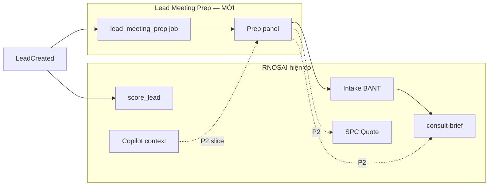
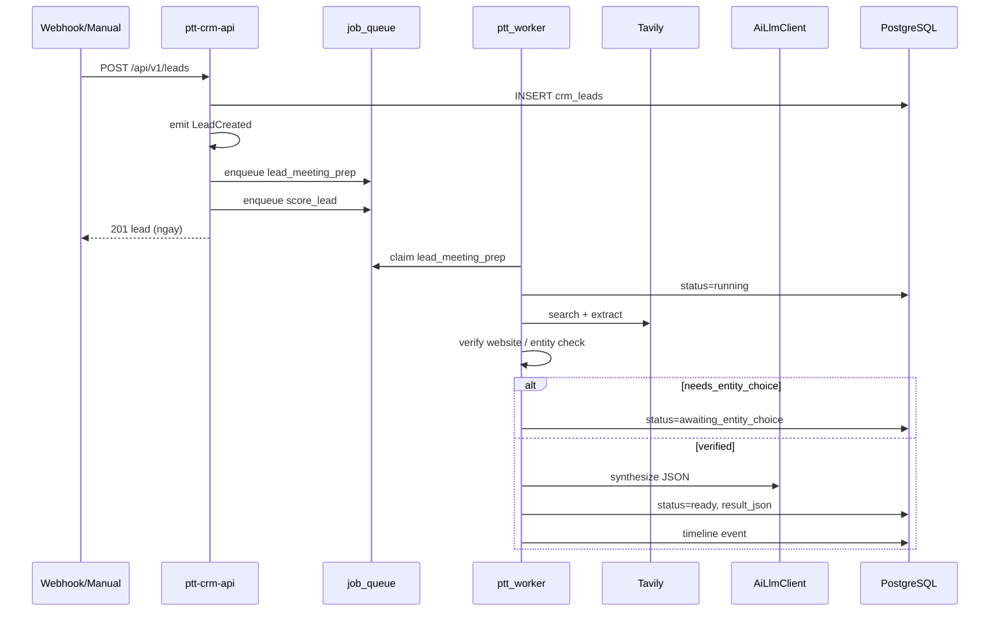
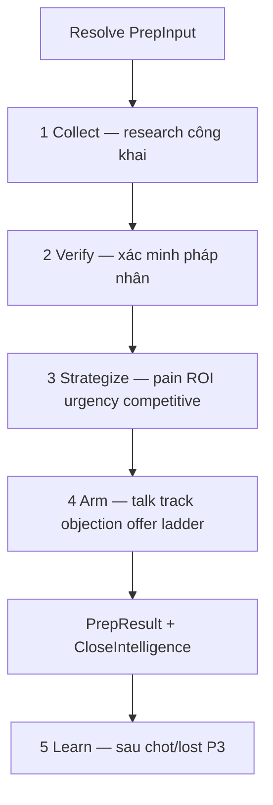
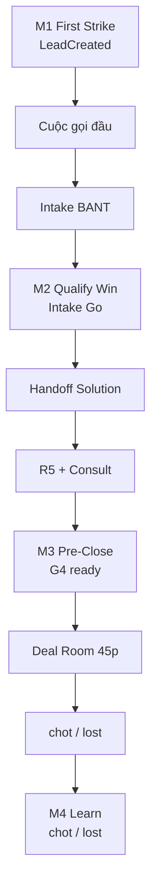

# Lead Meeting Prep — Sales Close Intelligence (Spec nội bộ RNOSAI)

> **Document ID:** LMP-SPEC-20260813  
> **Phiên bản:** 2.0 · **Ngày:** 2026-08-13  
> **Trạng thái:** Draft v2 — Sales Tiger tier · chờ Ban duyệt triển khai  
> **Use case:** AI-UC-021 · CRM-UC-002 · WIN-SCLOSE-F1 (Deal Room feed)  
> **Parent BA:** [`modules/RNOSAI-BA-AI-UseCases.md`](./modules/RNOSAI-BA-AI-UseCases.md) · [`modules/RNOSAI-BA-CRM-UseCases.md`](./modules/RNOSAI-BA-CRM-UseCases.md)  
> **Parent SOP:** [`16-sales-solution-chot-deal-sop.md`](../huong-dan-su-dung/16-sales-solution-chot-deal-sop.md) · [`2026-08-11-sales-close-sprint-s0-spec.md`](./2026-08-11-sales-close-sprint-s0-spec.md)  
> **Design system:** [`../SPEC_UI_UX_PTT.md`](../SPEC_UI_UX_PTT.md) · [`2026-08-07-rnosai-competitive-win-ui-ux-design.md`](./2026-08-07-rnosai-competitive-win-ui-ux-design.md)  
> **DDL:** [`2026-08-13-postgresql-ddl-lead-meeting-prep.sql`](./2026-08-13-postgresql-ddl-lead-meeting-prep.sql)  
> **Implementation plan:** [`2026-08-13-lead-meeting-prep-implementation-plan.md`](./2026-08-13-lead-meeting-prep-implementation-plan.md)  
> **Kickoff:** [`../runbooks/lmp-kickoff-meeting.md`](../runbooks/lmp-kickoff-meeting.md)  
> **Acceptance:** [`lead-meeting-prep-acceptance-checklist.md`](./lead-meeting-prep-acceptance-checklist.md)  
> **Backend anchor:** `services/ptt-crm-api/src/leads/` · `ptt_jobs/handlers/` · `services/ptt-crm-api/src/spc/` · `chot-closed-loop`  
> **App:** `services/ops-web` · **Sales Cockpit** trên `/crm/leads/[id]` + feed `/crm/leads/[id]/deal-room`

---

## Mục lục

1. [Tóm tắt & phạm vi](#1-tóm-tắt--phạm-vi)
2. [Nghiệp vụ & vị trí trong funnel](#2-nghiệp-vụ--vị-trí-trong-funnel)
3. [Personas & mục tiêu](#3-personas--mục-tiêu)
4. [Quyết định kiến trúc](#4-quyết-định-kiến-trúc)
5. [Pipeline xử lý (Collect → Verify → Synthesize)](#5-pipeline-xử-lý-collect--verify--synthesize)
6. [Ràng buộc pháp lý & dữ liệu](#6-ràng-buộc-pháp-lý--dữ-liệu)
7. [Input mapping từ CRM](#7-input-mapping-từ-crm)
8. [Output schema & lưu trữ](#8-output-schema--lưu-trữ)
9. [Catalog dịch vụ (SPC)](#9-catalog-dịch-vụ-spc)
10. [Trigger & job queue](#10-trigger--job-queue)
11. [API contracts](#11-api-contracts)
12. [DDL & entities](#12-ddl--entities)
13. [UI/UX — panel trên lead detail](#13-uiux--panel-trên-lead-detail)
14. [Tích hợp funnel hiện có](#14-tích-hợp-funnel-hiện-có)
15. [RBAC, feature flags & chi phí](#15-rbac-feature-flags--chi-phí)
16. [Observability & audit](#16-observability--audit)
17. [Lộ trình triển khai (P0–P3)](#17-lộ-trình-triển-khai-p0p3)
18. [Acceptance criteria (EC-LMP)](#18-acceptance-criteria-ec-lmp)
19. [Gate script & verification](#19-gate-script--verification)
20. [Phụ lục](#20-phụ-lục)
21. [Sales Close Intelligence — tầng Pro (v2)](#21-sales-close-intelligence--tầng-pro-v2)
22. [4 Moments of Truth — re-trigger theo funnel](#22-4-moments-of-truth--re-trigger-theo-funnel)
23. [Close Intelligence output schema](#23-close-intelligence-output-schema)
24. [Playbook RAG & win patterns](#24-playbook-rag--win-patterns)
25. [Deal Room & buổi chốt 45 phút](#25-deal-room--buổi-chốt-45-phút)
26. [Sales Cockpit UI — đẳng cấp Sales Tiger](#26-sales-cockpit-ui--đẳng-cấp-sales-tiger)
27. [KPI Sales Tiger & closed-loop học](#27-kpi-sales-tiger--closed-loop-học)

---

## 1. Tóm tắt & phạm vi

### 1.1. Mục tiêu sản phẩm

**Lead Meeting Prep (LMP)** — phiên bản 2 gọi là **Sales Close Intelligence (SCI)** — là **vũ khí native RNOSAI giúp Sales chốt khách tốt nhất**, không chỉ “đọc research trước cuộc gọi”.

**Pitch nội bộ (1 câu):**

> PTT không bán “AI research PDF” — PTT bán **Sales đã được vũ trang từ lead mới → buổi chốt 45 phút**: intel có nguồn, talk track SPIN/Challenger, thang 3 gói CB/TC/CS, objection playbook, và payload sẵn sàng cho Deal Room.

SCI chạy **4 lần trong vòng đời lead** (xem §22), mỗi lần nâng cấp độ sâu:

| Lớp | Tên | Giá trị Sales |
|---|---|---|
| **L0 — Intel** | Chân dung DN + social snapshot | Biết khách là ai trước khi gọi |
| **L1 — Strategy** | Pain-ROI + urgency + competitive angle | Biết **tại sao** khách cần mua **bây giờ** |
| **L2 — Arming** | Talk track + objection + 3-tier offer ladder | Biết **nói gì** và **chốt gói nào** |
| **L3 — Close** | Deal Room narrative + close ask + red flags | **Chốt trong buổi** trên 1 màn hình |

**Bối cảnh:** async job 1,5–4 phút (M1/M2); refresh nhanh ~30–60s khi đã có `collect_json` (M3 re-strategize only).

### 1.2. Phạm vi bản triển khai

| Có làm | Ghi chú |
|---|---|
| Job async sau `LeadCreated` | Song song `score_lead`, không block ingest |
| Research DN qua Tavily (P0) | Search + extract |
| Xác minh website đối chiếu SĐT/email (P0) | Fetch HTML thô, không dùng extract cho bước verify |
| Entity choice khi trùng tên pháp nhân (P0) | Human-in-the-loop trên lead detail |
| LLM synthesize qua `AiLlmClient` | OpenAI hiện có; có thể thêm provider sau |
| Catalog DV từ SPC DB | `spc_family` published, không hardcode file |
| Panel UI trên `/crm/leads/[id]` | Tab/panel "Chuẩn bị cuộc hẹn" |
| Lưu PostgreSQL + timeline event | Bảng `crm_lead_meeting_prep` |
| Audit qua `ai_agent_runs` | use_case `lead_meeting_prep` |
| Apify Facebook (P1) | Pages + Posts scraper |
| **Close Intelligence block (P1)** | Pain-ROI, urgency, offer ladder, talk track |
| Bridge Quote Builder (P2) | 3 gói CB/TC/CS prefill từ offer ladder |
| Merge consult-prefill (P2) | `external_research_summary` + `close_brief` |
| **Deal Room feed (P2)** | `deal_room_payload` trong Close Intelligence |
| **Playbook RAG (P2)** | Industry playbook + proof points PTT |
| **Win loop (P3)** | Học từ lead `chot` / `lost` — cải prompt |
| **Sales Cockpit UI (P1)** | Tab Intel / Talk Track / Offer / Objections |

### 1.3. Ngoài phạm vi

| Không làm | Lý do |
|---|---|
| Tích hợp repo `lead-analytics-handoff` | Tự triển khai native; chỉ tham chiếu nghiệp vụ |
| Research profile cá nhân liên hệ | Ràng buộc pháp lý §6 — `contactProfile.found` luôn `false` |
| Tra SĐT/email trên Facebook/LinkedIn | Vi phạm ToS / dữ liệu rò rỉ |
| Chạy sync khi tạo lead | Timeout webhook; UX kém |
| Upload Excel batch prep | Quy mô ~3–5 lead/ngày chưa cần |
| Xuất PDF prep report | Không phải giá trị cốt lõi P0 |
| Thay thế Intake BANT | LMP chạy **trước** intake, bổ sung context |
| Thay thế `score_lead` | Hai job độc lập: score = routing; prep = insight AM |

### 1.4. Quan hệ với module hiện có



---

## 2. Nghiệp vụ & vị trí trong funnel

### 2.1. Pain point

Lead vừa vào CRM thường chỉ có: tên liên hệ, SĐT, email, đôi khi tên công ty. AM phải tự Google trước cuộc gọi — mất 15–30 phút, không nhất quán, dễ nhầm công ty trùng tên.

### 2.2. Luồng nghiệp vụ mục tiêu

```
Lead vào hệ thống (webhook / manual / import)
        │
        ├─ ~30s: auto-assign + score_lead (giữ nguyên)
        │
        └─ ~2–4 ph: lead_meeting_prep (MỚI)
                │
                ▼
        AM mở /crm/leads/:id → tab **Sales Cockpit**
                │
                ├─ M1: Talk Track SPIN + offer sơ bộ
                ├─ (Nếu cần) chọn đúng pháp nhân trùng tên
                │
                ▼
        Gọi khách / hẹn lần đầu
                │
                ▼
        /crm/intake — BANT  →  SCI **M2** refresh (pain-ROI, red flags)
                │
                ▼
        Handoff Solution → R5 → G4  →  SCI **M3** (Deal Room payload)
                │
                ▼
        /crm/leads/:id/deal-room — buổi chốt 45 phút + quote 3 gói
                │
                ▼
        chot / lost  →  SCI **M4** win loop (P3)
```

### 2.3. Điều kiện enqueue tự động

Job **chỉ tự chạy** khi **tất cả** điều kiện sau đúng:

| # | Điều kiện | Ghi chú |
|---|---|---|
| E1 | `PTT_LEAD_MEETING_PREP_ENABLED=1` | Feature flag |
| E2 | Lead không phải duplicate (`is_duplicate = false`) | Tránh prep trùng |
| E3 | Có `company_name` resolved (≥ 2 ký tự) | Xem §7 |
| E4 | Có ít nhất `phone` hoặc `email` hợp lệ | Dùng cho verify website |
| E5 | `lead_flow_kind != 'spa_operational'` (mặc định) | Pilot B2B trước; spa có thể bật sau |
| E6 | Pilot gate pass (nếu `PTT_LMP_PILOT_ONLY=1`) | Theo `client_id` / industry |

Nếu thiếu E3: **skip auto**, hiện CTA "Chạy prep" trên UI sau khi AM bổ sung tên công ty.

---

## 3. Personas & mục tiêu

### 3.1. Personas

| Persona | Vai trò | Hành vi chính | Cap tối thiểu |
|---|---|---|---|
| **AM / Sales** | Gọi lead mới | Đọc prep trước cuộc gọi; chọn entity nếu trùng tên | `crm_leads.view`, `crm_lmp.view` |
| **Team Lead / GDKD** | Giám sát chất lượng | Xem prep + feedback 👍/👎 | `crm_lmp.view`, `crm_lmp.feedback` |
| **Admin IT** | Bật flag, theo dõi chi phí | `/admin/ai/runs`, env secrets | `admin.*` |

### 3.2. Mục tiêu đo được

| ID | Mục tiêu | Metric | Phase |
|---|---|---|---|
| LMP-G01 | Prep sẵn sàng trước cuộc gọi đầu | ≥80% lead đủ điều kiện có status `ready` trong 5 ph | P0 |
| LMP-G02 | AM không phải tự Google | UAT: AM xác nhận prep đủ context ≥70% ca | P0 |
| LMP-G03 | Không trộn pháp nhân trùng tên | 0 case fact từ DN sai trong UAT Khang Thịnh Land | P0 |
| LMP-G04 | Chi phí kiểm soát | ≤8 Tavily credits/lead trung bình | P0 |
| LMP-G05 | Bridge presales | ≥1 click "Mở quote" từ prep/lead (pilot n≥5) | P2 |
| **LMP-G06** | **First call → Intake Go rate** | +15% vs cohort không SCI (90 ngày) | P2 |
| **LMP-G07** | **Buổi chốt dùng Deal Room narrative** | ≥80% deal B2B có `deal_room_payload` applied | P2 |
| **LMP-G08** | **Quote 3 gói từ offer ladder** | 100% quote tạo từ SCI có CB+TC+CS | P2 |
| **LMP-G09** | **AM self-score talk track** | ≥70% 👍 trên talk_track feedback | P3 |

---

## 4. Quyết định kiến trúc

### 4.1. Quyết định

| Quyết định | Lý do |
|---|---|
| **Native module trong RNOSAI** | Một deploy, RBAC, audit, SPC catalog đồng bộ |
| **Job queue `lead_meeting_prep`** | Pattern giống `score_lead`; runtime 1,5–4 ph |
| **Worker Python xử lý job** | `ptt_worker` đã chạy `ingest_lead`, `score_lead`; HTTP calls Tavily/Apify |
| **Nest API read/write + enqueue** | `LeadsWriteService`, controller, guards |
| **Tách Collect / Verify / Strategize / Arm / Learn** | Research ≠ chiến lược ≠ vũ khí chốt ≠ học sau chốt |
| **Close readiness score riêng** | Không trùng `score_lead` (routing) — đo khả năng chốt |
| **Offer ladder 3 tier SPC** | CB/TC/CS psychology — anchor recommended ở giữa |
| **Không SSE public API P0** | Poll status qua GET; SSE optional P1 cho Cockpit |
| **Một prep row / lead** | UNIQUE `lead_id`; rerun ghi đè version |

### 4.2. Component map

```
services/ptt-crm-api/src/lead-meeting-prep/
  lead-meeting-prep.module.ts
  lead-meeting-prep.service.ts          # enqueue, read, entity select, manual run
  lead-meeting-prep.controller.ts
  lead-meeting-prep.repository.ts
  lead-meeting-prep.types.ts
  lead-meeting-prep-input.resolver.ts   # map lead → PrepInput
  lead-meeting-prep-enqueue.service.ts  # hook LeadCreated

ptt_jobs/handlers/lead_meeting_prep.py
  run_lead_meeting_prep_job()
  process_lead_meeting_prep_payload()

ptt_crm/lead_meeting_prep/            # Python brain (tách khỏi handler)
  collect.py                          # Tavily search/extract
  verify.py                           # fetch HTML, entity detection
  synthesize.py                       # build prompt, call Nest internal LLM or OpenAI direct
  spc_catalog.py                      # fetch published DV list
  schema.py                           # validate output JSON

services/ops-web/src/app/crm/leads/
  LeadMeetingPrepPanel.tsx
  LeadMeetingPrepEntityPicker.tsx
  lead-meeting-prep-api.ts
```

### 4.3. Luồng kỹ thuật



---

## 5. Pipeline xử lý (Collect → Verify → Strategize → Arm → Learn)

Pipeline v2 **5 bước** — bước 3–4 là điểm khác biệt “Sales Tiger” so với research tool thông thường.



### 5.1. Bước 0 — Resolve input

- Đọc lead từ PG (qua internal API hoặc direct read trong worker)
- Gọi `resolvePrepInput(leadId)` — xem §7
- Validate; nếu fail → `status=skipped`, `skip_reason`

### 5.2. Bước 1 — Collect (~60–90s)

**Công cụ:** Tavily API (`search`, `extract`)

**Chặng 1 — Tìm (song song):**

| Nhánh | Query | Skip khi |
|---|---|---|
| Website candidates | `"{company_name}" website chính thức` | Sales đã cung cấp `website_url` |
| Fanpage | `"{company_name}" facebook fanpage` | Sales đã cung cấp `social_urls` |
| Tin tức | `"{company_name}" báo chí` | Luôn chạy (optional P0) |

**Ràng buộc query:** **Không** đưa SĐT, email, tên cá nhân liên hệ vào query Tavily.

**Chặng 2 — Extract:**

- Gộp URL đã chọn sau verify → 1 call Tavily extract
- Mỗi document: `{ title, url, content, sourceType: 'search' | 'extract' }`

**Output bước 1:** `CollectResult` — lưu tạm `collect_json` trên row (debug/retry)

**Credit cap:** `MAX_TAVILY_CREDITS_PER_LEAD=8` (env). Vượt cap → dừng collect, ghi `partial=true`.

### 5.3. Bước 2 — Verify (~10–30s)

**Mục tiêu:** Xác minh website/fanpage thuộc đúng pháp nhân của lead.

**Website verify:**

```
Tavily search → tối đa 5 URL ứng viên
      ↓
fetch HTML thô (User-Agent browser, timeout 10s, max 2MB)
      ↓
Tìm SĐT/email khớp input lead (normalize phone/email)
      ↓
Gán confidence level
```

**Thang confidence:**

| Level | Điều kiện | Nhãn UI |
|---|---|---|
| `verified` | Trang chứa SĐT hoặc email khớp | Đã xác minh |
| `provided` | Sales/lead webhook cung cấp URL trực tiếp | Do AM cung cấp |
| `cross_verified` | Fanpage khai đúng website đã chọn | Xác minh chéo |
| `likely` | Domain khớp tên công ty (yếu) | Có khả năng — cần review |
| `unverified` | Không khớp | ⚠ Chưa xác minh |

**Entity choice (§5.3.1):**

Kích hoạt khi ≥2 ứng viên cùng tên công ty nhưng **mâu thuẫn danh tính** (SĐT/email/địa bàn khác).

**Ngoại lệ:** SĐT/email lead khớp đúng 1 ứng viên → auto-select, không hỏi.

**Sau khi chọn:** Loại mọi nguồn thuộc pháp nhân khác **bằng code** trước khi vào LLM.

#### 5.3.1. Trạng thái `awaiting_entity_choice`

Worker dừng; lưu `entity_candidates_json`. AM chọn qua API → enqueue job resume (cùng `lead_id`, payload `selected_entity_id`).

### 5.4. Bước 3 — Strategize (~30–45s)

**Mục tiêu Sales:** Trả lời 3 câu hỏi GDKD hay hỏi AM trước buổi chốt:

1. **Pain đủ lớn chưa?** — ước lượng ROI/pain VND (range, có basis)
2. **Tại sao mua bây giờ?** — urgency signals từ social/web (ads đang chạy, FB stale, seasonality…)
3. **PTT thắng ai?** — góc competitive vs tự làm / agency nhỏ (không bịa tên đối thủ cụ thể nếu không có nguồn)

**Input bổ sung (theo `prep_stage`):**

| Stage | Input thêm |
|---|---|
| M1 `first_strike` | Chỉ research + lead fields |
| M2 `qualify_win` | Intake BANT answers, decision, temperature |
| M3 `pre_close` | Consult brief, R5 snapshot, proposal draft tier |

**Output:** `close_intelligence` partial — `pain_roi_estimate`, `urgency_signals`, `competitive_angle`, `red_flags`, `close_readiness_score`

**Playbook RAG (P2):** inject industry playbook snippets làm `ptt_proof[]` — xem §24.

### 5.5. Bước 4 — Arm (~30–45s)

**Mục tiêu Sales:** AM mở Cockpit là **biết nói gì, chốt gói nào, xử lý objection nào**.

**Output:**

| Block | Nội dung |
|---|---|
| `talk_track` | SPIN 15 phút discovery HOặc Challenger reframe — chọn theo `lead_temperature` |
| `objection_playbook` | Top 5 objection ngành + rebuttal (catalog SPC risks_json làm seed) |
| `offer_ladder` | 3 SKU CB/TC/CS — `anchor_role`: entry / **recommended** / premium |
| `stakeholder_hints` | Gợi ý vai (CEO/CMO/Owner) — **không** research cá nhân |
| `deal_room_payload` | M3 only — opening narrative + slide bullets + close ask |
| `consulting_script` | Giữ từ v1 — opening + questions + objections cơ bản |

**Ràng buộc offer ladder:**

- Phải map `sku_code` thật từ `spc_offer` published
- `recommended` tier **luôn ở giữa** (price anchoring)
- Giá hint lấy từ `spc_quote_pricing` — không bịa số; thiếu pricing → `price_hint_vnd: null`

### 5.6. Bước 5 — Learn (P3, async sau `chot` / `lost`)

- Ghi `win_outcome_json`: AM feedback, deal_value, gói chốt, objection thực tế
- Feed `playbook_ab_metrics` + coach digest
- **Không** auto-retrain model P3 — chỉ prompt version + playbook ranking

### 5.7. Legacy alias — Synthesize

Trong code P0, bước 3+4 có thể gộp một LLM call (`synthesize`) — tách dần P1. Audit step log vẫn ghi `strategize` + `arm` riêng khi tách.

### 5.8. Apify Facebook (P1)

| Actor | Mục đích | Timeout |
|---|---|---|
| `apify/facebook-pages-scraper` | followers, category, ad_status | 300s sync |
| `apify/facebook-posts-scraper` | 10 bài gần nhất — metrics only | 300s sync |

- Whitelist fields; không giữ comment text / user names
- Tính derived metrics bằng code trước khi vào LLM
- Apify fail → prep vẫn `ready`, `social_channels[]` empty + note

---

## 6. Ràng buộc pháp lý & dữ liệu

### 6.1. Cấm vĩnh viễn

| Hành vi | Lý do |
|---|---|
| Tra SĐT/email → profile Facebook/LinkedIn cá nhân | ToS / dữ liệu rò rỉ |
| Research `"Tên người" + "Tên công ty"` | UAT: trả về người không liên quan, rủi ro fact sai |
| Đưa HTML thô verify vào prompt LLM | Chỉ dùng in-memory cho match SĐT/email |
| Scrape nội dung sau login | Vượt rào kỹ thuật |
| Auto-select entity khi mâu thuẫn danh tính | Trộn 2 pháp nhân — đã xảy ra thật |

### 6.2. Policy hiển thị

- Badge **Có nguồn** (`sourced`) vs **AI suy luận** (`inferred`) trên mọi fact UI
- Disclaimer: "Thông tin từ nguồn công khai — AM xác nhận trước khi trích dẫn với khách"

---

## 7. Input mapping từ CRM

### 7.1. PrepInput schema (canonical)

```typescript
interface LeadMeetingPrepInput {
  lead_id: number;
  full_name: string;
  phone: string;
  email: string;
  company_name: string;
  industry: string;
  marketing_budget: string;
  problem: string;
  website_url?: string;
  social_urls?: string;
  client_id?: string | null;
  channel?: string | null;
  source?: string | null;
}
```

### 7.2. Nguồn field trên lead

| PrepInput | Nguồn ưu tiên (cao → thấp) |
|---|---|
| `full_name` | `crm_leads.full_name` |
| `phone` | `crm_leads.phone` (normalized) |
| `email` | `crm_leads.email` (normalized) |
| `company_name` | ① `meta_json.company_name` ② `meta_json.company` ③ intake session mới nhất `company_name` ④ form webhook field `company` |
| `industry` | ① `meta_json.industry` ② `meta_json.industry_slug` → catalog label ③ intake discovery |
| `marketing_budget` | ① intake BANT answers ② `meta_json.budget` ③ `meta_json.form_data.budget` |
| `problem` | ① `meta_json.notes` ② intake `need` ③ lead task `form_data.need` |
| `website_url` | ① `meta_json.website_url` ② `meta_json.domain` ③ attribution landing URL domain |
| `social_urls` | ① `meta_json.social_urls` ② `meta_json.facebook_page_url` ③ Meta webhook `page_url` |

**Lưu snapshot:** Toàn bộ `PrepInput` resolved + `sources_map` (field → nguồn nào thắng) lưu vào `input_snapshot_json`.

### 7.3. Webhook Meta — mapping gợi ý

```json
{
  "company_name": "field_data.company_name || field_data.business_name",
  "website_url": "field_data.website",
  "social_urls": "ad_context.page_url"
}
```

Ghi vào `meta_json` tại bước `ingest_lead` nếu chưa có — **task riêng** có thể làm trước LMP P0.

---

## 8. Output schema & lưu trữ

### 8.1. PrepResult JSON (`result_json`)

```typescript
type FactType = 'sourced' | 'inferred';

type Fact =
  | { label: string; value: string; type: 'sourced'; source: string }
  | { label: string; value: string; type: 'inferred' };

interface EntityCandidate {
  id: string;
  url: string;
  label: string;
  phone?: string;
  region_hint?: string;
}

interface RecommendedService {
  dv_code: string;           // e.g. "DV02"
  name_vi: string;
  department: string;
  reason: string;
  priority: 1 | 2 | 3;
  sku_hint?: string | null;  // optional tier suggestion P2
}

interface ConsultingScript {
  opening: string;
  pain_points: string[];
  key_questions: string[];
  objection_handling: Array<{ objection: string; response: string }>;
}

interface SocialChannelSnapshot {
  platform: 'facebook' | 'other';
  url: string;
  followers?: number | null;
  posting_frequency?: string | null;
  ad_status?: string | null;
  note?: string | null;
}

interface LeadMeetingPrepResult {
  company_profile: {
    summary: string;
    facts: Fact[];
  };
  contact_profile: {
    found: false;
    summary: string;
    facts: [];
  };
  website?: {
    url: string;
    confidence: 'verified' | 'provided' | 'cross_verified' | 'likely' | 'unverified';
    note: string | null;
  };
  social_channels: SocialChannelSnapshot[];
  recommended_services: RecommendedService[];  // max 3
  consulting_script: ConsultingScript;
  /** v2 — Sales Close Intelligence (P1+) */
  close_intelligence?: CloseIntelligence;
  meta: {
    researched_at: string;       // ISO8601
    sources_count: number;
    model: string;
    prompt_version: string;      // e.g. "lmp-arm-v2"
    prep_stage: PrepStage;       // m1 | m2 | m3
    tavily_credits_used: number;
    apify_runs?: number;
    partial_collect?: boolean;
    close_readiness_score?: number;
  };
}

type PrepStage = 'm1_first_strike' | 'm2_qualify_win' | 'm3_pre_close';

/** Xem §23 — schema đầy đủ */
interface CloseIntelligence {
  close_readiness_score: number;
  urgency_signals: Array<{ signal: string; evidence: string; type: FactType }>;
  pain_roi_estimate: {
    pain_vnd_low: number | null;
    pain_vnd_high: number | null;
    basis: string;
    type: FactType;
  };
  competitive_angle: {
    vs_status_quo: string;
    vs_generic_agency: string;
    ptt_proof: string[];
    playbook_slug: string | null;
  };
  offer_ladder: OfferLadderItem[];
  talk_track: TalkTrack;
  objection_playbook: Array<{ objection_vi: string; rebuttal_vi: string; proof_source?: string }>;
  stakeholder_hints: Array<{ role_vi: string; likely_concern_vi: string; question_vi: string }>;
  red_flags: Array<{ flag_vi: string; severity: 'warn' | 'block'; mitigation_vi: string }>;
  deal_room_payload?: DealRoomPayload;
}

interface OfferLadderItem {
  tier: 'CB' | 'TC' | 'CS';
  dv_code: string;
  sku_code: string;
  label_vi: string;
  anchor_role: 'entry' | 'recommended' | 'premium';
  headline_vi: string;
  price_hint_vnd: number | null;
  reason_vi: string;
}

interface TalkTrack {
  framework: 'SPIN' | 'Challenger';
  total_minutes: number;
  phases: Array<{ phase_vi: string; script_vi: string; duration_min: number }>;
}

interface DealRoomPayload {
  opening_narrative_vi: string;
  slide_bullets_vi: string[];
  recommended_close_ask_vi: string;
  primary_dv_code: string;
  recommended_tier: 'CB' | 'TC' | 'CS';
}
```

### 8.2. Trạng thái row (`status`)

| Status | Ý nghĩa | UI |
|---|---|---|
| `pending` | Job queued | Spinner "Đang xếp hàng…" |
| `running` | Worker đang xử lý | Progress steps |
| `awaiting_entity_choice` | Cần AM chọn pháp nhân | Entity picker |
| `ready` | Hoàn tất | Hiển thị full result |
| `failed` | Lỗi sau max retry | Error + nút Retry |
| `skipped` | Không đủ input / pilot off | CTA bổ sung data / bật prep |
| `cancelled` | AM hủy manual | — |

### 8.3. Versioning

- `prep_version INT` — tăng mỗi lần rerun full
- `synth_version INT` — tăng mỗi lần rerun-synthesize only
- Giữ `previous_result_json` optional P2 cho diff UI

---

## 9. Catalog dịch vụ (SPC)

### 9.1. Nguồn catalog

Worker hoặc Nest **đọc trực tiếp** từ PostgreSQL:

```sql
SELECT dv_code, name_vi, department, description_vi, service_type
FROM spc_family
WHERE active = true
  AND readiness IN ('published', 'ga')
ORDER BY sort_order;
```

Fallback: internal API `GET /api/v1/spc/portfolio?published_only=1`.

### 9.2. Ràng buộc đề xuất

- LLM **chỉ được** output `dv_code` có trong snapshot catalog tại thời điểm chạy
- Post-validate bằng code: drop entry không hợp lệ; nếu `<1` valid → `failed` + `VALIDATION_ERROR`
- UI hiển thị link ` /crm/spc?family={dv_code}` (P2)

### 9.3. Không dùng

- File `config/services.ts` từ project handoff
- Catalog marketing cũ (`catalog_services`) làm nguồn chính — chỉ fallback nếu SPC trống

---

## 10. Trigger & job queue

### 10.1. Enqueue points

| Path | Hook | Idempotency key |
|---|---|---|
| Nest manual create | `LeadsWriteService.createLead()` sau `scoreAsync.enqueue` | `lead_meeting_prep:lead:{id}` |
| Worker ingest | `ingest_lead.py` post-create loop | cùng key |
| Domain event (optional) | Subscriber `LeadCreated` | cùng key |
| Manual | `POST .../meeting-prep/run` | `lead_meeting_prep:lead:{id}:manual:{ts}` hoặc reset row |

### 10.2. Job payload

```json
{
  "lead_id": 12345,
  "client_id": "uuid-or-null",
  "correlation_id": "from LeadCreated",
  "mode": "full",
  "prep_stage": "m1_first_strike",
  "selected_entity_id": null
}
```

| `prep_stage` | Trigger | Collect lại? |
|---|---|---|
| `m1_first_strike` | LeadCreated | Full |
| `m2_qualify_win` | Intake completed + decision=go | Reuse collect nếu <24h, else full |
| `m3_pre_close` | Proposal gate pass / manual trước Deal Room | Strategize+Arm only |

Resume entity: `"mode": "resume_entity", "selected_entity_id": "ent-2"`

### 10.3. Worker registration

```python
# ptt_worker/__main__.py
elif job_type == 'lead_meeting_prep':
    from ptt_jobs.handlers.lead_meeting_prep import run_lead_meeting_prep_job
    run_lead_meeting_prep_job(job)
```

### 10.4. Retry policy

| Param | Value |
|---|---|
| `max_attempts` | 3 |
| Backoff | 60s, 300s, 900s |
| Non-retry | `skipped`, `awaiting_entity_choice`, validation user error |

---

## 11. API contracts

Base: `/api/v1/leads/:id/meeting-prep`  
Auth: Staff JWT + guards (giống leads funnel)

### 11.1. GET `/api/v1/leads/:id/meeting-prep`

**Response 200:**

```json
{
  "ok": true,
  "lead_id": 12345,
  "status": "ready",
  "status_label_vi": "Sẵn sàng",
  "progress": {
    "step": "done",
    "steps_completed": ["collect", "verify", "strategize", "arm"],
    "message_vi": "Hoàn tất"
  },
  "prep_stage": "m1_first_strike",
  "close_readiness_score": 72,
  "input_snapshot": { "...": "..." },
  "entity_candidates": null,
  "result": { "...PrepResult..." },
  "error": null,
  "prep_version": 1,
  "updated_at": "2026-08-13T05:30:00Z"
}
```

**404:** lead không tồn tại  
**200 + status `skipped`:** chưa từng chạy hoặc không đủ input

### 11.2. POST `/api/v1/leads/:id/meeting-prep/run`

Body optional:

```json
{
  "force": false,
  "website_url": "https://...",
  "social_urls": "https://facebook.com/..."
}
```

- Merge override vào input snapshot rồi enqueue
- `force=true`: rerun dù đang `ready`

**Cap:** `crm_lmp.run`

### 11.3. POST `/api/v1/leads/:id/meeting-prep/select-entity`

```json
{ "entity_id": "ent-khangthinh-com" }
```

→ status `pending`, enqueue resume job

**Cap:** `crm_lmp.run`

### 11.4. POST `/api/v1/leads/:id/meeting-prep/rerun-synthesize`

Chỉ bước 3 — cần `collect_json` còn valid (<24h)

**Cap:** `crm_lmp.run`

### 11.5. POST `/api/v1/leads/:id/meeting-prep/feedback`

```json
{
  "helpful": true,
  "notes": "Đề xuất DV02 đúng",
  "service_dv_code": "DV02"
}
```

**Cap:** `crm_lmp.feedback`

### 11.7. POST `/api/v1/leads/:id/meeting-prep/apply-offer-ladder` (P2)

Tạo/cập nhật proposal draft 3 gói từ `close_intelligence.offer_ladder`.

**Precondition:** `status=ready`, `prep_stage` ∈ {m2, m3}, offer_ladder valid.

**Response:**

```json
{
  "ok": true,
  "proposal_id": 456,
  "href": "/crm/proposals/456/edit",
  "tiers_applied": ["CB", "TC", "CS"]
}
```

**Cap:** `crm_lmp.run` + `crm_proposals.write`

### 11.8. GET `/api/v1/leads/:id/meeting-prep/deal-room-slice` (P2)

Lightweight payload cho Deal Room embed — subset của full GET.

**Cap:** `crm_lmp.view`

### 11.6. Copilot context extension (P2)

`GET /api/v1/leads/:id/copilot/context` thêm:

```json
{
  "meeting_prep": {
    "status": "ready",
    "summary": "...",
    "top_dv_codes": ["DV02", "DV05"]
  }
}
```

---

## 12. DDL & entities

### 12.1. Bảng chính

Xem file DDL đầy đủ: [`2026-08-13-postgresql-ddl-lead-meeting-prep.sql`](./2026-08-13-postgresql-ddl-lead-meeting-prep.sql)

**Tóm tắt `crm_lead_meeting_prep`:**

| Column | Type | Mô tả |
|---|---|---|
| `id` | BIGSERIAL PK | |
| `lead_id` | BIGINT UNIQUE NOT NULL | FK → lead logical id |
| `status` | VARCHAR(32) | §8.2 |
| `skip_reason` | VARCHAR(64) | e.g. `missing_company_name` |
| `input_snapshot_json` | JSONB | PrepInput + sources_map |
| `collect_json` | JSONB | Raw collect (debug/re-synth) |
| `entity_candidates_json` | JSONB | Khi awaiting choice |
| `selected_entity_id` | VARCHAR(64) | |
| `result_json` | JSONB | PrepResult |
| `error_message` | TEXT | |
| `prep_version` | INT | default 1 |
| `synth_version` | INT | default 1 |
| `tavily_credits_used` | INT | default 0 |
| `prep_stage` | VARCHAR(32) | `m1_first_strike` default |
| `close_readiness_score` | INT | nullable 0–100 |
| `win_outcome_json` | JSONB | P3 — sau chot/lost |
| `ai_agent_run_id` | UUID | FK optional → ai_agent_runs |
| `created_at` / `updated_at` | TIMESTAMPTZ | |

**Bảng phụ `crm_lead_meeting_prep_feedback` (P1):**

| Column | Type |
|---|---|
| `id` | BIGSERIAL PK |
| `lead_id` | BIGINT |
| `prep_id` | BIGINT FK |
| `helpful` | BOOLEAN |
| `service_dv_code` | VARCHAR(8) |
| `notes` | TEXT |
| `actor_email` | VARCHAR(120) |
| `created_at` | TIMESTAMPTZ |

### 12.2. Timeline event

Type: `lead_meeting_prep_ready`  
Payload: `{ lead_id, dv_codes: [], prep_version }`

Copy: `"AI chuẩn bị cuộc hẹn sẵn sàng — đề xuất: {dv_names}"`

---

## 13. UI/UX — panel trên lead detail

### 13.1. Route & entry

| SCR | Vị trí | Mô tả |
|---|---|---|
| SCR-LMP-001 | `/crm/leads/[id]` tab `meeting-prep` | Panel chính |
| SCR-LMP-001 | Query `?prep=1` | Deep link sau tạo lead manual |
| SCR-LMP-002 | LeadFunnelPanel chip | Badge "Prep ready" / "Cần chọn DN" |

### 13.2. Layout panel (P0)

```
┌─────────────────────────────────────────────────────────┐
│ Chuẩn bị cuộc hẹn                    [Chạy lại] [?help] │
├─────────────────────────────────────────────────────────┤
│ ● Sẵn sàng · cập nhật 2 phút trước · 6 nguồn             │
├─────────────────────────────────────────────────────────┤
│ CHÂN DUNG DOANH NGHIỆP                                  │
│ Summary paragraph...                                    │
│ • Quy mô: ... [Có nguồn ↗]                              │
│ • Ngành: ... [AI suy luận]                              │
├─────────────────────────────────────────────────────────┤
│ KÊNH CÔNG KHAI (P1)                                     │
│ Facebook · 12.5k followers · đang chạy ads              │
├─────────────────────────────────────────────────────────┤
│ ĐỀ XUẤT DỊCH VỤ (tối đa 3)                              │
│ 1. DV02 — ... — Lý do...                                │
│ 2. DV05 — ...                                           │
├─────────────────────────────────────────────────────────┤
│ KỊCH BẢN MỞ ĐẦU                                         │
│ Opening · Câu hỏi · Objection                           │
├─────────────────────────────────────────────────────────┤
│ Website: khangthinhland.com [Đã xác minh]               │
│ 👍 Hữu ích   👎 Không hữu ích                            │
└─────────────────────────────────────────────────────────┘
```

### 13.3. Trạng thái UI

| Status | UI |
|---|---|
| `pending` / `running` | Stepper: Thu thập → Xác minh → Phân tích |
| `awaiting_entity_choice` | `LeadMeetingPrepEntityPicker` — radio list candidates |
| `skipped` | Banner + form bổ sung `company_name`, `website_url` + nút Chạy prep |
| `failed` | Error card + Retry |
| `ready` | Full panel §13.2 |

### 13.4. UX principles

1. **Không block** form tạo lead — prep chạy nền
2. **Poll 5s** khi `running` (không SSE bắt buộc P0)
3. **Cap-first** — ẩn nút Run nếu thiếu `crm_lmp.run`
4. **Vietnamese-first** — badge nguồn/suy luận rõ ràng
5. **Mobile read-only** — panel collapse; entity pick usable trên mobile

### 13.5. File checklist (ops-web)

| File | Mục đích |
|---|---|
| `LeadMeetingPrepPanel.tsx` | Panel chính |
| `LeadMeetingPrepEntityPicker.tsx` | Entity choice |
| `LeadMeetingPrepProgress.tsx` | Stepper |
| `lib/lead-meeting-prep-api.ts` | API client |
| `CrmLeadDetailPage` — thêm tab | Wire tab |

---

## 14. Tích hợp funnel hiện có

### 14.1. vs `score_lead`

| | score_lead | lead_meeting_prep |
|---|---|---|
| Mục đích | Chấm điểm routing nội bộ | Insight cho AM |
| Thời gian | vài giây | 1,5–4 phút |
| Input | Rules + lead fields | Web research + SPC |
| Output | `score`, tier | PrepResult JSON |
| Phụ thuộc | Không phụ thuộc LMP | Không phụ thuộc score |

Chạy **song song** sau LeadCreated.

### 14.2. vs Intake BANT

- LMP **trước** intake — không thay discovery form
- Intake UI (P2): sidebar card "Tóm tắt prep" link sang tab prep
- Không auto-fill BANT answers từ prep (tránh bias) — chỉ hiển thị read-only context

### 14.3. vs consult-brief / consult-prefill (P2)

`buildPresalesConsultBrief` bổ sung:

```typescript
external_research_summary: result.company_profile.summary,
external_research_sources: result.meta.sources_count,
recommended_dv_codes: result.recommended_services.map(s => s.dv_code),
```

`presales-consult-prefill` map `recommended_dv_codes` → gợi ý task form field `service_interest`.

### 14.4. Quote Builder bridge (P2)

Nút **"Tạo quote draft"** trên mỗi `RecommendedService`:

→ navigate `/crm/spc/quote?lead_id={id}&dv_code={dv_code}&source=meeting_prep`

---

## 15. RBAC, feature flags & chi phí

### 15.1. Permissions mới

| Cap | Mô tả |
|---|---|
| `crm_lmp.view` | Xem panel + result |
| `crm_lmp.run` | Chạy/retry/select entity |
| `crm_lmp.feedback` | Gửi 👍/👎 |

Seed vào `staff_section_permissions` — script `seed_staff_lmp_permissions.py` (P0).

### 15.2. Environment variables

| Env | Default | Mô tả |
|---|---|---|
| `PTT_LEAD_MEETING_PREP_ENABLED` | `0` | Master switch |
| `PTT_LMP_PILOT_ONLY` | `1` | Giới hạn client pilot |
| `PTT_LMP_PILOT_CLIENT_IDS` | `` | CSV UUID |
| `TAVILY_API_KEY` | — | Bắt buộc P0 |
| `MAX_TAVILY_CREDITS_PER_LEAD` | `8` | Cap |
| `LMP_COLLECT_CACHE_TTL_HOURS` | `168` | Cache domain P2 |
| `APIFY_API_TOKEN` | — | P1 |
| `PTT_LMP_LLM_MODEL` | `$OPENAI_MODEL` | Override model |
| `PTT_LMP_PROMPT_VERSION` | `lmp-synth-v1` | Audit |

### 15.3. Chi phí ước tính (3–5 lead/ngày)

| Thành phần | Ước tính/lead |
|---|---|
| Tavily | ~6–8 credits (~$0.03–0.05) |
| OpenAI gpt-4o-mini synthesize | ~$0.01–0.02 |
| Apify (P1) | ~$0.01–0.02 |
| **Tổng** | **~$0.05–0.10/lead** |

---

## 16. Observability & audit

### 16.1. AI audit

Mỗi lần synthesize ghi `ai_agent_runs`:

| Field | Value |
|---|---|
| `use_case` | `lead_meeting_prep` |
| `agent_name` | `lead-meeting-prep` |
| `client_id` | từ lead |
| `input_json` | redacted PrepInput |
| `output_json` | PrepResult hoặc error |
| `parent_run_id` | optional link orchestration P2 |

Thêm vào `AI_USE_CASE` constant: `LEAD_MEETING_PREP: 'lead_meeting_prep'`

### 16.2. Admin

- `/admin/ai/runs?use_case=lead_meeting_prep`
- Metric dashboard (P2): prep success rate, avg latency, credits/day

### 16.3. Logging

Structured log fields: `lead_id`, `prep_id`, `step`, `tavily_credits`, `duration_ms`, `status`

---

## 17. Lộ trình triển khai (P0–P4)

| Phase | Sprint | Deliverable | Exit gate |
|---|---|---|---|
| **P0** | S-LMP-1 | DDL + enqueue + worker collect/verify/synth MVP + GET API | `lead_meeting_prep_gate.sh` PASS |
| **P0** | S-LMP-2 | Panel cơ bản + entity picker + timeline | UAT AM đọc script trước gọi |
| **P1** | S-LMP-3 | Apify FB + **Strategize+Arm tách** + **Sales Cockpit** | Close Intelligence trên 2 lead thật |
| **P2** | S-LMP-4 | Offer ladder → Quote 3 gói + **Deal Room feed** + playbook RAG | Deal Room narrative 1-click |
| **P3** | S-LMP-5 | M2/M3 re-trigger + consult merge + copilot slice | Intake Go → Deal Room ≤45 ph prep |
| **P4** | S-LMP-6 | Win loop + coach digest + GA all B2B | LMP-G06–G09 đạt target 90 ngày |

### 17.1. Task breakdown P0

| ID | Task | Owner |
|---|---|---|
| LMP-01 | Apply DDL | Backend |
| LMP-02 | `LeadMeetingPrepEnqueueService` hook createLead + ingest | Backend |
| LMP-03 | `ptt_jobs/handlers/lead_meeting_prep.py` | Worker |
| LMP-04 | `ptt_crm/lead_meeting_prep/*` brain | Worker |
| LMP-05 | Nest controller + repository | Backend |
| LMP-06 | `AI_USE_CASE.lead_meeting_prep` audit | Backend |
| LMP-07 | ops-web panel | Frontend |
| LMP-08 | RBAC seed caps | Ops |
| LMP-09 | `scripts/lead_meeting_prep_gate.sh` | QA |

---

## 18. Acceptance criteria (EC-LMP)

| ID | Given | When | Then |
|---|---|---|---|
| EC-LMP-01 | Lead B2B có company+phone, flag on | LeadCreated | Job enqueued; within 5 min status=`ready` |
| EC-LMP-02 | Lead thiếu company_name | LeadCreated | status=`skipped`; UI show CTA |
| EC-LMP-03 | 2 entity Khang Thịnh Land | Collect xong | status=`awaiting_entity_choice`; không có result_json |
| EC-LMP-04 | AM chọn entity đúng | POST select-entity | Resume → ready; facts chỉ từ 1 pháp nhân |
| EC-LMP-05 | Prep ready | AM mở panel | company_profile + ≤3 DV + script hiển thị |
| EC-LMP-06 | Mọi fact sourced | Render UI | Badge "Có nguồn" + link |
| EC-LMP-07 | contact_profile | Any | `found=false` always |
| EC-LMP-08 | Tavily key missing | Job run | status=`failed`; error_code=`LLM_PROVIDER_ERROR` or config error |
| EC-LMP-09 | Duplicate lead | LeadCreated | No enqueue |
| EC-LMP-10 | Manual POST run | force=false | Idempotent if already running |
| EC-LMP-11 | ai_agent_runs | Synth success | Row with use_case=`lead_meeting_prep` |
| EC-LMP-12 | Timeline | ready | Event `lead_meeting_prep_ready` visible |
| **EC-LMP-13** | M1 ready | AM mở Cockpit | `close_intelligence.talk_track` ≥3 phases |
| **EC-LMP-14** | M1 ready | Render offer | `offer_ladder.length === 3` với CB+TC+CS |
| **EC-LMP-15** | Intake Go | M2 job | `prep_stage=m2_qualify_win`; score cập nhật |
| **EC-LMP-16** | G4 pass | M3 job | `deal_room_payload` non-empty |
| **EC-LMP-17** | Deal Room open | GET snapshot | `sci_narrative` từ prep applied |
| **EC-LMP-18** | Quote từ SCI | Create quote | 3 tier lines prefilled từ offer_ladder |
| **EC-LMP-19** | status=chot | Win loop P3 | `win_outcome_json` persisted |

---

## 19. Gate script & verification

**Script:** `scripts/lead_meeting_prep_gate.sh`

**Flow:**

1. Check env `PTT_LEAD_MEETING_PREP_ENABLED=1`, `TAVILY_API_KEY` set
2. Apply DDL if missing
3. POST staging lead (company_name + phone known UAT fixture)
4. Poll GET meeting-prep ≤360s
5. Assert status=`ready`
6. Assert `recommended_services.length` between 1 and 3
7. Assert all `dv_code` exist in `spc_family`
8. Assert `contact_profile.found === false`
9. Assert ai_agent_runs row exists

**Staging fixture:** reuse lead pattern từ intake UAT — company `"Công ty TNHH Demo LMP Staging"`.

---

## 21. Sales Close Intelligence — tầng Pro (v2)

### 21.1. Triết lý “Sales Tiger”

Research tool trả lời **“công ty này là ai?”**. SCI trả lời **“làm sao chốt được deal này?”**:

| Câu hỏi AM | SCI block trả lời |
|---|---|
| Gọi lần đầu nói gì? | `talk_track` + `consulting_script.opening` |
| Pain có đủ lớn không? | `pain_roi_estimate` |
| Khách có vội không? | `urgency_signals` |
| PTT khác agency kia thế nào? | `competitive_angle` + `ptt_proof` |
| Báo giá 3 gói thế nào? | `offer_ladder` CB/TC/CS |
| Khách chê đắt / chưa cần? | `objection_playbook` |
| Buổi chốt mở đầu thế nào? | `deal_room_payload` |
| Có nên đẩy proposal không? | `close_readiness_score` + `red_flags` |

### 21.2. Close readiness score (0–100)

**Tách biệt** `score_lead` (routing nội bộ). Công thức gợi ý (rules + LLM adjust ±10):

| Thành phần | Trọng số | Nguồn |
|---|---|---|
| Website/social verified | 20 | verify step |
| Pain rõ + budget hint | 25 | intake / notes |
| Urgency signal ≥1 | 15 | social ads, stale content |
| BANT Go (M2+) | 20 | intake decision |
| Red flag `block` | −30 | competitor locked, no budget |
| Entity unverified | −15 | confidence < verified |

UI: gauge màu **Đỏ <40 · Vàng 40–69 · Xanh ≥70** + tooltip breakdown (không black box).

### 21.3. Framework talk track

| Framework | Khi dùng | Cấu trúc |
|---|---|---|
| **SPIN** | M1 discovery, lead cold/warm | Situation → Problem → Implication → Need-payoff (~15 phút) |
| **Challenger** | M2/M3, lead hot, đã có agency | Teach → Tail → Take control (~12 phút) |

Chọn framework bằng code từ `lead_temperature` + `prep_stage` — LLM chỉ viết script theo khung.

---

## 22. 4 Moments of Truth — re-trigger theo funnel



| Moment | Trigger event | Job mode | Output focus |
|---|---|---|---|
| **M1** | `LeadCreated` | `full` | Intel + SPIN talk track + offer sơ bộ |
| **M2** | `IntakeCompleted` + `decision=go` | `refresh` hoặc `strategize_arm` | Pain-ROI từ BANT + urgency + red flags |
| **M3** | `ProposalGatePass` hoặc manual “Chuẩn bị chốt” | `strategize_arm` | Deal Room payload + Challenger + 3 gói final |
| **M4** | `LeadStatus → chot \| lost` | `learn` | Win/loss pattern — không block UX |

**Enqueue M2:** subscribe `DomainEvent` intake completed (Nest intake service).  
**Enqueue M3:** hook `getPresalesProposalGate` khi gate level = `ok`.

---

## 23. Close Intelligence output schema

Schema đầy đủ nằm trong §8.1 `CloseIntelligence`. Quy tắc validation bổ sung:

| Field | Rule |
|---|---|
| `close_readiness_score` | 0–100 integer |
| `offer_ladder` | length=3; tiers CB+TC+CS unique; exactly one `recommended` |
| `offer_ladder[].sku_code` | MUST exist in `spc_offer` published |
| `pain_roi_estimate.pain_vnd_*` | null allowed if insufficient data — không bịa số |
| `deal_room_payload` | Required non-empty only when `prep_stage=m3_pre_close` |
| `objection_playbook` | 3–7 items; rebuttal ≤400 chars each |
| `red_flags[].severity=block` | UI block nút “Tạo proposal” nếu chưa GDKD override |

Post-validate fail → `status=failed`, `error_code=VALIDATION_ERROR`, giữ `collect_json` để retry arm only.

---

## 24. Playbook RAG & win patterns

### 24.1. Nguồn playbook

Tái sử dụng infra **Playbooks** + pattern **Marketing AI Playbook**:

```
GET internal playbooks by industry_slug
→ inject top-k chunks vào Strategize prompt
→ output competitive_angle.ptt_proof[] + playbook_slug
```

Governance banner (nếu bật): hiển thị playbook áp dụng trên Cockpit.

### 24.2. Win patterns (P3)

Aggregate anonymized từ `win_outcome_json`:

| Pattern | Ví dụ |
|---|---|
| Industry × DV chốt nhiều | Spa → DV04 + DV02 |
| Objection thắng | “Đắt quá” → ROI 90 ngày script X |
| Tier chốt | TC 62% / CB 28% / CS 10% |

Dùng để **rank** `offer_ladder.recommended` — không auto-apply without AM confirm.

### 24.3. Closed-loop integration

- `ChotClosedLoopService` — khi `chot`, copy `call_script_source=sci` nếu AM dùng talk track
- QA flag mới `no_sci_before_chot` (P3 optional) — cảnh báo không block

---

## 25. Deal Room & buổi chốt 45 phút

Tích hợp trực tiếp [`2026-08-11-sales-close-sprint-s0-spec.md`](./2026-08-11-sales-close-sprint-s0-spec.md) **F1 Deal Room**.

### 25.1. Feed Deal Room snapshot

`GET /api/v1/leads/:id/deal-room` bổ sung slice:

```typescript
sci: {
  available: boolean;
  prep_stage: PrepStage;
  close_readiness_score: number;
  opening_narrative_vi: string;      // từ deal_room_payload
  slide_bullets_vi: string[];
  recommended_close_ask_vi: string;
  offer_ladder_summary: OfferLadderItem[];
  red_flags: CloseIntelligence['red_flags'];
  href_prep: string;                 // /crm/leads/:id?tab=meeting-prep
}
```

### 25.2. Luồng buổi chốt 45 phút (target)

| Phút | AM/Solution làm | SCI hỗ trợ |
|---|---|---|
| 0–5 | Mở Deal Room, screen-share | Opening narrative copy 1-click |
| 5–15 | Recap pain + urgency | Slide bullets + pain ROI |
| 15–30 | Trình bày L1 R5 (Solution) | SCI không thay R5 — chỉ intro bridge |
| 30–40 | Trình bày 3 gói | Offer ladder CB/TC/CS visual |
| 40–45 | Close ask + objection | Objection playbook sidebar |

**KPI S-Close:** thời gian chuẩn bị buổi chốt **≤45 phút** (từ 75 phút) — SCI đóng gap prep.

### 25.3. Quote 3 gói 1-click

Nút **“Tạo báo giá 3 gói từ SCI”** trên Deal Room:

```
POST /api/v1/leads/:id/meeting-prep/apply-offer-ladder
→ creates/updates proposal draft with 3 line groups from offer_ladder
→ redirect /crm/proposals/:id/edit
```

Map `sku_code` → quote lines qua SPC pricing sync (S6e catalog).

---

## 26. Sales Cockpit UI — đẳng cấp Sales Tiger

### 26.1. Rebrand tab

Tab **“Chuẩn bị cuộc hẹn”** → **“Sales Cockpit”** (icon: target/crosshair).  
Sub-title động theo `prep_stage`:

| Stage | Sub-title |
|---|---|
| M1 | “Vũ khí cuộc gọi đầu” |
| M2 | “Brief sau BANT — đẩy handoff” |
| M3 | “Sẵn sàng chốt — Deal Room” |

### 26.2. Layout 5 tab nội bộ

```
┌──────────────────────────────────────────────────────────────────┐
│ Sales Cockpit          Close readiness: 72 ████████░░  [Chạy lại] │
│ M1 · Vũ khí cuộc gọi đầu                                         │
├────────┬────────┬────────┬────────┬──────────────────────────────┤
│ Intel  │ Talk   │ Offer  │ Object │ Deal Ready (M3)              │
│        │ Track  │ Ladder │ ions   │                              │
├────────┴────────┴────────┴────────┴──────────────────────────────┤
│ [Gauge] [Urgency chips] [Red flags]                               │
│ ... content per tab ...                                           │
│ [📋 Copy script] [📋 Copy close ask] [→ Deal Room] [→ Quote 3 gói]│
└──────────────────────────────────────────────────────────────────┘
```

### 26.3. Premium UX patterns

| Pattern | Mô tả |
|---|---|
| **Copy blocks** | Mỗi script section có nút copy + toast “Đã copy — paste vào Zalo/call notes” |
| **Timer mode** | Talk Track tab: 15:00 countdown SPIN phases |
| **Source badges** | Giữ v1 — mọi fact có Có nguồn / AI suy luận |
| **Offer visual** | 3 cột CB / **TC** / CS — TC highlighted recommended |
| **Objection cards** | Flip card: objection front / rebuttal back |
| **Deal Ready tab** | Chỉ M3; embed preview Deal Room narrative |
| **Post-call debrief** | Modal 3 câu sau log call — feeds M4 learn (P3) |

### 26.4. Mobile

- Read-only Cockpit trên mobile — copy script vẫn hoạt động
- Entity picker + debrief usable mobile
- Offer ladder / Deal Room → desktop recommended

---

## 27. KPI Sales Tiger & closed-loop học

### 27.1. KPI dashboard (P3)

Route: `/crm/ai/insights?tab=sci` hoặc widget trên staff-kpi

| Metric | Công thức |
|---|---|
| SCI coverage | % lead B2B có ≥1 prep ready |
| M1→Intake Go | conversion cohort with/without SCI |
| Avg close readiness @ M2 | mean score when intake go |
| Talk track 👍 rate | feedback helpful / total |
| Deal Room SCI usage | % chot có `sci` slice applied |
| Tier mix | CB/TC/CS từ win_outcome |
| Time to chot | lead created → chot median |

### 27.2. Coach digest hook

Weekly manager digest bổ sung:

- Top 3 objection chưa có rebuttal hiệu quả (👎 cao)
- AM có close readiness cao nhưng lost — flag coaching
- DV đề xuất SCI vs DV chốt thực tế — calibration

### 27.3. Không làm (guardrail)

- **Không** auto-gửi script cho khách (BR-AI-01)
- **Không** auto-advance funnel stage từ SCI
- **Không** thay GDKD approve discount / override red flag `block`

---

## 20. Phụ lục

### 20.1. Tham chiếu nghiệp vụ (không copy code)

Project handoff `lead-analytics-handoff` dùng làm **reference nghiệp vụ** cho:

- Pipeline Collect → Verify → Synthesize
- Thang confidence website
- Entity choice UX
- Ràng buộc pháp lý §6

**Không** import code hay deploy service handoff.

### 20.2. Orchestrator plan (P2 optional)

```typescript
export const LEAD_ONBOARD_PLAN = {
  key: 'lead_onboard_v1',
  steps: [
    { key: 'score_lead', required: true },
    { key: 'lead_meeting_prep', required: false },
    { key: 'route_rep', required: false, when: (ctx) => (ctx.leadScore ?? 0) >= 40 },
  ],
} as const;
```

Gom vào orchestrator khi cần trace tree trên `/admin/ai/runs` — không bắt buộc P0.

### 20.3. Change log

| Version | Date | Author | Changes |
|---|---|---|---|
| 1.0 | 2026-08-13 | Ban RNOSAI | Initial spec — native LMP module |
| **2.0** | **2026-08-13** | **Ban RNOSAI** | **Sales Close Intelligence — 5-step pipeline, 4 Moments, Cockpit UI, Deal Room feed, offer ladder, KPI Tiger** |

---

*End of spec v2 — duyệt bởi Ban + Trưởng Sales + GDKD trước khi mở S-LMP-1.*
